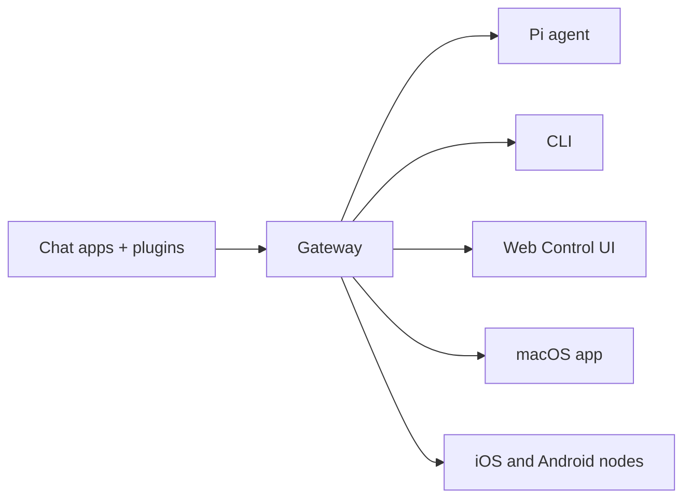
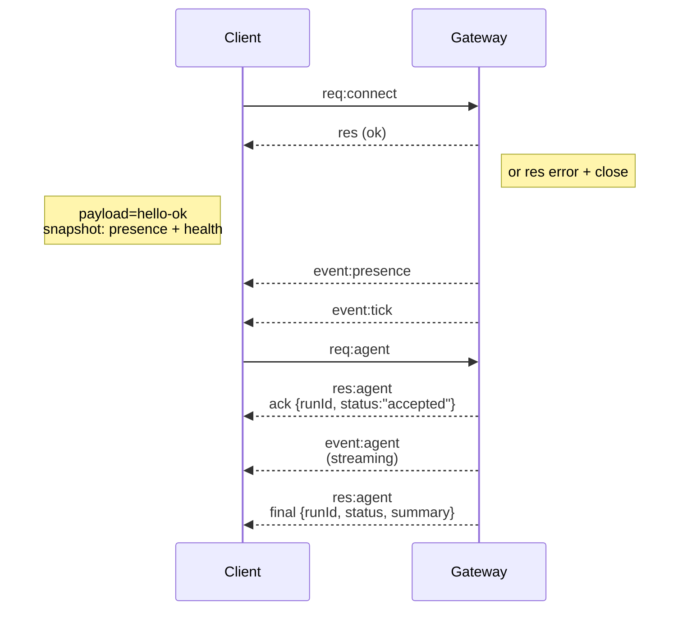

# OpenClaw Documentation - Combined Reference

Generated: 2026-03-07 17:09:22

---

## Table of Contents

1. [Overview](#overview)
2. [Core Concepts](#core-concepts)
3. [Gateway](#gateway)
4. [CLI Reference](#cli-reference)
5. [Channels](#channels)
6. [Nodes](#nodes)
7. [Automation](#automation)
8. [Installation](#installation)

---

## Overview

---
summary: "OpenClaw is a multi-channel gateway for AI agents that runs on any OS."
read_when:
  - Introducing OpenClaw to newcomers
title: "OpenClaw"
---

# OpenClaw 🦞

<p align="center">
    
    
</p>

> _"EXFOLIATE! EXFOLIATE!"_ — A space lobster, probably

<p align="center">
  <strong>Any OS gateway for AI agents across WhatsApp, Telegram, Discord, iMessage, and more.</strong><br />
  Send a message, get an agent response from your pocket. Plugins add Mattermost and more.
</p>

<Columns>
  <Card title="Get Started" href="/start/getting-started" icon="rocket">
    Install OpenClaw and bring up the Gateway in minutes.
  </Card>
  <Card title="Run the Wizard" href="/start/wizard" icon="sparkles">
    Guided setup with `openclaw onboard` and pairing flows.
  </Card>
  <Card title="Open the Control UI" href="/web/control-ui" icon="layout-dashboard">
    Launch the browser dashboard for chat, config, and sessions.
  </Card>
</Columns>

## What is OpenClaw?

OpenClaw is a **self-hosted gateway** that connects your favorite chat apps — WhatsApp, Telegram, Discord, iMessage, and more — to AI coding agents like Pi. You run a single Gateway process on your own machine (or a server), and it becomes the bridge between your messaging apps and an always-available AI assistant.

**Who is it for?** Developers and power users who want a personal AI assistant they can message from anywhere — without giving up control of their data or relying on a hosted service.

**What makes it different?**

- **Self-hosted**: runs on your hardware, your rules
- **Multi-channel**: one Gateway serves WhatsApp, Telegram, Discord, and more simultaneously
- **Agent-native**: built for coding agents with tool use, sessions, memory, and multi-agent routing
- **Open source**: MIT licensed, community-driven

**What do you need?** Node 22+, an API key from your chosen provider, and 5 minutes. For best quality and security, use the strongest latest-generation model available.

## How it works



The Gateway is the single source of truth for sessions, routing, and channel connections.

## Key capabilities

<Columns>
  <Card title="Multi-channel gateway" icon="network">
    WhatsApp, Telegram, Discord, and iMessage with a single Gateway process.
  </Card>
  <Card title="Plugin channels" icon="plug">
    Add Mattermost and more with extension packages.
  </Card>
  <Card title="Multi-agent routing" icon="route">
    Isolated sessions per agent, workspace, or sender.
  </Card>
  <Card title="Media support" icon="image">
    Send and receive images, audio, and documents.
  </Card>
  <Card title="Web Control UI" icon="monitor">
    Browser dashboard for chat, config, sessions, and nodes.
  </Card>
  <Card title="Mobile nodes" icon="smartphone">
    Pair iOS and Android nodes for Canvas, camera/screen, and voice-enabled workflows.
  </Card>
</Columns>

## Quick start

<Steps>
  <Step title="Install OpenClaw">
    ```bash
    npm install -g openclaw@latest
    ```
  </Step>
  <Step title="Onboard and install the service">
    ```bash
    openclaw onboard --install-daemon
    ```
  </Step>
  <Step title="Pair WhatsApp and start the Gateway">
    ```bash
    openclaw channels login
    openclaw gateway --port 18789
    ```
  </Step>
</Steps>

Need the full install and dev setup? See [Quick start](/start/quickstart).

## Dashboard

Open the browser Control UI after the Gateway starts.

- Local default: [http://127.0.0.1:18789/](http://127.0.0.1:18789/)
- Remote access: [Web surfaces](/web) and [Tailscale](/gateway/tailscale)

<p align="center">
  
</p>

## Configuration (optional)

Config lives at `~/.openclaw/openclaw.json`.

- If you **do nothing**, OpenClaw uses the bundled Pi binary in RPC mode with per-sender sessions.
- If you want to lock it down, start with `channels.whatsapp.allowFrom` and (for groups) mention rules.

Example:

```json5
{
  channels: {
    whatsapp: {
      allowFrom: ["+15555550123"],
      groups: { "*": { requireMention: true } },
    },
  },
  messages: { groupChat: { mentionPatterns: ["@openclaw"] } },
}
```

## Start here

<Columns>
  <Card title="Docs hubs" href="/start/hubs" icon="book-open">
    All docs and guides, organized by use case.
  </Card>
  <Card title="Configuration" href="/gateway/configuration" icon="settings">
    Core Gateway settings, tokens, and provider config.
  </Card>
  <Card title="Remote access" href="/gateway/remote" icon="globe">
    SSH and tailnet access patterns.
  </Card>
  <Card title="Channels" href="/channels/telegram" icon="message-square">
    Channel-specific setup for WhatsApp, Telegram, Discord, and more.
  </Card>
  <Card title="Nodes" href="/nodes" icon="smartphone">
    iOS and Android nodes with pairing, Canvas, camera/screen, and device actions.
  </Card>
  <Card title="Help" href="/help" icon="life-buoy">
    Common fixes and troubleshooting entry point.
  </Card>
</Columns>

## Learn more

<Columns>
  <Card title="Full feature list" href="/concepts/features" icon="list">
    Complete channel, routing, and media capabilities.
  </Card>
  <Card title="Multi-agent routing" href="/concepts/multi-agent" icon="route">
    Workspace isolation and per-agent sessions.
  </Card>
  <Card title="Security" href="/gateway/security" icon="shield">
    Tokens, allowlists, and safety controls.
  </Card>
  <Card title="Troubleshooting" href="/gateway/troubleshooting" icon="wrench">
    Gateway diagnostics and common errors.
  </Card>
  <Card title="About and credits" href="/reference/credits" icon="info">
    Project origins, contributors, and license.
  </Card>
</Columns>

---

## Core Concepts

### Agent Loop

---
summary: "Agent loop lifecycle, streams, and wait semantics"
read_when:
  - You need an exact walkthrough of the agent loop or lifecycle events
title: "Agent Loop"
---

# Agent Loop (OpenClaw)

An agentic loop is the full “real” run of an agent: intake → context assembly → model inference →
tool execution → streaming replies → persistence. It’s the authoritative path that turns a message
into actions and a final reply, while keeping session state consistent.

In OpenClaw, a loop is a single, serialized run per session that emits lifecycle and stream events
as the model thinks, calls tools, and streams output. This doc explains how that authentic loop is
wired end-to-end.

## Entry points

- Gateway RPC: `agent` and `agent.wait`.
- CLI: `agent` command.

## How it works (high-level)

1. `agent` RPC validates params, resolves session (sessionKey/sessionId), persists session metadata, returns `{ runId, acceptedAt }` immediately.
2. `agentCommand` runs the agent:
   - resolves model + thinking/verbose defaults
   - loads skills snapshot
   - calls `runEmbeddedPiAgent` (pi-agent-core runtime)
   - emits **lifecycle end/error** if the embedded loop does not emit one
3. `runEmbeddedPiAgent`:
   - serializes runs via per-session + global queues
   - resolves model + auth profile and builds the pi session
   - subscribes to pi events and streams assistant/tool deltas
   - enforces timeout -> aborts run if exceeded
   - returns payloads + usage metadata
4. `subscribeEmbeddedPiSession` bridges pi-agent-core events to OpenClaw `agent` stream:
   - tool events => `stream: "tool"`
   - assistant deltas => `stream: "assistant"`
   - lifecycle events => `stream: "lifecycle"` (`phase: "start" | "end" | "error"`)
5. `agent.wait` uses `waitForAgentJob`:
   - waits for **lifecycle end/error** for `runId`
   - returns `{ status: ok|error|timeout, startedAt, endedAt, error? }`

## Queueing + concurrency

- Runs are serialized per session key (session lane) and optionally through a global lane.
- This prevents tool/session races and keeps session history consistent.
- Messaging channels can choose queue modes (collect/steer/followup) that feed this lane system.
  See [Command Queue](/concepts/queue).

## Session + workspace preparation

- Workspace is resolved and created; sandboxed runs may redirect to a sandbox workspace root.
- Skills are loaded (or reused from a snapshot) and injected into env and prompt.
- Bootstrap/context files are resolved and injected into the system prompt report.
- A session write lock is acquired; `SessionManager` is opened and prepared before streaming.

## Prompt assembly + system prompt

- System prompt is built from OpenClaw’s base prompt, skills prompt, bootstrap context, and per-run overrides.
- Model-specific limits and compaction reserve tokens are enforced.
- See [System prompt](/concepts/system-prompt) for what the model sees.

## Hook points (where you can intercept)

OpenClaw has two hook systems:

- **Internal hooks** (Gateway hooks): event-driven scripts for commands and lifecycle events.
- **Plugin hooks**: extension points inside the agent/tool lifecycle and gateway pipeline.

### Internal hooks (Gateway hooks)

- **`agent:bootstrap`**: runs while building bootstrap files before the system prompt is finalized.
  Use this to add/remove bootstrap context files.
- **Command hooks**: `/new`, `/reset`, `/stop`, and other command events (see Hooks doc).

See [Hooks](/automation/hooks) for setup and examples.

### Plugin hooks (agent + gateway lifecycle)

These run inside the agent loop or gateway pipeline:

- **`before_model_resolve`**: runs pre-session (no `messages`) to deterministically override provider/model before model resolution.
- **`before_prompt_build`**: runs after session load (with `messages`) to inject `prependContext`, `systemPrompt`, `prependSystemContext`, or `appendSystemContext` before prompt submission. Use `prependContext` for per-turn dynamic text and system-context fields for stable guidance that should sit in system prompt space.
- **`before_agent_start`**: legacy compatibility hook that may run in either phase; prefer the explicit hooks above.
- **`agent_end`**: inspect the final message list and run metadata after completion.
- **`before_compaction` / `after_compaction`**: observe or annotate compaction cycles.
- **`before_tool_call` / `after_tool_call`**: intercept tool params/results.
- **`tool_result_persist`**: synchronously transform tool results before they are written to the session transcript.
- **`message_received` / `message_sending` / `message_sent`**: inbound + outbound message hooks.
- **`session_start` / `session_end`**: session lifecycle boundaries.
- **`gateway_start` / `gateway_stop`**: gateway lifecycle events.

See [Plugins](/tools/plugin#plugin-hooks) for the hook API and registration details.

## Streaming + partial replies

- Assistant deltas are streamed from pi-agent-core and emitted as `assistant` events.
- Block streaming can emit partial replies either on `text_end` or `message_end`.
- Reasoning streaming can be emitted as a separate stream or as block replies.
- See [Streaming](/concepts/streaming) for chunking and block reply behavior.

## Tool execution + messaging tools

- Tool start/update/end events are emitted on the `tool` stream.
- Tool results are sanitized for size and image payloads before logging/emitting.
- Messaging tool sends are tracked to suppress duplicate assistant confirmations.

## Reply shaping + suppression

- Final payloads are assembled from:
  - assistant text (and optional reasoning)
  - inline tool summaries (when verbose + allowed)
  - assistant error text when the model errors
- `NO_REPLY` is treated as a silent token and filtered from outgoing payloads.
- Messaging tool duplicates are removed from the final payload list.
- If no renderable payloads remain and a tool errored, a fallback tool error reply is emitted
  (unless a messaging tool already sent a user-visible reply).

## Compaction + retries

- Auto-compaction emits `compaction` stream events and can trigger a retry.
- On retry, in-memory buffers and tool summaries are reset to avoid duplicate output.
- See [Compaction](/concepts/compaction) for the compaction pipeline.

## Event streams (today)

- `lifecycle`: emitted by `subscribeEmbeddedPiSession` (and as a fallback by `agentCommand`)
- `assistant`: streamed deltas from pi-agent-core
- `tool`: streamed tool events from pi-agent-core

## Chat channel handling

- Assistant deltas are buffered into chat `delta` messages.
- A chat `final` is emitted on **lifecycle end/error**.

## Timeouts

- `agent.wait` default: 30s (just the wait). `timeoutMs` param overrides.
- Agent runtime: `agents.defaults.timeoutSeconds` default 600s; enforced in `runEmbeddedPiAgent` abort timer.

## Where things can end early

- Agent timeout (abort)
- AbortSignal (cancel)
- Gateway disconnect or RPC timeout
- `agent.wait` timeout (wait-only, does not stop agent)


### Agent Workspace

---
summary: "Agent workspace: location, layout, and backup strategy"
read_when:
  - You need to explain the agent workspace or its file layout
  - You want to back up or migrate an agent workspace
title: "Agent Workspace"
---

# Agent workspace

The workspace is the agent's home. It is the only working directory used for
file tools and for workspace context. Keep it private and treat it as memory.

This is separate from `~/.openclaw/`, which stores config, credentials, and
sessions.

**Important:** the workspace is the **default cwd**, not a hard sandbox. Tools
resolve relative paths against the workspace, but absolute paths can still reach
elsewhere on the host unless sandboxing is enabled. If you need isolation, use
[`agents.defaults.sandbox`](/gateway/sandboxing) (and/or per‑agent sandbox config).
When sandboxing is enabled and `workspaceAccess` is not `"rw"`, tools operate
inside a sandbox workspace under `~/.openclaw/sandboxes`, not your host workspace.

## Default location

- Default: `~/.openclaw/workspace`
- If `OPENCLAW_PROFILE` is set and not `"default"`, the default becomes
  `~/.openclaw/workspace-<profile>`.
- Override in `~/.openclaw/openclaw.json`:

```json5
{
  agent: {
    workspace: "~/.openclaw/workspace",
  },
}
```

`openclaw onboard`, `openclaw configure`, or `openclaw setup` will create the
workspace and seed the bootstrap files if they are missing.
Sandbox seed copies only accept regular in-workspace files; symlink/hardlink
aliases that resolve outside the source workspace are ignored.

If you already manage the workspace files yourself, you can disable bootstrap
file creation:

```json5
{ agent: { skipBootstrap: true } }
```

## Extra workspace folders

Older installs may have created `~/openclaw`. Keeping multiple workspace
directories around can cause confusing auth or state drift, because only one
workspace is active at a time.

**Recommendation:** keep a single active workspace. If you no longer use the
extra folders, archive or move them to Trash (for example `trash ~/openclaw`).
If you intentionally keep multiple workspaces, make sure
`agents.defaults.workspace` points to the active one.

`openclaw doctor` warns when it detects extra workspace directories.

## Workspace file map (what each file means)

These are the standard files OpenClaw expects inside the workspace:

- `AGENTS.md`
  - Operating instructions for the agent and how it should use memory.
  - Loaded at the start of every session.
  - Good place for rules, priorities, and "how to behave" details.

- `SOUL.md`
  - Persona, tone, and boundaries.
  - Loaded every session.

- `USER.md`
  - Who the user is and how to address them.
  - Loaded every session.

- `IDENTITY.md`
  - The agent's name, vibe, and emoji.
  - Created/updated during the bootstrap ritual.

- `TOOLS.md`
  - Notes about your local tools and conventions.
  - Does not control tool availability; it is only guidance.

- `HEARTBEAT.md`
  - Optional tiny checklist for heartbeat runs.
  - Keep it short to avoid token burn.

- `BOOT.md`
  - Optional startup checklist executed on gateway restart when internal hooks are enabled.
  - Keep it short; use the message tool for outbound sends.

- `BOOTSTRAP.md`
  - One-time first-run ritual.
  - Only created for a brand-new workspace.
  - Delete it after the ritual is complete.

- `memory/YYYY-MM-DD.md`
  - Daily memory log (one file per day).
  - Recommended to read today + yesterday on session start.

- `MEMORY.md` (optional)
  - Curated long-term memory.
  - Only load in the main, private session (not shared/group contexts).

See [Memory](/concepts/memory) for the workflow and automatic memory flush.

- `skills/` (optional)
  - Workspace-specific skills.
  - Overrides managed/bundled skills when names collide.

- `canvas/` (optional)
  - Canvas UI files for node displays (for example `canvas/index.html`).

If any bootstrap file is missing, OpenClaw injects a "missing file" marker into
the session and continues. Large bootstrap files are truncated when injected;
adjust limits with `agents.defaults.bootstrapMaxChars` (default: 20000) and
`agents.defaults.bootstrapTotalMaxChars` (default: 150000).
`openclaw setup` can recreate missing defaults without overwriting existing
files.

## What is NOT in the workspace

These live under `~/.openclaw/` and should NOT be committed to the workspace repo:

- `~/.openclaw/openclaw.json` (config)
- `~/.openclaw/credentials/` (OAuth tokens, API keys)
- `~/.openclaw/agents/<agentId>/sessions/` (session transcripts + metadata)
- `~/.openclaw/skills/` (managed skills)

If you need to migrate sessions or config, copy them separately and keep them
out of version control.

## Git backup (recommended, private)

Treat the workspace as private memory. Put it in a **private** git repo so it is
backed up and recoverable.

Run these steps on the machine where the Gateway runs (that is where the
workspace lives).

### 1) Initialize the repo

If git is installed, brand-new workspaces are initialized automatically. If this
workspace is not already a repo, run:

```bash
cd ~/.openclaw/workspace
git init
git add AGENTS.md SOUL.md TOOLS.md IDENTITY.md USER.md HEARTBEAT.md memory/
git commit -m "Add agent workspace"
```

### 2) Add a private remote (beginner-friendly options)

Option A: GitHub web UI

1. Create a new **private** repository on GitHub.
2. Do not initialize with a README (avoids merge conflicts).
3. Copy the HTTPS remote URL.
4. Add the remote and push:

```bash
git branch -M main
git remote add origin <https-url>
git push -u origin main
```

Option B: GitHub CLI (`gh`)

```bash
gh auth login
gh repo create openclaw-workspace --private --source . --remote origin --push
```

Option C: GitLab web UI

1. Create a new **private** repository on GitLab.
2. Do not initialize with a README (avoids merge conflicts).
3. Copy the HTTPS remote URL.
4. Add the remote and push:

```bash
git branch -M main
git remote add origin <https-url>
git push -u origin main
```

### 3) Ongoing updates

```bash
git status
git add .
git commit -m "Update memory"
git push
```

## Do not commit secrets

Even in a private repo, avoid storing secrets in the workspace:

- API keys, OAuth tokens, passwords, or private credentials.
- Anything under `~/.openclaw/`.
- Raw dumps of chats or sensitive attachments.

If you must store sensitive references, use placeholders and keep the real
secret elsewhere (password manager, environment variables, or `~/.openclaw/`).

Suggested `.gitignore` starter:

```gitignore
.DS_Store
.env
**/*.key
**/*.pem
**/secrets*
```

## Moving the workspace to a new machine

1. Clone the repo to the desired path (default `~/.openclaw/workspace`).
2. Set `agents.defaults.workspace` to that path in `~/.openclaw/openclaw.json`.
3. Run `openclaw setup --workspace <path>` to seed any missing files.
4. If you need sessions, copy `~/.openclaw/agents/<agentId>/sessions/` from the
   old machine separately.

## Advanced notes

- Multi-agent routing can use different workspaces per agent. See
  [Channel routing](/channels/channel-routing) for routing configuration.
- If `agents.defaults.sandbox` is enabled, non-main sessions can use per-session sandbox
  workspaces under `agents.defaults.sandbox.workspaceRoot`.


### Agent

---
summary: "Agent runtime (embedded pi-mono), workspace contract, and session bootstrap"
read_when:
  - Changing agent runtime, workspace bootstrap, or session behavior
title: "Agent Runtime"
---

# Agent Runtime 🤖

OpenClaw runs a single embedded agent runtime derived from **pi-mono**.

## Workspace (required)

OpenClaw uses a single agent workspace directory (`agents.defaults.workspace`) as the agent’s **only** working directory (`cwd`) for tools and context.

Recommended: use `openclaw setup` to create `~/.openclaw/openclaw.json` if missing and initialize the workspace files.

Full workspace layout + backup guide: [Agent workspace](/concepts/agent-workspace)

If `agents.defaults.sandbox` is enabled, non-main sessions can override this with
per-session workspaces under `agents.defaults.sandbox.workspaceRoot` (see
[Gateway configuration](/gateway/configuration)).

## Bootstrap files (injected)

Inside `agents.defaults.workspace`, OpenClaw expects these user-editable files:

- `AGENTS.md` — operating instructions + “memory”
- `SOUL.md` — persona, boundaries, tone
- `TOOLS.md` — user-maintained tool notes (e.g. `imsg`, `sag`, conventions)
- `BOOTSTRAP.md` — one-time first-run ritual (deleted after completion)
- `IDENTITY.md` — agent name/vibe/emoji
- `USER.md` — user profile + preferred address

On the first turn of a new session, OpenClaw injects the contents of these files directly into the agent context.

Blank files are skipped. Large files are trimmed and truncated with a marker so prompts stay lean (read the file for full content).

If a file is missing, OpenClaw injects a single “missing file” marker line (and `openclaw setup` will create a safe default template).

`BOOTSTRAP.md` is only created for a **brand new workspace** (no other bootstrap files present). If you delete it after completing the ritual, it should not be recreated on later restarts.

To disable bootstrap file creation entirely (for pre-seeded workspaces), set:

```json5
{ agent: { skipBootstrap: true } }
```

## Built-in tools

Core tools (read/exec/edit/write and related system tools) are always available,
subject to tool policy. `apply_patch` is optional and gated by
`tools.exec.applyPatch`. `TOOLS.md` does **not** control which tools exist; it’s
guidance for how _you_ want them used.

## Skills

OpenClaw loads skills from three locations (workspace wins on name conflict):

- Bundled (shipped with the install)
- Managed/local: `~/.openclaw/skills`
- Workspace: `<workspace>/skills`

Skills can be gated by config/env (see `skills` in [Gateway configuration](/gateway/configuration)).

## pi-mono integration

OpenClaw reuses pieces of the pi-mono codebase (models/tools), but **session management, discovery, and tool wiring are OpenClaw-owned**.

- No pi-coding agent runtime.
- No `~/.pi/agent` or `<workspace>/.pi` settings are consulted.

## Sessions

Session transcripts are stored as JSONL at:

- `~/.openclaw/agents/<agentId>/sessions/<SessionId>.jsonl`

The session ID is stable and chosen by OpenClaw.
Legacy Pi/Tau session folders are **not** read.

## Steering while streaming

When queue mode is `steer`, inbound messages are injected into the current run.
The queue is checked **after each tool call**; if a queued message is present,
remaining tool calls from the current assistant message are skipped (error tool
results with "Skipped due to queued user message."), then the queued user
message is injected before the next assistant response.

When queue mode is `followup` or `collect`, inbound messages are held until the
current turn ends, then a new agent turn starts with the queued payloads. See
[Queue](/concepts/queue) for mode + debounce/cap behavior.

Block streaming sends completed assistant blocks as soon as they finish; it is
**off by default** (`agents.defaults.blockStreamingDefault: "off"`).
Tune the boundary via `agents.defaults.blockStreamingBreak` (`text_end` vs `message_end`; defaults to text_end).
Control soft block chunking with `agents.defaults.blockStreamingChunk` (defaults to
800–1200 chars; prefers paragraph breaks, then newlines; sentences last).
Coalesce streamed chunks with `agents.defaults.blockStreamingCoalesce` to reduce
single-line spam (idle-based merging before send). Non-Telegram channels require
explicit `*.blockStreaming: true` to enable block replies.
Verbose tool summaries are emitted at tool start (no debounce); Control UI
streams tool output via agent events when available.
More details: [Streaming + chunking](/concepts/streaming).

## Model refs

Model refs in config (for example `agents.defaults.model` and `agents.defaults.models`) are parsed by splitting on the **first** `/`.

- Use `provider/model` when configuring models.
- If the model ID itself contains `/` (OpenRouter-style), include the provider prefix (example: `openrouter/moonshotai/kimi-k2`).
- If you omit the provider, OpenClaw treats the input as an alias or a model for the **default provider** (only works when there is no `/` in the model ID).

## Configuration (minimal)

At minimum, set:

- `agents.defaults.workspace`
- `channels.whatsapp.allowFrom` (strongly recommended)

---

_Next: [Group Chats](/channels/group-messages)_ 🦞


### Architecture

---
summary: "WebSocket gateway architecture, components, and client flows"
read_when:
  - Working on gateway protocol, clients, or transports
title: "Gateway Architecture"
---

# Gateway architecture

Last updated: 2026-01-22

## Overview

- A single long‑lived **Gateway** owns all messaging surfaces (WhatsApp via
  Baileys, Telegram via grammY, Slack, Discord, Signal, iMessage, WebChat).
- Control-plane clients (macOS app, CLI, web UI, automations) connect to the
  Gateway over **WebSocket** on the configured bind host (default
  `127.0.0.1:18789`).
- **Nodes** (macOS/iOS/Android/headless) also connect over **WebSocket**, but
  declare `role: node` with explicit caps/commands.
- One Gateway per host; it is the only place that opens a WhatsApp session.
- The **canvas host** is served by the Gateway HTTP server under:
  - `/__openclaw__/canvas/` (agent-editable HTML/CSS/JS)
  - `/__openclaw__/a2ui/` (A2UI host)
    It uses the same port as the Gateway (default `18789`).

## Components and flows

### Gateway (daemon)

- Maintains provider connections.
- Exposes a typed WS API (requests, responses, server‑push events).
- Validates inbound frames against JSON Schema.
- Emits events like `agent`, `chat`, `presence`, `health`, `heartbeat`, `cron`.

### Clients (mac app / CLI / web admin)

- One WS connection per client.
- Send requests (`health`, `status`, `send`, `agent`, `system-presence`).
- Subscribe to events (`tick`, `agent`, `presence`, `shutdown`).

### Nodes (macOS / iOS / Android / headless)

- Connect to the **same WS server** with `role: node`.
- Provide a device identity in `connect`; pairing is **device‑based** (role `node`) and
  approval lives in the device pairing store.
- Expose commands like `canvas.*`, `camera.*`, `screen.record`, `location.get`.

Protocol details:

- [Gateway protocol](/gateway/protocol)

### WebChat

- Static UI that uses the Gateway WS API for chat history and sends.
- In remote setups, connects through the same SSH/Tailscale tunnel as other
  clients.

## Connection lifecycle (single client)



## Wire protocol (summary)

- Transport: WebSocket, text frames with JSON payloads.
- First frame **must** be `connect`.
- After handshake:
  - Requests: `{type:"req", id, method, params}` → `{type:"res", id, ok, payload|error}`
  - Events: `{type:"event", event, payload, seq?, stateVersion?}`
- If `OPENCLAW_GATEWAY_TOKEN` (or `--token`) is set, `connect.params.auth.token`
  must match or the socket closes.
- Idempotency keys are required for side‑effecting methods (`send`, `agent`) to
  safely retry; the server keeps a short‑lived dedupe cache.
- Nodes must include `role: "node"` plus caps/commands/permissions in `connect`.

## Pairing + local trust

- All WS clients (operators + nodes) include a **device identity** on `connect`.
- New device IDs require pairing approval; the Gateway issues a **device token**
  for subsequent connects.
- **Local** connects (loopback or the gateway host’s own tailnet address) can be
  auto‑approved to keep same‑host UX smooth.
- All connects must sign the `connect.challenge` nonce.
- Signature payload `v3` also binds `platform` + `deviceFamily`; the gateway
  pins paired metadata on reconnect and requires repair pairing for metadata
  changes.
- **Non‑local** connects still require explicit approval.
- Gateway auth (`gateway.auth.*`) still applies to **all** connections, local or
  remote.

Details: [Gateway protocol](/gateway/protocol), [Pairing](/channels/pairing),
[Security](/gateway/security).

## Protocol typing and codegen

- TypeBox schemas define the protocol.
- JSON Schema is generated from those schemas.
- Swift models are generated from the JSON Schema.

## Remote access

- Preferred: Tailscale or VPN.
- Alternative: SSH tunnel

  ```bash
  ssh -N -L 18789:127.0.0.1:18789 user@host
  ```

- The same handshake + auth token apply over the tunnel.
- TLS + optional pinning can be enabled for WS in remote setups.

## Operations snapshot

- Start: `openclaw gateway` (foreground, logs to stdout).
- Health: `health` over WS (also included in `hello-ok`).
- Supervision: launchd/systemd for auto‑restart.

## Invariants

- Exactly one Gateway controls a single Baileys session per host.
- Handshake is mandatory; any non‑JSON or non‑connect first frame is a hard close.
- Events are not replayed; clients must refresh on gaps.


### Compaction

---
summary: "Context window + compaction: how OpenClaw keeps sessions under model limits"
read_when:
  - You want to understand auto-compaction and /compact
  - You are debugging long sessions hitting context limits
title: "Compaction"
---

# Context Window & Compaction

Every model has a **context window** (max tokens it can see). Long-running chats accumulate messages and tool results; once the window is tight, OpenClaw **compacts** older history to stay within limits.

## What compaction is

Compaction **summarizes older conversation** into a compact summary entry and keeps recent messages intact. The summary is stored in the session history, so future requests use:

- The compaction summary
- Recent messages after the compaction point

Compaction **persists** in the session’s JSONL history.

## Configuration

Use the `agents.defaults.compaction` setting in your `openclaw.json` to configure compaction behavior (mode, target tokens, etc.).
Compaction summarization preserves opaque identifiers by default (`identifierPolicy: "strict"`). You can override this with `identifierPolicy: "off"` or provide custom text with `identifierPolicy: "custom"` and `identifierInstructions`.

## Auto-compaction (default on)

When a session nears or exceeds the model’s context window, OpenClaw triggers auto-compaction and may retry the original request using the compacted context.

You’ll see:

- `🧹 Auto-compaction complete` in verbose mode
- `/status` showing `🧹 Compactions: <count>`

Before compaction, OpenClaw can run a **silent memory flush** turn to store
durable notes to disk. See [Memory](/concepts/memory) for details and config.

## Manual compaction

Use `/compact` (optionally with instructions) to force a compaction pass:

```
/compact Focus on decisions and open questions
```

## Context window source

Context window is model-specific. OpenClaw uses the model definition from the configured provider catalog to determine limits.

## Compaction vs pruning

- **Compaction**: summarises and **persists** in JSONL.
- **Session pruning**: trims old **tool results** only, **in-memory**, per request.

See [/concepts/session-pruning](/concepts/session-pruning) for pruning details.

## OpenAI server-side compaction

OpenClaw also supports OpenAI Responses server-side compaction hints for
compatible direct OpenAI models. This is separate from local OpenClaw
compaction and can run alongside it.

- Local compaction: OpenClaw summarizes and persists into session JSONL.
- Server-side compaction: OpenAI compacts context on the provider side when
  `store` + `context_management` are enabled.

See [OpenAI provider](/providers/openai) for model params and overrides.

## Tips

- Use `/compact` when sessions feel stale or context is bloated.
- Large tool outputs are already truncated; pruning can further reduce tool-result buildup.
- If you need a fresh slate, `/new` or `/reset` starts a new session id.


### Context

---
summary: "Context: what the model sees, how it is built, and how to inspect it"
read_when:
  - You want to understand what “context” means in OpenClaw
  - You are debugging why the model “knows” something (or forgot it)
  - You want to reduce context overhead (/context, /status, /compact)
title: "Context"
---

# Context

“Context” is **everything OpenClaw sends to the model for a run**. It is bounded by the model’s **context window** (token limit).

Beginner mental model:

- **System prompt** (OpenClaw-built): rules, tools, skills list, time/runtime, and injected workspace files.
- **Conversation history**: your messages + the assistant’s messages for this session.
- **Tool calls/results + attachments**: command output, file reads, images/audio, etc.

Context is _not the same thing_ as “memory”: memory can be stored on disk and reloaded later; context is what’s inside the model’s current window.

## Quick start (inspect context)

- `/status` → quick “how full is my window?” view + session settings.
- `/context list` → what’s injected + rough sizes (per file + totals).
- `/context detail` → deeper breakdown: per-file, per-tool schema sizes, per-skill entry sizes, and system prompt size.
- `/usage tokens` → append per-reply usage footer to normal replies.
- `/compact` → summarize older history into a compact entry to free window space.

See also: [Slash commands](/tools/slash-commands), [Token use & costs](/reference/token-use), [Compaction](/concepts/compaction).

## Example output

Values vary by model, provider, tool policy, and what’s in your workspace.

### `/context list`

```
🧠 Context breakdown
Workspace: <workspaceDir>
Bootstrap max/file: 20,000 chars
Sandbox: mode=non-main sandboxed=false
System prompt (run): 38,412 chars (~9,603 tok) (Project Context 23,901 chars (~5,976 tok))

Injected workspace files:
- AGENTS.md: OK | raw 1,742 chars (~436 tok) | injected 1,742 chars (~436 tok)
- SOUL.md: OK | raw 912 chars (~228 tok) | injected 912 chars (~228 tok)
- TOOLS.md: TRUNCATED | raw 54,210 chars (~13,553 tok) | injected 20,962 chars (~5,241 tok)
- IDENTITY.md: OK | raw 211 chars (~53 tok) | injected 211 chars (~53 tok)
- USER.md: OK | raw 388 chars (~97 tok) | injected 388 chars (~97 tok)
- HEARTBEAT.md: MISSING | raw 0 | injected 0
- BOOTSTRAP.md: OK | raw 0 chars (~0 tok) | injected 0 chars (~0 tok)

Skills list (system prompt text): 2,184 chars (~546 tok) (12 skills)
Tools: read, edit, write, exec, process, browser, message, sessions_send, …
Tool list (system prompt text): 1,032 chars (~258 tok)
Tool schemas (JSON): 31,988 chars (~7,997 tok) (counts toward context; not shown as text)
Tools: (same as above)

Session tokens (cached): 14,250 total / ctx=32,000
```

### `/context detail`

```
🧠 Context breakdown (detailed)
…
Top skills (prompt entry size):
- frontend-design: 412 chars (~103 tok)
- oracle: 401 chars (~101 tok)
… (+10 more skills)

Top tools (schema size):
- browser: 9,812 chars (~2,453 tok)
- exec: 6,240 chars (~1,560 tok)
… (+N more tools)
```

## What counts toward the context window

Everything the model receives counts, including:

- System prompt (all sections).
- Conversation history.
- Tool calls + tool results.
- Attachments/transcripts (images/audio/files).
- Compaction summaries and pruning artifacts.
- Provider “wrappers” or hidden headers (not visible, still counted).

## How OpenClaw builds the system prompt

The system prompt is **OpenClaw-owned** and rebuilt each run. It includes:

- Tool list + short descriptions.
- Skills list (metadata only; see below).
- Workspace location.
- Time (UTC + converted user time if configured).
- Runtime metadata (host/OS/model/thinking).
- Injected workspace bootstrap files under **Project Context**.

Full breakdown: [System Prompt](/concepts/system-prompt).

## Injected workspace files (Project Context)

By default, OpenClaw injects a fixed set of workspace files (if present):

- `AGENTS.md`
- `SOUL.md`
- `TOOLS.md`
- `IDENTITY.md`
- `USER.md`
- `HEARTBEAT.md`
- `BOOTSTRAP.md` (first-run only)

Large files are truncated per-file using `agents.defaults.bootstrapMaxChars` (default `20000` chars). OpenClaw also enforces a total bootstrap injection cap across files with `agents.defaults.bootstrapTotalMaxChars` (default `150000` chars). `/context` shows **raw vs injected** sizes and whether truncation happened.

When truncation occurs, the runtime can inject an in-prompt warning block under Project Context. Configure this with `agents.defaults.bootstrapPromptTruncationWarning` (`off`, `once`, `always`; default `once`).

## Skills: what’s injected vs loaded on-demand

The system prompt includes a compact **skills list** (name + description + location). This list has real overhead.

Skill instructions are _not_ included by default. The model is expected to `read` the skill’s `SKILL.md` **only when needed**.

## Tools: there are two costs

Tools affect context in two ways:

1. **Tool list text** in the system prompt (what you see as “Tooling”).
2. **Tool schemas** (JSON). These are sent to the model so it can call tools. They count toward context even though you don’t see them as plain text.

`/context detail` breaks down the biggest tool schemas so you can see what dominates.

## Commands, directives, and “inline shortcuts”

Slash commands are handled by the Gateway. There are a few different behaviors:

- **Standalone commands**: a message that is only `/...` runs as a command.
- **Directives**: `/think`, `/verbose`, `/reasoning`, `/elevated`, `/model`, `/queue` are stripped before the model sees the message.
  - Directive-only messages persist session settings.
  - Inline directives in a normal message act as per-message hints.
- **Inline shortcuts** (allowlisted senders only): certain `/...` tokens inside a normal message can run immediately (example: “hey /status”), and are stripped before the model sees the remaining text.

Details: [Slash commands](/tools/slash-commands).

## Sessions, compaction, and pruning (what persists)

What persists across messages depends on the mechanism:

- **Normal history** persists in the session transcript until compacted/pruned by policy.
- **Compaction** persists a summary into the transcript and keeps recent messages intact.
- **Pruning** removes old tool results from the _in-memory_ prompt for a run, but does not rewrite the transcript.

Docs: [Session](/concepts/session), [Compaction](/concepts/compaction), [Session pruning](/concepts/session-pruning).

By default, OpenClaw uses the built-in `legacy` context engine for assembly and
compaction. If you install a plugin that provides `kind: "context-engine"` and
select it with `plugins.slots.contextEngine`, OpenClaw delegates context
assembly, `/compact`, and related subagent context lifecycle hooks to that
engine instead.

## What `/context` actually reports

`/context` prefers the latest **run-built** system prompt report when available:

- `System prompt (run)` = captured from the last embedded (tool-capable) run and persisted in the session store.
- `System prompt (estimate)` = computed on the fly when no run report exists (or when running via a CLI backend that doesn’t generate the report).

Either way, it reports sizes and top contributors; it does **not** dump the full system prompt or tool schemas.


### Features

---
summary: "OpenClaw capabilities across channels, routing, media, and UX."
read_when:
  - You want a full list of what OpenClaw supports
title: "Features"
---

## Highlights

<Columns>
  <Card title="Channels" icon="message-square">
    WhatsApp, Telegram, Discord, and iMessage with a single Gateway.
  </Card>
  <Card title="Plugins" icon="plug">
    Add Mattermost and more with extensions.
  </Card>
  <Card title="Routing" icon="route">
    Multi-agent routing with isolated sessions.
  </Card>
  <Card title="Media" icon="image">
    Images, audio, and documents in and out.
  </Card>
  <Card title="Apps and UI" icon="monitor">
    Web Control UI and macOS companion app.
  </Card>
  <Card title="Mobile nodes" icon="smartphone">
    iOS and Android nodes with pairing, voice/chat, and rich device commands.
  </Card>
</Columns>

## Full list

- WhatsApp integration via WhatsApp Web (Baileys)
- Telegram bot support (grammY)
- Discord bot support (channels.discord.js)
- Mattermost bot support (plugin)
- iMessage integration via local imsg CLI (macOS)
- Agent bridge for Pi in RPC mode with tool streaming
- Streaming and chunking for long responses
- Multi-agent routing for isolated sessions per workspace or sender
- Subscription auth for Anthropic and OpenAI via OAuth
- Sessions: direct chats collapse into shared `main`; groups are isolated
- Group chat support with mention based activation
- Media support for images, audio, and documents
- Optional voice note transcription hook
- WebChat and macOS menu bar app
- iOS node with pairing, Canvas, camera, screen recording, location, and voice features
- Android node with pairing, Connect tab, chat sessions, voice tab, Canvas/camera/screen, plus device, notifications, contacts/calendar, motion, photos, SMS, and app update commands

<Note>
Legacy Claude, Codex, Gemini, and Opencode paths have been removed. Pi is the only
coding agent path.
</Note>


### Markdown Formatting

---
summary: "Markdown formatting pipeline for outbound channels"
read_when:
  - You are changing markdown formatting or chunking for outbound channels
  - You are adding a new channel formatter or style mapping
  - You are debugging formatting regressions across channels
title: "Markdown Formatting"
---

# Markdown formatting

OpenClaw formats outbound Markdown by converting it into a shared intermediate
representation (IR) before rendering channel-specific output. The IR keeps the
source text intact while carrying style/link spans so chunking and rendering can
stay consistent across channels.

## Goals

- **Consistency:** one parse step, multiple renderers.
- **Safe chunking:** split text before rendering so inline formatting never
  breaks across chunks.
- **Channel fit:** map the same IR to Slack mrkdwn, Telegram HTML, and Signal
  style ranges without re-parsing Markdown.

## Pipeline

1. **Parse Markdown -> IR**
   - IR is plain text plus style spans (bold/italic/strike/code/spoiler) and link spans.
   - Offsets are UTF-16 code units so Signal style ranges align with its API.
   - Tables are parsed only when a channel opts into table conversion.
2. **Chunk IR (format-first)**
   - Chunking happens on the IR text before rendering.
   - Inline formatting does not split across chunks; spans are sliced per chunk.
3. **Render per channel**
   - **Slack:** mrkdwn tokens (bold/italic/strike/code), links as `<url|label>`.
   - **Telegram:** HTML tags (`<b>`, `<i>`, `<s>`, `<code>`, `<pre><code>`, `<a href>`).
   - **Signal:** plain text + `text-style` ranges; links become `label (url)` when label differs.

## IR example

Input Markdown:

```markdown
Hello **world** — see [docs](https://docs.openclaw.ai).
```

IR (schematic):

```json
{
  "text": "Hello world — see docs.",
  "styles": [{ "start": 6, "end": 11, "style": "bold" }],
  "links": [{ "start": 19, "end": 23, "href": "https://docs.openclaw.ai" }]
}
```

## Where it is used

- Slack, Telegram, and Signal outbound adapters render from the IR.
- Other channels (WhatsApp, iMessage, MS Teams, Discord) still use plain text or
  their own formatting rules, with Markdown table conversion applied before
  chunking when enabled.

## Table handling

Markdown tables are not consistently supported across chat clients. Use
`markdown.tables` to control conversion per channel (and per account).

- `code`: render tables as code blocks (default for most channels).
- `bullets`: convert each row into bullet points (default for Signal + WhatsApp).
- `off`: disable table parsing and conversion; raw table text passes through.

Config keys:

```yaml
channels:
  discord:
    markdown:
      tables: code
    accounts:
      work:
        markdown:
          tables: off
```

## Chunking rules

- Chunk limits come from channel adapters/config and are applied to the IR text.
- Code fences are preserved as a single block with a trailing newline so channels
  render them correctly.
- List prefixes and blockquote prefixes are part of the IR text, so chunking
  does not split mid-prefix.
- Inline styles (bold/italic/strike/inline-code/spoiler) are never split across
  chunks; the renderer reopens styles inside each chunk.

If you need more on chunking behavior across channels, see
[Streaming + chunking](/concepts/streaming).

## Link policy

- **Slack:** `[label](url)` -> `<url|label>`; bare URLs remain bare. Autolink
  is disabled during parse to avoid double-linking.
- **Telegram:** `[label](url)` -> `<a href="url">label</a>` (HTML parse mode).
- **Signal:** `[label](url)` -> `label (url)` unless label matches the URL.

## Spoilers

Spoiler markers (`||spoiler||`) are parsed only for Signal, where they map to
SPOILER style ranges. Other channels treat them as plain text.

## How to add or update a channel formatter

1. **Parse once:** use the shared `markdownToIR(...)` helper with channel-appropriate
   options (autolink, heading style, blockquote prefix).
2. **Render:** implement a renderer with `renderMarkdownWithMarkers(...)` and a
   style marker map (or Signal style ranges).
3. **Chunk:** call `chunkMarkdownIR(...)` before rendering; render each chunk.
4. **Wire adapter:** update the channel outbound adapter to use the new chunker
   and renderer.
5. **Test:** add or update format tests and an outbound delivery test if the
   channel uses chunking.

## Common gotchas

- Slack angle-bracket tokens (`<@U123>`, `<#C123>`, `<https://...>`) must be
  preserved; escape raw HTML safely.
- Telegram HTML requires escaping text outside tags to avoid broken markup.
- Signal style ranges depend on UTF-16 offsets; do not use code point offsets.
- Preserve trailing newlines for fenced code blocks so closing markers land on
  their own line.


### Memory

---
title: "Memory"
summary: "How OpenClaw memory works (workspace files + automatic memory flush)"
read_when:
  - You want the memory file layout and workflow
  - You want to tune the automatic pre-compaction memory flush
---

# Memory

OpenClaw memory is **plain Markdown in the agent workspace**. The files are the
source of truth; the model only "remembers" what gets written to disk.

Memory search tools are provided by the active memory plugin (default:
`memory-core`). Disable memory plugins with `plugins.slots.memory = "none"`.

## Memory files (Markdown)

The default workspace layout uses two memory layers:

- `memory/YYYY-MM-DD.md`
  - Daily log (append-only).
  - Read today + yesterday at session start.
- `MEMORY.md` (optional)
  - Curated long-term memory.
  - **Only load in the main, private session** (never in group contexts).

These files live under the workspace (`agents.defaults.workspace`, default
`~/.openclaw/workspace`). See [Agent workspace](/concepts/agent-workspace) for the full layout.

## Memory tools

OpenClaw exposes two agent-facing tools for these Markdown files:

- `memory_search` — semantic recall over indexed snippets.
- `memory_get` — targeted read of a specific Markdown file/line range.

`memory_get` now **degrades gracefully when a file doesn't exist** (for example,
today's daily log before the first write). Both the builtin manager and the QMD
backend return `{ text: "", path }` instead of throwing `ENOENT`, so agents can
handle "nothing recorded yet" and continue their workflow without wrapping the
tool call in try/catch logic.

## When to write memory

- Decisions, preferences, and durable facts go to `MEMORY.md`.
- Day-to-day notes and running context go to `memory/YYYY-MM-DD.md`.
- If someone says "remember this," write it down (do not keep it in RAM).
- This area is still evolving. It helps to remind the model to store memories; it will know what to do.
- If you want something to stick, **ask the bot to write it** into memory.

## Automatic memory flush (pre-compaction ping)

When a session is **close to auto-compaction**, OpenClaw triggers a **silent,
agentic turn** that reminds the model to write durable memory **before** the
context is compacted. The default prompts explicitly say the model _may reply_,
but usually `NO_REPLY` is the correct response so the user never sees this turn.

This is controlled by `agents.defaults.compaction.memoryFlush`:

```json5
{
  agents: {
    defaults: {
      compaction: {
        reserveTokensFloor: 20000,
        memoryFlush: {
          enabled: true,
          softThresholdTokens: 4000,
          systemPrompt: "Session nearing compaction. Store durable memories now.",
          prompt: "Write any lasting notes to memory/YYYY-MM-DD.md; reply with NO_REPLY if nothing to store.",
        },
      },
    },
  },
}
```

Details:

- **Soft threshold**: flush triggers when the session token estimate crosses
  `contextWindow - reserveTokensFloor - softThresholdTokens`.
- **Silent** by default: prompts include `NO_REPLY` so nothing is delivered.
- **Two prompts**: a user prompt plus a system prompt append the reminder.
- **One flush per compaction cycle** (tracked in `sessions.json`).
- **Workspace must be writable**: if the session runs sandboxed with
  `workspaceAccess: "ro"` or `"none"`, the flush is skipped.

For the full compaction lifecycle, see
[Session management + compaction](/reference/session-management-compaction).

## Vector memory search

OpenClaw can build a small vector index over `MEMORY.md` and `memory/*.md` so
semantic queries can find related notes even when wording differs.

Defaults:

- Enabled by default.
- Watches memory files for changes (debounced).
- Configure memory search under `agents.defaults.memorySearch` (not top-level
  `memorySearch`).
- Uses remote embeddings by default. If `memorySearch.provider` is not set, OpenClaw auto-selects:
  1. `local` if a `memorySearch.local.modelPath` is configured and the file exists.
  2. `openai` if an OpenAI key can be resolved.
  3. `gemini` if a Gemini key can be resolved.
  4. `voyage` if a Voyage key can be resolved.
  5. `mistral` if a Mistral key can be resolved.
  6. Otherwise memory search stays disabled until configured.
- Local mode uses node-llama-cpp and may require `pnpm approve-builds`.
- Uses sqlite-vec (when available) to accelerate vector search inside SQLite.
- `memorySearch.provider = "ollama"` is also supported for local/self-hosted
  Ollama embeddings (`/api/embeddings`), but it is not auto-selected.

Remote embeddings **require** an API key for the embedding provider. OpenClaw
resolves keys from auth profiles, `models.providers.*.apiKey`, or environment
variables. Codex OAuth only covers chat/completions and does **not** satisfy
embeddings for memory search. For Gemini, use `GEMINI_API_KEY` or
`models.providers.google.apiKey`. For Voyage, use `VOYAGE_API_KEY` or
`models.providers.voyage.apiKey`. For Mistral, use `MISTRAL_API_KEY` or
`models.providers.mistral.apiKey`. Ollama typically does not require a real API
key (a placeholder like `OLLAMA_API_KEY=ollama-local` is enough when needed by
local policy).
When using a custom OpenAI-compatible endpoint,
set `memorySearch.remote.apiKey` (and optional `memorySearch.remote.headers`).

### QMD backend (experimental)

Set `memory.backend = "qmd"` to swap the built-in SQLite indexer for
[QMD](https://github.com/tobi/qmd): a local-first search sidecar that combines
BM25 + vectors + reranking. Markdown stays the source of truth; OpenClaw shells
out to QMD for retrieval. Key points:

**Prereqs**

- Disabled by default. Opt in per-config (`memory.backend = "qmd"`).
- Install the QMD CLI separately (`bun install -g https://github.com/tobi/qmd` or grab
  a release) and make sure the `qmd` binary is on the gateway’s `PATH`.
- QMD needs an SQLite build that allows extensions (`brew install sqlite` on
  macOS).
- QMD runs fully locally via Bun + `node-llama-cpp` and auto-downloads GGUF
  models from HuggingFace on first use (no separate Ollama daemon required).
- The gateway runs QMD in a self-contained XDG home under
  `~/.openclaw/agents/<agentId>/qmd/` by setting `XDG_CONFIG_HOME` and
  `XDG_CACHE_HOME`.
- OS support: macOS and Linux work out of the box once Bun + SQLite are
  installed. Windows is best supported via WSL2.

**How the sidecar runs**

- The gateway writes a self-contained QMD home under
  `~/.openclaw/agents/<agentId>/qmd/` (config + cache + sqlite DB).
- Collections are created via `qmd collection add` from `memory.qmd.paths`
  (plus default workspace memory files), then `qmd update` + `qmd embed` run
  on boot and on a configurable interval (`memory.qmd.update.interval`,
  default 5 m).
- The gateway now initializes the QMD manager on startup, so periodic update
  timers are armed even before the first `memory_search` call.
- Boot refresh now runs in the background by default so chat startup is not
  blocked; set `memory.qmd.update.waitForBootSync = true` to keep the previous
  blocking behavior.
- Searches run via `memory.qmd.searchMode` (default `qmd search --json`; also
  supports `vsearch` and `query`). If the selected mode rejects flags on your
  QMD build, OpenClaw retries with `qmd query`. If QMD fails or the binary is
  missing, OpenClaw automatically falls back to the builtin SQLite manager so
  memory tools keep working.
- OpenClaw does not expose QMD embed batch-size tuning today; batch behavior is
  controlled by QMD itself.
- **First search may be slow**: QMD may download local GGUF models (reranker/query
  expansion) on the first `qmd query` run.
  - OpenClaw sets `XDG_CONFIG_HOME`/`XDG_CACHE_HOME` automatically when it runs QMD.
  - If you want to pre-download models manually (and warm the same index OpenClaw
    uses), run a one-off query with the agent’s XDG dirs.

    OpenClaw’s QMD state lives under your **state dir** (defaults to `~/.openclaw`).
    You can point `qmd` at the exact same index by exporting the same XDG vars
    OpenClaw uses:

    ```bash
    # Pick the same state dir OpenClaw uses
    STATE_DIR="${OPENCLAW_STATE_DIR:-$HOME/.openclaw}"

    export XDG_CONFIG_HOME="$STATE_DIR/agents/main/qmd/xdg-config"
    export XDG_CACHE_HOME="$STATE_DIR/agents/main/qmd/xdg-cache"

    # (Optional) force an index refresh + embeddings
    qmd update
    qmd embed

    # Warm up / trigger first-time model downloads
    qmd query "test" -c memory-root --json >/dev/null 2>&1
    ```

**Config surface (`memory.qmd.*`)**

- `command` (default `qmd`): override the executable path.
- `searchMode` (default `search`): pick which QMD command backs
  `memory_search` (`search`, `vsearch`, `query`).
- `includeDefaultMemory` (default `true`): auto-index `MEMORY.md` + `memory/**/*.md`.
- `paths[]`: add extra directories/files (`path`, optional `pattern`, optional
  stable `name`).
- `sessions`: opt into session JSONL indexing (`enabled`, `retentionDays`,
  `exportDir`).
- `update`: controls refresh cadence and maintenance execution:
  (`interval`, `debounceMs`, `onBoot`, `waitForBootSync`, `embedInterval`,
  `commandTimeoutMs`, `updateTimeoutMs`, `embedTimeoutMs`).
- `limits`: clamp recall payload (`maxResults`, `maxSnippetChars`,
  `maxInjectedChars`, `timeoutMs`).
- `scope`: same schema as [`session.sendPolicy`](/gateway/configuration#session).
  Default is DM-only (`deny` all, `allow` direct chats); loosen it to surface QMD
  hits in groups/channels.
  - `match.keyPrefix` matches the **normalized** session key (lowercased, with any
    leading `agent:<id>:` stripped). Example: `discord:channel:`.
  - `match.rawKeyPrefix` matches the **raw** session key (lowercased), including
    `agent:<id>:`. Example: `agent:main:discord:`.
  - Legacy: `match.keyPrefix: "agent:..."` is still treated as a raw-key prefix,
    but prefer `rawKeyPrefix` for clarity.
- When `scope` denies a search, OpenClaw logs a warning with the derived
  `channel`/`chatType` so empty results are easier to debug.
- Snippets sourced outside the workspace show up as
  `qmd/<collection>/<relative-path>` in `memory_search` results; `memory_get`
  understands that prefix and reads from the configured QMD collection root.
- When `memory.qmd.sessions.enabled = true`, OpenClaw exports sanitized session
  transcripts (User/Assistant turns) into a dedicated QMD collection under
  `~/.openclaw/agents/<id>/qmd/sessions/`, so `memory_search` can recall recent
  conversations without touching the builtin SQLite index.
- `memory_search` snippets now include a `Source: <path#line>` footer when
  `memory.citations` is `auto`/`on`; set `memory.citations = "off"` to keep
  the path metadata internal (the agent still receives the path for
  `memory_get`, but the snippet text omits the footer and the system prompt
  warns the agent not to cite it).

**Example**

```json5
memory: {
  backend: "qmd",
  citations: "auto",
  qmd: {
    includeDefaultMemory: true,
    update: { interval: "5m", debounceMs: 15000 },
    limits: { maxResults: 6, timeoutMs: 4000 },
    scope: {
      default: "deny",
      rules: [
        { action: "allow", match: { chatType: "direct" } },
        // Normalized session-key prefix (strips `agent:<id>:`).
        { action: "deny", match: { keyPrefix: "discord:channel:" } },
        // Raw session-key prefix (includes `agent:<id>:`).
        { action: "deny", match: { rawKeyPrefix: "agent:main:discord:" } },
      ]
    },
    paths: [
      { name: "docs", path: "~/notes", pattern: "**/*.md" }
    ]
  }
}
```

**Citations & fallback**

- `memory.citations` applies regardless of backend (`auto`/`on`/`off`).
- When `qmd` runs, we tag `status().backend = "qmd"` so diagnostics show which
  engine served the results. If the QMD subprocess exits or JSON output can’t be
  parsed, the search manager logs a warning and returns the builtin provider
  (existing Markdown embeddings) until QMD recovers.

### Additional memory paths

If you want to index Markdown files outside the default workspace layout, add
explicit paths:

```json5
agents: {
  defaults: {
    memorySearch: {
      extraPaths: ["../team-docs", "/srv/shared-notes/overview.md"]
    }
  }
}
```

Notes:

- Paths can be absolute or workspace-relative.
- Directories are scanned recursively for `.md` files.
- Only Markdown files are indexed.
- Symlinks are ignored (files or directories).

### Gemini embeddings (native)

Set the provider to `gemini` to use the Gemini embeddings API directly:

```json5
agents: {
  defaults: {
    memorySearch: {
      provider: "gemini",
      model: "gemini-embedding-001",
      remote: {
        apiKey: "YOUR_GEMINI_API_KEY"
      }
    }
  }
}
```

Notes:

- `remote.baseUrl` is optional (defaults to the Gemini API base URL).
- `remote.headers` lets you add extra headers if needed.
- Default model: `gemini-embedding-001`.

If you want to use a **custom OpenAI-compatible endpoint** (OpenRouter, vLLM, or a proxy),
you can use the `remote` configuration with the OpenAI provider:

```json5
agents: {
  defaults: {
    memorySearch: {
      provider: "openai",
      model: "text-embedding-3-small",
      remote: {
        baseUrl: "https://api.example.com/v1/",
        apiKey: "YOUR_OPENAI_COMPAT_API_KEY",
        headers: { "X-Custom-Header": "value" }
      }
    }
  }
}
```

If you don't want to set an API key, use `memorySearch.provider = "local"` or set
`memorySearch.fallback = "none"`.

Fallbacks:

- `memorySearch.fallback` can be `openai`, `gemini`, `voyage`, `mistral`, `ollama`, `local`, or `none`.
- The fallback provider is only used when the primary embedding provider fails.

Batch indexing (OpenAI + Gemini + Voyage):

- Disabled by default. Set `agents.defaults.memorySearch.remote.batch.enabled = true` to enable for large-corpus indexing (OpenAI, Gemini, and Voyage).
- Default behavior waits for batch completion; tune `remote.batch.wait`, `remote.batch.pollIntervalMs`, and `remote.batch.timeoutMinutes` if needed.
- Set `remote.batch.concurrency` to control how many batch jobs we submit in parallel (default: 2).
- Batch mode applies when `memorySearch.provider = "openai"` or `"gemini"` and uses the corresponding API key.
- Gemini batch jobs use the async embeddings batch endpoint and require Gemini Batch API availability.

Why OpenAI batch is fast + cheap:

- For large backfills, OpenAI is typically the fastest option we support because we can submit many embedding requests in a single batch job and let OpenAI process them asynchronously.
- OpenAI offers discounted pricing for Batch API workloads, so large indexing runs are usually cheaper than sending the same requests synchronously.
- See the OpenAI Batch API docs and pricing for details:
  - [https://platform.openai.com/docs/api-reference/batch](https://platform.openai.com/docs/api-reference/batch)
  - [https://platform.openai.com/pricing](https://platform.openai.com/pricing)

Config example:

```json5
agents: {
  defaults: {
    memorySearch: {
      provider: "openai",
      model: "text-embedding-3-small",
      fallback: "openai",
      remote: {
        batch: { enabled: true, concurrency: 2 }
      },
      sync: { watch: true }
    }
  }
}
```

Tools:

- `memory_search` — returns snippets with file + line ranges.
- `memory_get` — read memory file content by path.

Local mode:

- Set `agents.defaults.memorySearch.provider = "local"`.
- Provide `agents.defaults.memorySearch.local.modelPath` (GGUF or `hf:` URI).
- Optional: set `agents.defaults.memorySearch.fallback = "none"` to avoid remote fallback.

### How the memory tools work

- `memory_search` semantically searches Markdown chunks (~400 token target, 80-token overlap) from `MEMORY.md` + `memory/**/*.md`. It returns snippet text (capped ~700 chars), file path, line range, score, provider/model, and whether we fell back from local → remote embeddings. No full file payload is returned.
- `memory_get` reads a specific memory Markdown file (workspace-relative), optionally from a starting line and for N lines. Paths outside `MEMORY.md` / `memory/` are rejected.
- Both tools are enabled only when `memorySearch.enabled` resolves true for the agent.

### What gets indexed (and when)

- File type: Markdown only (`MEMORY.md`, `memory/**/*.md`).
- Index storage: per-agent SQLite at `~/.openclaw/memory/<agentId>.sqlite` (configurable via `agents.defaults.memorySearch.store.path`, supports `{agentId}` token).
- Freshness: watcher on `MEMORY.md` + `memory/` marks the index dirty (debounce 1.5s). Sync is scheduled on session start, on search, or on an interval and runs asynchronously. Session transcripts use delta thresholds to trigger background sync.
- Reindex triggers: the index stores the embedding **provider/model + endpoint fingerprint + chunking params**. If any of those change, OpenClaw automatically resets and reindexes the entire store.

### Hybrid search (BM25 + vector)

When enabled, OpenClaw combines:

- **Vector similarity** (semantic match, wording can differ)
- **BM25 keyword relevance** (exact tokens like IDs, env vars, code symbols)

If full-text search is unavailable on your platform, OpenClaw falls back to vector-only search.

#### Why hybrid?

Vector search is great at “this means the same thing”:

- “Mac Studio gateway host” vs “the machine running the gateway”
- “debounce file updates” vs “avoid indexing on every write”

But it can be weak at exact, high-signal tokens:

- IDs (`a828e60`, `b3b9895a…`)
- code symbols (`memorySearch.query.hybrid`)
- error strings ("sqlite-vec unavailable")

BM25 (full-text) is the opposite: strong at exact tokens, weaker at paraphrases.
Hybrid search is the pragmatic middle ground: **use both retrieval signals** so you get
good results for both "natural language" queries and "needle in a haystack" queries.

#### How we merge results (the current design)

Implementation sketch:

1. Retrieve a candidate pool from both sides:

- **Vector**: top `maxResults * candidateMultiplier` by cosine similarity.
- **BM25**: top `maxResults * candidateMultiplier` by FTS5 BM25 rank (lower is better).

2. Convert BM25 rank into a 0..1-ish score:

- `textScore = 1 / (1 + max(0, bm25Rank))`

3. Union candidates by chunk id and compute a weighted score:

- `finalScore = vectorWeight * vectorScore + textWeight * textScore`

Notes:

- `vectorWeight` + `textWeight` is normalized to 1.0 in config resolution, so weights behave as percentages.
- If embeddings are unavailable (or the provider returns a zero-vector), we still run BM25 and return keyword matches.
- If FTS5 can't be created, we keep vector-only search (no hard failure).

This isn't "IR-theory perfect", but it's simple, fast, and tends to improve recall/precision on real notes.
If we want to get fancier later, common next steps are Reciprocal Rank Fusion (RRF) or score normalization
(min/max or z-score) before mixing.

#### Post-processing pipeline

After merging vector and keyword scores, two optional post-processing stages
refine the result list before it reaches the agent:

```
Vector + Keyword → Weighted Merge → Temporal Decay → Sort → MMR → Top-K Results
```

Both stages are **off by default** and can be enabled independently.

#### MMR re-ranking (diversity)

When hybrid search returns results, multiple chunks may contain similar or overlapping content.
For example, searching for "home network setup" might return five nearly identical snippets
from different daily notes that all mention the same router configuration.

**MMR (Maximal Marginal Relevance)** re-ranks the results to balance relevance with diversity,
ensuring the top results cover different aspects of the query instead of repeating the same information.

How it works:

1. Results are scored by their original relevance (vector + BM25 weighted score).
2. MMR iteratively selects results that maximize: `λ × relevance − (1−λ) × max_similarity_to_selected`.
3. Similarity between results is measured using Jaccard text similarity on tokenized content.

The `lambda` parameter controls the trade-off:

- `lambda = 1.0` → pure relevance (no diversity penalty)
- `lambda = 0.0` → maximum diversity (ignores relevance)
- Default: `0.7` (balanced, slight relevance bias)

**Example — query: "home network setup"**

Given these memory files:

```
memory/2026-02-10.md  → "Configured Omada router, set VLAN 10 for IoT devices"
memory/2026-02-08.md  → "Configured Omada router, moved IoT to VLAN 10"
memory/2026-02-05.md  → "Set up AdGuard DNS on 192.168.10.2"
memory/network.md     → "Router: Omada ER605, AdGuard: 192.168.10.2, VLAN 10: IoT"
```

Without MMR — top 3 results:

```
1. memory/2026-02-10.md  (score: 0.92)  ← router + VLAN
2. memory/2026-02-08.md  (score: 0.89)  ← router + VLAN (near-duplicate!)
3. memory/network.md     (score: 0.85)  ← reference doc
```

With MMR (λ=0.7) — top 3 results:

```
1. memory/2026-02-10.md  (score: 0.92)  ← router + VLAN
2. memory/network.md     (score: 0.85)  ← reference doc (diverse!)
3. memory/2026-02-05.md  (score: 0.78)  ← AdGuard DNS (diverse!)
```

The near-duplicate from Feb 8 drops out, and the agent gets three distinct pieces of information.

**When to enable:** If you notice `memory_search` returning redundant or near-duplicate snippets,
especially with daily notes that often repeat similar information across days.

#### Temporal decay (recency boost)

Agents with daily notes accumulate hundreds of dated files over time. Without decay,
a well-worded note from six months ago can outrank yesterday's update on the same topic.

**Temporal decay** applies an exponential multiplier to scores based on the age of each result,
so recent memories naturally rank higher while old ones fade:

```
decayedScore = score × e^(-λ × ageInDays)
```

where `λ = ln(2) / halfLifeDays`.

With the default half-life of 30 days:

- Today's notes: **100%** of original score
- 7 days ago: **~84%**
- 30 days ago: **50%**
- 90 days ago: **12.5%**
- 180 days ago: **~1.6%**

**Evergreen files are never decayed:**

- `MEMORY.md` (root memory file)
- Non-dated files in `memory/` (e.g., `memory/projects.md`, `memory/network.md`)
- These contain durable reference information that should always rank normally.

**Dated daily files** (`memory/YYYY-MM-DD.md`) use the date extracted from the filename.
Other sources (e.g., session transcripts) fall back to file modification time (`mtime`).

**Example — query: "what's Rod's work schedule?"**

Given these memory files (today is Feb 10):

```
memory/2025-09-15.md  → "Rod works Mon-Fri, standup at 10am, pairing at 2pm"  (148 days old)
memory/2026-02-10.md  → "Rod has standup at 14:15, 1:1 with Zeb at 14:45"    (today)
memory/2026-02-03.md  → "Rod started new team, standup moved to 14:15"        (7 days old)
```

Without decay:

```
1. memory/2025-09-15.md  (score: 0.91)  ← best semantic match, but stale!
2. memory/2026-02-10.md  (score: 0.82)
3. memory/2026-02-03.md  (score: 0.80)
```

With decay (halfLife=30):

```
1. memory/2026-02-10.md  (score: 0.82 × 1.00 = 0.82)  ← today, no decay
2. memory/2026-02-03.md  (score: 0.80 × 0.85 = 0.68)  ← 7 days, mild decay
3. memory/2025-09-15.md  (score: 0.91 × 0.03 = 0.03)  ← 148 days, nearly gone
```

The stale September note drops to the bottom despite having the best raw semantic match.

**When to enable:** If your agent has months of daily notes and you find that old,
stale information outranks recent context. A half-life of 30 days works well for
daily-note-heavy workflows; increase it (e.g., 90 days) if you reference older notes frequently.

#### Configuration

Both features are configured under `memorySearch.query.hybrid`:

```json5
agents: {
  defaults: {
    memorySearch: {
      query: {
        hybrid: {
          enabled: true,
          vectorWeight: 0.7,
          textWeight: 0.3,
          candidateMultiplier: 4,
          // Diversity: reduce redundant results
          mmr: {
            enabled: true,    // default: false
            lambda: 0.7       // 0 = max diversity, 1 = max relevance
          },
          // Recency: boost newer memories
          temporalDecay: {
            enabled: true,    // default: false
            halfLifeDays: 30  // score halves every 30 days
          }
        }
      }
    }
  }
}
```

You can enable either feature independently:

- **MMR only** — useful when you have many similar notes but age doesn't matter.
- **Temporal decay only** — useful when recency matters but your results are already diverse.
- **Both** — recommended for agents with large, long-running daily note histories.

### Embedding cache

OpenClaw can cache **chunk embeddings** in SQLite so reindexing and frequent updates (especially session transcripts) don't re-embed unchanged text.

Config:

```json5
agents: {
  defaults: {
    memorySearch: {
      cache: {
        enabled: true,
        maxEntries: 50000
      }
    }
  }
}
```

### Session memory search (experimental)

You can optionally index **session transcripts** and surface them via `memory_search`.
This is gated behind an experimental flag.

```json5
agents: {
  defaults: {
    memorySearch: {
      experimental: { sessionMemory: true },
      sources: ["memory", "sessions"]
    }
  }
}
```

Notes:

- Session indexing is **opt-in** (off by default).
- Session updates are debounced and **indexed asynchronously** once they cross delta thresholds (best-effort).
- `memory_search` never blocks on indexing; results can be slightly stale until background sync finishes.
- Results still include snippets only; `memory_get` remains limited to memory files.
- Session indexing is isolated per agent (only that agent’s session logs are indexed).
- Session logs live on disk (`~/.openclaw/agents/<agentId>/sessions/*.jsonl`). Any process/user with filesystem access can read them, so treat disk access as the trust boundary. For stricter isolation, run agents under separate OS users or hosts.

Delta thresholds (defaults shown):

```json5
agents: {
  defaults: {
    memorySearch: {
      sync: {
        sessions: {
          deltaBytes: 100000,   // ~100 KB
          deltaMessages: 50     // JSONL lines
        }
      }
    }
  }
}
```

### SQLite vector acceleration (sqlite-vec)

When the sqlite-vec extension is available, OpenClaw stores embeddings in a
SQLite virtual table (`vec0`) and performs vector distance queries in the
database. This keeps search fast without loading every embedding into JS.

Configuration (optional):

```json5
agents: {
  defaults: {
    memorySearch: {
      store: {
        vector: {
          enabled: true,
          extensionPath: "/path/to/sqlite-vec"
        }
      }
    }
  }
}
```

Notes:

- `enabled` defaults to true; when disabled, search falls back to in-process
  cosine similarity over stored embeddings.
- If the sqlite-vec extension is missing or fails to load, OpenClaw logs the
  error and continues with the JS fallback (no vector table).
- `extensionPath` overrides the bundled sqlite-vec path (useful for custom builds
  or non-standard install locations).

### Local embedding auto-download

- Default local embedding model: `hf:ggml-org/embeddinggemma-300m-qat-q8_0-GGUF/embeddinggemma-300m-qat-Q8_0.gguf` (~0.6 GB).
- When `memorySearch.provider = "local"`, `node-llama-cpp` resolves `modelPath`; if the GGUF is missing it **auto-downloads** to the cache (or `local.modelCacheDir` if set), then loads it. Downloads resume on retry.
- Native build requirement: run `pnpm approve-builds`, pick `node-llama-cpp`, then `pnpm rebuild node-llama-cpp`.
- Fallback: if local setup fails and `memorySearch.fallback = "openai"`, we automatically switch to remote embeddings (`openai/text-embedding-3-small` unless overridden) and record the reason.

### Custom OpenAI-compatible endpoint example

```json5
agents: {
  defaults: {
    memorySearch: {
      provider: "openai",
      model: "text-embedding-3-small",
      remote: {
        baseUrl: "https://api.example.com/v1/",
        apiKey: "YOUR_REMOTE_API_KEY",
        headers: {
          "X-Organization": "org-id",
          "X-Project": "project-id"
        }
      }
    }
  }
}
```

Notes:

- `remote.*` takes precedence over `models.providers.openai.*`.
- `remote.headers` merge with OpenAI headers; remote wins on key conflicts. Omit `remote.headers` to use the OpenAI defaults.


### Messages

---
summary: "Message flow, sessions, queueing, and reasoning visibility"
read_when:
  - Explaining how inbound messages become replies
  - Clarifying sessions, queueing modes, or streaming behavior
  - Documenting reasoning visibility and usage implications
title: "Messages"
---

# Messages

This page ties together how OpenClaw handles inbound messages, sessions, queueing,
streaming, and reasoning visibility.

## Message flow (high level)

```
Inbound message
  -> routing/bindings -> session key
  -> queue (if a run is active)
  -> agent run (streaming + tools)
  -> outbound replies (channel limits + chunking)
```

Key knobs live in configuration:

- `messages.*` for prefixes, queueing, and group behavior.
- `agents.defaults.*` for block streaming and chunking defaults.
- Channel overrides (`channels.whatsapp.*`, `channels.telegram.*`, etc.) for caps and streaming toggles.

See [Configuration](/gateway/configuration) for full schema.

## Inbound dedupe

Channels can redeliver the same message after reconnects. OpenClaw keeps a
short-lived cache keyed by channel/account/peer/session/message id so duplicate
deliveries do not trigger another agent run.

## Inbound debouncing

Rapid consecutive messages from the **same sender** can be batched into a single
agent turn via `messages.inbound`. Debouncing is scoped per channel + conversation
and uses the most recent message for reply threading/IDs.

Config (global default + per-channel overrides):

```json5
{
  messages: {
    inbound: {
      debounceMs: 2000,
      byChannel: {
        whatsapp: 5000,
        slack: 1500,
        discord: 1500,
      },
    },
  },
}
```

Notes:

- Debounce applies to **text-only** messages; media/attachments flush immediately.
- Control commands bypass debouncing so they remain standalone.

## Sessions and devices

Sessions are owned by the gateway, not by clients.

- Direct chats collapse into the agent main session key.
- Groups/channels get their own session keys.
- The session store and transcripts live on the gateway host.

Multiple devices/channels can map to the same session, but history is not fully
synced back to every client. Recommendation: use one primary device for long
conversations to avoid divergent context. The Control UI and TUI always show the
gateway-backed session transcript, so they are the source of truth.

Details: [Session management](/concepts/session).

## Inbound bodies and history context

OpenClaw separates the **prompt body** from the **command body**:

- `Body`: prompt text sent to the agent. This may include channel envelopes and
  optional history wrappers.
- `CommandBody`: raw user text for directive/command parsing.
- `RawBody`: legacy alias for `CommandBody` (kept for compatibility).

When a channel supplies history, it uses a shared wrapper:

- `[Chat messages since your last reply - for context]`
- `[Current message - respond to this]`

For **non-direct chats** (groups/channels/rooms), the **current message body** is prefixed with the
sender label (same style used for history entries). This keeps real-time and queued/history
messages consistent in the agent prompt.

History buffers are **pending-only**: they include group messages that did _not_
trigger a run (for example, mention-gated messages) and **exclude** messages
already in the session transcript.

Directive stripping only applies to the **current message** section so history
remains intact. Channels that wrap history should set `CommandBody` (or
`RawBody`) to the original message text and keep `Body` as the combined prompt.
History buffers are configurable via `messages.groupChat.historyLimit` (global
default) and per-channel overrides like `channels.slack.historyLimit` or
`channels.telegram.accounts.<id>.historyLimit` (set `0` to disable).

## Queueing and followups

If a run is already active, inbound messages can be queued, steered into the
current run, or collected for a followup turn.

- Configure via `messages.queue` (and `messages.queue.byChannel`).
- Modes: `interrupt`, `steer`, `followup`, `collect`, plus backlog variants.

Details: [Queueing](/concepts/queue).

## Streaming, chunking, and batching

Block streaming sends partial replies as the model produces text blocks.
Chunking respects channel text limits and avoids splitting fenced code.

Key settings:

- `agents.defaults.blockStreamingDefault` (`on|off`, default off)
- `agents.defaults.blockStreamingBreak` (`text_end|message_end`)
- `agents.defaults.blockStreamingChunk` (`minChars|maxChars|breakPreference`)
- `agents.defaults.blockStreamingCoalesce` (idle-based batching)
- `agents.defaults.humanDelay` (human-like pause between block replies)
- Channel overrides: `*.blockStreaming` and `*.blockStreamingCoalesce` (non-Telegram channels require explicit `*.blockStreaming: true`)

Details: [Streaming + chunking](/concepts/streaming).

## Reasoning visibility and tokens

OpenClaw can expose or hide model reasoning:

- `/reasoning on|off|stream` controls visibility.
- Reasoning content still counts toward token usage when produced by the model.
- Telegram supports reasoning stream into the draft bubble.

Details: [Thinking + reasoning directives](/tools/thinking) and [Token use](/reference/token-use).

## Prefixes, threading, and replies

Outbound message formatting is centralized in `messages`:

- `messages.responsePrefix`, `channels.<channel>.responsePrefix`, and `channels.<channel>.accounts.<id>.responsePrefix` (outbound prefix cascade), plus `channels.whatsapp.messagePrefix` (WhatsApp inbound prefix)
- Reply threading via `replyToMode` and per-channel defaults

Details: [Configuration](/gateway/configuration#messages) and channel docs.


### Model Failover

---
summary: "How OpenClaw rotates auth profiles and falls back across models"
read_when:
  - Diagnosing auth profile rotation, cooldowns, or model fallback behavior
  - Updating failover rules for auth profiles or models
title: "Model Failover"
---

# Model failover

OpenClaw handles failures in two stages:

1. **Auth profile rotation** within the current provider.
2. **Model fallback** to the next model in `agents.defaults.model.fallbacks`.

This doc explains the runtime rules and the data that backs them.

## Auth storage (keys + OAuth)

OpenClaw uses **auth profiles** for both API keys and OAuth tokens.

- Secrets live in `~/.openclaw/agents/<agentId>/agent/auth-profiles.json` (legacy: `~/.openclaw/agent/auth-profiles.json`).
- Config `auth.profiles` / `auth.order` are **metadata + routing only** (no secrets).
- Legacy import-only OAuth file: `~/.openclaw/credentials/oauth.json` (imported into `auth-profiles.json` on first use).

More detail: [/concepts/oauth](/concepts/oauth)

Credential types:

- `type: "api_key"` → `{ provider, key }`
- `type: "oauth"` → `{ provider, access, refresh, expires, email? }` (+ `projectId`/`enterpriseUrl` for some providers)

## Profile IDs

OAuth logins create distinct profiles so multiple accounts can coexist.

- Default: `provider:default` when no email is available.
- OAuth with email: `provider:<email>` (for example `google-antigravity:user@gmail.com`).

Profiles live in `~/.openclaw/agents/<agentId>/agent/auth-profiles.json` under `profiles`.

## Rotation order

When a provider has multiple profiles, OpenClaw chooses an order like this:

1. **Explicit config**: `auth.order[provider]` (if set).
2. **Configured profiles**: `auth.profiles` filtered by provider.
3. **Stored profiles**: entries in `auth-profiles.json` for the provider.

If no explicit order is configured, OpenClaw uses a round‑robin order:

- **Primary key:** profile type (**OAuth before API keys**).
- **Secondary key:** `usageStats.lastUsed` (oldest first, within each type).
- **Cooldown/disabled profiles** are moved to the end, ordered by soonest expiry.

### Session stickiness (cache-friendly)

OpenClaw **pins the chosen auth profile per session** to keep provider caches warm.
It does **not** rotate on every request. The pinned profile is reused until:

- the session is reset (`/new` / `/reset`)
- a compaction completes (compaction count increments)
- the profile is in cooldown/disabled

Manual selection via `/model …@<profileId>` sets a **user override** for that session
and is not auto‑rotated until a new session starts.

Auto‑pinned profiles (selected by the session router) are treated as a **preference**:
they are tried first, but OpenClaw may rotate to another profile on rate limits/timeouts.
User‑pinned profiles stay locked to that profile; if it fails and model fallbacks
are configured, OpenClaw moves to the next model instead of switching profiles.

### Why OAuth can “look lost”

If you have both an OAuth profile and an API key profile for the same provider, round‑robin can switch between them across messages unless pinned. To force a single profile:

- Pin with `auth.order[provider] = ["provider:profileId"]`, or
- Use a per-session override via `/model …` with a profile override (when supported by your UI/chat surface).

## Cooldowns

When a profile fails due to auth/rate‑limit errors (or a timeout that looks
like rate limiting), OpenClaw marks it in cooldown and moves to the next profile.
Format/invalid‑request errors (for example Cloud Code Assist tool call ID
validation failures) are treated as failover‑worthy and use the same cooldowns.
OpenAI-compatible stop-reason errors such as `Unhandled stop reason: error`,
`stop reason: error`, and `reason: error` are classified as timeout/failover
signals.

Cooldowns use exponential backoff:

- 1 minute
- 5 minutes
- 25 minutes
- 1 hour (cap)

State is stored in `auth-profiles.json` under `usageStats`:

```json
{
  "usageStats": {
    "provider:profile": {
      "lastUsed": 1736160000000,
      "cooldownUntil": 1736160600000,
      "errorCount": 2
    }
  }
}
```

## Billing disables

Billing/credit failures (for example “insufficient credits” / “credit balance too low”) are treated as failover‑worthy, but they’re usually not transient. Instead of a short cooldown, OpenClaw marks the profile as **disabled** (with a longer backoff) and rotates to the next profile/provider.

State is stored in `auth-profiles.json`:

```json
{
  "usageStats": {
    "provider:profile": {
      "disabledUntil": 1736178000000,
      "disabledReason": "billing"
    }
  }
}
```

Defaults:

- Billing backoff starts at **5 hours**, doubles per billing failure, and caps at **24 hours**.
- Backoff counters reset if the profile hasn’t failed for **24 hours** (configurable).

## Model fallback

If all profiles for a provider fail, OpenClaw moves to the next model in
`agents.defaults.model.fallbacks`. This applies to auth failures, rate limits, and
timeouts that exhausted profile rotation (other errors do not advance fallback).

When a run starts with a model override (hooks or CLI), fallbacks still end at
`agents.defaults.model.primary` after trying any configured fallbacks.

## Related config

See [Gateway configuration](/gateway/configuration) for:

- `auth.profiles` / `auth.order`
- `auth.cooldowns.billingBackoffHours` / `auth.cooldowns.billingBackoffHoursByProvider`
- `auth.cooldowns.billingMaxHours` / `auth.cooldowns.failureWindowHours`
- `agents.defaults.model.primary` / `agents.defaults.model.fallbacks`
- `agents.defaults.imageModel` routing

See [Models](/concepts/models) for the broader model selection and fallback overview.


### Model Providers

---
summary: "Model provider overview with example configs + CLI flows"
read_when:
  - You need a provider-by-provider model setup reference
  - You want example configs or CLI onboarding commands for model providers
title: "Model Providers"
---

# Model providers

This page covers **LLM/model providers** (not chat channels like WhatsApp/Telegram).
For model selection rules, see [/concepts/models](/concepts/models).

## Quick rules

- Model refs use `provider/model` (example: `opencode/claude-opus-4-6`).
- If you set `agents.defaults.models`, it becomes the allowlist.
- CLI helpers: `openclaw onboard`, `openclaw models list`, `openclaw models set <provider/model>`.

## API key rotation

- Supports generic provider rotation for selected providers.
- Configure multiple keys via:
  - `OPENCLAW_LIVE_<PROVIDER>_KEY` (single live override, highest priority)
  - `<PROVIDER>_API_KEYS` (comma or semicolon list)
  - `<PROVIDER>_API_KEY` (primary key)
  - `<PROVIDER>_API_KEY_*` (numbered list, e.g. `<PROVIDER>_API_KEY_1`)
- For Google providers, `GOOGLE_API_KEY` is also included as fallback.
- Key selection order preserves priority and deduplicates values.
- Requests are retried with the next key only on rate-limit responses (for example `429`, `rate_limit`, `quota`, `resource exhausted`).
- Non-rate-limit failures fail immediately; no key rotation is attempted.
- When all candidate keys fail, the final error is returned from the last attempt.

## Built-in providers (pi-ai catalog)

OpenClaw ships with the pi‑ai catalog. These providers require **no**
`models.providers` config; just set auth + pick a model.

### OpenAI

- Provider: `openai`
- Auth: `OPENAI_API_KEY`
- Optional rotation: `OPENAI_API_KEYS`, `OPENAI_API_KEY_1`, `OPENAI_API_KEY_2`, plus `OPENCLAW_LIVE_OPENAI_KEY` (single override)
- Example models: `openai/gpt-5.4`, `openai/gpt-5.4-pro`
- CLI: `openclaw onboard --auth-choice openai-api-key`
- Default transport is `auto` (WebSocket-first, SSE fallback)
- Override per model via `agents.defaults.models["openai/<model>"].params.transport` (`"sse"`, `"websocket"`, or `"auto"`)
- OpenAI Responses WebSocket warm-up defaults to enabled via `params.openaiWsWarmup` (`true`/`false`)
- OpenAI priority processing can be enabled via `agents.defaults.models["openai/<model>"].params.serviceTier`

```json5
{
  agents: { defaults: { model: { primary: "openai/gpt-5.4" } } },
}
```

### Anthropic

- Provider: `anthropic`
- Auth: `ANTHROPIC_API_KEY` or `claude setup-token`
- Optional rotation: `ANTHROPIC_API_KEYS`, `ANTHROPIC_API_KEY_1`, `ANTHROPIC_API_KEY_2`, plus `OPENCLAW_LIVE_ANTHROPIC_KEY` (single override)
- Example model: `anthropic/claude-opus-4-6`
- CLI: `openclaw onboard --auth-choice token` (paste setup-token) or `openclaw models auth paste-token --provider anthropic`
- Policy note: setup-token support is technical compatibility; Anthropic has blocked some subscription usage outside Claude Code in the past. Verify current Anthropic terms and decide based on your risk tolerance.
- Recommendation: Anthropic API key auth is the safer, recommended path over subscription setup-token auth.

```json5
{
  agents: { defaults: { model: { primary: "anthropic/claude-opus-4-6" } } },
}
```

### OpenAI Code (Codex)

- Provider: `openai-codex`
- Auth: OAuth (ChatGPT)
- Example model: `openai-codex/gpt-5.4`
- CLI: `openclaw onboard --auth-choice openai-codex` or `openclaw models auth login --provider openai-codex`
- Default transport is `auto` (WebSocket-first, SSE fallback)
- Override per model via `agents.defaults.models["openai-codex/<model>"].params.transport` (`"sse"`, `"websocket"`, or `"auto"`)
- Policy note: OpenAI Codex OAuth is explicitly supported for external tools/workflows like OpenClaw.

```json5
{
  agents: { defaults: { model: { primary: "openai-codex/gpt-5.4" } } },
}
```

### OpenCode Zen

- Provider: `opencode`
- Auth: `OPENCODE_API_KEY` (or `OPENCODE_ZEN_API_KEY`)
- Example model: `opencode/claude-opus-4-6`
- CLI: `openclaw onboard --auth-choice opencode-zen`

```json5
{
  agents: { defaults: { model: { primary: "opencode/claude-opus-4-6" } } },
}
```

### Google Gemini (API key)

- Provider: `google`
- Auth: `GEMINI_API_KEY`
- Optional rotation: `GEMINI_API_KEYS`, `GEMINI_API_KEY_1`, `GEMINI_API_KEY_2`, `GOOGLE_API_KEY` fallback, and `OPENCLAW_LIVE_GEMINI_KEY` (single override)
- Example model: `google/gemini-3-pro-preview`
- CLI: `openclaw onboard --auth-choice gemini-api-key`

### Google Vertex, Antigravity, and Gemini CLI

- Providers: `google-vertex`, `google-antigravity`, `google-gemini-cli`
- Auth: Vertex uses gcloud ADC; Antigravity/Gemini CLI use their respective auth flows
- Caution: Antigravity and Gemini CLI OAuth in OpenClaw are unofficial integrations. Some users have reported Google account restrictions after using third-party clients. Review Google terms and use a non-critical account if you choose to proceed.
- Antigravity OAuth is shipped as a bundled plugin (`google-antigravity-auth`, disabled by default).
  - Enable: `openclaw plugins enable google-antigravity-auth`
  - Login: `openclaw models auth login --provider google-antigravity --set-default`
- Gemini CLI OAuth is shipped as a bundled plugin (`google-gemini-cli-auth`, disabled by default).
  - Enable: `openclaw plugins enable google-gemini-cli-auth`
  - Login: `openclaw models auth login --provider google-gemini-cli --set-default`
  - Note: you do **not** paste a client id or secret into `openclaw.json`. The CLI login flow stores
    tokens in auth profiles on the gateway host.

### Z.AI (GLM)

- Provider: `zai`
- Auth: `ZAI_API_KEY`
- Example model: `zai/glm-5`
- CLI: `openclaw onboard --auth-choice zai-api-key`
  - Aliases: `z.ai/*` and `z-ai/*` normalize to `zai/*`

### Vercel AI Gateway

- Provider: `vercel-ai-gateway`
- Auth: `AI_GATEWAY_API_KEY`
- Example model: `vercel-ai-gateway/anthropic/claude-opus-4.6`
- CLI: `openclaw onboard --auth-choice ai-gateway-api-key`

### Kilo Gateway

- Provider: `kilocode`
- Auth: `KILOCODE_API_KEY`
- Example model: `kilocode/anthropic/claude-opus-4.6`
- CLI: `openclaw onboard --kilocode-api-key <key>`
- Base URL: `https://api.kilo.ai/api/gateway/`
- Expanded built-in catalog includes GLM-5 Free, MiniMax M2.5 Free, GPT-5.2, Gemini 3 Pro Preview, Gemini 3 Flash Preview, Grok Code Fast 1, and Kimi K2.5.

See [/providers/kilocode](/providers/kilocode) for setup details.

### Other built-in providers

- OpenRouter: `openrouter` (`OPENROUTER_API_KEY`)
- Example model: `openrouter/anthropic/claude-sonnet-4-5`
- Kilo Gateway: `kilocode` (`KILOCODE_API_KEY`)
- Example model: `kilocode/anthropic/claude-opus-4.6`
- xAI: `xai` (`XAI_API_KEY`)
- Mistral: `mistral` (`MISTRAL_API_KEY`)
- Example model: `mistral/mistral-large-latest`
- CLI: `openclaw onboard --auth-choice mistral-api-key`
- Groq: `groq` (`GROQ_API_KEY`)
- Cerebras: `cerebras` (`CEREBRAS_API_KEY`)
  - GLM models on Cerebras use ids `zai-glm-4.7` and `zai-glm-4.6`.
  - OpenAI-compatible base URL: `https://api.cerebras.ai/v1`.
- GitHub Copilot: `github-copilot` (`COPILOT_GITHUB_TOKEN` / `GH_TOKEN` / `GITHUB_TOKEN`)
- Hugging Face Inference: `huggingface` (`HUGGINGFACE_HUB_TOKEN` or `HF_TOKEN`) — OpenAI-compatible router; example model: `huggingface/deepseek-ai/DeepSeek-R1`; CLI: `openclaw onboard --auth-choice huggingface-api-key`. See [Hugging Face (Inference)](/providers/huggingface).

## Providers via `models.providers` (custom/base URL)

Use `models.providers` (or `models.json`) to add **custom** providers or
OpenAI/Anthropic‑compatible proxies.

### Moonshot AI (Kimi)

Moonshot uses OpenAI-compatible endpoints, so configure it as a custom provider:

- Provider: `moonshot`
- Auth: `MOONSHOT_API_KEY`
- Example model: `moonshot/kimi-k2.5`

Kimi K2 model IDs:

<!-- markdownlint-disable MD037 -->

{/_ moonshot-kimi-k2-model-refs:start _/ && null}

<!-- markdownlint-enable MD037 -->

- `moonshot/kimi-k2.5`
- `moonshot/kimi-k2-0905-preview`
- `moonshot/kimi-k2-turbo-preview`
- `moonshot/kimi-k2-thinking`
- `moonshot/kimi-k2-thinking-turbo`
  <!-- markdownlint-disable MD037 -->
  {/_ moonshot-kimi-k2-model-refs:end _/ && null}
  <!-- markdownlint-enable MD037 -->

```json5
{
  agents: {
    defaults: { model: { primary: "moonshot/kimi-k2.5" } },
  },
  models: {
    mode: "merge",
    providers: {
      moonshot: {
        baseUrl: "https://api.moonshot.ai/v1",
        apiKey: "${MOONSHOT_API_KEY}",
        api: "openai-completions",
        models: [{ id: "kimi-k2.5", name: "Kimi K2.5" }],
      },
    },
  },
}
```

### Kimi Coding

Kimi Coding uses Moonshot AI's Anthropic-compatible endpoint:

- Provider: `kimi-coding`
- Auth: `KIMI_API_KEY`
- Example model: `kimi-coding/k2p5`

```json5
{
  env: { KIMI_API_KEY: "sk-..." },
  agents: {
    defaults: { model: { primary: "kimi-coding/k2p5" } },
  },
}
```

### Qwen OAuth (free tier)

Qwen provides OAuth access to Qwen Coder + Vision via a device-code flow.
Enable the bundled plugin, then log in:

```bash
openclaw plugins enable qwen-portal-auth
openclaw models auth login --provider qwen-portal --set-default
```

Model refs:

- `qwen-portal/coder-model`
- `qwen-portal/vision-model`

See [/providers/qwen](/providers/qwen) for setup details and notes.

### Volcano Engine (Doubao)

Volcano Engine (火山引擎) provides access to Doubao and other models in China.

- Provider: `volcengine` (coding: `volcengine-plan`)
- Auth: `VOLCANO_ENGINE_API_KEY`
- Example model: `volcengine/doubao-seed-1-8-251228`
- CLI: `openclaw onboard --auth-choice volcengine-api-key`

```json5
{
  agents: {
    defaults: { model: { primary: "volcengine/doubao-seed-1-8-251228" } },
  },
}
```

Available models:

- `volcengine/doubao-seed-1-8-251228` (Doubao Seed 1.8)
- `volcengine/doubao-seed-code-preview-251028`
- `volcengine/kimi-k2-5-260127` (Kimi K2.5)
- `volcengine/glm-4-7-251222` (GLM 4.7)
- `volcengine/deepseek-v3-2-251201` (DeepSeek V3.2 128K)

Coding models (`volcengine-plan`):

- `volcengine-plan/ark-code-latest`
- `volcengine-plan/doubao-seed-code`
- `volcengine-plan/kimi-k2.5`
- `volcengine-plan/kimi-k2-thinking`
- `volcengine-plan/glm-4.7`

### BytePlus (International)

BytePlus ARK provides access to the same models as Volcano Engine for international users.

- Provider: `byteplus` (coding: `byteplus-plan`)
- Auth: `BYTEPLUS_API_KEY`
- Example model: `byteplus/seed-1-8-251228`
- CLI: `openclaw onboard --auth-choice byteplus-api-key`

```json5
{
  agents: {
    defaults: { model: { primary: "byteplus/seed-1-8-251228" } },
  },
}
```

Available models:

- `byteplus/seed-1-8-251228` (Seed 1.8)
- `byteplus/kimi-k2-5-260127` (Kimi K2.5)
- `byteplus/glm-4-7-251222` (GLM 4.7)

Coding models (`byteplus-plan`):

- `byteplus-plan/ark-code-latest`
- `byteplus-plan/doubao-seed-code`
- `byteplus-plan/kimi-k2.5`
- `byteplus-plan/kimi-k2-thinking`
- `byteplus-plan/glm-4.7`

### Synthetic

Synthetic provides Anthropic-compatible models behind the `synthetic` provider:

- Provider: `synthetic`
- Auth: `SYNTHETIC_API_KEY`
- Example model: `synthetic/hf:MiniMaxAI/MiniMax-M2.5`
- CLI: `openclaw onboard --auth-choice synthetic-api-key`

```json5
{
  agents: {
    defaults: { model: { primary: "synthetic/hf:MiniMaxAI/MiniMax-M2.5" } },
  },
  models: {
    mode: "merge",
    providers: {
      synthetic: {
        baseUrl: "https://api.synthetic.new/anthropic",
        apiKey: "${SYNTHETIC_API_KEY}",
        api: "anthropic-messages",
        models: [{ id: "hf:MiniMaxAI/MiniMax-M2.5", name: "MiniMax M2.5" }],
      },
    },
  },
}
```

### MiniMax

MiniMax is configured via `models.providers` because it uses custom endpoints:

- MiniMax (Anthropic‑compatible): `--auth-choice minimax-api`
- Auth: `MINIMAX_API_KEY`

See [/providers/minimax](/providers/minimax) for setup details, model options, and config snippets.

### Ollama

Ollama is a local LLM runtime that provides an OpenAI-compatible API:

- Provider: `ollama`
- Auth: None required (local server)
- Example model: `ollama/llama3.3`
- Installation: [https://ollama.ai](https://ollama.ai)

```bash
# Install Ollama, then pull a model:
ollama pull llama3.3
```

```json5
{
  agents: {
    defaults: { model: { primary: "ollama/llama3.3" } },
  },
}
```

Ollama is automatically detected when running locally at `http://127.0.0.1:11434/v1`. See [/providers/ollama](/providers/ollama) for model recommendations and custom configuration.

### vLLM

vLLM is a local (or self-hosted) OpenAI-compatible server:

- Provider: `vllm`
- Auth: Optional (depends on your server)
- Default base URL: `http://127.0.0.1:8000/v1`

To opt in to auto-discovery locally (any value works if your server doesn’t enforce auth):

```bash
export VLLM_API_KEY="vllm-local"
```

Then set a model (replace with one of the IDs returned by `/v1/models`):

```json5
{
  agents: {
    defaults: { model: { primary: "vllm/your-model-id" } },
  },
}
```

See [/providers/vllm](/providers/vllm) for details.

### Local proxies (LM Studio, vLLM, LiteLLM, etc.)

Example (OpenAI‑compatible):

```json5
{
  agents: {
    defaults: {
      model: { primary: "lmstudio/minimax-m2.5-gs32" },
      models: { "lmstudio/minimax-m2.5-gs32": { alias: "Minimax" } },
    },
  },
  models: {
    providers: {
      lmstudio: {
        baseUrl: "http://localhost:1234/v1",
        apiKey: "LMSTUDIO_KEY",
        api: "openai-completions",
        models: [
          {
            id: "minimax-m2.5-gs32",
            name: "MiniMax M2.5",
            reasoning: false,
            input: ["text"],
            cost: { input: 0, output: 0, cacheRead: 0, cacheWrite: 0 },
            contextWindow: 200000,
            maxTokens: 8192,
          },
        ],
      },
    },
  },
}
```

Notes:

- For custom providers, `reasoning`, `input`, `cost`, `contextWindow`, and `maxTokens` are optional.
  When omitted, OpenClaw defaults to:
  - `reasoning: false`
  - `input: ["text"]`
  - `cost: { input: 0, output: 0, cacheRead: 0, cacheWrite: 0 }`
  - `contextWindow: 200000`
  - `maxTokens: 8192`
- Recommended: set explicit values that match your proxy/model limits.
- For `api: "openai-completions"` on non-native endpoints (any non-empty `baseUrl` whose host is not `api.openai.com`), OpenClaw forces `compat.supportsDeveloperRole: false` to avoid provider 400 errors for unsupported `developer` roles.
- If `baseUrl` is empty/omitted, OpenClaw keeps the default OpenAI behavior (which resolves to `api.openai.com`).
- For safety, an explicit `compat.supportsDeveloperRole: true` is still overridden on non-native `openai-completions` endpoints.

## CLI examples

```bash
openclaw onboard --auth-choice opencode-zen
openclaw models set opencode/claude-opus-4-6
openclaw models list
```

See also: [/gateway/configuration](/gateway/configuration) for full configuration examples.


### Models

---
summary: "Models CLI: list, set, aliases, fallbacks, scan, status"
read_when:
  - Adding or modifying models CLI (models list/set/scan/aliases/fallbacks)
  - Changing model fallback behavior or selection UX
  - Updating model scan probes (tools/images)
title: "Models CLI"
---

# Models CLI

See [/concepts/model-failover](/concepts/model-failover) for auth profile
rotation, cooldowns, and how that interacts with fallbacks.
Quick provider overview + examples: [/concepts/model-providers](/concepts/model-providers).

## How model selection works

OpenClaw selects models in this order:

1. **Primary** model (`agents.defaults.model.primary` or `agents.defaults.model`).
2. **Fallbacks** in `agents.defaults.model.fallbacks` (in order).
3. **Provider auth failover** happens inside a provider before moving to the
   next model.

Related:

- `agents.defaults.models` is the allowlist/catalog of models OpenClaw can use (plus aliases).
- `agents.defaults.imageModel` is used **only when** the primary model can’t accept images.
- Per-agent defaults can override `agents.defaults.model` via `agents.list[].model` plus bindings (see [/concepts/multi-agent](/concepts/multi-agent)).

## Quick model policy

- Set your primary to the strongest latest-generation model available to you.
- Use fallbacks for cost/latency-sensitive tasks and lower-stakes chat.
- For tool-enabled agents or untrusted inputs, avoid older/weaker model tiers.

## Setup wizard (recommended)

If you don’t want to hand-edit config, run the onboarding wizard:

```bash
openclaw onboard
```

It can set up model + auth for common providers, including **OpenAI Code (Codex)
subscription** (OAuth) and **Anthropic** (API key or `claude setup-token`).

## Config keys (overview)

- `agents.defaults.model.primary` and `agents.defaults.model.fallbacks`
- `agents.defaults.imageModel.primary` and `agents.defaults.imageModel.fallbacks`
- `agents.defaults.models` (allowlist + aliases + provider params)
- `models.providers` (custom providers written into `models.json`)

Model refs are normalized to lowercase. Provider aliases like `z.ai/*` normalize
to `zai/*`.

Provider configuration examples (including OpenCode Zen) live in
[/gateway/configuration](/gateway/configuration#opencode-zen-multi-model-proxy).

## “Model is not allowed” (and why replies stop)

If `agents.defaults.models` is set, it becomes the **allowlist** for `/model` and for
session overrides. When a user selects a model that isn’t in that allowlist,
OpenClaw returns:

```
Model "provider/model" is not allowed. Use /model to list available models.
```

This happens **before** a normal reply is generated, so the message can feel
like it “didn’t respond.” The fix is to either:

- Add the model to `agents.defaults.models`, or
- Clear the allowlist (remove `agents.defaults.models`), or
- Pick a model from `/model list`.

Example allowlist config:

```json5
{
  agent: {
    model: { primary: "anthropic/claude-sonnet-4-5" },
    models: {
      "anthropic/claude-sonnet-4-5": { alias: "Sonnet" },
      "anthropic/claude-opus-4-6": { alias: "Opus" },
    },
  },
}
```

## Switching models in chat (`/model`)

You can switch models for the current session without restarting:

```
/model
/model list
/model 3
/model openai/gpt-5.2
/model status
```

Notes:

- `/model` (and `/model list`) is a compact, numbered picker (model family + available providers).
- On Discord, `/model` and `/models` open an interactive picker with provider and model dropdowns plus a Submit step.
- `/model <#>` selects from that picker.
- `/model status` is the detailed view (auth candidates and, when configured, provider endpoint `baseUrl` + `api` mode).
- Model refs are parsed by splitting on the **first** `/`. Use `provider/model` when typing `/model <ref>`.
- If the model ID itself contains `/` (OpenRouter-style), you must include the provider prefix (example: `/model openrouter/moonshotai/kimi-k2`).
- If you omit the provider, OpenClaw treats the input as an alias or a model for the **default provider** (only works when there is no `/` in the model ID).

Full command behavior/config: [Slash commands](/tools/slash-commands).

## CLI commands

```bash
openclaw models list
openclaw models status
openclaw models set <provider/model>
openclaw models set-image <provider/model>

openclaw models aliases list
openclaw models aliases add <alias> <provider/model>
openclaw models aliases remove <alias>

openclaw models fallbacks list
openclaw models fallbacks add <provider/model>
openclaw models fallbacks remove <provider/model>
openclaw models fallbacks clear

openclaw models image-fallbacks list
openclaw models image-fallbacks add <provider/model>
openclaw models image-fallbacks remove <provider/model>
openclaw models image-fallbacks clear
```

`openclaw models` (no subcommand) is a shortcut for `models status`.

### `models list`

Shows configured models by default. Useful flags:

- `--all`: full catalog
- `--local`: local providers only
- `--provider <name>`: filter by provider
- `--plain`: one model per line
- `--json`: machine‑readable output

### `models status`

Shows the resolved primary model, fallbacks, image model, and an auth overview
of configured providers. It also surfaces OAuth expiry status for profiles found
in the auth store (warns within 24h by default). `--plain` prints only the
resolved primary model.
OAuth status is always shown (and included in `--json` output). If a configured
provider has no credentials, `models status` prints a **Missing auth** section.
JSON includes `auth.oauth` (warn window + profiles) and `auth.providers`
(effective auth per provider).
Use `--check` for automation (exit `1` when missing/expired, `2` when expiring).

Auth choice is provider/account dependent. For always-on gateway hosts, API keys are usually the most predictable; subscription token flows are also supported.

Example (Anthropic setup-token):

```bash
claude setup-token
openclaw models status
```

## Scanning (OpenRouter free models)

`openclaw models scan` inspects OpenRouter’s **free model catalog** and can
optionally probe models for tool and image support.

Key flags:

- `--no-probe`: skip live probes (metadata only)
- `--min-params <b>`: minimum parameter size (billions)
- `--max-age-days <days>`: skip older models
- `--provider <name>`: provider prefix filter
- `--max-candidates <n>`: fallback list size
- `--set-default`: set `agents.defaults.model.primary` to the first selection
- `--set-image`: set `agents.defaults.imageModel.primary` to the first image selection

Probing requires an OpenRouter API key (from auth profiles or
`OPENROUTER_API_KEY`). Without a key, use `--no-probe` to list candidates only.

Scan results are ranked by:

1. Image support
2. Tool latency
3. Context size
4. Parameter count

Input

- OpenRouter `/models` list (filter `:free`)
- Requires OpenRouter API key from auth profiles or `OPENROUTER_API_KEY` (see [/environment](/help/environment))
- Optional filters: `--max-age-days`, `--min-params`, `--provider`, `--max-candidates`
- Probe controls: `--timeout`, `--concurrency`

When run in a TTY, you can select fallbacks interactively. In non‑interactive
mode, pass `--yes` to accept defaults.

## Models registry (`models.json`)

Custom providers in `models.providers` are written into `models.json` under the
agent directory (default `~/.openclaw/agents/<agentId>/models.json`). This file
is merged by default unless `models.mode` is set to `replace`.

Merge mode precedence for matching provider IDs:

- Non-empty `apiKey`/`baseUrl` already present in the agent `models.json` win.
- Empty or missing agent `apiKey`/`baseUrl` fall back to config `models.providers`.
- Other provider fields are refreshed from config and normalized catalog data.


### Multi Agent

---
summary: "Multi-agent routing: isolated agents, channel accounts, and bindings"
title: Multi-Agent Routing
read_when: "You want multiple isolated agents (workspaces + auth) in one gateway process."
status: active
---

# Multi-Agent Routing

Goal: multiple _isolated_ agents (separate workspace + `agentDir` + sessions), plus multiple channel accounts (e.g. two WhatsApps) in one running Gateway. Inbound is routed to an agent via bindings.

## What is “one agent”?

An **agent** is a fully scoped brain with its own:

- **Workspace** (files, AGENTS.md/SOUL.md/USER.md, local notes, persona rules).
- **State directory** (`agentDir`) for auth profiles, model registry, and per-agent config.
- **Session store** (chat history + routing state) under `~/.openclaw/agents/<agentId>/sessions`.

Auth profiles are **per-agent**. Each agent reads from its own:

```text
~/.openclaw/agents/<agentId>/agent/auth-profiles.json
```

Main agent credentials are **not** shared automatically. Never reuse `agentDir`
across agents (it causes auth/session collisions). If you want to share creds,
copy `auth-profiles.json` into the other agent's `agentDir`.

Skills are per-agent via each workspace’s `skills/` folder, with shared skills
available from `~/.openclaw/skills`. See [Skills: per-agent vs shared](/tools/skills#per-agent-vs-shared-skills).

The Gateway can host **one agent** (default) or **many agents** side-by-side.

**Workspace note:** each agent’s workspace is the **default cwd**, not a hard
sandbox. Relative paths resolve inside the workspace, but absolute paths can
reach other host locations unless sandboxing is enabled. See
[Sandboxing](/gateway/sandboxing).

## Paths (quick map)

- Config: `~/.openclaw/openclaw.json` (or `OPENCLAW_CONFIG_PATH`)
- State dir: `~/.openclaw` (or `OPENCLAW_STATE_DIR`)
- Workspace: `~/.openclaw/workspace` (or `~/.openclaw/workspace-<agentId>`)
- Agent dir: `~/.openclaw/agents/<agentId>/agent` (or `agents.list[].agentDir`)
- Sessions: `~/.openclaw/agents/<agentId>/sessions`

### Single-agent mode (default)

If you do nothing, OpenClaw runs a single agent:

- `agentId` defaults to **`main`**.
- Sessions are keyed as `agent:main:<mainKey>`.
- Workspace defaults to `~/.openclaw/workspace` (or `~/.openclaw/workspace-<profile>` when `OPENCLAW_PROFILE` is set).
- State defaults to `~/.openclaw/agents/main/agent`.

## Agent helper

Use the agent wizard to add a new isolated agent:

```bash
openclaw agents add work
```

Then add `bindings` (or let the wizard do it) to route inbound messages.

Verify with:

```bash
openclaw agents list --bindings
```

## Quick start

<Steps>
  <Step title="Create each agent workspace">

Use the wizard or create workspaces manually:

```bash
openclaw agents add coding
openclaw agents add social
```

Each agent gets its own workspace with `SOUL.md`, `AGENTS.md`, and optional `USER.md`, plus a dedicated `agentDir` and session store under `~/.openclaw/agents/<agentId>`.

  </Step>

  <Step title="Create channel accounts">

Create one account per agent on your preferred channels:

- Discord: one bot per agent, enable Message Content Intent, copy each token.
- Telegram: one bot per agent via BotFather, copy each token.
- WhatsApp: link each phone number per account.

```bash
openclaw channels login --channel whatsapp --account work
```

See channel guides: [Discord](/channels/discord), [Telegram](/channels/telegram), [WhatsApp](/channels/whatsapp).

  </Step>

  <Step title="Add agents, accounts, and bindings">

Add agents under `agents.list`, channel accounts under `channels.<channel>.accounts`, and connect them with `bindings` (examples below).

  </Step>

  <Step title="Restart and verify">

```bash
openclaw gateway restart
openclaw agents list --bindings
openclaw channels status --probe
```

  </Step>
</Steps>

## Multiple agents = multiple people, multiple personalities

With **multiple agents**, each `agentId` becomes a **fully isolated persona**:

- **Different phone numbers/accounts** (per channel `accountId`).
- **Different personalities** (per-agent workspace files like `AGENTS.md` and `SOUL.md`).
- **Separate auth + sessions** (no cross-talk unless explicitly enabled).

This lets **multiple people** share one Gateway server while keeping their AI “brains” and data isolated.

## One WhatsApp number, multiple people (DM split)

You can route **different WhatsApp DMs** to different agents while staying on **one WhatsApp account**. Match on sender E.164 (like `+15551234567`) with `peer.kind: "direct"`. Replies still come from the same WhatsApp number (no per‑agent sender identity).

Important detail: direct chats collapse to the agent’s **main session key**, so true isolation requires **one agent per person**.

Example:

```json5
{
  agents: {
    list: [
      { id: "alex", workspace: "~/.openclaw/workspace-alex" },
      { id: "mia", workspace: "~/.openclaw/workspace-mia" },
    ],
  },
  bindings: [
    {
      agentId: "alex",
      match: { channel: "whatsapp", peer: { kind: "direct", id: "+15551230001" } },
    },
    {
      agentId: "mia",
      match: { channel: "whatsapp", peer: { kind: "direct", id: "+15551230002" } },
    },
  ],
  channels: {
    whatsapp: {
      dmPolicy: "allowlist",
      allowFrom: ["+15551230001", "+15551230002"],
    },
  },
}
```

Notes:

- DM access control is **global per WhatsApp account** (pairing/allowlist), not per agent.
- For shared groups, bind the group to one agent or use [Broadcast groups](/channels/broadcast-groups).

## Routing rules (how messages pick an agent)

Bindings are **deterministic** and **most-specific wins**:

1. `peer` match (exact DM/group/channel id)
2. `parentPeer` match (thread inheritance)
3. `guildId + roles` (Discord role routing)
4. `guildId` (Discord)
5. `teamId` (Slack)
6. `accountId` match for a channel
7. channel-level match (`accountId: "*"`)
8. fallback to default agent (`agents.list[].default`, else first list entry, default: `main`)

If multiple bindings match in the same tier, the first one in config order wins.
If a binding sets multiple match fields (for example `peer` + `guildId`), all specified fields are required (`AND` semantics).

Important account-scope detail:

- A binding that omits `accountId` matches the default account only.
- Use `accountId: "*"` for a channel-wide fallback across all accounts.
- If you later add the same binding for the same agent with an explicit account id, OpenClaw upgrades the existing channel-only binding to account-scoped instead of duplicating it.

## Multiple accounts / phone numbers

Channels that support **multiple accounts** (e.g. WhatsApp) use `accountId` to identify
each login. Each `accountId` can be routed to a different agent, so one server can host
multiple phone numbers without mixing sessions.

If you want a channel-wide default account when `accountId` is omitted, set
`channels.<channel>.defaultAccount` (optional). When unset, OpenClaw falls back
to `default` if present, otherwise the first configured account id (sorted).

Common channels supporting this pattern include:

- `whatsapp`, `telegram`, `discord`, `slack`, `signal`, `imessage`
- `irc`, `line`, `googlechat`, `mattermost`, `matrix`, `nextcloud-talk`
- `bluebubbles`, `zalo`, `zalouser`, `nostr`, `feishu`

## Concepts

- `agentId`: one “brain” (workspace, per-agent auth, per-agent session store).
- `accountId`: one channel account instance (e.g. WhatsApp account `"personal"` vs `"biz"`).
- `binding`: routes inbound messages to an `agentId` by `(channel, accountId, peer)` and optionally guild/team ids.
- Direct chats collapse to `agent:<agentId>:<mainKey>` (per-agent “main”; `session.mainKey`).

## Platform examples

### Discord bots per agent

Each Discord bot account maps to a unique `accountId`. Bind each account to an agent and keep allowlists per bot.

```json5
{
  agents: {
    list: [
      { id: "main", workspace: "~/.openclaw/workspace-main" },
      { id: "coding", workspace: "~/.openclaw/workspace-coding" },
    ],
  },
  bindings: [
    { agentId: "main", match: { channel: "discord", accountId: "default" } },
    { agentId: "coding", match: { channel: "discord", accountId: "coding" } },
  ],
  channels: {
    discord: {
      groupPolicy: "allowlist",
      accounts: {
        default: {
          token: "DISCORD_BOT_TOKEN_MAIN",
          guilds: {
            "123456789012345678": {
              channels: {
                "222222222222222222": { allow: true, requireMention: false },
              },
            },
          },
        },
        coding: {
          token: "DISCORD_BOT_TOKEN_CODING",
          guilds: {
            "123456789012345678": {
              channels: {
                "333333333333333333": { allow: true, requireMention: false },
              },
            },
          },
        },
      },
    },
  },
}
```

Notes:

- Invite each bot to the guild and enable Message Content Intent.
- Tokens live in `channels.discord.accounts.<id>.token` (default account can use `DISCORD_BOT_TOKEN`).

### Telegram bots per agent

```json5
{
  agents: {
    list: [
      { id: "main", workspace: "~/.openclaw/workspace-main" },
      { id: "alerts", workspace: "~/.openclaw/workspace-alerts" },
    ],
  },
  bindings: [
    { agentId: "main", match: { channel: "telegram", accountId: "default" } },
    { agentId: "alerts", match: { channel: "telegram", accountId: "alerts" } },
  ],
  channels: {
    telegram: {
      accounts: {
        default: {
          botToken: "123456:ABC...",
          dmPolicy: "pairing",
        },
        alerts: {
          botToken: "987654:XYZ...",
          dmPolicy: "allowlist",
          allowFrom: ["tg:123456789"],
        },
      },
    },
  },
}
```

Notes:

- Create one bot per agent with BotFather and copy each token.
- Tokens live in `channels.telegram.accounts.<id>.botToken` (default account can use `TELEGRAM_BOT_TOKEN`).

### WhatsApp numbers per agent

Link each account before starting the gateway:

```bash
openclaw channels login --channel whatsapp --account personal
openclaw channels login --channel whatsapp --account biz
```

`~/.openclaw/openclaw.json` (JSON5):

```js
{
  agents: {
    list: [
      {
        id: "home",
        default: true,
        name: "Home",
        workspace: "~/.openclaw/workspace-home",
        agentDir: "~/.openclaw/agents/home/agent",
      },
      {
        id: "work",
        name: "Work",
        workspace: "~/.openclaw/workspace-work",
        agentDir: "~/.openclaw/agents/work/agent",
      },
    ],
  },

  // Deterministic routing: first match wins (most-specific first).
  bindings: [
    { agentId: "home", match: { channel: "whatsapp", accountId: "personal" } },
    { agentId: "work", match: { channel: "whatsapp", accountId: "biz" } },

    // Optional per-peer override (example: send a specific group to work agent).
    {
      agentId: "work",
      match: {
        channel: "whatsapp",
        accountId: "personal",
        peer: { kind: "group", id: "1203630...@g.us" },
      },
    },
  ],

  // Off by default: agent-to-agent messaging must be explicitly enabled + allowlisted.
  tools: {
    agentToAgent: {
      enabled: false,
      allow: ["home", "work"],
    },
  },

  channels: {
    whatsapp: {
      accounts: {
        personal: {
          // Optional override. Default: ~/.openclaw/credentials/whatsapp/personal
          // authDir: "~/.openclaw/credentials/whatsapp/personal",
        },
        biz: {
          // Optional override. Default: ~/.openclaw/credentials/whatsapp/biz
          // authDir: "~/.openclaw/credentials/whatsapp/biz",
        },
      },
    },
  },
}
```

## Example: WhatsApp daily chat + Telegram deep work

Split by channel: route WhatsApp to a fast everyday agent and Telegram to an Opus agent.

```json5
{
  agents: {
    list: [
      {
        id: "chat",
        name: "Everyday",
        workspace: "~/.openclaw/workspace-chat",
        model: "anthropic/claude-sonnet-4-5",
      },
      {
        id: "opus",
        name: "Deep Work",
        workspace: "~/.openclaw/workspace-opus",
        model: "anthropic/claude-opus-4-6",
      },
    ],
  },
  bindings: [
    { agentId: "chat", match: { channel: "whatsapp" } },
    { agentId: "opus", match: { channel: "telegram" } },
  ],
}
```

Notes:

- If you have multiple accounts for a channel, add `accountId` to the binding (for example `{ channel: "whatsapp", accountId: "personal" }`).
- To route a single DM/group to Opus while keeping the rest on chat, add a `match.peer` binding for that peer; peer matches always win over channel-wide rules.

## Example: same channel, one peer to Opus

Keep WhatsApp on the fast agent, but route one DM to Opus:

```json5
{
  agents: {
    list: [
      {
        id: "chat",
        name: "Everyday",
        workspace: "~/.openclaw/workspace-chat",
        model: "anthropic/claude-sonnet-4-5",
      },
      {
        id: "opus",
        name: "Deep Work",
        workspace: "~/.openclaw/workspace-opus",
        model: "anthropic/claude-opus-4-6",
      },
    ],
  },
  bindings: [
    {
      agentId: "opus",
      match: { channel: "whatsapp", peer: { kind: "direct", id: "+15551234567" } },
    },
    { agentId: "chat", match: { channel: "whatsapp" } },
  ],
}
```

Peer bindings always win, so keep them above the channel-wide rule.

## Family agent bound to a WhatsApp group

Bind a dedicated family agent to a single WhatsApp group, with mention gating
and a tighter tool policy:

```json5
{
  agents: {
    list: [
      {
        id: "family",
        name: "Family",
        workspace: "~/.openclaw/workspace-family",
        identity: { name: "Family Bot" },
        groupChat: {
          mentionPatterns: ["@family", "@familybot", "@Family Bot"],
        },
        sandbox: {
          mode: "all",
          scope: "agent",
        },
        tools: {
          allow: [
            "exec",
            "read",
            "sessions_list",
            "sessions_history",
            "sessions_send",
            "sessions_spawn",
            "session_status",
          ],
          deny: ["write", "edit", "apply_patch", "browser", "canvas", "nodes", "cron"],
        },
      },
    ],
  },
  bindings: [
    {
      agentId: "family",
      match: {
        channel: "whatsapp",
        peer: { kind: "group", id: "120363999999999999@g.us" },
      },
    },
  ],
}
```

Notes:

- Tool allow/deny lists are **tools**, not skills. If a skill needs to run a
  binary, ensure `exec` is allowed and the binary exists in the sandbox.
- For stricter gating, set `agents.list[].groupChat.mentionPatterns` and keep
  group allowlists enabled for the channel.

## Per-Agent Sandbox and Tool Configuration

Starting with v2026.1.6, each agent can have its own sandbox and tool restrictions:

```js
{
  agents: {
    list: [
      {
        id: "personal",
        workspace: "~/.openclaw/workspace-personal",
        sandbox: {
          mode: "off",  // No sandbox for personal agent
        },
        // No tool restrictions - all tools available
      },
      {
        id: "family",
        workspace: "~/.openclaw/workspace-family",
        sandbox: {
          mode: "all",     // Always sandboxed
          scope: "agent",  // One container per agent
          docker: {
            // Optional one-time setup after container creation
            setupCommand: "apt-get update && apt-get install -y git curl",
          },
        },
        tools: {
          allow: ["read"],                    // Only read tool
          deny: ["exec", "write", "edit", "apply_patch"],    // Deny others
        },
      },
    ],
  },
}
```

Note: `setupCommand` lives under `sandbox.docker` and runs once on container creation.
Per-agent `sandbox.docker.*` overrides are ignored when the resolved scope is `"shared"`.

**Benefits:**

- **Security isolation**: Restrict tools for untrusted agents
- **Resource control**: Sandbox specific agents while keeping others on host
- **Flexible policies**: Different permissions per agent

Note: `tools.elevated` is **global** and sender-based; it is not configurable per agent.
If you need per-agent boundaries, use `agents.list[].tools` to deny `exec`.
For group targeting, use `agents.list[].groupChat.mentionPatterns` so @mentions map cleanly to the intended agent.

See [Multi-Agent Sandbox & Tools](/tools/multi-agent-sandbox-tools) for detailed examples.


### Oauth

---
summary: "OAuth in OpenClaw: token exchange, storage, and multi-account patterns"
read_when:
  - You want to understand OpenClaw OAuth end-to-end
  - You hit token invalidation / logout issues
  - You want setup-token or OAuth auth flows
  - You want multiple accounts or profile routing
title: "OAuth"
---

# OAuth

OpenClaw supports “subscription auth” via OAuth for providers that offer it (notably **OpenAI Codex (ChatGPT OAuth)**). For Anthropic subscriptions, use the **setup-token** flow. Anthropic subscription use outside Claude Code has been restricted for some users in the past, so treat it as a user-choice risk and verify current Anthropic policy yourself. OpenAI Codex OAuth is explicitly supported for use in external tools like OpenClaw. This page explains:

For Anthropic in production, API key auth is the safer recommended path over subscription setup-token auth.

- how the OAuth **token exchange** works (PKCE)
- where tokens are **stored** (and why)
- how to handle **multiple accounts** (profiles + per-session overrides)

OpenClaw also supports **provider plugins** that ship their own OAuth or API‑key
flows. Run them via:

```bash
openclaw models auth login --provider <id>
```

## The token sink (why it exists)

OAuth providers commonly mint a **new refresh token** during login/refresh flows. Some providers (or OAuth clients) can invalidate older refresh tokens when a new one is issued for the same user/app.

Practical symptom:

- you log in via OpenClaw _and_ via Claude Code / Codex CLI → one of them randomly gets “logged out” later

To reduce that, OpenClaw treats `auth-profiles.json` as a **token sink**:

- the runtime reads credentials from **one place**
- we can keep multiple profiles and route them deterministically

## Storage (where tokens live)

Secrets are stored **per-agent**:

- Auth profiles (OAuth + API keys + optional value-level refs): `~/.openclaw/agents/<agentId>/agent/auth-profiles.json`
- Legacy compatibility file: `~/.openclaw/agents/<agentId>/agent/auth.json`
  (static `api_key` entries are scrubbed when discovered)

Legacy import-only file (still supported, but not the main store):

- `~/.openclaw/credentials/oauth.json` (imported into `auth-profiles.json` on first use)

All of the above also respect `$OPENCLAW_STATE_DIR` (state dir override). Full reference: [/gateway/configuration](/gateway/configuration#auth-storage-oauth--api-keys)

For static secret refs and runtime snapshot activation behavior, see [Secrets Management](/gateway/secrets).

## Anthropic setup-token (subscription auth)

<Warning>
Anthropic setup-token support is technical compatibility, not a policy guarantee.
Anthropic has blocked some subscription usage outside Claude Code in the past.
Decide for yourself whether to use subscription auth, and verify Anthropic's current terms.
</Warning>

Run `claude setup-token` on any machine, then paste it into OpenClaw:

```bash
openclaw models auth setup-token --provider anthropic
```

If you generated the token elsewhere, paste it manually:

```bash
openclaw models auth paste-token --provider anthropic
```

Verify:

```bash
openclaw models status
```

## OAuth exchange (how login works)

OpenClaw’s interactive login flows are implemented in `@mariozechner/pi-ai` and wired into the wizards/commands.

### Anthropic setup-token

Flow shape:

1. run `claude setup-token`
2. paste the token into OpenClaw
3. store as a token auth profile (no refresh)

The wizard path is `openclaw onboard` → auth choice `setup-token` (Anthropic).

### OpenAI Codex (ChatGPT OAuth)

OpenAI Codex OAuth is explicitly supported for use outside the Codex CLI, including OpenClaw workflows.

Flow shape (PKCE):

1. generate PKCE verifier/challenge + random `state`
2. open `https://auth.openai.com/oauth/authorize?...`
3. try to capture callback on `http://127.0.0.1:1455/auth/callback`
4. if callback can’t bind (or you’re remote/headless), paste the redirect URL/code
5. exchange at `https://auth.openai.com/oauth/token`
6. extract `accountId` from the access token and store `{ access, refresh, expires, accountId }`

Wizard path is `openclaw onboard` → auth choice `openai-codex`.

## Refresh + expiry

Profiles store an `expires` timestamp.

At runtime:

- if `expires` is in the future → use the stored access token
- if expired → refresh (under a file lock) and overwrite the stored credentials

The refresh flow is automatic; you generally don't need to manage tokens manually.

## Multiple accounts (profiles) + routing

Two patterns:

### 1) Preferred: separate agents

If you want “personal” and “work” to never interact, use isolated agents (separate sessions + credentials + workspace):

```bash
openclaw agents add work
openclaw agents add personal
```

Then configure auth per-agent (wizard) and route chats to the right agent.

### 2) Advanced: multiple profiles in one agent

`auth-profiles.json` supports multiple profile IDs for the same provider.

Pick which profile is used:

- globally via config ordering (`auth.order`)
- per-session via `/model ...@<profileId>`

Example (session override):

- `/model Opus@anthropic:work`

How to see what profile IDs exist:

- `openclaw channels list --json` (shows `auth[]`)

Related docs:

- [/concepts/model-failover](/concepts/model-failover) (rotation + cooldown rules)
- [/tools/slash-commands](/tools/slash-commands) (command surface)


### Presence

---
summary: "How OpenClaw presence entries are produced, merged, and displayed"
read_when:
  - Debugging the Instances tab
  - Investigating duplicate or stale instance rows
  - Changing gateway WS connect or system-event beacons
title: "Presence"
---

# Presence

OpenClaw “presence” is a lightweight, best‑effort view of:

- the **Gateway** itself, and
- **clients connected to the Gateway** (mac app, WebChat, CLI, etc.)

Presence is used primarily to render the macOS app’s **Instances** tab and to
provide quick operator visibility.

## Presence fields (what shows up)

Presence entries are structured objects with fields like:

- `instanceId` (optional but strongly recommended): stable client identity (usually `connect.client.instanceId`)
- `host`: human‑friendly host name
- `ip`: best‑effort IP address
- `version`: client version string
- `deviceFamily` / `modelIdentifier`: hardware hints
- `mode`: `ui`, `webchat`, `cli`, `backend`, `probe`, `test`, `node`, ...
- `lastInputSeconds`: “seconds since last user input” (if known)
- `reason`: `self`, `connect`, `node-connected`, `periodic`, ...
- `ts`: last update timestamp (ms since epoch)

## Producers (where presence comes from)

Presence entries are produced by multiple sources and **merged**.

### 1) Gateway self entry

The Gateway always seeds a “self” entry at startup so UIs show the gateway host
even before any clients connect.

### 2) WebSocket connect

Every WS client begins with a `connect` request. On successful handshake the
Gateway upserts a presence entry for that connection.

#### Why one‑off CLI commands don’t show up

The CLI often connects for short, one‑off commands. To avoid spamming the
Instances list, `client.mode === "cli"` is **not** turned into a presence entry.

### 3) `system-event` beacons

Clients can send richer periodic beacons via the `system-event` method. The mac
app uses this to report host name, IP, and `lastInputSeconds`.

### 4) Node connects (role: node)

When a node connects over the Gateway WebSocket with `role: node`, the Gateway
upserts a presence entry for that node (same flow as other WS clients).

## Merge + dedupe rules (why `instanceId` matters)

Presence entries are stored in a single in‑memory map:

- Entries are keyed by a **presence key**.
- The best key is a stable `instanceId` (from `connect.client.instanceId`) that survives restarts.
- Keys are case‑insensitive.

If a client reconnects without a stable `instanceId`, it may show up as a
**duplicate** row.

## TTL and bounded size

Presence is intentionally ephemeral:

- **TTL:** entries older than 5 minutes are pruned
- **Max entries:** 200 (oldest dropped first)

This keeps the list fresh and avoids unbounded memory growth.

## Remote/tunnel caveat (loopback IPs)

When a client connects over an SSH tunnel / local port forward, the Gateway may
see the remote address as `127.0.0.1`. To avoid overwriting a good client‑reported
IP, loopback remote addresses are ignored.

## Consumers

### macOS Instances tab

The macOS app renders the output of `system-presence` and applies a small status
indicator (Active/Idle/Stale) based on the age of the last update.

## Debugging tips

- To see the raw list, call `system-presence` against the Gateway.
- If you see duplicates:
  - confirm clients send a stable `client.instanceId` in the handshake
  - confirm periodic beacons use the same `instanceId`
  - check whether the connection‑derived entry is missing `instanceId` (duplicates are expected)


### Queue

---
summary: "Command queue design that serializes inbound auto-reply runs"
read_when:
  - Changing auto-reply execution or concurrency
title: "Command Queue"
---

# Command Queue (2026-01-16)

We serialize inbound auto-reply runs (all channels) through a tiny in-process queue to prevent multiple agent runs from colliding, while still allowing safe parallelism across sessions.

## Why

- Auto-reply runs can be expensive (LLM calls) and can collide when multiple inbound messages arrive close together.
- Serializing avoids competing for shared resources (session files, logs, CLI stdin) and reduces the chance of upstream rate limits.

## How it works

- A lane-aware FIFO queue drains each lane with a configurable concurrency cap (default 1 for unconfigured lanes; main defaults to 4, subagent to 8).
- `runEmbeddedPiAgent` enqueues by **session key** (lane `session:<key>`) to guarantee only one active run per session.
- Each session run is then queued into a **global lane** (`main` by default) so overall parallelism is capped by `agents.defaults.maxConcurrent`.
- When verbose logging is enabled, queued runs emit a short notice if they waited more than ~2s before starting.
- Typing indicators still fire immediately on enqueue (when supported by the channel) so user experience is unchanged while we wait our turn.

## Queue modes (per channel)

Inbound messages can steer the current run, wait for a followup turn, or do both:

- `steer`: inject immediately into the current run (cancels pending tool calls after the next tool boundary). If not streaming, falls back to followup.
- `followup`: enqueue for the next agent turn after the current run ends.
- `collect`: coalesce all queued messages into a **single** followup turn (default). If messages target different channels/threads, they drain individually to preserve routing.
- `steer-backlog` (aka `steer+backlog`): steer now **and** preserve the message for a followup turn.
- `interrupt` (legacy): abort the active run for that session, then run the newest message.
- `queue` (legacy alias): same as `steer`.

Steer-backlog means you can get a followup response after the steered run, so
streaming surfaces can look like duplicates. Prefer `collect`/`steer` if you want
one response per inbound message.
Send `/queue collect` as a standalone command (per-session) or set `messages.queue.byChannel.discord: "collect"`.

Defaults (when unset in config):

- All surfaces → `collect`

Configure globally or per channel via `messages.queue`:

```json5
{
  messages: {
    queue: {
      mode: "collect",
      debounceMs: 1000,
      cap: 20,
      drop: "summarize",
      byChannel: { discord: "collect" },
    },
  },
}
```

## Queue options

Options apply to `followup`, `collect`, and `steer-backlog` (and to `steer` when it falls back to followup):

- `debounceMs`: wait for quiet before starting a followup turn (prevents “continue, continue”).
- `cap`: max queued messages per session.
- `drop`: overflow policy (`old`, `new`, `summarize`).

Summarize keeps a short bullet list of dropped messages and injects it as a synthetic followup prompt.
Defaults: `debounceMs: 1000`, `cap: 20`, `drop: summarize`.

## Per-session overrides

- Send `/queue <mode>` as a standalone command to store the mode for the current session.
- Options can be combined: `/queue collect debounce:2s cap:25 drop:summarize`
- `/queue default` or `/queue reset` clears the session override.

## Scope and guarantees

- Applies to auto-reply agent runs across all inbound channels that use the gateway reply pipeline (WhatsApp web, Telegram, Slack, Discord, Signal, iMessage, webchat, etc.).
- Default lane (`main`) is process-wide for inbound + main heartbeats; set `agents.defaults.maxConcurrent` to allow multiple sessions in parallel.
- Additional lanes may exist (e.g. `cron`, `subagent`) so background jobs can run in parallel without blocking inbound replies.
- Per-session lanes guarantee that only one agent run touches a given session at a time.
- No external dependencies or background worker threads; pure TypeScript + promises.

## Troubleshooting

- If commands seem stuck, enable verbose logs and look for “queued for …ms” lines to confirm the queue is draining.
- If you need queue depth, enable verbose logs and watch for queue timing lines.


### Retry

---
summary: "Retry policy for outbound provider calls"
read_when:
  - Updating provider retry behavior or defaults
  - Debugging provider send errors or rate limits
title: "Retry Policy"
---

# Retry policy

## Goals

- Retry per HTTP request, not per multi-step flow.
- Preserve ordering by retrying only the current step.
- Avoid duplicating non-idempotent operations.

## Defaults

- Attempts: 3
- Max delay cap: 30000 ms
- Jitter: 0.1 (10 percent)
- Provider defaults:
  - Telegram min delay: 400 ms
  - Discord min delay: 500 ms

## Behavior

### Discord

- Retries only on rate-limit errors (HTTP 429).
- Uses Discord `retry_after` when available, otherwise exponential backoff.

### Telegram

- Retries on transient errors (429, timeout, connect/reset/closed, temporarily unavailable).
- Uses `retry_after` when available, otherwise exponential backoff.
- Markdown parse errors are not retried; they fall back to plain text.

## Configuration

Set retry policy per provider in `~/.openclaw/openclaw.json`:

```json5
{
  channels: {
    telegram: {
      retry: {
        attempts: 3,
        minDelayMs: 400,
        maxDelayMs: 30000,
        jitter: 0.1,
      },
    },
    discord: {
      retry: {
        attempts: 3,
        minDelayMs: 500,
        maxDelayMs: 30000,
        jitter: 0.1,
      },
    },
  },
}
```

## Notes

- Retries apply per request (message send, media upload, reaction, poll, sticker).
- Composite flows do not retry completed steps.


### Session Pruning

---
title: "Session Pruning"
summary: "Session pruning: tool-result trimming to reduce context bloat"
read_when:
  - You want to reduce LLM context growth from tool outputs
  - You are tuning agents.defaults.contextPruning
---

# Session Pruning

Session pruning trims **old tool results** from the in-memory context right before each LLM call. It does **not** rewrite the on-disk session history (`*.jsonl`).

## When it runs

- When `mode: "cache-ttl"` is enabled and the last Anthropic call for the session is older than `ttl`.
- Only affects the messages sent to the model for that request.
- Only active for Anthropic API calls (and OpenRouter Anthropic models).
- For best results, match `ttl` to your model `cacheRetention` policy (`short` = 5m, `long` = 1h).
- After a prune, the TTL window resets so subsequent requests keep cache until `ttl` expires again.

## Smart defaults (Anthropic)

- **OAuth or setup-token** profiles: enable `cache-ttl` pruning and set heartbeat to `1h`.
- **API key** profiles: enable `cache-ttl` pruning, set heartbeat to `30m`, and default `cacheRetention: "short"` on Anthropic models.
- If you set any of these values explicitly, OpenClaw does **not** override them.

## What this improves (cost + cache behavior)

- **Why prune:** Anthropic prompt caching only applies within the TTL. If a session goes idle past the TTL, the next request re-caches the full prompt unless you trim it first.
- **What gets cheaper:** pruning reduces the **cacheWrite** size for that first request after the TTL expires.
- **Why the TTL reset matters:** once pruning runs, the cache window resets, so follow‑up requests can reuse the freshly cached prompt instead of re-caching the full history again.
- **What it does not do:** pruning doesn’t add tokens or “double” costs; it only changes what gets cached on that first post‑TTL request.

## What can be pruned

- Only `toolResult` messages.
- User + assistant messages are **never** modified.
- The last `keepLastAssistants` assistant messages are protected; tool results after that cutoff are not pruned.
- If there aren’t enough assistant messages to establish the cutoff, pruning is skipped.
- Tool results containing **image blocks** are skipped (never trimmed/cleared).

## Context window estimation

Pruning uses an estimated context window (chars ≈ tokens × 4). The base window is resolved in this order:

1. `models.providers.*.models[].contextWindow` override.
2. Model definition `contextWindow` (from the model registry).
3. Default `200000` tokens.

If `agents.defaults.contextTokens` is set, it is treated as a cap (min) on the resolved window.

## Mode

### cache-ttl

- Pruning only runs if the last Anthropic call is older than `ttl` (default `5m`).
- When it runs: same soft-trim + hard-clear behavior as before.

## Soft vs hard pruning

- **Soft-trim**: only for oversized tool results.
  - Keeps head + tail, inserts `...`, and appends a note with the original size.
  - Skips results with image blocks.
- **Hard-clear**: replaces the entire tool result with `hardClear.placeholder`.

## Tool selection

- `tools.allow` / `tools.deny` support `*` wildcards.
- Deny wins.
- Matching is case-insensitive.
- Empty allow list => all tools allowed.

## Interaction with other limits

- Built-in tools already truncate their own output; session pruning is an extra layer that prevents long-running chats from accumulating too much tool output in the model context.
- Compaction is separate: compaction summarizes and persists, pruning is transient per request. See [/concepts/compaction](/concepts/compaction).

## Defaults (when enabled)

- `ttl`: `"5m"`
- `keepLastAssistants`: `3`
- `softTrimRatio`: `0.3`
- `hardClearRatio`: `0.5`
- `minPrunableToolChars`: `50000`
- `softTrim`: `{ maxChars: 4000, headChars: 1500, tailChars: 1500 }`
- `hardClear`: `{ enabled: true, placeholder: "[Old tool result content cleared]" }`

## Examples

Default (off):

```json5
{
  agents: { defaults: { contextPruning: { mode: "off" } } },
}
```

Enable TTL-aware pruning:

```json5
{
  agents: { defaults: { contextPruning: { mode: "cache-ttl", ttl: "5m" } } },
}
```

Restrict pruning to specific tools:

```json5
{
  agents: {
    defaults: {
      contextPruning: {
        mode: "cache-ttl",
        tools: { allow: ["exec", "read"], deny: ["*image*"] },
      },
    },
  },
}
```

See config reference: [Gateway Configuration](/gateway/configuration)


### Session Tool

---
summary: "Agent session tools for listing sessions, fetching history, and sending cross-session messages"
read_when:
  - Adding or modifying session tools
title: "Session Tools"
---

# Session Tools

Goal: small, hard-to-misuse tool set so agents can list sessions, fetch history, and send to another session.

## Tool Names

- `sessions_list`
- `sessions_history`
- `sessions_send`
- `sessions_spawn`

## Key Model

- Main direct chat bucket is always the literal key `"main"` (resolved to the current agent’s main key).
- Group chats use `agent:<agentId>:<channel>:group:<id>` or `agent:<agentId>:<channel>:channel:<id>` (pass the full key).
- Cron jobs use `cron:<job.id>`.
- Hooks use `hook:<uuid>` unless explicitly set.
- Node sessions use `node-<nodeId>` unless explicitly set.

`global` and `unknown` are reserved values and are never listed. If `session.scope = "global"`, we alias it to `main` for all tools so callers never see `global`.

## sessions_list

List sessions as an array of rows.

Parameters:

- `kinds?: string[]` filter: any of `"main" | "group" | "cron" | "hook" | "node" | "other"`
- `limit?: number` max rows (default: server default, clamp e.g. 200)
- `activeMinutes?: number` only sessions updated within N minutes
- `messageLimit?: number` 0 = no messages (default 0); >0 = include last N messages

Behavior:

- `messageLimit > 0` fetches `chat.history` per session and includes the last N messages.
- Tool results are filtered out in list output; use `sessions_history` for tool messages.
- When running in a **sandboxed** agent session, session tools default to **spawned-only visibility** (see below).

Row shape (JSON):

- `key`: session key (string)
- `kind`: `main | group | cron | hook | node | other`
- `channel`: `whatsapp | telegram | discord | signal | imessage | webchat | internal | unknown`
- `displayName` (group display label if available)
- `updatedAt` (ms)
- `sessionId`
- `model`, `contextTokens`, `totalTokens`
- `thinkingLevel`, `verboseLevel`, `systemSent`, `abortedLastRun`
- `sendPolicy` (session override if set)
- `lastChannel`, `lastTo`
- `deliveryContext` (normalized `{ channel, to, accountId }` when available)
- `transcriptPath` (best-effort path derived from store dir + sessionId)
- `messages?` (only when `messageLimit > 0`)

## sessions_history

Fetch transcript for one session.

Parameters:

- `sessionKey` (required; accepts session key or `sessionId` from `sessions_list`)
- `limit?: number` max messages (server clamps)
- `includeTools?: boolean` (default false)

Behavior:

- `includeTools=false` filters `role: "toolResult"` messages.
- Returns messages array in the raw transcript format.
- When given a `sessionId`, OpenClaw resolves it to the corresponding session key (missing ids error).

## sessions_send

Send a message into another session.

Parameters:

- `sessionKey` (required; accepts session key or `sessionId` from `sessions_list`)
- `message` (required)
- `timeoutSeconds?: number` (default >0; 0 = fire-and-forget)

Behavior:

- `timeoutSeconds = 0`: enqueue and return `{ runId, status: "accepted" }`.
- `timeoutSeconds > 0`: wait up to N seconds for completion, then return `{ runId, status: "ok", reply }`.
- If wait times out: `{ runId, status: "timeout", error }`. Run continues; call `sessions_history` later.
- If the run fails: `{ runId, status: "error", error }`.
- Announce delivery runs after the primary run completes and is best-effort; `status: "ok"` does not guarantee the announce was delivered.
- Waits via gateway `agent.wait` (server-side) so reconnects don't drop the wait.
- Agent-to-agent message context is injected for the primary run.
- Inter-session messages are persisted with `message.provenance.kind = "inter_session"` so transcript readers can distinguish routed agent instructions from external user input.
- After the primary run completes, OpenClaw runs a **reply-back loop**:
  - Round 2+ alternates between requester and target agents.
  - Reply exactly `REPLY_SKIP` to stop the ping‑pong.
  - Max turns is `session.agentToAgent.maxPingPongTurns` (0–5, default 5).
- Once the loop ends, OpenClaw runs the **agent‑to‑agent announce step** (target agent only):
  - Reply exactly `ANNOUNCE_SKIP` to stay silent.
  - Any other reply is sent to the target channel.
  - Announce step includes the original request + round‑1 reply + latest ping‑pong reply.

## Channel Field

- For groups, `channel` is the channel recorded on the session entry.
- For direct chats, `channel` maps from `lastChannel`.
- For cron/hook/node, `channel` is `internal`.
- If missing, `channel` is `unknown`.

## Security / Send Policy

Policy-based blocking by channel/chat type (not per session id).

```json
{
  "session": {
    "sendPolicy": {
      "rules": [
        {
          "match": { "channel": "discord", "chatType": "group" },
          "action": "deny"
        }
      ],
      "default": "allow"
    }
  }
}
```

Runtime override (per session entry):

- `sendPolicy: "allow" | "deny"` (unset = inherit config)
- Settable via `sessions.patch` or owner-only `/send on|off|inherit` (standalone message).

Enforcement points:

- `chat.send` / `agent` (gateway)
- auto-reply delivery logic

## sessions_spawn

Spawn a sub-agent run in an isolated session and announce the result back to the requester chat channel.

Parameters:

- `task` (required)
- `label?` (optional; used for logs/UI)
- `agentId?` (optional; spawn under another agent id if allowed)
- `model?` (optional; overrides the sub-agent model; invalid values error)
- `thinking?` (optional; overrides thinking level for the sub-agent run)
- `runTimeoutSeconds?` (defaults to `agents.defaults.subagents.runTimeoutSeconds` when set, otherwise `0`; when set, aborts the sub-agent run after N seconds)
- `thread?` (default false; request thread-bound routing for this spawn when supported by the channel/plugin)
- `mode?` (`run|session`; defaults to `run`, but defaults to `session` when `thread=true`; `mode="session"` requires `thread=true`)
- `cleanup?` (`delete|keep`, default `keep`)
- `sandbox?` (`inherit|require`, default `inherit`; `require` rejects spawn unless the target child runtime is sandboxed)
- `attachments?` (optional array of inline files; subagent runtime only, ACP rejects). Each entry: `{ name, content, encoding?: "utf8" | "base64", mimeType? }`. Files are materialized into the child workspace at `.openclaw/attachments/<uuid>/`. Returns a receipt with sha256 per file.
- `attachAs?` (optional; `{ mountPath? }` hint reserved for future mount implementations)

Allowlist:

- `agents.list[].subagents.allowAgents`: list of agent ids allowed via `agentId` (`["*"]` to allow any). Default: only the requester agent.
- Sandbox inheritance guard: if the requester session is sandboxed, `sessions_spawn` rejects targets that would run unsandboxed.

Discovery:

- Use `agents_list` to discover which agent ids are allowed for `sessions_spawn`.

Behavior:

- Starts a new `agent:<agentId>:subagent:<uuid>` session with `deliver: false`.
- Sub-agents default to the full tool set **minus session tools** (configurable via `tools.subagents.tools`).
- Sub-agents are not allowed to call `sessions_spawn` (no sub-agent → sub-agent spawning).
- Always non-blocking: returns `{ status: "accepted", runId, childSessionKey }` immediately.
- With `thread=true`, channel plugins can bind delivery/routing to a thread target (Discord support is controlled by `session.threadBindings.*` and `channels.discord.threadBindings.*`).
- After completion, OpenClaw runs a sub-agent **announce step** and posts the result to the requester chat channel.
  - If the assistant final reply is empty, the latest `toolResult` from sub-agent history is included as `Result`.
- Reply exactly `ANNOUNCE_SKIP` during the announce step to stay silent.
- Announce replies are normalized to `Status`/`Result`/`Notes`; `Status` comes from runtime outcome (not model text).
- Sub-agent sessions are auto-archived after `agents.defaults.subagents.archiveAfterMinutes` (default: 60).
- Announce replies include a stats line (runtime, tokens, sessionKey/sessionId, transcript path, and optional cost).

## Sandbox Session Visibility

Session tools can be scoped to reduce cross-session access.

Default behavior:

- `tools.sessions.visibility` defaults to `tree` (current session + spawned subagent sessions).
- For sandboxed sessions, `agents.defaults.sandbox.sessionToolsVisibility` can hard-clamp visibility.

Config:

```json5
{
  tools: {
    sessions: {
      // "self" | "tree" | "agent" | "all"
      // default: "tree"
      visibility: "tree",
    },
  },
  agents: {
    defaults: {
      sandbox: {
        // default: "spawned"
        sessionToolsVisibility: "spawned", // or "all"
      },
    },
  },
}
```

Notes:

- `self`: only the current session key.
- `tree`: current session + sessions spawned by the current session.
- `agent`: any session belonging to the current agent id.
- `all`: any session (cross-agent access still requires `tools.agentToAgent`).
- When a session is sandboxed and `sessionToolsVisibility="spawned"`, OpenClaw clamps visibility to `tree` even if you set `tools.sessions.visibility="all"`.


### Session

---
summary: "Session management rules, keys, and persistence for chats"
read_when:
  - Modifying session handling or storage
title: "Session Management"
---

# Session Management

OpenClaw treats **one direct-chat session per agent** as primary. Direct chats collapse to `agent:<agentId>:<mainKey>` (default `main`), while group/channel chats get their own keys. `session.mainKey` is honored.

Use `session.dmScope` to control how **direct messages** are grouped:

- `main` (default): all DMs share the main session for continuity.
- `per-peer`: isolate by sender id across channels.
- `per-channel-peer`: isolate by channel + sender (recommended for multi-user inboxes).
- `per-account-channel-peer`: isolate by account + channel + sender (recommended for multi-account inboxes).
  Use `session.identityLinks` to map provider-prefixed peer ids to a canonical identity so the same person shares a DM session across channels when using `per-peer`, `per-channel-peer`, or `per-account-channel-peer`.

## Secure DM mode (recommended for multi-user setups)

> **Security Warning:** If your agent can receive DMs from **multiple people**, you should strongly consider enabling secure DM mode. Without it, all users share the same conversation context, which can leak private information between users.

**Example of the problem with default settings:**

- Alice (`<SENDER_A>`) messages your agent about a private topic (for example, a medical appointment)
- Bob (`<SENDER_B>`) messages your agent asking "What were we talking about?"
- Because both DMs share the same session, the model may answer Bob using Alice's prior context.

**The fix:** Set `dmScope` to isolate sessions per user:

```json5
// ~/.openclaw/openclaw.json
{
  session: {
    // Secure DM mode: isolate DM context per channel + sender.
    dmScope: "per-channel-peer",
  },
}
```

**When to enable this:**

- You have pairing approvals for more than one sender
- You use a DM allowlist with multiple entries
- You set `dmPolicy: "open"`
- Multiple phone numbers or accounts can message your agent

Notes:

- Default is `dmScope: "main"` for continuity (all DMs share the main session). This is fine for single-user setups.
- Local CLI onboarding writes `session.dmScope: "per-channel-peer"` by default when unset (existing explicit values are preserved).
- For multi-account inboxes on the same channel, prefer `per-account-channel-peer`.
- If the same person contacts you on multiple channels, use `session.identityLinks` to collapse their DM sessions into one canonical identity.
- You can verify your DM settings with `openclaw security audit` (see [security](/cli/security)).

## Gateway is the source of truth

All session state is **owned by the gateway** (the “master” OpenClaw). UI clients (macOS app, WebChat, etc.) must query the gateway for session lists and token counts instead of reading local files.

- In **remote mode**, the session store you care about lives on the remote gateway host, not your Mac.
- Token counts shown in UIs come from the gateway’s store fields (`inputTokens`, `outputTokens`, `totalTokens`, `contextTokens`). Clients do not parse JSONL transcripts to “fix up” totals.

## Where state lives

- On the **gateway host**:
  - Store file: `~/.openclaw/agents/<agentId>/sessions/sessions.json` (per agent).
- Transcripts: `~/.openclaw/agents/<agentId>/sessions/<SessionId>.jsonl` (Telegram topic sessions use `.../<SessionId>-topic-<threadId>.jsonl`).
- The store is a map `sessionKey -> { sessionId, updatedAt, ... }`. Deleting entries is safe; they are recreated on demand.
- Group entries may include `displayName`, `channel`, `subject`, `room`, and `space` to label sessions in UIs.
- Session entries include `origin` metadata (label + routing hints) so UIs can explain where a session came from.
- OpenClaw does **not** read legacy Pi/Tau session folders.

## Maintenance

OpenClaw applies session-store maintenance to keep `sessions.json` and transcript artifacts bounded over time.

### Defaults

- `session.maintenance.mode`: `warn`
- `session.maintenance.pruneAfter`: `30d`
- `session.maintenance.maxEntries`: `500`
- `session.maintenance.rotateBytes`: `10mb`
- `session.maintenance.resetArchiveRetention`: defaults to `pruneAfter` (`30d`)
- `session.maintenance.maxDiskBytes`: unset (disabled)
- `session.maintenance.highWaterBytes`: defaults to `80%` of `maxDiskBytes` when budgeting is enabled

### How it works

Maintenance runs during session-store writes, and you can trigger it on demand with `openclaw sessions cleanup`.

- `mode: "warn"`: reports what would be evicted but does not mutate entries/transcripts.
- `mode: "enforce"`: applies cleanup in this order:
  1. prune stale entries older than `pruneAfter`
  2. cap entry count to `maxEntries` (oldest first)
  3. archive transcript files for removed entries that are no longer referenced
  4. purge old `*.deleted.<timestamp>` and `*.reset.<timestamp>` archives by retention policy
  5. rotate `sessions.json` when it exceeds `rotateBytes`
  6. if `maxDiskBytes` is set, enforce disk budget toward `highWaterBytes` (oldest artifacts first, then oldest sessions)

### Performance caveat for large stores

Large session stores are common in high-volume setups. Maintenance work is write-path work, so very large stores can increase write latency.

What increases cost most:

- very high `session.maintenance.maxEntries` values
- long `pruneAfter` windows that keep stale entries around
- many transcript/archive artifacts in `~/.openclaw/agents/<agentId>/sessions/`
- enabling disk budgets (`maxDiskBytes`) without reasonable pruning/cap limits

What to do:

- use `mode: "enforce"` in production so growth is bounded automatically
- set both time and count limits (`pruneAfter` + `maxEntries`), not just one
- set `maxDiskBytes` + `highWaterBytes` for hard upper bounds in large deployments
- keep `highWaterBytes` meaningfully below `maxDiskBytes` (default is 80%)
- run `openclaw sessions cleanup --dry-run --json` after config changes to verify projected impact before enforcing
- for frequent active sessions, pass `--active-key` when running manual cleanup

### Customize examples

Use a conservative enforce policy:

```json5
{
  session: {
    maintenance: {
      mode: "enforce",
      pruneAfter: "45d",
      maxEntries: 800,
      rotateBytes: "20mb",
      resetArchiveRetention: "14d",
    },
  },
}
```

Enable a hard disk budget for the sessions directory:

```json5
{
  session: {
    maintenance: {
      mode: "enforce",
      maxDiskBytes: "1gb",
      highWaterBytes: "800mb",
    },
  },
}
```

Tune for larger installs (example):

```json5
{
  session: {
    maintenance: {
      mode: "enforce",
      pruneAfter: "14d",
      maxEntries: 2000,
      rotateBytes: "25mb",
      maxDiskBytes: "2gb",
      highWaterBytes: "1.6gb",
    },
  },
}
```

Preview or force maintenance from CLI:

```bash
openclaw sessions cleanup --dry-run
openclaw sessions cleanup --enforce
```

## Session pruning

OpenClaw trims **old tool results** from the in-memory context right before LLM calls by default.
This does **not** rewrite JSONL history. See [/concepts/session-pruning](/concepts/session-pruning).

## Pre-compaction memory flush

When a session nears auto-compaction, OpenClaw can run a **silent memory flush**
turn that reminds the model to write durable notes to disk. This only runs when
the workspace is writable. See [Memory](/concepts/memory) and
[Compaction](/concepts/compaction).

## Mapping transports → session keys

- Direct chats follow `session.dmScope` (default `main`).
  - `main`: `agent:<agentId>:<mainKey>` (continuity across devices/channels).
    - Multiple phone numbers and channels can map to the same agent main key; they act as transports into one conversation.
  - `per-peer`: `agent:<agentId>:dm:<peerId>`.
  - `per-channel-peer`: `agent:<agentId>:<channel>:dm:<peerId>`.
  - `per-account-channel-peer`: `agent:<agentId>:<channel>:<accountId>:dm:<peerId>` (accountId defaults to `default`).
  - If `session.identityLinks` matches a provider-prefixed peer id (for example `telegram:123`), the canonical key replaces `<peerId>` so the same person shares a session across channels.
- Group chats isolate state: `agent:<agentId>:<channel>:group:<id>` (rooms/channels use `agent:<agentId>:<channel>:channel:<id>`).
  - Telegram forum topics append `:topic:<threadId>` to the group id for isolation.
  - Legacy `group:<id>` keys are still recognized for migration.
- Inbound contexts may still use `group:<id>`; the channel is inferred from `Provider` and normalized to the canonical `agent:<agentId>:<channel>:group:<id>` form.
- Other sources:
  - Cron jobs: `cron:<job.id>`
  - Webhooks: `hook:<uuid>` (unless explicitly set by the hook)
  - Node runs: `node-<nodeId>`

## Lifecycle

- Reset policy: sessions are reused until they expire, and expiry is evaluated on the next inbound message.
- Daily reset: defaults to **4:00 AM local time on the gateway host**. A session is stale once its last update is earlier than the most recent daily reset time.
- Idle reset (optional): `idleMinutes` adds a sliding idle window. When both daily and idle resets are configured, **whichever expires first** forces a new session.
- Legacy idle-only: if you set `session.idleMinutes` without any `session.reset`/`resetByType` config, OpenClaw stays in idle-only mode for backward compatibility.
- Per-type overrides (optional): `resetByType` lets you override the policy for `direct`, `group`, and `thread` sessions (thread = Slack/Discord threads, Telegram topics, Matrix threads when provided by the connector).
- Per-channel overrides (optional): `resetByChannel` overrides the reset policy for a channel (applies to all session types for that channel and takes precedence over `reset`/`resetByType`).
- Reset triggers: exact `/new` or `/reset` (plus any extras in `resetTriggers`) start a fresh session id and pass the remainder of the message through. `/new <model>` accepts a model alias, `provider/model`, or provider name (fuzzy match) to set the new session model. If `/new` or `/reset` is sent alone, OpenClaw runs a short “hello” greeting turn to confirm the reset.
- Manual reset: delete specific keys from the store or remove the JSONL transcript; the next message recreates them.
- Isolated cron jobs always mint a fresh `sessionId` per run (no idle reuse).

## Send policy (optional)

Block delivery for specific session types without listing individual ids.

```json5
{
  session: {
    sendPolicy: {
      rules: [
        { action: "deny", match: { channel: "discord", chatType: "group" } },
        { action: "deny", match: { keyPrefix: "cron:" } },
        // Match the raw session key (including the `agent:<id>:` prefix).
        { action: "deny", match: { rawKeyPrefix: "agent:main:discord:" } },
      ],
      default: "allow",
    },
  },
}
```

Runtime override (owner only):

- `/send on` → allow for this session
- `/send off` → deny for this session
- `/send inherit` → clear override and use config rules
  Send these as standalone messages so they register.

## Configuration (optional rename example)

```json5
// ~/.openclaw/openclaw.json
{
  session: {
    scope: "per-sender", // keep group keys separate
    dmScope: "main", // DM continuity (set per-channel-peer/per-account-channel-peer for shared inboxes)
    identityLinks: {
      alice: ["telegram:123456789", "discord:987654321012345678"],
    },
    reset: {
      // Defaults: mode=daily, atHour=4 (gateway host local time).
      // If you also set idleMinutes, whichever expires first wins.
      mode: "daily",
      atHour: 4,
      idleMinutes: 120,
    },
    resetByType: {
      thread: { mode: "daily", atHour: 4 },
      direct: { mode: "idle", idleMinutes: 240 },
      group: { mode: "idle", idleMinutes: 120 },
    },
    resetByChannel: {
      discord: { mode: "idle", idleMinutes: 10080 },
    },
    resetTriggers: ["/new", "/reset"],
    store: "~/.openclaw/agents/{agentId}/sessions/sessions.json",
    mainKey: "main",
  },
}
```

## Inspecting

- `openclaw status` — shows store path and recent sessions.
- `openclaw sessions --json` — dumps every entry (filter with `--active <minutes>`).
- `openclaw gateway call sessions.list --params '{}'` — fetch sessions from the running gateway (use `--url`/`--token` for remote gateway access).
- Send `/status` as a standalone message in chat to see whether the agent is reachable, how much of the session context is used, current thinking/verbose toggles, and when your WhatsApp web creds were last refreshed (helps spot relink needs).
- Send `/context list` or `/context detail` to see what’s in the system prompt and injected workspace files (and the biggest context contributors).
- Send `/stop` (or standalone abort phrases like `stop`, `stop action`, `stop run`, `stop openclaw`) to abort the current run, clear queued followups for that session, and stop any sub-agent runs spawned from it (the reply includes the stopped count).
- Send `/compact` (optional instructions) as a standalone message to summarize older context and free up window space. See [/concepts/compaction](/concepts/compaction).
- JSONL transcripts can be opened directly to review full turns.

## Tips

- Keep the primary key dedicated to 1:1 traffic; let groups keep their own keys.
- When automating cleanup, delete individual keys instead of the whole store to preserve context elsewhere.

## Session origin metadata

Each session entry records where it came from (best-effort) in `origin`:

- `label`: human label (resolved from conversation label + group subject/channel)
- `provider`: normalized channel id (including extensions)
- `from`/`to`: raw routing ids from the inbound envelope
- `accountId`: provider account id (when multi-account)
- `threadId`: thread/topic id when the channel supports it
  The origin fields are populated for direct messages, channels, and groups. If a
  connector only updates delivery routing (for example, to keep a DM main session
  fresh), it should still provide inbound context so the session keeps its
  explainer metadata. Extensions can do this by sending `ConversationLabel`,
  `GroupSubject`, `GroupChannel`, `GroupSpace`, and `SenderName` in the inbound
  context and calling `recordSessionMetaFromInbound` (or passing the same context
  to `updateLastRoute`).


### Streaming

---
summary: "Streaming + chunking behavior (block replies, channel preview streaming, mode mapping)"
read_when:
  - Explaining how streaming or chunking works on channels
  - Changing block streaming or channel chunking behavior
  - Debugging duplicate/early block replies or channel preview streaming
title: "Streaming and Chunking"
---

# Streaming + chunking

OpenClaw has two separate streaming layers:

- **Block streaming (channels):** emit completed **blocks** as the assistant writes. These are normal channel messages (not token deltas).
- **Preview streaming (Telegram/Discord/Slack):** update a temporary **preview message** while generating.

There is **no true token-delta streaming** to channel messages today. Preview streaming is message-based (send + edits/appends).

## Block streaming (channel messages)

Block streaming sends assistant output in coarse chunks as it becomes available.

```
Model output
  └─ text_delta/events
       ├─ (blockStreamingBreak=text_end)
       │    └─ chunker emits blocks as buffer grows
       └─ (blockStreamingBreak=message_end)
            └─ chunker flushes at message_end
                   └─ channel send (block replies)
```

Legend:

- `text_delta/events`: model stream events (may be sparse for non-streaming models).
- `chunker`: `EmbeddedBlockChunker` applying min/max bounds + break preference.
- `channel send`: actual outbound messages (block replies).

**Controls:**

- `agents.defaults.blockStreamingDefault`: `"on"`/`"off"` (default off).
- Channel overrides: `*.blockStreaming` (and per-account variants) to force `"on"`/`"off"` per channel.
- `agents.defaults.blockStreamingBreak`: `"text_end"` or `"message_end"`.
- `agents.defaults.blockStreamingChunk`: `{ minChars, maxChars, breakPreference? }`.
- `agents.defaults.blockStreamingCoalesce`: `{ minChars?, maxChars?, idleMs? }` (merge streamed blocks before send).
- Channel hard cap: `*.textChunkLimit` (e.g., `channels.whatsapp.textChunkLimit`).
- Channel chunk mode: `*.chunkMode` (`length` default, `newline` splits on blank lines (paragraph boundaries) before length chunking).
- Discord soft cap: `channels.discord.maxLinesPerMessage` (default 17) splits tall replies to avoid UI clipping.

**Boundary semantics:**

- `text_end`: stream blocks as soon as chunker emits; flush on each `text_end`.
- `message_end`: wait until assistant message finishes, then flush buffered output.

`message_end` still uses the chunker if the buffered text exceeds `maxChars`, so it can emit multiple chunks at the end.

## Chunking algorithm (low/high bounds)

Block chunking is implemented by `EmbeddedBlockChunker`:

- **Low bound:** don’t emit until buffer >= `minChars` (unless forced).
- **High bound:** prefer splits before `maxChars`; if forced, split at `maxChars`.
- **Break preference:** `paragraph` → `newline` → `sentence` → `whitespace` → hard break.
- **Code fences:** never split inside fences; when forced at `maxChars`, close + reopen the fence to keep Markdown valid.

`maxChars` is clamped to the channel `textChunkLimit`, so you can’t exceed per-channel caps.

## Coalescing (merge streamed blocks)

When block streaming is enabled, OpenClaw can **merge consecutive block chunks**
before sending them out. This reduces “single-line spam” while still providing
progressive output.

- Coalescing waits for **idle gaps** (`idleMs`) before flushing.
- Buffers are capped by `maxChars` and will flush if they exceed it.
- `minChars` prevents tiny fragments from sending until enough text accumulates
  (final flush always sends remaining text).
- Joiner is derived from `blockStreamingChunk.breakPreference`
  (`paragraph` → `\n\n`, `newline` → `\n`, `sentence` → space).
- Channel overrides are available via `*.blockStreamingCoalesce` (including per-account configs).
- Default coalesce `minChars` is bumped to 1500 for Signal/Slack/Discord unless overridden.

## Human-like pacing between blocks

When block streaming is enabled, you can add a **randomized pause** between
block replies (after the first block). This makes multi-bubble responses feel
more natural.

- Config: `agents.defaults.humanDelay` (override per agent via `agents.list[].humanDelay`).
- Modes: `off` (default), `natural` (800–2500ms), `custom` (`minMs`/`maxMs`).
- Applies only to **block replies**, not final replies or tool summaries.

## “Stream chunks or everything”

This maps to:

- **Stream chunks:** `blockStreamingDefault: "on"` + `blockStreamingBreak: "text_end"` (emit as you go). Non-Telegram channels also need `*.blockStreaming: true`.
- **Stream everything at end:** `blockStreamingBreak: "message_end"` (flush once, possibly multiple chunks if very long).
- **No block streaming:** `blockStreamingDefault: "off"` (only final reply).

**Channel note:** Block streaming is **off unless**
`*.blockStreaming` is explicitly set to `true`. Channels can stream a live preview
(`channels.<channel>.streaming`) without block replies.

Config location reminder: the `blockStreaming*` defaults live under
`agents.defaults`, not the root config.

## Preview streaming modes

Canonical key: `channels.<channel>.streaming`

Modes:

- `off`: disable preview streaming.
- `partial`: single preview that is replaced with latest text.
- `block`: preview updates in chunked/appended steps.
- `progress`: progress/status preview during generation, final answer at completion.

### Channel mapping

| Channel  | `off` | `partial` | `block` | `progress`        |
| -------- | ----- | --------- | ------- | ----------------- |
| Telegram | ✅    | ✅        | ✅      | maps to `partial` |
| Discord  | ✅    | ✅        | ✅      | maps to `partial` |
| Slack    | ✅    | ✅        | ✅      | ✅                |

Slack-only:

- `channels.slack.nativeStreaming` toggles Slack native streaming API calls when `streaming=partial` (default: `true`).

Legacy key migration:

- Telegram: `streamMode` + boolean `streaming` auto-migrate to `streaming` enum.
- Discord: `streamMode` + boolean `streaming` auto-migrate to `streaming` enum.
- Slack: `streamMode` auto-migrates to `streaming` enum; boolean `streaming` auto-migrates to `nativeStreaming`.

### Runtime behavior

Telegram:

- Uses Bot API `sendMessageDraft` in DMs when available, and `sendMessage` + `editMessageText` for group/topic preview updates.
- Preview streaming is skipped when Telegram block streaming is explicitly enabled (to avoid double-streaming).
- `/reasoning stream` can write reasoning to preview.

Discord:

- Uses send + edit preview messages.
- `block` mode uses draft chunking (`draftChunk`).
- Preview streaming is skipped when Discord block streaming is explicitly enabled.

Slack:

- `partial` can use Slack native streaming (`chat.startStream`/`append`/`stop`) when available.
- `block` uses append-style draft previews.
- `progress` uses status preview text, then final answer.


### System Prompt

---
summary: "What the OpenClaw system prompt contains and how it is assembled"
read_when:
  - Editing system prompt text, tools list, or time/heartbeat sections
  - Changing workspace bootstrap or skills injection behavior
title: "System Prompt"
---

# System Prompt

OpenClaw builds a custom system prompt for every agent run. The prompt is **OpenClaw-owned** and does not use the pi-coding-agent default prompt.

The prompt is assembled by OpenClaw and injected into each agent run.

## Structure

The prompt is intentionally compact and uses fixed sections:

- **Tooling**: current tool list + short descriptions.
- **Safety**: short guardrail reminder to avoid power-seeking behavior or bypassing oversight.
- **Skills** (when available): tells the model how to load skill instructions on demand.
- **OpenClaw Self-Update**: how to run `config.apply` and `update.run`.
- **Workspace**: working directory (`agents.defaults.workspace`).
- **Documentation**: local path to OpenClaw docs (repo or npm package) and when to read them.
- **Workspace Files (injected)**: indicates bootstrap files are included below.
- **Sandbox** (when enabled): indicates sandboxed runtime, sandbox paths, and whether elevated exec is available.
- **Current Date & Time**: user-local time, timezone, and time format.
- **Reply Tags**: optional reply tag syntax for supported providers.
- **Heartbeats**: heartbeat prompt and ack behavior.
- **Runtime**: host, OS, node, model, repo root (when detected), thinking level (one line).
- **Reasoning**: current visibility level + /reasoning toggle hint.

Safety guardrails in the system prompt are advisory. They guide model behavior but do not enforce policy. Use tool policy, exec approvals, sandboxing, and channel allowlists for hard enforcement; operators can disable these by design.

## Prompt modes

OpenClaw can render smaller system prompts for sub-agents. The runtime sets a
`promptMode` for each run (not a user-facing config):

- `full` (default): includes all sections above.
- `minimal`: used for sub-agents; omits **Skills**, **Memory Recall**, **OpenClaw
  Self-Update**, **Model Aliases**, **User Identity**, **Reply Tags**,
  **Messaging**, **Silent Replies**, and **Heartbeats**. Tooling, **Safety**,
  Workspace, Sandbox, Current Date & Time (when known), Runtime, and injected
  context stay available.
- `none`: returns only the base identity line.

When `promptMode=minimal`, extra injected prompts are labeled **Subagent
Context** instead of **Group Chat Context**.

## Workspace bootstrap injection

Bootstrap files are trimmed and appended under **Project Context** so the model sees identity and profile context without needing explicit reads:

- `AGENTS.md`
- `SOUL.md`
- `TOOLS.md`
- `IDENTITY.md`
- `USER.md`
- `HEARTBEAT.md`
- `BOOTSTRAP.md` (only on brand-new workspaces)
- `MEMORY.md` and/or `memory.md` (when present in the workspace; either or both may be injected)

All of these files are **injected into the context window** on every turn, which
means they consume tokens. Keep them concise — especially `MEMORY.md`, which can
grow over time and lead to unexpectedly high context usage and more frequent
compaction.

> **Note:** `memory/*.md` daily files are **not** injected automatically. They
> are accessed on demand via the `memory_search` and `memory_get` tools, so they
> do not count against the context window unless the model explicitly reads them.

Large files are truncated with a marker. The max per-file size is controlled by
`agents.defaults.bootstrapMaxChars` (default: 20000). Total injected bootstrap
content across files is capped by `agents.defaults.bootstrapTotalMaxChars`
(default: 150000). Missing files inject a short missing-file marker. When truncation
occurs, OpenClaw can inject a warning block in Project Context; control this with
`agents.defaults.bootstrapPromptTruncationWarning` (`off`, `once`, `always`;
default: `once`).

Sub-agent sessions only inject `AGENTS.md` and `TOOLS.md` (other bootstrap files
are filtered out to keep the sub-agent context small).

Internal hooks can intercept this step via `agent:bootstrap` to mutate or replace
the injected bootstrap files (for example swapping `SOUL.md` for an alternate persona).

To inspect how much each injected file contributes (raw vs injected, truncation, plus tool schema overhead), use `/context list` or `/context detail`. See [Context](/concepts/context).

## Time handling

The system prompt includes a dedicated **Current Date & Time** section when the
user timezone is known. To keep the prompt cache-stable, it now only includes
the **time zone** (no dynamic clock or time format).

Use `session_status` when the agent needs the current time; the status card
includes a timestamp line.

Configure with:

- `agents.defaults.userTimezone`
- `agents.defaults.timeFormat` (`auto` | `12` | `24`)

See [Date & Time](/date-time) for full behavior details.

## Skills

When eligible skills exist, OpenClaw injects a compact **available skills list**
(`formatSkillsForPrompt`) that includes the **file path** for each skill. The
prompt instructs the model to use `read` to load the SKILL.md at the listed
location (workspace, managed, or bundled). If no skills are eligible, the
Skills section is omitted.

```
<available_skills>
  <skill>
    <name>...</name>
    <description>...</description>
    <location>...</location>
  </skill>
</available_skills>
```

This keeps the base prompt small while still enabling targeted skill usage.

## Documentation

When available, the system prompt includes a **Documentation** section that points to the
local OpenClaw docs directory (either `docs/` in the repo workspace or the bundled npm
package docs) and also notes the public mirror, source repo, community Discord, and
ClawHub ([https://clawhub.com](https://clawhub.com)) for skills discovery. The prompt instructs the model to consult local docs first
for OpenClaw behavior, commands, configuration, or architecture, and to run
`openclaw status` itself when possible (asking the user only when it lacks access).


### Timezone

---
summary: "Timezone handling for agents, envelopes, and prompts"
read_when:
  - You need to understand how timestamps are normalized for the model
  - Configuring the user timezone for system prompts
title: "Timezones"
---

# Timezones

OpenClaw standardizes timestamps so the model sees a **single reference time**.

## Message envelopes (local by default)

Inbound messages are wrapped in an envelope like:

```
[Provider ... 2026-01-05 16:26 PST] message text
```

The timestamp in the envelope is **host-local by default**, with minutes precision.

You can override this with:

```json5
{
  agents: {
    defaults: {
      envelopeTimezone: "local", // "utc" | "local" | "user" | IANA timezone
      envelopeTimestamp: "on", // "on" | "off"
      envelopeElapsed: "on", // "on" | "off"
    },
  },
}
```

- `envelopeTimezone: "utc"` uses UTC.
- `envelopeTimezone: "user"` uses `agents.defaults.userTimezone` (falls back to host timezone).
- Use an explicit IANA timezone (e.g., `"Europe/Vienna"`) for a fixed offset.
- `envelopeTimestamp: "off"` removes absolute timestamps from envelope headers.
- `envelopeElapsed: "off"` removes elapsed time suffixes (the `+2m` style).

### Examples

**Local (default):**

```
[Signal Alice +1555 2026-01-18 00:19 PST] hello
```

**Fixed timezone:**

```
[Signal Alice +1555 2026-01-18 06:19 GMT+1] hello
```

**Elapsed time:**

```
[Signal Alice +1555 +2m 2026-01-18T05:19Z] follow-up
```

## Tool payloads (raw provider data + normalized fields)

Tool calls (`channels.discord.readMessages`, `channels.slack.readMessages`, etc.) return **raw provider timestamps**.
We also attach normalized fields for consistency:

- `timestampMs` (UTC epoch milliseconds)
- `timestampUtc` (ISO 8601 UTC string)

Raw provider fields are preserved.

## User timezone for the system prompt

Set `agents.defaults.userTimezone` to tell the model the user's local time zone. If it is
unset, OpenClaw resolves the **host timezone at runtime** (no config write).

```json5
{
  agents: { defaults: { userTimezone: "America/Chicago" } },
}
```

The system prompt includes:

- `Current Date & Time` section with local time and timezone
- `Time format: 12-hour` or `24-hour`

You can control the prompt format with `agents.defaults.timeFormat` (`auto` | `12` | `24`).

See [Date & Time](/date-time) for the full behavior and examples.


### Typebox

---
summary: "TypeBox schemas as the single source of truth for the gateway protocol"
read_when:
  - Updating protocol schemas or codegen
title: "TypeBox"
---

# TypeBox as protocol source of truth

Last updated: 2026-01-10

TypeBox is a TypeScript-first schema library. We use it to define the **Gateway
WebSocket protocol** (handshake, request/response, server events). Those schemas
drive **runtime validation**, **JSON Schema export**, and **Swift codegen** for
the macOS app. One source of truth; everything else is generated.

If you want the higher-level protocol context, start with
[Gateway architecture](/concepts/architecture).

## Mental model (30 seconds)

Every Gateway WS message is one of three frames:

- **Request**: `{ type: "req", id, method, params }`
- **Response**: `{ type: "res", id, ok, payload | error }`
- **Event**: `{ type: "event", event, payload, seq?, stateVersion? }`

The first frame **must** be a `connect` request. After that, clients can call
methods (e.g. `health`, `send`, `chat.send`) and subscribe to events (e.g.
`presence`, `tick`, `agent`).

Connection flow (minimal):

```
Client                    Gateway
  |---- req:connect -------->|
  |<---- res:hello-ok --------|
  |<---- event:tick ----------|
  |---- req:health ---------->|
  |<---- res:health ----------|
```

Common methods + events:

| Category  | Examples                                                  | Notes                              |
| --------- | --------------------------------------------------------- | ---------------------------------- |
| Core      | `connect`, `health`, `status`                             | `connect` must be first            |
| Messaging | `send`, `poll`, `agent`, `agent.wait`                     | side-effects need `idempotencyKey` |
| Chat      | `chat.history`, `chat.send`, `chat.abort`, `chat.inject`  | WebChat uses these                 |
| Sessions  | `sessions.list`, `sessions.patch`, `sessions.delete`      | session admin                      |
| Nodes     | `node.list`, `node.invoke`, `node.pair.*`                 | Gateway WS + node actions          |
| Events    | `tick`, `presence`, `agent`, `chat`, `health`, `shutdown` | server push                        |

Authoritative list lives in `src/gateway/server.ts` (`METHODS`, `EVENTS`).

## Where the schemas live

- Source: `src/gateway/protocol/schema.ts`
- Runtime validators (AJV): `src/gateway/protocol/index.ts`
- Server handshake + method dispatch: `src/gateway/server.ts`
- Node client: `src/gateway/client.ts`
- Generated JSON Schema: `dist/protocol.schema.json`
- Generated Swift models: `apps/macos/Sources/OpenClawProtocol/GatewayModels.swift`

## Current pipeline

- `pnpm protocol:gen`
  - writes JSON Schema (draft‑07) to `dist/protocol.schema.json`
- `pnpm protocol:gen:swift`
  - generates Swift gateway models
- `pnpm protocol:check`
  - runs both generators and verifies the output is committed

## How the schemas are used at runtime

- **Server side**: every inbound frame is validated with AJV. The handshake only
  accepts a `connect` request whose params match `ConnectParams`.
- **Client side**: the JS client validates event and response frames before
  using them.
- **Method surface**: the Gateway advertises the supported `methods` and
  `events` in `hello-ok`.

## Example frames

Connect (first message):

```json
{
  "type": "req",
  "id": "c1",
  "method": "connect",
  "params": {
    "minProtocol": 2,
    "maxProtocol": 2,
    "client": {
      "id": "openclaw-macos",
      "displayName": "macos",
      "version": "1.0.0",
      "platform": "macos 15.1",
      "mode": "ui",
      "instanceId": "A1B2"
    }
  }
}
```

Hello-ok response:

```json
{
  "type": "res",
  "id": "c1",
  "ok": true,
  "payload": {
    "type": "hello-ok",
    "protocol": 2,
    "server": { "version": "dev", "connId": "ws-1" },
    "features": { "methods": ["health"], "events": ["tick"] },
    "snapshot": {
      "presence": [],
      "health": {},
      "stateVersion": { "presence": 0, "health": 0 },
      "uptimeMs": 0
    },
    "policy": { "maxPayload": 1048576, "maxBufferedBytes": 1048576, "tickIntervalMs": 30000 }
  }
}
```

Request + response:

```json
{ "type": "req", "id": "r1", "method": "health" }
```

```json
{ "type": "res", "id": "r1", "ok": true, "payload": { "ok": true } }
```

Event:

```json
{ "type": "event", "event": "tick", "payload": { "ts": 1730000000 }, "seq": 12 }
```

## Minimal client (Node.js)

Smallest useful flow: connect + health.

```ts
import { WebSocket } from "ws";

const ws = new WebSocket("ws://127.0.0.1:18789");

ws.on("open", () => {
  ws.send(
    JSON.stringify({
      type: "req",
      id: "c1",
      method: "connect",
      params: {
        minProtocol: 3,
        maxProtocol: 3,
        client: {
          id: "cli",
          displayName: "example",
          version: "dev",
          platform: "node",
          mode: "cli",
        },
      },
    }),
  );
});

ws.on("message", (data) => {
  const msg = JSON.parse(String(data));
  if (msg.type === "res" && msg.id === "c1" && msg.ok) {
    ws.send(JSON.stringify({ type: "req", id: "h1", method: "health" }));
  }
  if (msg.type === "res" && msg.id === "h1") {
    console.log("health:", msg.payload);
    ws.close();
  }
});
```

## Worked example: add a method end‑to‑end

Example: add a new `system.echo` request that returns `{ ok: true, text }`.

1. **Schema (source of truth)**

Add to `src/gateway/protocol/schema.ts`:

```ts
export const SystemEchoParamsSchema = Type.Object(
  { text: NonEmptyString },
  { additionalProperties: false },
);

export const SystemEchoResultSchema = Type.Object(
  { ok: Type.Boolean(), text: NonEmptyString },
  { additionalProperties: false },
);
```

Add both to `ProtocolSchemas` and export types:

```ts
  SystemEchoParams: SystemEchoParamsSchema,
  SystemEchoResult: SystemEchoResultSchema,
```

```ts
export type SystemEchoParams = Static<typeof SystemEchoParamsSchema>;
export type SystemEchoResult = Static<typeof SystemEchoResultSchema>;
```

2. **Validation**

In `src/gateway/protocol/index.ts`, export an AJV validator:

```ts
export const validateSystemEchoParams = ajv.compile<SystemEchoParams>(SystemEchoParamsSchema);
```

3. **Server behavior**

Add a handler in `src/gateway/server-methods/system.ts`:

```ts
export const systemHandlers: GatewayRequestHandlers = {
  "system.echo": ({ params, respond }) => {
    const text = String(params.text ?? "");
    respond(true, { ok: true, text });
  },
};
```

Register it in `src/gateway/server-methods.ts` (already merges `systemHandlers`),
then add `"system.echo"` to `METHODS` in `src/gateway/server.ts`.

4. **Regenerate**

```bash
pnpm protocol:check
```

5. **Tests + docs**

Add a server test in `src/gateway/server.*.test.ts` and note the method in docs.

## Swift codegen behavior

The Swift generator emits:

- `GatewayFrame` enum with `req`, `res`, `event`, and `unknown` cases
- Strongly typed payload structs/enums
- `ErrorCode` values and `GATEWAY_PROTOCOL_VERSION`

Unknown frame types are preserved as raw payloads for forward compatibility.

## Versioning + compatibility

- `PROTOCOL_VERSION` lives in `src/gateway/protocol/schema.ts`.
- Clients send `minProtocol` + `maxProtocol`; the server rejects mismatches.
- The Swift models keep unknown frame types to avoid breaking older clients.

## Schema patterns and conventions

- Most objects use `additionalProperties: false` for strict payloads.
- `NonEmptyString` is the default for IDs and method/event names.
- The top-level `GatewayFrame` uses a **discriminator** on `type`.
- Methods with side effects usually require an `idempotencyKey` in params
  (example: `send`, `poll`, `agent`, `chat.send`).
- `agent` accepts optional `internalEvents` for runtime-generated orchestration context
  (for example subagent/cron task completion handoff); treat this as internal API surface.

## Live schema JSON

Generated JSON Schema is in the repo at `dist/protocol.schema.json`. The
published raw file is typically available at:

- [https://raw.githubusercontent.com/openclaw/openclaw/main/dist/protocol.schema.json](https://raw.githubusercontent.com/openclaw/openclaw/main/dist/protocol.schema.json)

## When you change schemas

1. Update the TypeBox schemas.
2. Run `pnpm protocol:check`.
3. Commit the regenerated schema + Swift models.


### Typing Indicators

---
summary: "When OpenClaw shows typing indicators and how to tune them"
read_when:
  - Changing typing indicator behavior or defaults
title: "Typing Indicators"
---

# Typing indicators

Typing indicators are sent to the chat channel while a run is active. Use
`agents.defaults.typingMode` to control **when** typing starts and `typingIntervalSeconds`
to control **how often** it refreshes.

## Defaults

When `agents.defaults.typingMode` is **unset**, OpenClaw keeps the legacy behavior:

- **Direct chats**: typing starts immediately once the model loop begins.
- **Group chats with a mention**: typing starts immediately.
- **Group chats without a mention**: typing starts only when message text begins streaming.
- **Heartbeat runs**: typing is disabled.

## Modes

Set `agents.defaults.typingMode` to one of:

- `never` — no typing indicator, ever.
- `instant` — start typing **as soon as the model loop begins**, even if the run
  later returns only the silent reply token.
- `thinking` — start typing on the **first reasoning delta** (requires
  `reasoningLevel: "stream"` for the run).
- `message` — start typing on the **first non-silent text delta** (ignores
  the `NO_REPLY` silent token).

Order of “how early it fires”:
`never` → `message` → `thinking` → `instant`

## Configuration

```json5
{
  agent: {
    typingMode: "thinking",
    typingIntervalSeconds: 6,
  },
}
```

You can override mode or cadence per session:

```json5
{
  session: {
    typingMode: "message",
    typingIntervalSeconds: 4,
  },
}
```

## Notes

- `message` mode won’t show typing for silent-only replies (e.g. the `NO_REPLY`
  token used to suppress output).
- `thinking` only fires if the run streams reasoning (`reasoningLevel: "stream"`).
  If the model doesn’t emit reasoning deltas, typing won’t start.
- Heartbeats never show typing, regardless of mode.
- `typingIntervalSeconds` controls the **refresh cadence**, not the start time.
  The default is 6 seconds.


### Usage Tracking

---
summary: "Usage tracking surfaces and credential requirements"
read_when:
  - You are wiring provider usage/quota surfaces
  - You need to explain usage tracking behavior or auth requirements
title: "Usage Tracking"
---

# Usage tracking

## What it is

- Pulls provider usage/quota directly from their usage endpoints.
- No estimated costs; only the provider-reported windows.

## Where it shows up

- `/status` in chats: emoji‑rich status card with session tokens + estimated cost (API key only). Provider usage shows for the **current model provider** when available.
- `/usage off|tokens|full` in chats: per-response usage footer (OAuth shows tokens only).
- `/usage cost` in chats: local cost summary aggregated from OpenClaw session logs.
- CLI: `openclaw status --usage` prints a full per-provider breakdown.
- CLI: `openclaw channels list` prints the same usage snapshot alongside provider config (use `--no-usage` to skip).
- macOS menu bar: “Usage” section under Context (only if available).

## Providers + credentials

- **Anthropic (Claude)**: OAuth tokens in auth profiles.
- **GitHub Copilot**: OAuth tokens in auth profiles.
- **Gemini CLI**: OAuth tokens in auth profiles.
- **Antigravity**: OAuth tokens in auth profiles.
- **OpenAI Codex**: OAuth tokens in auth profiles (accountId used when present).
- **MiniMax**: API key (coding plan key; `MINIMAX_CODE_PLAN_KEY` or `MINIMAX_API_KEY`); uses the 5‑hour coding plan window.
- **z.ai**: API key via env/config/auth store.

Usage is hidden if no matching OAuth/API credentials exist.


---

## Gateway

### Index

---
summary: "Runbook for the Gateway service, lifecycle, and operations"
read_when:
  - Running or debugging the gateway process
title: "Gateway Runbook"
---

# Gateway runbook

Use this page for day-1 startup and day-2 operations of the Gateway service.

<CardGroup cols={2}>
  <Card title="Deep troubleshooting" icon="siren" href="/gateway/troubleshooting">
    Symptom-first diagnostics with exact command ladders and log signatures.
  </Card>
  <Card title="Configuration" icon="sliders" href="/gateway/configuration">
    Task-oriented setup guide + full configuration reference.
  </Card>
  <Card title="Secrets management" icon="key-round" href="/gateway/secrets">
    SecretRef contract, runtime snapshot behavior, and migrate/reload operations.
  </Card>
  <Card title="Secrets plan contract" icon="shield-check" href="/gateway/secrets-plan-contract">
    Exact `secrets apply` target/path rules and ref-only auth-profile behavior.
  </Card>
</CardGroup>

## 5-minute local startup

<Steps>
  <Step title="Start the Gateway">

```bash
openclaw gateway --port 18789
# debug/trace mirrored to stdio
openclaw gateway --port 18789 --verbose
# force-kill listener on selected port, then start
openclaw gateway --force
```

  </Step>

  <Step title="Verify service health">

```bash
openclaw gateway status
openclaw status
openclaw logs --follow
```

Healthy baseline: `Runtime: running` and `RPC probe: ok`.

  </Step>

  <Step title="Validate channel readiness">

```bash
openclaw channels status --probe
```

  </Step>
</Steps>

<Note>
Gateway config reload watches the active config file path (resolved from profile/state defaults, or `OPENCLAW_CONFIG_PATH` when set).
Default mode is `gateway.reload.mode="hybrid"`.
</Note>

## Runtime model

- One always-on process for routing, control plane, and channel connections.
- Single multiplexed port for:
  - WebSocket control/RPC
  - HTTP APIs (OpenAI-compatible, Responses, tools invoke)
  - Control UI and hooks
- Default bind mode: `loopback`.
- Auth is required by default (`gateway.auth.token` / `gateway.auth.password`, or `OPENCLAW_GATEWAY_TOKEN` / `OPENCLAW_GATEWAY_PASSWORD`).

### Port and bind precedence

| Setting      | Resolution order                                              |
| ------------ | ------------------------------------------------------------- |
| Gateway port | `--port` → `OPENCLAW_GATEWAY_PORT` → `gateway.port` → `18789` |
| Bind mode    | CLI/override → `gateway.bind` → `loopback`                    |

### Hot reload modes

| `gateway.reload.mode` | Behavior                                   |
| --------------------- | ------------------------------------------ |
| `off`                 | No config reload                           |
| `hot`                 | Apply only hot-safe changes                |
| `restart`             | Restart on reload-required changes         |
| `hybrid` (default)    | Hot-apply when safe, restart when required |

## Operator command set

```bash
openclaw gateway status
openclaw gateway status --deep
openclaw gateway status --json
openclaw gateway install
openclaw gateway restart
openclaw gateway stop
openclaw secrets reload
openclaw logs --follow
openclaw doctor
```

## Remote access

Preferred: Tailscale/VPN.
Fallback: SSH tunnel.

```bash
ssh -N -L 18789:127.0.0.1:18789 user@host
```

Then connect clients to `ws://127.0.0.1:18789` locally.

<Warning>
If gateway auth is configured, clients still must send auth (`token`/`password`) even over SSH tunnels.
</Warning>

See: [Remote Gateway](/gateway/remote), [Authentication](/gateway/authentication), [Tailscale](/gateway/tailscale).

## Supervision and service lifecycle

Use supervised runs for production-like reliability.

<Tabs>
  <Tab title="macOS (launchd)">

```bash
openclaw gateway install
openclaw gateway status
openclaw gateway restart
openclaw gateway stop
```

LaunchAgent labels are `ai.openclaw.gateway` (default) or `ai.openclaw.<profile>` (named profile). `openclaw doctor` audits and repairs service config drift.

  </Tab>

  <Tab title="Linux (systemd user)">

```bash
openclaw gateway install
systemctl --user enable --now openclaw-gateway[-<profile>].service
openclaw gateway status
```

For persistence after logout, enable lingering:

```bash
sudo loginctl enable-linger <user>
```

  </Tab>

  <Tab title="Linux (system service)">

Use a system unit for multi-user/always-on hosts.

```bash
sudo systemctl daemon-reload
sudo systemctl enable --now openclaw-gateway[-<profile>].service
```

  </Tab>
</Tabs>

## Multiple gateways on one host

Most setups should run **one** Gateway.
Use multiple only for strict isolation/redundancy (for example a rescue profile).

Checklist per instance:

- Unique `gateway.port`
- Unique `OPENCLAW_CONFIG_PATH`
- Unique `OPENCLAW_STATE_DIR`
- Unique `agents.defaults.workspace`

Example:

```bash
OPENCLAW_CONFIG_PATH=~/.openclaw/a.json OPENCLAW_STATE_DIR=~/.openclaw-a openclaw gateway --port 19001
OPENCLAW_CONFIG_PATH=~/.openclaw/b.json OPENCLAW_STATE_DIR=~/.openclaw-b openclaw gateway --port 19002
```

See: [Multiple gateways](/gateway/multiple-gateways).

### Dev profile quick path

```bash
openclaw --dev setup
openclaw --dev gateway --allow-unconfigured
openclaw --dev status
```

Defaults include isolated state/config and base gateway port `19001`.

## Protocol quick reference (operator view)

- First client frame must be `connect`.
- Gateway returns `hello-ok` snapshot (`presence`, `health`, `stateVersion`, `uptimeMs`, limits/policy).
- Requests: `req(method, params)` → `res(ok/payload|error)`.
- Common events: `connect.challenge`, `agent`, `chat`, `presence`, `tick`, `health`, `heartbeat`, `shutdown`.

Agent runs are two-stage:

1. Immediate accepted ack (`status:"accepted"`)
2. Final completion response (`status:"ok"|"error"`), with streamed `agent` events in between.

See full protocol docs: [Gateway Protocol](/gateway/protocol).

## Operational checks

### Liveness

- Open WS and send `connect`.
- Expect `hello-ok` response with snapshot.

### Readiness

```bash
openclaw gateway status
openclaw channels status --probe
openclaw health
```

### Gap recovery

Events are not replayed. On sequence gaps, refresh state (`health`, `system-presence`) before continuing.

## Common failure signatures

| Signature                                                      | Likely issue                             |
| -------------------------------------------------------------- | ---------------------------------------- |
| `refusing to bind gateway ... without auth`                    | Non-loopback bind without token/password |
| `another gateway instance is already listening` / `EADDRINUSE` | Port conflict                            |
| `Gateway start blocked: set gateway.mode=local`                | Config set to remote mode                |
| `unauthorized` during connect                                  | Auth mismatch between client and gateway |

For full diagnosis ladders, use [Gateway Troubleshooting](/gateway/troubleshooting).

## Safety guarantees

- Gateway protocol clients fail fast when Gateway is unavailable (no implicit direct-channel fallback).
- Invalid/non-connect first frames are rejected and closed.
- Graceful shutdown emits `shutdown` event before socket close.

---

Related:

- [Troubleshooting](/gateway/troubleshooting)
- [Background Process](/gateway/background-process)
- [Configuration](/gateway/configuration)
- [Health](/gateway/health)
- [Doctor](/gateway/doctor)
- [Authentication](/gateway/authentication)


### Configuration Reference

---
title: "Configuration Reference"
description: "Complete field-by-field reference for ~/.openclaw/openclaw.json"
summary: "Complete reference for every OpenClaw config key, defaults, and channel settings"
read_when:
  - You need exact field-level config semantics or defaults
  - You are validating channel, model, gateway, or tool config blocks
---

# Configuration Reference

Every field available in `~/.openclaw/openclaw.json`. For a task-oriented overview, see [Configuration](/gateway/configuration).

Config format is **JSON5** (comments + trailing commas allowed). All fields are optional — OpenClaw uses safe defaults when omitted.

---

## Channels

Each channel starts automatically when its config section exists (unless `enabled: false`).

### DM and group access

All channels support DM policies and group policies:

| DM policy           | Behavior                                                        |
| ------------------- | --------------------------------------------------------------- |
| `pairing` (default) | Unknown senders get a one-time pairing code; owner must approve |
| `allowlist`         | Only senders in `allowFrom` (or paired allow store)             |
| `open`              | Allow all inbound DMs (requires `allowFrom: ["*"]`)             |
| `disabled`          | Ignore all inbound DMs                                          |

| Group policy          | Behavior                                               |
| --------------------- | ------------------------------------------------------ |
| `allowlist` (default) | Only groups matching the configured allowlist          |
| `open`                | Bypass group allowlists (mention-gating still applies) |
| `disabled`            | Block all group/room messages                          |

<Note>
`channels.defaults.groupPolicy` sets the default when a provider's `groupPolicy` is unset.
Pairing codes expire after 1 hour. Pending DM pairing requests are capped at **3 per channel**.
If a provider block is missing entirely (`channels.<provider>` absent), runtime group policy falls back to `allowlist` (fail-closed) with a startup warning.
</Note>

### Channel model overrides

Use `channels.modelByChannel` to pin specific channel IDs to a model. Values accept `provider/model` or configured model aliases. The channel mapping applies when a session does not already have a model override (for example, set via `/model`).

```json5
{
  channels: {
    modelByChannel: {
      discord: {
        "123456789012345678": "anthropic/claude-opus-4-6",
      },
      slack: {
        C1234567890: "openai/gpt-4.1",
      },
      telegram: {
        "-1001234567890": "openai/gpt-4.1-mini",
        "-1001234567890:topic:99": "anthropic/claude-sonnet-4-6",
      },
    },
  },
}
```

### Channel defaults and heartbeat

Use `channels.defaults` for shared group-policy and heartbeat behavior across providers:

```json5
{
  channels: {
    defaults: {
      groupPolicy: "allowlist", // open | allowlist | disabled
      heartbeat: {
        showOk: false,
        showAlerts: true,
        useIndicator: true,
      },
    },
  },
}
```

- `channels.defaults.groupPolicy`: fallback group policy when a provider-level `groupPolicy` is unset.
- `channels.defaults.heartbeat.showOk`: include healthy channel statuses in heartbeat output.
- `channels.defaults.heartbeat.showAlerts`: include degraded/error statuses in heartbeat output.
- `channels.defaults.heartbeat.useIndicator`: render compact indicator-style heartbeat output.

### WhatsApp

WhatsApp runs through the gateway's web channel (Baileys Web). It starts automatically when a linked session exists.

```json5
{
  channels: {
    whatsapp: {
      dmPolicy: "pairing", // pairing | allowlist | open | disabled
      allowFrom: ["+15555550123", "+447700900123"],
      textChunkLimit: 4000,
      chunkMode: "length", // length | newline
      mediaMaxMb: 50,
      sendReadReceipts: true, // blue ticks (false in self-chat mode)
      groups: {
        "*": { requireMention: true },
      },
      groupPolicy: "allowlist",
      groupAllowFrom: ["+15551234567"],
    },
  },
  web: {
    enabled: true,
    heartbeatSeconds: 60,
    reconnect: {
      initialMs: 2000,
      maxMs: 120000,
      factor: 1.4,
      jitter: 0.2,
      maxAttempts: 0,
    },
  },
}
```

<Accordion title="Multi-account WhatsApp">

```json5
{
  channels: {
    whatsapp: {
      accounts: {
        default: {},
        personal: {},
        biz: {
          // authDir: "~/.openclaw/credentials/whatsapp/biz",
        },
      },
    },
  },
}
```

- Outbound commands default to account `default` if present; otherwise the first configured account id (sorted).
- Optional `channels.whatsapp.defaultAccount` overrides that fallback default account selection when it matches a configured account id.
- Legacy single-account Baileys auth dir is migrated by `openclaw doctor` into `whatsapp/default`.
- Per-account overrides: `channels.whatsapp.accounts.<id>.sendReadReceipts`, `channels.whatsapp.accounts.<id>.dmPolicy`, `channels.whatsapp.accounts.<id>.allowFrom`.

</Accordion>

### Telegram

```json5
{
  channels: {
    telegram: {
      enabled: true,
      botToken: "your-bot-token",
      dmPolicy: "pairing",
      allowFrom: ["tg:123456789"],
      groups: {
        "*": { requireMention: true },
        "-1001234567890": {
          allowFrom: ["@admin"],
          systemPrompt: "Keep answers brief.",
          topics: {
            "99": {
              requireMention: false,
              skills: ["search"],
              systemPrompt: "Stay on topic.",
            },
          },
        },
      },
      customCommands: [
        { command: "backup", description: "Git backup" },
        { command: "generate", description: "Create an image" },
      ],
      historyLimit: 50,
      replyToMode: "first", // off | first | all
      linkPreview: true,
      streaming: "partial", // off | partial | block | progress (default: off)
      actions: { reactions: true, sendMessage: true },
      reactionNotifications: "own", // off | own | all
      mediaMaxMb: 100,
      retry: {
        attempts: 3,
        minDelayMs: 400,
        maxDelayMs: 30000,
        jitter: 0.1,
      },
      network: {
        autoSelectFamily: true,
        dnsResultOrder: "ipv4first",
      },
      proxy: "socks5://localhost:9050",
      webhookUrl: "https://example.com/telegram-webhook",
      webhookSecret: "secret",
      webhookPath: "/telegram-webhook",
    },
  },
}
```

- Bot token: `channels.telegram.botToken` or `channels.telegram.tokenFile`, with `TELEGRAM_BOT_TOKEN` as fallback for the default account.
- Optional `channels.telegram.defaultAccount` overrides default account selection when it matches a configured account id.
- In multi-account setups (2+ account ids), set an explicit default (`channels.telegram.defaultAccount` or `channels.telegram.accounts.default`) to avoid fallback routing; `openclaw doctor` warns when this is missing or invalid.
- `configWrites: false` blocks Telegram-initiated config writes (supergroup ID migrations, `/config set|unset`).
- Top-level `bindings[]` entries with `type: "acp"` configure persistent ACP bindings for forum topics (use canonical `chatId:topic:topicId` in `match.peer.id`). Field semantics are shared in [ACP Agents](/tools/acp-agents#channel-specific-settings).
- Telegram stream previews use `sendMessage` + `editMessageText` (works in direct and group chats).
- Retry policy: see [Retry policy](/concepts/retry).

### Discord

```json5
{
  channels: {
    discord: {
      enabled: true,
      token: "your-bot-token",
      mediaMaxMb: 8,
      allowBots: false,
      actions: {
        reactions: true,
        stickers: true,
        polls: true,
        permissions: true,
        messages: true,
        threads: true,
        pins: true,
        search: true,
        memberInfo: true,
        roleInfo: true,
        roles: false,
        channelInfo: true,
        voiceStatus: true,
        events: true,
        moderation: false,
      },
      replyToMode: "off", // off | first | all
      dmPolicy: "pairing",
      allowFrom: ["1234567890", "123456789012345678"],
      dm: { enabled: true, groupEnabled: false, groupChannels: ["openclaw-dm"] },
      guilds: {
        "123456789012345678": {
          slug: "friends-of-openclaw",
          requireMention: false,
          ignoreOtherMentions: true,
          reactionNotifications: "own",
          users: ["987654321098765432"],
          channels: {
            general: { allow: true },
            help: {
              allow: true,
              requireMention: true,
              users: ["987654321098765432"],
              skills: ["docs"],
              systemPrompt: "Short answers only.",
            },
          },
        },
      },
      historyLimit: 20,
      textChunkLimit: 2000,
      chunkMode: "length", // length | newline
      streaming: "off", // off | partial | block | progress (progress maps to partial on Discord)
      maxLinesPerMessage: 17,
      ui: {
        components: {
          accentColor: "#5865F2",
        },
      },
      threadBindings: {
        enabled: true,
        idleHours: 24,
        maxAgeHours: 0,
        spawnSubagentSessions: false, // opt-in for sessions_spawn({ thread: true })
      },
      voice: {
        enabled: true,
        autoJoin: [
          {
            guildId: "123456789012345678",
            channelId: "234567890123456789",
          },
        ],
        daveEncryption: true,
        decryptionFailureTolerance: 24,
        tts: {
          provider: "openai",
          openai: { voice: "alloy" },
        },
      },
      retry: {
        attempts: 3,
        minDelayMs: 500,
        maxDelayMs: 30000,
        jitter: 0.1,
      },
    },
  },
}
```

- Token: `channels.discord.token`, with `DISCORD_BOT_TOKEN` as fallback for the default account.
- Optional `channels.discord.defaultAccount` overrides default account selection when it matches a configured account id.
- Use `user:<id>` (DM) or `channel:<id>` (guild channel) for delivery targets; bare numeric IDs are rejected.
- Guild slugs are lowercase with spaces replaced by `-`; channel keys use the slugged name (no `#`). Prefer guild IDs.
- Bot-authored messages are ignored by default. `allowBots: true` enables them; use `allowBots: "mentions"` to only accept bot messages that mention the bot (own messages still filtered).
- `channels.discord.guilds.<id>.ignoreOtherMentions` (and channel overrides) drops messages that mention another user or role but not the bot (excluding @everyone/@here).
- `maxLinesPerMessage` (default 17) splits tall messages even when under 2000 chars.
- `channels.discord.threadBindings` controls Discord thread-bound routing:
  - `enabled`: Discord override for thread-bound session features (`/focus`, `/unfocus`, `/agents`, `/session idle`, `/session max-age`, and bound delivery/routing)
  - `idleHours`: Discord override for inactivity auto-unfocus in hours (`0` disables)
  - `maxAgeHours`: Discord override for hard max age in hours (`0` disables)
  - `spawnSubagentSessions`: opt-in switch for `sessions_spawn({ thread: true })` auto thread creation/binding
- Top-level `bindings[]` entries with `type: "acp"` configure persistent ACP bindings for channels and threads (use channel/thread id in `match.peer.id`). Field semantics are shared in [ACP Agents](/tools/acp-agents#channel-specific-settings).
- `channels.discord.ui.components.accentColor` sets the accent color for Discord components v2 containers.
- `channels.discord.voice` enables Discord voice channel conversations and optional auto-join + TTS overrides.
- `channels.discord.voice.daveEncryption` and `channels.discord.voice.decryptionFailureTolerance` pass through to `@discordjs/voice` DAVE options (`true` and `24` by default).
- OpenClaw additionally attempts voice receive recovery by leaving/rejoining a voice session after repeated decrypt failures.
- `channels.discord.streaming` is the canonical stream mode key. Legacy `streamMode` and boolean `streaming` values are auto-migrated.
- `channels.discord.autoPresence` maps runtime availability to bot presence (healthy => online, degraded => idle, exhausted => dnd) and allows optional status text overrides.
- `channels.discord.dangerouslyAllowNameMatching` re-enables mutable name/tag matching (break-glass compatibility mode).

**Reaction notification modes:** `off` (none), `own` (bot's messages, default), `all` (all messages), `allowlist` (from `guilds.<id>.users` on all messages).

### Google Chat

```json5
{
  channels: {
    googlechat: {
      enabled: true,
      serviceAccountFile: "/path/to/service-account.json",
      audienceType: "app-url", // app-url | project-number
      audience: "https://gateway.example.com/googlechat",
      webhookPath: "/googlechat",
      botUser: "users/1234567890",
      dm: {
        enabled: true,
        policy: "pairing",
        allowFrom: ["users/1234567890"],
      },
      groupPolicy: "allowlist",
      groups: {
        "spaces/AAAA": { allow: true, requireMention: true },
      },
      actions: { reactions: true },
      typingIndicator: "message",
      mediaMaxMb: 20,
    },
  },
}
```

- Service account JSON: inline (`serviceAccount`) or file-based (`serviceAccountFile`).
- Service account SecretRef is also supported (`serviceAccountRef`).
- Env fallbacks: `GOOGLE_CHAT_SERVICE_ACCOUNT` or `GOOGLE_CHAT_SERVICE_ACCOUNT_FILE`.
- Use `spaces/<spaceId>` or `users/<userId>` for delivery targets.
- `channels.googlechat.dangerouslyAllowNameMatching` re-enables mutable email principal matching (break-glass compatibility mode).

### Slack

```json5
{
  channels: {
    slack: {
      enabled: true,
      botToken: "xoxb-...",
      appToken: "xapp-...",
      dmPolicy: "pairing",
      allowFrom: ["U123", "U456", "*"],
      dm: { enabled: true, groupEnabled: false, groupChannels: ["G123"] },
      channels: {
        C123: { allow: true, requireMention: true, allowBots: false },
        "#general": {
          allow: true,
          requireMention: true,
          allowBots: false,
          users: ["U123"],
          skills: ["docs"],
          systemPrompt: "Short answers only.",
        },
      },
      historyLimit: 50,
      allowBots: false,
      reactionNotifications: "own",
      reactionAllowlist: ["U123"],
      replyToMode: "off", // off | first | all
      thread: {
        historyScope: "thread", // thread | channel
        inheritParent: false,
      },
      actions: {
        reactions: true,
        messages: true,
        pins: true,
        memberInfo: true,
        emojiList: true,
      },
      slashCommand: {
        enabled: true,
        name: "openclaw",
        sessionPrefix: "slack:slash",
        ephemeral: true,
      },
      typingReaction: "hourglass_flowing_sand",
      textChunkLimit: 4000,
      chunkMode: "length",
      streaming: "partial", // off | partial | block | progress (preview mode)
      nativeStreaming: true, // use Slack native streaming API when streaming=partial
      mediaMaxMb: 20,
    },
  },
}
```

- **Socket mode** requires both `botToken` and `appToken` (`SLACK_BOT_TOKEN` + `SLACK_APP_TOKEN` for default account env fallback).
- **HTTP mode** requires `botToken` plus `signingSecret` (at root or per-account).
- `configWrites: false` blocks Slack-initiated config writes.
- Optional `channels.slack.defaultAccount` overrides default account selection when it matches a configured account id.
- `channels.slack.streaming` is the canonical stream mode key. Legacy `streamMode` and boolean `streaming` values are auto-migrated.
- Use `user:<id>` (DM) or `channel:<id>` for delivery targets.

**Reaction notification modes:** `off`, `own` (default), `all`, `allowlist` (from `reactionAllowlist`).

**Thread session isolation:** `thread.historyScope` is per-thread (default) or shared across channel. `thread.inheritParent` copies parent channel transcript to new threads.

- `typingReaction` adds a temporary reaction to the inbound Slack message while a reply is running, then removes it on completion. Use a Slack emoji shortcode such as `"hourglass_flowing_sand"`.

| Action group | Default | Notes                  |
| ------------ | ------- | ---------------------- |
| reactions    | enabled | React + list reactions |
| messages     | enabled | Read/send/edit/delete  |
| pins         | enabled | Pin/unpin/list         |
| memberInfo   | enabled | Member info            |
| emojiList    | enabled | Custom emoji list      |

### Mattermost

Mattermost ships as a plugin: `openclaw plugins install @openclaw/mattermost`.

```json5
{
  channels: {
    mattermost: {
      enabled: true,
      botToken: "mm-token",
      baseUrl: "https://chat.example.com",
      dmPolicy: "pairing",
      chatmode: "oncall", // oncall | onmessage | onchar
      oncharPrefixes: [">", "!"],
      commands: {
        native: true, // opt-in
        nativeSkills: true,
        callbackPath: "/api/channels/mattermost/command",
        // Optional explicit URL for reverse-proxy/public deployments
        callbackUrl: "https://gateway.example.com/api/channels/mattermost/command",
      },
      textChunkLimit: 4000,
      chunkMode: "length",
    },
  },
}
```

Chat modes: `oncall` (respond on @-mention, default), `onmessage` (every message), `onchar` (messages starting with trigger prefix).

When Mattermost native commands are enabled:

- `commands.callbackPath` must be a path (for example `/api/channels/mattermost/command`), not a full URL.
- `commands.callbackUrl` must resolve to the OpenClaw gateway endpoint and be reachable from the Mattermost server.
- For private/tailnet/internal callback hosts, Mattermost may require
  `ServiceSettings.AllowedUntrustedInternalConnections` to include the callback host/domain.
  Use host/domain values, not full URLs.
- `channels.mattermost.configWrites`: allow or deny Mattermost-initiated config writes.
- `channels.mattermost.requireMention`: require `@mention` before replying in channels.
- Optional `channels.mattermost.defaultAccount` overrides default account selection when it matches a configured account id.

### Signal

```json5
{
  channels: {
    signal: {
      enabled: true,
      account: "+15555550123", // optional account binding
      dmPolicy: "pairing",
      allowFrom: ["+15551234567", "uuid:123e4567-e89b-12d3-a456-426614174000"],
      configWrites: true,
      reactionNotifications: "own", // off | own | all | allowlist
      reactionAllowlist: ["+15551234567", "uuid:123e4567-e89b-12d3-a456-426614174000"],
      historyLimit: 50,
    },
  },
}
```

**Reaction notification modes:** `off`, `own` (default), `all`, `allowlist` (from `reactionAllowlist`).

- `channels.signal.account`: pin channel startup to a specific Signal account identity.
- `channels.signal.configWrites`: allow or deny Signal-initiated config writes.
- Optional `channels.signal.defaultAccount` overrides default account selection when it matches a configured account id.

### BlueBubbles

BlueBubbles is the recommended iMessage path (plugin-backed, configured under `channels.bluebubbles`).

```json5
{
  channels: {
    bluebubbles: {
      enabled: true,
      dmPolicy: "pairing",
      // serverUrl, password, webhookPath, group controls, and advanced actions:
      // see /channels/bluebubbles
    },
  },
}
```

- Core key paths covered here: `channels.bluebubbles`, `channels.bluebubbles.dmPolicy`.
- Optional `channels.bluebubbles.defaultAccount` overrides default account selection when it matches a configured account id.
- Full BlueBubbles channel configuration is documented in [BlueBubbles](/channels/bluebubbles).

### iMessage

OpenClaw spawns `imsg rpc` (JSON-RPC over stdio). No daemon or port required.

```json5
{
  channels: {
    imessage: {
      enabled: true,
      cliPath: "imsg",
      dbPath: "~/Library/Messages/chat.db",
      remoteHost: "user@gateway-host",
      dmPolicy: "pairing",
      allowFrom: ["+15555550123", "user@example.com", "chat_id:123"],
      historyLimit: 50,
      includeAttachments: false,
      attachmentRoots: ["/Users/*/Library/Messages/Attachments"],
      remoteAttachmentRoots: ["/Users/*/Library/Messages/Attachments"],
      mediaMaxMb: 16,
      service: "auto",
      region: "US",
    },
  },
}
```

- Optional `channels.imessage.defaultAccount` overrides default account selection when it matches a configured account id.

- Requires Full Disk Access to the Messages DB.
- Prefer `chat_id:<id>` targets. Use `imsg chats --limit 20` to list chats.
- `cliPath` can point to an SSH wrapper; set `remoteHost` (`host` or `user@host`) for SCP attachment fetching.
- `attachmentRoots` and `remoteAttachmentRoots` restrict inbound attachment paths (default: `/Users/*/Library/Messages/Attachments`).
- SCP uses strict host-key checking, so ensure the relay host key already exists in `~/.ssh/known_hosts`.
- `channels.imessage.configWrites`: allow or deny iMessage-initiated config writes.

<Accordion title="iMessage SSH wrapper example">

```bash
#!/usr/bin/env bash
exec ssh -T gateway-host imsg "$@"
```

</Accordion>

### Microsoft Teams

Microsoft Teams is extension-backed and configured under `channels.msteams`.

```json5
{
  channels: {
    msteams: {
      enabled: true,
      configWrites: true,
      // appId, appPassword, tenantId, webhook, team/channel policies:
      // see /channels/msteams
    },
  },
}
```

- Core key paths covered here: `channels.msteams`, `channels.msteams.configWrites`.
- Full Teams config (credentials, webhook, DM/group policy, per-team/per-channel overrides) is documented in [Microsoft Teams](/channels/msteams).

### IRC

IRC is extension-backed and configured under `channels.irc`.

```json5
{
  channels: {
    irc: {
      enabled: true,
      dmPolicy: "pairing",
      configWrites: true,
      nickserv: {
        enabled: true,
        service: "NickServ",
        password: "${IRC_NICKSERV_PASSWORD}",
        register: false,
        registerEmail: "bot@example.com",
      },
    },
  },
}
```

- Core key paths covered here: `channels.irc`, `channels.irc.dmPolicy`, `channels.irc.configWrites`, `channels.irc.nickserv.*`.
- Optional `channels.irc.defaultAccount` overrides default account selection when it matches a configured account id.
- Full IRC channel configuration (host/port/TLS/channels/allowlists/mention gating) is documented in [IRC](/channels/irc).

### Multi-account (all channels)

Run multiple accounts per channel (each with its own `accountId`):

```json5
{
  channels: {
    telegram: {
      accounts: {
        default: {
          name: "Primary bot",
          botToken: "123456:ABC...",
        },
        alerts: {
          name: "Alerts bot",
          botToken: "987654:XYZ...",
        },
      },
    },
  },
}
```

- `default` is used when `accountId` is omitted (CLI + routing).
- Env tokens only apply to the **default** account.
- Base channel settings apply to all accounts unless overridden per account.
- Use `bindings[].match.accountId` to route each account to a different agent.
- If you add a non-default account via `openclaw channels add` (or channel onboarding) while still on a single-account top-level channel config, OpenClaw moves account-scoped top-level single-account values into `channels.<channel>.accounts.default` first so the original account keeps working.
- Existing channel-only bindings (no `accountId`) keep matching the default account; account-scoped bindings remain optional.
- `openclaw doctor --fix` also repairs mixed shapes by moving account-scoped top-level single-account values into `accounts.default` when named accounts exist but `default` is missing.

### Other extension channels

Many extension channels are configured as `channels.<id>` and documented in their dedicated channel pages (for example Feishu, Matrix, LINE, Nostr, Zalo, Nextcloud Talk, Synology Chat, and Twitch).
See the full channel index: [Channels](/channels).

### Group chat mention gating

Group messages default to **require mention** (metadata mention or regex patterns). Applies to WhatsApp, Telegram, Discord, Google Chat, and iMessage group chats.

**Mention types:**

- **Metadata mentions**: Native platform @-mentions. Ignored in WhatsApp self-chat mode.
- **Text patterns**: Regex patterns in `agents.list[].groupChat.mentionPatterns`. Always checked.
- Mention gating is enforced only when detection is possible (native mentions or at least one pattern).

```json5
{
  messages: {
    groupChat: { historyLimit: 50 },
  },
  agents: {
    list: [{ id: "main", groupChat: { mentionPatterns: ["@openclaw", "openclaw"] } }],
  },
}
```

`messages.groupChat.historyLimit` sets the global default. Channels can override with `channels.<channel>.historyLimit` (or per-account). Set `0` to disable.

#### DM history limits

```json5
{
  channels: {
    telegram: {
      dmHistoryLimit: 30,
      dms: {
        "123456789": { historyLimit: 50 },
      },
    },
  },
}
```

Resolution: per-DM override → provider default → no limit (all retained).

Supported: `telegram`, `whatsapp`, `discord`, `slack`, `signal`, `imessage`, `msteams`.

#### Self-chat mode

Include your own number in `allowFrom` to enable self-chat mode (ignores native @-mentions, only responds to text patterns):

```json5
{
  channels: {
    whatsapp: {
      allowFrom: ["+15555550123"],
      groups: { "*": { requireMention: true } },
    },
  },
  agents: {
    list: [
      {
        id: "main",
        groupChat: { mentionPatterns: ["reisponde", "@openclaw"] },
      },
    ],
  },
}
```

### Commands (chat command handling)

```json5
{
  commands: {
    native: "auto", // register native commands when supported
    text: true, // parse /commands in chat messages
    bash: false, // allow ! (alias: /bash)
    bashForegroundMs: 2000,
    config: false, // allow /config
    debug: false, // allow /debug
    restart: false, // allow /restart + gateway restart tool
    allowFrom: {
      "*": ["user1"],
      discord: ["user:123"],
    },
    useAccessGroups: true,
  },
}
```

<Accordion title="Command details">

- Text commands must be **standalone** messages with leading `/`.
- `native: "auto"` turns on native commands for Discord/Telegram, leaves Slack off.
- Override per channel: `channels.discord.commands.native` (bool or `"auto"`). `false` clears previously registered commands.
- `channels.telegram.customCommands` adds extra Telegram bot menu entries.
- `bash: true` enables `! <cmd>` for host shell. Requires `tools.elevated.enabled` and sender in `tools.elevated.allowFrom.<channel>`.
- `config: true` enables `/config` (reads/writes `openclaw.json`).
- `channels.<provider>.configWrites` gates config mutations per channel (default: true).
- `allowFrom` is per-provider. When set, it is the **only** authorization source (channel allowlists/pairing and `useAccessGroups` are ignored).
- `useAccessGroups: false` allows commands to bypass access-group policies when `allowFrom` is not set.

</Accordion>

---

## Agent defaults

### `agents.defaults.workspace`

Default: `~/.openclaw/workspace`.

```json5
{
  agents: { defaults: { workspace: "~/.openclaw/workspace" } },
}
```

### `agents.defaults.repoRoot`

Optional repository root shown in the system prompt's Runtime line. If unset, OpenClaw auto-detects by walking upward from the workspace.

```json5
{
  agents: { defaults: { repoRoot: "~/Projects/openclaw" } },
}
```

### `agents.defaults.skipBootstrap`

Disables automatic creation of workspace bootstrap files (`AGENTS.md`, `SOUL.md`, `TOOLS.md`, `IDENTITY.md`, `USER.md`, `HEARTBEAT.md`, `BOOTSTRAP.md`).

```json5
{
  agents: { defaults: { skipBootstrap: true } },
}
```

### `agents.defaults.bootstrapMaxChars`

Max characters per workspace bootstrap file before truncation. Default: `20000`.

```json5
{
  agents: { defaults: { bootstrapMaxChars: 20000 } },
}
```

### `agents.defaults.bootstrapTotalMaxChars`

Max total characters injected across all workspace bootstrap files. Default: `150000`.

```json5
{
  agents: { defaults: { bootstrapTotalMaxChars: 150000 } },
}
```

### `agents.defaults.bootstrapPromptTruncationWarning`

Controls agent-visible warning text when bootstrap context is truncated.
Default: `"once"`.

- `"off"`: never inject warning text into the system prompt.
- `"once"`: inject warning once per unique truncation signature (recommended).
- `"always"`: inject warning on every run when truncation exists.

```json5
{
  agents: { defaults: { bootstrapPromptTruncationWarning: "once" } }, // off | once | always
}
```

### `agents.defaults.imageMaxDimensionPx`

Max pixel size for the longest image side in transcript/tool image blocks before provider calls.
Default: `1200`.

Lower values usually reduce vision-token usage and request payload size for screenshot-heavy runs.
Higher values preserve more visual detail.

```json5
{
  agents: { defaults: { imageMaxDimensionPx: 1200 } },
}
```

### `agents.defaults.userTimezone`

Timezone for system prompt context (not message timestamps). Falls back to host timezone.

```json5
{
  agents: { defaults: { userTimezone: "America/Chicago" } },
}
```

### `agents.defaults.timeFormat`

Time format in system prompt. Default: `auto` (OS preference).

```json5
{
  agents: { defaults: { timeFormat: "auto" } }, // auto | 12 | 24
}
```

### `agents.defaults.model`

```json5
{
  agents: {
    defaults: {
      models: {
        "anthropic/claude-opus-4-6": { alias: "opus" },
        "minimax/MiniMax-M2.5": { alias: "minimax" },
      },
      model: {
        primary: "anthropic/claude-opus-4-6",
        fallbacks: ["minimax/MiniMax-M2.5"],
      },
      imageModel: {
        primary: "openrouter/qwen/qwen-2.5-vl-72b-instruct:free",
        fallbacks: ["openrouter/google/gemini-2.0-flash-vision:free"],
      },
      pdfModel: {
        primary: "anthropic/claude-opus-4-6",
        fallbacks: ["openai/gpt-5-mini"],
      },
      pdfMaxBytesMb: 10,
      pdfMaxPages: 20,
      thinkingDefault: "low",
      verboseDefault: "off",
      elevatedDefault: "on",
      timeoutSeconds: 600,
      mediaMaxMb: 5,
      contextTokens: 200000,
      maxConcurrent: 3,
    },
  },
}
```

- `model`: accepts either a string (`"provider/model"`) or an object (`{ primary, fallbacks }`).
  - String form sets only the primary model.
  - Object form sets primary plus ordered failover models.
- `imageModel`: accepts either a string (`"provider/model"`) or an object (`{ primary, fallbacks }`).
  - Used by the `image` tool path as its vision-model config.
  - Also used as fallback routing when the selected/default model cannot accept image input.
- `pdfModel`: accepts either a string (`"provider/model"`) or an object (`{ primary, fallbacks }`).
  - Used by the `pdf` tool for model routing.
  - If omitted, the PDF tool falls back to `imageModel`, then to best-effort provider defaults.
- `pdfMaxBytesMb`: default PDF size limit for the `pdf` tool when `maxBytesMb` is not passed at call time.
- `pdfMaxPages`: default maximum pages considered by extraction fallback mode in the `pdf` tool.
- `model.primary`: format `provider/model` (e.g. `anthropic/claude-opus-4-6`). If you omit the provider, OpenClaw assumes `anthropic` (deprecated).
- `models`: the configured model catalog and allowlist for `/model`. Each entry can include `alias` (shortcut) and `params` (provider-specific, for example `temperature`, `maxTokens`, `cacheRetention`, `context1m`).
- `params` merge precedence (config): `agents.defaults.models["provider/model"].params` is the base, then `agents.list[].params` (matching agent id) overrides by key.
- Config writers that mutate these fields (for example `/models set`, `/models set-image`, and fallback add/remove commands) save canonical object form and preserve existing fallback lists when possible.
- `maxConcurrent`: max parallel agent runs across sessions (each session still serialized). Default: 1.

**Built-in alias shorthands** (only apply when the model is in `agents.defaults.models`):

| Alias          | Model                           |
| -------------- | ------------------------------- |
| `opus`         | `anthropic/claude-opus-4-6`     |
| `sonnet`       | `anthropic/claude-sonnet-4-5`   |
| `gpt`          | `openai/gpt-5.2`                |
| `gpt-mini`     | `openai/gpt-5-mini`             |
| `gemini`       | `google/gemini-3-pro-preview`   |
| `gemini-flash` | `google/gemini-3-flash-preview` |

Your configured aliases always win over defaults.

Z.AI GLM-4.x models automatically enable thinking mode unless you set `--thinking off` or define `agents.defaults.models["zai/<model>"].params.thinking` yourself.
Z.AI models enable `tool_stream` by default for tool call streaming. Set `agents.defaults.models["zai/<model>"].params.tool_stream` to `false` to disable it.
Anthropic Claude 4.6 models default to `adaptive` thinking when no explicit thinking level is set.

### `agents.defaults.cliBackends`

Optional CLI backends for text-only fallback runs (no tool calls). Useful as a backup when API providers fail.

```json5
{
  agents: {
    defaults: {
      cliBackends: {
        "claude-cli": {
          command: "/opt/homebrew/bin/claude",
        },
        "my-cli": {
          command: "my-cli",
          args: ["--json"],
          output: "json",
          modelArg: "--model",
          sessionArg: "--session",
          sessionMode: "existing",
          systemPromptArg: "--system",
          systemPromptWhen: "first",
          imageArg: "--image",
          imageMode: "repeat",
        },
      },
    },
  },
}
```

- CLI backends are text-first; tools are always disabled.
- Sessions supported when `sessionArg` is set.
- Image pass-through supported when `imageArg` accepts file paths.

### `agents.defaults.heartbeat`

Periodic heartbeat runs.

```json5
{
  agents: {
    defaults: {
      heartbeat: {
        every: "30m", // 0m disables
        model: "openai/gpt-5.2-mini",
        includeReasoning: false,
        lightContext: false, // default: false; true keeps only HEARTBEAT.md from workspace bootstrap files
        session: "main",
        to: "+15555550123",
        directPolicy: "allow", // allow (default) | block
        target: "none", // default: none | options: last | whatsapp | telegram | discord | ...
        prompt: "Read HEARTBEAT.md if it exists...",
        ackMaxChars: 300,
        suppressToolErrorWarnings: false,
      },
    },
  },
}
```

- `every`: duration string (ms/s/m/h). Default: `30m`.
- `suppressToolErrorWarnings`: when true, suppresses tool error warning payloads during heartbeat runs.
- `directPolicy`: direct/DM delivery policy. `allow` (default) permits direct-target delivery. `block` suppresses direct-target delivery and emits `reason=dm-blocked`.
- `lightContext`: when true, heartbeat runs use lightweight bootstrap context and keep only `HEARTBEAT.md` from workspace bootstrap files.
- Per-agent: set `agents.list[].heartbeat`. When any agent defines `heartbeat`, **only those agents** run heartbeats.
- Heartbeats run full agent turns — shorter intervals burn more tokens.

### `agents.defaults.compaction`

```json5
{
  agents: {
    defaults: {
      compaction: {
        mode: "safeguard", // default | safeguard
        reserveTokensFloor: 24000,
        identifierPolicy: "strict", // strict | off | custom
        identifierInstructions: "Preserve deployment IDs, ticket IDs, and host:port pairs exactly.", // used when identifierPolicy=custom
        postCompactionSections: ["Session Startup", "Red Lines"], // [] disables reinjection
        memoryFlush: {
          enabled: true,
          softThresholdTokens: 6000,
          systemPrompt: "Session nearing compaction. Store durable memories now.",
          prompt: "Write any lasting notes to memory/YYYY-MM-DD.md; reply with NO_REPLY if nothing to store.",
        },
      },
    },
  },
}
```

- `mode`: `default` or `safeguard` (chunked summarization for long histories). See [Compaction](/concepts/compaction).
- `identifierPolicy`: `strict` (default), `off`, or `custom`. `strict` prepends built-in opaque identifier retention guidance during compaction summarization.
- `identifierInstructions`: optional custom identifier-preservation text used when `identifierPolicy=custom`.
- `postCompactionSections`: optional AGENTS.md H2/H3 section names to re-inject after compaction. Defaults to `["Session Startup", "Red Lines"]`; set `[]` to disable reinjection. When unset or explicitly set to that default pair, older `Every Session`/`Safety` headings are also accepted as a legacy fallback.
- `memoryFlush`: silent agentic turn before auto-compaction to store durable memories. Skipped when workspace is read-only.

### `agents.defaults.contextPruning`

Prunes **old tool results** from in-memory context before sending to the LLM. Does **not** modify session history on disk.

```json5
{
  agents: {
    defaults: {
      contextPruning: {
        mode: "cache-ttl", // off | cache-ttl
        ttl: "1h", // duration (ms/s/m/h), default unit: minutes
        keepLastAssistants: 3,
        softTrimRatio: 0.3,
        hardClearRatio: 0.5,
        minPrunableToolChars: 50000,
        softTrim: { maxChars: 4000, headChars: 1500, tailChars: 1500 },
        hardClear: { enabled: true, placeholder: "[Old tool result content cleared]" },
        tools: { deny: ["browser", "canvas"] },
      },
    },
  },
}
```

<Accordion title="cache-ttl mode behavior">

- `mode: "cache-ttl"` enables pruning passes.
- `ttl` controls how often pruning can run again (after the last cache touch).
- Pruning soft-trims oversized tool results first, then hard-clears older tool results if needed.

**Soft-trim** keeps beginning + end and inserts `...` in the middle.

**Hard-clear** replaces the entire tool result with the placeholder.

Notes:

- Image blocks are never trimmed/cleared.
- Ratios are character-based (approximate), not exact token counts.
- If fewer than `keepLastAssistants` assistant messages exist, pruning is skipped.

</Accordion>

See [Session Pruning](/concepts/session-pruning) for behavior details.

### Block streaming

```json5
{
  agents: {
    defaults: {
      blockStreamingDefault: "off", // on | off
      blockStreamingBreak: "text_end", // text_end | message_end
      blockStreamingChunk: { minChars: 800, maxChars: 1200 },
      blockStreamingCoalesce: { idleMs: 1000 },
      humanDelay: { mode: "natural" }, // off | natural | custom (use minMs/maxMs)
    },
  },
}
```

- Non-Telegram channels require explicit `*.blockStreaming: true` to enable block replies.
- Channel overrides: `channels.<channel>.blockStreamingCoalesce` (and per-account variants). Signal/Slack/Discord/Google Chat default `minChars: 1500`.
- `humanDelay`: randomized pause between block replies. `natural` = 800–2500ms. Per-agent override: `agents.list[].humanDelay`.

See [Streaming](/concepts/streaming) for behavior + chunking details.

### Typing indicators

```json5
{
  agents: {
    defaults: {
      typingMode: "instant", // never | instant | thinking | message
      typingIntervalSeconds: 6,
    },
  },
}
```

- Defaults: `instant` for direct chats/mentions, `message` for unmentioned group chats.
- Per-session overrides: `session.typingMode`, `session.typingIntervalSeconds`.

See [Typing Indicators](/concepts/typing-indicators).

### `agents.defaults.sandbox`

Optional **Docker sandboxing** for the embedded agent. See [Sandboxing](/gateway/sandboxing) for the full guide.

```json5
{
  agents: {
    defaults: {
      sandbox: {
        mode: "non-main", // off | non-main | all
        scope: "agent", // session | agent | shared
        workspaceAccess: "none", // none | ro | rw
        workspaceRoot: "~/.openclaw/sandboxes",
        docker: {
          image: "openclaw-sandbox:bookworm-slim",
          containerPrefix: "openclaw-sbx-",
          workdir: "/workspace",
          readOnlyRoot: true,
          tmpfs: ["/tmp", "/var/tmp", "/run"],
          network: "none",
          user: "1000:1000",
          capDrop: ["ALL"],
          env: { LANG: "C.UTF-8" },
          setupCommand: "apt-get update && apt-get install -y git curl jq",
          pidsLimit: 256,
          memory: "1g",
          memorySwap: "2g",
          cpus: 1,
          ulimits: {
            nofile: { soft: 1024, hard: 2048 },
            nproc: 256,
          },
          seccompProfile: "/path/to/seccomp.json",
          apparmorProfile: "openclaw-sandbox",
          dns: ["1.1.1.1", "8.8.8.8"],
          extraHosts: ["internal.service:10.0.0.5"],
          binds: ["/home/user/source:/source:rw"],
        },
        browser: {
          enabled: false,
          image: "openclaw-sandbox-browser:bookworm-slim",
          network: "openclaw-sandbox-browser",
          cdpPort: 9222,
          cdpSourceRange: "172.21.0.1/32",
          vncPort: 5900,
          noVncPort: 6080,
          headless: false,
          enableNoVnc: true,
          allowHostControl: false,
          autoStart: true,
          autoStartTimeoutMs: 12000,
        },
        prune: {
          idleHours: 24,
          maxAgeDays: 7,
        },
      },
    },
  },
  tools: {
    sandbox: {
      tools: {
        allow: [
          "exec",
          "process",
          "read",
          "write",
          "edit",
          "apply_patch",
          "sessions_list",
          "sessions_history",
          "sessions_send",
          "sessions_spawn",
          "session_status",
        ],
        deny: ["browser", "canvas", "nodes", "cron", "discord", "gateway"],
      },
    },
  },
}
```

<Accordion title="Sandbox details">

**Workspace access:**

- `none`: per-scope sandbox workspace under `~/.openclaw/sandboxes`
- `ro`: sandbox workspace at `/workspace`, agent workspace mounted read-only at `/agent`
- `rw`: agent workspace mounted read/write at `/workspace`

**Scope:**

- `session`: per-session container + workspace
- `agent`: one container + workspace per agent (default)
- `shared`: shared container and workspace (no cross-session isolation)

**`setupCommand`** runs once after container creation (via `sh -lc`). Needs network egress, writable root, root user.

**Containers default to `network: "none"`** — set to `"bridge"` (or a custom bridge network) if the agent needs outbound access.
`"host"` is blocked. `"container:<id>"` is blocked by default unless you explicitly set
`sandbox.docker.dangerouslyAllowContainerNamespaceJoin: true` (break-glass).

**Inbound attachments** are staged into `media/inbound/*` in the active workspace.

**`docker.binds`** mounts additional host directories; global and per-agent binds are merged.

**Sandboxed browser** (`sandbox.browser.enabled`): Chromium + CDP in a container. noVNC URL injected into system prompt. Does not require `browser.enabled` in `openclaw.json`.
noVNC observer access uses VNC auth by default and OpenClaw emits a short-lived token URL (instead of exposing the password in the shared URL).

- `allowHostControl: false` (default) blocks sandboxed sessions from targeting the host browser.
- `network` defaults to `openclaw-sandbox-browser` (dedicated bridge network). Set to `bridge` only when you explicitly want global bridge connectivity.
- `cdpSourceRange` optionally restricts CDP ingress at the container edge to a CIDR range (for example `172.21.0.1/32`).
- `sandbox.browser.binds` mounts additional host directories into the sandbox browser container only. When set (including `[]`), it replaces `docker.binds` for the browser container.
- Launch defaults are defined in `scripts/sandbox-browser-entrypoint.sh` and tuned for container hosts:
  - `--remote-debugging-address=127.0.0.1`
  - `--remote-debugging-port=<derived from OPENCLAW_BROWSER_CDP_PORT>`
  - `--user-data-dir=${HOME}/.chrome`
  - `--no-first-run`
  - `--no-default-browser-check`
  - `--disable-3d-apis`
  - `--disable-gpu`
  - `--disable-software-rasterizer`
  - `--disable-dev-shm-usage`
  - `--disable-background-networking`
  - `--disable-features=TranslateUI`
  - `--disable-breakpad`
  - `--disable-crash-reporter`
  - `--renderer-process-limit=2`
  - `--no-zygote`
  - `--metrics-recording-only`
  - `--disable-extensions` (default enabled)
  - `--disable-3d-apis`, `--disable-software-rasterizer`, and `--disable-gpu` are
    enabled by default and can be disabled with
    `OPENCLAW_BROWSER_DISABLE_GRAPHICS_FLAGS=0` if WebGL/3D usage requires it.
  - `OPENCLAW_BROWSER_DISABLE_EXTENSIONS=0` re-enables extensions if your workflow
    depends on them.
  - `--renderer-process-limit=2` can be changed with
    `OPENCLAW_BROWSER_RENDERER_PROCESS_LIMIT=<N>`; set `0` to use Chromium's
    default process limit.
  - plus `--no-sandbox` and `--disable-setuid-sandbox` when `noSandbox` is enabled.
  - Defaults are the container image baseline; use a custom browser image with a custom
    entrypoint to change container defaults.

</Accordion>

Build images:

```bash
scripts/sandbox-setup.sh           # main sandbox image
scripts/sandbox-browser-setup.sh   # optional browser image
```

### `agents.list` (per-agent overrides)

```json5
{
  agents: {
    list: [
      {
        id: "main",
        default: true,
        name: "Main Agent",
        workspace: "~/.openclaw/workspace",
        agentDir: "~/.openclaw/agents/main/agent",
        model: "anthropic/claude-opus-4-6", // or { primary, fallbacks }
        params: { cacheRetention: "none" }, // overrides matching defaults.models params by key
        identity: {
          name: "Samantha",
          theme: "helpful sloth",
          emoji: "🦥",
          avatar: "avatars/samantha.png",
        },
        groupChat: { mentionPatterns: ["@openclaw"] },
        sandbox: { mode: "off" },
        runtime: {
          type: "acp",
          acp: {
            agent: "codex",
            backend: "acpx",
            mode: "persistent",
            cwd: "/workspace/openclaw",
          },
        },
        subagents: { allowAgents: ["*"] },
        tools: {
          profile: "coding",
          allow: ["browser"],
          deny: ["canvas"],
          elevated: { enabled: true },
        },
      },
    ],
  },
}
```

- `id`: stable agent id (required).
- `default`: when multiple are set, first wins (warning logged). If none set, first list entry is default.
- `model`: string form overrides `primary` only; object form `{ primary, fallbacks }` overrides both (`[]` disables global fallbacks). Cron jobs that only override `primary` still inherit default fallbacks unless you set `fallbacks: []`.
- `params`: per-agent stream params merged over the selected model entry in `agents.defaults.models`. Use this for agent-specific overrides like `cacheRetention`, `temperature`, or `maxTokens` without duplicating the whole model catalog.
- `runtime`: optional per-agent runtime descriptor. Use `type: "acp"` with `runtime.acp` defaults (`agent`, `backend`, `mode`, `cwd`) when the agent should default to ACP harness sessions.
- `identity.avatar`: workspace-relative path, `http(s)` URL, or `data:` URI.
- `identity` derives defaults: `ackReaction` from `emoji`, `mentionPatterns` from `name`/`emoji`.
- `subagents.allowAgents`: allowlist of agent ids for `sessions_spawn` (`["*"]` = any; default: same agent only).
- Sandbox inheritance guard: if the requester session is sandboxed, `sessions_spawn` rejects targets that would run unsandboxed.

---

## Multi-agent routing

Run multiple isolated agents inside one Gateway. See [Multi-Agent](/concepts/multi-agent).

```json5
{
  agents: {
    list: [
      { id: "home", default: true, workspace: "~/.openclaw/workspace-home" },
      { id: "work", workspace: "~/.openclaw/workspace-work" },
    ],
  },
  bindings: [
    { agentId: "home", match: { channel: "whatsapp", accountId: "personal" } },
    { agentId: "work", match: { channel: "whatsapp", accountId: "biz" } },
  ],
}
```

### Binding match fields

- `type` (optional): `route` for normal routing (missing type defaults to route), `acp` for persistent ACP conversation bindings.
- `match.channel` (required)
- `match.accountId` (optional; `*` = any account; omitted = default account)
- `match.peer` (optional; `{ kind: direct|group|channel, id }`)
- `match.guildId` / `match.teamId` (optional; channel-specific)
- `acp` (optional; only for `type: "acp"`): `{ mode, label, cwd, backend }`

**Deterministic match order:**

1. `match.peer`
2. `match.guildId`
3. `match.teamId`
4. `match.accountId` (exact, no peer/guild/team)
5. `match.accountId: "*"` (channel-wide)
6. Default agent

Within each tier, the first matching `bindings` entry wins.

For `type: "acp"` entries, OpenClaw resolves by exact conversation identity (`match.channel` + account + `match.peer.id`) and does not use the route binding tier order above.

### Per-agent access profiles

<Accordion title="Full access (no sandbox)">

```json5
{
  agents: {
    list: [
      {
        id: "personal",
        workspace: "~/.openclaw/workspace-personal",
        sandbox: { mode: "off" },
      },
    ],
  },
}
```

</Accordion>

<Accordion title="Read-only tools + workspace">

```json5
{
  agents: {
    list: [
      {
        id: "family",
        workspace: "~/.openclaw/workspace-family",
        sandbox: { mode: "all", scope: "agent", workspaceAccess: "ro" },
        tools: {
          allow: [
            "read",
            "sessions_list",
            "sessions_history",
            "sessions_send",
            "sessions_spawn",
            "session_status",
          ],
          deny: ["write", "edit", "apply_patch", "exec", "process", "browser"],
        },
      },
    ],
  },
}
```

</Accordion>

<Accordion title="No filesystem access (messaging only)">

```json5
{
  agents: {
    list: [
      {
        id: "public",
        workspace: "~/.openclaw/workspace-public",
        sandbox: { mode: "all", scope: "agent", workspaceAccess: "none" },
        tools: {
          allow: [
            "sessions_list",
            "sessions_history",
            "sessions_send",
            "sessions_spawn",
            "session_status",
            "whatsapp",
            "telegram",
            "slack",
            "discord",
            "gateway",
          ],
          deny: [
            "read",
            "write",
            "edit",
            "apply_patch",
            "exec",
            "process",
            "browser",
            "canvas",
            "nodes",
            "cron",
            "gateway",
            "image",
          ],
        },
      },
    ],
  },
}
```

</Accordion>

See [Multi-Agent Sandbox & Tools](/tools/multi-agent-sandbox-tools) for precedence details.

---

## Session

```json5
{
  session: {
    scope: "per-sender",
    dmScope: "main", // main | per-peer | per-channel-peer | per-account-channel-peer
    identityLinks: {
      alice: ["telegram:123456789", "discord:987654321012345678"],
    },
    reset: {
      mode: "daily", // daily | idle
      atHour: 4,
      idleMinutes: 60,
    },
    resetByType: {
      thread: { mode: "daily", atHour: 4 },
      direct: { mode: "idle", idleMinutes: 240 },
      group: { mode: "idle", idleMinutes: 120 },
    },
    resetTriggers: ["/new", "/reset"],
    store: "~/.openclaw/agents/{agentId}/sessions/sessions.json",
    parentForkMaxTokens: 100000, // skip parent-thread fork above this token count (0 disables)
    maintenance: {
      mode: "warn", // warn | enforce
      pruneAfter: "30d",
      maxEntries: 500,
      rotateBytes: "10mb",
      resetArchiveRetention: "30d", // duration or false
      maxDiskBytes: "500mb", // optional hard budget
      highWaterBytes: "400mb", // optional cleanup target
    },
    threadBindings: {
      enabled: true,
      idleHours: 24, // default inactivity auto-unfocus in hours (`0` disables)
      maxAgeHours: 0, // default hard max age in hours (`0` disables)
    },
    mainKey: "main", // legacy (runtime always uses "main")
    agentToAgent: { maxPingPongTurns: 5 },
    sendPolicy: {
      rules: [{ action: "deny", match: { channel: "discord", chatType: "group" } }],
      default: "allow",
    },
  },
}
```

<Accordion title="Session field details">

- **`dmScope`**: how DMs are grouped.
  - `main`: all DMs share the main session.
  - `per-peer`: isolate by sender id across channels.
  - `per-channel-peer`: isolate per channel + sender (recommended for multi-user inboxes).
  - `per-account-channel-peer`: isolate per account + channel + sender (recommended for multi-account).
- **`identityLinks`**: map canonical ids to provider-prefixed peers for cross-channel session sharing.
- **`reset`**: primary reset policy. `daily` resets at `atHour` local time; `idle` resets after `idleMinutes`. When both configured, whichever expires first wins.
- **`resetByType`**: per-type overrides (`direct`, `group`, `thread`). Legacy `dm` accepted as alias for `direct`.
- **`parentForkMaxTokens`**: max parent-session `totalTokens` allowed when creating a forked thread session (default `100000`).
  - If parent `totalTokens` is above this value, OpenClaw starts a fresh thread session instead of inheriting parent transcript history.
  - Set `0` to disable this guard and always allow parent forking.
- **`mainKey`**: legacy field. Runtime now always uses `"main"` for the main direct-chat bucket.
- **`sendPolicy`**: match by `channel`, `chatType` (`direct|group|channel`, with legacy `dm` alias), `keyPrefix`, or `rawKeyPrefix`. First deny wins.
- **`maintenance`**: session-store cleanup + retention controls.
  - `mode`: `warn` emits warnings only; `enforce` applies cleanup.
  - `pruneAfter`: age cutoff for stale entries (default `30d`).
  - `maxEntries`: maximum number of entries in `sessions.json` (default `500`).
  - `rotateBytes`: rotate `sessions.json` when it exceeds this size (default `10mb`).
  - `resetArchiveRetention`: retention for `*.reset.<timestamp>` transcript archives. Defaults to `pruneAfter`; set `false` to disable.
  - `maxDiskBytes`: optional sessions-directory disk budget. In `warn` mode it logs warnings; in `enforce` mode it removes oldest artifacts/sessions first.
  - `highWaterBytes`: optional target after budget cleanup. Defaults to `80%` of `maxDiskBytes`.
- **`threadBindings`**: global defaults for thread-bound session features.
  - `enabled`: master default switch (providers can override; Discord uses `channels.discord.threadBindings.enabled`)
  - `idleHours`: default inactivity auto-unfocus in hours (`0` disables; providers can override)
  - `maxAgeHours`: default hard max age in hours (`0` disables; providers can override)

</Accordion>

---

## Messages

```json5
{
  messages: {
    responsePrefix: "🦞", // or "auto"
    ackReaction: "👀",
    ackReactionScope: "group-mentions", // group-mentions | group-all | direct | all
    removeAckAfterReply: false,
    queue: {
      mode: "collect", // steer | followup | collect | steer-backlog | steer+backlog | queue | interrupt
      debounceMs: 1000,
      cap: 20,
      drop: "summarize", // old | new | summarize
      byChannel: {
        whatsapp: "collect",
        telegram: "collect",
      },
    },
    inbound: {
      debounceMs: 2000, // 0 disables
      byChannel: {
        whatsapp: 5000,
        slack: 1500,
      },
    },
  },
}
```

### Response prefix

Per-channel/account overrides: `channels.<channel>.responsePrefix`, `channels.<channel>.accounts.<id>.responsePrefix`.

Resolution (most specific wins): account → channel → global. `""` disables and stops cascade. `"auto"` derives `[{identity.name}]`.

**Template variables:**

| Variable          | Description            | Example                     |
| ----------------- | ---------------------- | --------------------------- |
| `{model}`         | Short model name       | `claude-opus-4-6`           |
| `{modelFull}`     | Full model identifier  | `anthropic/claude-opus-4-6` |
| `{provider}`      | Provider name          | `anthropic`                 |
| `{thinkingLevel}` | Current thinking level | `high`, `low`, `off`        |
| `{identity.name}` | Agent identity name    | (same as `"auto"`)          |

Variables are case-insensitive. `{think}` is an alias for `{thinkingLevel}`.

### Ack reaction

- Defaults to active agent's `identity.emoji`, otherwise `"👀"`. Set `""` to disable.
- Per-channel overrides: `channels.<channel>.ackReaction`, `channels.<channel>.accounts.<id>.ackReaction`.
- Resolution order: account → channel → `messages.ackReaction` → identity fallback.
- Scope: `group-mentions` (default), `group-all`, `direct`, `all`.
- `removeAckAfterReply`: removes ack after reply (Slack/Discord/Telegram/Google Chat only).

### Inbound debounce

Batches rapid text-only messages from the same sender into a single agent turn. Media/attachments flush immediately. Control commands bypass debouncing.

### TTS (text-to-speech)

```json5
{
  messages: {
    tts: {
      auto: "always", // off | always | inbound | tagged
      mode: "final", // final | all
      provider: "elevenlabs",
      summaryModel: "openai/gpt-4.1-mini",
      modelOverrides: { enabled: true },
      maxTextLength: 4000,
      timeoutMs: 30000,
      prefsPath: "~/.openclaw/settings/tts.json",
      elevenlabs: {
        apiKey: "elevenlabs_api_key",
        baseUrl: "https://api.elevenlabs.io",
        voiceId: "voice_id",
        modelId: "eleven_multilingual_v2",
        seed: 42,
        applyTextNormalization: "auto",
        languageCode: "en",
        voiceSettings: {
          stability: 0.5,
          similarityBoost: 0.75,
          style: 0.0,
          useSpeakerBoost: true,
          speed: 1.0,
        },
      },
      openai: {
        apiKey: "openai_api_key",
        baseUrl: "https://api.openai.com/v1",
        model: "gpt-4o-mini-tts",
        voice: "alloy",
      },
    },
  },
}
```

- `auto` controls auto-TTS. `/tts off|always|inbound|tagged` overrides per session.
- `summaryModel` overrides `agents.defaults.model.primary` for auto-summary.
- `modelOverrides` is enabled by default; `modelOverrides.allowProvider` defaults to `false` (opt-in).
- API keys fall back to `ELEVENLABS_API_KEY`/`XI_API_KEY` and `OPENAI_API_KEY`.
- `openai.baseUrl` overrides the OpenAI TTS endpoint. Resolution order is config, then `OPENAI_TTS_BASE_URL`, then `https://api.openai.com/v1`.
- When `openai.baseUrl` points to a non-OpenAI endpoint, OpenClaw treats it as an OpenAI-compatible TTS server and relaxes model/voice validation.

---

## Talk

Defaults for Talk mode (macOS/iOS/Android).

```json5
{
  talk: {
    voiceId: "elevenlabs_voice_id",
    voiceAliases: {
      Clawd: "EXAVITQu4vr4xnSDxMaL",
      Roger: "CwhRBWXzGAHq8TQ4Fs17",
    },
    modelId: "eleven_v3",
    outputFormat: "mp3_44100_128",
    apiKey: "elevenlabs_api_key",
    interruptOnSpeech: true,
  },
}
```

- Voice IDs fall back to `ELEVENLABS_VOICE_ID` or `SAG_VOICE_ID`.
- `apiKey` and `providers.*.apiKey` accept plaintext strings or SecretRef objects.
- `ELEVENLABS_API_KEY` fallback applies only when no Talk API key is configured.
- `voiceAliases` lets Talk directives use friendly names.

---

## Tools

### Tool profiles

`tools.profile` sets a base allowlist before `tools.allow`/`tools.deny`:

Local onboarding defaults new local configs to `tools.profile: "messaging"` when unset (existing explicit profiles are preserved).

| Profile     | Includes                                                                                  |
| ----------- | ----------------------------------------------------------------------------------------- |
| `minimal`   | `session_status` only                                                                     |
| `coding`    | `group:fs`, `group:runtime`, `group:sessions`, `group:memory`, `image`                    |
| `messaging` | `group:messaging`, `sessions_list`, `sessions_history`, `sessions_send`, `session_status` |
| `full`      | No restriction (same as unset)                                                            |

### Tool groups

| Group              | Tools                                                                                    |
| ------------------ | ---------------------------------------------------------------------------------------- |
| `group:runtime`    | `exec`, `process` (`bash` is accepted as an alias for `exec`)                            |
| `group:fs`         | `read`, `write`, `edit`, `apply_patch`                                                   |
| `group:sessions`   | `sessions_list`, `sessions_history`, `sessions_send`, `sessions_spawn`, `session_status` |
| `group:memory`     | `memory_search`, `memory_get`                                                            |
| `group:web`        | `web_search`, `web_fetch`                                                                |
| `group:ui`         | `browser`, `canvas`                                                                      |
| `group:automation` | `cron`, `gateway`                                                                        |
| `group:messaging`  | `message`                                                                                |
| `group:nodes`      | `nodes`                                                                                  |
| `group:openclaw`   | All built-in tools (excludes provider plugins)                                           |

### `tools.allow` / `tools.deny`

Global tool allow/deny policy (deny wins). Case-insensitive, supports `*` wildcards. Applied even when Docker sandbox is off.

```json5
{
  tools: { deny: ["browser", "canvas"] },
}
```

### `tools.byProvider`

Further restrict tools for specific providers or models. Order: base profile → provider profile → allow/deny.

```json5
{
  tools: {
    profile: "coding",
    byProvider: {
      "google-antigravity": { profile: "minimal" },
      "openai/gpt-5.2": { allow: ["group:fs", "sessions_list"] },
    },
  },
}
```

### `tools.elevated`

Controls elevated (host) exec access:

```json5
{
  tools: {
    elevated: {
      enabled: true,
      allowFrom: {
        whatsapp: ["+15555550123"],
        discord: ["1234567890123", "987654321098765432"],
      },
    },
  },
}
```

- Per-agent override (`agents.list[].tools.elevated`) can only further restrict.
- `/elevated on|off|ask|full` stores state per session; inline directives apply to single message.
- Elevated `exec` runs on the host, bypasses sandboxing.

### `tools.exec`

```json5
{
  tools: {
    exec: {
      backgroundMs: 10000,
      timeoutSec: 1800,
      cleanupMs: 1800000,
      notifyOnExit: true,
      notifyOnExitEmptySuccess: false,
      applyPatch: {
        enabled: false,
        allowModels: ["gpt-5.2"],
      },
    },
  },
}
```

### `tools.loopDetection`

Tool-loop safety checks are **disabled by default**. Set `enabled: true` to activate detection.
Settings can be defined globally in `tools.loopDetection` and overridden per-agent at `agents.list[].tools.loopDetection`.

```json5
{
  tools: {
    loopDetection: {
      enabled: true,
      historySize: 30,
      warningThreshold: 10,
      criticalThreshold: 20,
      globalCircuitBreakerThreshold: 30,
      detectors: {
        genericRepeat: true,
        knownPollNoProgress: true,
        pingPong: true,
      },
    },
  },
}
```

- `historySize`: max tool-call history retained for loop analysis.
- `warningThreshold`: repeating no-progress pattern threshold for warnings.
- `criticalThreshold`: higher repeating threshold for blocking critical loops.
- `globalCircuitBreakerThreshold`: hard stop threshold for any no-progress run.
- `detectors.genericRepeat`: warn on repeated same-tool/same-args calls.
- `detectors.knownPollNoProgress`: warn/block on known poll tools (`process.poll`, `command_status`, etc.).
- `detectors.pingPong`: warn/block on alternating no-progress pair patterns.
- If `warningThreshold >= criticalThreshold` or `criticalThreshold >= globalCircuitBreakerThreshold`, validation fails.

### `tools.web`

```json5
{
  tools: {
    web: {
      search: {
        enabled: true,
        apiKey: "brave_api_key", // or BRAVE_API_KEY env
        maxResults: 5,
        timeoutSeconds: 30,
        cacheTtlMinutes: 15,
      },
      fetch: {
        enabled: true,
        maxChars: 50000,
        maxCharsCap: 50000,
        timeoutSeconds: 30,
        cacheTtlMinutes: 15,
        userAgent: "custom-ua",
      },
    },
  },
}
```

### `tools.media`

Configures inbound media understanding (image/audio/video):

```json5
{
  tools: {
    media: {
      concurrency: 2,
      audio: {
        enabled: true,
        maxBytes: 20971520,
        scope: {
          default: "deny",
          rules: [{ action: "allow", match: { chatType: "direct" } }],
        },
        models: [
          { provider: "openai", model: "gpt-4o-mini-transcribe" },
          { type: "cli", command: "whisper", args: ["--model", "base", "{{MediaPath}}"] },
        ],
      },
      video: {
        enabled: true,
        maxBytes: 52428800,
        models: [{ provider: "google", model: "gemini-3-flash-preview" }],
      },
    },
  },
}
```

<Accordion title="Media model entry fields">

**Provider entry** (`type: "provider"` or omitted):

- `provider`: API provider id (`openai`, `anthropic`, `google`/`gemini`, `groq`, etc.)
- `model`: model id override
- `profile` / `preferredProfile`: `auth-profiles.json` profile selection

**CLI entry** (`type: "cli"`):

- `command`: executable to run
- `args`: templated args (supports `{{MediaPath}}`, `{{Prompt}}`, `{{MaxChars}}`, etc.)

**Common fields:**

- `capabilities`: optional list (`image`, `audio`, `video`). Defaults: `openai`/`anthropic`/`minimax` → image, `google` → image+audio+video, `groq` → audio.
- `prompt`, `maxChars`, `maxBytes`, `timeoutSeconds`, `language`: per-entry overrides.
- Failures fall back to the next entry.

Provider auth follows standard order: `auth-profiles.json` → env vars → `models.providers.*.apiKey`.

</Accordion>

### `tools.agentToAgent`

```json5
{
  tools: {
    agentToAgent: {
      enabled: false,
      allow: ["home", "work"],
    },
  },
}
```

### `tools.sessions`

Controls which sessions can be targeted by the session tools (`sessions_list`, `sessions_history`, `sessions_send`).

Default: `tree` (current session + sessions spawned by it, such as subagents).

```json5
{
  tools: {
    sessions: {
      // "self" | "tree" | "agent" | "all"
      visibility: "tree",
    },
  },
}
```

Notes:

- `self`: only the current session key.
- `tree`: current session + sessions spawned by the current session (subagents).
- `agent`: any session belonging to the current agent id (can include other users if you run per-sender sessions under the same agent id).
- `all`: any session. Cross-agent targeting still requires `tools.agentToAgent`.
- Sandbox clamp: when the current session is sandboxed and `agents.defaults.sandbox.sessionToolsVisibility="spawned"`, visibility is forced to `tree` even if `tools.sessions.visibility="all"`.

### `tools.sessions_spawn`

Controls inline attachment support for `sessions_spawn`.

```json5
{
  tools: {
    sessions_spawn: {
      attachments: {
        enabled: false, // opt-in: set true to allow inline file attachments
        maxTotalBytes: 5242880, // 5 MB total across all files
        maxFiles: 50,
        maxFileBytes: 1048576, // 1 MB per file
        retainOnSessionKeep: false, // keep attachments when cleanup="keep"
      },
    },
  },
}
```

Notes:

- Attachments are only supported for `runtime: "subagent"`. ACP runtime rejects them.
- Files are materialized into the child workspace at `.openclaw/attachments/<uuid>/` with a `.manifest.json`.
- Attachment content is automatically redacted from transcript persistence.
- Base64 inputs are validated with strict alphabet/padding checks and a pre-decode size guard.
- File permissions are `0700` for directories and `0600` for files.
- Cleanup follows the `cleanup` policy: `delete` always removes attachments; `keep` retains them only when `retainOnSessionKeep: true`.

### `tools.subagents`

```json5
{
  agents: {
    defaults: {
      subagents: {
        model: "minimax/MiniMax-M2.5",
        maxConcurrent: 1,
        runTimeoutSeconds: 900,
        archiveAfterMinutes: 60,
      },
    },
  },
}
```

- `model`: default model for spawned sub-agents. If omitted, sub-agents inherit the caller's model.
- `runTimeoutSeconds`: default timeout (seconds) for `sessions_spawn` when the tool call omits `runTimeoutSeconds`. `0` means no timeout.
- Per-subagent tool policy: `tools.subagents.tools.allow` / `tools.subagents.tools.deny`.

---

## Custom providers and base URLs

OpenClaw uses the pi-coding-agent model catalog. Add custom providers via `models.providers` in config or `~/.openclaw/agents/<agentId>/agent/models.json`.

```json5
{
  models: {
    mode: "merge", // merge (default) | replace
    providers: {
      "custom-proxy": {
        baseUrl: "http://localhost:4000/v1",
        apiKey: "LITELLM_KEY",
        api: "openai-completions", // openai-completions | openai-responses | anthropic-messages | google-generative-ai
        models: [
          {
            id: "llama-3.1-8b",
            name: "Llama 3.1 8B",
            reasoning: false,
            input: ["text"],
            cost: { input: 0, output: 0, cacheRead: 0, cacheWrite: 0 },
            contextWindow: 128000,
            maxTokens: 32000,
          },
        ],
      },
    },
  },
}
```

- Use `authHeader: true` + `headers` for custom auth needs.
- Override agent config root with `OPENCLAW_AGENT_DIR` (or `PI_CODING_AGENT_DIR`).
- Merge precedence for matching provider IDs:
  - Non-empty agent `models.json` `apiKey`/`baseUrl` win.
  - Empty or missing agent `apiKey`/`baseUrl` fall back to `models.providers` in config.
  - Matching model `contextWindow`/`maxTokens` use the higher value between explicit config and implicit catalog values.
  - Use `models.mode: "replace"` when you want config to fully rewrite `models.json`.

### Provider field details

- `models.mode`: provider catalog behavior (`merge` or `replace`).
- `models.providers`: custom provider map keyed by provider id.
- `models.providers.*.api`: request adapter (`openai-completions`, `openai-responses`, `anthropic-messages`, `google-generative-ai`, etc).
- `models.providers.*.apiKey`: provider credential (prefer SecretRef/env substitution).
- `models.providers.*.auth`: auth strategy (`api-key`, `token`, `oauth`, `aws-sdk`).
- `models.providers.*.injectNumCtxForOpenAICompat`: for Ollama + `openai-completions`, inject `options.num_ctx` into requests (default: `true`).
- `models.providers.*.authHeader`: force credential transport in the `Authorization` header when required.
- `models.providers.*.baseUrl`: upstream API base URL.
- `models.providers.*.headers`: extra static headers for proxy/tenant routing.
- `models.providers.*.models`: explicit provider model catalog entries.
- `models.providers.*.models.*.compat.supportsDeveloperRole`: optional compatibility hint. For `api: "openai-completions"` with a non-empty non-native `baseUrl` (host not `api.openai.com`), OpenClaw forces this to `false` at runtime. Empty/omitted `baseUrl` keeps default OpenAI behavior.
- `models.bedrockDiscovery`: Bedrock auto-discovery settings root.
- `models.bedrockDiscovery.enabled`: turn discovery polling on/off.
- `models.bedrockDiscovery.region`: AWS region for discovery.
- `models.bedrockDiscovery.providerFilter`: optional provider-id filter for targeted discovery.
- `models.bedrockDiscovery.refreshInterval`: polling interval for discovery refresh.
- `models.bedrockDiscovery.defaultContextWindow`: fallback context window for discovered models.
- `models.bedrockDiscovery.defaultMaxTokens`: fallback max output tokens for discovered models.

### Provider examples

<Accordion title="Cerebras (GLM 4.6 / 4.7)">

```json5
{
  env: { CEREBRAS_API_KEY: "sk-..." },
  agents: {
    defaults: {
      model: {
        primary: "cerebras/zai-glm-4.7",
        fallbacks: ["cerebras/zai-glm-4.6"],
      },
      models: {
        "cerebras/zai-glm-4.7": { alias: "GLM 4.7 (Cerebras)" },
        "cerebras/zai-glm-4.6": { alias: "GLM 4.6 (Cerebras)" },
      },
    },
  },
  models: {
    mode: "merge",
    providers: {
      cerebras: {
        baseUrl: "https://api.cerebras.ai/v1",
        apiKey: "${CEREBRAS_API_KEY}",
        api: "openai-completions",
        models: [
          { id: "zai-glm-4.7", name: "GLM 4.7 (Cerebras)" },
          { id: "zai-glm-4.6", name: "GLM 4.6 (Cerebras)" },
        ],
      },
    },
  },
}
```

Use `cerebras/zai-glm-4.7` for Cerebras; `zai/glm-4.7` for Z.AI direct.

</Accordion>

<Accordion title="OpenCode Zen">

```json5
{
  agents: {
    defaults: {
      model: { primary: "opencode/claude-opus-4-6" },
      models: { "opencode/claude-opus-4-6": { alias: "Opus" } },
    },
  },
}
```

Set `OPENCODE_API_KEY` (or `OPENCODE_ZEN_API_KEY`). Shortcut: `openclaw onboard --auth-choice opencode-zen`.

</Accordion>

<Accordion title="Z.AI (GLM-4.7)">

```json5
{
  agents: {
    defaults: {
      model: { primary: "zai/glm-4.7" },
      models: { "zai/glm-4.7": {} },
    },
  },
}
```

Set `ZAI_API_KEY`. `z.ai/*` and `z-ai/*` are accepted aliases. Shortcut: `openclaw onboard --auth-choice zai-api-key`.

- General endpoint: `https://api.z.ai/api/paas/v4`
- Coding endpoint (default): `https://api.z.ai/api/coding/paas/v4`
- For the general endpoint, define a custom provider with the base URL override.

</Accordion>

<Accordion title="Moonshot AI (Kimi)">

```json5
{
  env: { MOONSHOT_API_KEY: "sk-..." },
  agents: {
    defaults: {
      model: { primary: "moonshot/kimi-k2.5" },
      models: { "moonshot/kimi-k2.5": { alias: "Kimi K2.5" } },
    },
  },
  models: {
    mode: "merge",
    providers: {
      moonshot: {
        baseUrl: "https://api.moonshot.ai/v1",
        apiKey: "${MOONSHOT_API_KEY}",
        api: "openai-completions",
        models: [
          {
            id: "kimi-k2.5",
            name: "Kimi K2.5",
            reasoning: false,
            input: ["text"],
            cost: { input: 0, output: 0, cacheRead: 0, cacheWrite: 0 },
            contextWindow: 256000,
            maxTokens: 8192,
          },
        ],
      },
    },
  },
}
```

For the China endpoint: `baseUrl: "https://api.moonshot.cn/v1"` or `openclaw onboard --auth-choice moonshot-api-key-cn`.

</Accordion>

<Accordion title="Kimi Coding">

```json5
{
  env: { KIMI_API_KEY: "sk-..." },
  agents: {
    defaults: {
      model: { primary: "kimi-coding/k2p5" },
      models: { "kimi-coding/k2p5": { alias: "Kimi K2.5" } },
    },
  },
}
```

Anthropic-compatible, built-in provider. Shortcut: `openclaw onboard --auth-choice kimi-code-api-key`.

</Accordion>

<Accordion title="Synthetic (Anthropic-compatible)">

```json5
{
  env: { SYNTHETIC_API_KEY: "sk-..." },
  agents: {
    defaults: {
      model: { primary: "synthetic/hf:MiniMaxAI/MiniMax-M2.5" },
      models: { "synthetic/hf:MiniMaxAI/MiniMax-M2.5": { alias: "MiniMax M2.5" } },
    },
  },
  models: {
    mode: "merge",
    providers: {
      synthetic: {
        baseUrl: "https://api.synthetic.new/anthropic",
        apiKey: "${SYNTHETIC_API_KEY}",
        api: "anthropic-messages",
        models: [
          {
            id: "hf:MiniMaxAI/MiniMax-M2.5",
            name: "MiniMax M2.5",
            reasoning: false,
            input: ["text"],
            cost: { input: 0, output: 0, cacheRead: 0, cacheWrite: 0 },
            contextWindow: 192000,
            maxTokens: 65536,
          },
        ],
      },
    },
  },
}
```

Base URL should omit `/v1` (Anthropic client appends it). Shortcut: `openclaw onboard --auth-choice synthetic-api-key`.

</Accordion>

<Accordion title="MiniMax M2.5 (direct)">

```json5
{
  agents: {
    defaults: {
      model: { primary: "minimax/MiniMax-M2.5" },
      models: {
        "minimax/MiniMax-M2.5": { alias: "Minimax" },
      },
    },
  },
  models: {
    mode: "merge",
    providers: {
      minimax: {
        baseUrl: "https://api.minimax.io/anthropic",
        apiKey: "${MINIMAX_API_KEY}",
        api: "anthropic-messages",
        models: [
          {
            id: "MiniMax-M2.5",
            name: "MiniMax M2.5",
            reasoning: false,
            input: ["text"],
            cost: { input: 15, output: 60, cacheRead: 2, cacheWrite: 10 },
            contextWindow: 200000,
            maxTokens: 8192,
          },
        ],
      },
    },
  },
}
```

Set `MINIMAX_API_KEY`. Shortcut: `openclaw onboard --auth-choice minimax-api`.

</Accordion>

<Accordion title="Local models (LM Studio)">

See [Local Models](/gateway/local-models). TL;DR: run MiniMax M2.5 via LM Studio Responses API on serious hardware; keep hosted models merged for fallback.

</Accordion>

---

## Skills

```json5
{
  skills: {
    allowBundled: ["gemini", "peekaboo"],
    load: {
      extraDirs: ["~/Projects/agent-scripts/skills"],
    },
    install: {
      preferBrew: true,
      nodeManager: "npm", // npm | pnpm | yarn
    },
    entries: {
      "nano-banana-pro": {
        apiKey: { source: "env", provider: "default", id: "GEMINI_API_KEY" }, // or plaintext string
        env: { GEMINI_API_KEY: "GEMINI_KEY_HERE" },
      },
      peekaboo: { enabled: true },
      sag: { enabled: false },
    },
  },
}
```

- `allowBundled`: optional allowlist for bundled skills only (managed/workspace skills unaffected).
- `entries.<skillKey>.enabled: false` disables a skill even if bundled/installed.
- `entries.<skillKey>.apiKey`: convenience for skills declaring a primary env var (plaintext string or SecretRef object).

---

## Plugins

```json5
{
  plugins: {
    enabled: true,
    allow: ["voice-call"],
    deny: [],
    load: {
      paths: ["~/Projects/oss/voice-call-extension"],
    },
    entries: {
      "voice-call": {
        enabled: true,
        hooks: {
          allowPromptInjection: false,
        },
        config: { provider: "twilio" },
      },
    },
  },
}
```

- Loaded from `~/.openclaw/extensions`, `<workspace>/.openclaw/extensions`, plus `plugins.load.paths`.
- **Config changes require a gateway restart.**
- `allow`: optional allowlist (only listed plugins load). `deny` wins.
- `plugins.entries.<id>.apiKey`: plugin-level API key convenience field (when supported by the plugin).
- `plugins.entries.<id>.env`: plugin-scoped env var map.
- `plugins.entries.<id>.hooks.allowPromptInjection`: when `false`, core blocks `before_prompt_build` and ignores prompt-mutating fields from legacy `before_agent_start`, while preserving legacy `modelOverride` and `providerOverride`.
- `plugins.entries.<id>.config`: plugin-defined config object (validated by plugin schema).
- `plugins.slots.memory`: pick the active memory plugin id, or `"none"` to disable memory plugins.
- `plugins.slots.contextEngine`: pick the active context engine plugin id; defaults to `"legacy"` unless you install and select another engine.
- `plugins.installs`: CLI-managed install metadata used by `openclaw plugins update`.
  - Includes `source`, `spec`, `sourcePath`, `installPath`, `version`, `resolvedName`, `resolvedVersion`, `resolvedSpec`, `integrity`, `shasum`, `resolvedAt`, `installedAt`.
  - Treat `plugins.installs.*` as managed state; prefer CLI commands over manual edits.

See [Plugins](/tools/plugin).

---

## Browser

```json5
{
  browser: {
    enabled: true,
    evaluateEnabled: true,
    defaultProfile: "chrome",
    ssrfPolicy: {
      dangerouslyAllowPrivateNetwork: true, // default trusted-network mode
      // allowPrivateNetwork: true, // legacy alias
      // hostnameAllowlist: ["*.example.com", "example.com"],
      // allowedHostnames: ["localhost"],
    },
    profiles: {
      openclaw: { cdpPort: 18800, color: "#FF4500" },
      work: { cdpPort: 18801, color: "#0066CC" },
      remote: { cdpUrl: "http://10.0.0.42:9222", color: "#00AA00" },
    },
    color: "#FF4500",
    // headless: false,
    // noSandbox: false,
    // extraArgs: [],
    // executablePath: "/Applications/Brave Browser.app/Contents/MacOS/Brave Browser",
    // attachOnly: false,
  },
}
```

- `evaluateEnabled: false` disables `act:evaluate` and `wait --fn`.
- `ssrfPolicy.dangerouslyAllowPrivateNetwork` defaults to `true` when unset (trusted-network model).
- Set `ssrfPolicy.dangerouslyAllowPrivateNetwork: false` for strict public-only browser navigation.
- `ssrfPolicy.allowPrivateNetwork` remains supported as a legacy alias.
- In strict mode, use `ssrfPolicy.hostnameAllowlist` and `ssrfPolicy.allowedHostnames` for explicit exceptions.
- Remote profiles are attach-only (start/stop/reset disabled).
- Auto-detect order: default browser if Chromium-based → Chrome → Brave → Edge → Chromium → Chrome Canary.
- Control service: loopback only (port derived from `gateway.port`, default `18791`).
- `extraArgs` appends extra launch flags to local Chromium startup (for example
  `--disable-gpu`, window sizing, or debug flags).

---

## UI

```json5
{
  ui: {
    seamColor: "#FF4500",
    assistant: {
      name: "OpenClaw",
      avatar: "CB", // emoji, short text, image URL, or data URI
    },
  },
}
```

- `seamColor`: accent color for native app UI chrome (Talk Mode bubble tint, etc.).
- `assistant`: Control UI identity override. Falls back to active agent identity.

---

## Gateway

```json5
{
  gateway: {
    mode: "local", // local | remote
    port: 18789,
    bind: "loopback",
    auth: {
      mode: "token", // none | token | password | trusted-proxy
      token: "your-token",
      // password: "your-password", // or OPENCLAW_GATEWAY_PASSWORD
      // trustedProxy: { userHeader: "x-forwarded-user" }, // for mode=trusted-proxy; see /gateway/trusted-proxy-auth
      allowTailscale: true,
      rateLimit: {
        maxAttempts: 10,
        windowMs: 60000,
        lockoutMs: 300000,
        exemptLoopback: true,
      },
    },
    tailscale: {
      mode: "off", // off | serve | funnel
      resetOnExit: false,
    },
    controlUi: {
      enabled: true,
      basePath: "/openclaw",
      // root: "dist/control-ui",
      // allowedOrigins: ["https://control.example.com"], // required for non-loopback Control UI
      // dangerouslyAllowHostHeaderOriginFallback: false, // dangerous Host-header origin fallback mode
      // allowInsecureAuth: false,
      // dangerouslyDisableDeviceAuth: false,
    },
    remote: {
      url: "ws://gateway.tailnet:18789",
      transport: "ssh", // ssh | direct
      token: "your-token",
      // password: "your-password",
    },
    trustedProxies: ["10.0.0.1"],
    // Optional. Default false.
    allowRealIpFallback: false,
    tools: {
      // Additional /tools/invoke HTTP denies
      deny: ["browser"],
      // Remove tools from the default HTTP deny list
      allow: ["gateway"],
    },
  },
}
```

<Accordion title="Gateway field details">

- `mode`: `local` (run gateway) or `remote` (connect to remote gateway). Gateway refuses to start unless `local`.
- `port`: single multiplexed port for WS + HTTP. Precedence: `--port` > `OPENCLAW_GATEWAY_PORT` > `gateway.port` > `18789`.
- `bind`: `auto`, `loopback` (default), `lan` (`0.0.0.0`), `tailnet` (Tailscale IP only), or `custom`.
- **Legacy bind aliases**: use bind mode values in `gateway.bind` (`auto`, `loopback`, `lan`, `tailnet`, `custom`), not host aliases (`0.0.0.0`, `127.0.0.1`, `localhost`, `::`, `::1`).
- **Docker note**: the default `loopback` bind listens on `127.0.0.1` inside the container. With Docker bridge networking (`-p 18789:18789`), traffic arrives on `eth0`, so the gateway is unreachable. Use `--network host`, or set `bind: "lan"` (or `bind: "custom"` with `customBindHost: "0.0.0.0"`) to listen on all interfaces.
- **Auth**: required by default. Non-loopback binds require a shared token/password. Onboarding wizard generates a token by default.
- If both `gateway.auth.token` and `gateway.auth.password` are configured (including SecretRefs), set `gateway.auth.mode` explicitly to `token` or `password`. Startup and service install/repair flows fail when both are configured and mode is unset.
- `gateway.auth.mode: "none"`: explicit no-auth mode. Use only for trusted local loopback setups; this is intentionally not offered by onboarding prompts.
- `gateway.auth.mode: "trusted-proxy"`: delegate auth to an identity-aware reverse proxy and trust identity headers from `gateway.trustedProxies` (see [Trusted Proxy Auth](/gateway/trusted-proxy-auth)).
- `gateway.auth.allowTailscale`: when `true`, Tailscale Serve identity headers can satisfy Control UI/WebSocket auth (verified via `tailscale whois`); HTTP API endpoints still require token/password auth. This tokenless flow assumes the gateway host is trusted. Defaults to `true` when `tailscale.mode = "serve"`.
- `gateway.auth.rateLimit`: optional failed-auth limiter. Applies per client IP and per auth scope (shared-secret and device-token are tracked independently). Blocked attempts return `429` + `Retry-After`.
  - `gateway.auth.rateLimit.exemptLoopback` defaults to `true`; set `false` when you intentionally want localhost traffic rate-limited too (for test setups or strict proxy deployments).
- Browser-origin WS auth attempts are always throttled with loopback exemption disabled (defense-in-depth against browser-based localhost brute force).
- `tailscale.mode`: `serve` (tailnet only, loopback bind) or `funnel` (public, requires auth).
- `controlUi.allowedOrigins`: explicit browser-origin allowlist for Gateway WebSocket connects. Required when browser clients are expected from non-loopback origins.
- `controlUi.dangerouslyAllowHostHeaderOriginFallback`: dangerous mode that enables Host-header origin fallback for deployments that intentionally rely on Host-header origin policy.
- `remote.transport`: `ssh` (default) or `direct` (ws/wss). For `direct`, `remote.url` must be `ws://` or `wss://`.
- `OPENCLAW_ALLOW_INSECURE_PRIVATE_WS=1`: client-side break-glass override that allows plaintext `ws://` to trusted private-network IPs; default remains loopback-only for plaintext.
- `gateway.remote.token` / `.password` are remote-client credential fields. They do not configure gateway auth by themselves.
- Local gateway call paths can use `gateway.remote.*` as fallback when `gateway.auth.*` is unset.
- `trustedProxies`: reverse proxy IPs that terminate TLS. Only list proxies you control.
- `allowRealIpFallback`: when `true`, the gateway accepts `X-Real-IP` if `X-Forwarded-For` is missing. Default `false` for fail-closed behavior.
- `gateway.tools.deny`: extra tool names blocked for HTTP `POST /tools/invoke` (extends default deny list).
- `gateway.tools.allow`: remove tool names from the default HTTP deny list.

</Accordion>

### OpenAI-compatible endpoints

- Chat Completions: disabled by default. Enable with `gateway.http.endpoints.chatCompletions.enabled: true`.
- Responses API: `gateway.http.endpoints.responses.enabled`.
- Responses URL-input hardening:
  - `gateway.http.endpoints.responses.maxUrlParts`
  - `gateway.http.endpoints.responses.files.urlAllowlist`
  - `gateway.http.endpoints.responses.images.urlAllowlist`
- Optional response hardening header:
  - `gateway.http.securityHeaders.strictTransportSecurity` (set only for HTTPS origins you control; see [Trusted Proxy Auth](/gateway/trusted-proxy-auth#tls-termination-and-hsts))

### Multi-instance isolation

Run multiple gateways on one host with unique ports and state dirs:

```bash
OPENCLAW_CONFIG_PATH=~/.openclaw/a.json \
OPENCLAW_STATE_DIR=~/.openclaw-a \
openclaw gateway --port 19001
```

Convenience flags: `--dev` (uses `~/.openclaw-dev` + port `19001`), `--profile <name>` (uses `~/.openclaw-<name>`).

See [Multiple Gateways](/gateway/multiple-gateways).

---

## Hooks

```json5
{
  hooks: {
    enabled: true,
    token: "shared-secret",
    path: "/hooks",
    maxBodyBytes: 262144,
    defaultSessionKey: "hook:ingress",
    allowRequestSessionKey: false,
    allowedSessionKeyPrefixes: ["hook:"],
    allowedAgentIds: ["hooks", "main"],
    presets: ["gmail"],
    transformsDir: "~/.openclaw/hooks/transforms",
    mappings: [
      {
        match: { path: "gmail" },
        action: "agent",
        agentId: "hooks",
        wakeMode: "now",
        name: "Gmail",
        sessionKey: "hook:gmail:{{messages[0].id}}",
        messageTemplate: "From: {{messages[0].from}}\nSubject: {{messages[0].subject}}\n{{messages[0].snippet}}",
        deliver: true,
        channel: "last",
        model: "openai/gpt-5.2-mini",
      },
    ],
  },
}
```

Auth: `Authorization: Bearer <token>` or `x-openclaw-token: <token>`.

**Endpoints:**

- `POST /hooks/wake` → `{ text, mode?: "now"|"next-heartbeat" }`
- `POST /hooks/agent` → `{ message, name?, agentId?, sessionKey?, wakeMode?, deliver?, channel?, to?, model?, thinking?, timeoutSeconds? }`
  - `sessionKey` from request payload is accepted only when `hooks.allowRequestSessionKey=true` (default: `false`).
- `POST /hooks/<name>` → resolved via `hooks.mappings`

<Accordion title="Mapping details">

- `match.path` matches sub-path after `/hooks` (e.g. `/hooks/gmail` → `gmail`).
- `match.source` matches a payload field for generic paths.
- Templates like `{{messages[0].subject}}` read from the payload.
- `transform` can point to a JS/TS module returning a hook action.
  - `transform.module` must be a relative path and stays within `hooks.transformsDir` (absolute paths and traversal are rejected).
- `agentId` routes to a specific agent; unknown IDs fall back to default.
- `allowedAgentIds`: restricts explicit routing (`*` or omitted = allow all, `[]` = deny all).
- `defaultSessionKey`: optional fixed session key for hook agent runs without explicit `sessionKey`.
- `allowRequestSessionKey`: allow `/hooks/agent` callers to set `sessionKey` (default: `false`).
- `allowedSessionKeyPrefixes`: optional prefix allowlist for explicit `sessionKey` values (request + mapping), e.g. `["hook:"]`.
- `deliver: true` sends final reply to a channel; `channel` defaults to `last`.
- `model` overrides LLM for this hook run (must be allowed if model catalog is set).

</Accordion>

### Gmail integration

```json5
{
  hooks: {
    gmail: {
      account: "openclaw@gmail.com",
      topic: "projects/<project-id>/topics/gog-gmail-watch",
      subscription: "gog-gmail-watch-push",
      pushToken: "shared-push-token",
      hookUrl: "http://127.0.0.1:18789/hooks/gmail",
      includeBody: true,
      maxBytes: 20000,
      renewEveryMinutes: 720,
      serve: { bind: "127.0.0.1", port: 8788, path: "/" },
      tailscale: { mode: "funnel", path: "/gmail-pubsub" },
      model: "openrouter/meta-llama/llama-3.3-70b-instruct:free",
      thinking: "off",
    },
  },
}
```

- Gateway auto-starts `gog gmail watch serve` on boot when configured. Set `OPENCLAW_SKIP_GMAIL_WATCHER=1` to disable.
- Don't run a separate `gog gmail watch serve` alongside the Gateway.

---

## Canvas host

```json5
{
  canvasHost: {
    root: "~/.openclaw/workspace/canvas",
    liveReload: true,
    // enabled: false, // or OPENCLAW_SKIP_CANVAS_HOST=1
  },
}
```

- Serves agent-editable HTML/CSS/JS and A2UI over HTTP under the Gateway port:
  - `http://<gateway-host>:<gateway.port>/__openclaw__/canvas/`
  - `http://<gateway-host>:<gateway.port>/__openclaw__/a2ui/`
- Local-only: keep `gateway.bind: "loopback"` (default).
- Non-loopback binds: canvas routes require Gateway auth (token/password/trusted-proxy), same as other Gateway HTTP surfaces.
- Node WebViews typically don't send auth headers; after a node is paired and connected, the Gateway advertises node-scoped capability URLs for canvas/A2UI access.
- Capability URLs are bound to the active node WS session and expire quickly. IP-based fallback is not used.
- Injects live-reload client into served HTML.
- Auto-creates starter `index.html` when empty.
- Also serves A2UI at `/__openclaw__/a2ui/`.
- Changes require a gateway restart.
- Disable live reload for large directories or `EMFILE` errors.

---

## Discovery

### mDNS (Bonjour)

```json5
{
  discovery: {
    mdns: {
      mode: "minimal", // minimal | full | off
    },
  },
}
```

- `minimal` (default): omit `cliPath` + `sshPort` from TXT records.
- `full`: include `cliPath` + `sshPort`.
- Hostname defaults to `openclaw`. Override with `OPENCLAW_MDNS_HOSTNAME`.

### Wide-area (DNS-SD)

```json5
{
  discovery: {
    wideArea: { enabled: true },
  },
}
```

Writes a unicast DNS-SD zone under `~/.openclaw/dns/`. For cross-network discovery, pair with a DNS server (CoreDNS recommended) + Tailscale split DNS.

Setup: `openclaw dns setup --apply`.

---

## Environment

### `env` (inline env vars)

```json5
{
  env: {
    OPENROUTER_API_KEY: "sk-or-...",
    vars: {
      GROQ_API_KEY: "gsk-...",
    },
    shellEnv: {
      enabled: true,
      timeoutMs: 15000,
    },
  },
}
```

- Inline env vars are only applied if the process env is missing the key.
- `.env` files: CWD `.env` + `~/.openclaw/.env` (neither overrides existing vars).
- `shellEnv`: imports missing expected keys from your login shell profile.
- See [Environment](/help/environment) for full precedence.

### Env var substitution

Reference env vars in any config string with `${VAR_NAME}`:

```json5
{
  gateway: {
    auth: { token: "${OPENCLAW_GATEWAY_TOKEN}" },
  },
}
```

- Only uppercase names matched: `[A-Z_][A-Z0-9_]*`.
- Missing/empty vars throw an error at config load.
- Escape with `$${VAR}` for a literal `${VAR}`.
- Works with `$include`.

---

## Secrets

Secret refs are additive: plaintext values still work.

### `SecretRef`

Use one object shape:

```json5
{ source: "env" | "file" | "exec", provider: "default", id: "..." }
```

Validation:

- `provider` pattern: `^[a-z][a-z0-9_-]{0,63}$`
- `source: "env"` id pattern: `^[A-Z][A-Z0-9_]{0,127}$`
- `source: "file"` id: absolute JSON pointer (for example `"/providers/openai/apiKey"`)
- `source: "exec"` id pattern: `^[A-Za-z0-9][A-Za-z0-9._:/-]{0,255}$`

### Supported credential surface

- Canonical matrix: [SecretRef Credential Surface](/reference/secretref-credential-surface)
- `secrets apply` targets supported `openclaw.json` credential paths.
- `auth-profiles.json` refs are included in runtime resolution and audit coverage.

### Secret providers config

```json5
{
  secrets: {
    providers: {
      default: { source: "env" }, // optional explicit env provider
      filemain: {
        source: "file",
        path: "~/.openclaw/secrets.json",
        mode: "json",
        timeoutMs: 5000,
      },
      vault: {
        source: "exec",
        command: "/usr/local/bin/openclaw-vault-resolver",
        passEnv: ["PATH", "VAULT_ADDR"],
      },
    },
    defaults: {
      env: "default",
      file: "filemain",
      exec: "vault",
    },
  },
}
```

Notes:

- `file` provider supports `mode: "json"` and `mode: "singleValue"` (`id` must be `"value"` in singleValue mode).
- `exec` provider requires an absolute `command` path and uses protocol payloads on stdin/stdout.
- By default, symlink command paths are rejected. Set `allowSymlinkCommand: true` to allow symlink paths while validating the resolved target path.
- If `trustedDirs` is configured, the trusted-dir check applies to the resolved target path.
- `exec` child environment is minimal by default; pass required variables explicitly with `passEnv`.
- Secret refs are resolved at activation time into an in-memory snapshot, then request paths read the snapshot only.
- Active-surface filtering applies during activation: unresolved refs on enabled surfaces fail startup/reload, while inactive surfaces are skipped with diagnostics.

---

## Auth storage

```json5
{
  auth: {
    profiles: {
      "anthropic:me@example.com": { provider: "anthropic", mode: "oauth", email: "me@example.com" },
      "anthropic:work": { provider: "anthropic", mode: "api_key" },
    },
    order: {
      anthropic: ["anthropic:me@example.com", "anthropic:work"],
    },
  },
}
```

- Per-agent profiles are stored at `<agentDir>/auth-profiles.json`.
- `auth-profiles.json` supports value-level refs (`keyRef` for `api_key`, `tokenRef` for `token`).
- Static runtime credentials come from in-memory resolved snapshots; legacy static `auth.json` entries are scrubbed when discovered.
- Legacy OAuth imports from `~/.openclaw/credentials/oauth.json`.
- See [OAuth](/concepts/oauth).
- Secrets runtime behavior and `audit/configure/apply` tooling: [Secrets Management](/gateway/secrets).

---

## Logging

```json5
{
  logging: {
    level: "info",
    file: "/tmp/openclaw/openclaw.log",
    consoleLevel: "info",
    consoleStyle: "pretty", // pretty | compact | json
    redactSensitive: "tools", // off | tools
    redactPatterns: ["\\bTOKEN\\b\\s*[=:]\\s*([\"']?)([^\\s\"']+)\\1"],
  },
}
```

- Default log file: `/tmp/openclaw/openclaw-YYYY-MM-DD.log`.
- Set `logging.file` for a stable path.
- `consoleLevel` bumps to `debug` when `--verbose`.

---

## CLI

```json5
{
  cli: {
    banner: {
      taglineMode: "off", // random | default | off
    },
  },
}
```

- `cli.banner.taglineMode` controls banner tagline style:
  - `"random"` (default): rotating funny/seasonal taglines.
  - `"default"`: fixed neutral tagline (`All your chats, one OpenClaw.`).
  - `"off"`: no tagline text (banner title/version still shown).
- To hide the entire banner (not just taglines), set env `OPENCLAW_HIDE_BANNER=1`.

---

## Wizard

Metadata written by CLI wizards (`onboard`, `configure`, `doctor`):

```json5
{
  wizard: {
    lastRunAt: "2026-01-01T00:00:00.000Z",
    lastRunVersion: "2026.1.4",
    lastRunCommit: "abc1234",
    lastRunCommand: "configure",
    lastRunMode: "local",
  },
}
```

---

## Identity

```json5
{
  agents: {
    list: [
      {
        id: "main",
        identity: {
          name: "Samantha",
          theme: "helpful sloth",
          emoji: "🦥",
          avatar: "avatars/samantha.png",
        },
      },
    ],
  },
}
```

Written by the macOS onboarding assistant. Derives defaults:

- `messages.ackReaction` from `identity.emoji` (falls back to 👀)
- `mentionPatterns` from `identity.name`/`identity.emoji`
- `avatar` accepts: workspace-relative path, `http(s)` URL, or `data:` URI

---

## Bridge (legacy, removed)

Current builds no longer include the TCP bridge. Nodes connect over the Gateway WebSocket. `bridge.*` keys are no longer part of the config schema (validation fails until removed; `openclaw doctor --fix` can strip unknown keys).

<Accordion title="Legacy bridge config (historical reference)">

```json
{
  "bridge": {
    "enabled": true,
    "port": 18790,
    "bind": "tailnet",
    "tls": {
      "enabled": true,
      "autoGenerate": true
    }
  }
}
```

</Accordion>

---

## Cron

```json5
{
  cron: {
    enabled: true,
    maxConcurrentRuns: 2,
    webhook: "https://example.invalid/legacy", // deprecated fallback for stored notify:true jobs
    webhookToken: "replace-with-dedicated-token", // optional bearer token for outbound webhook auth
    sessionRetention: "24h", // duration string or false
    runLog: {
      maxBytes: "2mb", // default 2_000_000 bytes
      keepLines: 2000, // default 2000
    },
  },
}
```

- `sessionRetention`: how long to keep completed isolated cron run sessions before pruning from `sessions.json`. Also controls cleanup of archived deleted cron transcripts. Default: `24h`; set `false` to disable.
- `runLog.maxBytes`: max size per run log file (`cron/runs/<jobId>.jsonl`) before pruning. Default: `2_000_000` bytes.
- `runLog.keepLines`: newest lines retained when run-log pruning is triggered. Default: `2000`.
- `webhookToken`: bearer token used for cron webhook POST delivery (`delivery.mode = "webhook"`), if omitted no auth header is sent.
- `webhook`: deprecated legacy fallback webhook URL (http/https) used only for stored jobs that still have `notify: true`.

See [Cron Jobs](/automation/cron-jobs).

---

## Media model template variables

Template placeholders expanded in `tools.media.models[].args`:

| Variable           | Description                                       |
| ------------------ | ------------------------------------------------- |
| `{{Body}}`         | Full inbound message body                         |
| `{{RawBody}}`      | Raw body (no history/sender wrappers)             |
| `{{BodyStripped}}` | Body with group mentions stripped                 |
| `{{From}}`         | Sender identifier                                 |
| `{{To}}`           | Destination identifier                            |
| `{{MessageSid}}`   | Channel message id                                |
| `{{SessionId}}`    | Current session UUID                              |
| `{{IsNewSession}}` | `"true"` when new session created                 |
| `{{MediaUrl}}`     | Inbound media pseudo-URL                          |
| `{{MediaPath}}`    | Local media path                                  |
| `{{MediaType}}`    | Media type (image/audio/document/…)               |
| `{{Transcript}}`   | Audio transcript                                  |
| `{{Prompt}}`       | Resolved media prompt for CLI entries             |
| `{{MaxChars}}`     | Resolved max output chars for CLI entries         |
| `{{ChatType}}`     | `"direct"` or `"group"`                           |
| `{{GroupSubject}}` | Group subject (best effort)                       |
| `{{GroupMembers}}` | Group members preview (best effort)               |
| `{{SenderName}}`   | Sender display name (best effort)                 |
| `{{SenderE164}}`   | Sender phone number (best effort)                 |
| `{{Provider}}`     | Provider hint (whatsapp, telegram, discord, etc.) |

---

## Config includes (`$include`)

Split config into multiple files:

```json5
// ~/.openclaw/openclaw.json
{
  gateway: { port: 18789 },
  agents: { $include: "./agents.json5" },
  broadcast: {
    $include: ["./clients/mueller.json5", "./clients/schmidt.json5"],
  },
}
```

**Merge behavior:**

- Single file: replaces the containing object.
- Array of files: deep-merged in order (later overrides earlier).
- Sibling keys: merged after includes (override included values).
- Nested includes: up to 10 levels deep.
- Paths: resolved relative to the including file, but must stay inside the top-level config directory (`dirname` of `openclaw.json`). Absolute/`../` forms are allowed only when they still resolve inside that boundary.
- Errors: clear messages for missing files, parse errors, and circular includes.

---

_Related: [Configuration](/gateway/configuration) · [Configuration Examples](/gateway/configuration-examples) · [Doctor](/gateway/doctor)_


### Configuration

---
summary: "Configuration overview: common tasks, quick setup, and links to the full reference"
read_when:
  - Setting up OpenClaw for the first time
  - Looking for common configuration patterns
  - Navigating to specific config sections
title: "Configuration"
---

# Configuration

OpenClaw reads an optional <Tooltip tip="JSON5 supports comments and trailing commas">**JSON5**</Tooltip> config from `~/.openclaw/openclaw.json`.

If the file is missing, OpenClaw uses safe defaults. Common reasons to add a config:

- Connect channels and control who can message the bot
- Set models, tools, sandboxing, or automation (cron, hooks)
- Tune sessions, media, networking, or UI

See the [full reference](/gateway/configuration-reference) for every available field.

<Tip>
**New to configuration?** Start with `openclaw onboard` for interactive setup, or check out the [Configuration Examples](/gateway/configuration-examples) guide for complete copy-paste configs.
</Tip>

## Minimal config

```json5
// ~/.openclaw/openclaw.json
{
  agents: { defaults: { workspace: "~/.openclaw/workspace" } },
  channels: { whatsapp: { allowFrom: ["+15555550123"] } },
}
```

## Editing config

<Tabs>
  <Tab title="Interactive wizard">
    ```bash
    openclaw onboard       # full setup wizard
    openclaw configure     # config wizard
    ```
  </Tab>
  <Tab title="CLI (one-liners)">
    ```bash
    openclaw config get agents.defaults.workspace
    openclaw config set agents.defaults.heartbeat.every "2h"
    openclaw config unset tools.web.search.apiKey
    ```
  </Tab>
  <Tab title="Control UI">
    Open [http://127.0.0.1:18789](http://127.0.0.1:18789) and use the **Config** tab.
    The Control UI renders a form from the config schema, with a **Raw JSON** editor as an escape hatch.
  </Tab>
  <Tab title="Direct edit">
    Edit `~/.openclaw/openclaw.json` directly. The Gateway watches the file and applies changes automatically (see [hot reload](#config-hot-reload)).
  </Tab>
</Tabs>

## Strict validation

<Warning>
OpenClaw only accepts configurations that fully match the schema. Unknown keys, malformed types, or invalid values cause the Gateway to **refuse to start**. The only root-level exception is `$schema` (string), so editors can attach JSON Schema metadata.
</Warning>

When validation fails:

- The Gateway does not boot
- Only diagnostic commands work (`openclaw doctor`, `openclaw logs`, `openclaw health`, `openclaw status`)
- Run `openclaw doctor` to see exact issues
- Run `openclaw doctor --fix` (or `--yes`) to apply repairs

## Common tasks

<AccordionGroup>
  <Accordion title="Set up a channel (WhatsApp, Telegram, Discord, etc.)">
    Each channel has its own config section under `channels.<provider>`. See the dedicated channel page for setup steps:

    - [WhatsApp](/channels/whatsapp) — `channels.whatsapp`
    - [Telegram](/channels/telegram) — `channels.telegram`
    - [Discord](/channels/discord) — `channels.discord`
    - [Slack](/channels/slack) — `channels.slack`
    - [Signal](/channels/signal) — `channels.signal`
    - [iMessage](/channels/imessage) — `channels.imessage`
    - [Google Chat](/channels/googlechat) — `channels.googlechat`
    - [Mattermost](/channels/mattermost) — `channels.mattermost`
    - [MS Teams](/channels/msteams) — `channels.msteams`

    All channels share the same DM policy pattern:

    ```json5
    {
      channels: {
        telegram: {
          enabled: true,
          botToken: "123:abc",
          dmPolicy: "pairing",   // pairing | allowlist | open | disabled
          allowFrom: ["tg:123"], // only for allowlist/open
        },
      },
    }
    ```

  </Accordion>

  <Accordion title="Choose and configure models">
    Set the primary model and optional fallbacks:

    ```json5
    {
      agents: {
        defaults: {
          model: {
            primary: "anthropic/claude-sonnet-4-5",
            fallbacks: ["openai/gpt-5.2"],
          },
          models: {
            "anthropic/claude-sonnet-4-5": { alias: "Sonnet" },
            "openai/gpt-5.2": { alias: "GPT" },
          },
        },
      },
    }
    ```

    - `agents.defaults.models` defines the model catalog and acts as the allowlist for `/model`.
    - Model refs use `provider/model` format (e.g. `anthropic/claude-opus-4-6`).
    - `agents.defaults.imageMaxDimensionPx` controls transcript/tool image downscaling (default `1200`); lower values usually reduce vision-token usage on screenshot-heavy runs.
    - See [Models CLI](/concepts/models) for switching models in chat and [Model Failover](/concepts/model-failover) for auth rotation and fallback behavior.
    - For custom/self-hosted providers, see [Custom providers](/gateway/configuration-reference#custom-providers-and-base-urls) in the reference.

  </Accordion>

  <Accordion title="Control who can message the bot">
    DM access is controlled per channel via `dmPolicy`:

    - `"pairing"` (default): unknown senders get a one-time pairing code to approve
    - `"allowlist"`: only senders in `allowFrom` (or the paired allow store)
    - `"open"`: allow all inbound DMs (requires `allowFrom: ["*"]`)
    - `"disabled"`: ignore all DMs

    For groups, use `groupPolicy` + `groupAllowFrom` or channel-specific allowlists.

    See the [full reference](/gateway/configuration-reference#dm-and-group-access) for per-channel details.

  </Accordion>

  <Accordion title="Set up group chat mention gating">
    Group messages default to **require mention**. Configure patterns per agent:

    ```json5
    {
      agents: {
        list: [
          {
            id: "main",
            groupChat: {
              mentionPatterns: ["@openclaw", "openclaw"],
            },
          },
        ],
      },
      channels: {
        whatsapp: {
          groups: { "*": { requireMention: true } },
        },
      },
    }
    ```

    - **Metadata mentions**: native @-mentions (WhatsApp tap-to-mention, Telegram @bot, etc.)
    - **Text patterns**: regex patterns in `mentionPatterns`
    - See [full reference](/gateway/configuration-reference#group-chat-mention-gating) for per-channel overrides and self-chat mode.

  </Accordion>

  <Accordion title="Configure sessions and resets">
    Sessions control conversation continuity and isolation:

    ```json5
    {
      session: {
        dmScope: "per-channel-peer",  // recommended for multi-user
        threadBindings: {
          enabled: true,
          idleHours: 24,
          maxAgeHours: 0,
        },
        reset: {
          mode: "daily",
          atHour: 4,
          idleMinutes: 120,
        },
      },
    }
    ```

    - `dmScope`: `main` (shared) | `per-peer` | `per-channel-peer` | `per-account-channel-peer`
    - `threadBindings`: global defaults for thread-bound session routing (Discord supports `/focus`, `/unfocus`, `/agents`, `/session idle`, and `/session max-age`).
    - See [Session Management](/concepts/session) for scoping, identity links, and send policy.
    - See [full reference](/gateway/configuration-reference#session) for all fields.

  </Accordion>

  <Accordion title="Enable sandboxing">
    Run agent sessions in isolated Docker containers:

    ```json5
    {
      agents: {
        defaults: {
          sandbox: {
            mode: "non-main",  // off | non-main | all
            scope: "agent",    // session | agent | shared
          },
        },
      },
    }
    ```

    Build the image first: `scripts/sandbox-setup.sh`

    See [Sandboxing](/gateway/sandboxing) for the full guide and [full reference](/gateway/configuration-reference#sandbox) for all options.

  </Accordion>

  <Accordion title="Set up heartbeat (periodic check-ins)">
    ```json5
    {
      agents: {
        defaults: {
          heartbeat: {
            every: "30m",
            target: "last",
          },
        },
      },
    }
    ```

    - `every`: duration string (`30m`, `2h`). Set `0m` to disable.
    - `target`: `last` | `whatsapp` | `telegram` | `discord` | `none`
    - `directPolicy`: `allow` (default) or `block` for DM-style heartbeat targets
    - See [Heartbeat](/gateway/heartbeat) for the full guide.

  </Accordion>

  <Accordion title="Configure cron jobs">
    ```json5
    {
      cron: {
        enabled: true,
        maxConcurrentRuns: 2,
        sessionRetention: "24h",
        runLog: {
          maxBytes: "2mb",
          keepLines: 2000,
        },
      },
    }
    ```

    - `sessionRetention`: prune completed isolated run sessions from `sessions.json` (default `24h`; set `false` to disable).
    - `runLog`: prune `cron/runs/<jobId>.jsonl` by size and retained lines.
    - See [Cron jobs](/automation/cron-jobs) for feature overview and CLI examples.

  </Accordion>

  <Accordion title="Set up webhooks (hooks)">
    Enable HTTP webhook endpoints on the Gateway:

    ```json5
    {
      hooks: {
        enabled: true,
        token: "shared-secret",
        path: "/hooks",
        defaultSessionKey: "hook:ingress",
        allowRequestSessionKey: false,
        allowedSessionKeyPrefixes: ["hook:"],
        mappings: [
          {
            match: { path: "gmail" },
            action: "agent",
            agentId: "main",
            deliver: true,
          },
        ],
      },
    }
    ```

    Security note:
    - Treat all hook/webhook payload content as untrusted input.
    - Keep unsafe-content bypass flags disabled (`hooks.gmail.allowUnsafeExternalContent`, `hooks.mappings[].allowUnsafeExternalContent`) unless doing tightly scoped debugging.
    - For hook-driven agents, prefer strong modern model tiers and strict tool policy (for example messaging-only plus sandboxing where possible).

    See [full reference](/gateway/configuration-reference#hooks) for all mapping options and Gmail integration.

  </Accordion>

  <Accordion title="Configure multi-agent routing">
    Run multiple isolated agents with separate workspaces and sessions:

    ```json5
    {
      agents: {
        list: [
          { id: "home", default: true, workspace: "~/.openclaw/workspace-home" },
          { id: "work", workspace: "~/.openclaw/workspace-work" },
        ],
      },
      bindings: [
        { agentId: "home", match: { channel: "whatsapp", accountId: "personal" } },
        { agentId: "work", match: { channel: "whatsapp", accountId: "biz" } },
      ],
    }
    ```

    See [Multi-Agent](/concepts/multi-agent) and [full reference](/gateway/configuration-reference#multi-agent-routing) for binding rules and per-agent access profiles.

  </Accordion>

  <Accordion title="Split config into multiple files ($include)">
    Use `$include` to organize large configs:

    ```json5
    // ~/.openclaw/openclaw.json
    {
      gateway: { port: 18789 },
      agents: { $include: "./agents.json5" },
      broadcast: {
        $include: ["./clients/a.json5", "./clients/b.json5"],
      },
    }
    ```

    - **Single file**: replaces the containing object
    - **Array of files**: deep-merged in order (later wins)
    - **Sibling keys**: merged after includes (override included values)
    - **Nested includes**: supported up to 10 levels deep
    - **Relative paths**: resolved relative to the including file
    - **Error handling**: clear errors for missing files, parse errors, and circular includes

  </Accordion>
</AccordionGroup>

## Config hot reload

The Gateway watches `~/.openclaw/openclaw.json` and applies changes automatically — no manual restart needed for most settings.

### Reload modes

| Mode                   | Behavior                                                                                |
| ---------------------- | --------------------------------------------------------------------------------------- |
| **`hybrid`** (default) | Hot-applies safe changes instantly. Automatically restarts for critical ones.           |
| **`hot`**              | Hot-applies safe changes only. Logs a warning when a restart is needed — you handle it. |
| **`restart`**          | Restarts the Gateway on any config change, safe or not.                                 |
| **`off`**              | Disables file watching. Changes take effect on the next manual restart.                 |

```json5
{
  gateway: {
    reload: { mode: "hybrid", debounceMs: 300 },
  },
}
```

### What hot-applies vs what needs a restart

Most fields hot-apply without downtime. In `hybrid` mode, restart-required changes are handled automatically.

| Category            | Fields                                                               | Restart needed? |
| ------------------- | -------------------------------------------------------------------- | --------------- |
| Channels            | `channels.*`, `web` (WhatsApp) — all built-in and extension channels | No              |
| Agent & models      | `agent`, `agents`, `models`, `routing`                               | No              |
| Automation          | `hooks`, `cron`, `agent.heartbeat`                                   | No              |
| Sessions & messages | `session`, `messages`                                                | No              |
| Tools & media       | `tools`, `browser`, `skills`, `audio`, `talk`                        | No              |
| UI & misc           | `ui`, `logging`, `identity`, `bindings`                              | No              |
| Gateway server      | `gateway.*` (port, bind, auth, tailscale, TLS, HTTP)                 | **Yes**         |
| Infrastructure      | `discovery`, `canvasHost`, `plugins`                                 | **Yes**         |

<Note>
`gateway.reload` and `gateway.remote` are exceptions — changing them does **not** trigger a restart.
</Note>

## Config RPC (programmatic updates)

<Note>
Control-plane write RPCs (`config.apply`, `config.patch`, `update.run`) are rate-limited to **3 requests per 60 seconds** per `deviceId+clientIp`. When limited, the RPC returns `UNAVAILABLE` with `retryAfterMs`.
</Note>

<AccordionGroup>
  <Accordion title="config.apply (full replace)">
    Validates + writes the full config and restarts the Gateway in one step.

    <Warning>
    `config.apply` replaces the **entire config**. Use `config.patch` for partial updates, or `openclaw config set` for single keys.
    </Warning>

    Params:

    - `raw` (string) — JSON5 payload for the entire config
    - `baseHash` (optional) — config hash from `config.get` (required when config exists)
    - `sessionKey` (optional) — session key for the post-restart wake-up ping
    - `note` (optional) — note for the restart sentinel
    - `restartDelayMs` (optional) — delay before restart (default 2000)

    Restart requests are coalesced while one is already pending/in-flight, and a 30-second cooldown applies between restart cycles.

    ```bash
    openclaw gateway call config.get --params '{}'  # capture payload.hash
    openclaw gateway call config.apply --params '{
      "raw": "{ agents: { defaults: { workspace: \"~/.openclaw/workspace\" } } }",
      "baseHash": "<hash>",
      "sessionKey": "agent:main:whatsapp:dm:+15555550123"
    }'
    ```

  </Accordion>

  <Accordion title="config.patch (partial update)">
    Merges a partial update into the existing config (JSON merge patch semantics):

    - Objects merge recursively
    - `null` deletes a key
    - Arrays replace

    Params:

    - `raw` (string) — JSON5 with just the keys to change
    - `baseHash` (required) — config hash from `config.get`
    - `sessionKey`, `note`, `restartDelayMs` — same as `config.apply`

    Restart behavior matches `config.apply`: coalesced pending restarts plus a 30-second cooldown between restart cycles.

    ```bash
    openclaw gateway call config.patch --params '{
      "raw": "{ channels: { telegram: { groups: { \"*\": { requireMention: false } } } } }",
      "baseHash": "<hash>"
    }'
    ```

  </Accordion>
</AccordionGroup>

## Environment variables

OpenClaw reads env vars from the parent process plus:

- `.env` from the current working directory (if present)
- `~/.openclaw/.env` (global fallback)

Neither file overrides existing env vars. You can also set inline env vars in config:

```json5
{
  env: {
    OPENROUTER_API_KEY: "sk-or-...",
    vars: { GROQ_API_KEY: "gsk-..." },
  },
}
```

<Accordion title="Shell env import (optional)">
  If enabled and expected keys aren't set, OpenClaw runs your login shell and imports only the missing keys:

```json5
{
  env: {
    shellEnv: { enabled: true, timeoutMs: 15000 },
  },
}
```

Env var equivalent: `OPENCLAW_LOAD_SHELL_ENV=1`
</Accordion>

<Accordion title="Env var substitution in config values">
  Reference env vars in any config string value with `${VAR_NAME}`:

```json5
{
  gateway: { auth: { token: "${OPENCLAW_GATEWAY_TOKEN}" } },
  models: { providers: { custom: { apiKey: "${CUSTOM_API_KEY}" } } },
}
```

Rules:

- Only uppercase names matched: `[A-Z_][A-Z0-9_]*`
- Missing/empty vars throw an error at load time
- Escape with `$${VAR}` for literal output
- Works inside `$include` files
- Inline substitution: `"${BASE}/v1"` → `"https://api.example.com/v1"`

</Accordion>

<Accordion title="Secret refs (env, file, exec)">
  For fields that support SecretRef objects, you can use:

```json5
{
  models: {
    providers: {
      openai: { apiKey: { source: "env", provider: "default", id: "OPENAI_API_KEY" } },
    },
  },
  skills: {
    entries: {
      "nano-banana-pro": {
        apiKey: {
          source: "file",
          provider: "filemain",
          id: "/skills/entries/nano-banana-pro/apiKey",
        },
      },
    },
  },
  channels: {
    googlechat: {
      serviceAccountRef: {
        source: "exec",
        provider: "vault",
        id: "channels/googlechat/serviceAccount",
      },
    },
  },
}
```

SecretRef details (including `secrets.providers` for `env`/`file`/`exec`) are in [Secrets Management](/gateway/secrets).
Supported credential paths are listed in [SecretRef Credential Surface](/reference/secretref-credential-surface).
</Accordion>

See [Environment](/help/environment) for full precedence and sources.

## Full reference

For the complete field-by-field reference, see **[Configuration Reference](/gateway/configuration-reference)**.

---

_Related: [Configuration Examples](/gateway/configuration-examples) · [Configuration Reference](/gateway/configuration-reference) · [Doctor](/gateway/doctor)_


### Configuration Examples

---
summary: "Schema-accurate configuration examples for common OpenClaw setups"
read_when:
  - Learning how to configure OpenClaw
  - Looking for configuration examples
  - Setting up OpenClaw for the first time
title: "Configuration Examples"
---

# Configuration Examples

Examples below are aligned with the current config schema. For the exhaustive reference and per-field notes, see [Configuration](/gateway/configuration).

## Quick start

### Absolute minimum

```json5
{
  agent: { workspace: "~/.openclaw/workspace" },
  channels: { whatsapp: { allowFrom: ["+15555550123"] } },
}
```

Save to `~/.openclaw/openclaw.json` and you can DM the bot from that number.

### Recommended starter

```json5
{
  identity: {
    name: "Clawd",
    theme: "helpful assistant",
    emoji: "🦞",
  },
  agent: {
    workspace: "~/.openclaw/workspace",
    model: { primary: "anthropic/claude-sonnet-4-5" },
  },
  channels: {
    whatsapp: {
      allowFrom: ["+15555550123"],
      groups: { "*": { requireMention: true } },
    },
  },
}
```

## Expanded example (major options)

> JSON5 lets you use comments and trailing commas. Regular JSON works too.

```json5
{
  // Environment + shell
  env: {
    OPENROUTER_API_KEY: "sk-or-...",
    vars: {
      GROQ_API_KEY: "gsk-...",
    },
    shellEnv: {
      enabled: true,
      timeoutMs: 15000,
    },
  },

  // Auth profile metadata (secrets live in auth-profiles.json)
  auth: {
    profiles: {
      "anthropic:me@example.com": {
        provider: "anthropic",
        mode: "oauth",
        email: "me@example.com",
      },
      "anthropic:work": { provider: "anthropic", mode: "api_key" },
      "openai:default": { provider: "openai", mode: "api_key" },
      "openai-codex:default": { provider: "openai-codex", mode: "oauth" },
    },
    order: {
      anthropic: ["anthropic:me@example.com", "anthropic:work"],
      openai: ["openai:default"],
      "openai-codex": ["openai-codex:default"],
    },
  },

  // Identity
  identity: {
    name: "Samantha",
    theme: "helpful sloth",
    emoji: "🦥",
  },

  // Logging
  logging: {
    level: "info",
    file: "/tmp/openclaw/openclaw.log",
    consoleLevel: "info",
    consoleStyle: "pretty",
    redactSensitive: "tools",
  },

  // Message formatting
  messages: {
    messagePrefix: "[openclaw]",
    responsePrefix: ">",
    ackReaction: "👀",
    ackReactionScope: "group-mentions",
  },

  // Routing + queue
  routing: {
    groupChat: {
      mentionPatterns: ["@openclaw", "openclaw"],
      historyLimit: 50,
    },
    queue: {
      mode: "collect",
      debounceMs: 1000,
      cap: 20,
      drop: "summarize",
      byChannel: {
        whatsapp: "collect",
        telegram: "collect",
        discord: "collect",
        slack: "collect",
        signal: "collect",
        imessage: "collect",
        webchat: "collect",
      },
    },
  },

  // Tooling
  tools: {
    media: {
      audio: {
        enabled: true,
        maxBytes: 20971520,
        models: [
          { provider: "openai", model: "gpt-4o-mini-transcribe" },
          // Optional CLI fallback (Whisper binary):
          // { type: "cli", command: "whisper", args: ["--model", "base", "{{MediaPath}}"] }
        ],
        timeoutSeconds: 120,
      },
      video: {
        enabled: true,
        maxBytes: 52428800,
        models: [{ provider: "google", model: "gemini-3-flash-preview" }],
      },
    },
  },

  // Session behavior
  session: {
    scope: "per-sender",
    reset: {
      mode: "daily",
      atHour: 4,
      idleMinutes: 60,
    },
    resetByChannel: {
      discord: { mode: "idle", idleMinutes: 10080 },
    },
    resetTriggers: ["/new", "/reset"],
    store: "~/.openclaw/agents/default/sessions/sessions.json",
    maintenance: {
      mode: "warn",
      pruneAfter: "30d",
      maxEntries: 500,
      rotateBytes: "10mb",
      resetArchiveRetention: "30d", // duration or false
      maxDiskBytes: "500mb", // optional
      highWaterBytes: "400mb", // optional (defaults to 80% of maxDiskBytes)
    },
    typingIntervalSeconds: 5,
    sendPolicy: {
      default: "allow",
      rules: [{ action: "deny", match: { channel: "discord", chatType: "group" } }],
    },
  },

  // Channels
  channels: {
    whatsapp: {
      dmPolicy: "pairing",
      allowFrom: ["+15555550123"],
      groupPolicy: "allowlist",
      groupAllowFrom: ["+15555550123"],
      groups: { "*": { requireMention: true } },
    },

    telegram: {
      enabled: true,
      botToken: "YOUR_TELEGRAM_BOT_TOKEN",
      allowFrom: ["123456789"],
      groupPolicy: "allowlist",
      groupAllowFrom: ["123456789"],
      groups: { "*": { requireMention: true } },
    },

    discord: {
      enabled: true,
      token: "YOUR_DISCORD_BOT_TOKEN",
      dm: { enabled: true, allowFrom: ["123456789012345678"] },
      guilds: {
        "123456789012345678": {
          slug: "friends-of-openclaw",
          requireMention: false,
          channels: {
            general: { allow: true },
            help: { allow: true, requireMention: true },
          },
        },
      },
    },

    slack: {
      enabled: true,
      botToken: "xoxb-REPLACE_ME",
      appToken: "xapp-REPLACE_ME",
      channels: {
        "#general": { allow: true, requireMention: true },
      },
      dm: { enabled: true, allowFrom: ["U123"] },
      slashCommand: {
        enabled: true,
        name: "openclaw",
        sessionPrefix: "slack:slash",
        ephemeral: true,
      },
    },
  },

  // Agent runtime
  agents: {
    defaults: {
      workspace: "~/.openclaw/workspace",
      userTimezone: "America/Chicago",
      model: {
        primary: "anthropic/claude-sonnet-4-5",
        fallbacks: ["anthropic/claude-opus-4-6", "openai/gpt-5.2"],
      },
      imageModel: {
        primary: "openrouter/anthropic/claude-sonnet-4-5",
      },
      models: {
        "anthropic/claude-opus-4-6": { alias: "opus" },
        "anthropic/claude-sonnet-4-5": { alias: "sonnet" },
        "openai/gpt-5.2": { alias: "gpt" },
      },
      thinkingDefault: "low",
      verboseDefault: "off",
      elevatedDefault: "on",
      blockStreamingDefault: "off",
      blockStreamingBreak: "text_end",
      blockStreamingChunk: {
        minChars: 800,
        maxChars: 1200,
        breakPreference: "paragraph",
      },
      blockStreamingCoalesce: {
        idleMs: 1000,
      },
      humanDelay: {
        mode: "natural",
      },
      timeoutSeconds: 600,
      mediaMaxMb: 5,
      typingIntervalSeconds: 5,
      maxConcurrent: 3,
      heartbeat: {
        every: "30m",
        model: "anthropic/claude-sonnet-4-5",
        target: "last",
        directPolicy: "allow", // allow (default) | block
        to: "+15555550123",
        prompt: "HEARTBEAT",
        ackMaxChars: 300,
      },
      memorySearch: {
        provider: "gemini",
        model: "gemini-embedding-001",
        remote: {
          apiKey: "${GEMINI_API_KEY}",
        },
        extraPaths: ["../team-docs", "/srv/shared-notes"],
      },
      sandbox: {
        mode: "non-main",
        perSession: true,
        workspaceRoot: "~/.openclaw/sandboxes",
        docker: {
          image: "openclaw-sandbox:bookworm-slim",
          workdir: "/workspace",
          readOnlyRoot: true,
          tmpfs: ["/tmp", "/var/tmp", "/run"],
          network: "none",
          user: "1000:1000",
        },
        browser: {
          enabled: false,
        },
      },
    },
  },

  tools: {
    allow: ["exec", "process", "read", "write", "edit", "apply_patch"],
    deny: ["browser", "canvas"],
    exec: {
      backgroundMs: 10000,
      timeoutSec: 1800,
      cleanupMs: 1800000,
    },
    elevated: {
      enabled: true,
      allowFrom: {
        whatsapp: ["+15555550123"],
        telegram: ["123456789"],
        discord: ["123456789012345678"],
        slack: ["U123"],
        signal: ["+15555550123"],
        imessage: ["user@example.com"],
        webchat: ["session:demo"],
      },
    },
  },

  // Custom model providers
  models: {
    mode: "merge",
    providers: {
      "custom-proxy": {
        baseUrl: "http://localhost:4000/v1",
        apiKey: "LITELLM_KEY",
        api: "openai-responses",
        authHeader: true,
        headers: { "X-Proxy-Region": "us-west" },
        models: [
          {
            id: "llama-3.1-8b",
            name: "Llama 3.1 8B",
            api: "openai-responses",
            reasoning: false,
            input: ["text"],
            cost: { input: 0, output: 0, cacheRead: 0, cacheWrite: 0 },
            contextWindow: 128000,
            maxTokens: 32000,
          },
        ],
      },
    },
  },

  // Cron jobs
  cron: {
    enabled: true,
    store: "~/.openclaw/cron/cron.json",
    maxConcurrentRuns: 2,
    sessionRetention: "24h",
    runLog: {
      maxBytes: "2mb",
      keepLines: 2000,
    },
  },

  // Webhooks
  hooks: {
    enabled: true,
    path: "/hooks",
    token: "shared-secret",
    presets: ["gmail"],
    transformsDir: "~/.openclaw/hooks/transforms",
    mappings: [
      {
        id: "gmail-hook",
        match: { path: "gmail" },
        action: "agent",
        wakeMode: "now",
        name: "Gmail",
        sessionKey: "hook:gmail:{{messages[0].id}}",
        messageTemplate: "From: {{messages[0].from}}\nSubject: {{messages[0].subject}}",
        textTemplate: "{{messages[0].snippet}}",
        deliver: true,
        channel: "last",
        to: "+15555550123",
        thinking: "low",
        timeoutSeconds: 300,
        transform: {
          module: "gmail.js",
          export: "transformGmail",
        },
      },
    ],
    gmail: {
      account: "openclaw@gmail.com",
      label: "INBOX",
      topic: "projects/<project-id>/topics/gog-gmail-watch",
      subscription: "gog-gmail-watch-push",
      pushToken: "shared-push-token",
      hookUrl: "http://127.0.0.1:18789/hooks/gmail",
      includeBody: true,
      maxBytes: 20000,
      renewEveryMinutes: 720,
      serve: { bind: "127.0.0.1", port: 8788, path: "/" },
      tailscale: { mode: "funnel", path: "/gmail-pubsub" },
    },
  },

  // Gateway + networking
  gateway: {
    mode: "local",
    port: 18789,
    bind: "loopback",
    controlUi: { enabled: true, basePath: "/openclaw" },
    auth: {
      mode: "token",
      token: "gateway-token",
      allowTailscale: true,
    },
    tailscale: { mode: "serve", resetOnExit: false },
    remote: { url: "ws://gateway.tailnet:18789", token: "remote-token" },
    reload: { mode: "hybrid", debounceMs: 300 },
  },

  skills: {
    allowBundled: ["gemini", "peekaboo"],
    load: {
      extraDirs: ["~/Projects/agent-scripts/skills"],
    },
    install: {
      preferBrew: true,
      nodeManager: "npm",
    },
    entries: {
      "nano-banana-pro": {
        enabled: true,
        apiKey: "GEMINI_KEY_HERE",
        env: { GEMINI_API_KEY: "GEMINI_KEY_HERE" },
      },
      peekaboo: { enabled: true },
    },
  },
}
```

## Common patterns

### Multi-platform setup

```json5
{
  agent: { workspace: "~/.openclaw/workspace" },
  channels: {
    whatsapp: { allowFrom: ["+15555550123"] },
    telegram: {
      enabled: true,
      botToken: "YOUR_TOKEN",
      allowFrom: ["123456789"],
    },
    discord: {
      enabled: true,
      token: "YOUR_TOKEN",
      dm: { allowFrom: ["123456789012345678"] },
    },
  },
}
```

### Secure DM mode (shared inbox / multi-user DMs)

If more than one person can DM your bot (multiple entries in `allowFrom`, pairing approvals for multiple people, or `dmPolicy: "open"`), enable **secure DM mode** so DMs from different senders don’t share one context by default:

```json5
{
  // Secure DM mode (recommended for multi-user or sensitive DM agents)
  session: { dmScope: "per-channel-peer" },

  channels: {
    // Example: WhatsApp multi-user inbox
    whatsapp: {
      dmPolicy: "allowlist",
      allowFrom: ["+15555550123", "+15555550124"],
    },

    // Example: Discord multi-user inbox
    discord: {
      enabled: true,
      token: "YOUR_DISCORD_BOT_TOKEN",
      dm: { enabled: true, allowFrom: ["123456789012345678", "987654321098765432"] },
    },
  },
}
```

For Discord/Slack/Google Chat/MS Teams/Mattermost/IRC, sender authorization is ID-first by default.
Only enable direct mutable name/email/nick matching with each channel's `dangerouslyAllowNameMatching: true` if you explicitly accept that risk.

### OAuth with API key failover

```json5
{
  auth: {
    profiles: {
      "anthropic:subscription": {
        provider: "anthropic",
        mode: "oauth",
        email: "me@example.com",
      },
      "anthropic:api": {
        provider: "anthropic",
        mode: "api_key",
      },
    },
    order: {
      anthropic: ["anthropic:subscription", "anthropic:api"],
    },
  },
  agent: {
    workspace: "~/.openclaw/workspace",
    model: {
      primary: "anthropic/claude-sonnet-4-5",
      fallbacks: ["anthropic/claude-opus-4-6"],
    },
  },
}
```

### Anthropic setup-token + API key, MiniMax fallback

<Warning>
Anthropic setup-token usage outside Claude Code has been restricted for some
users in the past. Treat this as user-choice risk and verify current Anthropic
terms before depending on subscription auth.
</Warning>

```json5
{
  auth: {
    profiles: {
      "anthropic:subscription": {
        provider: "anthropic",
        mode: "oauth",
        email: "user@example.com",
      },
      "anthropic:api": {
        provider: "anthropic",
        mode: "api_key",
      },
    },
    order: {
      anthropic: ["anthropic:subscription", "anthropic:api"],
    },
  },
  models: {
    providers: {
      minimax: {
        baseUrl: "https://api.minimax.io/anthropic",
        api: "anthropic-messages",
        apiKey: "${MINIMAX_API_KEY}",
      },
    },
  },
  agent: {
    workspace: "~/.openclaw/workspace",
    model: {
      primary: "anthropic/claude-opus-4-6",
      fallbacks: ["minimax/MiniMax-M2.5"],
    },
  },
}
```

### Work bot (restricted access)

```json5
{
  identity: {
    name: "WorkBot",
    theme: "professional assistant",
  },
  agent: {
    workspace: "~/work-openclaw",
    elevated: { enabled: false },
  },
  channels: {
    slack: {
      enabled: true,
      botToken: "xoxb-...",
      channels: {
        "#engineering": { allow: true, requireMention: true },
        "#general": { allow: true, requireMention: true },
      },
    },
  },
}
```

### Local models only

```json5
{
  agent: {
    workspace: "~/.openclaw/workspace",
    model: { primary: "lmstudio/minimax-m2.5-gs32" },
  },
  models: {
    mode: "merge",
    providers: {
      lmstudio: {
        baseUrl: "http://127.0.0.1:1234/v1",
        apiKey: "lmstudio",
        api: "openai-responses",
        models: [
          {
            id: "minimax-m2.5-gs32",
            name: "MiniMax M2.5 GS32",
            reasoning: false,
            input: ["text"],
            cost: { input: 0, output: 0, cacheRead: 0, cacheWrite: 0 },
            contextWindow: 196608,
            maxTokens: 8192,
          },
        ],
      },
    },
  },
}
```

## Tips

- If you set `dmPolicy: "open"`, the matching `allowFrom` list must include `"*"`.
- Provider IDs differ (phone numbers, user IDs, channel IDs). Use the provider docs to confirm the format.
- Optional sections to add later: `web`, `browser`, `ui`, `discovery`, `canvasHost`, `talk`, `signal`, `imessage`.
- See [Providers](/providers) and [Troubleshooting](/gateway/troubleshooting) for deeper setup notes.


### Authentication

---
summary: "Model authentication: OAuth, API keys, and setup-token"
read_when:
  - Debugging model auth or OAuth expiry
  - Documenting authentication or credential storage
title: "Authentication"
---

# Authentication

OpenClaw supports OAuth and API keys for model providers. For always-on gateway
hosts, API keys are usually the most predictable option. Subscription/OAuth
flows are also supported when they match your provider account model.

See [/concepts/oauth](/concepts/oauth) for the full OAuth flow and storage
layout.
For SecretRef-based auth (`env`/`file`/`exec` providers), see [Secrets Management](/gateway/secrets).
For credential eligibility/reason-code rules used by `models status --probe`, see
[Auth Credential Semantics](/auth-credential-semantics).

## Recommended setup (API key, any provider)

If you’re running a long-lived gateway, start with an API key for your chosen
provider.
For Anthropic specifically, API key auth is the safe path and is recommended
over subscription setup-token auth.

1. Create an API key in your provider console.
2. Put it on the **gateway host** (the machine running `openclaw gateway`).

```bash
export <PROVIDER>_API_KEY="..."
openclaw models status
```

3. If the Gateway runs under systemd/launchd, prefer putting the key in
   `~/.openclaw/.env` so the daemon can read it:

```bash
cat >> ~/.openclaw/.env <<'EOF'
<PROVIDER>_API_KEY=...
EOF
```

Then restart the daemon (or restart your Gateway process) and re-check:

```bash
openclaw models status
openclaw doctor
```

If you’d rather not manage env vars yourself, the onboarding wizard can store
API keys for daemon use: `openclaw onboard`.

See [Help](/help) for details on env inheritance (`env.shellEnv`,
`~/.openclaw/.env`, systemd/launchd).

## Anthropic: setup-token (subscription auth)

If you’re using a Claude subscription, the setup-token flow is supported. Run
it on the **gateway host**:

```bash
claude setup-token
```

Then paste it into OpenClaw:

```bash
openclaw models auth setup-token --provider anthropic
```

If the token was created on another machine, paste it manually:

```bash
openclaw models auth paste-token --provider anthropic
```

If you see an Anthropic error like:

```
This credential is only authorized for use with Claude Code and cannot be used for other API requests.
```

…use an Anthropic API key instead.

<Warning>
Anthropic setup-token support is technical compatibility only. Anthropic has blocked
some subscription usage outside Claude Code in the past. Use it only if you decide
the policy risk is acceptable, and verify Anthropic's current terms yourself.
</Warning>

Manual token entry (any provider; writes `auth-profiles.json` + updates config):

```bash
openclaw models auth paste-token --provider anthropic
openclaw models auth paste-token --provider openrouter
```

Auth profile refs are also supported for static credentials:

- `api_key` credentials can use `keyRef: { source, provider, id }`
- `token` credentials can use `tokenRef: { source, provider, id }`

Automation-friendly check (exit `1` when expired/missing, `2` when expiring):

```bash
openclaw models status --check
```

Optional ops scripts (systemd/Termux) are documented here:
[/automation/auth-monitoring](/automation/auth-monitoring)

> `claude setup-token` requires an interactive TTY.

## Checking model auth status

```bash
openclaw models status
openclaw doctor
```

## API key rotation behavior (gateway)

Some providers support retrying a request with alternative keys when an API call
hits a provider rate limit.

- Priority order:
  - `OPENCLAW_LIVE_<PROVIDER>_KEY` (single override)
  - `<PROVIDER>_API_KEYS`
  - `<PROVIDER>_API_KEY`
  - `<PROVIDER>_API_KEY_*`
- Google providers also include `GOOGLE_API_KEY` as an additional fallback.
- The same key list is deduplicated before use.
- OpenClaw retries with the next key only for rate-limit errors (for example
  `429`, `rate_limit`, `quota`, `resource exhausted`).
- Non-rate-limit errors are not retried with alternate keys.
- If all keys fail, the final error from the last attempt is returned.

## Controlling which credential is used

### Per-session (chat command)

Use `/model <alias-or-id>@<profileId>` to pin a specific provider credential for the current session (example profile ids: `anthropic:default`, `anthropic:work`).

Use `/model` (or `/model list`) for a compact picker; use `/model status` for the full view (candidates + next auth profile, plus provider endpoint details when configured).

### Per-agent (CLI override)

Set an explicit auth profile order override for an agent (stored in that agent’s `auth-profiles.json`):

```bash
openclaw models auth order get --provider anthropic
openclaw models auth order set --provider anthropic anthropic:default
openclaw models auth order clear --provider anthropic
```

Use `--agent <id>` to target a specific agent; omit it to use the configured default agent.

## Troubleshooting

### “No credentials found”

If the Anthropic token profile is missing, run `claude setup-token` on the
**gateway host**, then re-check:

```bash
openclaw models status
```

### Token expiring/expired

Run `openclaw models status` to confirm which profile is expiring. If the profile
is missing, rerun `claude setup-token` and paste the token again.

## Requirements

- Anthropic subscription account (for `claude setup-token`)
- Claude Code CLI installed (`claude` command available)


### Pairing

---
summary: "Gateway-owned node pairing (Option B) for iOS and other remote nodes"
read_when:
  - Implementing node pairing approvals without macOS UI
  - Adding CLI flows for approving remote nodes
  - Extending gateway protocol with node management
title: "Gateway-Owned Pairing"
---

# Gateway-owned pairing (Option B)

In Gateway-owned pairing, the **Gateway** is the source of truth for which nodes
are allowed to join. UIs (macOS app, future clients) are just frontends that
approve or reject pending requests.

**Important:** WS nodes use **device pairing** (role `node`) during `connect`.
`node.pair.*` is a separate pairing store and does **not** gate the WS handshake.
Only clients that explicitly call `node.pair.*` use this flow.

## Concepts

- **Pending request**: a node asked to join; requires approval.
- **Paired node**: approved node with an issued auth token.
- **Transport**: the Gateway WS endpoint forwards requests but does not decide
  membership. (Legacy TCP bridge support is deprecated/removed.)

## How pairing works

1. A node connects to the Gateway WS and requests pairing.
2. The Gateway stores a **pending request** and emits `node.pair.requested`.
3. You approve or reject the request (CLI or UI).
4. On approval, the Gateway issues a **new token** (tokens are rotated on re‑pair).
5. The node reconnects using the token and is now “paired”.

Pending requests expire automatically after **5 minutes**.

## CLI workflow (headless friendly)

```bash
openclaw nodes pending
openclaw nodes approve <requestId>
openclaw nodes reject <requestId>
openclaw nodes status
openclaw nodes rename --node <id|name|ip> --name "Living Room iPad"
```

`nodes status` shows paired/connected nodes and their capabilities.

## API surface (gateway protocol)

Events:

- `node.pair.requested` — emitted when a new pending request is created.
- `node.pair.resolved` — emitted when a request is approved/rejected/expired.

Methods:

- `node.pair.request` — create or reuse a pending request.
- `node.pair.list` — list pending + paired nodes.
- `node.pair.approve` — approve a pending request (issues token).
- `node.pair.reject` — reject a pending request.
- `node.pair.verify` — verify `{ nodeId, token }`.

Notes:

- `node.pair.request` is idempotent per node: repeated calls return the same
  pending request.
- Approval **always** generates a fresh token; no token is ever returned from
  `node.pair.request`.
- Requests may include `silent: true` as a hint for auto-approval flows.

## Auto-approval (macOS app)

The macOS app can optionally attempt a **silent approval** when:

- the request is marked `silent`, and
- the app can verify an SSH connection to the gateway host using the same user.

If silent approval fails, it falls back to the normal “Approve/Reject” prompt.

## Storage (local, private)

Pairing state is stored under the Gateway state directory (default `~/.openclaw`):

- `~/.openclaw/nodes/paired.json`
- `~/.openclaw/nodes/pending.json`

If you override `OPENCLAW_STATE_DIR`, the `nodes/` folder moves with it.

Security notes:

- Tokens are secrets; treat `paired.json` as sensitive.
- Rotating a token requires re-approval (or deleting the node entry).

## Transport behavior

- The transport is **stateless**; it does not store membership.
- If the Gateway is offline or pairing is disabled, nodes cannot pair.
- If the Gateway is in remote mode, pairing still happens against the remote Gateway’s store.


### Remote

---
summary: "Remote access using SSH tunnels (Gateway WS) and tailnets"
read_when:
  - Running or troubleshooting remote gateway setups
title: "Remote Access"
---

# Remote access (SSH, tunnels, and tailnets)

This repo supports “remote over SSH” by keeping a single Gateway (the master) running on a dedicated host (desktop/server) and connecting clients to it.

- For **operators (you / the macOS app)**: SSH tunneling is the universal fallback.
- For **nodes (iOS/Android and future devices)**: connect to the Gateway **WebSocket** (LAN/tailnet or SSH tunnel as needed).

## The core idea

- The Gateway WebSocket binds to **loopback** on your configured port (defaults to 18789).
- For remote use, you forward that loopback port over SSH (or use a tailnet/VPN and tunnel less).

## Common VPN/tailnet setups (where the agent lives)

Think of the **Gateway host** as “where the agent lives.” It owns sessions, auth profiles, channels, and state.
Your laptop/desktop (and nodes) connect to that host.

### 1) Always-on Gateway in your tailnet (VPS or home server)

Run the Gateway on a persistent host and reach it via **Tailscale** or SSH.

- **Best UX:** keep `gateway.bind: "loopback"` and use **Tailscale Serve** for the Control UI.
- **Fallback:** keep loopback + SSH tunnel from any machine that needs access.
- **Examples:** [exe.dev](/install/exe-dev) (easy VM) or [Hetzner](/install/hetzner) (production VPS).

This is ideal when your laptop sleeps often but you want the agent always-on.

### 2) Home desktop runs the Gateway, laptop is remote control

The laptop does **not** run the agent. It connects remotely:

- Use the macOS app’s **Remote over SSH** mode (Settings → General → “OpenClaw runs”).
- The app opens and manages the tunnel, so WebChat + health checks “just work.”

Runbook: [macOS remote access](/platforms/mac/remote).

### 3) Laptop runs the Gateway, remote access from other machines

Keep the Gateway local but expose it safely:

- SSH tunnel to the laptop from other machines, or
- Tailscale Serve the Control UI and keep the Gateway loopback-only.

Guide: [Tailscale](/gateway/tailscale) and [Web overview](/web).

## Command flow (what runs where)

One gateway service owns state + channels. Nodes are peripherals.

Flow example (Telegram → node):

- Telegram message arrives at the **Gateway**.
- Gateway runs the **agent** and decides whether to call a node tool.
- Gateway calls the **node** over the Gateway WebSocket (`node.*` RPC).
- Node returns the result; Gateway replies back out to Telegram.

Notes:

- **Nodes do not run the gateway service.** Only one gateway should run per host unless you intentionally run isolated profiles (see [Multiple gateways](/gateway/multiple-gateways)).
- macOS app “node mode” is just a node client over the Gateway WebSocket.

## SSH tunnel (CLI + tools)

Create a local tunnel to the remote Gateway WS:

```bash
ssh -N -L 18789:127.0.0.1:18789 user@host
```

With the tunnel up:

- `openclaw health` and `openclaw status --deep` now reach the remote gateway via `ws://127.0.0.1:18789`.
- `openclaw gateway {status,health,send,agent,call}` can also target the forwarded URL via `--url` when needed.

Note: replace `18789` with your configured `gateway.port` (or `--port`/`OPENCLAW_GATEWAY_PORT`).
Note: when you pass `--url`, the CLI does not fall back to config or environment credentials.
Include `--token` or `--password` explicitly. Missing explicit credentials is an error.

## CLI remote defaults

You can persist a remote target so CLI commands use it by default:

```json5
{
  gateway: {
    mode: "remote",
    remote: {
      url: "ws://127.0.0.1:18789",
      token: "your-token",
    },
  },
}
```

When the gateway is loopback-only, keep the URL at `ws://127.0.0.1:18789` and open the SSH tunnel first.

## Credential precedence

Gateway call/probe credential resolution now follows one shared contract:

- Explicit credentials (`--token`, `--password`, or tool `gatewayToken`) always win.
- Local mode defaults:
  - token: `OPENCLAW_GATEWAY_TOKEN` -> `gateway.auth.token` -> `gateway.remote.token`
  - password: `OPENCLAW_GATEWAY_PASSWORD` -> `gateway.auth.password` -> `gateway.remote.password`
- Remote mode defaults:
  - token: `gateway.remote.token` -> `OPENCLAW_GATEWAY_TOKEN` -> `gateway.auth.token`
  - password: `OPENCLAW_GATEWAY_PASSWORD` -> `gateway.remote.password` -> `gateway.auth.password`
- Remote probe/status token checks are strict by default: they use `gateway.remote.token` only (no local token fallback) when targeting remote mode.
- Legacy `CLAWDBOT_GATEWAY_*` env vars are only used by compatibility call paths; probe/status/auth resolution uses `OPENCLAW_GATEWAY_*` only.

## Chat UI over SSH

WebChat no longer uses a separate HTTP port. The SwiftUI chat UI connects directly to the Gateway WebSocket.

- Forward `18789` over SSH (see above), then connect clients to `ws://127.0.0.1:18789`.
- On macOS, prefer the app’s “Remote over SSH” mode, which manages the tunnel automatically.

## macOS app “Remote over SSH”

The macOS menu bar app can drive the same setup end-to-end (remote status checks, WebChat, and Voice Wake forwarding).

Runbook: [macOS remote access](/platforms/mac/remote).

## Security rules (remote/VPN)

Short version: **keep the Gateway loopback-only** unless you’re sure you need a bind.

- **Loopback + SSH/Tailscale Serve** is the safest default (no public exposure).
- Plaintext `ws://` is loopback-only by default. For trusted private networks,
  set `OPENCLAW_ALLOW_INSECURE_PRIVATE_WS=1` on the client process as break-glass.
- **Non-loopback binds** (`lan`/`tailnet`/`custom`, or `auto` when loopback is unavailable) must use auth tokens/passwords.
- `gateway.remote.token` / `.password` are client credential sources. They do **not** configure server auth by themselves.
- Local call paths can use `gateway.remote.*` as fallback when `gateway.auth.*` is unset.
- `gateway.remote.tlsFingerprint` pins the remote TLS cert when using `wss://`.
- **Tailscale Serve** can authenticate Control UI/WebSocket traffic via identity
  headers when `gateway.auth.allowTailscale: true`; HTTP API endpoints still
  require token/password auth. This tokenless flow assumes the gateway host is
  trusted. Set it to `false` if you want tokens/passwords everywhere.
- Treat browser control like operator access: tailnet-only + deliberate node pairing.

Deep dive: [Security](/gateway/security).


### Sandboxing

---
summary: "How OpenClaw sandboxing works: modes, scopes, workspace access, and images"
title: Sandboxing
read_when: "You want a dedicated explanation of sandboxing or need to tune agents.defaults.sandbox."
status: active
---

# Sandboxing

OpenClaw can run **tools inside Docker containers** to reduce blast radius.
This is **optional** and controlled by configuration (`agents.defaults.sandbox` or
`agents.list[].sandbox`). If sandboxing is off, tools run on the host.
The Gateway stays on the host; tool execution runs in an isolated sandbox
when enabled.

This is not a perfect security boundary, but it materially limits filesystem
and process access when the model does something dumb.

## What gets sandboxed

- Tool execution (`exec`, `read`, `write`, `edit`, `apply_patch`, `process`, etc.).
- Optional sandboxed browser (`agents.defaults.sandbox.browser`).
  - By default, the sandbox browser auto-starts (ensures CDP is reachable) when the browser tool needs it.
    Configure via `agents.defaults.sandbox.browser.autoStart` and `agents.defaults.sandbox.browser.autoStartTimeoutMs`.
  - By default, sandbox browser containers use a dedicated Docker network (`openclaw-sandbox-browser`) instead of the global `bridge` network.
    Configure with `agents.defaults.sandbox.browser.network`.
  - Optional `agents.defaults.sandbox.browser.cdpSourceRange` restricts container-edge CDP ingress with a CIDR allowlist (for example `172.21.0.1/32`).
  - noVNC observer access is password-protected by default; OpenClaw emits a short-lived token URL that serves a local bootstrap page and opens noVNC with password in URL fragment (not query/header logs).
  - `agents.defaults.sandbox.browser.allowHostControl` lets sandboxed sessions target the host browser explicitly.
  - Optional allowlists gate `target: "custom"`: `allowedControlUrls`, `allowedControlHosts`, `allowedControlPorts`.

Not sandboxed:

- The Gateway process itself.
- Any tool explicitly allowed to run on the host (e.g. `tools.elevated`).
  - **Elevated exec runs on the host and bypasses sandboxing.**
  - If sandboxing is off, `tools.elevated` does not change execution (already on host). See [Elevated Mode](/tools/elevated).

## Modes

`agents.defaults.sandbox.mode` controls **when** sandboxing is used:

- `"off"`: no sandboxing.
- `"non-main"`: sandbox only **non-main** sessions (default if you want normal chats on host).
- `"all"`: every session runs in a sandbox.
  Note: `"non-main"` is based on `session.mainKey` (default `"main"`), not agent id.
  Group/channel sessions use their own keys, so they count as non-main and will be sandboxed.

## Scope

`agents.defaults.sandbox.scope` controls **how many containers** are created:

- `"session"` (default): one container per session.
- `"agent"`: one container per agent.
- `"shared"`: one container shared by all sandboxed sessions.

## Workspace access

`agents.defaults.sandbox.workspaceAccess` controls **what the sandbox can see**:

- `"none"` (default): tools see a sandbox workspace under `~/.openclaw/sandboxes`.
- `"ro"`: mounts the agent workspace read-only at `/agent` (disables `write`/`edit`/`apply_patch`).
- `"rw"`: mounts the agent workspace read/write at `/workspace`.

Inbound media is copied into the active sandbox workspace (`media/inbound/*`).
Skills note: the `read` tool is sandbox-rooted. With `workspaceAccess: "none"`,
OpenClaw mirrors eligible skills into the sandbox workspace (`.../skills`) so
they can be read. With `"rw"`, workspace skills are readable from
`/workspace/skills`.

## Custom bind mounts

`agents.defaults.sandbox.docker.binds` mounts additional host directories into the container.
Format: `host:container:mode` (e.g., `"/home/user/source:/source:rw"`).

Global and per-agent binds are **merged** (not replaced). Under `scope: "shared"`, per-agent binds are ignored.

`agents.defaults.sandbox.browser.binds` mounts additional host directories into the **sandbox browser** container only.

- When set (including `[]`), it replaces `agents.defaults.sandbox.docker.binds` for the browser container.
- When omitted, the browser container falls back to `agents.defaults.sandbox.docker.binds` (backwards compatible).

Example (read-only source + an extra data directory):

```json5
{
  agents: {
    defaults: {
      sandbox: {
        docker: {
          binds: ["/home/user/source:/source:ro", "/var/data/myapp:/data:ro"],
        },
      },
    },
    list: [
      {
        id: "build",
        sandbox: {
          docker: {
            binds: ["/mnt/cache:/cache:rw"],
          },
        },
      },
    ],
  },
}
```

Security notes:

- Binds bypass the sandbox filesystem: they expose host paths with whatever mode you set (`:ro` or `:rw`).
- OpenClaw blocks dangerous bind sources (for example: `docker.sock`, `/etc`, `/proc`, `/sys`, `/dev`, and parent mounts that would expose them).
- Sensitive mounts (secrets, SSH keys, service credentials) should be `:ro` unless absolutely required.
- Combine with `workspaceAccess: "ro"` if you only need read access to the workspace; bind modes stay independent.
- See [Sandbox vs Tool Policy vs Elevated](/gateway/sandbox-vs-tool-policy-vs-elevated) for how binds interact with tool policy and elevated exec.

## Images + setup

Default image: `openclaw-sandbox:bookworm-slim`

Build it once:

```bash
scripts/sandbox-setup.sh
```

Note: the default image does **not** include Node. If a skill needs Node (or
other runtimes), either bake a custom image or install via
`sandbox.docker.setupCommand` (requires network egress + writable root +
root user).

If you want a more functional sandbox image with common tooling (for example
`curl`, `jq`, `nodejs`, `python3`, `git`), build:

```bash
scripts/sandbox-common-setup.sh
```

Then set `agents.defaults.sandbox.docker.image` to
`openclaw-sandbox-common:bookworm-slim`.

Sandboxed browser image:

```bash
scripts/sandbox-browser-setup.sh
```

By default, sandbox containers run with **no network**.
Override with `agents.defaults.sandbox.docker.network`.

The bundled sandbox browser image also applies conservative Chromium startup defaults
for containerized workloads. Current container defaults include:

- `--remote-debugging-address=127.0.0.1`
- `--remote-debugging-port=<derived from OPENCLAW_BROWSER_CDP_PORT>`
- `--user-data-dir=${HOME}/.chrome`
- `--no-first-run`
- `--no-default-browser-check`
- `--disable-3d-apis`
- `--disable-gpu`
- `--disable-dev-shm-usage`
- `--disable-background-networking`
- `--disable-extensions`
- `--disable-features=TranslateUI`
- `--disable-breakpad`
- `--disable-crash-reporter`
- `--disable-software-rasterizer`
- `--no-zygote`
- `--metrics-recording-only`
- `--renderer-process-limit=2`
- `--no-sandbox` and `--disable-setuid-sandbox` when `noSandbox` is enabled.
- The three graphics hardening flags (`--disable-3d-apis`,
  `--disable-software-rasterizer`, `--disable-gpu`) are optional and are useful
  when containers lack GPU support. Set `OPENCLAW_BROWSER_DISABLE_GRAPHICS_FLAGS=0`
  if your workload requires WebGL or other 3D/browser features.
- `--disable-extensions` is enabled by default and can be disabled with
  `OPENCLAW_BROWSER_DISABLE_EXTENSIONS=0` for extension-reliant flows.
- `--renderer-process-limit=2` is controlled by
  `OPENCLAW_BROWSER_RENDERER_PROCESS_LIMIT=<N>`, where `0` keeps Chromium's default.

If you need a different runtime profile, use a custom browser image and provide
your own entrypoint. For local (non-container) Chromium profiles, use
`browser.extraArgs` to append additional startup flags.

Security defaults:

- `network: "host"` is blocked.
- `network: "container:<id>"` is blocked by default (namespace join bypass risk).
- Break-glass override: `agents.defaults.sandbox.docker.dangerouslyAllowContainerNamespaceJoin: true`.

Docker installs and the containerized gateway live here:
[Docker](/install/docker)

For Docker gateway deployments, `docker-setup.sh` can bootstrap sandbox config.
Set `OPENCLAW_SANDBOX=1` (or `true`/`yes`/`on`) to enable that path. You can
override socket location with `OPENCLAW_DOCKER_SOCKET`. Full setup and env
reference: [Docker](/install/docker#enable-agent-sandbox-for-docker-gateway-opt-in).

## setupCommand (one-time container setup)

`setupCommand` runs **once** after the sandbox container is created (not on every run).
It executes inside the container via `sh -lc`.

Paths:

- Global: `agents.defaults.sandbox.docker.setupCommand`
- Per-agent: `agents.list[].sandbox.docker.setupCommand`

Common pitfalls:

- Default `docker.network` is `"none"` (no egress), so package installs will fail.
- `docker.network: "container:<id>"` requires `dangerouslyAllowContainerNamespaceJoin: true` and is break-glass only.
- `readOnlyRoot: true` prevents writes; set `readOnlyRoot: false` or bake a custom image.
- `user` must be root for package installs (omit `user` or set `user: "0:0"`).
- Sandbox exec does **not** inherit host `process.env`. Use
  `agents.defaults.sandbox.docker.env` (or a custom image) for skill API keys.

## Tool policy + escape hatches

Tool allow/deny policies still apply before sandbox rules. If a tool is denied
globally or per-agent, sandboxing doesn’t bring it back.

`tools.elevated` is an explicit escape hatch that runs `exec` on the host.
`/exec` directives only apply for authorized senders and persist per session; to hard-disable
`exec`, use tool policy deny (see [Sandbox vs Tool Policy vs Elevated](/gateway/sandbox-vs-tool-policy-vs-elevated)).

Debugging:

- Use `openclaw sandbox explain` to inspect effective sandbox mode, tool policy, and fix-it config keys.
- See [Sandbox vs Tool Policy vs Elevated](/gateway/sandbox-vs-tool-policy-vs-elevated) for the “why is this blocked?” mental model.
  Keep it locked down.

## Multi-agent overrides

Each agent can override sandbox + tools:
`agents.list[].sandbox` and `agents.list[].tools` (plus `agents.list[].tools.sandbox.tools` for sandbox tool policy).
See [Multi-Agent Sandbox & Tools](/tools/multi-agent-sandbox-tools) for precedence.

## Minimal enable example

```json5
{
  agents: {
    defaults: {
      sandbox: {
        mode: "non-main",
        scope: "session",
        workspaceAccess: "none",
      },
    },
  },
}
```

## Related docs

- [Sandbox Configuration](/gateway/configuration#agentsdefaults-sandbox)
- [Multi-Agent Sandbox & Tools](/tools/multi-agent-sandbox-tools)
- [Security](/gateway/security)


### Secrets

---
summary: "Secrets management: SecretRef contract, runtime snapshot behavior, and safe one-way scrubbing"
read_when:
  - Configuring SecretRefs for provider credentials and `auth-profiles.json` refs
  - Operating secrets reload, audit, configure, and apply safely in production
  - Understanding startup fail-fast, inactive-surface filtering, and last-known-good behavior
title: "Secrets Management"
---

# Secrets management

OpenClaw supports additive SecretRefs so supported credentials do not need to be stored as plaintext in configuration.

Plaintext still works. SecretRefs are opt-in per credential.

## Goals and runtime model

Secrets are resolved into an in-memory runtime snapshot.

- Resolution is eager during activation, not lazy on request paths.
- Startup fails fast when an effectively active SecretRef cannot be resolved.
- Reload uses atomic swap: full success, or keep the last-known-good snapshot.
- Runtime requests read from the active in-memory snapshot only.

This keeps secret-provider outages off hot request paths.

## Active-surface filtering

SecretRefs are validated only on effectively active surfaces.

- Enabled surfaces: unresolved refs block startup/reload.
- Inactive surfaces: unresolved refs do not block startup/reload.
- Inactive refs emit non-fatal diagnostics with code `SECRETS_REF_IGNORED_INACTIVE_SURFACE`.

Examples of inactive surfaces:

- Disabled channel/account entries.
- Top-level channel credentials that no enabled account inherits.
- Disabled tool/feature surfaces.
- Web search provider-specific keys that are not selected by `tools.web.search.provider`.
  In auto mode (provider unset), provider-specific keys are also active for provider auto-detection.
- `gateway.remote.token` / `gateway.remote.password` SecretRefs are active (when `gateway.remote.enabled` is not `false`) if one of these is true:
  - `gateway.mode=remote`
  - `gateway.remote.url` is configured
  - `gateway.tailscale.mode` is `serve` or `funnel`
    In local mode without those remote surfaces:
  - `gateway.remote.token` is active when token auth can win and no env/auth token is configured.
  - `gateway.remote.password` is active only when password auth can win and no env/auth password is configured.
- `gateway.auth.token` SecretRef is inactive for startup auth resolution when `OPENCLAW_GATEWAY_TOKEN` (or `CLAWDBOT_GATEWAY_TOKEN`) is set, because env token input wins for that runtime.

## Gateway auth surface diagnostics

When a SecretRef is configured on `gateway.auth.token`, `gateway.auth.password`,
`gateway.remote.token`, or `gateway.remote.password`, gateway startup/reload logs the
surface state explicitly:

- `active`: the SecretRef is part of the effective auth surface and must resolve.
- `inactive`: the SecretRef is ignored for this runtime because another auth surface wins, or
  because remote auth is disabled/not active.

These entries are logged with `SECRETS_GATEWAY_AUTH_SURFACE` and include the reason used by the
active-surface policy, so you can see why a credential was treated as active or inactive.

## Onboarding reference preflight

When onboarding runs in interactive mode and you choose SecretRef storage, OpenClaw runs preflight validation before saving:

- Env refs: validates env var name and confirms a non-empty value is visible during onboarding.
- Provider refs (`file` or `exec`): validates provider selection, resolves `id`, and checks resolved value type.
- Quickstart reuse path: when `gateway.auth.token` is already a SecretRef, onboarding resolves it before probe/dashboard bootstrap (for `env`, `file`, and `exec` refs) using the same fail-fast gate.

If validation fails, onboarding shows the error and lets you retry.

## SecretRef contract

Use one object shape everywhere:

```json5
{ source: "env" | "file" | "exec", provider: "default", id: "..." }
```

### `source: "env"`

```json5
{ source: "env", provider: "default", id: "OPENAI_API_KEY" }
```

Validation:

- `provider` must match `^[a-z][a-z0-9_-]{0,63}$`
- `id` must match `^[A-Z][A-Z0-9_]{0,127}$`

### `source: "file"`

```json5
{ source: "file", provider: "filemain", id: "/providers/openai/apiKey" }
```

Validation:

- `provider` must match `^[a-z][a-z0-9_-]{0,63}$`
- `id` must be an absolute JSON pointer (`/...`)
- RFC6901 escaping in segments: `~` => `~0`, `/` => `~1`

### `source: "exec"`

```json5
{ source: "exec", provider: "vault", id: "providers/openai/apiKey" }
```

Validation:

- `provider` must match `^[a-z][a-z0-9_-]{0,63}$`
- `id` must match `^[A-Za-z0-9][A-Za-z0-9._:/-]{0,255}$`

## Provider config

Define providers under `secrets.providers`:

```json5
{
  secrets: {
    providers: {
      default: { source: "env" },
      filemain: {
        source: "file",
        path: "~/.openclaw/secrets.json",
        mode: "json", // or "singleValue"
      },
      vault: {
        source: "exec",
        command: "/usr/local/bin/openclaw-vault-resolver",
        args: ["--profile", "prod"],
        passEnv: ["PATH", "VAULT_ADDR"],
        jsonOnly: true,
      },
    },
    defaults: {
      env: "default",
      file: "filemain",
      exec: "vault",
    },
    resolution: {
      maxProviderConcurrency: 4,
      maxRefsPerProvider: 512,
      maxBatchBytes: 262144,
    },
  },
}
```

### Env provider

- Optional allowlist via `allowlist`.
- Missing/empty env values fail resolution.

### File provider

- Reads local file from `path`.
- `mode: "json"` expects JSON object payload and resolves `id` as pointer.
- `mode: "singleValue"` expects ref id `"value"` and returns file contents.
- Path must pass ownership/permission checks.
- Windows fail-closed note: if ACL verification is unavailable for a path, resolution fails. For trusted paths only, set `allowInsecurePath: true` on that provider to bypass path security checks.

### Exec provider

- Runs configured absolute binary path, no shell.
- By default, `command` must point to a regular file (not a symlink).
- Set `allowSymlinkCommand: true` to allow symlink command paths (for example Homebrew shims). OpenClaw validates the resolved target path.
- Pair `allowSymlinkCommand` with `trustedDirs` for package-manager paths (for example `["/opt/homebrew"]`).
- Supports timeout, no-output timeout, output byte limits, env allowlist, and trusted dirs.
- Windows fail-closed note: if ACL verification is unavailable for the command path, resolution fails. For trusted paths only, set `allowInsecurePath: true` on that provider to bypass path security checks.

Request payload (stdin):

```json
{ "protocolVersion": 1, "provider": "vault", "ids": ["providers/openai/apiKey"] }
```

Response payload (stdout):

```jsonc
{ "protocolVersion": 1, "values": { "providers/openai/apiKey": "<openai-api-key>" } } // pragma: allowlist secret
```

Optional per-id errors:

```json
{
  "protocolVersion": 1,
  "values": {},
  "errors": { "providers/openai/apiKey": { "message": "not found" } }
}
```

## Exec integration examples

### 1Password CLI

```json5
{
  secrets: {
    providers: {
      onepassword_openai: {
        source: "exec",
        command: "/opt/homebrew/bin/op",
        allowSymlinkCommand: true, // required for Homebrew symlinked binaries
        trustedDirs: ["/opt/homebrew"],
        args: ["read", "op://Personal/OpenClaw QA API Key/password"],
        passEnv: ["HOME"],
        jsonOnly: false,
      },
    },
  },
  models: {
    providers: {
      openai: {
        baseUrl: "https://api.openai.com/v1",
        models: [{ id: "gpt-5", name: "gpt-5" }],
        apiKey: { source: "exec", provider: "onepassword_openai", id: "value" },
      },
    },
  },
}
```

### HashiCorp Vault CLI

```json5
{
  secrets: {
    providers: {
      vault_openai: {
        source: "exec",
        command: "/opt/homebrew/bin/vault",
        allowSymlinkCommand: true, // required for Homebrew symlinked binaries
        trustedDirs: ["/opt/homebrew"],
        args: ["kv", "get", "-field=OPENAI_API_KEY", "secret/openclaw"],
        passEnv: ["VAULT_ADDR", "VAULT_TOKEN"],
        jsonOnly: false,
      },
    },
  },
  models: {
    providers: {
      openai: {
        baseUrl: "https://api.openai.com/v1",
        models: [{ id: "gpt-5", name: "gpt-5" }],
        apiKey: { source: "exec", provider: "vault_openai", id: "value" },
      },
    },
  },
}
```

### `sops`

```json5
{
  secrets: {
    providers: {
      sops_openai: {
        source: "exec",
        command: "/opt/homebrew/bin/sops",
        allowSymlinkCommand: true, // required for Homebrew symlinked binaries
        trustedDirs: ["/opt/homebrew"],
        args: ["-d", "--extract", '["providers"]["openai"]["apiKey"]', "/path/to/secrets.enc.json"],
        passEnv: ["SOPS_AGE_KEY_FILE"],
        jsonOnly: false,
      },
    },
  },
  models: {
    providers: {
      openai: {
        baseUrl: "https://api.openai.com/v1",
        models: [{ id: "gpt-5", name: "gpt-5" }],
        apiKey: { source: "exec", provider: "sops_openai", id: "value" },
      },
    },
  },
}
```

## Supported credential surface

Canonical supported and unsupported credentials are listed in:

- [SecretRef Credential Surface](/reference/secretref-credential-surface)

Runtime-minted or rotating credentials and OAuth refresh material are intentionally excluded from read-only SecretRef resolution.

## Required behavior and precedence

- Field without a ref: unchanged.
- Field with a ref: required on active surfaces during activation.
- If both plaintext and ref are present, ref takes precedence on supported precedence paths.

Warning and audit signals:

- `SECRETS_REF_OVERRIDES_PLAINTEXT` (runtime warning)
- `REF_SHADOWED` (audit finding when `auth-profiles.json` credentials take precedence over `openclaw.json` refs)

Google Chat compatibility behavior:

- `serviceAccountRef` takes precedence over plaintext `serviceAccount`.
- Plaintext value is ignored when sibling ref is set.

## Activation triggers

Secret activation runs on:

- Startup (preflight plus final activation)
- Config reload hot-apply path
- Config reload restart-check path
- Manual reload via `secrets.reload`

Activation contract:

- Success swaps the snapshot atomically.
- Startup failure aborts gateway startup.
- Runtime reload failure keeps the last-known-good snapshot.

## Degraded and recovered signals

When reload-time activation fails after a healthy state, OpenClaw enters degraded secrets state.

One-shot system event and log codes:

- `SECRETS_RELOADER_DEGRADED`
- `SECRETS_RELOADER_RECOVERED`

Behavior:

- Degraded: runtime keeps last-known-good snapshot.
- Recovered: emitted once after the next successful activation.
- Repeated failures while already degraded log warnings but do not spam events.
- Startup fail-fast does not emit degraded events because runtime never became active.

## Command-path resolution

Command paths can opt into supported SecretRef resolution via gateway snapshot RPC.

There are two broad behaviors:

- Strict command paths (for example `openclaw memory` remote-memory paths and `openclaw qr --remote`) read from the active snapshot and fail fast when a required SecretRef is unavailable.
- Read-only command paths (for example `openclaw status`, `openclaw status --all`, `openclaw channels status`, `openclaw channels resolve`, and read-only doctor/config repair flows) also prefer the active snapshot, but degrade instead of aborting when a targeted SecretRef is unavailable in that command path.

Read-only behavior:

- When the gateway is running, these commands read from the active snapshot first.
- If gateway resolution is incomplete or the gateway is unavailable, they attempt targeted local fallback for the specific command surface.
- If a targeted SecretRef is still unavailable, the command continues with degraded read-only output and explicit diagnostics such as “configured but unavailable in this command path”.
- This degraded behavior is command-local only. It does not weaken runtime startup, reload, or send/auth paths.

Other notes:

- Snapshot refresh after backend secret rotation is handled by `openclaw secrets reload`.
- Gateway RPC method used by these command paths: `secrets.resolve`.

## Audit and configure workflow

Default operator flow:

```bash
openclaw secrets audit --check
openclaw secrets configure
openclaw secrets audit --check
```

### `secrets audit`

Findings include:

- plaintext values at rest (`openclaw.json`, `auth-profiles.json`, `.env`)
- unresolved refs
- precedence shadowing (`auth-profiles.json` taking priority over `openclaw.json` refs)
- legacy residues (`auth.json`, OAuth reminders)

### `secrets configure`

Interactive helper that:

- configures `secrets.providers` first (`env`/`file`/`exec`, add/edit/remove)
- lets you select supported secret-bearing fields in `openclaw.json` plus `auth-profiles.json` for one agent scope
- can create a new `auth-profiles.json` mapping directly in the target picker
- captures SecretRef details (`source`, `provider`, `id`)
- runs preflight resolution
- can apply immediately

Helpful modes:

- `openclaw secrets configure --providers-only`
- `openclaw secrets configure --skip-provider-setup`
- `openclaw secrets configure --agent <id>`

`configure` apply defaults:

- scrub matching static credentials from `auth-profiles.json` for targeted providers
- scrub legacy static `api_key` entries from `auth.json`
- scrub matching known secret lines from `<config-dir>/.env`

### `secrets apply`

Apply a saved plan:

```bash
openclaw secrets apply --from /tmp/openclaw-secrets-plan.json
openclaw secrets apply --from /tmp/openclaw-secrets-plan.json --dry-run
```

For strict target/path contract details and exact rejection rules, see:

- [Secrets Apply Plan Contract](/gateway/secrets-plan-contract)

## One-way safety policy

OpenClaw intentionally does not write rollback backups containing historical plaintext secret values.

Safety model:

- preflight must succeed before write mode
- runtime activation is validated before commit
- apply updates files using atomic file replacement and best-effort restore on failure

## Legacy auth compatibility notes

For static credentials, runtime no longer depends on plaintext legacy auth storage.

- Runtime credential source is the resolved in-memory snapshot.
- Legacy static `api_key` entries are scrubbed when discovered.
- OAuth-related compatibility behavior remains separate.

## Web UI note

Some SecretInput unions are easier to configure in raw editor mode than in form mode.

## Related docs

- CLI commands: [secrets](/cli/secrets)
- Plan contract details: [Secrets Apply Plan Contract](/gateway/secrets-plan-contract)
- Credential surface: [SecretRef Credential Surface](/reference/secretref-credential-surface)
- Auth setup: [Authentication](/gateway/authentication)
- Security posture: [Security](/gateway/security)
- Environment precedence: [Environment Variables](/help/environment)


---

## CLI Reference

### Index

---
summary: "OpenClaw CLI reference for `openclaw` commands, subcommands, and options"
read_when:
  - Adding or modifying CLI commands or options
  - Documenting new command surfaces
title: "CLI Reference"
---

# CLI reference

This page describes the current CLI behavior. If commands change, update this doc.

## Command pages

- [`setup`](/cli/setup)
- [`onboard`](/cli/onboard)
- [`configure`](/cli/configure)
- [`config`](/cli/config)
- [`completion`](/cli/completion)
- [`doctor`](/cli/doctor)
- [`dashboard`](/cli/dashboard)
- [`reset`](/cli/reset)
- [`uninstall`](/cli/uninstall)
- [`update`](/cli/update)
- [`message`](/cli/message)
- [`agent`](/cli/agent)
- [`agents`](/cli/agents)
- [`acp`](/cli/acp)
- [`status`](/cli/status)
- [`health`](/cli/health)
- [`sessions`](/cli/sessions)
- [`gateway`](/cli/gateway)
- [`logs`](/cli/logs)
- [`system`](/cli/system)
- [`models`](/cli/models)
- [`memory`](/cli/memory)
- [`directory`](/cli/directory)
- [`nodes`](/cli/nodes)
- [`devices`](/cli/devices)
- [`node`](/cli/node)
- [`approvals`](/cli/approvals)
- [`sandbox`](/cli/sandbox)
- [`tui`](/cli/tui)
- [`browser`](/cli/browser)
- [`cron`](/cli/cron)
- [`dns`](/cli/dns)
- [`docs`](/cli/docs)
- [`hooks`](/cli/hooks)
- [`webhooks`](/cli/webhooks)
- [`pairing`](/cli/pairing)
- [`qr`](/cli/qr)
- [`plugins`](/cli/plugins) (plugin commands)
- [`channels`](/cli/channels)
- [`security`](/cli/security)
- [`secrets`](/cli/secrets)
- [`skills`](/cli/skills)
- [`daemon`](/cli/daemon) (legacy alias for gateway service commands)
- [`clawbot`](/cli/clawbot) (legacy alias namespace)
- [`voicecall`](/cli/voicecall) (plugin; if installed)

## Global flags

- `--dev`: isolate state under `~/.openclaw-dev` and shift default ports.
- `--profile <name>`: isolate state under `~/.openclaw-<name>`.
- `--no-color`: disable ANSI colors.
- `--update`: shorthand for `openclaw update` (source installs only).
- `-V`, `--version`, `-v`: print version and exit.

## Output styling

- ANSI colors and progress indicators only render in TTY sessions.
- OSC-8 hyperlinks render as clickable links in supported terminals; otherwise we fall back to plain URLs.
- `--json` (and `--plain` where supported) disables styling for clean output.
- `--no-color` disables ANSI styling; `NO_COLOR=1` is also respected.
- Long-running commands show a progress indicator (OSC 9;4 when supported).

## Color palette

OpenClaw uses a lobster palette for CLI output.

- `accent` (#FF5A2D): headings, labels, primary highlights.
- `accentBright` (#FF7A3D): command names, emphasis.
- `accentDim` (#D14A22): secondary highlight text.
- `info` (#FF8A5B): informational values.
- `success` (#2FBF71): success states.
- `warn` (#FFB020): warnings, fallbacks, attention.
- `error` (#E23D2D): errors, failures.
- `muted` (#8B7F77): de-emphasis, metadata.

Palette source of truth: `src/terminal/palette.ts` (aka “lobster seam”).

## Command tree

```
openclaw [--dev] [--profile <name>] <command>
  setup
  onboard
  configure
  config
    get
    set
    unset
  completion
  doctor
  dashboard
  security
    audit
  secrets
    reload
    migrate
  reset
  uninstall
  update
  channels
    list
    status
    logs
    add
    remove
    login
    logout
  directory
  skills
    list
    info
    check
  plugins
    list
    info
    install
    enable
    disable
    doctor
  memory
    status
    index
    search
  message
  agent
  agents
    list
    add
    delete
  acp
  status
  health
  sessions
  gateway
    call
    health
    status
    probe
    discover
    install
    uninstall
    start
    stop
    restart
    run
  daemon
    status
    install
    uninstall
    start
    stop
    restart
  logs
  system
    event
    heartbeat last|enable|disable
    presence
  models
    list
    status
    set
    set-image
    aliases list|add|remove
    fallbacks list|add|remove|clear
    image-fallbacks list|add|remove|clear
    scan
    auth add|setup-token|paste-token
    auth order get|set|clear
  sandbox
    list
    recreate
    explain
  cron
    status
    list
    add
    edit
    rm
    enable
    disable
    runs
    run
  nodes
  devices
  node
    run
    status
    install
    uninstall
    start
    stop
    restart
  approvals
    get
    set
    allowlist add|remove
  browser
    status
    start
    stop
    reset-profile
    tabs
    open
    focus
    close
    profiles
    create-profile
    delete-profile
    screenshot
    snapshot
    navigate
    resize
    click
    type
    press
    hover
    drag
    select
    upload
    fill
    dialog
    wait
    evaluate
    console
    pdf
  hooks
    list
    info
    check
    enable
    disable
    install
    update
  webhooks
    gmail setup|run
  pairing
    list
    approve
  qr
  clawbot
    qr
  docs
  dns
    setup
  tui
```

Note: plugins can add additional top-level commands (for example `openclaw voicecall`).

## Security

- `openclaw security audit` — audit config + local state for common security foot-guns.
- `openclaw security audit --deep` — best-effort live Gateway probe.
- `openclaw security audit --fix` — tighten safe defaults and chmod state/config.

## Secrets

- `openclaw secrets reload` — re-resolve refs and atomically swap the runtime snapshot.
- `openclaw secrets audit` — scan for plaintext residues, unresolved refs, and precedence drift.
- `openclaw secrets configure` — interactive helper for provider setup + SecretRef mapping + preflight/apply.
- `openclaw secrets apply --from <plan.json>` — apply a previously generated plan (`--dry-run` supported).

## Plugins

Manage extensions and their config:

- `openclaw plugins list` — discover plugins (use `--json` for machine output).
- `openclaw plugins info <id>` — show details for a plugin.
- `openclaw plugins install <path|.tgz|npm-spec>` — install a plugin (or add a plugin path to `plugins.load.paths`).
- `openclaw plugins enable <id>` / `disable <id>` — toggle `plugins.entries.<id>.enabled`.
- `openclaw plugins doctor` — report plugin load errors.

Most plugin changes require a gateway restart. See [/plugin](/tools/plugin).

## Memory

Vector search over `MEMORY.md` + `memory/*.md`:

- `openclaw memory status` — show index stats.
- `openclaw memory index` — reindex memory files.
- `openclaw memory search "<query>"` (or `--query "<query>"`) — semantic search over memory.

## Chat slash commands

Chat messages support `/...` commands (text and native). See [/tools/slash-commands](/tools/slash-commands).

Highlights:

- `/status` for quick diagnostics.
- `/config` for persisted config changes.
- `/debug` for runtime-only config overrides (memory, not disk; requires `commands.debug: true`).

## Setup + onboarding

### `setup`

Initialize config + workspace.

Options:

- `--workspace <dir>`: agent workspace path (default `~/.openclaw/workspace`).
- `--wizard`: run the onboarding wizard.
- `--non-interactive`: run wizard without prompts.
- `--mode <local|remote>`: wizard mode.
- `--remote-url <url>`: remote Gateway URL.
- `--remote-token <token>`: remote Gateway token.

Wizard auto-runs when any wizard flags are present (`--non-interactive`, `--mode`, `--remote-url`, `--remote-token`).

### `onboard`

Interactive wizard to set up gateway, workspace, and skills.

Options:

- `--workspace <dir>`
- `--reset` (reset config + credentials + sessions before wizard)
- `--reset-scope <config|config+creds+sessions|full>` (default `config+creds+sessions`; use `full` to also remove workspace)
- `--non-interactive`
- `--mode <local|remote>`
- `--flow <quickstart|advanced|manual>` (manual is an alias for advanced)
- `--auth-choice <setup-token|token|chutes|openai-codex|openai-api-key|openrouter-api-key|ai-gateway-api-key|moonshot-api-key|moonshot-api-key-cn|kimi-code-api-key|synthetic-api-key|venice-api-key|gemini-api-key|zai-api-key|mistral-api-key|apiKey|minimax-api|minimax-api-lightning|opencode-zen|custom-api-key|skip>`
- `--token-provider <id>` (non-interactive; used with `--auth-choice token`)
- `--token <token>` (non-interactive; used with `--auth-choice token`)
- `--token-profile-id <id>` (non-interactive; default: `<provider>:manual`)
- `--token-expires-in <duration>` (non-interactive; e.g. `365d`, `12h`)
- `--secret-input-mode <plaintext|ref>` (default `plaintext`; use `ref` to store provider default env refs instead of plaintext keys)
- `--anthropic-api-key <key>`
- `--openai-api-key <key>`
- `--mistral-api-key <key>`
- `--openrouter-api-key <key>`
- `--ai-gateway-api-key <key>`
- `--moonshot-api-key <key>`
- `--kimi-code-api-key <key>`
- `--gemini-api-key <key>`
- `--zai-api-key <key>`
- `--minimax-api-key <key>`
- `--opencode-zen-api-key <key>`
- `--custom-base-url <url>` (non-interactive; used with `--auth-choice custom-api-key`)
- `--custom-model-id <id>` (non-interactive; used with `--auth-choice custom-api-key`)
- `--custom-api-key <key>` (non-interactive; optional; used with `--auth-choice custom-api-key`; falls back to `CUSTOM_API_KEY` when omitted)
- `--custom-provider-id <id>` (non-interactive; optional custom provider id)
- `--custom-compatibility <openai|anthropic>` (non-interactive; optional; default `openai`)
- `--gateway-port <port>`
- `--gateway-bind <loopback|lan|tailnet|auto|custom>`
- `--gateway-auth <token|password>`
- `--gateway-token <token>`
- `--gateway-token-ref-env <name>` (non-interactive; store `gateway.auth.token` as an env SecretRef; requires that env var to be set; cannot be combined with `--gateway-token`)
- `--gateway-password <password>`
- `--remote-url <url>`
- `--remote-token <token>`
- `--tailscale <off|serve|funnel>`
- `--tailscale-reset-on-exit`
- `--install-daemon`
- `--no-install-daemon` (alias: `--skip-daemon`)
- `--daemon-runtime <node|bun>`
- `--skip-channels`
- `--skip-skills`
- `--skip-health`
- `--skip-ui`
- `--node-manager <npm|pnpm|bun>` (pnpm recommended; bun not recommended for Gateway runtime)
- `--json`

### `configure`

Interactive configuration wizard (models, channels, skills, gateway).

### `config`

Non-interactive config helpers (get/set/unset/file/validate). Running `openclaw config` with no
subcommand launches the wizard.

Subcommands:

- `config get <path>`: print a config value (dot/bracket path).
- `config set <path> <value>`: set a value (JSON5 or raw string).
- `config unset <path>`: remove a value.
- `config file`: print the active config file path.
- `config validate`: validate the current config against the schema without starting the gateway.
- `config validate --json`: emit machine-readable JSON output.

### `doctor`

Health checks + quick fixes (config + gateway + legacy services).

Options:

- `--no-workspace-suggestions`: disable workspace memory hints.
- `--yes`: accept defaults without prompting (headless).
- `--non-interactive`: skip prompts; apply safe migrations only.
- `--deep`: scan system services for extra gateway installs.

## Channel helpers

### `channels`

Manage chat channel accounts (WhatsApp/Telegram/Discord/Google Chat/Slack/Mattermost (plugin)/Signal/iMessage/MS Teams).

Subcommands:

- `channels list`: show configured channels and auth profiles.
- `channels status`: check gateway reachability and channel health (`--probe` runs extra checks; use `openclaw health` or `openclaw status --deep` for gateway health probes).
- Tip: `channels status` prints warnings with suggested fixes when it can detect common misconfigurations (then points you to `openclaw doctor`).
- `channels logs`: show recent channel logs from the gateway log file.
- `channels add`: wizard-style setup when no flags are passed; flags switch to non-interactive mode.
  - When adding a non-default account to a channel still using single-account top-level config, OpenClaw moves account-scoped values into `channels.<channel>.accounts.default` before writing the new account.
  - Non-interactive `channels add` does not auto-create/upgrade bindings; channel-only bindings continue to match the default account.
- `channels remove`: disable by default; pass `--delete` to remove config entries without prompts.
- `channels login`: interactive channel login (WhatsApp Web only).
- `channels logout`: log out of a channel session (if supported).

Common options:

- `--channel <name>`: `whatsapp|telegram|discord|googlechat|slack|mattermost|signal|imessage|msteams`
- `--account <id>`: channel account id (default `default`)
- `--name <label>`: display name for the account

`channels login` options:

- `--channel <channel>` (default `whatsapp`; supports `whatsapp`/`web`)
- `--account <id>`
- `--verbose`

`channels logout` options:

- `--channel <channel>` (default `whatsapp`)
- `--account <id>`

`channels list` options:

- `--no-usage`: skip model provider usage/quota snapshots (OAuth/API-backed only).
- `--json`: output JSON (includes usage unless `--no-usage` is set).

`channels logs` options:

- `--channel <name|all>` (default `all`)
- `--lines <n>` (default `200`)
- `--json`

More detail: [/concepts/oauth](/concepts/oauth)

Examples:

```bash
openclaw channels add --channel telegram --account alerts --name "Alerts Bot" --token $TELEGRAM_BOT_TOKEN
openclaw channels add --channel discord --account work --name "Work Bot" --token $DISCORD_BOT_TOKEN
openclaw channels remove --channel discord --account work --delete
openclaw channels status --probe
openclaw status --deep
```

### `skills`

List and inspect available skills plus readiness info.

Subcommands:

- `skills list`: list skills (default when no subcommand).
- `skills info <name>`: show details for one skill.
- `skills check`: summary of ready vs missing requirements.

Options:

- `--eligible`: show only ready skills.
- `--json`: output JSON (no styling).
- `-v`, `--verbose`: include missing requirements detail.

Tip: use `npx clawhub` to search, install, and sync skills.

### `pairing`

Approve DM pairing requests across channels.

Subcommands:

- `pairing list [channel] [--channel <channel>] [--account <id>] [--json]`
- `pairing approve <channel> <code> [--account <id>] [--notify]`
- `pairing approve --channel <channel> [--account <id>] <code> [--notify]`

### `devices`

Manage gateway device pairing entries and per-role device tokens.

Subcommands:

- `devices list [--json]`
- `devices approve [requestId] [--latest]`
- `devices reject <requestId>`
- `devices remove <deviceId>`
- `devices clear --yes [--pending]`
- `devices rotate --device <id> --role <role> [--scope <scope...>]`
- `devices revoke --device <id> --role <role>`

### `webhooks gmail`

Gmail Pub/Sub hook setup + runner. See [/automation/gmail-pubsub](/automation/gmail-pubsub).

Subcommands:

- `webhooks gmail setup` (requires `--account <email>`; supports `--project`, `--topic`, `--subscription`, `--label`, `--hook-url`, `--hook-token`, `--push-token`, `--bind`, `--port`, `--path`, `--include-body`, `--max-bytes`, `--renew-minutes`, `--tailscale`, `--tailscale-path`, `--tailscale-target`, `--push-endpoint`, `--json`)
- `webhooks gmail run` (runtime overrides for the same flags)

### `dns setup`

Wide-area discovery DNS helper (CoreDNS + Tailscale). See [/gateway/discovery](/gateway/discovery).

Options:

- `--apply`: install/update CoreDNS config (requires sudo; macOS only).

## Messaging + agent

### `message`

Unified outbound messaging + channel actions.

See: [/cli/message](/cli/message)

Subcommands:

- `message send|poll|react|reactions|read|edit|delete|pin|unpin|pins|permissions|search|timeout|kick|ban`
- `message thread <create|list|reply>`
- `message emoji <list|upload>`
- `message sticker <send|upload>`
- `message role <info|add|remove>`
- `message channel <info|list>`
- `message member info`
- `message voice status`
- `message event <list|create>`

Examples:

- `openclaw message send --target +15555550123 --message "Hi"`
- `openclaw message poll --channel discord --target channel:123 --poll-question "Snack?" --poll-option Pizza --poll-option Sushi`

### `agent`

Run one agent turn via the Gateway (or `--local` embedded).

Required:

- `--message <text>`

Options:

- `--to <dest>` (for session key and optional delivery)
- `--session-id <id>`
- `--thinking <off|minimal|low|medium|high|xhigh>` (GPT-5.2 + Codex models only)
- `--verbose <on|full|off>`
- `--channel <whatsapp|telegram|discord|slack|mattermost|signal|imessage|msteams>`
- `--local`
- `--deliver`
- `--json`
- `--timeout <seconds>`

### `agents`

Manage isolated agents (workspaces + auth + routing).

#### `agents list`

List configured agents.

Options:

- `--json`
- `--bindings`

#### `agents add [name]`

Add a new isolated agent. Runs the guided wizard unless flags (or `--non-interactive`) are passed; `--workspace` is required in non-interactive mode.

Options:

- `--workspace <dir>`
- `--model <id>`
- `--agent-dir <dir>`
- `--bind <channel[:accountId]>` (repeatable)
- `--non-interactive`
- `--json`

Binding specs use `channel[:accountId]`. When `accountId` is omitted, OpenClaw may resolve account scope via channel defaults/plugin hooks; otherwise it is a channel binding without explicit account scope.

#### `agents bindings`

List routing bindings.

Options:

- `--agent <id>`
- `--json`

#### `agents bind`

Add routing bindings for an agent.

Options:

- `--agent <id>`
- `--bind <channel[:accountId]>` (repeatable)
- `--json`

#### `agents unbind`

Remove routing bindings for an agent.

Options:

- `--agent <id>`
- `--bind <channel[:accountId]>` (repeatable)
- `--all`
- `--json`

#### `agents delete <id>`

Delete an agent and prune its workspace + state.

Options:

- `--force`
- `--json`

### `acp`

Run the ACP bridge that connects IDEs to the Gateway.

See [`acp`](/cli/acp) for full options and examples.

### `status`

Show linked session health and recent recipients.

Options:

- `--json`
- `--all` (full diagnosis; read-only, pasteable)
- `--deep` (probe channels)
- `--usage` (show model provider usage/quota)
- `--timeout <ms>`
- `--verbose`
- `--debug` (alias for `--verbose`)

Notes:

- Overview includes Gateway + node host service status when available.

### Usage tracking

OpenClaw can surface provider usage/quota when OAuth/API creds are available.

Surfaces:

- `/status` (adds a short provider usage line when available)
- `openclaw status --usage` (prints full provider breakdown)
- macOS menu bar (Usage section under Context)

Notes:

- Data comes directly from provider usage endpoints (no estimates).
- Providers: Anthropic, GitHub Copilot, OpenAI Codex OAuth, plus Gemini CLI/Antigravity when those provider plugins are enabled.
- If no matching credentials exist, usage is hidden.
- Details: see [Usage tracking](/concepts/usage-tracking).

### `health`

Fetch health from the running Gateway.

Options:

- `--json`
- `--timeout <ms>`
- `--verbose`

### `sessions`

List stored conversation sessions.

Options:

- `--json`
- `--verbose`
- `--store <path>`
- `--active <minutes>`

## Reset / Uninstall

### `reset`

Reset local config/state (keeps the CLI installed).

Options:

- `--scope <config|config+creds+sessions|full>`
- `--yes`
- `--non-interactive`
- `--dry-run`

Notes:

- `--non-interactive` requires `--scope` and `--yes`.

### `uninstall`

Uninstall the gateway service + local data (CLI remains).

Options:

- `--service`
- `--state`
- `--workspace`
- `--app`
- `--all`
- `--yes`
- `--non-interactive`
- `--dry-run`

Notes:

- `--non-interactive` requires `--yes` and explicit scopes (or `--all`).

## Gateway

### `gateway`

Run the WebSocket Gateway.

Options:

- `--port <port>`
- `--bind <loopback|tailnet|lan|auto|custom>`
- `--token <token>`
- `--auth <token|password>`
- `--password <password>`
- `--tailscale <off|serve|funnel>`
- `--tailscale-reset-on-exit`
- `--allow-unconfigured`
- `--dev`
- `--reset` (reset dev config + credentials + sessions + workspace)
- `--force` (kill existing listener on port)
- `--verbose`
- `--claude-cli-logs`
- `--ws-log <auto|full|compact>`
- `--compact` (alias for `--ws-log compact`)
- `--raw-stream`
- `--raw-stream-path <path>`

### `gateway service`

Manage the Gateway service (launchd/systemd/schtasks).

Subcommands:

- `gateway status` (probes the Gateway RPC by default)
- `gateway install` (service install)
- `gateway uninstall`
- `gateway start`
- `gateway stop`
- `gateway restart`

Notes:

- `gateway status` probes the Gateway RPC by default using the service’s resolved port/config (override with `--url/--token/--password`).
- `gateway status` supports `--no-probe`, `--deep`, and `--json` for scripting.
- `gateway status` also surfaces legacy or extra gateway services when it can detect them (`--deep` adds system-level scans). Profile-named OpenClaw services are treated as first-class and aren't flagged as "extra".
- `gateway status` prints which config path the CLI uses vs which config the service likely uses (service env), plus the resolved probe target URL.
- `gateway install|uninstall|start|stop|restart` support `--json` for scripting (default output stays human-friendly).
- `gateway install` defaults to Node runtime; bun is **not recommended** (WhatsApp/Telegram bugs).
- `gateway install` options: `--port`, `--runtime`, `--token`, `--force`, `--json`.

### `logs`

Tail Gateway file logs via RPC.

Notes:

- TTY sessions render a colorized, structured view; non-TTY falls back to plain text.
- `--json` emits line-delimited JSON (one log event per line).

Examples:

```bash
openclaw logs --follow
openclaw logs --limit 200
openclaw logs --plain
openclaw logs --json
openclaw logs --no-color
```

### `gateway <subcommand>`

Gateway CLI helpers (use `--url`, `--token`, `--password`, `--timeout`, `--expect-final` for RPC subcommands).
When you pass `--url`, the CLI does not auto-apply config or environment credentials.
Include `--token` or `--password` explicitly. Missing explicit credentials is an error.

Subcommands:

- `gateway call <method> [--params <json>]`
- `gateway health`
- `gateway status`
- `gateway probe`
- `gateway discover`
- `gateway install|uninstall|start|stop|restart`
- `gateway run`

Common RPCs:

- `config.apply` (validate + write config + restart + wake)
- `config.patch` (merge a partial update + restart + wake)
- `update.run` (run update + restart + wake)

Tip: when calling `config.set`/`config.apply`/`config.patch` directly, pass `baseHash` from
`config.get` if a config already exists.

## Models

See [/concepts/models](/concepts/models) for fallback behavior and scanning strategy.

Anthropic setup-token (supported):

```bash
claude setup-token
openclaw models auth setup-token --provider anthropic
openclaw models status
```

Policy note: this is technical compatibility. Anthropic has blocked some
subscription usage outside Claude Code in the past; verify current Anthropic
terms before relying on setup-token in production.

### `models` (root)

`openclaw models` is an alias for `models status`.

Root options:

- `--status-json` (alias for `models status --json`)
- `--status-plain` (alias for `models status --plain`)

### `models list`

Options:

- `--all`
- `--local`
- `--provider <name>`
- `--json`
- `--plain`

### `models status`

Options:

- `--json`
- `--plain`
- `--check` (exit 1=expired/missing, 2=expiring)
- `--probe` (live probe of configured auth profiles)
- `--probe-provider <name>`
- `--probe-profile <id>` (repeat or comma-separated)
- `--probe-timeout <ms>`
- `--probe-concurrency <n>`
- `--probe-max-tokens <n>`

Always includes the auth overview and OAuth expiry status for profiles in the auth store.
`--probe` runs live requests (may consume tokens and trigger rate limits).

### `models set <model>`

Set `agents.defaults.model.primary`.

### `models set-image <model>`

Set `agents.defaults.imageModel.primary`.

### `models aliases list|add|remove`

Options:

- `list`: `--json`, `--plain`
- `add <alias> <model>`
- `remove <alias>`

### `models fallbacks list|add|remove|clear`

Options:

- `list`: `--json`, `--plain`
- `add <model>`
- `remove <model>`
- `clear`

### `models image-fallbacks list|add|remove|clear`

Options:

- `list`: `--json`, `--plain`
- `add <model>`
- `remove <model>`
- `clear`

### `models scan`

Options:

- `--min-params <b>`
- `--max-age-days <days>`
- `--provider <name>`
- `--max-candidates <n>`
- `--timeout <ms>`
- `--concurrency <n>`
- `--no-probe`
- `--yes`
- `--no-input`
- `--set-default`
- `--set-image`
- `--json`

### `models auth add|setup-token|paste-token`

Options:

- `add`: interactive auth helper
- `setup-token`: `--provider <name>` (default `anthropic`), `--yes`
- `paste-token`: `--provider <name>`, `--profile-id <id>`, `--expires-in <duration>`

### `models auth order get|set|clear`

Options:

- `get`: `--provider <name>`, `--agent <id>`, `--json`
- `set`: `--provider <name>`, `--agent <id>`, `<profileIds...>`
- `clear`: `--provider <name>`, `--agent <id>`

## System

### `system event`

Enqueue a system event and optionally trigger a heartbeat (Gateway RPC).

Required:

- `--text <text>`

Options:

- `--mode <now|next-heartbeat>`
- `--json`
- `--url`, `--token`, `--timeout`, `--expect-final`

### `system heartbeat last|enable|disable`

Heartbeat controls (Gateway RPC).

Options:

- `--json`
- `--url`, `--token`, `--timeout`, `--expect-final`

### `system presence`

List system presence entries (Gateway RPC).

Options:

- `--json`
- `--url`, `--token`, `--timeout`, `--expect-final`

## Cron

Manage scheduled jobs (Gateway RPC). See [/automation/cron-jobs](/automation/cron-jobs).

Subcommands:

- `cron status [--json]`
- `cron list [--all] [--json]` (table output by default; use `--json` for raw)
- `cron add` (alias: `create`; requires `--name` and exactly one of `--at` | `--every` | `--cron`, and exactly one payload of `--system-event` | `--message`)
- `cron edit <id>` (patch fields)
- `cron rm <id>` (aliases: `remove`, `delete`)
- `cron enable <id>`
- `cron disable <id>`
- `cron runs --id <id> [--limit <n>]`
- `cron run <id> [--force]`

All `cron` commands accept `--url`, `--token`, `--timeout`, `--expect-final`.

## Node host

`node` runs a **headless node host** or manages it as a background service. See
[`openclaw node`](/cli/node).

Subcommands:

- `node run --host <gateway-host> --port 18789`
- `node status`
- `node install [--host <gateway-host>] [--port <port>] [--tls] [--tls-fingerprint <sha256>] [--node-id <id>] [--display-name <name>] [--runtime <node|bun>] [--force]`
- `node uninstall`
- `node stop`
- `node restart`

## Nodes

`nodes` talks to the Gateway and targets paired nodes. See [/nodes](/nodes).

Common options:

- `--url`, `--token`, `--timeout`, `--json`

Subcommands:

- `nodes status [--connected] [--last-connected <duration>]`
- `nodes describe --node <id|name|ip>`
- `nodes list [--connected] [--last-connected <duration>]`
- `nodes pending`
- `nodes approve <requestId>`
- `nodes reject <requestId>`
- `nodes rename --node <id|name|ip> --name <displayName>`
- `nodes invoke --node <id|name|ip> --command <command> [--params <json>] [--invoke-timeout <ms>] [--idempotency-key <key>]`
- `nodes run --node <id|name|ip> [--cwd <path>] [--env KEY=VAL] [--command-timeout <ms>] [--needs-screen-recording] [--invoke-timeout <ms>] <command...>` (mac node or headless node host)
- `nodes notify --node <id|name|ip> [--title <text>] [--body <text>] [--sound <name>] [--priority <passive|active|timeSensitive>] [--delivery <system|overlay|auto>] [--invoke-timeout <ms>]` (mac only)

Camera:

- `nodes camera list --node <id|name|ip>`
- `nodes camera snap --node <id|name|ip> [--facing front|back|both] [--device-id <id>] [--max-width <px>] [--quality <0-1>] [--delay-ms <ms>] [--invoke-timeout <ms>]`
- `nodes camera clip --node <id|name|ip> [--facing front|back] [--device-id <id>] [--duration <ms|10s|1m>] [--no-audio] [--invoke-timeout <ms>]`

Canvas + screen:

- `nodes canvas snapshot --node <id|name|ip> [--format png|jpg|jpeg] [--max-width <px>] [--quality <0-1>] [--invoke-timeout <ms>]`
- `nodes canvas present --node <id|name|ip> [--target <urlOrPath>] [--x <px>] [--y <px>] [--width <px>] [--height <px>] [--invoke-timeout <ms>]`
- `nodes canvas hide --node <id|name|ip> [--invoke-timeout <ms>]`
- `nodes canvas navigate <url> --node <id|name|ip> [--invoke-timeout <ms>]`
- `nodes canvas eval [<js>] --node <id|name|ip> [--js <code>] [--invoke-timeout <ms>]`
- `nodes canvas a2ui push --node <id|name|ip> (--jsonl <path> | --text <text>) [--invoke-timeout <ms>]`
- `nodes canvas a2ui reset --node <id|name|ip> [--invoke-timeout <ms>]`
- `nodes screen record --node <id|name|ip> [--screen <index>] [--duration <ms|10s>] [--fps <n>] [--no-audio] [--out <path>] [--invoke-timeout <ms>]`

Location:

- `nodes location get --node <id|name|ip> [--max-age <ms>] [--accuracy <coarse|balanced|precise>] [--location-timeout <ms>] [--invoke-timeout <ms>]`

## Browser

Browser control CLI (dedicated Chrome/Brave/Edge/Chromium). See [`openclaw browser`](/cli/browser) and the [Browser tool](/tools/browser).

Common options:

- `--url`, `--token`, `--timeout`, `--json`
- `--browser-profile <name>`

Manage:

- `browser status`
- `browser start`
- `browser stop`
- `browser reset-profile`
- `browser tabs`
- `browser open <url>`
- `browser focus <targetId>`
- `browser close [targetId]`
- `browser profiles`
- `browser create-profile --name <name> [--color <hex>] [--cdp-url <url>]`
- `browser delete-profile --name <name>`

Inspect:

- `browser screenshot [targetId] [--full-page] [--ref <ref>] [--element <selector>] [--type png|jpeg]`
- `browser snapshot [--format aria|ai] [--target-id <id>] [--limit <n>] [--interactive] [--compact] [--depth <n>] [--selector <sel>] [--out <path>]`

Actions:

- `browser navigate <url> [--target-id <id>]`
- `browser resize <width> <height> [--target-id <id>]`
- `browser click <ref> [--double] [--button <left|right|middle>] [--modifiers <csv>] [--target-id <id>]`
- `browser type <ref> <text> [--submit] [--slowly] [--target-id <id>]`
- `browser press <key> [--target-id <id>]`
- `browser hover <ref> [--target-id <id>]`
- `browser drag <startRef> <endRef> [--target-id <id>]`
- `browser select <ref> <values...> [--target-id <id>]`
- `browser upload <paths...> [--ref <ref>] [--input-ref <ref>] [--element <selector>] [--target-id <id>] [--timeout-ms <ms>]`
- `browser fill [--fields <json>] [--fields-file <path>] [--target-id <id>]`
- `browser dialog --accept|--dismiss [--prompt <text>] [--target-id <id>] [--timeout-ms <ms>]`
- `browser wait [--time <ms>] [--text <value>] [--text-gone <value>] [--target-id <id>]`
- `browser evaluate --fn <code> [--ref <ref>] [--target-id <id>]`
- `browser console [--level <error|warn|info>] [--target-id <id>]`
- `browser pdf [--target-id <id>]`

## Docs search

### `docs [query...]`

Search the live docs index.

## TUI

### `tui`

Open the terminal UI connected to the Gateway.

Options:

- `--url <url>`
- `--token <token>`
- `--password <password>`
- `--session <key>`
- `--deliver`
- `--thinking <level>`
- `--message <text>`
- `--timeout-ms <ms>` (defaults to `agents.defaults.timeoutSeconds`)
- `--history-limit <n>`


### Gateway

---
summary: "OpenClaw Gateway CLI (`openclaw gateway`) — run, query, and discover gateways"
read_when:
  - Running the Gateway from the CLI (dev or servers)
  - Debugging Gateway auth, bind modes, and connectivity
  - Discovering gateways via Bonjour (LAN + tailnet)
title: "gateway"
---

# Gateway CLI

The Gateway is OpenClaw’s WebSocket server (channels, nodes, sessions, hooks).

Subcommands in this page live under `openclaw gateway …`.

Related docs:

- [/gateway/bonjour](/gateway/bonjour)
- [/gateway/discovery](/gateway/discovery)
- [/gateway/configuration](/gateway/configuration)

## Run the Gateway

Run a local Gateway process:

```bash
openclaw gateway
```

Foreground alias:

```bash
openclaw gateway run
```

Notes:

- By default, the Gateway refuses to start unless `gateway.mode=local` is set in `~/.openclaw/openclaw.json`. Use `--allow-unconfigured` for ad-hoc/dev runs.
- Binding beyond loopback without auth is blocked (safety guardrail).
- `SIGUSR1` triggers an in-process restart when authorized (`commands.restart` is enabled by default; set `commands.restart: false` to block manual restart, while gateway tool/config apply/update remain allowed).
- `SIGINT`/`SIGTERM` handlers stop the gateway process, but they don’t restore any custom terminal state. If you wrap the CLI with a TUI or raw-mode input, restore the terminal before exit.

### Options

- `--port <port>`: WebSocket port (default comes from config/env; usually `18789`).
- `--bind <loopback|lan|tailnet|auto|custom>`: listener bind mode.
- `--auth <token|password>`: auth mode override.
- `--token <token>`: token override (also sets `OPENCLAW_GATEWAY_TOKEN` for the process).
- `--password <password>`: password override (also sets `OPENCLAW_GATEWAY_PASSWORD` for the process).
- `--tailscale <off|serve|funnel>`: expose the Gateway via Tailscale.
- `--tailscale-reset-on-exit`: reset Tailscale serve/funnel config on shutdown.
- `--allow-unconfigured`: allow gateway start without `gateway.mode=local` in config.
- `--dev`: create a dev config + workspace if missing (skips BOOTSTRAP.md).
- `--reset`: reset dev config + credentials + sessions + workspace (requires `--dev`).
- `--force`: kill any existing listener on the selected port before starting.
- `--verbose`: verbose logs.
- `--claude-cli-logs`: only show claude-cli logs in the console (and enable its stdout/stderr).
- `--ws-log <auto|full|compact>`: websocket log style (default `auto`).
- `--compact`: alias for `--ws-log compact`.
- `--raw-stream`: log raw model stream events to jsonl.
- `--raw-stream-path <path>`: raw stream jsonl path.

## Query a running Gateway

All query commands use WebSocket RPC.

Output modes:

- Default: human-readable (colored in TTY).
- `--json`: machine-readable JSON (no styling/spinner).
- `--no-color` (or `NO_COLOR=1`): disable ANSI while keeping human layout.

Shared options (where supported):

- `--url <url>`: Gateway WebSocket URL.
- `--token <token>`: Gateway token.
- `--password <password>`: Gateway password.
- `--timeout <ms>`: timeout/budget (varies per command).
- `--expect-final`: wait for a “final” response (agent calls).

Note: when you set `--url`, the CLI does not fall back to config or environment credentials.
Pass `--token` or `--password` explicitly. Missing explicit credentials is an error.

### `gateway health`

```bash
openclaw gateway health --url ws://127.0.0.1:18789
```

### `gateway status`

`gateway status` shows the Gateway service (launchd/systemd/schtasks) plus an optional RPC probe.

```bash
openclaw gateway status
openclaw gateway status --json
```

Options:

- `--url <url>`: override the probe URL.
- `--token <token>`: token auth for the probe.
- `--password <password>`: password auth for the probe.
- `--timeout <ms>`: probe timeout (default `10000`).
- `--no-probe`: skip the RPC probe (service-only view).
- `--deep`: scan system-level services too.

Notes:

- `gateway status` resolves configured auth SecretRefs for probe auth when possible.
- If a required auth SecretRef is unresolved in this command path, probe auth can fail; pass `--token`/`--password` explicitly or resolve the secret source first.

### `gateway probe`

`gateway probe` is the “debug everything” command. It always probes:

- your configured remote gateway (if set), and
- localhost (loopback) **even if remote is configured**.

If multiple gateways are reachable, it prints all of them. Multiple gateways are supported when you use isolated profiles/ports (e.g., a rescue bot), but most installs still run a single gateway.

```bash
openclaw gateway probe
openclaw gateway probe --json
```

#### Remote over SSH (Mac app parity)

The macOS app “Remote over SSH” mode uses a local port-forward so the remote gateway (which may be bound to loopback only) becomes reachable at `ws://127.0.0.1:<port>`.

CLI equivalent:

```bash
openclaw gateway probe --ssh user@gateway-host
```

Options:

- `--ssh <target>`: `user@host` or `user@host:port` (port defaults to `22`).
- `--ssh-identity <path>`: identity file.
- `--ssh-auto`: pick the first discovered gateway host as SSH target (LAN/WAB only).

Config (optional, used as defaults):

- `gateway.remote.sshTarget`
- `gateway.remote.sshIdentity`

### `gateway call <method>`

Low-level RPC helper.

```bash
openclaw gateway call status
openclaw gateway call logs.tail --params '{"sinceMs": 60000}'
```

## Manage the Gateway service

```bash
openclaw gateway install
openclaw gateway start
openclaw gateway stop
openclaw gateway restart
openclaw gateway uninstall
```

Notes:

- `gateway install` supports `--port`, `--runtime`, `--token`, `--force`, `--json`.
- When token auth requires a token and `gateway.auth.token` is SecretRef-managed, `gateway install` validates that the SecretRef is resolvable but does not persist the resolved token into service environment metadata.
- If token auth requires a token and the configured token SecretRef is unresolved, install fails closed instead of persisting fallback plaintext.
- In inferred auth mode, shell-only `OPENCLAW_GATEWAY_PASSWORD`/`CLAWDBOT_GATEWAY_PASSWORD` does not relax install token requirements; use durable config (`gateway.auth.password` or config `env`) when installing a managed service.
- If both `gateway.auth.token` and `gateway.auth.password` are configured and `gateway.auth.mode` is unset, install is blocked until mode is set explicitly.
- Lifecycle commands accept `--json` for scripting.

## Discover gateways (Bonjour)

`gateway discover` scans for Gateway beacons (`_openclaw-gw._tcp`).

- Multicast DNS-SD: `local.`
- Unicast DNS-SD (Wide-Area Bonjour): choose a domain (example: `openclaw.internal.`) and set up split DNS + a DNS server; see [/gateway/bonjour](/gateway/bonjour)

Only gateways with Bonjour discovery enabled (default) advertise the beacon.

Wide-Area discovery records include (TXT):

- `role` (gateway role hint)
- `transport` (transport hint, e.g. `gateway`)
- `gatewayPort` (WebSocket port, usually `18789`)
- `sshPort` (SSH port; defaults to `22` if not present)
- `tailnetDns` (MagicDNS hostname, when available)
- `gatewayTls` / `gatewayTlsSha256` (TLS enabled + cert fingerprint)
- `cliPath` (optional hint for remote installs)

### `gateway discover`

```bash
openclaw gateway discover
```

Options:

- `--timeout <ms>`: per-command timeout (browse/resolve); default `2000`.
- `--json`: machine-readable output (also disables styling/spinner).

Examples:

```bash
openclaw gateway discover --timeout 4000
openclaw gateway discover --json | jq '.beacons[].wsUrl'
```


### Config

---
summary: "CLI reference for `openclaw config` (get/set/unset/file/validate)"
read_when:
  - You want to read or edit config non-interactively
title: "config"
---

# `openclaw config`

Config helpers: get/set/unset/validate values by path and print the active
config file. Run without a subcommand to open
the configure wizard (same as `openclaw configure`).

## Examples

```bash
openclaw config file
openclaw config get browser.executablePath
openclaw config set browser.executablePath "/usr/bin/google-chrome"
openclaw config set agents.defaults.heartbeat.every "2h"
openclaw config set agents.list[0].tools.exec.node "node-id-or-name"
openclaw config unset tools.web.search.apiKey
openclaw config validate
openclaw config validate --json
```

## Paths

Paths use dot or bracket notation:

```bash
openclaw config get agents.defaults.workspace
openclaw config get agents.list[0].id
```

Use the agent list index to target a specific agent:

```bash
openclaw config get agents.list
openclaw config set agents.list[1].tools.exec.node "node-id-or-name"
```

## Values

Values are parsed as JSON5 when possible; otherwise they are treated as strings.
Use `--strict-json` to require JSON5 parsing. `--json` remains supported as a legacy alias.

```bash
openclaw config set agents.defaults.heartbeat.every "0m"
openclaw config set gateway.port 19001 --strict-json
openclaw config set channels.whatsapp.groups '["*"]' --strict-json
```

## Subcommands

- `config file`: Print the active config file path (resolved from `OPENCLAW_CONFIG_PATH` or default location).

Restart the gateway after edits.

## Validate

Validate the current config against the active schema without starting the
gateway.

```bash
openclaw config validate
openclaw config validate --json
```


### Agent

---
summary: "CLI reference for `openclaw agent` (send one agent turn via the Gateway)"
read_when:
  - You want to run one agent turn from scripts (optionally deliver reply)
title: "agent"
---

# `openclaw agent`

Run an agent turn via the Gateway (use `--local` for embedded).
Use `--agent <id>` to target a configured agent directly.

Related:

- Agent send tool: [Agent send](/tools/agent-send)

## Examples

```bash
openclaw agent --to +15555550123 --message "status update" --deliver
openclaw agent --agent ops --message "Summarize logs"
openclaw agent --session-id 1234 --message "Summarize inbox" --thinking medium
openclaw agent --agent ops --message "Generate report" --deliver --reply-channel slack --reply-to "#reports"
```


### Agents

---
summary: "CLI reference for `openclaw agents` (list/add/delete/bindings/bind/unbind/set identity)"
read_when:
  - You want multiple isolated agents (workspaces + routing + auth)
title: "agents"
---

# `openclaw agents`

Manage isolated agents (workspaces + auth + routing).

Related:

- Multi-agent routing: [Multi-Agent Routing](/concepts/multi-agent)
- Agent workspace: [Agent workspace](/concepts/agent-workspace)

## Examples

```bash
openclaw agents list
openclaw agents add work --workspace ~/.openclaw/workspace-work
openclaw agents bindings
openclaw agents bind --agent work --bind telegram:ops
openclaw agents unbind --agent work --bind telegram:ops
openclaw agents set-identity --workspace ~/.openclaw/workspace --from-identity
openclaw agents set-identity --agent main --avatar avatars/openclaw.png
openclaw agents delete work
```

## Routing bindings

Use routing bindings to pin inbound channel traffic to a specific agent.

List bindings:

```bash
openclaw agents bindings
openclaw agents bindings --agent work
openclaw agents bindings --json
```

Add bindings:

```bash
openclaw agents bind --agent work --bind telegram:ops --bind discord:guild-a
```

If you omit `accountId` (`--bind <channel>`), OpenClaw resolves it from channel defaults and plugin setup hooks when available.

### Binding scope behavior

- A binding without `accountId` matches the channel default account only.
- `accountId: "*"` is the channel-wide fallback (all accounts) and is less specific than an explicit account binding.
- If the same agent already has a matching channel binding without `accountId`, and you later bind with an explicit or resolved `accountId`, OpenClaw upgrades that existing binding in place instead of adding a duplicate.

Example:

```bash
# initial channel-only binding
openclaw agents bind --agent work --bind telegram

# later upgrade to account-scoped binding
openclaw agents bind --agent work --bind telegram:ops
```

After the upgrade, routing for that binding is scoped to `telegram:ops`. If you also want default-account routing, add it explicitly (for example `--bind telegram:default`).

Remove bindings:

```bash
openclaw agents unbind --agent work --bind telegram:ops
openclaw agents unbind --agent work --all
```

## Identity files

Each agent workspace can include an `IDENTITY.md` at the workspace root:

- Example path: `~/.openclaw/workspace/IDENTITY.md`
- `set-identity --from-identity` reads from the workspace root (or an explicit `--identity-file`)

Avatar paths resolve relative to the workspace root.

## Set identity

`set-identity` writes fields into `agents.list[].identity`:

- `name`
- `theme`
- `emoji`
- `avatar` (workspace-relative path, http(s) URL, or data URI)

Load from `IDENTITY.md`:

```bash
openclaw agents set-identity --workspace ~/.openclaw/workspace --from-identity
```

Override fields explicitly:

```bash
openclaw agents set-identity --agent main --name "OpenClaw" --emoji "🦞" --avatar avatars/openclaw.png
```

Config sample:

```json5
{
  agents: {
    list: [
      {
        id: "main",
        identity: {
          name: "OpenClaw",
          theme: "space lobster",
          emoji: "🦞",
          avatar: "avatars/openclaw.png",
        },
      },
    ],
  },
}
```


### Browser

---
summary: "CLI reference for `openclaw browser` (profiles, tabs, actions, extension relay)"
read_when:
  - You use `openclaw browser` and want examples for common tasks
  - You want to control a browser running on another machine via a node host
  - You want to use the Chrome extension relay (attach/detach via toolbar button)
title: "browser"
---

# `openclaw browser`

Manage OpenClaw’s browser control server and run browser actions (tabs, snapshots, screenshots, navigation, clicks, typing).

Related:

- Browser tool + API: [Browser tool](/tools/browser)
- Chrome extension relay: [Chrome extension](/tools/chrome-extension)

## Common flags

- `--url <gatewayWsUrl>`: Gateway WebSocket URL (defaults to config).
- `--token <token>`: Gateway token (if required).
- `--timeout <ms>`: request timeout (ms).
- `--browser-profile <name>`: choose a browser profile (default from config).
- `--json`: machine-readable output (where supported).

## Quick start (local)

```bash
openclaw browser --browser-profile chrome tabs
openclaw browser --browser-profile openclaw start
openclaw browser --browser-profile openclaw open https://example.com
openclaw browser --browser-profile openclaw snapshot
```

## Profiles

Profiles are named browser routing configs. In practice:

- `openclaw`: launches/attaches to a dedicated OpenClaw-managed Chrome instance (isolated user data dir).
- `chrome`: controls your existing Chrome tab(s) via the Chrome extension relay.

```bash
openclaw browser profiles
openclaw browser create-profile --name work --color "#FF5A36"
openclaw browser delete-profile --name work
```

Use a specific profile:

```bash
openclaw browser --browser-profile work tabs
```

## Tabs

```bash
openclaw browser tabs
openclaw browser open https://docs.openclaw.ai
openclaw browser focus <targetId>
openclaw browser close <targetId>
```

## Snapshot / screenshot / actions

Snapshot:

```bash
openclaw browser snapshot
```

Screenshot:

```bash
openclaw browser screenshot
```

Navigate/click/type (ref-based UI automation):

```bash
openclaw browser navigate https://example.com
openclaw browser click <ref>
openclaw browser type <ref> "hello"
```

## Chrome extension relay (attach via toolbar button)

This mode lets the agent control an existing Chrome tab that you attach manually (it does not auto-attach).

Install the unpacked extension to a stable path:

```bash
openclaw browser extension install
openclaw browser extension path
```

Then Chrome → `chrome://extensions` → enable “Developer mode” → “Load unpacked” → select the printed folder.

Full guide: [Chrome extension](/tools/chrome-extension)

## Remote browser control (node host proxy)

If the Gateway runs on a different machine than the browser, run a **node host** on the machine that has Chrome/Brave/Edge/Chromium. The Gateway will proxy browser actions to that node (no separate browser control server required).

Use `gateway.nodes.browser.mode` to control auto-routing and `gateway.nodes.browser.node` to pin a specific node if multiple are connected.

Security + remote setup: [Browser tool](/tools/browser), [Remote access](/gateway/remote), [Tailscale](/gateway/tailscale), [Security](/gateway/security)


### Message

---
summary: "CLI reference for `openclaw message` (send + channel actions)"
read_when:
  - Adding or modifying message CLI actions
  - Changing outbound channel behavior
title: "message"
---

# `openclaw message`

Single outbound command for sending messages and channel actions
(Discord/Google Chat/Slack/Mattermost (plugin)/Telegram/WhatsApp/Signal/iMessage/MS Teams).

## Usage

```
openclaw message <subcommand> [flags]
```

Channel selection:

- `--channel` required if more than one channel is configured.
- If exactly one channel is configured, it becomes the default.
- Values: `whatsapp|telegram|discord|googlechat|slack|mattermost|signal|imessage|msteams` (Mattermost requires plugin)

Target formats (`--target`):

- WhatsApp: E.164 or group JID
- Telegram: chat id or `@username`
- Discord: `channel:<id>` or `user:<id>` (or `<@id>` mention; raw numeric ids are treated as channels)
- Google Chat: `spaces/<spaceId>` or `users/<userId>`
- Slack: `channel:<id>` or `user:<id>` (raw channel id is accepted)
- Mattermost (plugin): `channel:<id>`, `user:<id>`, or `@username` (bare ids are treated as channels)
- Signal: `+E.164`, `group:<id>`, `signal:+E.164`, `signal:group:<id>`, or `username:<name>`/`u:<name>`
- iMessage: handle, `chat_id:<id>`, `chat_guid:<guid>`, or `chat_identifier:<id>`
- MS Teams: conversation id (`19:...@thread.tacv2`) or `conversation:<id>` or `user:<aad-object-id>`

Name lookup:

- For supported providers (Discord/Slack/etc), channel names like `Help` or `#help` are resolved via the directory cache.
- On cache miss, OpenClaw will attempt a live directory lookup when the provider supports it.

## Common flags

- `--channel <name>`
- `--account <id>`
- `--target <dest>` (target channel or user for send/poll/read/etc)
- `--targets <name>` (repeat; broadcast only)
- `--json`
- `--dry-run`
- `--verbose`

## Actions

### Core

- `send`
  - Channels: WhatsApp/Telegram/Discord/Google Chat/Slack/Mattermost (plugin)/Signal/iMessage/MS Teams
  - Required: `--target`, plus `--message` or `--media`
  - Optional: `--media`, `--reply-to`, `--thread-id`, `--gif-playback`
  - Telegram only: `--buttons` (requires `channels.telegram.capabilities.inlineButtons` to allow it)
  - Telegram only: `--thread-id` (forum topic id)
  - Slack only: `--thread-id` (thread timestamp; `--reply-to` uses the same field)
  - WhatsApp only: `--gif-playback`

- `poll`
  - Channels: WhatsApp/Telegram/Discord/Matrix/MS Teams
  - Required: `--target`, `--poll-question`, `--poll-option` (repeat)
  - Optional: `--poll-multi`
  - Discord only: `--poll-duration-hours`, `--silent`, `--message`
  - Telegram only: `--poll-duration-seconds` (5-600), `--silent`, `--poll-anonymous` / `--poll-public`, `--thread-id`

- `react`
  - Channels: Discord/Google Chat/Slack/Telegram/WhatsApp/Signal
  - Required: `--message-id`, `--target`
  - Optional: `--emoji`, `--remove`, `--participant`, `--from-me`, `--target-author`, `--target-author-uuid`
  - Note: `--remove` requires `--emoji` (omit `--emoji` to clear own reactions where supported; see /tools/reactions)
  - WhatsApp only: `--participant`, `--from-me`
  - Signal group reactions: `--target-author` or `--target-author-uuid` required

- `reactions`
  - Channels: Discord/Google Chat/Slack
  - Required: `--message-id`, `--target`
  - Optional: `--limit`

- `read`
  - Channels: Discord/Slack
  - Required: `--target`
  - Optional: `--limit`, `--before`, `--after`
  - Discord only: `--around`

- `edit`
  - Channels: Discord/Slack
  - Required: `--message-id`, `--message`, `--target`

- `delete`
  - Channels: Discord/Slack/Telegram
  - Required: `--message-id`, `--target`

- `pin` / `unpin`
  - Channels: Discord/Slack
  - Required: `--message-id`, `--target`

- `pins` (list)
  - Channels: Discord/Slack
  - Required: `--target`

- `permissions`
  - Channels: Discord
  - Required: `--target`

- `search`
  - Channels: Discord
  - Required: `--guild-id`, `--query`
  - Optional: `--channel-id`, `--channel-ids` (repeat), `--author-id`, `--author-ids` (repeat), `--limit`

### Threads

- `thread create`
  - Channels: Discord
  - Required: `--thread-name`, `--target` (channel id)
  - Optional: `--message-id`, `--message`, `--auto-archive-min`

- `thread list`
  - Channels: Discord
  - Required: `--guild-id`
  - Optional: `--channel-id`, `--include-archived`, `--before`, `--limit`

- `thread reply`
  - Channels: Discord
  - Required: `--target` (thread id), `--message`
  - Optional: `--media`, `--reply-to`

### Emojis

- `emoji list`
  - Discord: `--guild-id`
  - Slack: no extra flags

- `emoji upload`
  - Channels: Discord
  - Required: `--guild-id`, `--emoji-name`, `--media`
  - Optional: `--role-ids` (repeat)

### Stickers

- `sticker send`
  - Channels: Discord
  - Required: `--target`, `--sticker-id` (repeat)
  - Optional: `--message`

- `sticker upload`
  - Channels: Discord
  - Required: `--guild-id`, `--sticker-name`, `--sticker-desc`, `--sticker-tags`, `--media`

### Roles / Channels / Members / Voice

- `role info` (Discord): `--guild-id`
- `role add` / `role remove` (Discord): `--guild-id`, `--user-id`, `--role-id`
- `channel info` (Discord): `--target`
- `channel list` (Discord): `--guild-id`
- `member info` (Discord/Slack): `--user-id` (+ `--guild-id` for Discord)
- `voice status` (Discord): `--guild-id`, `--user-id`

### Events

- `event list` (Discord): `--guild-id`
- `event create` (Discord): `--guild-id`, `--event-name`, `--start-time`
  - Optional: `--end-time`, `--desc`, `--channel-id`, `--location`, `--event-type`

### Moderation (Discord)

- `timeout`: `--guild-id`, `--user-id` (optional `--duration-min` or `--until`; omit both to clear timeout)
- `kick`: `--guild-id`, `--user-id` (+ `--reason`)
- `ban`: `--guild-id`, `--user-id` (+ `--delete-days`, `--reason`)
  - `timeout` also supports `--reason`

### Broadcast

- `broadcast`
  - Channels: any configured channel; use `--channel all` to target all providers
  - Required: `--targets` (repeat)
  - Optional: `--message`, `--media`, `--dry-run`

## Examples

Send a Discord reply:

```
openclaw message send --channel discord \
  --target channel:123 --message "hi" --reply-to 456
```

Send a Discord message with components:

```
openclaw message send --channel discord \
  --target channel:123 --message "Choose:" \
  --components '{"text":"Choose a path","blocks":[{"type":"actions","buttons":[{"label":"Approve","style":"success"},{"label":"Decline","style":"danger"}]}]}'
```

See [Discord components](/channels/discord#interactive-components) for the full schema.

Create a Discord poll:

```
openclaw message poll --channel discord \
  --target channel:123 \
  --poll-question "Snack?" \
  --poll-option Pizza --poll-option Sushi \
  --poll-multi --poll-duration-hours 48
```

Create a Telegram poll (auto-close in 2 minutes):

```
openclaw message poll --channel telegram \
  --target @mychat \
  --poll-question "Lunch?" \
  --poll-option Pizza --poll-option Sushi \
  --poll-duration-seconds 120 --silent
```

Send a Teams proactive message:

```
openclaw message send --channel msteams \
  --target conversation:19:abc@thread.tacv2 --message "hi"
```

Create a Teams poll:

```
openclaw message poll --channel msteams \
  --target conversation:19:abc@thread.tacv2 \
  --poll-question "Lunch?" \
  --poll-option Pizza --poll-option Sushi
```

React in Slack:

```
openclaw message react --channel slack \
  --target C123 --message-id 456 --emoji "✅"
```

React in a Signal group:

```
openclaw message react --channel signal \
  --target signal:group:abc123 --message-id 1737630212345 \
  --emoji "✅" --target-author-uuid 123e4567-e89b-12d3-a456-426614174000
```

Send Telegram inline buttons:

```
openclaw message send --channel telegram --target @mychat --message "Choose:" \
  --buttons '[ [{"text":"Yes","callback_data":"cmd:yes"}], [{"text":"No","callback_data":"cmd:no"}] ]'
```


### Nodes

---
summary: "CLI reference for `openclaw nodes` (list/status/approve/invoke, camera/canvas/screen)"
read_when:
  - You’re managing paired nodes (cameras, screen, canvas)
  - You need to approve requests or invoke node commands
title: "nodes"
---

# `openclaw nodes`

Manage paired nodes (devices) and invoke node capabilities.

Related:

- Nodes overview: [Nodes](/nodes)
- Camera: [Camera nodes](/nodes/camera)
- Images: [Image nodes](/nodes/images)

Common options:

- `--url`, `--token`, `--timeout`, `--json`

## Common commands

```bash
openclaw nodes list
openclaw nodes list --connected
openclaw nodes list --last-connected 24h
openclaw nodes pending
openclaw nodes approve <requestId>
openclaw nodes status
openclaw nodes status --connected
openclaw nodes status --last-connected 24h
```

`nodes list` prints pending/paired tables. Paired rows include the most recent connect age (Last Connect).
Use `--connected` to only show currently-connected nodes. Use `--last-connected <duration>` to
filter to nodes that connected within a duration (e.g. `24h`, `7d`).

## Invoke / run

```bash
openclaw nodes invoke --node <id|name|ip> --command <command> --params <json>
openclaw nodes run --node <id|name|ip> <command...>
openclaw nodes run --raw "git status"
openclaw nodes run --agent main --node <id|name|ip> --raw "git status"
```

Invoke flags:

- `--params <json>`: JSON object string (default `{}`).
- `--invoke-timeout <ms>`: node invoke timeout (default `15000`).
- `--idempotency-key <key>`: optional idempotency key.

### Exec-style defaults

`nodes run` mirrors the model’s exec behavior (defaults + approvals):

- Reads `tools.exec.*` (plus `agents.list[].tools.exec.*` overrides).
- Uses exec approvals (`exec.approval.request`) before invoking `system.run`.
- `--node` can be omitted when `tools.exec.node` is set.
- Requires a node that advertises `system.run` (macOS companion app or headless node host).

Flags:

- `--cwd <path>`: working directory.
- `--env <key=val>`: env override (repeatable). Note: node hosts ignore `PATH` overrides (and `tools.exec.pathPrepend` is not applied to node hosts).
- `--command-timeout <ms>`: command timeout.
- `--invoke-timeout <ms>`: node invoke timeout (default `30000`).
- `--needs-screen-recording`: require screen recording permission.
- `--raw <command>`: run a shell string (`/bin/sh -lc` or `cmd.exe /c`).
  In allowlist mode on Windows node hosts, `cmd.exe /c` shell-wrapper runs require approval
  (allowlist entry alone does not auto-allow the wrapper form).
- `--agent <id>`: agent-scoped approvals/allowlists (defaults to configured agent).
- `--ask <off|on-miss|always>`, `--security <deny|allowlist|full>`: overrides.


### Cron

---
summary: "CLI reference for `openclaw cron` (schedule and run background jobs)"
read_when:
  - You want scheduled jobs and wakeups
  - You’re debugging cron execution and logs
title: "cron"
---

# `openclaw cron`

Manage cron jobs for the Gateway scheduler.

Related:

- Cron jobs: [Cron jobs](/automation/cron-jobs)

Tip: run `openclaw cron --help` for the full command surface.

Note: isolated `cron add` jobs default to `--announce` delivery. Use `--no-deliver` to keep
output internal. `--deliver` remains as a deprecated alias for `--announce`.

Note: one-shot (`--at`) jobs delete after success by default. Use `--keep-after-run` to keep them.

Note: recurring jobs now use exponential retry backoff after consecutive errors (30s → 1m → 5m → 15m → 60m), then return to normal schedule after the next successful run.

Note: retention/pruning is controlled in config:

- `cron.sessionRetention` (default `24h`) prunes completed isolated run sessions.
- `cron.runLog.maxBytes` + `cron.runLog.keepLines` prune `~/.openclaw/cron/runs/<jobId>.jsonl`.

## Common edits

Update delivery settings without changing the message:

```bash
openclaw cron edit <job-id> --announce --channel telegram --to "123456789"
```

Disable delivery for an isolated job:

```bash
openclaw cron edit <job-id> --no-deliver
```

Enable lightweight bootstrap context for an isolated job:

```bash
openclaw cron edit <job-id> --light-context
```

Announce to a specific channel:

```bash
openclaw cron edit <job-id> --announce --channel slack --to "channel:C1234567890"
```

Create an isolated job with lightweight bootstrap context:

```bash
openclaw cron add \
  --name "Lightweight morning brief" \
  --cron "0 7 * * *" \
  --session isolated \
  --message "Summarize overnight updates." \
  --light-context \
  --no-deliver
```

`--light-context` applies to isolated agent-turn jobs only. For cron runs, lightweight mode keeps bootstrap context empty instead of injecting the full workspace bootstrap set.


---

## Channels

---
summary: "Messaging platforms OpenClaw can connect to"
read_when:
  - You want to choose a chat channel for OpenClaw
  - You need a quick overview of supported messaging platforms
title: "Chat Channels"
---

# Chat Channels

OpenClaw can talk to you on any chat app you already use. Each channel connects via the Gateway.
Text is supported everywhere; media and reactions vary by channel.

## Supported channels

- [BlueBubbles](/channels/bluebubbles) — **Recommended for iMessage**; uses the BlueBubbles macOS server REST API with full feature support (edit, unsend, effects, reactions, group management — edit currently broken on macOS 26 Tahoe).
- [Discord](/channels/discord) — Discord Bot API + Gateway; supports servers, channels, and DMs.
- [Feishu](/channels/feishu) — Feishu/Lark bot via WebSocket (plugin, installed separately).
- [Google Chat](/channels/googlechat) — Google Chat API app via HTTP webhook.
- [iMessage (legacy)](/channels/imessage) — Legacy macOS integration via imsg CLI (deprecated, use BlueBubbles for new setups).
- [IRC](/channels/irc) — Classic IRC servers; channels + DMs with pairing/allowlist controls.
- [LINE](/channels/line) — LINE Messaging API bot (plugin, installed separately).
- [Matrix](/channels/matrix) — Matrix protocol (plugin, installed separately).
- [Mattermost](/channels/mattermost) — Bot API + WebSocket; channels, groups, DMs (plugin, installed separately).
- [Microsoft Teams](/channels/msteams) — Bot Framework; enterprise support (plugin, installed separately).
- [Nextcloud Talk](/channels/nextcloud-talk) — Self-hosted chat via Nextcloud Talk (plugin, installed separately).
- [Nostr](/channels/nostr) — Decentralized DMs via NIP-04 (plugin, installed separately).
- [Signal](/channels/signal) — signal-cli; privacy-focused.
- [Synology Chat](/channels/synology-chat) — Synology NAS Chat via outgoing+incoming webhooks (plugin, installed separately).
- [Slack](/channels/slack) — Bolt SDK; workspace apps.
- [Telegram](/channels/telegram) — Bot API via grammY; supports groups.
- [Tlon](/channels/tlon) — Urbit-based messenger (plugin, installed separately).
- [Twitch](/channels/twitch) — Twitch chat via IRC connection (plugin, installed separately).
- [WebChat](/web/webchat) — Gateway WebChat UI over WebSocket.
- [WhatsApp](/channels/whatsapp) — Most popular; uses Baileys and requires QR pairing.
- [Zalo](/channels/zalo) — Zalo Bot API; Vietnam's popular messenger (plugin, installed separately).
- [Zalo Personal](/channels/zalouser) — Zalo personal account via QR login (plugin, installed separately).

## Notes

- Channels can run simultaneously; configure multiple and OpenClaw will route per chat.
- Fastest setup is usually **Telegram** (simple bot token). WhatsApp requires QR pairing and
  stores more state on disk.
- Group behavior varies by channel; see [Groups](/channels/groups).
- DM pairing and allowlists are enforced for safety; see [Security](/gateway/security).
- Troubleshooting: [Channel troubleshooting](/channels/troubleshooting).
- Model providers are documented separately; see [Model Providers](/providers/models).

---

## Nodes

---
summary: "Nodes: pairing, capabilities, permissions, and CLI helpers for canvas/camera/screen/device/notifications/system"
read_when:
  - Pairing iOS/Android nodes to a gateway
  - Using node canvas/camera for agent context
  - Adding new node commands or CLI helpers
title: "Nodes"
---

# Nodes

A **node** is a companion device (macOS/iOS/Android/headless) that connects to the Gateway **WebSocket** (same port as operators) with `role: "node"` and exposes a command surface (e.g. `canvas.*`, `camera.*`, `device.*`, `notifications.*`, `system.*`) via `node.invoke`. Protocol details: [Gateway protocol](/gateway/protocol).

Legacy transport: [Bridge protocol](/gateway/bridge-protocol) (TCP JSONL; deprecated/removed for current nodes).

macOS can also run in **node mode**: the menubar app connects to the Gateway’s WS server and exposes its local canvas/camera commands as a node (so `openclaw nodes …` works against this Mac).

Notes:

- Nodes are **peripherals**, not gateways. They don’t run the gateway service.
- Telegram/WhatsApp/etc. messages land on the **gateway**, not on nodes.
- Troubleshooting runbook: [/nodes/troubleshooting](/nodes/troubleshooting)

## Pairing + status

**WS nodes use device pairing.** Nodes present a device identity during `connect`; the Gateway
creates a device pairing request for `role: node`. Approve via the devices CLI (or UI).

Quick CLI:

```bash
openclaw devices list
openclaw devices approve <requestId>
openclaw devices reject <requestId>
openclaw nodes status
openclaw nodes describe --node <idOrNameOrIp>
```

Notes:

- `nodes status` marks a node as **paired** when its device pairing role includes `node`.
- `node.pair.*` (CLI: `openclaw nodes pending/approve/reject`) is a separate gateway-owned
  node pairing store; it does **not** gate the WS `connect` handshake.

## Remote node host (system.run)

Use a **node host** when your Gateway runs on one machine and you want commands
to execute on another. The model still talks to the **gateway**; the gateway
forwards `exec` calls to the **node host** when `host=node` is selected.

### What runs where

- **Gateway host**: receives messages, runs the model, routes tool calls.
- **Node host**: executes `system.run`/`system.which` on the node machine.
- **Approvals**: enforced on the node host via `~/.openclaw/exec-approvals.json`.

### Start a node host (foreground)

On the node machine:

```bash
openclaw node run --host <gateway-host> --port 18789 --display-name "Build Node"
```

### Remote gateway via SSH tunnel (loopback bind)

If the Gateway binds to loopback (`gateway.bind=loopback`, default in local mode),
remote node hosts cannot connect directly. Create an SSH tunnel and point the
node host at the local end of the tunnel.

Example (node host -> gateway host):

```bash
# Terminal A (keep running): forward local 18790 -> gateway 127.0.0.1:18789
ssh -N -L 18790:127.0.0.1:18789 user@gateway-host

# Terminal B: export the gateway token and connect through the tunnel
export OPENCLAW_GATEWAY_TOKEN="<gateway-token>"
openclaw node run --host 127.0.0.1 --port 18790 --display-name "Build Node"
```

Notes:

- The token is `gateway.auth.token` from the gateway config (`~/.openclaw/openclaw.json` on the gateway host).
- `openclaw node run` reads `OPENCLAW_GATEWAY_TOKEN` for auth.

### Start a node host (service)

```bash
openclaw node install --host <gateway-host> --port 18789 --display-name "Build Node"
openclaw node restart
```

### Pair + name

On the gateway host:

```bash
openclaw devices list
openclaw devices approve <requestId>
openclaw nodes status
```

Naming options:

- `--display-name` on `openclaw node run` / `openclaw node install` (persists in `~/.openclaw/node.json` on the node).
- `openclaw nodes rename --node <id|name|ip> --name "Build Node"` (gateway override).

### Allowlist the commands

Exec approvals are **per node host**. Add allowlist entries from the gateway:

```bash
openclaw approvals allowlist add --node <id|name|ip> "/usr/bin/uname"
openclaw approvals allowlist add --node <id|name|ip> "/usr/bin/sw_vers"
```

Approvals live on the node host at `~/.openclaw/exec-approvals.json`.

### Point exec at the node

Configure defaults (gateway config):

```bash
openclaw config set tools.exec.host node
openclaw config set tools.exec.security allowlist
openclaw config set tools.exec.node "<id-or-name>"
```

Or per session:

```
/exec host=node security=allowlist node=<id-or-name>
```

Once set, any `exec` call with `host=node` runs on the node host (subject to the
node allowlist/approvals).

Related:

- [Node host CLI](/cli/node)
- [Exec tool](/tools/exec)
- [Exec approvals](/tools/exec-approvals)

## Invoking commands

Low-level (raw RPC):

```bash
openclaw nodes invoke --node <idOrNameOrIp> --command canvas.eval --params '{"javaScript":"location.href"}'
```

Higher-level helpers exist for the common “give the agent a MEDIA attachment” workflows.

## Screenshots (canvas snapshots)

If the node is showing the Canvas (WebView), `canvas.snapshot` returns `{ format, base64 }`.

CLI helper (writes to a temp file and prints `MEDIA:<path>`):

```bash
openclaw nodes canvas snapshot --node <idOrNameOrIp> --format png
openclaw nodes canvas snapshot --node <idOrNameOrIp> --format jpg --max-width 1200 --quality 0.9
```

### Canvas controls

```bash
openclaw nodes canvas present --node <idOrNameOrIp> --target https://example.com
openclaw nodes canvas hide --node <idOrNameOrIp>
openclaw nodes canvas navigate https://example.com --node <idOrNameOrIp>
openclaw nodes canvas eval --node <idOrNameOrIp> --js "document.title"
```

Notes:

- `canvas present` accepts URLs or local file paths (`--target`), plus optional `--x/--y/--width/--height` for positioning.
- `canvas eval` accepts inline JS (`--js`) or a positional arg.

### A2UI (Canvas)

```bash
openclaw nodes canvas a2ui push --node <idOrNameOrIp> --text "Hello"
openclaw nodes canvas a2ui push --node <idOrNameOrIp> --jsonl ./payload.jsonl
openclaw nodes canvas a2ui reset --node <idOrNameOrIp>
```

Notes:

- Only A2UI v0.8 JSONL is supported (v0.9/createSurface is rejected).

## Photos + videos (node camera)

Photos (`jpg`):

```bash
openclaw nodes camera list --node <idOrNameOrIp>
openclaw nodes camera snap --node <idOrNameOrIp>            # default: both facings (2 MEDIA lines)
openclaw nodes camera snap --node <idOrNameOrIp> --facing front
```

Video clips (`mp4`):

```bash
openclaw nodes camera clip --node <idOrNameOrIp> --duration 10s
openclaw nodes camera clip --node <idOrNameOrIp> --duration 3000 --no-audio
```

Notes:

- The node must be **foregrounded** for `canvas.*` and `camera.*` (background calls return `NODE_BACKGROUND_UNAVAILABLE`).
- Clip duration is clamped (currently `<= 60s`) to avoid oversized base64 payloads.
- Android will prompt for `CAMERA`/`RECORD_AUDIO` permissions when possible; denied permissions fail with `*_PERMISSION_REQUIRED`.

## Screen recordings (nodes)

Nodes expose `screen.record` (mp4). Example:

```bash
openclaw nodes screen record --node <idOrNameOrIp> --duration 10s --fps 10
openclaw nodes screen record --node <idOrNameOrIp> --duration 10s --fps 10 --no-audio
```

Notes:

- `screen.record` requires the node app to be foregrounded.
- Android will show the system screen-capture prompt before recording.
- Screen recordings are clamped to `<= 60s`.
- `--no-audio` disables microphone capture (supported on iOS/Android; macOS uses system capture audio).
- Use `--screen <index>` to select a display when multiple screens are available.

## Location (nodes)

Nodes expose `location.get` when Location is enabled in settings.

CLI helper:

```bash
openclaw nodes location get --node <idOrNameOrIp>
openclaw nodes location get --node <idOrNameOrIp> --accuracy precise --max-age 15000 --location-timeout 10000
```

Notes:

- Location is **off by default**.
- “Always” requires system permission; background fetch is best-effort.
- The response includes lat/lon, accuracy (meters), and timestamp.

## SMS (Android nodes)

Android nodes can expose `sms.send` when the user grants **SMS** permission and the device supports telephony.

Low-level invoke:

```bash
openclaw nodes invoke --node <idOrNameOrIp> --command sms.send --params '{"to":"+15555550123","message":"Hello from OpenClaw"}'
```

Notes:

- The permission prompt must be accepted on the Android device before the capability is advertised.
- Wi-Fi-only devices without telephony will not advertise `sms.send`.

## Android device + personal data commands

Android nodes can advertise additional command families when the corresponding capabilities are enabled.

Available families:

- `device.status`, `device.info`, `device.permissions`, `device.health`
- `notifications.list`, `notifications.actions`
- `photos.latest`
- `contacts.search`, `contacts.add`
- `calendar.events`, `calendar.add`
- `motion.activity`, `motion.pedometer`
- `app.update`

Example invokes:

```bash
openclaw nodes invoke --node <idOrNameOrIp> --command device.status --params '{}'
openclaw nodes invoke --node <idOrNameOrIp> --command notifications.list --params '{}'
openclaw nodes invoke --node <idOrNameOrIp> --command photos.latest --params '{"limit":1}'
```

Notes:

- Motion commands are capability-gated by available sensors.
- `app.update` is permission + policy gated by the node runtime.

## System commands (node host / mac node)

The macOS node exposes `system.run`, `system.notify`, and `system.execApprovals.get/set`.
The headless node host exposes `system.run`, `system.which`, and `system.execApprovals.get/set`.

Examples:

```bash
openclaw nodes run --node <idOrNameOrIp> -- echo "Hello from mac node"
openclaw nodes notify --node <idOrNameOrIp> --title "Ping" --body "Gateway ready"
```

Notes:

- `system.run` returns stdout/stderr/exit code in the payload.
- `system.notify` respects notification permission state on the macOS app.
- Unrecognized node `platform` / `deviceFamily` metadata uses a conservative default allowlist that excludes `system.run` and `system.which`. If you intentionally need those commands for an unknown platform, add them explicitly via `gateway.nodes.allowCommands`.
- `system.run` supports `--cwd`, `--env KEY=VAL`, `--command-timeout`, and `--needs-screen-recording`.
- For shell wrappers (`bash|sh|zsh ... -c/-lc`), request-scoped `--env` values are reduced to an explicit allowlist (`TERM`, `LANG`, `LC_*`, `COLORTERM`, `NO_COLOR`, `FORCE_COLOR`).
- For allow-always decisions in allowlist mode, known dispatch wrappers (`env`, `nice`, `nohup`, `stdbuf`, `timeout`) persist inner executable paths instead of wrapper paths. If unwrapping is not safe, no allowlist entry is persisted automatically.
- On Windows node hosts in allowlist mode, shell-wrapper runs via `cmd.exe /c` require approval (allowlist entry alone does not auto-allow the wrapper form).
- `system.notify` supports `--priority <passive|active|timeSensitive>` and `--delivery <system|overlay|auto>`.
- Node hosts ignore `PATH` overrides and strip dangerous startup/shell keys (`DYLD_*`, `LD_*`, `NODE_OPTIONS`, `PYTHON*`, `PERL*`, `RUBYOPT`, `SHELLOPTS`, `PS4`). If you need extra PATH entries, configure the node host service environment (or install tools in standard locations) instead of passing `PATH` via `--env`.
- On macOS node mode, `system.run` is gated by exec approvals in the macOS app (Settings → Exec approvals).
  Ask/allowlist/full behave the same as the headless node host; denied prompts return `SYSTEM_RUN_DENIED`.
- On headless node host, `system.run` is gated by exec approvals (`~/.openclaw/exec-approvals.json`).

## Exec node binding

When multiple nodes are available, you can bind exec to a specific node.
This sets the default node for `exec host=node` (and can be overridden per agent).

Global default:

```bash
openclaw config set tools.exec.node "node-id-or-name"
```

Per-agent override:

```bash
openclaw config get agents.list
openclaw config set agents.list[0].tools.exec.node "node-id-or-name"
```

Unset to allow any node:

```bash
openclaw config unset tools.exec.node
openclaw config unset agents.list[0].tools.exec.node
```

## Permissions map

Nodes may include a `permissions` map in `node.list` / `node.describe`, keyed by permission name (e.g. `screenRecording`, `accessibility`) with boolean values (`true` = granted).

## Headless node host (cross-platform)

OpenClaw can run a **headless node host** (no UI) that connects to the Gateway
WebSocket and exposes `system.run` / `system.which`. This is useful on Linux/Windows
or for running a minimal node alongside a server.

Start it:

```bash
openclaw node run --host <gateway-host> --port 18789
```

Notes:

- Pairing is still required (the Gateway will show a device pairing prompt).
- The node host stores its node id, token, display name, and gateway connection info in `~/.openclaw/node.json`.
- Exec approvals are enforced locally via `~/.openclaw/exec-approvals.json`
  (see [Exec approvals](/tools/exec-approvals)).
- On macOS, the headless node host executes `system.run` locally by default. Set
  `OPENCLAW_NODE_EXEC_HOST=app` to route `system.run` through the companion app exec host; add
  `OPENCLAW_NODE_EXEC_FALLBACK=0` to require the app host and fail closed if it is unavailable.
- Add `--tls` / `--tls-fingerprint` when the Gateway WS uses TLS.

## Mac node mode

- The macOS menubar app connects to the Gateway WS server as a node (so `openclaw nodes …` works against this Mac).
- In remote mode, the app opens an SSH tunnel for the Gateway port and connects to `localhost`.

### Audio

---
summary: "How inbound audio/voice notes are downloaded, transcribed, and injected into replies"
read_when:
  - Changing audio transcription or media handling
title: "Audio and Voice Notes"
---

# Audio / Voice Notes — 2026-01-17

## What works

- **Media understanding (audio)**: If audio understanding is enabled (or auto‑detected), OpenClaw:
  1. Locates the first audio attachment (local path or URL) and downloads it if needed.
  2. Enforces `maxBytes` before sending to each model entry.
  3. Runs the first eligible model entry in order (provider or CLI).
  4. If it fails or skips (size/timeout), it tries the next entry.
  5. On success, it replaces `Body` with an `[Audio]` block and sets `{{Transcript}}`.
- **Command parsing**: When transcription succeeds, `CommandBody`/`RawBody` are set to the transcript so slash commands still work.
- **Verbose logging**: In `--verbose`, we log when transcription runs and when it replaces the body.

## Auto-detection (default)

If you **don’t configure models** and `tools.media.audio.enabled` is **not** set to `false`,
OpenClaw auto-detects in this order and stops at the first working option:

1. **Local CLIs** (if installed)
   - `sherpa-onnx-offline` (requires `SHERPA_ONNX_MODEL_DIR` with encoder/decoder/joiner/tokens)
   - `whisper-cli` (from `whisper-cpp`; uses `WHISPER_CPP_MODEL` or the bundled tiny model)
   - `whisper` (Python CLI; downloads models automatically)
2. **Gemini CLI** (`gemini`) using `read_many_files`
3. **Provider keys** (OpenAI → Groq → Deepgram → Google)

To disable auto-detection, set `tools.media.audio.enabled: false`.
To customize, set `tools.media.audio.models`.
Note: Binary detection is best-effort across macOS/Linux/Windows; ensure the CLI is on `PATH` (we expand `~`), or set an explicit CLI model with a full command path.

## Config examples

### Provider + CLI fallback (OpenAI + Whisper CLI)

```json5
{
  tools: {
    media: {
      audio: {
        enabled: true,
        maxBytes: 20971520,
        models: [
          { provider: "openai", model: "gpt-4o-mini-transcribe" },
          {
            type: "cli",
            command: "whisper",
            args: ["--model", "base", "{{MediaPath}}"],
            timeoutSeconds: 45,
          },
        ],
      },
    },
  },
}
```

### Provider-only with scope gating

```json5
{
  tools: {
    media: {
      audio: {
        enabled: true,
        scope: {
          default: "allow",
          rules: [{ action: "deny", match: { chatType: "group" } }],
        },
        models: [{ provider: "openai", model: "gpt-4o-mini-transcribe" }],
      },
    },
  },
}
```

### Provider-only (Deepgram)

```json5
{
  tools: {
    media: {
      audio: {
        enabled: true,
        models: [{ provider: "deepgram", model: "nova-3" }],
      },
    },
  },
}
```

### Provider-only (Mistral Voxtral)

```json5
{
  tools: {
    media: {
      audio: {
        enabled: true,
        models: [{ provider: "mistral", model: "voxtral-mini-latest" }],
      },
    },
  },
}
```

### Echo transcript to chat (opt-in)

```json5
{
  tools: {
    media: {
      audio: {
        enabled: true,
        echoTranscript: true, // default is false
        echoFormat: '📝 "{transcript}"', // optional, supports {transcript}
        models: [{ provider: "openai", model: "gpt-4o-mini-transcribe" }],
      },
    },
  },
}
```

## Notes & limits

- Provider auth follows the standard model auth order (auth profiles, env vars, `models.providers.*.apiKey`).
- Deepgram picks up `DEEPGRAM_API_KEY` when `provider: "deepgram"` is used.
- Deepgram setup details: [Deepgram (audio transcription)](/providers/deepgram).
- Mistral setup details: [Mistral](/providers/mistral).
- Audio providers can override `baseUrl`, `headers`, and `providerOptions` via `tools.media.audio`.
- Default size cap is 20MB (`tools.media.audio.maxBytes`). Oversize audio is skipped for that model and the next entry is tried.
- Tiny/empty audio files below 1024 bytes are skipped before provider/CLI transcription.
- Default `maxChars` for audio is **unset** (full transcript). Set `tools.media.audio.maxChars` or per-entry `maxChars` to trim output.
- OpenAI auto default is `gpt-4o-mini-transcribe`; set `model: "gpt-4o-transcribe"` for higher accuracy.
- Use `tools.media.audio.attachments` to process multiple voice notes (`mode: "all"` + `maxAttachments`).
- Transcript is available to templates as `{{Transcript}}`.
- `tools.media.audio.echoTranscript` is off by default; enable it to send transcript confirmation back to the originating chat before agent processing.
- `tools.media.audio.echoFormat` customizes the echo text (placeholder: `{transcript}`).
- CLI stdout is capped (5MB); keep CLI output concise.

### Proxy environment support

Provider-based audio transcription honors standard outbound proxy env vars:

- `HTTPS_PROXY`
- `HTTP_PROXY`
- `https_proxy`
- `http_proxy`

If no proxy env vars are set, direct egress is used. If proxy config is malformed, OpenClaw logs a warning and falls back to direct fetch.

## Mention Detection in Groups

When `requireMention: true` is set for a group chat, OpenClaw now transcribes audio **before** checking for mentions. This allows voice notes to be processed even when they contain mentions.

**How it works:**

1. If a voice message has no text body and the group requires mentions, OpenClaw performs a "preflight" transcription.
2. The transcript is checked for mention patterns (e.g., `@BotName`, emoji triggers).
3. If a mention is found, the message proceeds through the full reply pipeline.
4. The transcript is used for mention detection so voice notes can pass the mention gate.

**Fallback behavior:**

- If transcription fails during preflight (timeout, API error, etc.), the message is processed based on text-only mention detection.
- This ensures that mixed messages (text + audio) are never incorrectly dropped.

**Opt-out per Telegram group/topic:**

- Set `channels.telegram.groups.<chatId>.disableAudioPreflight: true` to skip preflight transcript mention checks for that group.
- Set `channels.telegram.groups.<chatId>.topics.<threadId>.disableAudioPreflight` to override per-topic (`true` to skip, `false` to force-enable).
- Default is `false` (preflight enabled when mention-gated conditions match).

**Example:** A user sends a voice note saying "Hey @Claude, what's the weather?" in a Telegram group with `requireMention: true`. The voice note is transcribed, the mention is detected, and the agent replies.

## Gotchas

- Scope rules use first-match wins. `chatType` is normalized to `direct`, `group`, or `room`.
- Ensure your CLI exits 0 and prints plain text; JSON needs to be massaged via `jq -r .text`.
- For `parakeet-mlx`, if you pass `--output-dir`, OpenClaw reads `<output-dir>/<media-basename>.txt` when `--output-format` is `txt` (or omitted); non-`txt` output formats fall back to stdout parsing.
- Keep timeouts reasonable (`timeoutSeconds`, default 60s) to avoid blocking the reply queue.
- Preflight transcription only processes the **first** audio attachment for mention detection. Additional audio is processed during the main media understanding phase.


### Camera

---
summary: "Camera capture (iOS/Android nodes + macOS app) for agent use: photos (jpg) and short video clips (mp4)"
read_when:
  - Adding or modifying camera capture on iOS/Android nodes or macOS
  - Extending agent-accessible MEDIA temp-file workflows
title: "Camera Capture"
---

# Camera capture (agent)

OpenClaw supports **camera capture** for agent workflows:

- **iOS node** (paired via Gateway): capture a **photo** (`jpg`) or **short video clip** (`mp4`, with optional audio) via `node.invoke`.
- **Android node** (paired via Gateway): capture a **photo** (`jpg`) or **short video clip** (`mp4`, with optional audio) via `node.invoke`.
- **macOS app** (node via Gateway): capture a **photo** (`jpg`) or **short video clip** (`mp4`, with optional audio) via `node.invoke`.

All camera access is gated behind **user-controlled settings**.

## iOS node

### User setting (default on)

- iOS Settings tab → **Camera** → **Allow Camera** (`camera.enabled`)
  - Default: **on** (missing key is treated as enabled).
  - When off: `camera.*` commands return `CAMERA_DISABLED`.

### Commands (via Gateway `node.invoke`)

- `camera.list`
  - Response payload:
    - `devices`: array of `{ id, name, position, deviceType }`

- `camera.snap`
  - Params:
    - `facing`: `front|back` (default: `front`)
    - `maxWidth`: number (optional; default `1600` on the iOS node)
    - `quality`: `0..1` (optional; default `0.9`)
    - `format`: currently `jpg`
    - `delayMs`: number (optional; default `0`)
    - `deviceId`: string (optional; from `camera.list`)
  - Response payload:
    - `format: "jpg"`
    - `base64: "<...>"`
    - `width`, `height`
  - Payload guard: photos are recompressed to keep the base64 payload under 5 MB.

- `camera.clip`
  - Params:
    - `facing`: `front|back` (default: `front`)
    - `durationMs`: number (default `3000`, clamped to a max of `60000`)
    - `includeAudio`: boolean (default `true`)
    - `format`: currently `mp4`
    - `deviceId`: string (optional; from `camera.list`)
  - Response payload:
    - `format: "mp4"`
    - `base64: "<...>"`
    - `durationMs`
    - `hasAudio`

### Foreground requirement

Like `canvas.*`, the iOS node only allows `camera.*` commands in the **foreground**. Background invocations return `NODE_BACKGROUND_UNAVAILABLE`.

### CLI helper (temp files + MEDIA)

The easiest way to get attachments is via the CLI helper, which writes decoded media to a temp file and prints `MEDIA:<path>`.

Examples:

```bash
openclaw nodes camera snap --node <id>               # default: both front + back (2 MEDIA lines)
openclaw nodes camera snap --node <id> --facing front
openclaw nodes camera clip --node <id> --duration 3000
openclaw nodes camera clip --node <id> --no-audio
```

Notes:

- `nodes camera snap` defaults to **both** facings to give the agent both views.
- Output files are temporary (in the OS temp directory) unless you build your own wrapper.

## Android node

### Android user setting (default on)

- Android Settings sheet → **Camera** → **Allow Camera** (`camera.enabled`)
  - Default: **on** (missing key is treated as enabled).
  - When off: `camera.*` commands return `CAMERA_DISABLED`.

### Permissions

- Android requires runtime permissions:
  - `CAMERA` for both `camera.snap` and `camera.clip`.
  - `RECORD_AUDIO` for `camera.clip` when `includeAudio=true`.

If permissions are missing, the app will prompt when possible; if denied, `camera.*` requests fail with a
`*_PERMISSION_REQUIRED` error.

### Android foreground requirement

Like `canvas.*`, the Android node only allows `camera.*` commands in the **foreground**. Background invocations return `NODE_BACKGROUND_UNAVAILABLE`.

### Android commands (via Gateway `node.invoke`)

- `camera.list`
  - Response payload:
    - `devices`: array of `{ id, name, position, deviceType }`

### Payload guard

Photos are recompressed to keep the base64 payload under 5 MB.

## macOS app

### User setting (default off)

The macOS companion app exposes a checkbox:

- **Settings → General → Allow Camera** (`openclaw.cameraEnabled`)
  - Default: **off**
  - When off: camera requests return “Camera disabled by user”.

### CLI helper (node invoke)

Use the main `openclaw` CLI to invoke camera commands on the macOS node.

Examples:

```bash
openclaw nodes camera list --node <id>            # list camera ids
openclaw nodes camera snap --node <id>            # prints MEDIA:<path>
openclaw nodes camera snap --node <id> --max-width 1280
openclaw nodes camera snap --node <id> --delay-ms 2000
openclaw nodes camera snap --node <id> --device-id <id>
openclaw nodes camera clip --node <id> --duration 10s          # prints MEDIA:<path>
openclaw nodes camera clip --node <id> --duration-ms 3000      # prints MEDIA:<path> (legacy flag)
openclaw nodes camera clip --node <id> --device-id <id>
openclaw nodes camera clip --node <id> --no-audio
```

Notes:

- `openclaw nodes camera snap` defaults to `maxWidth=1600` unless overridden.
- On macOS, `camera.snap` waits `delayMs` (default 2000ms) after warm-up/exposure settle before capturing.
- Photo payloads are recompressed to keep base64 under 5 MB.

## Safety + practical limits

- Camera and microphone access trigger the usual OS permission prompts (and require usage strings in Info.plist).
- Video clips are capped (currently `<= 60s`) to avoid oversized node payloads (base64 overhead + message limits).

## macOS screen video (OS-level)

For _screen_ video (not camera), use the macOS companion:

```bash
openclaw nodes screen record --node <id> --duration 10s --fps 15   # prints MEDIA:<path>
```

Notes:

- Requires macOS **Screen Recording** permission (TCC).


### Images

---
summary: "Image and media handling rules for send, gateway, and agent replies"
read_when:
  - Modifying media pipeline or attachments
title: "Image and Media Support"
---

# Image & Media Support — 2025-12-05

The WhatsApp channel runs via **Baileys Web**. This document captures the current media handling rules for send, gateway, and agent replies.

## Goals

- Send media with optional captions via `openclaw message send --media`.
- Allow auto-replies from the web inbox to include media alongside text.
- Keep per-type limits sane and predictable.

## CLI Surface

- `openclaw message send --media <path-or-url> [--message <caption>]`
  - `--media` optional; caption can be empty for media-only sends.
  - `--dry-run` prints the resolved payload; `--json` emits `{ channel, to, messageId, mediaUrl, caption }`.

## WhatsApp Web channel behavior

- Input: local file path **or** HTTP(S) URL.
- Flow: load into a Buffer, detect media kind, and build the correct payload:
  - **Images:** resize & recompress to JPEG (max side 2048px) targeting `agents.defaults.mediaMaxMb` (default 5 MB), capped at 6 MB.
  - **Audio/Voice/Video:** pass-through up to 16 MB; audio is sent as a voice note (`ptt: true`).
  - **Documents:** anything else, up to 100 MB, with filename preserved when available.
- WhatsApp GIF-style playback: send an MP4 with `gifPlayback: true` (CLI: `--gif-playback`) so mobile clients loop inline.
- MIME detection prefers magic bytes, then headers, then file extension.
- Caption comes from `--message` or `reply.text`; empty caption is allowed.
- Logging: non-verbose shows `↩️`/`✅`; verbose includes size and source path/URL.

## Auto-Reply Pipeline

- `getReplyFromConfig` returns `{ text?, mediaUrl?, mediaUrls? }`.
- When media is present, the web sender resolves local paths or URLs using the same pipeline as `openclaw message send`.
- Multiple media entries are sent sequentially if provided.

## Inbound Media to Commands (Pi)

- When inbound web messages include media, OpenClaw downloads to a temp file and exposes templating variables:
  - `{{MediaUrl}}` pseudo-URL for the inbound media.
  - `{{MediaPath}}` local temp path written before running the command.
- When a per-session Docker sandbox is enabled, inbound media is copied into the sandbox workspace and `MediaPath`/`MediaUrl` are rewritten to a relative path like `media/inbound/<filename>`.
- Media understanding (if configured via `tools.media.*` or shared `tools.media.models`) runs before templating and can insert `[Image]`, `[Audio]`, and `[Video]` blocks into `Body`.
  - Audio sets `{{Transcript}}` and uses the transcript for command parsing so slash commands still work.
  - Video and image descriptions preserve any caption text for command parsing.
- By default only the first matching image/audio/video attachment is processed; set `tools.media.<cap>.attachments` to process multiple attachments.

## Limits & Errors

**Outbound send caps (WhatsApp web send)**

- Images: ~6 MB cap after recompression.
- Audio/voice/video: 16 MB cap; documents: 100 MB cap.
- Oversize or unreadable media → clear error in logs and the reply is skipped.

**Media understanding caps (transcription/description)**

- Image default: 10 MB (`tools.media.image.maxBytes`).
- Audio default: 20 MB (`tools.media.audio.maxBytes`).
- Video default: 50 MB (`tools.media.video.maxBytes`).
- Oversize media skips understanding, but replies still go through with the original body.

## Notes for Tests

- Cover send + reply flows for image/audio/document cases.
- Validate recompression for images (size bound) and voice-note flag for audio.
- Ensure multi-media replies fan out as sequential sends.


### Index

---
summary: "Nodes: pairing, capabilities, permissions, and CLI helpers for canvas/camera/screen/device/notifications/system"
read_when:
  - Pairing iOS/Android nodes to a gateway
  - Using node canvas/camera for agent context
  - Adding new node commands or CLI helpers
title: "Nodes"
---

# Nodes

A **node** is a companion device (macOS/iOS/Android/headless) that connects to the Gateway **WebSocket** (same port as operators) with `role: "node"` and exposes a command surface (e.g. `canvas.*`, `camera.*`, `device.*`, `notifications.*`, `system.*`) via `node.invoke`. Protocol details: [Gateway protocol](/gateway/protocol).

Legacy transport: [Bridge protocol](/gateway/bridge-protocol) (TCP JSONL; deprecated/removed for current nodes).

macOS can also run in **node mode**: the menubar app connects to the Gateway’s WS server and exposes its local canvas/camera commands as a node (so `openclaw nodes …` works against this Mac).

Notes:

- Nodes are **peripherals**, not gateways. They don’t run the gateway service.
- Telegram/WhatsApp/etc. messages land on the **gateway**, not on nodes.
- Troubleshooting runbook: [/nodes/troubleshooting](/nodes/troubleshooting)

## Pairing + status

**WS nodes use device pairing.** Nodes present a device identity during `connect`; the Gateway
creates a device pairing request for `role: node`. Approve via the devices CLI (or UI).

Quick CLI:

```bash
openclaw devices list
openclaw devices approve <requestId>
openclaw devices reject <requestId>
openclaw nodes status
openclaw nodes describe --node <idOrNameOrIp>
```

Notes:

- `nodes status` marks a node as **paired** when its device pairing role includes `node`.
- `node.pair.*` (CLI: `openclaw nodes pending/approve/reject`) is a separate gateway-owned
  node pairing store; it does **not** gate the WS `connect` handshake.

## Remote node host (system.run)

Use a **node host** when your Gateway runs on one machine and you want commands
to execute on another. The model still talks to the **gateway**; the gateway
forwards `exec` calls to the **node host** when `host=node` is selected.

### What runs where

- **Gateway host**: receives messages, runs the model, routes tool calls.
- **Node host**: executes `system.run`/`system.which` on the node machine.
- **Approvals**: enforced on the node host via `~/.openclaw/exec-approvals.json`.

### Start a node host (foreground)

On the node machine:

```bash
openclaw node run --host <gateway-host> --port 18789 --display-name "Build Node"
```

### Remote gateway via SSH tunnel (loopback bind)

If the Gateway binds to loopback (`gateway.bind=loopback`, default in local mode),
remote node hosts cannot connect directly. Create an SSH tunnel and point the
node host at the local end of the tunnel.

Example (node host -> gateway host):

```bash
# Terminal A (keep running): forward local 18790 -> gateway 127.0.0.1:18789
ssh -N -L 18790:127.0.0.1:18789 user@gateway-host

# Terminal B: export the gateway token and connect through the tunnel
export OPENCLAW_GATEWAY_TOKEN="<gateway-token>"
openclaw node run --host 127.0.0.1 --port 18790 --display-name "Build Node"
```

Notes:

- The token is `gateway.auth.token` from the gateway config (`~/.openclaw/openclaw.json` on the gateway host).
- `openclaw node run` reads `OPENCLAW_GATEWAY_TOKEN` for auth.

### Start a node host (service)

```bash
openclaw node install --host <gateway-host> --port 18789 --display-name "Build Node"
openclaw node restart
```

### Pair + name

On the gateway host:

```bash
openclaw devices list
openclaw devices approve <requestId>
openclaw nodes status
```

Naming options:

- `--display-name` on `openclaw node run` / `openclaw node install` (persists in `~/.openclaw/node.json` on the node).
- `openclaw nodes rename --node <id|name|ip> --name "Build Node"` (gateway override).

### Allowlist the commands

Exec approvals are **per node host**. Add allowlist entries from the gateway:

```bash
openclaw approvals allowlist add --node <id|name|ip> "/usr/bin/uname"
openclaw approvals allowlist add --node <id|name|ip> "/usr/bin/sw_vers"
```

Approvals live on the node host at `~/.openclaw/exec-approvals.json`.

### Point exec at the node

Configure defaults (gateway config):

```bash
openclaw config set tools.exec.host node
openclaw config set tools.exec.security allowlist
openclaw config set tools.exec.node "<id-or-name>"
```

Or per session:

```
/exec host=node security=allowlist node=<id-or-name>
```

Once set, any `exec` call with `host=node` runs on the node host (subject to the
node allowlist/approvals).

Related:

- [Node host CLI](/cli/node)
- [Exec tool](/tools/exec)
- [Exec approvals](/tools/exec-approvals)

## Invoking commands

Low-level (raw RPC):

```bash
openclaw nodes invoke --node <idOrNameOrIp> --command canvas.eval --params '{"javaScript":"location.href"}'
```

Higher-level helpers exist for the common “give the agent a MEDIA attachment” workflows.

## Screenshots (canvas snapshots)

If the node is showing the Canvas (WebView), `canvas.snapshot` returns `{ format, base64 }`.

CLI helper (writes to a temp file and prints `MEDIA:<path>`):

```bash
openclaw nodes canvas snapshot --node <idOrNameOrIp> --format png
openclaw nodes canvas snapshot --node <idOrNameOrIp> --format jpg --max-width 1200 --quality 0.9
```

### Canvas controls

```bash
openclaw nodes canvas present --node <idOrNameOrIp> --target https://example.com
openclaw nodes canvas hide --node <idOrNameOrIp>
openclaw nodes canvas navigate https://example.com --node <idOrNameOrIp>
openclaw nodes canvas eval --node <idOrNameOrIp> --js "document.title"
```

Notes:

- `canvas present` accepts URLs or local file paths (`--target`), plus optional `--x/--y/--width/--height` for positioning.
- `canvas eval` accepts inline JS (`--js`) or a positional arg.

### A2UI (Canvas)

```bash
openclaw nodes canvas a2ui push --node <idOrNameOrIp> --text "Hello"
openclaw nodes canvas a2ui push --node <idOrNameOrIp> --jsonl ./payload.jsonl
openclaw nodes canvas a2ui reset --node <idOrNameOrIp>
```

Notes:

- Only A2UI v0.8 JSONL is supported (v0.9/createSurface is rejected).

## Photos + videos (node camera)

Photos (`jpg`):

```bash
openclaw nodes camera list --node <idOrNameOrIp>
openclaw nodes camera snap --node <idOrNameOrIp>            # default: both facings (2 MEDIA lines)
openclaw nodes camera snap --node <idOrNameOrIp> --facing front
```

Video clips (`mp4`):

```bash
openclaw nodes camera clip --node <idOrNameOrIp> --duration 10s
openclaw nodes camera clip --node <idOrNameOrIp> --duration 3000 --no-audio
```

Notes:

- The node must be **foregrounded** for `canvas.*` and `camera.*` (background calls return `NODE_BACKGROUND_UNAVAILABLE`).
- Clip duration is clamped (currently `<= 60s`) to avoid oversized base64 payloads.
- Android will prompt for `CAMERA`/`RECORD_AUDIO` permissions when possible; denied permissions fail with `*_PERMISSION_REQUIRED`.

## Screen recordings (nodes)

Nodes expose `screen.record` (mp4). Example:

```bash
openclaw nodes screen record --node <idOrNameOrIp> --duration 10s --fps 10
openclaw nodes screen record --node <idOrNameOrIp> --duration 10s --fps 10 --no-audio
```

Notes:

- `screen.record` requires the node app to be foregrounded.
- Android will show the system screen-capture prompt before recording.
- Screen recordings are clamped to `<= 60s`.
- `--no-audio` disables microphone capture (supported on iOS/Android; macOS uses system capture audio).
- Use `--screen <index>` to select a display when multiple screens are available.

## Location (nodes)

Nodes expose `location.get` when Location is enabled in settings.

CLI helper:

```bash
openclaw nodes location get --node <idOrNameOrIp>
openclaw nodes location get --node <idOrNameOrIp> --accuracy precise --max-age 15000 --location-timeout 10000
```

Notes:

- Location is **off by default**.
- “Always” requires system permission; background fetch is best-effort.
- The response includes lat/lon, accuracy (meters), and timestamp.

## SMS (Android nodes)

Android nodes can expose `sms.send` when the user grants **SMS** permission and the device supports telephony.

Low-level invoke:

```bash
openclaw nodes invoke --node <idOrNameOrIp> --command sms.send --params '{"to":"+15555550123","message":"Hello from OpenClaw"}'
```

Notes:

- The permission prompt must be accepted on the Android device before the capability is advertised.
- Wi-Fi-only devices without telephony will not advertise `sms.send`.

## Android device + personal data commands

Android nodes can advertise additional command families when the corresponding capabilities are enabled.

Available families:

- `device.status`, `device.info`, `device.permissions`, `device.health`
- `notifications.list`, `notifications.actions`
- `photos.latest`
- `contacts.search`, `contacts.add`
- `calendar.events`, `calendar.add`
- `motion.activity`, `motion.pedometer`
- `app.update`

Example invokes:

```bash
openclaw nodes invoke --node <idOrNameOrIp> --command device.status --params '{}'
openclaw nodes invoke --node <idOrNameOrIp> --command notifications.list --params '{}'
openclaw nodes invoke --node <idOrNameOrIp> --command photos.latest --params '{"limit":1}'
```

Notes:

- Motion commands are capability-gated by available sensors.
- `app.update` is permission + policy gated by the node runtime.

## System commands (node host / mac node)

The macOS node exposes `system.run`, `system.notify`, and `system.execApprovals.get/set`.
The headless node host exposes `system.run`, `system.which`, and `system.execApprovals.get/set`.

Examples:

```bash
openclaw nodes run --node <idOrNameOrIp> -- echo "Hello from mac node"
openclaw nodes notify --node <idOrNameOrIp> --title "Ping" --body "Gateway ready"
```

Notes:

- `system.run` returns stdout/stderr/exit code in the payload.
- `system.notify` respects notification permission state on the macOS app.
- Unrecognized node `platform` / `deviceFamily` metadata uses a conservative default allowlist that excludes `system.run` and `system.which`. If you intentionally need those commands for an unknown platform, add them explicitly via `gateway.nodes.allowCommands`.
- `system.run` supports `--cwd`, `--env KEY=VAL`, `--command-timeout`, and `--needs-screen-recording`.
- For shell wrappers (`bash|sh|zsh ... -c/-lc`), request-scoped `--env` values are reduced to an explicit allowlist (`TERM`, `LANG`, `LC_*`, `COLORTERM`, `NO_COLOR`, `FORCE_COLOR`).
- For allow-always decisions in allowlist mode, known dispatch wrappers (`env`, `nice`, `nohup`, `stdbuf`, `timeout`) persist inner executable paths instead of wrapper paths. If unwrapping is not safe, no allowlist entry is persisted automatically.
- On Windows node hosts in allowlist mode, shell-wrapper runs via `cmd.exe /c` require approval (allowlist entry alone does not auto-allow the wrapper form).
- `system.notify` supports `--priority <passive|active|timeSensitive>` and `--delivery <system|overlay|auto>`.
- Node hosts ignore `PATH` overrides and strip dangerous startup/shell keys (`DYLD_*`, `LD_*`, `NODE_OPTIONS`, `PYTHON*`, `PERL*`, `RUBYOPT`, `SHELLOPTS`, `PS4`). If you need extra PATH entries, configure the node host service environment (or install tools in standard locations) instead of passing `PATH` via `--env`.
- On macOS node mode, `system.run` is gated by exec approvals in the macOS app (Settings → Exec approvals).
  Ask/allowlist/full behave the same as the headless node host; denied prompts return `SYSTEM_RUN_DENIED`.
- On headless node host, `system.run` is gated by exec approvals (`~/.openclaw/exec-approvals.json`).

## Exec node binding

When multiple nodes are available, you can bind exec to a specific node.
This sets the default node for `exec host=node` (and can be overridden per agent).

Global default:

```bash
openclaw config set tools.exec.node "node-id-or-name"
```

Per-agent override:

```bash
openclaw config get agents.list
openclaw config set agents.list[0].tools.exec.node "node-id-or-name"
```

Unset to allow any node:

```bash
openclaw config unset tools.exec.node
openclaw config unset agents.list[0].tools.exec.node
```

## Permissions map

Nodes may include a `permissions` map in `node.list` / `node.describe`, keyed by permission name (e.g. `screenRecording`, `accessibility`) with boolean values (`true` = granted).

## Headless node host (cross-platform)

OpenClaw can run a **headless node host** (no UI) that connects to the Gateway
WebSocket and exposes `system.run` / `system.which`. This is useful on Linux/Windows
or for running a minimal node alongside a server.

Start it:

```bash
openclaw node run --host <gateway-host> --port 18789
```

Notes:

- Pairing is still required (the Gateway will show a device pairing prompt).
- The node host stores its node id, token, display name, and gateway connection info in `~/.openclaw/node.json`.
- Exec approvals are enforced locally via `~/.openclaw/exec-approvals.json`
  (see [Exec approvals](/tools/exec-approvals)).
- On macOS, the headless node host executes `system.run` locally by default. Set
  `OPENCLAW_NODE_EXEC_HOST=app` to route `system.run` through the companion app exec host; add
  `OPENCLAW_NODE_EXEC_FALLBACK=0` to require the app host and fail closed if it is unavailable.
- Add `--tls` / `--tls-fingerprint` when the Gateway WS uses TLS.

## Mac node mode

- The macOS menubar app connects to the Gateway WS server as a node (so `openclaw nodes …` works against this Mac).
- In remote mode, the app opens an SSH tunnel for the Gateway port and connects to `localhost`.


### Location Command

---
summary: "Location command for nodes (location.get), permission modes, and background behavior"
read_when:
  - Adding location node support or permissions UI
  - Designing background location + push flows
title: "Location Command"
---

# Location command (nodes)

## TL;DR

- `location.get` is a node command (via `node.invoke`).
- Off by default.
- Settings use a selector: Off / While Using / Always.
- Separate toggle: Precise Location.

## Why a selector (not just a switch)

OS permissions are multi-level. We can expose a selector in-app, but the OS still decides the actual grant.

- iOS/macOS: user can choose **While Using** or **Always** in system prompts/Settings. App can request upgrade, but OS may require Settings.
- Android: background location is a separate permission; on Android 10+ it often requires a Settings flow.
- Precise location is a separate grant (iOS 14+ “Precise”, Android “fine” vs “coarse”).

Selector in UI drives our requested mode; actual grant lives in OS settings.

## Settings model

Per node device:

- `location.enabledMode`: `off | whileUsing | always`
- `location.preciseEnabled`: bool

UI behavior:

- Selecting `whileUsing` requests foreground permission.
- Selecting `always` first ensures `whileUsing`, then requests background (or sends user to Settings if required).
- If OS denies requested level, revert to the highest granted level and show status.

## Permissions mapping (node.permissions)

Optional. macOS node reports `location` via the permissions map; iOS/Android may omit it.

## Command: `location.get`

Called via `node.invoke`.

Params (suggested):

```json
{
  "timeoutMs": 10000,
  "maxAgeMs": 15000,
  "desiredAccuracy": "coarse|balanced|precise"
}
```

Response payload:

```json
{
  "lat": 48.20849,
  "lon": 16.37208,
  "accuracyMeters": 12.5,
  "altitudeMeters": 182.0,
  "speedMps": 0.0,
  "headingDeg": 270.0,
  "timestamp": "2026-01-03T12:34:56.000Z",
  "isPrecise": true,
  "source": "gps|wifi|cell|unknown"
}
```

Errors (stable codes):

- `LOCATION_DISABLED`: selector is off.
- `LOCATION_PERMISSION_REQUIRED`: permission missing for requested mode.
- `LOCATION_BACKGROUND_UNAVAILABLE`: app is backgrounded but only While Using allowed.
- `LOCATION_TIMEOUT`: no fix in time.
- `LOCATION_UNAVAILABLE`: system failure / no providers.

## Background behavior (future)

Goal: model can request location even when node is backgrounded, but only when:

- User selected **Always**.
- OS grants background location.
- App is allowed to run in background for location (iOS background mode / Android foreground service or special allowance).

Push-triggered flow (future):

1. Gateway sends a push to the node (silent push or FCM data).
2. Node wakes briefly and requests location from the device.
3. Node forwards payload to Gateway.

Notes:

- iOS: Always permission + background location mode required. Silent push may be throttled; expect intermittent failures.
- Android: background location may require a foreground service; otherwise, expect denial.

## Model/tooling integration

- Tool surface: `nodes` tool adds `location_get` action (node required).
- CLI: `openclaw nodes location get --node <id>`.
- Agent guidelines: only call when user enabled location and understands the scope.

## UX copy (suggested)

- Off: “Location sharing is disabled.”
- While Using: “Only when OpenClaw is open.”
- Always: “Allow background location. Requires system permission.”
- Precise: “Use precise GPS location. Toggle off to share approximate location.”


### Media Understanding

---
summary: "Inbound image/audio/video understanding (optional) with provider + CLI fallbacks"
read_when:
  - Designing or refactoring media understanding
  - Tuning inbound audio/video/image preprocessing
title: "Media Understanding"
---

# Media Understanding (Inbound) — 2026-01-17

OpenClaw can **summarize inbound media** (image/audio/video) before the reply pipeline runs. It auto‑detects when local tools or provider keys are available, and can be disabled or customized. If understanding is off, models still receive the original files/URLs as usual.

## Goals

- Optional: pre‑digest inbound media into short text for faster routing + better command parsing.
- Preserve original media delivery to the model (always).
- Support **provider APIs** and **CLI fallbacks**.
- Allow multiple models with ordered fallback (error/size/timeout).

## High‑level behavior

1. Collect inbound attachments (`MediaPaths`, `MediaUrls`, `MediaTypes`).
2. For each enabled capability (image/audio/video), select attachments per policy (default: **first**).
3. Choose the first eligible model entry (size + capability + auth).
4. If a model fails or the media is too large, **fall back to the next entry**.
5. On success:
   - `Body` becomes `[Image]`, `[Audio]`, or `[Video]` block.
   - Audio sets `{{Transcript}}`; command parsing uses caption text when present,
     otherwise the transcript.
   - Captions are preserved as `User text:` inside the block.

If understanding fails or is disabled, **the reply flow continues** with the original body + attachments.

## Config overview

`tools.media` supports **shared models** plus per‑capability overrides:

- `tools.media.models`: shared model list (use `capabilities` to gate).
- `tools.media.image` / `tools.media.audio` / `tools.media.video`:
  - defaults (`prompt`, `maxChars`, `maxBytes`, `timeoutSeconds`, `language`)
  - provider overrides (`baseUrl`, `headers`, `providerOptions`)
  - Deepgram audio options via `tools.media.audio.providerOptions.deepgram`
  - audio transcript echo controls (`echoTranscript`, default `false`; `echoFormat`)
  - optional **per‑capability `models` list** (preferred before shared models)
  - `attachments` policy (`mode`, `maxAttachments`, `prefer`)
  - `scope` (optional gating by channel/chatType/session key)
- `tools.media.concurrency`: max concurrent capability runs (default **2**).

```json5
{
  tools: {
    media: {
      models: [
        /* shared list */
      ],
      image: {
        /* optional overrides */
      },
      audio: {
        /* optional overrides */
        echoTranscript: true,
        echoFormat: '📝 "{transcript}"',
      },
      video: {
        /* optional overrides */
      },
    },
  },
}
```

### Model entries

Each `models[]` entry can be **provider** or **CLI**:

```json5
{
  type: "provider", // default if omitted
  provider: "openai",
  model: "gpt-5.2",
  prompt: "Describe the image in <= 500 chars.",
  maxChars: 500,
  maxBytes: 10485760,
  timeoutSeconds: 60,
  capabilities: ["image"], // optional, used for multi‑modal entries
  profile: "vision-profile",
  preferredProfile: "vision-fallback",
}
```

```json5
{
  type: "cli",
  command: "gemini",
  args: [
    "-m",
    "gemini-3-flash",
    "--allowed-tools",
    "read_file",
    "Read the media at {{MediaPath}} and describe it in <= {{MaxChars}} characters.",
  ],
  maxChars: 500,
  maxBytes: 52428800,
  timeoutSeconds: 120,
  capabilities: ["video", "image"],
}
```

CLI templates can also use:

- `{{MediaDir}}` (directory containing the media file)
- `{{OutputDir}}` (scratch dir created for this run)
- `{{OutputBase}}` (scratch file base path, no extension)

## Defaults and limits

Recommended defaults:

- `maxChars`: **500** for image/video (short, command‑friendly)
- `maxChars`: **unset** for audio (full transcript unless you set a limit)
- `maxBytes`:
  - image: **10MB**
  - audio: **20MB**
  - video: **50MB**

Rules:

- If media exceeds `maxBytes`, that model is skipped and the **next model is tried**.
- Audio files smaller than **1024 bytes** are treated as empty/corrupt and skipped before provider/CLI transcription.
- If the model returns more than `maxChars`, output is trimmed.
- `prompt` defaults to simple “Describe the {media}.” plus the `maxChars` guidance (image/video only).
- If `<capability>.enabled: true` but no models are configured, OpenClaw tries the
  **active reply model** when its provider supports the capability.

### Auto-detect media understanding (default)

If `tools.media.<capability>.enabled` is **not** set to `false` and you haven’t
configured models, OpenClaw auto-detects in this order and **stops at the first
working option**:

1. **Local CLIs** (audio only; if installed)
   - `sherpa-onnx-offline` (requires `SHERPA_ONNX_MODEL_DIR` with encoder/decoder/joiner/tokens)
   - `whisper-cli` (`whisper-cpp`; uses `WHISPER_CPP_MODEL` or the bundled tiny model)
   - `whisper` (Python CLI; downloads models automatically)
2. **Gemini CLI** (`gemini`) using `read_many_files`
3. **Provider keys**
   - Audio: OpenAI → Groq → Deepgram → Google
   - Image: OpenAI → Anthropic → Google → MiniMax
   - Video: Google

To disable auto-detection, set:

```json5
{
  tools: {
    media: {
      audio: {
        enabled: false,
      },
    },
  },
}
```

Note: Binary detection is best-effort across macOS/Linux/Windows; ensure the CLI is on `PATH` (we expand `~`), or set an explicit CLI model with a full command path.

### Proxy environment support (provider models)

When provider-based **audio** and **video** media understanding is enabled, OpenClaw
honors standard outbound proxy environment variables for provider HTTP calls:

- `HTTPS_PROXY`
- `HTTP_PROXY`
- `https_proxy`
- `http_proxy`

If no proxy env vars are set, media understanding uses direct egress.
If the proxy value is malformed, OpenClaw logs a warning and falls back to direct
fetch.

## Capabilities (optional)

If you set `capabilities`, the entry only runs for those media types. For shared
lists, OpenClaw can infer defaults:

- `openai`, `anthropic`, `minimax`: **image**
- `google` (Gemini API): **image + audio + video**
- `groq`: **audio**
- `deepgram`: **audio**

For CLI entries, **set `capabilities` explicitly** to avoid surprising matches.
If you omit `capabilities`, the entry is eligible for the list it appears in.

## Provider support matrix (OpenClaw integrations)

| Capability | Provider integration                             | Notes                                                     |
| ---------- | ------------------------------------------------ | --------------------------------------------------------- |
| Image      | OpenAI / Anthropic / Google / others via `pi-ai` | Any image-capable model in the registry works.            |
| Audio      | OpenAI, Groq, Deepgram, Google, Mistral          | Provider transcription (Whisper/Deepgram/Gemini/Voxtral). |
| Video      | Google (Gemini API)                              | Provider video understanding.                             |

## Model selection guidance

- Prefer the strongest latest-generation model available for each media capability when quality and safety matter.
- For tool-enabled agents handling untrusted inputs, avoid older/weaker media models.
- Keep at least one fallback per capability for availability (quality model + faster/cheaper model).
- CLI fallbacks (`whisper-cli`, `whisper`, `gemini`) are useful when provider APIs are unavailable.
- `parakeet-mlx` note: with `--output-dir`, OpenClaw reads `<output-dir>/<media-basename>.txt` when output format is `txt` (or unspecified); non-`txt` formats fall back to stdout.

## Attachment policy

Per‑capability `attachments` controls which attachments are processed:

- `mode`: `first` (default) or `all`
- `maxAttachments`: cap the number processed (default **1**)
- `prefer`: `first`, `last`, `path`, `url`

When `mode: "all"`, outputs are labeled `[Image 1/2]`, `[Audio 2/2]`, etc.

## Config examples

### 1) Shared models list + overrides

```json5
{
  tools: {
    media: {
      models: [
        { provider: "openai", model: "gpt-5.2", capabilities: ["image"] },
        {
          provider: "google",
          model: "gemini-3-flash-preview",
          capabilities: ["image", "audio", "video"],
        },
        {
          type: "cli",
          command: "gemini",
          args: [
            "-m",
            "gemini-3-flash",
            "--allowed-tools",
            "read_file",
            "Read the media at {{MediaPath}} and describe it in <= {{MaxChars}} characters.",
          ],
          capabilities: ["image", "video"],
        },
      ],
      audio: {
        attachments: { mode: "all", maxAttachments: 2 },
      },
      video: {
        maxChars: 500,
      },
    },
  },
}
```

### 2) Audio + Video only (image off)

```json5
{
  tools: {
    media: {
      audio: {
        enabled: true,
        models: [
          { provider: "openai", model: "gpt-4o-mini-transcribe" },
          {
            type: "cli",
            command: "whisper",
            args: ["--model", "base", "{{MediaPath}}"],
          },
        ],
      },
      video: {
        enabled: true,
        maxChars: 500,
        models: [
          { provider: "google", model: "gemini-3-flash-preview" },
          {
            type: "cli",
            command: "gemini",
            args: [
              "-m",
              "gemini-3-flash",
              "--allowed-tools",
              "read_file",
              "Read the media at {{MediaPath}} and describe it in <= {{MaxChars}} characters.",
            ],
          },
        ],
      },
    },
  },
}
```

### 3) Optional image understanding

```json5
{
  tools: {
    media: {
      image: {
        enabled: true,
        maxBytes: 10485760,
        maxChars: 500,
        models: [
          { provider: "openai", model: "gpt-5.2" },
          { provider: "anthropic", model: "claude-opus-4-6" },
          {
            type: "cli",
            command: "gemini",
            args: [
              "-m",
              "gemini-3-flash",
              "--allowed-tools",
              "read_file",
              "Read the media at {{MediaPath}} and describe it in <= {{MaxChars}} characters.",
            ],
          },
        ],
      },
    },
  },
}
```

### 4) Multi‑modal single entry (explicit capabilities)

```json5
{
  tools: {
    media: {
      image: {
        models: [
          {
            provider: "google",
            model: "gemini-3-pro-preview",
            capabilities: ["image", "video", "audio"],
          },
        ],
      },
      audio: {
        models: [
          {
            provider: "google",
            model: "gemini-3-pro-preview",
            capabilities: ["image", "video", "audio"],
          },
        ],
      },
      video: {
        models: [
          {
            provider: "google",
            model: "gemini-3-pro-preview",
            capabilities: ["image", "video", "audio"],
          },
        ],
      },
    },
  },
}
```

## Status output

When media understanding runs, `/status` includes a short summary line:

```
📎 Media: image ok (openai/gpt-5.2) · audio skipped (maxBytes)
```

This shows per‑capability outcomes and the chosen provider/model when applicable.

## Notes

- Understanding is **best‑effort**. Errors do not block replies.
- Attachments are still passed to models even when understanding is disabled.
- Use `scope` to limit where understanding runs (e.g. only DMs).

## Related docs

- [Configuration](/gateway/configuration)
- [Image & Media Support](/nodes/images)


### Talk

---
summary: "Talk mode: continuous speech conversations with ElevenLabs TTS"
read_when:
  - Implementing Talk mode on macOS/iOS/Android
  - Changing voice/TTS/interrupt behavior
title: "Talk Mode"
---

# Talk Mode

Talk mode is a continuous voice conversation loop:

1. Listen for speech
2. Send transcript to the model (main session, chat.send)
3. Wait for the response
4. Speak it via ElevenLabs (streaming playback)

## Behavior (macOS)

- **Always-on overlay** while Talk mode is enabled.
- **Listening → Thinking → Speaking** phase transitions.
- On a **short pause** (silence window), the current transcript is sent.
- Replies are **written to WebChat** (same as typing).
- **Interrupt on speech** (default on): if the user starts talking while the assistant is speaking, we stop playback and note the interruption timestamp for the next prompt.

## Voice directives in replies

The assistant may prefix its reply with a **single JSON line** to control voice:

```json
{ "voice": "<voice-id>", "once": true }
```

Rules:

- First non-empty line only.
- Unknown keys are ignored.
- `once: true` applies to the current reply only.
- Without `once`, the voice becomes the new default for Talk mode.
- The JSON line is stripped before TTS playback.

Supported keys:

- `voice` / `voice_id` / `voiceId`
- `model` / `model_id` / `modelId`
- `speed`, `rate` (WPM), `stability`, `similarity`, `style`, `speakerBoost`
- `seed`, `normalize`, `lang`, `output_format`, `latency_tier`
- `once`

## Config (`~/.openclaw/openclaw.json`)

```json5
{
  talk: {
    voiceId: "elevenlabs_voice_id",
    modelId: "eleven_v3",
    outputFormat: "mp3_44100_128",
    apiKey: "elevenlabs_api_key",
    interruptOnSpeech: true,
  },
}
```

Defaults:

- `interruptOnSpeech`: true
- `voiceId`: falls back to `ELEVENLABS_VOICE_ID` / `SAG_VOICE_ID` (or first ElevenLabs voice when API key is available)
- `modelId`: defaults to `eleven_v3` when unset
- `apiKey`: falls back to `ELEVENLABS_API_KEY` (or gateway shell profile if available)
- `outputFormat`: defaults to `pcm_44100` on macOS/iOS and `pcm_24000` on Android (set `mp3_*` to force MP3 streaming)

## macOS UI

- Menu bar toggle: **Talk**
- Config tab: **Talk Mode** group (voice id + interrupt toggle)
- Overlay:
  - **Listening**: cloud pulses with mic level
  - **Thinking**: sinking animation
  - **Speaking**: radiating rings
  - Click cloud: stop speaking
  - Click X: exit Talk mode

## Notes

- Requires Speech + Microphone permissions.
- Uses `chat.send` against session key `main`.
- TTS uses ElevenLabs streaming API with `ELEVENLABS_API_KEY` and incremental playback on macOS/iOS/Android for lower latency.
- `stability` for `eleven_v3` is validated to `0.0`, `0.5`, or `1.0`; other models accept `0..1`.
- `latency_tier` is validated to `0..4` when set.
- Android supports `pcm_16000`, `pcm_22050`, `pcm_24000`, and `pcm_44100` output formats for low-latency AudioTrack streaming.


### Troubleshooting

---
summary: "Troubleshoot node pairing, foreground requirements, permissions, and tool failures"
read_when:
  - Node is connected but camera/canvas/screen/exec tools fail
  - You need the node pairing versus approvals mental model
title: "Node Troubleshooting"
---

# Node troubleshooting

Use this page when a node is visible in status but node tools fail.

## Command ladder

```bash
openclaw status
openclaw gateway status
openclaw logs --follow
openclaw doctor
openclaw channels status --probe
```

Then run node specific checks:

```bash
openclaw nodes status
openclaw nodes describe --node <idOrNameOrIp>
openclaw approvals get --node <idOrNameOrIp>
```

Healthy signals:

- Node is connected and paired for role `node`.
- `nodes describe` includes the capability you are calling.
- Exec approvals show expected mode/allowlist.

## Foreground requirements

`canvas.*`, `camera.*`, and `screen.*` are foreground only on iOS/Android nodes.

Quick check and fix:

```bash
openclaw nodes describe --node <idOrNameOrIp>
openclaw nodes canvas snapshot --node <idOrNameOrIp>
openclaw logs --follow
```

If you see `NODE_BACKGROUND_UNAVAILABLE`, bring the node app to the foreground and retry.

## Permissions matrix

| Capability                   | iOS                                     | Android                                      | macOS node app                | Typical failure code           |
| ---------------------------- | --------------------------------------- | -------------------------------------------- | ----------------------------- | ------------------------------ |
| `camera.snap`, `camera.clip` | Camera (+ mic for clip audio)           | Camera (+ mic for clip audio)                | Camera (+ mic for clip audio) | `*_PERMISSION_REQUIRED`        |
| `screen.record`              | Screen Recording (+ mic optional)       | Screen capture prompt (+ mic optional)       | Screen Recording              | `*_PERMISSION_REQUIRED`        |
| `location.get`               | While Using or Always (depends on mode) | Foreground/Background location based on mode | Location permission           | `LOCATION_PERMISSION_REQUIRED` |
| `system.run`                 | n/a (node host path)                    | n/a (node host path)                         | Exec approvals required       | `SYSTEM_RUN_DENIED`            |

## Pairing versus approvals

These are different gates:

1. **Device pairing**: can this node connect to the gateway?
2. **Exec approvals**: can this node run a specific shell command?

Quick checks:

```bash
openclaw devices list
openclaw nodes status
openclaw approvals get --node <idOrNameOrIp>
openclaw approvals allowlist add --node <idOrNameOrIp> "/usr/bin/uname"
```

If pairing is missing, approve the node device first.
If pairing is fine but `system.run` fails, fix exec approvals/allowlist.

## Common node error codes

- `NODE_BACKGROUND_UNAVAILABLE` → app is backgrounded; bring it foreground.
- `CAMERA_DISABLED` → camera toggle disabled in node settings.
- `*_PERMISSION_REQUIRED` → OS permission missing/denied.
- `LOCATION_DISABLED` → location mode is off.
- `LOCATION_PERMISSION_REQUIRED` → requested location mode not granted.
- `LOCATION_BACKGROUND_UNAVAILABLE` → app is backgrounded but only While Using permission exists.
- `SYSTEM_RUN_DENIED: approval required` → exec request needs explicit approval.
- `SYSTEM_RUN_DENIED: allowlist miss` → command blocked by allowlist mode.
  On Windows node hosts, shell-wrapper forms like `cmd.exe /c ...` are treated as allowlist misses in
  allowlist mode unless approved via ask flow.

## Fast recovery loop

```bash
openclaw nodes status
openclaw nodes describe --node <idOrNameOrIp>
openclaw approvals get --node <idOrNameOrIp>
openclaw logs --follow
```

If still stuck:

- Re-approve device pairing.
- Re-open node app (foreground).
- Re-grant OS permissions.
- Recreate/adjust exec approval policy.

Related:

- [/nodes/index](/nodes/index)
- [/nodes/camera](/nodes/camera)
- [/nodes/location-command](/nodes/location-command)
- [/tools/exec-approvals](/tools/exec-approvals)
- [/gateway/pairing](/gateway/pairing)


### Voicewake

---
summary: "Global voice wake words (Gateway-owned) and how they sync across nodes"
read_when:
  - Changing voice wake words behavior or defaults
  - Adding new node platforms that need wake word sync
title: "Voice Wake"
---

# Voice Wake (Global Wake Words)

OpenClaw treats **wake words as a single global list** owned by the **Gateway**.

- There are **no per-node custom wake words**.
- **Any node/app UI may edit** the list; changes are persisted by the Gateway and broadcast to everyone.
- macOS and iOS keep local **Voice Wake enabled/disabled** toggles (local UX + permissions differ).
- Android currently keeps Voice Wake off and uses a manual mic flow in the Voice tab.

## Storage (Gateway host)

Wake words are stored on the gateway machine at:

- `~/.openclaw/settings/voicewake.json`

Shape:

```json
{ "triggers": ["openclaw", "claude", "computer"], "updatedAtMs": 1730000000000 }
```

## Protocol

### Methods

- `voicewake.get` → `{ triggers: string[] }`
- `voicewake.set` with params `{ triggers: string[] }` → `{ triggers: string[] }`

Notes:

- Triggers are normalized (trimmed, empties dropped). Empty lists fall back to defaults.
- Limits are enforced for safety (count/length caps).

### Events

- `voicewake.changed` payload `{ triggers: string[] }`

Who receives it:

- All WebSocket clients (macOS app, WebChat, etc.)
- All connected nodes (iOS/Android), and also on node connect as an initial “current state” push.

## Client behavior

### macOS app

- Uses the global list to gate `VoiceWakeRuntime` triggers.
- Editing “Trigger words” in Voice Wake settings calls `voicewake.set` and then relies on the broadcast to keep other clients in sync.

### iOS node

- Uses the global list for `VoiceWakeManager` trigger detection.
- Editing Wake Words in Settings calls `voicewake.set` (over the Gateway WS) and also keeps local wake-word detection responsive.

### Android node

- Voice Wake is currently disabled in Android runtime/Settings.
- Android voice uses manual mic capture in the Voice tab instead of wake-word triggers.


---

## Automation

---

## Installation

---
summary: "Install OpenClaw — installer script, npm/pnpm, from source, Docker, and more"
read_when:
  - You need an install method other than the Getting Started quickstart
  - You want to deploy to a cloud platform
  - You need to update, migrate, or uninstall
title: "Install"
---

# Install

Already followed [Getting Started](/start/getting-started)? You're all set — this page is for alternative install methods, platform-specific instructions, and maintenance.

## System requirements

- **[Node 22+](/install/node)** (the [installer script](#install-methods) will install it if missing)
- macOS, Linux, or Windows
- `pnpm` only if you build from source

<Note>
On Windows, we strongly recommend running OpenClaw under [WSL2](https://learn.microsoft.com/en-us/windows/wsl/install).
</Note>

## Install methods

<Tip>
The **installer script** is the recommended way to install OpenClaw. It handles Node detection, installation, and onboarding in one step.
</Tip>

<Warning>
For VPS/cloud hosts, avoid third-party "1-click" marketplace images when possible. Prefer a clean base OS image (for example Ubuntu LTS), then install OpenClaw yourself with the installer script.
</Warning>

<AccordionGroup>
  <Accordion title="Installer script" icon="rocket" defaultOpen>
    Downloads the CLI, installs it globally via npm, and launches the onboarding wizard.

    <Tabs>
      <Tab title="macOS / Linux / WSL2">
        ```bash
        curl -fsSL https://openclaw.ai/install.sh | bash
        ```
      </Tab>
      <Tab title="Windows (PowerShell)">
        ```powershell
        iwr -useb https://openclaw.ai/install.ps1 | iex
        ```
      </Tab>
    </Tabs>

    That's it — the script handles Node detection, installation, and onboarding.

    To skip onboarding and just install the binary:

    <Tabs>
      <Tab title="macOS / Linux / WSL2">
        ```bash
        curl -fsSL https://openclaw.ai/install.sh | bash -s -- --no-onboard
        ```
      </Tab>
      <Tab title="Windows (PowerShell)">
        ```powershell
        & ([scriptblock]::Create((iwr -useb https://openclaw.ai/install.ps1))) -NoOnboard
        ```
      </Tab>
    </Tabs>

    For all flags, env vars, and CI/automation options, see [Installer internals](/install/installer).

  </Accordion>

  <Accordion title="npm / pnpm" icon="package">
    If you already have Node 22+ and prefer to manage the install yourself:

    <Tabs>
      <Tab title="npm">
        ```bash
        npm install -g openclaw@latest
        openclaw onboard --install-daemon
        ```

        <Accordion title="sharp build errors?">
          If you have libvips installed globally (common on macOS via Homebrew) and `sharp` fails, force prebuilt binaries:

          ```bash
          SHARP_IGNORE_GLOBAL_LIBVIPS=1 npm install -g openclaw@latest
          ```

          If you see `sharp: Please add node-gyp to your dependencies`, either install build tooling (macOS: Xcode CLT + `npm install -g node-gyp`) or use the env var above.
        </Accordion>
      </Tab>
      <Tab title="pnpm">
        ```bash
        pnpm add -g openclaw@latest
        pnpm approve-builds -g        # approve openclaw, node-llama-cpp, sharp, etc.
        openclaw onboard --install-daemon
        ```

        <Note>
        pnpm requires explicit approval for packages with build scripts. After the first install shows the "Ignored build scripts" warning, run `pnpm approve-builds -g` and select the listed packages.
        </Note>
      </Tab>
    </Tabs>

  </Accordion>

  <Accordion title="From source" icon="github">
    For contributors or anyone who wants to run from a local checkout.

    <Steps>
      <Step title="Clone and build">
        Clone the [OpenClaw repo](https://github.com/openclaw/openclaw) and build:

        ```bash
        git clone https://github.com/openclaw/openclaw.git
        cd openclaw
        pnpm install
        pnpm ui:build
        pnpm build
        ```
      </Step>
      <Step title="Link the CLI">
        Make the `openclaw` command available globally:

        ```bash
        pnpm link --global
        ```

        Alternatively, skip the link and run commands via `pnpm openclaw ...` from inside the repo.
      </Step>
      <Step title="Run onboarding">
        ```bash
        openclaw onboard --install-daemon
        ```
      </Step>
    </Steps>

    For deeper development workflows, see [Setup](/start/setup).

  </Accordion>
</AccordionGroup>

## Other install methods

<CardGroup cols={2}>
  <Card title="Docker" href="/install/docker" icon="container">
    Containerized or headless deployments.
  </Card>
  <Card title="Podman" href="/install/podman" icon="container">
    Rootless container: run `setup-podman.sh` once, then the launch script.
  </Card>
  <Card title="Nix" href="/install/nix" icon="snowflake">
    Declarative install via Nix.
  </Card>
  <Card title="Ansible" href="/install/ansible" icon="server">
    Automated fleet provisioning.
  </Card>
  <Card title="Bun" href="/install/bun" icon="zap">
    CLI-only usage via the Bun runtime.
  </Card>
</CardGroup>

## After install

Verify everything is working:

```bash
openclaw doctor         # check for config issues
openclaw status         # gateway status
openclaw dashboard      # open the browser UI
```

If you need custom runtime paths, use:

- `OPENCLAW_HOME` for home-directory based internal paths
- `OPENCLAW_STATE_DIR` for mutable state location
- `OPENCLAW_CONFIG_PATH` for config file location

See [Environment vars](/help/environment) for precedence and full details.

## Troubleshooting: `openclaw` not found

<Accordion title="PATH diagnosis and fix">
  Quick diagnosis:

```bash
node -v
npm -v
npm prefix -g
echo "$PATH"
```

If `$(npm prefix -g)/bin` (macOS/Linux) or `$(npm prefix -g)` (Windows) is **not** in your `$PATH`, your shell can't find global npm binaries (including `openclaw`).

Fix — add it to your shell startup file (`~/.zshrc` or `~/.bashrc`):

```bash
export PATH="$(npm prefix -g)/bin:$PATH"
```

On Windows, add the output of `npm prefix -g` to your PATH.

Then open a new terminal (or `rehash` in zsh / `hash -r` in bash).
</Accordion>

## Update / uninstall

<CardGroup cols={3}>
  <Card title="Updating" href="/install/updating" icon="refresh-cw">
    Keep OpenClaw up to date.
  </Card>
  <Card title="Migrating" href="/install/migrating" icon="arrow-right">
    Move to a new machine.
  </Card>
  <Card title="Uninstall" href="/install/uninstall" icon="trash-2">
    Remove OpenClaw completely.
  </Card>
</CardGroup>

