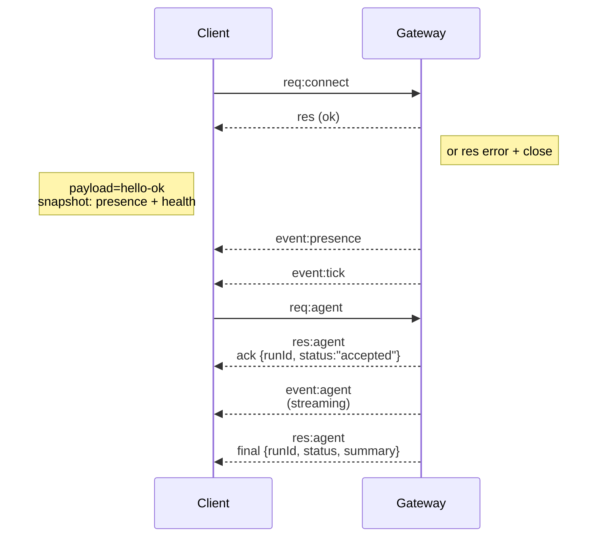

# OpenClaw Complete Documentation

Generated: Sat Mar  7 17:12:18 CST 2026

Total files: 809


---
# File: ./.agent/workflows/update_clawdbot.md

---
description: Update Clawdbot from upstream when branch has diverged (ahead/behind)
---

# Clawdbot Upstream Sync Workflow

Use this workflow when your fork has diverged from upstream (e.g., "18 commits ahead, 29 commits behind").

## Quick Reference

```bash
# Check divergence status
git fetch upstream && git rev-list --left-right --count main...upstream/main

# Full sync (rebase preferred)
git fetch upstream && git rebase upstream/main && pnpm install && pnpm build && ./scripts/restart-mac.sh

# Check for Swift 6.2 issues after sync
grep -r "FileManager\.default\|Thread\.isMainThread" src/ apps/ --include="*.swift"
```

---

## Step 1: Assess Divergence

```bash
git fetch upstream
git log --oneline --left-right main...upstream/main | head -20
```

This shows:

- `<` = your local commits (ahead)
- `>` = upstream commits you're missing (behind)

**Decision point:**

- Few local commits, many upstream → **Rebase** (cleaner history)
- Many local commits or shared branch → **Merge** (preserves history)

---

## Step 2A: Rebase Strategy (Preferred)

Replays your commits on top of upstream. Results in linear history.

```bash
# Ensure working tree is clean
git status

# Rebase onto upstream
git rebase upstream/main
```

### Handling Rebase Conflicts

```bash
# When conflicts occur:
# 1. Fix conflicts in the listed files
# 2. Stage resolved files
git add <resolved-files>

# 3. Continue rebase
git rebase --continue

# If a commit is no longer needed (already in upstream):
git rebase --skip

# To abort and return to original state:
git rebase --abort
```

### Common Conflict Patterns

| File             | Resolution                                       |
| ---------------- | ------------------------------------------------ |
| `package.json`   | Take upstream deps, keep local scripts if needed |
| `pnpm-lock.yaml` | Accept upstream, regenerate with `pnpm install`  |
| `*.patch` files  | Usually take upstream version                    |
| Source files     | Merge logic carefully, prefer upstream structure |

---

## Step 2B: Merge Strategy (Alternative)

Preserves all history with a merge commit.

```bash
git merge upstream/main --no-edit
```

Resolve conflicts same as rebase, then:

```bash
git add <resolved-files>
git commit
```

---

## Step 3: Rebuild Everything

After sync completes:

```bash
# Install dependencies (regenerates lock if needed)
pnpm install

# Build TypeScript
pnpm build

# Build UI assets
pnpm ui:build

# Run diagnostics
pnpm clawdbot doctor
```

---

## Step 4: Rebuild macOS App

```bash
# Full rebuild, sign, and launch
./scripts/restart-mac.sh

# Or just package without restart
pnpm mac:package
```

### Install to /Applications

```bash
# Kill running app
pkill -x "Clawdbot" || true

# Move old version
mv /Applications/Clawdbot.app /tmp/Clawdbot-backup.app

# Install new build
cp -R dist/Clawdbot.app /Applications/

# Launch
open /Applications/Clawdbot.app
```

---

## Step 4A: Verify macOS App & Agent

After rebuilding the macOS app, always verify it works correctly:

```bash
# Check gateway health
pnpm clawdbot health

# Verify no zombie processes
ps aux | grep -E "(clawdbot|gateway)" | grep -v grep

# Test agent functionality by sending a verification message
pnpm clawdbot agent --message "Verification: macOS app rebuild successful - agent is responding." --session-id YOUR_TELEGRAM_SESSION_ID

# Confirm the message was received on Telegram
# (Check your Telegram chat with the bot)
```

**Important:** Always wait for the Telegram verification message before proceeding. If the agent doesn't respond, troubleshoot the gateway or model configuration before pushing.

---

## Step 5: Handle Swift/macOS Build Issues (Common After Upstream Sync)

Upstream updates may introduce Swift 6.2 / macOS 26 SDK incompatibilities. Use analyze-mode for systematic debugging:

### Analyze-Mode Investigation

```bash
# Gather context with parallel agents
morph-mcp_warpgrep_codebase_search search_string="Find deprecated FileManager.default and Thread.isMainThread usages in Swift files" repo_path="/Volumes/Main SSD/Developer/clawdis"
morph-mcp_warpgrep_codebase_search search_string="Locate Peekaboo submodule and macOS app Swift files with concurrency issues" repo_path="/Volumes/Main SSD/Developer/clawdis"
```

### Common Swift 6.2 Fixes

**FileManager.default Deprecation:**

```bash
# Search for deprecated usage
grep -r "FileManager\.default" src/ apps/ --include="*.swift"

# Replace with proper initialization
# OLD: FileManager.default
# NEW: FileManager()
```

**Thread.isMainThread Deprecation:**

```bash
# Search for deprecated usage
grep -r "Thread\.isMainThread" src/ apps/ --include="*.swift"

# Replace with modern concurrency check
# OLD: Thread.isMainThread
# NEW: await MainActor.run { ... } or DispatchQueue.main.sync { ... }
```

### Peekaboo Submodule Fixes

```bash
# Check Peekaboo for concurrency issues
cd src/canvas-host/a2ui
grep -r "Thread\.isMainThread\|FileManager\.default" . --include="*.swift"

# Fix and rebuild submodule
cd /Volumes/Main SSD/Developer/clawdis
pnpm canvas:a2ui:bundle
```

### macOS App Concurrency Fixes

```bash
# Check macOS app for issues
grep -r "Thread\.isMainThread\|FileManager\.default" apps/macos/ --include="*.swift"

# Clean and rebuild after fixes
cd apps/macos && rm -rf .build .swiftpm
./scripts/restart-mac.sh
```

### Model Configuration Updates

If upstream introduced new model configurations:

```bash
# Check for OpenRouter API key requirements
grep -r "openrouter\|OPENROUTER" src/ --include="*.ts" --include="*.js"

# Update clawdbot.json with fallback chains
# Add model fallback configurations as needed
```

---

## Step 6: Verify & Push

```bash
# Verify everything works
pnpm clawdbot health
pnpm test

# Push (force required after rebase)
git push origin main --force-with-lease

# Or regular push after merge
git push origin main
```

---

## Troubleshooting

### Build Fails After Sync

```bash
# Clean and rebuild
rm -rf node_modules dist
pnpm install
pnpm build
```

### Type Errors (Bun/Node Incompatibility)

Common issue: `fetch.preconnect` type mismatch. Fix by using `FetchLike` type instead of `typeof fetch`.

### macOS App Crashes on Launch

Usually resource bundle mismatch. Full rebuild required:

```bash
cd apps/macos && rm -rf .build .swiftpm
./scripts/restart-mac.sh
```

### Patch Failures

```bash
# Check patch status
pnpm install 2>&1 | grep -i patch

# If patches fail, they may need updating for new dep versions
# Check patches/ directory against package.json patchedDependencies
```

### Swift 6.2 / macOS 26 SDK Build Failures

**Symptoms:** Build fails with deprecation warnings about `FileManager.default` or `Thread.isMainThread`

**Search-Mode Investigation:**

```bash
# Exhaustive search for deprecated APIs
morph-mcp_warpgrep_codebase_search search_string="Find all Swift files using deprecated FileManager.default or Thread.isMainThread" repo_path="/Volumes/Main SSD/Developer/clawdis"
```

**Quick Fix Commands:**

```bash
# Find all affected files
find . -name "*.swift" -exec grep -l "FileManager\.default\|Thread\.isMainThread" {} \;

# Replace FileManager.default with FileManager()
find . -name "*.swift" -exec sed -i '' 's/FileManager\.default/FileManager()/g' {} \;

# For Thread.isMainThread, need manual review of each usage
grep -rn "Thread\.isMainThread" --include="*.swift" .
```

**Rebuild After Fixes:**

```bash
# Clean all build artifacts
rm -rf apps/macos/.build apps/macos/.swiftpm
rm -rf src/canvas-host/a2ui/.build

# Rebuild Peekaboo bundle
pnpm canvas:a2ui:bundle

# Full macOS rebuild
./scripts/restart-mac.sh
```

---

## Automation Script

Save as `scripts/sync-upstream.sh`:

```bash
#!/usr/bin/env bash
set -euo pipefail

echo "==> Fetching upstream..."
git fetch upstream

echo "==> Current divergence:"
git rev-list --left-right --count main...upstream/main

echo "==> Rebasing onto upstream/main..."
git rebase upstream/main

echo "==> Installing dependencies..."
pnpm install

echo "==> Building..."
pnpm build
pnpm ui:build

echo "==> Running doctor..."
pnpm clawdbot doctor

echo "==> Rebuilding macOS app..."
./scripts/restart-mac.sh

echo "==> Verifying gateway health..."
pnpm clawdbot health

echo "==> Checking for Swift 6.2 compatibility issues..."
if grep -r "FileManager\.default\|Thread\.isMainThread" src/ apps/ --include="*.swift" --quiet; then
    echo "⚠️  Found potential Swift 6.2 deprecated API usage"
    echo "   Run manual fixes or use analyze-mode investigation"
else
    echo "✅ No obvious Swift deprecation issues found"
fi

echo "==> Testing agent functionality..."
# Note: Update YOUR_TELEGRAM_SESSION_ID with actual session ID
pnpm clawdbot agent --message "Verification: Upstream sync and macOS rebuild completed successfully." --session-id YOUR_TELEGRAM_SESSION_ID || echo "Warning: Agent test failed - check Telegram for verification message"

echo "==> Done! Check Telegram for verification message, then run 'git push --force-with-lease' when ready."
```


---
# File: ./.agents/maintainers.md

Maintainer skills now live in [`openclaw/maintainers`](https://github.com/openclaw/maintainers/).


---
# File: ./.github/instructions/copilot.instructions.md

# OpenClaw Codebase Patterns

**Always reuse existing code - no redundancy!**

## Tech Stack

- **Runtime**: Node 22+ (Bun also supported for dev/scripts)
- **Language**: TypeScript (ESM, strict mode)
- **Package Manager**: pnpm (keep `pnpm-lock.yaml` in sync)
- **Lint/Format**: Oxlint, Oxfmt (`pnpm check`)
- **Tests**: Vitest with V8 coverage
- **CLI Framework**: Commander + clack/prompts
- **Build**: tsdown (outputs to `dist/`)

## Anti-Redundancy Rules

- Avoid files that just re-export from another file. Import directly from the original source.
- If a function already exists, import it - do NOT create a duplicate in another file.
- Before creating any formatter, utility, or helper, search for existing implementations first.

## Source of Truth Locations

### Formatting Utilities (`src/infra/`)

- **Time formatting**: `src\infra\format-time`

**NEVER create local `formatAge`, `formatDuration`, `formatElapsedTime` functions - import from centralized modules.**

### Terminal Output (`src/terminal/`)

- Tables: `src/terminal/table.ts` (`renderTable`)
- Themes/colors: `src/terminal/theme.ts` (`theme.success`, `theme.muted`, etc.)
- Progress: `src/cli/progress.ts` (spinners, progress bars)

### CLI Patterns

- CLI option wiring: `src/cli/`
- Commands: `src/commands/`
- Dependency injection via `createDefaultDeps`

## Import Conventions

- Use `.js` extension for cross-package imports (ESM)
- Direct imports only - no re-export wrapper files
- Types: `import type { X }` for type-only imports

## Code Quality

- TypeScript (ESM), strict typing, avoid `any`
- Keep files under ~700 LOC - extract helpers when larger
- Colocated tests: `*.test.ts` next to source files
- Run `pnpm check` before commits (lint + format)
- Run `pnpm tsgo` for type checking

## Stack & Commands

- **Package manager**: pnpm (`pnpm install`)
- **Dev**: `pnpm openclaw ...` or `pnpm dev`
- **Type-check**: `pnpm tsgo`
- **Lint/format**: `pnpm check`
- **Tests**: `pnpm test`
- **Build**: `pnpm build`

If you are coding together with a human, do NOT use scripts/committer, but git directly and run the above commands manually to ensure quality.


---
# File: ./.github/pull_request_template.md

## Summary

Describe the problem and fix in 2–5 bullets:

- Problem:
- Why it matters:
- What changed:
- What did NOT change (scope boundary):

## Change Type (select all)

- [ ] Bug fix
- [ ] Feature
- [ ] Refactor
- [ ] Docs
- [ ] Security hardening
- [ ] Chore/infra

## Scope (select all touched areas)

- [ ] Gateway / orchestration
- [ ] Skills / tool execution
- [ ] Auth / tokens
- [ ] Memory / storage
- [ ] Integrations
- [ ] API / contracts
- [ ] UI / DX
- [ ] CI/CD / infra

## Linked Issue/PR

- Closes #
- Related #

## User-visible / Behavior Changes

List user-visible changes (including defaults/config).  
If none, write `None`.

## Security Impact (required)

- New permissions/capabilities? (`Yes/No`)
- Secrets/tokens handling changed? (`Yes/No`)
- New/changed network calls? (`Yes/No`)
- Command/tool execution surface changed? (`Yes/No`)
- Data access scope changed? (`Yes/No`)
- If any `Yes`, explain risk + mitigation:

## Repro + Verification

### Environment

- OS:
- Runtime/container:
- Model/provider:
- Integration/channel (if any):
- Relevant config (redacted):

### Steps

1.
2.
3.

### Expected

-

### Actual

-

## Evidence

Attach at least one:

- [ ] Failing test/log before + passing after
- [ ] Trace/log snippets
- [ ] Screenshot/recording
- [ ] Perf numbers (if relevant)

## Human Verification (required)

What you personally verified (not just CI), and how:

- Verified scenarios:
- Edge cases checked:
- What you did **not** verify:

## Compatibility / Migration

- Backward compatible? (`Yes/No`)
- Config/env changes? (`Yes/No`)
- Migration needed? (`Yes/No`)
- If yes, exact upgrade steps:

## Failure Recovery (if this breaks)

- How to disable/revert this change quickly:
- Files/config to restore:
- Known bad symptoms reviewers should watch for:

## Risks and Mitigations

List only real risks for this PR. Add/remove entries as needed. If none, write `None`.

- Risk:
  - Mitigation:


---
# File: ./.pi/prompts/cl.md

---
description: Audit changelog entries before release
---

Audit changelog entries for all commits since the last release.

## Process

1. **Find the last release tag:**

   ```bash
   git tag --sort=-version:refname | head -1
   ```

2. **List all commits since that tag:**

   ```bash
   git log <tag>..HEAD --oneline
   ```

3. **Read each package's [Unreleased] section:**
   - packages/ai/CHANGELOG.md
   - packages/tui/CHANGELOG.md
   - packages/coding-agent/CHANGELOG.md

4. **For each commit, check:**
   - Skip: changelog updates, doc-only changes, release housekeeping
   - Determine which package(s) the commit affects (use `git show <hash> --stat`)
   - Verify a changelog entry exists in the affected package(s)
   - For external contributions (PRs), verify format: `Description ([#N](url) by [@user](url))`

5. **Cross-package duplication rule:**
   Changes in `ai`, `agent` or `tui` that affect end users should be duplicated to `coding-agent` changelog, since coding-agent is the user-facing package that depends on them.

6. **Add New Features section after changelog fixes:**
   - Insert a `### New Features` section at the start of `## [Unreleased]` in `packages/coding-agent/CHANGELOG.md`.
   - Propose the top new features to the user for confirmation before writing them.
   - Link to relevant docs and sections whenever possible.

7. **Report:**
   - List commits with missing entries
   - List entries that need cross-package duplication
   - Add any missing entries directly

## Changelog Format Reference

Sections (in order):

- `### Breaking Changes` - API changes requiring migration
- `### Added` - New features
- `### Changed` - Changes to existing functionality
- `### Fixed` - Bug fixes
- `### Removed` - Removed features

Attribution:

- Internal: `Fixed foo ([#123](https://github.com/badlogic/pi-mono/issues/123))`
- External: `Added bar ([#456](https://github.com/badlogic/pi-mono/pull/456) by [@user](https://github.com/user))`


---
# File: ./.pi/prompts/is.md

---
description: Analyze GitHub issues (bugs or feature requests)
---

Analyze GitHub issue(s): $ARGUMENTS

For each issue:

1. Read the issue in full, including all comments and linked issues/PRs.

2. **For bugs**:
   - Ignore any root cause analysis in the issue (likely wrong)
   - Read all related code files in full (no truncation)
   - Trace the code path and identify the actual root cause
   - Propose a fix

3. **For feature requests**:
   - Read all related code files in full (no truncation)
   - Propose the most concise implementation approach
   - List affected files and changes needed

Do NOT implement unless explicitly asked. Analyze and propose only.


---
# File: ./.pi/prompts/landpr.md

---
description: Land a PR (merge with proper workflow)
---

Input

- PR: $1 <number|url>
  - If missing: use the most recent PR mentioned in the conversation.
  - If ambiguous: ask.

Do (end-to-end)
Goal: PR must end in GitHub state = MERGED (never CLOSED). Prefer `gh pr merge --squash`; use `--rebase` only when preserving commit history is required.

1. Assign PR to self:
   - `gh pr edit <PR> --add-assignee @me`
2. Repo clean: `git status`.
3. Identify PR meta (author + head branch):

   ```sh
   gh pr view <PR> --json number,title,author,headRefName,baseRefName,headRepository --jq '{number,title,author:.author.login,head:.headRefName,base:.baseRefName,headRepo:.headRepository.nameWithOwner}'
   contrib=$(gh pr view <PR> --json author --jq .author.login)
   head=$(gh pr view <PR> --json headRefName --jq .headRefName)
   head_repo_url=$(gh pr view <PR> --json headRepository --jq .headRepository.url)
   ```

4. Fast-forward base:
   - `git checkout main`
   - `git pull --ff-only`
5. Create temp base branch from main:
   - `git checkout -b temp/landpr-<ts-or-pr>`
6. Check out PR branch locally:
   - `gh pr checkout <PR>`
7. Rebase PR branch onto temp base:
   - `git rebase temp/landpr-<ts-or-pr>`
   - Fix conflicts; keep history tidy.
8. Fix + tests + changelog:
   - Implement fixes + add/adjust tests
   - Update `CHANGELOG.md` and mention `#<PR>` + `@$contrib`
9. Decide merge strategy:
   - Squash (preferred): use when we want a single clean commit
   - Rebase: use only when we explicitly want to preserve commit history
   - If unclear, ask
10. Full gate (BEFORE commit):
    - `pnpm lint && pnpm build && pnpm test`
11. Commit via committer (final merge commit only includes PR # + thanks):
    - For the final merge-ready commit: `committer "fix: <summary> (#<PR>) (thanks @$contrib)" CHANGELOG.md <changed files>`
    - If you need intermediate fix commits before the final merge commit, keep those messages concise and **omit** PR number/thanks.
    - `land_sha=$(git rev-parse HEAD)`
12. Push updated PR branch (rebase => usually needs force):

    ```sh
    git remote add prhead "$head_repo_url.git" 2>/dev/null || git remote set-url prhead "$head_repo_url.git"
    git push --force-with-lease prhead HEAD:$head
    ```

13. Merge PR (must show MERGED on GitHub):
    - Squash (preferred): `gh pr merge <PR> --squash`
    - Rebase (history-preserving fallback): `gh pr merge <PR> --rebase`
    - Never `gh pr close` (closing is wrong)
14. Sync main:
    - `git checkout main`
    - `git pull --ff-only`
15. Comment on PR with what we did + SHAs + thanks:

    ```sh
    merge_sha=$(gh pr view <PR> --json mergeCommit --jq '.mergeCommit.oid')
    gh pr comment <PR> --body "Landed via temp rebase onto main.\n\n- Gate: pnpm lint && pnpm build && pnpm test\n- Land commit: $land_sha\n- Merge commit: $merge_sha\n\nThanks @$contrib!"
    ```

16. Verify PR state == MERGED:
    - `gh pr view <PR> --json state --jq .state`
17. Delete temp branch:
    - `git branch -D temp/landpr-<ts-or-pr>`


---
# File: ./.pi/prompts/reviewpr.md

---
description: Review a PR thoroughly without merging
---

Input

- PR: $1 <number|url>
  - If missing: use the most recent PR mentioned in the conversation.
  - If ambiguous: ask.

Do (review-only)
Goal: produce a thorough review and a clear recommendation (READY for /landpr vs NEEDS WORK). Do NOT merge, do NOT push, do NOT make changes in the repo as part of this command.

1. Identify PR meta + context

   ```sh
   gh pr view <PR> --json number,title,state,isDraft,author,baseRefName,headRefName,headRepository,url,body,labels,assignees,reviewRequests,files,additions,deletions --jq '{number,title,url,state,isDraft,author:.author.login,base:.baseRefName,head:.headRefName,headRepo:.headRepository.nameWithOwner,additions,deletions,files:.files|length}'
   ```

2. Read the PR description carefully
   - Summarize the stated goal, scope, and any "why now?" rationale.
   - Call out any missing context: motivation, alternatives considered, rollout/compat notes, risk.

3. Read the diff thoroughly (prefer full diff)

   ```sh
   gh pr diff <PR>
   # If you need more surrounding context for files:
   gh pr checkout <PR>   # optional; still review-only
   git show --stat
   ```

4. Validate the change is needed / valuable
   - What user/customer/dev pain does this solve?
   - Is this change the smallest reasonable fix?
   - Are we introducing complexity for marginal benefit?
   - Are we changing behavior/contract in a way that needs docs or a release note?

5. Evaluate implementation quality + optimality
   - Correctness: edge cases, error handling, null/undefined, concurrency, ordering.
   - Design: is the abstraction/architecture appropriate or over/under-engineered?
   - Performance: hot paths, allocations, queries, network, N+1s, caching.
   - Security/privacy: authz/authn, input validation, secrets, logging PII.
   - Backwards compatibility: public APIs, config, migrations.
   - Style consistency: formatting, naming, patterns used elsewhere.

6. Tests & verification
   - Identify what's covered by tests (unit/integration/e2e).
   - Are there regression tests for the bug fixed / scenario added?
   - Missing tests? Call out exact cases that should be added.
   - If tests are present, do they actually assert the important behavior (not just snapshots / happy path)?

7. Follow-up refactors / cleanup suggestions
   - Any code that should be simplified before merge?
   - Any TODOs that should be tickets vs addressed now?
   - Any deprecations, docs, types, or lint rules we should adjust?

8. Key questions to answer explicitly
   - Can we fix everything ourselves in a follow-up, or does the contributor need to update this PR?
   - Any blocking concerns (must-fix before merge)?
   - Is this PR ready to land, or does it need work?

9. Output (structured)
   Produce a review with these sections:

A) TL;DR recommendation

- One of: READY FOR /landpr | NEEDS WORK | NEEDS DISCUSSION
- 1–3 sentence rationale.

B) What changed

- Brief bullet summary of the diff/behavioral changes.

C) What's good

- Bullets: correctness, simplicity, tests, docs, ergonomics, etc.

D) Concerns / questions (actionable)

- Numbered list.
- Mark each item as:
  - BLOCKER (must fix before merge)
  - IMPORTANT (should fix before merge)
  - NIT (optional)
- For each: point to the file/area and propose a concrete fix or alternative.

E) Tests

- What exists.
- What's missing (specific scenarios).

F) Follow-ups (optional)

- Non-blocking refactors/tickets to open later.

G) Suggested PR comment (optional)

- Offer: "Want me to draft a PR comment to the author?"
- If yes, provide a ready-to-paste comment summarizing the above, with clear asks.

Rules / Guardrails

- Review only: do not merge (`gh pr merge`), do not push branches, do not edit code.
- If you need clarification, ask questions rather than guessing.


---
# File: ./AGENTS.md

# Repository Guidelines

- Repo: https://github.com/openclaw/openclaw
- In chat replies, file references must be repo-root relative only (example: `extensions/bluebubbles/src/channel.ts:80`); never absolute paths or `~/...`.
- GitHub issues/comments/PR comments: use literal multiline strings or `-F - <<'EOF'` (or $'...') for real newlines; never embed "\\n".
- GitHub comment footgun: never use `gh issue/pr comment -b "..."` when body contains backticks or shell chars. Always use single-quoted heredoc (`-F - <<'EOF'`) so no command substitution/escaping corruption.
- GitHub linking footgun: don’t wrap issue/PR refs like `#24643` in backticks when you want auto-linking. Use plain `#24643` (optionally add full URL).
- GitHub searching footgun: don't limit yourself to the first 500 issues or PRs when wanting to search all. Unless you're supposed to look at the most recent, keep going until you've reached the last page in the search
- Security advisory analysis: before triage/severity decisions, read `SECURITY.md` to align with OpenClaw's trust model and design boundaries.

## Project Structure & Module Organization

- Source code: `src/` (CLI wiring in `src/cli`, commands in `src/commands`, web provider in `src/provider-web.ts`, infra in `src/infra`, media pipeline in `src/media`).
- Tests: colocated `*.test.ts`.
- Docs: `docs/` (images, queue, Pi config). Built output lives in `dist/`.
- Plugins/extensions: live under `extensions/*` (workspace packages). Keep plugin-only deps in the extension `package.json`; do not add them to the root `package.json` unless core uses them.
- Plugins: install runs `npm install --omit=dev` in plugin dir; runtime deps must live in `dependencies`. Avoid `workspace:*` in `dependencies` (npm install breaks); put `openclaw` in `devDependencies` or `peerDependencies` instead (runtime resolves `openclaw/plugin-sdk` via jiti alias).
- Installers served from `https://openclaw.ai/*`: live in the sibling repo `../openclaw.ai` (`public/install.sh`, `public/install-cli.sh`, `public/install.ps1`).
- Messaging channels: always consider **all** built-in + extension channels when refactoring shared logic (routing, allowlists, pairing, command gating, onboarding, docs).
  - Core channel docs: `docs/channels/`
  - Core channel code: `src/telegram`, `src/discord`, `src/slack`, `src/signal`, `src/imessage`, `src/web` (WhatsApp web), `src/channels`, `src/routing`
  - Extensions (channel plugins): `extensions/*` (e.g. `extensions/msteams`, `extensions/matrix`, `extensions/zalo`, `extensions/zalouser`, `extensions/voice-call`)
- When adding channels/extensions/apps/docs, update `.github/labeler.yml` and create matching GitHub labels (use existing channel/extension label colors).

## Docs Linking (Mintlify)

- Docs are hosted on Mintlify (docs.openclaw.ai).
- Internal doc links in `docs/**/*.md`: root-relative, no `.md`/`.mdx` (example: `[Config](/configuration)`).
- When working with documentation, read the mintlify skill.
- Section cross-references: use anchors on root-relative paths (example: `[Hooks](/configuration#hooks)`).
- Doc headings and anchors: avoid em dashes and apostrophes in headings because they break Mintlify anchor links.
- When Peter asks for links, reply with full `https://docs.openclaw.ai/...` URLs (not root-relative).
- When you touch docs, end the reply with the `https://docs.openclaw.ai/...` URLs you referenced.
- README (GitHub): keep absolute docs URLs (`https://docs.openclaw.ai/...`) so links work on GitHub.
- Docs content must be generic: no personal device names/hostnames/paths; use placeholders like `user@gateway-host` and “gateway host”.

## Docs i18n (zh-CN)

- `docs/zh-CN/**` is generated; do not edit unless the user explicitly asks.
- Pipeline: update English docs → adjust glossary (`docs/.i18n/glossary.zh-CN.json`) → run `scripts/docs-i18n` → apply targeted fixes only if instructed.
- Translation memory: `docs/.i18n/zh-CN.tm.jsonl` (generated).
- See `docs/.i18n/README.md`.
- The pipeline can be slow/inefficient; if it’s dragging, ping @jospalmbier on Discord instead of hacking around it.

## exe.dev VM ops (general)

- Access: stable path is `ssh exe.dev` then `ssh vm-name` (assume SSH key already set).
- SSH flaky: use exe.dev web terminal or Shelley (web agent); keep a tmux session for long ops.
- Update: `sudo npm i -g openclaw@latest` (global install needs root on `/usr/lib/node_modules`).
- Config: use `openclaw config set ...`; ensure `gateway.mode=local` is set.
- Discord: store raw token only (no `DISCORD_BOT_TOKEN=` prefix).
- Restart: stop old gateway and run:
  `pkill -9 -f openclaw-gateway || true; nohup openclaw gateway run --bind loopback --port 18789 --force > /tmp/openclaw-gateway.log 2>&1 &`
- Verify: `openclaw channels status --probe`, `ss -ltnp | rg 18789`, `tail -n 120 /tmp/openclaw-gateway.log`.

## Build, Test, and Development Commands

- Runtime baseline: Node **22+** (keep Node + Bun paths working).
- Install deps: `pnpm install`
- If deps are missing (for example `node_modules` missing, `vitest not found`, or `command not found`), run the repo’s package-manager install command (prefer lockfile/README-defined PM), then rerun the exact requested command once. Apply this to test/build/lint/typecheck/dev commands; if retry still fails, report the command and first actionable error.
- Pre-commit hooks: `prek install` (runs same checks as CI)
- Also supported: `bun install` (keep `pnpm-lock.yaml` + Bun patching in sync when touching deps/patches).
- Prefer Bun for TypeScript execution (scripts, dev, tests): `bun <file.ts>` / `bunx <tool>`.
- Run CLI in dev: `pnpm openclaw ...` (bun) or `pnpm dev`.
- Node remains supported for running built output (`dist/*`) and production installs.
- Mac packaging (dev): `scripts/package-mac-app.sh` defaults to current arch. Release checklist: `docs/platforms/mac/release.md`.
- Type-check/build: `pnpm build`
- TypeScript checks: `pnpm tsgo`
- Lint/format: `pnpm check`
- Format check: `pnpm format` (oxfmt --check)
- Format fix: `pnpm format:fix` (oxfmt --write)
- Tests: `pnpm test` (vitest); coverage: `pnpm test:coverage`

## Coding Style & Naming Conventions

- Language: TypeScript (ESM). Prefer strict typing; avoid `any`.
- Formatting/linting via Oxlint and Oxfmt; run `pnpm check` before commits.
- Never add `@ts-nocheck` and do not disable `no-explicit-any`; fix root causes and update Oxlint/Oxfmt config only when required.
- Dynamic import guardrail: do not mix `await import("x")` and static `import ... from "x"` for the same module in production code paths. If you need lazy loading, create a dedicated `*.runtime.ts` boundary (that re-exports from `x`) and dynamically import that boundary from lazy callers only.
- Dynamic import verification: after refactors that touch lazy-loading/module boundaries, run `pnpm build` and check for `[INEFFECTIVE_DYNAMIC_IMPORT]` warnings before submitting.
- Never share class behavior via prototype mutation (`applyPrototypeMixins`, `Object.defineProperty` on `.prototype`, or exporting `Class.prototype` for merges). Use explicit inheritance/composition (`A extends B extends C`) or helper composition so TypeScript can typecheck.
- If this pattern is needed, stop and get explicit approval before shipping; default behavior is to split/refactor into an explicit class hierarchy and keep members strongly typed.
- In tests, prefer per-instance stubs over prototype mutation (`SomeClass.prototype.method = ...`) unless a test explicitly documents why prototype-level patching is required.
- Add brief code comments for tricky or non-obvious logic.
- Keep files concise; extract helpers instead of “V2” copies. Use existing patterns for CLI options and dependency injection via `createDefaultDeps`.
- Aim to keep files under ~700 LOC; guideline only (not a hard guardrail). Split/refactor when it improves clarity or testability.
- Naming: use **OpenClaw** for product/app/docs headings; use `openclaw` for CLI command, package/binary, paths, and config keys.

## Release Channels (Naming)

- stable: tagged releases only (e.g. `vYYYY.M.D`), npm dist-tag `latest`.
- beta: prerelease tags `vYYYY.M.D-beta.N`, npm dist-tag `beta` (may ship without macOS app).
- beta naming: prefer `-beta.N`; do not mint new `-1/-2` betas. Legacy `vYYYY.M.D-<patch>` and `vYYYY.M.D.beta.N` remain recognized.
- dev: moving head on `main` (no tag; git checkout main).

## Testing Guidelines

- Framework: Vitest with V8 coverage thresholds (70% lines/branches/functions/statements).
- Naming: match source names with `*.test.ts`; e2e in `*.e2e.test.ts`.
- Run `pnpm test` (or `pnpm test:coverage`) before pushing when you touch logic.
- Do not set test workers above 16; tried already.
- If local Vitest runs cause memory pressure (common on non-Mac-Studio hosts), use `OPENCLAW_TEST_PROFILE=low OPENCLAW_TEST_SERIAL_GATEWAY=1 pnpm test` for land/gate runs.
- Live tests (real keys): `CLAWDBOT_LIVE_TEST=1 pnpm test:live` (OpenClaw-only) or `LIVE=1 pnpm test:live` (includes provider live tests). Docker: `pnpm test:docker:live-models`, `pnpm test:docker:live-gateway`. Onboarding Docker E2E: `pnpm test:docker:onboard`.
- Full kit + what’s covered: `docs/testing.md`.
- Changelog: user-facing changes only; no internal/meta notes (version alignment, appcast reminders, release process).
- Changelog placement: in the active version block, append new entries to the end of the target section (`### Changes` or `### Fixes`); do not insert new entries at the top of a section.
- Pure test additions/fixes generally do **not** need a changelog entry unless they alter user-facing behavior or the user asks for one.
- Mobile: before using a simulator, check for connected real devices (iOS + Android) and prefer them when available.

## Commit & Pull Request Guidelines

**Full maintainer PR workflow (optional):** If you want the repo's end-to-end maintainer workflow (triage order, quality bar, rebase rules, commit/changelog conventions, co-contributor policy, and the `review-pr` > `prepare-pr` > `merge-pr` pipeline), see `.agents/skills/PR_WORKFLOW.md`. Maintainers may use other workflows; when a maintainer specifies a workflow, follow that. If no workflow is specified, default to PR_WORKFLOW.

- Create commits with `scripts/committer "<msg>" <file...>`; avoid manual `git add`/`git commit` so staging stays scoped.
- Follow concise, action-oriented commit messages (e.g., `CLI: add verbose flag to send`).
- Group related changes; avoid bundling unrelated refactors.
- PR submission template (canonical): `.github/pull_request_template.md`
- Issue submission templates (canonical): `.github/ISSUE_TEMPLATE/`

## Shorthand Commands

- `sync`: if working tree is dirty, commit all changes (pick a sensible Conventional Commit message), then `git pull --rebase`; if rebase conflicts and cannot resolve, stop; otherwise `git push`.

## Git Notes

- If `git branch -d/-D <branch>` is policy-blocked, delete the local ref directly: `git update-ref -d refs/heads/<branch>`.
- Bulk PR close/reopen safety: if a close action would affect more than 5 PRs, first ask for explicit user confirmation with the exact PR count and target scope/query.

## GitHub Search (`gh`)

- Prefer targeted keyword search before proposing new work or duplicating fixes.
- Use `--repo openclaw/openclaw` + `--match title,body` first; add `--match comments` when triaging follow-up threads.
- PRs: `gh search prs --repo openclaw/openclaw --match title,body --limit 50 -- "auto-update"`
- Issues: `gh search issues --repo openclaw/openclaw --match title,body --limit 50 -- "auto-update"`
- Structured output example:
  `gh search issues --repo openclaw/openclaw --match title,body --limit 50 --json number,title,state,url,updatedAt -- "auto update" --jq '.[] | "\(.number) | \(.state) | \(.title) | \(.url)"'`

## Security & Configuration Tips

- Web provider stores creds at `~/.openclaw/credentials/`; rerun `openclaw login` if logged out.
- Pi sessions live under `~/.openclaw/sessions/` by default; the base directory is not configurable.
- Environment variables: see `~/.profile`.
- Never commit or publish real phone numbers, videos, or live configuration values. Use obviously fake placeholders in docs, tests, and examples.
- Release flow: always read `docs/reference/RELEASING.md` and `docs/platforms/mac/release.md` before any release work; do not ask routine questions once those docs answer them.

## GHSA (Repo Advisory) Patch/Publish

- Before reviewing security advisories, read `SECURITY.md`.
- Fetch: `gh api /repos/openclaw/openclaw/security-advisories/<GHSA>`
- Latest npm: `npm view openclaw version --userconfig "$(mktemp)"`
- Private fork PRs must be closed:
  `fork=$(gh api /repos/openclaw/openclaw/security-advisories/<GHSA> | jq -r .private_fork.full_name)`
  `gh pr list -R "$fork" --state open` (must be empty)
- Description newline footgun: write Markdown via heredoc to `/tmp/ghsa.desc.md` (no `"\\n"` strings)
- Build patch JSON via jq: `jq -n --rawfile desc /tmp/ghsa.desc.md '{summary,severity,description:$desc,vulnerabilities:[...]}' > /tmp/ghsa.patch.json`
- GHSA API footgun: cannot set `severity` and `cvss_vector_string` in the same PATCH; do separate calls.
- Patch + publish: `gh api -X PATCH /repos/openclaw/openclaw/security-advisories/<GHSA> --input /tmp/ghsa.patch.json` (publish = include `"state":"published"`; no `/publish` endpoint)
- If publish fails (HTTP 422): missing `severity`/`description`/`vulnerabilities[]`, or private fork has open PRs
- Verify: re-fetch; ensure `state=published`, `published_at` set; `jq -r .description | rg '\\\\n'` returns nothing

## Troubleshooting

- Rebrand/migration issues or legacy config/service warnings: run `openclaw doctor` (see `docs/gateway/doctor.md`).

## Agent-Specific Notes

- Vocabulary: "makeup" = "mac app".
- Never edit `node_modules` (global/Homebrew/npm/git installs too). Updates overwrite. Skill notes go in `tools.md` or `AGENTS.md`.
- When adding a new `AGENTS.md` anywhere in the repo, also add a `CLAUDE.md` symlink pointing to it (example: `ln -s AGENTS.md CLAUDE.md`).
- Signal: "update fly" => `fly ssh console -a flawd-bot -C "bash -lc 'cd /data/clawd/openclaw && git pull --rebase origin main'"` then `fly machines restart e825232f34d058 -a flawd-bot`.
- When working on a GitHub Issue or PR, print the full URL at the end of the task.
- When answering questions, respond with high-confidence answers only: verify in code; do not guess.
- Never update the Carbon dependency.
- Any dependency with `pnpm.patchedDependencies` must use an exact version (no `^`/`~`).
- Patching dependencies (pnpm patches, overrides, or vendored changes) requires explicit approval; do not do this by default.
- CLI progress: use `src/cli/progress.ts` (`osc-progress` + `@clack/prompts` spinner); don’t hand-roll spinners/bars.
- Status output: keep tables + ANSI-safe wrapping (`src/terminal/table.ts`); `status --all` = read-only/pasteable, `status --deep` = probes.
- Gateway currently runs only as the menubar app; there is no separate LaunchAgent/helper label installed. Restart via the OpenClaw Mac app or `scripts/restart-mac.sh`; to verify/kill use `launchctl print gui/$UID | grep openclaw` rather than assuming a fixed label. **When debugging on macOS, start/stop the gateway via the app, not ad-hoc tmux sessions; kill any temporary tunnels before handoff.**
- macOS logs: use `./scripts/clawlog.sh` to query unified logs for the OpenClaw subsystem; it supports follow/tail/category filters and expects passwordless sudo for `/usr/bin/log`.
- If shared guardrails are available locally, review them; otherwise follow this repo's guidance.
- SwiftUI state management (iOS/macOS): prefer the `Observation` framework (`@Observable`, `@Bindable`) over `ObservableObject`/`@StateObject`; don’t introduce new `ObservableObject` unless required for compatibility, and migrate existing usages when touching related code.
- Connection providers: when adding a new connection, update every UI surface and docs (macOS app, web UI, mobile if applicable, onboarding/overview docs) and add matching status + configuration forms so provider lists and settings stay in sync.
- Version locations: `package.json` (CLI), `apps/android/app/build.gradle.kts` (versionName/versionCode), `apps/ios/Sources/Info.plist` + `apps/ios/Tests/Info.plist` (CFBundleShortVersionString/CFBundleVersion), `apps/macos/Sources/OpenClaw/Resources/Info.plist` (CFBundleShortVersionString/CFBundleVersion), `docs/install/updating.md` (pinned npm version), `docs/platforms/mac/release.md` (APP_VERSION/APP_BUILD examples), Peekaboo Xcode projects/Info.plists (MARKETING_VERSION/CURRENT_PROJECT_VERSION).
- "Bump version everywhere" means all version locations above **except** `appcast.xml` (only touch appcast when cutting a new macOS Sparkle release).
- **Restart apps:** “restart iOS/Android apps” means rebuild (recompile/install) and relaunch, not just kill/launch.
- **Device checks:** before testing, verify connected real devices (iOS/Android) before reaching for simulators/emulators.
- iOS Team ID lookup: `security find-identity -p codesigning -v` → use Apple Development (…) TEAMID. Fallback: `defaults read com.apple.dt.Xcode IDEProvisioningTeamIdentifiers`.
- A2UI bundle hash: `src/canvas-host/a2ui/.bundle.hash` is auto-generated; ignore unexpected changes, and only regenerate via `pnpm canvas:a2ui:bundle` (or `scripts/bundle-a2ui.sh`) when needed. Commit the hash as a separate commit.
- Release signing/notary keys are managed outside the repo; follow internal release docs.
- Notary auth env vars (`APP_STORE_CONNECT_ISSUER_ID`, `APP_STORE_CONNECT_KEY_ID`, `APP_STORE_CONNECT_API_KEY_P8`) are expected in your environment (per internal release docs).
- **Multi-agent safety:** do **not** create/apply/drop `git stash` entries unless explicitly requested (this includes `git pull --rebase --autostash`). Assume other agents may be working; keep unrelated WIP untouched and avoid cross-cutting state changes.
- **Multi-agent safety:** when the user says "push", you may `git pull --rebase` to integrate latest changes (never discard other agents' work). When the user says "commit", scope to your changes only. When the user says "commit all", commit everything in grouped chunks.
- **Multi-agent safety:** do **not** create/remove/modify `git worktree` checkouts (or edit `.worktrees/*`) unless explicitly requested.
- **Multi-agent safety:** do **not** switch branches / check out a different branch unless explicitly requested.
- **Multi-agent safety:** running multiple agents is OK as long as each agent has its own session.
- **Multi-agent safety:** when you see unrecognized files, keep going; focus on your changes and commit only those.
- Lint/format churn:
  - If staged+unstaged diffs are formatting-only, auto-resolve without asking.
  - If commit/push already requested, auto-stage and include formatting-only follow-ups in the same commit (or a tiny follow-up commit if needed), no extra confirmation.
  - Only ask when changes are semantic (logic/data/behavior).
- Lobster seam: use the shared CLI palette in `src/terminal/palette.ts` (no hardcoded colors); apply palette to onboarding/config prompts and other TTY UI output as needed.
- **Multi-agent safety:** focus reports on your edits; avoid guard-rail disclaimers unless truly blocked; when multiple agents touch the same file, continue if safe; end with a brief “other files present” note only if relevant.
- Bug investigations: read source code of relevant npm dependencies and all related local code before concluding; aim for high-confidence root cause.
- Code style: add brief comments for tricky logic; keep files under ~500 LOC when feasible (split/refactor as needed).
- Tool schema guardrails (google-antigravity): avoid `Type.Union` in tool input schemas; no `anyOf`/`oneOf`/`allOf`. Use `stringEnum`/`optionalStringEnum` (Type.Unsafe enum) for string lists, and `Type.Optional(...)` instead of `... | null`. Keep top-level tool schema as `type: "object"` with `properties`.
- Tool schema guardrails: avoid raw `format` property names in tool schemas; some validators treat `format` as a reserved keyword and reject the schema.
- When asked to open a “session” file, open the Pi session logs under `~/.openclaw/agents/<agentId>/sessions/*.jsonl` (use the `agent=<id>` value in the Runtime line of the system prompt; newest unless a specific ID is given), not the default `sessions.json`. If logs are needed from another machine, SSH via Tailscale and read the same path there.
- Do not rebuild the macOS app over SSH; rebuilds must be run directly on the Mac.
- Never send streaming/partial replies to external messaging surfaces (WhatsApp, Telegram); only final replies should be delivered there. Streaming/tool events may still go to internal UIs/control channel.
- Voice wake forwarding tips:
  - Command template should stay `openclaw-mac agent --message "${text}" --thinking low`; `VoiceWakeForwarder` already shell-escapes `${text}`. Don’t add extra quotes.
  - launchd PATH is minimal; ensure the app’s launch agent PATH includes standard system paths plus your pnpm bin (typically `$HOME/Library/pnpm`) so `pnpm`/`openclaw` binaries resolve when invoked via `openclaw-mac`.
- For manual `openclaw message send` messages that include `!`, use the heredoc pattern noted below to avoid the Bash tool’s escaping.
- Release guardrails: do not change version numbers without operator’s explicit consent; always ask permission before running any npm publish/release step.
- Beta release guardrail: when using a beta Git tag (for example `vYYYY.M.D-beta.N`), publish npm with a matching beta version suffix (for example `YYYY.M.D-beta.N`) rather than a plain version on `--tag beta`; otherwise the plain version name gets consumed/blocked.

## NPM + 1Password (publish/verify)

- Use the 1password skill; all `op` commands must run inside a fresh tmux session.
- Sign in: `eval "$(op signin --account my.1password.com)"` (app unlocked + integration on).
- OTP: `op read 'op://Private/Npmjs/one-time password?attribute=otp'`.
- Publish: `npm publish --access public --otp="<otp>"` (run from the package dir).
- Verify without local npmrc side effects: `npm view <pkg> version --userconfig "$(mktemp)"`.
- Kill the tmux session after publish.

## Plugin Release Fast Path (no core `openclaw` publish)

- Release only already-on-npm plugins. Source list is in `docs/reference/RELEASING.md` under "Current npm plugin list".
- Run all CLI `op` calls and `npm publish` inside tmux to avoid hangs/interruption:
  - `tmux new -d -s release-plugins-$(date +%Y%m%d-%H%M%S)`
  - `eval "$(op signin --account my.1password.com)"`
- 1Password helpers:
  - password used by `npm login`:
    `op item get Npmjs --format=json | jq -r '.fields[] | select(.id=="password").value'`
  - OTP:
    `op read 'op://Private/Npmjs/one-time password?attribute=otp'`
- Fast publish loop (local helper script in `/tmp` is fine; keep repo clean):
  - compare local plugin `version` to `npm view <name> version`
  - only run `npm publish --access public --otp="<otp>"` when versions differ
  - skip if package is missing on npm or version already matches.
- Keep `openclaw` untouched: never run publish from repo root unless explicitly requested.
- Post-check for each release:
  - per-plugin: `npm view @openclaw/<name> version --userconfig "$(mktemp)"` should be `2026.2.17`
  - core guard: `npm view openclaw version --userconfig "$(mktemp)"` should stay at previous version unless explicitly requested.

## Changelog Release Notes

- When cutting a mac release with beta GitHub prerelease:
  - Tag `vYYYY.M.D-beta.N` from the release commit (example: `v2026.2.15-beta.1`).
  - Create prerelease with title `openclaw YYYY.M.D-beta.N`.
  - Use release notes from `CHANGELOG.md` version section (`Changes` + `Fixes`, no title duplicate).
  - Attach at least `OpenClaw-YYYY.M.D.zip` and `OpenClaw-YYYY.M.D.dSYM.zip`; include `.dmg` if available.

- Keep top version entries in `CHANGELOG.md` sorted by impact:
  - `### Changes` first.
  - `### Fixes` deduped and ranked with user-facing fixes first.
- Before tagging/publishing, run:
  - `node --import tsx scripts/release-check.ts`
  - `pnpm release:check`
  - `pnpm test:install:smoke` or `OPENCLAW_INSTALL_SMOKE_SKIP_NONROOT=1 pnpm test:install:smoke` for non-root smoke path.


---
# File: ./CHANGELOG.md

# Changelog

Docs: https://docs.openclaw.ai

## 2026.3.3

### Changes

- Web UI/i18n: add Spanish (`es`) locale support in the Control UI, including locale detection, lazy loading, and language picker labels across supported locales. (#35038) Thanks @DaoPromociones.
- Discord/allowBots mention gating: add `allowBots: "mentions"` to only accept bot-authored messages that mention the bot. Thanks @thewilloftheshadow.
- Docs/Web search: remove outdated Brave free-tier wording and replace prescriptive AI ToS guidance with neutral compliance language in Brave setup docs. (#26860) Thanks @HenryLoenwind.
- Tools/Web search: switch Perplexity provider to Search API with structured results plus new language/region/time filters. (#33822) Thanks @kesku.
- Tools/Diffs guidance loading: move diffs usage guidance from unconditional prompt-hook injection to the plugin companion skill path, reducing unrelated-turn prompt noise while keeping diffs tool behavior unchanged. (#32630) thanks @sircrumpet.
- Agents/tool-result truncation: preserve important tail diagnostics by using head+tail truncation for oversized tool results while keeping configurable truncation options. (#20076) thanks @jlwestsr.
- Telegram/topic agent routing: support per-topic `agentId` overrides in forum groups and DM topics so topics can route to dedicated agents with isolated sessions. (#33647; based on #31513) Thanks @kesor and @Sid-Qin.
- ACP/persistent channel bindings: add durable Discord channel and Telegram topic binding storage, routing resolution, and CLI/docs support so ACP thread targets survive restarts and can be managed consistently. (#34873) Thanks @dutifulbob.
- Slack/DM typing feedback: add `channels.slack.typingReaction` so Socket Mode DMs can show reaction-based processing status even when Slack native assistant typing is unavailable. (#19816) Thanks @dalefrieswthat.
- Cron/job snapshot persistence: skip backup during normalization persistence in `ensureLoaded` so `jobs.json.bak` keeps the pre-edit snapshot for recovery, while preserving backup creation on explicit user-driven writes. (#35234) Thanks @0xsline.
- TTS/OpenAI-compatible endpoints: add `messages.tts.openai.baseUrl` config support with config-over-env precedence, endpoint-aware directive validation, and OpenAI TTS request routing to the resolved base URL. (#34321) thanks @RealKai42.
- Plugins/before_prompt_build system-context fields: add `prependSystemContext` and `appendSystemContext` so static plugin guidance can be placed in system prompt space for provider caching and lower repeated prompt token cost. (#35177) thanks @maweibin.
- Gateway: add SecretRef support for gateway.auth.token with auth-mode guardrails. (#35094) Thanks @joshavant.
- Plugins/hook policy: add `plugins.entries.<id>.hooks.allowPromptInjection`, validate unknown typed hook names at runtime, and preserve legacy `before_agent_start` model/provider overrides while stripping prompt-mutating fields when prompt injection is disabled. (#36567) thanks @gumadeiras.
- Tools/Diffs guidance: restore a short system-prompt hint for enabled diffs while keeping the detailed instructions in the companion skill, so diffs usage guidance stays out of user-prompt space. (#36904) thanks @gumadeiras.
- Telegram/ACP topic bindings: accept Telegram Mac Unicode dash option prefixes in `/acp spawn`, support Telegram topic thread binding (`--thread here|auto`), route bound-topic follow-ups to ACP sessions, add actionable Telegram approval buttons with prefixed approval-id resolution, and pin successful bind confirmations in-topic. (#36683) Thanks @huntharo.
- Hooks/Compaction lifecycle: emit `session:compact:before` and `session:compact:after` internal events plus plugin compaction callbacks with session/count metadata, so automations can react to compaction runs consistently. (#16788) thanks @vincentkoc.
- Agents/context engine plugin interface: add `ContextEngine` plugin slot with full lifecycle hooks (`bootstrap`, `ingest`, `assemble`, `compact`, `afterTurn`, `prepareSubagentSpawn`, `onSubagentEnded`), slot-based registry with config-driven resolution, `LegacyContextEngine` wrapper preserving existing compaction behavior, scoped subagent runtime for plugin runtimes via `AsyncLocalStorage`, and `sessions.get` gateway method. Enables plugins like `lossless-claw` to provide alternative context management strategies without modifying core compaction logic. Zero behavior change when no context engine plugin is configured. (#22201) thanks @jalehman.
- CLI: make read-only SecretRef status flows degrade safely (#37023) thanks @joshavant.
- Docker/Podman extension dependency baking: add `OPENCLAW_EXTENSIONS` so container builds can preinstall selected bundled extension npm dependencies into the image for faster and more reproducible startup in container deployments. (#32223) Thanks @sallyom.
- Onboarding/web search: add provider selection step and full provider list in configure wizard, with SecretRef ref-mode support during onboarding. (#34009) Thanks @kesku and @thewilloftheshadow.
- Agents/compaction post-context configurability: add `agents.defaults.compaction.postCompactionSections` so deployments can choose which `AGENTS.md` sections are re-injected after compaction, while preserving legacy fallback behavior when the documented default pair is configured in any order. (#34556) thanks @efe-arv.

### Breaking

- **BREAKING:** Gateway auth now requires explicit `gateway.auth.mode` when both `gateway.auth.token` and `gateway.auth.password` are configured (including SecretRefs). Set `gateway.auth.mode` to `token` or `password` before upgrade to avoid startup/pairing/TUI failures. (#35094) Thanks @joshavant.

### Fixes

- Gateway/Telegram stale-socket restart guard: only apply stale-socket restarts to channels that publish event-liveness timestamps, preventing Telegram providers from being misclassified as stale solely due to long uptime and avoiding restart/pairing storms after upgrade. (openclaw#38464)
- Onboarding/headless Linux daemon probe hardening: treat `systemctl --user is-enabled` probe failures as non-fatal during daemon install flow so onboarding no longer crashes on SSH/headless VPS environments before showing install guidance. (#37297) Thanks @acarbajal-web.
- Memory/QMD mcporter Windows spawn hardening: when `mcporter.cmd` launch fails with `spawn EINVAL`, retry via bare `mcporter` shell resolution so QMD recall can continue instead of falling back to builtin memory search. (#27402) Thanks @i0ivi0i.
- Tools/web_search Brave language-code validation: align `search_lang` handling with Brave-supported codes (including `zh-hans`, `zh-hant`, `en-gb`, and `pt-br`), map common alias inputs (`zh`, `ja`) to valid Brave values, and reject unsupported codes before upstream requests to prevent 422 failures. (#37260) Thanks @heyanming.
- Models/openai-completions streaming compatibility: force `compat.supportsUsageInStreaming=false` for non-native OpenAI-compatible endpoints during model normalization, preventing usage-only stream chunks from triggering `choices[0]` parser crashes in provider streams. (#8714) Thanks @nonanon1.
- Tools/xAI native web-search collision guard: drop OpenClaw `web_search` from tool registration when routing to xAI/Grok model providers (including OpenRouter `x-ai/*`) to avoid duplicate tool-name request failures against provider-native `web_search`. (#14749) Thanks @realsamrat.
- TUI/token copy-safety rendering: treat long credential-like mixed alphanumeric tokens (including quoted forms) as copy-sensitive in render sanitization so formatter hard-wrap guards no longer inject visible spaces into auth-style values before display. (#26710) Thanks @jasonthane.
- WhatsApp/self-chat response prefix fallback: stop forcing `"[openclaw]"` as the implicit outbound response prefix when no identity name or response prefix is configured, so blank/default prefix settings no longer inject branding text unexpectedly in self-chat flows. (#27962) Thanks @ecanmor.
- Memory/QMD search result decoding: accept `qmd search` hits that only include `file` URIs (for example `qmd://collection/path.md`) without `docid`, resolve them through managed collection roots, and keep multi-collection results keyed by file fallback so valid QMD hits no longer collapse to empty `memory_search` output. (#28181) Thanks @0x76696265.
- Memory/QMD collection-name conflict recovery: when `qmd collection add` fails because another collection already occupies the same `path + pattern`, detect the conflicting collection from `collection list`, remove it, and retry add so agent-scoped managed collections are created deterministically instead of being silently skipped; also add warning-only fallback when qmd metadata is unavailable to avoid destructive guesses. (#25496) Thanks @Ramsbaby.
- Slack/app_mention race dedupe: when `app_mention` dispatch wins while same-`ts` `message` prepare is still in-flight, suppress the later message dispatch so near-simultaneous Slack deliveries do not produce duplicate replies; keep single-retry behavior and add regression coverage for both dropped and successful message-prepare outcomes. (#37033) Thanks @Takhoffman.
- Gateway/chat streaming tool-boundary text retention: merge assistant delta segments into per-run chat buffers so pre-tool text is preserved in live chat deltas/finals when providers emit post-tool assistant segments as non-prefix snapshots. (#36957) Thanks @Datyedyeguy.
- TUI/model indicator freshness: prevent stale session snapshots from overwriting freshly patched model selection (and reset per-session freshness when switching session keys) so `/model` updates reflect immediately instead of lagging by one or more commands. (#21255) Thanks @kowza.
- TUI/final-error rendering fallback: when a chat `final` event has no renderable assistant content but includes envelope `errorMessage`, render the formatted error text instead of collapsing to `"(no output)"`, preserving actionable failure context in-session. (#14687) Thanks @Mquarmoc.
- TUI/session-key alias event matching: treat chat events whose session keys are canonical aliases (for example `agent:<id>:main` vs `main`) as the same session while preserving cross-agent isolation, so assistant replies no longer disappear or surface in another terminal window due to strict key-form mismatch. (#33937) Thanks @yjh1412.
- OpenAI Codex OAuth/login parity: keep `openclaw models auth login --provider openai-codex` on the built-in path even without provider plugins, preserve Pi-generated authorize URLs without local scope rewriting, and stop validating successful Codex sign-ins against the public OpenAI Responses API after callback. (#37558; follow-up to #36660 and #24720) Thanks @driesvints, @Skippy-Gunboat, and @obviyus.
- Agents/config schema lookup: add `gateway` tool action `config.schema.lookup` so agents can inspect one config path at a time before edits without loading the full schema into prompt context. (#37266) Thanks @gumadeiras.
- Onboarding/API key input hardening: strip non-Latin1 Unicode artifacts from normalized secret input (while preserving Latin-1 content and internal spaces) so malformed copied API keys cannot trigger HTTP header `ByteString` construction crashes; adds regression coverage for shared normalization and MiniMax auth header usage. (#24496) Thanks @fa6maalassaf.
- Kimi Coding/Anthropic tools compatibility: normalize `anthropic-messages` tool payloads to OpenAI-style `tools[].function` + compatible `tool_choice` when targeting Kimi Coding endpoints, restoring tool-call workflows that regressed after v2026.3.2. (#37038) Thanks @mochimochimochi-hub.
- Heartbeat/workspace-path guardrails: append explicit workspace `HEARTBEAT.md` path guidance (and `docs/heartbeat.md` avoidance) to heartbeat prompts so heartbeat runs target workspace checklists reliably across packaged install layouts. (#37037) Thanks @stofancy.
- Subagents/kill-complete announce race: when a late `subagent-complete` lifecycle event arrives after an earlier kill marker, clear stale kill suppression/cleanup flags and re-run announce cleanup so finished runs no longer get silently swallowed. (#37024) Thanks @cmfinlan.
- Agents/tool-result cleanup timeout hardening: on embedded runner teardown idle timeouts, clear pending tool-call state without persisting synthetic `missing tool result` entries, preventing timeout cleanups from poisoning follow-up turns; adds regression coverage for timeout clear-vs-flush behavior. (#37081) Thanks @Coyote-Den.
- Agents/openai-completions stream timeout hardening: ensure runtime undici global dispatchers use extended streaming body/header timeouts (including env-proxy dispatcher mode) before embedded runs, reducing forced mid-stream `terminated` failures on long generations; adds regression coverage for dispatcher selection and idempotent reconfiguration. (#9708) Thanks @scottchguard.
- Agents/fallback cooldown probe execution: thread explicit rate-limit cooldown probe intent from model fallback into embedded runner auth-profile selection so same-provider fallback attempts can actually run when all profiles are cooldowned for `rate_limit` (instead of failing pre-run as `No available auth profile`), while preserving default cooldown skip behavior and adding regression tests at both fallback and runner layers. (#13623) Thanks @asfura.
- Cron/OpenAI Codex OAuth refresh hardening: when `openai-codex` token refresh fails specifically on account-id extraction, reuse the cached access token instead of failing the run immediately, with regression coverage to keep non-Codex and unrelated refresh failures unchanged. (#36604) Thanks @laulopezreal.
- Cron/file permission hardening: enforce owner-only (`0600`) cron store/backup/run-log files and harden cron store + run-log directories to `0700`, including pre-existing directories from older installs. (#36078) Thanks @aerelune.
- Gateway/remote WS break-glass hostname support: honor `OPENCLAW_ALLOW_INSECURE_PRIVATE_WS=1` for `ws://` hostname URLs (not only private IP literals) across onboarding validation and runtime gateway connection checks, while still rejecting public IP literals and non-unicast IPv6 endpoints. (#36930) Thanks @manju-rn.
- Routing/binding lookup scalability: pre-index route bindings by channel/account and avoid full binding-list rescans on channel-account cache rollover, preventing multi-second `resolveAgentRoute` stalls in large binding configurations. (#36915) Thanks @songchenghao.
- Browser/session cleanup: track browser tabs opened by session-scoped browser tool runs and close tracked tabs during `sessions.reset`/`sessions.delete` runtime cleanup, preventing orphaned tabs and unbounded browser memory growth after session teardown. (#36666) Thanks @Harnoor6693.
- Slack/local file upload allowlist parity: propagate `mediaLocalRoots` through the Slack send action pipeline so workspace-rooted attachments pass `assertLocalMediaAllowed` checks while non-allowlisted paths remain blocked. (synthesis: #36656; overlap considered from #36516, #36496, #36493, #36484, #32648, #30888) Thanks @2233admin.
- Agents/compaction safeguard pre-check: skip embedded compaction before entering the Pi SDK when a session has no real conversation messages, avoiding unnecessary LLM API calls on idle sessions. (#36451) thanks @Sid-Qin.
- Config/schema cache key stability: build merged schema cache keys with incremental hashing to avoid large single-string serialization and prevent `RangeError: Invalid string length` on high-cardinality plugin/channel metadata. (#36603) Thanks @powermaster888.
- iMessage/cron completion announces: strip leaked inline reply tags (for example `[[reply_to:6100]]`) from user-visible completion text so announcement deliveries do not expose threading metadata. (#24600) Thanks @vincentkoc.
- Control UI/iMessage duplicate reply routing: keep internal webchat turns on dispatcher delivery (instead of origin-channel reroute) so Control UI chats do not duplicate replies into iMessage, while preserving webchat-provider relayed routing for external surfaces. Fixes #33483. Thanks @alicexmolt.
- Sessions/daily reset transcript archival: archive prior transcript files during stale-session scheduled/daily resets by capturing the previous session entry before rollover, preventing orphaned transcript files on disk. (#35493) Thanks @byungsker.
- Feishu/group slash command detection: normalize group mention wrappers before command-authorization probing so mention-prefixed commands (for example `@Bot/model` and `@Bot /reset`) are recognized as gateway commands instead of being forwarded to the agent. (#35994) Thanks @liuxiaopai-ai.
- Agents/context pruning: guard assistant thinking/text char estimation against malformed blocks (missing `thinking`/`text` strings or null entries) so pruning no longer crashes with malformed provider content. (openclaw#35146) thanks @Sid-Qin.
- Agents/transcript policy: set `preserveSignatures` to Anthropic-only handling in `resolveTranscriptPolicy` so Anthropic thinking signatures are preserved while non-Anthropic providers remain unchanged. (#32813) thanks @Sid-Qin.
- Agents/schema cleaning: detect Venice + Grok model IDs as xAI-proxied targets so unsupported JSON Schema keywords are stripped before requests, preventing Venice/Grok `Invalid arguments` failures. (openclaw#35355) thanks @Sid-Qin.
- Skills/native command deduplication: centralize skill command dedupe by canonical `skillName` in `listSkillCommandsForAgents` so duplicate suffixed variants (for example `_2`) are no longer surfaced across interfaces outside Discord. (#27521) thanks @shivama205.
- Agents/xAI tool-call argument decoding: decode HTML-entity encoded xAI/Grok tool-call argument values (`&amp;`, `&quot;`, `&lt;`, `&gt;`, numeric entities) before tool execution so commands with shell operators and quotes no longer fail with parse errors. (#35276) Thanks @Sid-Qin.
- Agents/thinking-tag promotion hardening: guard `promoteThinkingTagsToBlocks` against malformed assistant content entries (`null`/`undefined`) before `block.type` reads so malformed provider payloads no longer crash session processing while preserving pass-through behavior. (#35143) thanks @Sid-Qin.
- Gateway/Control UI version reporting: align runtime and browser client version metadata to avoid `dev` placeholders, wait for bootstrap version before first UI websocket connect, and only forward bootstrap `serverVersion` to same-origin gateway targets to prevent cross-target version leakage. (from #35230, #30928, #33928) Thanks @Sid-Qin, @joelnishanth, and @MoerAI.
- Control UI/markdown parser crash fallback: catch `marked.parse()` failures and fall back to escaped plain-text `<pre>` rendering so malformed recursive markdown no longer crashes Control UI session rendering on load. (#36445) Thanks @BinHPdev.
- Control UI/markdown fallback regression coverage: add explicit regression assertions for parser-error fallback behavior so malformed markdown no longer risks reintroducing hard-crash rendering paths in future markdown/parser upgrades. (#36445) Thanks @BinHPdev.
- Web UI/config form: treat `additionalProperties: true` object schemas as editable map entries instead of unsupported fields so Accounts-style maps stay editable in form mode. (#35380, supersedes #32072) Thanks @stakeswky and @liuxiaopai-ai.
- Feishu/streaming card delivery synthesis: unify snapshot and delta streaming merge semantics, apply overlap-aware final merge, suppress duplicate final text delivery (including text+media final packets), prefer topic-thread `message.reply` routing when a reply target exists, and tune card print cadence to avoid duplicate incremental rendering. (from #33245, #32896, #33840) Thanks @rexl2018, @kcinzgg, and @aerelune.
- Feishu/group mention detection: carry startup-probed bot display names through monitor dispatch so `requireMention` checks compare against current bot identity instead of stale config names, fixing missed `@bot` handling in groups while preserving multi-bot false-positive guards. (#36317, #34271) Thanks @liuxiaopai-ai.
- Security/dependency audit: patch transitive Hono vulnerabilities by pinning `hono` to `4.12.5` and `@hono/node-server` to `1.19.10` in production resolution paths. Thanks @shakkernerd.
- Security/dependency audit: bump `tar` to `7.5.10` (from `7.5.9`) to address the high-severity hardlink path traversal advisory (`GHSA-qffp-2rhf-9h96`). Thanks @shakkernerd.
- Cron/announce delivery robustness: bypass pending-descendant announce guards for cron completion sends, ensure named-agent announce routes have outbound session entries, and fall back to direct delivery only when an announce send was actually attempted and failed. (from #35185, #32443, #34987) Thanks @Sid-Qin, @scoootscooob, and @bmendonca3.
- Cron/announce best-effort fallback: run direct outbound fallback after attempted announce failures even when delivery is configured as best-effort, so Telegram cron sends are not left as attempted-but-undelivered after `cron announce delivery failed` warnings.
- Auto-reply/system events: restore runtime system events to the message timeline (`System:` lines), preserve think-hint parsing with prepended events, and carry events into deferred followup/collect/steer-backlog prompts to keep cache behavior stable without dropping queued metadata. (#34794) Thanks @anisoptera.
- Security/audit account handling: avoid prototype-chain account IDs in audit validation by using own-property checks for `accounts`. (#34982) Thanks @HOYALIM.
- Cron/restart catch-up semantics: replay interrupted recurring jobs and missed immediate cron slots on startup without replaying interrupted one-shot jobs, with guarded missed-slot probing to avoid malformed-schedule startup aborts and duplicate-trigger drift after restart. (from #34466, #34896, #34625, #33206) Thanks @dunamismax, @dsantoreis, @Octane0411, and @Sid-Qin.
- Venice/provider onboarding hardening: align per-model Venice completion-token limits with discovery metadata, clamp untrusted discovery values to safe bounds, sync the static Venice fallback catalog with current live model metadata, and disable tool wiring for Venice models that do not support function calling so default Venice setups no longer fail with `max_completion_tokens` or unsupported-tools 400s. Fixes #38168. Thanks @Sid-Qin, @powermaster888 and @vincentkoc.
- Agents/session usage tracking: preserve accumulated usage metadata on embedded Pi runner error exits so failed turns still update session `totalTokens` from real usage instead of stale prior values. (#34275) thanks @RealKai42.
- Slack/reaction thread context routing: carry Slack native DM channel IDs through inbound context and threading tool resolution so reaction targets resolve consistently for DM `To=user:*` sessions (including `toolContext.currentChannelId` fallback behavior). (from #34831; overlaps #34440, #34502, #34483, #32754) Thanks @dunamismax.
- Subagents/announce completion scoping: scope nested direct-child completion aggregation to the current requester run window, harden frozen completion capture for deterministic descendant synthesis, and route completion announce delivery through parent-agent announce turns with provenance-aware internal events. (#35080) Thanks @tyler6204.
- Nodes/system.run approval hardening: use explicit argv-mutation signaling when regenerating prepared `rawCommand`, and cover the `system.run.prepare -> system.run` handoff so direct PATH-based `nodes.run` commands no longer fail with `rawCommand does not match command`. (#33137) thanks @Sid-Qin.
- Models/custom provider headers: propagate `models.providers.<name>.headers` across inline, fallback, and registry-found model resolution so header-authenticated proxies consistently receive configured request headers. (#27490) thanks @Sid-Qin.
- Ollama/remote provider auth fallback: synthesize a local runtime auth key for explicitly configured `models.providers.ollama` entries that omit `apiKey`, so remote Ollama endpoints run without requiring manual dummy-key setup while preserving env/profile/config key precedence and missing-config failures. (#11283) Thanks @cpreecs.
- Ollama/custom provider headers: forward resolved model headers into native Ollama stream requests so header-authenticated Ollama proxies receive configured request headers. (#24337) thanks @echoVic.
- Daemon/systemd install robustness: treat `systemctl --user is-enabled` exit-code-4 `not-found` responses as not-enabled by combining stderr/stdout detail parsing, so Ubuntu fresh installs no longer fail with `systemctl is-enabled unavailable`. (#33634) Thanks @Yuandiaodiaodiao.
- Slack/system-event session routing: resolve reaction/member/pin/interaction system-event session keys through channel/account bindings (with sender-aware DM routing) so inbound Slack events target the correct agent session in multi-account setups instead of defaulting to `agent:main`. (#34045) Thanks @paulomcg, @daht-mad and @vincentkoc.
- Slack/native streaming markdown conversion: stop pre-normalizing text passed to Slack native `markdown_text` in streaming start/append/stop paths to prevent Markdown style corruption from double conversion. (#34931)
- Gateway/HTTP tools invoke media compatibility: preserve raw media payload access for direct `/tools/invoke` clients by allowing media `nodes` invoke commands only in HTTP tool context, while keeping agent-context media invoke blocking to prevent base64 prompt bloat. (#34365) Thanks @obviyus.
- Agents/Nodes media outputs: add dedicated `photos_latest` action handling, block media-returning `nodes invoke` commands, keep metadata-only `camera.list` invoke allowed, and normalize empty `photos_latest` results to a consistent response shape to prevent base64 context bloat. (#34332) Thanks @obviyus.
- TUI/session-key canonicalization: normalize `openclaw tui --session` values to lowercase so uppercase session names no longer drop real-time streaming updates due to gateway/TUI key mismatches. (#33866, #34013) thanks @lynnzc.
- iMessage/echo loop hardening: strip leaked assistant-internal scaffolding from outbound iMessage replies, drop reflected assistant-content messages before they re-enter inbound processing, extend echo-cache text retention for delayed reflections, and suppress repeated loop traffic before it amplifies into queue overflow. (#33295) Thanks @joelnishanth.
- Outbound/send config threading: pass resolved SecretRef config through outbound adapters and helper send paths so send flows do not reload unresolved runtime config. (#33987) Thanks @joshavant.
- Sessions/subagent attachments: remove `attachments[].content.maxLength` from `sessions_spawn` schema to avoid llama.cpp GBNF repetition overflow, and preflight UTF-8 byte size before buffer allocation while keeping runtime file-size enforcement unchanged. (#33648) Thanks @anisoptera.
- Runtime/tool-state stability: recover from dangling Anthropic `tool_use` after compaction, serialize long-running Discord handler runs without blocking new inbound events, and prevent stale busy snapshots from suppressing stuck-channel recovery. (from #33630, #33583) Thanks @kevinWangSheng and @theotarr.
- ACP/Discord startup hardening: clean up stuck ACP worker children on gateway restart, unbind stale ACP thread bindings during Discord startup reconciliation, and add per-thread listener watchdog timeouts so wedged turns cannot block later messages. (#33699) Thanks @dutifulbob.
- Extensions/media local-root propagation: consistently forward `mediaLocalRoots` through extension `sendMedia` adapters (Google Chat, Slack, iMessage, Signal, WhatsApp), preserving non-local media behavior while restoring local attachment resolution from configured roots. Synthesis of #33581, #33545, #33540, #33536, #33528. Thanks @bmendonca3.
- Feishu/video media send contract: keep mp4-like outbound payloads on `msg_type: "media"` (including reply and reply-in-thread paths) so videos render as media instead of degrading to file-link behavior, while preserving existing non-video file subtype handling. (from #33720, #33808, #33678) Thanks @polooooo, @dingjianrui, and @kevinWangSheng.
- Gateway/security default response headers: add `Permissions-Policy: camera=(), microphone=(), geolocation=()` to baseline gateway HTTP security headers for all responses. (#30186) thanks @habakan.
- Plugins/startup loading: lazily initialize plugin runtime, split startup-critical plugin SDK imports into `openclaw/plugin-sdk/core` and `openclaw/plugin-sdk/telegram`, and preserve `api.runtime` reflection semantics for plugin compatibility. (#28620) thanks @hmemcpy.
- Plugins/startup performance: reduce bursty plugin discovery/manifest overhead with short in-process caches, skip importing bundled memory plugins that are disabled by slot selection, and speed legacy root `openclaw/plugin-sdk` compatibility via runtime root-alias routing while preserving backward compatibility. Thanks @gumadeiras.
- Build/lazy runtime boundaries: replace ineffective dynamic import sites with dedicated lazy runtime boundaries across Slack slash handling, Telegram audit, CLI send deps, memory fallback, and outbound delivery paths while preserving behavior. (#33690) thanks @gumadeiras.
- Config/heartbeat legacy-path handling: auto-migrate top-level `heartbeat` into `agents.defaults.heartbeat` (with merge semantics that preserve explicit defaults), and keep startup failures on non-migratable legacy entries in the detailed invalid-config path instead of generic migration-failed errors. (#32706) thanks @xiwan.
- Plugins/SDK subpath parity: expand plugin SDK subpaths across bundled channels/extensions (Discord, Slack, Signal, iMessage, WhatsApp, LINE, and bundled companion plugins), with build/export/type/runtime wiring so scoped imports resolve consistently in source and dist while preserving compatibility. (#33737) thanks @gumadeiras.
- Plugins/bundled scoped-import migration: migrate bundled plugins from monolithic `openclaw/plugin-sdk` imports to scoped subpaths (or `openclaw/plugin-sdk/core`) across registration and startup-sensitive runtime files, add CI/release guardrails to prevent regressions, and keep root `openclaw/plugin-sdk` support for external/community plugins. Thanks @gumadeiras.
- Routing/session duplicate suppression synthesis: align shared session delivery-context inheritance, channel-paired route-field merges, and reply-surface target matching so dmScope=main turns avoid cross-surface duplicate replies while thread-aware forwarding keeps intended routing semantics. (from #33629, #26889, #17337, #33250) Thanks @Yuandiaodiaodiao, @kevinwildenradt, @Glucksberg, and @bmendonca3.
- Routing/legacy session route inheritance: preserve external route metadata inheritance for legacy channel session keys (`agent:<agent>:<channel>:<peer>` and `...:thread:<id>`) so `chat.send` does not incorrectly fall back to webchat when valid delivery context exists. Follow-up to #33786.
- Routing/legacy route guard tightening: require legacy session-key channel hints to match the saved delivery channel before inheriting external routing metadata, preventing custom namespaced keys like `agent:<agent>:work:<ticket>` from inheriting stale non-webchat routes.
- Gateway/internal client routing continuity: prevent webchat/TUI/UI turns from inheriting stale external reply routes by requiring explicit `deliver: true` for external delivery, keeping main-session external inheritance scoped to non-Webchat/UI clients, and honoring configured `session.mainKey` when identifying main-session continuity. (from #35321, #34635, #35356) Thanks @alexyyyander and @Octane0411.
- Security/auth labels: remove token and API-key snippets from user-facing auth status labels so `/status` and `/models` do not expose credential fragments. (#33262) thanks @cu1ch3n.
- Auth/credential semantics: align profile eligibility + probe diagnostics with SecretRef/expiry rules and harden browser download atomic writes. (#33733) thanks @joshavant.
- Security/audit denyCommands guidance: suggest likely exact node command IDs for unknown `gateway.nodes.denyCommands` entries so ineffective denylist entries are easier to correct. (#29713) thanks @liquidhorizon88-bot.
- Agents/overload failover handling: classify overloaded provider failures separately from rate limits/status timeouts, add short overload backoff before retry/failover, record overloaded prompt/assistant failures as transient auth-profile cooldowns (with probeable same-provider fallback) instead of treating them like persistent auth/billing failures, and keep one-shot cron retry classification aligned so overloaded fallback summaries still count as transient retries.
- Docs/security hardening guidance: document Docker `DOCKER-USER` + UFW policy and add cross-linking from Docker install docs for VPS/public-host setups. (#27613) thanks @dorukardahan.
- Docs/security threat-model links: replace relative `.md` links with Mintlify-compatible root-relative routes in security docs to prevent broken internal navigation. (#27698) thanks @clawdoo.
- Plugins/Update integrity drift: avoid false integrity drift prompts when updating npm-installed plugins from unpinned specs, while keeping drift checks for exact pinned versions. (#37179) Thanks @vincentkoc.
- iOS/Voice timing safety: guard system speech start/finish callbacks to the active utterance to avoid misattributed start events during rapid stop/restart cycles. (#33304) thanks @mbelinky; original implementation direction by @ngutman.
- iOS/Talk incremental speech pacing: allow long punctuation-free assistant chunks to start speaking at safe whitespace boundaries so voice responses begin sooner instead of waiting for terminal punctuation. (#33305) thanks @mbelinky; original implementation by @ngutman.
- iOS/Watch reply reliability: make watch session activation waiters robust under concurrent requests so status/send calls no longer hang intermittently, and align delegate callbacks with Swift 6 actor safety. (#33306) thanks @mbelinky; original implementation by @Rocuts.
- Docs/tool-loop detection config keys: align `docs/tools/loop-detection.md` examples and field names with the current `tools.loopDetection` schema to prevent copy-paste validation failures from outdated keys. (#33182) Thanks @Mylszd.
- Gateway/session agent discovery: include disk-scanned agent IDs in `listConfiguredAgentIds` even when `agents.list` is configured, so disk-only/ACP agent sessions remain visible in gateway session aggregation and listings. (#32831) thanks @Sid-Qin.
- Discord/inbound debouncer: skip bot-own MESSAGE_CREATE events before they reach the debounce queue to avoid self-triggered slowdowns in busy servers. Thanks @thewilloftheshadow.
- Discord/Agent-scoped media roots: pass `mediaLocalRoots` through Discord monitor reply delivery (message + component interaction paths) so local media attachments honor per-agent workspace roots instead of falling back to default global roots. Thanks @thewilloftheshadow.
- Discord/slash command handling: intercept text-based slash commands in channels, register plugin commands as native, and send fallback acknowledgments for empty slash runs so interactions do not hang. Thanks @thewilloftheshadow.
- Discord/thread session lifecycle: reset thread-scoped sessions when a thread is archived so reopening a thread starts fresh without deleting transcript history. Thanks @thewilloftheshadow.
- Discord/presence defaults: send an online presence update on ready when no custom presence is configured so bots no longer appear offline by default. Thanks @thewilloftheshadow.
- Discord/typing cleanup: stop typing indicators after silent/NO_REPLY runs by marking the run complete before dispatch idle cleanup. Thanks @thewilloftheshadow.
- Discord/config SecretRef typing: align Discord account token config typing with SecretInput so SecretRef tokens typecheck. (#32490) Thanks @scoootscooob.
- Discord/voice messages: request upload slots with JSON fetch calls so voice message uploads no longer fail with content-type errors. Thanks @thewilloftheshadow.
- Discord/voice decoder fallback: drop the native Opus dependency and use opusscript for voice decoding to avoid native-opus installs. Thanks @thewilloftheshadow.
- Discord/auto presence health signal: add runtime availability-driven presence updates plus connected-state reporting to improve health monitoring and operator visibility. (#33277) Thanks @thewilloftheshadow.
- HEIC image inputs: accept HEIC/HEIF `input_image` sources in Gateway HTTP APIs, normalize them to JPEG before provider delivery, and document the expanded default MIME allowlist. Thanks @vincentkoc.
- Gateway/HEIC input follow-up: keep non-HEIC `input_image` MIME handling unchanged, make HEIC tests hermetic, and enforce chat-completions `maxTotalImageBytes` against post-normalization image payload size. Thanks @vincentkoc.
- Telegram/draft-stream boundary stability: materialize DM draft previews at assistant-message/tool boundaries, serialize lane-boundary callbacks before final delivery, and scope preview cleanup to the active preview so multi-step Telegram streams no longer lose, overwrite, or leave stale preview bubbles. (#33842) Thanks @ngutman.
- Telegram/DM draft finalization reliability: require verified final-text draft emission before treating preview finalization as delivered, and fall back to normal payload send when final draft delivery is not confirmed (preventing missing final responses and preserving media/button delivery). (#32118) Thanks @OpenCils.
- Telegram/DM draft final delivery: materialize text-only `sendMessageDraft` previews into one permanent final message and skip duplicate final payload sends, while preserving fallback behavior when materialization fails. (#34318) Thanks @Brotherinlaw-13.
- Telegram/DM draft duplicate display: clear stale DM draft previews after materializing the real final message, including threadless fallback when DM topic lookup fails, so partial streaming no longer briefly shows duplicate replies. (#36746) Thanks @joelnishanth.
- Telegram/draft preview boundary + silent-token reliability: stabilize answer-lane message boundaries across late-partial/message-start races, preserve/reset finalized preview state at the correct boundaries, and suppress `NO_REPLY` lead-fragment leaks without broad heartbeat-prefix false positives. (#33169) Thanks @obviyus.
- Discord/audit wildcard warnings: ignore "\*" wildcard keys when counting unresolved guild channels so doctor/status no longer warns on allow-all configs. (#33125) Thanks @thewilloftheshadow.
- Discord/channel resolution: default bare numeric recipients to channels, harden allowlist numeric ID handling with safe fallbacks, and avoid inbound WS heartbeat stalls. (#33142) Thanks @thewilloftheshadow.
- Discord/chunk delivery reliability: preserve chunk ordering when using a REST client and retry chunk sends on 429/5xx using account retry settings. (#33226) Thanks @thewilloftheshadow.
- Discord/mention handling: add id-based mention formatting + cached rewrites, resolve inbound mentions to display names, and add optional ignoreOtherMentions gating (excluding @everyone/@here). (#33224) Thanks @thewilloftheshadow.
- Discord/media SSRF allowlist: allow Discord CDN hostnames (including wildcard domains) in inbound media SSRF policy to prevent proxy/VPN fake-ip blocks. (#33275) Thanks @thewilloftheshadow.
- Telegram/device pairing notifications: auto-arm one-shot notify on `/pair qr`, auto-ping on new pairing requests, and add manual fallback via `/pair approve latest` if the ping does not arrive. (#33299) thanks @mbelinky.
- Exec heartbeat routing: scope exec-triggered heartbeat wakes to agent session keys so unrelated agents are no longer awakened by exec events, while preserving legacy unscoped behavior for non-canonical session keys. (#32724) thanks @altaywtf
- macOS/Tailscale remote gateway discovery: add a Tailscale Serve fallback peer probe path (`wss://<peer>.ts.net`) when Bonjour and wide-area DNS-SD discovery return no gateways, and refresh both discovery paths from macOS onboarding. (#32860) Thanks @ngutman.
- iOS/Gateway keychain hardening: move gateway metadata and TLS fingerprints to device keychain storage with safer migration behavior and rollback-safe writes to reduce credential loss risk during upgrades. (#33029) thanks @mbelinky.
- iOS/Concurrency stability: replace risky shared-state access in camera and gateway connection paths with lock-protected access patterns to reduce crash risk under load. (#33241) thanks @mbelinky.
- iOS/Security guardrails: limit production API-key sourcing to app config and make deep-link confirmation prompts safer by coalescing queued requests instead of silently dropping them. (#33031) thanks @mbelinky.
- iOS/TTS playback fallback: keep voice playback resilient by switching from PCM to MP3 when provider format support is unavailable, while avoiding sticky fallback on generic local playback errors. (#33032) thanks @mbelinky.
- Plugin outbound/text-only adapter compatibility: allow direct-delivery channel plugins that only implement `sendText` (without `sendMedia`) to remain outbound-capable, gracefully fall back to text delivery for media payloads when `sendMedia` is absent, and fail explicitly for media-only payloads with no text fallback. (#32788) thanks @liuxiaopai-ai.
- Telegram/multi-account default routing clarity: warn only for ambiguous (2+) account setups without an explicit default, add `openclaw doctor` warnings for missing/invalid multi-account defaults across channels, and document explicit-default guidance for channel routing and Telegram config. (#32544) thanks @Sid-Qin.
- Telegram/plugin outbound hook parity: run `message_sending` + `message_sent` in Telegram reply delivery, include reply-path hook metadata (`mediaUrls`, `threadId`), and report `message_sent.success=false` when hooks blank text and no outbound message is delivered. (#32649) Thanks @KimGLee.
- CLI/Coding-agent reliability: switch default `claude-cli` non-interactive args to `--permission-mode bypassPermissions`, auto-normalize legacy `--dangerously-skip-permissions` backend overrides to the modern permission-mode form, align coding-agent + live-test docs with the non-PTY Claude path, and emit session system-event heartbeat notices when CLI watchdog no-output timeouts terminate runs. (#28610, #31149, #34055). Thanks @niceysam, @cryptomaltese and @vincentkoc.
- Gateway/OpenAI chat completions: parse active-turn `image_url` content parts (including parameterized data URIs and guarded URL sources), forward them as multimodal `images`, accept image-only user turns, enforce per-request image-part/byte budgets, default URL-based image fetches to disabled unless explicitly enabled by config, and redact image base64 data in cache-trace/provider payload diagnostics. (#17685) Thanks @vincentkoc
- ACP/ACPX session bootstrap: retry with `sessions new` when `sessions ensure` returns no session identifiers so ACP spawns avoid `NO_SESSION`/`ACP_TURN_FAILED` failures on affected agents. (#28786, #31338, #34055). Thanks @Sid-Qin and @vincentkoc.
- ACP/sessions_spawn parent stream visibility: add `streamTo: "parent"` for `runtime: "acp"` to forward initial child-run progress/no-output/completion updates back into the requester session as system events (instead of direct child delivery), and emit a tail-able session-scoped relay log (`<sessionId>.acp-stream.jsonl`, returned as `streamLogPath` when available), improving orchestrator visibility for blocked or long-running harness turns. (#34310, #29909; reopened from #34055). Thanks @vincentkoc.
- Agents/bootstrap truncation warning handling: unify bootstrap budget/truncation analysis across embedded + CLI runtime, `/context`, and `openclaw doctor`; add `agents.defaults.bootstrapPromptTruncationWarning` (`off|once|always`, default `once`) and persist warning-signature metadata so truncation warnings are consistent and deduped across turns. (#32769) Thanks @gumadeiras.
- Agents/Skills runtime loading: propagate run config into embedded attempt and compaction skill-entry loading so explicitly enabled bundled companion skills are discovered consistently when skill snapshots do not already provide resolved entries. Thanks @gumadeiras.
- Agents/Session startup date grounding: substitute `YYYY-MM-DD` placeholders in startup/post-compaction AGENTS context and append runtime current-time lines for `/new` and `/reset` prompts so daily-memory references resolve correctly. (#32381) Thanks @chengzhichao-xydt.
- Agents/Compaction template heading alignment: update AGENTS template section names to `Session Startup`/`Red Lines` and keep legacy `Every Session`/`Safety` fallback extraction so post-compaction context remains intact across template versions. (#25098) thanks @echoVic.
- Agents/Compaction continuity: expand staged-summary merge instructions to preserve active task status, batch progress, latest user request, and follow-up commitments so compaction handoffs retain in-flight work context. (#8903) thanks @joetomasone.
- Agents/Compaction safeguard structure hardening: require exact fallback summary headings, sanitize untrusted compaction instruction text before prompt embedding, and keep structured sections when preserving all turns. (#25555) thanks @rodrigouroz.
- Gateway/status self version reporting: make Gateway self version in `openclaw status` prefer runtime `VERSION` (while preserving explicit `OPENCLAW_VERSION` override), preventing stale post-upgrade app version output. (#32655) thanks @liuxiaopai-ai.
- Memory/QMD index isolation: set `QMD_CONFIG_DIR` alongside `XDG_CONFIG_HOME` so QMD config state stays per-agent despite upstream XDG handling bugs, preventing cross-agent collection indexing and excess disk/CPU usage. (#27028) thanks @HenryLoenwind.
- Memory/QMD collection safety: stop destructive collection rebinds when QMD `collection list` only reports names without path metadata, preventing `memory search` from dropping existing collections if re-add fails. (#36870) Thanks @Adnannnnnnna.
- Memory/QMD duplicate-document recovery: detect `UNIQUE constraint failed: documents.collection, documents.path` update failures, rebuild managed collections once, and retry update so periodic QMD syncs recover instead of failing every run; includes regression coverage to avoid over-matching unrelated unique constraints. (#27649) Thanks @MiscMich.
- Memory/local embedding initialization hardening: add regression coverage for transient initialization retry and mixed `embedQuery` + `embedBatch` concurrent startup to lock single-flight initialization behavior. (#15639) thanks @SubtleSpark.
- CLI/Coding-agent reliability: switch default `claude-cli` non-interactive args to `--permission-mode bypassPermissions`, auto-normalize legacy `--dangerously-skip-permissions` backend overrides to the modern permission-mode form, align coding-agent + live-test docs with the non-PTY Claude path, and emit session system-event heartbeat notices when CLI watchdog no-output timeouts terminate runs. Related to #28261. Landed from contributor PRs #28610 and #31149. Thanks @niceysam, @cryptomaltese and @vincentkoc.
- ACP/ACPX session bootstrap: retry with `sessions new` when `sessions ensure` returns no session identifiers so ACP spawns avoid `NO_SESSION`/`ACP_TURN_FAILED` failures on affected agents. Related to #28786. Landed from contributor PR #31338. Thanks @Sid-Qin and @vincentkoc.
- LINE/auth boundary hardening synthesis: enforce strict LINE webhook authn/z boundary semantics across pairing-store account scoping, DM/group allowlist separation, fail-closed webhook auth/runtime behavior, and replay/duplication controls (including in-flight replay reservation and post-success dedupe marking). (from #26701, #26683, #25978, #17593, #16619, #31990, #26047, #30584, #18777) Thanks @bmendonca3, @davidahmann, @harshang03, @haosenwang1018, @liuxiaopai-ai, @coygeek, and @Takhoffman.
- LINE/media download synthesis: fix file-media download handling and M4A audio classification across overlapping LINE regressions. (from #26386, #27761, #27787, #29509, #29755, #29776, #29785, #32240) Thanks @kevinWangSheng, @loiie45e, @carrotRakko, @Sid-Qin, @codeafridi, and @bmendonca3.
- LINE/context and routing synthesis: fix group/room peer routing and command-authorization context propagation, and keep processing later events in mixed-success webhook batches. (from #21955, #24475, #27035, #28286) Thanks @lailoo, @mcaxtr, @jervyclaw, @Glucksberg, and @Takhoffman.
- LINE/status/config/webhook synthesis: fix status false positives from snapshot/config state and accept LINE webhook HEAD probes for compatibility. (from #10487, #25726, #27537, #27908, #31387) Thanks @BlueBirdBack, @stakeswky, @loiie45e, @puritysb, and @mcaxtr.
- LINE cleanup/test follow-ups: fold cleanup/test learnings into the synthesis review path while keeping runtime changes focused on regression fixes. (from #17630, #17289) Thanks @Clawborn and @davidahmann.
- Mattermost/interactive buttons: add interactive button send/callback support with directory-based channel/user target resolution, and harden callbacks via account-scoped HMAC verification plus sender-scoped DM routing. (#19957) thanks @tonydehnke.
- Feishu/groupPolicy legacy alias compatibility: treat legacy `groupPolicy: "allowall"` as `open` in both schema parsing and runtime policy checks so intended open-group configs no longer silently drop group messages when `groupAllowFrom` is empty. (from #36358) Thanks @Sid-Qin.
- Mattermost/plugin SDK import policy: replace remaining monolithic `openclaw/plugin-sdk` imports in Mattermost mention-gating paths/tests with scoped subpaths (`openclaw/plugin-sdk/compat` and `openclaw/plugin-sdk/mattermost`) so `pnpm check` passes `lint:plugins:no-monolithic-plugin-sdk-entry-imports` on baseline. (#36480) Thanks @Takhoffman.
- Telegram/polls: add Telegram poll action support to channel action discovery and tool/CLI poll flows, with multi-account discoverability gated to accounts that can actually execute polls (`sendMessage` + `poll`). (#36547) thanks @gumadeiras.
- Agents/failover cooldown classification: stop treating generic `cooling down` text as provider `rate_limit` so healthy models no longer show false global cooldown/rate-limit warnings while explicit `model_cooldown` markers still trigger failover. (#32972) thanks @stakeswky.
- Agents/failover service-unavailable handling: stop treating bare proxy/CDN `service unavailable` errors as provider overload while keeping them retryable via the timeout/failover path, so transient outages no longer show false rate-limit warnings or block fallback. (#36646) thanks @jnMetaCode.
- Plugins/HTTP route migration diagnostics: rewrite legacy `api.registerHttpHandler(...)` loader failures into actionable migration guidance so doctor/plugin diagnostics point operators to `api.registerHttpRoute(...)` or `registerPluginHttpRoute(...)`. (#36794) Thanks @vincentkoc
- Doctor/Heartbeat upgrade diagnostics: warn when heartbeat delivery is configured with an implicit `directPolicy` so upgrades pin direct/DM behavior explicitly instead of relying on the current default. (#36789) Thanks @vincentkoc.
- Agents/current-time UTC anchor: append a machine-readable UTC suffix alongside local `Current time:` lines in shared cron-style prompt contexts so agents can compare UTC-stamped workspace timestamps without doing timezone math. (#32423) thanks @jriff.
- TUI/webchat command-owner scope alignment: treat internal-channel gateway sessions with `operator.admin` as owner-authorized in command auth, restoring cron/gateway/connector tool access for affected TUI/webchat sessions while keeping external channels on identity-based owner checks. (from #35666, #35673, #35704) Thanks @Naylenv, @Octane0411, and @Sid-Qin.
- Discord/inbound timeout isolation: separate inbound worker timeout tracking from listener timeout budgets so queued Discord replies are no longer dropped when listener watchdog windows expire mid-run. (#36602) Thanks @dutifulbob.
- Memory/doctor SecretRef handling: treat SecretRef-backed memory-search API keys as configured, and fail embedding setup with explicit unresolved-secret errors instead of crashing. (#36835) Thanks @joshavant.
- Memory/flush default prompt: ban timestamped variant filenames during default memory flush runs so durable notes stay in the canonical daily `memory/YYYY-MM-DD.md` file. (#34951) thanks @zerone0x.
- Agents/reply delivery timing: flush embedded Pi block replies before waiting on compaction retries so already-generated assistant replies reach channels before compaction wait completes. (#35489) thanks @Sid-Qin.
- Agents/gateway config guidance: stop exposing `config.schema` through the agent `gateway` tool, remove prompt/docs guidance that told agents to call it, and keep agents on `config.get` plus `config.patch`/`config.apply` for config changes. (#7382) thanks @kakuteki.
- Agents/failover: classify periodic provider limit exhaustion text (for example `Weekly/Monthly Limit Exhausted`) as `rate_limit` while keeping explicit `402 Payment Required` variants in billing, so failover continues without misclassifying billing-wrapped quota errors. (#33813) thanks @zhouhe-xydt.
- Mattermost/interactive button callbacks: allow external callback base URLs and stop requiring loopback-origin requests so button clicks work when Mattermost reaches the gateway over Tailscale, LAN, or a reverse proxy. (#37543) thanks @mukhtharcm.
- Gateway/chat.send route inheritance: keep explicit external delivery for channel-scoped sessions while preventing shared-main and other channel-agnostic webchat sessions from inheriting stale external routes, so Control UI replies stay on webchat without breaking selected channel-target sessions. (#34669) Thanks @vincentkoc.
- Telegram/Discord media upload caps: make outbound uploads honor channel `mediaMaxMb` config, raise Telegram's default media cap to 100MB, and remove MIME fallback limits that kept some Telegram uploads at 16MB. Thanks @vincentkoc.
- Skills/nano-banana-pro resolution override: respect explicit `--resolution` values during image editing and only auto-detect output size from input images when the flag is omitted. (#36880) Thanks @shuofengzhang and @vincentkoc.
- Skills/openai-image-gen CLI validation: validate `--background` and `--style` inputs early, normalize supported values, and warn when those flags are ignored for incompatible models. (#36762) Thanks @shuofengzhang and @vincentkoc.
- Skills/openai-image-gen output formats: validate `--output-format` values early, normalize aliases like `jpg -> jpeg`, and warn when the flag is ignored for incompatible models. (#36648) Thanks @shuofengzhang and @vincentkoc.
- ACP/skill env isolation: strip skill-injected API keys from ACP harness child-process environments so tools like Codex CLI keep their own auth flow instead of inheriting billed provider keys from active skills. (#36316) Thanks @taw0002 and @vincentkoc.
- WhatsApp media upload caps: make outbound media sends and auto-replies honor `channels.whatsapp.mediaMaxMb` with per-account overrides so inbound and outbound limits use the same channel config. Thanks @vincentkoc.
- Windows/Plugin install: when OpenClaw runs on Windows via Bun and `npm-cli.js` is not colocated with the runtime binary, fall back to `npm.cmd`/`npx.cmd` through the existing `cmd.exe` wrapper so `openclaw plugins install` no longer fails with `spawn EINVAL`. (#38056) Thanks @0xlin2023.
- Telegram/send retry classification: retry grammY `Network request ... failed after N attempts` envelopes in send flows without reclassifying plain `Network request ... failed!` wrappers as transient, restoring the intended retry path while keeping broad send-context message matching tight. (#38056) Thanks @0xlin2023.
- Gateway/probes: keep `/health`, `/healthz`, `/ready`, and `/readyz` reachable when the Control UI is mounted at `/`, preserve plugin-owned route precedence on those paths, and make `/ready` and `/readyz` report channel-backed readiness with startup grace plus `503` on disconnected managed channels, while `/health` and `/healthz` stay shallow liveness probes. (#18446) Thanks @vibecodooor, @mahsumaktas, and @vincentkoc.
- Feishu/media downloads: drop invalid timeout fields from SDK method calls now that client-level `httpTimeoutMs` applies to requests. (#38267) Thanks @ant1eicher and @thewilloftheshadow.
- PI embedded runner/Feishu docs: propagate sender identity into embedded attempts so Feishu doc auto-grant restores requester access for embedded-runner executions. (#32915) thanks @cszhouwei.
- Agents/usage normalization: normalize missing or partial assistant usage snapshots before compaction accounting so `openclaw agent --json` no longer crashes when provider payloads omit `totalTokens` or related usage fields. (#34977) thanks @sp-hk2ldn.
- Venice/default model refresh: switch the built-in Venice default to `kimi-k2-5`, update onboarding aliasing, and refresh Venice provider docs/recommendations to match the current private and anonymized catalog. (from #12964) Fixes #20156. Thanks @sabrinaaquino and @vincentkoc.
- Agents/skill API write pacing: add a global prompt guardrail that treats skill-driven external API writes as rate-limited by default, so runners prefer batched writes, avoid tight request loops, and respect `429`/`Retry-After`. Thanks @vincentkoc.
- Google Chat/multi-account webhook auth fallback: when `channels.googlechat.accounts.default` carries shared webhook audience/path settings (for example after config normalization), inherit those defaults for named accounts while preserving top-level and per-account overrides, so inbound webhook verification no longer fails silently for named accounts missing duplicated audience fields. Fixes #38369.
- Models/tool probing: raise the tool-capability probe budget from 32 to 256 tokens so reasoning models that spend tokens on thinking before returning a required tool call are less likely to be misclassified as not supporting tools. (#7521) Thanks @jakobdylanc.
- Gateway/transient network classification: treat wrapped `...: fetch failed` transport messages as transient while avoiding broad matches like `Web fetch failed (404): ...`, preventing Discord reconnect wrappers from crashing the gateway without suppressing non-network tool failures. (#38530) Thanks @xinhuagu.
- ACP/console silent reply suppression: filter ACP `NO_REPLY` lead fragments and silent-only finals before `openclaw agent` logging/delivery so console-backed ACP sessions no longer leak `NO`/`NO_REPLY` placeholders. (#38436) Thanks @ql-wade.
- Feishu/reply delivery reliability: disable block streaming in Feishu reply options so plain-text auto-render replies are no longer silently dropped before final delivery. (#38258) Thanks @xinhuagu.
- Agents/reply MEDIA delivery: normalize local assistant `MEDIA:` paths before block/final delivery, keep media dedupe aligned with message-tool sends, and contain malformed media normalization failures so generated files send reliably instead of falling back to empty responses. (#38572) Thanks @obviyus.
- Sessions/bootstrap cache rollover invalidation: clear cached workspace bootstrap snapshots whenever an existing `sessionKey` rolls to a new `sessionId` across auto-reply, command, and isolated cron session resolvers, so `AGENTS.md`/`MEMORY.md`/`USER.md` updates are reloaded after daily, idle, or forced session resets instead of staying stale until gateway restart. (#38494) Thanks @LivingInDrm.
- Gateway/Telegram polling health monitor: skip stale-socket restarts for Telegram long-polling channels and thread channel identity through shared health evaluation so polling connections are not restarted on the WebSocket stale-socket heuristic. (#38395) Thanks @ql-wade and @Takhoffman.

## 2026.3.2

### Changes

- Secrets/SecretRef coverage: expand SecretRef support across the full supported user-supplied credential surface (64 targets total), including runtime collectors, `openclaw secrets` planning/apply/audit flows, onboarding SecretInput UX, and related docs; unresolved refs now fail fast on active surfaces while inactive surfaces report non-blocking diagnostics. (#29580) Thanks @joshavant.
- Tools/PDF analysis: add a first-class `pdf` tool with native Anthropic and Google PDF provider support, extraction fallback for non-native models, configurable defaults (`agents.defaults.pdfModel`, `pdfMaxBytesMb`, `pdfMaxPages`), and docs/tests covering routing, validation, and registration. (#31319) Thanks @tyler6204.
- Outbound adapters/plugins: add shared `sendPayload` support across direct-text-media, Discord, Slack, WhatsApp, Zalo, and Zalouser with multi-media iteration and chunk-aware text fallback. (#30144) Thanks @nohat.
- Models/MiniMax: add first-class `MiniMax-M2.5-highspeed` support across built-in provider catalogs, onboarding flows, and MiniMax OAuth plugin defaults, while keeping legacy `MiniMax-M2.5-Lightning` compatibility for existing configs.
- Sessions/Attachments: add inline file attachment support for `sessions_spawn` (subagent runtime only) with base64/utf8 encoding, transcript content redaction, lifecycle cleanup, and configurable limits via `tools.sessions_spawn.attachments`. (#16761) Thanks @napetrov.
- Telegram/Streaming defaults: default `channels.telegram.streaming` to `partial` (from `off`) so new Telegram setups get live preview streaming out of the box, with runtime fallback to message-edit preview when native drafts are unavailable.
- Telegram/DM streaming: use `sendMessageDraft` for private preview streaming, keep reasoning/answer preview lanes separated in DM reasoning-stream mode. (#31824) Thanks @obviyus.
- Telegram/voice mention gating: add optional `disableAudioPreflight` on group/topic config to skip mention-detection preflight transcription for inbound voice notes where operators want text-only mention checks. (#23067) Thanks @yangnim21029.
- CLI/Config validation: add `openclaw config validate` (with `--json`) to validate config files before gateway startup, and include detailed invalid-key paths in startup invalid-config errors. (#31220) thanks @Sid-Qin.
- Tools/Diffs: add PDF file output support and rendering quality customization controls (`fileQuality`, `fileScale`, `fileMaxWidth`) for generated diff artifacts, and document PDF as the preferred option when messaging channels compress images. (#31342) Thanks @gumadeiras.
- Memory/Ollama embeddings: add `memorySearch.provider = "ollama"` and `memorySearch.fallback = "ollama"` support, honor `models.providers.ollama` settings for memory embedding requests, and document Ollama embedding usage. (#26349) Thanks @nico-hoff.
- Zalo Personal plugin (`@openclaw/zalouser`): rebuilt channel runtime to use native `zca-js` integration in-process, removing external CLI transport usage and keeping QR/login + send/listen flows fully inside OpenClaw.
- Plugin SDK/channel extensibility: expose `channelRuntime` on `ChannelGatewayContext` so external channel plugins can access shared runtime helpers (reply/routing/session/text/media/commands) without internal imports. (#25462) Thanks @guxiaobo.
- Plugin runtime/STT: add `api.runtime.stt.transcribeAudioFile(...)` so extensions can transcribe local audio files through OpenClaw's configured media-understanding audio providers. (#22402) Thanks @benthecarman.
- Plugin hooks/session lifecycle: include `sessionKey` in `session_start`/`session_end` hook events and contexts so plugins can correlate lifecycle callbacks with routing identity. (#26394) Thanks @tempeste.
- Hooks/message lifecycle: add internal hook events `message:transcribed` and `message:preprocessed`, plus richer outbound `message:sent` context (`isGroup`, `groupId`) for group-conversation correlation and post-transcription automations. (#9859) Thanks @Drickon.
- Media understanding/audio echo: add optional `tools.media.audio.echoTranscript` + `echoFormat` to send a pre-agent transcript confirmation message to the originating chat, with echo disabled by default. (#32150) Thanks @AytuncYildizli.
- Plugin runtime/system: expose `runtime.system.requestHeartbeatNow(...)` so extensions can wake targeted sessions immediately after enqueueing system events. (#19464) Thanks @AustinEral.
- Plugin runtime/events: expose `runtime.events.onAgentEvent` and `runtime.events.onSessionTranscriptUpdate` for extension-side subscriptions, and isolate transcript-listener failures so one faulty listener cannot break the entire update fanout. (#16044) Thanks @scifantastic.
- CLI/Banner taglines: add `cli.banner.taglineMode` (`random` | `default` | `off`) to control funny tagline behavior in startup output, with docs + FAQ guidance and regression tests for config override behavior.
- Agents/compaction safeguard quality-audit rollout: keep summary quality audits disabled by default unless `agents.defaults.compaction.qualityGuard` is explicitly enabled, and add config plumbing for bounded retry control. (#25556) thanks @rodrigouroz.
- Gateway/input_image MIME validation: sniff uploaded image bytes before MIME allowlist enforcement again so declared image types cannot mask concrete non-image payloads, while keeping HEIC/HEIF normalization behavior scoped to actual HEIC inputs. Thanks @vincentkoc.

### Breaking

- **BREAKING:** Onboarding now defaults `tools.profile` to `messaging` for new local installs (interactive + non-interactive). New setups no longer start with broad coding/system tools unless explicitly configured.
- **BREAKING:** ACP dispatch now defaults to enabled unless explicitly disabled (`acp.dispatch.enabled=false`). If you need to pause ACP turn routing while keeping `/acp` controls, set `acp.dispatch.enabled=false`. Docs: https://docs.openclaw.ai/tools/acp-agents
- **BREAKING:** Plugin SDK removed `api.registerHttpHandler(...)`. Plugins must register explicit HTTP routes via `api.registerHttpRoute({ path, auth, match, handler })`, and dynamic webhook lifecycles should use `registerPluginHttpRoute(...)`.
- **BREAKING:** Zalo Personal plugin (`@openclaw/zalouser`) no longer depends on external `zca`-compatible CLI binaries (`openzca`, `zca-cli`) for runtime send/listen/login; operators should use `openclaw channels login --channel zalouser` after upgrade to refresh sessions in the new JS-native path.

### Fixes

- Feishu/Outbound render mode: respect Feishu account `renderMode` in outbound sends so card mode (and auto-detected markdown tables/code blocks) uses markdown card delivery instead of always sending plain text. (#31562) Thanks @arkyu2077.
- Plugin command/runtime hardening: validate and normalize plugin command name/description at registration boundaries, and guard Telegram native menu normalization paths so malformed plugin command specs cannot crash startup (`trim` on undefined). (#31997) Fixes #31944. Thanks @liuxiaopai-ai.
- Telegram: guard duplicate-token checks and gateway startup token normalization when account tokens are missing, preventing `token.trim()` crashes during status/start flows. (#31973) Thanks @ningding97.
- Discord/lifecycle startup status: push an immediate `connected` status snapshot when the gateway is already connected before lifecycle debug listeners attach, with abort-guarding to avoid contradictory status flips during pre-aborted startup. (#32336) Thanks @mitchmcalister.
- Feishu/inbound mention normalization: preserve all inbound mention semantics by normalizing Feishu mention placeholders into explicit `<at user_id=\"...\">name</at>` tags (instead of stripping them), improving multi-mention context fidelity in agent prompts while retaining bot/self mention disambiguation. (#30252) Thanks @Lanfei.
- Feishu/multi-app mention routing: guard mention detection in multi-bot groups by validating mention display name alongside bot `open_id`, preventing false-positive self-mentions from Feishu WebSocket remapping so only the actually mentioned bot responds under `requireMention`. (#30315) Thanks @teaguexiao.
- Feishu/session-memory hook parity: trigger the shared `before_reset` session-memory hook path when Feishu `/new` and `/reset` commands execute so reset flows preserve memory behavior consistent with other channels. (#31437) Thanks @Linux2010.
- Feishu/LINE group system prompts: forward per-group `systemPrompt` config into inbound context `GroupSystemPrompt` for Feishu and LINE group/room events so configured group-specific behavior actually applies at dispatch time. (#31713) Thanks @whiskyboy.
- Mentions/Slack formatting hardening: add null-safe guards for runtime text normalization paths so malformed/undefined text payloads do not crash mention stripping or mrkdwn conversion. (#31865) Thanks @stone-jin.
- Feishu/Plugin sdk compatibility: add safe webhook default fallbacks when loading Feishu monitor state so mixed-version installs no longer crash if older `openclaw/plugin-sdk` builds omit webhook default constants. (#31606)
- Feishu/group broadcast dispatch: add configurable multi-agent group broadcast dispatch with observer-session isolation, cross-account dedupe safeguards, and non-mention history buffering rules that avoid duplicate replay in broadcast/topic workflows. (#29575) Thanks @ohmyskyhigh.
- Gateway/Subagent TLS pairing: allow authenticated local `gateway-client` backend self-connections to skip device pairing while still requiring pairing for non-local/direct-host paths, restoring `sessions_spawn` with `gateway.tls.enabled=true` in Docker/LAN setups. Fixes #30740. Thanks @Sid-Qin and @vincentkoc.
- Browser/CDP startup diagnostics: include Chrome stderr output and a Linux no-sandbox hint in startup timeout errors so failed launches are easier to diagnose. (#29312) Thanks @veast.
- Synology Chat/webhook ingress hardening: enforce bounded body reads (size + timeout) via shared request-body guards to prevent unauthenticated slow-body hangs before token validation. (#25831) Thanks @bmendonca3.
- Feishu/Dedup restart resilience: warm persistent dedup state into memory on monitor startup so retry events after gateway restart stay suppressed without requiring initial on-disk probe misses. (#31605)
- Voice-call/runtime lifecycle: prevent `EADDRINUSE` loops by resetting failed runtime promises, making webhook `start()` idempotent with the actual bound port, and fully cleaning up webhook/tunnel/tailscale resources after startup failures. (#32395) Thanks @scoootscooob.
- Gateway/Security hardening: tie loopback-origin dev allowance to actual local socket clients (not Host header claims), add explicit warnings/metrics when `gateway.controlUi.dangerouslyAllowHostHeaderOriginFallback` accepts websocket origins, harden safe-regex detection for quantified ambiguous alternation patterns (for example `(a|aa)+`), and bound large regex-evaluation inputs for session-filter and log-redaction paths.
- Gateway/Plugin HTTP hardening: require explicit `auth` for plugin route registration, add route ownership guards for duplicate `path+match` registrations, centralize plugin path matching/auth logic into dedicated modules, and share webhook target-route lifecycle wiring across channel monitors to avoid stale or conflicting registrations. Thanks @tdjackey for reporting.
- Browser/Profile defaults: prefer `openclaw` profile over `chrome` in headless/no-sandbox environments unless an explicit `defaultProfile` is configured. (#14944) Thanks @BenediktSchackenberg.
- Gateway/WS security: keep plaintext `ws://` loopback-only by default, with explicit break-glass private-network opt-in via `OPENCLAW_ALLOW_INSECURE_PRIVATE_WS=1`; align onboarding/client/call validation and tests to this strict-default policy. (#28670) Thanks @dashed, @vincentkoc.
- OpenAI Codex OAuth/TLS prerequisites: add an OAuth TLS cert-chain preflight with actionable remediation for cert trust failures, and gate doctor TLS prerequisite probing to OpenAI Codex OAuth-configured installs (or explicit `doctor --deep`) to avoid unconditional outbound probe latency. (#32051) Thanks @alexfilatov.
- Security/Webhook request hardening: enforce auth-before-body parsing for BlueBubbles and Google Chat webhook handlers, add strict pre-auth body/time budgets for webhook auth paths (including LINE signature verification), and add shared in-flight/request guardrails plus regression tests/lint checks to prevent reintroducing unauthenticated slow-body DoS patterns. Thanks @GCXWLP for reporting.
- CLI/Config validation and routing hardening: dedupe `openclaw config validate` failures to a single authoritative report, expose allowed-values metadata/hints across core Zod and plugin AJV validation (including `--json` fields), sanitize terminal-rendered validation text, and make command-path parsing root-option-aware across preaction/route/lazy registration (including routed `config get/unset` with split root options). Thanks @gumadeiras.
- Browser/Extension relay reconnect tolerance: keep `/json/version` and `/cdp` reachable during short MV3 worker disconnects when attached targets still exist, and retain clients across reconnect grace windows. (#30232) Thanks @Sid-Qin.
- CLI/Browser start timeout: honor `openclaw browser --timeout <ms> start` and stop by removing the fixed 15000ms override so slower Chrome startups can use caller-provided timeouts. (#22412, #23427) Thanks @vincentkoc.
- Synology Chat/gateway lifecycle: keep `startAccount` pending until abort for inactive and active account paths to prevent webhook route restart loops under gateway supervision. (#23074) Thanks @druide67.
- Exec approvals/allowlist matching: escape regex metacharacters in path-pattern literals (while preserving glob wildcards), preventing crashes on allowlisted executables like `/usr/bin/g++` and correctly matching mixed wildcard/literal token paths. (#32162) Thanks @stakeswky.
- Synology Chat/webhook compatibility: accept JSON and alias payload fields, allow token resolution from body/query/header sources, and ACK webhook requests with `204` to avoid persistent `Processing...` states in Synology Chat clients. (#26635) Thanks @memphislee09-source.
- Voice-call/Twilio signature verification: retry signature validation across deterministic URL port variants (with/without port) to handle mixed Twilio signing behavior behind reverse proxies and non-standard ports. (#25140) Thanks @drvoss.
- Slack/Bolt startup compatibility: remove invalid `message.channels` and `message.groups` event registrations so Slack providers no longer crash on startup with Bolt 4.6+; channel/group traffic continues through the unified `message` handler (`channel_type`). (#32033) Thanks @mahopan.
- Slack/socket auth failure handling: fail fast on non-recoverable auth errors (`account_inactive`, `invalid_auth`, etc.) during startup and reconnect instead of retry-looping indefinitely, including `unable_to_socket_mode_start` error payload propagation. (#32377) Thanks @scoootscooob.
- Gateway/macOS LaunchAgent hardening: write `Umask=077` in generated gateway LaunchAgent plists so npm upgrades preserve owner-only default file permissions for gateway-created state files. (#31919) Fixes #31905. Thanks @liuxiaopai-ai.
- macOS/LaunchAgent security defaults: write `Umask=63` (octal `077`) into generated gateway launchd plists so post-update service reinstalls keep owner-only file permissions by default instead of falling back to system `022`. (#32022) Fixes #31905. Thanks @liuxiaopai-ai.
- Media understanding/provider HTTP proxy routing: pass a proxy-aware fetch function from `HTTPS_PROXY`/`HTTP_PROXY` env vars into audio/video provider calls (with graceful malformed-proxy fallback) so transcription/video requests honor configured outbound proxies. (#27093) Thanks @mcaxtr.
- Sandbox/workspace mount permissions: make primary `/workspace` bind mounts read-only whenever `workspaceAccess` is not `rw` (including `none`) across both core sandbox container and sandbox browser create flows. (#32227) Thanks @guanyu-zhang.
- Tools/fsPolicy propagation: honor `tools.fs.workspaceOnly` for image/pdf local-root allowlists so non-sandbox media paths outside workspace are rejected when workspace-only mode is enabled. (#31882) Thanks @justinhuangcode.
- Daemon/Homebrew runtime pinning: resolve Homebrew Cellar Node paths to stable Homebrew-managed symlinks (including versioned formulas like `node@22`) so gateway installs keep the intended runtime across brew upgrades. (#32185) Thanks @scoootscooob.
- Browser/Security output boundary hardening: replace check-then-rename output commits with root-bound fd-verified writes, unify install/skills canonical path-boundary checks, and add regression coverage for symlink-rebind race paths across browser output and shared fs-safe write flows. Thanks @tdjackey for reporting.
- Gateway/Security canonicalization hardening: decode plugin route path variants to canonical fixpoint (with bounded depth), fail closed on canonicalization anomalies, and enforce gateway auth for deeply encoded `/api/channels/*` variants to prevent alternate-path auth bypass through plugin handlers. Thanks @tdjackey for reporting.
- Browser/Gateway hardening: preserve env credentials for `OPENCLAW_GATEWAY_URL` / `CLAWDBOT_GATEWAY_URL` while treating explicit `--url` as override-only auth, and make container browser hardening flags optional with safer defaults for Docker/LXC stability. (#31504) Thanks @vincentkoc.
- Gateway/Control UI basePath webhook passthrough: let non-read methods under configured `controlUiBasePath` fall through to plugin routes (instead of returning Control UI 405), restoring webhook handlers behind basePath mounts. (#32311) Thanks @ademczuk.
- Gateway/Webchat streaming finalization: flush throttled trailing assistant text before `final` chat events so streaming consumers do not miss tail content, while preserving duplicate suppression and heartbeat/silent lead-fragment guards. (#24856) Thanks @visionik and @vincentkoc.
- Control UI/Legacy browser compatibility: replace `toSorted`-dependent cron suggestion sorting in `app-render` with a compatibility helper so older browsers without `Array.prototype.toSorted` no longer white-screen. (#31775) Thanks @liuxiaopai-ai.
- macOS/PeekabooBridge: add compatibility socket symlinks for legacy `clawdbot`, `clawdis`, and `moltbot` Application Support socket paths so pre-rename clients can still connect. (#6033) Thanks @lumpinif and @vincentkoc.
- Gateway/message tool reliability: avoid false `Unknown channel` failures when `message.*` actions receive platform-specific channel ids by falling back to `toolContext.currentChannelProvider`, and prevent health-monitor restart thrash for channels that just (re)started by adding a per-channel startup-connect grace window. (from #32367) Thanks @MunemHashmi.
- Windows/Spawn canonicalization: unify non-core Windows spawn handling across ACP client, QMD/mcporter memory paths, and sandbox Docker execution using the shared wrapper-resolution policy, with targeted regression coverage for `.cmd` shim unwrapping and shell fallback behavior. (#31750) Thanks @Takhoffman.
- Security/ACP sandbox inheritance: enforce fail-closed runtime guardrails for `sessions_spawn` with `runtime="acp"` by rejecting ACP spawns from sandboxed requester sessions and rejecting `sandbox="require"` for ACP runtime, preventing sandbox-boundary bypass via host-side ACP initialization. (#32254) Thanks @tdjackey for reporting, and @dutifulbob for the fix.
- Security/Web tools SSRF guard: keep DNS pinning for untrusted `web_fetch` and citation-redirect URL checks when proxy env vars are set, and require explicit dangerous opt-in before env-proxy routing can bypass pinned dispatch for trusted/operator-controlled endpoints. Thanks @tdjackey for reporting.
- Gemini schema sanitization: coerce malformed JSON Schema `properties` values (`null`, arrays, primitives) to `{}` before provider validation, preventing downstream strict-validator crashes on invalid plugin/tool schemas. (#32332) Thanks @webdevtodayjason.
- Media understanding/malformed attachment guards: harden attachment selection and decision summary formatting against non-array or malformed attachment payloads to prevent runtime crashes on invalid inbound metadata shapes. (#28024) Thanks @claw9267.
- Browser/Extension navigation reattach: preserve debugger re-attachment when relay is temporarily disconnected by deferring relay attach events until reconnect/re-announce, reducing post-navigation tab loss. (#28725) Thanks @stone-jin.
- Browser/Extension relay stale tabs: evict stale cached targets from `/json/list` when extension targets are destroyed/crashed or commands fail with missing target/session errors. (#6175) Thanks @vincentkoc.
- Browser/CDP startup readiness: wait for CDP websocket readiness after launching Chrome and cleanly stop/reset when readiness never arrives, reducing follow-up `PortInUseError` races after `browser start`/`open`. (#29538) Thanks @AaronWander.
- OpenAI/Responses WebSocket tool-call id hygiene: normalize blank/whitespace streamed tool-call ids before persistence, and block empty `function_call_output.call_id` payloads in the WS conversion path to avoid OpenAI 400 errors (`Invalid 'input[n].call_id': empty string`), with regression coverage for both inbound stream normalization and outbound payload guards.
- Security/Nodes camera URL downloads: bind node `camera.snap`/`camera.clip` URL payload downloads to the resolved node host, enforce fail-closed behavior when node `remoteIp` is unavailable, and use SSRF-guarded fetch with redirect host/protocol checks to prevent off-node fetch pivots. Thanks @tdjackey for reporting.
- Config/backups hardening: enforce owner-only (`0600`) permissions on rotated config backups and clean orphan `.bak.*` files outside the managed backup ring, reducing credential leakage risk from stale or permissive backup artifacts. (#31718) Thanks @YUJIE2002.
- Telegram/inbound media filenames: preserve original `file_name` metadata for document/audio/video/animation downloads (with fetch/path fallbacks), so saved inbound attachments keep sender-provided names instead of opaque Telegram file paths. (#31837) Thanks @Kay-051.
- Gateway/OpenAI chat completions: honor `x-openclaw-message-channel` when building `agentCommand` input for `/v1/chat/completions`, preserving caller channel identity instead of forcing `webchat`. (#30462) Thanks @bmendonca3.
- Plugin SDK/runtime hardening: add package export verification in CI/release checks to catch missing runtime exports before publish-time regressions. (#28575) Thanks @bmendonca3.
- Media/MIME normalization: normalize parameterized/case-variant MIME strings in `kindFromMime` (for example `Audio/Ogg; codecs=opus`) so WhatsApp voice notes are classified as audio and routed through transcription correctly. (#32280) Thanks @Lucenx9.
- Discord/audio preflight mentions: detect audio attachments via Discord `content_type` and gate preflight transcription on typed text (not media placeholders), so guild voice-note mentions are transcribed and matched correctly. (#32136) Thanks @jnMetaCode.
- Discord/acp inline actions: prefer autocomplete for `/acp` action inline values and ignore bound-thread bot system messages to prevent ACP loops. (#33136) Thanks @thewilloftheshadow.
- Feishu/topic session routing: use `thread_id` as topic session scope fallback when `root_id` is absent, keep first-turn topic keys stable across thread creation, and force thread replies when inbound events already carry topic/thread context. (#29788) Thanks @songyaolun.
- Gateway/Webchat NO_REPLY streaming: suppress assistant lead-fragment deltas that are prefixes of `NO_REPLY` and keep final-message buffering in sync, preventing partial `NO` leaks on silent-response runs while preserving legitimate short replies. (#32073) Thanks @liuxiaopai-ai.
- Telegram/models picker callbacks: keep long model buttons selectable by falling back to compact callback payloads and resolving provider ids on selection (with provider re-prompt on ambiguity), avoiding Telegram 64-byte callback truncation failures. (#31857) Thanks @bmendonca3.
- Context-window metadata warmup: add exponential config-load retry backoff (1s -> 2s -> 4s, capped at 60s) so transient startup failures recover automatically without hot-loop retries.
- Voice-call/Twilio external outbound: auto-register webhook-first `outbound-api` calls (initiated outside OpenClaw) so media streams are accepted and call direction metadata stays accurate. (#31181) Thanks @scoootscooob.
- Feishu/topic root replies: prefer `root_id` as outbound `replyTargetMessageId` when present, and parse millisecond `message_create_time` values correctly so topic replies anchor to the root message in grouped thread flows. (#29968) Thanks @bmendonca3.
- Feishu/DM pairing reply target: send pairing challenge replies to `chat:<chat_id>` instead of `user:<sender_open_id>` so Lark/Feishu private chats with user-id-only sender payloads receive pairing messages reliably. (#31403) Thanks @stakeswky.
- Feishu/Lark private DM routing: treat inbound `chat_type: "private"` as direct-message context for pairing/mention-forward/reaction synthetic handling so Lark private chats behave like Feishu p2p DMs. (#31400) Thanks @stakeswky.
- Feishu/streaming card transport error handling: check `response.ok` before parsing JSON in token and card create requests so non-JSON HTTP error responses surface deterministic status failures. (#35628) Thanks @Sid-Qin.
- Signal/message actions: allow `react` to fall back to `toolContext.currentMessageId` when `messageId` is omitted, matching Telegram behavior and unblocking agent-initiated reactions on inbound turns. (#32217) Thanks @dunamismax.
- Discord/message actions: allow `react` to fall back to `toolContext.currentMessageId` when `messageId` is omitted, matching Telegram/Signal reaction ergonomics in inbound turns.
- Synology Chat/reply delivery: resolve webhook usernames to Chat API `user_id` values for outbound chatbot replies, avoiding mismatches between webhook user IDs and `method=chatbot` recipient IDs in multi-account setups. (#23709) Thanks @druide67.
- Slack/thread context payloads: only inject thread starter/history text on first thread turn for new sessions while preserving thread metadata, reducing repeated context-token bloat on long-lived thread sessions. (#32133) Thanks @sourman.
- Slack/session routing: keep top-level channel messages in one shared session when `replyToMode=off`, while preserving thread-scoped keys for true thread replies and non-off modes. (#32193) Thanks @bmendonca3.
- Slack/app_mention dedupe race handling: keep seen-message dedupe to prevent duplicate replies while allowing a one-time app_mention retry when the paired message event was dropped pre-dispatch, so requireMention channels do not lose mentions under Slack event reordering. (#34937) Thanks @littleben.
- Voice-call/webhook routing: require exact webhook path matches (instead of prefix matches) so lookalike paths cannot reach provider verification/dispatch logic. (#31930) Thanks @afurm.
- Zalo/Pairing auth tests: add webhook regression coverage asserting DM pairing-store reads/writes remain account-scoped, preventing cross-account authorization bleed in multi-account setups. (#26121) Thanks @bmendonca3.
- Zalouser/Pairing auth tests: add account-scoped DM pairing-store regression coverage (`monitor.account-scope.test.ts`) to prevent cross-account allowlist bleed in multi-account setups. (#26672) Thanks @bmendonca3.
- Feishu/Send target prefixes: normalize explicit `group:`/`dm:` send targets and preserve explicit receive-id routing hints when resolving outbound Feishu targets. (#31594) Thanks @liuxiaopai-ai.
- Webchat/Feishu session continuation: preserve routable `OriginatingChannel`/`OriginatingTo` metadata from session delivery context in `chat.send`, and prefer provider-normalized channel when deciding cross-channel route dispatch so Webchat replies continue on the selected Feishu session instead of falling back to main/internal session routing. (#31573)
- Telegram/implicit mention forum handling: exclude Telegram forum system service messages (`forum_topic_*`, `general_forum_topic_*`) from reply-chain implicit mention detection so `requireMention` does not get bypassed inside bot-created topic lifecycle events. (#32262) Thanks @scoootscooob.
- Slack/inbound debounce routing: isolate top-level non-DM message debounce keys by message timestamp to avoid cross-thread collisions, preserve DM batching, and flush pending top-level buffers before immediate non-debounce follow-ups to keep ordering stable. (#31951) Thanks @scoootscooob.
- Feishu/Duplicate replies: suppress same-target reply dispatch when message-tool sends use generic provider metadata (`provider: "message"`) and normalize `lark`/`feishu` provider aliases during duplicate-target checks, preventing double-delivery in Feishu sessions. (#31526)
- Webchat/silent token leak: filter assistant `NO_REPLY`-only transcript entries from `chat.history` responses and add client-side defense-in-depth guards in the chat controller so internal silent tokens never render as visible chat bubbles. (#32015) Consolidates overlap from #32183, #32082, #32045, #32052, #32172, and #32112. Thanks @ademczuk, @liuxiaopai-ai, @ningding97, @bmendonca3, and @x4v13r1120.
- Doctor/local memory provider checks: stop false-positive local-provider warnings when `provider=local` and no explicit `modelPath` is set by honoring default local model fallback while still warning when gateway probe reports local embeddings not ready. (#32014) Fixes #31998. Thanks @adhishthite.
- Media understanding/parakeet CLI output parsing: read `parakeet-mlx` transcripts from `--output-dir/<media-basename>.txt` when txt output is requested (or default), with stdout fallback for non-txt formats. (#9177) Thanks @mac-110.
- Media understanding/audio transcription guard: skip tiny/empty audio files (<1024 bytes) before provider/CLI transcription to avoid noisy invalid-audio failures and preserve clean fallback behavior. (#8388) Thanks @Glucksberg.
- Gateway/Plugin HTTP route precedence: run explicit plugin HTTP routes before the Control UI SPA catch-all so registered plugin webhook/custom paths remain reachable, while unmatched paths still fall through to Control UI handling. (#31885) Thanks @Sid-Qin.
- Gateway/Node browser proxy routing: honor `profile` from `browser.request` JSON body when query params omit it, while preserving query-profile precedence when both are present. (#28852) Thanks @Sid-Qin.
- Gateway/Control UI basePath POST handling: return 405 for `POST` on exact basePath routes (for example `/openclaw`) instead of redirecting, and add end-to-end regression coverage that root-mounted webhook POST paths still pass through to plugin handlers. (#31349) Thanks @Sid-Qin.
- Browser/default profile selection: default `browser.defaultProfile` behavior now prefers `openclaw` (managed standalone CDP) when no explicit default is configured, while still auto-provisioning the `chrome` relay profile for explicit opt-in use. (#32031) Fixes #31907. Thanks @liuxiaopai-ai.
- Sandbox/mkdirp boundary checks: allow existing in-boundary directories to pass mkdirp boundary validation when directory open probes return platform-specific I/O errors, with regression coverage for directory-safe fallback behavior. (#31547) Thanks @stakeswky.
- Models/config env propagation: apply `config.env.vars` before implicit provider discovery in models bootstrap so config-scoped credentials are visible to implicit provider resolution paths. (#32295) Thanks @hsiaoa.
- Models/Codex usage labels: infer weekly secondary usage windows from reset cadence when API window seconds are ambiguously reported as 24h, so `openclaw models status` no longer mislabels weekly limits as daily. (#31938) Thanks @bmendonca3.
- Gateway/Heartbeat model reload: treat `models.*` and `agents.defaults.model` config updates as heartbeat hot-reload triggers so heartbeat picks up model changes without a full gateway restart. (#32046) Thanks @stakeswky.
- Memory/LanceDB embeddings: forward configured `embedding.dimensions` into OpenAI embeddings requests so vector size and API output dimensions stay aligned when dimensions are explicitly configured. (#32036) Thanks @scotthuang.
- Gateway/Control UI method guard: allow POST requests to non-UI routes to fall through when no base path is configured, and add POST regression coverage for fallthrough and base-path 405 behavior. (#23970) Thanks @tyler6204.
- Browser/CDP status accuracy: require a successful `Browser.getVersion` response over the CDP websocket (not just socket-open) before reporting `cdpReady`, so stale idle command channels are surfaced as unhealthy. (#23427) Thanks @vincentkoc.
- Daemon/systemd checks in containers: treat missing `systemctl` invocations (including `spawn systemctl ENOENT`/`EACCES`) as unavailable service state during `is-enabled` checks, preventing container flows from failing with `Gateway service check failed` before install/status handling can continue. (#26089) Thanks @sahilsatralkar and @vincentkoc.
- Security/Node exec approvals: revalidate approval-bound `cwd` identity immediately before execution/forwarding and fail closed with an explicit denial when `cwd` drifts after approval hardening.
- Security audit/skills workspace hardening: add `skills.workspace.symlink_escape` warning in `openclaw security audit` when workspace `skills/**/SKILL.md` resolves outside the workspace root (for example symlink-chain drift), plus docs coverage in the security glossary.
- Security/Node exec approvals: preserve shell/dispatch-wrapper argv semantics during approval hardening so approved wrapper commands (for example `env sh -c ...`) cannot drift into a different runtime command shape, and add regression coverage for both approval-plan generation and approved runtime execution paths. Thanks @tdjackey for reporting.
- Security/fs-safe write hardening: make `writeFileWithinRoot` use same-directory temp writes plus atomic rename, add post-write inode/hardlink revalidation with security warnings on boundary drift, and avoid truncating existing targets when final rename fails.
- Security/Skills archive extraction: unify tar extraction safety checks across tar.gz and tar.bz2 install flows, enforce tar compressed-size limits, and fail closed if tar.bz2 archives change between preflight and extraction to prevent bypasses of entry-type/size guardrails. Thanks @GCXWLP for reporting.
- Security/Prompt spoofing hardening: stop injecting queued runtime events into user-role prompt text, route them through trusted system-prompt context, and neutralize inbound spoof markers like `[System Message]` and line-leading `System:` in untrusted message content. (#30448)
- Sandbox/Docker setup command parsing: accept `agents.*.sandbox.docker.setupCommand` as either a string or a string array, and normalize arrays to newline-delimited shell scripts so multi-step setup commands no longer concatenate without separators. (#31953) Thanks @liuxiaopai-ai.
- Sandbox/Bootstrap context boundary hardening: reject symlink/hardlink alias bootstrap seed files that resolve outside the source workspace and switch post-compaction `AGENTS.md` context reads to boundary-verified file opens, preventing host file content from being injected via workspace aliasing. Thanks @tdjackey for reporting.
- Agents/Sandbox workdir mapping: map container workdir paths (for example `/workspace`) back to the host workspace before sandbox path validation so exec requests keep the intended directory in containerized runs instead of falling back to an unavailable host path. (#31841) Thanks @liuxiaopai-ai.
- Docker/Sandbox bootstrap hardening: make `OPENCLAW_SANDBOX` opt-in parsing explicit (`1|true|yes|on`), support custom Docker socket paths via `OPENCLAW_DOCKER_SOCKET`, defer docker.sock exposure until sandbox prerequisites pass, and reset/roll back persisted sandbox mode to `off` when setup is skipped or partially fails to avoid stale broken sandbox state. (#29974) Thanks @jamtujest and @vincentkoc.
- Hooks/webhook ACK compatibility: return `200` (instead of `202`) for successful `/hooks/agent` requests so providers that require `200` (for example Forward Email) accept dispatched agent hook deliveries. (#28204) Thanks @AIflow-Labs.
- Feishu/Run channel fallback: prefer `Provider` over `Surface` when inferring queued run `messageProvider` fallback (when `OriginatingChannel` is missing), preventing Feishu turns from being mislabeled as `webchat` in mixed relay metadata contexts. (#31880) Fixes #31859. Thanks @liuxiaopai-ai.
- Skills/sherpa-onnx-tts: run the `sherpa-onnx-tts` bin under ESM (replace CommonJS `require` imports) and add regression coverage to prevent `require is not defined in ES module scope` startup crashes. (#31965) Thanks @bmendonca3.
- Inbound metadata/direct relay context: restore direct-channel conversation metadata blocks for external channels (for example WhatsApp) while preserving webchat-direct suppression, so relay agents recover sender/message identifiers without reintroducing internal webchat metadata noise. (#31969) Fixes #29972. Thanks @Lucenx9.
- Slack/Channel message subscriptions: register explicit `message.channels` and `message.groups` monitor handlers (alongside generic `message`) so channel/group event subscriptions are consumed even when Slack dispatches typed message event names. Fixes #31674.
- Hooks/session-scoped memory context: expose ephemeral `sessionId` in embedded plugin tool contexts and `before_tool_call`/`after_tool_call` hook contexts (including compaction and client-tool wiring) so plugins can isolate per-conversation state across `/new` and `/reset`. Related #31253 and #31304. Thanks @Sid-Qin and @Servo-AIpex.
- Voice-call/Twilio inbound greeting: run answered-call initial notify greeting for Twilio instead of skipping the manager speak path, with regression coverage for both Twilio and Plivo notify flows. (#29121) Thanks @xinhuagu.
- Voice-call/stale call hydration: verify active calls with the provider before loading persisted in-progress calls so stale locally persisted records do not block or misroute new call handling after restarts. (#4325) Thanks @garnetlyx.
- Feishu/File upload filenames: percent-encode non-ASCII/special-character `file_name` values in Feishu multipart uploads so Chinese/symbol-heavy filenames are sent as proper attachments instead of plain text links. (#31179) Thanks @Kay-051.
- Media/MIME channel parity: route Telegram/Signal/iMessage media-kind checks through normalized `kindFromMime` so mixed-case/parameterized MIME values classify consistently across message channels.
- WhatsApp/inbound self-message context: propagate inbound `fromMe` through the web inbox pipeline and annotate direct self messages as `(self)` in envelopes so agents can distinguish owner-authored turns from contact turns. (#32167) Thanks @scoootscooob.
- Webchat/stream finalization: persist streamed assistant text when final events omit `message`, while keeping final payload precedence and skipping empty stream buffers to prevent disappearing replies after tool turns. (#31920) Thanks @Sid-Qin.
- Feishu/Inbound ordering: serialize message handling per chat while preserving cross-chat concurrency to avoid same-chat race drops under bursty inbound traffic. (#31807)
- Feishu/Typing notification suppression: skip typing keepalive reaction re-adds when the indicator is already active, preventing duplicate notification pings from repeated identical emoji adds. (#31580)
- Feishu/Probe failure backoff: cache API and timeout probe failures for one minute per account key while preserving abort-aware probe timeouts, reducing repeated health-check retries during transient credential/network outages. (#29970)
- Feishu/Streaming block fallback: preserve markdown block stream text as final streaming-card content when final payload text is missing, while still suppressing non-card internal block chunk delivery. (#30663)
- Feishu/Bitable API errors: unify Feishu Bitable tool error handling with structured `LarkApiError` responses and consistent API/context attribution across wiki/base metadata, field, and record operations. (#31450)
- Feishu/Missing-scope grant URL fix: rewrite known invalid scope aliases (`contact:contact.base:readonly`) to valid scope names in permission grant links, so remediation URLs open with correct Feishu consent scopes. (#31943)
- BlueBubbles/Message metadata: harden send response ID extraction, include sender identity in DM context, and normalize inbound `message_id` selection to avoid duplicate ID metadata. (#23970) Thanks @tyler6204.
- WebChat/markdown tables: ensure GitHub-flavored markdown table parsing is explicitly enabled at render time and add horizontal overflow handling for wide tables, with regression coverage for table-only and mixed text+table content. (#32365) Thanks @BlueBirdBack.
- Feishu/default account resolution: always honor explicit `channels.feishu.defaultAccount` during outbound account selection (including top-level-credential setups where the preferred id is not present in `accounts`), instead of silently falling back to another account id. (#32253) Thanks @bmendonca3.
- Feishu/Sender lookup permissions: suppress user-facing grant prompts for stale non-existent scope errors (`contact:contact.base:readonly`) during best-effort sender-name resolution so inbound messages continue without repeated false permission notices. (#31761)
- Discord/dispatch + Slack formatting: restore parallel outbound dispatch across Discord channels with per-channel queues while preserving in-channel ordering, and run Slack preview/stream update text through mrkdwn normalization for consistent formatting. (#31927) Thanks @Sid-Qin.
- Feishu/Inbound debounce: debounce rapid same-chat sender bursts into one ordered dispatch turn, skip already-processed retries when composing merged text, and preserve bot-mention intent across merged entries to reduce duplicate or late inbound handling. (#31548)
- Tests/Sandbox + archive portability: use junction-compatible directory-link setup on Windows and explicit file-symlink platform guards in symlink escape tests where unprivileged file symlinks are unavailable, reducing false Windows CI failures while preserving traversal checks on supported paths. (#28747) Thanks @arosstale.
- Browser/Extension re-announce reliability: keep relay state in `connecting` when re-announce forwarding fails and extend debugger re-attach retries after navigation to reduce false attached states and post-nav disconnect loops. (#27630) Thanks @markmusson.
- Browser/Act request compatibility: accept legacy flattened `action="act"` params (`kind/ref/text/...`) in addition to `request={...}` so browser act calls no longer fail with `request required`. (#15120) Thanks @vincentkoc.
- OpenRouter/x-ai compatibility: skip `reasoning.effort` injection for `x-ai/*` models (for example Grok) so OpenRouter requests no longer fail with invalid-arguments errors on unsupported reasoning params. (#32054) Thanks @scoootscooob.
- Models/openai-completions developer-role compatibility: force `supportsDeveloperRole=false` for non-native endpoints, treat unparseable `baseUrl` values as non-native, and add regression coverage for empty/malformed baseUrl plus explicit-true override behavior. (#29479) thanks @akramcodez.
- Browser/Profile attach-only override: support `browser.profiles.<name>.attachOnly` (fallback to global `browser.attachOnly`) so loopback proxy profiles can skip local launch/port-ownership checks without forcing attach-only mode for every profile. (#20595) Thanks @unblockedgamesstudio and @vincentkoc.
- Sessions/Lock recovery: detect recycled Linux PIDs by comparing lock-file `starttime` with `/proc/<pid>/stat` starttime, so stale `.jsonl.lock` files are reclaimed immediately in containerized PID-reuse scenarios while preserving compatibility for older lock files. (#26443) Fixes #27252. Thanks @HirokiKobayashi-R and @vincentkoc.
- Cron/isolated delivery target fallback: remove early unresolved-target return so cron delivery can flow through shared outbound target resolution (including per-channel `resolveDefaultTo` fallback) when `delivery.to` is omitted. (#32364) Thanks @hclsys.
- OpenAI media capabilities: include `audio` in the OpenAI provider capability list so audio transcription models are eligible in media-understanding provider selection. (#12717) Thanks @openjay.
- Browser/Managed tab cap: limit loopback managed `openclaw` page tabs to 8 via best-effort cleanup after tab opens to reduce long-running renderer buildup while preserving attach-only and remote profile behavior. (#29724) Thanks @pandego.
- Docker/Image health checks: add Dockerfile `HEALTHCHECK` that probes gateway `GET /healthz` so container runtimes can mark unhealthy instances without requiring auth credentials in the probe command. (#11478) Thanks @U-C4N and @vincentkoc.
- Gateway/Node dangerous-command parity: include `sms.send` in default onboarding node `denyCommands`, share onboarding deny defaults with the gateway dangerous-command source of truth, and include `sms.send` in phone-control `/phone arm writes` handling so SMS follows the same break-glass flow as other dangerous node commands. Thanks @zpbrent.
- Pairing/AllowFrom account fallback: handle omitted `accountId` values in `readChannelAllowFromStore` and `readChannelAllowFromStoreSync` as `default`, while preserving legacy unscoped allowFrom merges for default-account flows. Thanks @Sid-Qin and @vincentkoc.
- Browser/Remote CDP ownership checks: skip local-process ownership errors for non-loopback remote CDP profiles when HTTP is reachable but the websocket handshake fails, and surface the remote websocket attach/retry path instead. (#15582) Landed from contributor (#28780) Thanks @stubbi, @bsormagec, @unblockedgamesstudio and @vincentkoc.
- Browser/CDP proxy bypass: force direct loopback agent paths and scoped `NO_PROXY` expansion for localhost CDP HTTP/WS connections when proxy env vars are set, so browser relay/control still works behind global proxy settings. (#31469) Thanks @widingmarcus-cyber.
- Sessions/idle reset correctness: preserve existing `updatedAt` during inbound metadata-only writes so idle-reset boundaries are not unintentionally refreshed before actual user turns. (#32379) Thanks @romeodiaz.
- Sessions/lock recovery: reclaim orphan legacy same-PID lock files missing `starttime` when no in-process lock ownership exists, avoiding false lock timeouts after PID reuse while preserving active lock safety checks. (#32081) Thanks @bmendonca3.
- Sessions/store cache invalidation: reload cached session stores when file size changes within the same mtime tick by keying cache validation on a single file-stat snapshot (`mtimeMs` + `sizeBytes`), with regression coverage for same-tick rewrites. (#32191) Thanks @jalehman.
- Agents/Subagents `sessions_spawn`: reject malformed `agentId` inputs before normalization (for example error-message/path-like strings) to prevent unintended synthetic agent IDs and ghost workspace/session paths; includes strict validation regression coverage. (#31381) Thanks @openperf.
- CLI/installer Node preflight: enforce Node.js `v22.12+` consistently in both `openclaw.mjs` runtime bootstrap and installer active-shell checks, with actionable nvm recovery guidance for mismatched shell PATH/defaults. (#32356) Thanks @jasonhargrove.
- Web UI/config form: support SecretInput string-or-secret-ref unions in map `additionalProperties`, so provider API key fields stay editable instead of being marked unsupported. (#31866) Thanks @ningding97.
- Auto-reply/inline command cleanup: preserve newline structure when stripping inline `/status` and extracting inline slash commands by collapsing only horizontal whitespace, preventing paragraph flattening in multi-line replies. (#32224) Thanks @scoootscooob.
- Config/raw redaction safety: preserve non-sensitive literals during raw redaction round-trips, scope SecretRef redaction to secret IDs (not structural fields like `source`/`provider`), and fall back to structured raw redaction when text replacement cannot restore the original config shape. (#32174) Thanks @bmendonca3.
- Hooks/runtime stability: keep the internal hook handler registry on a `globalThis` singleton so hook registration/dispatch remains consistent when bundling emits duplicate module copies. (#32292) Thanks @Drickon.
- Hooks/after_tool_call: include embedded session context (`sessionKey`, `agentId`) and fire the hook exactly once per tool execution by removing duplicate adapter-path dispatch in embedded runs. (#32201) Thanks @jbeno, @scoootscooob, @vincentkoc.
- Hooks/tool-call correlation: include `runId` and `toolCallId` in plugin tool hook payloads/context and scope tool start/adjusted-param tracking by run to prevent cross-run collisions in `before_tool_call` and `after_tool_call`. (#32360) Thanks @vincentkoc.
- Plugins/install diagnostics: reject legacy plugin package shapes without `openclaw.extensions` and return an explicit upgrade hint with troubleshooting docs for repackaging. (#32055) Thanks @liuxiaopai-ai.
- Hooks/plugin context parity: ensure `llm_input` hooks in embedded attempts receive the same `trigger` and `channelId`-aware `hookCtx` used by the other hook phases, preserving channel/trigger-scoped plugin behavior. (#28623) Thanks @davidrudduck and @vincentkoc.
- Plugins/hardlink install compatibility: allow bundled plugin manifests and entry files to load when installed via hardlink-based package managers (`pnpm`, `bun`) while keeping hardlink rejection enabled for non-bundled plugin sources. (#32119) Fixes #28175, #28404, #29455. Thanks @markfietje.
- Cron/session reaper reliability: move cron session reaper sweeps into `onTimer` `finally` and keep pruning active even when timer ticks fail early (for example cron store parse failures), preventing stale isolated run sessions from accumulating indefinitely. (#31996) Fixes #31946. Thanks @scoootscooob.
- Cron/HEARTBEAT_OK summary leak: suppress fallback main-session enqueue for heartbeat/internal ack summaries in isolated announce mode so `HEARTBEAT_OK` noise never appears in user chat while real summaries still forward. (#32093) Thanks @scoootscooob.
- Authentication: classify `permission_error` as `auth_permanent` for profile fallback. (#31324) Thanks @Sid-Qin.
- Agents/host edit reliability: treat host edit-tool throws as success only when on-disk post-check confirms replacement likely happened (`newText` present and `oldText` absent), preventing false failure reports while avoiding pre-write false positives. (#32383) Thanks @polooooo.
- Plugins/install fallback safety: resolve bare install specs to bundled plugin ids before npm lookup (for example `diffs` -> bundled `@openclaw/diffs`), keep npm fallback limited to true package-not-found errors, and continue rejecting non-plugin npm packages that fail manifest validation. (#32096) Thanks @scoootscooob.
- Web UI/inline code copy fidelity: disable forced mid-token wraps on inline `<code>` spans so copied UUID/hash/token strings preserve exact content instead of inserting line-break spaces. (#32346) Thanks @hclsys.
- Restart sentinel formatting: avoid duplicate `Reason:` lines when restart message text already matches `stats.reason`, keeping restart notifications concise for users and downstream parsers. (#32083) Thanks @velamints2.
- Auto-reply/followup queue: avoid stale callback reuse across idle-window restarts by caching the followup runner only when a drain actually starts, preserving enqueue ordering after empty-finalize paths. (#31902) Thanks @Lanfei.
- Agents/tool-result guard: always clear pending tool-call state on interruptions even when synthetic tool results are disabled, preventing orphaned tool-use transcripts that cause follow-up provider request failures. (#32120) Thanks @jnMetaCode.
- Failover/error classification: treat HTTP `529` (provider overloaded, common with Anthropic-compatible APIs) as `rate_limit` so model failover can engage instead of misclassifying the error path. (#31854) Thanks @bugkill3r.
- Logging: use local time for logged timestamps instead of UTC, aligning log output with documented local timezone behavior and avoiding confusion during local diagnostics. (#28434) Thanks @liuy.
- Agents/Subagent announce cleanup: keep completion-message runs pending while descendants settle, add a 30 minute hard-expiry backstop to avoid indefinite pending state, and keep retry bookkeeping resumable across deferred wakes. (#23970) Thanks @tyler6204.
- Secrets/exec resolver timeout defaults: use provider `timeoutMs` as the default inactivity (`noOutputTimeoutMs`) watchdog for exec secret providers, preventing premature no-output kills for resolvers that start producing output after 2s. (#32235) Thanks @bmendonca3.
- Auto-reply/reminder guard note suppression: when a turn makes reminder-like commitments but schedules no new cron jobs, suppress the unscheduled-reminder warning note only if an enabled cron already exists for the same session; keep warnings for unrelated sessions, disabled jobs, or unreadable cron store paths. (#32255) Thanks @scoootscooob.
- Cron/isolated announce heartbeat suppression: treat multi-payload runs as skippable when any payload is a heartbeat ack token and no payload has media, preventing internal narration + trailing `HEARTBEAT_OK` from being delivered to users. (#32131) Thanks @adhishthite.
- Cron/store migration: normalize legacy cron jobs with string `schedule` and top-level `command`/`timeout` fields into canonical schedule/payload/session-target shape on load, preventing schedule-error loops on old persisted stores. (#31926) Thanks @bmendonca3.
- Tests/Windows backup rotation: skip chmod-only backup permission assertions on Windows while retaining compose/rotation/prune coverage across platforms to avoid false CI failures from Windows non-POSIX mode semantics. (#32286) Thanks @jalehman.
- Tests/Subagent announce: set `OPENCLAW_TEST_FAST=1` before importing `subagent-announce` format suites so module-level fast-mode constants are captured deterministically on Windows CI, preventing timeout flakes in nested completion announce coverage. (#31370) Thanks @zwffff.
- Control UI/markdown recursion fallback: catch markdown parser failures and safely render escaped plain-text fallback instead of crashing the Control UI on pathological markdown history payloads. (#36445, fixes #36213) Thanks @BinHPdev.

## 2026.3.1

### Changes

- OpenAI/Streaming transport: make `openai` Responses WebSocket-first by default (`transport: "auto"` with SSE fallback), add shared OpenAI WS stream/connection runtime wiring with per-session cleanup, and preserve server-side compaction payload mutation (`store` + `context_management`) on the WS path.
- Gateway/Container probes: add built-in HTTP liveness/readiness endpoints (`/health`, `/healthz`, `/ready`, `/readyz`) for Docker/Kubernetes health checks, with fallback routing so existing handlers on those paths are not shadowed. (#31272) Thanks @vincentkoc.
- Android/Nodes: add `camera.list`, `device.permissions`, `device.health`, and `notifications.actions` (`open`/`dismiss`/`reply`) on Android nodes, plus first-class node-tool actions for the new device/notification commands. (#28260) Thanks @obviyus.
- Discord/Thread bindings: replace fixed TTL lifecycle with inactivity (`idleHours`, default 24h) plus optional hard `maxAgeHours` lifecycle controls, and add `/session idle` + `/session max-age` commands for focused thread-bound sessions. (#27845) Thanks @osolmaz.
- Telegram/DM topics: add per-DM `direct` + topic config (allowlists, `dmPolicy`, `skills`, `systemPrompt`, `requireTopic`), route DM topics as distinct inbound/outbound sessions, and enforce topic-aware authorization/debounce for messages, callbacks, commands, and reactions. Landed from contributor PR #30579 by @kesor. Thanks @kesor.
- Android/Gateway capability refresh: add live Android capability integration coverage and node canvas capability refresh wiring, plus runtime hardening for A2UI readiness retries, scoped canvas URL normalization, debug diagnostics JSON, and JavaScript MIME delivery. (#28388) Thanks @obviyus.
- Android/Nodes parity: add `system.notify`, `photos.latest`, `contacts.search`/`contacts.add`, `calendar.events`/`calendar.add`, and `motion.activity`/`motion.pedometer`, with motion sensor-aware command gating and improved activity sampling reliability. (#29398) Thanks @obviyus.
- Agents/Thinking defaults: set `adaptive` as the default thinking level for Anthropic Claude 4.6 models (including Bedrock Claude 4.6 refs) while keeping other reasoning-capable models at `low` unless explicitly configured.
- Web UI/Cron i18n: localize cron page labels, filters, form help text, and validation/error messaging in English and zh-CN. (#29315) Thanks @BUGKillerKing.
- CLI/Config: add `openclaw config file` to print the active config file path resolved from `OPENCLAW_CONFIG_PATH` or the default location. (#26256) thanks @cyb1278588254.
- Feishu/Docx tables + uploads: add `feishu_doc` actions for Docx table creation/cell writing (`create_table`, `write_table_cells`, `create_table_with_values`) and image/file uploads (`upload_image`, `upload_file`) with stricter create/upload error handling for missing `document_id` and placeholder cleanup failures. (#20304) Thanks @xuhao1.
- Feishu/Reactions: add inbound `im.message.reaction.created_v1` handling, route verified reactions through synthetic inbound turns, and harden verification with timeout + fail-closed filtering so non-bot or unverified reactions are dropped. (#16716) Thanks @schumilin.
- Feishu/Chat tooling: add `feishu_chat` tool actions for chat info and member queries, with configurable enablement under `channels.feishu.tools.chat`. (#14674) Thanks @liuweifly.
- Feishu/Doc permissions: support optional owner permission grant fields on `feishu_doc` create and report permission metadata only when the grant call succeeds, with regression coverage for success/failure/omitted-owner paths. (#28295) Thanks @zhoulongchao77.
- Web UI/i18n: add German (`de`) locale support and auto-render language options from supported locale constants in Overview settings. (#28495) thanks @dsantoreis.
- Tools/Diffs: add a new optional `diffs` plugin tool for read-only diff rendering from before/after text or unified patches, with gateway viewer URLs for canvas and PNG image output. Thanks @gumadeiras.
- Memory/LanceDB: support custom OpenAI `baseUrl` and embedding dimensions for LanceDB memory. (#17874) Thanks @rish2jain and @vincentkoc.
- ACP/ACPX streaming: pin ACPX plugin support to `0.1.15`, add configurable ACPX command/version probing, and streamline ACP stream delivery (`final_only` default + reduced tool-event noise) with matching runtime and test updates. (#30036) Thanks @osolmaz.
- Shell env markers: set `OPENCLAW_SHELL` across shell-like runtimes (`exec`, `acp`, `acp-client`, `tui-local`) so shell startup/config rules can target OpenClaw contexts consistently, and document the markers in env/exec/acp/TUI docs. Thanks @vincentkoc.
- Cron/Heartbeat light bootstrap context: add opt-in lightweight bootstrap mode for automation runs (`--light-context` for cron agent turns and `agents.*.heartbeat.lightContext` for heartbeat), keeping only `HEARTBEAT.md` for heartbeat runs and skipping bootstrap-file injection for cron lightweight runs. (#26064) Thanks @jose-velez.
- OpenAI/WebSocket warm-up: add optional OpenAI Responses WebSocket warm-up (`response.create` with `generate:false`), enable it by default for `openai/*`, and expose `params.openaiWsWarmup` for per-model enable/disable control.
- Agents/Subagents runtime events: replace ad-hoc subagent completion system-message handoff with typed internal completion events (`task_completion`) that are rendered consistently across direct and queued announce paths, with gateway/CLI plumbing for structured `internalEvents`.

### Breaking

- **BREAKING:** Node exec approval payloads now require `systemRunPlan`. `host=node` approval requests without that plan are rejected.
- **BREAKING:** Node `system.run` execution now pins path-token commands to the canonical executable path (`realpath`) in both allowlist and approval execution flows. Integrations/tests that asserted token-form argv (for example `tr`) must now accept canonical paths (for example `/usr/bin/tr`).

### Fixes

- Feishu/Streaming card text fidelity: merge throttled/fragmented partial updates without dropping content and avoid newline injection when stitching chunk-style deltas so card-stream output matches final reply text. (#29616) Thanks @HaoHuaqing.
- Security/Feishu webhook ingress: bound unauthenticated webhook rate-limit state with stale-window pruning and a hard key cap to prevent unbounded pre-auth memory growth from rotating source keys. (#26050) Thanks @bmendonca3.
- Security/Compaction audit: remove the post-compaction audit injection message. (#28507) Thanks @fuller-stack-dev and @vincentkoc.
- Web tools/RFC2544 fake-IP compatibility: allow RFC2544 benchmark range (`198.18.0.0/15`) for trusted web-tool fetch endpoints so proxy fake-IP networking modes do not trigger false SSRF blocks. Landed from contributor PR #31176 by @sunkinux. Thanks @sunkinux.
- Feishu/Sessions announce group targets: normalize `group:` and `channel:` Feishu targets to `chat_id` routing so `sessions_send` announce delivery no longer sends group chat IDs via `user_id` API params. Fixes #31426.
- Windows/Plugin install: avoid `spawn EINVAL` on Windows npm/npx invocations by resolving to `node` + npm CLI scripts instead of spawning `.cmd` directly. Landed from contributor PR #31147 by @codertony. Thanks @codertony.
- Web UI/Cron: include configured agent model defaults/fallbacks in cron model suggestions so scheduled-job model autocomplete reflects configured models. (#29709) Thanks @Sid-Qin.
- Cron/Delivery: disable the agent messaging tool when `delivery.mode` is `"none"` so cron output is not sent to Telegram or other channels. (#21808) Thanks @lailoo.
- CLI/Cron: clarify `cron list` output by renaming `Agent` to `Agent ID` and adding a `Model` column for isolated agent-turn jobs. (#26259) Thanks @openperf.
- Gateway/Control UI origins: honor `gateway.controlUi.allowedOrigins: ["*"]` wildcard entries (including trimmed values) and lock behavior with regression tests. Landed from contributor PR #31058 by @byungsker. Thanks @byungsker.
- Agents/Sessions list transcript paths: handle missing/non-string/relative `sessions.list.path` values and per-agent `{agentId}` templates when deriving `transcriptPath`, so cross-agent session listings resolve to concrete agent session files instead of workspace-relative paths. (#24775) Thanks @martinfrancois.
- Gateway/Control UI CSP: allow required Google Fonts origins in Control UI CSP. (#29279) Thanks @vincentkoc.
- CLI/Install: add an npm-link fallback to fix CLI startup `Permission denied` failures (`exit 127`) on affected installs. (#17151) Thanks @sskyu and @vincentkoc.
- Plugins/NPM spec install: fix npm-spec plugin installs when `npm pack` output is empty by detecting newly created `.tgz` archives in the pack directory. (#21039) Thanks @graysurf and @vincentkoc.
- Plugins/Install: clear stale install errors when an npm package is not found so follow-up install attempts report current state correctly. (#25073) Thanks @dalefrieswthat.
- Gateway/macOS supervised restart: actively `launchctl kickstart -k` during intentional supervised restarts to bypass LaunchAgent `ThrottleInterval` delays, and fall back to in-process restart when kickstart fails. Landed from contributor PR #29078 by @cathrynlavery. Thanks @cathrynlavery.
- Sessions/Internal routing: preserve established external `lastTo`/`lastChannel` routes for internal/non-deliverable turns, with added coverage for no-fallback internal routing behavior. Landed from contributor PR #30941 by @graysurf. Thanks @graysurf.
- Auto-reply/NO_REPLY: strip `NO_REPLY` token from mixed-content messages instead of leaking raw control text to end users. Landed from contributor PR #31080 by @scoootscooob. Thanks @scoootscooob.
- Inbound metadata/Multi-account routing: include `account_id` in trusted inbound metadata so multi-account channel sessions can reliably disambiguate the receiving account in prompt context. Landed from contributor PR #30984 by @Stxle2. Thanks @Stxle2.
- Cron/Delivery mode none: send explicit `delivery: { mode: "none" }` from cron editor for both add and update flows so previous announce delivery is actually cleared. Landed from contributor PR #31145 by @byungsker. Thanks @byungsker.
- Cron editor viewport: make the sticky cron edit form independently scrollable with viewport-bounded height so lower fields/actions are reachable on shorter screens. Landed from contributor PR #31133 by @Sid-Qin. Thanks @Sid-Qin.
- Agents/Thinking fallback: when providers reject unsupported thinking levels without enumerating alternatives, retry with `think=off` to avoid hard failure during model/provider fallback chains. Landed from contributor PR #31002 by @yfge. Thanks @yfge.
- Agents/Failover reason classification: avoid false rate-limit classification from incidental `tpm` substrings by matching TPM as a standalone token/phrase and keeping auth-context errors on the auth path. Landed from contributor PR #31007 by @HOYALIM. Thanks @HOYALIM.
- Gateway/WS: close repeated post-handshake `unauthorized role:*` request floods per connection and sample duplicate rejection logs, preventing a single misbehaving client from degrading gateway responsiveness. (#20168) Thanks @acy103, @vibecodooor, and @vincentkoc.
- Gateway/Auth: improve device-auth v2 migration diagnostics so operators get clearer guidance when legacy clients connect. (#28305) Thanks @vincentkoc.
- CLI/Ollama config: allow `config set` for Ollama `apiKey` without predeclared provider config. (#29299) Thanks @vincentkoc.
- Agents/Ollama: demote empty-discovery logging from `warn` to `debug` to reduce noisy warnings in normal edge-case discovery flows. (#26379) Thanks @byungsker.
- Sandbox/Browser Docker: pass `OPENCLAW_BROWSER_NO_SANDBOX=1` to sandbox browser containers and bump sandbox browser security hash epoch so existing containers are recreated and pick up the env on upgrade. (#29879) Thanks @Lukavyi.
- Tools/Edit workspace boundary errors: preserve the real `Path escapes workspace root` failure path instead of surfacing a misleading access/file-not-found error when editing outside workspace roots. Landed from contributor PR #31015 by @haosenwang1018. Thanks @haosenwang1018.
- Browser/Open & navigate: accept `url` as an alias parameter for `open` and `navigate`. (#29260) Thanks @vincentkoc.
- Sandbox/mkdirp boundary checks: allow directory-safe boundary validation for existing in-boundary subdirectories, preventing false `cannot create directories` failures in sandbox write mode. (#30610) Thanks @glitch418x.
- Android/Nodes reliability: reject `facing=both` when `deviceId` is set to avoid mislabeled duplicate captures, allow notification `open`/`reply` on non-clearable entries while still gating dismiss, trigger listener rebind before notification actions, and scale invoke-result ack timeout to invoke budget for large clip payloads. (#28260) Thanks @obviyus.
- LINE/Voice transcription: classify M4A voice media as `audio/mp4` (not `video/mp4`) by checking the MPEG-4 `ftyp` major brand (`M4A ` / `M4B `), restoring voice transcription for LINE voice messages. Landed from contributor PR #31151 by @scoootscooob. Thanks @scoootscooob.
- Slack/Announce target account routing: enable session-backed announce-target lookup for Slack so multi-account announces resolve the correct `accountId` instead of defaulting to bot-token context. Landed from contributor PR #31028 by @taw0002. Thanks @taw0002.
- Android/Voice screen TTS: stream assistant speech via ElevenLabs WebSocket in Talk Mode, stop cleanly on speaker mute/barge-in, and ignore stale out-of-order stream events. (#29521) Thanks @gregmousseau.
- Android/Photos permissions: declare Android 14+ selected-photo access permission (`READ_MEDIA_VISUAL_USER_SELECTED`) and align Android permission/settings paths with current minSdk behavior for more reliable permission state handling.
- Feishu/Reply media attachments: send Feishu reply `mediaUrl`/`mediaUrls` payloads as attachments alongside text/streamed replies in the reply dispatcher, including legacy fallback when `mediaUrls` is empty. (#28959) Thanks @icesword0760.
- Slack/User-token resolution: normalize Slack account user-token sourcing through resolved account metadata (`SLACK_USER_TOKEN` env + config) so monitor reads, Slack actions, directory lookups, onboarding allow-from resolution, and capabilities probing consistently use the effective user token. (#28103) Thanks @chilu18.
- Feishu/Outbound session routing: stop assuming bare `oc_` identifiers are always group chats, honor explicit `dm:`/`group:` prefixes for `oc_` chat IDs, and default ambiguous bare `oc_` targets to direct routing to avoid DM session misclassification. (#10407) Thanks @Bermudarat.
- Feishu/Group session routing: add configurable group session scopes (`group`, `group_sender`, `group_topic`, `group_topic_sender`) with legacy `topicSessionMode=enabled` compatibility so Feishu group conversations can isolate sessions by sender/topic as configured. (#17798) Thanks @yfge.
- Feishu/Reply-in-thread routing: add `replyInThread` config (`disabled|enabled`) for group replies, propagate `reply_in_thread` across text/card/media/streaming sends, and align topic-scoped session routing so newly created reply threads stay on the same session root. (#27325) Thanks @kcinzgg.
- Feishu/Probe status caching: cache successful `probeFeishu()` bot-info results for 10 minutes (bounded cache with per-account keying) to reduce repeated status/onboarding probe API calls, while bypassing cache for failures and exceptions. (#28907) Thanks @hou-rong.
- Feishu/Opus media send type: send `.opus` attachments with `msg_type: "audio"` (instead of `"media"`) so Feishu voice messages deliver correctly while `.mp4` remains `msg_type: "media"` and documents remain `msg_type: "file"`. (#28269) Thanks @PinoHouse.
- Feishu/Mobile video media type: treat inbound `message_type: "media"` as video-equivalent for media key extraction, placeholder inference, and media download resolution so mobile-app video sends ingest correctly. (#25502) Thanks @4ier.
- Feishu/Inbound sender fallback: fall back to `sender_id.user_id` when `sender_id.open_id` is missing on inbound events, and use ID-type-aware sender lookup so mobile-delivered messages keep stable sender identity/routing. (#26703) Thanks @NewdlDewdl.
- Feishu/Reply context metadata: include inbound `parent_id` and `root_id` as `ReplyToId`/`RootMessageId` in inbound context, and parse interactive-card quote bodies into readable text when fetching replied messages. (#18529) Thanks @qiangu.
- Feishu/Post embedded media: extract `media` tags from inbound rich-text (`post`) messages and download embedded video/audio files alongside existing embedded-image handling, with regression coverage. (#21786) Thanks @laopuhuluwa.
- Feishu/Local media sends: propagate `mediaLocalRoots` through Feishu outbound media sending into `loadWebMedia` so local path attachments work with post-CVE local-root enforcement. (#27884) Thanks @joelnishanth.
- Feishu/Group wildcard policy fallback: honor `channels.feishu.groups["*"]` when no explicit group match exists so unmatched groups inherit wildcard reply-policy settings instead of falling back to global defaults. (#29456) Thanks @WaynePika.
- Feishu/Inbound media regression coverage: add explicit tests for message resource type mapping (`image` stays `image`, non-image maps to `file`) to prevent reintroducing unsupported Feishu `type=audio` fetches. (#16311, #8746) Thanks @Yaxuan42.
- TTS/Voice bubbles: use opus output and enable `audioAsVoice` routing for Feishu and WhatsApp (in addition to Telegram) so supported channels receive voice-bubble playback instead of file-style audio attachments. (#27366) Thanks @smthfoxy.
- Telegram/Reply media context: include replied media files in inbound context when replying to media, defer reply-media downloads to debounce flush, gate reply-media fetch behind DM authorization, and preserve replied media when non-vision sticker fallback runs (including cached-sticker paths). (#28488) Thanks @obviyus.
- Android/Nodes notification wake flow: enable Android `system.notify` default allowlist, emit `notifications.changed` events for posted/removed notifications (excluding OpenClaw app-owned notifications), canonicalize notification session keys before enqueue/wake routing, and skip heartbeat wakes when consecutive notification summaries dedupe. (#29440) Thanks @obviyus.
- Telegram/Voice fallback reply chunking: apply reply reference, quote text, and inline buttons only to the first fallback text chunk when voice delivery is blocked, preventing over-quoted multi-chunk replies. Landed from contributor PR #31067 by @xdanger. Thanks @xdanger.
- Feishu/Multi-account + reply reliability: add `channels.feishu.defaultAccount` outbound routing support with schema validation, keep quoted-message extraction text-first (post/interactive/file placeholders instead of raw JSON), route Feishu video sends as `msg_type: "file"`, and avoid websocket event blocking by using non-blocking event handling in monitor dispatch. Landed from contributor PRs #29610, #30432, #30331, and #29501. Thanks @hclsys, @bmendonca3, @patrick-yingxi-pan, and @zwffff.
- Feishu/Inbound rich-text parsing: preserve `share_chat` payload summaries when available and add explicit parsing for rich-text `code`/`code_block`/`pre` tags so forwarded and code-heavy messages keep useful context in agent input. (#28591) Thanks @kevinWangSheng.
- Feishu/Post markdown parsing: parse rich-text `post` payloads through a shared markdown-aware parser with locale-wrapper support, preserved mention/image metadata extraction, and inline/fenced code fidelity for agent input rendering. (#12755) Thanks @WilsonLiu95.
- Telegram/Outbound chunking: route oversize splitting through the shared outbound pipeline (including subagents), retry Telegram sends when escaped HTML exceeds limits, and preserve boundary whitespace when retry re-splitting rendered chunks so plain-text/transcript fidelity is retained. (#29342, #27317; follow-up to #27461) Thanks @obviyus.
- Slack/Native commands: register Slack native status as `/agentstatus` (Slack-reserved `/status`) so manifest slash command registration stays valid while text `/status` still works. Landed from contributor PR #29032 by @maloqab. Thanks @maloqab.
- Android/Camera clip: remove `camera.clip` HTTP-upload fallback to base64 so clip transport is deterministic and fail-loud, and reject non-positive `maxWidth` values so invalid inputs fall back to the safe resize default. (#28229) Thanks @obviyus.
- Android/Gateway canvas capability refresh: send `node.canvas.capability.refresh` with object `params` (`{}`) from Android node runtime so gateway object-schema validation accepts refresh retries and A2UI host recovery works after scoped capability expiry. (#28413) Thanks @obviyus.
- Onboarding/Custom providers: improve verification reliability for slower local endpoints (for example Ollama) during setup. (#27380) Thanks @Sid-Qin.
- Daemon/macOS TLS certs: default LaunchAgent service env `NODE_EXTRA_CA_CERTS` to `/etc/ssl/cert.pem` (while preserving explicit overrides) so HTTPS clients no longer fail with local-issuer errors under launchd. (#27915) Thanks @Lukavyi.
- Daemon/Linux systemd user-bus fallback: when `systemctl --user` cannot reach the user bus due missing session env, fall back to `systemctl --machine <user>@ --user` so daemon checks/install continue in headless SSH/server sessions. (#34884) Thanks @vincentkoc.
- Gateway/Linux restart health: reduce false `openclaw gateway restart` timeouts by falling back to `ss -ltnp` when `lsof` is missing, confirming ambiguous busy-port cases via local gateway probe, and targeting the original `SUDO_USER` systemd user scope for restart commands. (#34874) Thanks @vincentkoc.
- Discord/Components wildcard handlers: use distinct internal registration sentinel IDs and parse those sentinels as wildcard keys so select/user/role/channel/mentionable/modal interactions are not dropped by raw customId dedupe paths. Landed from contributor PR #29459 by @Sid-Qin. Thanks @Sid-Qin.
- Feishu/Reaction notifications: add `channels.feishu.reactionNotifications` (`off | own | all`, default `own`) so operators can disable reaction ingress or allow all verified reaction events (not only bot-authored message reactions). (#28529) Thanks @cowboy129.
- Feishu/Typing backoff: re-throw Feishu typing add/remove rate-limit and quota errors (`429`, `99991400`, `99991403`) and detect SDK non-throwing backoff responses so the typing keepalive circuit breaker can stop retries instead of looping indefinitely. (#28494) Thanks @guoqunabc.
- Feishu/Zalo runtime logging: replace direct `console.log/error` usage in Feishu typing-indicator paths and Zalo monitor paths with runtime-gated logger calls so verbosity controls are respected while preserving typing backoff behavior. (#18841) Thanks @Clawborn.
- Feishu/Group sender allowlist fallback: add global `channels.feishu.groupSenderAllowFrom` sender authorization for group chats, with per-group `groups.<id>.allowFrom` precedence and regression coverage for allow/block/precedence behavior. (#29174) Thanks @1MoreBuild.
- Feishu/Docx append/write ordering: insert converted Docx blocks sequentially (single-block creates) so Feishu append/write preserves markdown block order instead of returning shuffled sections in asynchronous batch inserts. (#26172, #26022) Thanks @echoVic.
- Feishu/Docx convert fallback chunking: recursively split oversized markdown chunks (including long no-heading sections) when `document.convert` hits content limits, while keeping fenced-code-aware split boundaries whenever possible. (#14402) Thanks @lml2468.
- Feishu/API quota controls: add `typingIndicator` and `resolveSenderNames` config flags (top-level and per-account) so operators can disable typing reactions and sender-name lookup requests while keeping default behavior unchanged. (#10513) Thanks @BigUncle.
- Feishu/System preview prompt leakage: stop enqueuing inbound Feishu message previews as system events so user preview text is not injected into later turns as trusted `System:` context. Landed from contributor PR #31209 by @stakeswky. Thanks @stakeswky.
- Feishu/Typing replay suppression: skip typing indicators for stale replayed inbound messages after compaction using message-age checks with second/millisecond timestamp normalization, preventing old-message reaction floods while preserving typing for fresh messages. Landed from contributor PR #30709 by @arkyu2077. Thanks @arkyu2077.
- Control UI/Debug log layout: render Debug Event Log payloads at full width to prevent payload JSON from being squeezed into a narrow side column. Landed from contributor PR #30978 by @stozo04. Thanks @stozo04.
- Install/npm: fix npm global install deprecation warnings. (#28318) Thanks @vincentkoc.
- Update/Global npm: fallback to `--omit=optional` when global `npm update` fails so optional dependency install failures no longer abort update flows. (#24896) Thanks @xinhuagu and @vincentkoc.
- Model directives/Auth profiles: split `/model` profile suffixes at the first `@` after the last slash so email-based auth profile IDs (for example OAuth profile IDs) resolve correctly. Landed from contributor PR #30932 by @haosenwang1018. Thanks @haosenwang1018.
- Ollama/Embedded runner base URL precedence: prioritize configured provider `baseUrl` over model defaults for embedded Ollama runs so Docker and remote-host setups avoid localhost fetch failures. (#30964) Thanks @stakeswky.
- Ollama/Autodiscovery: harden autodiscovery and warning behavior. (#29201) Thanks @marcodelpin and @vincentkoc.
- Ollama/Context window: unify context window handling across discovery, merge, and OpenAI-compatible transport paths. (#29205) Thanks @Sid-Qin, @jimmielightner, and @vincentkoc.
- fix(model): preserve reasoning in provider fallback resolution. (#29285) Fixes #25636. Thanks @vincentkoc.
- Docker/Image permissions: normalize `/app/extensions`, `/app/.agent`, and `/app/.agents` to directory mode `755` and file mode `644` during image build so plugin discovery does not block inherited world-writable paths. (#30191) Fixes #30139. Thanks @edincampara.
- OpenAI Responses/Compaction: rewrite and unify the OpenAI Responses store patches to treat empty `baseUrl` as non-direct, honor `compat.supportsStore=false`, and auto-inject server-side compaction `context_management` for compatible direct OpenAI models (with per-model opt-out/threshold overrides). Landed from contributor PRs #16930 (@OiPunk), #22441 (@EdwardWu7), and #25088 (@MoerAI). Thanks @OiPunk, @EdwardWu7, and @MoerAI.
- Agents/Compaction safeguard: preserve recent turns verbatim with stable user/assistant pairing, keep multimodal and tool-result hints in preserved tails, and avoid empty-history fallback text in compacted output. (#25554) thanks @rodrigouroz.
- Usage normalization: clamp negative prompt/input token values to zero (including `prompt_tokens` alias inputs) so `/usage` and TUI usage displays cannot show nonsensical negative counts. Landed from contributor PR #31211 by @scoootscooob. Thanks @scoootscooob.
- Secrets/Auth profiles: normalize inline SecretRef `token`/`key` values to canonical `tokenRef`/`keyRef` before persistence, and keep explicit `keyRef` precedence when inline refs are also present. Landed from contributor PR #31047 by @minupla. Thanks @minupla.
- Codex/Usage window: label weekly usage window as `Week` instead of `Day`. (#26267) Thanks @Sid-Qin.
- Signal/Sync message null-handling: treat `syncMessage` presence (including `null`) as sync envelope traffic so replayed sentTranscript payloads cannot bypass loop guards after daemon restart. Landed from contributor PR #31138 by @Sid-Qin. Thanks @Sid-Qin.
- Infra/fs-safe: sanitize directory-read failures so raw `EISDIR` text never leaks to messaging surfaces, with regression tests for both root-scoped and direct safe reads. Landed from contributor PR #31205 by @polooooo. Thanks @polooooo.

## Unreleased

### Changes

- Docs/Contributing: require before/after screenshots for UI or visual PRs in the pre-PR checklist. (#32206) Thanks @hydro13.
- Models/OpenAI forward compat: add support for `openai/gpt-5.4`, `openai/gpt-5.4-pro`, and `openai-codex/gpt-5.4`, including direct OpenAI Responses `serviceTier` passthrough safeguards for valid values. (#36590) Thanks @dorukardahan.

### Fixes

- Models/provider config precedence: prefer exact `models.providers.<name>` matches before normalized provider aliases in embedded model resolution, preventing alias/canonical key collisions from applying the wrong provider `api`, `baseUrl`, or headers. (#35934) thanks @RealKai42.
- Logging/Subsystem console timestamps: route subsystem console timestamp rendering through `formatConsoleTimestamp(...)` so `pretty` and timestamp-prefix output use local timezone formatting consistently instead of inline UTC `toISOString()` paths. (#25970) Thanks @openperf.
- Feishu/Multi-account + reply reliability: add `channels.feishu.defaultAccount` outbound routing support with schema validation, prevent inbound preview text from leaking into prompt system events, keep quoted-message extraction text-first (post/interactive/file placeholders instead of raw JSON), route Feishu video sends as `msg_type: "file"`, and avoid websocket event blocking by using non-blocking event handling in monitor dispatch. Landed from contributor PRs #31209, #29610, #30432, #30331, and #29501. Thanks @stakeswky, @hclsys, @bmendonca3, @patrick-yingxi-pan, and @zwffff.
- Feishu/Target routing + replies + dedupe: normalize provider-prefixed targets (`feishu:`/`lark:`), prefer configured `channels.feishu.defaultAccount` for tool execution, honor Feishu outbound `renderMode` in adapter text/caption sends, fall back to normal send when reply targets are withdrawn/deleted, and add synchronous in-memory dedupe guard for concurrent duplicate inbound events. Landed from contributor PRs #30428, #30438, #29958, #30444, and #29463. Thanks @bmendonca3 and @Yaxuan42.
- Channels/Multi-account default routing: add optional `channels.<channel>.defaultAccount` default-selection support across message channels so omitted `accountId` routes to an explicit configured account instead of relying on implicit first-entry ordering (fallback behavior unchanged when unset).
- Google Chat/Thread replies: set `messageReplyOption=REPLY_MESSAGE_FALLBACK_TO_NEW_THREAD` on threaded sends so replies attach to existing threads instead of silently failing thread placement. Landed from contributor PR #30965 by @novan. Thanks @novan.
- Mattermost/Private channel policy routing: map Mattermost private channel type `P` to group chat type so `groupPolicy`/`groupAllowFrom` gates apply correctly instead of being treated as open public channels. Landed from contributor PR #30891 by @BlueBirdBack. Thanks @BlueBirdBack.
- Models/Custom provider keys: trim custom provider map keys during normalization so image-capable models remain discoverable when provider keys are configured with leading/trailing whitespace. Landed from contributor PR #31202 by @stakeswky. Thanks @stakeswky.
- Discord/Agent component interactions: accept Components v2 `cid` payloads alongside legacy `componentId`, and safely decode percent-encoded IDs without throwing on malformed `%` sequences. Landed from contributor PR #29013 by @Jacky1n7. Thanks @Jacky1n7.
- Matrix/Directory room IDs: preserve original room-ID casing for direct `!roomId` group lookups (without `:server`) so allowlist checks do not fail on case-sensitive IDs. Landed from contributor PR #31201 by @williamos-dev. Thanks @williamos-dev.
- Discord/Inbound media fallback: preserve attachment and sticker metadata when Discord CDN fetch/save fails by keeping URL-based media entries in context, with regression coverage for save failures and mixed success/failure ordering. Landed from contributor PR #28906 by @Sid-Qin. Thanks @Sid-Qin.
- Auto-reply/Block reply timeout path: normalize `onBlockReply(...)` execution through `Promise.resolve(...)` before timeout wrapping so mixed sync/async callbacks keep deterministic timeout behavior across strict TypeScript build paths. (#19779) Thanks @dalefrieswthat and @vincentkoc.
- Cron/One-shot reschedule re-arm: allow completed `at` jobs to run again when rescheduled to a later time than `lastRunAtMs`, while keeping completed non-rescheduled one-shot jobs inactive. (#28915) Thanks @arosstale.
- Docs/Docker images: clarify the official GHCR image source and tag guidance (`main`, `latest`, `<version>`), and document that `OPENCLAW_IMAGE` skips local image builds but still uses the repo-local compose/setup flow. (#27214, #31180) Fixes #15655. Thanks @ipl31.
- Docs/Gateway Docker bind guidance: clarify bridge-network loopback behavior and require bind mode values (`auto`/`loopback`/`lan`/`tailnet`/`custom`) instead of host aliases in `gateway.bind`. (#28001) Thanks @Anandesh-Sharma and @vincentkoc.
- Docker/Image base annotations: add OCI labels for base image plus source/documentation/license metadata, include revision/version/created labels in Docker release builds, and document annotation keys/release context in install docs. Fixes #27945. Thanks @vincentkoc.
- Agents/Model fallback: classify additional network transport errors (`ECONNREFUSED`, `ENETUNREACH`, `EHOSTUNREACH`, `ENETRESET`, `EAI_AGAIN`) as failover-worthy so fallback chains advance when primary providers are unreachable. Landed from contributor PR #19077 by @ayanesakura. Thanks @ayanesakura.
- Agents/Copilot token refresh: refresh GitHub Copilot runtime API tokens after auth-expiry failures and re-run with the renewed token so long-running embedded/subagent turns do not fail on mid-session 401 expiry. Landed from contributor PR #8805 by @Arthur742Ramos. Thanks @Arthur742Ramos.
- Agents/Subagents delivery params: reject unsupported `sessions_spawn` channel-delivery params (`target`, `channel`, `to`, `threadId`, `replyTo`, `transport`) with explicit input errors so delivery intent does not silently leak output to the parent conversation. (#31000)
- Telegram/Multi-account fallback isolation: fail closed for non-default Telegram accounts when route resolution falls back to `matchedBy=default`, preventing cross-account DM/session contamination without explicit account bindings. (#31110)
- Discord/Allowlist diagnostics: add debug logs for guild/channel allowlist drops so operators can quickly identify ignored inbound messages and required allowlist entries. Landed from contributor PR #30966 by @haosenwang1018. Thanks @haosenwang1018.
- Discord/Ack reactions: add Discord-account-level `ackReactionScope` override and support explicit `off`/`none` values in shared config schemas to disable ack reactions per account. Landed from contributor PR #30400 by @BlueBirdBack. Thanks @BlueBirdBack.
- Discord/Forum thread tags: support `appliedTags` on Discord thread-create actions and map to `applied_tags` for forum/media starter posts, with targeted thread-creation regression coverage. Landed from contributor PR #30358 by @pushkarsingh32. Thanks @pushkarsingh32.
- Discord/Application ID fallback: parse bot application IDs from token prefixes without numeric precision loss and use token fallback only on transport/timeout failures when probing `/oauth2/applications/@me`. Landed from contributor PR #29695 by @dhananjai1729. Thanks @dhananjai1729.
- Discord/EventQueue timeout config: expose per-account `channels.discord.accounts.<id>.eventQueue.listenerTimeout` (and related queue options) so long-running handlers can avoid Carbon listener timeout drops. Landed from contributor PR #24270 by @pdd-cli. Thanks @pdd-cli.
- CLI/Cron run exit code: return exit code `0` only when `cron run` reports `{ ok: true, ran: true }`, and `1` for non-run/error outcomes so scripting/debugging reflects actual execution status. Landed from contributor PR #31121 by @Sid-Qin. Thanks @Sid-Qin.
- Cron/Failure delivery routing: add `failureAlert.mode` (`announce|webhook`) and `failureAlert.accountId` support, plus `cron.failureDestination` and per-job `delivery.failureDestination` routing with duplicate-target suppression, best-effort skip behavior, and global+job merge semantics. Landed from contributor PR #31059 by @kesor. Thanks @kesor.
- CLI/JSON preflight output: keep `--json` command stdout machine-readable by suppressing doctor preflight note output while still running legacy migration/config doctor flow. (#24368) Thanks @altaywtf.
- Nodes/Screen recording guardrails: cap `nodes` tool `screen_record` `durationMs` to 5 minutes at both schema-validation and runtime invocation layers to prevent long-running blocking captures from unbounded durations. Landed from contributor PR #31106 by @BlueBirdBack. Thanks @BlueBirdBack.
- Telegram/Empty final replies: skip outbound send for null/undefined final text payloads without media so Telegram typing indicators do not linger on `text must be non-empty` errors, with added regression coverage for undefined final payload dispatch. Landed from contributor PRs #30969 by @haosenwang1018 and #30746 by @rylena. Thanks @haosenwang1018 and @rylena.
- Telegram/Proxy dispatcher preservation: preserve proxy-aware global undici dispatcher behavior in Telegram network workarounds so proxy-backed Telegram + model traffic is not broken by dispatcher replacement. Landed from contributor PR #30367 by @Phineas1500. Thanks @Phineas1500.
- Telegram/Media fetch IPv4 fallback: retry Telegram media fetches once with IPv4-first dispatcher settings when dual-stack connect errors (`ETIMEDOUT`/`ENETUNREACH`/`EHOSTUNREACH`) occur, improving reliability on broken IPv6 routes. Landed from contributor PR #30554 by @bosuksh. Thanks @bosuksh.
- Telegram/DM topic session isolation: scope DM topic thread session keys by chat ID (`<chatId>:<threadId>`) and parse scoped thread IDs in outbound recovery so parallel DMs cannot collide on shared topic IDs. Landed from contributor PR #31064 by @0xble. Thanks @0xble.
- Telegram/Group allowlist ordering: evaluate chat allowlist before sender allowlist enforcement so explicitly allowlisted groups are not fail-closed by empty sender allowlists. Landed from contributor PR #30680 by @openperf. Thanks @openperf.
- Telegram/Multi-account group isolation: prevent channel-level `groups` config from leaking across Telegram accounts in multi-account setups, avoiding cross-account group routing drops. Landed from contributor PR #30677 by @YUJIE2002. Thanks @YUJIE2002.
- Telegram/Voice caption overflow fallback: recover from `sendVoice` caption length errors by re-sending voice without caption and delivering text separately so replies are not lost. Landed from contributor PR #31131 by @Sid-Qin. Thanks @Sid-Qin.
- Telegram/Reply `first` chunking: apply `replyToMode: "first"` reply targets only to the first Telegram text/media/fallback chunk, avoiding multi-chunk over-quoting in split replies. Landed from contributor PR #31077 by @scoootscooob. Thanks @scoootscooob.
- Feishu/Doc create permissions: remove caller-controlled owner fields from `feishu_doc` create and bind optional grant behavior to trusted Feishu requester context (`grant_to_requester`), preventing principal selection via tool arguments. (#31184) Thanks @Takhoffman.
- Routing/Binding peer-kind parity: treat `peer.kind` `group` and `channel` as equivalent for binding scope matching (while keeping `direct` separate) so Slack/public channel bindings do not silently fall through. Landed from contributor PR #31135 by @Sid-Qin. Thanks @Sid-Qin.
- Cron/Store EBUSY fallback: retry `rename` on `EBUSY` and use `copyFile` fallback on Windows when replacing cron store files so busy-file contention no longer causes false write failures. (#16932) Thanks @sudhanva-chakra.
- Cron/Isolated payload selection: ignore `isError` payloads when deriving summary/output/delivery payload fallbacks, while preserving error-only fallback behavior when no non-error payload exists. (#21454) Thanks @Diaspar4u.
- Agents/FS workspace default: honor documented host file-tool default `tools.fs.workspaceOnly=false` when unset so host `write`/`edit` calls are not incorrectly workspace-restricted unless explicitly enabled. Landed from contributor PR #31128 by @SaucePackets. Thanks @SaucePackets.
- Cron/Timer hot-loop guard: enforce a minimum timer re-arm delay when stale past-due jobs would otherwise trigger repeated `setTimeout(0)` loops, preventing event-loop saturation and log-flood behavior. (#29853) Thanks @FlamesCN.
- Gateway/CLI session recovery: handle expired CLI session IDs gracefully by clearing stale session state and retrying without crashing gateway runs. Landed from contributor PR #31090 by @frankekn. Thanks @frankekn.
- Onboarding/Docker token parity: use `OPENCLAW_GATEWAY_TOKEN` as the default gateway token in interactive and non-interactive onboarding when `--gateway-token` is not provided, so `docker-setup.sh` token env/config values stay aligned. (#22658) Fixes #22638. Thanks @Clawborn and @vincentkoc.
- Slack/Subagent completion delivery: stop forcing bound conversation IDs into `threadId` so Slack completion announces do not send invalid `thread_ts` for DMs/top-level channels. Landed from contributor PR #31105 by @stakeswky. Thanks @stakeswky.
- Signal/Loop protection: evaluate own-account detection before sync-message filtering (including UUID-only `accountUuid` configs) so `sentTranscript` sync events cannot bypass loop protection and self-reply loops. Landed from contributor PR #31093 by @kevinWangSheng. Thanks @kevinWangSheng.
- Gateway/Control UI origins: support wildcard `"*"` in `gateway.controlUi.allowedOrigins` for trusted remote access setups. Landed from contributor PR #31088 by @frankekn. Thanks @frankekn.
- Cron/Isolated CLI timeout ratio: avoid reusing persisted CLI session IDs on fresh isolated cron runs so the fresh watchdog profile is used and jobs do not abort at roughly one-third of configured `timeoutSeconds`. (#30140) Thanks @ningding97.
- Cron/Session target guardrail: reject creating or patching `sessionTarget: "main"` cron jobs when `agentId` is not the default agent, preventing invalid cross-agent main-session bindings at write time. (#30217) Thanks @liaosvcaf.
- Security/Audit: flag `gateway.controlUi.allowedOrigins=["*"]` as a high-risk configuration (severity based on bind exposure), and add a Feishu doc-tool warning that `owner_open_id` on `feishu_doc` create can grant document permissions.
- Slack/download-file scoping: thread/channel-aware `download-file` actions now propagate optional scope context and reject downloads when Slack metadata definitively shows the file is outside the requested channel/thread, while preserving legacy behavior when share metadata is unavailable.
- Security/Sandbox media reads: eliminate sandbox media TOCTOU symlink-retarget escapes by enforcing root-scoped boundary-safe reads at attachment/image load time and consolidating shared safe-read helpers across sandbox media callsites. This ships in the next npm release. Thanks @tdjackey for reporting.
- Security/Sandbox media staging: block destination symlink escapes in `stageSandboxMedia` by replacing direct destination copies with root-scoped safe writes for both local and SCP-staged attachments, preventing out-of-workspace file overwrite through `media/inbound` alias traversal. This ships in the next npm release (`2026.3.2`). Thanks @tdjackey for reporting.
- Node host/service auth env: include `OPENCLAW_GATEWAY_TOKEN` in `openclaw node install` service environments (with `CLAWDBOT_GATEWAY_TOKEN` compatibility fallback) so installed node services keep remote gateway token auth across restart/reboot. Fixes #31041. Thanks @OneStepAt4time for reporting, @byungsker, @liuxiaopai-ai, and @vincentkoc.
- Security/Subagents sandbox inheritance: block sandboxed sessions from spawning cross-agent subagents that would run unsandboxed, preventing runtime sandbox downgrade via `sessions_spawn agentId`. Thanks @tdjackey for reporting.
- Security/Workspace safe writes: harden `writeFileWithinRoot` against symlink-retarget TOCTOU races by opening existing files without truncation, creating missing files with exclusive create, deferring truncation until post-open identity+boundary validation, and removing out-of-root create artifacts on blocked races; added regression tests for truncate/create race paths. This ships in the next npm release (`2026.3.2`). Thanks @tdjackey for reporting.
- Control UI/Cron editor: include `{ mode: "none" }` in `cron.update` patches when editing an existing job and selecting “Result delivery = None (internal)”, so saved jobs no longer keep stale announce delivery mode. Fixes #31075.
- Telegram/Restart polling teardown: stop the Telegram bot instance when a polling cycle exits so in-process SIGUSR1 restarts fully tear down old long-poll loops before restart, reducing post-restart `getUpdates` 409 conflict storms. Fixes #31107. Landed from contributor PR #31141 by @liuxiaopai-ai. Thanks @liuxiaopai-ai.
- Security/Node metadata policy: harden node platform classification against Unicode confusables and switch unknown platform defaults to a conservative allowlist that excludes `system.run`/`system.which` unless explicitly allowlisted, preventing metadata canonicalization drift from broadening node command permissions. Thanks @tdjackey for reporting.
- Plugins/Discovery precedence: load bundled plugins before auto-discovered global extensions so bundled channel plugins win duplicate-ID resolution by default (explicit `plugins.load.paths` overrides remain highest precedence), with loader regression coverage. Landed from contributor PR #29710 by @Sid-Qin. Thanks @Sid-Qin.
- Discord/Reconnect integrity: release Discord message listener lane immediately while preserving serialized handler execution, add HELLO-stall resume-first recovery with bounded fresh-identify fallback after repeated stalls, and extend lifecycle/listener regression coverage for forced reconnect scenarios. Landed from contributor PR #29508 by @cgdusek. Thanks @cgdusek.
- Matrix/Conduit compatibility: avoid blocking startup on non-resolving Matrix sync start, preserve startup error propagation, prevent duplicate monitor listener registration, remove unreliable 2-member DM heuristics, accept `!room` IDs without alias resolution, and add matrix monitor/client regression coverage. Landed from contributor PR #31023 by @efe-arv. Thanks @efe-arv.
- Discord/Reconnect watchdog: add a shared armable transport stall-watchdog and wire Discord gateway lifecycle force-stop semantics for silent close/reconnect zombies, with gateway/lifecycle watchdog regression coverage and runtime status liveness updates. Follow-up to contributor PR #31025 by @theotarr and PR #30530 by @liuxiaopai-ai. Thanks @theotarr and @liuxiaopai-ai.
- Security/Skills: harden skill installer metadata parsing by rejecting unsafe installer specs (brew/node/go/uv/download) and constrain plugin-declared skill directories to the plugin root (including symlink-escape checks), with regression coverage.
- Discord/DM command auth: unify DM allowlist + pairing-store authorization across message preflight and native command interactions so DM command gating is consistent for `open`/`pairing`/`allowlist` policies.
- Sessions/Usage accounting: persist `cacheRead`/`cacheWrite` from the latest call snapshot (`lastCallUsage`) instead of accumulated multi-call totals, preventing inflated token/cost reporting in long tool/compaction runs. (#31005)
- Sessions/Followup queue: always schedule followup drain even when unexpected runtime exceptions escape `runReplyAgent`, preventing silent stuck followup backlogs after failed turns. (#30627)
- Sessions/DM scope migration: when `session.dmScope` is non-`main`, retire stale `agent:*:main` delivery routing metadata once the matching direct-chat peer session is active, preventing duplicate Telegram/DM announce deliveries from legacy main sessions after scope migration. (#31010)
- Sessions/Compaction safety: add transcript-size forced pre-compaction memory flush (`agents.defaults.compaction.memoryFlush.forceFlushTranscriptBytes`, default 2MB) so long sessions recover without manual transcript deletion when token snapshots are stale. (#30655)
- Diagnostics/Stuck session signal: add configurable stuck-session warning threshold via `diagnostics.stuckSessionWarnMs` (default 120000ms) to reduce false-positive warnings on long multi-tool turns. (#31032)
- ACP/Harness thread spawn routing: force ACP harness thread creation through `sessions_spawn` (`runtime: "acp"`, `thread: true`) and explicitly forbid `message action=thread-create` for ACP harness requests, avoiding misrouted `Unknown channel` errors. (#30957) Thanks @dutifulbob.
- Docs/ACP permissions: document the correct `permissionMode` default (`approve-reads`) and clarify non-interactive permission failure behavior/troubleshooting guidance. (#31044) Thanks @barronlroth.
- Security/Logging utility hardening: remove `eval`-based command execution from `scripts/clawlog.sh`, switch to argv-safe command construction, and escape predicate literals for user-supplied search/category filters to block local command/predicate injection paths.
- Security/ACPX Windows spawn hardening: resolve `.cmd/.bat` wrappers via PATH/PATHEXT and execute unwrapped Node/EXE entrypoints without shell parsing when possible, and enable strict fail-closed handling (`strictWindowsCmdWrapper`) by default for unresolvable wrappers on Windows (with explicit opt-out for compatibility). This ships in the next npm release. Thanks @tdjackey for reporting.
- Security/Inbound metadata stripping: tighten sentinel matching and JSON-fence validation for inbound metadata stripping so user-authored lookalike lines no longer trigger unintended metadata removal.
- Security/Zalo webhook memory hardening: bound webhook security tracking state and normalize security keying to matched webhook paths (excluding attacker query-string churn) to prevent unauthenticated memory growth pressure on reachable webhook endpoints. Thanks @Somet2mes.
- Security/Web search citation redirects: enforce strict SSRF defaults for Gemini citation redirect resolution so redirects to localhost/private/internal targets are blocked. Thanks @tdjackey for reporting.
- Channels/Command parsing parity: align command-body parsing fields with channel command-gating text for Slack, Signal, Microsoft Teams, Mattermost, and BlueBubbles to avoid mention-strip mismatches and inconsistent command detection.
- CLI/Startup (Raspberry Pi + small hosts): speed up startup by avoiding unnecessary plugin preload on fast routes, adding root `--version` fast-path bootstrap bypass, parallelizing status JSON/non-JSON scans where safe, and enabling Node compile cache at startup with env override compatibility (`NODE_COMPILE_CACHE`, `NODE_DISABLE_COMPILE_CACHE`). (#5871) Thanks @BookCatKid and @vincentkoc for raising startup reports, and @lupuletic for related startup work in #27973.
- Doctor/macOS state-dir safety: warn when OpenClaw state resolves inside iCloud Drive (`~/Library/Mobile Documents/com~apple~CloudDocs/...`) or `~/Library/CloudStorage/...`, because sync-backed paths can cause slower I/O and lock/sync races. (#31004) Thanks @vincentkoc.
- Doctor/Linux state-dir safety: warn when OpenClaw state resolves to an `mmcblk*` mount source (SD or eMMC), because random I/O can be slower and media wear can increase under session and credential writes. (#31033) Thanks @vincentkoc.
- CLI/Startup follow-up: add root `--help` fast-path bootstrap bypass with strict root-only matching, lazily resolve CLI channel options only when commands need them, merge build-time startup metadata (`dist/cli-startup-metadata.json`) with runtime catalog discovery so dynamic catalogs are preserved, and add low-power Linux doctor hints for compile-cache placement and respawn tuning. (#30975) Thanks @vincentkoc.
- Docker/Compose gateway targeting: run `openclaw-cli` in the `openclaw-gateway` service network namespace, require gateway startup ordering, pin Docker setup to `gateway.mode=local`, sync `gateway.bind` from `OPENCLAW_GATEWAY_BIND`, default optional `CLAUDE_*` compose vars to empty values to reduce automation warning noise, and harden `openclaw-cli` with `cap_drop` (`NET_RAW`, `NET_ADMIN`) + `no-new-privileges`. Docs now call out the shared trust boundary explicitly. (#12504) Thanks @bvanderdrift and @vincentkoc.
- Telegram/Outbound API proxy env: keep the Node 22 `autoSelectFamily` global-dispatcher workaround while restoring env-proxy support by using `EnvHttpProxyAgent` so `HTTP_PROXY`/`HTTPS_PROXY` continue to apply to outbound requests. (#26207) Thanks @qsysbio-cjw for reporting and @rylena and @vincentkoc for work.
- Browser/Security: fail closed on browser-control auth bootstrap errors; if auto-auth setup fails and no explicit token/password exists, browser control server startup now aborts instead of starting unauthenticated. This ships in the next npm release. Thanks @ijxpwastaken.
- Sandbox/noVNC hardening: increase observer password entropy, shorten observer token lifetime, and replace noVNC token redirect with a bootstrap page that keeps credentials out of `Location` query strings and adds strict no-cache/no-referrer headers.
- Security/External content marker folding: expand Unicode angle-bracket homoglyph normalization in marker sanitization so additional guillemet, double-angle, tortoise-shell, flattened-parenthesis, and ornamental variants are folded before boundary replacement. (#30951) Thanks @benediktjohannes.
- Docs/Slack manifest scopes: add missing DM/group-DM bot scopes (`im:read`, `im:write`, `mpim:read`, `mpim:write`) to the Slack app manifest example so DM setup guidance is complete. (#29999) Thanks @JcMinarro.
- Slack/Onboarding token help: update setup text to include the “From manifest” app-creation path and current install wording for obtaining the `xoxb-` bot token. (#30846) Thanks @yzhong52.
- Telegram/Thread fallback safety: when Telegram returns `message thread not found`, retry without `message_thread_id` only for DM-thread sends (not forum topics), and suppress first-attempt danger logs when retry succeeds. Landed from contributor PR #30892 by @liuxiaopai-ai. Thanks @liuxiaopai-ai.
- Slack/Bot attachment-only messages: when `allowBots: true`, bot messages with empty `text` now include non-forwarded attachment `text`/`fallback` content so webhook alerts are not silently dropped. (#27616) Thanks @lailoo.
- Slack/Inbound media auth + HTML guard: keep Slack auth headers on forwarded shared attachment image downloads, and reject login/error HTML payloads (while allowing expected `.html` uploads) when resolving Slack media so auth failures do not silently pass as files. (#18642) Thanks @tumf.
- Slack/Security ingress mismatch guard: drop slash-command and interaction payloads when app/team identifiers do not match the active Slack account context (including nested `team.id` interaction payloads), preventing cross-app or cross-workspace payload injection into system-event handling. (#29091) Thanks @Solvely-Colin.
- Cron/Failure alerts: add configurable repeated-failure alerting with per-job overrides and Web UI cron editor support (`inherit|disabled|custom` with threshold/cooldown/channel/target fields). (#24789) Thanks @0xbrak.
- Cron/Isolated model defaults: resolve isolated cron `subagents.model` (including object-form `primary`) through allowlist-aware model selection so isolated cron runs honor subagent model defaults unless explicitly overridden by job payload model. (#11474) Thanks @AnonO6.
- Cron/Isolated sessions list: persist the intended pre-run model/provider on isolated cron session entries so `sessions_list` reflects payload/session model overrides even when runs fail before post-run telemetry persistence. (#21279) Thanks @altaywtf.
- Cron tool/update flat params: recover top-level update patch fields when models omit the `patch` wrapper, and allow flattened update keys through tool input schema validation so `cron.update` no longer fails with `patch required` for valid flat payloads. (#23221)
- Cron/Announce delivery status: keep isolated cron runs in `ok` state when execution succeeds but announce delivery fails (for example transient `pairing required`), while preserving `delivered=false` and delivery error context for visibility. (#31082) Thanks @YuzuruS.
- Agents/Message tool scoping: include other configured channels in scoped `message` tool action enum + description so isolated/cron runs can discover and invoke cross-channel actions without schema validation failures. Landed from contributor PR #20840 by @altaywtf. Thanks @altaywtf.
- Web UI/Chat sessions: add a cron-session visibility toggle in the session selector, fix cron-key detection across `cron:*` and `agent:*:cron:*` formats, and localize the new control labels/tooltips. (#26976) Thanks @ianderrington.
- Web UI/Cron jobs: add schedule-kind and last-run-status filters to the Jobs list, with reset control and client-side filtering over loaded results. (#9510) Thanks @guxu11.
- Web UI/Control UI WebSocket defaults: include normalized `gateway.controlUi.basePath` (or inferred nested route base path) in the default `gatewayUrl` so first-load dashboard connections work behind path-based reverse proxies. (#30228) Thanks @gittb.
- Gateway/Control UI API routing: when `gateway.controlUi.basePath` is unset (default), stop serving Control UI SPA HTML for `/api` and `/api/*` so API paths fall through to normal gateway handlers/404 responses instead of `index.html`. (#30333) Fixes #30295. thanks @Sid-Qin.
- Cron/One-shot reliability: retry transient one-shot failures with bounded backoff and configurable retry policy before disabling. (#24435) Thanks @hugenshen.
- Gateway/Cron auditability: add gateway info logs for successful cron create, update, and remove operations. (#25090) Thanks @MoerAI.
- Gateway/Tailscale onboarding origin allowlist: auto-add the detected Tailnet HTTPS origin during interactive configure/onboarding flows (including IPv6-safe origin formatting and binary-path reuse), so Tailscale serve/funnel Control UI access works without manual `allowedOrigins` edits. Landed from contributor PR #26157 by @stakeswky. Thanks @stakeswky.
- Gateway/Upgrade migration for Control UI origins: seed `gateway.controlUi.allowedOrigins` on startup for legacy non-loopback configs (`lan`/`tailnet`/`custom`) when origins are missing or blank, preventing post-upgrade crash loops while preserving explicit existing policy. Landed from contributor PR #29394 by @synchronic1. Thanks @synchronic1.
- Gateway/Plugin HTTP auth hardening: require gateway auth for protected plugin paths and explicit `registerHttpRoute` paths (while preserving wildcard-handler behavior for signature-auth webhooks), and run plugin handlers after built-in handlers for deterministic route precedence. Landed from contributor PR #29198 by @Mariana-Codebase. Thanks @Mariana-Codebase.
- Gateway/Config patch guard: reject `config.patch` updates that set non-loopback `gateway.bind` while `gateway.tailscale.mode` is `serve`/`funnel`, preventing restart crash loops from invalid bind/tailscale combinations. Landed from contributor PR #30910 by @liuxiaopai-ai. Thanks @liuxiaopai-ai.
- Cron/Schedule errors: notify users when a job is auto-disabled after repeated schedule computation failures. (#29098) Thanks @ningding97.
- Config/Legacy gateway bind aliases: normalize host-style `gateway.bind` values (`0.0.0.0`/`::`/`127.0.0.1`/`localhost`) to supported bind modes (`lan`/`loopback`) during legacy migration so older configs recover without manual edits. (#30080) Thanks @liuxiaopai-ai and @vincentkoc.
- File tools/tilde paths: expand `~/...` against the user home directory before workspace-root checks in host file read/write/edit paths, while preserving root-boundary enforcement so outside-root targets remain blocked. (#29779) Thanks @Glucksberg.
- Slack/HTTP mode startup: treat Slack HTTP accounts as configured when `botToken` + `signingSecret` are present (without requiring `appToken`) in channel config/runtime status so webhook mode is not silently skipped. (#30567) Thanks @liuxiaopai-ai.
- Slack/Transient request errors: classify Slack request-error messages like `Client network socket disconnected before secure TLS connection was established` as transient in unhandled-rejection fatal detection, preventing temporary network drops from crash-looping the gateway. (#23169) Thanks @graysurf.
- Slack/Usage footer formatting: wrap session keys in inline code in full response-usage footers so Slack does not parse colon-delimited session segments as emoji shortcodes. (#30258) Thanks @pushkarsingh32.
- Slack/Thread session isolation: route channel/group top-level messages into thread-scoped sessions (`:thread:<ts>`) and read inbound `previousTimestamp` from the resolved thread session key, preventing cross-thread context bleed and stale timestamp lookups. (#10686) Thanks @pablohrcarvalho.
- Slack/Socket Mode slash startup: treat `app.options()` registration as best-effort and fall back to static arg menus when listener registration fails, preventing Slack monitor startup crash loops on receiver init edge cases. (#21715) Thanks @AIflow-Labs.
- Slack/Legacy streaming config: map boolean `channels.slack.streaming=false` to unified streaming mode `off` (with `nativeStreaming=false`) so legacy configs correctly disable draft preview/native streaming instead of defaulting to `partial`. (#25990) Thanks @chilu18.
- Slack/Socket reconnect reliability: reconnect Socket Mode after disconnect/start failures using bounded exponential backoff with abort-aware waits, while preserving clean shutdown behavior and adding disconnect/error helper tests. (#27232) Thanks @pandego.
- Memory/QMD update+embed output cap: discard captured stdout for `qmd update` and `qmd embed` runs (while keeping stderr diagnostics) so large index progress output no longer fails sync with `produced too much output` during boot/refresh. (#28900; landed from contributor PR #23311 by @haitao-sjsu) Thanks @haitao-sjsu.
- Feishu/Onboarding SecretRef guards: avoid direct `.trim()` calls on object-form `appId`/`appSecret` in onboarding credential checks, keep status semantics strict when an account explicitly sets empty `appId` (no fallback to top-level `appId`), recognize env SecretRef `appId`/`appSecret` as configured so readiness is accurate, and preserve unresolved SecretRef errors in default account resolution for actionable diagnostics. (#30903) Thanks @LiaoyuanNing.
- Onboarding/Custom providers: raise default custom-provider model context window to the runtime hard minimum (16k) and auto-heal existing custom model entries below that threshold during reconfiguration, preventing immediate `Model context window too small (4096 tokens)` failures. (#21653) Thanks @r4jiv007.
- Web UI/Assistant text: strip internal `<relevant-memories>...</relevant-memories>` scaffolding from rendered assistant messages (while preserving code-fence literals), preventing memory-context leakage in chat output for models that echo internal blocks. (#29851) Thanks @Valkster70.
- Dashboard/Sessions: allow authenticated Control UI clients to delete and patch sessions while still blocking regular webchat clients from session mutation RPCs, fixing Dashboard session delete failures. (#21264) Thanks @jskoiz.
- TUI/Session model status: clear stale runtime model identity when model overrides change so `/model` updates are reflected immediately in `sessions.patch` responses and `sessions.list` status surfaces. (#28619) Thanks @lejean2000.
- Agents/Session status: read thinking/verbose/reasoning levels from persisted session state in `session_status` output when resolved levels are not provided, so status reflects runtime toggles correctly. (#30129) Thanks @YuzuruS.
- Agents/Tool-name recovery chain: normalize streamed alias/case tool names against the allowed set, preserve whitespace-only streamed placeholders to avoid collapsing to empty names, and repair/guard persisted blank `toolResult.toolName` values from matching tool calls to reduce repeated `Tool not found` loops in long sessions. Landed from contributor PRs #30620 and #30735 by @Sid-Qin, plus #30881 by @liuxiaopai-ai. Thanks @Sid-Qin and @liuxiaopai-ai.
- TUI/SIGTERM shutdown: ignore `setRawMode EBADF` teardown errors during `SIGTERM` exit so long-running TUI sessions do not crash on terminal shutdown races, while still rethrowing unrelated stop errors. (#29430) Thanks @Cormazabal.
- Memory/Hybrid recall: when strict hybrid scoring yields no hits, preserve keyword-backed matches using a text-weight floor so freshly indexed lexical canaries no longer disappear behind `minScore` filtering. (#29112) Thanks @ceo-nada.
- Android/Notifications auth race: return `NOT_AUTHORIZED` when `POST_NOTIFICATIONS` is revoked between authorization precheck and delivery, instead of returning success while dropping the notification. (#30726) Thanks @obviyus.
- Cron/Reminder session routing: preserve `job.sessionKey` for `sessionTarget="main"` runs so queued reminders wake and deliver in the originating scoped session/channel instead of being forced to the agent main session.
- Cron/Timezone regression guard: add explicit schedule coverage for `0 8 * * *` with `Asia/Shanghai` to ensure `nextRunAtMs` never rolls back to a past year and always advances to the next valid occurrence. (#30351)
- Agents/Sessions list transcript paths: resolve `sessions_list` `transcriptPath` via agent-aware session path options and ignore combined-store sentinel paths (`(multiple)`) so listed transcript paths always point to the state directory. (#28379) Thanks @fafuzuoluo.
- Podman/Quadlet setup: fix `sed` escaping and UID mismatch in Podman Quadlet setup. (#26414) Thanks @KnHack and @vincentkoc.
- Browser/Navigate: resolve the correct `targetId` in navigate responses after renderer swaps. (#25326) Thanks @stone-jin and @vincentkoc.
- Agents/Ollama discovery: skip Ollama discovery when explicit models are configured. (#28827) Thanks @Kansodata and @vincentkoc.
- Issues/triage labeling: consolidate bug intake to a single bug issue form with required bug-type classification (regression/crash/behavior), auto-apply matching subtype labels from issue form content, and retire the separate regression template to reduce misfiled issue types and improve queue filtering. Thanks @vincentkoc.
- Android/Onboarding + voice reliability: request per-toggle onboarding permissions, update pairing guidance to `openclaw devices list/approve`, restore assistant speech playback in mic capture flow, cancel superseded in-flight speech (mute + per-reply token rotation), and keep `talk.config` loads retryable after transient failures. (#29796) Thanks @obviyus.
- Feishu/Startup probes: serialize multi-account bot-info probes during monitor startup so large Feishu account sets do not burst `/open-apis/bot/v3/info`, bound startup probe latency/abort handling to avoid head-of-line stalls, and avoid triggering rate limits. (#26685, #29941) Thanks @bmendonca3.
- FS/Sandbox workspace boundaries: add a dedicated `outside-workspace` safe-open error code for root-escape checks, and propagate specific outside-workspace messages across edit/browser/media consumers instead of generic not-found/invalid-path fallbacks. (#29715) Thanks @YuzuruS.
- Config/Doctor group allowlist diagnostics: align `groupPolicy: "allowlist"` warnings with per-channel runtime semantics by excluding Google Chat sender-list checks and by warning when no-fallback channels (for example iMessage) omit `groupAllowFrom`, with regression coverage. (#28477) Thanks @tonydehnke.
- Slack/Disabled channel startup: skip Slack monitor socket startup entirely when `channels.slack.enabled=false` (including configs that still contain valid tokens), preventing disabled accounts from opening websocket connections. (#30586) Thanks @liuxiaopai-ai.
- Onboarding/Custom providers: use Azure OpenAI-specific verification auth/payload shape (`api-key`, deployment-path chat completions payload) when probing Azure endpoints so valid Azure custom-provider setup no longer fails preflight. (#29421) Thanks @kunalk16.
- Feishu/Docx editing tools: add `feishu_doc` positional insert, table row/column operations, table-cell merge, and color-text updates; switch markdown write/append/insert to Descendant API insertion with large-document batching; and harden image uploads for data URI/base64/local-path inputs with strict validation and routing-safe upload metadata. (#29411) Thanks @Elarwei001.
- Commands/Owner-only tools: treat identified direct-chat senders as owners when no owner allowlist is configured, while preserving internal `operator.admin` owner sessions. (#26331) thanks @widingmarcus-cyber

## 2026.2.26

### Changes

- Highlight: External Secrets Management introduces a full `openclaw secrets` workflow (`audit`, `configure`, `apply`, `reload`) with runtime snapshot activation, strict `secrets apply` target-path validation, safer migration scrubbing, ref-only auth-profile support, and dedicated docs. (#26155) Thanks @joshavant.
- ACP/Thread-bound agents: make ACP agents first-class runtimes for thread sessions with `acp` spawn/send dispatch integration, acpx backend bridging, lifecycle controls, startup reconciliation, runtime cleanup, and coalesced thread replies. (#23580) thanks @osolmaz.
- Agents/Routing CLI: add `openclaw agents bindings`, `openclaw agents bind`, and `openclaw agents unbind` for account-scoped route management, including channel-only to account-scoped binding upgrades, role-aware binding identity handling, plugin-resolved binding account IDs, and optional account-binding prompts in `openclaw channels add`. (#27195) thanks @gumadeiras.
- Codex/WebSocket transport: make `openai-codex` WebSocket-first by default (`transport: "auto"` with SSE fallback), keep explicit per-model/runtime transport overrides, and add regression coverage + docs for transport selection.
- Onboarding/Plugins: let channel plugins own interactive onboarding flows with optional `configureInteractive` and `configureWhenConfigured` hooks while preserving the generic fallback path. (#27191) thanks @gumadeiras.
- Auth/Onboarding: add an explicit account-risk warning and confirmation gate before starting Gemini CLI OAuth, and document the caution in provider docs and the Gemini CLI auth plugin README. (#16683) Thanks @vincentkoc.
- Android/Nodes: add Android `device` capability plus `device.status` and `device.info` node commands, including runtime handler wiring and protocol/registry coverage for device status/info payloads. (#27664) Thanks @obviyus.
- Android/Nodes: add `notifications.list` support on Android nodes and expose `nodes notifications_list` in agent tooling for listing active device notifications. (#27344) thanks @obviyus.
- Docs/Contributing: add Nimrod Gutman to the maintainer roster in `CONTRIBUTING.md`. (#27840) Thanks @ngutman.

### Fixes

- FS tools/workspaceOnly: honor `tools.fs.workspaceOnly=false` for host write and edit operations so FS tools can access paths outside the workspace when sandbox is off. (#28822) thanks @lailoo. Fixes #28763. Thanks @cjscld for reporting.
- Telegram/DM allowlist runtime inheritance: enforce `dmPolicy: "allowlist"` `allowFrom` requirements using effective account-plus-parent config across account-capable channels (Telegram, Discord, Slack, Signal, iMessage, IRC, BlueBubbles, WhatsApp), and align `openclaw doctor` checks to the same inheritance logic so DM traffic is not silently dropped after upgrades. (#27936) Thanks @widingmarcus-cyber.
- Delivery queue/recovery backoff: prevent retry starvation by persisting `lastAttemptAt` on failed sends and deferring recovery retries until each entry's `lastAttemptAt + backoff` window is eligible, while continuing to recover ready entries behind deferred ones. Landed from contributor PR #27710 by @Jimmy-xuzimo. Thanks @Jimmy-xuzimo.
- Gemini OAuth/Auth flow: align OAuth project discovery metadata and endpoint fallback handling for Gemini CLI auth, including fallback coverage for environment-provided project IDs. (#16684) Thanks @vincentkoc.
- Google Chat/Lifecycle: keep Google Chat `startAccount` pending until abort in webhook mode so startup is no longer interpreted as immediate exit, preventing auto-restart loops and webhook-target churn. (#27384) thanks @junsuwhy.
- Temp dirs/Linux umask: force `0700` permissions after temp-dir creation and self-heal existing writable temp dirs before trust checks so `umask 0002` installs no longer crash-loop on startup. Landed from contributor PR #27860 by @stakeswky. (#27853) Thanks @stakeswky.
- Nextcloud Talk/Lifecycle: keep `startAccount` pending until abort and stop the webhook monitor on shutdown, preventing `EADDRINUSE` restart loops when the gateway manages account lifecycle. (#27897) Thanks @steipete.
- Microsoft Teams/File uploads: acknowledge `fileConsent/invoke` immediately (`invokeResponse` before upload + file card send) so Teams no longer shows false "Something went wrong" timeout banners while upload completion continues asynchronously; includes updated async regression coverage. Landed from contributor PR #27641 by @scz2011.
- Queue/Drain/Cron reliability: harden lane draining with guaranteed `draining` flag reset on synchronous pump failures, reject new queue enqueues during gateway restart drain windows (instead of silently killing accepted tasks), add `/stop` queued-backlog cutoff metadata with stale-message skipping (while avoiding cross-session native-stop cutoff bleed), and raise isolated cron `agentTurn` outer safety timeout to avoid false 10-minute timeout races against longer agent session timeouts. (#27407, #27332, #27427)
- Typing/Main reply pipeline: always mark dispatch idle in `agent-runner` finalization so typing cleanup runs even when dispatcher `onIdle` does not fire, preventing stuck typing indicators after run completion. (#27250) Thanks @Sid-Qin.
- Typing/TTL safety net: add max-duration guardrails to shared typing callbacks so stuck lifecycle edges auto-stop typing indicators even when explicit idle/cleanup signals are missed. (#27428) Thanks @Crpdim.
- Typing/Cross-channel leakage: unify run-scoped typing suppression for cross-channel/internal-webchat routes, preserve current inbound origin as embedded run message channel context, harden shared typing keepalive with consecutive-failure circuit breaker edge-case handling, and enforce dispatcher completion/idle waits in extension dispatcher callsites (Feishu, Matrix, Mattermost, MSTeams) so typing indicators always clean up on success/error paths. Related: #27647, #27493, #27598. Supersedes/replaces draft PRs: #27640, #27593, #27540.
- Telegram/sendChatAction 401 handling: add bounded exponential backoff + temporary local typing suppression after repeated unauthorized failures to stop unbounded `sendChatAction` retry loops that can trigger Telegram abuse enforcement and bot deletion. (#27415) Thanks @widingmarcus-cyber.
- Telegram/Webhook startup: clarify webhook config guidance, allow `channels.telegram.webhookPort: 0` for ephemeral listener binding, and log both the local listener URL and Telegram-advertised webhook URL with the bound port. (#25732) thanks @huntharo.
- Config/Doctor allowlist safety: reject `dmPolicy: "allowlist"` configs with empty `allowFrom`, add Telegram account-level inheritance-aware validation, and teach `openclaw doctor --fix` to restore missing `allowFrom` entries from pairing-store files when present, preventing silent DM drops after upgrades. (#27936) Thanks @widingmarcus-cyber.
- Browser/Chrome extension handshake: bind relay WS message handling before `onopen` and add non-blocking `connect.challenge` response handling for gateway-style handshake frames, avoiding stuck `…` badge states when challenge frames arrive immediately on connect. Landed from contributor PR #22571 by @pandego. (#22553)
- Browser/Extension relay init: dedupe concurrent same-port relay startup with shared in-flight initialization promises so callers await one startup lifecycle and receive consistent success/failure results. Landed from contributor PR #21277 by @HOYALIM. (Related #20688)
- Browser/Fill relay + CLI parity: accept `act.fill` fields without explicit `type` by defaulting missing/empty `type` to `text` in both browser relay route parsing and `openclaw browser fill` CLI field parsing, so relay calls no longer fail when the model omits field type metadata. Landed from contributor PR #27662 by @Uface11. (#27296) Thanks @Uface11.
- Feishu/Permission error dispatch: merge sender-name permission notices into the main inbound dispatch so one user message produces one agent turn/reply (instead of a duplicate permission-notice turn), with regression coverage. (#27381) thanks @byungsker.
- Feishu/Merged forward parsing: expand inbound `merge_forward` messages by fetching and formatting API sub-messages in order, so merged forwards provide usable content context instead of only a placeholder line. (#28707) Thanks @tsu-builds.
- Agents/Canvas default node resolution: when multiple connected canvas-capable nodes exist and no single `mac-*` candidate is selected, default to the first connected candidate instead of failing with `node required` for implicit-node canvas tool calls. Landed from contributor PR #27444 by @carbaj03. Thanks @carbaj03.
- TUI/stream assembly: preserve streamed text across real tool-boundary drops without keeping stale streamed text when non-text blocks appear only in the final payload. Landed from contributor PR #27711 by @scz2011. (#27674)
- Hooks/Internal `message:sent`: forward `sessionKey` on outbound sends from agent delivery, cron isolated delivery, gateway receipt acks, heartbeat sends, session-maintenance warnings, and restart-sentinel recovery so internal `message:sent` hooks consistently dispatch with session context, including `openclaw agent --deliver` runs resumed via `--session-id` (without explicit `--session-key`). Landed from contributor PR #27584 by @qualiobra. Thanks @qualiobra.
- Pi image-token usage: stop re-injecting history image blocks each turn, process image references from the current prompt only, and prune already-answered user-image blocks in stored history to prevent runaway token growth. (#27602) Thanks @steipete.
- BlueBubbles/SSRF: auto-allowlist the configured `serverUrl` hostname for attachment fetches so localhost/private-IP BlueBubbles setups are no longer false-blocked by default SSRF checks. Landed from contributor PR #27648 by @lailoo. (#27599) Thanks @taylorhou for reporting.
- Agents/Compaction + onboarding safety: prevent destructive double-compaction by stripping stale assistant usage around compaction boundaries, skipping post-compaction custom metadata writes in the same attempt, and cancelling safeguard compaction when there are no real conversation messages to summarize; harden workspace/bootstrap detection for memory-backed workspaces; and change `openclaw onboard --reset` default scope to `config+creds+sessions` (workspace deletion now requires `--reset-scope full`). (#26458, #27314) Thanks @jaden-clovervnd, @Sid-Qin, and @widingmarcus-cyber for fix direction in #26502, #26529, and #27492.
- NO_REPLY suppression: suppress `NO_REPLY` before Slack API send and in sub-agent announce completion flow so sentinel text no longer leaks into user channels. Landed from contributor PRs #27529 (by @Sid-Qin) and #27535 (rewritten minimal landing by maintainers). (#27387, #27531)
- Matrix/Group sender identity: preserve sender labels in Matrix group inbound prompt text (`BodyForAgent`) for both channel and threaded messages, and align group envelopes with shared inbound sender-prefix formatting so first-person requests resolve against the current sender. (#27401) thanks @koushikxd.
- Auto-reply/Streaming: suppress only exact `NO_REPLY` final replies while still filtering streaming partial sentinel fragments (`NO_`, `NO_RE`, `HEARTBEAT_...`) so substantive replies ending with `NO_REPLY` are delivered and partial silent tokens do not leak during streaming. (#19576) Thanks @aldoeliacim.
- Auto-reply/Inbound metadata: add a readable `timestamp` field to conversation info and ignore invalid/out-of-range timestamp values so prompt assembly never crashes on malformed timestamp inputs. (#17017) thanks @liuy.
- Typing/Run completion race: prevent post-run keepalive ticks from re-triggering typing callbacks by guarding `triggerTyping()` with `runComplete`, with regression coverage for no-restart behavior during run-complete/dispatch-idle boundaries. (#27413) Thanks @widingmarcus-cyber.
- Typing/Dispatch idle: force typing cleanup when `markDispatchIdle` never arrives after run completion, avoiding leaked typing keepalive loops in cron/announce edges. Landed from contributor PR #27541 by @Sid-Qin. (#27493)
- Telegram/Inline buttons: allow callback-query button handling in groups (including `/models` follow-up buttons) when group policy authorizes the sender, by removing the redundant callback allowlist gate that blocked open-policy groups. (#27343) Thanks @GodsBoy.
- Telegram/Streaming preview: when finalizing without an existing preview message, prime pending preview text with final answer before stop-flush so users do not briefly see stale 1-2 word fragments (for example `no` before `no problem`). (#27449) Thanks @emanuelst for the original fix direction in #19673.
- Browser/Extension relay CORS: handle `/json*` `OPTIONS` preflight before auth checks, allow Chrome extension origins, and return extension-origin CORS headers on relay HTTP responses so extension token validation no longer fails cross-origin. Landed from contributor PR #23962 by @miloudbelarebia. (#23842)
- Browser/Extension relay auth: allow `?token=` query-param auth on relay `/json*` endpoints (consistent with relay WebSocket auth) so curl/devtools-style `/json/version` and `/json/list` probes work without requiring custom headers. Landed from contributor PR #26015 by @Sid-Qin. (#25928)
- Browser/Extension relay shutdown: flush pending extension-request timers/rejections during relay `stop()` before socket/server teardown so in-flight extension waits do not survive shutdown windows. Landed from contributor PR #24142 by @kevinWangSheng.
- Browser/Extension relay reconnect resilience: keep CDP clients alive across brief MV3 extension disconnect windows, wait briefly for extension reconnect before failing in-flight CDP commands, and only tear down relay target/client state after reconnect grace expires. Landed from contributor PR #27617 by @davidemanuelDEV.
- Browser/Route decode hardening: guard malformed percent-encoding in relay target action routes and browser route-param decoding so crafted `%` paths return `400` instead of crashing/unhandled URI decode failures. Landed from contributor PR #11880 by @Yida-Dev.
- Browser/Writable output path hardening: reject existing hardlinked writable targets, and finalize browser download/trace outputs via sibling temp files plus atomic rename to block hardlink-alias overwrite paths under browser temp roots.
- Feishu/Inbound message metadata: include inbound `message_id` in `BodyForAgent` on a dedicated metadata line so agents can reliably correlate and act on media/message operations that require message IDs, with regression coverage. (#27253) thanks @xss925175263.
- Feishu/Doc tools: route `feishu_doc` and `feishu_app_scopes` through the active agent account context (with explicit `accountId` override support) so multi-account agents no longer default to the first configured app, with regression coverage for context routing and explicit override behavior. (#27338) thanks @AaronL725.
- LINE/Inline directives auth: gate directive parsing (`/model`, `/think`, `/verbose`, `/reasoning`, `/queue`) on resolved authorization (`command.isAuthorizedSender`) so `commands.allowFrom`-authorized LINE senders are not silently stripped when raw `CommandAuthorized` is unset. Landed from contributor PR #27248 by @kevinWangSheng. (#27240)
- Onboarding/Gateway: seed default Control UI `allowedOrigins` for non-loopback binds during onboarding (`localhost`/`127.0.0.1` plus custom bind host) so fresh non-loopback setups do not fail startup due to missing origin policy. (#26157) thanks @stakeswky.
- Docker/GCP onboarding: reduce first-build OOM risk by capping Node heap during `pnpm install`, reuse existing gateway token during `docker-setup.sh` reruns so `.env` stays aligned with config, auto-bootstrap Control UI allowed origins for non-loopback Docker binds, and add GCP docs guidance for tokenized dashboard links + pairing recovery commands. (#26253) Thanks @pandego.
- CLI/Gateway `--force` in non-root Docker: recover from `lsof` permission failures (`EACCES`/`EPERM`) by falling back to `fuser` kill + probe-based port checks, so `openclaw gateway --force` works for default container `node` user flows. (#27941) Thanks @steipete.
- Gateway/Bind visibility: emit a startup warning when binding to non-loopback addresses so operators get explicit exposure guidance in runtime logs. (#25397) thanks @let5sne.
- Sessions cleanup/Doctor: add `openclaw sessions cleanup --fix-missing` to prune store entries whose transcript files are missing, including doctor guidance and CLI coverage. Landed from contributor PR #27508 by @Sid-Qin. (#27422)
- Doctor/State integrity: ignore metadata-only slash routing sessions when checking recent missing transcripts so `openclaw doctor` no longer reports false-positive transcript-missing warnings for `*:slash:*` keys. (#27375) thanks @gumadeiras.
- CLI/Gateway status: force local `gateway status` probe host to `127.0.0.1` for `bind=lan` so co-located probes do not trip non-loopback plaintext WebSocket checks. (#26997) thanks @chikko80.
- CLI/Gateway auth: align `gateway run --auth` parsing/help text with supported gateway auth modes by accepting `none` and `trusted-proxy` (in addition to `token`/`password`) for CLI overrides. (#27469) thanks @s1korrrr.
- CLI/Daemon status TLS probe: use `wss://` and forward local TLS certificate fingerprint for TLS-enabled gateway daemon probes so `openclaw daemon status` works with `gateway.bind=lan` + `gateway.tls.enabled=true`. (#24234) thanks @liuy.
- Podman/Default bind: change `run-openclaw-podman.sh` default gateway bind from `lan` to `loopback` and document explicit LAN opt-in with Control UI origin configuration. (#27491) thanks @robbyczgw-cla.
- Daemon/macOS launchd: forward proxy env vars into supervised service environments, keep LaunchAgent `KeepAlive=true` semantics, and harden restart sequencing to `print -> bootout -> wait old pid exit -> bootstrap -> kickstart`. (#27276) thanks @frankekn.
- Gateway/macOS restart-loop hardening: detect OpenClaw-managed supervisor markers during SIGUSR1 restart handoff, clean stale gateway PIDs before `/restart` launchctl/systemctl triggers, and set LaunchAgent `ThrottleInterval=60` to bound launchd retry storms during lock-release races. Landed from contributor PRs #27655 (@taw0002), #27448 (@Sid-Qin), and #27650 (@kevinWangSheng). (#27605, #27590, #26904, #26736)
- Models/MiniMax auth header defaults: set `authHeader: true` for both onboarding-generated MiniMax API providers and implicit built-in MiniMax (`minimax`, `minimax-portal`) provider templates so first requests no longer fail with MiniMax `401 authentication_error` due to missing `Authorization` header. Landed from contributor PRs #27622 by @riccoyuanft and #27631 by @kevinWangSheng. (#27600, #15303)
- Models/Google Antigravity IDs: normalize bare `gemini-3-pro`, `gemini-3.1-pro`, and `gemini-3-1-pro` model IDs to the default `-low` thinking tier so provider requests no longer fail with 404 when the tier suffix is omitted. (#24145) Thanks @byungsker.
- Auth/Auth profiles: normalize `auth-profiles.json` alias fields (`mode -> type`, `apiKey -> key`) before credential validation so entries copied from `openclaw.json` auth examples are no longer silently dropped. (#26950) thanks @byungsker.
- Models/Google Gemini: treat `google` (Gemini API key auth profile) as a reasoning-tag provider to prevent `<think>` leakage, and add forward-compat model fallback for `google-gemini-cli` `gemini-3.1-pro*` / `gemini-3.1-flash*` IDs to avoid false unknown-model errors. (#26551, #26524) Thanks @byungsker.
- Models/Profile suffix parsing: centralize trailing `@profile` parsing and only treat `@` as a profile separator when it appears after the final `/`, preserving model IDs like `openai/@cf/...` and `openrouter/@preset/...` across `/model` directive parsing and allowlist model resolution, with regression coverage.
- Models/OpenAI Codex config schema parity: accept `openai-codex-responses` in the config model API schema and TypeScript `ModelApi` union, with regression coverage for config validation. Landed from contributor PR #27501 by @AytuncYildizli. Thanks @AytuncYildizli.
- Agents/Models config: preserve agent-level provider `apiKey` and `baseUrl` during merge-mode `models.json` updates when agent values are present. (#27293) thanks @Sid-Qin.
- Azure OpenAI Responses: force `store=true` for `azure-openai-responses` direct responses API calls to avoid multi-turn 400 failures. Landed from contributor PR #27499 by @polarbear-Yang. (#27497)
- Security/Node exec approvals: require structured `commandArgv` approvals for `host=node`, enforce `systemRunBinding` matching for argv/cwd/session/agent/env context with fail-closed behavior on missing/mismatched bindings, and add `GIT_EXTERNAL_DIFF` to blocked host env keys. This ships in the next npm release (`2026.2.26`). Thanks @tdjackey for reporting.
- Security/Command authorization: enforce sender authorization for natural-language abort triggers (`stop`-like text) and `/models` listings, preventing unauthorized session aborts and model-auth metadata disclosure. This ships in the next npm release (`2026.2.27`). Thanks @tdjackey for reporting.
- Security/Plugin channel HTTP auth: normalize protected `/api/channels` path checks against canonicalized request paths (case + percent-decoding + slash normalization), resolve encoded dot-segment traversal variants, and fail closed on malformed `%`-encoded channel prefixes so alternate-path variants cannot bypass gateway auth. This ships in the next npm release (`2026.2.26`). Thanks @zpbrent for reporting.
- Security/Gateway node pairing: pin paired-device `platform`/`deviceFamily` metadata across reconnects and bind those fields into device-auth signatures, so reconnect metadata spoofing cannot expand node command allowlists without explicit repair pairing. This ships in the next npm release (`2026.2.26`). Thanks @76embiid21 for reporting.
- Security/Sandbox path alias guard: reject broken symlink targets by resolving through existing ancestors and failing closed on out-of-root targets, preventing workspace-only `apply_patch` writes from escaping sandbox/workspace boundaries via dangling symlinks. This ships in the next npm release (`2026.2.26`). Thanks @tdjackey for reporting.
- Security/Workspace FS boundary aliases: harden canonical boundary resolution for non-existent-leaf symlink aliases while preserving valid in-root aliases, preventing first-write workspace escapes via out-of-root symlink targets. This ships in the next npm release (`2026.2.26`). Thanks @tdjackey for reporting.
- Security/Config includes: harden `$include` file loading with verified-open reads, reject hardlinked include aliases, and enforce include file-size guardrails so config include resolution remains bounded to trusted in-root files. This ships in the next npm release (`2026.2.26`). Thanks @zpbrent for reporting.
- Security/Node exec approvals hardening: freeze immutable approval-time execution plans (`argv`/`cwd`/`agentId`/`sessionKey`) via `system.run.prepare`, enforce those canonical plan values during approval forwarding/execution, and reject mutable parent-symlink cwd paths during approval-plan building to prevent approval bypass via symlink rebind. This ships in the next npm release (`2026.2.26`). Thanks @tdjackey for reporting.
- Security/Microsoft Teams media fetch: route Graph message/hosted-content/attachment fetches and auth-scope fallback attachment downloads through shared SSRF-guarded fetch paths, and centralize hostname-suffix allowlist policy helpers in the plugin SDK to remove channel/plugin drift. This ships in the next npm release (`2026.2.26`). Thanks @tdjackey for reporting.
- Security/Voice Call (Twilio): bind webhook replay + manager dedupe identity to authenticated request material, remove unsigned `i-twilio-idempotency-token` trust from replay/dedupe keys, and thread verified request identity through provider parse flow to harden cross-provider event dedupe. This ships in the next npm release (`2026.2.26`). Thanks @tdjackey for reporting.
- Security/Exec approvals forwarding: prefer turn-source channel/account/thread metadata when resolving approval delivery targets so stale session routes do not misroute approval prompts.
- Security/Pairing multi-account isolation: enforce account-scoped pairing allowlists and pending-request storage across core + extension message channels while preserving channel-scoped defaults for the default account. This ships in the next npm release (`2026.2.26`). Thanks @tdjackey for reporting and @gumadeiras for implementation.
- Memory/SQLite: deduplicate concurrent memory-manager initialization and auto-reopen stale SQLite handles after atomic reindex swaps, preventing repeated `attempt to write a readonly database` sync failures until gateway restart.
- Config/Plugins entries: treat unknown `plugins.entries.*` ids as startup warnings (ignored stale keys) instead of hard validation failures that can crash-loop gateway boot. Landed from contributor PR #27506 by @Sid-Qin. (#27455)
- Telegram native commands: degrade command registration on `BOT_COMMANDS_TOO_MUCH` by retrying with fewer commands instead of crash-looping startup sync. Landed from contributor PR #27512 by @Sid-Qin. (#27456)
- Web tools/Proxy: route `web_search` provider HTTP calls (Brave, Perplexity, xAI, Gemini, Kimi), redirect resolution, and `web_fetch` through a shared proxy-aware SSRF guard path so gateway installs behind `HTTP_PROXY`/`HTTPS_PROXY`/`ALL_PROXY` no longer fail with transport `fetch failed` errors. (#27430) thanks @kevinWangSheng.
- Android/Node invoke: remove native gateway WebSocket `Origin` header to avoid false origin rejections, unify invoke command registry/policy/error parsing paths, and keep command availability checks centralized to reduce dispatcher/advertisement drift. (#27257) Thanks @obviyus.
- Gateway shared-auth scopes: preserve requested operator scopes for shared-token clients when device identity is unavailable, instead of clearing scopes during auth handling. Landed from contributor PR #27498 by @kevinWangSheng. (#27494)
- Cron/Hooks isolated routing: preserve canonical `agent:*` session keys in isolated runs so already-qualified keys are not double-prefixed (for example `agent:main:main` no longer becomes `agent:main:agent:main:main`). Landed from contributor PR #27333 by @MaheshBhushan. (#27289, #27282)
- Channels/Multi-account config: when adding a non-default channel account to a single-account top-level channel setup, move existing account-scoped top-level single-account values into `channels.<channel>.accounts.default` before writing the new account so the original account keeps working without duplicated account values at channel root; `openclaw doctor --fix` now repairs previously mixed channel account shapes the same way. (#27334) thanks @gumadeiras.
- iOS/Talk mode: stop injecting the voice directive hint into iOS Talk prompts and remove the Voice Directive Hint setting, reducing model bias toward tool-style TTS directives and keeping relay responses text-first by default. (#27543) thanks @ngutman.
- CI/Windows: shard the Windows `checks-windows` test lane into two matrix jobs and honor explicit shard index overrides in `scripts/test-parallel.mjs` to reduce CI critical-path wall time. (#27234) Thanks @joshavant.
- Mattermost/mention gating: honor `chatmode: "onmessage"` account override in inbound group/channel mention-gate resolution, while preserving explicit group `requireMention` config precedence and adding verbose drop diagnostics for skipped inbound posts. (#27160) thanks @turian.

## 2026.2.25

### Changes

- Android/Chat: improve streaming delivery handling and markdown rendering quality in the native Android chat UI, including better GitHub-flavored markdown behavior. (#26079) Thanks @obviyus.
- Android/Startup perf: defer foreground-service startup, move WebView debugging init out of critical startup, and add startup macrobenchmark + low-noise perf CLI scripts for deterministic cold-start tracking. (#26659) Thanks @obviyus.
- UI/Chat compose: add mobile stacked layout for compose action buttons on small screens to improve send/session controls usability. (#11167) Thanks @junyiz.
- Heartbeat/Config: replace heartbeat DM toggle with `agents.defaults.heartbeat.directPolicy` (`allow` | `block`; also supported per-agent via `agents.list[].heartbeat.directPolicy`) for clearer delivery semantics.
- Onboarding/Security: clarify onboarding security notices that OpenClaw is personal-by-default (single trusted operator boundary) and shared/multi-user setups require explicit lock-down/hardening.
- Branding/Docs + Apple surfaces: replace remaining `bot.molt` launchd label, bundle-id, logging subsystem, and command examples with `ai.openclaw` across docs, iOS app surfaces, helper scripts, and CLI test fixtures.
- Agents/Config: remind agents to call `config.schema` before config edits or config-field questions to avoid guessing. Thanks @thewilloftheshadow.
- Dependencies: update workspace dependency pins and lockfile (Bedrock SDK `3.998.0`, `@mariozechner/pi-*` `0.55.1`, TypeScript native preview `7.0.0-dev.20260225.1`) while keeping `@buape/carbon` pinned.

### Breaking

- **BREAKING:** Heartbeat direct/DM delivery default is now `allow` again. To keep DM-blocked behavior from `2026.2.24`, set `agents.defaults.heartbeat.directPolicy: "block"` (or per-agent override).

### Fixes

- Slack/Identity: thread agent outbound identity (`chat:write.customize` overrides) through the channel reply delivery path so per-agent username, icon URL, and icon emoji are applied to all Slack replies including media messages. (#27134) Thanks @hou-rong.
- Slack/Threading: resolve `replyToMode` per incoming message using chat-type-aware account config (`replyToModeByChatType` and legacy `dm.replyToMode`) so DM/channel reply threading honors overrides instead of always using monitor startup defaults. (#24717) Thanks @dbachelder.
- Slack/Threading: track bot participation in message threads (per account/channel/thread) so follow-up messages in those threads can be handled without requiring repeated @mentions, while preserving mention-gating behavior for unrelated threads. (#29165) Thanks @luijoc.
- Slack/Threading: stop forcing tool-call reply mode to `all` based on `ThreadLabel` alone; now force thread reply mode only when an explicit thread target exists (`MessageThreadId`/`ReplyToId`), so DM `replyToModeByChatType.direct` overrides are honored outside real thread replies. (#26251) Thanks @dbachelder.
- Slack/Threading: when `replyToMode="all"` auto-threads top-level Slack DMs, seed the thread session key from the message `ts` so the initial message and later replies share the same isolated `:thread:` session instead of falling back to base DM context. (#26849) Thanks @calder-sandy.
- Agents/Subagents delivery: refactor subagent completion announce dispatch into an explicit queue/direct/fallback state machine, recover outbound channel-plugin resolution in cold/stale plugin-registry states across announce/message/gateway send paths, finalize cleanup bookkeeping when announce flow rejects, and treat Telegram sends without `message_id` as delivery failures (instead of false-success `"unknown"` IDs). (#26867, #25961, #26803, #25069, #26741) Thanks @SmithLabsLLC and @docaohieu2808.
- Telegram/Webhook: pre-initialize webhook bots, switch webhook processing to callback-mode JSON handling, and preserve full near-limit payload reads under delayed handlers to prevent webhook request hangs and dropped updates. (#26156) Thanks @steipete.
- Slack/Session threads: prevent oversized parent-session inheritance from silently bricking new thread sessions, surface embedded context-overflow empty-result failures to users, and add configurable `session.parentForkMaxTokens` (default `100000`, `0` disables). (#26912) Thanks @markshields-tl.
- Cron/Message multi-account routing: honor explicit `delivery.accountId` for isolated cron delivery resolution, and when `message.send` omits `accountId`, fall back to the sending agent's bound channel account instead of defaulting to the global account. (#27015, #26975) Thanks @lbo728 and @stakeswky.
- Gateway/Message media roots: thread `agentId` through gateway `send` RPC and prefer explicit `agentId` over session/default resolution so non-default agent workspace media sends no longer fail with `LocalMediaAccessError`; added regression coverage for agent precedence and blank-agent fallback. (#23249) Thanks @Sid-Qin.
- Followups/Routing: when explicit origin routing fails, allow same-channel fallback dispatch (while still blocking cross-channel fallback) so followup replies do not get dropped on transient origin-adapter failures. (#26109) Thanks @Sid-Qin.
- Cron/Announce duplicate guard: track attempted announce/direct delivery separately from confirmed `delivered`, and suppress fallback main-session cron summaries when delivery was already attempted to avoid duplicate end-user sends in uncertain-ack paths. (#27018) Thanks @steipete.
- LINE/Lifecycle: keep LINE `startAccount` pending until abort so webhook startup is no longer misread as immediate channel exit, preventing restart-loop storms on LINE provider boot. (#26528) Thanks @Sid-Qin.
- Discord/Gateway: capture and drain startup-time gateway `error` events before lifecycle listeners attach so early `Fatal Gateway error: 4014` closes surface as actionable intent guidance instead of uncaught gateway crashes. (#23832) Thanks @theotarr.
- Discord/Inbound text: preserve embed `title` + `description` fallback text in message and forwarded snapshot parsing so embed titles are not silently dropped from agent input. (#26946) Thanks @stakeswky.
- Slack/Inbound media fallback: deliver file-only messages even when Slack media downloads fail by adding a filename placeholder fallback, capping fallback names to the shared media-file limit, and normalizing empty filenames to `file` so attachment-only messages are not silently dropped. (#25181) Thanks @justinhuangcode.
- Telegram/Preview cleanup: keep finalized text previews when a later assistant message is media-only (for example mixed text plus voice turns) by skipping finalized preview archival at assistant-message boundaries, preventing cleanup from deleting already-visible final text messages. (#27042) Thanks @steipete.
- Telegram/Markdown spoilers: keep valid `||spoiler||` pairs while leaving unmatched trailing `||` delimiters as literal text, avoiding false all-or-nothing spoiler suppression. (#26105) Thanks @Sid-Qin.
- Slack/Allowlist channels: match channel IDs case-insensitively during channel allowlist resolution so lowercase config keys (for example `c0abc12345`) correctly match Slack runtime IDs (`C0ABC12345`) under `groupPolicy: "allowlist"`, preventing silent channel-event drops. (#26878) Thanks @lbo728.
- Discord/Typing indicator: prevent stuck typing indicators by sealing channel typing keepalive callbacks after idle/cleanup and ensuring Discord dispatch always marks typing idle even if preview-stream cleanup fails. (#26295) Thanks @ngutman.
- Channels/Typing indicator: guard typing keepalive start callbacks after idle/cleanup close so post-close ticks cannot re-trigger stale typing indicators. (#26325) Thanks @win4r.
- Followups/Typing indicator: ensure followup turns mark dispatch idle on every exit path (including `NO_REPLY`, empty payloads, and agent errors) so typing keepalive cleanup always runs and channel typing indicators do not get stuck after queued/silent followups. (#26881) Thanks @codexGW.
- Voice-call/TTS tools: hide the `tts` tool when the message provider is `voice`, preventing voice-call runs from selecting self-playback TTS and falling into silent no-output loops. (#27025) Thanks @steipete.
- Agents/Tools: normalize non-standard plugin tool results that omit `content` so embedded runs no longer crash with `Cannot read properties of undefined (reading 'filter')` after tool completion (including `tesseramemo_query`). (#27007) Thanks @steipete.
- Agents/Tool-call dispatch: trim whitespace-padded tool names in both transcript repair and live streamed embedded-runner responses so exact-match tool lookup no longer fails with `Tool ... not found` for model outputs like `" read "`. (#27094) Thanks @openperf and @Sid-Qin.
- Cron/Model overrides: when isolated `payload.model` is no longer allowlisted, fall back to default model selection instead of failing the job, while still returning explicit errors for invalid model strings. (#26717) Thanks @Youyou972.
- Agents/Model fallback: keep explicit text + image fallback chains reachable even when `agents.defaults.models` allowlists are present, prefer explicit run `agentId` over session-key parsing for followup fallback override resolution (with session-key fallback), treat agent-level fallback overrides as configured in embedded runner preflight, and classify `model_cooldown` / `cooling down` errors as `rate_limit` so failover continues. (#11972, #24137, #17231)
- Agents/Model fallback: keep same-provider fallback chains active when session model differs from configured primary, infer cooldown reason from provider profile state (instead of `disabledReason` only), keep no-profile fallback providers eligible (env/models.json paths), and only relax same-provider cooldown fallback attempts for `rate_limit`. (#23816) thanks @ramezgaberiel.
- Agents/Model fallback: continue fallback traversal on unrecognized errors when candidates remain, while still throwing the original unknown error on the last candidate. (#26106) Thanks @Sid-Qin.
- Models/Auth probes: map permanent auth failover reasons (`auth_permanent`, for example revoked keys) into probe auth status instead of `unknown`, so `openclaw models status --probe` reports actionable auth failures. (#25754) thanks @rrenamed.
- Hooks/Inbound metadata: include `guildId` and `channelName` in `message_received` metadata for both plugin and internal hook paths. (#26115) Thanks @davidrudduck.
- Discord/Component auth: evaluate guild component interactions with command-gating authorizers so unauthorized users no longer get `CommandAuthorized: true` on modal/button events. (#26119) Thanks @bmendonca3.
- Security/Gateway auth: require pairing for operator device-identity sessions authenticated with shared token auth so unpaired devices cannot self-assign operator scopes. Thanks @tdjackey for reporting.
- Security/Gateway WebSocket auth: enforce origin checks for direct browser WebSocket clients beyond Control UI/Webchat, apply password-auth failure throttling to browser-origin loopback attempts (including localhost), and block silent auto-pairing for non-Control-UI browser clients to prevent cross-origin brute-force and session takeover chains. This ships in the next npm release (`2026.2.26`). Thanks @luz-oasis for reporting.
- Security/Gateway trusted proxy: require `operator` role for the Control UI trusted-proxy pairing bypass so unpaired `node` sessions can no longer connect via `client.id=control-ui` and invoke node event methods. This ships in the next npm release (`2026.2.26`). Thanks @tdjackey for reporting.
- Security/macOS beta onboarding: remove Anthropic OAuth sign-in and the legacy `oauth.json` onboarding path that exposed the PKCE verifier via OAuth `state`; this impacted the macOS beta onboarding path only. Anthropic subscription auth is now setup-token-only and will ship in the next npm release (`2026.2.26`). Thanks @zdi-disclosures for reporting.
- Security/Microsoft Teams file consent: bind `fileConsent/invoke` upload acceptance/decline to the originating conversation before consuming pending uploads, preventing cross-conversation pending-file upload or cancellation via leaked `uploadId` values; includes regression coverage for match/mismatch invoke handling. This ships in the next npm release (`2026.2.26`). Thanks @tdjackey for reporting.
- Security/Gateway: harden `agents.files` path handling to block out-of-workspace symlink targets for `agents.files.get`/`agents.files.set`, keep in-workspace symlink targets supported, and add gateway regression coverage for both blocked escapes and allowed in-workspace symlinks. Thanks @tdjackey for reporting.
- Security/Workspace FS: reject hardlinked workspace file aliases in `tools.fs.workspaceOnly` and `tools.exec.applyPatch.workspaceOnly` boundary checks (including sandbox mount-root guards) to prevent out-of-workspace read/write via in-workspace hardlink paths. This ships in the next npm release (`2026.2.26`). Thanks @tdjackey for reporting.
- Security/Browser temp paths: harden trace/download output-path handling against symlink-root and symlink-parent escapes with realpath-based write-path checks plus secure fallback tmp-dir validation that fails closed on unsafe fallback links. This ships in the next npm release (`2026.2.26`). Thanks @tdjackey for reporting.
- Security/Browser uploads: revalidate upload paths at use-time in Playwright file-chooser and direct-input flows so missing/rebound paths are rejected before `setFiles`, with regression coverage for strict missing-path handling.
- Security/Exec approvals: bind `system.run` approval matching to exact argv identity and preserve argv whitespace in rendered command text, preventing trailing-space executable path swaps from reusing a mismatched approval. This ships in the next npm release (`2026.2.26`). Thanks @tdjackey for reporting.
- Security/Exec approvals: harden approval-bound `system.run` execution on node hosts by rejecting symlink `cwd` paths and canonicalizing path-like executable argv before spawn, blocking mutable-cwd symlink retarget chains between approval and execution. This ships in the next npm release (`2026.2.26`). Thanks @tdjackey for reporting.
- Security/Signal: enforce DM/group authorization before reaction-only notification enqueue so unauthorized senders can no longer inject Signal reaction system events under `dmPolicy`/`groupPolicy`; reaction notifications now require channel access checks first. This ships in the next npm release (`2026.2.26`). Thanks @tdjackey for reporting.
- Security/Discord reactions: enforce DM policy/allowlist authorization before reaction-event system enqueue in direct messages; Discord reaction handling now also honors DM/group-DM enablement and guild `groupPolicy` channel gating to keep reaction ingress aligned with normal message preflight. This ships in the next npm release (`2026.2.26`). Thanks @tdjackey for reporting.
- Security/Slack reactions + pins: gate `reaction_*` and `pin_*` system-event enqueue through shared sender authorization so DM `dmPolicy`/`allowFrom` and channel `users` allowlists are enforced consistently for non-message ingress, with regression coverage for denied/allowed sender paths. This ships in the next npm release (`2026.2.26`). Thanks @tdjackey for reporting.
- Security/Slack member + message subtype events: gate `member_*` plus `message_changed`/`message_deleted`/`thread_broadcast` system-event enqueue through shared sender authorization so DM `dmPolicy`/`allowFrom` and channel `users` allowlists are enforced consistently for non-message ingress; message subtype system events now fail closed when sender identity is missing, with regression coverage. This ships in the next npm release (`2026.2.26`). Thanks @tdjackey for reporting.
- Security/Telegram reactions: enforce `dmPolicy`/`allowFrom` and group allowlist authorization on `message_reaction` events before enqueueing reaction system events, preventing unauthorized reaction-triggered input in DMs and groups; ships in the next npm release (`2026.2.26`). Thanks @tdjackey for reporting.
- Security/Telegram group allowlist: fail closed for group sender authorization by removing DM pairing-store fallback from group allowlist evaluation; group sender access now requires explicit `groupAllowFrom` or per-group/per-topic `allowFrom`. (#25988) Thanks @bmendonca3.
- Security/DM-group allowlist boundaries: keep DM pairing-store approvals DM-only by removing pairing-store inheritance from group sender authorization in LINE and Mattermost message preflight, and by centralizing shared DM/group allowlist composition so group checks never include pairing-store entries. This ships in the next npm release (`2026.2.26`). Thanks @tdjackey for reporting.
- Security/Slack interactions: enforce channel/DM authorization and modal actor binding (`private_metadata.userId`) before enqueueing `block_action`/`view_submission`/`view_closed` system events, with regression coverage for unauthorized senders and missing/mismatched actor metadata. This ships in the next npm release (`2026.2.26`). Thanks @tdjackey for reporting.
- Security/Nextcloud Talk: drop replayed signed webhook events with persistent per-account replay dedupe across restarts, and reject unexpected webhook backend origins when account base URL is configured. Thanks @aristorechina for reporting.
- Security/Nextcloud Talk: reject unsigned webhook traffic before full body reads, reducing unauthenticated request-body exposure, with auth-order regression coverage. (#26118) Thanks @bmendonca3.
- Security/Nextcloud Talk: stop treating DM pairing-store entries as group allowlist senders, so group authorization remains bounded to configured group allowlists. (#26116) Thanks @bmendonca3.
- Security/LINE: cap unsigned webhook body reads before auth/signature handling to bound unauthenticated body processing. (#26095) Thanks @bmendonca3.
- Security/IRC: keep pairing-store approvals DM-only and out of IRC group allowlist authorization, with policy regression tests for allowlist resolution. (#26112) Thanks @bmendonca3.
- Security/Microsoft Teams: isolate group allowlist and command authorization from DM pairing-store entries to prevent cross-context authorization bleed. (#26111) Thanks @bmendonca3.
- Security/SSRF guard: classify IPv6 multicast literals (`ff00::/8`) as blocked/private-internal targets in shared SSRF IP checks, preventing multicast literals from bypassing URL-host preflight and DNS answer validation. This ships in the next npm release (`2026.2.26`). Thanks @zpbrent for reporting.
- Tests/Low-memory stability: disable Vitest `vmForks` by default on low-memory local hosts (`<64 GiB`), keep low-profile extension lane parallelism at 4 workers, and align cron isolated-agent tests with `setSessionRuntimeModel` usage to avoid deterministic suite failures. (#26324) Thanks @ngutman.
- Feishu/WebSocket proxy: pass a proxy agent to Feishu WS clients from standard proxy environment variables and include plugin-local runtime dependency wiring so websocket mode works in proxy-constrained installs. (#26397) Thanks @colin719.

## 2026.2.24

### Changes

- Auto-reply/Abort shortcuts: expand standalone stop phrases (`stop openclaw`, `stop action`, `stop run`, `stop agent`, `please stop`, and related variants), accept trailing punctuation (for example `STOP OPENCLAW!!!`), add multilingual stop keywords (including ES/FR/ZH/HI/AR/JP/DE/PT/RU forms), and treat exact `do not do that` as a stop trigger while preserving strict standalone matching. (#25103) Thanks @steipete and @vincentkoc.
- Android/App UX: ship a native four-step onboarding flow, move post-onboarding into a five-tab shell (Connect, Chat, Voice, Screen, Settings), add a full Connect setup/manual mode screen, and refresh Android chat/settings surfaces for the new navigation model.
- Talk/Gateway config: add provider-agnostic Talk configuration with legacy compatibility, and expose gateway Talk ElevenLabs config metadata for setup/status surfaces.
- Security/Audit: add `security.trust_model.multi_user_heuristic` to flag likely shared-user ingress and clarify the personal-assistant trust model, with hardening guidance for intentional multi-user setups (`sandbox.mode="all"`, workspace-scoped FS, reduced tool surface, no personal/private identities on shared runtimes).
- Dependencies: refresh key runtime and tooling packages across the workspace (Bedrock SDK, pi runtime stack, OpenAI, Google auth, and oxlint/oxfmt), while intentionally keeping `@buape/carbon` pinned.

### Breaking

- **BREAKING:** Heartbeat delivery now blocks direct/DM targets when destination parsing identifies a direct chat (for example `user:<id>`, Telegram user chat IDs, or WhatsApp direct numbers/JIDs). Heartbeat runs still execute, but direct-message delivery is skipped and only non-DM destinations (for example channel/group targets) can receive outbound heartbeat messages.
- **BREAKING:** Security/Sandbox: block Docker `network: "container:<id>"` namespace-join mode by default for sandbox and sandbox-browser containers. To keep that behavior intentionally, set `agents.defaults.sandbox.docker.dangerouslyAllowContainerNamespaceJoin: true` (break-glass). Thanks @tdjackey for reporting.

### Fixes

- Routing/Session isolation: harden followup routing so explicit cross-channel origin replies never fall back to the active dispatcher on route failure, preserve queued overflow summary routing metadata (`channel`/`to`/`thread`) across followup drain, and prefer originating channel context over internal provider tags for embedded followup runs. This prevents webchat/control-ui context from hijacking Discord-targeted replies in shared sessions. (#25864) Thanks @Gamedesigner.
- Security/Routing: fail closed for shared-session cross-channel replies by binding outbound target resolution to the current turn’s source channel metadata (instead of stale session route fallbacks), and wire those turn-source fields through gateway + command delivery planners with regression coverage. (#24571) Thanks @brandonwise.
- Heartbeat routing: prevent heartbeat leakage/spam into Discord and other direct-message destinations by blocking direct-chat heartbeat delivery targets and keeping blocked-delivery cron/exec prompts internal-only. (#25871) Thanks @steipete.
- Heartbeat defaults/prompts: switch the implicit heartbeat delivery target from `last` to `none` (opt-in for external delivery), and use internal-only cron/exec heartbeat prompt wording when delivery is disabled so background checks do not nudge user-facing relay behavior. (#25871, #24638, #25851)
- Auto-reply/Heartbeat queueing: drop heartbeat runs when a session already has an active run instead of enqueueing a stale followup, preventing duplicate heartbeat response branches after queue drain. (#25610, #25606) Thanks @mcaxtr.
- Cron/Heartbeat delivery: stop inheriting cached session `lastThreadId` for heartbeat-mode target resolution unless a thread/topic is explicitly requested, so announce-mode cron and heartbeat deliveries stay on top-level destinations instead of leaking into active conversation threads. (#25730) Thanks @markshields-tl.
- Messaging tool dedupe: treat originating channel metadata as authoritative for same-target `message.send` suppression in proactive runs (heartbeat/cron/exec-event), including synthetic-provider contexts, so `delivery-mirror` transcript entries no longer cause duplicate Telegram sends. (#25835) Thanks @jadeathena84-arch.
- Channels/Typing keepalive: refresh channel typing callbacks on a keepalive interval during long replies and clear keepalive timers on idle/cleanup across core + extension dispatcher callsites so typing indicators do not expire mid-inference. (#25886, #25882) Thanks @stakeswky.
- Agents/Model fallback: when a run is currently on a configured fallback model, keep traversing the configured fallback chain instead of collapsing straight to primary-only, preventing dead-end failures when primary stays in cooldown. (#25922, #25912) Thanks @Taskle.
- Gateway/Models: honor explicit `agents.defaults.models` allowlist refs even when bundled model catalog data is stale, synthesize missing allowlist entries in `models.list`, and allow `sessions.patch`/`/model` selection for those refs without false `model not allowed` errors. (#20291) Thanks @kensipe, @nikolasdehor, and @vincentkoc.
- Control UI/Agents: inherit `agents.defaults.model.fallbacks` in the Overview fallback input when no per-agent model entry exists, while preserving explicit per-agent fallback overrides (including empty lists). (#25729, #25710) Thanks @Suko.
- Automation/Subagent/Cron reliability: honor `ANNOUNCE_SKIP` in `sessions_spawn` completion/direct announce flows (no user-visible token leaks), add transient direct-announce retries for channel unavailability (for example WhatsApp listener reconnect windows), and include `cron` in the `coding` tool profile so `/tools/invoke` can execute cron actions when explicitly allowed by gateway policy. (#25800, #25656, #25842, #25813, #25822, #25821) Thanks @astra-fer, @aaajiao, @dwight11232-coder, @kevinWangSheng, @widingmarcus-cyber, and @stakeswky.
- Discord/Voice reliability: restore runtime DAVE dependency (`@snazzah/davey`), add configurable DAVE join options (`channels.discord.voice.daveEncryption` and `channels.discord.voice.decryptionFailureTolerance`), clean up voice listeners/session teardown, guard against stale connection events, and trigger controlled rejoin recovery after repeated decrypt failures to improve inbound STT stability under DAVE receive errors. (#25861, #25372, #24883, #24825, #23890, #23105, #22961, #23421, #23278, #23032)
- Discord/Block streaming: restore block-streamed reply delivery by suppressing only reasoning payloads (instead of all `block` payloads), fixing missing Discord replies in `channels.discord.streaming=block` mode. (#25839, #25836, #25792) Thanks @pewallin.
- Discord/Proxy + reactions + model picker: thread channel proxy fetch into inbound media/sticker downloads, use proxy-aware gateway metadata fetch for WSL/corporate proxy setups, wire `messages.statusReactions.{emojis,timing}` into Discord reaction lifecycle control, and compact model-picker `custom_id` keys to stay under Discord's 100-char limit while keeping backward-compatible parsing. (#25232, #25507, #25564, #25695) Thanks @openperf, @chilu18, @Yipsh, @lbo728, and @s1korrrr.
- WhatsApp/Web reconnect: treat close status `440` as non-retryable (including string-form status values), stop reconnect loops immediately, and emit operator guidance to relink after resolving session conflicts. (#25858) Thanks @markmusson.
- WhatsApp/Reasoning safety: suppress outbound payloads marked as reasoning and hard-drop text payloads that begin with `Reasoning:` before WhatsApp delivery, preventing hidden thinking blocks from leaking to end users through final-message paths. (#25804, #25214, #24328)
- Matrix/Read receipts: send read receipts as soon as Matrix messages arrive (before handler pipeline work), so clients no longer show long-lived unread/sent states while replies are processing. (#25841, #25840) Thanks @joshjhall.
- Telegram/Replies: when markdown formatting renders to empty HTML (for example syntax-only chunks in threaded replies), retry delivery with plain text, and fail loud when both formatted and plain payloads are empty to avoid false delivered states. (#25096, #25091) Thanks @ArsalanShakil.
- Telegram/Media fetch: prioritize IPv4 before IPv6 in SSRF pinned DNS address ordering so media downloads still work on hosts with broken IPv6 routing. (#24295, #23975) Thanks @Glucksberg.
- Telegram/Outbound API: replace Node 22's global undici dispatcher when applying Telegram `autoSelectFamily` decisions so outbound `fetch` calls inherit IPv4 fallback instead of staying pinned to stale dispatcher settings. (#25682, #25676) Thanks @lairtonlelis.
- Onboarding/Telegram: keep core-channel onboarding available when plugin registry population is missing by falling back to built-in adapters and continuing wizard setup with actionable recovery guidance. (#25803) Thanks @Suko.
- Android/Gateway auth: preserve Android gateway auth state across onboarding, use the native client id for operator sessions, retry with shared-token fallback after device-token auth failures, and avoid clearing tokens on transient connect errors.
- Slack/DM routing: treat `D*` channel IDs as direct messages even when Slack sends an incorrect `channel_type`, preventing DM traffic from being misclassified as channel/group chats. (#25479) Thanks @mcaxtr.
- Zalo/Group policy: enforce sender authorization for group messages with `groupPolicy` + `groupAllowFrom` (fallback to `allowFrom`), default runtime group behavior to fail-closed allowlist, and block unauthorized non-command group messages before dispatch. Thanks @tdjackey for reporting.
- macOS/Voice input: guard all audio-input startup paths against missing default microphones (Voice Wake, Talk Mode, Push-to-Talk, mic-level monitor, tester) to avoid launch/runtime crashes on mic-less Macs and fail gracefully until input becomes available. (#25817) Thanks @sfo2001.
- macOS/IME input: when marked text is active, treat Return as IME candidate confirmation first in both the voice overlay composer and shared chat composer to prevent accidental sends while composing CJK text. (#25178) Thanks @bottotl.
- macOS/Voice wake routing: default forwarded voice-wake transcripts to the `webchat` channel (instead of ambiguous `last` routing) so local voice prompts stay pinned to the control chat surface unless explicitly overridden. (#25440) Thanks @chilu18.
- macOS/Gateway launch: prefer an available `openclaw` binary before pnpm/node runtime fallback when resolving local gateway commands, so local startup no longer fails on hosts with broken runtime discovery. (#25512) Thanks @chilu18.
- macOS/Menu bar: stop reusing the injector delegate for the "Usage cost (30 days)" submenu to prevent recursive submenu injection loops when opening cost history. (#25341) Thanks @yingchunbai.
- macOS/WebChat panel: fix rounded-corner clipping by using panel-specific visual-effect blending and matching corner masking on both effect and hosting layers. (#22458) Thanks @apethree and @agisilaos.
- Windows/Exec shell selection: prefer PowerShell 7 (`pwsh`) discovery (Program Files, ProgramW6432, PATH) before falling back to Windows PowerShell 5.1, fixing `&&` command chaining failures on Windows hosts with PS7 installed. (#25684, #25638) Thanks @zerone0x.
- Windows/Media safety checks: align async local-file identity validation with sync-safe-open behavior by treating win32 `dev=0` stats as unknown-device fallbacks (while keeping strict dev checks when both sides are non-zero), fixing false `Local media path is not safe to read` drops for local attachments/TTS/images. (#25708, #21989, #25699, #25878) Thanks @kevinWangSheng.
- iMessage/Reasoning safety: harden iMessage echo suppression with outbound `messageId` matching (plus scoped text fallback), and enforce reasoning-payload suppression on routed outbound delivery paths to prevent hidden thinking text from being sent as user-visible channel messages. (#25897, #1649, #25757) Thanks @rmarr and @Iranb.
- Providers/OpenRouter/Auth profiles: bypass auth-profile cooldown/disable windows for OpenRouter, so provider failures no longer put OpenRouter profiles into local cooldown and stale legacy cooldown markers are ignored in fallback and status selection paths. (#25892) Thanks @alexanderatallah for raising this and @vincentkoc for the fix.
- Providers/Google reasoning: sanitize invalid negative `thinkingBudget` payloads for Gemini 3.1 requests by dropping `-1` budgets and mapping configured reasoning effort to `thinkingLevel`, preventing malformed reasoning payloads on `google-generative-ai`. (#25900) Thanks @steipete.
- Providers/SiliconFlow: normalize `thinking="off"` to `thinking: null` for `Pro/*` model payloads to avoid provider-side 400 loops and misleading compaction retries. (#25435) Thanks @Zjianru.
- Models/Bedrock auth: normalize additional Bedrock provider aliases (`bedrock`, `aws-bedrock`, `aws_bedrock`, `amazon bedrock`) to canonical `amazon-bedrock`, ensuring auth-mode resolution consistently selects AWS SDK fallback. (#25756) Thanks @fwhite13.
- Models/Providers: preserve explicit user `reasoning` overrides when merging provider model config with built-in catalog metadata, so `reasoning: false` is no longer overwritten by catalog defaults. (#25314) Thanks @lbo728.
- Gateway/Auth: allow trusted-proxy authenticated Control UI websocket sessions to skip device pairing when device identity is absent, preventing false `pairing required` failures behind trusted reverse proxies. (#25428) Thanks @SidQin-cyber.
- CLI/Memory search: accept `--query <text>` for `openclaw memory search` (while keeping positional query support), and emit a clear error when neither form is provided. (#25904, #25857) Thanks @niceysam and @stakeswky.
- CLI/Doctor: correct stale recovery hints to use valid commands (`openclaw gateway status --deep` and `openclaw configure --section model`). (#24485) Thanks @chilu18.
- Doctor/Sandbox: when sandbox mode is enabled but Docker is unavailable, surface a clear actionable warning (including failure impact and remediation) instead of a mild “skip checks” note. (#25438) Thanks @mcaxtr.
- Doctor/Plugins: auto-enable now resolves third-party channel plugins by manifest plugin id (not channel id), preventing invalid `plugins.entries.<channelId>` writes when ids differ. (#25275) Thanks @zerone0x.
- Config/Plugins: treat stale removed `google-antigravity-auth` plugin references as compatibility warnings (not hard validation errors) across `plugins.entries`, `plugins.allow`, `plugins.deny`, and `plugins.slots.memory`, so startup no longer fails after antigravity removal. (#25538, #25862) Thanks @chilu18.
- Config/Meta: accept numeric `meta.lastTouchedAt` timestamps and coerce them to ISO strings, preserving compatibility with agent edits that write `Date.now()` values. (#25491) Thanks @mcaxtr.
- Usage accounting: parse Moonshot/Kimi `cached_tokens` fields (including `prompt_tokens_details.cached_tokens`) into normalized cache-read usage metrics. (#25436) Thanks @Elarwei001.
- Agents/Tool dispatch: await block-reply flush before tool execution starts so buffered block replies preserve message ordering around tool calls. (#25427) Thanks @SidQin-cyber.
- Agents/Billing classification: prevent long assistant/user-facing text from being rewritten as billing failures while preserving explicit `status/code/http 402` detection for oversized structured error payloads. (#25680, #25661) Thanks @lairtonlelis.
- Sessions/Tool-result guard: avoid generating synthetic `toolResult` entries for assistant turns that ended with `stopReason: "aborted"` or `"error"`, preventing orphaned tool-use IDs from triggering downstream API validation errors. (#25429) Thanks @mikaeldiakhate-cell.
- Auto-reply/Reset hooks: guarantee native `/new` and `/reset` flows emit command/reset hooks even on early-return command paths, with dedupe protection to avoid double hook emission. (#25459) Thanks @chilu18.
- Hooks/Slug generator: resolve session slug model from the agent’s effective model (including defaults/fallback resolution) instead of raw agent-primary config only. (#25485) Thanks @SudeepMalipeddi.
- Sandbox/FS bridge tests: add regression coverage for dash-leading basenames to confirm sandbox file reads resolve to absolute container paths (and avoid shell-option misdiagnosis for dashed filenames). (#25891) Thanks @albertlieyingadrian.
- Sandbox/FS bridge: build canonical-path shell scripts with newline separators (not `; ` joins) to avoid POSIX `sh` `do;` syntax errors that broke sandbox file/image read-write operations. (#25737, #25824, #25868) Thanks @DennisGoldfinger and @peteragility.
- Sandbox/Config: preserve `dangerouslyAllowReservedContainerTargets` and `dangerouslyAllowExternalBindSources` during sandbox docker config resolution so explicit bind-mount break-glass overrides reach runtime validation. (#25410) Thanks @skyer-jian.
- Gateway/Security: enforce gateway auth for the exact `/api/channels` plugin root path (plus `/api/channels/` descendants), with regression coverage for query/trailing-slash variants and near-miss paths that must remain plugin-owned. (#25753) Thanks @bmendonca3.
- Exec approvals: treat bare allowlist `*` as a true wildcard for parsed executables, including unresolved PATH lookups, so global opt-in allowlists work as configured. (#25250) Thanks @widingmarcus-cyber.
- iOS/Signing: improve `scripts/ios-team-id.sh` for Xcode 16+ by falling back to Xcode-managed provisioning profiles, add actionable guidance when an Apple account exists but no Team ID can be resolved, and ignore Xcode `xcodebuild` output directories (`apps/ios/build`, `apps/shared/OpenClawKit/build`, `Swabble/build`). (#22773) Thanks @brianleach.
- Control UI/Chat images: route image-click opens through a shared safe-open helper (allowing only safe URL schemes) and open new tabs with opener isolation to block tabnabbing. (#18685, #25444, #25847) Thanks @Mariana-Codebase and @shakkernerd.
- Security/Exec: sanitize inherited host execution environment before merge, canonicalize inherited PATH handling, and strip dangerous keys (`LD_*`, `DYLD_*`, `SSLKEYLOGFILE`, and related injection vectors) from non-sandboxed exec runs. (#25755) Thanks @bmendonca3.
- Security/Hooks: normalize hook session-key classification with trim/lowercase plus Unicode NFKC folding (for example full-width `ＨＯＯＫ：...`) so external-content wrapping cannot be bypassed by mixed-case or lookalike prefixes. (#25750) Thanks @bmendonca3.
- Security/Voice Call: add Telnyx webhook replay detection and canonicalize replay-key signature encoding (Base64/Base64URL equivalent forms dedupe together), so duplicate signed webhook deliveries no longer re-trigger side effects. (#25832) Thanks @bmendonca3.
- Security/Sandbox media: restrict sandbox media tmp-path allowances to OpenClaw-managed tmp roots instead of broad host `os.tmpdir()` trust, and add outbound/channel guardrails (tmp-path lint + media-root smoke tests) to prevent regressions in local media attachment reads. Thanks @tdjackey for reporting.
- Security/Sandbox media: reject hard-linked OpenClaw tmp media aliases (including symlink-to-hardlink chains) during sandbox media path resolution to prevent out-of-sandbox inode alias reads. (#25820) Thanks @bmendonca3.
- Security/Message actions: enforce local media root checks for `sendAttachment` and `setGroupIcon` when `sandboxRoot` is unset, preventing attachment hydration from reading arbitrary host files via local absolute paths. Thanks @GCXWLP for reporting.
- Security/Telegram: enforce DM authorization before media download/write (including media groups) and move telegram inbound activity tracking after DM authorization, preventing unauthorized sender-triggered inbound media disk writes. Thanks @v8hid for reporting.
- Security/Workspace FS: normalize `@`-prefixed paths before workspace-boundary checks (including workspace-only read/write/edit and sandbox mount path guards), preventing absolute-path escape attempts from bypassing guard validation. Thanks @tdjackey for reporting.
- Security/Synology Chat: enforce fail-closed allowlist behavior for DM ingress so `dmPolicy: "allowlist"` with empty `allowedUserIds` rejects all senders instead of allowing unauthorized dispatch. (#25827) Thanks @bmendonca3 for the contribution and @tdjackey for reporting.
- Security/Native images: enforce `tools.fs.workspaceOnly` for native prompt image auto-load (including history refs), preventing out-of-workspace sandbox mounts from being implicitly ingested as vision input. Thanks @tdjackey for reporting.
- Security/Exec approvals: bind `system.run` command display/approval text to full argv when shell-wrapper inline payloads carry positional argv values, and reject payload-only `rawCommand` mismatches for those wrapper-carrier forms, preventing hidden command execution under misleading approval text. Thanks @tdjackey for reporting.
- Security/Exec companion host: forward canonical `system.run` display text (not payload-only shell snippets) to the macOS exec host, and enforce rawCommand/argv consistency there for shell-wrapper positional-argv carriers and env-modifier preludes, preventing companion-side approval/display drift. Thanks @tdjackey for reporting.
- Security/Exec approvals: fail closed when transparent dispatch-wrapper unwrapping exceeds the depth cap, so nested `/usr/bin/env` chains cannot bypass shell-wrapper approval gating in `allowlist` + `ask=on-miss` mode. Thanks @tdjackey for reporting.
- Security/Exec: limit default safe-bin trusted directories to immutable system paths (`/bin`, `/usr/bin`) and require explicit opt-in (`tools.exec.safeBinTrustedDirs`) for package-manager/user bin paths (for example Homebrew), add security-audit findings for risky trusted-dir choices, warn at runtime when explicitly trusted dirs are group/world writable, and add doctor hints when configured `safeBins` resolve outside trusted dirs. Thanks @tdjackey for reporting.
- Gateway/Sessions: preserve `modelProvider` on `sessions.reset` and avoid incorrect provider prefixes for legacy session models. (#25874) Thanks @lbo728.
- Agents/Compaction: harden summarization prompts to preserve opaque identifiers verbatim (UUIDs, IDs, tokens, host/IP/port, URLs), reducing post-compaction identifier drift and hallucinated identifier reconstruction.
- Security/Sandbox: canonicalize bind-mount source paths via existing-ancestor realpath so symlink-parent + non-existent-leaf paths cannot bypass allowed-source-roots or blocked-path checks. Thanks @tdjackey.

## 2026.2.23

### Changes

- Providers/Kilo Gateway: add first-class `kilocode` provider support (auth, onboarding, implicit provider detection, model defaults, transcript/cache-ttl handling, and docs), with default model `kilocode/anthropic/claude-opus-4.6`. (#20212) Thanks @jrf0110 and @markijbema.
- Providers/Vercel AI Gateway: accept Claude shorthand model refs (`vercel-ai-gateway/claude-*`) by normalizing to canonical Anthropic-routed model ids. (#23985) Thanks @sallyom, @markbooch, and @vincentkoc.
- Docs/Prompt caching: add a dedicated prompt-caching reference covering `cacheRetention`, per-agent `params` merge precedence, Bedrock/OpenRouter behavior, and cache-ttl + heartbeat tuning. Thanks @svenssonaxel.
- Gateway/HTTP security headers: add optional `gateway.http.securityHeaders.strictTransportSecurity` support to emit `Strict-Transport-Security` for direct HTTPS deployments, with runtime wiring, validation, tests, and hardening docs.
- Sessions/Cron: harden session maintenance with `openclaw sessions cleanup`, per-agent store targeting, disk-budget controls (`session.maintenance.maxDiskBytes` / `highWaterBytes`), and safer transcript/archive cleanup + run-log retention behavior. (#24753) thanks @gumadeiras.
- Tools/web_search: add `provider: "kimi"` (Moonshot) support with key/config schema wiring and a corrected two-step `$web_search` tool flow that echoes tool results before final synthesis, including citation extraction from search results. (#16616, #18822) Thanks @adshine.
- Media understanding/Video: add a native Moonshot video provider and include Moonshot in auto video key detection, plus refactor video execution to honor `entry/config/provider` baseUrl+header precedence (matching audio behavior). (#12063) Thanks @xiaoyaner0201.
- Agents/Config: support per-agent `params` overrides merged on top of model defaults (including `cacheRetention`) so mixed-traffic agents can tune cache behavior independently. (#17470, #17112) Thanks @rrenamed.
- Agents/Bootstrap: cache bootstrap file snapshots per session key and clear them on session reset/delete, reducing prompt-cache invalidations from in-session `AGENTS.md`/`MEMORY.md` writes. (#22220) Thanks @anisoptera.

### Breaking

- **BREAKING:** browser SSRF policy now defaults to trusted-network mode (`browser.ssrfPolicy.dangerouslyAllowPrivateNetwork=true` when unset), and canonical config uses `browser.ssrfPolicy.dangerouslyAllowPrivateNetwork` instead of `browser.ssrfPolicy.allowPrivateNetwork`. `openclaw doctor --fix` migrates the legacy key automatically.

### Fixes

- Security/Config: redact sensitive-looking dynamic catchall keys in `config.get` snapshots (for example `env.*` and `skills.entries.*.env.*`) and preserve round-trip restore behavior for those redacted sentinels. Thanks @merc1305.
- Tests/Vitest: tier local parallel worker defaults by host memory, keep gateway serial by default on non-high-memory hosts, and document a low-profile fallback command for memory-constrained land/gate runs to prevent local OOMs. (#24719) Thanks @ngutman.
- WhatsApp/Group policy: fix `groupAllowFrom` sender filtering when `groupPolicy: "allowlist"` is set without explicit `groups` — previously all group messages were blocked even for allowlisted senders. (#24670) Thanks @lailoo.
- Agents/Context pruning: extend `cache-ttl` eligibility to Moonshot/Kimi and ZAI/GLM providers (including OpenRouter model refs), so `contextPruning.mode: "cache-ttl"` is no longer silently skipped for those sessions. (#24497) Thanks @lailoo.
- Doctor/Memory: query gateway-side default-agent memory embedding readiness during `openclaw doctor` (instead of inferring from generic gateway health), and warn when the gateway memory probe is unavailable or not ready while keeping `openclaw configure` remediation guidance. (#22327) thanks @therk.
- Sessions/Store: canonicalize inbound mixed-case session keys for metadata and route updates, and migrate legacy case-variant entries to a single lowercase key to prevent duplicate sessions and missing TUI/WebUI history. (#9561) Thanks @hillghost86.
- Telegram/Reactions: soft-fail reaction action errors (policy/token/emoji/API), accept snake_case `message_id`, and fallback to inbound message-id context when explicit `messageId` is omitted so DM reactions stay stable without regeneration loops. (#20236, #21001) Thanks @PeterShanxin and @vincentkoc.
- Telegram/Polling: scope persisted polling offsets to bot identity and reuse a single awaited runner-stop path on abort/retry, preventing cross-token offset bleed and overlapping pollers during restart/error recovery. (#10850, #11347) Thanks @talhaorak, @anooprdawar, and @vincentkoc.
- Telegram/Reasoning: when `/reasoning off` is active, suppress reasoning-only delivery segments and block raw fallback resend of suppressed `Reasoning:`/`<think>` text, preventing internal reasoning leakage in legacy sessions while preserving answer delivery. (#24626, #24518)
- Agents/Reasoning: when model-default thinking is active (for example `thinking=low`), keep auto-reasoning disabled unless explicitly enabled, preventing `Reasoning:` thinking-block leakage in channel replies. (#24335, #24290) thanks @Kay-051.
- Agents/Reasoning: avoid classifying provider reasoning-required errors as context overflows so these failures no longer trigger compaction-style overflow recovery. (#24593) Thanks @vincentkoc.
- Agents/Models: codify `agents.defaults.model` / `agents.defaults.imageModel` config-boundary input as `string | {primary,fallbacks}`, split explicit vs effective model resolution, and fix `models status --agent` source attribution so defaults-inherited agents are labeled as `defaults` while runtime selection still honors defaults fallback. (#24210) thanks @bianbiandashen.
- Agents/Compaction: pass `agentDir` into manual `/compact` command runs so compaction auth/profile resolution stays scoped to the active agent. (#24133) thanks @miloudbelarebia.
- Agents/Compaction: pass model metadata through the embedded runtime so safeguard summarization can run when `ctx.model` is unavailable, avoiding repeated `"Summary unavailable due to context limits"` fallback summaries. (#3479) Thanks @battman21, @hanxiao and @vincentkoc.
- Agents/Compaction: cancel safeguard compaction when summary generation cannot run (missing model/API key or summarization failure), preserving history instead of truncating to fallback `"Summary unavailable"` text. (#10711) Thanks @DukeDeSouth and @vincentkoc.
- Agents/Tools: make `session_status` read transcript-derived usage mid-turn and tail-read session logs for cache-aware context reporting without full-log scans. (#22387) Thanks @1ucian.
- Agents/Overflow: detect additional provider context-overflow error shapes (including `input length` + `max_tokens` exceed-context variants) so failures route through compaction/recovery paths instead of leaking raw provider errors to users. (#9951) Thanks @echoVic.
- Agents/Overflow: add Chinese context-overflow pattern detection in `isContextOverflowError` so localized provider errors route through overflow recovery paths. (#22855) Thanks @Clawborn.
- Agents/Failover: treat HTTP 502/503/504 errors as failover-eligible transient timeouts so fallback chains can switch providers/models during upstream outages instead of retrying the same failing target. (#20999) Thanks @taw0002 and @vincentkoc.
- Auto-reply/Inbound metadata: hide direct-chat `message_id`/`message_id_full` and sender metadata only from normalized chat type (not sender-id sentinels), preserving group metadata visibility and preventing sender-id spoofed direct-mode classification. (#24373) thanks @jd316.
- Auto-reply/Inbound metadata: move dynamic inbound `flags` (reply/forward/thread/history) from system metadata to user-context conversation info, preventing turn-by-turn prompt-cache invalidation from flag toggles. (#21785) Thanks @aidiffuser.
- Auto-reply/Sessions: remove auth-key labels from `/new` and `/reset` confirmation messages so session reset notices never expose API key prefixes or env-key labels in chat output. (#24384, #24409) Thanks @Clawborn.
- Slack/Group policy: move Slack account `groupPolicy` defaulting to provider-level schema defaults so multi-account configs inherit top-level `channels.slack.groupPolicy` instead of silently overriding inheritance with per-account `allowlist`. (#17579) Thanks @ZetiMente.
- Providers/Anthropic: skip `context-1m-*` beta injection for OAuth/subscription tokens (`sk-ant-oat-*`) while preserving OAuth-required betas, avoiding Anthropic 401 auth failures when `params.context1m` is enabled. (#10647, #20354) Thanks @ClumsyWizardHands and @dcruver.
- Providers/DashScope: mark DashScope-compatible `openai-completions` endpoints as `supportsDeveloperRole=false` so OpenClaw sends `system` instead of unsupported `developer` role on Qwen/DashScope APIs. (#19130) Thanks @Putzhuawa and @vincentkoc.
- Providers/Bedrock: disable prompt-cache retention for non-Anthropic Bedrock models so Nova/Mistral requests do not send unsupported cache metadata. (#20866) Thanks @pierreeurope.
- Providers/Bedrock: apply Anthropic-Claude cacheRetention defaults and runtime pass-through for `amazon-bedrock/*anthropic.claude*` model refs, while keeping non-Anthropic Bedrock models excluded. (#22303) Thanks @snese.
- Providers/OpenRouter: remove conflicting top-level `reasoning_effort` when injecting nested `reasoning.effort`, preventing OpenRouter 400 payload-validation failures for reasoning models. (#24120) thanks @tenequm.
- Plugins/Install: when npm install returns 404 for bundled channel npm specs, fallback to bundled channel sources and complete install/enable persistence instead of failing plugin install. (#12849) Thanks @vincentkoc.
- Gemini OAuth/Auth: resolve npm global shim install layouts while discovering Gemini CLI credentials, preventing false "Gemini CLI not found" onboarding/auth failures when shim paths are on `PATH`. (#27585) Thanks @ehgamemo and @vincentkoc.
- Providers/Groq: avoid classifying Groq TPM limit errors as context overflow so throttling paths no longer trigger overflow recovery logic. (#16176) Thanks @dddabtc.
- Gateway/Restart: treat child listener PIDs as owned by the service runtime PID during restart health checks to avoid false stale-process kills and restart timeouts on launchd/systemd. (#24696) Thanks @gumadeiras.
- Config/Write: apply `unsetPaths` with immutable path-copy updates so config writes never mutate caller-provided objects, and harden `openclaw config get/set/unset` path traversal by rejecting prototype-key segments and inherited-property traversal. (#24134) thanks @frankekn.
- Channels/WhatsApp: accept `channels.whatsapp.enabled` in config validation to match built-in channel auto-enable behavior, preventing `Unrecognized key: "enabled"` failures during channel setup. (#24263) Thanks @steipete.
- Security/Exec: detect obfuscated commands before exec allowlist decisions and require explicit approval for obfuscation patterns. (#8592) Thanks @CornBrother0x and @vincentkoc.
- Security/ACP: harden ACP client permission auto-approval to require trusted core tool IDs, ignore untrusted `toolCall.kind` hints, and scope `read` auto-approval to the active working directory so unknown tool names and out-of-scope file reads always prompt. Thanks @nedlir for reporting.
- Security/Skills: escape user-controlled prompt, filename, and output-path values in `openai-image-gen` HTML gallery generation to prevent stored XSS in generated `index.html` output. (#12538) Thanks @CornBrother0x.
- Security/Skills: harden `skill-creator` packaging by skipping symlink entries and rejecting files whose resolved paths escape the selected skill root. (#24260, #16959) Thanks @CornBrother0x and @vincentkoc.
- Security/OTEL: redact sensitive values (API keys, tokens, credential fields) from diagnostics-otel log bodies, log attributes, and error/reason span fields before OTLP export. (#12542) Thanks @brandonwise.
- Security/CI: add pre-commit security hook coverage for private-key detection and production dependency auditing, and enforce those checks in CI alongside baseline secret scanning. Thanks @vincentkoc.
- Skills/Python: harden skill script packaging and validation edge cases (self-including `.skill` outputs, CRLF frontmatter parsing, strict `--days` validation, and safer image file loading), with expanded Python regression coverage. Thanks @vincentkoc.
- Skills/Python: add CI + pre-commit linting (`ruff`) and pytest discovery coverage for Python scripts/tests under `skills/`, including package test execution from repo root. Thanks @vincentkoc.

## 2026.2.22

### Changes

- Control UI/Agents: make the Tools panel data-driven from runtime `tools.catalog`, add per-tool provenance labels (`core` / `plugin:<id>` + optional marker), and keep a static fallback list when the runtime catalog is unavailable.
- Web Search/Gemini: add grounded Gemini provider support with provider auto-detection and config/docs updates. (#13075, #13074) Thanks @akoscz.
- Control UI/Cron: add full web cron edit parity (including clone and richer validation/help text), plus all-jobs run history with pagination/search/sort/multi-filter controls and improved cron page layout for cleaner scheduling and failure triage workflows.
- Provider/Mistral: add support for the Mistral provider, including memory embeddings and voice support. (#23845) Thanks @vincentkoc.
- Update/Core: add an optional built-in auto-updater for package installs (`update.auto.*`), default-off, with stable rollout delay+jitter and beta hourly cadence.
- CLI/Update: add `openclaw update --dry-run` to preview channel/tag/target/restart actions without mutating config, installing, syncing plugins, or restarting.
- Config/UI: add tag-aware settings filtering and broaden config labels/help copy so fields are easier to discover and understand in the dashboard config screen.
- Channels/Synology Chat: add a native Synology Chat channel plugin with webhook ingress, direct-message routing, outbound send/media support, per-account config, and DM policy controls. (#23012) Thanks @steipete.
- iOS/Talk: prefetch TTS segments and suppress expected speech-cancellation errors for smoother talk playback. (#22833) Thanks @ngutman.
- Memory/FTS: add Spanish and Portuguese stop-word filtering for query expansion in FTS-only search mode, improving conversational recall for both languages. Thanks @vincentkoc.
- Memory/FTS: add Japanese-aware query expansion tokenization and stop-word filtering (including mixed-script terms like ASCII + katakana) for FTS-only search mode. Thanks @vincentkoc.
- Memory/FTS: add Korean stop-word filtering and particle-aware keyword extraction (including mixed Korean/English stems) for query expansion in FTS-only search mode. (#18899) Thanks @ruypang.
- Memory/FTS: add Arabic stop-word filtering for query expansion in FTS-only search mode to reduce conversational filler in Arabic memory searches. Thanks @vincentkoc.
- Discord/Allowlist: canonicalize resolved Discord allowlist names to IDs and split resolution flow for clearer fail-closed behavior.
- Channels/Config: unify channel preview streaming config handling with a shared resolver and canonical migration path.
- Gateway/Auth: unify call/probe/status/auth credential-source precedence on shared resolver helpers, with table-driven parity coverage across gateway entrypoints.
- Gateway/Auth: refactor gateway credential resolution and websocket auth handshake paths to use shared typed auth contexts, including explicit `auth.deviceToken` support in connect frames and tests.
- Skills: remove bundled `food-order` skill from this repo; manage/install it from ClawHub instead.
- Docs/Subagents: make thread-bound session guidance channel-first instead of Discord-specific, and list thread-supporting channels explicitly. (#23589) Thanks @osolmaz.

### Breaking

- **BREAKING:** removed Google Antigravity provider support and the bundled `google-antigravity-auth` plugin. Existing `google-antigravity/*` model/profile configs no longer work; migrate to `google-gemini-cli` or other supported providers.
- **BREAKING:** tool-failure replies now hide raw error details by default. OpenClaw still sends a failure summary, but detailed error suffixes (for example provider/runtime messages and local path fragments) now require `/verbose on` or `/verbose full`.
- **BREAKING:** CLI local onboarding now sets `session.dmScope` to `per-channel-peer` by default for new/implicit DM scope configuration. If you depend on shared DM continuity across senders, explicitly set `session.dmScope` to `main`. (#23468) Thanks @bmendonca3.
- **BREAKING:** unify channel preview-streaming config to `channels.<channel>.streaming` with enum values `off | partial | block | progress`, and move Slack native stream toggle to `channels.slack.nativeStreaming`. Legacy keys (`streamMode`, Slack boolean `streaming`) are still read and migrated by `openclaw doctor --fix`, but canonical saved config/docs now use the unified names.
- **BREAKING:** remove legacy Gateway device-auth signature `v1`. Device-auth clients must now sign `v2` payloads with the per-connection `connect.challenge` nonce and send `device.nonce`; nonce-less connects are rejected.

### Fixes

- Sessions/Resilience: ignore invalid persisted `sessionFile` metadata and fall back to the derived safe transcript path instead of aborting session resolution for handlers and tooling. (#16061) Thanks @haoyifan and @vincentkoc.
- Sessions/Paths: resolve symlinked state-dir aliases during transcript-path validation while preserving safe cross-agent/state-root compatibility for valid `agents/<id>/sessions/**` paths. (#18593) Thanks @EpaL and @vincentkoc.
- Agents/Compaction: count auto-compactions only after a non-retry `auto_compaction_end`, keeping session `compactionCount` aligned to completed compactions.
- Security/CLI: redact sensitive values in `openclaw config get` output before printing config paths, preventing credential leakage to terminal output/history. (#13683) Thanks @SleuthCo.
- Agents/Moonshot: force `supportsDeveloperRole=false` for Moonshot-compatible `openai-completions` models (provider `moonshot` and Moonshot base URLs), so initial runs no longer send unsupported `developer` roles that trigger `ROLE_UNSPECIFIED` errors. (#21060, #22194) Thanks @ShengFuC.
- Agents/Kimi: classify Moonshot `Your request exceeded model token limit` failures as context overflows so auto-compaction and user-facing overflow recovery trigger correctly instead of surfacing raw invalid-request errors. (#9562) Thanks @danilofalcao.
- Providers/Moonshot: mark Kimi K2.5 as image-capable in implicit + onboarding model definitions, and refresh stale explicit provider capability fields (`input`/`reasoning`/context limits) from implicit catalogs so existing configs pick up Moonshot vision support without manual model rewrites. (#13135, #4459) Thanks @manikv12.
- Agents/Transcript: enable consecutive-user turn merging for strict non-OpenAI `openai-completions` providers (for example Moonshot/Kimi), reducing `roles must alternate` ordering failures on OpenAI-compatible endpoints while preserving current OpenRouter/Opencode behavior. (#7693) Thanks @steipete.
- Install/Discord Voice: make the native Opus decoder optional so `openclaw` install/update no longer hard-fails when native builds fail, while keeping `opusscript` as the runtime fallback decoder for Discord voice flows. (#23737, #23733, #23703) Thanks @jeadland, @Sheetaa, and @Breakyman.
- Docker/Setup: precreate `$OPENCLAW_CONFIG_DIR/identity` during `docker-setup.sh` so CLI commands that need device identity (for example `devices list`) avoid `EACCES ... /home/node/.openclaw/identity` failures on restrictive bind mounts. (#23948) Thanks @ackson-beep.
- Exec/Background: stop applying the default exec timeout to background sessions (`background: true` or explicit `yieldMs`) when no explicit timeout is set, so long-running background jobs are no longer terminated at the default timeout boundary. (#23303) Thanks @steipete.
- Slack/Threading: sessions: keep parent-session forking and thread-history context active beyond first turn by removing first-turn-only gates in session init, thread-history fetch, and reply prompt context injection. (#23843, #23090) Thanks @vincentkoc and @Taskle.
- Slack/Threading: respect `replyToMode` when Slack auto-populates top-level `thread_ts`, and ignore inline `replyToId` directive tags when `replyToMode` is `off` so thread forcing stays disabled unless explicitly configured. (#23839, #23320, #23513) Thanks @vincentkoc and @dorukardahan.
- Slack/Extension: forward `message read` `threadId` to `readMessages` and use delivery-context `threadId` as outbound `thread_ts` fallback so extension replies/reads stay in the correct Slack thread. (#22216, #22485, #23836) Thanks @vincentkoc, @lan17 and @dorukardahan.
- Slack/Upload: resolve bare user IDs (U-prefix) to DM channel IDs via `conversations.open`, and replace `files.uploadV2` with Slack’s external 3-step upload flow (`files.getUploadURLExternal` → presigned upload POST → `files.completeUploadExternal`) to avoid `missing_scope`/`invalid_arguments` upload failures in DM and threaded media replies.
- Webchat/Chat: apply assistant `final` payload messages directly to chat state so sent turns render without waiting for a full history refresh cycle. (#14928) Thanks @BradGroux.
- Webchat/Chat: for out-of-band final events (for example tool-call side runs), append provided final assistant payloads directly instead of forcing a transient history reset. (#11139) Thanks @AkshayNavle.
- Webchat/Performance: reload `chat.history` after final events only when the final payload lacks a renderable assistant message, avoiding expensive full-history refreshes on normal turns. (#20588) Thanks @amzzzzzzz.
- Webchat/Sessions: preserve external session routing metadata when internal `chat.send` turns run under `webchat`, so explicit channel-keyed sessions (for example Telegram) no longer get rewritten to `webchat` and misroute follow-up delivery. (#23258) Thanks @binary64.
- Webchat/Sessions: preserve existing session `label` across `/new` and `/reset` rollovers so reset sessions remain discoverable in session history lists. (#23755) Thanks @ThunderStormer.
- Gateway/Chat UI: strip inline reply/audio directive tags from non-streaming final webchat broadcasts (including `chat.inject`) while preserving empty-string message content when tags are the entire reply. (#23298) Thanks @SidQin-cyber.
- Chat/UI: strip inline reply/audio directive tags (`[[reply_to_current]]`, `[[reply_to:<id>]]`, `[[audio_as_voice]]`) from displayed chat history, live chat event output, and session preview snippets so control tags no longer leak into user-visible surfaces.
- Gateway/Chat UI: sanitize non-streaming final `chat.send`/`chat.inject` payload text with the same envelope/untrusted-context stripping used by `chat.history`, preventing `<<<EXTERNAL_UNTRUSTED_CONTENT...>>>` wrapper markup from rendering in Control UI chat. (#24012) Thanks @mittelaltergouda.
- Telegram/Media: send a user-facing Telegram reply when media download fails (non-size errors) instead of silently dropping the message.
- Telegram/Webhook: keep webhook monitors alive until gateway abort signals fire, preventing false channel exits and immediate webhook auto-restart loops.
- Telegram/Polling: retry recoverable setup-time network failures in monitor startup and await runner teardown before retry to avoid overlapping polling sessions.
- Telegram/Polling: clear Telegram webhooks (`deleteWebhook`) before starting long-poll `getUpdates`, including retry handling for transient cleanup failures.
- Telegram/Webhook: add `channels.telegram.webhookPort` config support and pass it through plugin startup wiring to the monitor listener.
- Browser/Extension Relay: refactor the MV3 worker to preserve debugger attachments across relay drops, auto-reconnect with bounded backoff+jitter, persist and rehydrate attached tab state via `chrome.storage.session`, recover from `target_closed` navigation detaches, guard stale socket handlers, enforce per-tab operation locks and per-request timeouts, and add lifecycle keepalive/badge refresh hooks (`alarms`, `webNavigation`). (#15099, #6175, #8468, #9807)
- Browser/Relay: treat extension websocket as connected only when `OPEN`, allow reconnect when a stale `CLOSING/CLOSED` extension socket lingers, and guard stale socket message/close handlers so late events cannot clear active relay state; includes regression coverage for live-duplicate `409` rejection and immediate reconnect-after-close races. (#15099, #18698, #20688)
- Browser/Remote CDP: extend stale-target recovery so `ensureTabAvailable()` now reuses the sole available tab for remote CDP profiles (same behavior as extension profiles) while preserving strict `tab not found` errors when multiple tabs exist; includes remote-profile regression tests. (#15989) Thanks @steipete.
- Gateway/Pairing: treat `operator.admin` as satisfying other `operator.*` scope checks during device-auth verification so local CLI/TUI sessions stop entering pairing-required loops for pairing/approval-scoped commands. (#22062, #22193, #21191) Thanks @Botaccess, @jhartshorn, and @ctbritt.
- Gateway/Pairing: auto-approve loopback `scope-upgrade` pairing requests (including device-token reconnects) so local clients do not disconnect on pairing-required scope elevation. (#23708) Thanks @widingmarcus-cyber.
- Gateway/Scopes: include `operator.read` and `operator.write` in default operator connect scope bundles across CLI, Control UI, and macOS clients so write-scoped announce/sub-agent follow-up calls no longer hit `pairing required` disconnects on loopback gateways. (#22582) thanks @YuzuruS.
- Gateway/Pairing: treat operator.admin pairing tokens as satisfying operator.write requests so legacy devices stop looping through scope-upgrade prompts introduced in 2026.2.19. (#23125, #23006) Thanks @vignesh07.
- Gateway/Restart: fix restart-loop edge cases by keeping `openclaw.mjs -> dist/entry.js` bootstrap detection explicit, reacquiring the gateway lock for in-process restart fallback paths, and tightening restart-loop regression coverage. (#23416) Thanks @jeffwnli.
- Gateway/Lock: use optional gateway-port reachability as a primary stale-lock liveness signal (and wire gateway run-loop lock acquisition to the resolved port), reducing false "already running" lockouts after unclean exits. (#23760) Thanks @Operative-001.
- Delivery/Queue: quarantine queue entries immediately on known permanent delivery errors (for example invalid recipients or missing conversation references) by moving them to `failed/` instead of retrying on every restart. (#23794) Thanks @aldoeliacim.
- Cron/Status: split execution outcome (`lastRunStatus`) from delivery outcome (`lastDeliveryStatus`) in persisted cron state, finished events, and run history so failed/unknown announcement delivery is visible without conflating it with run errors.
- Cron/Delivery: route text-only announce jobs with explicit thread/topic targets through direct outbound delivery so forum/thread destinations do not get dropped by intermediary announce turns. (#23841) Thanks @AndrewArto.
- Cron: honor `cron.maxConcurrentRuns` in the timer loop so due jobs can execute up to the configured parallelism instead of always running serially. (#11595) Thanks @Takhoffman.
- Cron/Run: enforce the same per-job timeout guard for manual `cron.run` executions as timer-driven runs, including abort propagation for isolated agent jobs, so forced runs cannot wedge indefinitely. (#23704) Thanks @tkuehnl.
- Cron/Run: persist the manual-run `runningAtMs` marker before releasing the cron lock so overlapping timer ticks cannot start the same job concurrently.
- Cron/Startup: enforce per-job timeout guards for startup catch-up replay runs so missed isolated jobs cannot hang indefinitely during gateway boot recovery.
- Cron/Main session: honor abort/timeout signals while retrying `wakeMode=now` heartbeat contention loops so main-target cron runs stop promptly instead of waiting through the full busy-retry window.
- Cron/Schedule: for `every` jobs, prefer `lastRunAtMs + everyMs` when still in the future after restarts, then fall back to anchor scheduling for catch-up windows, so NEXT timing matches the last successful cadence. (#22895) Thanks @SidQin-cyber.
- Cron/Service: execute manual `cron.run` jobs outside the cron lock (while still persisting started/finished state atomically) so `cron.list` and `cron.status` remain responsive during long forced runs. (#23628) Thanks @dsgraves.
- Cron/Timer: keep a watchdog recheck timer armed while `onTimer` is actively executing so the scheduler continues polling even if a due-run tick stalls for an extended period. (#23628) Thanks @dsgraves.
- Cron/Run log: clean up settled per-path run-log write queue entries so long-running cron uptime does not retain stale promise bookkeeping in memory.
- Cron/Run log: harden `cron.runs` run-log path resolution by rejecting path-separator `id`/`jobId` inputs and enforcing reads within the per-cron `runs/` directory.
- Cron/Announce: when announce delivery target resolution fails (for example multiple configured channels with no explicit target), skip injecting fallback `Cron (error): ...` into the main session so runs fail cleanly without accidental last-route sends. (#24074) Thanks @Takhoffman.
- Cron/Telegram: validate cron `delivery.to` with shared Telegram target parsing and resolve legacy `@username`/`t.me` targets to numeric IDs at send-time for deterministic delivery target writeback. (#21930) Thanks @kesor.
- Telegram/Targets: normalize unprefixed topic-qualified targets through the shared parse/normalize path so valid `@channel:topic:<id>` and `<chatId>:topic:<id>` routes are recognized again. (#24166) Thanks @obviyus.
- Cron/Isolation: force fresh session IDs for isolated cron runs so `sessionTarget="isolated"` executions never reuse prior run context. (#23470) Thanks @echoVic.
- Plugins/Install: strip `workspace:*` devDependency entries from copied plugin manifests before `npm install --omit=dev`, preventing `EUNSUPPORTEDPROTOCOL` install failures for npm-published channel plugins (including Feishu and MS Teams).
- Feishu/Plugins: restore bundled Feishu SDK availability for global installs and strip `openclaw: workspace:*` from plugin `devDependencies` during plugin-version sync so npm-installed Feishu plugins do not fail dependency install. (#23611, #23645, #23603)
- Config/Channels: auto-enable built-in channels by writing `channels.<id>.enabled=true` (not `plugins.entries.<id>`), and stop adding built-ins to `plugins.allow`, preventing `plugins.entries.telegram: plugin not found` validation failures.
- Config/Channels: when `plugins.allow` is active, auto-enable/enable flows now also allowlist configured built-in channels so `channels.<id>.enabled=true` cannot remain blocked by restrictive plugin allowlists.
- Plugins/Discovery: ignore scanned extension backup/disabled directory patterns (for example `.backup-*`, `.bak`, `.disabled*`) and move updater backup directories under `.openclaw-install-backups`, preventing duplicate plugin-id collisions from archived copies.
- Plugins/CLI: make `openclaw plugins enable` and plugin install/link flows update allowlists via shared plugin-enable policy so enabled plugins are not left disabled by allowlist mismatch. (#23190) Thanks @downwind7clawd-ctrl.
- Security/Voice Call: harden media stream WebSocket handling against pre-auth idle-connection DoS by adding strict pre-start timeouts, pending/per-IP connection limits, and total connection caps for streaming endpoints. Thanks @jiseoung for reporting.
- Security/Sessions: redact sensitive token patterns from `sessions_history` tool output and surface `contentRedacted` metadata when masking occurs. (#16928) Thanks @aether-ai-agent.
- Security/Exec: stop trusting `PATH`-derived directories for safe-bin allowlist checks, add explicit `tools.exec.safeBinTrustedDirs`, and pin safe-bin shell execution to resolved absolute executable paths to prevent binary-shadowing approval bypasses. Thanks @tdjackey for reporting.
- Security/Elevated: match `tools.elevated.allowFrom` against sender identities only (not recipient `ctx.To`), closing a recipient-token bypass for `/elevated` authorization. Thanks @jiseoung for reporting.
- Security/Feishu: enforce ID-only allowlist matching for DM/group sender authorization, normalize Feishu ID prefixes during checks, and ignore mutable display names so display-name collisions cannot satisfy allowlist entries. Thanks @jiseoung for reporting.
- Security/Group policy: harden `channels.*.groups.*.toolsBySender` matching by requiring explicit sender-key types (`id:`, `e164:`, `username:`, `name:`), preventing cross-identifier collisions across mutable/display-name fields while keeping legacy untyped keys on a deprecated ID-only path. Thanks @jiseoung for reporting.
- Channels/Group policy: fail closed when `groupPolicy: "allowlist"` is set without explicit `groups`, honor account-level `groupPolicy` overrides, and enforce `groupPolicy: "disabled"` as a hard group block. (#22215) Thanks @etereo.
- Telegram/Discord extensions: propagate trusted `mediaLocalRoots` through extension outbound `sendMedia` options so extension direct-send media paths honor agent-scoped local-media allowlists. (#20029, #21903, #23227)
- Agents/Exec: honor explicit agent context when resolving `tools.exec` defaults for runs with opaque/non-agent session keys, so per-agent `host/security/ask` policies are applied consistently. (#11832) Thanks @steipete.
- CLI/Sessions: resolve implicit session-store path templates with the configured default agent ID so named-agent setups do not silently read/write stale `agent:main` session/auth stores. (#22685) Thanks @sene1337.
- Doctor/Security: add an explicit warning that `approvals.exec.enabled=false` disables forwarding only, while enforcement remains driven by host-local `exec-approvals.json` policy. (#15047) Thanks @steipete.
- Sandbox/Docker: default sandbox container user to the workspace owner `uid:gid` when `agents.*.sandbox.docker.user` is unset, fixing non-root gateway file-tool permissions under capability-dropped containers. (#20979) Thanks @steipete.
- Plugins/Media sandbox: propagate trusted `mediaLocalRoots` through plugin action dispatch (including Discord/Telegram action adapters) so plugin send paths enforce the same agent-scoped local-media sandbox roots as core outbound sends. (#20258, #22718)
- Agents/Workspace guard: map sandbox container-workdir file-tool paths (for example `/workspace/...` and `file:///workspace/...`) to host workspace roots before workspace-only validation, preventing false `Path escapes sandbox root` rejections for sandbox file tools. (#9560) Thanks @steipete.
- Gateway/Exec approvals: expire approval requests immediately when no approval-capable gateway clients are connected and no forwarding targets are available, avoiding delayed approvals after restarts/offline approver windows. (#22144) Thanks @steipete.
- Security/Exec approvals: when approving wrapper commands with allow-always in allowlist mode, persist inner executable paths for known dispatch wrappers (`env`, `nice`, `nohup`, `stdbuf`, `timeout`) and fail closed (no persisted entry) when wrapper unwrapping is not safe, preventing wrapper-path approval bypasses. Thanks @tdjackey for reporting.
- Node/macOS exec host: default headless macOS node `system.run` to local execution and only route through the companion app when `OPENCLAW_NODE_EXEC_HOST=app` is explicitly set, avoiding companion-app filesystem namespace mismatches during exec. (#23547) Thanks @steipete.
- Sandbox/Media: map container workspace paths (`/workspace/...` and `file:///workspace/...`) back to the host sandbox root for outbound media validation, preventing false deny errors for sandbox-generated local media. (#23083) Thanks @echo931.
- Sandbox/Docker: apply custom bind mounts after workspace mounts and prioritize bind-source resolution on overlapping paths, so explicit workspace binds are no longer ignored. (#22669) Thanks @tasaankaeris.
- Exec approvals/Forwarding: restore Discord text forwarding when component approvals are not configured, and carry request snapshots through resolve events so resolved notices still forward after cache misses/restarts. (#22988) Thanks @bubmiller.
- Control UI/WebSocket: stop and clear the browser gateway client on UI teardown so remounts cannot leave orphan websocket clients that create duplicate active connections. (#23422) Thanks @floatinggball-design.
- Control UI/WebSocket: send a stable per-tab `instanceId` in websocket connect frames so reconnect cycles keep a consistent client identity for diagnostics and presence tracking. (#23616) Thanks @zq58855371-ui.
- Config/Memory: allow `"mistral"` in `agents.defaults.memorySearch.provider` and `agents.defaults.memorySearch.fallback` schema validation. (#14934) Thanks @ThomsenDrake.
- Feishu/Commands: in group chats, command authorization now falls back to top-level `channels.feishu.allowFrom` when per-group `allowFrom` is not set, so `/command` no longer gets blocked by an unintended empty allowlist. (#23756) Thanks @steipete.
- Dev tooling: prevent `CLAUDE.md` symlink target regressions by excluding CLAUDE symlink sentinels from `oxfmt` and marking them `-text` in `.gitattributes`, so formatter/EOL normalization cannot reintroduce trailing-newline targets. Thanks @vincentkoc.
- Agents/Compaction: restore embedded compaction safeguard/context-pruning extension loading in production by wiring bundled extension factories into the resource loader instead of runtime file-path resolution. (#22349; landed from contributor PR #5005 by @Diaspar4u) Thanks @Diaspar4u.
- Feishu/Media: for inbound video messages that include both `file_key` (video) and `image_key` (thumbnail), prefer `file_key` when downloading media so video attachments are saved instead of silently failing on thumbnail keys. (#23633) Thanks @steipete.
- Hooks/Loader: avoid redundant hook-module recompilation on gateway restart by skipping cache-busting for bundled hooks and using stable file metadata keys (`mtime+size`) for mutable workspace/managed/plugin hook imports. (#16953) Thanks @mudrii.
- Hooks/Cron: suppress duplicate main-session events for delivered hook turns and mark `SILENT_REPLY_TOKEN` (`NO_REPLY`) early exits as delivered to prevent hook context pollution. (#20678) Thanks @JonathanWorks.
- Providers/OpenRouter: inject `cache_control` on system prompts for OpenRouter Anthropic models to improve prompt-cache reuse. (#17473) Thanks @rrenamed.
- Installer/Smoke tests: remove legacy `OPENCLAW_USE_GUM` overrides from docker install-smoke runs so tests exercise installer auto TTY detection behavior directly.
- Providers/OpenRouter: allow pass-through OpenRouter and Opencode model IDs in live model filtering so custom routed model IDs are treated as modern refs. (#14312) Thanks @Joly0.
- Providers/OpenRouter: default reasoning to enabled when the selected model advertises `reasoning: true` and no session/directive override is set. (#22513) Thanks @zwffff.
- Providers/OpenRouter: map `/think` levels to `reasoning.effort` in embedded runs while preserving explicit `reasoning.max_tokens` payloads. (#17236) Thanks @robbyczgw-cla.
- Providers/OpenRouter: preserve stored session provider when model IDs are vendor-prefixed (for example, `anthropic/...`) so follow-up turns do not incorrectly route to direct provider APIs. (#22753) Thanks @dndodson.
- Providers/OpenRouter: preserve the required `openrouter/` prefix for OpenRouter-native model IDs during model-ref normalization. (#12942) Thanks @omair445.
- Providers/OpenRouter: pass through provider routing parameters from model params.provider to OpenRouter request payloads for provider selection controls. (#17148) Thanks @carrotRakko.
- Providers/OpenRouter: preserve model allowlist entries containing OpenRouter preset paths (for example `openrouter/@preset/...`) by treating `/model ...@profile` auth-profile parsing as a suffix-only override. (#14120) Thanks @NotMainstream.
- Cron/Auth: propagate auth-profile resolution to isolated cron sessions so provider API keys are resolved the same way as main sessions, fixing 401 errors when using providers configured via auth-profiles. (#20689) Thanks @lailoo.
- Cron/Follow-up: pass resolved `agentDir` through isolated cron and queued follow-up embedded runs so auth/profile lookups stay scoped to the correct agent directory. (#22845) Thanks @seilk.
- Agents/Media: route tool-result `MEDIA:` extraction through shared parser validation so malformed prose like `MEDIA:-prefixed ...` is no longer treated as a local file path (prevents Telegram ENOENT tool-error overrides). (#18780) Thanks @HOYALIM.
- Logging: cap single log-file size with `logging.maxFileBytes` (default 500 MB) and suppress additional writes after cap hit to prevent disk exhaustion from repeated error storms.
- Memory/Remote HTTP: centralize remote memory HTTP calls behind a shared guarded helper (`withRemoteHttpResponse`) so embeddings and batch flows use one request/release path.
- Memory/Embeddings: apply configured remote-base host pinning (`allowedHostnames`) across OpenAI/Voyage/Gemini embedding requests to keep private/self-hosted endpoints working without cross-host drift. (#18198) Thanks @ianpcook.
- Memory/Batch: route OpenAI/Voyage/Gemini batch upload/create/status/download requests through the same guarded HTTP path for consistent SSRF policy enforcement.
- Memory/Index: detect memory source-set changes (for example enabling `sessions` after an existing memory-only index) and trigger a full reindex so existing session transcripts are indexed without requiring `--force`. (#17576) Thanks @TarsAI-Agent.
- Memory/Embeddings: enforce a per-input 8k safety cap before embedding batching and apply a conservative 2k fallback limit for local providers without declared input limits, preventing oversized session/memory chunks from triggering provider context-size failures during sync/indexing. (#6016) Thanks @batumilove.
- Memory/QMD: on Windows, resolve bare `qmd`/`mcporter` command names to npm shim executables (`.cmd`) before spawning, so qmd boot updates and mcporter-backed searches no longer fail with `spawn ... ENOENT` on default npm installs. (#23899) Thanks @arcbuilder-ai.
- Memory/QMD: parse plain-text `qmd collection list --json` output when older qmd builds ignore JSON mode, and retry memory searches once after re-ensuring managed collections when qmd returns `Collection not found ...`. (#23613) Thanks @leozhucn.
- iOS/Watch: normalize watch quick-action notification payloads, support mirrored indexed actions beyond primary/secondary, and fix iOS test-target signing/compile blockers for watch notify coverage. (#23636) Thanks @mbelinky.
- Signal/RPC: guard malformed Signal RPC JSON responses with a clear status-scoped error and add regression coverage for invalid JSON responses. (#22995) Thanks @adhitShet.
- Gateway/Subagents: guard gateway and subagent session-key/message trim paths against undefined inputs to prevent early `Cannot read properties of undefined (reading 'trim')` crashes during subagent spawn and wait flows.
- Agents/Workspace: guard `resolveUserPath` against undefined/null input to prevent `Cannot read properties of undefined (reading 'trim')` crashes when workspace paths are missing in embedded runner flows.
- Auth/Profiles: keep active `cooldownUntil`/`disabledUntil` windows immutable across retries so mid-window failures cannot extend recovery indefinitely; only recompute a backoff window after the previous deadline has expired. This resolves cron/inbound retry loops that could trap gateways until manual `usageStats` cleanup. (#23516, #23536) Thanks @arosstale.
- Channels/Security: fail closed on missing provider group policy config by defaulting runtime group policy to `allowlist` (instead of inheriting `channels.defaults.groupPolicy`) when `channels.<provider>` is absent across message channels, and align runtime + security warnings/docs to the same fallback behavior (Slack, Discord, iMessage, Telegram, WhatsApp, Signal, LINE, Matrix, Mattermost, Google Chat, IRC, Nextcloud Talk, Feishu, and Zalo user flows; plus Discord message/native-command paths). (#23367) Thanks @bmendonca3.
- Gateway/Onboarding: harden remote gateway onboarding defaults and guidance by defaulting discovered direct URLs to `wss://`, rejecting insecure non-loopback `ws://` targets in onboarding validation, and expanding remote-security remediation messaging across gateway client/call/doctor flows. (#23476) Thanks @bmendonca3.
- CLI/Sessions: pass the configured sessions directory when resolving transcript paths in `agentCommand`, so custom `session.store` locations resume sessions reliably. Thanks @davidrudduck.
- Signal/Monitor: treat user-initiated abort shutdowns as clean exits when auto-started `signal-cli` is terminated, while still surfacing unexpected daemon exits as startup/runtime failures. (#23379) Thanks @frankekn.
- Channels/Dedupe: centralize plugin dedupe primitives in plugin SDK (memory + persistent), move Feishu inbound dedupe to a namespace-scoped persistent store, and reuse shared dedupe cache logic for Zalo webhook replay + Tlon processed-message tracking to reduce duplicate handling during reconnect/replay paths. (#23377) Thanks @SidQin-cyber.
- Channels/Delivery: remove hardcoded WhatsApp delivery fallbacks; require explicit/session channel context or auto-pick the sole configured channel when unambiguous. (#23357) Thanks @lbo728.
- ACP/Gateway: wait for gateway hello before opening ACP requests, and fail fast on pre-hello connect failures to avoid startup hangs and early `gateway not connected` request races. (#23390) Thanks @janckerchen.
- Gateway/Auth: preserve `OPENCLAW_GATEWAY_PASSWORD` env override precedence for remote gateway call credentials after shared resolver refactors, preventing stale configured remote passwords from overriding runtime secret rotation.
- Gateway/Auth: preserve shared-token `gateway token mismatch` auth errors when `auth.token` fallback device-token checks fail, and reserve `device token mismatch` guidance for explicit `auth.deviceToken` failures.
- Gateway/Tools: when agent tools pass an allowlisted `gatewayUrl` override, resolve local override tokens from env/config fallback but keep remote overrides strict to `gateway.remote.token`, preventing local token leakage to remote targets.
- Gateway/Client: keep cached device-auth tokens on `device token mismatch` closes when the client used explicit shared token/password credentials, avoiding accidental pairing-token churn during explicit-auth failures.
- Node host/Exec: keep strict Windows allowlist behavior for `cmd.exe /c` shell-wrapper runs, and return explicit approval guidance when blocked (`SYSTEM_RUN_DENIED: allowlist miss`).
- Control UI: show pairing-required guidance (commands + mobile tokenized URL reminder) when the dashboard disconnects with `1008 pairing required`.
- Security/Audit: add `openclaw security audit` detection for open group policies that expose runtime/filesystem tools without sandbox/workspace guards (`security.exposure.open_groups_with_runtime_or_fs`).
- Security/Audit: make `gateway.real_ip_fallback_enabled` severity conditional for loopback trusted-proxy setups (warn for loopback-only `trustedProxies`, critical when non-loopback proxies are trusted). (#23428) Thanks @bmendonca3.
- Security/Exec env: block request-scoped `HOME` and `ZDOTDIR` overrides in host exec env sanitizers (Node + macOS), preventing shell startup-file execution before allowlist-evaluated command bodies. Thanks @tdjackey for reporting.
- Security/Exec env: block `SHELLOPTS`/`PS4` in host exec env sanitizers and restrict shell-wrapper (`bash|sh|zsh ... -c/-lc`) request env overrides to a small explicit allowlist (`TERM`, `LANG`, `LC_*`, `COLORTERM`, `NO_COLOR`, `FORCE_COLOR`) on both node host and macOS companion paths, preventing xtrace prompt command-substitution allowlist bypasses. Thanks @tdjackey for reporting.
- WhatsApp/Security: enforce `allowFrom` for direct-message outbound targets in all send modes (including `mode: "explicit"`), preventing sends to non-allowlisted numbers. (#20108) Thanks @zahlmann.
- Security/Exec approvals: fail closed on shell line continuations (`\\\n`/`\\\r\n`) and treat shell-wrapper execution as approval-required in allowlist mode, preventing `$\\` newline command-substitution bypasses. Thanks @tdjackey for reporting.
- Security/Gateway: emit a startup security warning when insecure/dangerous config flags are enabled (including `gateway.controlUi.dangerouslyDisableDeviceAuth=true`) and point operators to `openclaw security audit`.
- Security/Hooks auth: normalize hook auth rate-limit client IP keys so IPv4 and IPv4-mapped IPv6 addresses share one throttle bucket, preventing dual-form auth-attempt budget bypasses. Thanks @aether-ai-agent for reporting.
- Security/Exec approvals: treat `env` and shell-dispatch wrappers as transparent during allowlist analysis on node-host and macOS companion paths so policy checks match the effective executable/inline shell payload instead of the wrapper binary, blocking wrapper-smuggled allowlist bypasses. Thanks @tdjackey for reporting.
- Security/Exec approvals: require explicit safe-bin profiles for `tools.exec.safeBins` entries in allowlist mode (remove generic safe-bin profile fallback), and add `tools.exec.safeBinProfiles` for safe custom binaries so unprofiled interpreter-style entries cannot be treated as stdin-safe. Thanks @tdjackey for reporting.
- Security/Channels: harden Slack external menu token handling by switching to CSPRNG tokens, validating token shape, requiring user identity for external option lookups, and avoiding fabricated timestamp `trigger_id` fallbacks; also switch Tlon Urbit channel IDs to CSPRNG UUIDs, centralize secure ID/token generation via shared infra helpers, and add a guardrail test to block new runtime `Date.now()+Math.random()` token/id patterns.
- Security/Hooks transforms: enforce symlink-safe containment for webhook transform module paths (including `hooks.transformsDir` and `hooks.mappings[].transform.module`) by resolving existing-path ancestors via realpath before import, while preserving in-root symlink support; add regression coverage for both escape and allow cases. Thanks @aether-ai-agent for reporting.
- Telegram/WSL2: disable `autoSelectFamily` by default on WSL2 and memoize WSL2 detection in Telegram network decision logic to avoid repeated sync `/proc/version` probes on fetch/send paths. (#21916) Thanks @MizukiMachine.
- Telegram/Network: default Node 22+ DNS result ordering to `ipv4first` for Telegram fetch paths and add `OPENCLAW_TELEGRAM_DNS_RESULT_ORDER`/`channels.telegram.network.dnsResultOrder` overrides to reduce IPv6-path fetch failures. (#5405) Thanks @Glucksberg.
- Telegram/Forward bursts: coalesce forwarded text+media updates through a dedicated forward lane debounce window that works with default inbound debounce config, while keeping forwarded control commands immediate. (#19476) thanks @napetrov.
- Telegram/Streaming: preserve archived draft preview mapping after flush and clean superseded reasoning preview bubbles so multi-message preview finals no longer cross-edit or orphan stale messages under send/rotation races. (#23202) Thanks @obviyus.
- Telegram/Replies: scope messaging-tool text/media dedupe to same-target sends only, so cross-target tool sends can no longer silently suppress Telegram final replies.
- Telegram/Replies: normalize `file://` and local-path media variants during messaging dedupe so equivalent media paths do not produce duplicate Telegram replies.
- Telegram/Replies: extract forwarded-origin context from unified reply targets (`reply_to_message` and `external_reply`) so forward+comment metadata is preserved across partial reply shapes. (#9720) thanks @mcaxtr.
- Telegram/Polling: persist a safe update-offset watermark bounded by pending updates so crash/restart cannot skip queued lower `update_id` updates after out-of-order completion. (#23284) thanks @frankekn.
- Telegram/Polling: force-restart stuck runner instances when recoverable unhandled network rejections escape the polling task path, so polling resumes instead of silently stalling. (#19721) Thanks @jg-noncelogic.
- Slack/Slash commands: preserve the Bolt app receiver when registering external select options handlers so monitor startup does not crash on runtimes that require bound `app.options` calls. (#23209) Thanks @0xgaia.
- Slack/Telegram slash sessions: await session metadata persistence before dispatch so first-turn native slash runs do not race session-origin metadata updates. (#23065) thanks @hydro13.
- Slack/Queue routing: preserve string `thread_ts` values through collect-mode queue drain and DM `deliveryContext` updates so threaded follow-ups do not leak to the main channel when Slack thread IDs are strings. (#11934) Thanks @sandieman2 and @vincentkoc.
- Telegram/Native commands: set `ctx.Provider="telegram"` for native slash-command context so elevated gate checks resolve provider correctly (fixes `provider (ctx.Provider)` failures in `/elevated` flows). (#23748) Thanks @serhii12.
- Agents/Ollama: preserve unsafe integer tool-call arguments as exact strings during NDJSON parsing, preventing large numeric IDs from being rounded before tool execution. (#23170) Thanks @BestJoester.
- Cron/Gateway: keep `cron.list` and `cron.status` responsive during startup catch-up by avoiding a long-held cron lock while missed jobs execute. (#23106) Thanks @jayleekr.
- Gateway/Config reload: compare array-valued config paths structurally during diffing so unchanged `memory.qmd.paths` and `memory.qmd.scope.rules` no longer trigger false restart-required reloads. (#23185) Thanks @rex05ai.
- Gateway/Config reload: retry short-lived missing config snapshots during reload before skipping, preventing atomic-write unlink windows from triggering restart loops. (#23343) Thanks @lbo728.
- Cron/Scheduling: validate runtime cron expressions before schedule/stagger evaluation so malformed persisted jobs report a clear `invalid cron schedule: expr is required` error instead of crashing with `undefined.trim` failures and auto-disable churn. (#23223) Thanks @asimons81.
- Memory/QMD: migrate legacy unscoped collection bindings (for example `memory-root`) to per-agent scoped names (for example `memory-root-main`) during startup when safe, so QMD-backed `memory_search` no longer fails with `Collection not found` after upgrades. (#23228, #20727) Thanks @JLDynamics and @AaronFaby.
- Memory/QMD: normalize Han-script BM25 search queries before invoking `qmd search` so mixed CJK+Latin prompts no longer return empty results due to tokenizer mismatch. (#23426) Thanks @LunaLee0130.
- TUI/Input: enable multiline-paste burst coalescing on macOS Terminal.app and iTerm so pasted blocks no longer submit line-by-line as separate messages. (#18809) Thanks @fwends.
- TUI/RTL: isolate right-to-left script lines (Arabic/Hebrew ranges) with Unicode bidi isolation marks in TUI text sanitization so RTL assistant output no longer renders in reversed visual order in terminal chat panes. (#21936) Thanks @Asm3r96.
- TUI/Status: request immediate renders after setting `sending`/`waiting` activity states so in-flight runs always show visible progress indicators instead of appearing idle until completion. (#21549) Thanks @13Guinness.
- TUI/Input: arm Ctrl+C exit timing when clearing non-empty composer text and add a SIGINT fallback path so double Ctrl+C exits remain responsive during active runs instead of requiring an extra press or appearing stuck. (#23407) Thanks @tinybluedev.
- Agents/Fallbacks: treat JSON payloads with `type: "api_error"` + `"Internal server error"` as transient failover errors so Anthropic 500-style failures trigger model fallback. (#23193) Thanks @jarvis-lane.
- Agents/Google: sanitize non-base64 `thought_signature`/`thoughtSignature` values from assistant replay transcripts for native Google Gemini requests while preserving valid signatures and tool-call order. (#23457) Thanks @echoVic.
- Agents/Transcripts: validate assistant tool-call names (syntax/length + registered tool allowlist) before transcript persistence and during replay sanitization so malformed failover tool names no longer poison sessions with repeated provider HTTP 400 errors. (#23324) Thanks @johnsantry.
- Agents/Mistral: sanitize tool-call IDs in the embedded agent loop and generate strict provider-safe pending tool-call IDs, preventing Mistral strict9 `HTTP 400` failures on tool continuations. (#23698) Thanks @echoVic.
- Agents/Compaction: strip stale assistant usage snapshots from pre-compaction turns when replaying history after a compaction summary so context-token estimation no longer reuses pre-compaction totals and immediately re-triggers destructive follow-up compactions. (#19127) Thanks @tedwatson.
- Agents/Replies: emit a default completion acknowledgement (`✅ Done.`) only for direct/private tool-only completions with no final assistant text, while suppressing synthetic acknowledgements for channel/group sessions and runs that already delivered output via messaging tools. (#22834) Thanks @Oldshue.
- Agents/Subagents: honor `tools.subagents.tools.alsoAllow` and explicit subagent `allow` entries when resolving built-in subagent deny defaults, so explicitly granted tools (for example `sessions_send`) are no longer blocked unless re-denied in `tools.subagents.tools.deny`. (#23359) Thanks @goren-beehero.
- Agents/Subagents: make announce call timeouts configurable via `agents.defaults.subagents.announceTimeoutMs` and restore a 60s default to prevent false timeout failures on slower announce paths. (#22719) Thanks @Valadon.
- Agents/Diagnostics: include resolved lifecycle error text in `embedded run agent end` warnings so UI/TUI “Connection error” runs expose actionable provider failure reasons in gateway logs. (#23054) Thanks @Raize.
- Agents/Auth profiles: resolve `agentCommand` session scope before choosing `agentDir`/workspace so resumed runs no longer read auth from `agents/main/agent` when the resolved session belongs to a different/default agent (for example `agent:exec:*` sessions). (#24016) Thanks @abersonFAC.
- Agents/Auth profiles: skip auth-profile cooldown writes for timeout failures in embedded runner rotation so model/network timeouts do not poison same-provider fallback model selection while still allowing in-turn account rotation. (#22622) Thanks @vageeshkumar.
- Plugins/Hooks: run legacy `before_agent_start` once per agent turn and reuse that result across model-resolve and prompt-build compatibility paths, preventing duplicate hook side effects (for example duplicate external API calls). (#23289) Thanks @ksato8710.
- Models/Config: default missing Anthropic provider/model `api` fields to `anthropic-messages` during config validation so custom relay model entries are preserved instead of being dropped by runtime model registry validation. (#23332) Thanks @bigbigmonkey123.
- Gateway/Pairing: preserve existing approved token scopes when processing repair pairings that omit `scopes`, preventing empty-scope token regressions on reconnecting clients. (#21906) Thanks @paki81.
- Memory/QMD: add optional `memory.qmd.mcporter` search routing so QMD `query/search/vsearch` can run through mcporter keep-alive flows (including multi-collection paths) to reduce cold starts, while keeping searches on agent-scoped QMD state for consistent recall. (#19617) Thanks @nicole-luxe and @vignesh07.
- Infra/Network: classify undici `TypeError: fetch failed` as transient in unhandled-rejection detection even when nested causes are unclassified, preventing avoidable gateway crash loops on flaky networks. (#14345) Thanks @Unayung.
- Telegram/Retry: classify undici `TypeError: fetch failed` as recoverable in both polling and send retry paths so transient fetch failures no longer fail fast. (#16699) thanks @Glucksberg.
- Docs/Telegram: correct Node 22+ network defaults (`autoSelectFamily`, `dnsResultOrder`) and clarify Telegram setup does not use positional `openclaw channels login telegram`. (#23609) Thanks @ryanbastic.
- BlueBubbles/DM history: restore DM backfill context with account-scoped rolling history, bounded backfill retries, and safer history payload limits. (#20302) Thanks @Ryan-Haines.
- BlueBubbles/Private API cache: treat unknown (`null`) private-API cache status as disabled for send/attachment/reply flows to avoid stale-cache 500s, and log a warning when reply/effect features are requested while capability is unknown. (#23459) Thanks @echoVic.
- BlueBubbles/Webhooks: accept inbound/reaction webhook payloads when BlueBubbles omits `handle` but provides DM `chatGuid`, and harden payload extraction for array/string-wrapped message bodies so valid webhook events no longer get rejected as unparseable. (#23275) Thanks @toph31.
- Security/Audit: add `openclaw security audit` finding `gateway.nodes.allow_commands_dangerous` for risky `gateway.nodes.allowCommands` overrides, with severity upgraded to critical on remote gateway exposure.
- Gateway/Control plane: reduce cross-client write limiter contention by adding `connId` fallback keying when device ID and client IP are both unavailable.
- Security/Config: block prototype-key traversal during config merge patch and legacy migration merge helpers (`__proto__`, `constructor`, `prototype`) to prevent prototype pollution during config mutation flows. (#22968) Thanks @Clawborn.
- Security/Shell env: validate login-shell executable paths for shell-env fallback (`/etc/shells` + trusted prefixes), block `SHELL`/`HOME`/`ZDOTDIR` in config env ingestion before fallback execution, and sanitize fallback shell exec env to pin `HOME` to the real user home while dropping `ZDOTDIR` and other dangerous startup vars. Thanks @tdjackey for reporting.
- Network/SSRF: enable `autoSelectFamily` on pinned undici dispatchers (with attempt timeout) so IPv6-unreachable environments can quickly fall back to IPv4 for guarded fetch paths. (#19950) Thanks @ENAwareness.
- Security/Config: make parsed chat allowlist checks fail closed when `allowFrom` is empty, restoring expected DM/pairing gating.
- Security/Exec: in non-default setups that manually add `sort` to `tools.exec.safeBins`, block `sort --compress-program` so allowlist-mode safe-bin checks cannot bypass approval. Thanks @tdjackey for reporting.
- Security/Exec approvals: when users choose `allow-always` for shell-wrapper commands (for example `/bin/zsh -lc ...`), persist allowlist patterns for the inner executable(s) instead of the wrapper shell binary, preventing accidental broad shell allowlisting in moderate mode. (#23276) Thanks @xrom2863.
- Security/Exec: fail closed when `tools.exec.host=sandbox` is configured/requested but sandbox runtime is unavailable. (#23398) Thanks @bmendonca3.
- Security/macOS app beta: enforce path-only `system.run` allowlist matching (drop basename matches like `echo`), migrate legacy basename entries to last resolved paths when available, and harden shell-chain handling to fail closed on unsafe parse/control syntax (including quoted command substitution/backticks). This is an optional allowlist-mode feature; default installs remain deny-by-default. Thanks @tdjackey for reporting.
- Security/Agents: auto-generate and persist a dedicated `commands.ownerDisplaySecret` when `commands.ownerDisplay=hash`, remove gateway token fallback from owner-ID prompt hashing across CLI and embedded agent runners, and centralize owner-display secret resolution in one shared helper. Thanks @aether-ai-agent for reporting.
- Security/SSRF: expand IPv4 fetch guard blocking to include RFC special-use/non-global ranges (including benchmarking, TEST-NET, multicast, and reserved/broadcast blocks), centralize range checks into a single CIDR policy table, and reuse one shared host/IP classifier across literal + DNS checks to reduce classifier drift. Thanks @princeeismond-dot for reporting.
- Security/SSRF: block RFC2544 benchmarking range (`198.18.0.0/15`) across direct and embedded-IP paths, and normalize IPv6 dotted-quad transition literals (for example `::127.0.0.1`, `64:ff9b::8.8.8.8`) in shared IP parsing/classification.
- Security/Archive: block zip symlink escapes during archive extraction.
- Security/Media sandbox: keep tmp media allowance for absolute tmp paths only and enforce symlink-escape checks before sandbox-validated reads, preventing tmp symlink exfiltration and relative `../` sandbox escapes when sandboxes live under tmp. (#17892) Thanks @dashed.
- Browser/Upload: accept canonical in-root upload paths when the configured uploads directory is a symlink alias (for example `/tmp` -> `/private/tmp` on macOS), so browser upload validation no longer rejects valid files during client->server revalidation. (#23300, #23222, #22848) Thanks @bgaither4, @parkerati, and @Nabsku.
- Security/Discord: add `openclaw security audit` warnings for name/tag-based Discord allowlist entries (DM allowlists, guild/channel `users`, and pairing-store entries), highlighting slug-collision risk while keeping name-based matching supported, and canonicalize resolved Discord allowlist names to IDs at runtime without rewriting config files. Thanks @tdjackey for reporting.
- Security/Gateway: block node-role connections when device identity metadata is missing.
- Security/Media: enforce inbound media byte limits during download/read across Discord, Telegram, Zalo, Microsoft Teams, and BlueBubbles to prevent oversized payload memory spikes before rejection. Thanks @tdjackey for reporting.
- Media/Understanding: preserve `application/pdf` MIME classification during text-like file heuristics so PDF uploads use PDF extraction paths instead of being inlined as raw text. (#23191) Thanks @claudeplay2026-byte.
- Security/Control UI: block symlink-based out-of-root static file reads by enforcing realpath containment and file-identity checks when serving Control UI assets and SPA fallback `index.html`. Thanks @tdjackey for reporting.
- Security/Gateway avatars: block symlink traversal during local avatar `data:` URL resolution by enforcing realpath containment and file-identity checks before reads. Thanks @tdjackey for reporting.
- Security/Control UI: centralize avatar URL/path validation across gateway/config helpers and enforce a 2 MB max size for local agent avatar files before `/avatar` resolution, reducing oversized-avatar memory risk without changing supported avatar formats.
- Security/Control UI avatars: harden `/avatar/:agentId` local avatar serving by rejecting symlink paths and requiring fd-level file identity + size checks before reads. Thanks @tdjackey for reporting.
- Security/MSTeams media: enforce allowlist checks for SharePoint reference attachment URLs and redirect targets during Graph-backed media fetches so redirect chains cannot escape configured media host boundaries. Thanks @tdjackey for reporting.
- Security/MSTeams media: route attachment auth-retry and Graph SharePoint download redirects through shared `safeFetch` so each hop is validated with allowlist + DNS/IP checks across the full redirect chain. (#23598) Thanks @Asm3r96 and @lewiswigmore.
- Security/MSTeams auth redirect scoping: strip bearer auth on redirect hops outside `authAllowHosts` and gate SharePoint Graph auth-header injection by auth allowlist to prevent token bleed across redirect targets. (#25045) Thanks @bmendonca3.
- MSTeams/reply reliability: when Bot Framework revokes thread turn-context proxies (for example debounced flush paths), fall back to proactive messaging/typing and continue pending sends without duplicating already delivered messages. (#27224) Thanks @openperf.
- Security/macOS discovery: fail closed for unresolved discovery endpoints by clearing stale remote selection values, use resolved service host only for SSH target derivation, and keep remote URL config aligned with resolved endpoint availability. (#21618) Thanks @bmendonca3.
- Chat/Usage/TUI: strip synthetic inbound metadata blocks (including `Conversation info` and trailing `Untrusted context` channel metadata wrappers) from displayed conversation history so internal prompt context no longer leaks into user-visible logs.
- CI/Tests: fix TypeScript case-table typing and lint assertion regressions so `pnpm check` passes again after Synology Chat landing. (#23012) Thanks @druide67.
- Security/Browser relay: harden extension relay auth token handling for `/extension` and `/cdp` pathways.
- Cron: persist `delivered` state in cron job records so delivery failures remain visible in status and logs. (#19174) Thanks @simonemacario.
- Config/Doctor: only repair the OAuth credentials directory when affected channels are configured, avoiding fresh-install noise.
- Config/Channels: whitelist `channels.modelByChannel` in config validation and exclude it from plugin auto-enable channel detection so model overrides no longer trigger `unknown channel id` validation errors or bogus `modelByChannel` plugin enables. (#23412) Thanks @ProspectOre.
- Config/Bindings: allow optional `bindings[].comment` in strict config validation so annotated binding entries no longer fail load. (#23458) Thanks @echoVic.
- Usage/Pricing: correct MiniMax M2.5 pricing defaults to fix inflated cost reporting. (#22755) Thanks @miloudbelarebia.
- Gateway/Daemon: verify gateway health after daemon restart.
- Agents/UI text: stop rewriting normal assistant billing/payment language outside explicit error contexts. (#17834) Thanks @niceysam.

## 2026.2.21

### Changes

- Models/Google: add Gemini 3.1 support (`google/gemini-3.1-pro-preview`).
- Providers/Onboarding: add Volcano Engine (Doubao) and BytePlus providers/models (including coding variants), wire onboarding auth choices for interactive + non-interactive flows, and align docs to `volcengine-api-key`. (#7967) Thanks @funmore123.
- Channels/CLI: add per-account/channel `defaultTo` outbound routing fallback so `openclaw agent --deliver` can send without explicit `--reply-to` when a default target is configured. (#16985) Thanks @KirillShchetinin.
- Channels: allow per-channel model overrides via `channels.modelByChannel` and note them in /status. Thanks @thewilloftheshadow.
- Telegram/Streaming: simplify preview streaming config to `channels.telegram.streaming` (boolean), auto-map legacy `streamMode` values, and remove block-vs-partial preview branching. (#22012) thanks @obviyus.
- Discord/Streaming: add stream preview mode for live draft replies with partial/block options and configurable chunking. Thanks @thewilloftheshadow. Inspiration @neoagentic-ship-it.
- Discord/Telegram: add configurable lifecycle status reactions for queued/thinking/tool/done/error phases with a shared controller and emoji/timing overrides. Thanks @wolly-tundracube and @thewilloftheshadow.
- Discord/Voice: add voice channel join/leave/status via `/vc`, plus auto-join configuration for realtime voice conversations. Thanks @thewilloftheshadow.
- Discord: add configurable ephemeral defaults for slash-command responses. (#16563) Thanks @wei.
- Discord: support updating forum `available_tags` via channel edit actions for forum tag management. (#12070) Thanks @xiaoyaner0201.
- Discord: include channel topics in trusted inbound metadata on new sessions. Thanks @thewilloftheshadow.
- Discord/Subagents: add thread-bound subagent sessions on Discord with per-thread focus/list controls and thread-bound continuation routing for spawned helper agents. (#21805) Thanks @onutc.
- iOS/Chat: clean chat UI noise by stripping inbound untrusted metadata/timestamp prefixes, formatting tool outputs into concise summaries/errors, compacting the composer while typing, and supporting tap-to-dismiss keyboard in chat view. (#22122) thanks @mbelinky.
- iOS/Watch: bridge mirrored watch prompt notification actions into iOS quick-reply handling, including queued action handoff until app model initialization. (#22123) thanks @mbelinky.
- iOS/Gateway: stabilize background wake and reconnect behavior with background reconnect suppression/lease windows, BGAppRefresh wake fallback, location wake hook throttling, and APNs wake retry+nudge instrumentation. (#21226) thanks @mbelinky.
- Auto-reply/UI: add model fallback lifecycle visibility in verbose logs, /status active-model context with fallback reason, and cohesive WebUI fallback indicators. (#20704) Thanks @joshavant.
- MSTeams: dedupe sent-message cache storage by removing duplicate per-message Set storage and using timestamps Map keys as the single membership source. (#22514) Thanks @TaKO8Ki.
- Agents/Subagents: default subagent spawn depth now uses shared `maxSpawnDepth=2`, enabling depth-1 orchestrator spawning by default while keeping depth policy checks consistent across spawn and prompt paths. (#22223) Thanks @tyler6204.
- Security/Agents: make owner-ID obfuscation use a dedicated HMAC secret from configuration (`ownerDisplaySecret`) and update hashing behavior so obfuscation is decoupled from gateway token handling for improved control. (#7343) Thanks @vincentkoc.
- Security/Infra: switch gateway lock and tool-call synthetic IDs from SHA-1 to SHA-256 with unchanged truncation length to strengthen hash basis while keeping deterministic behavior and lock key format. (#7343) Thanks @vincentkoc.
- Dependencies/Tooling: add non-blocking dead-code scans in CI via Knip/ts-prune/ts-unused-exports to surface unused dependencies and exports earlier. (#22468) Thanks @vincentkoc.
- Dependencies/Unused Dependencies: remove or scope unused root and extension deps (`@larksuiteoapi/node-sdk`, `signal-utils`, `ollama`, `lit`, `@lit/context`, `@lit-labs/signals`, `@microsoft/agents-hosting-express`, `@microsoft/agents-hosting-extensions-teams`, and plugin-local `openclaw` devDeps in `extensions/open-prose`, `extensions/lobster`, and `extensions/llm-task`). (#22471, #22495) Thanks @vincentkoc.
- Dependencies/A2UI: harden dependency resolution after root cleanup (resolve `lit`, `@lit/context`, `@lit-labs/signals`, and `signal-utils` from workspace/root) and simplify bundling fallback behavior, including `pnpm dlx rolldown` compatibility. (#22481, #22507) Thanks @vincentkoc.

### Fixes

- Agents/Bootstrap: skip malformed bootstrap files with missing/invalid paths instead of crashing agent sessions; hooks using `filePath` (or non-string `path`) are skipped with a warning. (#22693, #22698) Thanks @arosstale.
- Security/Agents: cap embedded Pi runner outer retry loop with a higher profile-aware dynamic limit (32-160 attempts) and return an explicit `retry_limit` error payload when retries never converge, preventing unbounded internal retry cycles (`GHSA-76m6-pj3w-v7mf`).
- Telegram: detect duplicate bot-token ownership across Telegram accounts at startup/status time, mark secondary accounts as not configured with an explicit fix message, and block duplicate account startup before polling to avoid endless `getUpdates` conflict loops.
- Agents/Tool images: include source filenames in `agents/tool-images` resize logs so compression events can be traced back to specific files.
- Providers/OAuth: harden Qwen and Chutes refresh handling by validating refresh response expiry values and preserving prior refresh tokens when providers return empty refresh token fields, with regression coverage for empty-token responses.
- Models/Kimi-Coding: add missing implicit provider template for `kimi-coding` with correct `anthropic-messages` API type and base URL, fixing 403 errors when using Kimi for Coding. (#22409)
- Auto-reply/Tools: forward `senderIsOwner` through embedded queued/followup runner params so owner-only tools remain available for authorized senders. (#22296) thanks @hcoj.
- Discord: restore model picker back navigation when a provider is missing and document the Discord picker flow. (#21458) Thanks @pejmanjohn and @thewilloftheshadow.
- Memory/QMD: respect per-agent `memorySearch.enabled=false` during gateway QMD startup initialization, split multi-collection QMD searches into per-collection queries (`search`/`vsearch`/`query`) to avoid sparse-term drops, prefer collection-hinted doc resolution to avoid stale-hash collisions, retry boot updates on transient lock/timeout failures, skip `qmd embed` in BM25-only `search` mode (including `memory index --force`), and serialize embed runs globally with failure backoff to prevent CPU storms on multi-agent hosts. (#20581, #21590, #20513, #20001, #21266, #21583, #20346, #19493) Thanks @danielrevivo, @zanderkrause, @sunyan034-cmd, @tilleulenspiegel, @dae-oss, @adamlongcreativellc, @jonathanadams96, and @kiliansitel.
- Memory/Builtin: prevent automatic sync races with manager shutdown by skipping post-close sync starts and waiting for in-flight sync before closing SQLite, so `onSearch`/`onSessionStart` no longer fail with `database is not open` in ephemeral CLI flows. (#20556, #7464) Thanks @FuzzyTG and @henrybottter.
- Providers/Copilot: drop persisted assistant `thinking` blocks for Claude models (while preserving turn structure/tool blocks) so follow-up requests no longer fail on invalid `thinkingSignature` payloads. (#19459) Thanks @jackheuberger.
- Providers/Copilot: add `claude-sonnet-4.6` and `claude-sonnet-4.5` to the default GitHub Copilot model catalog and add coverage for model-list/definition helpers. (#20270, fixes #20091) Thanks @Clawborn.
- Auto-reply/WebChat: avoid defaulting inbound runtime channel labels to unrelated providers (for example `whatsapp`) for webchat sessions so channel-specific formatting guidance stays accurate. (#21534) Thanks @lbo728.
- Status: include persisted `cacheRead`/`cacheWrite` in session summaries so compact `/status` output consistently shows cache hit percentages from real session data.
- Sessions/Usage: persist `totalTokens` from `promptTokens` snapshots even when providers omit structured usage payloads, so session history/status no longer regress to `unknown` token utilization for otherwise successful runs. (#21819) Thanks @zymclaw.
- Heartbeat/Cron: restore interval heartbeat behavior so missing `HEARTBEAT.md` no longer suppresses runs (only effectively empty files skip), preserving prompt-driven and tagged-cron execution paths.
- WhatsApp/Cron/Heartbeat: enforce allowlisted routing for implicit scheduled/system delivery by merging pairing-store + configured `allowFrom` recipients, selecting authorized recipients when last-route context points to a non-allowlisted chat, and preventing heartbeat fan-out to recent unauthorized chats.
- Heartbeat/Active hours: constrain active-hours `24` sentinel parsing to `24:00` in time validation so invalid values like `24:30` are rejected early. (#21410) thanks @adhitShet.
- Heartbeat: treat `activeHours` windows with identical `start`/`end` times as zero-width (always outside the window) instead of always-active. (#21408) thanks @adhitShet.
- CLI/Pairing: default `pairing list` and `pairing approve` to the sole available pairing channel when omitted, so TUI-only setups can recover from `pairing required` without guessing channel arguments. (#21527) Thanks @losts1.
- TUI/Pairing: show explicit pairing-required recovery guidance after gateway disconnects that return `pairing required`, including approval steps to unblock quickstart TUI hatching on fresh installs. (#21841) Thanks @nicolinux.
- TUI/Input: suppress duplicate backspace events arriving in the same input burst window so SSH sessions no longer delete two characters per backspace press in the composer. (#19318) Thanks @eheimer.
- TUI/Models: scope `models.list` to the configured model allowlist (`agents.defaults.models`) so `/model` picker no longer floods with unrelated catalog entries by default. (#18816) Thanks @fwends.
- TUI/Heartbeat: suppress heartbeat ACK/prompt noise in chat streaming when `showOk` is disabled, while still preserving non-ACK heartbeat alerts in final output. (#20228) Thanks @bhalliburton.
- TUI/History: cap chat-log component growth and prune stale render nodes/references so large default history loads no longer overflow render recursion with `RangeError: Maximum call stack size exceeded`. (#18068) Thanks @JaniJegoroff.
- Memory/QMD: diversify mixed-source search ranking when both session and memory collections are present so session transcript hits no longer crowd out durable memory-file matches in top results. (#19913) Thanks @alextempr.
- Memory/Tools: return explicit `unavailable` warnings/actions from `memory_search` when embedding/provider failures occur (including quota exhaustion), so disabled memory does not look like an empty recall result. (#21894) Thanks @XBS9.
- Session/Startup: require the `/new` and `/reset` greeting path to run Session Startup file-reading instructions before responding, so daily memory startup context is not skipped on fresh-session greetings. (#22338) Thanks @armstrong-pv.
- Auth/Onboarding: align OAuth profile-id config mapping with stored credential IDs for OpenAI Codex and Chutes flows, preventing `provider:default` mismatches when OAuth returns email-scoped credentials. (#12692) thanks @mudrii.
- Provider/HTTP: treat HTTP 503 as failover-eligible for LLM provider errors. (#21086) Thanks @Protocol-zero-0.
- Slack: pass `recipient_team_id` / `recipient_user_id` through Slack native streaming calls so `chat.startStream`/`appendStream`/`stopStream` work reliably across DMs and Slack Connect setups, and disable block streaming when native streaming is active. (#20988) Thanks @Dithilli. Earlier recipient-ID groundwork was contributed in #20377 by @AsserAl1012.
- CLI/Config: add canonical `--strict-json` parsing for `config set` and keep `--json` as a legacy alias to reduce help/behavior drift. (#21332) thanks @adhitShet.
- CLI/Config: preserve explicitly unset config paths in persisted JSON after writes so `openclaw config unset <path>` no longer re-introduces defaulted keys (for example `commands.ownerDisplay`) through schema normalization. (#22984) Thanks @aronchick.
- CLI: keep `openclaw -v` as a root-only version alias so subcommand `-v, --verbose` flags (for example ACP/hooks/skills) are no longer intercepted globally. (#21303) thanks @adhitShet.
- Memory: return empty snippets when `memory_get`/QMD read files that have not been created yet, and harden memory indexing/session helpers against ENOENT races so missing Markdown no longer crashes tools. (#20680) Thanks @pahdo.
- Telegram/Streaming: always clean up draft previews even when dispatch throws before fallback handling, preventing orphaned preview messages during failed runs. (#19041) thanks @mudrii.
- Telegram/Streaming: split reasoning and answer draft preview lanes to prevent cross-lane overwrites, and ignore literal `<think>` tags inside inline/fenced code snippets so sample markup is not misrouted as reasoning. (#20774) Thanks @obviyus.
- Telegram/Streaming: restore 30-char first-preview debounce and scope `NO_REPLY` prefix suppression to partial sentinel fragments so normal `No...` text is not filtered. (#22613) thanks @obviyus.
- Telegram/Status reactions: refresh stall timers on repeated phase updates and honor ack-reaction scope when lifecycle reactions are enabled, preventing false stall emojis and unwanted group reactions. Thanks @wolly-tundracube and @thewilloftheshadow.
- Telegram/Status reactions: keep lifecycle reactions active when available-reactions lookup fails by falling back to unrestricted variant selection instead of suppressing reaction updates. (#22380) thanks @obviyus.
- Discord/Events: await `DiscordMessageListener` message handlers so regular `MESSAGE_CREATE` traffic is processed through queue ordering/timeout flow instead of fire-and-forget drops. (#22396) Thanks @sIlENtbuffER.
- Discord/Streaming: apply `replyToMode: first` only to the first Discord chunk so block-streamed replies do not spam mention pings. (#20726) Thanks @thewilloftheshadow for the report.
- Discord/Components: map DM channel targets back to user-scoped component sessions so button/select interactions stay in the main DM session. Thanks @thewilloftheshadow.
- Discord/Allowlist: lazy-load guild lists when resolving Discord user allowlists so ID-only entries resolve even if guild fetch fails. (#20208) Thanks @zhangjunmengyang.
- Discord/Gateway: handle close code 4014 (missing privileged gateway intents) without crashing the gateway. Thanks @thewilloftheshadow.
- Discord: ingest inbound stickers as media so sticker-only messages and forwarded stickers are visible to agents. Thanks @thewilloftheshadow.
- Auto-reply/Runner: emit `onAgentRunStart` only after agent lifecycle or tool activity begins (and only once per run), so fallback preflight errors no longer mark runs as started. (#21165) Thanks @shakkernerd.
- Auto-reply/Tool results: serialize tool-result delivery and keep the delivery chain progressing after individual failures so concurrent tool outputs preserve user-visible ordering. (#21231) thanks @ahdernasr.
- Auto-reply/Prompt caching: restore prefix-cache stability by keeping inbound system metadata session-stable and moving per-message IDs (`message_id`, `message_id_full`, `reply_to_id`, `sender_id`) into untrusted conversation context. (#20597) Thanks @anisoptera.
- iOS/Watch: add actionable watch approval/reject controls and quick-reply actions so watch-originated approvals and responses can be sent directly from notification flows. (#21996) Thanks @mbelinky.
- iOS/Watch: refresh iOS and watch app icon assets with the lobster icon set to keep phone/watch branding aligned. (#21997) Thanks @mbelinky.
- CLI/Onboarding: fix Anthropic-compatible custom provider verification by normalizing base URLs to avoid duplicate `/v1` paths during setup checks. (#21336) Thanks @17jmumford.
- iOS/Gateway/Tools: prefer uniquely connected node matches when duplicate display names exist, surface actionable `nodes invoke` pairing-required guidance with request IDs, and refresh active iOS gateway registration after location-capability setting changes so capability updates apply immediately. (#22120) thanks @mbelinky.
- Gateway/Auth: require `gateway.trustedProxies` to include a loopback proxy address when `auth.mode="trusted-proxy"` and `bind="loopback"`, preventing same-host proxy misconfiguration from silently blocking auth. (#22082, follow-up to #20097) thanks @mbelinky.
- Gateway/Auth: allow trusted-proxy mode with loopback bind for same-host reverse-proxy deployments, while still requiring configured `gateway.trustedProxies`. (#20097) thanks @xinhuagu.
- Gateway/Auth: allow authenticated clients across roles/scopes to call `health` while preserving role and scope enforcement for non-health methods. (#19699) thanks @Nachx639.
- Gateway/Hooks: include transform export name in hook-transform cache keys so distinct exports from the same module do not reuse the wrong cached transform function. (#13855) thanks @mcaxtr.
- Gateway/Control UI: return 404 for missing static-asset paths instead of serving SPA fallback HTML, while preserving client-route fallback behavior for extensionless and non-asset dotted paths. (#12060) thanks @mcaxtr.
- Gateway/Pairing: prevent device-token rotate scope escalation by enforcing an approved-scope baseline, preserving approved scopes across metadata updates, and rejecting rotate requests that exceed approved role scope implications. (#20703) thanks @coygeek.
- Gateway/Pairing: clear persisted paired-device state when the gateway client closes with `device token mismatch` (`1008`) so reconnect flows can cleanly re-enter pairing. (#22071) Thanks @mbelinky.
- Gateway/Config: allow `gateway.customBindHost` in strict config validation when `gateway.bind="custom"` so valid custom bind-host configurations no longer fail startup. (#20318, fixes #20289) Thanks @MisterGuy420.
- Gateway/Pairing: tolerate legacy paired devices missing `roles`/`scopes` metadata in websocket upgrade checks and backfill metadata on reconnect. (#21447, fixes #21236) Thanks @joshavant.
- Gateway/Pairing/CLI: align read-scope compatibility in pairing/device-token checks and add local `openclaw devices` fallback recovery for loopback `pairing required` deadlocks, with explicit fallback notice to unblock approval bootstrap flows. (#21616) Thanks @shakkernerd.
- Agents/Subagents: restore announce-chain delivery to agent injection, defer nested announce output until descendant follow-up content is ready, and prevent descendant deferrals from consuming announce retry budget so deep chains do not drop final completions. (#22223) Thanks @tyler6204.
- Agents/System Prompt: label allowlisted senders as authorized senders to avoid implying ownership. Thanks @thewilloftheshadow.
- Agents/Tool display: fix exec cwd suffix inference so `pushd ... && popd ... && <command>` does not keep stale `(in <dir>)` context in summaries. (#21925) Thanks @Lukavyi.
- Agents/Google: flatten residual nested `anyOf`/`oneOf` unions in Gemini tool-schema cleanup so Cloud Code Assist no longer rejects unsupported union keywords that survive earlier simplification. (#22825) Thanks @Oceanswave.
- Tools/web_search: handle xAI Responses API payloads that emit top-level `output_text` blocks (without a `message` wrapper) so Grok web_search no longer returns `No response` for those results. (#20508) Thanks @echoVic.
- Agents/Failover: treat non-default override runs as direct fallback-to-configured-primary (skip configured fallback chain), normalize default-model detection for provider casing/whitespace, and add regression coverage for override/auth error paths. (#18820) Thanks @Glucksberg.
- Docker/Build: include `ownerDisplay` in `CommandsSchema` object-level defaults so Docker `pnpm build` no longer fails with `TS2769` during plugin SDK d.ts generation. (#22558) Thanks @obviyus.
- Docker/Browser: install Playwright Chromium into `/home/node/.cache/ms-playwright` and set `node:node` ownership so browser binaries are available to the runtime user in browser-enabled images. (#22585) thanks @obviyus.
- Hooks/Session memory: trigger bundled `session-memory` persistence on both `/new` and `/reset` so reset flows no longer skip markdown transcript capture before archival. (#21382) Thanks @mofesolapaul.
- Dependencies/Agents: bump embedded Pi SDK packages (`@mariozechner/pi-agent-core`, `@mariozechner/pi-ai`, `@mariozechner/pi-coding-agent`, `@mariozechner/pi-tui`) to `0.54.0`. (#21578) Thanks @Takhoffman.
- Config/Agents: expose Pi compaction tuning values `agents.defaults.compaction.reserveTokens` and `agents.defaults.compaction.keepRecentTokens` in config schema/types and apply them in embedded Pi runner settings overrides with floor enforcement via `reserveTokensFloor`. (#21568) Thanks @Takhoffman.
- Docker: pin base images to SHA256 digests in Docker builds to prevent mutable tag drift. (#7734) Thanks @coygeek.
- Docker: run build steps as the `node` user and use `COPY --chown` to avoid recursive ownership changes, trimming image size and layer churn. Thanks @huntharo.
- Config/Memory: restore schema help/label metadata for hybrid `mmr` and `temporalDecay` settings so configuration surfaces show correct names and guidance. (#18786) Thanks @rodrigouroz.
- Skills/SonosCLI: add troubleshooting guidance for `sonos discover` failures on macOS direct mode (`sendto: no route to host`) and sandbox network restrictions (`bind: operation not permitted`). (#21316) Thanks @huntharo.
- macOS/Build: default release packaging to `BUNDLE_ID=ai.openclaw.mac` in `scripts/package-mac-dist.sh`, so Sparkle feed URL is retained and auto-update no longer fails with an empty appcast feed. (#19750) thanks @loganprit.
- Signal/Outbound: preserve case for Base64 group IDs during outbound target normalization so cross-context routing and policy checks no longer break when group IDs include uppercase characters. (#5578) Thanks @heyhudson.
- Anthropic/Agents: preserve required pi-ai default OAuth beta headers when `context1m` injects `anthropic-beta`, preventing 401 auth failures for `sk-ant-oat-*` tokens. (#19789, fixes #19769) Thanks @minupla.
- Security/Exec: block unquoted heredoc body expansion tokens in shell allowlist analysis, reject unterminated heredocs, and require explicit approval for allowlisted heredoc execution on gateway hosts to prevent heredoc substitution allowlist bypass. Thanks @torturado for reporting.
- macOS/Security: evaluate `system.run` allowlists per shell segment in macOS node runtime and companion exec host (including chained shell operators), fail closed on shell/process substitution parsing, and require explicit approval on unsafe parse cases to prevent allowlist bypass via `rawCommand` chaining. Thanks @tdjackey for reporting.
- WhatsApp/Security: enforce allowlist JID authorization for reaction actions so authenticated callers cannot target non-allowlisted chats by forging `chatJid` + valid `messageId` pairs. Thanks @aether-ai-agent for reporting.
- ACP/Security: escape control and delimiter characters in ACP `resource_link` title/URI metadata before prompt interpolation to prevent metadata-driven prompt injection through resource links. Thanks @aether-ai-agent for reporting.
- TTS/Security: make model-driven provider switching opt-in by default (`messages.tts.modelOverrides.allowProvider=false` unless explicitly enabled), while keeping voice/style overrides available, to reduce prompt-injection-driven provider hops and unexpected TTS cost escalation. Thanks @aether-ai-agent for reporting.
- Security/Agents: keep overflow compaction retry budgeting global across tool-result truncation recovery so successful truncation cannot reset the overflow retry counter and amplify retry/cost cycles. Thanks @aether-ai-agent for reporting.
- BlueBubbles/Security: require webhook token authentication for all BlueBubbles webhook requests (including loopback/proxied setups), removing passwordless webhook fallback behavior. Thanks @zpbrent.
- iOS/Security: force `https://` for non-loopback manual gateway hosts during iOS onboarding to block insecure remote transport URLs. (#21969) Thanks @mbelinky.
- Gateway/Security: remove shared-IP fallback for canvas endpoints and require token or session capability for canvas access. Thanks @thewilloftheshadow.
- Gateway/Security: require secure context and paired-device checks for Control UI auth even when `gateway.controlUi.allowInsecureAuth` is set, and align audit messaging with the hardened behavior. (#20684) Thanks @coygeek and @Vasco0x4 for reporting.
- Gateway/Security: scope tokenless Tailscale forwarded-header auth to Control UI websocket auth only, so HTTP gateway routes still require token/password even on trusted hosts. Thanks @zpbrent for reporting.
- Docker/Security: run E2E and install-sh test images as non-root by adding appuser directives. Thanks @thewilloftheshadow.
- Skills/Security: sanitize skill env overrides to block unsafe runtime injection variables and only allow sensitive keys when declared in skill metadata, with warnings for suspicious values. Thanks @thewilloftheshadow.
- Security/Commands: block prototype-key injection in runtime `/debug` overrides and require own-property checks for gated command flags (`bash`, `config`, `debug`) so inherited prototype values cannot enable privileged commands. Thanks @tdjackey for reporting.
- Security/Browser: block non-network browser navigation protocols (including `file:`, `data:`, and `javascript:`) while preserving `about:blank`, preventing local file reads via browser tool navigation. Thanks @q1uf3ng for reporting.
- Security/Exec: block shell startup-file env injection (`BASH_ENV`, `ENV`, `BASH_FUNC_*`, `LD_*`, `DYLD_*`) across config env ingestion, node-host inherited environment sanitization, and macOS exec host runtime to prevent pre-command execution from attacker-controlled environment variables. Thanks @tdjackey.
- Security/Exec (Windows): canonicalize `cmd.exe /c` command text across validation, approval binding, and audit/event rendering to prevent trailing-argument approval mismatches in `system.run`. Thanks @tdjackey for reporting.
- Security/Gateway/Hooks: block `__proto__`, `constructor`, and `prototype` traversal in webhook template path resolution to prevent prototype-chain payload data leakage in `messageTemplate` rendering. (#22213) Thanks @SleuthCo.
- Security/OpenClawKit/UI: prevent injected inbound user context metadata blocks from leaking into chat history in TUI, webchat, and macOS surfaces by stripping all untrusted metadata prefixes at display boundaries. (#22142) Thanks @Mellowambience, @vincentkoc.
- Security/OpenClawKit/UI: strip inbound metadata blocks from user messages in TUI rendering while preserving user-authored content. (#22345) Thanks @kansodata, @vincentkoc.
- Security/OpenClawKit/UI: prevent inbound metadata leaks and reply-tag streaming artifacts in TUI rendering by stripping untrusted metadata prefixes at display boundaries. (#22346) Thanks @akramcodez, @vincentkoc.
- Security/Agents: restrict local MEDIA tool attachments to core tools and the OpenClaw temp root to prevent untrusted MCP tool file exfiltration. Thanks @NucleiAv and @thewilloftheshadow.
- Security/Net: strip sensitive headers (`Authorization`, `Proxy-Authorization`, `Cookie`, `Cookie2`) on cross-origin redirects in `fetchWithSsrFGuard` to prevent credential forwarding across origin boundaries. (#20313) Thanks @afurm.
- Security/Systemd: reject CR/LF in systemd unit environment values and fix argument escaping so generated units cannot be injected with extra directives. Thanks @thewilloftheshadow.
- Security/Tools: add per-wrapper random IDs to untrusted-content markers from `wrapExternalContent`/`wrapWebContent`, preventing marker spoofing from escaping content boundaries. (#19009) Thanks @Whoaa512.
- Shared/Security: reject insecure deep links that use `ws://` non-loopback gateway URLs to prevent plaintext remote websocket configuration. (#21970) Thanks @mbelinky.
- macOS/Security: reject non-loopback `ws://` remote gateway URLs in macOS remote config to block insecure plaintext websocket endpoints. (#21971) Thanks @mbelinky.
- Browser/Security: block upload path symlink escapes so browser upload sources cannot traverse outside the allowed workspace via symlinked paths. (#21972) Thanks @mbelinky.
- Security/Dependencies: bump transitive `hono` usage to `4.11.10` to incorporate timing-safe authentication comparison hardening for `basicAuth`/`bearerAuth` (`GHSA-gq3j-xvxp-8hrf`). Thanks @vincentkoc.
- Security/Gateway: parse `X-Forwarded-For` with trust-preserving semantics when requests come from configured trusted proxies, preventing proxy-chain spoofing from influencing client IP classification and rate-limit identity. Thanks @AnthonyDiSanti and @vincentkoc.
- Security/Sandbox: remove default `--no-sandbox` for the browser container entrypoint, add explicit opt-in via `OPENCLAW_BROWSER_NO_SANDBOX` / `CLAWDBOT_BROWSER_NO_SANDBOX`, and add security-audit checks for stale/missing sandbox browser Docker hash labels. Thanks @TerminalsandCoffee and @vincentkoc.
- Security/Sandbox Browser: require VNC password auth for noVNC observer sessions in the sandbox browser entrypoint, plumb per-container noVNC passwords from runtime, and emit short-lived noVNC observer token URLs while keeping loopback-only host port publishing. Thanks @TerminalsandCoffee for reporting.
- Security/Sandbox Browser: default browser sandbox containers to a dedicated Docker network (`openclaw-sandbox-browser`), add optional CDP ingress source-range restrictions, auto-create missing dedicated networks, and warn in `openclaw security --audit` when browser sandboxing runs on bridge without source-range limits. Thanks @TerminalsandCoffee for reporting.

## 2026.2.19

### Changes

- iOS/Watch: add an Apple Watch companion MVP with watch inbox UI, watch notification relay handling, and gateway command surfaces for watch status/send flows. (#20054) Thanks @mbelinky.
- iOS/Gateway: wake disconnected iOS nodes via APNs before `nodes.invoke` and auto-reconnect gateway sessions on silent push wake to reduce invoke failures while the app is backgrounded. (#20332) Thanks @mbelinky.
- Gateway/CLI: add paired-device hygiene flows with `device.pair.remove`, plus `openclaw devices remove` and guarded `openclaw devices clear --yes [--pending]` commands for removing paired entries and optionally rejecting pending requests. (#20057) Thanks @mbelinky.
- Mattermost: add opt-in native slash command support with registration lifecycle, callback route/token validation, multi-account token routing, and callback URL/path configuration (`channels.mattermost.commands.*`). (#16515) Thanks @echo931.
- Mattermost: harden native slash callback auth-bypass behavior for configurable callback paths, add callback validation coverage, and clarify callback reachability/allowlist docs. (#32467) Thanks @mukhtharcm and @echo931.
- iOS/APNs: add push registration and notification-signing configuration for node delivery. (#20308) Thanks @mbelinky.
- Gateway/APNs: add a push-test pipeline for APNs delivery validation in gateway flows. (#20307) Thanks @mbelinky.
- Security/Audit: add `gateway.http.no_auth` findings when `gateway.auth.mode="none"` leaves Gateway HTTP APIs reachable, with loopback warning and remote-exposure critical severity, plus regression coverage and docs updates.
- Skills: harden coding-agent skill guidance by removing shell-command examples that interpolate untrusted issue text directly into command strings.
- Dev tooling: align `oxfmt` local/CI formatting behavior. (#12579) Thanks @vincentkoc.

### Fixes

- Security: strip hidden text from `web_fetch` extracted content to prevent indirect prompt injection, covering CSS-hidden elements, class-based hiding (sr-only, d-none, etc.), invisible Unicode, color:transparent, offscreen transforms, and non-content tags. (#8027, #21074) Thanks @hydro13 for the fix and @LucasAIBuilder for reporting.
- Agents/Streaming: keep assistant partial streaming active during reasoning streams, handle native `thinking_*` stream events consistently, dedupe mixed reasoning-end signals, and clear stale mutating tool errors after same-target retry success. (#20635) Thanks @obviyus.
- iOS/Chat: use a dedicated iOS chat session key for ChatSheet routing to avoid cross-client session collisions with main-session traffic. (#21139) thanks @mbelinky.
- iOS/Chat: auto-resync chat history after reconnect sequence gaps, clear stale pending runs, and avoid dead-end manual refresh errors after transient disconnects. (#21135) thanks @mbelinky.
- UI/Usage: reload usage data immediately when timezone changes so Local/UTC toggles apply the selected date range without requiring a manual refresh. (#17774)
- iOS/Screen: move `WKWebView` lifecycle ownership into `ScreenWebView` coordinator and explicit attach/detach flow to reduce gesture/lifecycle crash risk (`__NSArrayM insertObject:atIndex:` paths) during screen tab updates. (#20366) Thanks @ngutman.
- iOS/Onboarding: prevent pairing-status flicker during auto-resume by keeping resumed state transitions stable. (#20310) Thanks @mbelinky.
- iOS/Onboarding: stabilize pairing and reconnect behavior by resetting stale pairing request state on manual retry, disconnecting both operator and node gateways on operator failure, and avoiding duplicate pairing loops from operator transport identity attachment. (#20056) Thanks @mbelinky.
- iOS/Signing: restore local auto-selected signing-team overrides during iOS project generation by wiring `.local-signing.xcconfig` into the active signing config and emitting `OPENCLAW_DEVELOPMENT_TEAM` in local signing setup. (#19993) Thanks @ngutman.
- Telegram: unify message-like inbound handling so `message` and `channel_post` share the same dedupe/access/media pipeline and remain behaviorally consistent. (#20591) Thanks @obviyus.
- Telegram: keep media-group processing resilient by skipping recoverable per-item download failures while still failing loud on non-recoverable media errors. (#20598) thanks @mcaxtr.
- Telegram/Agents: gate exec/bash tool-failure warnings behind verbose mode so default Telegram replies stay clean while verbose sessions still surface diagnostics. (#20560) Thanks @obviyus.
- Telegram/Cron/Heartbeat: honor explicit Telegram topic targets in cron and heartbeat delivery (`<chatId>:topic:<threadId>`) so scheduled sends land in the configured topic instead of the last active thread. (#19367) Thanks @Lukavyi.
- Telegram/DM routing: prevent DM inbound origin metadata from leaking into main-session `lastRoute` updates and normalize DM `lastRoute.to` to provider-prefixed `telegram:<chatId>`. (#19491) thanks @guirguispierre.
- Gateway/Daemon: forward `TMPDIR` into installed service environments so macOS LaunchAgent gateway runs can open SQLite temp/journal files reliably instead of failing with `SQLITE_CANTOPEN`. (#20512) Thanks @Clawborn.
- Agents/Billing: include the active model that produced a billing error in user-facing billing messages (for example, `OpenAI (gpt-5.3)`) across payload, failover, and lifecycle error paths, so users can identify exactly which key needs credits. (#20510) Thanks @echoVic.
- Gateway/TUI: honor `agents.defaults.blockStreamingDefault` for `chat.send` by removing the hardcoded block-streaming disable override, so replies can use configured block-mode delivery. (#19693) Thanks @neipor.
- UI/Sessions: accept the canonical main session-key alias in Chat UI flows so main-session routing stays consistent. (#20311) Thanks @mbelinky.
- OpenClawKit/Protocol: preserve JSON boolean literals (`true`/`false`) when bridging through `AnyCodable` so Apple client RPC params no longer re-encode booleans as `1`/`0`. Thanks @mbelinky.
- Commands/Doctor: skip embedding-provider warnings when `memory.backend` is `qmd`, because QMD manages embeddings internally and does not require `memorySearch` providers. (#17263) Thanks @miloudbelarebia.
- Canvas/A2UI: improve bundled-asset resolution and empty-state handling so UI fallbacks render reliably. (#20312) Thanks @mbelinky.
- Commands/Doctor: avoid rewriting invalid configs with new `gateway.auth.token` defaults during repair and only write when real config changes are detected, preventing accidental token duplication and backup churn.
- Gateway/Auth: default unresolved gateway auth to token mode with startup auto-generation/persistence of `gateway.auth.token`, while allowing explicit `gateway.auth.mode: "none"` for intentional open loopback setups. (#20686) thanks @gumadeiras.
- Channels/Matrix: fix mention detection for `formatted_body` Matrix-to links by handling matrix.to mention formats consistently. (#16941) Thanks @zerone0x.
- Heartbeat/Cron: skip interval heartbeats when `HEARTBEAT.md` is missing or empty and no tagged cron events are queued, while preserving cron-event fallback for queued tagged reminders. (#20461) thanks @vikpos.
- Browser/Relay: reuse an already-running extension relay when the relay port is occupied by another OpenClaw process, while still failing on non-relay port collisions to avoid masking unrelated listeners. (#20035) Thanks @mbelinky.
- Scripts: update clawdock helper command support to include `docker-compose.extra.yml` where available. (#17094) Thanks @zerone0x.
- Lobster/Config: remove Lobster executable-path overrides (`lobsterPath`), require PATH-based execution, and add focused Windows wrapper-resolution tests to keep shell-free behavior stable.
- Gateway/WebChat: block `sessions.patch` and `sessions.delete` for WebChat clients so session-store mutations stay restricted to non-WebChat operator flows. Thanks @allsmog for reporting.
- Gateway: clarify launchctl GUI domain bootstrap failure on macOS. (#13795) Thanks @vincentkoc.
- Lobster/CI: fix flaky test Windows cmd shim script resolution. (#20833) Thanks @vincentkoc.
- Browser/Relay: require gateway-token auth on both `/extension` and `/cdp`, and align Chrome extension setup to use a single `gateway.auth.token` input for relay authentication. Thanks @tdjackey for reporting.
- Gateway/Hooks: run BOOT.md startup checks per configured agent scope, including per-agent session-key resolution, startup-hook regression coverage, and non-success boot outcome logging for diagnosability. (#20569) thanks @mcaxtr.
- Protocol/Apple: regenerate Swift gateway models for `push.test` so `pnpm protocol:check` stays green on main. Thanks @mbelinky.
- Sandbox/Registry: serialize container and browser registry writes with shared file locks and atomic replacement to prevent lost updates and delete rollback races from desyncing `sandbox list`, `prune`, and `recreate --all`. Thanks @kexinoh.
- OTEL/diagnostics-otel: complete OpenTelemetry v2 API migration. (#12897) Thanks @vincentkoc.
- Cron/Webhooks: protect cron webhook POST delivery with SSRF-guarded outbound fetch (`fetchWithSsrFGuard`) to block private/metadata destinations before request dispatch. Thanks @Adam55A-code.
- Security/Voice Call: harden `voice-call` telephony TTS override merging by blocking unsafe deep-merge keys (`__proto__`, `prototype`, `constructor`) and add regression coverage for top-level and nested prototype-pollution payloads.
- Security/Windows Daemon: harden Scheduled Task `gateway.cmd` generation by quoting cmd metacharacter arguments, escaping `%`/`!` expansions, and rejecting CR/LF in arguments, descriptions, and environment assignments (`set "KEY=VALUE"`), preventing command injection in Windows daemon startup scripts. Thanks @tdjackey for reporting.
- Security/Gateway/Canvas: replace shared-IP fallback auth with node-scoped session capability URLs for `/__openclaw__/canvas/*` and `/__openclaw__/a2ui/*`, fail closed when trusted-proxy requests omit forwarded client headers, and add IPv6/proxy-header regression coverage. Thanks @aether-ai-agent for reporting.
- Security/Net: enforce strict dotted-decimal IPv4 literals in SSRF checks and fail closed on unsupported legacy forms (octal/hex/short/packed, for example `0177.0.0.1`, `127.1`, `2130706433`) before DNS lookup.
- Security/Discord: enforce trusted-sender guild permission checks for moderation actions (`timeout`, `kick`, `ban`) and ignore untrusted `senderUserId` params to prevent privilege escalation in tool-driven flows. Thanks @aether-ai-agent for reporting.
- Security/ACP+Exec: add `openclaw acp --token-file/--password-file` secret-file support (with inline secret flag warnings), redact ACP working-directory prefixes to `~` home-relative paths, constrain exec script preflight file inspection to the effective `workdir` boundary, and add security-audit warnings when `tools.exec.host="sandbox"` is configured while sandbox mode is off.
- Security/Plugins/Hooks: enforce runtime/package path containment with realpath checks so `openclaw.extensions`, `openclaw.hooks`, and hook handler modules cannot escape their trusted roots via traversal or symlinks.
- Security/Discord: centralize trusted sender checks for moderation actions in message-action dispatch, share moderation command parsing across handlers, and clarify permission helpers with explicit any/all semantics.
- Security/ACP: harden ACP bridge session management with duplicate-session refresh, idle-session reaping, oldest-idle soft-cap eviction, and burst rate limiting on session creation to reduce local DoS risk without disrupting normal IDE usage.
- Security/ACP: bound ACP prompt text payloads to 2 MiB before gateway forwarding, account for join separator bytes during pre-concatenation size checks, and avoid stale active-run session state when oversized prompts are rejected. Thanks @aether-ai-agent for reporting.
- Security/Plugins/Hooks: add optional `--pin` for npm plugin/hook installs, persist resolved npm metadata (`name`, `version`, `spec`, integrity, shasum, timestamp), warn/confirm on integrity drift during updates, and extend `openclaw security audit` to flag unpinned specs, missing integrity metadata, and install-record version drift.
- Security/Plugins: harden plugin discovery by blocking unsafe candidates (root escapes, world-writable paths, suspicious ownership), add startup warnings when `plugins.allow` is empty with discoverable non-bundled plugins, and warn on loaded plugins without install/load-path provenance.
- Security/Gateway: rate-limit control-plane write RPCs (`config.apply`, `config.patch`, `update.run`) to 3 requests per minute per `deviceId+clientIp`, add restart single-flight coalescing plus a 30-second restart cooldown, and log actor/device/ip with changed-path audit details for config/update-triggered restarts.
- Security/Webhooks: harden Feishu and Zalo webhook ingress with webhook-mode token preconditions, loopback-default Feishu bind host, JSON content-type enforcement, per-path rate limiting, replay dedupe for Zalo events, constant-time Zalo secret comparison, and anomaly status counters.
- Security/Plugins: for the next npm release, clarify plugin trust boundary and keep `runtime.system.runCommandWithTimeout` available by default for trusted in-process plugins. Thanks @markmusson for reporting.
- Security/Skills: for the next npm release, reject symlinks during skill packaging to prevent external file inclusion in distributed `.skill` archives. Thanks @aether-ai-agent for reporting.
- Security/Gateway: fail startup when `hooks.token` matches `gateway.auth.token` so hooks and gateway token reuse is rejected at boot. (#20813) Thanks @coygeek.
- Security/Network: block plaintext `ws://` connections to non-loopback hosts and require secure websocket transport elsewhere. (#20803) Thanks @jscaldwell55.
- Security/Config: parse frontmatter YAML using the YAML 1.2 core schema to avoid implicit coercion of `on`/`off`-style values. (#20857) Thanks @davidrudduck.
- Security/Discord: escape backticks in exec-approval embed content to prevent markdown formatting injection via command text. (#20854) Thanks @davidrudduck.
- Security/Agents: replace shell-based `execSync` usage with `execFileSync` in command lookup helpers to eliminate shell argument interpolation risk. (#20655) Thanks @mahanandhi.
- Security/Media: use `crypto.randomBytes()` for temp file names and set owner-only permissions for TTS temp files. (#20654) Thanks @mahanandhi.
- Security/Gateway: set baseline security headers (`X-Content-Type-Options: nosniff`, `Referrer-Policy: no-referrer`) on gateway HTTP responses. (#10526) Thanks @abdelsfane.
- Security/iMessage: harden remote attachment SSH/SCP handling by requiring strict host-key verification, validating `channels.imessage.remoteHost` as `host`/`user@host`, and rejecting unsafe host tokens from config or auto-detection. Thanks @allsmog for reporting.
- Security/Feishu: prevent path traversal in Feishu inbound media temp-file writes by replacing key-derived temp filenames with UUID-based names. Thanks @allsmog for reporting.
- Security/Feishu: escape mention regex metacharacters in `stripBotMention` so crafted mention metadata cannot trigger regex injection or ReDoS during inbound message parsing. (#20916) Thanks @orlyjamie for the fix and @allsmog for reporting.
- LINE/Security: harden inbound media temp-file naming by using UUID-based temp paths for downloaded media instead of external message IDs. (#20792) Thanks @mbelinky.
- Security/Media: harden local media ingestion against TOCTOU/symlink swap attacks by pinning reads to a single file descriptor with symlink rejection and inode/device verification in `saveMediaSource`. Thanks @dorjoos for reporting.
- Security/Lobster (Windows): for the next npm release, remove shell-based fallback when launching Lobster wrappers (`.cmd`/`.bat`) and switch to explicit argv execution with wrapper entrypoint resolution, preventing command injection while preserving Windows wrapper compatibility. Thanks @allsmog for reporting.
- Security/Exec: require `tools.exec.safeBins` binaries to resolve from trusted bin directories (system defaults plus gateway startup `PATH`) so PATH-hijacked trojan binaries cannot bypass allowlist checks. Thanks @jackhax for reporting.
- Security/Exec: remove file-existence oracle behavior from `tools.exec.safeBins` by using deterministic argv-only stdin-safe validation and blocking file-oriented flags (for example `sort -o`, `jq -f`, `grep -f`) so allow/deny results no longer disclose host file presence. Thanks @nedlir for reporting.
- Security/Browser: route browser URL navigation through one SSRF-guarded validation path for tab-open/CDP-target/Playwright navigation flows and block private/metadata destinations by default (configurable via `browser.ssrfPolicy`). Thanks @dorjoos for reporting.
- Security/Exec: for the next npm release, harden safe-bin stdin-only enforcement by blocking output/recursive flags (`sort -o/--output`, grep recursion) and tightening default safe bins to remove `sort`/`grep`, preventing safe-bin allowlist bypass for file writes/recursive reads. Thanks @nedlir for reporting.
- Security/Exec: block grep safe-bin positional operand bypass by setting grep positional budget to zero, so `-e/--regexp` cannot smuggle bare filename reads (for example `.env`) via ambiguous positionals; safe-bin grep patterns must come from `-e/--regexp`. Thanks @athuljayaram for reporting.
- Security/Gateway/Agents: remove implicit admin scopes from agent tool gateway calls by classifying methods to least-privilege operator scopes, and enforce owner-only tooling (`cron`, `gateway`, `whatsapp_login`) through centralized tool-policy wrappers plus tool metadata to prevent non-owner DM privilege escalation. Ships in the next npm release. Thanks @Adam55A-code for reporting.
- Security/Gateway: centralize gateway method-scope authorization and default non-CLI gateway callers to least-privilege method scopes, with explicit CLI scope handling, full core-handler scope classification coverage, and regression guards to prevent scope drift.
- Security/Net: block SSRF bypass via NAT64 (`64:ff9b::/96`, `64:ff9b:1::/48`), 6to4 (`2002::/16`), and Teredo (`2001:0000::/32`) IPv6 transition addresses, and fail closed on IPv6 parse errors. Thanks @jackhax.
- Security/OTEL: sanitize OTLP endpoint URL resolution. (#13791) Thanks @vincentkoc.
- Security: patch Dependabot security issues in pnpm lock. (#20832) Thanks @vincentkoc.
- Security: migrate request dependencies to `@cypress/request`. (#20836) Thanks @vincentkoc.

## 2026.2.17

### Changes

- Agents/Anthropic: add opt-in 1M context beta header support for Opus/Sonnet via model `params.context1m: true` (maps to `anthropic-beta: context-1m-2025-08-07`).
- Agents/Models: support Anthropic Sonnet 4.6 (`anthropic/claude-sonnet-4-6`) across aliases/defaults with forward-compat fallback when upstream catalogs still only expose Sonnet 4.5.
- Commands/Subagents: add `/subagents spawn` for deterministic subagent activation from chat commands. (#18218) Thanks @JoshuaLelon.
- Agents/Subagents: add an accepted response note for `sessions_spawn` explaining polling subagents are disabled for one-off calls. Thanks @tyler6204.
- Agents/Subagents: prefix spawned subagent task messages with context to preserve source information in downstream handling. Thanks @tyler6204.
- iOS/Share: add an iOS share extension that forwards shared URL/text/image content directly to gateway `agent.request`, with delivery-route fallback and optional receipt acknowledgements. (#19424) Thanks @mbelinky.
- iOS/Talk: add a `Background Listening` toggle that keeps Talk Mode active while the app is backgrounded (off by default for battery safety). Thanks @zeulewan.
- iOS/Talk: add a `Voice Directive Hint` toggle for Talk Mode prompts so users can disable ElevenLabs voice-switching instructions to save tokens when not needed. (#18250) Thanks @zeulewan.
- iOS/Talk: harden barge-in behavior by disabling interrupt-on-speech when output route is built-in speaker/receiver, reducing false interruptions from local TTS bleed-through. Thanks @zeulewan.
- Slack: add native single-message text streaming with Slack `chat.startStream`/`appendStream`/`stopStream`; keep reply threading aligned with `replyToMode`, default streaming to enabled, and fall back to normal delivery when streaming fails. (#9972) Thanks @natedenh.
- Slack: add configurable streaming modes for draft previews. (#18555) Thanks @Solvely-Colin.
- Telegram/Agents: add inline button `style` support (`primary|success|danger`) across message tool schema, Telegram action parsing, send pipeline, and runtime prompt guidance. (#18241) Thanks @obviyus.
- Telegram: surface user message reactions as system events, with configurable `channels.telegram.reactionNotifications` scope. (#10075) Thanks @Glucksberg.
- iMessage: support `replyToId` on outbound text/media sends and normalize leading `[[reply_to:<id>]]` tags so replies target the intended iMessage. Thanks @tyler6204.
- Tool Display/Web UI: add intent-first tool detail views and exec summaries. (#18592) Thanks @xdLawless2.
- Discord: expose native `/exec` command options (host/security/ask/node) so Discord slash commands get autocomplete and structured inputs. Thanks @thewilloftheshadow.
- Discord: allow reusable interactive components with `components.reusable=true` so buttons, selects, and forms can be used multiple times before expiring. Thanks @thewilloftheshadow.
- Discord: add per-button `allowedUsers` allowlist for interactive components to restrict who can click buttons. Thanks @thewilloftheshadow.
- Cron/Gateway: separate per-job webhook delivery (`delivery.mode = "webhook"`) from announce delivery, enforce valid HTTP(S) webhook URLs, and keep a temporary legacy `notify + cron.webhook` fallback for stored jobs. (#17901) Thanks @advaitpaliwal.
- Cron/CLI: add deterministic default stagger for recurring top-of-hour cron schedules (including 6-field seconds cron), auto-migrate existing jobs to persisted `schedule.staggerMs`, and add `openclaw cron add/edit --stagger <duration>` plus `--exact` overrides for per-job timing control.
- Cron: log per-run model/provider usage telemetry in cron run logs/webhooks and add a local usage report script for aggregating token usage by job. (#18172) Thanks @HankAndTheCrew.
- Tools/Web: add URL allowlists for `web_search` and `web_fetch`. (#18584) Thanks @smartprogrammer93.
- Browser: add `extraArgs` config for custom Chrome launch arguments. (#18443) Thanks @JayMishra-source.
- Voice Call: pre-cache inbound greeting TTS for faster first playback. (#18447) Thanks @JayMishra-source.
- Skills: compact skill file `<location>` paths in the system prompt by replacing home-directory prefixes with `~`, and add targeted compaction tests for prompt serialization behavior. (#14776) Thanks @bitfish3.
- Skills: refine skill-description routing boundaries with explicit "Use when"/"NOT for" guidance for coding-agent/github/weather, and clarify PTY/browser fallback wording. (#14577) Thanks @DylanWoodAkers.
- Auto-reply/Prompts: include trusted inbound `message_id` in conversation metadata payloads for downstream targeting workflows. Thanks @tyler6204.
- Auto-reply: include `sender_id` in trusted inbound metadata so moderation workflows can target the sender without relying on untrusted text. (#18303) Thanks @crimeacs.
- UI/Sessions: avoid duplicating typed session prefixes in display names (for example `Subagent Subagent ...`). Thanks @tyler6204.
- Agents/Z.AI: enable `tool_stream` by default for real-time tool call streaming, with opt-out via `params.tool_stream: false`. (#18173) Thanks @tianxiao1430-jpg.
- Plugins: add `before_agent_start` model/provider overrides before resolution. (#18568) Thanks @natefikru.
- Mattermost: add emoji reaction actions plus reaction event notifications, including an explicit boolean `remove` flag to avoid accidental removals. (#18608) Thanks @echo931.
- Memory/Search: add FTS fallback plus query expansion for memory search. (#18304) Thanks @irchelper.
- Agents/Models: support per-model `thinkingDefault` overrides in model config. (#18152) Thanks @wu-tian807.
- Agents: enable `llms.txt` discovery in default behavior. (#18158) Thanks @yolo-maxi.
- Extensions/Auth: add OpenAI Codex CLI auth provider integration. (#18009) Thanks @jiteshdhamaniya.
- Feishu: add Bitable create-app/create-field tools for automation workflows. (#17963) Thanks @gaowanqi08141999.
- Docker: add optional `OPENCLAW_INSTALL_BROWSER` build arg to preinstall Chromium + Xvfb in the Docker image, avoiding runtime Playwright installs. (#18449)

### Fixes

- Agents/Antigravity: preserve unsigned Claude thinking blocks as plain text instead of dropping them during transcript sanitization, preventing reasoning context loss while avoiding `thinking.signature` request rejections.
- Agents/Google: clean tool JSON Schemas for `google-antigravity` the same as `google-gemini-cli` before Cloud Code Assist requests, preventing Claude tool calls from failing with `patternProperties` 400 errors. (#19860)
- Tests/Telegram: add regression coverage for command-menu sync that asserts all `setMyCommands` entries are Telegram-safe and hyphen-normalized across native/custom/plugin command sources. (#19703) Thanks @obviyus.
- Agents/Image: collapse resize diagnostics to one line per image and include visible pixel/byte size details in the log message for faster triage.
- Auth/Cooldowns: clear all usage stats fields (`disabledUntil`, `disabledReason`, `failureCounts`) in `clearAuthProfileCooldown` so manual cooldown resets fully recover billing-disabled profiles without requiring direct file edits. (#19211) Thanks @nabbilkhan.
- Agents/Subagents: preemptively guard accumulated tool-result context before model calls by truncating oversized outputs and compacting oldest tool-result messages to avoid context-window overflow crashes. Thanks @tyler6204.
- Agents/Subagents/CLI: fail `sessions_spawn` when subagent model patching is rejected, allow subagent model patch defaults from `subagents.model`, and keep `sessions list`/`status` model reporting aligned to runtime model resolution. (#18660) Thanks @robbyczgw-cla.
- Agents/Subagents: add explicit subagent guidance to recover from `[compacted: tool output removed to free context]` / `[truncated: output exceeded context limit]` markers by re-reading with smaller chunks instead of full-file `cat`. Thanks @tyler6204.
- Agents/Tools: make `read` auto-page across chunks (when no explicit `limit` is provided) and scale its per-call output budget from model `contextWindow`, so larger contexts can read more before context guards kick in. Thanks @tyler6204.
- Agents/Tools: strip duplicated `read` truncation payloads from tool-result `details` and make pre-call context guarding account for heavy tool-result metadata, so repeated `read` calls no longer bypass compaction and overflow model context windows. Thanks @tyler6204.
- Reply threading: keep reply context sticky across streamed/split chunks and preserve `replyToId` on all chunk sends across shared and channel-specific delivery paths (including iMessage, BlueBubbles, Telegram, Discord, and Matrix), so follow-up bubbles stay attached to the same referenced message. Thanks @tyler6204.
- Gateway/Agent: defer transient lifecycle `error` snapshots with a short grace window so `agent.wait` does not resolve early during retry/failover. Thanks @tyler6204.
- Gateway/Presence: centralize presence snapshot broadcasts and unify runtime version precedence (`OPENCLAW_VERSION` > `OPENCLAW_SERVICE_VERSION` > `npm_package_version`) so self-presence and websocket `hello-ok` report consistent versions.
- Hooks/Automation: bridge outbound/inbound message lifecycle into internal hook events (`message:received`, `message:sent`) with session-key correlation guards, while keeping per-payload success/error reporting accurate for chunked and best-effort deliveries. (PR #9387)
- Media understanding: honor `agents.defaults.imageModel` during auto-discovery so implicit image analysis uses configured primary/fallback image models. (PR #7607)
- iOS/Onboarding: stop auth Step 3 retry-loop churn by pausing reconnect attempts on unauthorized/missing-token gateway errors and keeping auth/pairing issue state sticky during manual retry. (#19153) Thanks @mbelinky.
- Voice-call: auto-end calls when media streams disconnect to prevent stuck active calls. (#18435) Thanks @JayMishra-source.
- Voice call/Gateway: prevent overlapping closed-loop turn races with per-call turn locking, route transcript dedupe via source-aware fingerprints with strict cache eviction bounds, and harden `voicecall latency` stats for large logs without spread-operator stack overflow. (#19140) Thanks @mbelinky.
- iOS/Chat: route ChatSheet RPCs through the operator session instead of the node session to avoid node-role authorization failures for `chat.history`, `chat.send`, and `sessions.list`. (#19320) Thanks @mbelinky.
- macOS/Update: correct the Sparkle appcast version for 2026.2.15 so updates are offered again. (#18201)
- Gateway/Auth: clear stale device-auth tokens after device token mismatch errors so re-paired clients can re-auth. (#18201)
- Telegram: enable DM voice-note transcription with CLI fallback handling. (#18564) Thanks @thhuang.
- Telegram/Polls: restore Telegram poll action wiring in channel handlers. (#18122) Thanks @akyourowngames.
- WebChat: strip reply/audio directive tags from rendered chat output. (#18093) Thanks @aldoeliacim.
- Discord: honor configured HTTP proxy for app-id and allowlist REST resolution. (#17958) Thanks @k2009.
- BlueBubbles: add fallback path to recover outbound `message_id` from `fromMe` webhooks when platform message IDs are missing. Thanks @tyler6204.
- BlueBubbles: match outbound message-id fallback recovery by chat identifier as well as account context. Thanks @tyler6204.
- BlueBubbles: include sender identifier in untrusted conversation metadata for conversation info payloads. Thanks @tyler6204.
- Security/Exec: fix the OC-09 credential-theft path via environment-variable injection. (#18048) Thanks @aether-ai-agent.
- Security/Config: confine `$include` resolution to the top-level config directory, harden traversal/symlink checks with cross-platform-safe path containment, and add doctor hints for invalid escaped include paths. (#18652) Thanks @aether-ai-agent.
- Security/Net: block SSRF bypass via ISATAP embedded IPv4 transition addresses and centralize hostname/IP blocking checks across URL safety validators. Thanks @zpbrent for reporting.
- Providers: improve error messaging for unconfigured local `ollama`/`vllm` providers. (#18183) Thanks @arosstale.
- TTS: surface all provider errors instead of only the last error in aggregated failures. (#17964) Thanks @ikari-pl.
- CLI/Doctor/Configure: skip gateway auth checks for loopback-only setups. (#18407) Thanks @sggolakiya.
- CLI/Doctor: reconcile gateway service-token drift after re-pair flows. (#18525) Thanks @norunners.
- Process/Windows: disable detached spawn in exec runs to prevent empty command output. (#18067) Thanks @arosstale.
- Process: gracefully terminate process trees with SIGTERM before SIGKILL. (#18626) Thanks @sauerdaniel.
- Sessions/Windows: use atomic session-store writes to prevent context loss on Windows. (#18347) Thanks @twcwinston.
- Agents/Image: validate base64 image payloads before provider submission. (#18263) Thanks @sriram369.
- Models CLI: validate catalog entries in `openclaw models set`. (#18129) Thanks @carrotRakko.
- Usage: isolate last-turn totals in token usage reporting to avoid mixed-turn totals. (#18052) Thanks @arosstale.
- Cron: resolve `accountId` from agent bindings in isolated sessions. (#17996) Thanks @simonemacario.
- Gateway/HTTP: preserve unbracketed IPv6 `Host` headers when normalizing requests. (#18061) Thanks @Clawborn.
- Sandbox: fix workspace-directory orphaning during SHA-1 -> SHA-256 slug migration. (#18523) Thanks @yinghaosang.
- Ollama/Qwen: handle Qwen 3 reasoning field format in Ollama responses. (#18631) Thanks @mr-sk.
- OpenAI/Transcripts: always drop orphaned reasoning blocks from transcript repair. (#18632) Thanks @TySabs.
- Fix types in all tests. Typecheck the whole repository.
- Gateway/Channels: wire `gateway.channelHealthCheckMinutes` into strict config validation, treat implicit account status as managed for health checks, and harden channel auto-restart flow (preserve restart-attempt caps across crash loops, propagate enabled/configured runtime flags, and stop pending restart backoff after manual stop). Thanks @steipete.
- Gateway/WebChat: hard-cap `chat.history` oversized payloads by truncating high-cost fields and replacing over-budget entries with placeholders, so history fetches stay within configured byte limits and avoid chat UI freezes. (#18505)
- UI/Usage: replace lingering undefined `var(--text-muted)` usage with `var(--muted)` in usage date-range and chart styles to keep muted text visible across themes. (#17975) Thanks @jogelin.
- UI/Usage: preserve selected-range totals when timeline data is downsampled by bucket-aggregating timeseries points (instead of dropping intermediate points), so filtered tokens/cost stay accurate. (#17959) Thanks @jogelin.
- UI/Sessions: refresh the sessions table only after successful deletes and preserve delete errors on cancel/failure paths, so deleted sessions disappear automatically without masking delete failures. (#18507)
- Scripts/UI/Windows: fix `pnpm ui:*` spawn `EINVAL` failures by restoring shell-backed launch for `.cmd`/`.bat` runners, narrowing shell usage to launcher types that require it, and rejecting unsafe forwarded shell metacharacters in UI script args. (#18594)
- Hooks/Session-memory: recover `/new` conversation summaries when session pointers are reset-path or missing `sessionFile`, and consistently prefer the newest `.jsonl.reset.*` transcript candidate for fallback extraction. (#18088)
- Auto-reply/Sessions: prevent stale thread ID leakage into non-thread sessions so replies stay in the main DM after topic interactions. (#18528) Thanks @j2h4u.
- Slack: restrict forwarded-attachment ingestion to explicit shared-message attachments and skip non-Slack forwarded `image_url` fetches, preventing non-forward attachment unfurls from polluting inbound agent context while preserving forwarded message handling.
- Feishu: detect bot mentions in post messages with embedded docs when `message.mentions` is empty. (#18074) Thanks @popomore.
- Agents/Sessions: align session lock watchdog hold windows with run and compaction timeout budgets (plus grace), preventing valid long-running turns from being force-unlocked mid-run while still recovering hung lock owners. (#18060)
- Cron: preserve default model fallbacks for cron agent runs when only `model.primary` is overridden, so failover still follows configured fallbacks unless explicitly cleared with `fallbacks: []`. (#18210) Thanks @mahsumaktas.
- Cron/Isolation: treat non-finite `nextRunAtMs` as missing and repair isolated `every` anchor fallback so legacy jobs without valid timestamps self-heal and scheduler wake timing remains valid. (#19469) Thanks @guirguispierre.
- Cron: route text-only announce output through the main session announce flow via runSubagentAnnounceFlow so cron text-only output remains visible to the initiating session. Thanks @tyler6204.
- Cron: treat `timeoutSeconds: 0` as no-timeout (not clamped to 1), ensuring long-running cron runs are not prematurely terminated. Thanks @tyler6204.
- Cron announce injection now targets the session determined by delivery config (`to` + channel) instead of defaulting to the current session. Thanks @tyler6204.
- Cron/Heartbeat: canonicalize session-scoped reminder `sessionKey` routing and preserve explicit flat `sessionKey` cron tool inputs, preventing enqueue/wake namespace drift for session-targeted reminders. (#18637) Thanks @vignesh07.
- Cron/Webhooks: reuse existing session IDs for webhook/cron runs when the session key is stable and still fresh, preserving conversation history. (#18031) Thanks @Operative-001.
- Cron: prevent spin loops when cron jobs complete within the scheduled second by advancing the next run and enforcing a minimum refire gap. (#18073) Thanks @widingmarcus-cyber.
- OpenClawKit/iOS ChatUI: accept canonical session-key completion events for local pending runs and preserve message IDs across history refreshes, preventing stuck "thinking" state and message flicker after gateway replies. (#18165) Thanks @mbelinky.
- iOS/Onboarding: add QR-first onboarding wizard with setup-code deep link support, pairing/auth issue guidance, and device-pair QR generation improvements for Telegram/Web/TUI fallback flows. (#18162) Thanks @mbelinky and @Marvae.
- iOS/Gateway: stabilize connect/discovery state handling, add onboarding reset recovery in Settings, and fix iOS gateway-controller coverage for command-surface and last-connection persistence behavior. (#18164) Thanks @mbelinky.
- iOS/Talk: harden mobile talk config handling by ignoring redacted/env-placeholder API keys, support secure local keychain override, improve accessibility motion/contrast behavior in status UI, and tighten ATS to local-network allowance. (#18163) Thanks @mbelinky.
- iOS/Location: restore the significant location monitor implementation (service hooks + protocol surface + ATS key alignment) after merge drift so iOS builds compile again. (#18260) Thanks @ngutman.
- iOS/Signing: auto-select local Apple Development team during iOS project generation/build, prefer the canonical OpenClaw team when available, and support local per-machine signing overrides without committing team IDs. (#18421) Thanks @ngutman.
- Discord/Telegram: make per-account message action gates effective for both action listing and execution, and preserve top-level gate restrictions when account overrides only specify a subset of `actions` keys (account key -> base key -> default fallback). (#18494)
- Telegram: keep DM-topic replies and draft previews in the originating private-chat topic by preserving positive `message_thread_id` values for DM threads. (#18586) Thanks @sebslight.
- Telegram: preserve private-chat topic `message_thread_id` on outbound sends (message/sticker/poll), keep thread-not-found retry fallback, and avoid masking `chat not found` routing errors. (#18993) Thanks @obviyus.
- Discord: prevent duplicate media delivery when the model uses the `message send` tool with media, by skipping media extraction from messaging tool results since the tool already sent the message directly. (#18270)
- Discord: route `audioAsVoice` auto-replies through the voice message API so opt-in audio renders as voice messages. (#18041) Thanks @zerone0x.
- Discord: skip auto-thread creation in forum/media/voice/stage channels and keep group session last-route metadata fresh to avoid invalid thread API errors and lost follow-up sends. (#18098) Thanks @Clawborn.
- Discord/Commands: normalize `commands.allowFrom` entries with `user:`/`discord:`/`pk:` prefixes and `<@id>` mentions so command authorization matches Discord allowlist behavior. (#18042)
- Telegram: keep draft-stream preview replies attached to the user message for `replyToMode: "all"` in groups and DMs, preserving threaded reply context from preview through finalization. (#17880) Thanks @yinghaosang.
- Telegram: prevent streaming final replies from being overwritten by later final/error payloads, and suppress fallback tool-error warnings when a recovered assistant answer already exists after tool calls. (#17883) Thanks @Marvae and @obviyus.
- Telegram: debounce the first draft-stream preview update (30-char threshold) and finalize short responses by editing the stop-time preview message, improving first push notifications and avoiding duplicate final sends. (#18148) Thanks @Marvae.
- Telegram: disable block streaming when `channels.telegram.streamMode` is `off`, preventing newline/content-block replies from splitting into multiple messages. (#17679) Thanks @saivarunk.
- Telegram: keep `streamMode: "partial"` draft previews in a single message across assistant-message/reasoning boundaries, preventing duplicate preview bubbles during partial-mode tool-call turns. (#18956) Thanks @obviyus.
- Telegram: normalize native command names for Telegram menu registration (`-` -> `_`) to avoid `BOT_COMMAND_INVALID` command-menu wipeouts, and log failed command syncs instead of silently swallowing them. (#19257) Thanks @akramcodez.
- Telegram: route non-abort slash commands on the normal chat/topic sequential lane while keeping true abort requests (`/stop`, `stop`) on the control lane, preventing command/reply race conditions from control-lane bypass. (#17899) Thanks @obviyus.
- Telegram: ignore `<media:...>` placeholder lines when extracting `MEDIA:` tool-result paths, preventing false local-file reads and dropped replies. (#18510) Thanks @yinghaosang.
- Telegram: skip retries when inbound media `getFile` fails with Telegram's 20MB limit and continue processing message text, avoiding dropped messages for oversized attachments. (#18531) Thanks @brandonwise.
- Telegram: clear stored polling offsets when bot tokens change or accounts are deleted, preventing stale offsets after token rotations. (#18233)
- Telegram: enable `autoSelectFamily` by default on Node.js 22+ so IPv4 fallback works on broken IPv6 networks. (#18272) Thanks @nacho9900.
- Auto-reply/TTS: keep tool-result media delivery enabled in group chats and native command sessions (while still suppressing tool summary text) so `NO_REPLY` follow-ups do not drop successful TTS audio. (#17991) Thanks @zerone0x.
- Agents/Tools: deliver tool-result media even when verbose tool output is off so media attachments are not dropped. (#16679)
- Discord: optimize reaction notification handling to skip unnecessary message fetches in `off`/`all`/`allowlist` modes, streamline reaction routing, and improve reaction emoji formatting. (#18248) Thanks @thewilloftheshadow and @victorGPT.
- CLI/Pairing: make `openclaw qr --remote` prefer `gateway.remote.url` over tailscale/public URL resolution and register the `openclaw clawbot qr` legacy alias path. (#18091)
- CLI/QR: restore fail-fast validation for `openclaw qr --remote` when neither `gateway.remote.url` nor tailscale `serve`/`funnel` is configured, preventing unusable remote pairing QR flows. (#18166) Thanks @mbelinky.
- CLI: fix parent/subcommand option collisions across gateway, daemon, update, ACP, and browser command flows, while preserving legacy `browser set headers --json <payload>` compatibility.
- CLI/Doctor: ensure `openclaw doctor --fix --non-interactive --yes` exits promptly after completion so one-shot automation no longer hangs. (#18502)
- CLI/Doctor: auto-repair `dmPolicy="open"` configs missing wildcard allowlists and write channel-correct repair paths (including `channels.googlechat.dm.allowFrom`) so `openclaw doctor --fix` no longer leaves Google Chat configs invalid after attempted repair. (#18544)
- CLI/Doctor: detect gateway service token drift when the gateway token is only provided via environment variables, keeping service repairs aligned after token rotation.
- Gateway/Update: prevent restart crash loops after failed self-updates by restarting only on successful updates, stopping early on failed install/build steps, and running `openclaw doctor --fix` during updates to sanitize config. (#18131) Thanks @RamiNoodle733.
- Gateway/Update: preserve update.run restart delivery context so post-update status replies route back to the initiating channel/thread. (#18267) Thanks @yinghaosang.
- CLI/Update: run a standalone restart helper after updates, honoring service-name overrides and reporting restart initiation separately from confirmed restarts. (#18050)
- CLI/Daemon: warn when a gateway restart sees a stale service token so users can reinstall with `openclaw gateway install --force`, and skip drift warnings for non-gateway service restarts. (#18018)
- CLI/Daemon: prefer the active version-manager Node when installing daemons and include macOS version-manager bin directories in the service PATH so launchd services resolve user-managed runtimes.
- CLI/Status: fix `openclaw status --all` token summaries for bot-token-only channels so Mattermost/Zalo no longer show a bot+app warning. (#18527) Thanks @echo931.
- CLI/Configure: make the `/model picker` allowlist prompt searchable with tokenized matching in `openclaw configure` so users can filter huge model lists by typing terms like `gpt-5.2 openai/`. (#19010) Thanks @bjesuiter.
- CLI/Message: preserve `--components` JSON payloads in `openclaw message send` so Discord component payloads are no longer dropped. (#18222) Thanks @saurabhchopade.
- Voice Call: add an optional stale call reaper (`staleCallReaperSeconds`) to end stuck calls when enabled. (#18437)
- Auto-reply/Subagents: propagate group context (`groupId`, `groupChannel`, `space`) when spawning via `/subagents spawn`, matching tool-triggered subagent spawn behavior.
- Subagents: route nested announce results back to the parent session after the parent run ends, falling back only when the parent session is deleted. (#18043) Thanks @tyler6204.
- Subagents: cap announce retry loops with max attempts and expiry to prevent infinite retry spam after deferred announces. (#18444)
- Agents/Tools/exec: add a preflight guard that detects likely shell env var injection (e.g. `$DM_JSON`, `$TMPDIR`) in Python/Node scripts before execution, preventing recurring cron failures and wasted tokens when models emit mixed shell+language source. (#12836)
- Agents/Tools/exec: treat normal non-zero exit codes as completed and append the exit code to tool output to avoid false tool-failure warnings. (#18425)
- Agents/Tools: make loop detection progress-aware and phased by hard-blocking known `process(action=poll|log)` no-progress loops, warning on generic identical-call repeats, warning + no-progress-blocking ping-pong alternation loops (10/20), coalescing repeated warning spam into threshold buckets (including canonical ping-pong pairs), adding a global circuit breaker at 30 no-progress repeats, and emitting structured diagnostic `tool.loop` warning/error events for loop actions. (#16808) Thanks @akramcodez and @beca-oc.
- Agents/Hooks: preserve the `before_tool_call` wrapped-marker across abort-signal tool wrapping so the hook runs once per tool call in normal agent sessions. (#16852) Thanks @sreuter.
- Agents/Tests: add `before_message_write` persistence regression coverage for block/mutate behavior (including synthetic tool-result flushes) and thrown-hook fallback persistence. (#18197) Thanks @shakkernerd
- Agents/Tools: scope the `message` tool schema to the active channel so Telegram uses `buttons` and Discord uses `components`. (#18215) Thanks @obviyus.
- Agents/Image tool: replace Anthropic-incompatible union schema with explicit `image` (single) and `images` (multi) parameters, keeping tool schemas `anyOf`/`oneOf`/`allOf`-free while preserving multi-image analysis support. (#18551, #18566) Thanks @aldoeliacim.
- Agents/Models: probe the primary model when its auth-profile cooldown is near expiry (with per-provider throttling), so runs recover from temporary rate limits without staying on fallback models until restart. (#17478) Thanks @PlayerGhost.
- Agents/Failover: classify provider abort stop-reason errors (`Unhandled stop reason: abort`, `stop reason: abort`, `reason: abort`) as timeout-class failures so configured model fallback chains trigger instead of surfacing raw abort failures. (#18618) Thanks @sauerdaniel.
- Models/CLI: sync auth-profiles credentials into agent `auth.json` before registry availability checks so `openclaw models list --all` reports auth correctly for API-key/token providers, normalize provider-id aliases when bridging credentials, and skip expired token mirrors. (#18610, #18615)
- Agents/Context: raise default total bootstrap prompt cap from `24000` to `150000` chars (keeping `bootstrapMaxChars` at `20000`), include total-cap visibility in `/context`, and mark truncation from injected-vs-raw sizes so total-cap clipping is reflected accurately.
- Memory/QMD: scope managed collection names per agent and precreate glob-backed collection directories before registration, preventing cross-agent collection clobbering and startup ENOENT failures in fresh workspaces. (#17194) Thanks @jonathanadams96.
- Cron: preserve per-job schedule-error isolation in post-run maintenance recompute so malformed sibling jobs no longer abort persistence of successful runs. (#17852) Thanks @pierreeurope.
- Gateway/Config: prevent `config.patch` object-array merges from falling back to full-array replacement when some patch entries lack `id`, so partial `agents.list` updates no longer drop unrelated agents. (#17989) Thanks @stakeswky.
- Gateway/Auth: trim whitespace around trusted proxy entries before matching so configured proxies with stray spaces still authorize. (#18084) Thanks @Clawborn.
- Config/Discord: require string IDs in Discord allowlists, keep onboarding inputs string-only, and add doctor repair for numeric entries. (#18220) Thanks @thewilloftheshadow.
- Security/Sessions: create new session transcript JSONL files with user-only (`0o600`) permissions and extend `openclaw security audit --fix` to remediate existing transcript file permissions.
- Sessions/Maintenance: archive transcripts when pruning stale sessions, clean expired media in subdirectories, and purge `.deleted` transcript archives after the prune window to prevent disk leaks. (#18538)
- Infra/Fetch: ensure foreign abort-signal listener cleanup never masks original fetch successes/failures, while still preventing detached-finally unhandled rejection noise in `wrapFetchWithAbortSignal`. Thanks @Jackten.
- Heartbeat: allow suppressing tool error warning payloads during heartbeat runs via a new heartbeat config flag. (#18497) Thanks @thewilloftheshadow.
- Heartbeat: include sender metadata (From/To/Provider) in heartbeat prompts so model context matches the delivery target. (#18532) Thanks @dinakars777.
- Heartbeat/Telegram: strip configured `responsePrefix` before heartbeat ack detection (with boundary-safe matching) so prefixed `HEARTBEAT_OK` replies are correctly suppressed instead of leaking into DMs. (#18602)

## 2026.2.15

### Changes

- Discord: unlock rich interactive agent prompts with Components v2 (buttons, selects, modals, and attachment-backed file blocks) so for native interaction through Discord. Thanks @thewilloftheshadow.
- Discord: components v2 UI + embeds passthrough + exec approval UX refinements (CV2 containers, button layout, Discord-forwarding skip). Thanks @thewilloftheshadow.
- Plugins: expose `llm_input` and `llm_output` hook payloads so extensions can observe prompt/input context and model output usage details. (#16724) Thanks @SecondThread.
- Subagents: nested sub-agents (sub-sub-agents) with configurable depth. Set `agents.defaults.subagents.maxSpawnDepth: 2` to allow sub-agents to spawn their own children. Includes `maxChildrenPerAgent` limit (default 5), depth-aware tool policy, and proper announce chain routing. (#14447) Thanks @tyler6204.
- Slack/Discord/Telegram: add per-channel ack reaction overrides (account/channel-level) to support platform-specific emoji formats. (#17092) Thanks @zerone0x.
- Telegram: add `channel_post` inbound support for channel-based bot-to-bot wake/trigger flows, with channel allowlist gating and message/media batching parity.
- Cron/Gateway: add finished-run webhook delivery toggle (`notify`) and dedicated webhook auth token support (`cron.webhookToken`) for outbound cron webhook posts. (#14535) Thanks @advaitpaliwal.
- Channels: deduplicate probe/token resolution base types across core + extensions while preserving per-channel error typing. (#16986) Thanks @iyoda and @thewilloftheshadow.
- Memory: add MMR (Maximal Marginal Relevance) re-ranking for hybrid search diversity. Configurable via `memorySearch.query.hybrid.mmr`. Thanks @rodrigouroz.
- Memory: add opt-in temporal decay for hybrid search scoring, with configurable half-life via `memorySearch.query.hybrid.temporalDecay`. Thanks @rodrigouroz.

### Fixes

- Discord: send initial content when creating non-forum threads so `thread-create` content is delivered. (#18117) Thanks @zerone0x.
- Security: replace deprecated SHA-1 sandbox configuration hashing with SHA-256 for deterministic sandbox cache identity and recreation checks. Thanks @kexinoh.
- Security/Logging: redact Telegram bot tokens from error messages and uncaught stack traces to prevent accidental secret leakage into logs. Thanks @aether-ai-agent.
- Sandbox/Security: block dangerous sandbox Docker config (bind mounts, host networking, unconfined seccomp/apparmor) to prevent container escape via config injection. Thanks @aether-ai-agent.
- Sandbox: preserve array order in config hashing so order-sensitive Docker/browser settings trigger container recreation correctly. Thanks @kexinoh.
- Gateway/Security: redact sensitive session/path details from `status` responses for non-admin clients; full details remain available to `operator.admin`. (#8590) Thanks @fr33d3m0n.
- Gateway/Control UI: preserve requested operator scopes for Control UI bypass modes (`allowInsecureAuth` / `dangerouslyDisableDeviceAuth`) when device identity is unavailable, preventing false `missing scope` failures on authenticated LAN/HTTP operator sessions. (#17682) Thanks @leafbird.
- LINE/Security: fail closed on webhook startup when channel token or channel secret is missing, and treat LINE accounts as configured only when both are present. (#17587) Thanks @davidahmann.
- Skills/Security: restrict `download` installer `targetDir` to the per-skill tools directory to prevent arbitrary file writes. Thanks @Adam55A-code.
- Skills/Linux: harden go installer fallback on apt-based systems by handling root/no-sudo environments safely, doing best-effort apt index refresh, and returning actionable errors instead of failing with spawn errors. (#17687) Thanks @mcrolly.
- Web Fetch/Security: cap downloaded response body size before HTML parsing to prevent memory exhaustion from oversized or deeply nested pages. Thanks @xuemian168.
- Config/Gateway: make sensitive-key whitelist suffix matching case-insensitive while preserving `passwordFile` path exemptions, preventing accidental redaction of non-secret config values like `maxTokens` and IRC password-file paths. (#16042) Thanks @akramcodez.
- Dev tooling: harden git `pre-commit` hook against option injection from malicious filenames (for example `--force`), preventing accidental staging of ignored files. Thanks @mrthankyou.
- Gateway/Agent: reject malformed `agent:`-prefixed session keys (for example, `agent:main`) in `agent` and `agent.identity.get` instead of silently resolving them to the default agent, preventing accidental cross-session routing. (#15707) Thanks @rodrigouroz.
- Gateway/Chat: harden `chat.send` inbound message handling by rejecting null bytes, stripping unsafe control characters, and normalizing Unicode to NFC before dispatch. (#8593) Thanks @fr33d3m0n.
- Gateway/Send: return an actionable error when `send` targets internal-only `webchat`, guiding callers to use `chat.send` or a deliverable channel. (#15703) Thanks @rodrigouroz.
- Gateway/Commands: keep webchat command authorization on the internal `webchat` context instead of inferring another provider from channel allowlists, fixing dropped `/new`/`/status` commands in Control UI when channel allowlists are configured. (#7189) Thanks @karlisbergmanis-lv.
- Control UI: prevent stored XSS via assistant name/avatar by removing inline script injection, serving bootstrap config as JSON, and enforcing `script-src 'self'`. Thanks @Adam55A-code.
- Agents/Security: sanitize workspace paths before embedding into LLM prompts (strip Unicode control/format chars) to prevent instruction injection via malicious directory names. Thanks @aether-ai-agent.
- Agents/Sandbox: clarify system prompt path guidance so sandbox `bash/exec` uses container paths (for example `/workspace`) while file tools keep host-bridge mapping, avoiding first-attempt path misses from host-only absolute paths in sandbox command execution. (#17693) Thanks @app/juniordevbot.
- Agents/Context: apply configured model `contextWindow` overrides after provider discovery so `lookupContextTokens()` honors operator config values (including discovery-failure paths). (#17404) Thanks @michaelbship and @vignesh07.
- Agents/Context: derive `lookupContextTokens()` from auth-available model metadata and keep the smallest discovered context window for duplicate model ids, preventing cross-provider cache collisions from overestimating session context limits. (#17586) Thanks @githabideri and @vignesh07.
- Agents/OpenAI: force `store=true` for direct OpenAI Responses/Codex runs to preserve multi-turn server-side conversation state, while leaving proxy/non-OpenAI endpoints unchanged. (#16803) Thanks @mark9232 and @vignesh07.
- Memory/FTS: make `buildFtsQuery` Unicode-aware so non-ASCII queries (including CJK) produce keyword tokens instead of falling back to vector-only search. (#17672) Thanks @KinGP5471.
- Auto-reply/Compaction: resolve `memory/YYYY-MM-DD.md` placeholders with timezone-aware runtime dates and append a `Current time:` line to memory-flush turns, preventing wrong-year memory filenames without making the system prompt time-variant. (#17603, #17633) Thanks @nicholaspapadam-wq and @vignesh07.
- Auth/Cooldowns: auto-expire stale auth profile cooldowns when `cooldownUntil` or `disabledUntil` timestamps have passed, and reset `errorCount` so the next transient failure does not immediately escalate to a disproportionately long cooldown. Handles `cooldownUntil` and `disabledUntil` independently. (#3604) Thanks @nabbilkhan.
- Agents: return an explicit timeout error reply when an embedded run times out before producing any payloads, preventing silent dropped turns during slow cache-refresh transitions. (#16659) Thanks @liaosvcaf and @vignesh07.
- Group chats: always inject group chat context (name, participants, reply guidance) into the system prompt on every turn, not just the first. Prevents the model from losing awareness of which group it's in and incorrectly using the message tool to send to the same group. (#14447) Thanks @tyler6204.
- Browser/Agents: when browser control service is unavailable, return explicit non-retry guidance (instead of "try again") so models do not loop on repeated browser tool calls until timeout. (#17673) Thanks @austenstone.
- Subagents: use child-run-based deterministic announce idempotency keys across direct and queued delivery paths (with legacy queued-item fallback) to prevent duplicate announce retries without collapsing distinct same-millisecond announces. (#17150) Thanks @widingmarcus-cyber.
- Subagents/Models: preserve `agents.defaults.model.fallbacks` when subagent sessions carry a model override, so subagent runs fail over to configured fallback models instead of retrying only the overridden primary model.
- Telegram: omit `message_thread_id` for DM sends/draft previews and keep forum-topic handling (`id=1` general omitted, non-general kept), preventing DM failures with `400 Bad Request: message thread not found`. (#10942) Thanks @garnetlyx.
- Telegram: replace inbound `<media:audio>` placeholder with successful preflight voice transcript in message body context, preventing placeholder-only prompt bodies for mention-gated voice messages. (#16789) Thanks @Limitless2023.
- Telegram: retry inbound media `getFile` calls (3 attempts with backoff) and gracefully fall back to placeholder-only processing when retries fail, preventing dropped voice/media messages on transient Telegram network errors. (#16154) Thanks @yinghaosang.
- Telegram: finalize streaming preview replies in place instead of sending a second final message, preventing duplicate Telegram assistant outputs at stream completion. (#17218) Thanks @obviyus.
- Discord: preserve channel session continuity when runtime payloads omit `message.channelId` by falling back to event/raw `channel_id` values for routing/session keys, so same-channel messages keep history across turns/restarts. Also align diagnostics so active Discord runs no longer appear as `sessionKey=unknown`. (#17622) Thanks @shakkernerd.
- Discord: dedupe native skill commands by skill name in multi-agent setups to prevent duplicated slash commands with `_2` suffixes. (#17365) Thanks @seewhyme.
- Discord: ensure role allowlist matching uses raw role IDs for message routing authorization. Thanks @xinhuagu.
- Discord: skip text-based exec approval forwarding in favor of Discord's component-based approval UI. Thanks @thewilloftheshadow.
- Web UI/Agents: hide `BOOTSTRAP.md` in the Agents Files list after onboarding is completed, avoiding confusing missing-file warnings for completed workspaces. (#17491) Thanks @gumadeiras.
- Gateway/Memory: initialize QMD startup sync for every configured agent (not just the default agent), so `memory.qmd.update.onBoot` is effective across multi-agent setups. (#17663) Thanks @HenryLoenwind.
- Auto-reply/WhatsApp/TUI/Web: when a final assistant message is `NO_REPLY` and a messaging tool send succeeded, mirror the delivered messaging-tool text into session-visible assistant output so TUI/Web no longer show `NO_REPLY` placeholders. (#7010) Thanks @Morrowind-Xie.
- Cron: infer `payload.kind="agentTurn"` for model-only `cron.update` payload patches, so partial agent-turn updates do not fail validation when `kind` is omitted. (#15664) Thanks @rodrigouroz.
- TUI: make searchable-select filtering and highlight rendering ANSI-aware so queries ignore hidden escape codes and no longer corrupt ANSI styling sequences during match highlighting. (#4519) Thanks @bee4come.
- TUI/Windows: coalesce rapid single-line submit bursts in Git Bash into one multiline message as a fallback when bracketed paste is unavailable, preventing pasted multiline text from being split into multiple sends. (#4986) Thanks @adamkane.
- TUI: suppress false `(no output)` placeholders for non-local empty final events during concurrent runs, preventing external-channel replies from showing empty assistant bubbles while a local run is still streaming. (#5782) Thanks @LagWizard and @vignesh07.
- TUI: preserve copy-sensitive long tokens (URLs/paths/file-like identifiers) during wrapping and overflow sanitization so wrapped output no longer inserts spaces that corrupt copy/paste values. (#17515, #17466, #17505) Thanks @abe238, @trevorpan, and @JasonCry.
- CLI/Build: make legacy daemon CLI compatibility shim generation tolerant of minimal tsdown daemon export sets, while preserving restart/register compatibility aliases and surfacing explicit errors for unavailable legacy daemon commands. Thanks @vignesh07.

## 2026.2.14

### Changes

- Telegram: add poll sending via `openclaw message poll` (duration seconds, silent delivery, anonymity controls). (#16209) Thanks @robbyczgw-cla.
- Slack/Discord: add `dmPolicy` + `allowFrom` config aliases for DM access control; legacy `dm.policy` + `dm.allowFrom` keys remain supported and `openclaw doctor --fix` can migrate them.
- Discord: allow exec approval prompts to target channels or both DM+channel via `channels.discord.execApprovals.target`. (#16051) Thanks @leonnardo.
- Sandbox: add `sandbox.browser.binds` to configure browser-container bind mounts separately from exec containers. (#16230) Thanks @seheepeak.
- Discord: add debug logging for message routing decisions to improve `--debug` tracing. (#16202) Thanks @jayleekr.
- Agents: add optional `messages.suppressToolErrors` config to hide non-mutating tool-failure warnings from user-facing chat while still surfacing mutating failures. (#16620) Thanks @vai-oro.

### Fixes

- CLI/Installation: fix Docker installation hangs on macOS. (#12972) Thanks @vincentkoc.
- Models: fix antigravity opus 4.6 availability follow-up. (#12845) Thanks @vincentkoc.
- Security/Sessions/Telegram: restrict session tool targeting by default to the current session tree (`tools.sessions.visibility`, default `tree`) with sandbox clamping, and pass configured per-account Telegram webhook secrets in webhook mode when no explicit override is provided. Thanks @aether-ai-agent.
- CLI/Plugins: ensure `openclaw message send` exits after successful delivery across plugin-backed channels so one-shot sends do not hang. (#16491) Thanks @yinghaosang.
- CLI/Plugins: run registered plugin `gateway_stop` hooks before `openclaw message` exits (success and failure paths), so plugin-backed channels can clean up one-shot CLI resources. (#16580) Thanks @gumadeiras.
- WhatsApp: honor per-account `dmPolicy` overrides (account-level settings now take precedence over channel defaults for inbound DMs). (#10082) Thanks @mcaxtr.
- Telegram: when `channels.telegram.commands.native` is `false`, exclude plugin commands from `setMyCommands` menu registration while keeping plugin slash handlers callable. (#15132) Thanks @Glucksberg.
- LINE: return 200 OK for Developers Console "Verify" requests (`{"events":[]}`) without `X-Line-Signature`, while still requiring signatures for real deliveries. (#16582) Thanks @arosstale.
- Cron: deliver text-only output directly when `delivery.to` is set so cron recipients get full output instead of summaries. (#16360) Thanks @thewilloftheshadow.
- Cron/Slack: preserve agent identity (name and icon) when cron jobs deliver outbound messages. (#16242) Thanks @robbyczgw-cla.
- Media: accept `MEDIA:`-prefixed paths (lenient whitespace) when loading outbound media to prevent `ENOENT` for tool-returned local media paths. (#13107) Thanks @mcaxtr.
- Media understanding: treat binary `application/vnd.*`/zip/octet-stream attachments as non-text (while keeping vendor `+json`/`+xml` text-eligible) so Office/ZIP files are not inlined into prompt body text. (#16513) Thanks @rmramsey32.
- Agents: deliver tool result media (screenshots, images, audio) to channels regardless of verbose level. (#11735) Thanks @strelov1.
- Auto-reply/Block streaming: strip leading whitespace from streamed block replies so messages starting with blank lines no longer deliver visible leading empty lines. (#16422) Thanks @mcinteerj.
- Auto-reply/Queue: keep queued followups and overflow summaries when drain attempts fail, then retry delivery instead of dropping messages on transient errors. (#16771) Thanks @mmhzlrj.
- Agents/Image tool: allow workspace-local image paths by including the active workspace directory in local media allowlists, and trust sandbox-validated paths in image loaders to prevent false "not under an allowed directory" rejections. (#15541)
- Agents/Image tool: propagate the effective workspace root into tool wiring so workspace-local image paths are accepted by default when running without an explicit `workspaceDir`. (#16722)
- BlueBubbles: include sender identity in group chat envelopes and pass clean message text to the agent prompt, aligning with iMessage/Signal formatting. (#16210) Thanks @zerone0x.
- CLI: fix lazy core command registration so top-level maintenance commands (`doctor`, `dashboard`, `reset`, `uninstall`) resolve correctly instead of exposing a non-functional `maintenance` placeholder command.
- CLI/Dashboard: when `gateway.bind=lan`, generate localhost dashboard URLs to satisfy browser secure-context requirements while preserving non-LAN bind behavior. (#16434) Thanks @BinHPdev.
- TUI/Gateway: resolve local gateway target URL from `gateway.bind` mode (tailnet/lan) instead of hardcoded localhost so `openclaw tui` connects when gateway is non-loopback. (#16299) Thanks @cortexuvula.
- TUI: honor explicit `--session <key>` in `openclaw tui` even when `session.scope` is `global`, so named sessions no longer collapse into shared global history. (#16575) Thanks @cinqu.
- TUI: use available terminal width for session name display in searchable select lists. (#16238) Thanks @robbyczgw-cla.
- TUI: preserve in-flight streaming replies when a different run finalizes concurrently (avoid clearing active run or reloading history mid-stream). (#10704) Thanks @axschr73.
- TUI: keep pre-tool streamed text visible when later tool-boundary deltas temporarily omit earlier text blocks. (#6958) Thanks @KrisKind75.
- TUI: sanitize ANSI/control-heavy history text, redact binary-like lines, and split pathological long unbroken tokens before rendering to prevent startup crashes on binary attachment history. (#13007) Thanks @wilkinspoe.
- TUI: harden render-time sanitizer for narrow terminals by chunking moderately long unbroken tokens and adding fast-path sanitization guards to reduce overhead on normal text. (#5355) Thanks @tingxueren.
- TUI: render assistant body text in terminal default foreground (instead of fixed light ANSI color) so contrast remains readable on light themes such as Solarized Light. (#16750) Thanks @paymog.
- TUI/Hooks: pass explicit reset reason (`new` vs `reset`) through `sessions.reset` and emit internal command hooks for gateway-triggered resets so `/new` hook workflows fire in TUI/webchat.
- Gateway/Agent: route bare `/new` and `/reset` through `sessions.reset` before running the fresh-session greeting prompt, so reset commands clear the current session in-place instead of falling through to normal agent runs. (#16732) Thanks @kdotndot and @vignesh07.
- Cron: prevent `cron list`/`cron status` from silently skipping past-due recurring jobs by using maintenance recompute semantics. (#16156) Thanks @zerone0x.
- Cron: repair missing/corrupt `nextRunAtMs` for the updated job without globally recomputing unrelated due jobs during `cron update`. (#15750)
- Cron: treat persisted jobs with missing `enabled` as enabled by default across update/list/timer due-path checks, and add regression coverage for missing-`enabled` store records. (#15433) Thanks @eternauta1337.
- Cron: skip missed-job replay on startup for jobs interrupted mid-run (stale `runningAtMs` markers), preventing restart loops for self-restarting jobs such as update tasks. (#16694) Thanks @sbmilburn.
- Heartbeat/Cron: treat cron-tagged queued system events as cron reminders even on interval wakes, so isolated cron announce summaries no longer run under the default heartbeat prompt. (#14947) Thanks @archedark-ada and @vignesh07.
- Discord: prefer gateway guild id when logging inbound messages so cached-miss guilds do not appear as `guild=dm`. Thanks @thewilloftheshadow.
- Discord: treat empty per-guild `channels: {}` config maps as no channel allowlist (not deny-all), so `groupPolicy: "open"` guilds without explicit channel entries continue to receive messages. (#16714) Thanks @xqliu.
- Models/CLI: guard `models status` string trimming paths to prevent crashes from malformed non-string config values. (#16395) Thanks @BinHPdev.
- Gateway/Subagents: preserve queued announce items and summary state on delivery errors, retry failed announce drains, and avoid dropping unsent announcements on timeout/failure. (#16729) Thanks @Clawdette-Workspace.
- Gateway/Config: make `config.patch` merge object arrays by `id` (for example `agents.list`) instead of replacing the whole array, so partial agent updates do not silently delete unrelated agents. (#6766) Thanks @lightclient.
- Webchat/Prompts: stop injecting direct-chat `conversation_label` into inbound untrusted metadata context blocks, preventing internal label noise from leaking into visible chat replies. (#16556) Thanks @nberardi.
- Auto-reply/Prompts: include trusted inbound `message_id`, `chat_id`, `reply_to_id`, and optional `message_id_full` metadata fields so action tools (for example reactions) can target the triggering message without relying on user text. (#17662) Thanks @MaikiMolto.
- Gateway/Sessions: abort active embedded runs and clear queued session work before `sessions.reset`, returning unavailable if the run does not stop in time. (#16576) Thanks @Grynn.
- Sessions/Agents: harden transcript path resolution for mismatched agent context by preserving explicit store roots and adding safe absolute-path fallback to the correct agent sessions directory. (#16288) Thanks @robbyczgw-cla.
- Agents: add a safety timeout around embedded `session.compact()` to ensure stalled compaction runs settle and release blocked session lanes. (#16331) Thanks @BinHPdev.
- Agents/Tools: make required-parameter validation errors list missing fields and instruct: "Supply correct parameters before retrying," reducing repeated invalid tool-call loops (for example `read({})`). (#14729)
- Agents: keep unresolved mutating tool failures visible until the same action retry succeeds, scope mutation-error surfacing to mutating calls (including `session_status` model changes), and dedupe duplicate failure warnings in outbound replies. (#16131) Thanks @Swader.
- Agents/Process/Bootstrap: preserve unbounded `process log` offset-only pagination (default tail applies only when both `offset` and `limit` are omitted) and enforce strict `bootstrapTotalMaxChars` budgeting across injected bootstrap content (including markers), skipping additional injection when remaining budget is too small. (#16539) Thanks @CharlieGreenman.
- Agents/Workspace: persist bootstrap onboarding state so partially initialized workspaces recover missing `BOOTSTRAP.md` once, while completed onboarding keeps BOOTSTRAP deleted even if runtime files are later recreated. Thanks @gumadeiras.
- Agents/Workspace: create `BOOTSTRAP.md` when core workspace files are seeded in partially initialized workspaces, while keeping BOOTSTRAP one-shot after onboarding deletion. (#16457) Thanks @robbyczgw-cla.
- Agents: classify external timeout aborts during compaction the same as internal timeouts, preventing unnecessary auth-profile rotation and preserving compaction-timeout snapshot fallback behavior. (#9855) Thanks @mverrilli.
- Agents: treat empty-stream provider failures (`request ended without sending any chunks`) as timeout-class failover signals, enabling auth-profile rotation/fallback and showing a friendly timeout message instead of raw provider errors. (#10210) Thanks @zenchantlive.
- Agents: treat `read` tool `file_path` arguments as valid in tool-start diagnostics to avoid false “read tool called without path” warnings when alias parameters are used. (#16717) Thanks @Stache73.
- Agents/Transcript: drop malformed tool-call blocks with blank required fields (`id`/`name` or missing `input`/`arguments`) during session transcript repair to prevent persistent tool-call corruption on future turns. (#15485) Thanks @mike-zachariades.
- Tools/Write/Edit: normalize structured text-block arguments for `content`/`oldText`/`newText` before filesystem edits, preventing JSON-like file corruption and false “exact text not found” misses from block-form params. (#16778) Thanks @danielpipernz.
- Ollama/Agents: avoid forcing `<final>` tag enforcement for Ollama models, which could suppress all output as `(no output)`. (#16191) Thanks @briancolinger.
- Plugins: suppress false duplicate plugin id warnings when the same extension is discovered via multiple paths (config/workspace/global vs bundled), while still warning on genuine duplicates. (#16222) Thanks @shadril238.
- Agents/Process: supervise PTY/child process lifecycles with explicit ownership, cancellation, timeouts, and deterministic cleanup, preventing Codex/Pi PTY sessions from dying or stalling on resume. (#14257) Thanks @onutc.
- Skills: watch `SKILL.md` only when refreshing skills snapshot to avoid file-descriptor exhaustion in large data trees. (#11325) Thanks @household-bard.
- Memory/QMD: make `memory status` read-only by skipping QMD boot update/embed side effects for status-only manager checks.
- Memory/QMD: keep original QMD failures when builtin fallback initialization fails (for example missing embedding API keys), instead of replacing them with fallback init errors.
- Memory/Builtin: keep `memory status` dirty reporting stable across invocations by deriving status-only manager dirty state from persisted index metadata instead of process-start defaults. (#10863) Thanks @BarryYangi.
- Memory/QMD: cap QMD command output buffering to prevent memory exhaustion from pathological `qmd` command output.
- Memory/QMD: parse qmd scope keys once per request to avoid repeated parsing in scope checks.
- Memory/QMD: query QMD index using exact docid matches before falling back to prefix lookup for better recall correctness and index efficiency.
- Memory/QMD: pass result limits to `search`/`vsearch` commands so QMD can cap results earlier.
- Memory/QMD: avoid reading full markdown files when a `from/lines` window is requested in QMD reads.
- Memory/QMD: skip rewriting unchanged session export markdown files during sync to reduce disk churn.
- Memory/QMD: make QMD result JSON parsing resilient to noisy command output by extracting the first JSON array from noisy `stdout`.
- Memory/QMD: treat prefixed `no results found` marker output as an empty result set in qmd JSON parsing. (#11302) Thanks @blazerui.
- Memory/QMD: avoid multi-collection `query` ranking corruption by running one `qmd query -c <collection>` per managed collection and merging by best score (also used for `search`/`vsearch` fallback-to-query). (#16740) Thanks @volarian-vai.
- Memory/QMD: rebind managed collections when existing collection metadata drifts (including sessions name-only listings), preventing non-default agents from reusing another agent's `sessions` collection path. (#17194) Thanks @jonathanadams96.
- Memory/QMD: make `openclaw memory index` verify and print the active QMD index file path/size, and fail when QMD leaves a missing or zero-byte index artifact after an update. (#16775) Thanks @Shunamxiao.
- Memory/QMD: detect null-byte `ENOTDIR` update failures, rebuild managed collections once, and retry update to self-heal corrupted collection metadata. (#12919) Thanks @jorgejhms.
- Memory/QMD/Security: add `rawKeyPrefix` support for QMD scope rules and preserve legacy `keyPrefix: "agent:..."` matching, preventing scoped deny bypass when operators match agent-prefixed session keys.
- Memory/Builtin: narrow memory watcher targets to markdown globs and ignore dependency/venv directories to reduce file-descriptor pressure during memory sync startup. (#11721) Thanks @rex05ai.
- Security/Memory-LanceDB: treat recalled memories as untrusted context (escape injected memory text + explicit non-instruction framing), skip likely prompt-injection payloads during auto-capture, and restrict auto-capture to user messages to reduce memory-poisoning risk. (#12524) Thanks @davidschmid24.
- Security/Memory-LanceDB: require explicit `autoCapture: true` opt-in (default is now disabled) to prevent automatic PII capture unless operators intentionally enable it. (#12552) Thanks @fr33d3m0n.
- Diagnostics/Memory: prune stale diagnostic session state entries and cap tracked session states to prevent unbounded in-memory growth on long-running gateways. (#5136) Thanks @coygeek and @vignesh07.
- Gateway/Memory: clean up `agentRunSeq` tracking on run completion/abort and enforce maintenance-time cap pruning to prevent unbounded sequence-map growth over long uptimes. (#6036) Thanks @coygeek and @vignesh07.
- Auto-reply/Memory: bound `ABORT_MEMORY` growth by evicting oldest entries and deleting reset (`false`) flags so abort state tracking cannot grow unbounded over long uptimes. (#6629) Thanks @coygeek and @vignesh07.
- Slack/Memory: bound thread-starter cache growth with TTL + max-size pruning to prevent long-running Slack gateways from accumulating unbounded thread cache state. (#5258) Thanks @coygeek and @vignesh07.
- Outbound/Memory: bound directory cache growth with max-size eviction and proactive TTL pruning to prevent long-running gateways from accumulating unbounded directory entries. (#5140) Thanks @coygeek and @vignesh07.
- Skills/Memory: remove disconnected nodes from remote-skills cache to prevent stale node metadata from accumulating over long uptimes. (#6760) Thanks @coygeek.
- Sandbox/Tools: make sandbox file tools bind-mount aware (including absolute container paths) and enforce read-only bind semantics for writes. (#16379) Thanks @tasaankaeris.
- Sandbox/Prompts: show the sandbox container workdir as the prompt working directory and clarify host-path usage for file tools, preventing host-path `exec` failures in sandbox sessions. (#16790) Thanks @carrotRakko.
- Media/Security: allow local media reads from OpenClaw state `workspace/` and `sandboxes/` roots by default so generated workspace media can be delivered without unsafe global path bypasses. (#15541) Thanks @lanceji.
- Media/Security: harden local media allowlist bypasses by requiring an explicit `readFile` override when callers mark paths as validated, and reject filesystem-root `localRoots` entries. (#16739)
- Media/Security: allow outbound local media reads from the active agent workspace (including `workspace-<agentId>`) via agent-scoped local roots, avoiding broad global allowlisting of all per-agent workspaces. (#17136) Thanks @MisterGuy420.
- Outbound/Media: thread explicit `agentId` through core `sendMessage` direct-delivery path so agent-scoped local media roots apply even when mirror metadata is absent. (#17268) Thanks @gumadeiras.
- Discord/Security: harden voice message media loading (SSRF + allowed-local-root checks) so tool-supplied paths/URLs cannot be used to probe internal URLs or read arbitrary local files.
- Security/BlueBubbles: require explicit `mediaLocalRoots` allowlists for local outbound media path reads to prevent local file disclosure. (#16322) Thanks @mbelinky.
- Security/BlueBubbles: reject ambiguous shared-path webhook routing when multiple webhook targets match the same guid/password.
- Security/BlueBubbles: harden BlueBubbles webhook auth behind reverse proxies by only accepting passwordless webhooks for direct localhost loopback requests (forwarded/proxied requests now require a password). Thanks @simecek.
- Feishu/Security: harden media URL fetching against SSRF and local file disclosure. (#16285) Thanks @mbelinky.
- Security/Zalo: reject ambiguous shared-path webhook routing when multiple webhook targets match the same secret.
- Security/Nostr: require loopback source and block cross-origin profile mutation/import attempts. Thanks @vincentkoc.
- Security/Signal: harden signal-cli archive extraction during install to prevent path traversal outside the install root.
- Security/Hooks: restrict hook transform modules to `~/.openclaw/hooks/transforms` (prevents path traversal/escape module loads via config). Config note: `hooks.transformsDir` must now be within that directory. Thanks @akhmittra.
- Security/Hooks: ignore hook package manifest entries that point outside the package directory (prevents out-of-tree handler loads during hook discovery).
- Security/Archive: enforce archive extraction entry/size limits to prevent resource exhaustion from high-expansion ZIP/TAR archives. Thanks @vincentkoc.
- Security/Media: reject oversized base64-backed input media before decoding to avoid large allocations. Thanks @vincentkoc.
- Security/Media: stream and bound URL-backed input media fetches to prevent memory exhaustion from oversized responses. Thanks @vincentkoc.
- Security/Skills: harden archive extraction for download-installed skills to prevent path traversal outside the target directory. Thanks @markmusson.
- Security/Slack: compute command authorization for DM slash commands even when `dmPolicy=open`, preventing unauthorized users from running privileged commands via DM. Thanks @christos-eth.
- Security/Pairing: scope pairing allowlist writes/reads to channel accounts (for example `telegram:yy`), and propagate account-aware pairing approvals so multi-account channels do not share a single per-channel pairing allowFrom store. (#17631) Thanks @crazytan.
- Security/iMessage: keep DM pairing-store identities out of group allowlist authorization (prevents cross-context command authorization). Thanks @vincentkoc.
- Security/Google Chat: deprecate `users/<email>` allowlists (treat `users/...` as immutable user id only); keep raw email allowlists for usability. Thanks @vincentkoc.
- Security/Google Chat: reject ambiguous shared-path webhook routing when multiple webhook targets verify successfully (prevents cross-account policy-context misrouting). Thanks @vincentkoc.
- Telegram/Security: require numeric Telegram sender IDs for allowlist authorization (reject `@username` principals), auto-resolve `@username` to IDs in `openclaw doctor --fix` (when possible), and warn in `openclaw security audit` when legacy configs contain usernames. Thanks @vincentkoc.
- Telegram/Security: reject Telegram webhook startup when `webhookSecret` is missing or empty (prevents unauthenticated webhook request forgery). Thanks @yueyueL.
- Security/Windows: avoid shell invocation when spawning child processes to prevent cmd.exe metacharacter injection via untrusted CLI arguments (e.g. agent prompt text).
- Telegram: set webhook callback timeout handling to `onTimeout: "return"` (10s) so long-running update processing no longer emits webhook 500s and retry storms. (#16763) Thanks @chansearrington.
- Signal: preserve case-sensitive `group:` target IDs during normalization so mixed-case group IDs no longer fail with `Group not found`. (#16748) Thanks @repfigit.
- Security/Agents: scope CLI process cleanup to owned child PIDs to avoid killing unrelated processes on shared hosts. Thanks @aether-ai-agent.
- Security/Agents: enforce workspace-root path bounds for `apply_patch` in non-sandbox mode to block traversal and symlink escape writes. Thanks @p80n-sec.
- Security/Agents: enforce symlink-escape checks for `apply_patch` delete hunks under `workspaceOnly`, while still allowing deleting the symlink itself. Thanks @p80n-sec.
- Security/Agents (macOS): prevent shell injection when writing Claude CLI keychain credentials. (#15924) Thanks @aether-ai-agent.
- macOS: hard-limit unkeyed `openclaw://agent` deep links and ignore `deliver` / `to` / `channel` unless a valid unattended key is provided. Thanks @Cillian-Collins.
- Scripts/Security: validate GitHub logins and avoid shell invocation in `scripts/update-clawtributors.ts` to prevent command injection via malicious commit records. Thanks @scanleale.
- Security: fix Chutes manual OAuth login state validation by requiring the full redirect URL (reject code-only pastes) (thanks @aether-ai-agent).
- Security/Gateway: harden tool-supplied `gatewayUrl` overrides by restricting them to loopback or the configured `gateway.remote.url`. Thanks @p80n-sec.
- Security/Gateway: block `system.execApprovals.*` via `node.invoke` (use `exec.approvals.node.*` instead). Thanks @christos-eth.
- Security/Gateway: reject oversized base64 chat attachments before decoding to avoid large allocations. Thanks @vincentkoc.
- Security/Gateway: stop returning raw resolved config values in `skills.status` requirement checks (prevents operator.read clients from reading secrets). Thanks @simecek.
- Security/Net: fix SSRF guard bypass via full-form IPv4-mapped IPv6 literals (blocks loopback/private/metadata access). Thanks @yueyueL.
- Security/Browser: harden browser control file upload + download helpers to prevent path traversal / local file disclosure. Thanks @1seal.
- Security/Browser: block cross-origin mutating requests to loopback browser control routes (CSRF hardening). Thanks @vincentkoc.
- Security/Node Host: enforce `system.run` rawCommand/argv consistency to prevent allowlist/approval bypass. Thanks @christos-eth.
- Security/Exec approvals: prevent safeBins allowlist bypass via shell expansion (host exec allowlist mode only; not enabled by default). Thanks @christos-eth.
- Security/Exec: harden PATH handling by disabling project-local `node_modules/.bin` bootstrapping by default, disallowing node-host `PATH` overrides, and spawning ACP servers via the current executable by default. Thanks @akhmittra.
- Security/Tlon: harden Urbit URL fetching against SSRF by blocking private/internal hosts by default (opt-in: `channels.tlon.allowPrivateNetwork`). Thanks @p80n-sec.
- Security/Voice Call (Telnyx): require webhook signature verification when receiving inbound events; configs without `telnyx.publicKey` are now rejected unless `skipSignatureVerification` is enabled. Thanks @p80n-sec.
- Security/Voice Call: require valid Twilio webhook signatures even when ngrok free tier loopback compatibility mode is enabled. Thanks @p80n-sec.
- Security/Discovery: stop treating Bonjour TXT records as authoritative routing (prefer resolved service endpoints) and prevent discovery from overriding stored TLS pins; autoconnect now requires a previously trusted gateway. Thanks @simecek.

## 2026.2.13

### Changes

- Install: add optional Podman-based setup: `setup-podman.sh` for one-time host setup (openclaw user, image, launch script, systemd quadlet), `run-openclaw-podman.sh launch` / `launch setup`; systemd Quadlet unit for openclaw user service; docs for rootless container, openclaw user (subuid/subgid), and quadlet (troubleshooting). (#16273) Thanks @DarwinsBuddy.
- Discord: send voice messages with waveform previews from local audio files (including silent delivery). (#7253) Thanks @nyanjou.
- Discord: add configurable presence status/activity/type/url (custom status defaults to activity text). (#10855) Thanks @h0tp-ftw.
- Slack/Plugins: add thread-ownership outbound gating via `message_sending` hooks, including @-mention bypass tracking and Slack outbound hook wiring for cancel/modify behavior. (#15775) Thanks @DarlingtonDeveloper.
- Agents: add synthetic catalog support for `hf:zai-org/GLM-5`. (#15867) Thanks @battman21.
- Skills: remove duplicate `local-places` Google Places skill/proxy and keep `goplaces` as the single supported Google Places path.
- Agents: add pre-prompt context diagnostics (`messages`, `systemPromptChars`, `promptChars`, provider/model, session file) before embedded runner prompt calls to improve overflow debugging. (#8930) Thanks @Glucksberg.
- Onboarding/Providers: add first-class Hugging Face Inference provider support (provider wiring, onboarding auth choice/API key flow, and default-model selection), and preserve Hugging Face auth intent in auth-choice remapping (`tokenProvider=huggingface` with `authChoice=apiKey`) while skipping env-override prompts when an explicit token is provided. (#13472) Thanks @Josephrp.
- Onboarding/Providers: add `minimax-api-key-cn` auth choice for the MiniMax China API endpoint. (#15191) Thanks @liuy.

### Breaking

- Config/State: removed legacy `.moltbot` auto-detection/migration and `moltbot.json` config candidates. If you still have state/config under `~/.moltbot`, move it to `~/.openclaw` (recommended) or set `OPENCLAW_STATE_DIR` / `OPENCLAW_CONFIG_PATH` explicitly.

### Fixes

- Gateway/Auth: add trusted-proxy mode hardening follow-ups by keeping `OPENCLAW_GATEWAY_*` env compatibility, auto-normalizing invalid setup combinations in interactive `gateway configure` (trusted-proxy forces `bind=lan` and disables Tailscale serve/funnel), and suppressing shared-secret/rate-limit audit findings that do not apply to trusted-proxy deployments. (#15940) Thanks @nickytonline.
- Docs/Hooks: update hooks documentation URLs to the new `/automation/hooks` location. (#16165) Thanks @nicholascyh.
- Security/Audit: warn when `gateway.tools.allow` re-enables default-denied tools over HTTP `POST /tools/invoke`, since this can increase RCE blast radius if the gateway is reachable.
- Security/Plugins/Hooks: harden npm-based installs by restricting specs to registry packages only, passing `--ignore-scripts` to `npm pack`, and cleaning up temp install directories.
- Security/Sessions: preserve inter-session input provenance for routed prompts so delegated/internal sessions are not treated as direct external user instructions. Thanks @anbecker.
- Feishu: stop persistent Typing reaction on NO_REPLY/suppressed runs by wiring reply-dispatcher cleanup to remove typing indicators. (#15464) Thanks @arosstale.
- Agents: strip leading empty lines from `sanitizeUserFacingText` output and normalize whitespace-only outputs to empty text. (#16158) Thanks @mcinteerj.
- BlueBubbles: gracefully degrade when Private API is disabled by filtering private-only actions, skipping private-only reactions/reply effects, and avoiding private reply markers so non-private flows remain usable. (#16002) Thanks @L-U-C-K-Y.
- Outbound: add a write-ahead delivery queue with crash-recovery retries to prevent lost outbound messages after gateway restarts. (#15636) Thanks @nabbilkhan, @thewilloftheshadow.
- Auto-reply/Threading: auto-inject implicit reply threading so `replyToMode` works without requiring model-emitted `[[reply_to_current]]`, while preserving `replyToMode: "off"` behavior for implicit Slack replies and keeping block-streaming chunk coalescing stable under `replyToMode: "first"`. (#14976) Thanks @Diaspar4u.
- Auto-reply/Threading: honor explicit `[[reply_to_*]]` tags even when `replyToMode` is `off`. (#16174) Thanks @aldoeliacim.
- Plugins/Threading: rename `allowTagsWhenOff` to `allowExplicitReplyTagsWhenOff` and keep the old key as a deprecated alias for compatibility. (#16189)
- Outbound/Threading: pass `replyTo` and `threadId` from `message send` tool actions through the core outbound send path to channel adapters, preserving thread/reply routing. (#14948) Thanks @mcaxtr.
- Auto-reply/Media: allow image-only inbound messages (no caption) to reach the agent instead of short-circuiting as empty text, and preserve thread context in queued/followup prompt bodies for media-only runs. (#11916) Thanks @arosstale.
- Discord: route autoThread replies to existing threads instead of the root channel. (#8302) Thanks @gavinbmoore, @thewilloftheshadow.
- Web UI: add `img` to DOMPurify allowed tags and `src`/`alt` to allowed attributes so markdown images render in webchat instead of being stripped. (#15437) Thanks @lailoo.
- Telegram/Matrix: treat MP3 and M4A (including `audio/mp4`) as voice-compatible for `asVoice` routing, and keep WAV/AAC falling back to regular audio sends. (#15438) Thanks @azade-c.
- WhatsApp: preserve outbound document filenames for web-session document sends instead of always sending `"file"`. (#15594) Thanks @TsekaLuk.
- Telegram: cap bot menu registration to Telegram's 100-command limit with an overflow warning while keeping typed hidden commands available. (#15844) Thanks @battman21.
- Telegram: scope skill commands to the resolved agent for default accounts so `setMyCommands` no longer triggers `BOT_COMMANDS_TOO_MUCH` when multiple agents are configured. (#15599)
- Discord: avoid misrouting numeric guild allowlist entries to `/channels/<guildId>` by prefixing guild-only inputs with `guild:` during resolution. (#12326) Thanks @headswim.
- Memory/QMD: default `memory.qmd.searchMode` to `search` for faster CPU-only recall and always scope `search`/`vsearch` requests to managed collections (auto-falling back to `query` when required). (#16047) Thanks @togotago.
- Memory/LanceDB: add configurable `captureMaxChars` for auto-capture while keeping the legacy 500-char default. (#16641) Thanks @ciberponk.
- MS Teams: preserve parsed mention entities/text when appending OneDrive fallback file links, and accept broader real-world Teams mention ID formats (`29:...`, `8:orgid:...`) while still rejecting placeholder patterns. (#15436) Thanks @hyojin.
- Media: classify `text/*` MIME types as documents in media-kind routing so text attachments are no longer treated as unknown. (#12237) Thanks @arosstale.
- Inbound/Web UI: preserve literal `\n` sequences when normalizing inbound text so Windows paths like `C:\\Work\\nxxx\\README.md` are not corrupted. (#11547) Thanks @mcaxtr.
- TUI/Streaming: preserve richer streamed assistant text when final payload drops pre-tool-call text blocks, while keeping non-empty final payload authoritative for plain-text updates. (#15452) Thanks @TsekaLuk.
- Providers/MiniMax: switch implicit MiniMax API-key provider from `openai-completions` to `anthropic-messages` with the correct Anthropic-compatible base URL, fixing `invalid role: developer (2013)` errors on MiniMax M2.5. (#15275) Thanks @lailoo.
- Ollama/Agents: use resolved model/provider base URLs for native `/api/chat` streaming (including aliased providers), normalize `/v1` endpoints, and forward abort + `maxTokens` stream options for reliable cancellation and token caps. (#11853) Thanks @BrokenFinger98.
- OpenAI Codex/Spark: implement end-to-end `gpt-5.3-codex-spark` support across fallback/thinking/model resolution and `models list` forward-compat visibility. (#14990, #15174) Thanks @L-U-C-K-Y, @loiie45e.
- Agents/Codex: allow `gpt-5.3-codex-spark` in forward-compat fallback, live model filtering, and thinking presets, and fix model-picker recognition for spark. (#14990) Thanks @L-U-C-K-Y.
- Models/Codex: resolve configured `openai-codex/gpt-5.3-codex-spark` through forward-compat fallback during `models list`, so it is not incorrectly tagged as missing when runtime resolution succeeds. (#15174) Thanks @loiie45e.
- OpenAI Codex/Auth: bridge OpenClaw OAuth profiles into `pi` `auth.json` so model discovery and models-list registry resolution can use Codex OAuth credentials. (#15184) Thanks @loiie45e.
- Auth/OpenAI Codex: share OAuth login handling across onboarding and `models auth login --provider openai-codex`, keep onboarding alive when OAuth fails, and surface a direct OAuth help note instead of terminating the wizard. (#15406, follow-up to #14552) Thanks @zhiluo20.
- Onboarding/Providers: add vLLM as an onboarding provider with model discovery, auth profile wiring, and non-interactive auth-choice validation. (#12577) Thanks @gejifeng.
- Onboarding/CLI: restore terminal state without resuming paused `stdin`, so onboarding exits cleanly (including Docker TTY installs that would otherwise hang). (#12972) Thanks @vincentkoc.
- Signal/Install: auto-install `signal-cli` via Homebrew on non-x64 Linux architectures, avoiding x86_64 native binary `Exec format error` failures on arm64/arm hosts. (#15443) Thanks @jogvan-k.
- macOS Voice Wake: fix a crash in trigger trimming for CJK/Unicode transcripts by matching and slicing on original-string ranges instead of transformed-string indices. (#11052) Thanks @Flash-LHR.
- Mattermost (plugin): retry websocket monitor connections with exponential backoff and abort-aware teardown so transient connect failures no longer permanently stop monitoring. (#14962) Thanks @mcaxtr.
- Discord/Agents: apply channel/group `historyLimit` during embedded-runner history compaction to prevent long-running channel sessions from bypassing truncation and overflowing context windows. (#11224) Thanks @shadril238.
- Outbound targets: fail closed for WhatsApp/Twitch/Google Chat fallback paths so invalid or missing targets are dropped instead of rerouted, and align resolver hints with strict target requirements. (#13578) Thanks @mcaxtr.
- Gateway/Restart: clear stale command-queue and heartbeat wake runtime state after SIGUSR1 in-process restarts to prevent zombie gateway behavior where queued work stops draining. (#15195) Thanks @joeykrug.
- Heartbeat: prevent scheduler silent-death races during runner reloads, preserve retry cooldown backoff under wake bursts, and prioritize user/action wake causes over interval/retry reasons when coalescing. (#15108) Thanks @joeykrug.
- Heartbeat: allow explicit wake (`wake`) and hook wake (`hook:*`) reasons to run even when `HEARTBEAT.md` is effectively empty so queued system events are processed. (#14527) Thanks @arosstale.
- Auto-reply/Heartbeat: strip sentence-ending `HEARTBEAT_OK` tokens even when followed by up to 4 punctuation characters, while preserving surrounding sentence punctuation. (#15847) Thanks @Spacefish.
- Sessions/Agents: pass `agentId` when resolving existing transcript paths in reply runs so non-default agents and heartbeat/chat handlers no longer fail with `Session file path must be within sessions directory`. (#15141) Thanks @Goldenmonstew.
- Sessions/Agents: pass `agentId` through status and usage transcript-resolution paths (auto-reply, gateway usage APIs, and session cost/log loaders) so non-default agents can resolve absolute session files without path-validation failures. (#15103) Thanks @jalehman.
- Sessions: archive previous transcript files on `/new` and `/reset` session resets (including gateway `sessions.reset`) so stale transcripts do not accumulate on disk. (#14869) Thanks @mcaxtr.
- Status/Sessions: stop clamping derived `totalTokens` to context-window size, keep prompt-token snapshots wired through session accounting, and surface context usage as unknown when fresh snapshot data is missing to avoid false 100% reports. (#15114) Thanks @echoVic.
- Gateway/Routing: speed up hot paths for session listing (derived titles + previews), WS broadcast, and binding resolution.
- Gateway/Sessions: cache derived title + last-message transcript reads to speed up repeated sessions list refreshes.
- CLI/Completion: route plugin-load logs to stderr and write generated completion scripts directly to stdout to avoid `source <(openclaw completion ...)` corruption. (#15481) Thanks @arosstale.
- CLI: lazily load outbound provider dependencies and remove forced success-path exits so commands terminate naturally without killing intentional long-running foreground actions. (#12906) Thanks @DrCrinkle.
- CLI: speed up startup by lazily registering core commands (keeps rich `--help` while reducing cold-start overhead).
- Security/Gateway + ACP: block high-risk tools (`sessions_spawn`, `sessions_send`, `gateway`, `whatsapp_login`) from HTTP `/tools/invoke` by default with `gateway.tools.{allow,deny}` overrides, and harden ACP permission selection to fail closed when tool identity/options are ambiguous while supporting `allow_always`/`reject_always`. (#15390) Thanks @aether-ai-agent.
- Security/ACP: prompt for non-read/search permission requests in ACP clients (reduces silent tool approval risk). Thanks @aether-ai-agent.
- Security/Gateway: breaking default-behavior change - canvas IP-based auth fallback now only accepts machine-scoped addresses (RFC1918, link-local, ULA IPv6, CGNAT); public-source IP matches now require bearer token auth. (#14661) Thanks @sumleo.
- Security/Link understanding: block loopback/internal host patterns and private/mapped IPv6 addresses in extracted URL handling to close SSRF bypasses in link CLI flows. (#15604) Thanks @AI-Reviewer-QS.
- Security/Browser: constrain `POST /trace/stop`, `POST /wait/download`, and `POST /download` output paths to OpenClaw temp roots and reject traversal/escape paths.
- Security/Browser: sanitize download `suggestedFilename` to keep implicit `wait/download` paths within the downloads root. Thanks @1seal.
- Security/Browser: confine `POST /hooks/file-chooser` upload paths to an OpenClaw temp uploads root and reject traversal/escape paths. Thanks @1seal.
- Security/Browser: require auth for the sandbox browser bridge server (protects `/profiles`, `/tabs`, CDP URLs, and other control endpoints). Thanks @jackhax.
- Security: bind local helper servers to loopback and fail closed on non-loopback OAuth callback hosts (reduces localhost/LAN attack surface).
- Security/Canvas: serve A2UI assets via the shared safe-open path (`openFileWithinRoot`) to close traversal/TOCTOU gaps, with traversal and symlink regression coverage. (#10525) Thanks @abdelsfane.
- Security/WhatsApp: enforce `0o600` on `creds.json` and `creds.json.bak` on save/backup/restore paths to reduce credential file exposure. (#10529) Thanks @abdelsfane.
- Security/Gateway: sanitize and truncate untrusted WebSocket header values in pre-handshake close logs to reduce log-poisoning risk. Thanks @thewilloftheshadow.
- Security/Audit: add misconfiguration checks for sandbox Docker config with sandbox mode off, ineffective `gateway.nodes.denyCommands` entries, global minimal tool-profile overrides by agent profiles, and permissive extension-plugin tool reachability.
- Security/Audit: distinguish external webhooks (`hooks.enabled`) from internal hooks (`hooks.internal.enabled`) in attack-surface summaries to avoid false exposure signals when only internal hooks are enabled. (#13474) Thanks @mcaxtr.
- Security/Onboarding: clarify multi-user DM isolation remediation with explicit `openclaw config set session.dmScope ...` commands in security audit, doctor security, and channel onboarding guidance. (#13129) Thanks @VintLin.
- Security/Gateway: bind node `system.run` approval overrides to gateway exec-approval records (runId-bound), preventing approval-bypass via `node.invoke` param injection. Thanks @222n5.
- Agents/Nodes: harden node exec approval decision handling in the `nodes` tool run path by failing closed on unexpected approval decisions, and add regression coverage for approval-required retry/deny/timeout flows. (#4726) Thanks @rmorse.
- Android/Nodes: harden `app.update` by requiring HTTPS and gateway-host URL matching plus SHA-256 verification, stream URL camera downloads to disk with size guards to avoid memory spikes, and stop signing release builds with debug keys. (#13541) Thanks @smartprogrammer93.
- Routing: enforce strict binding-scope matching across peer/guild/team/roles so peer-scoped Discord/Slack bindings no longer match unrelated guild/team contexts or fallback tiers. (#15274) Thanks @lailoo.
- Exec/Allowlist: allow multiline heredoc bodies (`<<`, `<<-`) while keeping multiline non-heredoc shell commands blocked, so exec approval parsing permits heredoc input safely without allowing general newline command chaining. (#13811) Thanks @mcaxtr.
- Config: preserve `${VAR}` env references when writing config files so `openclaw config set/apply/patch` does not persist secrets to disk. Thanks @thewilloftheshadow.
- Config: remove a cross-request env-snapshot race in config writes by carrying read-time env context into write calls per request, preserving `${VAR}` refs safely under concurrent gateway config mutations. (#11560) Thanks @akoscz.
- Config: log overwrite audit entries (path, backup target, and hash transition) whenever an existing config file is replaced, improving traceability for unexpected config clobbers.
- Config: keep legacy audio transcription migration strict by rejecting non-string/unsafe command tokens while still migrating valid custom script executables. (#5042) Thanks @shayan919293.
- Config: accept `$schema` key in config file so JSON Schema editor tooling works without validation errors. (#14998)
- Gateway/Tools Invoke: sanitize `/tools/invoke` execution failures while preserving `400` for tool input errors and returning `500` for unexpected runtime failures, with regression coverage and docs updates. (#13185) Thanks @davidrudduck.
- Gateway/Hooks: preserve `408` for hook request-body timeout responses while keeping bounded auth-failure cache eviction behavior, with timeout-status regression coverage. (#15848) Thanks @AI-Reviewer-QS.
- Plugins/Hooks: fire `before_tool_call` hook exactly once per tool invocation in embedded runs by removing duplicate dispatch paths while preserving parameter mutation semantics. (#15635) Thanks @lailoo.
- Agents/Transcript policy: sanitize OpenAI/Codex tool-call ids during transcript policy normalization to prevent invalid tool-call identifiers from propagating into session history. (#15279) Thanks @divisonofficer.
- Agents/Image tool: cap image-analysis completion `maxTokens` by model capability (`min(4096, model.maxTokens)`) to avoid over-limit provider failures while still preventing truncation. (#11770) Thanks @detecti1.
- Agents/Compaction: centralize exec default resolution in the shared tool factory so per-agent `tools.exec` overrides (host/security/ask/node and related defaults) persist across compaction retries. (#15833) Thanks @napetrov.
- Gateway/Agents: stop injecting a phantom `main` agent into gateway agent listings when `agents.list` explicitly excludes it. (#11450) Thanks @arosstale.
- Process/Exec: avoid shell execution for `.exe` commands on Windows so env overrides work reliably in `runCommandWithTimeout`. Thanks @thewilloftheshadow.
- Daemon/Windows: preserve literal backslashes in `gateway.cmd` command parsing so drive and UNC paths are not corrupted in runtime checks and doctor entrypoint comparisons. (#15642) Thanks @arosstale.
- Sandbox: pass configured `sandbox.docker.env` variables to sandbox containers at `docker create` time. (#15138) Thanks @stevebot-alive.
- Voice Call: route webhook runtime event handling through shared manager event logic so rejected inbound hangups are idempotent in production, with regression tests for duplicate reject events and provider-call-ID remapping parity. (#15892) Thanks @dcantu96.
- Cron: add regression coverage for announce-mode isolated jobs so runs that already report `delivered: true` do not enqueue duplicate main-session relays, including delivery configs where `mode` is omitted and defaults to announce. (#15737) Thanks @brandonwise.
- Cron: honor `deleteAfterRun` in isolated announce delivery by mapping it to subagent announce cleanup mode, so cron run sessions configured for deletion are removed after completion. (#15368) Thanks @arosstale.
- Web tools/web_fetch: prefer `text/markdown` responses for Cloudflare Markdown for Agents, add `cf-markdown` extraction for markdown bodies, and redact fetched URLs in `x-markdown-tokens` debug logs to avoid leaking raw paths/query params. (#15376) Thanks @Yaxuan42.
- Tools/web_search: support `freshness` for the Perplexity provider by mapping `pd`/`pw`/`pm`/`py` to Perplexity `search_recency_filter` values and including freshness in the Perplexity cache key. (#15343) Thanks @echoVic.
- Clawdock: avoid Zsh readonly variable collisions in helper scripts. (#15501) Thanks @nkelner.
- Memory: switch default local embedding model to the QAT `embeddinggemma-300m-qat-Q8_0` variant for better quality at the same footprint. (#15429) Thanks @azade-c.
- Docs/Discord: expand quick setup and clarify guild workspace guidance. (#20088) Thanks @pejmanjohn, @thewilloftheshadow.
- Docs/Mermaid: remove hardcoded Mermaid init theme blocks from four docs diagrams so dark mode inherits readable theme defaults. (#15157) Thanks @heytulsiprasad.
- Security/Pairing: generate 256-bit base64url device and node pairing tokens and use byte-safe constant-time verification to avoid token-compare edge-case failures. (#16535) Thanks @FaizanKolega, @gumadeiras.

## 2026.2.12

### Changes

- CLI/Plugins: add `openclaw plugins uninstall <id>` with `--dry-run`, `--force`, and `--keep-files` options, including safe uninstall path handling and plugin uninstall docs. (#5985) Thanks @JustasMonkev.
- CLI: add `openclaw logs --local-time` to display log timestamps in local timezone. (#13818) Thanks @xialonglee.
- Telegram: render blockquotes as native `<blockquote>` tags instead of stripping them. (#14608)
- Telegram: expose `/compact` in the native command menu. (#10352) Thanks @akramcodez.
- Discord: add role-based allowlists and role-based agent routing. (#10650) Thanks @Minidoracat.
- Config: avoid redacting `maxTokens`-like fields during config snapshot redaction, preventing round-trip validation failures in `/config`. (#14006) Thanks @constansino.

### Breaking

- Hooks: `POST /hooks/agent` now rejects payload `sessionKey` overrides by default. To keep fixed hook context, set `hooks.defaultSessionKey` (recommended with `hooks.allowedSessionKeyPrefixes: ["hook:"]`). If you need legacy behavior, explicitly set `hooks.allowRequestSessionKey: true`. Thanks @alpernae for reporting.

### Fixes

- Gateway/OpenResponses: harden URL-based `input_file`/`input_image` handling with explicit SSRF deny policy, hostname allowlists (`files.urlAllowlist` / `images.urlAllowlist`), per-request URL input caps (`maxUrlParts`), blocked-fetch audit logging, and regression coverage/docs updates.
- Sessions: guard `withSessionStoreLock` against undefined `storePath` to prevent `path.dirname` crash. (#14717)
- Security: fix unauthenticated Nostr profile API remote config tampering. (#13719) Thanks @coygeek.
- Security: remove bundled soul-evil hook. (#14757) Thanks @Imccccc.
- Security/Audit: add hook session-routing hardening checks (`hooks.defaultSessionKey`, `hooks.allowRequestSessionKey`, and prefix allowlists), and warn when HTTP API endpoints allow explicit session-key routing.
- Security/Sandbox: confine mirrored skill sync destinations to the sandbox `skills/` root and stop using frontmatter-controlled skill names as filesystem destination paths. Thanks @1seal.
- Security/Web tools: treat browser/web content as untrusted by default (wrapped outputs for browser snapshot/tabs/console and structured external-content metadata for web tools), and strip `toolResult.details` from model-facing transcript/compaction inputs to reduce prompt-injection replay risk.
- Security/Hooks: harden webhook and device token verification with shared constant-time secret comparison, and add per-client auth-failure throttling for hook endpoints (`429` + `Retry-After`). Thanks @akhmittra.
- Security/Browser: require auth for loopback browser control HTTP routes, auto-generate `gateway.auth.token` when browser control starts without auth, and add a security-audit check for unauthenticated browser control. Thanks @tcusolle.
- Sessions/Gateway: harden transcript path resolution and reject unsafe session IDs/file paths so session operations stay within agent sessions directories. Thanks @akhmittra.
- Sessions: preserve `verboseLevel`, `thinkingLevel`/`reasoningLevel`, and `ttsAuto` overrides across `/new` and `/reset` session resets. (#10787) Thanks @mcaxtr.
- Gateway: raise WS payload/buffer limits so 5,000,000-byte image attachments work reliably. (#14486) Thanks @0xRaini.
- Logging/CLI: use local timezone timestamps for console prefixing, and include `±HH:MM` offsets when using `openclaw logs --local-time` to avoid ambiguity. (#14771) Thanks @0xRaini.
- Gateway: drain active turns before restart to prevent message loss. (#13931) Thanks @0xRaini.
- Gateway: auto-generate auth token during install to prevent launchd restart loops. (#13813) Thanks @cathrynlavery.
- Gateway: prevent `undefined`/missing token in auth config. (#13809) Thanks @asklee-klawd.
- Configure/Gateway: reject literal `"undefined"`/`"null"` token input and validate gateway password prompt values to avoid invalid password-mode configs. (#13767) Thanks @omair445.
- Gateway: handle async `EPIPE` on stdout/stderr during shutdown. (#13414) Thanks @keshav55.
- Gateway/Control UI: resolve missing dashboard assets when `openclaw` is installed globally via symlink-based Node managers (nvm/fnm/n/Homebrew). (#14919) Thanks @aynorica.
- Gateway/Control UI: keep partial assistant output visible when runs are aborted, and persist aborted partials to session transcripts for follow-up context.
- Cron: use requested `agentId` for isolated job auth resolution. (#13983) Thanks @0xRaini.
- Cron: prevent cron jobs from skipping execution when `nextRunAtMs` advances. (#14068) Thanks @WalterSumbon.
- Cron: pass `agentId` to `runHeartbeatOnce` for main-session jobs. (#14140) Thanks @ishikawa-pro.
- Cron: re-arm timers when `onTimer` fires while a job is still executing. (#14233) Thanks @tomron87.
- Cron: prevent duplicate fires when multiple jobs trigger simultaneously. (#14256) Thanks @xinhuagu.
- Cron: prevent duplicate announce-mode isolated cron deliveries, and keep main-session fallback active when best-effort structured delivery attempts fail to send any message. (#15739) Thanks @widingmarcus-cyber.
- Cron: isolate scheduler errors so one bad job does not break all jobs. (#14385) Thanks @MarvinDontPanic.
- Cron: prevent one-shot `at` jobs from re-firing on restart after skipped/errored runs. (#13878) Thanks @lailoo.
- Heartbeat: prevent scheduler stalls on unexpected run errors and avoid immediate rerun loops after `requests-in-flight` skips. (#14901) Thanks @joeykrug.
- Cron: honor stored session model overrides for isolated-agent runs while preserving `hooks.gmail.model` precedence for Gmail hook sessions. (#14983) Thanks @shtse8.
- Logging/Browser: fall back to `os.tmpdir()/openclaw` for default log, browser trace, and browser download temp paths when `/tmp/openclaw` is unavailable.
- WhatsApp: convert Markdown bold/strikethrough to WhatsApp formatting. (#14285) Thanks @Raikan10.
- WhatsApp: allow media-only sends and normalize leading blank payloads. (#14408) Thanks @karimnaguib.
- WhatsApp: default MIME type for voice messages when Baileys omits it. (#14444) Thanks @mcaxtr.
- Telegram: handle no-text message in model picker editMessageText. (#14397) Thanks @0xRaini.
- Telegram: surface REACTION_INVALID as non-fatal warning. (#14340) Thanks @0xRaini.
- BlueBubbles: fix webhook auth bypass via loopback proxy trust. (#13787) Thanks @coygeek.
- Slack: change default replyToMode from "off" to "all". (#14364) Thanks @nm-de.
- Slack: honor `limit` for `emoji-list` actions across core and extension adapters, with capped emoji-list responses in the Slack action handler. (#4293) Thanks @mcaxtr.
- Slack: detect control commands when channel messages start with bot mention prefixes (for example, `@Bot /new`). (#14142) Thanks @beefiker.
- Slack: include thread reply metadata in inbound message footer context (`thread_ts`, `parent_user_id`) while keeping top-level `thread_ts == ts` events unthreaded. (#14625) Thanks @bennewton999.
- Signal: enforce E.164 validation for the Signal bot account prompt so mistyped numbers are caught early. (#15063) Thanks @Duartemartins.
- Discord: process DM reactions instead of silently dropping them. (#10418) Thanks @mcaxtr.
- Discord: treat Administrator as full permissions in channel permission checks. Thanks @thewilloftheshadow.
- Discord: respect replyToMode in threads. (#11062) Thanks @cordx56.
- Discord: add optional gateway proxy support for WebSocket connections via `channels.discord.proxy`. (#10400) Thanks @winter-loo, @thewilloftheshadow.
- Browser: add Chrome launch flag `--disable-blink-features=AutomationControlled` to reduce `navigator.webdriver` automation detection issues on reCAPTCHA-protected sites. (#10735) Thanks @Milofax.
- Heartbeat: filter noise-only system events so scheduled reminder notifications do not fire when cron runs carry only heartbeat markers. (#13317) Thanks @pvtclawn.
- Signal: render mention placeholders as `@uuid`/`@phone` so mention gating and Clawdbot targeting work. (#2013) Thanks @alexgleason.
- Agents/Reminders: guard reminder promises by appending a note when no `cron.add` succeeded in the turn, so users know nothing was scheduled. (#18588) Thanks @vignesh07.
- Discord: omit empty content fields for media-only messages while preserving caption whitespace. (#9507) Thanks @leszekszpunar.
- Onboarding/Providers: add Z.AI endpoint-specific auth choices (`zai-coding-global`, `zai-coding-cn`, `zai-global`, `zai-cn`) and expand default Z.AI model wiring. (#13456) Thanks @tomsun28.
- Onboarding/Providers: update MiniMax API default/recommended models from M2.1 to M2.5, add M2.5/M2.5-Lightning model entries, and include `minimax-m2.5` in modern model filtering. (#14865) Thanks @adao-max.
- Ollama: use configured `models.providers.ollama.baseUrl` for model discovery and normalize `/v1` endpoints to the native Ollama API root. (#14131) Thanks @shtse8.
- Voice Call: pass Twilio stream auth token via `<Parameter>` instead of query string. (#14029) Thanks @mcwigglesmcgee.
- Config/Models: allow full `models.providers.*.models[*].compat` keys used by `openai-completions` (`thinkingFormat`, `supportsStrictMode`, and streaming/tool-result compatibility flags) so valid provider overrides no longer fail strict config validation. (#11063) Thanks @ikari-pl.
- Feishu: pass `Buffer` directly to the Feishu SDK upload APIs instead of `Readable.from(...)` to avoid form-data upload failures. (#10345) Thanks @youngerstyle.
- Feishu: trigger mention-gated group handling only when the bot itself is mentioned (not just any mention). (#11088) Thanks @openperf.
- Feishu: probe status uses the resolved account context for multi-account credential checks. (#11233) Thanks @onevcat.
- Feishu: add streaming card replies via Card Kit API and preserve `renderMode=auto` fallback behavior for plain-text responses. (#10379) Thanks @xzq-xu.
- Feishu DocX: preserve top-level converted block order using `firstLevelBlockIds` when writing/appending documents. (#13994) Thanks @Cynosure159.
- Feishu plugin packaging: remove `workspace:*` `openclaw` dependency from `extensions/feishu` and sync lockfile for install compatibility. (#14423) Thanks @jackcooper2015.
- CLI/Wizard: exit with code 1 when `configure`, `agents add`, or interactive `onboard` wizards are canceled, so `set -e` automation stops correctly. (#14156) Thanks @0xRaini.
- Media: strip `MEDIA:` lines with local paths instead of leaking as visible text. (#14399) Thanks @0xRaini.
- Config/Cron: exclude `maxTokens` from config redaction and honor `deleteAfterRun` on skipped cron jobs. (#13342) Thanks @niceysam.
- Config: ignore `meta` field changes in config file watcher. (#13460) Thanks @brandonwise.
- Daemon: suppress `EPIPE` error when restarting LaunchAgent. (#14343) Thanks @0xRaini.
- Antigravity: add opus 4.6 forward-compat model and bypass thinking signature sanitization. (#14218) Thanks @jg-noncelogic.
- Agents: prevent file descriptor leaks in child process cleanup. (#13565) Thanks @KyleChen26.
- Agents: prevent double compaction caused by cache TTL bypassing guard. (#13514) Thanks @taw0002.
- Agents: use last API call's cache tokens for context display instead of accumulated sum. (#13805) Thanks @akari-musubi.
- Agents: keep followup-runner session `totalTokens` aligned with post-compaction context by using last-call usage and shared token-accounting logic. (#14979) Thanks @shtse8.
- Hooks/Plugins: wire 9 previously unwired plugin lifecycle hooks into core runtime paths (session, compaction, gateway, and outbound message hooks). (#14882) Thanks @shtse8.
- Hooks/Tools: dispatch `before_tool_call` and `after_tool_call` hooks from both tool execution paths with rebased conflict fixes. (#15012) Thanks @Patrick-Barletta, @Takhoffman.
- Hooks: replace loader `console.*` output with subsystem logger messages so hook loading errors/warnings route through standard logging. (#11029) Thanks @shadril238.
- Discord: allow channel-edit to archive/lock threads and set auto-archive duration. (#5542) Thanks @stumct.
- Discord tests: use a partial @buape/carbon mock in slash command coverage. (#13262) Thanks @arosstale.
- Tests: update thread ID handling in Slack message collection tests. (#14108) Thanks @swizzmagik.
- Update/Daemon: fix post-update restart compatibility by generating `dist/cli/daemon-cli.js` with alias-aware exports from hashed daemon bundles, preventing `registerDaemonCli` import failures during `openclaw update`.

## 2026.2.9

### Added

- Commands: add `commands.allowFrom` config for separate command authorization, allowing operators to restrict slash commands to specific users while keeping chat open to others. (#12430) Thanks @thewilloftheshadow.
- Docker: add ClawDock shell helpers for Docker workflows. (#12817) Thanks @Olshansk.
- Gateway: periodic channel health monitor auto-restarts stuck, crashed, or silently-stopped channels. Configurable via `gateway.channelHealthCheckMinutes` (default: 5, set to 0 to disable). (#7053, #4302)
- iOS: alpha node app + setup-code onboarding. (#11756) Thanks @mbelinky.
- Channels: comprehensive BlueBubbles and channel cleanup. (#11093) Thanks @tyler6204.
- Channels: IRC first-class channel support. (#11482) Thanks @vignesh07.
- Plugins: device pairing + phone control plugins (Telegram `/pair`, iOS/Android node controls). (#11755) Thanks @mbelinky.
- Tools: add Grok (xAI) as a `web_search` provider. (#12419) Thanks @tmchow.
- Gateway: add agent management RPC methods for the web UI (`agents.create`, `agents.update`, `agents.delete`). (#11045) Thanks @advaitpaliwal.
- Gateway: stream thinking events to WS clients and broadcast tool events independent of verbose level. (#10568) Thanks @nk1tz.
- Web UI: show a Compaction divider in chat history. (#11341) Thanks @Takhoffman.
- Agents: include runtime shell in agent envelopes. (#1835) Thanks @Takhoffman.
- Agents: auto-select `zai/glm-4.6v` for image understanding when ZAI is primary provider. (#10267) Thanks @liuy.
- Paths: add `OPENCLAW_HOME` for overriding the home directory used by internal path resolution. (#12091) Thanks @sebslight.
- Onboarding: add Custom Provider flow for OpenAI and Anthropic-compatible endpoints. (#11106) Thanks @MackDing.
- Hooks: route webhook agent runs to specific `agentId`s, add `hooks.allowedAgentIds` controls, and fall back to default agent when unknown IDs are provided. (#13672) Thanks @BillChirico.

### Fixes

- Cron: prevent one-shot `at` jobs from re-firing on gateway restart when previously skipped or errored. (#13845)
- Discord: add exec approval cleanup option to delete DMs after approval/denial/timeout. (#13205) Thanks @thewilloftheshadow.
- Sessions: prune stale entries, cap session store size, rotate large stores, accept duration/size thresholds, default to warn-only maintenance, and prune cron run sessions after retention windows. (#13083) Thanks @skyfallsin, @gumadeiras.
- CI: Implement pipeline and workflow order. Thanks @quotentiroler.
- WhatsApp: preserve original filenames for inbound documents. (#12691) Thanks @akramcodez.
- Telegram: harden quote parsing; preserve quote context; avoid QUOTE_TEXT_INVALID; avoid nested reply quote misclassification. (#12156) Thanks @rybnikov.
- Security/Telegram: breaking default-behavior change — standalone canvas host + Telegram webhook listeners now bind loopback (`127.0.0.1`) instead of `0.0.0.0`; set `channels.telegram.webhookHost` when external ingress is required. (#13184) Thanks @davidrudduck.
- Telegram: recover proactive sends when stale topic thread IDs are used by retrying without `message_thread_id`. (#11620)
- Discord: auto-create forum/media thread posts on send, with chunked follow-up replies and media handling for forum sends. (#12380) Thanks @magendary, @thewilloftheshadow.
- Discord: cap gateway reconnect attempts to avoid infinite retry loops. (#12230) Thanks @Yida-Dev.
- Telegram: render markdown spoilers with `<tg-spoiler>` HTML tags. (#11543) Thanks @ezhikkk.
- Telegram: truncate command registration to 100 entries to avoid `BOT_COMMANDS_TOO_MUCH` failures on startup. (#12356) Thanks @arosstale.
- Telegram: match DM `allowFrom` against sender user id (fallback to chat id) and clarify pairing logs. (#12779) Thanks @liuxiaopai-ai.
- Pairing/Telegram: include the actual pairing code in approve commands, route Telegram pairing replies through the shared pairing message builder, and add regression checks to prevent `<code>` placeholder drift.
- Onboarding: QuickStart now auto-installs shell completion (prompt only in Manual).
- Onboarding/Providers: add LiteLLM provider onboarding and preserve custom LiteLLM proxy base URLs while enforcing API-key auth mode. (#12823) Thanks @ryan-crabbe.
- Docker: make `docker-setup.sh` compatible with macOS Bash 3.2 and empty extra mounts. (#9441) Thanks @mateusz-michalik.
- Auth: strip embedded line breaks from pasted API keys and tokens before storing/resolving credentials.
- Agents: strip reasoning tags and downgraded tool markers from messaging tool and streaming output to prevent leakage. (#11053, #13453) Thanks @liebertar, @meaadore1221-afk, @gumadeiras.
- Browser: prevent stuck `act:evaluate` from wedging the browser tool, and make cancellation stop waiting promptly. (#13498) Thanks @onutc.
- Security/Gateway: default-deny missing connect `scopes` (no implicit `operator.admin`).
- Web UI: make chat refresh smoothly scroll to the latest messages and suppress new-messages badge flash during manual refresh.
- Web UI: coerce Form Editor values to schema types before `config.set` and `config.apply`, preventing numeric and boolean fields from being serialized as strings. (#13468) Thanks @mcaxtr.
- Tools/web_search: include provider-specific settings in the web search cache key, and pass `inlineCitations` for Grok. (#12419) Thanks @tmchow.
- Tools/web_search: fix Grok response parsing for xAI Responses API output blocks. (#13049) Thanks @ereid7.
- Tools/web_search: normalize direct Perplexity model IDs while keeping OpenRouter model IDs unchanged. (#12795) Thanks @cdorsey.
- Model failover: treat HTTP 400 errors as failover-eligible, enabling automatic model fallback. (#1879) Thanks @orenyomtov.
- Errors: prevent false positive context overflow detection when conversation mentions "context overflow" topic. (#2078) Thanks @sbking.
- Errors: avoid rewriting/swallowing normal assistant replies that mention error keywords by scoping `sanitizeUserFacingText` rewrites to error-context. (#12988) Thanks @Takhoffman.
- Config: re-hydrate state-dir `.env` during runtime config loads so `${VAR}` substitutions remain resolvable. (#12748) Thanks @rodrigouroz.
- Gateway: no more post-compaction amnesia; injected transcript writes now preserve Pi session `parentId` chain so agents can remember again. (#12283) Thanks @Takhoffman.
- Gateway: fix multi-agent sessions.usage discovery. (#11523) Thanks @Takhoffman.
- Agents: recover from context overflow caused by oversized tool results (pre-emptive capping + fallback truncation). (#11579) Thanks @tyler6204.
- Subagents/compaction: stabilize announce timing and preserve compaction metrics across retries. (#11664) Thanks @tyler6204.
- Subagents: report timeout-aborted runs as timed out instead of completed successfully in parent-session announcements. (#13996) Thanks @dario-github.
- Cron: share isolated announce flow and harden scheduling/delivery reliability. (#11641) Thanks @tyler6204.
- Cron tool: recover flat params when LLM omits the `job` wrapper for add requests. (#12124) Thanks @tyler6204.
- Gateway/CLI: when `gateway.bind=lan`, use a LAN IP for probe URLs and Control UI links. (#11448) Thanks @AnonO6.
- CLI: make `openclaw plugins list` output scannable by hoisting source roots and shortening bundled/global/workspace plugin paths.
- Hooks: fix bundled hooks broken since 2026.2.2 (tsdown migration). (#9295) Thanks @patrickshao.
- Security/Plugins: install plugin and hook dependencies with `--ignore-scripts` to prevent lifecycle script execution.
- Routing: refresh bindings per message by loading config at route resolution so binding changes apply without restart. (#11372) Thanks @juanpablodlc.
- Exec approvals: render forwarded commands in monospace for safer approval scanning. (#11937) Thanks @sebslight.
- Config: clamp `maxTokens` to `contextWindow` to prevent invalid model configs. (#5516) Thanks @lailoo.
- Thinking: allow xhigh for `github-copilot/gpt-5.2-codex` and `github-copilot/gpt-5.2`. (#11646) Thanks @LatencyTDH.
- Thinking: honor `/think off` for reasoning-capable models. (#9564) Thanks @liuy.
- Discord: support forum/media thread-create starter messages, wire `message thread create --message`, and harden routing. (#10062) Thanks @jarvis89757.
- Discord: download attachments from forwarded messages. (#17049) Thanks @pip-nomel, @thewilloftheshadow.
- Paths: structurally resolve `OPENCLAW_HOME`-derived home paths and fix Windows drive-letter handling in tool meta shortening. (#12125) Thanks @mcaxtr.
- Memory: set Voyage embeddings `input_type` for improved retrieval. (#10818) Thanks @mcinteerj.
- Memory: disable async batch embeddings by default for memory indexing (opt-in via `agents.defaults.memorySearch.remote.batch.enabled`). (#13069) Thanks @mcinteerj.
- Memory/QMD: reuse default model cache across agents instead of re-downloading per agent. (#12114) Thanks @tyler6204.
- Memory/QMD: run boot refresh in background by default, add configurable QMD maintenance timeouts, retry QMD after fallback failures, and scope QMD queries to OpenClaw-managed collections. (#9690, #9705, #10042) Thanks @vignesh07.
- Memory/QMD: initialize QMD backend on gateway startup so background update timers restart after process reloads. (#10797) Thanks @vignesh07.
- Config/Memory: auto-migrate legacy top-level `memorySearch` settings into `agents.defaults.memorySearch`. (#11278, #9143) Thanks @vignesh07.
- Memory/QMD: treat plain-text `No results found` output from QMD as an empty result instead of throwing invalid JSON errors. (#9824)
- Memory/QMD: add `memory.qmd.searchMode` to choose `query`, `search`, or `vsearch` recall mode. (#9967, #10084)
- Media understanding: recognize `.caf` audio attachments for transcription. (#10982) Thanks @succ985.
- State dir: honor `OPENCLAW_STATE_DIR` for default device identity and canvas storage paths. (#4824) Thanks @kossoy.
- Doctor/State dir: suppress repeated legacy migration warnings only for valid symlink mirrors, while keeping warnings for empty or invalid legacy trees. (#11709) Thanks @gumadeiras.
- Tests: harden flaky hotspots by removing timer sleeps, consolidating onboarding provider-auth coverage, and improving memory test realism. (#11598) Thanks @gumadeiras.
- macOS: honor Nix-managed defaults suite (`ai.openclaw.mac`) for nixMode to prevent onboarding from reappearing after bundle-id churn. (#12205) Thanks @joshp123.
- Matrix: add multi-account support via `channels.matrix.accounts`; use per-account config for dm policy, allowFrom, groups, and other settings; serialize account startup to avoid race condition. (#7286, #3165, #3085) Thanks @emonty.

## 2026.2.6

### Changes

- Cron: default `wakeMode` is now `"now"` for new jobs (was `"next-heartbeat"`). (#10776) Thanks @tyler6204.
- Cron: `cron run` defaults to force execution; use `--due` to restrict to due-only. (#10776) Thanks @tyler6204.
- Models: support Anthropic Opus 4.6 and OpenAI Codex gpt-5.3-codex (forward-compat fallbacks). (#9853, #10720, #9995) Thanks @TinyTb, @calvin-hpnet, @tyler6204.
- Providers: add xAI (Grok) support. (#9885) Thanks @grp06.
- Providers: add Baidu Qianfan support. (#8868) Thanks @ide-rea.
- Web UI: add token usage dashboard. (#10072) Thanks @Takhoffman.
- Web UI: add RTL auto-direction support for Hebrew/Arabic text in chat composer and rendered messages. (#11498) Thanks @dirbalak.
- Memory: native Voyage AI support. (#7078) Thanks @mcinteerj.
- Sessions: cap sessions_history payloads to reduce context overflow. (#10000) Thanks @gut-puncture.
- CLI: sort commands alphabetically in help output. (#8068) Thanks @deepsoumya617.
- CI: optimize pipeline throughput (macOS consolidation, Windows perf, workflow concurrency). (#10784) Thanks @mcaxtr.
- Agents: bump pi-mono to 0.52.7; add embedded forward-compat fallback for Opus 4.6 model ids.

### Added

- Cron: run history deep-links to session chat from the dashboard. (#10776) Thanks @tyler6204.
- Cron: per-run session keys in run log entries and default labels for cron sessions. (#10776) Thanks @tyler6204.
- Cron: legacy payload field compatibility (`deliver`, `channel`, `to`, `bestEffortDeliver`) in schema. (#10776) Thanks @tyler6204.

### Fixes

- TTS: add missing OpenAI voices (ballad, cedar, juniper, marin, verse) to the allowlist so they are recognized instead of silently falling back to Edge TTS. (#2393)
- Cron: scheduler reliability (timer drift, restart catch-up, lock contention, stale running markers). (#10776) Thanks @tyler6204.
- Cron: store migration hardening (legacy field migration, parse error handling, explicit delivery mode persistence). (#10776) Thanks @tyler6204.
- Telegram: auto-inject DM topic threadId in message tool + subagent announce. (#7235) Thanks @Lukavyi.
- Security: require auth for Gateway canvas host and A2UI assets. (#9518) Thanks @coygeek.
- Cron: fix scheduling and reminder delivery regressions; harden next-run recompute + timer re-arming + legacy schedule fields. (#9733, #9823, #9948, #9932) Thanks @tyler6204, @pycckuu, @j2h4u, @fujiwara-tofu-shop.
- Update: harden Control UI asset handling in update flow. (#10146) Thanks @gumadeiras.
- Security: add skill/plugin code safety scanner; redact credentials from config.get gateway responses. (#9806, #9858) Thanks @abdelsfane.
- Exec approvals: coerce bare string allowlist entries to objects. (#9903) Thanks @mcaxtr.
- Slack: add mention stripPatterns for /new and /reset. (#9971) Thanks @ironbyte-rgb.
- Chrome extension: fix bundled path resolution. (#8914) Thanks @kelvinCB.
- Compaction/errors: allow multiple compaction retries on context overflow; show clear billing errors. (#8928, #8391) Thanks @Glucksberg.

## 2026.2.3

### Changes

- Telegram: remove last `@ts-nocheck` from `bot-handlers.ts`, use Grammy types directly, deduplicate `StickerMetadata`. Zero `@ts-nocheck` remaining in `src/telegram/`. (#9206)
- Telegram: remove `@ts-nocheck` from `bot-message.ts`, type deps via `Omit<BuildTelegramMessageContextParams>`, widen `allMedia` to `TelegramMediaRef[]`. (#9180)
- Telegram: remove `@ts-nocheck` from `bot.ts`, fix duplicate `bot.catch` error handler (Grammy overrides), remove dead reaction `message_thread_id` routing, harden sticker cache guard. (#9077)
- Onboarding: add Cloudflare AI Gateway provider setup and docs. (#7914) Thanks @roerohan.
- Onboarding: add Moonshot (.cn) auth choice and keep the China base URL when preserving defaults. (#7180) Thanks @waynelwz.
- Docs: clarify tmux send-keys for TUI by splitting text and Enter. (#7737) Thanks @Wangnov.
- Docs: mirror the landing page revamp for zh-CN (features, quickstart, docs directory, network model, credits). (#8994) Thanks @joshp123.
- Messages: add per-channel and per-account responsePrefix overrides across channels. (#9001) Thanks @mudrii.
- Cron: add announce delivery mode for isolated jobs (CLI + Control UI) and delivery mode config.
- Cron: default isolated jobs to announce delivery; accept ISO 8601 `schedule.at` in tool inputs.
- Cron: hard-migrate isolated jobs to announce/none delivery; drop legacy post-to-main/payload delivery fields and `atMs` inputs.
- Cron: delete one-shot jobs after success by default; add `--keep-after-run` for CLI.
- Cron: suppress messaging tools during announce delivery so summaries post consistently.
- Cron: avoid duplicate deliveries when isolated runs send messages directly.

### Fixes

- Control UI: add hardened fallback for asset resolution in global npm installs. (#4855) Thanks @anapivirtua.
- Update: remove dead restore control-ui step that failed on gitignored dist/ output.
- Update: avoid wiping prebuilt Control UI assets during dev auto-builds (`tsdown --no-clean`), run update doctor via `openclaw.mjs`, and auto-restore missing UI assets after doctor. (#10146) Thanks @gumadeiras.
- Models: add forward-compat fallback for `openai-codex/gpt-5.3-codex` when model registry hasn't discovered it yet. (#9989) Thanks @w1kke.
- Auto-reply/Docs: normalize `extra-high` (and spaced variants) to `xhigh` for Codex thinking levels, and align Codex 5.3 FAQ examples. (#9976) Thanks @slonce70.
- Compaction: remove orphaned `tool_result` messages during history pruning to prevent session corruption from aborted tool calls. (#9868, fixes #9769, #9724, #9672)
- Telegram: pass `parentPeer` for forum topic binding inheritance so group-level bindings apply to all topics within the group. (#9789, fixes #9545, #9351)
- CLI: pass `--disable-warning=ExperimentalWarning` as a Node CLI option when respawning (avoid disallowed `NODE_OPTIONS` usage; fixes npm pack). (#9691) Thanks @18-RAJAT.
- CLI: resolve bundled Chrome extension assets by walking up to the nearest assets directory; add resolver and clipboard tests. (#8914) Thanks @kelvinCB.
- Tests: stabilize Windows ACL coverage with deterministic os.userInfo mocking. (#9335) Thanks @M00N7682.
- Exec approvals: coerce bare string allowlist entries to objects to prevent allowlist corruption. (#9903, fixes #9790) Thanks @mcaxtr.
- Exec approvals: ensure two-phase approval registration/decision flow works reliably by validating `twoPhase` requests and exposing `waitDecision` as an approvals-scoped gateway method. (#3357, fixes #2402) Thanks @ramin-shirali.
- Heartbeat: allow explicit accountId routing for multi-account channels. (#8702) Thanks @lsh411.
- TUI/Gateway: handle non-streaming finals, refresh history for non-local chat runs, and avoid event gap warnings for targeted tool streams. (#8432) Thanks @gumadeiras.
- Shell completion: auto-detect and migrate slow dynamic patterns to cached files for faster terminal startup; add completion health checks to doctor/update/onboard.
- Telegram: honor session model overrides in inline model selection. (#8193) Thanks @gildo.
- Web UI: fix agent model selection saves for default/non-default agents and wrap long workspace paths. Thanks @Takhoffman.
- Web UI: resolve header logo path when `gateway.controlUi.basePath` is set. (#7178) Thanks @Yeom-JinHo.
- Web UI: apply button styling to the new-messages indicator.
- Onboarding: infer auth choice from non-interactive API key flags. (#8484) Thanks @f-trycua.
- Security: keep untrusted channel metadata out of system prompts (Slack/Discord). Thanks @KonstantinMirin.
- Security: enforce sandboxed media paths for message tool attachments. (#9182) Thanks @victormier.
- Security: require explicit credentials for gateway URL overrides to prevent credential leakage. (#8113) Thanks @victormier.
- Security: gate `whatsapp_login` tool to owner senders and default-deny non-owner contexts. (#8768) Thanks @victormier.
- Voice call: harden webhook verification with host allowlists/proxy trust and keep ngrok loopback bypass.
- Voice call: add regression coverage for anonymous inbound caller IDs with allowlist policy. (#8104) Thanks @victormier.
- Cron: accept epoch timestamps and 0ms durations in CLI `--at` parsing.
- Cron: reload store data when the store file is recreated or mtime changes.
- Cron: deliver announce runs directly, honor delivery mode, and respect wakeMode for summaries. (#8540) Thanks @tyler6204.
- Telegram: include forward_from_chat metadata in forwarded messages and harden cron delivery target checks. (#8392) Thanks @sleontenko.
- macOS: fix cron payload summary rendering and ISO 8601 formatter concurrency safety.
- Discord: enforce DM allowlists for agent components (buttons/select menus), honoring pairing store approvals and tag matches. (#11254) Thanks @thedudeabidesai.

## 2026.2.2-3

### Fixes

- Update: ship legacy daemon-cli shim for pre-tsdown update imports (fixes daemon restart after npm update).

## 2026.2.2-2

### Changes

- Docs: promote BlueBubbles as the recommended iMessage integration; mark imsg channel as legacy. (#8415) Thanks @tyler6204.

### Fixes

- CLI status: resolve build-info from bundled dist output (fixes "unknown" commit in npm builds).

## 2026.2.2-1

### Fixes

- CLI status: fall back to build-info for version detection (fixes "unknown" in beta builds). Thanks @gumadeira.

## 2026.2.2

### Changes

- Feishu: add Feishu/Lark plugin support + docs. (#7313) Thanks @jiulingyun (openclaw-cn).
- Web UI: add Agents dashboard for managing agent files, tools, skills, models, channels, and cron jobs.
- Subagents: discourage direct messaging tool use unless a specific external recipient is requested.
- Memory: implement the opt-in QMD backend for workspace memory. (#3160) Thanks @vignesh07.
- Security: add healthcheck skill and bootstrap audit guidance. (#7641) Thanks @Takhoffman.
- Config: allow setting a default subagent thinking level via `agents.defaults.subagents.thinking` (and per-agent `agents.list[].subagents.thinking`). (#7372) Thanks @tyler6204.
- Docs: zh-CN translations seed + polish, pipeline guidance, nav/landing updates, and typo fixes. (#8202, #6995, #6619, #7242, #7303, #7415) Thanks @AaronWander, @taiyi747, @Explorer1092, @rendaoyuan, @joshp123, @lailoo.
- Docs: add zh-CN i18n guardrails to avoid editing generated translations. (#8416) Thanks @joshp123.

### Fixes

- Docs: finish renaming the QMD memory docs to reference the OpenClaw state dir.
- Onboarding: keep TUI flow exclusive (skip completion prompt + background Web UI seed).
- Onboarding: drop completion prompt now handled by install/update.
- TUI: block onboarding output while TUI is active and restore terminal state on exit.
- CLI: cache shell completion scripts in state dir and source cached files in profiles.
- Zsh completion: escape option descriptions to avoid invalid option errors.
- Agents: repair malformed tool calls and session transcripts. (#7473) Thanks @justinhuangcode.
- fix(agents): validate AbortSignal instances before calling AbortSignal.any() (#7277) (thanks @Elarwei001)
- fix(webchat): respect user scroll position during streaming and refresh (#7226) (thanks @marcomarandiz)
- Telegram: recover from grammY long-poll timed out errors. (#7466) Thanks @macmimi23.
- Media understanding: skip binary media from file text extraction. (#7475) Thanks @AlexZhangji.
- Security: enforce access-group gating for Slack slash commands when channel type lookup fails.
- Security: require validated shared-secret auth before skipping device identity on gateway connect. Thanks @simecek.
- Security: guard skill installer downloads with SSRF checks (block private/localhost URLs).
- Security/Gateway: require `operator.approvals` for in-chat `/approve` when invoked from gateway clients. Thanks @yueyueL.
- Security: harden Windows exec allowlist; block cmd.exe bypass via single &. Thanks @simecek.
- Media understanding: apply SSRF guardrails to provider fetches; allow private baseUrl overrides explicitly.
- fix(voice-call): harden inbound allowlist; reject anonymous callers; require Telnyx publicKey for allowlist; token-gate Twilio media streams; cap webhook body size (thanks @simecek)
- Onboarding: keep TUI flow exclusive (skip completion prompt + background Web UI seed); completion prompt now handled by install/update.
- CLI/Zsh completion: cache scripts in state dir and escape option descriptions to avoid invalid option errors.
- fix(ui): resolve Control UI asset path correctly.
- fix(ui): refresh agent files after external edits.
- Tests: stub SSRF DNS pinning in web auto-reply + Gemini video coverage. (#6619) Thanks @joshp123.

## 2026.2.1

### Changes

- Docs: onboarding/install/i18n/exec-approvals/Control UI/exe.dev/cacheRetention updates + misc nav/typos. (#3050, #3461, #4064, #4675, #4729, #4763, #5003, #5402, #5446, #5474, #5663, #5689, #5694, #5967, #6270, #6300, #6311, #6416, #6487, #6550, #6789)
- Telegram: use shared pairing store. (#6127) Thanks @obviyus.
- Agents: add OpenRouter app attribution headers. Thanks @alexanderatallah.
- Agents: add system prompt safety guardrails. (#5445) Thanks @joshp123.
- Agents: update pi-ai to 0.50.9 and rename cacheControlTtl -> cacheRetention (with back-compat mapping).
- Agents: extend CreateAgentSessionOptions with systemPrompt/skills/contextFiles.
- Agents: add tool policy conformance snapshot (no runtime behavior change). (#6011)
- Auth: update MiniMax OAuth hint + portal auth note copy.
- Discord: inherit thread parent bindings for routing. (#3892) Thanks @aerolalit.
- Gateway: inject timestamps into agent and chat.send messages. (#3705) Thanks @conroywhitney, @CashWilliams.
- Gateway: require TLS 1.3 minimum for TLS listeners. (#5970) Thanks @loganaden.
- Web UI: refine chat layout + extend session active duration.
- CI: add formal conformance + alias consistency checks. (#5723, #5807)

### Fixes

- Security: guard remote media fetches with SSRF protections (block private/localhost, DNS pinning).
- Updates: clean stale global install rename dirs and extend gateway update timeouts to avoid npm ENOTEMPTY failures.
- Security/Plugins/Hooks: validate install paths and reject traversal-like names (prevents path traversal outside the state dir). Thanks @logicx24.
- Telegram: add download timeouts for file fetches. (#6914) Thanks @hclsys.
- Telegram: enforce thread specs for DM vs forum sends. (#6833) Thanks @obviyus.
- Streaming: flush block streaming on paragraph boundaries for newline chunking. (#7014)
- Streaming: stabilize partial streaming filters.
- Auto-reply: avoid referencing workspace files in /new greeting prompt. (#5706) Thanks @bravostation.
- Tools: align tool execute adapters/signatures (legacy + parameter order + arg normalization).
- Tools: treat "\*" tool allowlist entries as valid to avoid spurious unknown-entry warnings.
- Skills: update session-logs paths from .clawdbot to .openclaw. (#4502)
- Slack: harden media fetch limits and Slack file URL validation. (#6639) Thanks @davidiach.
- Lint: satisfy curly rule after import sorting. (#6310)
- Process: resolve Windows `spawn()` failures for npm-family CLIs by appending `.cmd` when needed. (#5815) Thanks @thejhinvirtuoso.
- Discord: resolve PluralKit proxied senders for allowlists and labels. (#5838) Thanks @thewilloftheshadow.
- Tlon: add timeout to SSE client fetch calls (CWE-400). (#5926)
- Memory search: L2-normalize local embedding vectors to fix semantic search. (#5332)
- Agents: align embedded runner + typings with pi-coding-agent API updates (pi 0.51.0).
- Agents: ensure OpenRouter attribution headers apply in the embedded runner.
- Agents: cap context window resolution for compaction safeguard. (#6187) Thanks @iamEvanYT.
- System prompt: resolve overrides and hint using session_status for current date/time. (#1897, #1928, #2108, #3677)
- Agents: fix Pi prompt template argument syntax. (#6543)
- Subagents: fix announce failover race (always emit lifecycle end; timeout=0 means no-timeout). (#6621)
- Teams: gate media auth retries.
- Telegram: restore draft streaming partials. (#5543) Thanks @obviyus.
- Onboarding: friendlier Windows onboarding message. (#6242) Thanks @shanselman.
- TUI: prevent crash when searching with digits in the model selector.
- Agents: wire before_tool_call plugin hook into tool execution. (#6570, #6660) Thanks @ryancnelson.
- Browser: secure Chrome extension relay CDP sessions.
- Docker: use container port for gateway command instead of host port. (#5110) Thanks @mise42.
- Docker: start gateway CMD by default for container deployments. (#6635) Thanks @kaizen403.
- fix(lobster): block arbitrary exec via lobsterPath/cwd injection (GHSA-4mhr-g7xj-cg8j). (#5335) Thanks @vignesh07.
- Security: sanitize WhatsApp accountId to prevent path traversal. (#4610)
- Security: restrict MEDIA path extraction to prevent LFI. (#4930)
- Security: validate message-tool filePath/path against sandbox root. (#6398)
- Security: block LD*/DYLD* env overrides for host exec. (#4896) Thanks @HassanFleyah.
- Security: harden web tool content wrapping + file parsing safeguards. (#4058) Thanks @VACInc.
- Security: enforce Twitch `allowFrom` allowlist gating (deny non-allowlisted senders). Thanks @MegaManSec.

## 2026.1.31

### Fixes

- Plugins: validate plugin/hook install paths and reject traversal-like names.
- Tools: treat `"*"` tool allowlist entries as valid to avoid spurious unknown-entry warnings.

## 2026.1.30

### Changes

- CLI: add `completion` command (Zsh/Bash/PowerShell/Fish) and auto-setup during postinstall/onboarding.
- CLI: add per-agent `models status` (`--agent` filter). (#4780) Thanks @jlowin.
- Agents: add Kimi K2.5 to the synthetic model catalog. (#4407) Thanks @manikv12.
- Auth: switch Kimi Coding to built-in provider; normalize OAuth profile email.
- Auth: add MiniMax OAuth plugin + onboarding option. (#4521) Thanks @Maosghoul.
- Agents: update pi SDK/API usage and dependencies.
- Web UI: refresh sessions after chat commands and improve session display names.
- Build: move TypeScript builds to `tsdown` + `tsgo` (faster builds, CI typechecks), update tsconfig target, and clean up lint rules.
- Build: align npm tar override and bin metadata so the `openclaw` CLI entrypoint is preserved in npm publishes.
- Docs: add pi/pi-dev docs and update OpenClaw branding + install links.
- Docker E2E: stabilize gateway readiness, plugin installs/manifests, and cleanup/doctor switch entrypoint checks.

### Fixes

- Security: restrict local path extraction in media parser to prevent LFI. (#4880)
- Gateway: prevent token defaults from becoming the literal "undefined". (#4873) Thanks @Hisleren.
- Control UI: fix assets resolution for npm global installs. (#4909) Thanks @YuriNachos.
- macOS: avoid stderr pipe backpressure in gateway discovery. (#3304) Thanks @abhijeet117.
- Telegram: normalize account token lookup for non-normalized IDs. (#5055) Thanks @jasonsschin.
- Telegram: preserve delivery thread fallback and fix threadId handling in delivery context.
- Telegram: fix HTML nesting for overlapping styles/links. (#4578) Thanks @ThanhNguyxn.
- Telegram: accept numeric messageId/chatId in react actions. (#4533) Thanks @Ayush10.
- Telegram: honor per-account proxy dispatcher via undici fetch. (#4456) Thanks @spiceoogway.
- Telegram: scope skill commands to bound agent per bot. (#4360) Thanks @robhparker.
- BlueBubbles: debounce by messageId to preserve attachments in text+image messages. (#4984)
- Routing: prefer requesterOrigin over stale session entries for sub-agent announce delivery. (#4957)
- Extensions: restore embedded extension discovery typings.
- CLI: fix `tui:dev` port resolution.
- LINE: fix status command TypeError. (#4651)
- OAuth: skip expired-token warnings when refresh tokens are still valid. (#4593)
- Build: skip redundant UI install step in Dockerfile. (#4584) Thanks @obviyus.

## 2026.1.29

### Changes

- Rebrand: rename the npm package/CLI to `openclaw`, add a `openclaw` compatibility shim, and move extensions to the `@openclaw/*` scope.
- Onboarding: strengthen security warning copy for beta + access control expectations.
- Onboarding: add Venice API key to non-interactive flow. (#1893) Thanks @jonisjongithub.
- Config: auto-migrate legacy state/config paths and keep config resolution consistent across legacy filenames.
- Gateway: warn on hook tokens via query params; document header auth preference. (#2200) Thanks @YuriNachos.
- Gateway: add dangerous Control UI device auth bypass flag + audit warnings. (#2248)
- Doctor: warn on gateway exposure without auth. (#2016) Thanks @Alex-Alaniz.
- Web UI: keep sub-agent announce replies visible in WebChat. (#1977) Thanks @andrescardonas7.
- Browser: route browser control via gateway/node; remove standalone browser control command and control URL config.
- Browser: route `browser.request` via node proxies when available; honor proxy timeouts; derive browser ports from `gateway.port`.
- Browser: fall back to URL matching for extension relay target resolution. (#1999) Thanks @jonit-dev.
- Telegram: allow caption param for media sends. (#1888) Thanks @mguellsegarra.
- Telegram: support plugin sendPayload channelData (media/buttons) and validate plugin commands. (#1917) Thanks @JoshuaLelon.
- Telegram: avoid block replies when streaming is disabled. (#1885) Thanks @ivancasco.
- Telegram: add optional silent send flag (disable notifications). (#2382) Thanks @Suksham-sharma.
- Telegram: support editing sent messages via message(action="edit"). (#2394) Thanks @marcelomar21.
- Telegram: support quote replies for message tool and inbound context. (#2900) Thanks @aduk059.
- Telegram: add sticker receive/send with vision caching. (#2629) Thanks @longjos.
- Telegram: send sticker pixels to vision models. (#2650)
- Telegram: keep topic IDs in restart sentinel notifications. (#1807) Thanks @hsrvc.
- Discord: add configurable privileged gateway intents for presences/members. (#2266) Thanks @kentaro.
- Slack: clear ack reaction after streamed replies. (#2044) Thanks @fancyboi999.
- Matrix: switch plugin SDK to @vector-im/matrix-bot-sdk.
- Tlon: format thread reply IDs as @ud. (#1837) Thanks @wca4a.
- Tools: add per-sender group tool policies and fix precedence. (#1757) Thanks @adam91holt.
- Agents: summarize dropped messages during compaction safeguard pruning. (#2509) Thanks @jogi47.
- Agents: expand cron tool description with full schema docs. (#1988) Thanks @tomascupr.
- Agents: honor tools.exec.safeBins in exec allowlist checks. (#2281)
- Memory Search: allow extra paths for memory indexing (ignores symlinks). (#3600) Thanks @kira-ariaki.
- Skills: add multi-image input support to Nano Banana Pro skill. (#1958) Thanks @tyler6204.
- Skills: add missing dependency metadata for GitHub, Notion, Slack, Discord. (#1995) Thanks @jackheuberger.
- Commands: group /help and /commands output with Telegram paging. (#2504) Thanks @hougangdev.
- Routing: add per-account DM session scope and document multi-account isolation. (#3095) Thanks @jarvis-sam.
- Routing: precompile session key regexes. (#1697) Thanks @Ray0907.
- CLI: use Node's module compile cache for faster startup. (#2808) Thanks @pi0.
- Auth: show copyable Google auth URL after ASCII prompt. (#1787) Thanks @robbyczgw-cla.
- TUI: avoid width overflow when rendering selection lists. (#1686) Thanks @mossein.
- macOS: finish OpenClaw app rename for macOS sources, bundle identifiers, and shared kit paths. (#2844) Thanks @fal3.
- Branding: update launchd labels, mobile bundle IDs, and logging subsystems to bot.molt (legacy bundle ID migrations). Thanks @thewilloftheshadow.
- macOS: limit project-local `node_modules/.bin` PATH preference to debug builds (reduce PATH hijacking risk).
- macOS: keep custom SSH usernames in remote target. (#2046) Thanks @algal.
- macOS: avoid crash when rendering code blocks by bumping Textual to 0.3.1. (#2033) Thanks @garricn.
- Update: ignore dist/control-ui for dirty checks and restore after ui builds. (#1976) Thanks @Glucksberg.
- Build: bundle A2UI assets during build and stop tracking generated bundles. (#2455) Thanks @0oAstro.
- CI: increase Node heap size for macOS checks. (#1890) Thanks @realZachi.
- Config: apply config.env before ${VAR} substitution. (#1813) Thanks @spanishflu-est1918.
- Gateway: prefer newest session metadata when combining stores. (#1823) Thanks @emanuelst.
- Docs: tighten Fly private deployment steps. (#2289) Thanks @dguido.
- Docs: add migration guide for moving to a new machine. (#2381)
- Docs: add Northflank one-click deployment guide. (#2167) Thanks @AdeboyeDN.
- Docs: add Vercel AI Gateway to providers sidebar. (#1901) Thanks @jerilynzheng.
- Docs: add Render deployment guide. (#1975) Thanks @anurag.
- Docs: add Claude Max API Proxy guide. (#1875) Thanks @atalovesyou.
- Docs: add DigitalOcean deployment guide. (#1870) Thanks @0xJonHoldsCrypto.
- Docs: add Oracle Cloud (OCI) platform guide + cross-links. (#2333) Thanks @hirefrank.
- Docs: add Raspberry Pi install guide. (#1871) Thanks @0xJonHoldsCrypto.
- Docs: add GCP Compute Engine deployment guide. (#1848) Thanks @hougangdev.
- Docs: add LINE channel guide. Thanks @thewilloftheshadow.
- Docs: credit both contributors for Control UI refresh. (#1852) Thanks @EnzeD.
- Docs: keep docs header sticky so navbar stays visible while scrolling. (#2445) Thanks @chenyuan99.
- Docs: update exe.dev install instructions. (#https://github.com/openclaw/openclaw/pull/3047) Thanks @zackerthescar.

### Breaking

- **BREAKING:** Gateway auth mode "none" is removed; gateway now requires token/password (Tailscale Serve identity still allowed).

### Fixes

- Skills: update session-logs paths to use ~/.openclaw. (#4502) Thanks @bonald.
- Telegram: avoid silent empty replies by tracking normalization skips before fallback. (#3796)
- Mentions: honor mentionPatterns even when explicit mentions are present. (#3303) Thanks @HirokiKobayashi-R.
- Discord: restore username directory lookup in target resolution. (#3131) Thanks @bonald.
- Agents: align MiniMax base URL test expectation with default provider config. (#3131) Thanks @bonald.
- Agents: prevent retries on oversized image errors and surface size limits. (#2871) Thanks @Suksham-sharma.
- Agents: inherit provider baseUrl/api for inline models. (#2740) Thanks @lploc94.
- Memory Search: keep auto provider model defaults and only include remote when configured. (#2576) Thanks @papago2355.
- Telegram: include AccountId in native command context for multi-agent routing. (#2942) Thanks @Chloe-VP.
- Telegram: handle video note attachments in media extraction. (#2905) Thanks @mylukin.
- TTS: read OPENAI_TTS_BASE_URL at runtime instead of module load to honor config.env. (#3341) Thanks @hclsys.
- macOS: auto-scroll to bottom when sending a new message while scrolled up. (#2471) Thanks @kennyklee.
- Web UI: auto-expand the chat compose textarea while typing (with sensible max height). (#2950) Thanks @shivamraut101.
- Gateway: prevent crashes on transient network errors (fetch failures, timeouts, DNS). Added fatal error detection to only exit on truly critical errors. Fixes #2895, #2879, #2873. (#2980) Thanks @elliotsecops.
- Agents: guard channel tool listActions to avoid plugin crashes. (#2859) Thanks @mbelinky.
- Discord: stop resolveDiscordTarget from passing directory params into messaging target parsers. Fixes #3167. Thanks @thewilloftheshadow.
- Discord: avoid resolving bare channel names to user DMs when a username matches. Thanks @thewilloftheshadow.
- Discord: fix directory config type import for target resolution. Thanks @thewilloftheshadow.
- Providers: update MiniMax API endpoint and compatibility mode. (#3064) Thanks @hlbbbbbbb.
- Telegram: treat more network errors as recoverable in polling. (#3013) Thanks @ryancontent.
- Discord: resolve usernames to user IDs for outbound messages. (#2649) Thanks @nonggialiang.
- Providers: update Moonshot Kimi model references to kimi-k2.5. (#2762) Thanks @MarvinCui.
- Gateway: suppress AbortError and transient network errors in unhandled rejections. (#2451) Thanks @Glucksberg.
- TTS: keep /tts status replies on text-only commands and avoid duplicate block-stream audio. (#2451) Thanks @Glucksberg.
- Security: pin npm overrides to keep tar@7.5.4 for install toolchains.
- Security: properly test Windows ACL audit for config includes. (#2403) Thanks @dominicnunez.
- CLI: recognize versioned Node executables when parsing argv. (#2490) Thanks @David-Marsh-Photo.
- CLI: avoid prompting for gateway runtime under the spinner. (#2874)
- BlueBubbles: coalesce inbound URL link preview messages. (#1981) Thanks @tyler6204.
- Cron: allow payloads containing "heartbeat" in event filter. (#2219) Thanks @dwfinkelstein.
- CLI: avoid loading config for global help/version while registering plugin commands. (#2212) Thanks @dial481.
- Agents: include memory.md when bootstrapping memory context. (#2318) Thanks @czekaj.
- Agents: release session locks on process termination and cover more signals. (#2483) Thanks @janeexai.
- Agents: skip cooldowned providers during model failover. (#2143) Thanks @YiWang24.
- Telegram: harden polling + retry behavior for transient network errors and Node 22 transport issues. (#2420) Thanks @techboss.
- Telegram: ignore non-forum group message_thread_id while preserving DM thread sessions. (#2731) Thanks @dylanneve1.
- Telegram: wrap reasoning italics per line to avoid raw underscores. (#2181) Thanks @YuriNachos.
- Telegram: centralize API error logging for delivery and bot calls. (#2492) Thanks @altryne.
- Voice Call: enforce Twilio webhook signature verification for ngrok URLs; disable ngrok free tier bypass by default.
- Security: harden Tailscale Serve auth by validating identity via local tailscaled before trusting headers.
- Media: fix text attachment MIME misclassification with CSV/TSV inference and UTF-16 detection; add XML attribute escaping for file output. (#3628) Thanks @frankekn.
- Build: align memory-core peer dependency with lockfile.
- Security: add mDNS discovery mode with minimal default to reduce information disclosure. (#1882) Thanks @orlyjamie.
- Security: harden URL fetches with DNS pinning to reduce rebinding risk. Thanks Chris Zheng.
- Web UI: improve WebChat image paste previews and allow image-only sends. (#1925) Thanks @smartprogrammer93.
- Security: wrap external hook content by default with a per-hook opt-out. (#1827) Thanks @mertcicekci0.
- Gateway: default auth now fail-closed (token/password required; Tailscale Serve identity remains allowed).
- Gateway: treat loopback + non-local Host connections as remote unless trusted proxy headers are present.
- Onboarding: remove unsupported gateway auth "off" choice from onboarding/configure flows and CLI flags.

## 2026.1.24-3

### Fixes

- Slack: fix image downloads failing due to missing Authorization header on cross-origin redirects. (#1936) Thanks @sanderhelgesen.
- Gateway: harden reverse proxy handling for local-client detection and unauthenticated proxied connects. (#1795) Thanks @orlyjamie.
- Security audit: flag loopback Control UI with auth disabled as critical. (#1795) Thanks @orlyjamie.
- CLI: resume claude-cli sessions and stream CLI replies to TUI clients. (#1921) Thanks @rmorse.

## 2026.1.24-2

### Fixes

- Packaging: include dist/link-understanding output in npm tarball (fixes missing apply.js import on install).

## 2026.1.24-1

### Fixes

- Packaging: include dist/shared output in npm tarball (fixes missing reasoning-tags import on install).

## 2026.1.24

### Highlights

- Providers: Ollama discovery + docs; Venice guide upgrades + cross-links. (#1606) Thanks @abhaymundhara. https://docs.openclaw.ai/providers/ollama https://docs.openclaw.ai/providers/venice
- Channels: LINE plugin (Messaging API) with rich replies + quick replies. (#1630) Thanks @plum-dawg.
- TTS: Edge fallback (keyless) + `/tts` auto modes. (#1668, #1667) Thanks @steipete, @sebslight. https://docs.openclaw.ai/tts
- Exec approvals: approve in-chat via `/approve` across all channels (including plugins). (#1621) Thanks @czekaj. https://docs.openclaw.ai/tools/exec-approvals https://docs.openclaw.ai/tools/slash-commands
- Telegram: DM topics as separate sessions + outbound link preview toggle. (#1597, #1700) Thanks @rohannagpal, @zerone0x. https://docs.openclaw.ai/channels/telegram

### Changes

- Channels: add LINE plugin (Messaging API) with rich replies, quick replies, and plugin HTTP registry. (#1630) Thanks @plum-dawg.
- TTS: add Edge TTS provider fallback, defaulting to keyless Edge with MP3 retry on format failures. (#1668) Thanks @steipete. https://docs.openclaw.ai/tts
- TTS: add auto mode enum (off/always/inbound/tagged) with per-session `/tts` override. (#1667) Thanks @sebslight. https://docs.openclaw.ai/tts
- Telegram: treat DM topics as separate sessions and keep DM history limits stable with thread suffixes. (#1597) Thanks @rohannagpal.
- Telegram: add `channels.telegram.linkPreview` to toggle outbound link previews. (#1700) Thanks @zerone0x. https://docs.openclaw.ai/channels/telegram
- Web search: add Brave freshness filter parameter for time-scoped results. (#1688) Thanks @JonUleis. https://docs.openclaw.ai/tools/web
- UI: refresh Control UI dashboard design system (colors, icons, typography). (#1745, #1786) Thanks @EnzeD, @mousberg.
- Exec approvals: forward approval prompts to chat with `/approve` for all channels (including plugins). (#1621) Thanks @czekaj. https://docs.openclaw.ai/tools/exec-approvals https://docs.openclaw.ai/tools/slash-commands
- Gateway: expose config.patch in the gateway tool with safe partial updates + restart sentinel. (#1653) Thanks @steipete.
- Diagnostics: add diagnostic flags for targeted debug logs (config + env override). https://docs.openclaw.ai/diagnostics/flags
- Docs: expand FAQ (migration, scheduling, concurrency, model recommendations, OpenAI subscription auth, Pi sizing, hackable install, docs SSL workaround).
- Docs: add verbose installer troubleshooting guidance.
- Docs: add macOS VM guide with local/hosted options + VPS/nodes guidance. (#1693) Thanks @f-trycua.
- Docs: add Bedrock EC2 instance role setup + IAM steps. (#1625) Thanks @sergical. https://docs.openclaw.ai/bedrock
- Docs: update Fly.io guide notes.
- Dev: add prek pre-commit hooks + dependabot config for weekly updates. (#1720) Thanks @dguido.

### Fixes

- Web UI: fix config/debug layout overflow, scrolling, and code block sizing. (#1715) Thanks @saipreetham589.
- Web UI: show Stop button during active runs, swap back to New session when idle. (#1664) Thanks @ndbroadbent.
- Web UI: clear stale disconnect banners on reconnect; allow form saves with unsupported schema paths but block missing schema. (#1707) Thanks @steipete.
- Web UI: hide internal `message_id` hints in chat bubbles.
- Gateway: allow Control UI token-only auth to skip device pairing even when device identity is present (`gateway.controlUi.allowInsecureAuth`). (#1679) Thanks @steipete.
- Matrix: decrypt E2EE media attachments with preflight size guard. (#1744) Thanks @araa47.
- BlueBubbles: route phone-number targets to DMs, avoid leaking routing IDs, and auto-create missing DMs (Private API required). (#1751) Thanks @tyler6204. https://docs.openclaw.ai/channels/bluebubbles
- BlueBubbles: keep part-index GUIDs in reply tags when short IDs are missing.
- iMessage: normalize chat_id/chat_guid/chat_identifier prefixes case-insensitively and keep service-prefixed handles stable. (#1708) Thanks @aaronn.
- Signal: repair reaction sends (group/UUID targets + CLI author flags). (#1651) Thanks @vilkasdev.
- Signal: add configurable signal-cli startup timeout + external daemon mode docs. (#1677) https://docs.openclaw.ai/channels/signal
- Telegram: set fetch duplex="half" for uploads on Node 22 to avoid sendPhoto failures. (#1684) Thanks @commdata2338.
- Telegram: use wrapped fetch for long-polling on Node to normalize AbortSignal handling. (#1639)
- Telegram: honor per-account proxy for outbound API calls. (#1774) Thanks @radek-paclt.
- Telegram: fall back to text when voice notes are blocked by privacy settings. (#1725) Thanks @foeken.
- Voice Call: return stream TwiML for outbound conversation calls on initial Twilio webhook. (#1634)
- Voice Call: serialize Twilio TTS playback and cancel on barge-in to prevent overlap. (#1713) Thanks @dguido.
- Google Chat: tighten email allowlist matching, typing cleanup, media caps, and onboarding/docs/tests. (#1635) Thanks @iHildy.
- Google Chat: normalize space targets without double `spaces/` prefix.
- Agents: auto-compact on context overflow prompt errors before failing. (#1627) Thanks @rodrigouroz.
- Agents: use the active auth profile for auto-compaction recovery.
- Media understanding: skip image understanding when the primary model already supports vision. (#1747) Thanks @tyler6204.
- Models: default missing custom provider fields so minimal configs are accepted.
- Messaging: keep newline chunking safe for fenced markdown blocks across channels.
- Messaging: treat newline chunking as paragraph-aware (blank-line splits) to keep lists and headings together. (#1726) Thanks @tyler6204.
- TUI: reload history after gateway reconnect to restore session state. (#1663)
- Heartbeat: normalize target identifiers for consistent routing.
- Exec: keep approvals for elevated ask unless full mode. (#1616) Thanks @ivancasco.
- Exec: treat Windows platform labels as Windows for node shell selection. (#1760) Thanks @ymat19.
- Gateway: include inline config env vars in service install environments. (#1735) Thanks @Seredeep.
- Gateway: skip Tailscale DNS probing when tailscale.mode is off. (#1671)
- Gateway: reduce log noise for late invokes + remote node probes; debounce skills refresh. (#1607) Thanks @petter-b.
- Gateway: clarify Control UI/WebChat auth error hints for missing tokens. (#1690)
- Gateway: listen on IPv6 loopback when bound to 127.0.0.1 so localhost webhooks work.
- Gateway: store lock files in the temp directory to avoid stale locks on persistent volumes. (#1676)
- macOS: default direct-transport `ws://` URLs to port 18789; document `gateway.remote.transport`. (#1603) Thanks @ngutman.
- Tests: cap Vitest workers on CI macOS to reduce timeouts. (#1597) Thanks @rohannagpal.
- Tests: avoid fake-timer dependency in embedded runner stream mock to reduce CI flakes. (#1597) Thanks @rohannagpal.
- Tests: increase embedded runner ordering test timeout to reduce CI flakes. (#1597) Thanks @rohannagpal.

## 2026.1.23-1

### Fixes

- Packaging: include dist/tts output in npm tarball (fixes missing dist/tts/tts.js).

## 2026.1.23

### Highlights

- TTS: move Telegram TTS into core + enable model-driven TTS tags by default for expressive audio replies. (#1559) Thanks @Glucksberg. https://docs.openclaw.ai/tts
- Gateway: add `/tools/invoke` HTTP endpoint for direct tool calls (auth + tool policy enforced). (#1575) Thanks @vignesh07. https://docs.openclaw.ai/gateway/tools-invoke-http-api
- Heartbeat: per-channel visibility controls (OK/alerts/indicator). (#1452) Thanks @dlauer. https://docs.openclaw.ai/gateway/heartbeat
- Deploy: add Fly.io deployment support + guide. (#1570) https://docs.openclaw.ai/platforms/fly
- Channels: add Tlon/Urbit channel plugin (DMs, group mentions, thread replies). (#1544) Thanks @wca4a. https://docs.openclaw.ai/channels/tlon

### Changes

- Channels: allow per-group tool allow/deny policies across built-in + plugin channels. (#1546) Thanks @adam91holt. https://docs.openclaw.ai/multi-agent-sandbox-tools
- Agents: add Bedrock auto-discovery defaults + config overrides. (#1553) Thanks @fal3. https://docs.openclaw.ai/bedrock
- CLI: add `openclaw system` for system events + heartbeat controls; remove standalone `wake`. (commit 71203829d) https://docs.openclaw.ai/cli/system
- CLI: add live auth probes to `openclaw models status` for per-profile verification. (commit 40181afde) https://docs.openclaw.ai/cli/models
- CLI: restart the gateway by default after `openclaw update`; add `--no-restart` to skip it. (commit 2c85b1b40)
- Browser: add node-host proxy auto-routing for remote gateways (configurable per gateway/node). (commit c3cb26f7c)
- Plugins: add optional `llm-task` JSON-only tool for workflows. (#1498) Thanks @vignesh07. https://docs.openclaw.ai/tools/llm-task
- Markdown: add per-channel table conversion (bullets for Signal/WhatsApp, code blocks elsewhere). (#1495) Thanks @odysseus0.
- Agents: keep system prompt time zone-only and move current time to `session_status` for better cache hits. (commit 66eec295b)
- Agents: remove redundant bash tool alias from tool registration/display. (#1571) Thanks @Takhoffman.
- Docs: add cron vs heartbeat decision guide (with Lobster workflow notes). (#1533) Thanks @JustYannicc. https://docs.openclaw.ai/automation/cron-vs-heartbeat
- Docs: clarify HEARTBEAT.md empty file skips heartbeats, missing file still runs. (#1535) Thanks @JustYannicc. https://docs.openclaw.ai/gateway/heartbeat

### Fixes

- Sessions: accept non-UUID sessionIds for history/send/status while preserving agent scoping. (#1518)
- Heartbeat: accept plugin channel ids for heartbeat target validation + UI hints.
- Messaging/Sessions: mirror outbound sends into target session keys (threads + dmScope), create session entries on send, and normalize session key casing. (#1520, commit 4b6cdd1d3)
- Sessions: reject array-backed session stores to prevent silent wipes. (#1469)
- Gateway: compare Linux process start time to avoid PID recycling lock loops; keep locks unless stale. (#1572) Thanks @steipete.
- Gateway: accept null optional fields in exec approval requests. (#1511) Thanks @pvoo.
- Exec approvals: persist allowlist entry ids to keep macOS allowlist rows stable. (#1521) Thanks @ngutman.
- Exec: honor tools.exec ask/security defaults for elevated approvals (avoid unwanted prompts). (commit 5662a9cdf)
- Daemon: use platform PATH delimiters when building minimal service paths. (commit a4e57d3ac)
- Linux: include env-configured user bin roots in systemd PATH and align PATH audits. (#1512) Thanks @robbyczgw-cla.
- Tailscale: retry serve/funnel with sudo only for permission errors and keep original failure details. (#1551) Thanks @sweepies.
- Docker: update gateway command in docker-compose and Hetzner guide. (#1514)
- Agents: show tool error fallback when the last assistant turn only invoked tools (prevents silent stops). (commit 8ea8801d0)
- Agents: ignore IDENTITY.md template placeholders when parsing identity. (#1556)
- Agents: drop orphaned OpenAI Responses reasoning blocks on model switches. (#1562) Thanks @roshanasingh4.
- Agents: add CLI log hint to "agent failed before reply" messages. (#1550) Thanks @sweepies.
- Agents: warn and ignore tool allowlists that only reference unknown or unloaded plugin tools. (#1566)
- Agents: treat plugin-only tool allowlists as opt-ins; keep core tools enabled. (#1467)
- Agents: honor enqueue overrides for embedded runs to avoid queue deadlocks in tests. (commit 084002998)
- Slack: honor open groupPolicy for unlisted channels in message + slash gating. (#1563) Thanks @itsjaydesu.
- Discord: limit autoThread mention bypass to bot-owned threads; keep ack reactions mention-gated. (#1511) Thanks @pvoo.
- Discord: retry rate-limited allowlist resolution + command deploy to avoid gateway crashes. (commit f70ac0c7c)
- Mentions: ignore mentionPattern matches when another explicit mention is present in group chats (Slack/Discord/Telegram/WhatsApp). (commit d905ca0e0)
- Telegram: render markdown in media captions. (#1478)
- MS Teams: remove `.default` suffix from Graph scopes and Bot Framework probe scopes. (#1507, #1574) Thanks @Evizero.
- Browser: keep extension relay tabs controllable when the extension reuses a session id after switching tabs. (#1160)
- Voice wake: auto-save wake words on blur/submit across iOS/Android and align limits with macOS. (commit 69f645c66)
- UI: keep the Control UI sidebar visible while scrolling long pages. (#1515) Thanks @pookNast.
- UI: cache Control UI markdown rendering + memoize chat text extraction to reduce Safari typing jank. (commit d57cb2e1a)
- TUI: forward unknown slash commands, include Gateway commands in autocomplete, and render slash replies as system output. (commit 1af227b61, commit 8195497ce, commit 6fba598ea)
- CLI: auth probe output polish (table output, inline errors, reduced noise, and wrap fixes in `openclaw models status`). (commit da3f2b489, commit 00ae21bed, commit 31e59cd58, commit f7dc27f2d, commit 438e782f8, commit 886752217, commit aabe0bed3, commit 81535d512, commit c63144ab1)
- Media: only parse `MEDIA:` tags when they start the line to avoid stripping prose mentions. (#1206)
- Media: preserve PNG alpha when possible; fall back to JPEG when still over size cap. (#1491) Thanks @robbyczgw-cla.
- Skills: gate bird Homebrew install to macOS. (#1569) Thanks @bradleypriest.

## 2026.1.22

### Changes

- Highlight: Compaction safeguard now uses adaptive chunking, progressive fallback, and UI status + retries. (#1466) Thanks @dlauer.
- Providers: add Antigravity usage tracking to status output. (#1490) Thanks @patelhiren.
- Slack: add chat-type reply threading overrides via `replyToModeByChatType`. (#1442) Thanks @stefangalescu.
- BlueBubbles: add `asVoice` support for MP3/CAF voice memos in sendAttachment. (#1477, #1482) Thanks @Nicell.
- Onboarding: add hatch choice (TUI/Web/Later), token explainer, background dashboard seed on macOS, and showcase link.

### Fixes

- BlueBubbles: stop typing indicator on idle/no-reply. (#1439) Thanks @Nicell.
- Message tool: keep path/filePath as-is for send; hydrate buffers only for sendAttachment. (#1444) Thanks @hopyky.
- Auto-reply: only report a model switch when session state is available. (#1465) Thanks @robbyczgw-cla.
- Control UI: resolve local avatar URLs with basePath across injection + identity RPC. (#1457) Thanks @dlauer.
- Agents: sanitize assistant history text to strip tool-call markers. (#1456) Thanks @zerone0x.
- Discord: clarify Message Content Intent onboarding hint. (#1487) Thanks @kyleok.
- Gateway: stop the service before uninstalling and fail if it remains loaded.
- Agents: surface concrete API error details instead of generic AI service errors.
- Exec: fall back to non-PTY when PTY spawn fails (EBADF). (#1484)
- Exec approvals: allow per-segment allowlists for chained shell commands on gateway + node hosts. (#1458) Thanks @czekaj.
- Agents: make OpenAI sessions image-sanitize-only; gate tool-id/repair sanitization by provider.
- Doctor: honor CLAWDBOT_GATEWAY_TOKEN for auth checks and security audit token reuse. (#1448) Thanks @azade-c.
- Agents: make tool summaries more readable and only show optional params when set.
- Agents: honor SOUL.md guidance even when the file is nested or path-qualified. (#1434) Thanks @neooriginal.
- Matrix (plugin): persist m.direct for resolved DMs and harden room fallback. (#1436, #1486) Thanks @sibbl.
- CLI: prefer `~` for home paths in output.
- Mattermost (plugin): enforce pairing/allowlist gating, keep @username targets, and clarify plugin-only docs. (#1428) Thanks @damoahdominic.
- Agents: centralize transcript sanitization in the runner; keep <final> tags and error turns intact.
- Auth: skip auth profiles in cooldown during initial selection and rotation. (#1316) Thanks @odrobnik.
- Agents/TUI: honor user-pinned auth profiles during cooldown and preserve search picker ranking. (#1432) Thanks @tobiasbischoff.
- Docs: fix gog auth services example to include docs scope. (#1454) Thanks @zerone0x.
- Slack: reduce WebClient retries to avoid duplicate sends. (#1481)
- Slack: read thread replies for message reads when threadId is provided (replies-only). (#1450) Thanks @rodrigouroz.
- Discord: honor accountId across message actions and cron deliveries. (#1492) Thanks @svkozak.
- macOS: prefer linked channels in gateway summary to avoid false “not linked” status.
- macOS/tests: fix gateway summary lookup after guard unwrap; prevent browser opens during tests. (ECID-1483)

## 2026.1.21-2

### Fixes

- Control UI: ignore bootstrap identity placeholder text for avatar values and fall back to the default avatar. https://docs.openclaw.ai/cli/agents https://docs.openclaw.ai/web/control-ui
- Slack: remove deprecated `filetype` field from `files.uploadV2` to eliminate API warnings. (#1447)

## 2026.1.21

### Changes

- Highlight: Lobster optional plugin tool for typed workflows + approval gates. https://docs.openclaw.ai/tools/lobster
- Lobster: allow workflow file args via `argsJson` in the plugin tool. https://docs.openclaw.ai/tools/lobster
- Heartbeat: allow running heartbeats in an explicit session key. (#1256) Thanks @zknicker.
- CLI: default exec approvals to the local host, add gateway/node targeting flags, and show target details in allowlist output.
- CLI: exec approvals mutations render tables instead of raw JSON.
- Exec approvals: support wildcard agent allowlists (`*`) across all agents.
- Exec approvals: allowlist matches resolved binary paths only, add safe stdin-only bins, and tighten allowlist shell parsing.
- Nodes: expose node PATH in status/describe and bootstrap PATH for node-host execution.
- CLI: flatten node service commands under `openclaw node` and remove `service node` docs.
- CLI: move gateway service commands under `openclaw gateway` and add `gateway probe` for reachability.
- Sessions: add per-channel reset overrides via `session.resetByChannel`. (#1353) Thanks @cash-echo-bot.
- Agents: add identity avatar config support and Control UI avatar rendering. (#1329, #1424) Thanks @dlauer.
- UI: show per-session assistant identity in the Control UI. (#1420) Thanks @robbyczgw-cla.
- CLI: add `openclaw update wizard` for interactive channel selection and restart prompts. https://docs.openclaw.ai/cli/update
- Signal: add typing indicators and DM read receipts via signal-cli.
- MSTeams: add file uploads, adaptive cards, and attachment handling improvements. (#1410) Thanks @Evizero.
- Onboarding: remove the run setup-token auth option (paste setup-token or reuse CLI creds instead).
- Docs: add troubleshooting entry for gateway.mode blocking gateway start. https://docs.openclaw.ai/gateway/troubleshooting
- Docs: add /model allowlist troubleshooting note. (#1405)
- Docs: add per-message Gmail search example for gog. (#1220) Thanks @mbelinky.

### Breaking

- **BREAKING:** Control UI now rejects insecure HTTP without device identity by default. Use HTTPS (Tailscale Serve) or set `gateway.controlUi.allowInsecureAuth: true` to allow token-only auth. https://docs.openclaw.ai/web/control-ui#insecure-http
- **BREAKING:** Envelope and system event timestamps now default to host-local time (was UTC) so agents don’t have to constantly convert.

### Fixes

- Nodes/macOS: prompt on allowlist miss for node exec approvals, persist allowlist decisions, and flatten node invoke errors. (#1394) Thanks @ngutman.
- Gateway: keep auto bind loopback-first and add explicit tailnet binding to avoid Tailscale taking over local UI. (#1380)
- Memory: prevent CLI hangs by deferring vector probes, adding sqlite-vec/embedding timeouts, and showing sync progress early.
- Agents: enforce 9-char alphanumeric tool call ids for Mistral providers. (#1372) Thanks @zerone0x.
- Embedded runner: persist injected history images so attachments aren’t reloaded each turn. (#1374) Thanks @Nicell.
- Nodes tool: include agent/node/gateway context in tool failure logs to speed approval debugging.
- macOS: exec approvals now respect wildcard agent allowlists (`*`).
- macOS: allow SSH agent auth when no identity file is set. (#1384) Thanks @ameno-.
- Gateway: prevent multiple gateways from sharing the same config/state at once (singleton lock).
- UI: remove the chat stop button and keep the composer aligned to the bottom edge.
- Typing: start instant typing indicators at run start so DMs and mentions show immediately.
- Configure: restrict the model allowlist picker to OAuth-compatible Anthropic models and preselect Opus 4.5.
- Configure: seed model fallbacks from the allowlist selection when multiple models are chosen.
- Model picker: list the full catalog when no model allowlist is configured.
- Discord: honor wildcard channel configs via shared match helpers. (#1334) Thanks @pvoo.
- BlueBubbles: resolve short message IDs safely and expose full IDs in templates. (#1387) Thanks @tyler6204.
- Infra: preserve fetch helper methods when wrapping abort signals. (#1387)
- macOS: default distribution packaging to universal binaries. (#1396) Thanks @JustYannicc.
- Embedded runner: forward sender identity into attempt execution so Feishu doc auto-grant receives requester context again. (#32915) Thanks @cszhouwei.

## 2026.1.20

### Changes

- Control UI: add copy-as-markdown with error feedback. (#1345) https://docs.openclaw.ai/web/control-ui
- Control UI: drop the legacy list view. (#1345) https://docs.openclaw.ai/web/control-ui
- TUI: add syntax highlighting for code blocks. (#1200) https://docs.openclaw.ai/tui
- TUI: session picker shows derived titles, fuzzy search, relative times, and last message preview. (#1271) https://docs.openclaw.ai/tui
- TUI: add a searchable model picker for quicker model selection. (#1198) https://docs.openclaw.ai/tui
- TUI: add input history (up/down) for submitted messages. (#1348) https://docs.openclaw.ai/tui
- ACP: add `openclaw acp` for IDE integrations. https://docs.openclaw.ai/cli/acp
- ACP: add `openclaw acp client` interactive harness for debugging. https://docs.openclaw.ai/cli/acp
- Skills: add download installs with OS-filtered options. https://docs.openclaw.ai/tools/skills
- Skills: add the local sherpa-onnx-tts skill. https://docs.openclaw.ai/tools/skills
- Memory: add hybrid BM25 + vector search (FTS5) with weighted merging and fallback. https://docs.openclaw.ai/concepts/memory
- Memory: add SQLite embedding cache to speed up reindexing and frequent updates. https://docs.openclaw.ai/concepts/memory
- Memory: add OpenAI batch indexing for embeddings when configured. https://docs.openclaw.ai/concepts/memory
- Memory: enable OpenAI batch indexing by default for OpenAI embeddings. https://docs.openclaw.ai/concepts/memory
- Memory: allow parallel OpenAI batch indexing jobs (default concurrency: 2). https://docs.openclaw.ai/concepts/memory
- Memory: render progress immediately, color batch statuses in verbose logs, and poll OpenAI batch status every 2s by default. https://docs.openclaw.ai/concepts/memory
- Memory: add `--verbose` logging for memory status + batch indexing details. https://docs.openclaw.ai/concepts/memory
- Memory: add native Gemini embeddings provider for memory search. (#1151) https://docs.openclaw.ai/concepts/memory
- Browser: allow config defaults for efficient snapshots in the tool/CLI. (#1336) https://docs.openclaw.ai/tools/browser
- Nostr: add the Nostr channel plugin with profile management + onboarding defaults. (#1323) https://docs.openclaw.ai/channels/nostr
- Matrix: migrate to matrix-bot-sdk with E2EE support, location handling, and group allowlist upgrades. (#1298) https://docs.openclaw.ai/channels/matrix
- Slack: add HTTP webhook mode via Bolt HTTP receiver. (#1143) https://docs.openclaw.ai/channels/slack
- Telegram: enrich forwarded-message context with normalized origin details + legacy fallback. (#1090) https://docs.openclaw.ai/channels/telegram
- Discord: fall back to `/skill` when native command limits are exceeded. (#1287)
- Discord: expose `/skill` globally. (#1287)
- Zalouser: add channel dock metadata, config schema, setup wiring, probe, and status issues. (#1219) https://docs.openclaw.ai/plugins/zalouser
- Plugins: require manifest-embedded config schemas with preflight validation warnings. (#1272) https://docs.openclaw.ai/plugins/manifest
- Plugins: move channel catalog metadata into plugin manifests. (#1290) https://docs.openclaw.ai/plugins/manifest
- Plugins: align Nextcloud Talk policy helpers with core patterns. (#1290) https://docs.openclaw.ai/plugins/manifest
- Plugins/UI: let channel plugin metadata drive UI labels/icons and cron channel options. (#1306) https://docs.openclaw.ai/web/control-ui
- Agents/UI: add agent avatar support in identity config, IDENTITY.md, and the Control UI. (#1329) https://docs.openclaw.ai/gateway/configuration
- Plugins: add plugin slots with a dedicated memory slot selector. https://docs.openclaw.ai/plugins/agent-tools
- Plugins: ship the bundled BlueBubbles channel plugin (disabled by default). https://docs.openclaw.ai/channels/bluebubbles
- Plugins: migrate bundled messaging extensions to the plugin SDK and resolve plugin-sdk imports in the loader.
- Plugins: migrate the Zalo plugin to the shared plugin SDK runtime. https://docs.openclaw.ai/channels/zalo
- Plugins: migrate the Zalo Personal plugin to the shared plugin SDK runtime. https://docs.openclaw.ai/plugins/zalouser
- Plugins: allow optional agent tools with explicit allowlists and add the plugin tool authoring guide. https://docs.openclaw.ai/plugins/agent-tools
- Plugins: auto-enable bundled channel/provider plugins when configuration is present.
- Plugins: sync plugin sources on channel switches and update npm-installed plugins during `openclaw update`.
- Plugins: share npm plugin update logic between `openclaw update` and `openclaw plugins update`.

- Gateway/API: add `/v1/responses` (OpenResponses) with item-based input + semantic streaming events. (#1229)
- Gateway/API: expand `/v1/responses` to support file/image inputs, tool_choice, usage, and output limits. (#1229)
- Usage: add `/usage cost` summaries and macOS menu cost charts. https://docs.openclaw.ai/reference/api-usage-costs
- Security: warn when <=300B models run without sandboxing while web tools are enabled. https://docs.openclaw.ai/cli/security
- Exec: add host/security/ask routing for gateway + node exec. https://docs.openclaw.ai/tools/exec
- Exec: add `/exec` directive for per-session exec defaults (host/security/ask/node). https://docs.openclaw.ai/tools/exec
- Exec approvals: migrate approvals to `~/.openclaw/exec-approvals.json` with per-agent allowlists + skill auto-allow toggle, and add approvals UI + node exec lifecycle events. https://docs.openclaw.ai/tools/exec-approvals
- Nodes: add headless node host (`openclaw node start`) for `system.run`/`system.which`. https://docs.openclaw.ai/cli/node
- Nodes: add node daemon service install/status/start/stop/restart. https://docs.openclaw.ai/cli/node
- Bridge: add `skills.bins` RPC to support node host auto-allow skill bins.
- Sessions: add daily reset policy with per-type overrides and idle windows (default 4am local), preserving legacy idle-only configs. (#1146) https://docs.openclaw.ai/concepts/session
- Sessions: allow `sessions_spawn` to override thinking level for sub-agent runs. https://docs.openclaw.ai/tools/subagents
- Channels: unify thread/topic allowlist matching + command/mention gating helpers across core providers. https://docs.openclaw.ai/concepts/groups
- Models: add Qwen Portal OAuth provider support. (#1120) https://docs.openclaw.ai/providers/qwen
- Onboarding: add allowlist prompts and username-to-id resolution across core and extension channels. https://docs.openclaw.ai/start/onboarding
- Docs: clarify allowlist input types and onboarding behavior for messaging channels. https://docs.openclaw.ai/start/onboarding
- Docs: refresh Android node discovery docs for the Gateway WS service type. https://docs.openclaw.ai/platforms/android
- Docs: surface Amazon Bedrock in provider lists and clarify Bedrock auth env vars. (#1289) https://docs.openclaw.ai/bedrock
- Docs: clarify WhatsApp voice notes. https://docs.openclaw.ai/channels/whatsapp
- Docs: clarify Windows WSL portproxy LAN access notes. https://docs.openclaw.ai/platforms/windows
- Docs: refresh bird skill install metadata and usage notes. (#1302) https://docs.openclaw.ai/tools/browser-login
- Agents: add local docs path resolution and include docs/mirror/source/community pointers in the system prompt.
- Agents: clarify node_modules read-only guidance in agent instructions.
- Config: stamp last-touched metadata on write and warn if the config is newer than the running build.
- macOS: hide usage section when usage is unavailable instead of showing provider errors.
- Android: migrate node transport to the Gateway WebSocket protocol with TLS pinning support + gateway discovery naming.
- Android: send structured payloads in node events/invokes and include user-agent metadata in gateway connects.
- Android: remove legacy bridge transport code now that nodes use the gateway protocol.
- Android: bump okhttp + dnsjava to satisfy lint dependency checks.
- Build: update workspace + core/plugin deps.
- Build: use tsgo for dev/watch builds by default (opt out with `OPENCLAW_TS_COMPILER=tsc`).
- Repo: remove the Peekaboo git submodule now that the SPM release is used.
- macOS: switch PeekabooBridge integration to the tagged Swift Package Manager release.
- macOS: stop syncing Peekaboo in postinstall.
- Swabble: use the tagged Commander Swift package release.

### Breaking

- **BREAKING:** Reject invalid/unknown config entries and refuse to start the gateway for safety. Run `openclaw doctor --fix` to repair, then update plugins (`openclaw plugins update`) if you use any.

### Fixes

- Discovery: shorten Bonjour DNS-SD service type to `_moltbot-gw._tcp` and update discovery clients/docs.
- Diagnostics: export OTLP logs, correct queue depth tracking, and document message-flow telemetry.
- Diagnostics: emit message-flow diagnostics across channels via shared dispatch. (#1244)
- Diagnostics: gate heartbeat/webhook logging. (#1244)
- Gateway: strip inbound envelope headers from chat history messages to keep clients clean.
- Gateway: clarify unauthorized handshake responses with token/password mismatch guidance.
- Gateway: allow mobile node client ids for iOS + Android handshake validation. (#1354)
- Gateway: clarify connect/validation errors for gateway params. (#1347)
- Gateway: preserve restart wake routing + thread replies across restarts. (#1337)
- Gateway: reschedule per-agent heartbeats on config hot reload without restarting the runner.
- Gateway: require authorized restarts for SIGUSR1 (restart/apply/update) so config gating can't be bypassed.
- Cron: auto-deliver isolated agent output to explicit targets without tool calls. (#1285)
- Agents: preserve subagent announce thread/topic routing + queued replies across channels. (#1241)
- Agents: propagate accountId into embedded runs so sub-agent announce routing honors the originating account. (#1058)
- Agents: avoid treating timeout errors with "aborted" messages as user aborts, so model fallback still runs. (#1137)
- Agents: sanitize oversized image payloads before send and surface image-dimension errors.
- Sessions: fall back to session labels when listing display names. (#1124)
- Compaction: include tool failure summaries in safeguard compaction to prevent retry loops. (#1084)
- Config: log invalid config issues once per run and keep invalid-config errors stackless.
- Config: allow Perplexity as a web_search provider in config validation. (#1230)
- Config: allow custom fields under `skills.entries.<name>.config` for skill credentials/config. (#1226)
- Doctor: clarify plugin auto-enable hint text in the startup banner.
- Doctor: canonicalize legacy session keys in session stores to prevent stale metadata. (#1169)
- Docs: make docs:list fail fast with a clear error if the docs directory is missing.
- Plugins: add Nextcloud Talk manifest for plugin config validation. (#1297)
- Plugins: surface plugin load/register/config errors in gateway logs with plugin/source context.
- CLI: preserve cron delivery settings when editing message payloads. (#1322)
- CLI: keep `openclaw logs` output resilient to broken pipes while preserving progress output.
- CLI: avoid duplicating --profile/--dev flags when formatting commands.
- CLI: centralize CLI command registration to keep fast-path routing and program wiring in sync. (#1207)
- CLI: keep banners on routed commands, restore config guarding outside fast-path routing, and tighten fast-path flag parsing while skipping console capture for extra speed. (#1195)
- CLI: skip runner rebuilds when dist is fresh. (#1231)
- CLI: add WSL2/systemd unavailable hints in daemon status/doctor output.
- Status: route native `/status` to the active agent so model selection reflects the correct profile. (#1301)
- Status: show both usage windows with reset hints when usage data is available. (#1101)
- UI: keep config form enums typed, preserve empty strings, protect sensitive defaults, and deepen config search. (#1315)
- UI: preserve ordered list numbering in chat markdown. (#1341)
- UI: allow Control UI to read gatewayUrl from URL params for remote WebSocket targets. (#1342)
- UI: prevent double-scroll in Control UI chat by locking chat layout to the viewport. (#1283)
- UI: enable shell mode for sync Windows spawns to avoid `pnpm ui:build` EINVAL. (#1212)
- TUI: keep thinking blocks ordered before content during streaming and isolate per-run assembly. (#1202)
- TUI: align custom editor initialization with the latest pi-tui API. (#1298)
- TUI: show generic empty-state text for searchable pickers. (#1201)
- TUI: highlight model search matches and stabilize search ordering.
- Configure: hide OpenRouter auto routing model from the model picker. (#1182)
- Memory: show total file counts + scan issues in `openclaw memory status`.
- Memory: fall back to non-batch embeddings after repeated batch failures.
- Memory: apply OpenAI batch defaults even without explicit remote config.
- Memory: index atomically so failed reindex preserves the previous memory database. (#1151)
- Memory: avoid sqlite-vec unique constraint failures when reindexing duplicate chunk ids. (#1151)
- Memory: retry transient 5xx errors (Cloudflare) during embedding indexing.
- Memory: parallelize embedding indexing with rate-limit retries.
- Memory: split overly long lines to keep embeddings under token limits.
- Memory: skip empty chunks to avoid invalid embedding inputs.
- Memory: split embedding batches to avoid OpenAI token limits during indexing.
- Memory: probe sqlite-vec availability in `openclaw memory status`.
- Exec approvals: enforce allowlist when ask is off.
- Exec approvals: prefer raw command for node approvals/events.
- Tools: show exec elevated flag before the command and keep it outside markdown in tool summaries.
- Tools: return a companion-app-required message when node exec is requested with no paired node.
- Tools: return a companion-app-required message when `system.run` is requested without a supporting node.
- Exec: default gateway/node exec security to allowlist when unset (sandbox stays deny).
- Exec: prefer bash when fish is default shell, falling back to sh if bash is missing. (#1297)
- Exec: merge login-shell PATH for host=gateway exec while keeping daemon PATH minimal. (#1304)
- Streaming: emit assistant deltas for OpenAI-compatible SSE chunks. (#1147)
- Discord: make resolve warnings avoid raw JSON payloads on rate limits.
- Discord: process message handlers in parallel across sessions to avoid event queue blocking. (#1295)
- Discord: stop reconnecting the gateway after aborts to prevent duplicate listeners.
- Discord: only emit slow listener warnings after 30s.
- Discord: inherit parent channel allowlists for thread slash commands and reactions. (#1123)
- Telegram: honor pairing allowlists for native slash commands.
- Telegram: preserve hidden text_link URLs by expanding entities in inbound text. (#1118)
- Slack: resolve Bolt import interop for Bun + Node. (#1191)
- Web search: infer Perplexity base URL from API key source (direct vs OpenRouter).
- Web fetch: harden SSRF protection with shared hostname checks and redirect limits. (#1346)
- Browser: register AI snapshot refs for act commands. (#1282)
- Voice call: include request query in Twilio webhook verification when publicUrl is set. (#864)
- Anthropic: default API prompt caching to 1h with configurable TTL override.
- Anthropic: ignore TTL for OAuth.
- Auth profiles: keep auto-pinned preference while allowing rotation on failover. (#1138)
- Auth profiles: user pins stay locked. (#1138)
- Model catalog: avoid caching import failures, log transient discovery errors, and keep partial results. (#1332)
- Tests: stabilize Windows gateway/CLI tests by skipping sidecars, normalizing argv, and extending timeouts.
- Tests: stabilize plugin SDK resolution and embedded agent timeouts.
- Windows: install gateway scheduled task as the current user.
- Windows: show friendly guidance instead of failing on access denied.
- macOS: load menu session previews asynchronously so items populate while the menu is open.
- macOS: use label colors for session preview text so previews render in menu subviews.
- macOS: suppress usage error text in the menubar cost view.
- macOS: Doctor repairs LaunchAgent bootstrap issues for Gateway + Node when listed but not loaded. (#1166)
- macOS: avoid touching launchd in Remote over SSH so quitting the app no longer disables the remote gateway. (#1105)
- macOS: bundle Textual resources in packaged app builds to avoid code block crashes. (#1006)
- Daemon: include HOME in service environments to avoid missing HOME errors. (#1214)

Thanks @AlexMikhalev, @CoreyH, @John-Rood, @KrauseFx, @MaudeBot, @Nachx639, @NicholaiVogel, @RyanLisse, @ThePickle31, @VACInc, @Whoaa512, @YuriNachos, @aaronveklabs, @abdaraxus, @alauppe, @ameno-, @artuskg, @austinm911, @bradleypriest, @cheeeee, @dougvk, @fogboots, @gnarco, @gumadeiras, @jdrhyne, @joelklabo, @longmaba, @mukhtharcm, @odysseus0, @oscargavin, @rhjoh, @sebslight, @sibbl, @sleontenko, @steipete, @suminhthanh, @thewilloftheshadow, @tyler6204, @vignesh07, @visionik, @ysqander, @zerone0x.

## 2026.1.16-2

### Changes

- CLI: stamp build commit into dist metadata so banners show the commit in npm installs.
- CLI: close memory manager after memory commands to avoid hanging processes. (#1127) — thanks @NicholasSpisak.

## 2026.1.16-1

### Highlights

- Hooks: add hooks system with bundled hooks, CLI tooling, and docs. (#1028) — thanks @ThomsenDrake. https://docs.openclaw.ai/hooks
- Media: add inbound media understanding (image/audio/video) with provider + CLI fallbacks. https://docs.openclaw.ai/nodes/media-understanding
- Plugins: add Zalo Personal plugin (`@openclaw/zalouser`) and unify channel directory for plugins. (#1032) — thanks @suminhthanh. https://docs.openclaw.ai/plugins/zalouser
- Models: add Vercel AI Gateway auth choice + onboarding updates. (#1016) — thanks @timolins. https://docs.openclaw.ai/providers/vercel-ai-gateway
- Sessions: add `session.identityLinks` for cross-platform DM session li nking. (#1033) — thanks @thewilloftheshadow. https://docs.openclaw.ai/concepts/session
- Web search: add `country`/`language` parameters (schema + Brave API) and docs. (#1046) — thanks @YuriNachos. https://docs.openclaw.ai/tools/web

### Breaking

- **BREAKING:** `openclaw message` and message tool now require `target` (dropping `to`/`channelId` for destinations). (#1034) — thanks @tobalsan.
- **BREAKING:** Channel auth now prefers config over env for Discord/Telegram/Matrix (env is fallback only). (#1040) — thanks @thewilloftheshadow.
- **BREAKING:** Drop legacy `chatType: "room"` support; use `chatType: "channel"`.
- **BREAKING:** remove legacy provider-specific target resolution fallbacks; target resolution is centralized with plugin hints + directory lookups.
- **BREAKING:** `openclaw hooks` is now `openclaw webhooks`; hooks live under `openclaw hooks`. https://docs.openclaw.ai/cli/webhooks
- **BREAKING:** `openclaw plugins install <path>` now copies into `~/.openclaw/extensions` (use `--link` to keep path-based loading).

### Changes

- Plugins: ship bundled plugins disabled by default and allow overrides by installed versions. (#1066) — thanks @ItzR3NO.
- Plugins: add bundled Antigravity + Gemini CLI OAuth + Copilot Proxy provider plugins. (#1066) — thanks @ItzR3NO.
- Tools: improve `web_fetch` extraction using Readability (with fallback).
- Tools: add Firecrawl fallback for `web_fetch` when configured.
- Tools: send Chrome-like headers by default for `web_fetch` to improve extraction on bot-sensitive sites.
- Tools: Firecrawl fallback now uses bot-circumvention + cache by default; remove basic HTML fallback when extraction fails.
- Tools: default `exec` exit notifications and auto-migrate legacy `tools.bash` to `tools.exec`.
- Tools: add `exec` PTY support for interactive sessions. https://docs.openclaw.ai/tools/exec
- Tools: add tmux-style `process send-keys` and bracketed paste helpers for PTY sessions.
- Tools: add `process submit` helper to send CR for PTY sessions.
- Tools: respond to PTY cursor position queries to unblock interactive TUIs.
- Tools: include tool outputs in verbose mode and expand verbose tool feedback.
- Skills: update coding-agent guidance to prefer PTY-enabled exec runs and simplify tmux usage.
- TUI: refresh session token counts after runs complete or fail. (#1079) — thanks @d-ploutarchos.
- Status: trim `/status` to current-provider usage only and drop the OAuth/token block.
- Directory: unify `openclaw directory` across channels and plugin channels.
- UI: allow deleting sessions from the Control UI.
- Memory: add sqlite-vec vector acceleration with CLI status details.
- Memory: add experimental session transcript indexing for memory_search (opt-in via memorySearch.experimental.sessionMemory + sources).
- Skills: add user-invocable skill commands and expanded skill command registration.
- Telegram: default reaction level to minimal and enable reaction notifications by default.
- Telegram: allow reply-chain messages to bypass mention gating in groups. (#1038) — thanks @adityashaw2.
- iMessage: add remote attachment support for VM/SSH deployments.
- Messages: refresh live directory cache results when resolving targets.
- Messages: mirror delivered outbound text/media into session transcripts. (#1031) — thanks @TSavo.
- Messages: avoid redundant sender envelopes for iMessage + Signal group chats. (#1080) — thanks @tyler6204.
- Media: normalize Deepgram audio upload bytes for fetch compatibility.
- Cron: isolated cron jobs now start a fresh session id on every run to prevent context buildup.
- Docs: add `/help` hub, Node/npm PATH guide, and expand directory CLI docs.
- Config: support env var substitution in config values. (#1044) — thanks @sebslight.
- Health: add per-agent session summaries and account-level health details, and allow selective probes. (#1047) — thanks @gumadeiras.
- Hooks: add hook pack installs (npm/path/zip/tar) with `openclaw.hooks` manifests and `openclaw hooks install/update`.
- Plugins: add zip installs and `--link` to avoid copying local paths.

### Fixes

- macOS: drain subprocess pipes before waiting to avoid deadlocks. (#1081) — thanks @thesash.
- Verbose: wrap tool summaries/output in markdown only for markdown-capable channels.
- Tools: include provider/session context in elevated exec denial errors.
- Tools: normalize exec tool alias naming in tool error logs.
- Logging: reuse shared ANSI stripping to keep console capture lint-clean.
- Logging: prefix nested agent output with session/run/channel context.
- Telegram: accept tg/group/telegram prefixes + topic targets for inline button validation. (#1072) — thanks @danielz1z.
- Telegram: split long captions into follow-up messages.
- Config: block startup on invalid config, preserve best-effort doctor config, and keep rolling config backups. (#1083) — thanks @mukhtharcm.
- Sub-agents: normalize announce delivery origin + queue bucketing by accountId to keep multi-account routing stable. (#1061, #1058) — thanks @adam91holt.
- Sessions: include deliveryContext in sessions.list and reuse normalized delivery routing for announce/restart fallbacks. (#1058)
- Sessions: propagate deliveryContext into last-route updates to keep account/channel routing stable. (#1058)
- Sessions: preserve overrides on `/new` reset.
- Memory: prevent unhandled rejections when watch/interval sync fails. (#1076) — thanks @roshanasingh4.
- Memory: avoid gateway crash when embeddings return 429/insufficient_quota (disable tool + surface error). (#1004)
- Gateway: honor explicit delivery targets without implicit accountId fallback; preserve lastAccountId for implicit routing.
- Gateway: avoid reusing last-to/accountId when the requested channel differs; sync deliveryContext with last route fields.
- Build: allow `@lydell/node-pty` builds on supported platforms.
- Repo: fix oxlint config filename and move ignore pattern into config. (#1064) — thanks @connorshea.
- Messages: `/stop` now hard-aborts queued followups and sub-agent runs; suppress zero-count stop notes.
- Messages: honor message tool channel when deduping sends.
- Messages: include sender labels for live group messages across channels, matching queued/history formatting. (#1059)
- Sessions: reset `compactionCount` on `/new` and `/reset`, and preserve `sessions.json` file mode (0600).
- Sessions: repair orphaned user turns before embedded prompts.
- Sessions: hard-stop `sessions.delete` cleanup.
- Channels: treat replies to the bot as implicit mentions across supported channels.
- Channels: normalize object-format capabilities in channel capability parsing.
- Security: default-deny slash/control commands unless a channel computed `CommandAuthorized` (fixes accidental “open” behavior), and ensure WhatsApp + Zalo plugin channels gate inline `/…` tokens correctly. https://docs.openclaw.ai/gateway/security
- Security: redact sensitive text in gateway WS logs.
- Tools: cap pending `exec` process output to avoid unbounded buffers.
- CLI: speed up `openclaw sandbox-explain` by avoiding heavy plugin imports when normalizing channel ids.
- Browser: remote profile tab operations prefer persistent Playwright and avoid silent HTTP fallbacks. (#1057) — thanks @mukhtharcm.
- Browser: remote profile tab ops follow-up: shared Playwright loader, Playwright-based focus, and more coverage (incl. opt-in live Browserless test). (follow-up to #1057) — thanks @mukhtharcm.
- Browser: refresh extension relay tab metadata after navigation so `/json/list` stays current. (#1073) — thanks @roshanasingh4.
- WhatsApp: scope self-chat response prefix; inject pending-only group history and clear after any processed message.
- WhatsApp: include `linked` field in `describeAccount`.
- Agents: drop unsigned Gemini tool calls and avoid JSON Schema `format` keyword collisions.
- Agents: hide the image tool when the primary model already supports images.
- Agents: avoid duplicate sends by replying with `NO_REPLY` after `message` tool sends.
- Auth: inherit/merge sub-agent auth profiles from the main agent.
- Gateway: resolve local auth for security probe and validate gateway token/password file modes. (#1011, #1022) — thanks @ivanrvpereira, @kkarimi.
- Signal/iMessage: bound transport readiness waits to 30s with periodic logging. (#1014) — thanks @Szpadel.
- iMessage: avoid RPC restart loops.
- OpenAI image-gen: handle URL + `b64_json` responses and remove deprecated `response_format` (use URL downloads).
- CLI: auto-update global installs when installed via a package manager.
- Routing: migrate legacy `accountID` bindings to `accountId` and remove legacy fallback lookups. (#1047) — thanks @gumadeiras.
- Discord: truncate skill command descriptions to 100 chars for slash command limits. (#1018) — thanks @evalexpr.
- Security: bump `tar` to 7.5.3.
- Models: align ZAI thinking toggles.
- iMessage/Signal: include sender metadata for non-queued group messages. (#1059)
- Discord: preserve whitespace when chunking long lines so message splits keep spacing intact.
- Skills: fix skills watcher ignored list typing (tsc).

## 2026.1.15

### Highlights

- Plugins: add provider auth registry + `openclaw models auth login` for plugin-driven OAuth/API key flows.
- Browser: improve remote CDP/Browserless support (auth passthrough, `wss` upgrade, timeouts, clearer errors).
- Heartbeat: per-agent configuration + 24h duplicate suppression. (#980) — thanks @voidserf.
- Security: audit warns on weak model tiers; app nodes store auth tokens encrypted (Keychain/SecurePrefs).

### Breaking

- **BREAKING:** iOS minimum version is now 18.0 to support Textual markdown rendering in native chat. (#702)
- **BREAKING:** Microsoft Teams is now a plugin; install `@openclaw/msteams` via `openclaw plugins install @openclaw/msteams`.

### Changes

- UI/Apps: move channel/config settings to schema-driven forms and rename Connections → Channels. (#1040) — thanks @thewilloftheshadow.
- CLI: set process titles to `openclaw-<command>` for clearer process listings.
- CLI/macOS: sync remote SSH target/identity to config and let `gateway status` auto-infer SSH targets (ssh-config aware).
- Telegram: scope inline buttons with allowlist default + callback gating in DMs/groups.
- Telegram: default reaction notifications to own.
- Heartbeat: tighten prompt guidance + suppress duplicate alerts for 24h. (#980) — thanks @voidserf.
- Repo: ignore local identity files to avoid accidental commits. (#1001) — thanks @gerardward2007.
- Sessions/Security: add `session.dmScope` for multi-user DM isolation and audit warnings. (#948) — thanks @Alphonse-arianee.
- Onboarding: switch channels setup to a single-select loop with per-channel actions and disabled hints in the picker.
- TUI: show provider/model labels for the active session and default model.
- Heartbeat: add per-agent heartbeat configuration and multi-agent docs example.
- UI: show gateway auth guidance + doc link on unauthorized Control UI connections.
- UI: add session deletion action in Control UI sessions list. (#1017) — thanks @Szpadel.
- Security: warn on weak model tiers (Haiku, below GPT-5, below Claude 4.5) in `openclaw security audit`.
- Apps: store node auth tokens encrypted (Keychain/SecurePrefs).
- Daemon: share profile/state-dir resolution across service helpers and honor `CLAWDBOT_STATE_DIR` for Windows task scripts.
- Docs: clarify multi-gateway rescue bot guidance. (#969) — thanks @bjesuiter.
- Agents: add Current Date & Time system prompt section with configurable time format (auto/12/24).
- Tools: normalize Slack/Discord message timestamps with `timestampMs`/`timestampUtc` while keeping raw provider fields.
- macOS: add `system.which` for prompt-free remote skill discovery (with gateway fallback to `system.run`).
- Docs: add Date & Time guide and update prompt/timezone configuration docs.
- Messages: debounce rapid inbound messages across channels with per-connector overrides. (#971) — thanks @juanpablodlc.
- Messages: allow media-only sends (CLI/tool) and show Telegram voice recording status for voice notes. (#957) — thanks @rdev.
- Auth/Status: keep auth profiles sticky per session (rotate on compaction/new), surface provider usage headers in `/status` and `openclaw models status`, and update docs.
- CLI: add `--json` output for `openclaw daemon` lifecycle/install commands.
- Memory: make `node-llama-cpp` an optional dependency (avoid Node 25 install failures) and improve local-embeddings fallback/errors.
- Browser: add `snapshot refs=aria` (Playwright aria-ref ids) for self-resolving refs across `snapshot` → `act`.
- Browser: `profile="chrome"` now defaults to host control and returns clearer “attach a tab” errors.
- Browser: prefer stable Chrome for auto-detect, with Brave/Edge fallbacks and updated docs. (#983) — thanks @cpojer.
- Browser: increase remote CDP reachability timeouts + add `remoteCdpTimeoutMs`/`remoteCdpHandshakeTimeoutMs`.
- Browser: preserve auth/query tokens for remote CDP endpoints and pass Basic auth for CDP HTTP/WS. (#895) — thanks @mukhtharcm.
- Telegram: add bidirectional reaction support with configurable notifications and agent guidance. (#964) — thanks @bohdanpodvirnyi.
- Telegram: allow custom commands in the bot menu (merged with native; conflicts ignored). (#860) — thanks @nachoiacovino.
- Discord: allow allowlisted guilds without channel lists to receive messages when `groupPolicy="allowlist"`. — thanks @thewilloftheshadow.
- Discord: allow emoji/sticker uploads + channel actions in config defaults. (#870) — thanks @JDIVE.

### Fixes

- Messages: make `/stop` clear queued followups and pending session lane work for a hard abort.
- Messages: make `/stop` abort active sub-agent runs spawned from the requester session and report how many were stopped.
- WhatsApp: report linked status consistently in channel status. (#1050) — thanks @YuriNachos.
- Sessions: keep per-session overrides when `/new` resets compaction counters. (#1050) — thanks @YuriNachos.
- Skills: allow OpenAI image-gen helper to handle URL or base64 responses. (#1050) — thanks @YuriNachos.
- WhatsApp: default response prefix only for self-chat, using identity name when set.
- iMessage: treat missing `imsg rpc` support as fatal to avoid restart loops.
- Auth: merge main auth profiles into per-agent stores for sub-agents and document inheritance. (#1013) — thanks @marcmarg.
- Agents: avoid JSON Schema `format` collisions in tool params by renaming snapshot format fields. (#1013) — thanks @marcmarg.
- Fix: make `openclaw update` auto-update global installs when installed via a package manager.
- Fix: list model picker entries as provider/model pairs for explicit selection. (#970) — thanks @mcinteerj.
- Fix: align OpenAI image-gen defaults with DALL-E 3 standard quality and document output formats. (#880) — thanks @mkbehr.
- Fix: persist `gateway.mode=local` after selecting Local run mode in `openclaw configure`, even if no other sections are chosen.
- Daemon: fix profile-aware service label resolution (env-driven) and add coverage for launchd/systemd/schtasks. (#969) — thanks @bjesuiter.
- Agents: avoid false positives when logging unsupported Google tool schema keywords.
- Agents: skip Gemini history downgrades for google-antigravity to preserve tool calls. (#894) — thanks @mukhtharcm.
- Status: restore usage summary line for current provider when no OAuth profiles exist.
- Fix: guard model fallback against undefined provider/model values. (#954) — thanks @roshanasingh4.
- Fix: refactor session store updates, add chat.inject, and harden subagent cleanup flow. (#944) — thanks @tyler6204.
- Fix: clean up suspended CLI processes across backends. (#978) — thanks @Nachx639.
- Fix: support MiniMax coding plan usage responses with `model_remains`/`current_interval_*` payloads.
- Fix: honor message tool channel for duplicate suppression (prefer `NO_REPLY` after `message` tool sends). (#1053) — thanks @sashcatanzarite.
- Fix: suppress WhatsApp pairing replies for historical catch-up DMs on initial link. (#904)
- Browser: extension mode recovers when only one tab is attached (stale targetId fallback).
- Browser: fix `tab not found` for extension relay snapshots/actions when Playwright blocks `newCDPSession` (use the single available Page).
- Browser: upgrade `ws` → `wss` when remote CDP uses `https` (fixes Browserless handshake).
- Telegram: skip `message_thread_id=1` for General topic sends while keeping typing indicators. (#848) — thanks @azade-c.
- Fix: sanitize user-facing error text + strip `<final>` tags across reply pipelines. (#975) — thanks @ThomsenDrake.
- Fix: normalize pairing CLI aliases, allow extension channels, and harden Zalo webhook payload parsing. (#991) — thanks @longmaba.
- Fix: allow local Tailscale Serve hostnames without treating tailnet clients as direct. (#885) — thanks @oswalpalash.
- Fix: reset sessions after role-ordering conflicts to recover from consecutive user turns. (#998)

## 2026.1.14-1

### Highlights

- Web search: `web_search`/`web_fetch` tools (Brave API) + first-time setup in onboarding/configure.
- Browser control: Chrome extension relay takeover mode + remote browser control support.
- Plugins: channel plugins (gateway HTTP hooks) + Zalo plugin + onboarding install flow. (#854) — thanks @longmaba.
- Security: expanded `openclaw security audit` (+ `--fix`), detect-secrets CI scan, and a `SECURITY.md` reporting policy.

### Changes

- Docs: clarify per-agent auth stores, sandboxed skill binaries, and elevated semantics.
- Docs: add FAQ entries for missing provider auth after adding agents and Gemini thinking signature errors.
- Agents: add optional auth-profile copy prompt on `agents add` and improve auth error messaging.
- Security: expand `openclaw security audit` checks (model hygiene, config includes, plugin allowlists, exposure matrix) and extend `--fix` to tighten more sensitive state paths.
- Security: add `SECURITY.md` reporting policy.
- Channels: add Matrix plugin (external) with docs + onboarding hooks.
- Plugins: add Zalo channel plugin with gateway HTTP hooks and onboarding install prompt. (#854) — thanks @longmaba.
- Onboarding: add a security checkpoint prompt (docs link + sandboxing hint); require `--accept-risk` for `--non-interactive`.
- Docs: expand gateway security hardening guidance and incident response checklist.
- Docs: document DM history limits for channel DMs. (#883) — thanks @pkrmf.
- Security: add detect-secrets CI scan and baseline guidance. (#227) — thanks @Hyaxia.
- Tools: add `web_search`/`web_fetch` (Brave API), auto-enable `web_fetch` for sandboxed sessions, and remove the `brave-search` skill.
- CLI/Docs: add a web tools configure section for storing Brave API keys and update onboarding tips.
- Browser: add Chrome extension relay takeover mode (toolbar button), plus `openclaw browser extension install/path` and remote browser control (standalone server + token auth).

### Fixes

- Sessions: refactor session store updates to lock + mutate per-entry, add chat.inject, and harden subagent cleanup flow. (#944) — thanks @tyler6204.
- Browser: add tests for snapshot labels/efficient query params and labeled image responses.
- Google: downgrade unsigned thinking blocks before send to avoid missing signature errors.
- Doctor: avoid re-adding WhatsApp config when only legacy ack reactions are set. (#927, fixes #900) — thanks @grp06.
- Agents: scrub tuple `items` schemas for Gemini tool calls. (#926, fixes #746) — thanks @grp06.
- Agents: harden Antigravity Claude history/tool-call sanitization. (#968) — thanks @rdev.
- Agents: stabilize sub-agent announce status from runtime outcomes and normalize Result/Notes. (#835) — thanks @roshanasingh4.
- Embedded runner: suppress raw API error payloads from replies. (#924) — thanks @grp06.
- Auth: normalize Claude Code CLI profile mode to oauth and auto-migrate config. (#855) — thanks @sebslight.
- Daemon: clear persisted launchd disabled state before bootstrap (fixes `daemon install` after uninstall). (#849) — thanks @ndraiman.
- Logging: tolerate `EIO` from console writes to avoid gateway crashes. (#925, fixes #878) — thanks @grp06.
- Sandbox: restore `docker.binds` config validation for custom bind mounts. (#873) — thanks @akonyer.
- Sandbox: preserve configured PATH for `docker exec` so custom tools remain available. (#873) — thanks @akonyer.
- Slack: respect `channels.slack.requireMention` default when resolving channel mention gating. (#850) — thanks @evalexpr.
- Telegram: aggregate split inbound messages into one prompt (reduces “one reply per fragment”).
- Auto-reply: treat trailing `NO_REPLY` tokens as silent replies.
- Config: prevent partial config writes from clobbering unrelated settings (base hash guard + merge patch for connection saves).

## 2026.1.14

### Changes

- Usage: add MiniMax coding plan usage tracking.
- Auth: label Claude Code CLI auth options. (#915) — thanks @SeanZoR.
- Docs: standardize Claude Code CLI naming across docs and prompts. (follow-up to #915)
- Telegram: add message delete action in the message tool. (#903) — thanks @sleontenko.
- Config: add `channels.<provider>.configWrites` gating for channel-initiated config writes; migrate Slack channel IDs.

### Fixes

- Mac: pass auth token/password to dashboard URL for authenticated access. (#918) — thanks @rahthakor.
- UI: use application-defined WebSocket close code (browser compatibility). (#918) — thanks @rahthakor.
- TUI: render picker overlays via the overlay stack so /models and /settings display. (#921) — thanks @grizzdank.
- TUI: add a bright spinner + elapsed time in the status line for send/stream/run states.
- TUI: show LLM error messages (rate limits, auth, etc.) instead of `(no output)`.
- Gateway/Dev: ensure `pnpm gateway:dev` always uses the dev profile config + state (`~/.openclaw-dev`).

#### Agents / Auth / Tools / Sandbox

- Agents: make user time zone and 24-hour time explicit in the system prompt. (#859) — thanks @CashWilliams.
- Agents: strip downgraded tool call text without eating adjacent replies and filter thinking-tag leaks. (#905) — thanks @erikpr1994.
- Agents: cap tool call IDs for OpenAI/OpenRouter to avoid request rejections. (#875) — thanks @j1philli.
- Sandbox: restore `docker.binds` config validation and preserve configured PATH for `docker exec`. (#873) — thanks @akonyer.

#### macOS / Apps

- macOS: ensure launchd log directory exists with a test-only override. (#909) — thanks @roshanasingh4.
- macOS: format ConnectionsStore config to satisfy SwiftFormat lint. (#852) — thanks @mneves75.
- macOS: pass auth token/password to dashboard URL for authenticated access. (#918) — thanks @rahthakor.
- macOS: reuse launchd gateway auth and skip wizard when gateway config already exists. (#917)
- macOS: prefer the default bridge tunnel port in remote mode for node bridge connectivity; document macOS remote control + bridge tunnels. (#960, fixes #865) — thanks @kkarimi.
- Apps: use canonical main session keys from gateway defaults across macOS/iOS/Android to avoid creating bare `main` sessions.
- macOS: fix cron preview/testing payload to use `channel` key. (#867) — thanks @wes-davis.
- Telegram: honor `channels.telegram.timeoutSeconds` for grammY API requests. (#863) — thanks @Snaver.
- Telegram: split long captions into media + follow-up text messages. (#907) - thanks @jalehman.
- Telegram: migrate group config when supergroups change chat IDs. (#906) — thanks @sleontenko.
- Messaging: unify markdown formatting + format-first chunking for Slack/Telegram/Signal. (#920) — thanks @TheSethRose.
- Slack: drop Socket Mode events with mismatched `api_app_id`/`team_id`. (#889) — thanks @roshanasingh4.
- Discord: isolate autoThread thread context. (#856) — thanks @davidguttman.
- WhatsApp: fix context isolation using wrong ID (was bot's number, now conversation ID). (#911) — thanks @tristanmanchester.
- WhatsApp: normalize user JIDs with device suffix for allowlist checks in groups. (#838) — thanks @peschee.

## 2026.1.13

### Fixes

- Postinstall: treat already-applied pnpm patches as no-ops to avoid npm/bun install failures.
- Packaging: pin `@mariozechner/pi-ai` to 0.45.7 and refresh patched dependency to match npm resolution.

## 2026.1.12-2

### Fixes

- Packaging: include `dist/memory/**` in the npm tarball (fixes `ERR_MODULE_NOT_FOUND` for `dist/memory/index.js`).
- Agents: persist sub-agent registry across gateway restarts and resume announce flow safely. (#831) — thanks @roshanasingh4.
- Agents: strip invalid Gemini thought signatures from OpenRouter history to avoid 400s. (#841, #845) — thanks @MatthieuBizien.

## 2026.1.12-1

### Fixes

- Packaging: include `dist/channels/**` in the npm tarball (fixes `ERR_MODULE_NOT_FOUND` for `dist/channels/registry.js`).

## 2026.1.12

### Highlights

- **BREAKING:** rename chat “providers” (Slack/Telegram/WhatsApp/…) to **channels** across CLI/RPC/config; legacy config keys auto-migrate on load (and are written back as `channels.*`).
- Memory: add vector search for agent memories (Markdown-only) with SQLite index, chunking, lazy sync + file watch, and per-agent enablement/fallback.
- Plugins: restore full voice-call plugin parity (Telnyx/Twilio, streaming, inbound policies, tools/CLI).
- Models: add Synthetic provider plus Moonshot Kimi K2 0905 + turbo/thinking variants (with docs). (#811) — thanks @siraht; (#818) — thanks @mickahouan.
- Cron: one-shot schedules accept ISO timestamps (UTC) with optional delete-after-run; cron jobs can target a specific agent (CLI + macOS/Control UI).
- Agents: add compaction mode config with optional safeguard summarization and per-agent model fallbacks. (#700) — thanks @thewilloftheshadow; (#583) — thanks @mitschabaude-bot.

### New & Improved

- Memory: add custom OpenAI-compatible embedding endpoints; support OpenAI/local `node-llama-cpp` embeddings with per-agent overrides and provider metadata in tools/CLI. (#819) — thanks @mukhtharcm.
- Memory: new `openclaw memory` CLI plus `memory_search`/`memory_get` tools with snippets + line ranges; index stored under `~/.openclaw/memory/{agentId}.sqlite` with watch-on-by-default.
- Agents: strengthen memory recall guidance; make workspace bootstrap truncation configurable (default 20k) with warnings; add default sub-agent model config.
- Tools/Sandbox: add tool profiles + group shorthands; support tool-policy groups in `tools.sandbox.tools`; drop legacy `memory` shorthand; allow Docker bind mounts via `docker.binds`. (#790) — thanks @akonyer.
- Tools: add provider/model-specific tool policy overrides (`tools.byProvider`) to trim tool exposure per provider.
- Tools: add browser `scrollintoview` action; allow Claude/Gemini tool param aliases; allow thinking `xhigh` for GPT-5.2/Codex with safe downgrades. (#793) — thanks @hsrvc; (#444) — thanks @grp06.
- Gateway/CLI: add Tailscale binary discovery, custom bind mode, and probe auth retry; add `openclaw dashboard` auto-open flow; default native slash commands to `"auto"` with per-provider overrides. (#740) — thanks @jeffersonwarrior.
- Auth/Onboarding: add Chutes OAuth (PKCE + refresh + onboarding choice); normalize API key inputs; default TUI onboarding to `deliver: false`. (#726) — thanks @FrieSei; (#791) — thanks @roshanasingh4.
- Providers: add `discord.allowBots`; trim legacy MiniMax M2 from default catalogs; route MiniMax vision to the Coding Plan VLM endpoint (also accepts `@/path/to/file.png` inputs). (#802) — thanks @zknicker.
- Gateway: allow Tailscale Serve identity headers to satisfy token auth; rebuild Control UI assets when protocol schema is newer. (#823) — thanks @roshanasingh4; (#786) — thanks @meaningfool.
- Heartbeat: default `ackMaxChars` to 300 so short `HEARTBEAT_OK` replies stay internal.

### Installer

- Install: run `openclaw doctor --non-interactive` after git installs/updates and nudge daemon restarts when detected.

### Fixes

- Doctor: warn on pnpm workspace mismatches, missing Control UI assets, and missing tsx binaries; offer UI rebuilds.
- Tools: apply global tool allow/deny even when agent-specific tool policy is set.
- Models/Providers: treat credential validation failures as auth errors to trigger fallback; normalize `${ENV_VAR}` apiKey values and auto-fill missing provider keys; preserve explicit GitHub Copilot provider config + agent-dir auth profiles. (#822) — thanks @sebslight; (#705) — thanks @TAGOOZ.
- Auth: drop invalid auth profiles from ordering so environment keys can still be used for providers like MiniMax.
- Gemini: normalize Gemini 3 ids to preview variants; strip Gemini CLI tool call/response ids; downgrade missing `thought_signature`; strip Claude `msg_*` thought_signature fields to avoid base64 decode errors. (#795) — thanks @thewilloftheshadow; (#783) — thanks @ananth-vardhan-cn; (#793) — thanks @hsrvc; (#805) — thanks @marcmarg.
- Agents: auto-recover from compaction context overflow by resetting the session and retrying; propagate overflow details from embedded runs so callers can recover.
- MiniMax: strip malformed tool invocation XML; include `MiniMax-VL-01` in implicit provider for image pairing. (#809) — thanks @latitudeki5223.
- Onboarding/Auth: honor `CLAWDBOT_AGENT_DIR` / `PI_CODING_AGENT_DIR` when writing auth profiles (MiniMax). (#829) — thanks @roshanasingh4.
- Anthropic: handle `overloaded_error` with a friendly message and failover classification. (#832) — thanks @danielz1z.
- Anthropic: merge consecutive user turns (preserve newest metadata) before validation to avoid incorrect role errors. (#804) — thanks @ThomsenDrake.
- Messaging: enforce context isolation for message tool sends; keep typing indicators alive during tool execution. (#793) — thanks @hsrvc; (#450, #447) — thanks @thewilloftheshadow.
- Auto-reply: `/status` allowlist behavior, reasoning-tag enforcement on fallback, and system-event enqueueing for elevated/reasoning toggles. (#810) — thanks @mcinteerj.
- System events: include local timestamps when events are injected into prompts. (#245) — thanks @thewilloftheshadow.
- Auto-reply: resolve ambiguous `/model` matches; fix streaming block reply media handling; keep >300 char heartbeat replies instead of dropping.
- Discord/Slack: centralize reply-thread planning; fix autoThread routing + add per-channel autoThread; avoid duplicate listeners; keep reasoning italics intact; allow clearing channel parents via message tool. (#800, #807) — thanks @davidguttman; (#744) — thanks @thewilloftheshadow.
- Telegram: preserve forum topic thread ids, persist polling offsets, respect account bindings in webhook mode, and show typing indicator in General topics. (#727, #739) — thanks @thewilloftheshadow; (#821) — thanks @gumadeiras; (#779) — thanks @azade-c.
- Slack: accept slash commands with or without leading `/` for custom command configs. (#798) — thanks @thewilloftheshadow.
- Cron: persist disabled jobs correctly; accept `jobId` aliases for update/run/remove params. (#205, #252) — thanks @thewilloftheshadow.
- Gateway/CLI: honor `CLAWDBOT_LAUNCHD_LABEL` / `CLAWDBOT_SYSTEMD_UNIT` overrides; `agents.list` respects explicit config; reduce noisy loopback WS logs during tests; run `openclaw doctor --non-interactive` during updates. (#781) — thanks @ronyrus.
- Onboarding/Control UI: refuse invalid configs (run doctor first); quote Windows browser URLs for OAuth; keep chat scroll position unless the user is near the bottom. (#764) — thanks @mukhtharcm; (#794) — thanks @roshanasingh4; (#217) — thanks @thewilloftheshadow.
- Tools/UI: harden tool input schemas for strict providers; drop null-only union variants for Gemini schema cleanup; treat `maxChars: 0` as unlimited; keep TUI last streamed response instead of "(no output)". (#782) — thanks @AbhisekBasu1; (#796) — thanks @gabriel-trigo; (#747) — thanks @thewilloftheshadow.
- Connections UI: polish multi-account account cards. (#816) — thanks @steipete.

### Maintenance

- Dependencies: bump Pi packages to 0.45.3 and refresh patched pi-ai.
- Testing: update Vitest + browser-playwright to 4.0.17.
- Docs: add Amazon Bedrock provider notes and link from models/FAQ.

## 2026.1.11

### Highlights

- Plugins are now first-class: loader + CLI management, plus the new Voice Call plugin.
- Config: modular `$include` support for split config files. (#731) — thanks @pasogott.
- Agents/Pi: reserve compaction headroom so pre-compaction memory writes can run before auto-compaction.
- Agents: automatic pre-compaction memory flush turn to store durable memories before compaction.

### Changes

- CLI/Onboarding: simplify MiniMax auth choice to a single M2.1 option.
- CLI: configure section selection now loops until Continue.
- Docs: explain MiniMax vs MiniMax Lightning (speed vs cost) and restore LM Studio example.
- Docs: add Cerebras GLM 4.6/4.7 config example (OpenAI-compatible endpoint).
- Onboarding/CLI: group model/auth choice by provider and label Z.AI as GLM 4.7.
- Onboarding/Docs: add Moonshot AI (Kimi K2) auth choice + config example.
- CLI/Onboarding: prompt to reuse detected API keys for Moonshot/MiniMax/Z.AI/Gemini/Anthropic/OpenCode.
- Auto-reply: add compact `/model` picker (models + available providers) and show provider endpoints in `/model status`.
- Control UI: add Config tab model presets (MiniMax M2.1, GLM 4.7, Kimi) for one-click setup.
- Plugins: add extension loader (tools/RPC/CLI/services), discovery paths, and config schema + Control UI labels (uiHints).
- Plugins: add `openclaw plugins install` (path/tgz/npm), plus `list|info|enable|disable|doctor` UX.
- Plugins: voice-call plugin now real (Twilio/log), adds start/status RPC/CLI/tool + tests.
- Docs: add plugins doc + cross-links from tools/skills/gateway config.
- Docs: add beginner-friendly plugin quick start + expand Voice Call plugin docs.
- Tests: add Docker plugin loader + tgz-install smoke test.
- Tests: extend Docker plugin E2E to cover installing from local folders (`plugins.load.paths`) and `file:` npm specs.
- Tests: add coverage for pre-compaction memory flush settings.
- Tests: modernize live model smoke selection for current releases and enforce tools/images/thinking-high coverage. (#769) — thanks @steipete.
- Agents/Tools: add `apply_patch` tool for multi-file edits (experimental; gated by tools.exec.applyPatch; OpenAI-only).
- Agents/Tools: rename the bash tool to exec (config alias maintained). (#748) — thanks @myfunc.
- Agents: add pre-compaction memory flush config (`agents.defaults.compaction.*`) with a soft threshold + system prompt.
- Config: add `$include` directive for modular config files. (#731) — thanks @pasogott.
- Build: set pnpm minimum release age to 2880 minutes (2 days). (#718) — thanks @dan-dr.
- macOS: prompt to install the global `openclaw` CLI when missing in local mode; install via `openclaw.ai/install-cli.sh` (no onboarding) and use external launchd/CLI instead of the embedded gateway runtime.
- Docs: add gog calendar event color IDs from `gog calendar colors`. (#715) — thanks @mjrussell.
- Cron/CLI: add `--model` flag to cron add/edit commands. (#711) — thanks @mjrussell.
- Cron/CLI: trim model overrides on cron edits and document main-session guidance. (#711) — thanks @mjrussell.
- Skills: bundle `skill-creator` to guide creating and packaging skills.
- Providers: add per-DM history limit overrides (`dmHistoryLimit`) with provider-level config. (#728) — thanks @pkrmf.
- Discord: expose channel/category management actions in the message tool. (#730) — thanks @NicholasSpisak.
- Docs: rename README “macOS app” section to “Apps”. (#733) — thanks @AbhisekBasu1.
- Gateway: require `client.id` in WebSocket connect params; use `client.instanceId` for presence de-dupe; update docs/tests.
- macOS: remove the attach-only gateway setting; local mode now always manages launchd while still attaching to an existing gateway if present.

### Installer

- Postinstall: replace `git apply` with builtin JS patcher (works npm/pnpm/bun; no git dependency) plus regression tests.
- Postinstall: skip pnpm patch fallback when the new patcher is active.
- Installer tests: add root+non-root docker smokes, CI workflow to fetch openclaw.ai scripts and run install sh/cli with onboarding skipped.
- Installer UX: support `CLAWDBOT_NO_ONBOARD=1` for non-interactive installs; fix npm prefix on Linux and auto-install git.
- Installer UX: add `install.sh --help` with flags/env and git install hint.
- Installer UX: add `--install-method git|npm` and auto-detect source checkouts (prompt to update git checkout vs migrate to npm).

### Fixes

- Models/Onboarding: configure MiniMax (minimax.io) via Anthropic-compatible `/anthropic` endpoint by default (keep `minimax-api` as a legacy alias).
- Models: normalize Gemini 3 Pro/Flash IDs to preview names for live model lookups. (#769) — thanks @steipete.
- CLI: fix guardCancel typing for configure prompts. (#769) — thanks @steipete.
- Gateway/WebChat: include handshake validation details in the WebSocket close reason for easier debugging; preserve close codes.
- Gateway/Auth: send invalid connect responses before closing the handshake; stabilize invalid-connect auth test.
- Gateway: tighten gateway listener detection.
- Control UI: hide onboarding chat when configured and guard the mobile chat sidebar overlay.
- Auth: read Codex keychain credentials and make the lookup platform-aware.
- macOS/Release: avoid bundling dist artifacts in relay builds and generate appcasts from zip-only sources.
- Doctor: surface plugin diagnostics in the report.
- Plugins: treat `plugins.load.paths` directory entries as package roots when they contain `package.json` + `openclaw.extensions`; load plugin packages from config dirs; extract archives without system tar.
- Config: expand `~` in `CLAWDBOT_CONFIG_PATH` and common path-like config fields (including `plugins.load.paths`); guard invalid `$include` paths. (#731) — thanks @pasogott.
- Agents: stop pre-creating session transcripts so first user messages persist in JSONL history.
- Agents: skip pre-compaction memory flush when the session workspace is read-only.
- Auto-reply: ignore inline `/status` directives unless the message is directive-only.
- Auto-reply: align `/think` default display with model reasoning defaults. (#751) — thanks @gabriel-trigo.
- Auto-reply: flush block reply buffers on tool boundaries. (#750) — thanks @sebslight.
- Auto-reply: allow sender fallback for command authorization when `SenderId` is empty (WhatsApp self-chat). (#755) — thanks @juanpablodlc.
- Auto-reply: treat whitespace-only sender ids as missing for command authorization (WhatsApp self-chat). (#766) — thanks @steipete.
- Heartbeat: refresh prompt text for updated defaults.
- Agents/Tools: use PowerShell on Windows to capture system utility output. (#748) — thanks @myfunc.
- Docker: tolerate unset optional env vars in docker-setup.sh under strict mode. (#725) — thanks @petradonka.
- CLI/Update: preserve base environment when passing overrides to update subprocesses. (#713) — thanks @danielz1z.
- Agents: treat message tool errors as failures so fallback replies still send; require `to` + `message` for `action=send`. (#717) — thanks @theglove44.
- Agents: preserve reasoning items on tool-only turns.
- Agents/Subagents: wait for completion before announcing, align wait timeout with run timeout, and make announce prompts more emphatic.
- Agents: route subagent transcripts to the target agent sessions directory and add regression coverage. (#708) — thanks @xMikeMickelson.
- Agents/Tools: preserve action enums when flattening tool schemas. (#708) — thanks @xMikeMickelson.
- Gateway/Agents: canonicalize main session aliases for store writes and add regression coverage. (#709) — thanks @xMikeMickelson.
- Agents: reset sessions and retry when auto-compaction overflows instead of crashing the gateway.
- Providers/Telegram: normalize command mentions for consistent parsing. (#729) — thanks @obviyus.
- Providers: skip DM history limit handling for non-DM sessions. (#728) — thanks @pkrmf.
- Sandbox: fix non-main mode incorrectly sandboxing the main DM session and align `/status` runtime reporting with effective sandbox state.
- Sandbox/Gateway: treat `agent:<id>:main` as a main-session alias when `session.mainKey` is customized (backwards compatible).
- Auto-reply: fast-path allowlisted slash commands (inline `/help`/`/commands`/`/status`/`/whoami` stripped before model).

## 2026.1.10

### Highlights

- CLI: `openclaw status` now table-based + shows OS/update/gateway/daemon/agents/sessions; `status --all` adds a full read-only debug report (tables, log tails, Tailscale summary, and scan progress via OSC-9 + spinner).
- CLI Backends: add Codex CLI fallback with resume support (text output) and JSONL parsing for new runs, plus a live CLI resume probe.
- CLI: add `openclaw update` (safe-ish git checkout update) + `--update` shorthand. (#673) — thanks @fm1randa.
- Gateway: add OpenAI-compatible `/v1/chat/completions` HTTP endpoint (auth, SSE streaming, per-agent routing). (#680).

### Changes

- Onboarding/Models: add first-class Z.AI (GLM) auth choice (`zai-api-key`) + `--zai-api-key` flag.
- CLI/Onboarding: add OpenRouter API key auth option in configure/onboard. (#703) — thanks @mteam88.
- Agents: add human-delay pacing between block replies (modes: off/natural/custom, per-agent configurable). (#446) — thanks @tony-freedomology.
- Agents/Browser: add `browser.target` (sandbox/host/custom) with sandbox host-control gating via `agents.defaults.sandbox.browser.allowHostControl`, allowlists for custom control URLs/hosts/ports, and expand browser tool docs (remote control, profiles, internals).
- Onboarding/Models: add catalog-backed default model picker to onboarding + configure. (#611) — thanks @jonasjancarik.
- Agents/OpenCode Zen: update fallback models + defaults, keep legacy alias mappings. (#669) — thanks @magimetal.
- CLI: add `openclaw reset` and `openclaw uninstall` flows (interactive + non-interactive) plus docker cleanup smoke test.
- Providers: move provider wiring to a plugin architecture. (#661).
- Providers: unify group history context wrappers across providers with per-provider/per-account `historyLimit` overrides (fallback to `messages.groupChat.historyLimit`). Set `0` to disable. (#672).
- Gateway/Heartbeat: optionally deliver heartbeat `Reasoning:` output (`agents.defaults.heartbeat.includeReasoning`). (#690)
- Docker: allow optional home volume + extra bind mounts in `docker-setup.sh`. (#679) — thanks @gabriel-trigo.

### Fixes

- Auto-reply: suppress draft/typing streaming for `NO_REPLY` (silent system ops) so it doesn’t leak partial output.
- CLI/Status: expand tables to full terminal width; clarify provider setup vs runtime warnings; richer per-provider detail; token previews in `status` while keeping `status --all` redacted; add troubleshooting link footer; keep log tails pasteable; show gateway auth used when reachable; surface provider runtime errors (Signal/iMessage/Slack); harden `tailscale status --json` parsing; make `status --all` scan progress determinate; and replace the footer with a 3-line “Next steps” recommendation (share/debug/probe).
- CLI/Gateway: clarify that `openclaw gateway status` reports RPC health (connect + RPC) and shows RPC failures separately from connect failures.
- CLI/Update: gate progress spinner on stdout TTY and align clean-check step label. (#701) — thanks @bjesuiter.
- Telegram: add `/whoami` + `/id` commands to reveal sender id for allowlists; allow `@username` and prefixed ids in `allowFrom` prompts (with stability warning).
- Heartbeat: strip markup-wrapped `HEARTBEAT_OK` so acks don’t leak to external providers (e.g., Telegram).
- Control UI: stop auto-writing `telegram.groups["*"]` and warn/confirm before enabling wildcard groups.
- WhatsApp: send ack reactions only for handled messages and ignore legacy `messages.ackReaction` (doctor copies to `whatsapp.ackReaction`). (#629) — thanks @pasogott.
- Sandbox/Skills: mirror skills into sandbox workspaces for read-only mounts so SKILL.md stays accessible.
- Terminal/Table: ANSI-safe wrapping to prevent table clipping/color loss; add regression coverage.
- Docker: allow optional apt packages during image build and document the build arg. (#697) — thanks @gabriel-trigo.
- Gateway/Heartbeat: deliver reasoning even when the main heartbeat reply is `HEARTBEAT_OK`. (#694) — thanks @antons.
- Agents/Pi: inject config `temperature`/`maxTokens` into streaming without replacing the session streamFn; cover with live maxTokens probe. (#732) — thanks @peschee.
- macOS: clear unsigned launchd overrides on signed restarts and warn via doctor when attach-only/disable markers are set. (#695) — thanks @jeffersonwarrior.
- Agents: enforce single-writer session locks and drop orphan tool results to prevent tool-call ID failures (MiniMax/Anthropic-compatible APIs).
- Docs: make `openclaw status` the first diagnostic step, clarify `status --deep` behavior, and document `/whoami` + `/id`.
- Docs/Testing: clarify live tool+image probes and how to list your testable `provider/model` ids.
- Tests/Live: make gateway bash+read probes resilient to provider formatting while still validating real tool calls.
- WhatsApp: detect @lid mentions in groups using authDir reverse mapping + resolve self JID E.164 for mention gating. (#692) — thanks @peschee.
- Gateway/Auth: default to token auth on loopback during onboarding, add doctor token generation flow, and tighten audio transcription config to Whisper-only.
- Providers: dedupe inbound messages across providers to avoid duplicate LLM runs on redeliveries/reconnects. (#689) — thanks @adam91holt.
- Agents: strip `<thought>`/`<antthinking>` tags from hidden reasoning output and cover tag variants in tests. (#688) — thanks @theglove44.
- macOS: save model picker selections as normalized provider/model IDs and keep manual entries aligned. (#683) — thanks @benithors.
- Agents: recognize "usage limit" errors as rate limits for failover. (#687) — thanks @evalexpr.
- CLI: avoid success message when daemon restart is skipped. (#685) — thanks @carlulsoe.
- Commands: disable `/config` + `/debug` by default; gate via `commands.config`/`commands.debug` and hide from native registration/help output.
- Agents/System: clarify that sub-agents remain sandboxed and cannot use elevated host access.
- Gateway: disable the OpenAI-compatible `/v1/chat/completions` endpoint by default; enable via `gateway.http.endpoints.chatCompletions.enabled=true`.
- macOS: stabilize bridge tunnels, guard invoke senders on disconnect, and drain stdout/stderr to avoid deadlocks. (#676) — thanks @ngutman.
- Agents/System: clarify sandboxed runtime in system prompt and surface elevated availability when sandboxed.
- Auto-reply: prefer `RawBody` for command/directive parsing (WhatsApp + Discord) and prevent fallback runs from clobbering concurrent session updates. (#643) — thanks @mcinteerj.
- WhatsApp: fix group reactions by preserving message IDs and sender JIDs in history; normalize participant phone numbers to JIDs in outbound reactions. (#640) — thanks @mcinteerj.
- WhatsApp: expose group participant IDs to the model so reactions can target the right sender.
- Cron: `wakeMode: "now"` waits for heartbeat completion (and retries when the main lane is busy). (#666) — thanks @roshanasingh4.
- Agents/OpenAI: fix Responses tool-only → follow-up turn handling (avoid standalone `reasoning` items that trigger 400 “required following item”) and replay reasoning items in Responses/Codex Responses history for tool-call-only turns.
- Sandbox: add `openclaw sandbox explain` (effective policy inspector + fix-it keys); improve “sandbox jail” tool-policy/elevated errors with actionable config key paths; link to docs.
- Hooks/Gmail: keep Tailscale serve path at `/` while preserving the public path. (#668) — thanks @antons.
- Hooks/Gmail: allow Tailscale target URLs to preserve internal serve paths.
- Auth: update Claude Code keychain credentials in-place during refresh sync; share JSON file helpers; add CLI fallback coverage.
- Auth: throttle external CLI credential syncs (Claude/Codex), reduce Keychain reads, and skip sync when cached credentials are still fresh.
- CLI: respect `CLAWDBOT_STATE_DIR` for node pairing + voice wake settings storage. (#664) — thanks @azade-c.
- Onboarding/Gateway: persist non-interactive gateway token auth in config; add WS wizard + gateway tool-calling regression coverage.
- Gateway/Control UI: make `chat.send` non-blocking, wire Stop to `chat.abort`, and treat `/stop` as an out-of-band abort. (#653)
- Gateway/Control UI: allow `chat.abort` without `runId` (abort active runs), suppress post-abort chat streaming, and prune stuck chat runs. (#653)
- Gateway/Control UI: sniff image attachments for chat.send, drop non-images, and log mismatches. (#670) — thanks @cristip73.
- macOS: force `restart-mac.sh --sign` to require identities and keep bundled Node signed for relay verification. (#580) — thanks @jeffersonwarrior.
- Gateway/Agent: accept image attachments on `agent` (multimodal message) and add live gateway image probe (`CLAWDBOT_LIVE_GATEWAY_IMAGE_PROBE=1`).
- CLI: `openclaw sessions` now includes `elev:*` + `usage:*` flags in the table output.
- CLI/Pairing: accept positional provider for `pairing list|approve` (npm-run compatible); update docs/bot hints.
- Branding: normalize legacy casing/branding to “OpenClaw” (CLI, status, docs).
- Auto-reply: fix native `/model` not updating the actual chat session (Telegram/Slack/Discord). (#646)
- Doctor: offer to run `openclaw update` first on git installs (keeps doctor output aligned with latest).
- Doctor: avoid false legacy workspace warning when install dir is `~/openclaw`. (#660)
- iMessage: fix reasoning persistence across DMs; avoid partial/duplicate replies when reasoning is enabled. (#655) — thanks @antons.
- Models/Auth: allow MiniMax API configs without `models.providers.minimax.apiKey` (auth profiles / `MINIMAX_API_KEY`). (#656) — thanks @mneves75.
- Agents: avoid duplicate replies when the message tool sends. (#659) — thanks @mickahouan.
- Agents: harden Cloud Code Assist tool ID sanitization (toolUse/toolCall/toolResult) and scrub extra JSON Schema constraints. (#665) — thanks @sebslight.
- Agents: sanitize tool results + Cloud Code Assist tool IDs at context-build time (prevents mid-run strict-provider request rejects).
- Agents/Tools: resolve workspace-relative Read/Write/Edit paths; align bash default cwd. (#642) — thanks @mukhtharcm.
- Discord: include forwarded message snapshots in agent session context. (#667) — thanks @rubyrunsstuff.
- Telegram: add `telegram.draftChunk` to tune draft streaming chunking for `streamMode: "block"`. (#667) — thanks @rubyrunsstuff.
- Tests/Agents: add regression coverage for workspace tool path resolution and bash cwd defaults.
- iOS/Android: enable stricter concurrency/lint checks; fix Swift 6 strict concurrency issues + Android lint errors (ExifInterface, obsolete SDK check). (#662) — thanks @KristijanJovanovski.
- Auth: read Codex CLI keychain tokens on macOS before falling back to `~/.codex/auth.json`, preventing stale refresh tokens from breaking gateway live tests.
- Security/Exec approvals: reject shell command substitution (`$()` and backticks) inside double quotes to prevent exec allowlist bypass when exec allowlist mode is explicitly enabled (the default configuration does not use this mode). Thanks @simecek.
- iOS/macOS: share `AsyncTimeout`, require explicit `bridgeStableID` on connect, and harden tool display defaults (avoids missing-resource label fallbacks).
- Telegram: serialize media-group processing to avoid missed albums under load.
- Signal: handle `dataMessage.reaction` events (signal-cli SSE) to avoid broken attachment errors. (#637) — thanks @neist.
- Docs: showcase entries for ParentPay, R2 Upload, iOS TestFlight, and Oura Health. (#650) — thanks @henrino3.
- Agents: repair session transcripts by dropping duplicate tool results across the whole history (unblocks Anthropic-compatible APIs after retries).
- Tests/Live: reset the gateway session between model runs to avoid cross-provider transcript incompatibilities (notably OpenAI Responses reasoning replay rules).

## 2026.1.9

### Highlights

- Microsoft Teams provider: polling, attachments, outbound CLI send, per-channel policy.
- Models/Auth expansion: OpenCode Zen + MiniMax API onboarding; token auth profiles + auth order; OAuth health in doctor/status.
- CLI/Gateway UX: message subcommands, gateway discover/status/SSH, /config + /debug, sandbox CLI.
- Provider reliability sweep: WhatsApp contact cards/targets, Telegram audio-as-voice + streaming, Signal reactions, Slack threading, Discord stability.
- Auto-reply + status: block-streaming controls, reasoning handling, usage/cost reporting.
- Control UI/TUI: queued messages, session links, reasoning view, mobile polish, logs UX.

### Breaking

- CLI: `openclaw message` now subcommands (`message send|poll|...`) and requires `--provider` unless only one provider configured.
- Commands/Tools: `/restart` and gateway restart tool disabled by default; enable with `commands.restart=true`.

### New Features and Changes

- Models/Auth: OpenCode Zen onboarding (#623) — thanks @magimetal; MiniMax Anthropic-compatible API + hosted onboarding (#590, #495) — thanks @mneves75, @tobiasbischoff.
- Models/Auth: setup-token + token auth profiles; `openclaw models auth order {get,set,clear}`; per-agent auth candidates in `/model status`; OAuth expiry checks in doctor/status.
- Agent/System: claude-cli runner; `session_status` tool (and sandbox allow); adaptive context pruning default; system prompt messaging guidance + no auto self-update; eligible skills list injection; sub-agent context trimmed.
- Commands: `/commands` list; `/models` alias; `/usage` alias; `/debug` runtime overrides + effective config view; `/config` chat updates + `/config get`; `config --section`.
- CLI/Gateway: unified message tool + message subcommands; gateway discover (local + wide-area DNS-SD) with JSON/timeout; gateway status human-readable + JSON + SSH loopback; wide-area records include gatewayPort/sshPort/cliPath + tailnet DNS fallback.
- CLI UX: logs output modes (pretty/plain/JSONL) + colorized health/daemon output; global `--no-color`; lobster palette in onboarding/config.
- Dev ergonomics: gateway `--dev/--reset` + dev profile auto-config; C-3PO dev templates; dev gateway/TUI helper scripts.
- Sandbox/Workspace: sandbox list/recreate commands; sync skills into sandbox workspace; sandbox browser auto-start.
- Config/Onboarding: inline env vars; OpenAI API key flow to shared `~/.openclaw/.env`; Opus 4.5 default prompt for Anthropic auth; QuickStart auto-install gateway (Node-only) + provider picker tweaks + skip-systemd flags; TUI bootstrap prompt (`tui --message`); remove Bun runtime choice.
- Providers: Microsoft Teams provider (polling, attachments, outbound sends, requireMention, config reload/DM policy). (#404) — thanks @onutc
- Providers: WhatsApp broadcast groups for multi-agent replies (#547) — thanks @pasogott; inbound media size cap configurable (#505) — thanks @koala73; identity-based message prefixes (#578) — thanks @p6l-richard.
- Providers: Telegram inline keyboard buttons + callback payload routing (#491) — thanks @azade-c; cron topic delivery targets (#474/#478) — thanks @mitschabaude-bot, @nachoiacovino; `[[audio_as_voice]]` tag support (#490) — thanks @jarvis-medmatic.
- Providers: Signal reactions + notifications with allowlist support.
- Status/Usage: /status cost reporting + `/cost` lines; auth profile snippet; provider usage windows.
- Control UI: mobile responsiveness (#558) — thanks @carlulsoe; queued messages + Enter-to-send (#527) — thanks @YuriNachos; session links (#471) — thanks @HazAT; reasoning view; skill install feedback (#445) — thanks @pkrmf; chat layout refresh (#475) — thanks @rahthakor; docs link + new session button; drop explicit `ui:install`.
- TUI: agent picker + agents list RPC; improved status line.
- Doctor/Daemon: audit/repair flows, permissions checks, supervisor config audits; provider status probes + warnings for Discord intents and Telegram privacy; last activity timestamps; gateway restart guidance.
- Docs: Hetzner Docker VPS guide + cross-links (#556/#592) — thanks @Iamadig; Ansible guide (#545) — thanks @pasogott; provider troubleshooting index; hook parameter expansion (#532) — thanks @mcinteerj; model allowlist notes; OAuth deep dive; showcase refresh.
- Apps/Branding: refreshed iOS/Android/macOS icons (#521) — thanks @fishfisher.

### Fixes

- Packaging: include MS Teams send module in npm tarball.
- Sandbox/Browser: auto-start CDP endpoint; proxy CDP out of container for attachOnly; relax Bun fetch typing; align sandbox list output with config images.
- Agents/Runtime: gate heartbeat prompt to default sessions; /stop aborts between tool calls; require explicit system-event session keys; guard small context windows; fix model fallback stringification; sessions_spawn inherits provider; failover on billing/credits; respect auth cooldown ordering; restore Anthropic OAuth tool dispatch + tool-name bypass; avoid OpenAI invalid reasoning replay; harden Gmail hook model defaults.
- Agent history/schema: strip/skip empty assistant/error blocks to prevent session corruption/Claude 400s; scrub unsupported JSON Schema keywords + sanitize tool call IDs for Cloud Code Assist; simplify Gemini-compatible tool/session schemas; require raw for config.apply.
- Auto-reply/Streaming: default audioAsVoice false; preserve audio_as_voice propagation + buffer audio blocks + guard voice notes; block reply ordering (timeout) + forced-block fence-safe; avoid chunk splits inside parentheses + fence-close breaks + invalid UTF-16 truncation; preserve inline directive spacing + allow whitespace in reply tags; filter NO_REPLY prefixes + normalize routed replies; suppress <think> leakage with separate Reasoning; block streaming defaults (off by default, minChars/idle tuning) + coalesced blocks; dedupe followup queue; restore explicit responsePrefix default.
- Status/Commands: provider prefix in /status model display; usage filtering + provider mapping; auth label + usage snapshots (claude-cli fallback + optional claude.ai); show Verbose/Elevated only when enabled; compact usage/cost line + restore emoji-rich status; /status in directive-only + multi-directive handling; mention-bypass elevated handling; surface provider usage errors; wire /usage to /status; restore hidden gateway-daemon alias; fallback /model list when catalog unavailable.
- WhatsApp: vCard/contact cards (prefer FN, include numbers, show all contacts, keep summary counts, better empty summaries); preserve group JIDs + normalize targets; resolve @lid mappings/JIDs (Baileys/auth-dir) + inbound mapping; route queued replies to sender; improve web listener errors + remove provider name from errors; record outbound activity account id; fix web media fetch errors; broadcast group history consistency.
- Telegram: keep streamMode draft-only; long-poll conflict retries + update dedupe; grammY fetch mismatch fixes + restrict native fetch to Bun; suppress getUpdates stack traces; include user id in pairing; audio_as_voice handling fixes.
- Discord/Slack: thread context helpers + forum thread starters; avoid category parent overrides; gateway reconnect logs + HELLO timeout + stop provider after reconnect exhaustion; DM recipient parsing for numeric IDs; remove incorrect limited warning; reply threading + mrkdwn edge cases; remove ack reactions after reply; gateway debug event visibility.
- Signal: reaction handling safety; own-reaction matching (uuid+phone); UUID-only senders accepted; ignore reaction-only messages.
- MS Teams: download image attachments reliably; fix top-level replies; stop on shutdown + honor chunk limits; normalize poll providers/deps; pairing label fixes.
- iMessage: isolate group-ish threads by chat_id.
- Gateway/Daemon/Doctor: atomic config writes; repair gateway service entrypoint + install switches; non-interactive legacy migrations; systemd unit alignment + KillMode=process; node bridge keepalive/pings; Launch at Login persistence; bundle MoltbotKit resources + Swift 6.2 compat dylib; relay version check + remove smoke test; regen Swift GatewayModels + keep agent provider string; cron jobId alias + channel alias migration + main session key normalization; heartbeat Telegram accountId resolution; avoid WhatsApp fallback for internal runs; gateway listener error wording; serveBaseUrl param; honor gateway --dev; fix wide-area discovery updates; align agents.defaults schema; provider account metadata in daemon status; refresh Carbon patch for gateway fixes; restore doctor prompter initialValue handling.
- Control UI/TUI: persist per-session verbose off + hide tool cards; logs tab opens at bottom; relative asset paths + landing cleanup; session labels lookup/persistence; stop pinning main session in recents; start logs at bottom; TUI status bar refresh + timeout handling + hide reasoning label when off.
- Onboarding/Configure: QuickStart single-select provider picker; avoid Codex CLI false-expiry warnings; clarify WhatsApp owner prompt; fix Minimax hosted onboarding (agents.defaults + msteams heartbeat target); remove configure Control UI prompt; honor gateway --dev flag.

### Maintenance

- Dependencies: bump pi-\* stack to 0.42.2.
- Dependencies: Pi 0.40.0 bump (#543) — thanks @mcinteerj.
- Build: Docker build cache layer (#605) — thanks @zknicker.

- Auth: enable OAuth token refresh for Claude Code CLI credentials (`anthropic:claude-cli`) with bidirectional sync back to Claude Code storage (file on Linux/Windows, Keychain on macOS). This allows long-running agents to operate autonomously without manual re-authentication (#654 — thanks @radek-paclt).

## 2026.1.8

### Highlights

- Security: DMs locked down by default across providers; pairing-first + allowlist guidance.
- Sandbox: per-agent scope defaults + workspace access controls; tool/session isolation tuned.
- Agent loop: compaction, pruning, streaming, and error handling hardened.
- Providers: Telegram/WhatsApp/Discord/Slack reliability, threading, reactions, media, and retries improved.
- Control UI: logs tab, streaming stability, focus mode, and large-output rendering fixes.
- CLI/Gateway/Doctor: daemon/logs/status, auth migration, and diagnostics significantly expanded.

### Breaking

- **SECURITY (update ASAP):** inbound DMs are now **locked down by default** on Telegram/WhatsApp/Signal/iMessage/Discord/Slack.
  - Previously, if you didn’t configure an allowlist, your bot could be **open to anyone** (especially discoverable Telegram bots).
  - New default: DM pairing (`dmPolicy="pairing"` / `discord.dm.policy="pairing"` / `slack.dm.policy="pairing"`).
  - To keep old “open to everyone” behavior: set `dmPolicy="open"` and include `"*"` in the relevant `allowFrom` (Discord/Slack: `discord.dm.allowFrom` / `slack.dm.allowFrom`).
  - Approve requests via `openclaw pairing list <provider>` + `openclaw pairing approve <provider> <code>`.
- Sandbox: default `agent.sandbox.scope` to `"agent"` (one container/workspace per agent). Use `"session"` for per-session isolation; `"shared"` disables cross-session isolation.
- Timestamps in agent envelopes are now UTC (compact `YYYY-MM-DDTHH:mmZ`); removed `messages.timestampPrefix`. Add `agent.userTimezone` to tell the model the user’s local time (system prompt only).
- Model config schema changes (auth profiles + model lists); doctor auto-migrates and the gateway rewrites legacy configs on startup.
- Commands: gate all slash commands to authorized senders; add `/compact` to manually compact session context.
- Groups: `whatsapp.groups`, `telegram.groups`, and `imessage.groups` now act as allowlists when set. Add `"*"` to keep allow-all behavior.
- Auto-reply: removed `autoReply` from Discord/Slack/Telegram channel configs; use `requireMention` instead (Telegram topics now support `requireMention` overrides).
- CLI: remove `update`, `gateway-daemon`, `gateway {install|uninstall|start|stop|restart|daemon status|wake|send|agent}`, and `telegram` commands; move `login/logout` to `providers login/logout` (top-level aliases hidden); use `daemon` for service control, `send`/`agent`/`wake` for RPC, and `nodes canvas` for canvas ops.

### Fixes

- **CLI/Gateway/Doctor:** daemon runtime selection + improved logs/status/health/errors; auth/password handling for local CLI; richer close/timeout details; auto-migrate legacy config/sessions/state; integrity checks + repair prompts; `--yes`/`--non-interactive`; `--deep` gateway scans; better restart/service hints.
- **Agent loop + compaction:** compaction/pruning tuning, overflow handling, safer bootstrap context, and per-provider threading/confirmations; opt-in tool-result pruning + compact tracking.
- **Sandbox + tools:** per-agent sandbox overrides, workspaceAccess controls, session tool visibility, tool policy overrides, process isolation, and tool schema/timeout/reaction unification.
- **Providers (Telegram/WhatsApp/Discord/Slack/Signal/iMessage):** retry/backoff, threading, reactions, media groups/attachments, mention gating, typing behavior, and error/log stability; long polling + forum topic isolation for Telegram.
- **Gateway/CLI UX:** `openclaw logs`, cron list colors/aliases, docs search, agents list/add/delete flows, status usage snapshots, runtime/auth source display, and `/status`/commands auth unification.
- **Control UI/Web:** logs tab, focus mode polish, config form resilience, streaming stability, tool output caps, windowed chat history, and reconnect/password URL auth.
- **macOS/Android/TUI/Build:** macOS gateway races, QR bundling, JSON5 config safety, Voice Wake hardening; Android EXIF rotation + APK naming/versioning; TUI key handling; tooling/bundling fixes.
- **Packaging/compat:** npm dist folder coverage, Node 25 qrcode-terminal import fixes, Bun/Playwright/WebSocket patches, and Docker Bun install.
- **Docs:** new FAQ/ClawHub/config examples/showcase entries and clarified auth, sandbox, and systemd docs.

### Maintenance

- Skills additions (Himalaya email, CodexBar, 1Password).
- Dependency refreshes (pi-\* stack, Slack SDK, discord-api-types, file-type, zod, Biome, Vite).

## 2026.1.5

### Highlights

- Models: add image-specific model config (`agent.imageModel` + fallbacks) and scan support.
- Agent tools: new `image` tool routed to the image model (when configured).
- Config: default model shorthands (`opus`, `sonnet`, `gpt`, `gpt-mini`, `gemini`, `gemini-flash`).
- Docs: document built-in model shorthands + precedence (user config wins).
- Bun: optional local install/build workflow without maintaining a Bun lockfile (see `docs/bun.md`).

### Fixes

- Control UI: render Markdown in tool result cards.
- Control UI: prevent overlapping action buttons in Discord guild rules on narrow layouts.
- Android: tapping the foreground service notification brings the app to the front. (#179) — thanks @Syhids
- Cron tool uses `id` for update/remove/run/runs (aligns with gateway params). (#180) — thanks @adamgall
- Control UI: chat view uses page scroll with sticky header/sidebar and fixed composer (no inner scroll frame).
- macOS: treat location permission as always-only to avoid iOS-only enums. (#165) — thanks @Nachx639
- macOS: make generated gateway protocol models `Sendable` for Swift 6 strict concurrency. (#195) — thanks @andranik-sahakyan
- macOS: bundle QR code renderer modules so DMG gateway boot doesn't crash on missing qrcode-terminal vendor files.
- macOS: parse JSON5 config safely to avoid wiping user settings when comments are present.
- WhatsApp: suppress typing indicator during heartbeat background tasks. (#190) — thanks @mcinteerj
- WhatsApp: mark offline history sync messages as read without auto-reply. (#193) — thanks @mcinteerj
- Discord: avoid duplicate replies when a provider emits late streaming `text_end` events (OpenAI/GPT).
- CLI: use tailnet IP for local gateway calls when bind is tailnet/auto (fixes #176).
- Env: load global `$OPENCLAW_STATE_DIR/.env` (`~/.openclaw/.env`) as a fallback after CWD `.env`.
- Env: optional login-shell env fallback (opt-in; imports expected keys without overriding existing env).
- Agent tools: OpenAI-compatible tool JSON Schemas (fix `browser`, normalize union schemas).
- Onboarding: when running from source, auto-build missing Control UI assets (`bun run ui:build`).
- Discord/Slack: route reaction + system notifications to the correct session (no main-session bleed).
- Agent tools: honor `agent.tools` allow/deny policy even when sandbox is off.
- Discord: avoid duplicate replies when OpenAI emits repeated `message_end` events.
- Commands: unify /status (inline) and command auth across providers; group bypass for authorized control commands; remove Discord /clawd slash handler.
- CLI: run `openclaw agent` via the Gateway by default; use `--local` to force embedded mode.


---
# File: ./CLAUDE.md

# Repository Guidelines

- Repo: https://github.com/openclaw/openclaw
- In chat replies, file references must be repo-root relative only (example: `extensions/bluebubbles/src/channel.ts:80`); never absolute paths or `~/...`.
- GitHub issues/comments/PR comments: use literal multiline strings or `-F - <<'EOF'` (or $'...') for real newlines; never embed "\\n".
- GitHub comment footgun: never use `gh issue/pr comment -b "..."` when body contains backticks or shell chars. Always use single-quoted heredoc (`-F - <<'EOF'`) so no command substitution/escaping corruption.
- GitHub linking footgun: don’t wrap issue/PR refs like `#24643` in backticks when you want auto-linking. Use plain `#24643` (optionally add full URL).
- GitHub searching footgun: don't limit yourself to the first 500 issues or PRs when wanting to search all. Unless you're supposed to look at the most recent, keep going until you've reached the last page in the search
- Security advisory analysis: before triage/severity decisions, read `SECURITY.md` to align with OpenClaw's trust model and design boundaries.

## Project Structure & Module Organization

- Source code: `src/` (CLI wiring in `src/cli`, commands in `src/commands`, web provider in `src/provider-web.ts`, infra in `src/infra`, media pipeline in `src/media`).
- Tests: colocated `*.test.ts`.
- Docs: `docs/` (images, queue, Pi config). Built output lives in `dist/`.
- Plugins/extensions: live under `extensions/*` (workspace packages). Keep plugin-only deps in the extension `package.json`; do not add them to the root `package.json` unless core uses them.
- Plugins: install runs `npm install --omit=dev` in plugin dir; runtime deps must live in `dependencies`. Avoid `workspace:*` in `dependencies` (npm install breaks); put `openclaw` in `devDependencies` or `peerDependencies` instead (runtime resolves `openclaw/plugin-sdk` via jiti alias).
- Installers served from `https://openclaw.ai/*`: live in the sibling repo `../openclaw.ai` (`public/install.sh`, `public/install-cli.sh`, `public/install.ps1`).
- Messaging channels: always consider **all** built-in + extension channels when refactoring shared logic (routing, allowlists, pairing, command gating, onboarding, docs).
  - Core channel docs: `docs/channels/`
  - Core channel code: `src/telegram`, `src/discord`, `src/slack`, `src/signal`, `src/imessage`, `src/web` (WhatsApp web), `src/channels`, `src/routing`
  - Extensions (channel plugins): `extensions/*` (e.g. `extensions/msteams`, `extensions/matrix`, `extensions/zalo`, `extensions/zalouser`, `extensions/voice-call`)
- When adding channels/extensions/apps/docs, update `.github/labeler.yml` and create matching GitHub labels (use existing channel/extension label colors).

## Docs Linking (Mintlify)

- Docs are hosted on Mintlify (docs.openclaw.ai).
- Internal doc links in `docs/**/*.md`: root-relative, no `.md`/`.mdx` (example: `[Config](/configuration)`).
- When working with documentation, read the mintlify skill.
- Section cross-references: use anchors on root-relative paths (example: `[Hooks](/configuration#hooks)`).
- Doc headings and anchors: avoid em dashes and apostrophes in headings because they break Mintlify anchor links.
- When Peter asks for links, reply with full `https://docs.openclaw.ai/...` URLs (not root-relative).
- When you touch docs, end the reply with the `https://docs.openclaw.ai/...` URLs you referenced.
- README (GitHub): keep absolute docs URLs (`https://docs.openclaw.ai/...`) so links work on GitHub.
- Docs content must be generic: no personal device names/hostnames/paths; use placeholders like `user@gateway-host` and “gateway host”.

## Docs i18n (zh-CN)

- `docs/zh-CN/**` is generated; do not edit unless the user explicitly asks.
- Pipeline: update English docs → adjust glossary (`docs/.i18n/glossary.zh-CN.json`) → run `scripts/docs-i18n` → apply targeted fixes only if instructed.
- Translation memory: `docs/.i18n/zh-CN.tm.jsonl` (generated).
- See `docs/.i18n/README.md`.
- The pipeline can be slow/inefficient; if it’s dragging, ping @jospalmbier on Discord instead of hacking around it.

## exe.dev VM ops (general)

- Access: stable path is `ssh exe.dev` then `ssh vm-name` (assume SSH key already set).
- SSH flaky: use exe.dev web terminal or Shelley (web agent); keep a tmux session for long ops.
- Update: `sudo npm i -g openclaw@latest` (global install needs root on `/usr/lib/node_modules`).
- Config: use `openclaw config set ...`; ensure `gateway.mode=local` is set.
- Discord: store raw token only (no `DISCORD_BOT_TOKEN=` prefix).
- Restart: stop old gateway and run:
  `pkill -9 -f openclaw-gateway || true; nohup openclaw gateway run --bind loopback --port 18789 --force > /tmp/openclaw-gateway.log 2>&1 &`
- Verify: `openclaw channels status --probe`, `ss -ltnp | rg 18789`, `tail -n 120 /tmp/openclaw-gateway.log`.

## Build, Test, and Development Commands

- Runtime baseline: Node **22+** (keep Node + Bun paths working).
- Install deps: `pnpm install`
- If deps are missing (for example `node_modules` missing, `vitest not found`, or `command not found`), run the repo’s package-manager install command (prefer lockfile/README-defined PM), then rerun the exact requested command once. Apply this to test/build/lint/typecheck/dev commands; if retry still fails, report the command and first actionable error.
- Pre-commit hooks: `prek install` (runs same checks as CI)
- Also supported: `bun install` (keep `pnpm-lock.yaml` + Bun patching in sync when touching deps/patches).
- Prefer Bun for TypeScript execution (scripts, dev, tests): `bun <file.ts>` / `bunx <tool>`.
- Run CLI in dev: `pnpm openclaw ...` (bun) or `pnpm dev`.
- Node remains supported for running built output (`dist/*`) and production installs.
- Mac packaging (dev): `scripts/package-mac-app.sh` defaults to current arch. Release checklist: `docs/platforms/mac/release.md`.
- Type-check/build: `pnpm build`
- TypeScript checks: `pnpm tsgo`
- Lint/format: `pnpm check`
- Format check: `pnpm format` (oxfmt --check)
- Format fix: `pnpm format:fix` (oxfmt --write)
- Tests: `pnpm test` (vitest); coverage: `pnpm test:coverage`

## Coding Style & Naming Conventions

- Language: TypeScript (ESM). Prefer strict typing; avoid `any`.
- Formatting/linting via Oxlint and Oxfmt; run `pnpm check` before commits.
- Never add `@ts-nocheck` and do not disable `no-explicit-any`; fix root causes and update Oxlint/Oxfmt config only when required.
- Dynamic import guardrail: do not mix `await import("x")` and static `import ... from "x"` for the same module in production code paths. If you need lazy loading, create a dedicated `*.runtime.ts` boundary (that re-exports from `x`) and dynamically import that boundary from lazy callers only.
- Dynamic import verification: after refactors that touch lazy-loading/module boundaries, run `pnpm build` and check for `[INEFFECTIVE_DYNAMIC_IMPORT]` warnings before submitting.
- Never share class behavior via prototype mutation (`applyPrototypeMixins`, `Object.defineProperty` on `.prototype`, or exporting `Class.prototype` for merges). Use explicit inheritance/composition (`A extends B extends C`) or helper composition so TypeScript can typecheck.
- If this pattern is needed, stop and get explicit approval before shipping; default behavior is to split/refactor into an explicit class hierarchy and keep members strongly typed.
- In tests, prefer per-instance stubs over prototype mutation (`SomeClass.prototype.method = ...`) unless a test explicitly documents why prototype-level patching is required.
- Add brief code comments for tricky or non-obvious logic.
- Keep files concise; extract helpers instead of “V2” copies. Use existing patterns for CLI options and dependency injection via `createDefaultDeps`.
- Aim to keep files under ~700 LOC; guideline only (not a hard guardrail). Split/refactor when it improves clarity or testability.
- Naming: use **OpenClaw** for product/app/docs headings; use `openclaw` for CLI command, package/binary, paths, and config keys.

## Release Channels (Naming)

- stable: tagged releases only (e.g. `vYYYY.M.D`), npm dist-tag `latest`.
- beta: prerelease tags `vYYYY.M.D-beta.N`, npm dist-tag `beta` (may ship without macOS app).
- beta naming: prefer `-beta.N`; do not mint new `-1/-2` betas. Legacy `vYYYY.M.D-<patch>` and `vYYYY.M.D.beta.N` remain recognized.
- dev: moving head on `main` (no tag; git checkout main).

## Testing Guidelines

- Framework: Vitest with V8 coverage thresholds (70% lines/branches/functions/statements).
- Naming: match source names with `*.test.ts`; e2e in `*.e2e.test.ts`.
- Run `pnpm test` (or `pnpm test:coverage`) before pushing when you touch logic.
- Do not set test workers above 16; tried already.
- If local Vitest runs cause memory pressure (common on non-Mac-Studio hosts), use `OPENCLAW_TEST_PROFILE=low OPENCLAW_TEST_SERIAL_GATEWAY=1 pnpm test` for land/gate runs.
- Live tests (real keys): `CLAWDBOT_LIVE_TEST=1 pnpm test:live` (OpenClaw-only) or `LIVE=1 pnpm test:live` (includes provider live tests). Docker: `pnpm test:docker:live-models`, `pnpm test:docker:live-gateway`. Onboarding Docker E2E: `pnpm test:docker:onboard`.
- Full kit + what’s covered: `docs/testing.md`.
- Changelog: user-facing changes only; no internal/meta notes (version alignment, appcast reminders, release process).
- Changelog placement: in the active version block, append new entries to the end of the target section (`### Changes` or `### Fixes`); do not insert new entries at the top of a section.
- Pure test additions/fixes generally do **not** need a changelog entry unless they alter user-facing behavior or the user asks for one.
- Mobile: before using a simulator, check for connected real devices (iOS + Android) and prefer them when available.

## Commit & Pull Request Guidelines

**Full maintainer PR workflow (optional):** If you want the repo's end-to-end maintainer workflow (triage order, quality bar, rebase rules, commit/changelog conventions, co-contributor policy, and the `review-pr` > `prepare-pr` > `merge-pr` pipeline), see `.agents/skills/PR_WORKFLOW.md`. Maintainers may use other workflows; when a maintainer specifies a workflow, follow that. If no workflow is specified, default to PR_WORKFLOW.

- Create commits with `scripts/committer "<msg>" <file...>`; avoid manual `git add`/`git commit` so staging stays scoped.
- Follow concise, action-oriented commit messages (e.g., `CLI: add verbose flag to send`).
- Group related changes; avoid bundling unrelated refactors.
- PR submission template (canonical): `.github/pull_request_template.md`
- Issue submission templates (canonical): `.github/ISSUE_TEMPLATE/`

## Shorthand Commands

- `sync`: if working tree is dirty, commit all changes (pick a sensible Conventional Commit message), then `git pull --rebase`; if rebase conflicts and cannot resolve, stop; otherwise `git push`.

## Git Notes

- If `git branch -d/-D <branch>` is policy-blocked, delete the local ref directly: `git update-ref -d refs/heads/<branch>`.
- Bulk PR close/reopen safety: if a close action would affect more than 5 PRs, first ask for explicit user confirmation with the exact PR count and target scope/query.

## GitHub Search (`gh`)

- Prefer targeted keyword search before proposing new work or duplicating fixes.
- Use `--repo openclaw/openclaw` + `--match title,body` first; add `--match comments` when triaging follow-up threads.
- PRs: `gh search prs --repo openclaw/openclaw --match title,body --limit 50 -- "auto-update"`
- Issues: `gh search issues --repo openclaw/openclaw --match title,body --limit 50 -- "auto-update"`
- Structured output example:
  `gh search issues --repo openclaw/openclaw --match title,body --limit 50 --json number,title,state,url,updatedAt -- "auto update" --jq '.[] | "\(.number) | \(.state) | \(.title) | \(.url)"'`

## Security & Configuration Tips

- Web provider stores creds at `~/.openclaw/credentials/`; rerun `openclaw login` if logged out.
- Pi sessions live under `~/.openclaw/sessions/` by default; the base directory is not configurable.
- Environment variables: see `~/.profile`.
- Never commit or publish real phone numbers, videos, or live configuration values. Use obviously fake placeholders in docs, tests, and examples.
- Release flow: always read `docs/reference/RELEASING.md` and `docs/platforms/mac/release.md` before any release work; do not ask routine questions once those docs answer them.

## GHSA (Repo Advisory) Patch/Publish

- Before reviewing security advisories, read `SECURITY.md`.
- Fetch: `gh api /repos/openclaw/openclaw/security-advisories/<GHSA>`
- Latest npm: `npm view openclaw version --userconfig "$(mktemp)"`
- Private fork PRs must be closed:
  `fork=$(gh api /repos/openclaw/openclaw/security-advisories/<GHSA> | jq -r .private_fork.full_name)`
  `gh pr list -R "$fork" --state open` (must be empty)
- Description newline footgun: write Markdown via heredoc to `/tmp/ghsa.desc.md` (no `"\\n"` strings)
- Build patch JSON via jq: `jq -n --rawfile desc /tmp/ghsa.desc.md '{summary,severity,description:$desc,vulnerabilities:[...]}' > /tmp/ghsa.patch.json`
- GHSA API footgun: cannot set `severity` and `cvss_vector_string` in the same PATCH; do separate calls.
- Patch + publish: `gh api -X PATCH /repos/openclaw/openclaw/security-advisories/<GHSA> --input /tmp/ghsa.patch.json` (publish = include `"state":"published"`; no `/publish` endpoint)
- If publish fails (HTTP 422): missing `severity`/`description`/`vulnerabilities[]`, or private fork has open PRs
- Verify: re-fetch; ensure `state=published`, `published_at` set; `jq -r .description | rg '\\\\n'` returns nothing

## Troubleshooting

- Rebrand/migration issues or legacy config/service warnings: run `openclaw doctor` (see `docs/gateway/doctor.md`).

## Agent-Specific Notes

- Vocabulary: "makeup" = "mac app".
- Never edit `node_modules` (global/Homebrew/npm/git installs too). Updates overwrite. Skill notes go in `tools.md` or `AGENTS.md`.
- When adding a new `AGENTS.md` anywhere in the repo, also add a `CLAUDE.md` symlink pointing to it (example: `ln -s AGENTS.md CLAUDE.md`).
- Signal: "update fly" => `fly ssh console -a flawd-bot -C "bash -lc 'cd /data/clawd/openclaw && git pull --rebase origin main'"` then `fly machines restart e825232f34d058 -a flawd-bot`.
- When working on a GitHub Issue or PR, print the full URL at the end of the task.
- When answering questions, respond with high-confidence answers only: verify in code; do not guess.
- Never update the Carbon dependency.
- Any dependency with `pnpm.patchedDependencies` must use an exact version (no `^`/`~`).
- Patching dependencies (pnpm patches, overrides, or vendored changes) requires explicit approval; do not do this by default.
- CLI progress: use `src/cli/progress.ts` (`osc-progress` + `@clack/prompts` spinner); don’t hand-roll spinners/bars.
- Status output: keep tables + ANSI-safe wrapping (`src/terminal/table.ts`); `status --all` = read-only/pasteable, `status --deep` = probes.
- Gateway currently runs only as the menubar app; there is no separate LaunchAgent/helper label installed. Restart via the OpenClaw Mac app or `scripts/restart-mac.sh`; to verify/kill use `launchctl print gui/$UID | grep openclaw` rather than assuming a fixed label. **When debugging on macOS, start/stop the gateway via the app, not ad-hoc tmux sessions; kill any temporary tunnels before handoff.**
- macOS logs: use `./scripts/clawlog.sh` to query unified logs for the OpenClaw subsystem; it supports follow/tail/category filters and expects passwordless sudo for `/usr/bin/log`.
- If shared guardrails are available locally, review them; otherwise follow this repo's guidance.
- SwiftUI state management (iOS/macOS): prefer the `Observation` framework (`@Observable`, `@Bindable`) over `ObservableObject`/`@StateObject`; don’t introduce new `ObservableObject` unless required for compatibility, and migrate existing usages when touching related code.
- Connection providers: when adding a new connection, update every UI surface and docs (macOS app, web UI, mobile if applicable, onboarding/overview docs) and add matching status + configuration forms so provider lists and settings stay in sync.
- Version locations: `package.json` (CLI), `apps/android/app/build.gradle.kts` (versionName/versionCode), `apps/ios/Sources/Info.plist` + `apps/ios/Tests/Info.plist` (CFBundleShortVersionString/CFBundleVersion), `apps/macos/Sources/OpenClaw/Resources/Info.plist` (CFBundleShortVersionString/CFBundleVersion), `docs/install/updating.md` (pinned npm version), `docs/platforms/mac/release.md` (APP_VERSION/APP_BUILD examples), Peekaboo Xcode projects/Info.plists (MARKETING_VERSION/CURRENT_PROJECT_VERSION).
- "Bump version everywhere" means all version locations above **except** `appcast.xml` (only touch appcast when cutting a new macOS Sparkle release).
- **Restart apps:** “restart iOS/Android apps” means rebuild (recompile/install) and relaunch, not just kill/launch.
- **Device checks:** before testing, verify connected real devices (iOS/Android) before reaching for simulators/emulators.
- iOS Team ID lookup: `security find-identity -p codesigning -v` → use Apple Development (…) TEAMID. Fallback: `defaults read com.apple.dt.Xcode IDEProvisioningTeamIdentifiers`.
- A2UI bundle hash: `src/canvas-host/a2ui/.bundle.hash` is auto-generated; ignore unexpected changes, and only regenerate via `pnpm canvas:a2ui:bundle` (or `scripts/bundle-a2ui.sh`) when needed. Commit the hash as a separate commit.
- Release signing/notary keys are managed outside the repo; follow internal release docs.
- Notary auth env vars (`APP_STORE_CONNECT_ISSUER_ID`, `APP_STORE_CONNECT_KEY_ID`, `APP_STORE_CONNECT_API_KEY_P8`) are expected in your environment (per internal release docs).
- **Multi-agent safety:** do **not** create/apply/drop `git stash` entries unless explicitly requested (this includes `git pull --rebase --autostash`). Assume other agents may be working; keep unrelated WIP untouched and avoid cross-cutting state changes.
- **Multi-agent safety:** when the user says "push", you may `git pull --rebase` to integrate latest changes (never discard other agents' work). When the user says "commit", scope to your changes only. When the user says "commit all", commit everything in grouped chunks.
- **Multi-agent safety:** do **not** create/remove/modify `git worktree` checkouts (or edit `.worktrees/*`) unless explicitly requested.
- **Multi-agent safety:** do **not** switch branches / check out a different branch unless explicitly requested.
- **Multi-agent safety:** running multiple agents is OK as long as each agent has its own session.
- **Multi-agent safety:** when you see unrecognized files, keep going; focus on your changes and commit only those.
- Lint/format churn:
  - If staged+unstaged diffs are formatting-only, auto-resolve without asking.
  - If commit/push already requested, auto-stage and include formatting-only follow-ups in the same commit (or a tiny follow-up commit if needed), no extra confirmation.
  - Only ask when changes are semantic (logic/data/behavior).
- Lobster seam: use the shared CLI palette in `src/terminal/palette.ts` (no hardcoded colors); apply palette to onboarding/config prompts and other TTY UI output as needed.
- **Multi-agent safety:** focus reports on your edits; avoid guard-rail disclaimers unless truly blocked; when multiple agents touch the same file, continue if safe; end with a brief “other files present” note only if relevant.
- Bug investigations: read source code of relevant npm dependencies and all related local code before concluding; aim for high-confidence root cause.
- Code style: add brief comments for tricky logic; keep files under ~500 LOC when feasible (split/refactor as needed).
- Tool schema guardrails (google-antigravity): avoid `Type.Union` in tool input schemas; no `anyOf`/`oneOf`/`allOf`. Use `stringEnum`/`optionalStringEnum` (Type.Unsafe enum) for string lists, and `Type.Optional(...)` instead of `... | null`. Keep top-level tool schema as `type: "object"` with `properties`.
- Tool schema guardrails: avoid raw `format` property names in tool schemas; some validators treat `format` as a reserved keyword and reject the schema.
- When asked to open a “session” file, open the Pi session logs under `~/.openclaw/agents/<agentId>/sessions/*.jsonl` (use the `agent=<id>` value in the Runtime line of the system prompt; newest unless a specific ID is given), not the default `sessions.json`. If logs are needed from another machine, SSH via Tailscale and read the same path there.
- Do not rebuild the macOS app over SSH; rebuilds must be run directly on the Mac.
- Never send streaming/partial replies to external messaging surfaces (WhatsApp, Telegram); only final replies should be delivered there. Streaming/tool events may still go to internal UIs/control channel.
- Voice wake forwarding tips:
  - Command template should stay `openclaw-mac agent --message "${text}" --thinking low`; `VoiceWakeForwarder` already shell-escapes `${text}`. Don’t add extra quotes.
  - launchd PATH is minimal; ensure the app’s launch agent PATH includes standard system paths plus your pnpm bin (typically `$HOME/Library/pnpm`) so `pnpm`/`openclaw` binaries resolve when invoked via `openclaw-mac`.
- For manual `openclaw message send` messages that include `!`, use the heredoc pattern noted below to avoid the Bash tool’s escaping.
- Release guardrails: do not change version numbers without operator’s explicit consent; always ask permission before running any npm publish/release step.
- Beta release guardrail: when using a beta Git tag (for example `vYYYY.M.D-beta.N`), publish npm with a matching beta version suffix (for example `YYYY.M.D-beta.N`) rather than a plain version on `--tag beta`; otherwise the plain version name gets consumed/blocked.

## NPM + 1Password (publish/verify)

- Use the 1password skill; all `op` commands must run inside a fresh tmux session.
- Sign in: `eval "$(op signin --account my.1password.com)"` (app unlocked + integration on).
- OTP: `op read 'op://Private/Npmjs/one-time password?attribute=otp'`.
- Publish: `npm publish --access public --otp="<otp>"` (run from the package dir).
- Verify without local npmrc side effects: `npm view <pkg> version --userconfig "$(mktemp)"`.
- Kill the tmux session after publish.

## Plugin Release Fast Path (no core `openclaw` publish)

- Release only already-on-npm plugins. Source list is in `docs/reference/RELEASING.md` under "Current npm plugin list".
- Run all CLI `op` calls and `npm publish` inside tmux to avoid hangs/interruption:
  - `tmux new -d -s release-plugins-$(date +%Y%m%d-%H%M%S)`
  - `eval "$(op signin --account my.1password.com)"`
- 1Password helpers:
  - password used by `npm login`:
    `op item get Npmjs --format=json | jq -r '.fields[] | select(.id=="password").value'`
  - OTP:
    `op read 'op://Private/Npmjs/one-time password?attribute=otp'`
- Fast publish loop (local helper script in `/tmp` is fine; keep repo clean):
  - compare local plugin `version` to `npm view <name> version`
  - only run `npm publish --access public --otp="<otp>"` when versions differ
  - skip if package is missing on npm or version already matches.
- Keep `openclaw` untouched: never run publish from repo root unless explicitly requested.
- Post-check for each release:
  - per-plugin: `npm view @openclaw/<name> version --userconfig "$(mktemp)"` should be `2026.2.17`
  - core guard: `npm view openclaw version --userconfig "$(mktemp)"` should stay at previous version unless explicitly requested.

## Changelog Release Notes

- When cutting a mac release with beta GitHub prerelease:
  - Tag `vYYYY.M.D-beta.N` from the release commit (example: `v2026.2.15-beta.1`).
  - Create prerelease with title `openclaw YYYY.M.D-beta.N`.
  - Use release notes from `CHANGELOG.md` version section (`Changes` + `Fixes`, no title duplicate).
  - Attach at least `OpenClaw-YYYY.M.D.zip` and `OpenClaw-YYYY.M.D.dSYM.zip`; include `.dmg` if available.

- Keep top version entries in `CHANGELOG.md` sorted by impact:
  - `### Changes` first.
  - `### Fixes` deduped and ranked with user-facing fixes first.
- Before tagging/publishing, run:
  - `node --import tsx scripts/release-check.ts`
  - `pnpm release:check`
  - `pnpm test:install:smoke` or `OPENCLAW_INSTALL_SMOKE_SKIP_NONROOT=1 pnpm test:install:smoke` for non-root smoke path.


---
# File: ./CONTRIBUTING.md

# Contributing to OpenClaw

Welcome to the lobster tank! 🦞

## Quick Links

- **GitHub:** https://github.com/openclaw/openclaw
- **Vision:** [`VISION.md`](VISION.md)
- **Discord:** https://discord.gg/qkhbAGHRBT
- **X/Twitter:** [@steipete](https://x.com/steipete) / [@openclaw](https://x.com/openclaw)

## Maintainers

- **Peter Steinberger** - Benevolent Dictator
  - GitHub: [@steipete](https://github.com/steipete) · X: [@steipete](https://x.com/steipete)

- **Shadow** - Discord subsystem, Discord admin, Clawhub, all community moderation
  - GitHub: [@thewilloftheshadow](https://github.com/thewilloftheshadow) · X: [@4shadowed](https://x.com/4shadowed)

- **Vignesh** - Memory (QMD), formal modeling, TUI, IRC, and Lobster
  - GitHub: [@vignesh07](https://github.com/vignesh07) · X: [@\_vgnsh](https://x.com/_vgnsh)

- **Jos** - Telegram, API, Nix mode
  - GitHub: [@joshp123](https://github.com/joshp123) · X: [@jjpcodes](https://x.com/jjpcodes)

- **Ayaan Zaidi** - Telegram subsystem, iOS app
  - GitHub: [@obviyus](https://github.com/obviyus) · X: [@0bviyus](https://x.com/0bviyus)

- **Tyler Yust** - Agents/subagents, cron, BlueBubbles, macOS app
  - GitHub: [@tyler6204](https://github.com/tyler6204) · X: [@tyleryust](https://x.com/tyleryust)

- **Mariano Belinky** - iOS app, Security
  - GitHub: [@mbelinky](https://github.com/mbelinky) · X: [@belimad](https://x.com/belimad)

- **Nimrod Gutman** - iOS app, macOS app and crustacean features
  - GitHub: [@ngutman](https://github.com/ngutman) · X: [@theguti](https://x.com/theguti)

- **Vincent Koc** - Agents, Telemetry, Hooks, Security
  - GitHub: [@vincentkoc](https://github.com/vincentkoc) · X: [@vincent_koc](https://x.com/vincent_koc)

- **Val Alexander** - UI/UX, Docs, and Agent DevX
  - GitHub: [@BunsDev](https://github.com/BunsDev) · X: [@BunsDev](https://x.com/BunsDev)

- **Seb Slight** - Docs, Agent Reliability, Runtime Hardening
  - GitHub: [@sebslight](https://github.com/sebslight) · X: [@sebslig](https://x.com/sebslig)

- **Christoph Nakazawa** - JS Infra
  - GitHub: [@cpojer](https://github.com/cpojer) · X: [@cnakazawa](https://x.com/cnakazawa)

- **Gustavo Madeira Santana** - Multi-agents, CLI, web UI
  - GitHub: [@gumadeiras](https://github.com/gumadeiras) · X: [@gumadeiras](https://x.com/gumadeiras)

- **Onur Solmaz** - Agents, dev workflows, ACP integrations, MS Teams
  - GitHub: [@onutc](https://github.com/onutc), [@osolmaz](https://github.com/osolmaz) · X: [@onusoz](https://x.com/onusoz)

- **Josh Avant** - Core, CLI, Gateway, Security, Agents
  - GitHub: [@joshavant](https://github.com/joshavant) · X: [@joshavant](https://x.com/joshavant)

- **Jonathan Taylor** - ACP subsystem, Gateway features/bugs, Gog/Mog/Sog CLI's, SEDMAT
  - Github [@visionik](https://github.com/visionik) · X: [@visionik](https://x.com/visionik)
- **Josh Lehman** - Compaction, Tlon/Urbit subsystem
  - Github [@jalehman](https://github.com/jalehman) · X: [@jlehman\_](https://x.com/jlehman_)

## How to Contribute

1. **Bugs & small fixes** → Open a PR!
2. **New features / architecture** → Start a [GitHub Discussion](https://github.com/openclaw/openclaw/discussions) or ask in Discord first
3. **Questions** → Discord [#help](https://discord.com/channels/1456350064065904867/1459642797895319552) / [#users-helping-users](https://discord.com/channels/1456350064065904867/1459007081603403828)

## Before You PR

- Test locally with your OpenClaw instance
- Run tests: `pnpm build && pnpm check && pnpm test`
- Ensure CI checks pass
- Keep PRs focused (one thing per PR; do not mix unrelated concerns)
- Describe what & why
- **Include screenshots** — one showing the problem/before, one showing the fix/after (for UI or visual changes)

## Control UI Decorators

The Control UI uses Lit with **legacy** decorators (current Rollup parsing does not support
`accessor` fields required for standard decorators). When adding reactive fields, keep the
legacy style:

```ts
@state() foo = "bar";
@property({ type: Number }) count = 0;
```

The root `tsconfig.json` is configured for legacy decorators (`experimentalDecorators: true`)
with `useDefineForClassFields: false`. Avoid flipping these unless you are also updating the UI
build tooling to support standard decorators.

## AI/Vibe-Coded PRs Welcome! 🤖

Built with Codex, Claude, or other AI tools? **Awesome - just mark it!**

Please include in your PR:

- [ ] Mark as AI-assisted in the PR title or description
- [ ] Note the degree of testing (untested / lightly tested / fully tested)
- [ ] Include prompts or session logs if possible (super helpful!)
- [ ] Confirm you understand what the code does

AI PRs are first-class citizens here. We just want transparency so reviewers know what to look for.

## Current Focus & Roadmap 🗺

We are currently prioritizing:

- **Stability**: Fixing edge cases in channel connections (WhatsApp/Telegram).
- **UX**: Improving the onboarding wizard and error messages.
- **Skills**: For skill contributions, head to [ClawHub](https://clawhub.ai/) — the community hub for OpenClaw skills.
- **Performance**: Optimizing token usage and compaction logic.

Check the [GitHub Issues](https://github.com/openclaw/openclaw/issues) for "good first issue" labels!

## Maintainers

We're selectively expanding the maintainer team.
If you're an experienced contributor who wants to help shape OpenClaw's direction — whether through code, docs, or community — we'd like to hear from you.

Being a maintainer is a responsibility, not an honorary title. We expect active, consistent involvement — triaging issues, reviewing PRs, and helping move the project forward.

Still interested? Email contributing@openclaw.ai with:

- Links to your PRs on OpenClaw (if you don't have any, start there first)
- Links to open source projects you maintain or actively contribute to
- Your GitHub, Discord, and X/Twitter handles
- A brief intro: background, experience, and areas of interest
- Languages you speak and where you're based
- How much time you can realistically commit

We welcome people across all skill sets — engineering, documentation, community management, and more.
We review every human-only-written application carefully and add maintainers slowly and deliberately.
Please allow a few weeks for a response.

## Report a Vulnerability

We take security reports seriously. Report vulnerabilities directly to the repository where the issue lives:

- **Core CLI and gateway** — [openclaw/openclaw](https://github.com/openclaw/openclaw)
- **macOS desktop app** — [openclaw/openclaw](https://github.com/openclaw/openclaw) (apps/macos)
- **iOS app** — [openclaw/openclaw](https://github.com/openclaw/openclaw) (apps/ios)
- **Android app** — [openclaw/openclaw](https://github.com/openclaw/openclaw) (apps/android)
- **ClawHub** — [openclaw/clawhub](https://github.com/openclaw/clawhub)
- **Trust and threat model** — [openclaw/trust](https://github.com/openclaw/trust)

For issues that don't fit a specific repo, or if you're unsure, email **security@openclaw.ai** and we'll route it.

### Required in Reports

1. **Title**
2. **Severity Assessment**
3. **Impact**
4. **Affected Component**
5. **Technical Reproduction**
6. **Demonstrated Impact**
7. **Environment**
8. **Remediation Advice**

Reports without reproduction steps, demonstrated impact, and remediation advice will be deprioritized. Given the volume of AI-generated scanner findings, we must ensure we're receiving vetted reports from researchers who understand the issues.


---
# File: ./README.md

# 🦞 OpenClaw — Personal AI Assistant

<p align="center">
    <picture>
        <source media="(prefers-color-scheme: light)" srcset="https://raw.githubusercontent.com/openclaw/openclaw/main/docs/assets/openclaw-logo-text-dark.png">
        
    </picture>
</p>

<p align="center">
  <strong>EXFOLIATE! EXFOLIATE!</strong>
</p>

<p align="center">
  <a href="https://github.com/openclaw/openclaw/actions/workflows/ci.yml?branch=main"></a>
  <a href="https://github.com/openclaw/openclaw/releases"></a>
  <a href="https://discord.gg/clawd"></a>
  <a href="LICENSE"></a>
</p>

**OpenClaw** is a _personal AI assistant_ you run on your own devices.
It answers you on the channels you already use (WhatsApp, Telegram, Slack, Discord, Google Chat, Signal, iMessage, BlueBubbles, IRC, Microsoft Teams, Matrix, Feishu, LINE, Mattermost, Nextcloud Talk, Nostr, Synology Chat, Tlon, Twitch, Zalo, Zalo Personal, WebChat). It can speak and listen on macOS/iOS/Android, and can render a live Canvas you control. The Gateway is just the control plane — the product is the assistant.

If you want a personal, single-user assistant that feels local, fast, and always-on, this is it.

[Website](https://openclaw.ai) · [Docs](https://docs.openclaw.ai) · [Vision](VISION.md) · [DeepWiki](https://deepwiki.com/openclaw/openclaw) · [Getting Started](https://docs.openclaw.ai/start/getting-started) · [Updating](https://docs.openclaw.ai/install/updating) · [Showcase](https://docs.openclaw.ai/start/showcase) · [FAQ](https://docs.openclaw.ai/help/faq) · [Wizard](https://docs.openclaw.ai/start/wizard) · [Nix](https://github.com/openclaw/nix-openclaw) · [Docker](https://docs.openclaw.ai/install/docker) · [Discord](https://discord.gg/clawd)

Preferred setup: run the onboarding wizard (`openclaw onboard`) in your terminal.
The wizard guides you step by step through setting up the gateway, workspace, channels, and skills. The CLI wizard is the recommended path and works on **macOS, Linux, and Windows (via WSL2; strongly recommended)**.
Works with npm, pnpm, or bun.
New install? Start here: [Getting started](https://docs.openclaw.ai/start/getting-started)

## Sponsors

| OpenAI                                                            | Vercel                                                            | Blacksmith                                                                   | Convex                                                                |
| ----------------------------------------------------------------- | ----------------------------------------------------------------- | ---------------------------------------------------------------------------- | --------------------------------------------------------------------- |
| [](https://openai.com/) | [](https://vercel.com/) | [](https://blacksmith.sh/) | [](https://www.convex.dev/) |

**Subscriptions (OAuth):**

- **[OpenAI](https://openai.com/)** (ChatGPT/Codex)

Model note: while many providers/models are supported, for the best experience and lower prompt-injection risk use the strongest latest-generation model available to you. See [Onboarding](https://docs.openclaw.ai/start/onboarding).

## Models (selection + auth)

- Models config + CLI: [Models](https://docs.openclaw.ai/concepts/models)
- Auth profile rotation (OAuth vs API keys) + fallbacks: [Model failover](https://docs.openclaw.ai/concepts/model-failover)

## Install (recommended)

Runtime: **Node ≥22**.

```bash
npm install -g openclaw@latest
# or: pnpm add -g openclaw@latest

openclaw onboard --install-daemon
```

The wizard installs the Gateway daemon (launchd/systemd user service) so it stays running.

## Quick start (TL;DR)

Runtime: **Node ≥22**.

Full beginner guide (auth, pairing, channels): [Getting started](https://docs.openclaw.ai/start/getting-started)

```bash
openclaw onboard --install-daemon

openclaw gateway --port 18789 --verbose

# Send a message
openclaw message send --to +1234567890 --message "Hello from OpenClaw"

# Talk to the assistant (optionally deliver back to any connected channel: WhatsApp/Telegram/Slack/Discord/Google Chat/Signal/iMessage/BlueBubbles/IRC/Microsoft Teams/Matrix/Feishu/LINE/Mattermost/Nextcloud Talk/Nostr/Synology Chat/Tlon/Twitch/Zalo/Zalo Personal/WebChat)
openclaw agent --message "Ship checklist" --thinking high
```

Upgrading? [Updating guide](https://docs.openclaw.ai/install/updating) (and run `openclaw doctor`).

## Development channels

- **stable**: tagged releases (`vYYYY.M.D` or `vYYYY.M.D-<patch>`), npm dist-tag `latest`.
- **beta**: prerelease tags (`vYYYY.M.D-beta.N`), npm dist-tag `beta` (macOS app may be missing).
- **dev**: moving head of `main`, npm dist-tag `dev` (when published).

Switch channels (git + npm): `openclaw update --channel stable|beta|dev`.
Details: [Development channels](https://docs.openclaw.ai/install/development-channels).

## From source (development)

Prefer `pnpm` for builds from source. Bun is optional for running TypeScript directly.

```bash
git clone https://github.com/openclaw/openclaw.git
cd openclaw

pnpm install
pnpm ui:build # auto-installs UI deps on first run
pnpm build

pnpm openclaw onboard --install-daemon

# Dev loop (auto-reload on TS changes)
pnpm gateway:watch
```

Note: `pnpm openclaw ...` runs TypeScript directly (via `tsx`). `pnpm build` produces `dist/` for running via Node / the packaged `openclaw` binary.

## Security defaults (DM access)

OpenClaw connects to real messaging surfaces. Treat inbound DMs as **untrusted input**.

Full security guide: [Security](https://docs.openclaw.ai/gateway/security)

Default behavior on Telegram/WhatsApp/Signal/iMessage/Microsoft Teams/Discord/Google Chat/Slack:

- **DM pairing** (`dmPolicy="pairing"` / `channels.discord.dmPolicy="pairing"` / `channels.slack.dmPolicy="pairing"`; legacy: `channels.discord.dm.policy`, `channels.slack.dm.policy`): unknown senders receive a short pairing code and the bot does not process their message.
- Approve with: `openclaw pairing approve <channel> <code>` (then the sender is added to a local allowlist store).
- Public inbound DMs require an explicit opt-in: set `dmPolicy="open"` and include `"*"` in the channel allowlist (`allowFrom` / `channels.discord.allowFrom` / `channels.slack.allowFrom`; legacy: `channels.discord.dm.allowFrom`, `channels.slack.dm.allowFrom`).

Run `openclaw doctor` to surface risky/misconfigured DM policies.

## Highlights

- **[Local-first Gateway](https://docs.openclaw.ai/gateway)** — single control plane for sessions, channels, tools, and events.
- **[Multi-channel inbox](https://docs.openclaw.ai/channels)** — WhatsApp, Telegram, Slack, Discord, Google Chat, Signal, BlueBubbles (iMessage), iMessage (legacy), IRC, Microsoft Teams, Matrix, Feishu, LINE, Mattermost, Nextcloud Talk, Nostr, Synology Chat, Tlon, Twitch, Zalo, Zalo Personal, WebChat, macOS, iOS/Android.
- **[Multi-agent routing](https://docs.openclaw.ai/gateway/configuration)** — route inbound channels/accounts/peers to isolated agents (workspaces + per-agent sessions).
- **[Voice Wake](https://docs.openclaw.ai/nodes/voicewake) + [Talk Mode](https://docs.openclaw.ai/nodes/talk)** — wake words on macOS/iOS and continuous voice on Android (ElevenLabs + system TTS fallback).
- **[Live Canvas](https://docs.openclaw.ai/platforms/mac/canvas)** — agent-driven visual workspace with [A2UI](https://docs.openclaw.ai/platforms/mac/canvas#canvas-a2ui).
- **[First-class tools](https://docs.openclaw.ai/tools)** — browser, canvas, nodes, cron, sessions, and Discord/Slack actions.
- **[Companion apps](https://docs.openclaw.ai/platforms/macos)** — macOS menu bar app + iOS/Android [nodes](https://docs.openclaw.ai/nodes).
- **[Onboarding](https://docs.openclaw.ai/start/wizard) + [skills](https://docs.openclaw.ai/tools/skills)** — wizard-driven setup with bundled/managed/workspace skills.

## Star History

[](https://www.star-history.com/#openclaw/openclaw&type=date&legend=top-left)

## Everything we built so far

### Core platform

- [Gateway WS control plane](https://docs.openclaw.ai/gateway) with sessions, presence, config, cron, webhooks, [Control UI](https://docs.openclaw.ai/web), and [Canvas host](https://docs.openclaw.ai/platforms/mac/canvas#canvas-a2ui).
- [CLI surface](https://docs.openclaw.ai/tools/agent-send): gateway, agent, send, [wizard](https://docs.openclaw.ai/start/wizard), and [doctor](https://docs.openclaw.ai/gateway/doctor).
- [Pi agent runtime](https://docs.openclaw.ai/concepts/agent) in RPC mode with tool streaming and block streaming.
- [Session model](https://docs.openclaw.ai/concepts/session): `main` for direct chats, group isolation, activation modes, queue modes, reply-back. Group rules: [Groups](https://docs.openclaw.ai/channels/groups).
- [Media pipeline](https://docs.openclaw.ai/nodes/images): images/audio/video, transcription hooks, size caps, temp file lifecycle. Audio details: [Audio](https://docs.openclaw.ai/nodes/audio).

### Channels

- [Channels](https://docs.openclaw.ai/channels): [WhatsApp](https://docs.openclaw.ai/channels/whatsapp) (Baileys), [Telegram](https://docs.openclaw.ai/channels/telegram) (grammY), [Slack](https://docs.openclaw.ai/channels/slack) (Bolt), [Discord](https://docs.openclaw.ai/channels/discord) (discord.js), [Google Chat](https://docs.openclaw.ai/channels/googlechat) (Chat API), [Signal](https://docs.openclaw.ai/channels/signal) (signal-cli), [BlueBubbles](https://docs.openclaw.ai/channels/bluebubbles) (iMessage, recommended), [iMessage](https://docs.openclaw.ai/channels/imessage) (legacy imsg), [IRC](https://docs.openclaw.ai/channels/irc), [Microsoft Teams](https://docs.openclaw.ai/channels/msteams), [Matrix](https://docs.openclaw.ai/channels/matrix), [Feishu](https://docs.openclaw.ai/channels/feishu), [LINE](https://docs.openclaw.ai/channels/line), [Mattermost](https://docs.openclaw.ai/channels/mattermost), [Nextcloud Talk](https://docs.openclaw.ai/channels/nextcloud-talk), [Nostr](https://docs.openclaw.ai/channels/nostr), [Synology Chat](https://docs.openclaw.ai/channels/synology-chat), [Tlon](https://docs.openclaw.ai/channels/tlon), [Twitch](https://docs.openclaw.ai/channels/twitch), [Zalo](https://docs.openclaw.ai/channels/zalo), [Zalo Personal](https://docs.openclaw.ai/channels/zalouser), [WebChat](https://docs.openclaw.ai/web/webchat).
- [Group routing](https://docs.openclaw.ai/channels/group-messages): mention gating, reply tags, per-channel chunking and routing. Channel rules: [Channels](https://docs.openclaw.ai/channels).

### Apps + nodes

- [macOS app](https://docs.openclaw.ai/platforms/macos): menu bar control plane, [Voice Wake](https://docs.openclaw.ai/nodes/voicewake)/PTT, [Talk Mode](https://docs.openclaw.ai/nodes/talk) overlay, [WebChat](https://docs.openclaw.ai/web/webchat), debug tools, [remote gateway](https://docs.openclaw.ai/gateway/remote) control.
- [iOS node](https://docs.openclaw.ai/platforms/ios): [Canvas](https://docs.openclaw.ai/platforms/mac/canvas), [Voice Wake](https://docs.openclaw.ai/nodes/voicewake), [Talk Mode](https://docs.openclaw.ai/nodes/talk), camera, screen recording, Bonjour + device pairing.
- [Android node](https://docs.openclaw.ai/platforms/android): Connect tab (setup code/manual), chat sessions, voice tab, [Canvas](https://docs.openclaw.ai/platforms/mac/canvas), camera/screen recording, and Android device commands (notifications/location/SMS/photos/contacts/calendar/motion/app update).
- [macOS node mode](https://docs.openclaw.ai/nodes): system.run/notify + canvas/camera exposure.

### Tools + automation

- [Browser control](https://docs.openclaw.ai/tools/browser): dedicated openclaw Chrome/Chromium, snapshots, actions, uploads, profiles.
- [Canvas](https://docs.openclaw.ai/platforms/mac/canvas): [A2UI](https://docs.openclaw.ai/platforms/mac/canvas#canvas-a2ui) push/reset, eval, snapshot.
- [Nodes](https://docs.openclaw.ai/nodes): camera snap/clip, screen record, [location.get](https://docs.openclaw.ai/nodes/location-command), notifications.
- [Cron + wakeups](https://docs.openclaw.ai/automation/cron-jobs); [webhooks](https://docs.openclaw.ai/automation/webhook); [Gmail Pub/Sub](https://docs.openclaw.ai/automation/gmail-pubsub).
- [Skills platform](https://docs.openclaw.ai/tools/skills): bundled, managed, and workspace skills with install gating + UI.

### Runtime + safety

- [Channel routing](https://docs.openclaw.ai/channels/channel-routing), [retry policy](https://docs.openclaw.ai/concepts/retry), and [streaming/chunking](https://docs.openclaw.ai/concepts/streaming).
- [Presence](https://docs.openclaw.ai/concepts/presence), [typing indicators](https://docs.openclaw.ai/concepts/typing-indicators), and [usage tracking](https://docs.openclaw.ai/concepts/usage-tracking).
- [Models](https://docs.openclaw.ai/concepts/models), [model failover](https://docs.openclaw.ai/concepts/model-failover), and [session pruning](https://docs.openclaw.ai/concepts/session-pruning).
- [Security](https://docs.openclaw.ai/gateway/security) and [troubleshooting](https://docs.openclaw.ai/channels/troubleshooting).

### Ops + packaging

- [Control UI](https://docs.openclaw.ai/web) + [WebChat](https://docs.openclaw.ai/web/webchat) served directly from the Gateway.
- [Tailscale Serve/Funnel](https://docs.openclaw.ai/gateway/tailscale) or [SSH tunnels](https://docs.openclaw.ai/gateway/remote) with token/password auth.
- [Nix mode](https://docs.openclaw.ai/install/nix) for declarative config; [Docker](https://docs.openclaw.ai/install/docker)-based installs.
- [Doctor](https://docs.openclaw.ai/gateway/doctor) migrations, [logging](https://docs.openclaw.ai/logging).

## How it works (short)

```
WhatsApp / Telegram / Slack / Discord / Google Chat / Signal / iMessage / BlueBubbles / IRC / Microsoft Teams / Matrix / Feishu / LINE / Mattermost / Nextcloud Talk / Nostr / Synology Chat / Tlon / Twitch / Zalo / Zalo Personal / WebChat
               │
               ▼
┌───────────────────────────────┐
│            Gateway            │
│       (control plane)         │
│     ws://127.0.0.1:18789      │
└──────────────┬────────────────┘
               │
               ├─ Pi agent (RPC)
               ├─ CLI (openclaw …)
               ├─ WebChat UI
               ├─ macOS app
               └─ iOS / Android nodes
```

## Key subsystems

- **[Gateway WebSocket network](https://docs.openclaw.ai/concepts/architecture)** — single WS control plane for clients, tools, and events (plus ops: [Gateway runbook](https://docs.openclaw.ai/gateway)).
- **[Tailscale exposure](https://docs.openclaw.ai/gateway/tailscale)** — Serve/Funnel for the Gateway dashboard + WS (remote access: [Remote](https://docs.openclaw.ai/gateway/remote)).
- **[Browser control](https://docs.openclaw.ai/tools/browser)** — openclaw‑managed Chrome/Chromium with CDP control.
- **[Canvas + A2UI](https://docs.openclaw.ai/platforms/mac/canvas)** — agent‑driven visual workspace (A2UI host: [Canvas/A2UI](https://docs.openclaw.ai/platforms/mac/canvas#canvas-a2ui)).
- **[Voice Wake](https://docs.openclaw.ai/nodes/voicewake) + [Talk Mode](https://docs.openclaw.ai/nodes/talk)** — wake words on macOS/iOS plus continuous voice on Android.
- **[Nodes](https://docs.openclaw.ai/nodes)** — Canvas, camera snap/clip, screen record, `location.get`, notifications, plus macOS‑only `system.run`/`system.notify`.

## Tailscale access (Gateway dashboard)

OpenClaw can auto-configure Tailscale **Serve** (tailnet-only) or **Funnel** (public) while the Gateway stays bound to loopback. Configure `gateway.tailscale.mode`:

- `off`: no Tailscale automation (default).
- `serve`: tailnet-only HTTPS via `tailscale serve` (uses Tailscale identity headers by default).
- `funnel`: public HTTPS via `tailscale funnel` (requires shared password auth).

Notes:

- `gateway.bind` must stay `loopback` when Serve/Funnel is enabled (OpenClaw enforces this).
- Serve can be forced to require a password by setting `gateway.auth.mode: "password"` or `gateway.auth.allowTailscale: false`.
- Funnel refuses to start unless `gateway.auth.mode: "password"` is set.
- Optional: `gateway.tailscale.resetOnExit` to undo Serve/Funnel on shutdown.

Details: [Tailscale guide](https://docs.openclaw.ai/gateway/tailscale) · [Web surfaces](https://docs.openclaw.ai/web)

## Remote Gateway (Linux is great)

It’s perfectly fine to run the Gateway on a small Linux instance. Clients (macOS app, CLI, WebChat) can connect over **Tailscale Serve/Funnel** or **SSH tunnels**, and you can still pair device nodes (macOS/iOS/Android) to execute device‑local actions when needed.

- **Gateway host** runs the exec tool and channel connections by default.
- **Device nodes** run device‑local actions (`system.run`, camera, screen recording, notifications) via `node.invoke`.
  In short: exec runs where the Gateway lives; device actions run where the device lives.

Details: [Remote access](https://docs.openclaw.ai/gateway/remote) · [Nodes](https://docs.openclaw.ai/nodes) · [Security](https://docs.openclaw.ai/gateway/security)

## macOS permissions via the Gateway protocol

The macOS app can run in **node mode** and advertises its capabilities + permission map over the Gateway WebSocket (`node.list` / `node.describe`). Clients can then execute local actions via `node.invoke`:

- `system.run` runs a local command and returns stdout/stderr/exit code; set `needsScreenRecording: true` to require screen-recording permission (otherwise you’ll get `PERMISSION_MISSING`).
- `system.notify` posts a user notification and fails if notifications are denied.
- `canvas.*`, `camera.*`, `screen.record`, and `location.get` are also routed via `node.invoke` and follow TCC permission status.

Elevated bash (host permissions) is separate from macOS TCC:

- Use `/elevated on|off` to toggle per‑session elevated access when enabled + allowlisted.
- Gateway persists the per‑session toggle via `sessions.patch` (WS method) alongside `thinkingLevel`, `verboseLevel`, `model`, `sendPolicy`, and `groupActivation`.

Details: [Nodes](https://docs.openclaw.ai/nodes) · [macOS app](https://docs.openclaw.ai/platforms/macos) · [Gateway protocol](https://docs.openclaw.ai/concepts/architecture)

## Agent to Agent (sessions\_\* tools)

- Use these to coordinate work across sessions without jumping between chat surfaces.
- `sessions_list` — discover active sessions (agents) and their metadata.
- `sessions_history` — fetch transcript logs for a session.
- `sessions_send` — message another session; optional reply‑back ping‑pong + announce step (`REPLY_SKIP`, `ANNOUNCE_SKIP`).

Details: [Session tools](https://docs.openclaw.ai/concepts/session-tool)

## Skills registry (ClawHub)

ClawHub is a minimal skill registry. With ClawHub enabled, the agent can search for skills automatically and pull in new ones as needed.

[ClawHub](https://clawhub.com)

## Chat commands

Send these in WhatsApp/Telegram/Slack/Google Chat/Microsoft Teams/WebChat (group commands are owner-only):

- `/status` — compact session status (model + tokens, cost when available)
- `/new` or `/reset` — reset the session
- `/compact` — compact session context (summary)
- `/think <level>` — off|minimal|low|medium|high|xhigh (GPT-5.2 + Codex models only)
- `/verbose on|off`
- `/usage off|tokens|full` — per-response usage footer
- `/restart` — restart the gateway (owner-only in groups)
- `/activation mention|always` — group activation toggle (groups only)

## Apps (optional)

The Gateway alone delivers a great experience. All apps are optional and add extra features.

If you plan to build/run companion apps, follow the platform runbooks below.

### macOS (OpenClaw.app) (optional)

- Menu bar control for the Gateway and health.
- Voice Wake + push-to-talk overlay.
- WebChat + debug tools.
- Remote gateway control over SSH.

Note: signed builds required for macOS permissions to stick across rebuilds (see `docs/mac/permissions.md`).

### iOS node (optional)

- Pairs as a node over the Gateway WebSocket (device pairing).
- Voice trigger forwarding + Canvas surface.
- Controlled via `openclaw nodes …`.

Runbook: [iOS connect](https://docs.openclaw.ai/platforms/ios).

### Android node (optional)

- Pairs as a WS node via device pairing (`openclaw devices ...`).
- Exposes Connect/Chat/Voice tabs plus Canvas, Camera, Screen capture, and Android device command families.
- Runbook: [Android connect](https://docs.openclaw.ai/platforms/android).

## Agent workspace + skills

- Workspace root: `~/.openclaw/workspace` (configurable via `agents.defaults.workspace`).
- Injected prompt files: `AGENTS.md`, `SOUL.md`, `TOOLS.md`.
- Skills: `~/.openclaw/workspace/skills/<skill>/SKILL.md`.

## Configuration

Minimal `~/.openclaw/openclaw.json` (model + defaults):

```json5
{
  agent: {
    model: "anthropic/claude-opus-4-6",
  },
}
```

[Full configuration reference (all keys + examples).](https://docs.openclaw.ai/gateway/configuration)

## Security model (important)

- **Default:** tools run on the host for the **main** session, so the agent has full access when it’s just you.
- **Group/channel safety:** set `agents.defaults.sandbox.mode: "non-main"` to run **non‑main sessions** (groups/channels) inside per‑session Docker sandboxes; bash then runs in Docker for those sessions.
- **Sandbox defaults:** allowlist `bash`, `process`, `read`, `write`, `edit`, `sessions_list`, `sessions_history`, `sessions_send`, `sessions_spawn`; denylist `browser`, `canvas`, `nodes`, `cron`, `discord`, `gateway`.

Details: [Security guide](https://docs.openclaw.ai/gateway/security) · [Docker + sandboxing](https://docs.openclaw.ai/install/docker) · [Sandbox config](https://docs.openclaw.ai/gateway/configuration)

### [WhatsApp](https://docs.openclaw.ai/channels/whatsapp)

- Link the device: `pnpm openclaw channels login` (stores creds in `~/.openclaw/credentials`).
- Allowlist who can talk to the assistant via `channels.whatsapp.allowFrom`.
- If `channels.whatsapp.groups` is set, it becomes a group allowlist; include `"*"` to allow all.

### [Telegram](https://docs.openclaw.ai/channels/telegram)

- Set `TELEGRAM_BOT_TOKEN` or `channels.telegram.botToken` (env wins).
- Optional: set `channels.telegram.groups` (with `channels.telegram.groups."*".requireMention`); when set, it is a group allowlist (include `"*"` to allow all). Also `channels.telegram.allowFrom` or `channels.telegram.webhookUrl` + `channels.telegram.webhookSecret` as needed.

```json5
{
  channels: {
    telegram: {
      botToken: "123456:ABCDEF",
    },
  },
}
```

### [Slack](https://docs.openclaw.ai/channels/slack)

- Set `SLACK_BOT_TOKEN` + `SLACK_APP_TOKEN` (or `channels.slack.botToken` + `channels.slack.appToken`).

### [Discord](https://docs.openclaw.ai/channels/discord)

- Set `DISCORD_BOT_TOKEN` or `channels.discord.token` (env wins).
- Optional: set `commands.native`, `commands.text`, or `commands.useAccessGroups`, plus `channels.discord.allowFrom`, `channels.discord.guilds`, or `channels.discord.mediaMaxMb` as needed.

```json5
{
  channels: {
    discord: {
      token: "1234abcd",
    },
  },
}
```

### [Signal](https://docs.openclaw.ai/channels/signal)

- Requires `signal-cli` and a `channels.signal` config section.

### [BlueBubbles (iMessage)](https://docs.openclaw.ai/channels/bluebubbles)

- **Recommended** iMessage integration.
- Configure `channels.bluebubbles.serverUrl` + `channels.bluebubbles.password` and a webhook (`channels.bluebubbles.webhookPath`).
- The BlueBubbles server runs on macOS; the Gateway can run on macOS or elsewhere.

### [iMessage (legacy)](https://docs.openclaw.ai/channels/imessage)

- Legacy macOS-only integration via `imsg` (Messages must be signed in).
- If `channels.imessage.groups` is set, it becomes a group allowlist; include `"*"` to allow all.

### [Microsoft Teams](https://docs.openclaw.ai/channels/msteams)

- Configure a Teams app + Bot Framework, then add a `msteams` config section.
- Allowlist who can talk via `msteams.allowFrom`; group access via `msteams.groupAllowFrom` or `msteams.groupPolicy: "open"`.

### [WebChat](https://docs.openclaw.ai/web/webchat)

- Uses the Gateway WebSocket; no separate WebChat port/config.

Browser control (optional):

```json5
{
  browser: {
    enabled: true,
    color: "#FF4500",
  },
}
```

## Docs

Use these when you’re past the onboarding flow and want the deeper reference.

- [Start with the docs index for navigation and “what’s where.”](https://docs.openclaw.ai)
- [Read the architecture overview for the gateway + protocol model.](https://docs.openclaw.ai/concepts/architecture)
- [Use the full configuration reference when you need every key and example.](https://docs.openclaw.ai/gateway/configuration)
- [Run the Gateway by the book with the operational runbook.](https://docs.openclaw.ai/gateway)
- [Learn how the Control UI/Web surfaces work and how to expose them safely.](https://docs.openclaw.ai/web)
- [Understand remote access over SSH tunnels or tailnets.](https://docs.openclaw.ai/gateway/remote)
- [Follow the onboarding wizard flow for a guided setup.](https://docs.openclaw.ai/start/wizard)
- [Wire external triggers via the webhook surface.](https://docs.openclaw.ai/automation/webhook)
- [Set up Gmail Pub/Sub triggers.](https://docs.openclaw.ai/automation/gmail-pubsub)
- [Learn the macOS menu bar companion details.](https://docs.openclaw.ai/platforms/mac/menu-bar)
- [Platform guides: Windows (WSL2)](https://docs.openclaw.ai/platforms/windows), [Linux](https://docs.openclaw.ai/platforms/linux), [macOS](https://docs.openclaw.ai/platforms/macos), [iOS](https://docs.openclaw.ai/platforms/ios), [Android](https://docs.openclaw.ai/platforms/android)
- [Debug common failures with the troubleshooting guide.](https://docs.openclaw.ai/channels/troubleshooting)
- [Review security guidance before exposing anything.](https://docs.openclaw.ai/gateway/security)

## Advanced docs (discovery + control)

- [Discovery + transports](https://docs.openclaw.ai/gateway/discovery)
- [Bonjour/mDNS](https://docs.openclaw.ai/gateway/bonjour)
- [Gateway pairing](https://docs.openclaw.ai/gateway/pairing)
- [Remote gateway README](https://docs.openclaw.ai/gateway/remote-gateway-readme)
- [Control UI](https://docs.openclaw.ai/web/control-ui)
- [Dashboard](https://docs.openclaw.ai/web/dashboard)

## Operations & troubleshooting

- [Health checks](https://docs.openclaw.ai/gateway/health)
- [Gateway lock](https://docs.openclaw.ai/gateway/gateway-lock)
- [Background process](https://docs.openclaw.ai/gateway/background-process)
- [Browser troubleshooting (Linux)](https://docs.openclaw.ai/tools/browser-linux-troubleshooting)
- [Logging](https://docs.openclaw.ai/logging)

## Deep dives

- [Agent loop](https://docs.openclaw.ai/concepts/agent-loop)
- [Presence](https://docs.openclaw.ai/concepts/presence)
- [TypeBox schemas](https://docs.openclaw.ai/concepts/typebox)
- [RPC adapters](https://docs.openclaw.ai/reference/rpc)
- [Queue](https://docs.openclaw.ai/concepts/queue)

## Workspace & skills

- [Skills config](https://docs.openclaw.ai/tools/skills-config)
- [Default AGENTS](https://docs.openclaw.ai/reference/AGENTS.default)
- [Templates: AGENTS](https://docs.openclaw.ai/reference/templates/AGENTS)
- [Templates: BOOTSTRAP](https://docs.openclaw.ai/reference/templates/BOOTSTRAP)
- [Templates: IDENTITY](https://docs.openclaw.ai/reference/templates/IDENTITY)
- [Templates: SOUL](https://docs.openclaw.ai/reference/templates/SOUL)
- [Templates: TOOLS](https://docs.openclaw.ai/reference/templates/TOOLS)
- [Templates: USER](https://docs.openclaw.ai/reference/templates/USER)

## Platform internals

- [macOS dev setup](https://docs.openclaw.ai/platforms/mac/dev-setup)
- [macOS menu bar](https://docs.openclaw.ai/platforms/mac/menu-bar)
- [macOS voice wake](https://docs.openclaw.ai/platforms/mac/voicewake)
- [iOS node](https://docs.openclaw.ai/platforms/ios)
- [Android node](https://docs.openclaw.ai/platforms/android)
- [Windows (WSL2)](https://docs.openclaw.ai/platforms/windows)
- [Linux app](https://docs.openclaw.ai/platforms/linux)

## Email hooks (Gmail)

- [docs.openclaw.ai/gmail-pubsub](https://docs.openclaw.ai/automation/gmail-pubsub)

## Molty

OpenClaw was built for **Molty**, a space lobster AI assistant. 🦞
by Peter Steinberger and the community.

- [openclaw.ai](https://openclaw.ai)
- [soul.md](https://soul.md)
- [steipete.me](https://steipete.me)
- [@openclaw](https://x.com/openclaw)

## Community

See [CONTRIBUTING.md](CONTRIBUTING.md) for guidelines, maintainers, and how to submit PRs.
AI/vibe-coded PRs welcome! 🤖

Special thanks to [Mario Zechner](https://mariozechner.at/) for his support and for
[pi-mono](https://github.com/badlogic/pi-mono).
Special thanks to Adam Doppelt for lobster.bot.

Thanks to all clawtributors:

<p align="left">
  <a href="https://github.com/steipete"></a> <a href="https://github.com/vincentkoc"></a> <a href="https://github.com/vignesh07"></a> <a href="https://github.com/obviyus"></a> <a href="https://github.com/mbelinky"></a> <a href="https://github.com/sebslight"></a> <a href="https://github.com/gumadeiras"></a> <a href="https://github.com/Takhoffman"></a> <a href="https://github.com/thewilloftheshadow"></a> <a href="https://github.com/cpojer"></a>
  <a href="https://github.com/tyler6204"></a> <a href="https://github.com/joshp123"></a> <a href="https://github.com/Glucksberg"></a> <a href="https://github.com/mcaxtr"></a> <a href="https://github.com/quotentiroler"></a> <a href="https://github.com/osolmaz"></a> <a href="https://github.com/Sid-Qin"></a> <a href="https://github.com/joshavant"></a> <a href="https://github.com/shakkernerd"></a> <a href="https://github.com/bmendonca3"></a>
  <a href="https://github.com/mukhtharcm"></a> <a href="https://github.com/zerone0x"></a> <a href="https://github.com/mcinteerj"></a> <a href="https://github.com/ngutman"></a> <a href="https://github.com/lailoo"></a> <a href="https://github.com/arosstale"></a> <a href="https://github.com/rodrigouroz"></a> <a href="https://github.com/robbyczgw-cla"></a> <a href="https://github.com/0xRaini"></a> <a href="https://github.com/Clawborn"></a>
  <a href="https://github.com/yinghaosang"></a> <a href="https://github.com/BunsDev"></a> <a href="https://github.com/christianklotz"></a> <a href="https://github.com/echoVic"></a> <a href="https://github.com/coygeek"></a> <a href="https://github.com/roshanasingh4"></a> <a href="https://github.com/mneves75"></a> <a href="https://github.com/joaohlisboa"></a> <a href="https://github.com/bohdanpodvirnyi"></a> <a href="https://github.com/Nachx639"></a>
  <a href="https://github.com/onutc"></a> <a href="https://github.com/VeriteIgiraneza"></a> <a href="https://github.com/widingmarcus-cyber"></a> <a href="https://github.com/akramcodez"></a> <a href="https://github.com/aether-ai-agent"></a> <a href="https://github.com/bjesuiter"></a> <a href="https://github.com/MaudeBot"></a> <a href="https://github.com/YuriNachos"></a> <a href="https://github.com/chilu18"></a> <a href="https://github.com/byungsker"></a>
  <a href="https://github.com/dbhurley"></a> <a href="https://github.com/JayMishra-source"></a> <a href="https://github.com/iHildy"></a> <a href="https://github.com/mudrii"></a> <a href="https://github.com/dlauer"></a> <a href="https://github.com/Solvely-Colin"></a> <a href="https://github.com/czekaj"></a> <a href="https://github.com/advaitpaliwal"></a> <a href="https://github.com/lc0rp"></a> <a href="https://github.com/grp06"></a>
  <a href="https://github.com/HenryLoenwind"></a> <a href="https://github.com/azade-c"></a> <a href="https://github.com/Lukavyi"></a> <a href="https://github.com/vrknetha"></a> <a href="https://github.com/brandonwise"></a> <a href="https://github.com/conroywhitney"></a> <a href="https://github.com/tobiasbischoff"></a> <a href="https://github.com/davidrudduck"></a> <a href="https://github.com/xinhuagu"></a> <a href="https://github.com/jaydenfyi"></a>
  <a href="https://github.com/petter-b"></a> <a href="https://github.com/heyhudson"></a> <a href="https://github.com/MatthieuBizien"></a> <a href="https://github.com/huntharo"></a> <a href="https://github.com/omair445"></a> <a href="https://github.com/adam91holt"></a> <a href="https://github.com/adhitShet"></a> <a href="https://github.com/smartprogrammer93"></a> <a href="https://github.com/radek-paclt"></a> <a href="https://github.com/frankekn"></a>
  <a href="https://github.com/bradleypriest"></a> <a href="https://github.com/rahthakor"></a> <a href="https://github.com/shadril238"></a> <a href="https://github.com/VACInc"></a> <a href="https://github.com/juanpablodlc"></a> <a href="https://github.com/jonisjongithub"></a> <a href="https://github.com/magimetal"></a> <a href="https://github.com/stakeswky"></a> <a href="https://github.com/AbhisekBasu1"></a> <a href="https://github.com/MisterGuy420"></a>
  <a href="https://github.com/hsrvc"></a> <a href="https://github.com/nabbilkhan"></a> <a href="https://github.com/aldoeliacim"></a> <a href="https://github.com/jamesgroat"></a> <a href="https://github.com/orlyjamie"></a> <a href="https://github.com/Elarwei001"></a> <a href="https://github.com/rubyrunsstuff"></a> <a href="https://github.com/Phineas1500"></a> <a href="https://github.com/meaningfool"></a> <a href="https://github.com/sfo2001"></a>
  <a href="https://github.com/Marvae"></a> <a href="https://github.com/liuy"></a> <a href="https://github.com/shtse8"></a> <a href="https://github.com/thebenignhacker"></a> <a href="https://github.com/carrotRakko"></a> <a href="https://github.com/ranausmanai"></a> <a href="https://github.com/kevinWangSheng"></a> <a href="https://github.com/gregmousseau"></a> <a href="https://github.com/rrenamed"></a> <a href="https://github.com/akoscz"></a>
  <a href="https://github.com/jarvis-medmatic"></a> <a href="https://github.com/danielz1z"></a> <a href="https://github.com/pandego"></a> <a href="https://github.com/xadenryan"></a> <a href="https://github.com/NicholasSpisak"></a> <a href="https://github.com/graysurf"></a> <a href="https://github.com/gupsammy"></a> <a href="https://github.com/nyanjou"></a> <a href="https://github.com/sibbl"></a> <a href="https://github.com/gejifeng"></a>
  <a href="https://github.com/ide-rea"></a> <a href="https://github.com/leszekszpunar"></a> <a href="https://github.com/Yida-Dev"></a> <a href="https://github.com/AI-Reviewer-QS"></a> <a href="https://github.com/SocialNerd42069"></a> <a href="https://github.com/maxsumrall"></a> <a href="https://github.com/hougangdev"></a> <a href="https://github.com/Minidoracat"></a> <a href="https://github.com/AnonO6"></a> <a href="https://github.com/sreekaransrinath"></a>
  <a href="https://github.com/YuzuruS"></a> <a href="https://github.com/riccardogiorato"></a> <a href="https://github.com/Bridgerz"></a> <a href="https://github.com/Mrseenz"></a> <a href="https://github.com/buddyh"></a> <a href="https://github.com/omniwired"></a> <a href="https://github.com/peschee"></a> <a href="https://github.com/cash-echo-bot"></a> <a href="https://github.com/jalehman"></a> <a href="https://github.com/zknicker"></a>
  <a href="https://github.com/buerbaumer"></a> <a href="https://github.com/taw0002"></a> <a href="https://github.com/scald"></a> <a href="https://github.com/openperf"></a> <a href="https://github.com/BUGKillerKing"></a> <a href="https://github.com/Oceanswave"></a> <a href="https://github.com/patelhiren"></a> <a href="https://github.com/kiranjd"></a> <a href="https://github.com/antons"></a> <a href="https://github.com/dan-dr"></a>
  <a href="https://github.com/jadilson12"></a> <a href="https://github.com/sumleo"></a> <a href="https://github.com/Whoaa512"></a> <a href="https://github.com/luijoc"></a> <a href="https://github.com/niceysam"></a> <a href="https://github.com/JustYannicc"></a> <a href="https://github.com/emanuelst"></a> <a href="https://github.com/TsekaLuk"></a> <a href="https://github.com/JustasMonkev"></a> <a href="https://github.com/loiie45e"></a>
  <a href="https://github.com/davidguttman"></a> <a href="https://github.com/natefikru"></a> <a href="https://github.com/dougvk"></a> <a href="https://github.com/koala73"></a> <a href="https://github.com/mkbehr"></a> <a href="https://github.com/zats"></a> <a href="https://github.com/simonemacario"></a> <a href="https://github.com/openclaw-bot"></a> <a href="https://github.com/ENCHIGO"></a> <a href="https://github.com/mteam88"></a>
  <a href="https://github.com/Blakeshannon"></a> <a href="https://github.com/gabriel-trigo"></a> <a href="https://github.com/neist"></a> <a href="https://github.com/pejmanjohn"></a> <a href="https://github.com/durenzidu"></a> <a href="https://github.com/Ryan-Haines"></a> <a href="https://github.com/hclsys"></a> <a href="https://github.com/xuhao1"></a> <a href="https://github.com/benithors"></a> <a href="https://github.com/bitfoundry-ai"></a>
  <a href="https://github.com/HeMuling"></a> <a href="https://github.com/markmusson"></a> <a href="https://github.com/ameno-"></a> <a href="https://github.com/battman21"></a> <a href="https://github.com/BinHPdev"></a> <a href="https://github.com/dguido"></a> <a href="https://github.com/evalexpr"></a> <a href="https://github.com/guirguispierre"></a> <a href="https://github.com/henrino3"></a> <a href="https://github.com/joeykrug"></a>
  <a href="https://github.com/loganprit"></a> <a href="https://github.com/odysseus0"></a> <a href="https://github.com/dbachelder"></a> <a href="https://github.com/divanoli"></a> <a href="https://github.com/liuxiaopai-ai"></a> <a href="https://github.com/theSamPadilla"></a> <a href="https://github.com/pvtclawn"></a> <a href="https://github.com/seheepeak"></a> <a href="https://github.com/TSavo"></a> <a href="https://github.com/nachoiacovino"></a>
  <a href="https://github.com/misterdas"></a> <a href="https://github.com/xzq-xu"></a> <a href="https://github.com/badlogic"></a> <a href="https://github.com/Shuai-DaiDai"></a> <a href="https://github.com/mousberg"></a> <a href="https://github.com/harhogefoo"></a> <a href="https://github.com/BillChirico"></a> <a href="https://github.com/lewiswigmore"></a> <a href="https://github.com/solstead"></a> <a href="https://github.com/julianengel"></a>
  <a href="https://github.com/dantelex"></a> <a href="https://github.com/sahilsatralkar"></a> <a href="https://github.com/kkarimi"></a> <a href="https://github.com/mahmoudashraf93"></a> <a href="https://github.com/pkrmf"></a> <a href="https://github.com/ryan-crabbe"></a> <a href="https://github.com/miloudbelarebia"></a> <a href="https://github.com/Mellowambience"></a> <a href="https://github.com/El-Fitz"></a> <a href="https://github.com/mcrolly"></a>
  <a href="https://github.com/carlulsoe"></a> <a href="https://github.com/Dithilli"></a> <a href="https://github.com/emonty"></a> <a href="https://github.com/fal3"></a> <a href="https://github.com/mitschabaude-bot"></a> <a href="https://github.com/benostein"></a> <a href="https://github.com/PeterShanxin"></a> <a href="https://github.com/magendary"></a> <a href="https://github.com/mahanandhi"></a> <a href="https://github.com/CashWilliams"></a>
  <a href="https://github.com/j2h4u"></a> <a href="https://github.com/bsormagec"></a> <a href="https://github.com/jessy2027"></a> <a href="https://github.com/aerolalit"></a> <a href="https://github.com/hyf0-agent"></a> <a href="https://github.com/andranik-sahakyan"></a> <a href="https://github.com/unisone"></a> <a href="https://github.com/jeann2013"></a> <a href="https://github.com/jogelin"></a> <a href="https://github.com/rmorse"></a>
  <a href="https://github.com/scz2011"></a> <a href="https://github.com/wes-davis"></a> <a href="https://github.com/popomore"></a> <a href="https://github.com/cathrynlavery"></a> <a href="https://github.com/Iamadig"></a> <a href="https://github.com/vsabavat"></a> <a href="https://github.com/jscaldwell55"></a> <a href="https://github.com/gut-puncture"></a> <a href="https://github.com/KirillShchetinin"></a> <a href="https://github.com/ruypang"></a>
  <a href="https://github.com/mitchmcalister"></a> <a href="https://github.com/pvoo"></a> <a href="https://github.com/guxu11"></a> <a href="https://github.com/lml2468"></a> <a href="https://github.com/artuskg"></a> <a href="https://github.com/jackheuberger"></a> <a href="https://github.com/imfing"></a> <a href="https://github.com/superman32432432"></a> <a href="https://github.com/Syhids"></a> <a href="https://github.com/Zitzak"></a>
  <a href="https://github.com/DrCrinkle"></a> <a href="https://github.com/dakshaymehta"></a> <a href="https://github.com/stefangalescu"></a> <a href="https://github.com/lploc94"></a> <a href="https://github.com/WalterSumbon"></a> <a href="https://github.com/krizpoon"></a> <a href="https://github.com/EnzeD"></a> <a href="https://github.com/Evizero"></a> <a href="https://github.com/Grynn"></a> <a href="https://github.com/hydro13"></a>
  <a href="https://github.com/jverdi"></a> <a href="https://github.com/kentaro"></a> <a href="https://github.com/kunalk16"></a> <a href="https://github.com/longmaba"></a> <a href="https://github.com/mjrussell"></a> <a href="https://github.com/optimikelabs"></a> <a href="https://github.com/oswalpalash"></a> <a href="https://github.com/RamiNoodle733"></a> <a href="https://github.com/sauerdaniel"></a> <a href="https://github.com/SleuthCo"></a>
  <a href="https://github.com/TaKO8Ki"></a> <a href="https://github.com/travisp"></a> <a href="https://github.com/rodbland2021"></a> <a href="https://github.com/fagemx"></a> <a href="https://github.com/BigUncle"></a> <a href="https://github.com/pycckuu"></a> <a href="https://github.com/zhoulongchao77"></a> <a href="https://github.com/connorshea"></a> <a href="https://github.com/paceyw"></a> <a href="https://github.com/tonydehnke"></a>
  <a href="https://github.com/pablohrcarvalho"></a> <a href="https://github.com/bonald"></a> <a href="https://github.com/rhuanssauro"></a> <a href="https://github.com/CommanderCrowCode"></a> <a href="https://github.com/webvijayi"></a> <a href="https://github.com/tomron87"></a> <a href="https://github.com/ozbillwang"></a> <a href="https://github.com/Patrick-Barletta"></a> <a href="https://github.com/ianderrington"></a> <a href="https://github.com/austinm911"></a>
  <a href="https://github.com/Ayush10"></a> <a href="https://github.com/boris721"></a> <a href="https://github.com/damoahdominic"></a> <a href="https://github.com/doodlewind"></a> <a href="https://github.com/ikari-pl"></a> <a href="https://github.com/philipp-spiess"></a> <a href="https://github.com/shayan919293"></a> <a href="https://github.com/Harrington-bot"></a> <a href="https://github.com/nonggialiang"></a> <a href="https://github.com/TinyTb"></a>
  <a href="https://github.com/OscarMinjarez"></a> <a href="https://github.com/claude"></a> <a href="https://github.com/Alg0rix"></a> <a href="https://github.com/L-U-C-K-Y"></a> <a href="https://github.com/Kepler2024"></a> <a href="https://github.com/h0tp-ftw"></a> <a href="https://github.com/Youyou972"></a> <a href="https://github.com/dominicnunez"></a> <a href="https://github.com/danielwanwx"></a> <a href="https://github.com/0xJonHoldsCrypto"></a>
  <a href="https://github.com/akyourowngames"></a> <a href="https://github.com/apps/clawdinator"></a> <a href="https://github.com/erikpr1994"></a> <a href="https://github.com/thesash"></a> <a href="https://github.com/thesomewhatyou"></a> <a href="https://github.com/dashed"></a> <a href="https://github.com/minupla"></a> <a href="https://github.com/Diaspar4u"></a> <a href="https://github.com/brianleach"></a> <a href="https://github.com/codexGW"></a>
  <a href="https://github.com/dirbalak"></a> <a href="https://github.com/Iranb"></a> <a href="https://github.com/rdev"></a> <a href="https://github.com/papago2355"></a> <a href="https://github.com/cdorsey"></a> <a href="https://github.com/Joly0"></a> <a href="https://github.com/adityashaw2"></a> <a href="https://github.com/tumf"></a> <a href="https://github.com/slonce70"></a> <a href="https://github.com/alexgleason"></a>
  <a href="https://github.com/theonejvo"></a> <a href="https://github.com/adao-max"></a> <a href="https://github.com/jlowin"></a> <a href="https://github.com/peetzweg"></a> <a href="https://github.com/chrisrodz"></a> <a href="https://github.com/ghsmc"></a> <a href="https://github.com/ibrahimq21"></a> <a href="https://github.com/irtiq7"></a> <a href="https://github.com/jdrhyne"></a> <a href="https://github.com/kelvinCB"></a>
  <a href="https://github.com/mitsuhiko"></a> <a href="https://github.com/rybnikov"></a> <a href="https://github.com/santiagomed"></a> <a href="https://github.com/suminhthanh"></a> <a href="https://github.com/svkozak"></a> <a href="https://github.com/kaizen403"></a> <a href="https://github.com/sleontenko"></a> <a href="https://github.com/nk1tz"></a> <a href="https://github.com/CornBrother0x"></a> <a href="https://github.com/DukeDeSouth"></a>
  <a href="https://github.com/crimeacs"></a> <a href="https://github.com/liebertar"></a> <a href="https://github.com/garnetlyx"></a> <a href="https://github.com/Bermudarat"></a> <a href="https://github.com/ryancontent"></a> <a href="https://github.com/sircrumpet"></a> <a href="https://github.com/AdeboyeDN"></a> <a href="https://github.com/neooriginal"></a> <a href="https://github.com/asklee-klawd"></a> <a href="https://github.com/benediktjohannes"></a>
  <a href="https://github.com/zhangzhefang-github"></a> <a href="https://github.com/constansino"></a> <a href="https://github.com/yuting0624"></a> <a href="https://github.com/joelnishanth"></a> <a href="https://github.com/18-RAJAT"></a> <a href="https://github.com/pahdo"></a> <a href="https://github.com/manikv12"></a> <a href="https://github.com/ProspectOre"></a> <a href="https://github.com/detecti1"></a> <a href="https://github.com/24601"></a>
  <a href="https://github.com/awkoy"></a> <a href="https://github.com/dawondyifraw"></a> <a href="https://github.com/apps/google-labs-jules"></a> <a href="https://github.com/hyojin"></a> <a href="https://github.com/Kansodata"></a> <a href="https://github.com/natedenh"></a> <a href="https://github.com/pi0"></a> <a href="https://github.com/dddabtc"></a> <a href="https://github.com/AkashKobal"></a> <a href="https://github.com/wu-tian807"></a>
  <a href="https://github.com/kyleok"></a> <a href="https://github.com/sbking"></a> <a href="https://github.com/tosh-hamburg"></a> <a href="https://github.com/John-Rood"></a> <a href="https://github.com/divisonofficer"></a> <a href="https://github.com/dinakars777"></a> <a href="https://github.com/aj47"></a> <a href="https://github.com/Protocol-zero-0"></a> <a href="https://github.com/Limitless2023"></a> <a href="https://github.com/cheeeee"></a>
  <a href="https://github.com/nicholascyh"></a> <a href="https://github.com/shivamraut101"></a> <a href="https://github.com/andreesg"></a> <a href="https://github.com/fwhite13"></a> <a href="https://github.com/Anandesh-Sharma"></a> <a href="https://github.com/ysqander"></a> <a href="https://github.com/ezhikkk"></a> <a href="https://github.com/andreabadesso"></a> <a href="https://github.com/BinaryMuse"></a> <a href="https://github.com/cordx56"></a>
  <a href="https://github.com/DevSecTim"></a> <a href="https://github.com/edincampara"></a> <a href="https://github.com/fcatuhe"></a> <a href="https://github.com/gildo"></a> <a href="https://github.com/itsjaydesu"></a> <a href="https://github.com/ivanrvpereira"></a> <a href="https://github.com/loeclos"></a> <a href="https://github.com/MarvinCui"></a> <a href="https://github.com/p6l-richard"></a> <a href="https://github.com/thejhinvirtuoso"></a>
  <a href="https://github.com/yudshj"></a> <a href="https://github.com/Wangnov"></a> <a href="https://github.com/JonathanWorks"></a> <a href="https://github.com/yassine20011"></a> <a href="https://github.com/djangonavarro220"></a> <a href="https://github.com/hirefrank"></a> <a href="https://github.com/kennyklee"></a> <a href="https://github.com/ThomsenDrake"></a> <a href="https://github.com/wangai-studio"></a> <a href="https://github.com/AytuncYildizli"></a>
  <a href="https://github.com/KnHack"></a> <a href="https://github.com/17jmumford"></a> <a href="https://github.com/Yeom-JinHo"></a> <a href="https://github.com/robaxelsen"></a> <a href="https://github.com/junjunjunbong"></a> <a href="https://github.com/prathamdby"></a> <a href="https://github.com/amitbiswal007"></a> <a href="https://github.com/Slats24"></a> <a href="https://github.com/orenyomtov"></a> <a href="https://github.com/parkertoddbrooks"></a>
  <a href="https://github.com/mattqdev"></a> <a href="https://github.com/Milofax"></a> <a href="https://github.com/stevebot-alive"></a> <a href="https://github.com/ZetiMente"></a> <a href="https://github.com/Cassius0924"></a> <a href="https://github.com/0xbrak"></a> <a href="https://github.com/8BlT"></a> <a href="https://github.com/Abdul535"></a> <a href="https://github.com/abhaymundhara"></a> <a href="https://github.com/aduk059"></a>
  <a href="https://github.com/afurm"></a> <a href="https://github.com/aisling404"></a> <a href="https://github.com/akari-musubi"></a> <a href="https://github.com/albertlieyingadrian"></a> <a href="https://github.com/Alex-Alaniz"></a> <a href="https://github.com/ali-aljufairi"></a> <a href="https://github.com/altaywtf"></a> <a href="https://github.com/araa47"></a> <a href="https://github.com/Asleep123"></a> <a href="https://github.com/avacadobanana352"></a>
  <a href="https://github.com/barronlroth"></a> <a href="https://github.com/bennewton999"></a> <a href="https://github.com/bguidolim"></a> <a href="https://github.com/bigwest60"></a> <a href="https://github.com/caelum0x"></a> <a href="https://github.com/championswimmer"></a> <a href="https://github.com/dutifulbob"></a> <a href="https://github.com/eternauta1337"></a> <a href="https://github.com/foeken"></a> <a href="https://github.com/gittb"></a>
  <a href="https://github.com/HeimdallStrategy"></a> <a href="https://github.com/junsuwhy"></a> <a href="https://github.com/knocte"></a> <a href="https://github.com/MackDing"></a> <a href="https://github.com/nobrainer-tech"></a> <a href="https://github.com/Noctivoro"></a> <a href="https://github.com/Raikan10"></a> <a href="https://github.com/Swader"></a> <a href="https://github.com/algal"></a> <a href="https://github.com/alexstyl"></a> <a href="https://github.com/ethanpalm"></a>
  <a href="https://github.com/yingchunbai"></a> <a href="https://github.com/joshrad-dev"></a> <a href="https://github.com/danballance"></a> <a href="https://github.com/GHesericsu"></a> <a href="https://github.com/kimitaka"></a> <a href="https://github.com/itsjling"></a> <a href="https://github.com/lutr0"></a> <a href="https://github.com/RayBB"></a> <a href="https://github.com/atalovesyou"></a> <a href="https://github.com/jayhickey"></a>
  <a href="https://github.com/jonasjancarik"></a> <a href="https://github.com/latitudeki5223"></a> <a href="https://github.com/minghinmatthewlam"></a> <a href="https://github.com/rafaelreis-r"></a> <a href="https://github.com/ratulsarna"></a> <a href="https://github.com/timkrase"></a> <a href="https://github.com/efe-buken"></a> <a href="https://github.com/manmal"></a> <a href="https://github.com/easternbloc"></a> <a href="https://github.com/ManuelHettich"></a>
  <a href="https://github.com/sktbrd"></a> <a href="https://github.com/larlyssa"></a> <a href="https://github.com/Mind-Dragon"></a> <a href="https://github.com/pcty-nextgen-service-account"></a> <a href="https://github.com/tmchow"></a> <a href="https://github.com/uli-will-code"></a> <a href="https://github.com/mgratch"></a> <a href="https://github.com/JackyWay"></a> <a href="https://github.com/aaronveklabs"></a> <a href="https://github.com/CJWTRUST"></a>
  <a href="https://github.com/erik-agens"></a> <a href="https://github.com/odnxe"></a> <a href="https://github.com/T5-AndyML"></a> <a href="https://github.com/j1philli"></a> <a href="https://github.com/mujiannan"></a> <a href="https://github.com/marcodd23"></a> <a href="https://github.com/RandyVentures"></a> <a href="https://github.com/afern247"></a> <a href="https://github.com/0oAstro"></a> <a href="https://github.com/alexanderatallah"></a>
  <a href="https://github.com/testingabc321"></a> <a href="https://github.com/humanwritten"></a> <a href="https://github.com/aaronn"></a> <a href="https://github.com/Alphonse-arianee"></a> <a href="https://github.com/gtsifrikas"></a> <a href="https://github.com/hrdwdmrbl"></a> <a href="https://github.com/hugobarauna"></a> <a href="https://github.com/jiulingyun"></a> <a href="https://github.com/kitze"></a> <a href="https://github.com/loukotal"></a>
  <a href="https://github.com/MSch"></a> <a href="https://github.com/odrobnik"></a> <a href="https://github.com/reeltimeapps"></a> <a href="https://github.com/rhjoh"></a> <a href="https://github.com/ronak-guliani"></a> <a href="https://github.com/snopoke"></a>
</p>


---
# File: ./SECURITY.md

# Security Policy

If you believe you've found a security issue in OpenClaw, please report it privately.

## Reporting

Report vulnerabilities directly to the repository where the issue lives:

- **Core CLI and gateway** — [openclaw/openclaw](https://github.com/openclaw/openclaw)
- **macOS desktop app** — [openclaw/openclaw](https://github.com/openclaw/openclaw) (apps/macos)
- **iOS app** — [openclaw/openclaw](https://github.com/openclaw/openclaw) (apps/ios)
- **Android app** — [openclaw/openclaw](https://github.com/openclaw/openclaw) (apps/android)
- **ClawHub** — [openclaw/clawhub](https://github.com/openclaw/clawhub)
- **Trust and threat model** — [openclaw/trust](https://github.com/openclaw/trust)

For issues that don't fit a specific repo, or if you're unsure, email **[security@openclaw.ai](mailto:security@openclaw.ai)** and we'll route it.

For full reporting instructions see our [Trust page](https://trust.openclaw.ai).

### Required in Reports

1. **Title**
2. **Severity Assessment**
3. **Impact**
4. **Affected Component**
5. **Technical Reproduction**
6. **Demonstrated Impact**
7. **Environment**
8. **Remediation Advice**

Reports without reproduction steps, demonstrated impact, and remediation advice will be deprioritized. Given the volume of AI-generated scanner findings, we must ensure we're receiving vetted reports from researchers who understand the issues.

### Report Acceptance Gate (Triage Fast Path)

For fastest triage, include all of the following:

- Exact vulnerable path (`file`, function, and line range) on a current revision.
- Tested version details (OpenClaw version and/or commit SHA).
- Reproducible PoC against latest `main` or latest released version.
- Demonstrated impact tied to OpenClaw's documented trust boundaries.
- For exposed-secret reports: proof the credential is OpenClaw-owned (or grants access to OpenClaw-operated infrastructure/services).
- Explicit statement that the report does not rely on adversarial operators sharing one gateway host/config.
- Scope check explaining why the report is **not** covered by the Out of Scope section below.
- For command-risk/parity reports (for example obfuscation detection differences), a concrete boundary-bypass path is required (auth/approval/allowlist/sandbox). Parity-only findings are treated as hardening, not vulnerabilities.

Reports that miss these requirements may be closed as `invalid` or `no-action`.

### Common False-Positive Patterns

These are frequently reported but are typically closed with no code change:

- Prompt-injection-only chains without a boundary bypass (prompt injection is out of scope).
- Operator-intended local features (for example TUI local `!` shell) presented as remote injection.
- Authorized user-triggered local actions presented as privilege escalation. Example: an allowlisted/owner sender running `/export-session /absolute/path.html` to write on the host. In this trust model, authorized user actions are trusted host actions unless you demonstrate an auth/sandbox/boundary bypass.
- Reports that only show a malicious plugin executing privileged actions after a trusted operator installs/enables it.
- Reports that assume per-user multi-tenant authorization on a shared gateway host/config.
- Reports that only show differences in heuristic detection/parity (for example obfuscation-pattern detection on one exec path but not another, such as `node.invoke -> system.run` parity gaps) without demonstrating bypass of auth, approvals, allowlist enforcement, sandboxing, or other documented trust boundaries.
- ReDoS/DoS claims that require trusted operator configuration input (for example catastrophic regex in `sessionFilter` or `logging.redactPatterns`) without a trust-boundary bypass.
- Archive/install extraction claims that require pre-existing local filesystem priming in trusted state (for example planting symlink/hardlink aliases under destination directories such as skills/tools paths) without showing an untrusted path that can create/control that primitive.
- Reports that depend on replacing or rewriting an already-approved executable path on a trusted host (same-path inode/content swap) without showing an untrusted path to perform that write.
- Reports that depend on pre-existing symlinked skill/workspace filesystem state (for example symlink chains involving `skills/*/SKILL.md`) without showing an untrusted path that can create/control that state.
- Missing HSTS findings on default local/loopback deployments.
- Slack webhook signature findings when HTTP mode already uses signing-secret verification.
- Discord inbound webhook signature findings for paths not used by this repo's Discord integration.
- Claims that Microsoft Teams `fileConsent/invoke` `uploadInfo.uploadUrl` is attacker-controlled without demonstrating one of: auth boundary bypass, a real authenticated Teams/Bot Framework event carrying attacker-chosen URL, or compromise of the Microsoft/Bot trust path.
- Scanner-only claims against stale/nonexistent paths, or claims without a working repro.

### Duplicate Report Handling

- Search existing advisories before filing.
- Include likely duplicate GHSA IDs in your report when applicable.
- Maintainers may close lower-quality/later duplicates in favor of the earliest high-quality canonical report.

## Security & Trust

**Jamieson O'Reilly** ([@theonejvo](https://twitter.com/theonejvo)) is Security & Trust at OpenClaw. Jamieson is the founder of [Dvuln](https://dvuln.com) and brings extensive experience in offensive security, penetration testing, and security program development.

## Bug Bounties

OpenClaw is a labor of love. There is no bug bounty program and no budget for paid reports. Please still disclose responsibly so we can fix issues quickly.
The best way to help the project right now is by sending PRs.

## Maintainers: GHSA Updates via CLI

When patching a GHSA via `gh api`, include `X-GitHub-Api-Version: 2022-11-28` (or newer). Without it, some fields (notably CVSS) may not persist even if the request returns 200.

## Operator Trust Model (Important)

OpenClaw does **not** model one gateway as a multi-tenant, adversarial user boundary.

- Authenticated Gateway callers are treated as trusted operators for that gateway instance.
- Session identifiers (`sessionKey`, session IDs, labels) are routing controls, not per-user authorization boundaries.
- If one operator can view data from another operator on the same gateway, that is expected in this trust model.
- OpenClaw can technically run multiple gateway instances on one machine, but recommended operations are clean separation by trust boundary.
- Recommended mode: one user per machine/host (or VPS), one gateway for that user, and one or more agents inside that gateway.
- If multiple users need OpenClaw, use one VPS (or host/OS user boundary) per user.
- For advanced setups, multiple gateways on one machine are possible, but only with strict isolation and are not the recommended default.
- Exec behavior is host-first by default: `agents.defaults.sandbox.mode` defaults to `off`.
- `tools.exec.host` defaults to `sandbox` as a routing preference, but if sandbox runtime is not active for the session, exec runs on the gateway host.
- Implicit exec calls (no explicit host in the tool call) follow the same behavior.
- This is expected in OpenClaw's one-user trusted-operator model. If you need isolation, enable sandbox mode (`non-main`/`all`) and keep strict tool policy.

## Trusted Plugin Concept (Core)

Plugins/extensions are part of OpenClaw's trusted computing base for a gateway.

- Installing or enabling a plugin grants it the same trust level as local code running on that gateway host.
- Plugin behavior such as reading env/files or running host commands is expected inside this trust boundary.
- Security reports must show a boundary bypass (for example unauthenticated plugin load, allowlist/policy bypass, or sandbox/path-safety bypass), not only malicious behavior from a trusted-installed plugin.

## Out of Scope

- Public Internet Exposure
- Using OpenClaw in ways that the docs recommend not to
- Deployments where mutually untrusted/adversarial operators share one gateway host and config (for example, reports expecting per-operator isolation for `sessions.list`, `sessions.preview`, `chat.history`, or similar control-plane reads)
- Prompt-injection-only attacks (without a policy/auth/sandbox boundary bypass)
- Reports that require write access to trusted local state (`~/.openclaw`, workspace files like `MEMORY.md` / `memory/*.md`)
- Reports where exploitability depends on attacker-controlled pre-existing symlink/hardlink filesystem state in trusted local paths (for example extraction/install target trees) unless a separate untrusted boundary bypass is shown that creates that state.
- Reports whose only claim is sandbox/workspace read expansion through trusted local skill/workspace symlink state (for example `skills/*/SKILL.md` symlink chains) unless a separate untrusted boundary bypass is shown that creates/controls that state.
- Reports whose only claim is post-approval executable identity drift on a trusted host via same-path file replacement/rewrite unless a separate untrusted boundary bypass is shown for that host write primitive.
- Reports where the only demonstrated impact is an already-authorized sender intentionally invoking a local-action command (for example `/export-session` writing to an absolute host path) without bypassing auth, sandbox, or another documented boundary
- Reports where the only claim is that a trusted-installed/enabled plugin can execute with gateway/host privileges (documented trust model behavior).
- Any report whose only claim is that an operator-enabled `dangerous*`/`dangerously*` config option weakens defaults (these are explicit break-glass tradeoffs by design)
- Reports that depend on trusted operator-supplied configuration values to trigger availability impact (for example custom regex patterns). These may still be fixed as defense-in-depth hardening, but are not security-boundary bypasses.
- Reports whose only claim is heuristic/parity drift in command-risk detection (for example obfuscation-pattern checks) across exec surfaces, without a demonstrated trust-boundary bypass. These are hardening-only findings and are not vulnerabilities; triage may close them as `invalid`/`no-action` or track them separately as low/informational hardening.
- Exposed secrets that are third-party/user-controlled credentials (not OpenClaw-owned and not granting access to OpenClaw-operated infrastructure/services) without demonstrated OpenClaw impact
- Reports whose only claim is host-side exec when sandbox runtime is disabled/unavailable (documented default behavior in the trusted-operator model), without a boundary bypass.
- Reports whose only claim is that a platform-provided upload destination URL is untrusted (for example Microsoft Teams `fileConsent/invoke` `uploadInfo.uploadUrl`) without proving attacker control in an authenticated production flow.

## Deployment Assumptions

OpenClaw security guidance assumes:

- The host where OpenClaw runs is within a trusted OS/admin boundary.
- Anyone who can modify `~/.openclaw` state/config (including `openclaw.json`) is effectively a trusted operator.
- A single Gateway shared by mutually untrusted people is **not a recommended setup**. Use separate gateways (or at minimum separate OS users/hosts) per trust boundary.
- Authenticated Gateway callers are treated as trusted operators. Session identifiers (for example `sessionKey`) are routing controls, not per-user authorization boundaries.
- Multiple gateway instances can run on one machine, but the recommended model is clean per-user isolation (prefer one host/VPS per user).

## One-User Trust Model (Personal Assistant)

OpenClaw's security model is "personal assistant" (one trusted operator, potentially many agents), not "shared multi-tenant bus."

- If multiple people can message the same tool-enabled agent (for example a shared Slack workspace), they can all steer that agent within its granted permissions.
- Session or memory scoping reduces context bleed, but does **not** create per-user host authorization boundaries.
- For mixed-trust or adversarial users, isolate by OS user/host/gateway and use separate credentials per boundary.
- A company-shared agent can be a valid setup when users are in the same trust boundary and the agent is strictly business-only.
- For company-shared setups, use a dedicated machine/VM/container and dedicated accounts; avoid mixing personal data on that runtime.
- If that host/browser profile is logged into personal accounts (for example Apple/Google/personal password manager), you have collapsed the boundary and increased personal-data exposure risk.

## Agent and Model Assumptions

- The model/agent is **not** a trusted principal. Assume prompt/content injection can manipulate behavior.
- Security boundaries come from host/config trust, auth, tool policy, sandboxing, and exec approvals.
- Prompt injection by itself is not a vulnerability report unless it crosses one of those boundaries.
- Hook/webhook-driven payloads should be treated as untrusted content; keep unsafe bypass flags disabled unless doing tightly scoped debugging (`hooks.gmail.allowUnsafeExternalContent`, `hooks.mappings[].allowUnsafeExternalContent`).
- Weak model tiers are generally easier to prompt-inject. For tool-enabled or hook-driven agents, prefer strong modern model tiers and strict tool policy (for example `tools.profile: "messaging"` or stricter), plus sandboxing where possible.

## Gateway and Node trust concept

OpenClaw separates routing from execution, but both remain inside the same operator trust boundary:

- **Gateway** is the control plane. If a caller passes Gateway auth, they are treated as a trusted operator for that Gateway.
- **Node** is an execution extension of the Gateway. Pairing a node grants operator-level remote capability on that node.
- **Exec approvals** (allowlist/ask UI) are operator guardrails to reduce accidental command execution, not a multi-tenant authorization boundary.
- Differences in command-risk warning heuristics between exec surfaces (`gateway`, `node`, `sandbox`) do not, by themselves, constitute a security-boundary bypass.
- For untrusted-user isolation, split by trust boundary: separate gateways and separate OS users/hosts per boundary.

## Workspace Memory Trust Boundary

`MEMORY.md` and `memory/*.md` are plain workspace files and are treated as trusted local operator state.

- If someone can edit workspace memory files, they already crossed the trusted operator boundary.
- Memory search indexing/recall over those files is expected behavior, not a sandbox/security boundary.
- Example report pattern considered out of scope: "attacker writes malicious content into `memory/*.md`, then `memory_search` returns it."
- If you need isolation between mutually untrusted users, split by OS user or host and run separate gateways.

## Plugin Trust Boundary

Plugins/extensions are loaded **in-process** with the Gateway and are treated as trusted code.

- Plugins can execute with the same OS privileges as the OpenClaw process.
- Runtime helpers (for example `runtime.system.runCommandWithTimeout`) are convenience APIs, not a sandbox boundary.
- Only install plugins you trust, and prefer `plugins.allow` to pin explicit trusted plugin ids.

## Temp Folder Boundary (Media/Sandbox)

OpenClaw uses a dedicated temp root for local media handoff and sandbox-adjacent temp artifacts:

- Preferred temp root: `/tmp/openclaw` (when available and safe on the host).
- Fallback temp root: `os.tmpdir()/openclaw` (or `openclaw-<uid>` on multi-user hosts).

Security boundary notes:

- Sandbox media validation allows absolute temp paths only under the OpenClaw-managed temp root.
- Arbitrary host tmp paths are not treated as trusted media roots.
- Plugin/extension code should use OpenClaw temp helpers (`resolvePreferredOpenClawTmpDir`, `buildRandomTempFilePath`, `withTempDownloadPath`) rather than raw `os.tmpdir()` defaults when handling media files.
- Enforcement reference points:
  - temp root resolver: `src/infra/tmp-openclaw-dir.ts`
  - SDK temp helpers: `src/plugin-sdk/temp-path.ts`
  - messaging/channel tmp guardrail: `scripts/check-no-random-messaging-tmp.mjs`

## Operational Guidance

For threat model + hardening guidance (including `openclaw security audit --deep` and `--fix`), see:

- `https://docs.openclaw.ai/gateway/security`

### Tool filesystem hardening

- `tools.exec.applyPatch.workspaceOnly: true` (recommended): keeps `apply_patch` writes/deletes within the configured workspace directory.
- `tools.fs.workspaceOnly: true` (optional): restricts `read`/`write`/`edit`/`apply_patch` paths and native prompt image auto-load paths to the workspace directory.
- Avoid setting `tools.exec.applyPatch.workspaceOnly: false` unless you fully trust who can trigger tool execution.

### Sub-agent delegation hardening

- Keep `sessions_spawn` denied unless you explicitly need delegated runs.
- Keep `agents.list[].subagents.allowAgents` narrow, and only include agents with sandbox settings you trust.
- When delegation must stay sandboxed, call `sessions_spawn` with `sandbox: "require"` (default is `inherit`).
  - `sandbox: "require"` rejects the spawn unless the target child runtime is sandboxed.
  - This prevents a less-restricted session from delegating work into an unsandboxed child by mistake.

### Web Interface Safety

OpenClaw's web interface (Gateway Control UI + HTTP endpoints) is intended for **local use only**.

- Recommended: keep the Gateway **loopback-only** (`127.0.0.1` / `::1`).
  - Config: `gateway.bind="loopback"` (default).
  - CLI: `openclaw gateway run --bind loopback`.
- `gateway.controlUi.dangerouslyDisableDeviceAuth` is intended for localhost-only break-glass use.
  - OpenClaw keeps deployment flexibility by design and does not hard-forbid non-local setups.
  - Non-local and other risky configurations are surfaced by `openclaw security audit` as dangerous findings.
  - This operator-selected tradeoff is by design and not, by itself, a security vulnerability.
- Canvas host note: network-visible canvas is **intentional** for trusted node scenarios (LAN/tailnet).
  - Expected setup: non-loopback bind + Gateway auth (token/password/trusted-proxy) + firewall/tailnet controls.
  - Expected routes: `/__openclaw__/canvas/`, `/__openclaw__/a2ui/`.
  - This deployment model alone is not a security vulnerability.
- Do **not** expose it to the public internet (no direct bind to `0.0.0.0`, no public reverse proxy). It is not hardened for public exposure.
- If you need remote access, prefer an SSH tunnel or Tailscale serve/funnel (so the Gateway still binds to loopback), plus strong Gateway auth.
- The Gateway HTTP surface includes the canvas host (`/__openclaw__/canvas/`, `/__openclaw__/a2ui/`). Treat canvas content as sensitive/untrusted and avoid exposing it beyond loopback unless you understand the risk.

## Runtime Requirements

### Node.js Version

OpenClaw requires **Node.js 22.12.0 or later** (LTS). This version includes important security patches:

- CVE-2025-59466: async_hooks DoS vulnerability
- CVE-2026-21636: Permission model bypass vulnerability

Verify your Node.js version:

```bash
node --version  # Should be v22.12.0 or later
```

### Docker Security

When running OpenClaw in Docker:

1. The official image runs as a non-root user (`node`) for reduced attack surface
2. Use `--read-only` flag when possible for additional filesystem protection
3. Limit container capabilities with `--cap-drop=ALL`

Example secure Docker run:

```bash
docker run --read-only --cap-drop=ALL \
  -v openclaw-data:/app/data \
  openclaw/openclaw:latest
```

## Security Scanning

This project uses `detect-secrets` for automated secret detection in CI/CD.
See `.detect-secrets.cfg` for configuration and `.secrets.baseline` for the baseline.

Run locally:

```bash
pip install detect-secrets==1.5.0
detect-secrets scan --baseline .secrets.baseline
```


---
# File: ./Swabble/CHANGELOG.md

# Changelog

## 0.2.0 — 2025-12-23

### Highlights
- Added `SwabbleKit` (multi-platform wake-word gate utilities with segment-aware gap detection).
- Swabble package now supports iOS + macOS consumers; CLI remains macOS 26-only.

### Changes
- CLI wake-word matching/stripping routed through `SwabbleKit` helpers.
- Speech pipeline types now explicitly gated to macOS 26 / iOS 26 availability.


---
# File: ./Swabble/README.md

# 🎙️ swabble — Speech.framework wake-word hook daemon (macOS 26)

swabble is a Swift 6.2 wake-word hook daemon. The CLI targets macOS 26 (SpeechAnalyzer + SpeechTranscriber). The shared `SwabbleKit` target is multi-platform and exposes wake-word gating utilities for iOS/macOS apps.

- **Local-only**: Speech.framework on-device models; zero network usage.
- **Wake word**: Default `clawd` (aliases `claude`), optional `--no-wake` bypass.
- **SwabbleKit**: Shared wake gate utilities (gap-based gating when you provide speech segments).
- **Hooks**: Run any command with prefix/env, cooldown, min_chars, timeout.
- **Services**: launchd helper stubs for start/stop/install.
- **File transcribe**: TXT or SRT with time ranges (using AttributedString splits).

## Quick start
```bash
# Install deps
brew install swiftformat swiftlint

# Build
swift build

# Write default config (~/.config/swabble/config.json)
swift run swabble setup

# Run foreground daemon
swift run swabble serve

# Test your hook
swift run swabble test-hook "hello world"

# Transcribe a file to SRT
swift run swabble transcribe /path/to/audio.m4a --format srt --output out.srt
```

## Use as a library
Add swabble as a SwiftPM dependency and import the `Swabble` or `SwabbleKit` product:

```swift
// Package.swift
dependencies: [
    .package(url: "https://github.com/steipete/swabble.git", branch: "main"),
],
targets: [
    .target(name: "MyApp", dependencies: [
        .product(name: "Swabble", package: "swabble"),     // Speech pipeline (macOS 26+ / iOS 26+)
        .product(name: "SwabbleKit", package: "swabble"),  // Wake-word gate utilities (iOS 17+ / macOS 15+)
    ]),
]
```

## CLI
- `serve` — foreground loop (mic → wake → hook)
- `transcribe <file>` — offline transcription (txt|srt)
- `test-hook "text"` — invoke configured hook
- `mic list|set <index>` — enumerate/select input device
- `setup` — write default config JSON
- `doctor` — check Speech auth & device availability
- `health` — prints `ok`
- `tail-log` — last 10 transcripts
- `status` — show wake state + recent transcripts
- `service install|uninstall|status` — user launchd plist (stub: prints launchctl commands)
- `start|stop|restart` — placeholders until full launchd wiring

All commands accept Commander runtime flags (`-v/--verbose`, `--json-output`, `--log-level`), plus `--config` where applicable.

## Config
`~/.config/swabble/config.json` (auto-created by `setup`):
```json
{
  "audio": {"deviceName": "", "deviceIndex": -1, "sampleRate": 16000, "channels": 1},
  "wake": {"enabled": true, "word": "clawd", "aliases": ["claude"]},
  "hook": {
    "command": "",
    "args": [],
    "prefix": "Voice swabble from ${hostname}: ",
    "cooldownSeconds": 1,
    "minCharacters": 24,
    "timeoutSeconds": 5,
    "env": {}
  },
  "logging": {"level": "info", "format": "text"},
  "transcripts": {"enabled": true, "maxEntries": 50},
  "speech": {"localeIdentifier": "en_US", "etiquetteReplacements": false}
}
```

- Config path override: `--config /path/to/config.json` on relevant commands.
- Transcripts persist to `~/Library/Application Support/swabble/transcripts.log`.

## Hook protocol
When a wake-gated transcript passes min_chars & cooldown, swabble runs:
```
<command> <args...> "<prefix><text>"
```
Environment variables:
- `SWABBLE_TEXT` — stripped transcript (wake word removed)
- `SWABBLE_PREFIX` — rendered prefix (hostname substituted)
- plus any `hook.env` key/values

## Speech pipeline
- `AVAudioEngine` tap → `BufferConverter` → `AnalyzerInput` → `SpeechAnalyzer` with a `SpeechTranscriber` module.
- Requests volatile + final results; the CLI uses text-only wake gating today.
- Authorization requested at first start; requires macOS 26 + new Speech.framework APIs.

## Development
- Format: `./scripts/format.sh` (uses local `.swiftformat`)
- Lint: `./scripts/lint.sh` (uses local `.swiftlint.yml`)
- Tests: `swift test` (uses swift-testing package)

## Roadmap
- launchd control (load/bootout, PID + status socket)
- JSON logging + PII redaction toggle
- Stronger wake-word detection and control socket status/health


---
# File: ./Swabble/docs/spec.md

# swabble — macOS 26 speech hook daemon (Swift 6.2)

Goal: brabble-style always-on voice hook for macOS 26 using Apple Speech.framework (SpeechAnalyzer + SpeechTranscriber) instead of whisper.cpp. Local-only, wake word gated, dispatches a shell hook with the transcript. Shared wake-gate utilities live in `SwabbleKit` for reuse by other apps (iOS/macOS).

## Requirements
- macOS 26+, Swift 6.2, Speech.framework with on-device assets.
- Local only; no network calls during transcription.
- Wake word gating (default "clawd" plus aliases) with bypass flag `--no-wake`.
- `SwabbleKit` target (multi-platform) providing wake-word gating helpers that can use speech segment timing to require a post-trigger gap.
- Hook execution with cooldown, min_chars, timeout, prefix, env vars.
- Simple config at `~/.config/swabble/config.json` (JSON, Codable) — no TOML.
- CLI implemented with Commander (SwiftPM package `steipete/Commander`); core types are available via the SwiftPM library product `Swabble` for embedding.
- Foreground `serve`; later launchd helper for start/stop/restart.
- File transcription command emitting txt or srt.
- Basic status/health surfaces and mic selection stubs.

## Architecture
- **CLI layer (Commander)**: Root command `swabble` with subcommands `serve`, `transcribe`, `test-hook`, `mic list|set`, `doctor`, `health`, `tail-log`. Runtime flags from Commander (`-v/--verbose`, `--json-output`, `--log-level`). Custom `--config` path applies everywhere.
- **Config**: `SwabbleConfig` Codable. Fields: audio device name/index, wake (enabled/word/aliases/sensitivity placeholder), hook (command/args/prefix/cooldown/min_chars/timeout/env), logging (level, format), transcripts (enabled, max kept), speech (locale, enableEtiquetteReplacements flag). Stored JSON; default written by `setup`.
- **Audio + Speech pipeline**: `SpeechPipeline` wraps `AVAudioEngine` input → `SpeechAnalyzer` with `SpeechTranscriber` module. Emits partial/final transcripts via async stream. Requests `.audioTimeRange` when transcripts enabled. Handles Speech permission and asset download prompts ahead of capture.
- **Wake gate**: CLI currently uses text-only keyword match; shared `SwabbleKit` gate can enforce a minimum pause between the wake word and the next token when speech segments are available. `--no-wake` disables gating.
- **Hook executor**: async `HookExecutor` spawns `Process` with configured args, prefix substitution `${hostname}`. Enforces cooldown + timeout; injects env `SWABBLE_TEXT`, `SWABBLE_PREFIX` plus user env map.
- **Transcripts store**: in-memory ring buffer; optional persisted JSON lines under `~/Library/Application Support/swabble/transcripts.log`.
- **Logging**: simple structured logger to stderr; respects log level.

## Out of scope (initial cut)
- Model management (Speech handles assets).
- Launchd helper (planned follow-up).
- Advanced wake-word detector (segment-aware gate now lives in `SwabbleKit`; CLI still text-only until segment timing is plumbed through).

## Open decisions
- Whether to expose a UNIX control socket for `status`/`health` (currently planned as stdin/out direct calls).
- Hook redaction (PII) parity with brabble — placeholder boolean, no implementation yet.


---
# File: ./VISION.md

## OpenClaw Vision

OpenClaw is the AI that actually does things.
It runs on your devices, in your channels, with your rules.

This document explains the current state and direction of the project.
We are still early, so iteration is fast.
Project overview and developer docs: [`README.md`](README.md)
Contribution guide: [`CONTRIBUTING.md`](CONTRIBUTING.md)

OpenClaw started as a personal playground to learn AI and build something genuinely useful:
an assistant that can run real tasks on a real computer.
It evolved through several names and shells: Warelay -> Clawdbot -> Moltbot -> OpenClaw.

The goal: a personal assistant that is easy to use, supports a wide range of platforms, and respects privacy and security.

The current focus is:

Priority:

- Security and safe defaults
- Bug fixes and stability
- Setup reliability and first-run UX

Next priorities:

- Supporting all major model providers
- Improving support for major messaging channels (and adding a few high-demand ones)
- Performance and test infrastructure
- Better computer-use and agent harness capabilities
- Ergonomics across CLI and web frontend
- Companion apps on macOS, iOS, Android, Windows, and Linux

Contribution rules:

- One PR = one issue/topic. Do not bundle multiple unrelated fixes/features.
- PRs over ~5,000 changed lines are reviewed only in exceptional circumstances.
- Do not open large batches of tiny PRs at once; each PR has review cost.
- For very small related fixes, grouping into one focused PR is encouraged.

## Security

Security in OpenClaw is a deliberate tradeoff: strong defaults without killing capability.
The goal is to stay powerful for real work while making risky paths explicit and operator-controlled.

Canonical security policy and reporting:

- [`SECURITY.md`](SECURITY.md)

We prioritize secure defaults, but also expose clear knobs for trusted high-power workflows.

## Plugins & Memory

OpenClaw has an extensive plugin API.
Core stays lean; optional capability should usually ship as plugins.

Preferred plugin path is npm package distribution plus local extension loading for development.
If you build a plugin, host and maintain it in your own repository.
The bar for adding optional plugins to core is intentionally high.
Plugin docs: [`docs/tools/plugin.md`](docs/tools/plugin.md)
Community plugin listing + PR bar: https://docs.openclaw.ai/plugins/community

Memory is a special plugin slot where only one memory plugin can be active at a time.
Today we ship multiple memory options; over time we plan to converge on one recommended default path.

### Skills

We still ship some bundled skills for baseline UX.
New skills should be published to ClawHub first (`clawhub.ai`), not added to core by default.
Core skill additions should be rare and require a strong product or security reason.

### MCP Support

OpenClaw supports MCP through `mcporter`: https://github.com/steipete/mcporter

This keeps MCP integration flexible and decoupled from core runtime:

- add or change MCP servers without restarting the gateway
- keep core tool/context surface lean
- reduce MCP churn impact on core stability and security

For now, we prefer this bridge model over building first-class MCP runtime into core.
If there is an MCP server or feature `mcporter` does not support yet, please open an issue there.

### Setup

OpenClaw is currently terminal-first by design.
This keeps setup explicit: users see docs, auth, permissions, and security posture up front.

Long term, we want easier onboarding flows as hardening matures.
We do not want convenience wrappers that hide critical security decisions from users.

### Why TypeScript?

OpenClaw is primarily an orchestration system: prompts, tools, protocols, and integrations.
TypeScript was chosen to keep OpenClaw hackable by default.
It is widely known, fast to iterate in, and easy to read, modify, and extend.

## What We Will Not Merge (For Now)

- New core skills when they can live on ClawHub
- Full-doc translation sets for all docs (deferred; we plan AI-generated translations later)
- Commercial service integrations that do not clearly fit the model-provider category
- Wrapper channels around already supported channels without a clear capability or security gap
- First-class MCP runtime in core when `mcporter` already provides the integration path
- Agent-hierarchy frameworks (manager-of-managers / nested planner trees) as a default architecture
- Heavy orchestration layers that duplicate existing agent and tool infrastructure

This list is a roadmap guardrail, not a law of physics.
Strong user demand and strong technical rationale can change it.


---
# File: ./apps/android/README.md

## OpenClaw Android App

Status: **extremely alpha**. The app is actively being rebuilt from the ground up.

### Rebuild Checklist

- [x] New 4-step onboarding flow
- [x] Connect tab with `Setup Code` + `Manual` modes
- [x] Encrypted persistence for gateway setup/auth state
- [x] Chat UI restyled
- [x] Settings UI restyled and de-duplicated (gateway controls moved to Connect)
- [x] QR code scanning in onboarding
- [x] Performance improvements
- [x] Streaming support in chat UI
- [x] Request camera/location and other permissions in onboarding/settings flow
- [x] Push notifications for gateway/chat status updates
- [x] Security hardening (biometric lock, token handling, safer defaults)
- [x] Voice tab full functionality
- [x] Screen tab full functionality
- [ ] Full end-to-end QA and release hardening

## Open in Android Studio

- Open the folder `apps/android`.

## Build / Run

```bash
cd apps/android
./gradlew :app:assembleDebug
./gradlew :app:installDebug
./gradlew :app:testDebugUnitTest
```

## Kotlin Lint + Format

```bash
pnpm android:lint
pnpm android:format
```

Android framework/resource lint (separate pass):

```bash
pnpm android:lint:android
```

Direct Gradle tasks:

```bash
cd apps/android
./gradlew :app:ktlintCheck :benchmark:ktlintCheck
./gradlew :app:ktlintFormat :benchmark:ktlintFormat
./gradlew :app:lintDebug
```

`gradlew` auto-detects the Android SDK at `~/Library/Android/sdk` (macOS default) if `ANDROID_SDK_ROOT` / `ANDROID_HOME` are unset.

## Macrobenchmark (Startup + Frame Timing)

```bash
cd apps/android
./gradlew :benchmark:connectedDebugAndroidTest
```

Reports are written under:

- `apps/android/benchmark/build/reports/androidTests/connected/`

## Perf CLI (low-noise)

Deterministic startup measurement + hotspot extraction with compact CLI output:

```bash
cd apps/android
./scripts/perf-startup-benchmark.sh
./scripts/perf-startup-hotspots.sh
```

Benchmark script behavior:

- Runs only `StartupMacrobenchmark#coldStartup` (10 iterations).
- Prints median/min/max/COV in one line.
- Writes timestamped snapshot JSON to `apps/android/benchmark/results/`.
- Auto-compares with previous local snapshot (or pass explicit baseline: `--baseline <old-benchmarkData.json>`).

Hotspot script behavior:

- Ensures debug app installed, captures startup `simpleperf` data for `.MainActivity`.
- Prints top DSOs, top symbols, and key app-path clues (Compose/MainActivity/WebView).
- Writes raw `perf.data` path for deeper follow-up if needed.

## Run on a Real Android Phone (USB)

1) On phone, enable **Developer options** + **USB debugging**.
2) Connect by USB and accept the debugging trust prompt on phone.
3) Verify ADB can see the device:

```bash
adb devices -l
```

4) Install + launch debug build:

```bash
pnpm android:install
pnpm android:run
```

If `adb devices -l` shows `unauthorized`, re-plug and accept the trust prompt again.

### USB-only gateway testing (no LAN dependency)

Use `adb reverse` so Android `localhost:18789` tunnels to your laptop `localhost:18789`.

Terminal A (gateway):

```bash
pnpm openclaw gateway --port 18789 --verbose
```

Terminal B (USB tunnel):

```bash
adb reverse tcp:18789 tcp:18789
```

Then in app **Connect → Manual**:

- Host: `127.0.0.1`
- Port: `18789`
- TLS: off

## Hot Reload / Fast Iteration

This app is native Kotlin + Jetpack Compose.

- For Compose UI edits: use Android Studio **Live Edit** on a debug build (works on physical devices; project `minSdk=31` already meets API requirement).
- For many non-structural code/resource changes: use Android Studio **Apply Changes**.
- For structural/native/manifest/Gradle changes: do full reinstall (`pnpm android:run`).
- Canvas web content already supports live reload when loaded from Gateway `__openclaw__/canvas/` (see `docs/platforms/android.md`).

## Connect / Pair

1) Start the gateway (on your main machine):

```bash
pnpm openclaw gateway --port 18789 --verbose
```

2) In the Android app:

- Open the **Connect** tab.
- Use **Setup Code** or **Manual** mode to connect.

3) Approve pairing (on the gateway machine):

```bash
openclaw devices list
openclaw devices approve <requestId>
```

More details: `docs/platforms/android.md`.

## Permissions

- Discovery:
  - Android 13+ (`API 33+`): `NEARBY_WIFI_DEVICES`
  - Android 12 and below: `ACCESS_FINE_LOCATION` (required for NSD scanning)
- Foreground service notification (Android 13+): `POST_NOTIFICATIONS`
- Camera:
  - `CAMERA` for `camera.snap` and `camera.clip`
  - `RECORD_AUDIO` for `camera.clip` when `includeAudio=true`

## Integration Capability Test (Preconditioned)

This suite assumes setup is already done manually. It does **not** install/run/pair automatically.

Pre-req checklist:

1) Gateway is running and reachable from the Android app.
2) Android app is connected to that gateway and `openclaw nodes status` shows it as paired + connected.
3) App stays unlocked and in foreground for the whole run.
4) Open the app **Screen** tab and keep it active during the run (canvas/A2UI commands require the canvas WebView attached there).
5) Grant runtime permissions for capabilities you expect to pass (camera/mic/location/notification listener/location, etc.).
6) No interactive system dialogs should be pending before test start.
7) Canvas host is enabled and reachable from the device (do not run gateway with `OPENCLAW_SKIP_CANVAS_HOST=1`; startup logs should include `canvas host mounted at .../__openclaw__/`).
8) Local operator test client pairing is approved. If first run fails with `pairing required`, approve latest pending device pairing request, then rerun:
9) For A2UI checks, keep the app on **Screen** tab; the node now auto-refreshes canvas capability once on first A2UI reachability failure (TTL-safe retry).

```bash
openclaw devices list
openclaw devices approve --latest
```

Run:

```bash
pnpm android:test:integration
```

Optional overrides:

- `OPENCLAW_ANDROID_GATEWAY_URL=ws://...` (default: from your local OpenClaw config)
- `OPENCLAW_ANDROID_GATEWAY_TOKEN=...`
- `OPENCLAW_ANDROID_GATEWAY_PASSWORD=...`
- `OPENCLAW_ANDROID_NODE_ID=...` or `OPENCLAW_ANDROID_NODE_NAME=...`

What it does:

- Reads `node.describe` command list from the selected Android node.
- Invokes advertised non-interactive commands.
- Skips `screen.record` in this suite (Android requires interactive per-invocation screen-capture consent).
- Asserts command contracts (success or expected deterministic error for safe-invalid calls like `sms.send`, `notifications.actions`, `app.update`).

Common failure quick-fixes:

- `pairing required` before tests start:
  - approve pending device pairing (`openclaw devices approve --latest`) and rerun.
- `A2UI host not reachable` / `A2UI_HOST_NOT_CONFIGURED`:
  - ensure gateway canvas host is running and reachable, keep the app on the **Screen** tab. The app will auto-refresh canvas capability once; if it still fails, reconnect app and rerun.
- `NODE_BACKGROUND_UNAVAILABLE: canvas unavailable`:
  - app is not effectively ready for canvas commands; keep app foregrounded and **Screen** tab active.

## Contributions

This Android app is currently being rebuilt.
Maintainer: @obviyus. For issues/questions/contributions, please open an issue or reach out on Discord.


---
# File: ./apps/android/style.md

# OpenClaw Android UI Style Guide

Scope: all native Android UI in `apps/android` (Jetpack Compose).
Goal: one coherent visual system across onboarding, settings, and future screens.

## 1. Design Direction

- Clean, quiet surfaces.
- Strong readability first.
- One clear primary action per screen state.
- Progressive disclosure for advanced controls.
- Deterministic flows: validate early, fail clearly.

## 2. Style Baseline

The onboarding flow defines the current visual baseline.
New screens should match that language unless there is a strong product reason not to.

Baseline traits:

- Light neutral background with subtle depth.
- Clear blue accent for active/primary states.
- Strong border hierarchy for structure.
- Medium/semibold typography (no thin text).
- Divider-and-spacing layout over heavy card nesting.

## 3. Core Tokens

Use these as shared design tokens for new Compose UI.

- Background gradient: `#FFFFFF`, `#F7F8FA`, `#EFF1F5`
- Surface: `#F6F7FA`
- Border: `#E5E7EC`
- Border strong: `#D6DAE2`
- Text primary: `#17181C`
- Text secondary: `#4D5563`
- Text tertiary: `#8A92A2`
- Accent primary: `#1D5DD8`
- Accent soft: `#ECF3FF`
- Success: `#2F8C5A`
- Warning: `#C8841A`

Rule: do not introduce random per-screen colors when an existing token fits.

## 4. Typography

Primary type family: Manrope (`400/500/600/700`).

Recommended scale:

- Display: `34sp / 40sp`, bold
- Section title: `24sp / 30sp`, semibold
- Headline/action: `16sp / 22sp`, semibold
- Body: `15sp / 22sp`, medium
- Callout/helper: `14sp / 20sp`, medium
- Caption 1: `12sp / 16sp`, medium
- Caption 2: `11sp / 14sp`, medium

Use monospace only for commands, setup codes, endpoint-like values.
Hard rule: avoid ultra-thin weights on light backgrounds.

## 5. Layout And Spacing

- Respect safe drawing insets.
- Keep content hierarchy mostly via spacing + dividers.
- Prefer vertical rhythm from `8/10/12/14/20dp`.
- Use pinned bottom actions for multi-step or high-importance flows.
- Avoid unnecessary container nesting.

## 6. Buttons And Actions

- Primary action: filled accent button, visually dominant.
- Secondary action: lower emphasis (outlined/text/surface button).
- Icon-only buttons must remain legible and >=44dp target.
- Back buttons in action rows use rounded-square shape, not circular by default.

## 7. Inputs And Forms

- Always show explicit label or clear context title.
- Keep helper copy short and actionable.
- Validate before advancing steps.
- Prefer immediate inline errors over hidden failure states.
- Keep optional advanced fields explicit (`Manual`, `Advanced`, etc.).

## 8. Progress And Multi-Step Flows

- Use clear step count (`Step X of N`).
- Use labeled progress rail/indicator when steps are discrete.
- Keep navigation predictable: back/next behavior should never surprise.

## 9. Accessibility

- Minimum practical touch target: `44dp`.
- Do not rely on color alone for status.
- Preserve high contrast for all text tiers.
- Add meaningful `contentDescription` for icon-only controls.

## 10. Architecture Rules

- Durable UI state in `MainViewModel`.
- Composables: state in, callbacks out.
- No business/network logic in composables.
- Keep side effects explicit (`LaunchedEffect`, activity result APIs).

## 11. Source Of Truth

- `app/src/main/java/ai/openclaw/android/ui/OpenClawTheme.kt`
- `app/src/main/java/ai/openclaw/android/ui/OnboardingFlow.kt`
- `app/src/main/java/ai/openclaw/android/ui/RootScreen.kt`
- `app/src/main/java/ai/openclaw/android/ui/SettingsSheet.kt`
- `app/src/main/java/ai/openclaw/android/MainViewModel.kt`

If style and implementation diverge, update both in the same change.


---
# File: ./apps/ios/README.md

# OpenClaw iOS (Super Alpha)

NO TEST FLIGHT AVAILABLE AT THIS POINT

This iPhone app is super-alpha and internal-use only. It connects to an OpenClaw Gateway as a `role: node`.

## Distribution Status

NO TEST FLIGHT AVAILABLE AT THIS POINT

- Current distribution: local/manual deploy from source via Xcode.
- App Store flow is not part of the current internal development path.

## Super-Alpha Disclaimer

- Breaking changes are expected.
- UI and onboarding flows can change without migration guarantees.
- Foreground use is the only reliable mode right now.
- Treat this build as sensitive while permissions and background behavior are still being hardened.

## Exact Xcode Manual Deploy Flow

1. Prereqs:
   - Xcode 16+
   - `pnpm`
   - `xcodegen`
   - Apple Development signing set up in Xcode
2. From repo root:

```bash
pnpm install
./scripts/ios-configure-signing.sh
cd apps/ios
xcodegen generate
open OpenClaw.xcodeproj
```

3. In Xcode:
   - Scheme: `OpenClaw`
   - Destination: connected iPhone (recommended for real behavior)
   - Build configuration: `Debug`
   - Run (`Product` -> `Run`)
4. If signing fails on a personal team:
   - Use unique local bundle IDs via `apps/ios/LocalSigning.xcconfig`.
   - Start from `apps/ios/LocalSigning.xcconfig.example`.

Shortcut command (same flow + open project):

```bash
pnpm ios:open
```

## APNs Expectations For Local/Manual Builds

- The app calls `registerForRemoteNotifications()` at launch.
- `apps/ios/Sources/OpenClaw.entitlements` sets `aps-environment` to `development`.
- APNs token registration to gateway happens only after gateway connection (`push.apns.register`).
- Your selected team/profile must support Push Notifications for the app bundle ID you are signing.
- If push capability or provisioning is wrong, APNs registration fails at runtime (check Xcode logs for `APNs registration failed`).
- Debug builds register as APNs sandbox; Release builds use production.

## What Works Now (Concrete)

- Pairing via setup code flow (`/pair` then `/pair approve` in Telegram).
- Gateway connection via discovery or manual host/port with TLS fingerprint trust prompt.
- Chat + Talk surfaces through the operator gateway session.
- iPhone node commands in foreground: camera snap/clip, canvas present/navigate/eval/snapshot, screen record, location, contacts, calendar, reminders, photos, motion, local notifications.
- Share extension deep-link forwarding into the connected gateway session.

## Location Automation Use Case (Testing)

Use this for automation signals ("I moved", "I arrived", "I left"), not as a keep-awake mechanism.

- Product intent:
  - movement-aware automations driven by iOS location events
  - example: arrival/exit geofence, significant movement, visit detection
- Non-goal:
  - continuous GPS polling just to keep the app alive

Test path to include in QA runs:

1. Enable location permission in app:
   - set `Always` permission
   - verify background location capability is enabled in the build profile
2. Background the app and trigger movement:
   - walk/drive enough for a significant location update, or cross a configured geofence
3. Validate gateway side effects:
   - node reconnect/wake if needed
   - expected location/movement event arrives at gateway
   - automation trigger executes once (no duplicate storm)
4. Validate resource impact:
   - no sustained high thermal state
   - no excessive background battery drain over a short observation window

Pass criteria:

- movement events are delivered reliably enough for automation UX
- no location-driven reconnect spam loops
- app remains stable after repeated background/foreground transitions

## Known Issues / Limitations / Problems

- Foreground-first: iOS can suspend sockets in background; reconnect recovery is still being tuned.
- Background command limits are strict: `canvas.*`, `camera.*`, `screen.*`, and `talk.*` are blocked when backgrounded.
- Background location requires `Always` location permission.
- Pairing/auth errors intentionally pause reconnect loops until a human fixes auth/pairing state.
- Voice Wake and Talk contend for the same microphone; Talk suppresses wake capture while active.
- APNs reliability depends on local signing/provisioning/topic alignment.
- Expect rough UX edges and occasional reconnect churn during active development.

## Current In-Progress Workstream

Automatic wake/reconnect hardening:

- improve wake/resume behavior across scene transitions
- reduce dead-socket states after background -> foreground
- tighten node/operator session reconnect coordination
- reduce manual recovery steps after transient network failures

## Debugging Checklist

1. Confirm build/signing baseline:
   - regenerate project (`xcodegen generate`)
   - verify selected team + bundle IDs
2. In app `Settings -> Gateway`:
   - confirm status text, server, and remote address
   - verify whether status shows pairing/auth gating
3. If pairing is required:
   - run `/pair approve` from Telegram, then reconnect
4. If discovery is flaky:
   - enable `Discovery Debug Logs`
   - inspect `Settings -> Gateway -> Discovery Logs`
5. If network path is unclear:
   - switch to manual host/port + TLS in Gateway Advanced settings
6. In Xcode console, filter for subsystem/category signals:
   - `ai.openclaw.ios`
   - `GatewayDiag`
   - `APNs registration failed`
7. Validate background expectations:
   - repro in foreground first
   - then test background transitions and confirm reconnect on return


---
# File: ./apps/ios/fastlane/SETUP.md

# fastlane setup (OpenClaw iOS)

Install:

```bash
brew install fastlane
```

Create an App Store Connect API key:

- App Store Connect → Users and Access → Keys → App Store Connect API → Generate API Key
- Download the `.p8`, note the **Issuer ID** and **Key ID**

Create `apps/ios/fastlane/.env` (gitignored):

```bash
ASC_KEY_ID=YOUR_KEY_ID
ASC_ISSUER_ID=YOUR_ISSUER_ID
ASC_KEY_PATH=/absolute/path/to/AuthKey_XXXXXXXXXX.p8

# Code signing (Apple Team ID / App ID Prefix)
IOS_DEVELOPMENT_TEAM=YOUR_TEAM_ID
```

Tip: run `scripts/ios-team-id.sh` from the repo root to print a Team ID to paste into `.env`. The helper prefers the canonical OpenClaw team (`Y5PE65HELJ`) when present locally; otherwise it prefers the first non-personal team from your Xcode account (then personal team if needed). Fastlane uses this helper automatically if `IOS_DEVELOPMENT_TEAM` is missing.

Run:

```bash
cd apps/ios
fastlane beta
```


---
# File: ./apps/macos/README.md

# OpenClaw macOS app (dev + signing)

## Quick dev run

```bash
# from repo root
scripts/restart-mac.sh
```

Options:

```bash
scripts/restart-mac.sh --no-sign   # fastest dev; ad-hoc signing (TCC permissions do not stick)
scripts/restart-mac.sh --sign      # force code signing (requires cert)
```

## Packaging flow

```bash
scripts/package-mac-app.sh
```

Creates `dist/OpenClaw.app` and signs it via `scripts/codesign-mac-app.sh`.

## Signing behavior

Auto-selects identity (first match):
1) Developer ID Application
2) Apple Distribution
3) Apple Development
4) first available identity

If none found:
- errors by default
- set `ALLOW_ADHOC_SIGNING=1` or `SIGN_IDENTITY="-"` to ad-hoc sign

## Team ID audit (Sparkle mismatch guard)

After signing, we read the app bundle Team ID and compare every Mach-O inside the app.
If any embedded binary has a different Team ID, signing fails.

Skip the audit:
```bash
SKIP_TEAM_ID_CHECK=1 scripts/package-mac-app.sh
```

## Library validation workaround (dev only)

If Sparkle Team ID mismatch blocks loading (common with Apple Development certs), opt in:

```bash
DISABLE_LIBRARY_VALIDATION=1 scripts/package-mac-app.sh
```

This adds `com.apple.security.cs.disable-library-validation` to app entitlements.
Use for local dev only; keep off for release builds.

## Useful env flags

- `SIGN_IDENTITY="Apple Development: Your Name (TEAMID)"`
- `ALLOW_ADHOC_SIGNING=1` (ad-hoc, TCC permissions do not persist)
- `CODESIGN_TIMESTAMP=off` (offline debug)
- `DISABLE_LIBRARY_VALIDATION=1` (dev-only Sparkle workaround)
- `SKIP_TEAM_ID_CHECK=1` (bypass audit)


---
# File: ./apps/macos/Sources/OpenClaw/Resources/DeviceModels/NOTICE.md

# Apple device identifier mappings

This directory includes model identifier → human-readable name mappings derived from the open-source project:

- `kyle-seongwoo-jun/apple-device-identifiers`
  - iOS mapping pinned to commit `8e7388b29da046183f5d976eb74dbb2f2acda955`
  - macOS mapping pinned to commit `98ca75324f7a88c1649eb5edfc266ef47b7b8193`

See `LICENSE.apple-device-identifiers.txt` for license terms.


---
# File: ./assets/chrome-extension/README.md

# OpenClaw Chrome Extension (Browser Relay)

Purpose: attach OpenClaw to an existing Chrome tab so the Gateway can automate it (via the local CDP relay server).

## Dev / load unpacked

1. Build/run OpenClaw Gateway with browser control enabled.
2. Ensure the relay server is reachable at `http://127.0.0.1:18792/` (default).
3. Install the extension to a stable path:

   ```bash
   openclaw browser extension install
   openclaw browser extension path
   ```

4. Chrome → `chrome://extensions` → enable “Developer mode”.
5. “Load unpacked” → select the path printed above.
6. Pin the extension. Click the icon on a tab to attach/detach.

## Options

- `Relay port`: defaults to `18792`.
- `Gateway token`: required. Set this to `gateway.auth.token` (or `OPENCLAW_GATEWAY_TOKEN`).


---
# File: ./docs.acp.md

# OpenClaw ACP Bridge

This document describes how the OpenClaw ACP (Agent Client Protocol) bridge works,
how it maps ACP sessions to Gateway sessions, and how IDEs should invoke it.

## Overview

`openclaw acp` exposes an ACP agent over stdio and forwards prompts to a running
OpenClaw Gateway over WebSocket. It keeps ACP session ids mapped to Gateway
session keys so IDEs can reconnect to the same agent transcript or reset it on
request.

Key goals:

- Minimal ACP surface area (stdio, NDJSON).
- Stable session mapping across reconnects.
- Works with existing Gateway session store (list/resolve/reset).
- Safe defaults (isolated ACP session keys by default).

## How can I use this

Use ACP when an IDE or tooling speaks Agent Client Protocol and you want it to
drive a OpenClaw Gateway session.

Quick steps:

1. Run a Gateway (local or remote).
2. Configure the Gateway target (`gateway.remote.url` + auth) or pass flags.
3. Point the IDE to run `openclaw acp` over stdio.

Example config:

```bash
openclaw config set gateway.remote.url wss://gateway-host:18789
openclaw config set gateway.remote.token <token>
```

Example run:

```bash
openclaw acp --url wss://gateway-host:18789 --token <token>
```

## Selecting agents

ACP does not pick agents directly. It routes by the Gateway session key.

Use agent-scoped session keys to target a specific agent:

```bash
openclaw acp --session agent:main:main
openclaw acp --session agent:design:main
openclaw acp --session agent:qa:bug-123
```

Each ACP session maps to a single Gateway session key. One agent can have many
sessions; ACP defaults to an isolated `acp:<uuid>` session unless you override
the key or label.

## Zed editor setup

Add a custom ACP agent in `~/.config/zed/settings.json`:

```json
{
  "agent_servers": {
    "OpenClaw ACP": {
      "type": "custom",
      "command": "openclaw",
      "args": ["acp"],
      "env": {}
    }
  }
}
```

To target a specific Gateway or agent:

```json
{
  "agent_servers": {
    "OpenClaw ACP": {
      "type": "custom",
      "command": "openclaw",
      "args": [
        "acp",
        "--url",
        "wss://gateway-host:18789",
        "--token",
        "<token>",
        "--session",
        "agent:design:main"
      ],
      "env": {}
    }
  }
}
```

In Zed, open the Agent panel and select “OpenClaw ACP” to start a thread.

## Execution Model

- ACP client spawns `openclaw acp` and speaks ACP messages over stdio.
- The bridge connects to the Gateway using existing auth config (or CLI flags).
- ACP `prompt` translates to Gateway `chat.send`.
- Gateway streaming events are translated back into ACP streaming events.
- ACP `cancel` maps to Gateway `chat.abort` for the active run.

## Session Mapping

By default each ACP session is mapped to a dedicated Gateway session key:

- `acp:<uuid>` unless overridden.

You can override or reuse sessions in two ways:

1. CLI defaults

```bash
openclaw acp --session agent:main:main
openclaw acp --session-label "support inbox"
openclaw acp --reset-session
```

2. ACP metadata per session

```json
{
  "_meta": {
    "sessionKey": "agent:main:main",
    "sessionLabel": "support inbox",
    "resetSession": true,
    "requireExisting": false
  }
}
```

Rules:

- `sessionKey`: direct Gateway session key.
- `sessionLabel`: resolve an existing session by label.
- `resetSession`: mint a new transcript for the key before first use.
- `requireExisting`: fail if the key/label does not exist.

### Session Listing

ACP `listSessions` maps to Gateway `sessions.list` and returns a filtered
summary suitable for IDE session pickers. `_meta.limit` can cap the number of
sessions returned.

## Prompt Translation

ACP prompt inputs are converted into a Gateway `chat.send`:

- `text` and `resource` blocks become prompt text.
- `resource_link` with image mime types become attachments.
- The working directory can be prefixed into the prompt (default on, can be
  disabled with `--no-prefix-cwd`).

Gateway streaming events are translated into ACP `message` and `tool_call`
updates. Terminal Gateway states map to ACP `done` with stop reasons:

- `complete` -> `stop`
- `aborted` -> `cancel`
- `error` -> `error`

## Auth + Gateway Discovery

`openclaw acp` resolves the Gateway URL and auth from CLI flags or config:

- `--url` / `--token` / `--password` take precedence.
- Otherwise use configured `gateway.remote.*` settings.

## Operational Notes

- ACP sessions are stored in memory for the bridge process lifetime.
- Gateway session state is persisted by the Gateway itself.
- `--verbose` logs ACP/Gateway bridge events to stderr (never stdout).
- ACP runs can be canceled and the active run id is tracked per session.

## Compatibility

- ACP bridge uses `@agentclientprotocol/sdk` (currently 0.13.x).
- Works with ACP clients that implement `initialize`, `newSession`,
  `loadSession`, `prompt`, `cancel`, and `listSessions`.

## Testing

- Unit: `src/acp/session.test.ts` covers run id lifecycle.
- Full gate: `pnpm build && pnpm check && pnpm test && pnpm docs:build`.

## Related Docs

- CLI usage: `docs/cli/acp.md`
- Session model: `docs/concepts/session.md`
- Session management internals: `docs/reference/session-management-compaction.md`


---
# File: ./docs/.i18n/README.md

# OpenClaw docs i18n assets

This folder stores **generated** and **config** files for documentation translations.

## Files

- `glossary.<lang>.json` — preferred term mappings (used in prompt guidance).
- `<lang>.tm.jsonl` — translation memory (cache) keyed by workflow + model + text hash.

## Glossary format

`glossary.<lang>.json` is an array of entries:

```json
{
  "source": "troubleshooting",
  "target": "故障排除",
  "ignore_case": true,
  "whole_word": false
}
```

Fields:

- `source`: English (or source) phrase to prefer.
- `target`: preferred translation output.

## Notes

- Glossary entries are passed to the model as **prompt guidance** (no deterministic rewrites).
- The translation memory is updated by `scripts/docs-i18n`.


---
# File: ./docs/auth-credential-semantics.md

# Auth Credential Semantics

This document defines the canonical credential eligibility and resolution semantics used across:

- `resolveAuthProfileOrder`
- `resolveApiKeyForProfile`
- `models status --probe`
- `doctor-auth`

The goal is to keep selection-time and runtime behavior aligned.

## Stable Reason Codes

- `ok`
- `missing_credential`
- `invalid_expires`
- `expired`
- `unresolved_ref`

## Token Credentials

Token credentials (`type: "token"`) support inline `token` and/or `tokenRef`.

### Eligibility rules

1. A token profile is ineligible when both `token` and `tokenRef` are absent.
2. `expires` is optional.
3. If `expires` is present, it must be a finite number greater than `0`.
4. If `expires` is invalid (`NaN`, `0`, negative, non-finite, or wrong type), the profile is ineligible with `invalid_expires`.
5. If `expires` is in the past, the profile is ineligible with `expired`.
6. `tokenRef` does not bypass `expires` validation.

### Resolution rules

1. Resolver semantics match eligibility semantics for `expires`.
2. For eligible profiles, token material may be resolved from inline value or `tokenRef`.
3. Unresolvable refs produce `unresolved_ref` in `models status --probe` output.

## Legacy-Compatible Messaging

For script compatibility, probe errors keep this first line unchanged:

`Auth profile credentials are missing or expired.`

Human-friendly detail and stable reason codes may be added on subsequent lines.


---
# File: ./docs/automation/auth-monitoring.md

---
summary: "Monitor OAuth expiry for model providers"
read_when:
  - Setting up auth expiry monitoring or alerts
  - Automating Claude Code / Codex OAuth refresh checks
title: "Auth Monitoring"
---

# Auth monitoring

OpenClaw exposes OAuth expiry health via `openclaw models status`. Use that for
automation and alerting; scripts are optional extras for phone workflows.

## Preferred: CLI check (portable)

```bash
openclaw models status --check
```

Exit codes:

- `0`: OK
- `1`: expired or missing credentials
- `2`: expiring soon (within 24h)

This works in cron/systemd and requires no extra scripts.

## Optional scripts (ops / phone workflows)

These live under `scripts/` and are **optional**. They assume SSH access to the
gateway host and are tuned for systemd + Termux.

- `scripts/claude-auth-status.sh` now uses `openclaw models status --json` as the
  source of truth (falling back to direct file reads if the CLI is unavailable),
  so keep `openclaw` on `PATH` for timers.
- `scripts/auth-monitor.sh`: cron/systemd timer target; sends alerts (ntfy or phone).
- `scripts/systemd/openclaw-auth-monitor.{service,timer}`: systemd user timer.
- `scripts/claude-auth-status.sh`: Claude Code + OpenClaw auth checker (full/json/simple).
- `scripts/mobile-reauth.sh`: guided re‑auth flow over SSH.
- `scripts/termux-quick-auth.sh`: one‑tap widget status + open auth URL.
- `scripts/termux-auth-widget.sh`: full guided widget flow.
- `scripts/termux-sync-widget.sh`: sync Claude Code creds → OpenClaw.

If you don’t need phone automation or systemd timers, skip these scripts.


---
# File: ./docs/automation/cron-jobs.md

---
summary: "Cron jobs + wakeups for the Gateway scheduler"
read_when:
  - Scheduling background jobs or wakeups
  - Wiring automation that should run with or alongside heartbeats
  - Deciding between heartbeat and cron for scheduled tasks
title: "Cron Jobs"
---

# Cron jobs (Gateway scheduler)

> **Cron vs Heartbeat?** See [Cron vs Heartbeat](/automation/cron-vs-heartbeat) for guidance on when to use each.

Cron is the Gateway’s built-in scheduler. It persists jobs, wakes the agent at
the right time, and can optionally deliver output back to a chat.

If you want _“run this every morning”_ or _“poke the agent in 20 minutes”_,
cron is the mechanism.

Troubleshooting: [/automation/troubleshooting](/automation/troubleshooting)

## TL;DR

- Cron runs **inside the Gateway** (not inside the model).
- Jobs persist under `~/.openclaw/cron/` so restarts don’t lose schedules.
- Two execution styles:
  - **Main session**: enqueue a system event, then run on the next heartbeat.
  - **Isolated**: run a dedicated agent turn in `cron:<jobId>`, with delivery (announce by default or none).
- Wakeups are first-class: a job can request “wake now” vs “next heartbeat”.
- Webhook posting is per job via `delivery.mode = "webhook"` + `delivery.to = "<url>"`.
- Legacy fallback remains for stored jobs with `notify: true` when `cron.webhook` is set, migrate those jobs to webhook delivery mode.

## Quick start (actionable)

Create a one-shot reminder, verify it exists, and run it immediately:

```bash
openclaw cron add \
  --name "Reminder" \
  --at "2026-02-01T16:00:00Z" \
  --session main \
  --system-event "Reminder: check the cron docs draft" \
  --wake now \
  --delete-after-run

openclaw cron list
openclaw cron run <job-id>
openclaw cron runs --id <job-id>
```

Schedule a recurring isolated job with delivery:

```bash
openclaw cron add \
  --name "Morning brief" \
  --cron "0 7 * * *" \
  --tz "America/Los_Angeles" \
  --session isolated \
  --message "Summarize overnight updates." \
  --announce \
  --channel slack \
  --to "channel:C1234567890"
```

## Tool-call equivalents (Gateway cron tool)

For the canonical JSON shapes and examples, see [JSON schema for tool calls](/automation/cron-jobs#json-schema-for-tool-calls).

## Where cron jobs are stored

Cron jobs are persisted on the Gateway host at `~/.openclaw/cron/jobs.json` by default.
The Gateway loads the file into memory and writes it back on changes, so manual edits
are only safe when the Gateway is stopped. Prefer `openclaw cron add/edit` or the cron
tool call API for changes.

## Beginner-friendly overview

Think of a cron job as: **when** to run + **what** to do.

1. **Choose a schedule**
   - One-shot reminder → `schedule.kind = "at"` (CLI: `--at`)
   - Repeating job → `schedule.kind = "every"` or `schedule.kind = "cron"`
   - If your ISO timestamp omits a timezone, it is treated as **UTC**.

2. **Choose where it runs**
   - `sessionTarget: "main"` → run during the next heartbeat with main context.
   - `sessionTarget: "isolated"` → run a dedicated agent turn in `cron:<jobId>`.

3. **Choose the payload**
   - Main session → `payload.kind = "systemEvent"`
   - Isolated session → `payload.kind = "agentTurn"`

Optional: one-shot jobs (`schedule.kind = "at"`) delete after success by default. Set
`deleteAfterRun: false` to keep them (they will disable after success).

## Concepts

### Jobs

A cron job is a stored record with:

- a **schedule** (when it should run),
- a **payload** (what it should do),
- optional **delivery mode** (`announce`, `webhook`, or `none`).
- optional **agent binding** (`agentId`): run the job under a specific agent; if
  missing or unknown, the gateway falls back to the default agent.

Jobs are identified by a stable `jobId` (used by CLI/Gateway APIs).
In agent tool calls, `jobId` is canonical; legacy `id` is accepted for compatibility.
One-shot jobs auto-delete after success by default; set `deleteAfterRun: false` to keep them.

### Schedules

Cron supports three schedule kinds:

- `at`: one-shot timestamp via `schedule.at` (ISO 8601).
- `every`: fixed interval (ms).
- `cron`: 5-field cron expression (or 6-field with seconds) with optional IANA timezone.

Cron expressions use `croner`. If a timezone is omitted, the Gateway host’s
local timezone is used.

To reduce top-of-hour load spikes across many gateways, OpenClaw applies a
deterministic per-job stagger window of up to 5 minutes for recurring
top-of-hour expressions (for example `0 * * * *`, `0 */2 * * *`). Fixed-hour
expressions such as `0 7 * * *` remain exact.

For any cron schedule, you can set an explicit stagger window with `schedule.staggerMs`
(`0` keeps exact timing). CLI shortcuts:

- `--stagger 30s` (or `1m`, `5m`) to set an explicit stagger window.
- `--exact` to force `staggerMs = 0`.

### Main vs isolated execution

#### Main session jobs (system events)

Main jobs enqueue a system event and optionally wake the heartbeat runner.
They must use `payload.kind = "systemEvent"`.

- `wakeMode: "now"` (default): event triggers an immediate heartbeat run.
- `wakeMode: "next-heartbeat"`: event waits for the next scheduled heartbeat.

This is the best fit when you want the normal heartbeat prompt + main-session context.
See [Heartbeat](/gateway/heartbeat).

#### Isolated jobs (dedicated cron sessions)

Isolated jobs run a dedicated agent turn in session `cron:<jobId>`.

Key behaviors:

- Prompt is prefixed with `[cron:<jobId> <job name>]` for traceability.
- Each run starts a **fresh session id** (no prior conversation carry-over).
- Default behavior: if `delivery` is omitted, isolated jobs announce a summary (`delivery.mode = "announce"`).
- `delivery.mode` chooses what happens:
  - `announce`: deliver a summary to the target channel and post a brief summary to the main session.
  - `webhook`: POST the finished event payload to `delivery.to` when the finished event includes a summary.
  - `none`: internal only (no delivery, no main-session summary).
- `wakeMode` controls when the main-session summary posts:
  - `now`: immediate heartbeat.
  - `next-heartbeat`: waits for the next scheduled heartbeat.

Use isolated jobs for noisy, frequent, or "background chores" that shouldn't spam
your main chat history.

### Payload shapes (what runs)

Two payload kinds are supported:

- `systemEvent`: main-session only, routed through the heartbeat prompt.
- `agentTurn`: isolated-session only, runs a dedicated agent turn.

Common `agentTurn` fields:

- `message`: required text prompt.
- `model` / `thinking`: optional overrides (see below).
- `timeoutSeconds`: optional timeout override.
- `lightContext`: optional lightweight bootstrap mode for jobs that do not need workspace bootstrap file injection.

Delivery config:

- `delivery.mode`: `none` | `announce` | `webhook`.
- `delivery.channel`: `last` or a specific channel.
- `delivery.to`: channel-specific target (announce) or webhook URL (webhook mode).
- `delivery.bestEffort`: avoid failing the job if announce delivery fails.

Announce delivery suppresses messaging tool sends for the run; use `delivery.channel`/`delivery.to`
to target the chat instead. When `delivery.mode = "none"`, no summary is posted to the main session.

If `delivery` is omitted for isolated jobs, OpenClaw defaults to `announce`.

#### Announce delivery flow

When `delivery.mode = "announce"`, cron delivers directly via the outbound channel adapters.
The main agent is not spun up to craft or forward the message.

Behavior details:

- Content: delivery uses the isolated run's outbound payloads (text/media) with normal chunking and
  channel formatting.
- Heartbeat-only responses (`HEARTBEAT_OK` with no real content) are not delivered.
- If the isolated run already sent a message to the same target via the message tool, delivery is
  skipped to avoid duplicates.
- Missing or invalid delivery targets fail the job unless `delivery.bestEffort = true`.
- A short summary is posted to the main session only when `delivery.mode = "announce"`.
- The main-session summary respects `wakeMode`: `now` triggers an immediate heartbeat and
  `next-heartbeat` waits for the next scheduled heartbeat.

#### Webhook delivery flow

When `delivery.mode = "webhook"`, cron posts the finished event payload to `delivery.to` when the finished event includes a summary.

Behavior details:

- The endpoint must be a valid HTTP(S) URL.
- No channel delivery is attempted in webhook mode.
- No main-session summary is posted in webhook mode.
- If `cron.webhookToken` is set, auth header is `Authorization: Bearer <cron.webhookToken>`.
- Deprecated fallback: stored legacy jobs with `notify: true` still post to `cron.webhook` (if configured), with a warning so you can migrate to `delivery.mode = "webhook"`.

### Model and thinking overrides

Isolated jobs (`agentTurn`) can override the model and thinking level:

- `model`: Provider/model string (e.g., `anthropic/claude-sonnet-4-20250514`) or alias (e.g., `opus`)
- `thinking`: Thinking level (`off`, `minimal`, `low`, `medium`, `high`, `xhigh`; GPT-5.2 + Codex models only)

Note: You can set `model` on main-session jobs too, but it changes the shared main
session model. We recommend model overrides only for isolated jobs to avoid
unexpected context shifts.

Resolution priority:

1. Job payload override (highest)
2. Hook-specific defaults (e.g., `hooks.gmail.model`)
3. Agent config default

### Lightweight bootstrap context

Isolated jobs (`agentTurn`) can set `lightContext: true` to run with lightweight bootstrap context.

- Use this for scheduled chores that do not need workspace bootstrap file injection.
- In practice, the embedded runtime runs with `bootstrapContextMode: "lightweight"`, which keeps cron bootstrap context empty on purpose.
- CLI equivalents: `openclaw cron add --light-context ...` and `openclaw cron edit --light-context`.

### Delivery (channel + target)

Isolated jobs can deliver output to a channel via the top-level `delivery` config:

- `delivery.mode`: `announce` (channel delivery), `webhook` (HTTP POST), or `none`.
- `delivery.channel`: `whatsapp` / `telegram` / `discord` / `slack` / `mattermost` (plugin) / `signal` / `imessage` / `last`.
- `delivery.to`: channel-specific recipient target.

`announce` delivery is only valid for isolated jobs (`sessionTarget: "isolated"`).
`webhook` delivery is valid for both main and isolated jobs.

If `delivery.channel` or `delivery.to` is omitted, cron can fall back to the main session’s
“last route” (the last place the agent replied).

Target format reminders:

- Slack/Discord/Mattermost (plugin) targets should use explicit prefixes (e.g. `channel:<id>`, `user:<id>`) to avoid ambiguity.
- Telegram topics should use the `:topic:` form (see below).

#### Telegram delivery targets (topics / forum threads)

Telegram supports forum topics via `message_thread_id`. For cron delivery, you can encode
the topic/thread into the `to` field:

- `-1001234567890` (chat id only)
- `-1001234567890:topic:123` (preferred: explicit topic marker)
- `-1001234567890:123` (shorthand: numeric suffix)

Prefixed targets like `telegram:...` / `telegram:group:...` are also accepted:

- `telegram:group:-1001234567890:topic:123`

## JSON schema for tool calls

Use these shapes when calling Gateway `cron.*` tools directly (agent tool calls or RPC).
CLI flags accept human durations like `20m`, but tool calls should use an ISO 8601 string
for `schedule.at` and milliseconds for `schedule.everyMs`.

### cron.add params

One-shot, main session job (system event):

```json
{
  "name": "Reminder",
  "schedule": { "kind": "at", "at": "2026-02-01T16:00:00Z" },
  "sessionTarget": "main",
  "wakeMode": "now",
  "payload": { "kind": "systemEvent", "text": "Reminder text" },
  "deleteAfterRun": true
}
```

Recurring, isolated job with delivery:

```json
{
  "name": "Morning brief",
  "schedule": { "kind": "cron", "expr": "0 7 * * *", "tz": "America/Los_Angeles" },
  "sessionTarget": "isolated",
  "wakeMode": "next-heartbeat",
  "payload": {
    "kind": "agentTurn",
    "message": "Summarize overnight updates.",
    "lightContext": true
  },
  "delivery": {
    "mode": "announce",
    "channel": "slack",
    "to": "channel:C1234567890",
    "bestEffort": true
  }
}
```

Notes:

- `schedule.kind`: `at` (`at`), `every` (`everyMs`), or `cron` (`expr`, optional `tz`).
- `schedule.at` accepts ISO 8601 (timezone optional; treated as UTC when omitted).
- `everyMs` is milliseconds.
- `sessionTarget` must be `"main"` or `"isolated"` and must match `payload.kind`.
- Optional fields: `agentId`, `description`, `enabled`, `deleteAfterRun` (defaults to true for `at`),
  `delivery`.
- `wakeMode` defaults to `"now"` when omitted.

### cron.update params

```json
{
  "jobId": "job-123",
  "patch": {
    "enabled": false,
    "schedule": { "kind": "every", "everyMs": 3600000 }
  }
}
```

Notes:

- `jobId` is canonical; `id` is accepted for compatibility.
- Use `agentId: null` in the patch to clear an agent binding.

### cron.run and cron.remove params

```json
{ "jobId": "job-123", "mode": "force" }
```

```json
{ "jobId": "job-123" }
```

## Storage & history

- Job store: `~/.openclaw/cron/jobs.json` (Gateway-managed JSON).
- Run history: `~/.openclaw/cron/runs/<jobId>.jsonl` (JSONL, auto-pruned by size and line count).
- Isolated cron run sessions in `sessions.json` are pruned by `cron.sessionRetention` (default `24h`; set `false` to disable).
- Override store path: `cron.store` in config.

## Retry policy

When a job fails, OpenClaw classifies errors as **transient** (retryable) or **permanent** (disable immediately).

### Transient errors (retried)

- Rate limit (429, too many requests, resource exhausted)
- Provider overload (for example Anthropic `529 overloaded_error`, overload fallback summaries)
- Network errors (timeout, ECONNRESET, fetch failed, socket)
- Server errors (5xx)
- Cloudflare-related errors

### Permanent errors (no retry)

- Auth failures (invalid API key, unauthorized)
- Config or validation errors
- Other non-transient errors

### Default behavior (no config)

**One-shot jobs (`schedule.kind: "at"`):**

- On transient error: retry up to 3 times with exponential backoff (30s → 1m → 5m).
- On permanent error: disable immediately.
- On success or skip: disable (or delete if `deleteAfterRun: true`).

**Recurring jobs (`cron` / `every`):**

- On any error: apply exponential backoff (30s → 1m → 5m → 15m → 60m) before the next scheduled run.
- Job stays enabled; backoff resets after the next successful run.

Configure `cron.retry` to override these defaults (see [Configuration](/automation/cron-jobs#configuration)).

## Configuration

```json5
{
  cron: {
    enabled: true, // default true
    store: "~/.openclaw/cron/jobs.json",
    maxConcurrentRuns: 1, // default 1
    // Optional: override retry policy for one-shot jobs
    retry: {
      maxAttempts: 3,
      backoffMs: [60000, 120000, 300000],
      retryOn: ["rate_limit", "overloaded", "network", "server_error"],
    },
    webhook: "https://example.invalid/legacy", // deprecated fallback for stored notify:true jobs
    webhookToken: "replace-with-dedicated-webhook-token", // optional bearer token for webhook mode
    sessionRetention: "24h", // duration string or false
    runLog: {
      maxBytes: "2mb", // default 2_000_000 bytes
      keepLines: 2000, // default 2000
    },
  },
}
```

Run-log pruning behavior:

- `cron.runLog.maxBytes`: max run-log file size before pruning.
- `cron.runLog.keepLines`: when pruning, keep only the newest N lines.
- Both apply to `cron/runs/<jobId>.jsonl` files.

Webhook behavior:

- Preferred: set `delivery.mode: "webhook"` with `delivery.to: "https://..."` per job.
- Webhook URLs must be valid `http://` or `https://` URLs.
- When posted, payload is the cron finished event JSON.
- If `cron.webhookToken` is set, auth header is `Authorization: Bearer <cron.webhookToken>`.
- If `cron.webhookToken` is not set, no `Authorization` header is sent.
- Deprecated fallback: stored legacy jobs with `notify: true` still use `cron.webhook` when present.

Disable cron entirely:

- `cron.enabled: false` (config)
- `OPENCLAW_SKIP_CRON=1` (env)

## Maintenance

Cron has two built-in maintenance paths: isolated run-session retention and run-log pruning.

### Defaults

- `cron.sessionRetention`: `24h` (set `false` to disable run-session pruning)
- `cron.runLog.maxBytes`: `2_000_000` bytes
- `cron.runLog.keepLines`: `2000`

### How it works

- Isolated runs create session entries (`...:cron:<jobId>:run:<uuid>`) and transcript files.
- The reaper removes expired run-session entries older than `cron.sessionRetention`.
- For removed run sessions no longer referenced by the session store, OpenClaw archives transcript files and purges old deleted archives on the same retention window.
- After each run append, `cron/runs/<jobId>.jsonl` is size-checked:
  - if file size exceeds `runLog.maxBytes`, it is trimmed to the newest `runLog.keepLines` lines.

### Performance caveat for high volume schedulers

High-frequency cron setups can generate large run-session and run-log footprints. Maintenance is built in, but loose limits can still create avoidable IO and cleanup work.

What to watch:

- long `cron.sessionRetention` windows with many isolated runs
- high `cron.runLog.keepLines` combined with large `runLog.maxBytes`
- many noisy recurring jobs writing to the same `cron/runs/<jobId>.jsonl`

What to do:

- keep `cron.sessionRetention` as short as your debugging/audit needs allow
- keep run logs bounded with moderate `runLog.maxBytes` and `runLog.keepLines`
- move noisy background jobs to isolated mode with delivery rules that avoid unnecessary chatter
- review growth periodically with `openclaw cron runs` and adjust retention before logs become large

### Customize examples

Keep run sessions for a week and allow bigger run logs:

```json5
{
  cron: {
    sessionRetention: "7d",
    runLog: {
      maxBytes: "10mb",
      keepLines: 5000,
    },
  },
}
```

Disable isolated run-session pruning but keep run-log pruning:

```json5
{
  cron: {
    sessionRetention: false,
    runLog: {
      maxBytes: "5mb",
      keepLines: 3000,
    },
  },
}
```

Tune for high-volume cron usage (example):

```json5
{
  cron: {
    sessionRetention: "12h",
    runLog: {
      maxBytes: "3mb",
      keepLines: 1500,
    },
  },
}
```

## CLI quickstart

One-shot reminder (UTC ISO, auto-delete after success):

```bash
openclaw cron add \
  --name "Send reminder" \
  --at "2026-01-12T18:00:00Z" \
  --session main \
  --system-event "Reminder: submit expense report." \
  --wake now \
  --delete-after-run
```

One-shot reminder (main session, wake immediately):

```bash
openclaw cron add \
  --name "Calendar check" \
  --at "20m" \
  --session main \
  --system-event "Next heartbeat: check calendar." \
  --wake now
```

Recurring isolated job (announce to WhatsApp):

```bash
openclaw cron add \
  --name "Morning status" \
  --cron "0 7 * * *" \
  --tz "America/Los_Angeles" \
  --session isolated \
  --message "Summarize inbox + calendar for today." \
  --announce \
  --channel whatsapp \
  --to "+15551234567"
```

Recurring cron job with explicit 30-second stagger:

```bash
openclaw cron add \
  --name "Minute watcher" \
  --cron "0 * * * * *" \
  --tz "UTC" \
  --stagger 30s \
  --session isolated \
  --message "Run minute watcher checks." \
  --announce
```

Recurring isolated job (deliver to a Telegram topic):

```bash
openclaw cron add \
  --name "Nightly summary (topic)" \
  --cron "0 22 * * *" \
  --tz "America/Los_Angeles" \
  --session isolated \
  --message "Summarize today; send to the nightly topic." \
  --announce \
  --channel telegram \
  --to "-1001234567890:topic:123"
```

Isolated job with model and thinking override:

```bash
openclaw cron add \
  --name "Deep analysis" \
  --cron "0 6 * * 1" \
  --tz "America/Los_Angeles" \
  --session isolated \
  --message "Weekly deep analysis of project progress." \
  --model "opus" \
  --thinking high \
  --announce \
  --channel whatsapp \
  --to "+15551234567"
```

Agent selection (multi-agent setups):

```bash
# Pin a job to agent "ops" (falls back to default if that agent is missing)
openclaw cron add --name "Ops sweep" --cron "0 6 * * *" --session isolated --message "Check ops queue" --agent ops

# Switch or clear the agent on an existing job
openclaw cron edit <jobId> --agent ops
openclaw cron edit <jobId> --clear-agent
```

Manual run (force is the default, use `--due` to only run when due):

```bash
openclaw cron run <jobId>
openclaw cron run <jobId> --due
```

Edit an existing job (patch fields):

```bash
openclaw cron edit <jobId> \
  --message "Updated prompt" \
  --model "opus" \
  --thinking low
```

Force an existing cron job to run exactly on schedule (no stagger):

```bash
openclaw cron edit <jobId> --exact
```

Run history:

```bash
openclaw cron runs --id <jobId> --limit 50
```

Immediate system event without creating a job:

```bash
openclaw system event --mode now --text "Next heartbeat: check battery."
```

## Gateway API surface

- `cron.list`, `cron.status`, `cron.add`, `cron.update`, `cron.remove`
- `cron.run` (force or due), `cron.runs`
  For immediate system events without a job, use [`openclaw system event`](/cli/system).

## Troubleshooting

### “Nothing runs”

- Check cron is enabled: `cron.enabled` and `OPENCLAW_SKIP_CRON`.
- Check the Gateway is running continuously (cron runs inside the Gateway process).
- For `cron` schedules: confirm timezone (`--tz`) vs the host timezone.

### A recurring job keeps delaying after failures

- OpenClaw applies exponential retry backoff for recurring jobs after consecutive errors:
  30s, 1m, 5m, 15m, then 60m between retries.
- Backoff resets automatically after the next successful run.
- One-shot (`at`) jobs retry transient errors (rate limit, overloaded, network, server_error) up to 3 times with backoff; permanent errors disable immediately. See [Retry policy](/automation/cron-jobs#retry-policy).

### Telegram delivers to the wrong place

- For forum topics, use `-100…:topic:<id>` so it’s explicit and unambiguous.
- If you see `telegram:...` prefixes in logs or stored “last route” targets, that’s normal;
  cron delivery accepts them and still parses topic IDs correctly.

### Subagent announce delivery retries

- When a subagent run completes, the gateway announces the result to the requester session.
- If the announce flow returns `false` (e.g. requester session is busy), the gateway retries up to 3 times with tracking via `announceRetryCount`.
- Announces older than 5 minutes past `endedAt` are force-expired to prevent stale entries from looping indefinitely.
- If you see repeated announce deliveries in logs, check the subagent registry for entries with high `announceRetryCount` values.


---
# File: ./docs/automation/cron-vs-heartbeat.md

---
summary: "Guidance for choosing between heartbeat and cron jobs for automation"
read_when:
  - Deciding how to schedule recurring tasks
  - Setting up background monitoring or notifications
  - Optimizing token usage for periodic checks
title: "Cron vs Heartbeat"
---

# Cron vs Heartbeat: When to Use Each

Both heartbeats and cron jobs let you run tasks on a schedule. This guide helps you choose the right mechanism for your use case.

## Quick Decision Guide

| Use Case                             | Recommended         | Why                                      |
| ------------------------------------ | ------------------- | ---------------------------------------- |
| Check inbox every 30 min             | Heartbeat           | Batches with other checks, context-aware |
| Send daily report at 9am sharp       | Cron (isolated)     | Exact timing needed                      |
| Monitor calendar for upcoming events | Heartbeat           | Natural fit for periodic awareness       |
| Run weekly deep analysis             | Cron (isolated)     | Standalone task, can use different model |
| Remind me in 20 minutes              | Cron (main, `--at`) | One-shot with precise timing             |
| Background project health check      | Heartbeat           | Piggybacks on existing cycle             |

## Heartbeat: Periodic Awareness

Heartbeats run in the **main session** at a regular interval (default: 30 min). They're designed for the agent to check on things and surface anything important.

### When to use heartbeat

- **Multiple periodic checks**: Instead of 5 separate cron jobs checking inbox, calendar, weather, notifications, and project status, a single heartbeat can batch all of these.
- **Context-aware decisions**: The agent has full main-session context, so it can make smart decisions about what's urgent vs. what can wait.
- **Conversational continuity**: Heartbeat runs share the same session, so the agent remembers recent conversations and can follow up naturally.
- **Low-overhead monitoring**: One heartbeat replaces many small polling tasks.

### Heartbeat advantages

- **Batches multiple checks**: One agent turn can review inbox, calendar, and notifications together.
- **Reduces API calls**: A single heartbeat is cheaper than 5 isolated cron jobs.
- **Context-aware**: The agent knows what you've been working on and can prioritize accordingly.
- **Smart suppression**: If nothing needs attention, the agent replies `HEARTBEAT_OK` and no message is delivered.
- **Natural timing**: Drifts slightly based on queue load, which is fine for most monitoring.

### Heartbeat example: HEARTBEAT.md checklist

```md
# Heartbeat checklist

- Check email for urgent messages
- Review calendar for events in next 2 hours
- If a background task finished, summarize results
- If idle for 8+ hours, send a brief check-in
```

The agent reads this on each heartbeat and handles all items in one turn.

### Configuring heartbeat

```json5
{
  agents: {
    defaults: {
      heartbeat: {
        every: "30m", // interval
        target: "last", // explicit alert delivery target (default is "none")
        activeHours: { start: "08:00", end: "22:00" }, // optional
      },
    },
  },
}
```

See [Heartbeat](/gateway/heartbeat) for full configuration.

## Cron: Precise Scheduling

Cron jobs run at precise times and can run in isolated sessions without affecting main context.
Recurring top-of-hour schedules are automatically spread by a deterministic
per-job offset in a 0-5 minute window.

### When to use cron

- **Exact timing required**: "Send this at 9:00 AM every Monday" (not "sometime around 9").
- **Standalone tasks**: Tasks that don't need conversational context.
- **Different model/thinking**: Heavy analysis that warrants a more powerful model.
- **One-shot reminders**: "Remind me in 20 minutes" with `--at`.
- **Noisy/frequent tasks**: Tasks that would clutter main session history.
- **External triggers**: Tasks that should run independently of whether the agent is otherwise active.

### Cron advantages

- **Precise timing**: 5-field or 6-field (seconds) cron expressions with timezone support.
- **Built-in load spreading**: recurring top-of-hour schedules are staggered by up to 5 minutes by default.
- **Per-job control**: override stagger with `--stagger <duration>` or force exact timing with `--exact`.
- **Session isolation**: Runs in `cron:<jobId>` without polluting main history.
- **Model overrides**: Use a cheaper or more powerful model per job.
- **Delivery control**: Isolated jobs default to `announce` (summary); choose `none` as needed.
- **Immediate delivery**: Announce mode posts directly without waiting for heartbeat.
- **No agent context needed**: Runs even if main session is idle or compacted.
- **One-shot support**: `--at` for precise future timestamps.

### Cron example: Daily morning briefing

```bash
openclaw cron add \
  --name "Morning briefing" \
  --cron "0 7 * * *" \
  --tz "America/New_York" \
  --session isolated \
  --message "Generate today's briefing: weather, calendar, top emails, news summary." \
  --model opus \
  --announce \
  --channel whatsapp \
  --to "+15551234567"
```

This runs at exactly 7:00 AM New York time, uses Opus for quality, and announces a summary directly to WhatsApp.

### Cron example: One-shot reminder

```bash
openclaw cron add \
  --name "Meeting reminder" \
  --at "20m" \
  --session main \
  --system-event "Reminder: standup meeting starts in 10 minutes." \
  --wake now \
  --delete-after-run
```

See [Cron jobs](/automation/cron-jobs) for full CLI reference.

## Decision Flowchart

```
Does the task need to run at an EXACT time?
  YES -> Use cron
  NO  -> Continue...

Does the task need isolation from main session?
  YES -> Use cron (isolated)
  NO  -> Continue...

Can this task be batched with other periodic checks?
  YES -> Use heartbeat (add to HEARTBEAT.md)
  NO  -> Use cron

Is this a one-shot reminder?
  YES -> Use cron with --at
  NO  -> Continue...

Does it need a different model or thinking level?
  YES -> Use cron (isolated) with --model/--thinking
  NO  -> Use heartbeat
```

## Combining Both

The most efficient setup uses **both**:

1. **Heartbeat** handles routine monitoring (inbox, calendar, notifications) in one batched turn every 30 minutes.
2. **Cron** handles precise schedules (daily reports, weekly reviews) and one-shot reminders.

### Example: Efficient automation setup

**HEARTBEAT.md** (checked every 30 min):

```md
# Heartbeat checklist

- Scan inbox for urgent emails
- Check calendar for events in next 2h
- Review any pending tasks
- Light check-in if quiet for 8+ hours
```

**Cron jobs** (precise timing):

```bash
# Daily morning briefing at 7am
openclaw cron add --name "Morning brief" --cron "0 7 * * *" --session isolated --message "..." --announce

# Weekly project review on Mondays at 9am
openclaw cron add --name "Weekly review" --cron "0 9 * * 1" --session isolated --message "..." --model opus

# One-shot reminder
openclaw cron add --name "Call back" --at "2h" --session main --system-event "Call back the client" --wake now
```

## Lobster: Deterministic workflows with approvals

Lobster is the workflow runtime for **multi-step tool pipelines** that need deterministic execution and explicit approvals.
Use it when the task is more than a single agent turn, and you want a resumable workflow with human checkpoints.

### When Lobster fits

- **Multi-step automation**: You need a fixed pipeline of tool calls, not a one-off prompt.
- **Approval gates**: Side effects should pause until you approve, then resume.
- **Resumable runs**: Continue a paused workflow without re-running earlier steps.

### How it pairs with heartbeat and cron

- **Heartbeat/cron** decide _when_ a run happens.
- **Lobster** defines _what steps_ happen once the run starts.

For scheduled workflows, use cron or heartbeat to trigger an agent turn that calls Lobster.
For ad-hoc workflows, call Lobster directly.

### Operational notes (from the code)

- Lobster runs as a **local subprocess** (`lobster` CLI) in tool mode and returns a **JSON envelope**.
- If the tool returns `needs_approval`, you resume with a `resumeToken` and `approve` flag.
- The tool is an **optional plugin**; enable it additively via `tools.alsoAllow: ["lobster"]` (recommended).
- Lobster expects the `lobster` CLI to be available on `PATH`.

See [Lobster](/tools/lobster) for full usage and examples.

## Main Session vs Isolated Session

Both heartbeat and cron can interact with the main session, but differently:

|         | Heartbeat                       | Cron (main)              | Cron (isolated)            |
| ------- | ------------------------------- | ------------------------ | -------------------------- |
| Session | Main                            | Main (via system event)  | `cron:<jobId>`             |
| History | Shared                          | Shared                   | Fresh each run             |
| Context | Full                            | Full                     | None (starts clean)        |
| Model   | Main session model              | Main session model       | Can override               |
| Output  | Delivered if not `HEARTBEAT_OK` | Heartbeat prompt + event | Announce summary (default) |

### When to use main session cron

Use `--session main` with `--system-event` when you want:

- The reminder/event to appear in main session context
- The agent to handle it during the next heartbeat with full context
- No separate isolated run

```bash
openclaw cron add \
  --name "Check project" \
  --every "4h" \
  --session main \
  --system-event "Time for a project health check" \
  --wake now
```

### When to use isolated cron

Use `--session isolated` when you want:

- A clean slate without prior context
- Different model or thinking settings
- Announce summaries directly to a channel
- History that doesn't clutter main session

```bash
openclaw cron add \
  --name "Deep analysis" \
  --cron "0 6 * * 0" \
  --session isolated \
  --message "Weekly codebase analysis..." \
  --model opus \
  --thinking high \
  --announce
```

## Cost Considerations

| Mechanism       | Cost Profile                                            |
| --------------- | ------------------------------------------------------- |
| Heartbeat       | One turn every N minutes; scales with HEARTBEAT.md size |
| Cron (main)     | Adds event to next heartbeat (no isolated turn)         |
| Cron (isolated) | Full agent turn per job; can use cheaper model          |

**Tips**:

- Keep `HEARTBEAT.md` small to minimize token overhead.
- Batch similar checks into heartbeat instead of multiple cron jobs.
- Use `target: "none"` on heartbeat if you only want internal processing.
- Use isolated cron with a cheaper model for routine tasks.

## Related

- [Heartbeat](/gateway/heartbeat) - full heartbeat configuration
- [Cron jobs](/automation/cron-jobs) - full cron CLI and API reference
- [System](/cli/system) - system events + heartbeat controls


---
# File: ./docs/automation/gmail-pubsub.md

---
summary: "Gmail Pub/Sub push wired into OpenClaw webhooks via gogcli"
read_when:
  - Wiring Gmail inbox triggers to OpenClaw
  - Setting up Pub/Sub push for agent wake
title: "Gmail PubSub"
---

# Gmail Pub/Sub -> OpenClaw

Goal: Gmail watch -> Pub/Sub push -> `gog gmail watch serve` -> OpenClaw webhook.

## Prereqs

- `gcloud` installed and logged in ([install guide](https://docs.cloud.google.com/sdk/docs/install-sdk)).
- `gog` (gogcli) installed and authorized for the Gmail account ([gogcli.sh](https://gogcli.sh/)).
- OpenClaw hooks enabled (see [Webhooks](/automation/webhook)).
- `tailscale` logged in ([tailscale.com](https://tailscale.com/)). Supported setup uses Tailscale Funnel for the public HTTPS endpoint.
  Other tunnel services can work, but are DIY/unsupported and require manual wiring.
  Right now, Tailscale is what we support.

Example hook config (enable Gmail preset mapping):

```json5
{
  hooks: {
    enabled: true,
    token: "OPENCLAW_HOOK_TOKEN",
    path: "/hooks",
    presets: ["gmail"],
  },
}
```

To deliver the Gmail summary to a chat surface, override the preset with a mapping
that sets `deliver` + optional `channel`/`to`:

```json5
{
  hooks: {
    enabled: true,
    token: "OPENCLAW_HOOK_TOKEN",
    presets: ["gmail"],
    mappings: [
      {
        match: { path: "gmail" },
        action: "agent",
        wakeMode: "now",
        name: "Gmail",
        sessionKey: "hook:gmail:{{messages[0].id}}",
        messageTemplate: "New email from {{messages[0].from}}\nSubject: {{messages[0].subject}}\n{{messages[0].snippet}}\n{{messages[0].body}}",
        model: "openai/gpt-5.2-mini",
        deliver: true,
        channel: "last",
        // to: "+15551234567"
      },
    ],
  },
}
```

If you want a fixed channel, set `channel` + `to`. Otherwise `channel: "last"`
uses the last delivery route (falls back to WhatsApp).

To force a cheaper model for Gmail runs, set `model` in the mapping
(`provider/model` or alias). If you enforce `agents.defaults.models`, include it there.

To set a default model and thinking level specifically for Gmail hooks, add
`hooks.gmail.model` / `hooks.gmail.thinking` in your config:

```json5
{
  hooks: {
    gmail: {
      model: "openrouter/meta-llama/llama-3.3-70b-instruct:free",
      thinking: "off",
    },
  },
}
```

Notes:

- Per-hook `model`/`thinking` in the mapping still overrides these defaults.
- Fallback order: `hooks.gmail.model` → `agents.defaults.model.fallbacks` → primary (auth/rate-limit/timeouts).
- If `agents.defaults.models` is set, the Gmail model must be in the allowlist.
- Gmail hook content is wrapped with external-content safety boundaries by default.
  To disable (dangerous), set `hooks.gmail.allowUnsafeExternalContent: true`.

To customize payload handling further, add `hooks.mappings` or a JS/TS transform module
under `~/.openclaw/hooks/transforms` (see [Webhooks](/automation/webhook)).

## Wizard (recommended)

Use the OpenClaw helper to wire everything together (installs deps on macOS via brew):

```bash
openclaw webhooks gmail setup \
  --account openclaw@gmail.com
```

Defaults:

- Uses Tailscale Funnel for the public push endpoint.
- Writes `hooks.gmail` config for `openclaw webhooks gmail run`.
- Enables the Gmail hook preset (`hooks.presets: ["gmail"]`).

Path note: when `tailscale.mode` is enabled, OpenClaw automatically sets
`hooks.gmail.serve.path` to `/` and keeps the public path at
`hooks.gmail.tailscale.path` (default `/gmail-pubsub`) because Tailscale
strips the set-path prefix before proxying.
If you need the backend to receive the prefixed path, set
`hooks.gmail.tailscale.target` (or `--tailscale-target`) to a full URL like
`http://127.0.0.1:8788/gmail-pubsub` and match `hooks.gmail.serve.path`.

Want a custom endpoint? Use `--push-endpoint <url>` or `--tailscale off`.

Platform note: on macOS the wizard installs `gcloud`, `gogcli`, and `tailscale`
via Homebrew; on Linux install them manually first.

Gateway auto-start (recommended):

- When `hooks.enabled=true` and `hooks.gmail.account` is set, the Gateway starts
  `gog gmail watch serve` on boot and auto-renews the watch.
- Set `OPENCLAW_SKIP_GMAIL_WATCHER=1` to opt out (useful if you run the daemon yourself).
- Do not run the manual daemon at the same time, or you will hit
  `listen tcp 127.0.0.1:8788: bind: address already in use`.

Manual daemon (starts `gog gmail watch serve` + auto-renew):

```bash
openclaw webhooks gmail run
```

## One-time setup

1. Select the GCP project **that owns the OAuth client** used by `gog`.

```bash
gcloud auth login
gcloud config set project <project-id>
```

Note: Gmail watch requires the Pub/Sub topic to live in the same project as the OAuth client.

2. Enable APIs:

```bash
gcloud services enable gmail.googleapis.com pubsub.googleapis.com
```

3. Create a topic:

```bash
gcloud pubsub topics create gog-gmail-watch
```

4. Allow Gmail push to publish:

```bash
gcloud pubsub topics add-iam-policy-binding gog-gmail-watch \
  --member=serviceAccount:gmail-api-push@system.gserviceaccount.com \
  --role=roles/pubsub.publisher
```

## Start the watch

```bash
gog gmail watch start \
  --account openclaw@gmail.com \
  --label INBOX \
  --topic projects/<project-id>/topics/gog-gmail-watch
```

Save the `history_id` from the output (for debugging).

## Run the push handler

Local example (shared token auth):

```bash
gog gmail watch serve \
  --account openclaw@gmail.com \
  --bind 127.0.0.1 \
  --port 8788 \
  --path /gmail-pubsub \
  --token <shared> \
  --hook-url http://127.0.0.1:18789/hooks/gmail \
  --hook-token OPENCLAW_HOOK_TOKEN \
  --include-body \
  --max-bytes 20000
```

Notes:

- `--token` protects the push endpoint (`x-gog-token` or `?token=`).
- `--hook-url` points to OpenClaw `/hooks/gmail` (mapped; isolated run + summary to main).
- `--include-body` and `--max-bytes` control the body snippet sent to OpenClaw.

Recommended: `openclaw webhooks gmail run` wraps the same flow and auto-renews the watch.

## Expose the handler (advanced, unsupported)

If you need a non-Tailscale tunnel, wire it manually and use the public URL in the push
subscription (unsupported, no guardrails):

```bash
cloudflared tunnel --url http://127.0.0.1:8788 --no-autoupdate
```

Use the generated URL as the push endpoint:

```bash
gcloud pubsub subscriptions create gog-gmail-watch-push \
  --topic gog-gmail-watch \
  --push-endpoint "https://<public-url>/gmail-pubsub?token=<shared>"
```

Production: use a stable HTTPS endpoint and configure Pub/Sub OIDC JWT, then run:

```bash
gog gmail watch serve --verify-oidc --oidc-email <svc@...>
```

## Test

Send a message to the watched inbox:

```bash
gog gmail send \
  --account openclaw@gmail.com \
  --to openclaw@gmail.com \
  --subject "watch test" \
  --body "ping"
```

Check watch state and history:

```bash
gog gmail watch status --account openclaw@gmail.com
gog gmail history --account openclaw@gmail.com --since <historyId>
```

## Troubleshooting

- `Invalid topicName`: project mismatch (topic not in the OAuth client project).
- `User not authorized`: missing `roles/pubsub.publisher` on the topic.
- Empty messages: Gmail push only provides `historyId`; fetch via `gog gmail history`.

## Cleanup

```bash
gog gmail watch stop --account openclaw@gmail.com
gcloud pubsub subscriptions delete gog-gmail-watch-push
gcloud pubsub topics delete gog-gmail-watch
```


---
# File: ./docs/automation/hooks.md

---
summary: "Hooks: event-driven automation for commands and lifecycle events"
read_when:
  - You want event-driven automation for /new, /reset, /stop, and agent lifecycle events
  - You want to build, install, or debug hooks
title: "Hooks"
---

# Hooks

Hooks provide an extensible event-driven system for automating actions in response to agent commands and events. Hooks are automatically discovered from directories and can be managed via CLI commands, similar to how skills work in OpenClaw.

## Getting Oriented

Hooks are small scripts that run when something happens. There are two kinds:

- **Hooks** (this page): run inside the Gateway when agent events fire, like `/new`, `/reset`, `/stop`, or lifecycle events.
- **Webhooks**: external HTTP webhooks that let other systems trigger work in OpenClaw. See [Webhook Hooks](/automation/webhook) or use `openclaw webhooks` for Gmail helper commands.

Hooks can also be bundled inside plugins; see [Plugins](/tools/plugin#plugin-hooks).

Common uses:

- Save a memory snapshot when you reset a session
- Keep an audit trail of commands for troubleshooting or compliance
- Trigger follow-up automation when a session starts or ends
- Write files into the agent workspace or call external APIs when events fire

If you can write a small TypeScript function, you can write a hook. Hooks are discovered automatically, and you enable or disable them via the CLI.

## Overview

The hooks system allows you to:

- Save session context to memory when `/new` is issued
- Log all commands for auditing
- Trigger custom automations on agent lifecycle events
- Extend OpenClaw's behavior without modifying core code

## Getting Started

### Bundled Hooks

OpenClaw ships with four bundled hooks that are automatically discovered:

- **💾 session-memory**: Saves session context to your agent workspace (default `~/.openclaw/workspace/memory/`) when you issue `/new`
- **📎 bootstrap-extra-files**: Injects additional workspace bootstrap files from configured glob/path patterns during `agent:bootstrap`
- **📝 command-logger**: Logs all command events to `~/.openclaw/logs/commands.log`
- **🚀 boot-md**: Runs `BOOT.md` when the gateway starts (requires internal hooks enabled)

List available hooks:

```bash
openclaw hooks list
```

Enable a hook:

```bash
openclaw hooks enable session-memory
```

Check hook status:

```bash
openclaw hooks check
```

Get detailed information:

```bash
openclaw hooks info session-memory
```

### Onboarding

During onboarding (`openclaw onboard`), you'll be prompted to enable recommended hooks. The wizard automatically discovers eligible hooks and presents them for selection.

## Hook Discovery

Hooks are automatically discovered from three directories (in order of precedence):

1. **Workspace hooks**: `<workspace>/hooks/` (per-agent, highest precedence)
2. **Managed hooks**: `~/.openclaw/hooks/` (user-installed, shared across workspaces)
3. **Bundled hooks**: `<openclaw>/dist/hooks/bundled/` (shipped with OpenClaw)

Managed hook directories can be either a **single hook** or a **hook pack** (package directory).

Each hook is a directory containing:

```
my-hook/
├── HOOK.md          # Metadata + documentation
└── handler.ts       # Handler implementation
```

## Hook Packs (npm/archives)

Hook packs are standard npm packages that export one or more hooks via `openclaw.hooks` in
`package.json`. Install them with:

```bash
openclaw hooks install <path-or-spec>
```

Npm specs are registry-only (package name + optional exact version or dist-tag).
Git/URL/file specs and semver ranges are rejected.

Bare specs and `@latest` stay on the stable track. If npm resolves either of
those to a prerelease, OpenClaw stops and asks you to opt in explicitly with a
prerelease tag such as `@beta`/`@rc` or an exact prerelease version.

Example `package.json`:

```json
{
  "name": "@acme/my-hooks",
  "version": "0.1.0",
  "openclaw": {
    "hooks": ["./hooks/my-hook", "./hooks/other-hook"]
  }
}
```

Each entry points to a hook directory containing `HOOK.md` and `handler.ts` (or `index.ts`).
Hook packs can ship dependencies; they will be installed under `~/.openclaw/hooks/<id>`.
Each `openclaw.hooks` entry must stay inside the package directory after symlink
resolution; entries that escape are rejected.

Security note: `openclaw hooks install` installs dependencies with `npm install --ignore-scripts`
(no lifecycle scripts). Keep hook pack dependency trees "pure JS/TS" and avoid packages that rely
on `postinstall` builds.

## Hook Structure

### HOOK.md Format

The `HOOK.md` file contains metadata in YAML frontmatter plus Markdown documentation:

```markdown
---
name: my-hook
description: "Short description of what this hook does"
homepage: https://docs.openclaw.ai/automation/hooks#my-hook
metadata:
  { "openclaw": { "emoji": "🔗", "events": ["command:new"], "requires": { "bins": ["node"] } } }
---

# My Hook

Detailed documentation goes here...

## What It Does

- Listens for `/new` commands
- Performs some action
- Logs the result

## Requirements

- Node.js must be installed

## Configuration

No configuration needed.
```

### Metadata Fields

The `metadata.openclaw` object supports:

- **`emoji`**: Display emoji for CLI (e.g., `"💾"`)
- **`events`**: Array of events to listen for (e.g., `["command:new", "command:reset"]`)
- **`export`**: Named export to use (defaults to `"default"`)
- **`homepage`**: Documentation URL
- **`requires`**: Optional requirements
  - **`bins`**: Required binaries on PATH (e.g., `["git", "node"]`)
  - **`anyBins`**: At least one of these binaries must be present
  - **`env`**: Required environment variables
  - **`config`**: Required config paths (e.g., `["workspace.dir"]`)
  - **`os`**: Required platforms (e.g., `["darwin", "linux"]`)
- **`always`**: Bypass eligibility checks (boolean)
- **`install`**: Installation methods (for bundled hooks: `[{"id":"bundled","kind":"bundled"}]`)

### Handler Implementation

The `handler.ts` file exports a `HookHandler` function:

```typescript
const myHandler = async (event) => {
  // Only trigger on 'new' command
  if (event.type !== "command" || event.action !== "new") {
    return;
  }

  console.log(`[my-hook] New command triggered`);
  console.log(`  Session: ${event.sessionKey}`);
  console.log(`  Timestamp: ${event.timestamp.toISOString()}`);

  // Your custom logic here

  // Optionally send message to user
  event.messages.push("✨ My hook executed!");
};

export default myHandler;
```

#### Event Context

Each event includes:

```typescript
{
  type: 'command' | 'session' | 'agent' | 'gateway' | 'message',
  action: string,              // e.g., 'new', 'reset', 'stop', 'received', 'sent'
  sessionKey: string,          // Session identifier
  timestamp: Date,             // When the event occurred
  messages: string[],          // Push messages here to send to user
  context: {
    // Command events:
    sessionEntry?: SessionEntry,
    sessionId?: string,
    sessionFile?: string,
    commandSource?: string,    // e.g., 'whatsapp', 'telegram'
    senderId?: string,
    workspaceDir?: string,
    bootstrapFiles?: WorkspaceBootstrapFile[],
    cfg?: OpenClawConfig,
    // Message events (see Message Events section for full details):
    from?: string,             // message:received
    to?: string,               // message:sent
    content?: string,
    channelId?: string,
    success?: boolean,         // message:sent
  }
}
```

## Event Types

### Command Events

Triggered when agent commands are issued:

- **`command`**: All command events (general listener)
- **`command:new`**: When `/new` command is issued
- **`command:reset`**: When `/reset` command is issued
- **`command:stop`**: When `/stop` command is issued

### Session Events

- **`session:compact:before`**: Right before compaction summarizes history
- **`session:compact:after`**: After compaction completes with summary metadata

Internal hook payloads emit these as `type: "session"` with `action: "compact:before"` / `action: "compact:after"`; listeners subscribe with the combined keys above.
Specific handler registration uses the literal key format `${type}:${action}`. For these events, register `session:compact:before` and `session:compact:after`.

### Agent Events

- **`agent:bootstrap`**: Before workspace bootstrap files are injected (hooks may mutate `context.bootstrapFiles`)

### Gateway Events

Triggered when the gateway starts:

- **`gateway:startup`**: After channels start and hooks are loaded

### Message Events

Triggered when messages are received or sent:

- **`message`**: All message events (general listener)
- **`message:received`**: When an inbound message is received from any channel. Fires early in processing before media understanding. Content may contain raw placeholders like `<media:audio>` for media attachments that haven't been processed yet.
- **`message:transcribed`**: When a message has been fully processed, including audio transcription and link understanding. At this point, `transcript` contains the full transcript text for audio messages. Use this hook when you need access to transcribed audio content.
- **`message:preprocessed`**: Fires for every message after all media + link understanding completes, giving hooks access to the fully enriched body (transcripts, image descriptions, link summaries) before the agent sees it.
- **`message:sent`**: When an outbound message is successfully sent

#### Message Event Context

Message events include rich context about the message:

```typescript
// message:received context
{
  from: string,           // Sender identifier (phone number, user ID, etc.)
  content: string,        // Message content
  timestamp?: number,     // Unix timestamp when received
  channelId: string,      // Channel (e.g., "whatsapp", "telegram", "discord")
  accountId?: string,     // Provider account ID for multi-account setups
  conversationId?: string, // Chat/conversation ID
  messageId?: string,     // Message ID from the provider
  metadata?: {            // Additional provider-specific data
    to?: string,
    provider?: string,
    surface?: string,
    threadId?: string,
    senderId?: string,
    senderName?: string,
    senderUsername?: string,
    senderE164?: string,
  }
}

// message:sent context
{
  to: string,             // Recipient identifier
  content: string,        // Message content that was sent
  success: boolean,       // Whether the send succeeded
  error?: string,         // Error message if sending failed
  channelId: string,      // Channel (e.g., "whatsapp", "telegram", "discord")
  accountId?: string,     // Provider account ID
  conversationId?: string, // Chat/conversation ID
  messageId?: string,     // Message ID returned by the provider
  isGroup?: boolean,      // Whether this outbound message belongs to a group/channel context
  groupId?: string,       // Group/channel identifier for correlation with message:received
}

// message:transcribed context
{
  body?: string,          // Raw inbound body before enrichment
  bodyForAgent?: string,  // Enriched body visible to the agent
  transcript: string,     // Audio transcript text
  channelId: string,      // Channel (e.g., "telegram", "whatsapp")
  conversationId?: string,
  messageId?: string,
}

// message:preprocessed context
{
  body?: string,          // Raw inbound body
  bodyForAgent?: string,  // Final enriched body after media/link understanding
  transcript?: string,    // Transcript when audio was present
  channelId: string,      // Channel (e.g., "telegram", "whatsapp")
  conversationId?: string,
  messageId?: string,
  isGroup?: boolean,
  groupId?: string,
}
```

#### Example: Message Logger Hook

```typescript
const isMessageReceivedEvent = (event: { type: string; action: string }) =>
  event.type === "message" && event.action === "received";
const isMessageSentEvent = (event: { type: string; action: string }) =>
  event.type === "message" && event.action === "sent";

const handler = async (event) => {
  if (isMessageReceivedEvent(event as { type: string; action: string })) {
    console.log(`[message-logger] Received from ${event.context.from}: ${event.context.content}`);
  } else if (isMessageSentEvent(event as { type: string; action: string })) {
    console.log(`[message-logger] Sent to ${event.context.to}: ${event.context.content}`);
  }
};

export default handler;
```

### Tool Result Hooks (Plugin API)

These hooks are not event-stream listeners; they let plugins synchronously adjust tool results before OpenClaw persists them.

- **`tool_result_persist`**: transform tool results before they are written to the session transcript. Must be synchronous; return the updated tool result payload or `undefined` to keep it as-is. See [Agent Loop](/concepts/agent-loop).

### Plugin Hook Events

Compaction lifecycle hooks exposed through the plugin hook runner:

- **`before_compaction`**: Runs before compaction with count/token metadata
- **`after_compaction`**: Runs after compaction with compaction summary metadata

### Future Events

Planned event types:

- **`session:start`**: When a new session begins
- **`session:end`**: When a session ends
- **`agent:error`**: When an agent encounters an error

## Creating Custom Hooks

### 1. Choose Location

- **Workspace hooks** (`<workspace>/hooks/`): Per-agent, highest precedence
- **Managed hooks** (`~/.openclaw/hooks/`): Shared across workspaces

### 2. Create Directory Structure

```bash
mkdir -p ~/.openclaw/hooks/my-hook
cd ~/.openclaw/hooks/my-hook
```

### 3. Create HOOK.md

```markdown
---
name: my-hook
description: "Does something useful"
metadata: { "openclaw": { "emoji": "🎯", "events": ["command:new"] } }
---

# My Custom Hook

This hook does something useful when you issue `/new`.
```

### 4. Create handler.ts

```typescript
const handler = async (event) => {
  if (event.type !== "command" || event.action !== "new") {
    return;
  }

  console.log("[my-hook] Running!");
  // Your logic here
};

export default handler;
```

### 5. Enable and Test

```bash
# Verify hook is discovered
openclaw hooks list

# Enable it
openclaw hooks enable my-hook

# Restart your gateway process (menu bar app restart on macOS, or restart your dev process)

# Trigger the event
# Send /new via your messaging channel
```

## Configuration

### New Config Format (Recommended)

```json
{
  "hooks": {
    "internal": {
      "enabled": true,
      "entries": {
        "session-memory": { "enabled": true },
        "command-logger": { "enabled": false }
      }
    }
  }
}
```

### Per-Hook Configuration

Hooks can have custom configuration:

```json
{
  "hooks": {
    "internal": {
      "enabled": true,
      "entries": {
        "my-hook": {
          "enabled": true,
          "env": {
            "MY_CUSTOM_VAR": "value"
          }
        }
      }
    }
  }
}
```

### Extra Directories

Load hooks from additional directories:

```json
{
  "hooks": {
    "internal": {
      "enabled": true,
      "load": {
        "extraDirs": ["/path/to/more/hooks"]
      }
    }
  }
}
```

### Legacy Config Format (Still Supported)

The old config format still works for backwards compatibility:

```json
{
  "hooks": {
    "internal": {
      "enabled": true,
      "handlers": [
        {
          "event": "command:new",
          "module": "./hooks/handlers/my-handler.ts",
          "export": "default"
        }
      ]
    }
  }
}
```

Note: `module` must be a workspace-relative path. Absolute paths and traversal outside the workspace are rejected.

**Migration**: Use the new discovery-based system for new hooks. Legacy handlers are loaded after directory-based hooks.

## CLI Commands

### List Hooks

```bash
# List all hooks
openclaw hooks list

# Show only eligible hooks
openclaw hooks list --eligible

# Verbose output (show missing requirements)
openclaw hooks list --verbose

# JSON output
openclaw hooks list --json
```

### Hook Information

```bash
# Show detailed info about a hook
openclaw hooks info session-memory

# JSON output
openclaw hooks info session-memory --json
```

### Check Eligibility

```bash
# Show eligibility summary
openclaw hooks check

# JSON output
openclaw hooks check --json
```

### Enable/Disable

```bash
# Enable a hook
openclaw hooks enable session-memory

# Disable a hook
openclaw hooks disable command-logger
```

## Bundled hook reference

### session-memory

Saves session context to memory when you issue `/new`.

**Events**: `command:new`

**Requirements**: `workspace.dir` must be configured

**Output**: `<workspace>/memory/YYYY-MM-DD-slug.md` (defaults to `~/.openclaw/workspace`)

**What it does**:

1. Uses the pre-reset session entry to locate the correct transcript
2. Extracts the last 15 lines of conversation
3. Uses LLM to generate a descriptive filename slug
4. Saves session metadata to a dated memory file

**Example output**:

```markdown
# Session: 2026-01-16 14:30:00 UTC

- **Session Key**: agent:main:main
- **Session ID**: abc123def456
- **Source**: telegram
```

**Filename examples**:

- `2026-01-16-vendor-pitch.md`
- `2026-01-16-api-design.md`
- `2026-01-16-1430.md` (fallback timestamp if slug generation fails)

**Enable**:

```bash
openclaw hooks enable session-memory
```

### bootstrap-extra-files

Injects additional bootstrap files (for example monorepo-local `AGENTS.md` / `TOOLS.md`) during `agent:bootstrap`.

**Events**: `agent:bootstrap`

**Requirements**: `workspace.dir` must be configured

**Output**: No files written; bootstrap context is modified in-memory only.

**Config**:

```json
{
  "hooks": {
    "internal": {
      "enabled": true,
      "entries": {
        "bootstrap-extra-files": {
          "enabled": true,
          "paths": ["packages/*/AGENTS.md", "packages/*/TOOLS.md"]
        }
      }
    }
  }
}
```

**Notes**:

- Paths are resolved relative to workspace.
- Files must stay inside workspace (realpath-checked).
- Only recognized bootstrap basenames are loaded.
- Subagent allowlist is preserved (`AGENTS.md` and `TOOLS.md` only).

**Enable**:

```bash
openclaw hooks enable bootstrap-extra-files
```

### command-logger

Logs all command events to a centralized audit file.

**Events**: `command`

**Requirements**: None

**Output**: `~/.openclaw/logs/commands.log`

**What it does**:

1. Captures event details (command action, timestamp, session key, sender ID, source)
2. Appends to log file in JSONL format
3. Runs silently in the background

**Example log entries**:

```jsonl
{"timestamp":"2026-01-16T14:30:00.000Z","action":"new","sessionKey":"agent:main:main","senderId":"+1234567890","source":"telegram"}
{"timestamp":"2026-01-16T15:45:22.000Z","action":"stop","sessionKey":"agent:main:main","senderId":"user@example.com","source":"whatsapp"}
```

**View logs**:

```bash
# View recent commands
tail -n 20 ~/.openclaw/logs/commands.log

# Pretty-print with jq
cat ~/.openclaw/logs/commands.log | jq .

# Filter by action
grep '"action":"new"' ~/.openclaw/logs/commands.log | jq .
```

**Enable**:

```bash
openclaw hooks enable command-logger
```

### boot-md

Runs `BOOT.md` when the gateway starts (after channels start).
Internal hooks must be enabled for this to run.

**Events**: `gateway:startup`

**Requirements**: `workspace.dir` must be configured

**What it does**:

1. Reads `BOOT.md` from your workspace
2. Runs the instructions via the agent runner
3. Sends any requested outbound messages via the message tool

**Enable**:

```bash
openclaw hooks enable boot-md
```

## Best Practices

### Keep Handlers Fast

Hooks run during command processing. Keep them lightweight:

```typescript
// ✓ Good - async work, returns immediately
const handler: HookHandler = async (event) => {
  void processInBackground(event); // Fire and forget
};

// ✗ Bad - blocks command processing
const handler: HookHandler = async (event) => {
  await slowDatabaseQuery(event);
  await evenSlowerAPICall(event);
};
```

### Handle Errors Gracefully

Always wrap risky operations:

```typescript
const handler: HookHandler = async (event) => {
  try {
    await riskyOperation(event);
  } catch (err) {
    console.error("[my-handler] Failed:", err instanceof Error ? err.message : String(err));
    // Don't throw - let other handlers run
  }
};
```

### Filter Events Early

Return early if the event isn't relevant:

```typescript
const handler: HookHandler = async (event) => {
  // Only handle 'new' commands
  if (event.type !== "command" || event.action !== "new") {
    return;
  }

  // Your logic here
};
```

### Use Specific Event Keys

Specify exact events in metadata when possible:

```yaml
metadata: { "openclaw": { "events": ["command:new"] } } # Specific
```

Rather than:

```yaml
metadata: { "openclaw": { "events": ["command"] } } # General - more overhead
```

## Debugging

### Enable Hook Logging

The gateway logs hook loading at startup:

```
Registered hook: session-memory -> command:new
Registered hook: bootstrap-extra-files -> agent:bootstrap
Registered hook: command-logger -> command
Registered hook: boot-md -> gateway:startup
```

### Check Discovery

List all discovered hooks:

```bash
openclaw hooks list --verbose
```

### Check Registration

In your handler, log when it's called:

```typescript
const handler: HookHandler = async (event) => {
  console.log("[my-handler] Triggered:", event.type, event.action);
  // Your logic
};
```

### Verify Eligibility

Check why a hook isn't eligible:

```bash
openclaw hooks info my-hook
```

Look for missing requirements in the output.

## Testing

### Gateway Logs

Monitor gateway logs to see hook execution:

```bash
# macOS
./scripts/clawlog.sh -f

# Other platforms
tail -f ~/.openclaw/gateway.log
```

### Test Hooks Directly

Test your handlers in isolation:

```typescript
import { test } from "vitest";
import myHandler from "./hooks/my-hook/handler.js";

test("my handler works", async () => {
  const event = {
    type: "command",
    action: "new",
    sessionKey: "test-session",
    timestamp: new Date(),
    messages: [],
    context: { foo: "bar" },
  };

  await myHandler(event);

  // Assert side effects
});
```

## Architecture

### Core Components

- **`src/hooks/types.ts`**: Type definitions
- **`src/hooks/workspace.ts`**: Directory scanning and loading
- **`src/hooks/frontmatter.ts`**: HOOK.md metadata parsing
- **`src/hooks/config.ts`**: Eligibility checking
- **`src/hooks/hooks-status.ts`**: Status reporting
- **`src/hooks/loader.ts`**: Dynamic module loader
- **`src/cli/hooks-cli.ts`**: CLI commands
- **`src/gateway/server-startup.ts`**: Loads hooks at gateway start
- **`src/auto-reply/reply/commands-core.ts`**: Triggers command events

### Discovery Flow

```
Gateway startup
    ↓
Scan directories (workspace → managed → bundled)
    ↓
Parse HOOK.md files
    ↓
Check eligibility (bins, env, config, os)
    ↓
Load handlers from eligible hooks
    ↓
Register handlers for events
```

### Event Flow

```
User sends /new
    ↓
Command validation
    ↓
Create hook event
    ↓
Trigger hook (all registered handlers)
    ↓
Command processing continues
    ↓
Session reset
```

## Troubleshooting

### Hook Not Discovered

1. Check directory structure:

   ```bash
   ls -la ~/.openclaw/hooks/my-hook/
   # Should show: HOOK.md, handler.ts
   ```

2. Verify HOOK.md format:

   ```bash
   cat ~/.openclaw/hooks/my-hook/HOOK.md
   # Should have YAML frontmatter with name and metadata
   ```

3. List all discovered hooks:

   ```bash
   openclaw hooks list
   ```

### Hook Not Eligible

Check requirements:

```bash
openclaw hooks info my-hook
```

Look for missing:

- Binaries (check PATH)
- Environment variables
- Config values
- OS compatibility

### Hook Not Executing

1. Verify hook is enabled:

   ```bash
   openclaw hooks list
   # Should show ✓ next to enabled hooks
   ```

2. Restart your gateway process so hooks reload.

3. Check gateway logs for errors:

   ```bash
   ./scripts/clawlog.sh | grep hook
   ```

### Handler Errors

Check for TypeScript/import errors:

```bash
# Test import directly
node -e "import('./path/to/handler.ts').then(console.log)"
```

## Migration Guide

### From Legacy Config to Discovery

**Before**:

```json
{
  "hooks": {
    "internal": {
      "enabled": true,
      "handlers": [
        {
          "event": "command:new",
          "module": "./hooks/handlers/my-handler.ts"
        }
      ]
    }
  }
}
```

**After**:

1. Create hook directory:

   ```bash
   mkdir -p ~/.openclaw/hooks/my-hook
   mv ./hooks/handlers/my-handler.ts ~/.openclaw/hooks/my-hook/handler.ts
   ```

2. Create HOOK.md:

   ```markdown
   ---
   name: my-hook
   description: "My custom hook"
   metadata: { "openclaw": { "emoji": "🎯", "events": ["command:new"] } }
   ---

   # My Hook

   Does something useful.
   ```

3. Update config:

   ```json
   {
     "hooks": {
       "internal": {
         "enabled": true,
         "entries": {
           "my-hook": { "enabled": true }
         }
       }
     }
   }
   ```

4. Verify and restart your gateway process:

   ```bash
   openclaw hooks list
   # Should show: 🎯 my-hook ✓
   ```

**Benefits of migration**:

- Automatic discovery
- CLI management
- Eligibility checking
- Better documentation
- Consistent structure

## See Also

- [CLI Reference: hooks](/cli/hooks)
- [Bundled Hooks README](https://github.com/openclaw/openclaw/tree/main/src/hooks/bundled)
- [Webhook Hooks](/automation/webhook)
- [Configuration](/gateway/configuration#hooks)


---
# File: ./docs/automation/poll.md

---
summary: "Poll sending via gateway + CLI"
read_when:
  - Adding or modifying poll support
  - Debugging poll sends from the CLI or gateway
title: "Polls"
---

# Polls

## Supported channels

- Telegram
- WhatsApp (web channel)
- Discord
- MS Teams (Adaptive Cards)

## CLI

```bash
# Telegram
openclaw message poll --channel telegram --target 123456789 \
  --poll-question "Ship it?" --poll-option "Yes" --poll-option "No"
openclaw message poll --channel telegram --target -1001234567890:topic:42 \
  --poll-question "Pick a time" --poll-option "10am" --poll-option "2pm" \
  --poll-duration-seconds 300

# WhatsApp
openclaw message poll --target +15555550123 \
  --poll-question "Lunch today?" --poll-option "Yes" --poll-option "No" --poll-option "Maybe"
openclaw message poll --target 123456789@g.us \
  --poll-question "Meeting time?" --poll-option "10am" --poll-option "2pm" --poll-option "4pm" --poll-multi

# Discord
openclaw message poll --channel discord --target channel:123456789 \
  --poll-question "Snack?" --poll-option "Pizza" --poll-option "Sushi"
openclaw message poll --channel discord --target channel:123456789 \
  --poll-question "Plan?" --poll-option "A" --poll-option "B" --poll-duration-hours 48

# MS Teams
openclaw message poll --channel msteams --target conversation:19:abc@thread.tacv2 \
  --poll-question "Lunch?" --poll-option "Pizza" --poll-option "Sushi"
```

Options:

- `--channel`: `whatsapp` (default), `telegram`, `discord`, or `msteams`
- `--poll-multi`: allow selecting multiple options
- `--poll-duration-hours`: Discord-only (defaults to 24 when omitted)
- `--poll-duration-seconds`: Telegram-only (5-600 seconds)
- `--poll-anonymous` / `--poll-public`: Telegram-only poll visibility

## Gateway RPC

Method: `poll`

Params:

- `to` (string, required)
- `question` (string, required)
- `options` (string[], required)
- `maxSelections` (number, optional)
- `durationHours` (number, optional)
- `durationSeconds` (number, optional, Telegram-only)
- `isAnonymous` (boolean, optional, Telegram-only)
- `channel` (string, optional, default: `whatsapp`)
- `idempotencyKey` (string, required)

## Channel differences

- Telegram: 2-10 options. Supports forum topics via `threadId` or `:topic:` targets. Uses `durationSeconds` instead of `durationHours`, limited to 5-600 seconds. Supports anonymous and public polls.
- WhatsApp: 2-12 options, `maxSelections` must be within option count, ignores `durationHours`.
- Discord: 2-10 options, `durationHours` clamped to 1-768 hours (default 24). `maxSelections > 1` enables multi-select; Discord does not support a strict selection count.
- MS Teams: Adaptive Card polls (OpenClaw-managed). No native poll API; `durationHours` is ignored.

## Agent tool (Message)

Use the `message` tool with `poll` action (`to`, `pollQuestion`, `pollOption`, optional `pollMulti`, `pollDurationHours`, `channel`).

For Telegram, the tool also accepts `pollDurationSeconds`, `pollAnonymous`, and `pollPublic`.

Use `action: "poll"` for poll creation. Poll fields passed with `action: "send"` are rejected.

Note: Discord has no “pick exactly N” mode; `pollMulti` maps to multi-select.
Teams polls are rendered as Adaptive Cards and require the gateway to stay online
to record votes in `~/.openclaw/msteams-polls.json`.


---
# File: ./docs/automation/troubleshooting.md

---
summary: "Troubleshoot cron and heartbeat scheduling and delivery"
read_when:
  - Cron did not run
  - Cron ran but no message was delivered
  - Heartbeat seems silent or skipped
title: "Automation Troubleshooting"
---

# Automation troubleshooting

Use this page for scheduler and delivery issues (`cron` + `heartbeat`).

## Command ladder

```bash
openclaw status
openclaw gateway status
openclaw logs --follow
openclaw doctor
openclaw channels status --probe
```

Then run automation checks:

```bash
openclaw cron status
openclaw cron list
openclaw system heartbeat last
```

## Cron not firing

```bash
openclaw cron status
openclaw cron list
openclaw cron runs --id <jobId> --limit 20
openclaw logs --follow
```

Good output looks like:

- `cron status` reports enabled and a future `nextWakeAtMs`.
- Job is enabled and has a valid schedule/timezone.
- `cron runs` shows `ok` or explicit skip reason.

Common signatures:

- `cron: scheduler disabled; jobs will not run automatically` → cron disabled in config/env.
- `cron: timer tick failed` → scheduler tick crashed; inspect surrounding stack/log context.
- `reason: not-due` in run output → manual run called without `--force` and job not due yet.

## Cron fired but no delivery

```bash
openclaw cron runs --id <jobId> --limit 20
openclaw cron list
openclaw channels status --probe
openclaw logs --follow
```

Good output looks like:

- Run status is `ok`.
- Delivery mode/target are set for isolated jobs.
- Channel probe reports target channel connected.

Common signatures:

- Run succeeded but delivery mode is `none` → no external message is expected.
- Delivery target missing/invalid (`channel`/`to`) → run may succeed internally but skip outbound.
- Channel auth errors (`unauthorized`, `missing_scope`, `Forbidden`) → delivery blocked by channel credentials/permissions.

## Heartbeat suppressed or skipped

```bash
openclaw system heartbeat last
openclaw logs --follow
openclaw config get agents.defaults.heartbeat
openclaw channels status --probe
```

Good output looks like:

- Heartbeat enabled with non-zero interval.
- Last heartbeat result is `ran` (or skip reason is understood).

Common signatures:

- `heartbeat skipped` with `reason=quiet-hours` → outside `activeHours`.
- `requests-in-flight` → main lane busy; heartbeat deferred.
- `empty-heartbeat-file` → interval heartbeat skipped because `HEARTBEAT.md` has no actionable content and no tagged cron event is queued.
- `alerts-disabled` → visibility settings suppress outbound heartbeat messages.

## Timezone and activeHours gotchas

```bash
openclaw config get agents.defaults.heartbeat.activeHours
openclaw config get agents.defaults.heartbeat.activeHours.timezone
openclaw config get agents.defaults.userTimezone || echo "agents.defaults.userTimezone not set"
openclaw cron list
openclaw logs --follow
```

Quick rules:

- `Config path not found: agents.defaults.userTimezone` means the key is unset; heartbeat falls back to host timezone (or `activeHours.timezone` if set).
- Cron without `--tz` uses gateway host timezone.
- Heartbeat `activeHours` uses configured timezone resolution (`user`, `local`, or explicit IANA tz).
- ISO timestamps without timezone are treated as UTC for cron `at` schedules.

Common signatures:

- Jobs run at the wrong wall-clock time after host timezone changes.
- Heartbeat always skipped during your daytime because `activeHours.timezone` is wrong.

Related:

- [/automation/cron-jobs](/automation/cron-jobs)
- [/gateway/heartbeat](/gateway/heartbeat)
- [/automation/cron-vs-heartbeat](/automation/cron-vs-heartbeat)
- [/concepts/timezone](/concepts/timezone)


---
# File: ./docs/automation/webhook.md

---
summary: "Webhook ingress for wake and isolated agent runs"
read_when:
  - Adding or changing webhook endpoints
  - Wiring external systems into OpenClaw
title: "Webhooks"
---

# Webhooks

Gateway can expose a small HTTP webhook endpoint for external triggers.

## Enable

```json5
{
  hooks: {
    enabled: true,
    token: "shared-secret",
    path: "/hooks",
    // Optional: restrict explicit `agentId` routing to this allowlist.
    // Omit or include "*" to allow any agent.
    // Set [] to deny all explicit `agentId` routing.
    allowedAgentIds: ["hooks", "main"],
  },
}
```

Notes:

- `hooks.token` is required when `hooks.enabled=true`.
- `hooks.path` defaults to `/hooks`.

## Auth

Every request must include the hook token. Prefer headers:

- `Authorization: Bearer <token>` (recommended)
- `x-openclaw-token: <token>`
- Query-string tokens are rejected (`?token=...` returns `400`).

## Endpoints

### `POST /hooks/wake`

Payload:

```json
{ "text": "System line", "mode": "now" }
```

- `text` **required** (string): The description of the event (e.g., "New email received").
- `mode` optional (`now` | `next-heartbeat`): Whether to trigger an immediate heartbeat (default `now`) or wait for the next periodic check.

Effect:

- Enqueues a system event for the **main** session
- If `mode=now`, triggers an immediate heartbeat

### `POST /hooks/agent`

Payload:

```json
{
  "message": "Run this",
  "name": "Email",
  "agentId": "hooks",
  "sessionKey": "hook:email:msg-123",
  "wakeMode": "now",
  "deliver": true,
  "channel": "last",
  "to": "+15551234567",
  "model": "openai/gpt-5.2-mini",
  "thinking": "low",
  "timeoutSeconds": 120
}
```

- `message` **required** (string): The prompt or message for the agent to process.
- `name` optional (string): Human-readable name for the hook (e.g., "GitHub"), used as a prefix in session summaries.
- `agentId` optional (string): Route this hook to a specific agent. Unknown IDs fall back to the default agent. When set, the hook runs using the resolved agent's workspace and configuration.
- `sessionKey` optional (string): The key used to identify the agent's session. By default this field is rejected unless `hooks.allowRequestSessionKey=true`.
- `wakeMode` optional (`now` | `next-heartbeat`): Whether to trigger an immediate heartbeat (default `now`) or wait for the next periodic check.
- `deliver` optional (boolean): If `true`, the agent's response will be sent to the messaging channel. Defaults to `true`. Responses that are only heartbeat acknowledgments are automatically skipped.
- `channel` optional (string): The messaging channel for delivery. One of: `last`, `whatsapp`, `telegram`, `discord`, `slack`, `mattermost` (plugin), `signal`, `imessage`, `msteams`. Defaults to `last`.
- `to` optional (string): The recipient identifier for the channel (e.g., phone number for WhatsApp/Signal, chat ID for Telegram, channel ID for Discord/Slack/Mattermost (plugin), conversation ID for MS Teams). Defaults to the last recipient in the main session.
- `model` optional (string): Model override (e.g., `anthropic/claude-3-5-sonnet` or an alias). Must be in the allowed model list if restricted.
- `thinking` optional (string): Thinking level override (e.g., `low`, `medium`, `high`).
- `timeoutSeconds` optional (number): Maximum duration for the agent run in seconds.

Effect:

- Runs an **isolated** agent turn (own session key)
- Always posts a summary into the **main** session
- If `wakeMode=now`, triggers an immediate heartbeat

## Session key policy (breaking change)

`/hooks/agent` payload `sessionKey` overrides are disabled by default.

- Recommended: set a fixed `hooks.defaultSessionKey` and keep request overrides off.
- Optional: allow request overrides only when needed, and restrict prefixes.

Recommended config:

```json5
{
  hooks: {
    enabled: true,
    token: "${OPENCLAW_HOOKS_TOKEN}",
    defaultSessionKey: "hook:ingress",
    allowRequestSessionKey: false,
    allowedSessionKeyPrefixes: ["hook:"],
  },
}
```

Compatibility config (legacy behavior):

```json5
{
  hooks: {
    enabled: true,
    token: "${OPENCLAW_HOOKS_TOKEN}",
    allowRequestSessionKey: true,
    allowedSessionKeyPrefixes: ["hook:"], // strongly recommended
  },
}
```

### `POST /hooks/<name>` (mapped)

Custom hook names are resolved via `hooks.mappings` (see configuration). A mapping can
turn arbitrary payloads into `wake` or `agent` actions, with optional templates or
code transforms.

Mapping options (summary):

- `hooks.presets: ["gmail"]` enables the built-in Gmail mapping.
- `hooks.mappings` lets you define `match`, `action`, and templates in config.
- `hooks.transformsDir` + `transform.module` loads a JS/TS module for custom logic.
  - `hooks.transformsDir` (if set) must stay within the transforms root under your OpenClaw config directory (typically `~/.openclaw/hooks/transforms`).
  - `transform.module` must resolve within the effective transforms directory (traversal/escape paths are rejected).
- Use `match.source` to keep a generic ingest endpoint (payload-driven routing).
- TS transforms require a TS loader (e.g. `bun` or `tsx`) or precompiled `.js` at runtime.
- Set `deliver: true` + `channel`/`to` on mappings to route replies to a chat surface
  (`channel` defaults to `last` and falls back to WhatsApp).
- `agentId` routes the hook to a specific agent; unknown IDs fall back to the default agent.
- `hooks.allowedAgentIds` restricts explicit `agentId` routing. Omit it (or include `*`) to allow any agent. Set `[]` to deny explicit `agentId` routing.
- `hooks.defaultSessionKey` sets the default session for hook agent runs when no explicit key is provided.
- `hooks.allowRequestSessionKey` controls whether `/hooks/agent` payloads may set `sessionKey` (default: `false`).
- `hooks.allowedSessionKeyPrefixes` optionally restricts explicit `sessionKey` values from request payloads and mappings.
- `allowUnsafeExternalContent: true` disables the external content safety wrapper for that hook
  (dangerous; only for trusted internal sources).
- `openclaw webhooks gmail setup` writes `hooks.gmail` config for `openclaw webhooks gmail run`.
  See [Gmail Pub/Sub](/automation/gmail-pubsub) for the full Gmail watch flow.

## Responses

- `200` for `/hooks/wake`
- `200` for `/hooks/agent` (async run accepted)
- `401` on auth failure
- `429` after repeated auth failures from the same client (check `Retry-After`)
- `400` on invalid payload
- `413` on oversized payloads

## Examples

```bash
curl -X POST http://127.0.0.1:18789/hooks/wake \
  -H 'Authorization: Bearer SECRET' \
  -H 'Content-Type: application/json' \
  -d '{"text":"New email received","mode":"now"}'
```

```bash
curl -X POST http://127.0.0.1:18789/hooks/agent \
  -H 'x-openclaw-token: SECRET' \
  -H 'Content-Type: application/json' \
  -d '{"message":"Summarize inbox","name":"Email","wakeMode":"next-heartbeat"}'
```

### Use a different model

Add `model` to the agent payload (or mapping) to override the model for that run:

```bash
curl -X POST http://127.0.0.1:18789/hooks/agent \
  -H 'x-openclaw-token: SECRET' \
  -H 'Content-Type: application/json' \
  -d '{"message":"Summarize inbox","name":"Email","model":"openai/gpt-5.2-mini"}'
```

If you enforce `agents.defaults.models`, make sure the override model is included there.

```bash
curl -X POST http://127.0.0.1:18789/hooks/gmail \
  -H 'Authorization: Bearer SECRET' \
  -H 'Content-Type: application/json' \
  -d '{"source":"gmail","messages":[{"from":"Ada","subject":"Hello","snippet":"Hi"}]}'
```

## Security

- Keep hook endpoints behind loopback, tailnet, or trusted reverse proxy.
- Use a dedicated hook token; do not reuse gateway auth tokens.
- Repeated auth failures are rate-limited per client address to slow brute-force attempts.
- If you use multi-agent routing, set `hooks.allowedAgentIds` to limit explicit `agentId` selection.
- Keep `hooks.allowRequestSessionKey=false` unless you require caller-selected sessions.
- If you enable request `sessionKey`, restrict `hooks.allowedSessionKeyPrefixes` (for example, `["hook:"]`).
- Avoid including sensitive raw payloads in webhook logs.
- Hook payloads are treated as untrusted and wrapped with safety boundaries by default.
  If you must disable this for a specific hook, set `allowUnsafeExternalContent: true`
  in that hook's mapping (dangerous).


---
# File: ./docs/brave-search.md

---
summary: "Brave Search API setup for web_search"
read_when:
  - You want to use Brave Search for web_search
  - You need a BRAVE_API_KEY or plan details
title: "Brave Search"
---

# Brave Search API

OpenClaw supports Brave Search as a web search provider for `web_search`.

## Get an API key

1. Create a Brave Search API account at [https://brave.com/search/api/](https://brave.com/search/api/)
2. In the dashboard, choose the **Data for Search** plan and generate an API key.
3. Store the key in config (recommended) or set `BRAVE_API_KEY` in the Gateway environment.

## Config example

```json5
{
  tools: {
    web: {
      search: {
        provider: "brave",
        apiKey: "BRAVE_API_KEY_HERE",
        maxResults: 5,
        timeoutSeconds: 30,
      },
    },
  },
}
```

## Tool parameters

| Parameter     | Description                                                         |
| ------------- | ------------------------------------------------------------------- |
| `query`       | Search query (required)                                             |
| `count`       | Number of results to return (1-10, default: 5)                      |
| `country`     | 2-letter ISO country code (e.g., "US", "DE")                        |
| `language`    | ISO 639-1 language code for search results (e.g., "en", "de", "fr") |
| `ui_lang`     | ISO language code for UI elements                                   |
| `freshness`   | Time filter: `day` (24h), `week`, `month`, or `year`                |
| `date_after`  | Only results published after this date (YYYY-MM-DD)                 |
| `date_before` | Only results published before this date (YYYY-MM-DD)                |

**Examples:**

```javascript
// Country and language-specific search
await web_search({
  query: "renewable energy",
  country: "DE",
  language: "de",
});

// Recent results (past week)
await web_search({
  query: "AI news",
  freshness: "week",
});

// Date range search
await web_search({
  query: "AI developments",
  date_after: "2024-01-01",
  date_before: "2024-06-30",
});
```

## Notes

- The Data for AI plan is **not** compatible with `web_search`.
- Brave provides paid plans; check the Brave API portal for current limits.
- Brave Terms include restrictions on some AI-related uses of Search Results. Review the Brave Terms of Service and confirm your intended use is compliant. For legal questions, consult your counsel.
- Results are cached for 15 minutes by default (configurable via `cacheTtlMinutes`).

See [Web tools](/tools/web) for the full web_search configuration.


---
# File: ./docs/channels/bluebubbles.md

---
summary: "iMessage via BlueBubbles macOS server (REST send/receive, typing, reactions, pairing, advanced actions)."
read_when:
  - Setting up BlueBubbles channel
  - Troubleshooting webhook pairing
  - Configuring iMessage on macOS
title: "BlueBubbles"
---

# BlueBubbles (macOS REST)

Status: bundled plugin that talks to the BlueBubbles macOS server over HTTP. **Recommended for iMessage integration** due to its richer API and easier setup compared to the legacy imsg channel.

## Overview

- Runs on macOS via the BlueBubbles helper app ([bluebubbles.app](https://bluebubbles.app)).
- Recommended/tested: macOS Sequoia (15). macOS Tahoe (26) works; edit is currently broken on Tahoe, and group icon updates may report success but not sync.
- OpenClaw talks to it through its REST API (`GET /api/v1/ping`, `POST /message/text`, `POST /chat/:id/*`).
- Incoming messages arrive via webhooks; outgoing replies, typing indicators, read receipts, and tapbacks are REST calls.
- Attachments and stickers are ingested as inbound media (and surfaced to the agent when possible).
- Pairing/allowlist works the same way as other channels (`/channels/pairing` etc) with `channels.bluebubbles.allowFrom` + pairing codes.
- Reactions are surfaced as system events just like Slack/Telegram so agents can "mention" them before replying.
- Advanced features: edit, unsend, reply threading, message effects, group management.

## Quick start

1. Install the BlueBubbles server on your Mac (follow the instructions at [bluebubbles.app/install](https://bluebubbles.app/install)).
2. In the BlueBubbles config, enable the web API and set a password.
3. Run `openclaw onboard` and select BlueBubbles, or configure manually:

   ```json5
   {
     channels: {
       bluebubbles: {
         enabled: true,
         serverUrl: "http://192.168.1.100:1234",
         password: "example-password",
         webhookPath: "/bluebubbles-webhook",
       },
     },
   }
   ```

4. Point BlueBubbles webhooks to your gateway (example: `https://your-gateway-host:3000/bluebubbles-webhook?password=<password>`).
5. Start the gateway; it will register the webhook handler and start pairing.

Security note:

- Always set a webhook password.
- Webhook authentication is always required. OpenClaw rejects BlueBubbles webhook requests unless they include a password/guid that matches `channels.bluebubbles.password` (for example `?password=<password>` or `x-password`), regardless of loopback/proxy topology.
- Password authentication is checked before reading/parsing full webhook bodies.

## Keeping Messages.app alive (VM / headless setups)

Some macOS VM / always-on setups can end up with Messages.app going “idle” (incoming events stop until the app is opened/foregrounded). A simple workaround is to **poke Messages every 5 minutes** using an AppleScript + LaunchAgent.

### 1) Save the AppleScript

Save this as:

- `~/Scripts/poke-messages.scpt`

Example script (non-interactive; does not steal focus):

```applescript
try
  tell application "Messages"
    if not running then
      launch
    end if

    -- Touch the scripting interface to keep the process responsive.
    set _chatCount to (count of chats)
  end tell
on error
  -- Ignore transient failures (first-run prompts, locked session, etc).
end try
```

### 2) Install a LaunchAgent

Save this as:

- `~/Library/LaunchAgents/com.user.poke-messages.plist`

```xml
<?xml version="1.0" encoding="UTF-8"?>
<!DOCTYPE plist PUBLIC "-//Apple//DTD PLIST 1.0//EN" "http://www.apple.com/DTDs/PropertyList-1.0.dtd">
<plist version="1.0">
  <dict>
    <key>Label</key>
    <string>com.user.poke-messages</string>

    <key>ProgramArguments</key>
    <array>
      <string>/bin/bash</string>
      <string>-lc</string>
      <string>/usr/bin/osascript &quot;$HOME/Scripts/poke-messages.scpt&quot;</string>
    </array>

    <key>RunAtLoad</key>
    <true/>

    <key>StartInterval</key>
    <integer>300</integer>

    <key>StandardOutPath</key>
    <string>/tmp/poke-messages.log</string>
    <key>StandardErrorPath</key>
    <string>/tmp/poke-messages.err</string>
  </dict>
</plist>
```

Notes:

- This runs **every 300 seconds** and **on login**.
- The first run may trigger macOS **Automation** prompts (`osascript` → Messages). Approve them in the same user session that runs the LaunchAgent.

Load it:

```bash
launchctl unload ~/Library/LaunchAgents/com.user.poke-messages.plist 2>/dev/null || true
launchctl load ~/Library/LaunchAgents/com.user.poke-messages.plist
```

## Onboarding

BlueBubbles is available in the interactive setup wizard:

```
openclaw onboard
```

The wizard prompts for:

- **Server URL** (required): BlueBubbles server address (e.g., `http://192.168.1.100:1234`)
- **Password** (required): API password from BlueBubbles Server settings
- **Webhook path** (optional): Defaults to `/bluebubbles-webhook`
- **DM policy**: pairing, allowlist, open, or disabled
- **Allow list**: Phone numbers, emails, or chat targets

You can also add BlueBubbles via CLI:

```
openclaw channels add bluebubbles --http-url http://192.168.1.100:1234 --password <password>
```

## Access control (DMs + groups)

DMs:

- Default: `channels.bluebubbles.dmPolicy = "pairing"`.
- Unknown senders receive a pairing code; messages are ignored until approved (codes expire after 1 hour).
- Approve via:
  - `openclaw pairing list bluebubbles`
  - `openclaw pairing approve bluebubbles <CODE>`
- Pairing is the default token exchange. Details: [Pairing](/channels/pairing)

Groups:

- `channels.bluebubbles.groupPolicy = open | allowlist | disabled` (default: `allowlist`).
- `channels.bluebubbles.groupAllowFrom` controls who can trigger in groups when `allowlist` is set.

### Mention gating (groups)

BlueBubbles supports mention gating for group chats, matching iMessage/WhatsApp behavior:

- Uses `agents.list[].groupChat.mentionPatterns` (or `messages.groupChat.mentionPatterns`) to detect mentions.
- When `requireMention` is enabled for a group, the agent only responds when mentioned.
- Control commands from authorized senders bypass mention gating.

Per-group configuration:

```json5
{
  channels: {
    bluebubbles: {
      groupPolicy: "allowlist",
      groupAllowFrom: ["+15555550123"],
      groups: {
        "*": { requireMention: true }, // default for all groups
        "iMessage;-;chat123": { requireMention: false }, // override for specific group
      },
    },
  },
}
```

### Command gating

- Control commands (e.g., `/config`, `/model`) require authorization.
- Uses `allowFrom` and `groupAllowFrom` to determine command authorization.
- Authorized senders can run control commands even without mentioning in groups.

## Typing + read receipts

- **Typing indicators**: Sent automatically before and during response generation.
- **Read receipts**: Controlled by `channels.bluebubbles.sendReadReceipts` (default: `true`).
- **Typing indicators**: OpenClaw sends typing start events; BlueBubbles clears typing automatically on send or timeout (manual stop via DELETE is unreliable).

```json5
{
  channels: {
    bluebubbles: {
      sendReadReceipts: false, // disable read receipts
    },
  },
}
```

## Advanced actions

BlueBubbles supports advanced message actions when enabled in config:

```json5
{
  channels: {
    bluebubbles: {
      actions: {
        reactions: true, // tapbacks (default: true)
        edit: true, // edit sent messages (macOS 13+, broken on macOS 26 Tahoe)
        unsend: true, // unsend messages (macOS 13+)
        reply: true, // reply threading by message GUID
        sendWithEffect: true, // message effects (slam, loud, etc.)
        renameGroup: true, // rename group chats
        setGroupIcon: true, // set group chat icon/photo (flaky on macOS 26 Tahoe)
        addParticipant: true, // add participants to groups
        removeParticipant: true, // remove participants from groups
        leaveGroup: true, // leave group chats
        sendAttachment: true, // send attachments/media
      },
    },
  },
}
```

Available actions:

- **react**: Add/remove tapback reactions (`messageId`, `emoji`, `remove`)
- **edit**: Edit a sent message (`messageId`, `text`)
- **unsend**: Unsend a message (`messageId`)
- **reply**: Reply to a specific message (`messageId`, `text`, `to`)
- **sendWithEffect**: Send with iMessage effect (`text`, `to`, `effectId`)
- **renameGroup**: Rename a group chat (`chatGuid`, `displayName`)
- **setGroupIcon**: Set a group chat's icon/photo (`chatGuid`, `media`) — flaky on macOS 26 Tahoe (API may return success but the icon does not sync).
- **addParticipant**: Add someone to a group (`chatGuid`, `address`)
- **removeParticipant**: Remove someone from a group (`chatGuid`, `address`)
- **leaveGroup**: Leave a group chat (`chatGuid`)
- **sendAttachment**: Send media/files (`to`, `buffer`, `filename`, `asVoice`)
  - Voice memos: set `asVoice: true` with **MP3** or **CAF** audio to send as an iMessage voice message. BlueBubbles converts MP3 → CAF when sending voice memos.

### Message IDs (short vs full)

OpenClaw may surface _short_ message IDs (e.g., `1`, `2`) to save tokens.

- `MessageSid` / `ReplyToId` can be short IDs.
- `MessageSidFull` / `ReplyToIdFull` contain the provider full IDs.
- Short IDs are in-memory; they can expire on restart or cache eviction.
- Actions accept short or full `messageId`, but short IDs will error if no longer available.

Use full IDs for durable automations and storage:

- Templates: `{{MessageSidFull}}`, `{{ReplyToIdFull}}`
- Context: `MessageSidFull` / `ReplyToIdFull` in inbound payloads

See [Configuration](/gateway/configuration) for template variables.

## Block streaming

Control whether responses are sent as a single message or streamed in blocks:

```json5
{
  channels: {
    bluebubbles: {
      blockStreaming: true, // enable block streaming (off by default)
    },
  },
}
```

## Media + limits

- Inbound attachments are downloaded and stored in the media cache.
- Media cap via `channels.bluebubbles.mediaMaxMb` for inbound and outbound media (default: 8 MB).
- Outbound text is chunked to `channels.bluebubbles.textChunkLimit` (default: 4000 chars).

## Configuration reference

Full configuration: [Configuration](/gateway/configuration)

Provider options:

- `channels.bluebubbles.enabled`: Enable/disable the channel.
- `channels.bluebubbles.serverUrl`: BlueBubbles REST API base URL.
- `channels.bluebubbles.password`: API password.
- `channels.bluebubbles.webhookPath`: Webhook endpoint path (default: `/bluebubbles-webhook`).
- `channels.bluebubbles.dmPolicy`: `pairing | allowlist | open | disabled` (default: `pairing`).
- `channels.bluebubbles.allowFrom`: DM allowlist (handles, emails, E.164 numbers, `chat_id:*`, `chat_guid:*`).
- `channels.bluebubbles.groupPolicy`: `open | allowlist | disabled` (default: `allowlist`).
- `channels.bluebubbles.groupAllowFrom`: Group sender allowlist.
- `channels.bluebubbles.groups`: Per-group config (`requireMention`, etc.).
- `channels.bluebubbles.sendReadReceipts`: Send read receipts (default: `true`).
- `channels.bluebubbles.blockStreaming`: Enable block streaming (default: `false`; required for streaming replies).
- `channels.bluebubbles.textChunkLimit`: Outbound chunk size in chars (default: 4000).
- `channels.bluebubbles.chunkMode`: `length` (default) splits only when exceeding `textChunkLimit`; `newline` splits on blank lines (paragraph boundaries) before length chunking.
- `channels.bluebubbles.mediaMaxMb`: Inbound/outbound media cap in MB (default: 8).
- `channels.bluebubbles.mediaLocalRoots`: Explicit allowlist of absolute local directories permitted for outbound local media paths. Local path sends are denied by default unless this is configured. Per-account override: `channels.bluebubbles.accounts.<accountId>.mediaLocalRoots`.
- `channels.bluebubbles.historyLimit`: Max group messages for context (0 disables).
- `channels.bluebubbles.dmHistoryLimit`: DM history limit.
- `channels.bluebubbles.actions`: Enable/disable specific actions.
- `channels.bluebubbles.accounts`: Multi-account configuration.

Related global options:

- `agents.list[].groupChat.mentionPatterns` (or `messages.groupChat.mentionPatterns`).
- `messages.responsePrefix`.

## Addressing / delivery targets

Prefer `chat_guid` for stable routing:

- `chat_guid:iMessage;-;+15555550123` (preferred for groups)
- `chat_id:123`
- `chat_identifier:...`
- Direct handles: `+15555550123`, `user@example.com`
  - If a direct handle does not have an existing DM chat, OpenClaw will create one via `POST /api/v1/chat/new`. This requires the BlueBubbles Private API to be enabled.

## Security

- Webhook requests are authenticated by comparing `guid`/`password` query params or headers against `channels.bluebubbles.password`. Requests from `localhost` are also accepted.
- Keep the API password and webhook endpoint secret (treat them like credentials).
- Localhost trust means a same-host reverse proxy can unintentionally bypass the password. If you proxy the gateway, require auth at the proxy and configure `gateway.trustedProxies`. See [Gateway security](/gateway/security#reverse-proxy-configuration).
- Enable HTTPS + firewall rules on the BlueBubbles server if exposing it outside your LAN.

## Troubleshooting

- If typing/read events stop working, check the BlueBubbles webhook logs and verify the gateway path matches `channels.bluebubbles.webhookPath`.
- Pairing codes expire after one hour; use `openclaw pairing list bluebubbles` and `openclaw pairing approve bluebubbles <code>`.
- Reactions require the BlueBubbles private API (`POST /api/v1/message/react`); ensure the server version exposes it.
- Edit/unsend require macOS 13+ and a compatible BlueBubbles server version. On macOS 26 (Tahoe), edit is currently broken due to private API changes.
- Group icon updates can be flaky on macOS 26 (Tahoe): the API may return success but the new icon does not sync.
- OpenClaw auto-hides known-broken actions based on the BlueBubbles server's macOS version. If edit still appears on macOS 26 (Tahoe), disable it manually with `channels.bluebubbles.actions.edit=false`.
- For status/health info: `openclaw status --all` or `openclaw status --deep`.

For general channel workflow reference, see [Channels](/channels) and the [Plugins](/tools/plugin) guide.


---
# File: ./docs/channels/broadcast-groups.md

---
summary: "Broadcast a WhatsApp message to multiple agents"
read_when:
  - Configuring broadcast groups
  - Debugging multi-agent replies in WhatsApp
status: experimental
title: "Broadcast Groups"
---

# Broadcast Groups

**Status:** Experimental  
**Version:** Added in 2026.1.9

## Overview

Broadcast Groups enable multiple agents to process and respond to the same message simultaneously. This allows you to create specialized agent teams that work together in a single WhatsApp group or DM — all using one phone number.

Current scope: **WhatsApp only** (web channel).

Broadcast groups are evaluated after channel allowlists and group activation rules. In WhatsApp groups, this means broadcasts happen when OpenClaw would normally reply (for example: on mention, depending on your group settings).

## Use Cases

### 1. Specialized Agent Teams

Deploy multiple agents with atomic, focused responsibilities:

```
Group: "Development Team"
Agents:
  - CodeReviewer (reviews code snippets)
  - DocumentationBot (generates docs)
  - SecurityAuditor (checks for vulnerabilities)
  - TestGenerator (suggests test cases)
```

Each agent processes the same message and provides its specialized perspective.

### 2. Multi-Language Support

```
Group: "International Support"
Agents:
  - Agent_EN (responds in English)
  - Agent_DE (responds in German)
  - Agent_ES (responds in Spanish)
```

### 3. Quality Assurance Workflows

```
Group: "Customer Support"
Agents:
  - SupportAgent (provides answer)
  - QAAgent (reviews quality, only responds if issues found)
```

### 4. Task Automation

```
Group: "Project Management"
Agents:
  - TaskTracker (updates task database)
  - TimeLogger (logs time spent)
  - ReportGenerator (creates summaries)
```

## Configuration

### Basic Setup

Add a top-level `broadcast` section (next to `bindings`). Keys are WhatsApp peer ids:

- group chats: group JID (e.g. `120363403215116621@g.us`)
- DMs: E.164 phone number (e.g. `+15551234567`)

```json
{
  "broadcast": {
    "120363403215116621@g.us": ["alfred", "baerbel", "assistant3"]
  }
}
```

**Result:** When OpenClaw would reply in this chat, it will run all three agents.

### Processing Strategy

Control how agents process messages:

#### Parallel (Default)

All agents process simultaneously:

```json
{
  "broadcast": {
    "strategy": "parallel",
    "120363403215116621@g.us": ["alfred", "baerbel"]
  }
}
```

#### Sequential

Agents process in order (one waits for previous to finish):

```json
{
  "broadcast": {
    "strategy": "sequential",
    "120363403215116621@g.us": ["alfred", "baerbel"]
  }
}
```

### Complete Example

```json
{
  "agents": {
    "list": [
      {
        "id": "code-reviewer",
        "name": "Code Reviewer",
        "workspace": "/path/to/code-reviewer",
        "sandbox": { "mode": "all" }
      },
      {
        "id": "security-auditor",
        "name": "Security Auditor",
        "workspace": "/path/to/security-auditor",
        "sandbox": { "mode": "all" }
      },
      {
        "id": "docs-generator",
        "name": "Documentation Generator",
        "workspace": "/path/to/docs-generator",
        "sandbox": { "mode": "all" }
      }
    ]
  },
  "broadcast": {
    "strategy": "parallel",
    "120363403215116621@g.us": ["code-reviewer", "security-auditor", "docs-generator"],
    "120363424282127706@g.us": ["support-en", "support-de"],
    "+15555550123": ["assistant", "logger"]
  }
}
```

## How It Works

### Message Flow

1. **Incoming message** arrives in a WhatsApp group
2. **Broadcast check**: System checks if peer ID is in `broadcast`
3. **If in broadcast list**:
   - All listed agents process the message
   - Each agent has its own session key and isolated context
   - Agents process in parallel (default) or sequentially
4. **If not in broadcast list**:
   - Normal routing applies (first matching binding)

Note: broadcast groups do not bypass channel allowlists or group activation rules (mentions/commands/etc). They only change _which agents run_ when a message is eligible for processing.

### Session Isolation

Each agent in a broadcast group maintains completely separate:

- **Session keys** (`agent:alfred:whatsapp:group:120363...` vs `agent:baerbel:whatsapp:group:120363...`)
- **Conversation history** (agent doesn't see other agents' messages)
- **Workspace** (separate sandboxes if configured)
- **Tool access** (different allow/deny lists)
- **Memory/context** (separate IDENTITY.md, SOUL.md, etc.)
- **Group context buffer** (recent group messages used for context) is shared per peer, so all broadcast agents see the same context when triggered

This allows each agent to have:

- Different personalities
- Different tool access (e.g., read-only vs. read-write)
- Different models (e.g., opus vs. sonnet)
- Different skills installed

### Example: Isolated Sessions

In group `120363403215116621@g.us` with agents `["alfred", "baerbel"]`:

**Alfred's context:**

```
Session: agent:alfred:whatsapp:group:120363403215116621@g.us
History: [user message, alfred's previous responses]
Workspace: /Users/pascal/openclaw-alfred/
Tools: read, write, exec
```

**Bärbel's context:**

```
Session: agent:baerbel:whatsapp:group:120363403215116621@g.us
History: [user message, baerbel's previous responses]
Workspace: /Users/pascal/openclaw-baerbel/
Tools: read only
```

## Best Practices

### 1. Keep Agents Focused

Design each agent with a single, clear responsibility:

```json
{
  "broadcast": {
    "DEV_GROUP": ["formatter", "linter", "tester"]
  }
}
```

✅ **Good:** Each agent has one job  
❌ **Bad:** One generic "dev-helper" agent

### 2. Use Descriptive Names

Make it clear what each agent does:

```json
{
  "agents": {
    "security-scanner": { "name": "Security Scanner" },
    "code-formatter": { "name": "Code Formatter" },
    "test-generator": { "name": "Test Generator" }
  }
}
```

### 3. Configure Different Tool Access

Give agents only the tools they need:

```json
{
  "agents": {
    "reviewer": {
      "tools": { "allow": ["read", "exec"] } // Read-only
    },
    "fixer": {
      "tools": { "allow": ["read", "write", "edit", "exec"] } // Read-write
    }
  }
}
```

### 4. Monitor Performance

With many agents, consider:

- Using `"strategy": "parallel"` (default) for speed
- Limiting broadcast groups to 5-10 agents
- Using faster models for simpler agents

### 5. Handle Failures Gracefully

Agents fail independently. One agent's error doesn't block others:

```
Message → [Agent A ✓, Agent B ✗ error, Agent C ✓]
Result: Agent A and C respond, Agent B logs error
```

## Compatibility

### Providers

Broadcast groups currently work with:

- ✅ WhatsApp (implemented)
- 🚧 Telegram (planned)
- 🚧 Discord (planned)
- 🚧 Slack (planned)

### Routing

Broadcast groups work alongside existing routing:

```json
{
  "bindings": [
    {
      "match": { "channel": "whatsapp", "peer": { "kind": "group", "id": "GROUP_A" } },
      "agentId": "alfred"
    }
  ],
  "broadcast": {
    "GROUP_B": ["agent1", "agent2"]
  }
}
```

- `GROUP_A`: Only alfred responds (normal routing)
- `GROUP_B`: agent1 AND agent2 respond (broadcast)

**Precedence:** `broadcast` takes priority over `bindings`.

## Troubleshooting

### Agents Not Responding

**Check:**

1. Agent IDs exist in `agents.list`
2. Peer ID format is correct (e.g., `120363403215116621@g.us`)
3. Agents are not in deny lists

**Debug:**

```bash
tail -f ~/.openclaw/logs/gateway.log | grep broadcast
```

### Only One Agent Responding

**Cause:** Peer ID might be in `bindings` but not `broadcast`.

**Fix:** Add to broadcast config or remove from bindings.

### Performance Issues

**If slow with many agents:**

- Reduce number of agents per group
- Use lighter models (sonnet instead of opus)
- Check sandbox startup time

## Examples

### Example 1: Code Review Team

```json
{
  "broadcast": {
    "strategy": "parallel",
    "120363403215116621@g.us": [
      "code-formatter",
      "security-scanner",
      "test-coverage",
      "docs-checker"
    ]
  },
  "agents": {
    "list": [
      {
        "id": "code-formatter",
        "workspace": "~/agents/formatter",
        "tools": { "allow": ["read", "write"] }
      },
      {
        "id": "security-scanner",
        "workspace": "~/agents/security",
        "tools": { "allow": ["read", "exec"] }
      },
      {
        "id": "test-coverage",
        "workspace": "~/agents/testing",
        "tools": { "allow": ["read", "exec"] }
      },
      { "id": "docs-checker", "workspace": "~/agents/docs", "tools": { "allow": ["read"] } }
    ]
  }
}
```

**User sends:** Code snippet  
**Responses:**

- code-formatter: "Fixed indentation and added type hints"
- security-scanner: "⚠️ SQL injection vulnerability in line 12"
- test-coverage: "Coverage is 45%, missing tests for error cases"
- docs-checker: "Missing docstring for function `process_data`"

### Example 2: Multi-Language Support

```json
{
  "broadcast": {
    "strategy": "sequential",
    "+15555550123": ["detect-language", "translator-en", "translator-de"]
  },
  "agents": {
    "list": [
      { "id": "detect-language", "workspace": "~/agents/lang-detect" },
      { "id": "translator-en", "workspace": "~/agents/translate-en" },
      { "id": "translator-de", "workspace": "~/agents/translate-de" }
    ]
  }
}
```

## API Reference

### Config Schema

```typescript
interface OpenClawConfig {
  broadcast?: {
    strategy?: "parallel" | "sequential";
    [peerId: string]: string[];
  };
}
```

### Fields

- `strategy` (optional): How to process agents
  - `"parallel"` (default): All agents process simultaneously
  - `"sequential"`: Agents process in array order
- `[peerId]`: WhatsApp group JID, E.164 number, or other peer ID
  - Value: Array of agent IDs that should process messages

## Limitations

1. **Max agents:** No hard limit, but 10+ agents may be slow
2. **Shared context:** Agents don't see each other's responses (by design)
3. **Message ordering:** Parallel responses may arrive in any order
4. **Rate limits:** All agents count toward WhatsApp rate limits

## Future Enhancements

Planned features:

- [ ] Shared context mode (agents see each other's responses)
- [ ] Agent coordination (agents can signal each other)
- [ ] Dynamic agent selection (choose agents based on message content)
- [ ] Agent priorities (some agents respond before others)

## See Also

- [Multi-Agent Configuration](/tools/multi-agent-sandbox-tools)
- [Routing Configuration](/channels/channel-routing)
- [Session Management](/concepts/session)


---
# File: ./docs/channels/channel-routing.md

---
summary: "Routing rules per channel (WhatsApp, Telegram, Discord, Slack) and shared context"
read_when:
  - Changing channel routing or inbox behavior
title: "Channel Routing"
---

# Channels & routing

OpenClaw routes replies **back to the channel where a message came from**. The
model does not choose a channel; routing is deterministic and controlled by the
host configuration.

## Key terms

- **Channel**: `whatsapp`, `telegram`, `discord`, `slack`, `signal`, `imessage`, `webchat`.
- **AccountId**: per‑channel account instance (when supported).
- Optional channel default account: `channels.<channel>.defaultAccount` chooses
  which account is used when an outbound path does not specify `accountId`.
  - In multi-account setups, set an explicit default (`defaultAccount` or `accounts.default`) when two or more accounts are configured. Without it, fallback routing may pick the first normalized account ID.
- **AgentId**: an isolated workspace + session store (“brain”).
- **SessionKey**: the bucket key used to store context and control concurrency.

## Session key shapes (examples)

Direct messages collapse to the agent’s **main** session:

- `agent:<agentId>:<mainKey>` (default: `agent:main:main`)

Groups and channels remain isolated per channel:

- Groups: `agent:<agentId>:<channel>:group:<id>`
- Channels/rooms: `agent:<agentId>:<channel>:channel:<id>`

Threads:

- Slack/Discord threads append `:thread:<threadId>` to the base key.
- Telegram forum topics embed `:topic:<topicId>` in the group key.

Examples:

- `agent:main:telegram:group:-1001234567890:topic:42`
- `agent:main:discord:channel:123456:thread:987654`

## Main DM route pinning

When `session.dmScope` is `main`, direct messages may share one main session.
To prevent the session’s `lastRoute` from being overwritten by non-owner DMs,
OpenClaw infers a pinned owner from `allowFrom` when all of these are true:

- `allowFrom` has exactly one non-wildcard entry.
- The entry can be normalized to a concrete sender ID for that channel.
- The inbound DM sender does not match that pinned owner.

In that mismatch case, OpenClaw still records inbound session metadata, but it
skips updating the main session `lastRoute`.

## Routing rules (how an agent is chosen)

Routing picks **one agent** for each inbound message:

1. **Exact peer match** (`bindings` with `peer.kind` + `peer.id`).
2. **Parent peer match** (thread inheritance).
3. **Guild + roles match** (Discord) via `guildId` + `roles`.
4. **Guild match** (Discord) via `guildId`.
5. **Team match** (Slack) via `teamId`.
6. **Account match** (`accountId` on the channel).
7. **Channel match** (any account on that channel, `accountId: "*"`).
8. **Default agent** (`agents.list[].default`, else first list entry, fallback to `main`).

When a binding includes multiple match fields (`peer`, `guildId`, `teamId`, `roles`), **all provided fields must match** for that binding to apply.

The matched agent determines which workspace and session store are used.

## Broadcast groups (run multiple agents)

Broadcast groups let you run **multiple agents** for the same peer **when OpenClaw would normally reply** (for example: in WhatsApp groups, after mention/activation gating).

Config:

```json5
{
  broadcast: {
    strategy: "parallel",
    "120363403215116621@g.us": ["alfred", "baerbel"],
    "+15555550123": ["support", "logger"],
  },
}
```

See: [Broadcast Groups](/channels/broadcast-groups).

## Config overview

- `agents.list`: named agent definitions (workspace, model, etc.).
- `bindings`: map inbound channels/accounts/peers to agents.

Example:

```json5
{
  agents: {
    list: [{ id: "support", name: "Support", workspace: "~/.openclaw/workspace-support" }],
  },
  bindings: [
    { match: { channel: "slack", teamId: "T123" }, agentId: "support" },
    { match: { channel: "telegram", peer: { kind: "group", id: "-100123" } }, agentId: "support" },
  ],
}
```

## Session storage

Session stores live under the state directory (default `~/.openclaw`):

- `~/.openclaw/agents/<agentId>/sessions/sessions.json`
- JSONL transcripts live alongside the store

You can override the store path via `session.store` and `{agentId}` templating.

## WebChat behavior

WebChat attaches to the **selected agent** and defaults to the agent’s main
session. Because of this, WebChat lets you see cross‑channel context for that
agent in one place.

## Reply context

Inbound replies include:

- `ReplyToId`, `ReplyToBody`, and `ReplyToSender` when available.
- Quoted context is appended to `Body` as a `[Replying to ...]` block.

This is consistent across channels.


---
# File: ./docs/channels/discord.md

---
summary: "Discord bot support status, capabilities, and configuration"
read_when:
  - Working on Discord channel features
title: "Discord"
---

# Discord (Bot API)

Status: ready for DMs and guild channels via the official Discord gateway.

<CardGroup cols={3}>
  <Card title="Pairing" icon="link" href="/channels/pairing">
    Discord DMs default to pairing mode.
  </Card>
  <Card title="Slash commands" icon="terminal" href="/tools/slash-commands">
    Native command behavior and command catalog.
  </Card>
  <Card title="Channel troubleshooting" icon="wrench" href="/channels/troubleshooting">
    Cross-channel diagnostics and repair flow.
  </Card>
</CardGroup>

## Quick setup

You will need to create a new application with a bot, add the bot to your server, and pair it to OpenClaw. We recommend adding your bot to your own private server. If you don't have one yet, [create one first](https://support.discord.com/hc/en-us/articles/204849977-How-do-I-create-a-server) (choose **Create My Own > For me and my friends**).

<Steps>
  <Step title="Create a Discord application and bot">
    Go to the [Discord Developer Portal](https://discord.com/developers/applications) and click **New Application**. Name it something like "OpenClaw".

    Click **Bot** on the sidebar. Set the **Username** to whatever you call your OpenClaw agent.

  </Step>

  <Step title="Enable privileged intents">
    Still on the **Bot** page, scroll down to **Privileged Gateway Intents** and enable:

    - **Message Content Intent** (required)
    - **Server Members Intent** (recommended; required for role allowlists and name-to-ID matching)
    - **Presence Intent** (optional; only needed for presence updates)

  </Step>

  <Step title="Copy your bot token">
    Scroll back up on the **Bot** page and click **Reset Token**.

    <Note>
    Despite the name, this generates your first token — nothing is being "reset."
    </Note>

    Copy the token and save it somewhere. This is your **Bot Token** and you will need it shortly.

  </Step>

  <Step title="Generate an invite URL and add the bot to your server">
    Click **OAuth2** on the sidebar. You'll generate an invite URL with the right permissions to add the bot to your server.

    Scroll down to **OAuth2 URL Generator** and enable:

    - `bot`
    - `applications.commands`

    A **Bot Permissions** section will appear below. Enable:

    - View Channels
    - Send Messages
    - Read Message History
    - Embed Links
    - Attach Files
    - Add Reactions (optional)

    Copy the generated URL at the bottom, paste it into your browser, select your server, and click **Continue** to connect. You should now see your bot in the Discord server.

  </Step>

  <Step title="Enable Developer Mode and collect your IDs">
    Back in the Discord app, you need to enable Developer Mode so you can copy internal IDs.

    1. Click **User Settings** (gear icon next to your avatar) → **Advanced** → toggle on **Developer Mode**
    2. Right-click your **server icon** in the sidebar → **Copy Server ID**
    3. Right-click your **own avatar** → **Copy User ID**

    Save your **Server ID** and **User ID** alongside your Bot Token — you'll send all three to OpenClaw in the next step.

  </Step>

  <Step title="Allow DMs from server members">
    For pairing to work, Discord needs to allow your bot to DM you. Right-click your **server icon** → **Privacy Settings** → toggle on **Direct Messages**.

    This lets server members (including bots) send you DMs. Keep this enabled if you want to use Discord DMs with OpenClaw. If you only plan to use guild channels, you can disable DMs after pairing.

  </Step>

  <Step title="Step 0: Set your bot token securely (do not send it in chat)">
    Your Discord bot token is a secret (like a password). Set it on the machine running OpenClaw before messaging your agent.

```bash
openclaw config set channels.discord.token '"YOUR_BOT_TOKEN"' --json
openclaw config set channels.discord.enabled true --json
openclaw gateway
```

    If OpenClaw is already running as a background service, use `openclaw gateway restart` instead.

  </Step>

  <Step title="Configure OpenClaw and pair">

    <Tabs>
      <Tab title="Ask your agent">
        Chat with your OpenClaw agent on any existing channel (e.g. Telegram) and tell it. If Discord is your first channel, use the CLI / config tab instead.

        > "I already set my Discord bot token in config. Please finish Discord setup with User ID `<user_id>` and Server ID `<server_id>`."
      </Tab>
      <Tab title="CLI / config">
        If you prefer file-based config, set:

```json5
{
  channels: {
    discord: {
      enabled: true,
      token: "YOUR_BOT_TOKEN",
    },
  },
}
```

        Env fallback for the default account:

```bash
DISCORD_BOT_TOKEN=...
```

        SecretRef values are also supported for `channels.discord.token` (env/file/exec providers). See [Secrets Management](/gateway/secrets).

      </Tab>
    </Tabs>

  </Step>

  <Step title="Approve first DM pairing">
    Wait until the gateway is running, then DM your bot in Discord. It will respond with a pairing code.

    <Tabs>
      <Tab title="Ask your agent">
        Send the pairing code to your agent on your existing channel:

        > "Approve this Discord pairing code: `<CODE>`"
      </Tab>
      <Tab title="CLI">

```bash
openclaw pairing list discord
openclaw pairing approve discord <CODE>
```

      </Tab>
    </Tabs>

    Pairing codes expire after 1 hour.

    You should now be able to chat with your agent in Discord via DM.

  </Step>
</Steps>

<Note>
Token resolution is account-aware. Config token values win over env fallback. `DISCORD_BOT_TOKEN` is only used for the default account.
</Note>

## Recommended: Set up a guild workspace

Once DMs are working, you can set up your Discord server as a full workspace where each channel gets its own agent session with its own context. This is recommended for private servers where it's just you and your bot.

<Steps>
  <Step title="Add your server to the guild allowlist">
    This enables your agent to respond in any channel on your server, not just DMs.

    <Tabs>
      <Tab title="Ask your agent">
        > "Add my Discord Server ID `<server_id>` to the guild allowlist"
      </Tab>
      <Tab title="Config">

```json5
{
  channels: {
    discord: {
      groupPolicy: "allowlist",
      guilds: {
        YOUR_SERVER_ID: {
          requireMention: true,
          users: ["YOUR_USER_ID"],
        },
      },
    },
  },
}
```

      </Tab>
    </Tabs>

  </Step>

  <Step title="Allow responses without @mention">
    By default, your agent only responds in guild channels when @mentioned. For a private server, you probably want it to respond to every message.

    <Tabs>
      <Tab title="Ask your agent">
        > "Allow my agent to respond on this server without having to be @mentioned"
      </Tab>
      <Tab title="Config">
        Set `requireMention: false` in your guild config:

```json5
{
  channels: {
    discord: {
      guilds: {
        YOUR_SERVER_ID: {
          requireMention: false,
        },
      },
    },
  },
}
```

      </Tab>
    </Tabs>

  </Step>

  <Step title="Plan for memory in guild channels">
    By default, long-term memory (MEMORY.md) only loads in DM sessions. Guild channels do not auto-load MEMORY.md.

    <Tabs>
      <Tab title="Ask your agent">
        > "When I ask questions in Discord channels, use memory_search or memory_get if you need long-term context from MEMORY.md."
      </Tab>
      <Tab title="Manual">
        If you need shared context in every channel, put the stable instructions in `AGENTS.md` or `USER.md` (they are injected for every session). Keep long-term notes in `MEMORY.md` and access them on demand with memory tools.
      </Tab>
    </Tabs>

  </Step>
</Steps>

Now create some channels on your Discord server and start chatting. Your agent can see the channel name, and each channel gets its own isolated session — so you can set up `#coding`, `#home`, `#research`, or whatever fits your workflow.

## Runtime model

- Gateway owns the Discord connection.
- Reply routing is deterministic: Discord inbound replies back to Discord.
- By default (`session.dmScope=main`), direct chats share the agent main session (`agent:main:main`).
- Guild channels are isolated session keys (`agent:<agentId>:discord:channel:<channelId>`).
- Group DMs are ignored by default (`channels.discord.dm.groupEnabled=false`).
- Native slash commands run in isolated command sessions (`agent:<agentId>:discord:slash:<userId>`), while still carrying `CommandTargetSessionKey` to the routed conversation session.

## Forum channels

Discord forum and media channels only accept thread posts. OpenClaw supports two ways to create them:

- Send a message to the forum parent (`channel:<forumId>`) to auto-create a thread. The thread title uses the first non-empty line of your message.
- Use `openclaw message thread create` to create a thread directly. Do not pass `--message-id` for forum channels.

Example: send to forum parent to create a thread

```bash
openclaw message send --channel discord --target channel:<forumId> \
  --message "Topic title\nBody of the post"
```

Example: create a forum thread explicitly

```bash
openclaw message thread create --channel discord --target channel:<forumId> \
  --thread-name "Topic title" --message "Body of the post"
```

Forum parents do not accept Discord components. If you need components, send to the thread itself (`channel:<threadId>`).

## Interactive components

OpenClaw supports Discord components v2 containers for agent messages. Use the message tool with a `components` payload. Interaction results are routed back to the agent as normal inbound messages and follow the existing Discord `replyToMode` settings.

Supported blocks:

- `text`, `section`, `separator`, `actions`, `media-gallery`, `file`
- Action rows allow up to 5 buttons or a single select menu
- Select types: `string`, `user`, `role`, `mentionable`, `channel`

By default, components are single use. Set `components.reusable=true` to allow buttons, selects, and forms to be used multiple times until they expire.

To restrict who can click a button, set `allowedUsers` on that button (Discord user IDs, tags, or `*`). When configured, unmatched users receive an ephemeral denial.

The `/model` and `/models` slash commands open an interactive model picker with provider and model dropdowns plus a Submit step. The picker reply is ephemeral and only the invoking user can use it.

File attachments:

- `file` blocks must point to an attachment reference (`attachment://<filename>`)
- Provide the attachment via `media`/`path`/`filePath` (single file); use `media-gallery` for multiple files
- Use `filename` to override the upload name when it should match the attachment reference

Modal forms:

- Add `components.modal` with up to 5 fields
- Field types: `text`, `checkbox`, `radio`, `select`, `role-select`, `user-select`
- OpenClaw adds a trigger button automatically

Example:

```json5
{
  channel: "discord",
  action: "send",
  to: "channel:123456789012345678",
  message: "Optional fallback text",
  components: {
    reusable: true,
    text: "Choose a path",
    blocks: [
      {
        type: "actions",
        buttons: [
          {
            label: "Approve",
            style: "success",
            allowedUsers: ["123456789012345678"],
          },
          { label: "Decline", style: "danger" },
        ],
      },
      {
        type: "actions",
        select: {
          type: "string",
          placeholder: "Pick an option",
          options: [
            { label: "Option A", value: "a" },
            { label: "Option B", value: "b" },
          ],
        },
      },
    ],
    modal: {
      title: "Details",
      triggerLabel: "Open form",
      fields: [
        { type: "text", label: "Requester" },
        {
          type: "select",
          label: "Priority",
          options: [
            { label: "Low", value: "low" },
            { label: "High", value: "high" },
          ],
        },
      ],
    },
  },
}
```

## Access control and routing

<Tabs>
  <Tab title="DM policy">
    `channels.discord.dmPolicy` controls DM access (legacy: `channels.discord.dm.policy`):

    - `pairing` (default)
    - `allowlist`
    - `open` (requires `channels.discord.allowFrom` to include `"*"`; legacy: `channels.discord.dm.allowFrom`)
    - `disabled`

    If DM policy is not open, unknown users are blocked (or prompted for pairing in `pairing` mode).

    Multi-account precedence:

    - `channels.discord.accounts.default.allowFrom` applies only to the `default` account.
    - Named accounts inherit `channels.discord.allowFrom` when their own `allowFrom` is unset.
    - Named accounts do not inherit `channels.discord.accounts.default.allowFrom`.

    DM target format for delivery:

    - `user:<id>`
    - `<@id>` mention

    Bare numeric IDs are ambiguous and rejected unless an explicit user/channel target kind is provided.

  </Tab>

  <Tab title="Guild policy">
    Guild handling is controlled by `channels.discord.groupPolicy`:

    - `open`
    - `allowlist`
    - `disabled`

    Secure baseline when `channels.discord` exists is `allowlist`.

    `allowlist` behavior:

    - guild must match `channels.discord.guilds` (`id` preferred, slug accepted)
    - optional sender allowlists: `users` (stable IDs recommended) and `roles` (role IDs only); if either is configured, senders are allowed when they match `users` OR `roles`
    - direct name/tag matching is disabled by default; enable `channels.discord.dangerouslyAllowNameMatching: true` only as break-glass compatibility mode
    - names/tags are supported for `users`, but IDs are safer; `openclaw security audit` warns when name/tag entries are used
    - if a guild has `channels` configured, non-listed channels are denied
    - if a guild has no `channels` block, all channels in that allowlisted guild are allowed

    Example:

```json5
{
  channels: {
    discord: {
      groupPolicy: "allowlist",
      guilds: {
        "123456789012345678": {
          requireMention: true,
          ignoreOtherMentions: true,
          users: ["987654321098765432"],
          roles: ["123456789012345678"],
          channels: {
            general: { allow: true },
            help: { allow: true, requireMention: true },
          },
        },
      },
    },
  },
}
```

    If you only set `DISCORD_BOT_TOKEN` and do not create a `channels.discord` block, runtime fallback is `groupPolicy="allowlist"` (with a warning in logs), even if `channels.defaults.groupPolicy` is `open`.

  </Tab>

  <Tab title="Mentions and group DMs">
    Guild messages are mention-gated by default.

    Mention detection includes:

    - explicit bot mention
    - configured mention patterns (`agents.list[].groupChat.mentionPatterns`, fallback `messages.groupChat.mentionPatterns`)
    - implicit reply-to-bot behavior in supported cases

    `requireMention` is configured per guild/channel (`channels.discord.guilds...`).
    `ignoreOtherMentions` optionally drops messages that mention another user/role but not the bot (excluding @everyone/@here).

    Group DMs:

    - default: ignored (`dm.groupEnabled=false`)
    - optional allowlist via `dm.groupChannels` (channel IDs or slugs)

  </Tab>
</Tabs>

### Role-based agent routing

Use `bindings[].match.roles` to route Discord guild members to different agents by role ID. Role-based bindings accept role IDs only and are evaluated after peer or parent-peer bindings and before guild-only bindings. If a binding also sets other match fields (for example `peer` + `guildId` + `roles`), all configured fields must match.

```json5
{
  bindings: [
    {
      agentId: "opus",
      match: {
        channel: "discord",
        guildId: "123456789012345678",
        roles: ["111111111111111111"],
      },
    },
    {
      agentId: "sonnet",
      match: {
        channel: "discord",
        guildId: "123456789012345678",
      },
    },
  ],
}
```

## Developer Portal setup

<AccordionGroup>
  <Accordion title="Create app and bot">

    1. Discord Developer Portal -> **Applications** -> **New Application**
    2. **Bot** -> **Add Bot**
    3. Copy bot token

  </Accordion>

  <Accordion title="Privileged intents">
    In **Bot -> Privileged Gateway Intents**, enable:

    - Message Content Intent
    - Server Members Intent (recommended)

    Presence intent is optional and only required if you want to receive presence updates. Setting bot presence (`setPresence`) does not require enabling presence updates for members.

  </Accordion>

  <Accordion title="OAuth scopes and baseline permissions">
    OAuth URL generator:

    - scopes: `bot`, `applications.commands`

    Typical baseline permissions:

    - View Channels
    - Send Messages
    - Read Message History
    - Embed Links
    - Attach Files
    - Add Reactions (optional)

    Avoid `Administrator` unless explicitly needed.

  </Accordion>

  <Accordion title="Copy IDs">
    Enable Discord Developer Mode, then copy:

    - server ID
    - channel ID
    - user ID

    Prefer numeric IDs in OpenClaw config for reliable audits and probes.

  </Accordion>
</AccordionGroup>

## Native commands and command auth

- `commands.native` defaults to `"auto"` and is enabled for Discord.
- Per-channel override: `channels.discord.commands.native`.
- `commands.native=false` explicitly clears previously registered Discord native commands.
- Native command auth uses the same Discord allowlists/policies as normal message handling.
- Commands may still be visible in Discord UI for users who are not authorized; execution still enforces OpenClaw auth and returns "not authorized".

See [Slash commands](/tools/slash-commands) for command catalog and behavior.

Default slash command settings:

- `ephemeral: true`

## Feature details

<AccordionGroup>
  <Accordion title="Reply tags and native replies">
    Discord supports reply tags in agent output:

    - `[[reply_to_current]]`
    - `[[reply_to:<id>]]`

    Controlled by `channels.discord.replyToMode`:

    - `off` (default)
    - `first`
    - `all`

    Note: `off` disables implicit reply threading. Explicit `[[reply_to_*]]` tags are still honored.

    Message IDs are surfaced in context/history so agents can target specific messages.

  </Accordion>

  <Accordion title="Live stream preview">
    OpenClaw can stream draft replies by sending a temporary message and editing it as text arrives.

    - `channels.discord.streaming` controls preview streaming (`off` | `partial` | `block` | `progress`, default: `off`).
    - `progress` is accepted for cross-channel consistency and maps to `partial` on Discord.
    - `channels.discord.streamMode` is a legacy alias and is auto-migrated.
    - `partial` edits a single preview message as tokens arrive.
    - `block` emits draft-sized chunks (use `draftChunk` to tune size and breakpoints).

    Example:

```json5
{
  channels: {
    discord: {
      streaming: "partial",
    },
  },
}
```

    `block` mode chunking defaults (clamped to `channels.discord.textChunkLimit`):

```json5
{
  channels: {
    discord: {
      streaming: "block",
      draftChunk: {
        minChars: 200,
        maxChars: 800,
        breakPreference: "paragraph",
      },
    },
  },
}
```

    Preview streaming is text-only; media replies fall back to normal delivery.

    Note: preview streaming is separate from block streaming. When block streaming is explicitly
    enabled for Discord, OpenClaw skips the preview stream to avoid double streaming.

  </Accordion>

  <Accordion title="History, context, and thread behavior">
    Guild history context:

    - `channels.discord.historyLimit` default `20`
    - fallback: `messages.groupChat.historyLimit`
    - `0` disables

    DM history controls:

    - `channels.discord.dmHistoryLimit`
    - `channels.discord.dms["<user_id>"].historyLimit`

    Thread behavior:

    - Discord threads are routed as channel sessions
    - parent thread metadata can be used for parent-session linkage
    - thread config inherits parent channel config unless a thread-specific entry exists

    Channel topics are injected as **untrusted** context (not as system prompt).

  </Accordion>

  <Accordion title="Thread-bound sessions for subagents">
    Discord can bind a thread to a session target so follow-up messages in that thread keep routing to the same session (including subagent sessions).

    Commands:

    - `/focus <target>` bind current/new thread to a subagent/session target
    - `/unfocus` remove current thread binding
    - `/agents` show active runs and binding state
    - `/session idle <duration|off>` inspect/update inactivity auto-unfocus for focused bindings
    - `/session max-age <duration|off>` inspect/update hard max age for focused bindings

    Config:

```json5
{
  session: {
    threadBindings: {
      enabled: true,
      idleHours: 24,
      maxAgeHours: 0,
    },
  },
  channels: {
    discord: {
      threadBindings: {
        enabled: true,
        idleHours: 24,
        maxAgeHours: 0,
        spawnSubagentSessions: false, // opt-in
      },
    },
  },
}
```

    Notes:

    - `session.threadBindings.*` sets global defaults.
    - `channels.discord.threadBindings.*` overrides Discord behavior.
    - `spawnSubagentSessions` must be true to auto-create/bind threads for `sessions_spawn({ thread: true })`.
    - `spawnAcpSessions` must be true to auto-create/bind threads for ACP (`/acp spawn ... --thread ...` or `sessions_spawn({ runtime: "acp", thread: true })`).
    - If thread bindings are disabled for an account, `/focus` and related thread binding operations are unavailable.

    See [Sub-agents](/tools/subagents), [ACP Agents](/tools/acp-agents), and [Configuration Reference](/gateway/configuration-reference).

  </Accordion>

  <Accordion title="Persistent ACP channel bindings">
    For stable "always-on" ACP workspaces, configure top-level typed ACP bindings targeting Discord conversations.

    Config path:

    - `bindings[]` with `type: "acp"` and `match.channel: "discord"`

    Example:

```json5
{
  agents: {
    list: [
      {
        id: "codex",
        runtime: {
          type: "acp",
          acp: {
            agent: "codex",
            backend: "acpx",
            mode: "persistent",
            cwd: "/workspace/openclaw",
          },
        },
      },
    ],
  },
  bindings: [
    {
      type: "acp",
      agentId: "codex",
      match: {
        channel: "discord",
        accountId: "default",
        peer: { kind: "channel", id: "222222222222222222" },
      },
      acp: { label: "codex-main" },
    },
  ],
  channels: {
    discord: {
      guilds: {
        "111111111111111111": {
          channels: {
            "222222222222222222": {
              requireMention: false,
            },
          },
        },
      },
    },
  },
}
```

    Notes:

    - Thread messages can inherit the parent channel ACP binding.
    - In a bound channel or thread, `/new` and `/reset` reset the same ACP session in place.
    - Temporary thread bindings still work and can override target resolution while active.

    See [ACP Agents](/tools/acp-agents) for binding behavior details.

  </Accordion>

  <Accordion title="Reaction notifications">
    Per-guild reaction notification mode:

    - `off`
    - `own` (default)
    - `all`
    - `allowlist` (uses `guilds.<id>.users`)

    Reaction events are turned into system events and attached to the routed Discord session.

  </Accordion>

  <Accordion title="Ack reactions">
    `ackReaction` sends an acknowledgement emoji while OpenClaw is processing an inbound message.

    Resolution order:

    - `channels.discord.accounts.<accountId>.ackReaction`
    - `channels.discord.ackReaction`
    - `messages.ackReaction`
    - agent identity emoji fallback (`agents.list[].identity.emoji`, else "👀")

    Notes:

    - Discord accepts unicode emoji or custom emoji names.
    - Use `""` to disable the reaction for a channel or account.

  </Accordion>

  <Accordion title="Config writes">
    Channel-initiated config writes are enabled by default.

    This affects `/config set|unset` flows (when command features are enabled).

    Disable:

```json5
{
  channels: {
    discord: {
      configWrites: false,
    },
  },
}
```

  </Accordion>

  <Accordion title="Gateway proxy">
    Route Discord gateway WebSocket traffic and startup REST lookups (application ID + allowlist resolution) through an HTTP(S) proxy with `channels.discord.proxy`.

```json5
{
  channels: {
    discord: {
      proxy: "http://proxy.example:8080",
    },
  },
}
```

    Per-account override:

```json5
{
  channels: {
    discord: {
      accounts: {
        primary: {
          proxy: "http://proxy.example:8080",
        },
      },
    },
  },
}
```

  </Accordion>

  <Accordion title="PluralKit support">
    Enable PluralKit resolution to map proxied messages to system member identity:

```json5
{
  channels: {
    discord: {
      pluralkit: {
        enabled: true,
        token: "pk_live_...", // optional; needed for private systems
      },
    },
  },
}
```

    Notes:

    - allowlists can use `pk:<memberId>`
    - member display names are matched by name/slug only when `channels.discord.dangerouslyAllowNameMatching: true`
    - lookups use original message ID and are time-window constrained
    - if lookup fails, proxied messages are treated as bot messages and dropped unless `allowBots=true`

  </Accordion>

  <Accordion title="Presence configuration">
    Presence updates are applied when you set a status or activity field, or when you enable auto presence.

    Status only example:

```json5
{
  channels: {
    discord: {
      status: "idle",
    },
  },
}
```

    Activity example (custom status is the default activity type):

```json5
{
  channels: {
    discord: {
      activity: "Focus time",
      activityType: 4,
    },
  },
}
```

    Streaming example:

```json5
{
  channels: {
    discord: {
      activity: "Live coding",
      activityType: 1,
      activityUrl: "https://twitch.tv/openclaw",
    },
  },
}
```

    Activity type map:

    - 0: Playing
    - 1: Streaming (requires `activityUrl`)
    - 2: Listening
    - 3: Watching
    - 4: Custom (uses the activity text as the status state; emoji is optional)
    - 5: Competing

    Auto presence example (runtime health signal):

```json5
{
  channels: {
    discord: {
      autoPresence: {
        enabled: true,
        intervalMs: 30000,
        minUpdateIntervalMs: 15000,
        exhaustedText: "token exhausted",
      },
    },
  },
}
```

    Auto presence maps runtime availability to Discord status: healthy => online, degraded or unknown => idle, exhausted or unavailable => dnd. Optional text overrides:

    - `autoPresence.healthyText`
    - `autoPresence.degradedText`
    - `autoPresence.exhaustedText` (supports `{reason}` placeholder)

  </Accordion>

  <Accordion title="Exec approvals in Discord">
    Discord supports button-based exec approvals in DMs and can optionally post approval prompts in the originating channel.

    Config path:

    - `channels.discord.execApprovals.enabled`
    - `channels.discord.execApprovals.approvers`
    - `channels.discord.execApprovals.target` (`dm` | `channel` | `both`, default: `dm`)
    - `agentFilter`, `sessionFilter`, `cleanupAfterResolve`

    When `target` is `channel` or `both`, the approval prompt is visible in the channel. Only configured approvers can use the buttons; other users receive an ephemeral denial. Approval prompts include the command text, so only enable channel delivery in trusted channels. If the channel ID cannot be derived from the session key, OpenClaw falls back to DM delivery.

    If approvals fail with unknown approval IDs, verify approver list and feature enablement.

    Related docs: [Exec approvals](/tools/exec-approvals)

  </Accordion>
</AccordionGroup>

## Tools and action gates

Discord message actions include messaging, channel admin, moderation, presence, and metadata actions.

Core examples:

- messaging: `sendMessage`, `readMessages`, `editMessage`, `deleteMessage`, `threadReply`
- reactions: `react`, `reactions`, `emojiList`
- moderation: `timeout`, `kick`, `ban`
- presence: `setPresence`

Action gates live under `channels.discord.actions.*`.

Default gate behavior:

| Action group                                                                                                                                                             | Default  |
| ------------------------------------------------------------------------------------------------------------------------------------------------------------------------ | -------- |
| reactions, messages, threads, pins, polls, search, memberInfo, roleInfo, channelInfo, channels, voiceStatus, events, stickers, emojiUploads, stickerUploads, permissions | enabled  |
| roles                                                                                                                                                                    | disabled |
| moderation                                                                                                                                                               | disabled |
| presence                                                                                                                                                                 | disabled |

## Components v2 UI

OpenClaw uses Discord components v2 for exec approvals and cross-context markers. Discord message actions can also accept `components` for custom UI (advanced; requires Carbon component instances), while legacy `embeds` remain available but are not recommended.

- `channels.discord.ui.components.accentColor` sets the accent color used by Discord component containers (hex).
- Set per account with `channels.discord.accounts.<id>.ui.components.accentColor`.
- `embeds` are ignored when components v2 are present.

Example:

```json5
{
  channels: {
    discord: {
      ui: {
        components: {
          accentColor: "#5865F2",
        },
      },
    },
  },
}
```

## Voice channels

OpenClaw can join Discord voice channels for realtime, continuous conversations. This is separate from voice message attachments.

Requirements:

- Enable native commands (`commands.native` or `channels.discord.commands.native`).
- Configure `channels.discord.voice`.
- The bot needs Connect + Speak permissions in the target voice channel.

Use the Discord-only native command `/vc join|leave|status` to control sessions. The command uses the account default agent and follows the same allowlist and group policy rules as other Discord commands.

Auto-join example:

```json5
{
  channels: {
    discord: {
      voice: {
        enabled: true,
        autoJoin: [
          {
            guildId: "123456789012345678",
            channelId: "234567890123456789",
          },
        ],
        daveEncryption: true,
        decryptionFailureTolerance: 24,
        tts: {
          provider: "openai",
          openai: { voice: "alloy" },
        },
      },
    },
  },
}
```

Notes:

- `voice.tts` overrides `messages.tts` for voice playback only.
- Voice transcript turns derive owner status from Discord `allowFrom` (or `dm.allowFrom`); non-owner speakers cannot access owner-only tools (for example `gateway` and `cron`).
- Voice is enabled by default; set `channels.discord.voice.enabled=false` to disable it.
- `voice.daveEncryption` and `voice.decryptionFailureTolerance` pass through to `@discordjs/voice` join options.
- `@discordjs/voice` defaults are `daveEncryption=true` and `decryptionFailureTolerance=24` if unset.
- OpenClaw also watches receive decrypt failures and auto-recovers by leaving/rejoining the voice channel after repeated failures in a short window.
- If receive logs repeatedly show `DecryptionFailed(UnencryptedWhenPassthroughDisabled)`, this may be the upstream `@discordjs/voice` receive bug tracked in [discord.js #11419](https://github.com/discordjs/discord.js/issues/11419).

## Voice messages

Discord voice messages show a waveform preview and require OGG/Opus audio plus metadata. OpenClaw generates the waveform automatically, but it needs `ffmpeg` and `ffprobe` available on the gateway host to inspect and convert audio files.

Requirements and constraints:

- Provide a **local file path** (URLs are rejected).
- Omit text content (Discord does not allow text + voice message in the same payload).
- Any audio format is accepted; OpenClaw converts to OGG/Opus when needed.

Example:

```bash
message(action="send", channel="discord", target="channel:123", path="/path/to/audio.mp3", asVoice=true)
```

## Troubleshooting

<AccordionGroup>
  <Accordion title="Used disallowed intents or bot sees no guild messages">

    - enable Message Content Intent
    - enable Server Members Intent when you depend on user/member resolution
    - restart gateway after changing intents

  </Accordion>

  <Accordion title="Guild messages blocked unexpectedly">

    - verify `groupPolicy`
    - verify guild allowlist under `channels.discord.guilds`
    - if guild `channels` map exists, only listed channels are allowed
    - verify `requireMention` behavior and mention patterns

    Useful checks:

```bash
openclaw doctor
openclaw channels status --probe
openclaw logs --follow
```

  </Accordion>

  <Accordion title="Require mention false but still blocked">
    Common causes:

    - `groupPolicy="allowlist"` without matching guild/channel allowlist
    - `requireMention` configured in the wrong place (must be under `channels.discord.guilds` or channel entry)
    - sender blocked by guild/channel `users` allowlist

  </Accordion>

  <Accordion title="Long-running handlers time out or duplicate replies">

    Typical logs:

    - `Listener DiscordMessageListener timed out after 30000ms for event MESSAGE_CREATE`
    - `Slow listener detected ...`
    - `discord inbound worker timed out after ...`

    Listener budget knob:

    - single-account: `channels.discord.eventQueue.listenerTimeout`
    - multi-account: `channels.discord.accounts.<accountId>.eventQueue.listenerTimeout`

    Worker run timeout knob:

    - single-account: `channels.discord.inboundWorker.runTimeoutMs`
    - multi-account: `channels.discord.accounts.<accountId>.inboundWorker.runTimeoutMs`
    - default: `1800000` (30 minutes); set `0` to disable

    Recommended baseline:

```json5
{
  channels: {
    discord: {
      accounts: {
        default: {
          eventQueue: {
            listenerTimeout: 120000,
          },
          inboundWorker: {
            runTimeoutMs: 1800000,
          },
        },
      },
    },
  },
}
```

    Use `eventQueue.listenerTimeout` for slow listener setup and `inboundWorker.runTimeoutMs`
    only if you want a separate safety valve for queued agent turns.

  </Accordion>

  <Accordion title="Permissions audit mismatches">
    `channels status --probe` permission checks only work for numeric channel IDs.

    If you use slug keys, runtime matching can still work, but probe cannot fully verify permissions.

  </Accordion>

  <Accordion title="DM and pairing issues">

    - DM disabled: `channels.discord.dm.enabled=false`
    - DM policy disabled: `channels.discord.dmPolicy="disabled"` (legacy: `channels.discord.dm.policy`)
    - awaiting pairing approval in `pairing` mode

  </Accordion>

  <Accordion title="Bot to bot loops">
    By default bot-authored messages are ignored.

    If you set `channels.discord.allowBots=true`, use strict mention and allowlist rules to avoid loop behavior.
    Prefer `channels.discord.allowBots="mentions"` to only accept bot messages that mention the bot.

  </Accordion>

  <Accordion title="Voice STT drops with DecryptionFailed(...)">

    - keep OpenClaw current (`openclaw update`) so the Discord voice receive recovery logic is present
    - confirm `channels.discord.voice.daveEncryption=true` (default)
    - start from `channels.discord.voice.decryptionFailureTolerance=24` (upstream default) and tune only if needed
    - watch logs for:
      - `discord voice: DAVE decrypt failures detected`
      - `discord voice: repeated decrypt failures; attempting rejoin`
    - if failures continue after automatic rejoin, collect logs and compare against [discord.js #11419](https://github.com/discordjs/discord.js/issues/11419)

  </Accordion>
</AccordionGroup>

## Configuration reference pointers

Primary reference:

- [Configuration reference - Discord](/gateway/configuration-reference#discord)

High-signal Discord fields:

- startup/auth: `enabled`, `token`, `accounts.*`, `allowBots`
- policy: `groupPolicy`, `dm.*`, `guilds.*`, `guilds.*.channels.*`
- command: `commands.native`, `commands.useAccessGroups`, `configWrites`, `slashCommand.*`
- event queue: `eventQueue.listenerTimeout` (listener budget), `eventQueue.maxQueueSize`, `eventQueue.maxConcurrency`
- inbound worker: `inboundWorker.runTimeoutMs`
- reply/history: `replyToMode`, `historyLimit`, `dmHistoryLimit`, `dms.*.historyLimit`
- delivery: `textChunkLimit`, `chunkMode`, `maxLinesPerMessage`
- streaming: `streaming` (legacy alias: `streamMode`), `draftChunk`, `blockStreaming`, `blockStreamingCoalesce`
- media/retry: `mediaMaxMb`, `retry`
  - `mediaMaxMb` caps outbound Discord uploads (default: `8MB`)
- actions: `actions.*`
- presence: `activity`, `status`, `activityType`, `activityUrl`
- UI: `ui.components.accentColor`
- features: `threadBindings`, top-level `bindings[]` (`type: "acp"`), `pluralkit`, `execApprovals`, `intents`, `agentComponents`, `heartbeat`, `responsePrefix`

## Safety and operations

- Treat bot tokens as secrets (`DISCORD_BOT_TOKEN` preferred in supervised environments).
- Grant least-privilege Discord permissions.
- If command deploy/state is stale, restart gateway and re-check with `openclaw channels status --probe`.

## Related

- [Pairing](/channels/pairing)
- [Channel routing](/channels/channel-routing)
- [Multi-agent routing](/concepts/multi-agent)
- [Troubleshooting](/channels/troubleshooting)
- [Slash commands](/tools/slash-commands)


---
# File: ./docs/channels/feishu.md

---
summary: "Feishu bot overview, features, and configuration"
read_when:
  - You want to connect a Feishu/Lark bot
  - You are configuring the Feishu channel
title: Feishu
---

# Feishu bot

Feishu (Lark) is a team chat platform used by companies for messaging and collaboration. This plugin connects OpenClaw to a Feishu/Lark bot using the platform’s WebSocket event subscription so messages can be received without exposing a public webhook URL.

---

## Plugin required

Install the Feishu plugin:

```bash
openclaw plugins install @openclaw/feishu
```

Local checkout (when running from a git repo):

```bash
openclaw plugins install ./extensions/feishu
```

---

## Quickstart

There are two ways to add the Feishu channel:

### Method 1: onboarding wizard (recommended)

If you just installed OpenClaw, run the wizard:

```bash
openclaw onboard
```

The wizard guides you through:

1. Creating a Feishu app and collecting credentials
2. Configuring app credentials in OpenClaw
3. Starting the gateway

✅ **After configuration**, check gateway status:

- `openclaw gateway status`
- `openclaw logs --follow`

### Method 2: CLI setup

If you already completed initial install, add the channel via CLI:

```bash
openclaw channels add
```

Choose **Feishu**, then enter the App ID and App Secret.

✅ **After configuration**, manage the gateway:

- `openclaw gateway status`
- `openclaw gateway restart`
- `openclaw logs --follow`

---

## Step 1: Create a Feishu app

### 1. Open Feishu Open Platform

Visit [Feishu Open Platform](https://open.feishu.cn/app) and sign in.

Lark (global) tenants should use [https://open.larksuite.com/app](https://open.larksuite.com/app) and set `domain: "lark"` in the Feishu config.

### 2. Create an app

1. Click **Create enterprise app**
2. Fill in the app name + description
3. Choose an app icon


### 3. Copy credentials

From **Credentials & Basic Info**, copy:

- **App ID** (format: `cli_xxx`)
- **App Secret**

❗ **Important:** keep the App Secret private.


### 4. Configure permissions

On **Permissions**, click **Batch import** and paste:

```json
{
  "scopes": {
    "tenant": [
      "aily:file:read",
      "aily:file:write",
      "application:application.app_message_stats.overview:readonly",
      "application:application:self_manage",
      "application:bot.menu:write",
      "cardkit:card:read",
      "cardkit:card:write",
      "contact:user.employee_id:readonly",
      "corehr:file:download",
      "event:ip_list",
      "im:chat.access_event.bot_p2p_chat:read",
      "im:chat.members:bot_access",
      "im:message",
      "im:message.group_at_msg:readonly",
      "im:message.p2p_msg:readonly",
      "im:message:readonly",
      "im:message:send_as_bot",
      "im:resource"
    ],
    "user": ["aily:file:read", "aily:file:write", "im:chat.access_event.bot_p2p_chat:read"]
  }
}
```


### 5. Enable bot capability

In **App Capability** > **Bot**:

1. Enable bot capability
2. Set the bot name


### 6. Configure event subscription

⚠️ **Important:** before setting event subscription, make sure:

1. You already ran `openclaw channels add` for Feishu
2. The gateway is running (`openclaw gateway status`)

In **Event Subscription**:

1. Choose **Use long connection to receive events** (WebSocket)
2. Add the event: `im.message.receive_v1`

⚠️ If the gateway is not running, the long-connection setup may fail to save.


### 7. Publish the app

1. Create a version in **Version Management & Release**
2. Submit for review and publish
3. Wait for admin approval (enterprise apps usually auto-approve)

---

## Step 2: Configure OpenClaw

### Configure with the wizard (recommended)

```bash
openclaw channels add
```

Choose **Feishu** and paste your App ID + App Secret.

### Configure via config file

Edit `~/.openclaw/openclaw.json`:

```json5
{
  channels: {
    feishu: {
      enabled: true,
      dmPolicy: "pairing",
      accounts: {
        main: {
          appId: "cli_xxx",
          appSecret: "xxx",
          botName: "My AI assistant",
        },
      },
    },
  },
}
```

If you use `connectionMode: "webhook"`, set `verificationToken`. The Feishu webhook server binds to `127.0.0.1` by default; set `webhookHost` only if you intentionally need a different bind address.

#### Verification Token (webhook mode)

When using webhook mode, set `channels.feishu.verificationToken` in your config. To get the value:

1. In Feishu Open Platform, open your app
2. Go to **Development** → **Events & Callbacks** (开发配置 → 事件与回调)
3. Open the **Encryption** tab (加密策略)
4. Copy **Verification Token**


### Configure via environment variables

```bash
export FEISHU_APP_ID="cli_xxx"
export FEISHU_APP_SECRET="xxx"
```

### Lark (global) domain

If your tenant is on Lark (international), set the domain to `lark` (or a full domain string). You can set it at `channels.feishu.domain` or per account (`channels.feishu.accounts.<id>.domain`).

```json5
{
  channels: {
    feishu: {
      domain: "lark",
      accounts: {
        main: {
          appId: "cli_xxx",
          appSecret: "xxx",
        },
      },
    },
  },
}
```

### Quota optimization flags

You can reduce Feishu API usage with two optional flags:

- `typingIndicator` (default `true`): when `false`, skip typing reaction calls.
- `resolveSenderNames` (default `true`): when `false`, skip sender profile lookup calls.

Set them at top level or per account:

```json5
{
  channels: {
    feishu: {
      typingIndicator: false,
      resolveSenderNames: false,
      accounts: {
        main: {
          appId: "cli_xxx",
          appSecret: "xxx",
          typingIndicator: true,
          resolveSenderNames: false,
        },
      },
    },
  },
}
```

---

## Step 3: Start + test

### 1. Start the gateway

```bash
openclaw gateway
```

### 2. Send a test message

In Feishu, find your bot and send a message.

### 3. Approve pairing

By default, the bot replies with a pairing code. Approve it:

```bash
openclaw pairing approve feishu <CODE>
```

After approval, you can chat normally.

---

## Overview

- **Feishu bot channel**: Feishu bot managed by the gateway
- **Deterministic routing**: replies always return to Feishu
- **Session isolation**: DMs share a main session; groups are isolated
- **WebSocket connection**: long connection via Feishu SDK, no public URL needed

---

## Access control

### Direct messages

- **Default**: `dmPolicy: "pairing"` (unknown users get a pairing code)
- **Approve pairing**:

  ```bash
  openclaw pairing list feishu
  openclaw pairing approve feishu <CODE>
  ```

- **Allowlist mode**: set `channels.feishu.allowFrom` with allowed Open IDs

### Group chats

**1. Group policy** (`channels.feishu.groupPolicy`):

- `"open"` = allow everyone in groups (default)
- `"allowlist"` = only allow `groupAllowFrom`
- `"disabled"` = disable group messages

**2. Mention requirement** (`channels.feishu.groups.<chat_id>.requireMention`):

- `true` = require @mention (default)
- `false` = respond without mentions

---

## Group configuration examples

### Allow all groups, require @mention (default)

```json5
{
  channels: {
    feishu: {
      groupPolicy: "open",
      // Default requireMention: true
    },
  },
}
```

### Allow all groups, no @mention required

```json5
{
  channels: {
    feishu: {
      groups: {
        oc_xxx: { requireMention: false },
      },
    },
  },
}
```

### Allow specific groups only

```json5
{
  channels: {
    feishu: {
      groupPolicy: "allowlist",
      // Feishu group IDs (chat_id) look like: oc_xxx
      groupAllowFrom: ["oc_xxx", "oc_yyy"],
    },
  },
}
```

### Restrict which senders can message in a group (sender allowlist)

In addition to allowing the group itself, **all messages** in that group are gated by the sender open_id: only users listed in `groups.<chat_id>.allowFrom` have their messages processed; messages from other members are ignored (this is full sender-level gating, not only for control commands like /reset or /new).

```json5
{
  channels: {
    feishu: {
      groupPolicy: "allowlist",
      groupAllowFrom: ["oc_xxx"],
      groups: {
        oc_xxx: {
          // Feishu user IDs (open_id) look like: ou_xxx
          allowFrom: ["ou_user1", "ou_user2"],
        },
      },
    },
  },
}
```

---

## Get group/user IDs

### Group IDs (chat_id)

Group IDs look like `oc_xxx`.

**Method 1 (recommended)**

1. Start the gateway and @mention the bot in the group
2. Run `openclaw logs --follow` and look for `chat_id`

**Method 2**

Use the Feishu API debugger to list group chats.

### User IDs (open_id)

User IDs look like `ou_xxx`.

**Method 1 (recommended)**

1. Start the gateway and DM the bot
2. Run `openclaw logs --follow` and look for `open_id`

**Method 2**

Check pairing requests for user Open IDs:

```bash
openclaw pairing list feishu
```

---

## Common commands

| Command   | Description       |
| --------- | ----------------- |
| `/status` | Show bot status   |
| `/reset`  | Reset the session |
| `/model`  | Show/switch model |

> Note: Feishu does not support native command menus yet, so commands must be sent as text.

## Gateway management commands

| Command                    | Description                   |
| -------------------------- | ----------------------------- |
| `openclaw gateway status`  | Show gateway status           |
| `openclaw gateway install` | Install/start gateway service |
| `openclaw gateway stop`    | Stop gateway service          |
| `openclaw gateway restart` | Restart gateway service       |
| `openclaw logs --follow`   | Tail gateway logs             |

---

## Troubleshooting

### Bot does not respond in group chats

1. Ensure the bot is added to the group
2. Ensure you @mention the bot (default behavior)
3. Check `groupPolicy` is not set to `"disabled"`
4. Check logs: `openclaw logs --follow`

### Bot does not receive messages

1. Ensure the app is published and approved
2. Ensure event subscription includes `im.message.receive_v1`
3. Ensure **long connection** is enabled
4. Ensure app permissions are complete
5. Ensure the gateway is running: `openclaw gateway status`
6. Check logs: `openclaw logs --follow`

### App Secret leak

1. Reset the App Secret in Feishu Open Platform
2. Update the App Secret in your config
3. Restart the gateway

### Message send failures

1. Ensure the app has `im:message:send_as_bot` permission
2. Ensure the app is published
3. Check logs for detailed errors

---

## Advanced configuration

### Multiple accounts

```json5
{
  channels: {
    feishu: {
      defaultAccount: "main",
      accounts: {
        main: {
          appId: "cli_xxx",
          appSecret: "xxx",
          botName: "Primary bot",
        },
        backup: {
          appId: "cli_yyy",
          appSecret: "yyy",
          botName: "Backup bot",
          enabled: false,
        },
      },
    },
  },
}
```

`defaultAccount` controls which Feishu account is used when outbound APIs do not specify an `accountId` explicitly.

### Message limits

- `textChunkLimit`: outbound text chunk size (default: 2000 chars)
- `mediaMaxMb`: media upload/download limit (default: 30MB)

### Streaming

Feishu supports streaming replies via interactive cards. When enabled, the bot updates a card as it generates text.

```json5
{
  channels: {
    feishu: {
      streaming: true, // enable streaming card output (default true)
      blockStreaming: true, // enable block-level streaming (default true)
    },
  },
}
```

Set `streaming: false` to wait for the full reply before sending.

### Multi-agent routing

Use `bindings` to route Feishu DMs or groups to different agents.

```json5
{
  agents: {
    list: [
      { id: "main" },
      {
        id: "clawd-fan",
        workspace: "/home/user/clawd-fan",
        agentDir: "/home/user/.openclaw/agents/clawd-fan/agent",
      },
      {
        id: "clawd-xi",
        workspace: "/home/user/clawd-xi",
        agentDir: "/home/user/.openclaw/agents/clawd-xi/agent",
      },
    ],
  },
  bindings: [
    {
      agentId: "main",
      match: {
        channel: "feishu",
        peer: { kind: "direct", id: "ou_xxx" },
      },
    },
    {
      agentId: "clawd-fan",
      match: {
        channel: "feishu",
        peer: { kind: "direct", id: "ou_yyy" },
      },
    },
    {
      agentId: "clawd-xi",
      match: {
        channel: "feishu",
        peer: { kind: "group", id: "oc_zzz" },
      },
    },
  ],
}
```

Routing fields:

- `match.channel`: `"feishu"`
- `match.peer.kind`: `"direct"` or `"group"`
- `match.peer.id`: user Open ID (`ou_xxx`) or group ID (`oc_xxx`)

See [Get group/user IDs](#get-groupuser-ids) for lookup tips.

---

## Configuration reference

Full configuration: [Gateway configuration](/gateway/configuration)

Key options:

| Setting                                           | Description                             | Default          |
| ------------------------------------------------- | --------------------------------------- | ---------------- |
| `channels.feishu.enabled`                         | Enable/disable channel                  | `true`           |
| `channels.feishu.domain`                          | API domain (`feishu` or `lark`)         | `feishu`         |
| `channels.feishu.connectionMode`                  | Event transport mode                    | `websocket`      |
| `channels.feishu.defaultAccount`                  | Default account ID for outbound routing | `default`        |
| `channels.feishu.verificationToken`               | Required for webhook mode               | -                |
| `channels.feishu.webhookPath`                     | Webhook route path                      | `/feishu/events` |
| `channels.feishu.webhookHost`                     | Webhook bind host                       | `127.0.0.1`      |
| `channels.feishu.webhookPort`                     | Webhook bind port                       | `3000`           |
| `channels.feishu.accounts.<id>.appId`             | App ID                                  | -                |
| `channels.feishu.accounts.<id>.appSecret`         | App Secret                              | -                |
| `channels.feishu.accounts.<id>.domain`            | Per-account API domain override         | `feishu`         |
| `channels.feishu.dmPolicy`                        | DM policy                               | `pairing`        |
| `channels.feishu.allowFrom`                       | DM allowlist (open_id list)             | -                |
| `channels.feishu.groupPolicy`                     | Group policy                            | `open`           |
| `channels.feishu.groupAllowFrom`                  | Group allowlist                         | -                |
| `channels.feishu.groups.<chat_id>.requireMention` | Require @mention                        | `true`           |
| `channels.feishu.groups.<chat_id>.enabled`        | Enable group                            | `true`           |
| `channels.feishu.textChunkLimit`                  | Message chunk size                      | `2000`           |
| `channels.feishu.mediaMaxMb`                      | Media size limit                        | `30`             |
| `channels.feishu.streaming`                       | Enable streaming card output            | `true`           |
| `channels.feishu.blockStreaming`                  | Enable block streaming                  | `true`           |

---

## dmPolicy reference

| Value         | Behavior                                                        |
| ------------- | --------------------------------------------------------------- |
| `"pairing"`   | **Default.** Unknown users get a pairing code; must be approved |
| `"allowlist"` | Only users in `allowFrom` can chat                              |
| `"open"`      | Allow all users (requires `"*"` in allowFrom)                   |
| `"disabled"`  | Disable DMs                                                     |

---

## Supported message types

### Receive

- ✅ Text
- ✅ Rich text (post)
- ✅ Images
- ✅ Files
- ✅ Audio
- ✅ Video
- ✅ Stickers

### Send

- ✅ Text
- ✅ Images
- ✅ Files
- ✅ Audio
- ⚠️ Rich text (partial support)


---
# File: ./docs/channels/googlechat.md

---
summary: "Google Chat app support status, capabilities, and configuration"
read_when:
  - Working on Google Chat channel features
title: "Google Chat"
---

# Google Chat (Chat API)

Status: ready for DMs + spaces via Google Chat API webhooks (HTTP only).

## Quick setup (beginner)

1. Create a Google Cloud project and enable the **Google Chat API**.
   - Go to: [Google Chat API Credentials](https://console.cloud.google.com/apis/api/chat.googleapis.com/credentials)
   - Enable the API if it is not already enabled.
2. Create a **Service Account**:
   - Press **Create Credentials** > **Service Account**.
   - Name it whatever you want (e.g., `openclaw-chat`).
   - Leave permissions blank (press **Continue**).
   - Leave principals with access blank (press **Done**).
3. Create and download the **JSON Key**:
   - In the list of service accounts, click on the one you just created.
   - Go to the **Keys** tab.
   - Click **Add Key** > **Create new key**.
   - Select **JSON** and press **Create**.
4. Store the downloaded JSON file on your gateway host (e.g., `~/.openclaw/googlechat-service-account.json`).
5. Create a Google Chat app in the [Google Cloud Console Chat Configuration](https://console.cloud.google.com/apis/api/chat.googleapis.com/hangouts-chat):
   - Fill in the **Application info**:
     - **App name**: (e.g. `OpenClaw`)
     - **Avatar URL**: (e.g. `https://openclaw.ai/logo.png`)
     - **Description**: (e.g. `Personal AI Assistant`)
   - Enable **Interactive features**.
   - Under **Functionality**, check **Join spaces and group conversations**.
   - Under **Connection settings**, select **HTTP endpoint URL**.
   - Under **Triggers**, select **Use a common HTTP endpoint URL for all triggers** and set it to your gateway's public URL followed by `/googlechat`.
     - _Tip: Run `openclaw status` to find your gateway's public URL._
   - Under **Visibility**, check **Make this Chat app available to specific people and groups in &lt;Your Domain&gt;**.
   - Enter your email address (e.g. `user@example.com`) in the text box.
   - Click **Save** at the bottom.
6. **Enable the app status**:
   - After saving, **refresh the page**.
   - Look for the **App status** section (usually near the top or bottom after saving).
   - Change the status to **Live - available to users**.
   - Click **Save** again.
7. Configure OpenClaw with the service account path + webhook audience:
   - Env: `GOOGLE_CHAT_SERVICE_ACCOUNT_FILE=/path/to/service-account.json`
   - Or config: `channels.googlechat.serviceAccountFile: "/path/to/service-account.json"`.
8. Set the webhook audience type + value (matches your Chat app config).
9. Start the gateway. Google Chat will POST to your webhook path.

## Add to Google Chat

Once the gateway is running and your email is added to the visibility list:

1. Go to [Google Chat](https://chat.google.com/).
2. Click the **+** (plus) icon next to **Direct Messages**.
3. In the search bar (where you usually add people), type the **App name** you configured in the Google Cloud Console.
   - **Note**: The bot will _not_ appear in the "Marketplace" browse list because it is a private app. You must search for it by name.
4. Select your bot from the results.
5. Click **Add** or **Chat** to start a 1:1 conversation.
6. Send "Hello" to trigger the assistant!

## Public URL (Webhook-only)

Google Chat webhooks require a public HTTPS endpoint. For security, **only expose the `/googlechat` path** to the internet. Keep the OpenClaw dashboard and other sensitive endpoints on your private network.

### Option A: Tailscale Funnel (Recommended)

Use Tailscale Serve for the private dashboard and Funnel for the public webhook path. This keeps `/` private while exposing only `/googlechat`.

1. **Check what address your gateway is bound to:**

   ```bash
   ss -tlnp | grep 18789
   ```

   Note the IP address (e.g., `127.0.0.1`, `0.0.0.0`, or your Tailscale IP like `100.x.x.x`).

2. **Expose the dashboard to the tailnet only (port 8443):**

   ```bash
   # If bound to localhost (127.0.0.1 or 0.0.0.0):
   tailscale serve --bg --https 8443 http://127.0.0.1:18789

   # If bound to Tailscale IP only (e.g., 100.106.161.80):
   tailscale serve --bg --https 8443 http://100.106.161.80:18789
   ```

3. **Expose only the webhook path publicly:**

   ```bash
   # If bound to localhost (127.0.0.1 or 0.0.0.0):
   tailscale funnel --bg --set-path /googlechat http://127.0.0.1:18789/googlechat

   # If bound to Tailscale IP only (e.g., 100.106.161.80):
   tailscale funnel --bg --set-path /googlechat http://100.106.161.80:18789/googlechat
   ```

4. **Authorize the node for Funnel access:**
   If prompted, visit the authorization URL shown in the output to enable Funnel for this node in your tailnet policy.

5. **Verify the configuration:**

   ```bash
   tailscale serve status
   tailscale funnel status
   ```

Your public webhook URL will be:
`https://<node-name>.<tailnet>.ts.net/googlechat`

Your private dashboard stays tailnet-only:
`https://<node-name>.<tailnet>.ts.net:8443/`

Use the public URL (without `:8443`) in the Google Chat app config.

> Note: This configuration persists across reboots. To remove it later, run `tailscale funnel reset` and `tailscale serve reset`.

### Option B: Reverse Proxy (Caddy)

If you use a reverse proxy like Caddy, only proxy the specific path:

```caddy
your-domain.com {
    reverse_proxy /googlechat* localhost:18789
}
```

With this config, any request to `your-domain.com/` will be ignored or returned as 404, while `your-domain.com/googlechat` is safely routed to OpenClaw.

### Option C: Cloudflare Tunnel

Configure your tunnel's ingress rules to only route the webhook path:

- **Path**: `/googlechat` -> `http://localhost:18789/googlechat`
- **Default Rule**: HTTP 404 (Not Found)

## How it works

1. Google Chat sends webhook POSTs to the gateway. Each request includes an `Authorization: Bearer <token>` header.
   - OpenClaw verifies bearer auth before reading/parsing full webhook bodies when the header is present.
   - Google Workspace Add-on requests that carry `authorizationEventObject.systemIdToken` in the body are supported via a stricter pre-auth body budget.
2. OpenClaw verifies the token against the configured `audienceType` + `audience`:
   - `audienceType: "app-url"` → audience is your HTTPS webhook URL.
   - `audienceType: "project-number"` → audience is the Cloud project number.
3. Messages are routed by space:
   - DMs use session key `agent:<agentId>:googlechat:dm:<spaceId>`.
   - Spaces use session key `agent:<agentId>:googlechat:group:<spaceId>`.
4. DM access is pairing by default. Unknown senders receive a pairing code; approve with:
   - `openclaw pairing approve googlechat <code>`
5. Group spaces require @-mention by default. Use `botUser` if mention detection needs the app’s user name.

## Targets

Use these identifiers for delivery and allowlists:

- Direct messages: `users/<userId>` (recommended).
- Raw email `name@example.com` is mutable and only used for direct allowlist matching when `channels.googlechat.dangerouslyAllowNameMatching: true`.
- Deprecated: `users/<email>` is treated as a user id, not an email allowlist.
- Spaces: `spaces/<spaceId>`.

## Config highlights

```json5
{
  channels: {
    googlechat: {
      enabled: true,
      serviceAccountFile: "/path/to/service-account.json",
      // or serviceAccountRef: { source: "file", provider: "filemain", id: "/channels/googlechat/serviceAccount" }
      audienceType: "app-url",
      audience: "https://gateway.example.com/googlechat",
      webhookPath: "/googlechat",
      botUser: "users/1234567890", // optional; helps mention detection
      dm: {
        policy: "pairing",
        allowFrom: ["users/1234567890"],
      },
      groupPolicy: "allowlist",
      groups: {
        "spaces/AAAA": {
          allow: true,
          requireMention: true,
          users: ["users/1234567890"],
          systemPrompt: "Short answers only.",
        },
      },
      actions: { reactions: true },
      typingIndicator: "message",
      mediaMaxMb: 20,
    },
  },
}
```

Notes:

- Service account credentials can also be passed inline with `serviceAccount` (JSON string).
- `serviceAccountRef` is also supported (env/file SecretRef), including per-account refs under `channels.googlechat.accounts.<id>.serviceAccountRef`.
- Default webhook path is `/googlechat` if `webhookPath` isn’t set.
- `dangerouslyAllowNameMatching` re-enables mutable email principal matching for allowlists (break-glass compatibility mode).
- Reactions are available via the `reactions` tool and `channels action` when `actions.reactions` is enabled.
- `typingIndicator` supports `none`, `message` (default), and `reaction` (reaction requires user OAuth).
- Attachments are downloaded through the Chat API and stored in the media pipeline (size capped by `mediaMaxMb`).

Secrets reference details: [Secrets Management](/gateway/secrets).

## Troubleshooting

### 405 Method Not Allowed

If Google Cloud Logs Explorer shows errors like:

```
status code: 405, reason phrase: HTTP error response: HTTP/1.1 405 Method Not Allowed
```

This means the webhook handler isn't registered. Common causes:

1. **Channel not configured**: The `channels.googlechat` section is missing from your config. Verify with:

   ```bash
   openclaw config get channels.googlechat
   ```

   If it returns "Config path not found", add the configuration (see [Config highlights](#config-highlights)).

2. **Plugin not enabled**: Check plugin status:

   ```bash
   openclaw plugins list | grep googlechat
   ```

   If it shows "disabled", add `plugins.entries.googlechat.enabled: true` to your config.

3. **Gateway not restarted**: After adding config, restart the gateway:

   ```bash
   openclaw gateway restart
   ```

Verify the channel is running:

```bash
openclaw channels status
# Should show: Google Chat default: enabled, configured, ...
```

### Other issues

- Check `openclaw channels status --probe` for auth errors or missing audience config.
- If no messages arrive, confirm the Chat app's webhook URL + event subscriptions.
- If mention gating blocks replies, set `botUser` to the app's user resource name and verify `requireMention`.
- Use `openclaw logs --follow` while sending a test message to see if requests reach the gateway.

Related docs:

- [Gateway configuration](/gateway/configuration)
- [Security](/gateway/security)
- [Reactions](/tools/reactions)


---
# File: ./docs/channels/group-messages.md

---
summary: "Behavior and config for WhatsApp group message handling (mentionPatterns are shared across surfaces)"
read_when:
  - Changing group message rules or mentions
title: "Group Messages"
---

# Group messages (WhatsApp web channel)

Goal: let Clawd sit in WhatsApp groups, wake up only when pinged, and keep that thread separate from the personal DM session.

Note: `agents.list[].groupChat.mentionPatterns` is now used by Telegram/Discord/Slack/iMessage as well; this doc focuses on WhatsApp-specific behavior. For multi-agent setups, set `agents.list[].groupChat.mentionPatterns` per agent (or use `messages.groupChat.mentionPatterns` as a global fallback).

## What’s implemented (2025-12-03)

- Activation modes: `mention` (default) or `always`. `mention` requires a ping (real WhatsApp @-mentions via `mentionedJids`, regex patterns, or the bot’s E.164 anywhere in the text). `always` wakes the agent on every message but it should reply only when it can add meaningful value; otherwise it returns the silent token `NO_REPLY`. Defaults can be set in config (`channels.whatsapp.groups`) and overridden per group via `/activation`. When `channels.whatsapp.groups` is set, it also acts as a group allowlist (include `"*"` to allow all).
- Group policy: `channels.whatsapp.groupPolicy` controls whether group messages are accepted (`open|disabled|allowlist`). `allowlist` uses `channels.whatsapp.groupAllowFrom` (fallback: explicit `channels.whatsapp.allowFrom`). Default is `allowlist` (blocked until you add senders).
- Per-group sessions: session keys look like `agent:<agentId>:whatsapp:group:<jid>` so commands such as `/verbose on` or `/think high` (sent as standalone messages) are scoped to that group; personal DM state is untouched. Heartbeats are skipped for group threads.
- Context injection: **pending-only** group messages (default 50) that _did not_ trigger a run are prefixed under `[Chat messages since your last reply - for context]`, with the triggering line under `[Current message - respond to this]`. Messages already in the session are not re-injected.
- Sender surfacing: every group batch now ends with `[from: Sender Name (+E164)]` so Pi knows who is speaking.
- Ephemeral/view-once: we unwrap those before extracting text/mentions, so pings inside them still trigger.
- Group system prompt: on the first turn of a group session (and whenever `/activation` changes the mode) we inject a short blurb into the system prompt like `You are replying inside the WhatsApp group "<subject>". Group members: Alice (+44...), Bob (+43...), … Activation: trigger-only … Address the specific sender noted in the message context.` If metadata isn’t available we still tell the agent it’s a group chat.

## Config example (WhatsApp)

Add a `groupChat` block to `~/.openclaw/openclaw.json` so display-name pings work even when WhatsApp strips the visual `@` in the text body:

```json5
{
  channels: {
    whatsapp: {
      groups: {
        "*": { requireMention: true },
      },
    },
  },
  agents: {
    list: [
      {
        id: "main",
        groupChat: {
          historyLimit: 50,
          mentionPatterns: ["@?openclaw", "\\+?15555550123"],
        },
      },
    ],
  },
}
```

Notes:

- The regexes are case-insensitive; they cover a display-name ping like `@openclaw` and the raw number with or without `+`/spaces.
- WhatsApp still sends canonical mentions via `mentionedJids` when someone taps the contact, so the number fallback is rarely needed but is a useful safety net.

### Activation command (owner-only)

Use the group chat command:

- `/activation mention`
- `/activation always`

Only the owner number (from `channels.whatsapp.allowFrom`, or the bot’s own E.164 when unset) can change this. Send `/status` as a standalone message in the group to see the current activation mode.

## How to use

1. Add your WhatsApp account (the one running OpenClaw) to the group.
2. Say `@openclaw …` (or include the number). Only allowlisted senders can trigger it unless you set `groupPolicy: "open"`.
3. The agent prompt will include recent group context plus the trailing `[from: …]` marker so it can address the right person.
4. Session-level directives (`/verbose on`, `/think high`, `/new` or `/reset`, `/compact`) apply only to that group’s session; send them as standalone messages so they register. Your personal DM session remains independent.

## Testing / verification

- Manual smoke:
  - Send an `@openclaw` ping in the group and confirm a reply that references the sender name.
  - Send a second ping and verify the history block is included then cleared on the next turn.
- Check gateway logs (run with `--verbose`) to see `inbound web message` entries showing `from: <groupJid>` and the `[from: …]` suffix.

## Known considerations

- Heartbeats are intentionally skipped for groups to avoid noisy broadcasts.
- Echo suppression uses the combined batch string; if you send identical text twice without mentions, only the first will get a response.
- Session store entries will appear as `agent:<agentId>:whatsapp:group:<jid>` in the session store (`~/.openclaw/agents/<agentId>/sessions/sessions.json` by default); a missing entry just means the group hasn’t triggered a run yet.
- Typing indicators in groups follow `agents.defaults.typingMode` (default: `message` when unmentioned).


---
# File: ./docs/channels/groups.md

---
summary: "Group chat behavior across surfaces (WhatsApp/Telegram/Discord/Slack/Signal/iMessage/Microsoft Teams/Zalo)"
read_when:
  - Changing group chat behavior or mention gating
title: "Groups"
---

# Groups

OpenClaw treats group chats consistently across surfaces: WhatsApp, Telegram, Discord, Slack, Signal, iMessage, Microsoft Teams, Zalo.

## Beginner intro (2 minutes)

OpenClaw “lives” on your own messaging accounts. There is no separate WhatsApp bot user.
If **you** are in a group, OpenClaw can see that group and respond there.

Default behavior:

- Groups are restricted (`groupPolicy: "allowlist"`).
- Replies require a mention unless you explicitly disable mention gating.

Translation: allowlisted senders can trigger OpenClaw by mentioning it.

> TL;DR
>
> - **DM access** is controlled by `*.allowFrom`.
> - **Group access** is controlled by `*.groupPolicy` + allowlists (`*.groups`, `*.groupAllowFrom`).
> - **Reply triggering** is controlled by mention gating (`requireMention`, `/activation`).

Quick flow (what happens to a group message):

```
groupPolicy? disabled -> drop
groupPolicy? allowlist -> group allowed? no -> drop
requireMention? yes -> mentioned? no -> store for context only
otherwise -> reply
```


If you want...

| Goal                                         | What to set                                                |
| -------------------------------------------- | ---------------------------------------------------------- |
| Allow all groups but only reply on @mentions | `groups: { "*": { requireMention: true } }`                |
| Disable all group replies                    | `groupPolicy: "disabled"`                                  |
| Only specific groups                         | `groups: { "<group-id>": { ... } }` (no `"*"` key)         |
| Only you can trigger in groups               | `groupPolicy: "allowlist"`, `groupAllowFrom: ["+1555..."]` |

## Session keys

- Group sessions use `agent:<agentId>:<channel>:group:<id>` session keys (rooms/channels use `agent:<agentId>:<channel>:channel:<id>`).
- Telegram forum topics add `:topic:<threadId>` to the group id so each topic has its own session.
- Direct chats use the main session (or per-sender if configured).
- Heartbeats are skipped for group sessions.

## Pattern: personal DMs + public groups (single agent)

Yes — this works well if your “personal” traffic is **DMs** and your “public” traffic is **groups**.

Why: in single-agent mode, DMs typically land in the **main** session key (`agent:main:main`), while groups always use **non-main** session keys (`agent:main:<channel>:group:<id>`). If you enable sandboxing with `mode: "non-main"`, those group sessions run in Docker while your main DM session stays on-host.

This gives you one agent “brain” (shared workspace + memory), but two execution postures:

- **DMs**: full tools (host)
- **Groups**: sandbox + restricted tools (Docker)

> If you need truly separate workspaces/personas (“personal” and “public” must never mix), use a second agent + bindings. See [Multi-Agent Routing](/concepts/multi-agent).

Example (DMs on host, groups sandboxed + messaging-only tools):

```json5
{
  agents: {
    defaults: {
      sandbox: {
        mode: "non-main", // groups/channels are non-main -> sandboxed
        scope: "session", // strongest isolation (one container per group/channel)
        workspaceAccess: "none",
      },
    },
  },
  tools: {
    sandbox: {
      tools: {
        // If allow is non-empty, everything else is blocked (deny still wins).
        allow: ["group:messaging", "group:sessions"],
        deny: ["group:runtime", "group:fs", "group:ui", "nodes", "cron", "gateway"],
      },
    },
  },
}
```

Want “groups can only see folder X” instead of “no host access”? Keep `workspaceAccess: "none"` and mount only allowlisted paths into the sandbox:

```json5
{
  agents: {
    defaults: {
      sandbox: {
        mode: "non-main",
        scope: "session",
        workspaceAccess: "none",
        docker: {
          binds: [
            // hostPath:containerPath:mode
            "/home/user/FriendsShared:/data:ro",
          ],
        },
      },
    },
  },
}
```

Related:

- Configuration keys and defaults: [Gateway configuration](/gateway/configuration#agentsdefaultssandbox)
- Debugging why a tool is blocked: [Sandbox vs Tool Policy vs Elevated](/gateway/sandbox-vs-tool-policy-vs-elevated)
- Bind mounts details: [Sandboxing](/gateway/sandboxing#custom-bind-mounts)

## Display labels

- UI labels use `displayName` when available, formatted as `<channel>:<token>`.
- `#room` is reserved for rooms/channels; group chats use `g-<slug>` (lowercase, spaces -> `-`, keep `#@+._-`).

## Group policy

Control how group/room messages are handled per channel:

```json5
{
  channels: {
    whatsapp: {
      groupPolicy: "disabled", // "open" | "disabled" | "allowlist"
      groupAllowFrom: ["+15551234567"],
    },
    telegram: {
      groupPolicy: "disabled",
      groupAllowFrom: ["123456789"], // numeric Telegram user id (wizard can resolve @username)
    },
    signal: {
      groupPolicy: "disabled",
      groupAllowFrom: ["+15551234567"],
    },
    imessage: {
      groupPolicy: "disabled",
      groupAllowFrom: ["chat_id:123"],
    },
    msteams: {
      groupPolicy: "disabled",
      groupAllowFrom: ["user@org.com"],
    },
    discord: {
      groupPolicy: "allowlist",
      guilds: {
        GUILD_ID: { channels: { help: { allow: true } } },
      },
    },
    slack: {
      groupPolicy: "allowlist",
      channels: { "#general": { allow: true } },
    },
    matrix: {
      groupPolicy: "allowlist",
      groupAllowFrom: ["@owner:example.org"],
      groups: {
        "!roomId:example.org": { allow: true },
        "#alias:example.org": { allow: true },
      },
    },
  },
}
```

| Policy        | Behavior                                                     |
| ------------- | ------------------------------------------------------------ |
| `"open"`      | Groups bypass allowlists; mention-gating still applies.      |
| `"disabled"`  | Block all group messages entirely.                           |
| `"allowlist"` | Only allow groups/rooms that match the configured allowlist. |

Notes:

- `groupPolicy` is separate from mention-gating (which requires @mentions).
- WhatsApp/Telegram/Signal/iMessage/Microsoft Teams/Zalo: use `groupAllowFrom` (fallback: explicit `allowFrom`).
- DM pairing approvals (`*-allowFrom` store entries) apply to DM access only; group sender authorization stays explicit to group allowlists.
- Discord: allowlist uses `channels.discord.guilds.<id>.channels`.
- Slack: allowlist uses `channels.slack.channels`.
- Matrix: allowlist uses `channels.matrix.groups` (room IDs, aliases, or names). Use `channels.matrix.groupAllowFrom` to restrict senders; per-room `users` allowlists are also supported.
- Group DMs are controlled separately (`channels.discord.dm.*`, `channels.slack.dm.*`).
- Telegram allowlist can match user IDs (`"123456789"`, `"telegram:123456789"`, `"tg:123456789"`) or usernames (`"@alice"` or `"alice"`); prefixes are case-insensitive.
- Default is `groupPolicy: "allowlist"`; if your group allowlist is empty, group messages are blocked.
- Runtime safety: when a provider block is completely missing (`channels.<provider>` absent), group policy falls back to a fail-closed mode (typically `allowlist`) instead of inheriting `channels.defaults.groupPolicy`.

Quick mental model (evaluation order for group messages):

1. `groupPolicy` (open/disabled/allowlist)
2. group allowlists (`*.groups`, `*.groupAllowFrom`, channel-specific allowlist)
3. mention gating (`requireMention`, `/activation`)

## Mention gating (default)

Group messages require a mention unless overridden per group. Defaults live per subsystem under `*.groups."*"`.

Replying to a bot message counts as an implicit mention (when the channel supports reply metadata). This applies to Telegram, WhatsApp, Slack, Discord, and Microsoft Teams.

```json5
{
  channels: {
    whatsapp: {
      groups: {
        "*": { requireMention: true },
        "123@g.us": { requireMention: false },
      },
    },
    telegram: {
      groups: {
        "*": { requireMention: true },
        "123456789": { requireMention: false },
      },
    },
    imessage: {
      groups: {
        "*": { requireMention: true },
        "123": { requireMention: false },
      },
    },
  },
  agents: {
    list: [
      {
        id: "main",
        groupChat: {
          mentionPatterns: ["@openclaw", "openclaw", "\\+15555550123"],
          historyLimit: 50,
        },
      },
    ],
  },
}
```

Notes:

- `mentionPatterns` are case-insensitive regexes.
- Surfaces that provide explicit mentions still pass; patterns are a fallback.
- Per-agent override: `agents.list[].groupChat.mentionPatterns` (useful when multiple agents share a group).
- Mention gating is only enforced when mention detection is possible (native mentions or `mentionPatterns` are configured).
- Discord defaults live in `channels.discord.guilds."*"` (overridable per guild/channel).
- Group history context is wrapped uniformly across channels and is **pending-only** (messages skipped due to mention gating); use `messages.groupChat.historyLimit` for the global default and `channels.<channel>.historyLimit` (or `channels.<channel>.accounts.*.historyLimit`) for overrides. Set `0` to disable.

## Group/channel tool restrictions (optional)

Some channel configs support restricting which tools are available **inside a specific group/room/channel**.

- `tools`: allow/deny tools for the whole group.
- `toolsBySender`: per-sender overrides within the group.
  Use explicit key prefixes:
  `id:<senderId>`, `e164:<phone>`, `username:<handle>`, `name:<displayName>`, and `"*"` wildcard.
  Legacy unprefixed keys are still accepted and matched as `id:` only.

Resolution order (most specific wins):

1. group/channel `toolsBySender` match
2. group/channel `tools`
3. default (`"*"`) `toolsBySender` match
4. default (`"*"`) `tools`

Example (Telegram):

```json5
{
  channels: {
    telegram: {
      groups: {
        "*": { tools: { deny: ["exec"] } },
        "-1001234567890": {
          tools: { deny: ["exec", "read", "write"] },
          toolsBySender: {
            "id:123456789": { alsoAllow: ["exec"] },
          },
        },
      },
    },
  },
}
```

Notes:

- Group/channel tool restrictions are applied in addition to global/agent tool policy (deny still wins).
- Some channels use different nesting for rooms/channels (e.g., Discord `guilds.*.channels.*`, Slack `channels.*`, MS Teams `teams.*.channels.*`).

## Group allowlists

When `channels.whatsapp.groups`, `channels.telegram.groups`, or `channels.imessage.groups` is configured, the keys act as a group allowlist. Use `"*"` to allow all groups while still setting default mention behavior.

Common intents (copy/paste):

1. Disable all group replies

```json5
{
  channels: { whatsapp: { groupPolicy: "disabled" } },
}
```

2. Allow only specific groups (WhatsApp)

```json5
{
  channels: {
    whatsapp: {
      groups: {
        "123@g.us": { requireMention: true },
        "456@g.us": { requireMention: false },
      },
    },
  },
}
```

3. Allow all groups but require mention (explicit)

```json5
{
  channels: {
    whatsapp: {
      groups: { "*": { requireMention: true } },
    },
  },
}
```

4. Only the owner can trigger in groups (WhatsApp)

```json5
{
  channels: {
    whatsapp: {
      groupPolicy: "allowlist",
      groupAllowFrom: ["+15551234567"],
      groups: { "*": { requireMention: true } },
    },
  },
}
```

## Activation (owner-only)

Group owners can toggle per-group activation:

- `/activation mention`
- `/activation always`

Owner is determined by `channels.whatsapp.allowFrom` (or the bot’s self E.164 when unset). Send the command as a standalone message. Other surfaces currently ignore `/activation`.

## Context fields

Group inbound payloads set:

- `ChatType=group`
- `GroupSubject` (if known)
- `GroupMembers` (if known)
- `WasMentioned` (mention gating result)
- Telegram forum topics also include `MessageThreadId` and `IsForum`.

The agent system prompt includes a group intro on the first turn of a new group session. It reminds the model to respond like a human, avoid Markdown tables, and avoid typing literal `\n` sequences.

## iMessage specifics

- Prefer `chat_id:<id>` when routing or allowlisting.
- List chats: `imsg chats --limit 20`.
- Group replies always go back to the same `chat_id`.

## WhatsApp specifics

See [Group messages](/channels/group-messages) for WhatsApp-only behavior (history injection, mention handling details).


---
# File: ./docs/channels/imessage.md

---
summary: "Legacy iMessage support via imsg (JSON-RPC over stdio). New setups should use BlueBubbles."
read_when:
  - Setting up iMessage support
  - Debugging iMessage send/receive
title: "iMessage"
---

# iMessage (legacy: imsg)

<Warning>
For new iMessage deployments, use <a href="/channels/bluebubbles">BlueBubbles</a>.

The `imsg` integration is legacy and may be removed in a future release.
</Warning>

Status: legacy external CLI integration. Gateway spawns `imsg rpc` and communicates over JSON-RPC on stdio (no separate daemon/port).

<CardGroup cols={3}>
  <Card title="BlueBubbles (recommended)" icon="message-circle" href="/channels/bluebubbles">
    Preferred iMessage path for new setups.
  </Card>
  <Card title="Pairing" icon="link" href="/channels/pairing">
    iMessage DMs default to pairing mode.
  </Card>
  <Card title="Configuration reference" icon="settings" href="/gateway/configuration-reference#imessage">
    Full iMessage field reference.
  </Card>
</CardGroup>

## Quick setup

<Tabs>
  <Tab title="Local Mac (fast path)">
    <Steps>
      <Step title="Install and verify imsg">

```bash
brew install steipete/tap/imsg
imsg rpc --help
```

      </Step>

      <Step title="Configure OpenClaw">

```json5
{
  channels: {
    imessage: {
      enabled: true,
      cliPath: "/usr/local/bin/imsg",
      dbPath: "/Users/<you>/Library/Messages/chat.db",
    },
  },
}
```

      </Step>

      <Step title="Start gateway">

```bash
openclaw gateway
```

      </Step>

      <Step title="Approve first DM pairing (default dmPolicy)">

```bash
openclaw pairing list imessage
openclaw pairing approve imessage <CODE>
```

        Pairing requests expire after 1 hour.
      </Step>
    </Steps>

  </Tab>

  <Tab title="Remote Mac over SSH">
    OpenClaw only requires a stdio-compatible `cliPath`, so you can point `cliPath` at a wrapper script that SSHes to a remote Mac and runs `imsg`.

```bash
#!/usr/bin/env bash
exec ssh -T gateway-host imsg "$@"
```

    Recommended config when attachments are enabled:

```json5
{
  channels: {
    imessage: {
      enabled: true,
      cliPath: "~/.openclaw/scripts/imsg-ssh",
      remoteHost: "user@gateway-host", // used for SCP attachment fetches
      includeAttachments: true,
      // Optional: override allowed attachment roots.
      // Defaults include /Users/*/Library/Messages/Attachments
      attachmentRoots: ["/Users/*/Library/Messages/Attachments"],
      remoteAttachmentRoots: ["/Users/*/Library/Messages/Attachments"],
    },
  },
}
```

    If `remoteHost` is not set, OpenClaw attempts to auto-detect it by parsing the SSH wrapper script.
    `remoteHost` must be `host` or `user@host` (no spaces or SSH options).
    OpenClaw uses strict host-key checking for SCP, so the relay host key must already exist in `~/.ssh/known_hosts`.
    Attachment paths are validated against allowed roots (`attachmentRoots` / `remoteAttachmentRoots`).

  </Tab>
</Tabs>

## Requirements and permissions (macOS)

- Messages must be signed in on the Mac running `imsg`.
- Full Disk Access is required for the process context running OpenClaw/`imsg` (Messages DB access).
- Automation permission is required to send messages through Messages.app.

<Tip>
Permissions are granted per process context. If gateway runs headless (LaunchAgent/SSH), run a one-time interactive command in that same context to trigger prompts:

```bash
imsg chats --limit 1
# or
imsg send <handle> "test"
```

</Tip>

## Access control and routing

<Tabs>
  <Tab title="DM policy">
    `channels.imessage.dmPolicy` controls direct messages:

    - `pairing` (default)
    - `allowlist`
    - `open` (requires `allowFrom` to include `"*"`)
    - `disabled`

    Allowlist field: `channels.imessage.allowFrom`.

    Allowlist entries can be handles or chat targets (`chat_id:*`, `chat_guid:*`, `chat_identifier:*`).

  </Tab>

  <Tab title="Group policy + mentions">
    `channels.imessage.groupPolicy` controls group handling:

    - `allowlist` (default when configured)
    - `open`
    - `disabled`

    Group sender allowlist: `channels.imessage.groupAllowFrom`.

    Runtime fallback: if `groupAllowFrom` is unset, iMessage group sender checks fall back to `allowFrom` when available.
    Runtime note: if `channels.imessage` is completely missing, runtime falls back to `groupPolicy="allowlist"` and logs a warning (even if `channels.defaults.groupPolicy` is set).

    Mention gating for groups:

    - iMessage has no native mention metadata
    - mention detection uses regex patterns (`agents.list[].groupChat.mentionPatterns`, fallback `messages.groupChat.mentionPatterns`)
    - with no configured patterns, mention gating cannot be enforced

    Control commands from authorized senders can bypass mention gating in groups.

  </Tab>

  <Tab title="Sessions and deterministic replies">
    - DMs use direct routing; groups use group routing.
    - With default `session.dmScope=main`, iMessage DMs collapse into the agent main session.
    - Group sessions are isolated (`agent:<agentId>:imessage:group:<chat_id>`).
    - Replies route back to iMessage using originating channel/target metadata.

    Group-ish thread behavior:

    Some multi-participant iMessage threads can arrive with `is_group=false`.
    If that `chat_id` is explicitly configured under `channels.imessage.groups`, OpenClaw treats it as group traffic (group gating + group session isolation).

  </Tab>
</Tabs>

## Deployment patterns

<AccordionGroup>
  <Accordion title="Dedicated bot macOS user (separate iMessage identity)">
    Use a dedicated Apple ID and macOS user so bot traffic is isolated from your personal Messages profile.

    Typical flow:

    1. Create/sign in a dedicated macOS user.
    2. Sign into Messages with the bot Apple ID in that user.
    3. Install `imsg` in that user.
    4. Create SSH wrapper so OpenClaw can run `imsg` in that user context.
    5. Point `channels.imessage.accounts.<id>.cliPath` and `.dbPath` to that user profile.

    First run may require GUI approvals (Automation + Full Disk Access) in that bot user session.

  </Accordion>

  <Accordion title="Remote Mac over Tailscale (example)">
    Common topology:

    - gateway runs on Linux/VM
    - iMessage + `imsg` runs on a Mac in your tailnet
    - `cliPath` wrapper uses SSH to run `imsg`
    - `remoteHost` enables SCP attachment fetches

    Example:

```json5
{
  channels: {
    imessage: {
      enabled: true,
      cliPath: "~/.openclaw/scripts/imsg-ssh",
      remoteHost: "bot@mac-mini.tailnet-1234.ts.net",
      includeAttachments: true,
      dbPath: "/Users/bot/Library/Messages/chat.db",
    },
  },
}
```

```bash
#!/usr/bin/env bash
exec ssh -T bot@mac-mini.tailnet-1234.ts.net imsg "$@"
```

    Use SSH keys so both SSH and SCP are non-interactive.
    Ensure the host key is trusted first (for example `ssh bot@mac-mini.tailnet-1234.ts.net`) so `known_hosts` is populated.

  </Accordion>

  <Accordion title="Multi-account pattern">
    iMessage supports per-account config under `channels.imessage.accounts`.

    Each account can override fields such as `cliPath`, `dbPath`, `allowFrom`, `groupPolicy`, `mediaMaxMb`, history settings, and attachment root allowlists.

  </Accordion>
</AccordionGroup>

## Media, chunking, and delivery targets

<AccordionGroup>
  <Accordion title="Attachments and media">
    - inbound attachment ingestion is optional: `channels.imessage.includeAttachments`
    - remote attachment paths can be fetched via SCP when `remoteHost` is set
    - attachment paths must match allowed roots:
      - `channels.imessage.attachmentRoots` (local)
      - `channels.imessage.remoteAttachmentRoots` (remote SCP mode)
      - default root pattern: `/Users/*/Library/Messages/Attachments`
    - SCP uses strict host-key checking (`StrictHostKeyChecking=yes`)
    - outbound media size uses `channels.imessage.mediaMaxMb` (default 16 MB)
  </Accordion>

  <Accordion title="Outbound chunking">
    - text chunk limit: `channels.imessage.textChunkLimit` (default 4000)
    - chunk mode: `channels.imessage.chunkMode`
      - `length` (default)
      - `newline` (paragraph-first splitting)
  </Accordion>

  <Accordion title="Addressing formats">
    Preferred explicit targets:

    - `chat_id:123` (recommended for stable routing)
    - `chat_guid:...`
    - `chat_identifier:...`

    Handle targets are also supported:

    - `imessage:+1555...`
    - `sms:+1555...`
    - `user@example.com`

```bash
imsg chats --limit 20
```

  </Accordion>
</AccordionGroup>

## Config writes

iMessage allows channel-initiated config writes by default (for `/config set|unset` when `commands.config: true`).

Disable:

```json5
{
  channels: {
    imessage: {
      configWrites: false,
    },
  },
}
```

## Troubleshooting

<AccordionGroup>
  <Accordion title="imsg not found or RPC unsupported">
    Validate the binary and RPC support:

```bash
imsg rpc --help
openclaw channels status --probe
```

    If probe reports RPC unsupported, update `imsg`.

  </Accordion>

  <Accordion title="DMs are ignored">
    Check:

    - `channels.imessage.dmPolicy`
    - `channels.imessage.allowFrom`
    - pairing approvals (`openclaw pairing list imessage`)

  </Accordion>

  <Accordion title="Group messages are ignored">
    Check:

    - `channels.imessage.groupPolicy`
    - `channels.imessage.groupAllowFrom`
    - `channels.imessage.groups` allowlist behavior
    - mention pattern configuration (`agents.list[].groupChat.mentionPatterns`)

  </Accordion>

  <Accordion title="Remote attachments fail">
    Check:

    - `channels.imessage.remoteHost`
    - `channels.imessage.remoteAttachmentRoots`
    - SSH/SCP key auth from the gateway host
    - host key exists in `~/.ssh/known_hosts` on the gateway host
    - remote path readability on the Mac running Messages

  </Accordion>

  <Accordion title="macOS permission prompts were missed">
    Re-run in an interactive GUI terminal in the same user/session context and approve prompts:

```bash
imsg chats --limit 1
imsg send <handle> "test"
```

    Confirm Full Disk Access + Automation are granted for the process context that runs OpenClaw/`imsg`.

  </Accordion>
</AccordionGroup>

## Configuration reference pointers

- [Configuration reference - iMessage](/gateway/configuration-reference#imessage)
- [Gateway configuration](/gateway/configuration)
- [Pairing](/channels/pairing)
- [BlueBubbles](/channels/bluebubbles)


---
# File: ./docs/channels/index.md

---
summary: "Messaging platforms OpenClaw can connect to"
read_when:
  - You want to choose a chat channel for OpenClaw
  - You need a quick overview of supported messaging platforms
title: "Chat Channels"
---

# Chat Channels

OpenClaw can talk to you on any chat app you already use. Each channel connects via the Gateway.
Text is supported everywhere; media and reactions vary by channel.

## Supported channels

- [BlueBubbles](/channels/bluebubbles) — **Recommended for iMessage**; uses the BlueBubbles macOS server REST API with full feature support (edit, unsend, effects, reactions, group management — edit currently broken on macOS 26 Tahoe).
- [Discord](/channels/discord) — Discord Bot API + Gateway; supports servers, channels, and DMs.
- [Feishu](/channels/feishu) — Feishu/Lark bot via WebSocket (plugin, installed separately).
- [Google Chat](/channels/googlechat) — Google Chat API app via HTTP webhook.
- [iMessage (legacy)](/channels/imessage) — Legacy macOS integration via imsg CLI (deprecated, use BlueBubbles for new setups).
- [IRC](/channels/irc) — Classic IRC servers; channels + DMs with pairing/allowlist controls.
- [LINE](/channels/line) — LINE Messaging API bot (plugin, installed separately).
- [Matrix](/channels/matrix) — Matrix protocol (plugin, installed separately).
- [Mattermost](/channels/mattermost) — Bot API + WebSocket; channels, groups, DMs (plugin, installed separately).
- [Microsoft Teams](/channels/msteams) — Bot Framework; enterprise support (plugin, installed separately).
- [Nextcloud Talk](/channels/nextcloud-talk) — Self-hosted chat via Nextcloud Talk (plugin, installed separately).
- [Nostr](/channels/nostr) — Decentralized DMs via NIP-04 (plugin, installed separately).
- [Signal](/channels/signal) — signal-cli; privacy-focused.
- [Synology Chat](/channels/synology-chat) — Synology NAS Chat via outgoing+incoming webhooks (plugin, installed separately).
- [Slack](/channels/slack) — Bolt SDK; workspace apps.
- [Telegram](/channels/telegram) — Bot API via grammY; supports groups.
- [Tlon](/channels/tlon) — Urbit-based messenger (plugin, installed separately).
- [Twitch](/channels/twitch) — Twitch chat via IRC connection (plugin, installed separately).
- [WebChat](/web/webchat) — Gateway WebChat UI over WebSocket.
- [WhatsApp](/channels/whatsapp) — Most popular; uses Baileys and requires QR pairing.
- [Zalo](/channels/zalo) — Zalo Bot API; Vietnam's popular messenger (plugin, installed separately).
- [Zalo Personal](/channels/zalouser) — Zalo personal account via QR login (plugin, installed separately).

## Notes

- Channels can run simultaneously; configure multiple and OpenClaw will route per chat.
- Fastest setup is usually **Telegram** (simple bot token). WhatsApp requires QR pairing and
  stores more state on disk.
- Group behavior varies by channel; see [Groups](/channels/groups).
- DM pairing and allowlists are enforced for safety; see [Security](/gateway/security).
- Troubleshooting: [Channel troubleshooting](/channels/troubleshooting).
- Model providers are documented separately; see [Model Providers](/providers/models).


---
# File: ./docs/channels/irc.md

---
title: IRC
description: Connect OpenClaw to IRC channels and direct messages.
summary: "IRC plugin setup, access controls, and troubleshooting"
read_when:
  - You want to connect OpenClaw to IRC channels or DMs
  - You are configuring IRC allowlists, group policy, or mention gating
---

Use IRC when you want OpenClaw in classic channels (`#room`) and direct messages.
IRC ships as an extension plugin, but it is configured in the main config under `channels.irc`.

## Quick start

1. Enable IRC config in `~/.openclaw/openclaw.json`.
2. Set at least:

```json
{
  "channels": {
    "irc": {
      "enabled": true,
      "host": "irc.libera.chat",
      "port": 6697,
      "tls": true,
      "nick": "openclaw-bot",
      "channels": ["#openclaw"]
    }
  }
}
```

3. Start/restart gateway:

```bash
openclaw gateway run
```

## Security defaults

- `channels.irc.dmPolicy` defaults to `"pairing"`.
- `channels.irc.groupPolicy` defaults to `"allowlist"`.
- With `groupPolicy="allowlist"`, set `channels.irc.groups` to define allowed channels.
- Use TLS (`channels.irc.tls=true`) unless you intentionally accept plaintext transport.

## Access control

There are two separate “gates” for IRC channels:

1. **Channel access** (`groupPolicy` + `groups`): whether the bot accepts messages from a channel at all.
2. **Sender access** (`groupAllowFrom` / per-channel `groups["#channel"].allowFrom`): who is allowed to trigger the bot inside that channel.

Config keys:

- DM allowlist (DM sender access): `channels.irc.allowFrom`
- Group sender allowlist (channel sender access): `channels.irc.groupAllowFrom`
- Per-channel controls (channel + sender + mention rules): `channels.irc.groups["#channel"]`
- `channels.irc.groupPolicy="open"` allows unconfigured channels (**still mention-gated by default**)

Allowlist entries should use stable sender identities (`nick!user@host`).
Bare nick matching is mutable and only enabled when `channels.irc.dangerouslyAllowNameMatching: true`.

### Common gotcha: `allowFrom` is for DMs, not channels

If you see logs like:

- `irc: drop group sender alice!ident@host (policy=allowlist)`

…it means the sender wasn’t allowed for **group/channel** messages. Fix it by either:

- setting `channels.irc.groupAllowFrom` (global for all channels), or
- setting per-channel sender allowlists: `channels.irc.groups["#channel"].allowFrom`

Example (allow anyone in `#tuirc-dev` to talk to the bot):

```json5
{
  channels: {
    irc: {
      groupPolicy: "allowlist",
      groups: {
        "#tuirc-dev": { allowFrom: ["*"] },
      },
    },
  },
}
```

## Reply triggering (mentions)

Even if a channel is allowed (via `groupPolicy` + `groups`) and the sender is allowed, OpenClaw defaults to **mention-gating** in group contexts.

That means you may see logs like `drop channel … (missing-mention)` unless the message includes a mention pattern that matches the bot.

To make the bot reply in an IRC channel **without needing a mention**, disable mention gating for that channel:

```json5
{
  channels: {
    irc: {
      groupPolicy: "allowlist",
      groups: {
        "#tuirc-dev": {
          requireMention: false,
          allowFrom: ["*"],
        },
      },
    },
  },
}
```

Or to allow **all** IRC channels (no per-channel allowlist) and still reply without mentions:

```json5
{
  channels: {
    irc: {
      groupPolicy: "open",
      groups: {
        "*": { requireMention: false, allowFrom: ["*"] },
      },
    },
  },
}
```

## Security note (recommended for public channels)

If you allow `allowFrom: ["*"]` in a public channel, anyone can prompt the bot.
To reduce risk, restrict tools for that channel.

### Same tools for everyone in the channel

```json5
{
  channels: {
    irc: {
      groups: {
        "#tuirc-dev": {
          allowFrom: ["*"],
          tools: {
            deny: ["group:runtime", "group:fs", "gateway", "nodes", "cron", "browser"],
          },
        },
      },
    },
  },
}
```

### Different tools per sender (owner gets more power)

Use `toolsBySender` to apply a stricter policy to `"*"` and a looser one to your nick:

```json5
{
  channels: {
    irc: {
      groups: {
        "#tuirc-dev": {
          allowFrom: ["*"],
          toolsBySender: {
            "*": {
              deny: ["group:runtime", "group:fs", "gateway", "nodes", "cron", "browser"],
            },
            "id:eigen": {
              deny: ["gateway", "nodes", "cron"],
            },
          },
        },
      },
    },
  },
}
```

Notes:

- `toolsBySender` keys should use `id:` for IRC sender identity values:
  `id:eigen` or `id:eigen!~eigen@174.127.248.171` for stronger matching.
- Legacy unprefixed keys are still accepted and matched as `id:` only.
- The first matching sender policy wins; `"*"` is the wildcard fallback.

For more on group access vs mention-gating (and how they interact), see: [/channels/groups](/channels/groups).

## NickServ

To identify with NickServ after connect:

```json
{
  "channels": {
    "irc": {
      "nickserv": {
        "enabled": true,
        "service": "NickServ",
        "password": "your-nickserv-password"
      }
    }
  }
}
```

Optional one-time registration on connect:

```json
{
  "channels": {
    "irc": {
      "nickserv": {
        "register": true,
        "registerEmail": "bot@example.com"
      }
    }
  }
}
```

Disable `register` after the nick is registered to avoid repeated REGISTER attempts.

## Environment variables

Default account supports:

- `IRC_HOST`
- `IRC_PORT`
- `IRC_TLS`
- `IRC_NICK`
- `IRC_USERNAME`
- `IRC_REALNAME`
- `IRC_PASSWORD`
- `IRC_CHANNELS` (comma-separated)
- `IRC_NICKSERV_PASSWORD`
- `IRC_NICKSERV_REGISTER_EMAIL`

## Troubleshooting

- If the bot connects but never replies in channels, verify `channels.irc.groups` **and** whether mention-gating is dropping messages (`missing-mention`). If you want it to reply without pings, set `requireMention:false` for the channel.
- If login fails, verify nick availability and server password.
- If TLS fails on a custom network, verify host/port and certificate setup.


---
# File: ./docs/channels/line.md

---
summary: "LINE Messaging API plugin setup, config, and usage"
read_when:
  - You want to connect OpenClaw to LINE
  - You need LINE webhook + credential setup
  - You want LINE-specific message options
title: LINE
---

# LINE (plugin)

LINE connects to OpenClaw via the LINE Messaging API. The plugin runs as a webhook
receiver on the gateway and uses your channel access token + channel secret for
authentication.

Status: supported via plugin. Direct messages, group chats, media, locations, Flex
messages, template messages, and quick replies are supported. Reactions and threads
are not supported.

## Plugin required

Install the LINE plugin:

```bash
openclaw plugins install @openclaw/line
```

Local checkout (when running from a git repo):

```bash
openclaw plugins install ./extensions/line
```

## Setup

1. Create a LINE Developers account and open the Console:
   [https://developers.line.biz/console/](https://developers.line.biz/console/)
2. Create (or pick) a Provider and add a **Messaging API** channel.
3. Copy the **Channel access token** and **Channel secret** from the channel settings.
4. Enable **Use webhook** in the Messaging API settings.
5. Set the webhook URL to your gateway endpoint (HTTPS required):

```
https://gateway-host/line/webhook
```

The gateway responds to LINE’s webhook verification (GET) and inbound events (POST).
If you need a custom path, set `channels.line.webhookPath` or
`channels.line.accounts.<id>.webhookPath` and update the URL accordingly.

Security note:

- LINE signature verification is body-dependent (HMAC over the raw body), so OpenClaw applies strict pre-auth body limits and timeout before verification.

## Configure

Minimal config:

```json5
{
  channels: {
    line: {
      enabled: true,
      channelAccessToken: "LINE_CHANNEL_ACCESS_TOKEN",
      channelSecret: "LINE_CHANNEL_SECRET",
      dmPolicy: "pairing",
    },
  },
}
```

Env vars (default account only):

- `LINE_CHANNEL_ACCESS_TOKEN`
- `LINE_CHANNEL_SECRET`

Token/secret files:

```json5
{
  channels: {
    line: {
      tokenFile: "/path/to/line-token.txt",
      secretFile: "/path/to/line-secret.txt",
    },
  },
}
```

Multiple accounts:

```json5
{
  channels: {
    line: {
      accounts: {
        marketing: {
          channelAccessToken: "...",
          channelSecret: "...",
          webhookPath: "/line/marketing",
        },
      },
    },
  },
}
```

## Access control

Direct messages default to pairing. Unknown senders get a pairing code and their
messages are ignored until approved.

```bash
openclaw pairing list line
openclaw pairing approve line <CODE>
```

Allowlists and policies:

- `channels.line.dmPolicy`: `pairing | allowlist | open | disabled`
- `channels.line.allowFrom`: allowlisted LINE user IDs for DMs
- `channels.line.groupPolicy`: `allowlist | open | disabled`
- `channels.line.groupAllowFrom`: allowlisted LINE user IDs for groups
- Per-group overrides: `channels.line.groups.<groupId>.allowFrom`
- Runtime note: if `channels.line` is completely missing, runtime falls back to `groupPolicy="allowlist"` for group checks (even if `channels.defaults.groupPolicy` is set).

LINE IDs are case-sensitive. Valid IDs look like:

- User: `U` + 32 hex chars
- Group: `C` + 32 hex chars
- Room: `R` + 32 hex chars

## Message behavior

- Text is chunked at 5000 characters.
- Markdown formatting is stripped; code blocks and tables are converted into Flex
  cards when possible.
- Streaming responses are buffered; LINE receives full chunks with a loading
  animation while the agent works.
- Media downloads are capped by `channels.line.mediaMaxMb` (default 10).

## Channel data (rich messages)

Use `channelData.line` to send quick replies, locations, Flex cards, or template
messages.

```json5
{
  text: "Here you go",
  channelData: {
    line: {
      quickReplies: ["Status", "Help"],
      location: {
        title: "Office",
        address: "123 Main St",
        latitude: 35.681236,
        longitude: 139.767125,
      },
      flexMessage: {
        altText: "Status card",
        contents: {
          /* Flex payload */
        },
      },
      templateMessage: {
        type: "confirm",
        text: "Proceed?",
        confirmLabel: "Yes",
        confirmData: "yes",
        cancelLabel: "No",
        cancelData: "no",
      },
    },
  },
}
```

The LINE plugin also ships a `/card` command for Flex message presets:

```
/card info "Welcome" "Thanks for joining!"
```

## Troubleshooting

- **Webhook verification fails:** ensure the webhook URL is HTTPS and the
  `channelSecret` matches the LINE console.
- **No inbound events:** confirm the webhook path matches `channels.line.webhookPath`
  and that the gateway is reachable from LINE.
- **Media download errors:** raise `channels.line.mediaMaxMb` if media exceeds the
  default limit.


---
# File: ./docs/channels/location.md

---
summary: "Inbound channel location parsing (Telegram + WhatsApp) and context fields"
read_when:
  - Adding or modifying channel location parsing
  - Using location context fields in agent prompts or tools
title: "Channel Location Parsing"
---

# Channel location parsing

OpenClaw normalizes shared locations from chat channels into:

- human-readable text appended to the inbound body, and
- structured fields in the auto-reply context payload.

Currently supported:

- **Telegram** (location pins + venues + live locations)
- **WhatsApp** (locationMessage + liveLocationMessage)
- **Matrix** (`m.location` with `geo_uri`)

## Text formatting

Locations are rendered as friendly lines without brackets:

- Pin:
  - `📍 48.858844, 2.294351 ±12m`
- Named place:
  - `📍 Eiffel Tower — Champ de Mars, Paris (48.858844, 2.294351 ±12m)`
- Live share:
  - `🛰 Live location: 48.858844, 2.294351 ±12m`

If the channel includes a caption/comment, it is appended on the next line:

```
📍 48.858844, 2.294351 ±12m
Meet here
```

## Context fields

When a location is present, these fields are added to `ctx`:

- `LocationLat` (number)
- `LocationLon` (number)
- `LocationAccuracy` (number, meters; optional)
- `LocationName` (string; optional)
- `LocationAddress` (string; optional)
- `LocationSource` (`pin | place | live`)
- `LocationIsLive` (boolean)

## Channel notes

- **Telegram**: venues map to `LocationName/LocationAddress`; live locations use `live_period`.
- **WhatsApp**: `locationMessage.comment` and `liveLocationMessage.caption` are appended as the caption line.
- **Matrix**: `geo_uri` is parsed as a pin location; altitude is ignored and `LocationIsLive` is always false.


---
# File: ./docs/channels/matrix.md

---
summary: "Matrix support status, capabilities, and configuration"
read_when:
  - Working on Matrix channel features
title: "Matrix"
---

# Matrix (plugin)

Matrix is an open, decentralized messaging protocol. OpenClaw connects as a Matrix **user**
on any homeserver, so you need a Matrix account for the bot. Once it is logged in, you can DM
the bot directly or invite it to rooms (Matrix "groups"). Beeper is a valid client option too,
but it requires E2EE to be enabled.

Status: supported via plugin (@vector-im/matrix-bot-sdk). Direct messages, rooms, threads, media, reactions,
polls (send + poll-start as text), location, and E2EE (with crypto support).

## Plugin required

Matrix ships as a plugin and is not bundled with the core install.

Install via CLI (npm registry):

```bash
openclaw plugins install @openclaw/matrix
```

Local checkout (when running from a git repo):

```bash
openclaw plugins install ./extensions/matrix
```

If you choose Matrix during configure/onboarding and a git checkout is detected,
OpenClaw will offer the local install path automatically.

Details: [Plugins](/tools/plugin)

## Setup

1. Install the Matrix plugin:
   - From npm: `openclaw plugins install @openclaw/matrix`
   - From a local checkout: `openclaw plugins install ./extensions/matrix`
2. Create a Matrix account on a homeserver:
   - Browse hosting options at [https://matrix.org/ecosystem/hosting/](https://matrix.org/ecosystem/hosting/)
   - Or host it yourself.
3. Get an access token for the bot account:
   - Use the Matrix login API with `curl` at your home server:

   ```bash
   curl --request POST \
     --url https://matrix.example.org/_matrix/client/v3/login \
     --header 'Content-Type: application/json' \
     --data '{
     "type": "m.login.password",
     "identifier": {
       "type": "m.id.user",
       "user": "your-user-name"
     },
     "password": "your-password"
   }'
   ```

   - Replace `matrix.example.org` with your homeserver URL.
   - Or set `channels.matrix.userId` + `channels.matrix.password`: OpenClaw calls the same
     login endpoint, stores the access token in `~/.openclaw/credentials/matrix/credentials.json`,
     and reuses it on next start.

4. Configure credentials:
   - Env: `MATRIX_HOMESERVER`, `MATRIX_ACCESS_TOKEN` (or `MATRIX_USER_ID` + `MATRIX_PASSWORD`)
   - Or config: `channels.matrix.*`
   - If both are set, config takes precedence.
   - With access token: user ID is fetched automatically via `/whoami`.
   - When set, `channels.matrix.userId` should be the full Matrix ID (example: `@bot:example.org`).
5. Restart the gateway (or finish onboarding).
6. Start a DM with the bot or invite it to a room from any Matrix client
   (Element, Beeper, etc.; see [https://matrix.org/ecosystem/clients/](https://matrix.org/ecosystem/clients/)). Beeper requires E2EE,
   so set `channels.matrix.encryption: true` and verify the device.

Minimal config (access token, user ID auto-fetched):

```json5
{
  channels: {
    matrix: {
      enabled: true,
      homeserver: "https://matrix.example.org",
      accessToken: "syt_***",
      dm: { policy: "pairing" },
    },
  },
}
```

E2EE config (end to end encryption enabled):

```json5
{
  channels: {
    matrix: {
      enabled: true,
      homeserver: "https://matrix.example.org",
      accessToken: "syt_***",
      encryption: true,
      dm: { policy: "pairing" },
    },
  },
}
```

## Encryption (E2EE)

End-to-end encryption is **supported** via the Rust crypto SDK.

Enable with `channels.matrix.encryption: true`:

- If the crypto module loads, encrypted rooms are decrypted automatically.
- Outbound media is encrypted when sending to encrypted rooms.
- On first connection, OpenClaw requests device verification from your other sessions.
- Verify the device in another Matrix client (Element, etc.) to enable key sharing.
- If the crypto module cannot be loaded, E2EE is disabled and encrypted rooms will not decrypt;
  OpenClaw logs a warning.
- If you see missing crypto module errors (for example, `@matrix-org/matrix-sdk-crypto-nodejs-*`),
  allow build scripts for `@matrix-org/matrix-sdk-crypto-nodejs` and run
  `pnpm rebuild @matrix-org/matrix-sdk-crypto-nodejs` or fetch the binary with
  `node node_modules/@matrix-org/matrix-sdk-crypto-nodejs/download-lib.js`.

Crypto state is stored per account + access token in
`~/.openclaw/matrix/accounts/<account>/<homeserver>__<user>/<token-hash>/crypto/`
(SQLite database). Sync state lives alongside it in `bot-storage.json`.
If the access token (device) changes, a new store is created and the bot must be
re-verified for encrypted rooms.

**Device verification:**
When E2EE is enabled, the bot will request verification from your other sessions on startup.
Open Element (or another client) and approve the verification request to establish trust.
Once verified, the bot can decrypt messages in encrypted rooms.

## Multi-account

Multi-account support: use `channels.matrix.accounts` with per-account credentials and optional `name`. See [`gateway/configuration`](/gateway/configuration#telegramaccounts--discordaccounts--slackaccounts--signalaccounts--imessageaccounts) for the shared pattern.

Each account runs as a separate Matrix user on any homeserver. Per-account config
inherits from the top-level `channels.matrix` settings and can override any option
(DM policy, groups, encryption, etc.).

```json5
{
  channels: {
    matrix: {
      enabled: true,
      dm: { policy: "pairing" },
      accounts: {
        assistant: {
          name: "Main assistant",
          homeserver: "https://matrix.example.org",
          accessToken: "syt_assistant_***",
          encryption: true,
        },
        alerts: {
          name: "Alerts bot",
          homeserver: "https://matrix.example.org",
          accessToken: "syt_alerts_***",
          dm: { policy: "allowlist", allowFrom: ["@admin:example.org"] },
        },
      },
    },
  },
}
```

Notes:

- Account startup is serialized to avoid race conditions with concurrent module imports.
- Env variables (`MATRIX_HOMESERVER`, `MATRIX_ACCESS_TOKEN`, etc.) only apply to the **default** account.
- Base channel settings (DM policy, group policy, mention gating, etc.) apply to all accounts unless overridden per account.
- Use `bindings[].match.accountId` to route each account to a different agent.
- Crypto state is stored per account + access token (separate key stores per account).

## Routing model

- Replies always go back to Matrix.
- DMs share the agent's main session; rooms map to group sessions.

## Access control (DMs)

- Default: `channels.matrix.dm.policy = "pairing"`. Unknown senders get a pairing code.
- Approve via:
  - `openclaw pairing list matrix`
  - `openclaw pairing approve matrix <CODE>`
- Public DMs: `channels.matrix.dm.policy="open"` plus `channels.matrix.dm.allowFrom=["*"]`.
- `channels.matrix.dm.allowFrom` accepts full Matrix user IDs (example: `@user:server`). The wizard resolves display names to user IDs when directory search finds a single exact match.
- Do not use display names or bare localparts (example: `"Alice"` or `"alice"`). They are ambiguous and are ignored for allowlist matching. Use full `@user:server` IDs.

## Rooms (groups)

- Default: `channels.matrix.groupPolicy = "allowlist"` (mention-gated). Use `channels.defaults.groupPolicy` to override the default when unset.
- Runtime note: if `channels.matrix` is completely missing, runtime falls back to `groupPolicy="allowlist"` for room checks (even if `channels.defaults.groupPolicy` is set).
- Allowlist rooms with `channels.matrix.groups` (room IDs or aliases; names are resolved to IDs when directory search finds a single exact match):

```json5
{
  channels: {
    matrix: {
      groupPolicy: "allowlist",
      groups: {
        "!roomId:example.org": { allow: true },
        "#alias:example.org": { allow: true },
      },
      groupAllowFrom: ["@owner:example.org"],
    },
  },
}
```

- `requireMention: false` enables auto-reply in that room.
- `groups."*"` can set defaults for mention gating across rooms.
- `groupAllowFrom` restricts which senders can trigger the bot in rooms (full Matrix user IDs).
- Per-room `users` allowlists can further restrict senders inside a specific room (use full Matrix user IDs).
- The configure wizard prompts for room allowlists (room IDs, aliases, or names) and resolves names only on an exact, unique match.
- On startup, OpenClaw resolves room/user names in allowlists to IDs and logs the mapping; unresolved entries are ignored for allowlist matching.
- Invites are auto-joined by default; control with `channels.matrix.autoJoin` and `channels.matrix.autoJoinAllowlist`.
- To allow **no rooms**, set `channels.matrix.groupPolicy: "disabled"` (or keep an empty allowlist).
- Legacy key: `channels.matrix.rooms` (same shape as `groups`).

## Threads

- Reply threading is supported.
- `channels.matrix.threadReplies` controls whether replies stay in threads:
  - `off`, `inbound` (default), `always`
- `channels.matrix.replyToMode` controls reply-to metadata when not replying in a thread:
  - `off` (default), `first`, `all`

## Capabilities

| Feature         | Status                                                                                |
| --------------- | ------------------------------------------------------------------------------------- |
| Direct messages | ✅ Supported                                                                          |
| Rooms           | ✅ Supported                                                                          |
| Threads         | ✅ Supported                                                                          |
| Media           | ✅ Supported                                                                          |
| E2EE            | ✅ Supported (crypto module required)                                                 |
| Reactions       | ✅ Supported (send/read via tools)                                                    |
| Polls           | ✅ Send supported; inbound poll starts are converted to text (responses/ends ignored) |
| Location        | ✅ Supported (geo URI; altitude ignored)                                              |
| Native commands | ✅ Supported                                                                          |

## Troubleshooting

Run this ladder first:

```bash
openclaw status
openclaw gateway status
openclaw logs --follow
openclaw doctor
openclaw channels status --probe
```

Then confirm DM pairing state if needed:

```bash
openclaw pairing list matrix
```

Common failures:

- Logged in but room messages ignored: room blocked by `groupPolicy` or room allowlist.
- DMs ignored: sender pending approval when `channels.matrix.dm.policy="pairing"`.
- Encrypted rooms fail: crypto support or encryption settings mismatch.

For triage flow: [/channels/troubleshooting](/channels/troubleshooting).

## Configuration reference (Matrix)

Full configuration: [Configuration](/gateway/configuration)

Provider options:

- `channels.matrix.enabled`: enable/disable channel startup.
- `channels.matrix.homeserver`: homeserver URL.
- `channels.matrix.userId`: Matrix user ID (optional with access token).
- `channels.matrix.accessToken`: access token.
- `channels.matrix.password`: password for login (token stored).
- `channels.matrix.deviceName`: device display name.
- `channels.matrix.encryption`: enable E2EE (default: false).
- `channels.matrix.initialSyncLimit`: initial sync limit.
- `channels.matrix.threadReplies`: `off | inbound | always` (default: inbound).
- `channels.matrix.textChunkLimit`: outbound text chunk size (chars).
- `channels.matrix.chunkMode`: `length` (default) or `newline` to split on blank lines (paragraph boundaries) before length chunking.
- `channels.matrix.dm.policy`: `pairing | allowlist | open | disabled` (default: pairing).
- `channels.matrix.dm.allowFrom`: DM allowlist (full Matrix user IDs). `open` requires `"*"`. The wizard resolves names to IDs when possible.
- `channels.matrix.groupPolicy`: `allowlist | open | disabled` (default: allowlist).
- `channels.matrix.groupAllowFrom`: allowlisted senders for group messages (full Matrix user IDs).
- `channels.matrix.allowlistOnly`: force allowlist rules for DMs + rooms.
- `channels.matrix.groups`: group allowlist + per-room settings map.
- `channels.matrix.rooms`: legacy group allowlist/config.
- `channels.matrix.replyToMode`: reply-to mode for threads/tags.
- `channels.matrix.mediaMaxMb`: inbound/outbound media cap (MB).
- `channels.matrix.autoJoin`: invite handling (`always | allowlist | off`, default: always).
- `channels.matrix.autoJoinAllowlist`: allowed room IDs/aliases for auto-join.
- `channels.matrix.accounts`: multi-account configuration keyed by account ID (each account inherits top-level settings).
- `channels.matrix.actions`: per-action tool gating (reactions/messages/pins/memberInfo/channelInfo).


---
# File: ./docs/channels/mattermost.md

---
summary: "Mattermost bot setup and OpenClaw config"
read_when:
  - Setting up Mattermost
  - Debugging Mattermost routing
title: "Mattermost"
---

# Mattermost (plugin)

Status: supported via plugin (bot token + WebSocket events). Channels, groups, and DMs are supported.
Mattermost is a self-hostable team messaging platform; see the official site at
[mattermost.com](https://mattermost.com) for product details and downloads.

## Plugin required

Mattermost ships as a plugin and is not bundled with the core install.

Install via CLI (npm registry):

```bash
openclaw plugins install @openclaw/mattermost
```

Local checkout (when running from a git repo):

```bash
openclaw plugins install ./extensions/mattermost
```

If you choose Mattermost during configure/onboarding and a git checkout is detected,
OpenClaw will offer the local install path automatically.

Details: [Plugins](/tools/plugin)

## Quick setup

1. Install the Mattermost plugin.
2. Create a Mattermost bot account and copy the **bot token**.
3. Copy the Mattermost **base URL** (e.g., `https://chat.example.com`).
4. Configure OpenClaw and start the gateway.

Minimal config:

```json5
{
  channels: {
    mattermost: {
      enabled: true,
      botToken: "mm-token",
      baseUrl: "https://chat.example.com",
      dmPolicy: "pairing",
    },
  },
}
```

## Native slash commands

Native slash commands are opt-in. When enabled, OpenClaw registers `oc_*` slash commands via
the Mattermost API and receives callback POSTs on the gateway HTTP server.

```json5
{
  channels: {
    mattermost: {
      commands: {
        native: true,
        nativeSkills: true,
        callbackPath: "/api/channels/mattermost/command",
        // Use when Mattermost cannot reach the gateway directly (reverse proxy/public URL).
        callbackUrl: "https://gateway.example.com/api/channels/mattermost/command",
      },
    },
  },
}
```

Notes:

- `native: "auto"` defaults to disabled for Mattermost. Set `native: true` to enable.
- If `callbackUrl` is omitted, OpenClaw derives one from gateway host/port + `callbackPath`.
- For multi-account setups, `commands` can be set at the top level or under
  `channels.mattermost.accounts.<id>.commands` (account values override top-level fields).
- Command callbacks are validated with per-command tokens and fail closed when token checks fail.
- Reachability requirement: the callback endpoint must be reachable from the Mattermost server.
  - Do not set `callbackUrl` to `localhost` unless Mattermost runs on the same host/network namespace as OpenClaw.
  - Do not set `callbackUrl` to your Mattermost base URL unless that URL reverse-proxies `/api/channels/mattermost/command` to OpenClaw.
  - A quick check is `curl https://<gateway-host>/api/channels/mattermost/command`; a GET should return `405 Method Not Allowed` from OpenClaw, not `404`.
- Mattermost egress allowlist requirement:
  - If your callback targets private/tailnet/internal addresses, set Mattermost
    `ServiceSettings.AllowedUntrustedInternalConnections` to include the callback host/domain.
  - Use host/domain entries, not full URLs.
    - Good: `gateway.tailnet-name.ts.net`
    - Bad: `https://gateway.tailnet-name.ts.net`

## Environment variables (default account)

Set these on the gateway host if you prefer env vars:

- `MATTERMOST_BOT_TOKEN=...`
- `MATTERMOST_URL=https://chat.example.com`

Env vars apply only to the **default** account (`default`). Other accounts must use config values.

## Chat modes

Mattermost responds to DMs automatically. Channel behavior is controlled by `chatmode`:

- `oncall` (default): respond only when @mentioned in channels.
- `onmessage`: respond to every channel message.
- `onchar`: respond when a message starts with a trigger prefix.

Config example:

```json5
{
  channels: {
    mattermost: {
      chatmode: "onchar",
      oncharPrefixes: [">", "!"],
    },
  },
}
```

Notes:

- `onchar` still responds to explicit @mentions.
- `channels.mattermost.requireMention` is honored for legacy configs but `chatmode` is preferred.

## Access control (DMs)

- Default: `channels.mattermost.dmPolicy = "pairing"` (unknown senders get a pairing code).
- Approve via:
  - `openclaw pairing list mattermost`
  - `openclaw pairing approve mattermost <CODE>`
- Public DMs: `channels.mattermost.dmPolicy="open"` plus `channels.mattermost.allowFrom=["*"]`.

## Channels (groups)

- Default: `channels.mattermost.groupPolicy = "allowlist"` (mention-gated).
- Allowlist senders with `channels.mattermost.groupAllowFrom` (user IDs recommended).
- `@username` matching is mutable and only enabled when `channels.mattermost.dangerouslyAllowNameMatching: true`.
- Open channels: `channels.mattermost.groupPolicy="open"` (mention-gated).
- Runtime note: if `channels.mattermost` is completely missing, runtime falls back to `groupPolicy="allowlist"` for group checks (even if `channels.defaults.groupPolicy` is set).

## Targets for outbound delivery

Use these target formats with `openclaw message send` or cron/webhooks:

- `channel:<id>` for a channel
- `user:<id>` for a DM
- `@username` for a DM (resolved via the Mattermost API)

Bare IDs are treated as channels.

## Reactions (message tool)

- Use `message action=react` with `channel=mattermost`.
- `messageId` is the Mattermost post id.
- `emoji` accepts names like `thumbsup` or `:+1:` (colons are optional).
- Set `remove=true` (boolean) to remove a reaction.
- Reaction add/remove events are forwarded as system events to the routed agent session.

Examples:

```
message action=react channel=mattermost target=channel:<channelId> messageId=<postId> emoji=thumbsup
message action=react channel=mattermost target=channel:<channelId> messageId=<postId> emoji=thumbsup remove=true
```

Config:

- `channels.mattermost.actions.reactions`: enable/disable reaction actions (default true).
- Per-account override: `channels.mattermost.accounts.<id>.actions.reactions`.

## Interactive buttons (message tool)

Send messages with clickable buttons. When a user clicks a button, the agent receives the
selection and can respond.

Enable buttons by adding `inlineButtons` to the channel capabilities:

```json5
{
  channels: {
    mattermost: {
      capabilities: ["inlineButtons"],
    },
  },
}
```

Use `message action=send` with a `buttons` parameter. Buttons are a 2D array (rows of buttons):

```
message action=send channel=mattermost target=channel:<channelId> buttons=[[{"text":"Yes","callback_data":"yes"},{"text":"No","callback_data":"no"}]]
```

Button fields:

- `text` (required): display label.
- `callback_data` (required): value sent back on click (used as the action ID).
- `style` (optional): `"default"`, `"primary"`, or `"danger"`.

When a user clicks a button:

1. All buttons are replaced with a confirmation line (e.g., "✓ **Yes** selected by @user").
2. The agent receives the selection as an inbound message and responds.

Notes:

- Button callbacks use HMAC-SHA256 verification (automatic, no config needed).
- Mattermost strips callback data from its API responses (security feature), so all buttons
  are removed on click — partial removal is not possible.
- Action IDs containing hyphens or underscores are sanitized automatically
  (Mattermost routing limitation).

Config:

- `channels.mattermost.capabilities`: array of capability strings. Add `"inlineButtons"` to
  enable the buttons tool description in the agent system prompt.
- `channels.mattermost.interactions.callbackBaseUrl`: optional external base URL for button
  callbacks (for example `https://gateway.example.com`). Use this when Mattermost cannot
  reach the gateway at its bind host directly.
- In multi-account setups, you can also set the same field under
  `channels.mattermost.accounts.<id>.interactions.callbackBaseUrl`.
- If `interactions.callbackBaseUrl` is omitted, OpenClaw derives the callback URL from
  `gateway.customBindHost` + `gateway.port`, then falls back to `http://localhost:<port>`.
- Reachability rule: the button callback URL must be reachable from the Mattermost server.
  `localhost` only works when Mattermost and OpenClaw run on the same host/network namespace.
- If your callback target is private/tailnet/internal, add its host/domain to Mattermost
  `ServiceSettings.AllowedUntrustedInternalConnections`.

### Direct API integration (external scripts)

External scripts and webhooks can post buttons directly via the Mattermost REST API
instead of going through the agent's `message` tool. Use `buildButtonAttachments()` from
the extension when possible; if posting raw JSON, follow these rules:

**Payload structure:**

```json5
{
  channel_id: "<channelId>",
  message: "Choose an option:",
  props: {
    attachments: [
      {
        actions: [
          {
            id: "mybutton01", // alphanumeric only — see below
            type: "button", // required, or clicks are silently ignored
            name: "Approve", // display label
            style: "primary", // optional: "default", "primary", "danger"
            integration: {
              url: "https://gateway.example.com/mattermost/interactions/default",
              context: {
                action_id: "mybutton01", // must match button id (for name lookup)
                action: "approve",
                // ... any custom fields ...
                _token: "<hmac>", // see HMAC section below
              },
            },
          },
        ],
      },
    ],
  },
}
```

**Critical rules:**

1. Attachments go in `props.attachments`, not top-level `attachments` (silently ignored).
2. Every action needs `type: "button"` — without it, clicks are swallowed silently.
3. Every action needs an `id` field — Mattermost ignores actions without IDs.
4. Action `id` must be **alphanumeric only** (`[a-zA-Z0-9]`). Hyphens and underscores break
   Mattermost's server-side action routing (returns 404). Strip them before use.
5. `context.action_id` must match the button's `id` so the confirmation message shows the
   button name (e.g., "Approve") instead of a raw ID.
6. `context.action_id` is required — the interaction handler returns 400 without it.

**HMAC token generation:**

The gateway verifies button clicks with HMAC-SHA256. External scripts must generate tokens
that match the gateway's verification logic:

1. Derive the secret from the bot token:
   `HMAC-SHA256(key="openclaw-mattermost-interactions", data=botToken)`
2. Build the context object with all fields **except** `_token`.
3. Serialize with **sorted keys** and **no spaces** (the gateway uses `JSON.stringify`
   with sorted keys, which produces compact output).
4. Sign: `HMAC-SHA256(key=secret, data=serializedContext)`
5. Add the resulting hex digest as `_token` in the context.

Python example:

```python
import hmac, hashlib, json

secret = hmac.new(
    b"openclaw-mattermost-interactions",
    bot_token.encode(), hashlib.sha256
).hexdigest()

ctx = {"action_id": "mybutton01", "action": "approve"}
payload = json.dumps(ctx, sort_keys=True, separators=(",", ":"))
token = hmac.new(secret.encode(), payload.encode(), hashlib.sha256).hexdigest()

context = {**ctx, "_token": token}
```

Common HMAC pitfalls:

- Python's `json.dumps` adds spaces by default (`{"key": "val"}`). Use
  `separators=(",", ":")` to match JavaScript's compact output (`{"key":"val"}`).
- Always sign **all** context fields (minus `_token`). The gateway strips `_token` then
  signs everything remaining. Signing a subset causes silent verification failure.
- Use `sort_keys=True` — the gateway sorts keys before signing, and Mattermost may
  reorder context fields when storing the payload.
- Derive the secret from the bot token (deterministic), not random bytes. The secret
  must be the same across the process that creates buttons and the gateway that verifies.

## Directory adapter

The Mattermost plugin includes a directory adapter that resolves channel and user names
via the Mattermost API. This enables `#channel-name` and `@username` targets in
`openclaw message send` and cron/webhook deliveries.

No configuration is needed — the adapter uses the bot token from the account config.

## Multi-account

Mattermost supports multiple accounts under `channels.mattermost.accounts`:

```json5
{
  channels: {
    mattermost: {
      accounts: {
        default: { name: "Primary", botToken: "mm-token", baseUrl: "https://chat.example.com" },
        alerts: { name: "Alerts", botToken: "mm-token-2", baseUrl: "https://alerts.example.com" },
      },
    },
  },
}
```

## Troubleshooting

- No replies in channels: ensure the bot is in the channel and mention it (oncall), use a trigger prefix (onchar), or set `chatmode: "onmessage"`.
- Auth errors: check the bot token, base URL, and whether the account is enabled.
- Multi-account issues: env vars only apply to the `default` account.
- Buttons appear as white boxes: the agent may be sending malformed button data. Check that each button has both `text` and `callback_data` fields.
- Buttons render but clicks do nothing: verify `AllowedUntrustedInternalConnections` in Mattermost server config includes `127.0.0.1 localhost`, and that `EnablePostActionIntegration` is `true` in ServiceSettings.
- Buttons return 404 on click: the button `id` likely contains hyphens or underscores. Mattermost's action router breaks on non-alphanumeric IDs. Use `[a-zA-Z0-9]` only.
- Gateway logs `invalid _token`: HMAC mismatch. Check that you sign all context fields (not a subset), use sorted keys, and use compact JSON (no spaces). See the HMAC section above.
- Gateway logs `missing _token in context`: the `_token` field is not in the button's context. Ensure it is included when building the integration payload.
- Confirmation shows raw ID instead of button name: `context.action_id` does not match the button's `id`. Set both to the same sanitized value.
- Agent doesn't know about buttons: add `capabilities: ["inlineButtons"]` to the Mattermost channel config.


---
# File: ./docs/channels/msteams.md

---
summary: "Microsoft Teams bot support status, capabilities, and configuration"
read_when:
  - Working on MS Teams channel features
title: "Microsoft Teams"
---

# Microsoft Teams (plugin)

> "Abandon all hope, ye who enter here."

Updated: 2026-01-21

Status: text + DM attachments are supported; channel/group file sending requires `sharePointSiteId` + Graph permissions (see [Sending files in group chats](#sending-files-in-group-chats)). Polls are sent via Adaptive Cards.

## Plugin required

Microsoft Teams ships as a plugin and is not bundled with the core install.

**Breaking change (2026.1.15):** MS Teams moved out of core. If you use it, you must install the plugin.

Explainable: keeps core installs lighter and lets MS Teams dependencies update independently.

Install via CLI (npm registry):

```bash
openclaw plugins install @openclaw/msteams
```

Local checkout (when running from a git repo):

```bash
openclaw plugins install ./extensions/msteams
```

If you choose Teams during configure/onboarding and a git checkout is detected,
OpenClaw will offer the local install path automatically.

Details: [Plugins](/tools/plugin)

## Quick setup (beginner)

1. Install the Microsoft Teams plugin.
2. Create an **Azure Bot** (App ID + client secret + tenant ID).
3. Configure OpenClaw with those credentials.
4. Expose `/api/messages` (port 3978 by default) via a public URL or tunnel.
5. Install the Teams app package and start the gateway.

Minimal config:

```json5
{
  channels: {
    msteams: {
      enabled: true,
      appId: "<APP_ID>",
      appPassword: "<APP_PASSWORD>",
      tenantId: "<TENANT_ID>",
      webhook: { port: 3978, path: "/api/messages" },
    },
  },
}
```

Note: group chats are blocked by default (`channels.msteams.groupPolicy: "allowlist"`). To allow group replies, set `channels.msteams.groupAllowFrom` (or use `groupPolicy: "open"` to allow any member, mention-gated).

## Goals

- Talk to OpenClaw via Teams DMs, group chats, or channels.
- Keep routing deterministic: replies always go back to the channel they arrived on.
- Default to safe channel behavior (mentions required unless configured otherwise).

## Config writes

By default, Microsoft Teams is allowed to write config updates triggered by `/config set|unset` (requires `commands.config: true`).

Disable with:

```json5
{
  channels: { msteams: { configWrites: false } },
}
```

## Access control (DMs + groups)

**DM access**

- Default: `channels.msteams.dmPolicy = "pairing"`. Unknown senders are ignored until approved.
- `channels.msteams.allowFrom` should use stable AAD object IDs.
- UPNs/display names are mutable; direct matching is disabled by default and only enabled with `channels.msteams.dangerouslyAllowNameMatching: true`.
- The wizard can resolve names to IDs via Microsoft Graph when credentials allow.

**Group access**

- Default: `channels.msteams.groupPolicy = "allowlist"` (blocked unless you add `groupAllowFrom`). Use `channels.defaults.groupPolicy` to override the default when unset.
- `channels.msteams.groupAllowFrom` controls which senders can trigger in group chats/channels (falls back to `channels.msteams.allowFrom`).
- Set `groupPolicy: "open"` to allow any member (still mention‑gated by default).
- To allow **no channels**, set `channels.msteams.groupPolicy: "disabled"`.

Example:

```json5
{
  channels: {
    msteams: {
      groupPolicy: "allowlist",
      groupAllowFrom: ["user@org.com"],
    },
  },
}
```

**Teams + channel allowlist**

- Scope group/channel replies by listing teams and channels under `channels.msteams.teams`.
- Keys can be team IDs or names; channel keys can be conversation IDs or names.
- When `groupPolicy="allowlist"` and a teams allowlist is present, only listed teams/channels are accepted (mention‑gated).
- The configure wizard accepts `Team/Channel` entries and stores them for you.
- On startup, OpenClaw resolves team/channel and user allowlist names to IDs (when Graph permissions allow)
  and logs the mapping; unresolved entries are kept as typed.

Example:

```json5
{
  channels: {
    msteams: {
      groupPolicy: "allowlist",
      teams: {
        "My Team": {
          channels: {
            General: { requireMention: true },
          },
        },
      },
    },
  },
}
```

## How it works

1. Install the Microsoft Teams plugin.
2. Create an **Azure Bot** (App ID + secret + tenant ID).
3. Build a **Teams app package** that references the bot and includes the RSC permissions below.
4. Upload/install the Teams app into a team (or personal scope for DMs).
5. Configure `msteams` in `~/.openclaw/openclaw.json` (or env vars) and start the gateway.
6. The gateway listens for Bot Framework webhook traffic on `/api/messages` by default.

## Azure Bot Setup (Prerequisites)

Before configuring OpenClaw, you need to create an Azure Bot resource.

### Step 1: Create Azure Bot

1. Go to [Create Azure Bot](https://portal.azure.com/#create/Microsoft.AzureBot)
2. Fill in the **Basics** tab:

   | Field              | Value                                                    |
   | ------------------ | -------------------------------------------------------- |
   | **Bot handle**     | Your bot name, e.g., `openclaw-msteams` (must be unique) |
   | **Subscription**   | Select your Azure subscription                           |
   | **Resource group** | Create new or use existing                               |
   | **Pricing tier**   | **Free** for dev/testing                                 |
   | **Type of App**    | **Single Tenant** (recommended - see note below)         |
   | **Creation type**  | **Create new Microsoft App ID**                          |

> **Deprecation notice:** Creation of new multi-tenant bots was deprecated after 2025-07-31. Use **Single Tenant** for new bots.

3. Click **Review + create** → **Create** (wait ~1-2 minutes)

### Step 2: Get Credentials

1. Go to your Azure Bot resource → **Configuration**
2. Copy **Microsoft App ID** → this is your `appId`
3. Click **Manage Password** → go to the App Registration
4. Under **Certificates & secrets** → **New client secret** → copy the **Value** → this is your `appPassword`
5. Go to **Overview** → copy **Directory (tenant) ID** → this is your `tenantId`

### Step 3: Configure Messaging Endpoint

1. In Azure Bot → **Configuration**
2. Set **Messaging endpoint** to your webhook URL:
   - Production: `https://your-domain.com/api/messages`
   - Local dev: Use a tunnel (see [Local Development](#local-development-tunneling) below)

### Step 4: Enable Teams Channel

1. In Azure Bot → **Channels**
2. Click **Microsoft Teams** → Configure → Save
3. Accept the Terms of Service

## Local Development (Tunneling)

Teams can't reach `localhost`. Use a tunnel for local development:

**Option A: ngrok**

```bash
ngrok http 3978
# Copy the https URL, e.g., https://abc123.ngrok.io
# Set messaging endpoint to: https://abc123.ngrok.io/api/messages
```

**Option B: Tailscale Funnel**

```bash
tailscale funnel 3978
# Use your Tailscale funnel URL as the messaging endpoint
```

## Teams Developer Portal (Alternative)

Instead of manually creating a manifest ZIP, you can use the [Teams Developer Portal](https://dev.teams.microsoft.com/apps):

1. Click **+ New app**
2. Fill in basic info (name, description, developer info)
3. Go to **App features** → **Bot**
4. Select **Enter a bot ID manually** and paste your Azure Bot App ID
5. Check scopes: **Personal**, **Team**, **Group Chat**
6. Click **Distribute** → **Download app package**
7. In Teams: **Apps** → **Manage your apps** → **Upload a custom app** → select the ZIP

This is often easier than hand-editing JSON manifests.

## Testing the Bot

**Option A: Azure Web Chat (verify webhook first)**

1. In Azure Portal → your Azure Bot resource → **Test in Web Chat**
2. Send a message - you should see a response
3. This confirms your webhook endpoint works before Teams setup

**Option B: Teams (after app installation)**

1. Install the Teams app (sideload or org catalog)
2. Find the bot in Teams and send a DM
3. Check gateway logs for incoming activity

## Setup (minimal text-only)

1. **Install the Microsoft Teams plugin**
   - From npm: `openclaw plugins install @openclaw/msteams`
   - From a local checkout: `openclaw plugins install ./extensions/msteams`

2. **Bot registration**
   - Create an Azure Bot (see above) and note:
     - App ID
     - Client secret (App password)
     - Tenant ID (single-tenant)

3. **Teams app manifest**
   - Include a `bot` entry with `botId = <App ID>`.
   - Scopes: `personal`, `team`, `groupChat`.
   - `supportsFiles: true` (required for personal scope file handling).
   - Add RSC permissions (below).
   - Create icons: `outline.png` (32x32) and `color.png` (192x192).
   - Zip all three files together: `manifest.json`, `outline.png`, `color.png`.

4. **Configure OpenClaw**

   ```json
   {
     "msteams": {
       "enabled": true,
       "appId": "<APP_ID>",
       "appPassword": "<APP_PASSWORD>",
       "tenantId": "<TENANT_ID>",
       "webhook": { "port": 3978, "path": "/api/messages" }
     }
   }
   ```

   You can also use environment variables instead of config keys:
   - `MSTEAMS_APP_ID`
   - `MSTEAMS_APP_PASSWORD`
   - `MSTEAMS_TENANT_ID`

5. **Bot endpoint**
   - Set the Azure Bot Messaging Endpoint to:
     - `https://<host>:3978/api/messages` (or your chosen path/port).

6. **Run the gateway**
   - The Teams channel starts automatically when the plugin is installed and `msteams` config exists with credentials.

## History context

- `channels.msteams.historyLimit` controls how many recent channel/group messages are wrapped into the prompt.
- Falls back to `messages.groupChat.historyLimit`. Set `0` to disable (default 50).
- DM history can be limited with `channels.msteams.dmHistoryLimit` (user turns). Per-user overrides: `channels.msteams.dms["<user_id>"].historyLimit`.

## Current Teams RSC Permissions (Manifest)

These are the **existing resourceSpecific permissions** in our Teams app manifest. They only apply inside the team/chat where the app is installed.

**For channels (team scope):**

- `ChannelMessage.Read.Group` (Application) - receive all channel messages without @mention
- `ChannelMessage.Send.Group` (Application)
- `Member.Read.Group` (Application)
- `Owner.Read.Group` (Application)
- `ChannelSettings.Read.Group` (Application)
- `TeamMember.Read.Group` (Application)
- `TeamSettings.Read.Group` (Application)

**For group chats:**

- `ChatMessage.Read.Chat` (Application) - receive all group chat messages without @mention

## Example Teams Manifest (redacted)

Minimal, valid example with the required fields. Replace IDs and URLs.

```json
{
  "$schema": "https://developer.microsoft.com/en-us/json-schemas/teams/v1.23/MicrosoftTeams.schema.json",
  "manifestVersion": "1.23",
  "version": "1.0.0",
  "id": "00000000-0000-0000-0000-000000000000",
  "name": { "short": "OpenClaw" },
  "developer": {
    "name": "Your Org",
    "websiteUrl": "https://example.com",
    "privacyUrl": "https://example.com/privacy",
    "termsOfUseUrl": "https://example.com/terms"
  },
  "description": { "short": "OpenClaw in Teams", "full": "OpenClaw in Teams" },
  "icons": { "outline": "outline.png", "color": "color.png" },
  "accentColor": "#5B6DEF",
  "bots": [
    {
      "botId": "11111111-1111-1111-1111-111111111111",
      "scopes": ["personal", "team", "groupChat"],
      "isNotificationOnly": false,
      "supportsCalling": false,
      "supportsVideo": false,
      "supportsFiles": true
    }
  ],
  "webApplicationInfo": {
    "id": "11111111-1111-1111-1111-111111111111"
  },
  "authorization": {
    "permissions": {
      "resourceSpecific": [
        { "name": "ChannelMessage.Read.Group", "type": "Application" },
        { "name": "ChannelMessage.Send.Group", "type": "Application" },
        { "name": "Member.Read.Group", "type": "Application" },
        { "name": "Owner.Read.Group", "type": "Application" },
        { "name": "ChannelSettings.Read.Group", "type": "Application" },
        { "name": "TeamMember.Read.Group", "type": "Application" },
        { "name": "TeamSettings.Read.Group", "type": "Application" },
        { "name": "ChatMessage.Read.Chat", "type": "Application" }
      ]
    }
  }
}
```

### Manifest caveats (must-have fields)

- `bots[].botId` **must** match the Azure Bot App ID.
- `webApplicationInfo.id` **must** match the Azure Bot App ID.
- `bots[].scopes` must include the surfaces you plan to use (`personal`, `team`, `groupChat`).
- `bots[].supportsFiles: true` is required for file handling in personal scope.
- `authorization.permissions.resourceSpecific` must include channel read/send if you want channel traffic.

### Updating an existing app

To update an already-installed Teams app (e.g., to add RSC permissions):

1. Update your `manifest.json` with the new settings
2. **Increment the `version` field** (e.g., `1.0.0` → `1.1.0`)
3. **Re-zip** the manifest with icons (`manifest.json`, `outline.png`, `color.png`)
4. Upload the new zip:
   - **Option A (Teams Admin Center):** Teams Admin Center → Teams apps → Manage apps → find your app → Upload new version
   - **Option B (Sideload):** In Teams → Apps → Manage your apps → Upload a custom app
5. **For team channels:** Reinstall the app in each team for new permissions to take effect
6. **Fully quit and relaunch Teams** (not just close the window) to clear cached app metadata

## Capabilities: RSC only vs Graph

### With **Teams RSC only** (app installed, no Graph API permissions)

Works:

- Read channel message **text** content.
- Send channel message **text** content.
- Receive **personal (DM)** file attachments.

Does NOT work:

- Channel/group **image or file contents** (payload only includes HTML stub).
- Downloading attachments stored in SharePoint/OneDrive.
- Reading message history (beyond the live webhook event).

### With **Teams RSC + Microsoft Graph Application permissions**

Adds:

- Downloading hosted contents (images pasted into messages).
- Downloading file attachments stored in SharePoint/OneDrive.
- Reading channel/chat message history via Graph.

### RSC vs Graph API

| Capability              | RSC Permissions      | Graph API                           |
| ----------------------- | -------------------- | ----------------------------------- |
| **Real-time messages**  | Yes (via webhook)    | No (polling only)                   |
| **Historical messages** | No                   | Yes (can query history)             |
| **Setup complexity**    | App manifest only    | Requires admin consent + token flow |
| **Works offline**       | No (must be running) | Yes (query anytime)                 |

**Bottom line:** RSC is for real-time listening; Graph API is for historical access. For catching up on missed messages while offline, you need Graph API with `ChannelMessage.Read.All` (requires admin consent).

## Graph-enabled media + history (required for channels)

If you need images/files in **channels** or want to fetch **message history**, you must enable Microsoft Graph permissions and grant admin consent.

1. In Entra ID (Azure AD) **App Registration**, add Microsoft Graph **Application permissions**:
   - `ChannelMessage.Read.All` (channel attachments + history)
   - `Chat.Read.All` or `ChatMessage.Read.All` (group chats)
2. **Grant admin consent** for the tenant.
3. Bump the Teams app **manifest version**, re-upload, and **reinstall the app in Teams**.
4. **Fully quit and relaunch Teams** to clear cached app metadata.

**Additional permission for user mentions:** User @mentions work out of the box for users in the conversation. However, if you want to dynamically search and mention users who are **not in the current conversation**, add `User.Read.All` (Application) permission and grant admin consent.

## Known Limitations

### Webhook timeouts

Teams delivers messages via HTTP webhook. If processing takes too long (e.g., slow LLM responses), you may see:

- Gateway timeouts
- Teams retrying the message (causing duplicates)
- Dropped replies

OpenClaw handles this by returning quickly and sending replies proactively, but very slow responses may still cause issues.

### Formatting

Teams markdown is more limited than Slack or Discord:

- Basic formatting works: **bold**, _italic_, `code`, links
- Complex markdown (tables, nested lists) may not render correctly
- Adaptive Cards are supported for polls and arbitrary card sends (see below)

## Configuration

Key settings (see `/gateway/configuration` for shared channel patterns):

- `channels.msteams.enabled`: enable/disable the channel.
- `channels.msteams.appId`, `channels.msteams.appPassword`, `channels.msteams.tenantId`: bot credentials.
- `channels.msteams.webhook.port` (default `3978`)
- `channels.msteams.webhook.path` (default `/api/messages`)
- `channels.msteams.dmPolicy`: `pairing | allowlist | open | disabled` (default: pairing)
- `channels.msteams.allowFrom`: DM allowlist (AAD object IDs recommended). The wizard resolves names to IDs during setup when Graph access is available.
- `channels.msteams.dangerouslyAllowNameMatching`: break-glass toggle to re-enable mutable UPN/display-name matching.
- `channels.msteams.textChunkLimit`: outbound text chunk size.
- `channels.msteams.chunkMode`: `length` (default) or `newline` to split on blank lines (paragraph boundaries) before length chunking.
- `channels.msteams.mediaAllowHosts`: allowlist for inbound attachment hosts (defaults to Microsoft/Teams domains).
- `channels.msteams.mediaAuthAllowHosts`: allowlist for attaching Authorization headers on media retries (defaults to Graph + Bot Framework hosts).
- `channels.msteams.requireMention`: require @mention in channels/groups (default true).
- `channels.msteams.replyStyle`: `thread | top-level` (see [Reply Style](#reply-style-threads-vs-posts)).
- `channels.msteams.teams.<teamId>.replyStyle`: per-team override.
- `channels.msteams.teams.<teamId>.requireMention`: per-team override.
- `channels.msteams.teams.<teamId>.tools`: default per-team tool policy overrides (`allow`/`deny`/`alsoAllow`) used when a channel override is missing.
- `channels.msteams.teams.<teamId>.toolsBySender`: default per-team per-sender tool policy overrides (`"*"` wildcard supported).
- `channels.msteams.teams.<teamId>.channels.<conversationId>.replyStyle`: per-channel override.
- `channels.msteams.teams.<teamId>.channels.<conversationId>.requireMention`: per-channel override.
- `channels.msteams.teams.<teamId>.channels.<conversationId>.tools`: per-channel tool policy overrides (`allow`/`deny`/`alsoAllow`).
- `channels.msteams.teams.<teamId>.channels.<conversationId>.toolsBySender`: per-channel per-sender tool policy overrides (`"*"` wildcard supported).
- `toolsBySender` keys should use explicit prefixes:
  `id:`, `e164:`, `username:`, `name:` (legacy unprefixed keys still map to `id:` only).
- `channels.msteams.sharePointSiteId`: SharePoint site ID for file uploads in group chats/channels (see [Sending files in group chats](#sending-files-in-group-chats)).

## Routing & Sessions

- Session keys follow the standard agent format (see [/concepts/session](/concepts/session)):
  - Direct messages share the main session (`agent:<agentId>:<mainKey>`).
  - Channel/group messages use conversation id:
    - `agent:<agentId>:msteams:channel:<conversationId>`
    - `agent:<agentId>:msteams:group:<conversationId>`

## Reply Style: Threads vs Posts

Teams recently introduced two channel UI styles over the same underlying data model:

| Style                    | Description                                               | Recommended `replyStyle` |
| ------------------------ | --------------------------------------------------------- | ------------------------ |
| **Posts** (classic)      | Messages appear as cards with threaded replies underneath | `thread` (default)       |
| **Threads** (Slack-like) | Messages flow linearly, more like Slack                   | `top-level`              |

**The problem:** The Teams API does not expose which UI style a channel uses. If you use the wrong `replyStyle`:

- `thread` in a Threads-style channel → replies appear nested awkwardly
- `top-level` in a Posts-style channel → replies appear as separate top-level posts instead of in-thread

**Solution:** Configure `replyStyle` per-channel based on how the channel is set up:

```json
{
  "msteams": {
    "replyStyle": "thread",
    "teams": {
      "19:abc...@thread.tacv2": {
        "channels": {
          "19:xyz...@thread.tacv2": {
            "replyStyle": "top-level"
          }
        }
      }
    }
  }
}
```

## Attachments & Images

**Current limitations:**

- **DMs:** Images and file attachments work via Teams bot file APIs.
- **Channels/groups:** Attachments live in M365 storage (SharePoint/OneDrive). The webhook payload only includes an HTML stub, not the actual file bytes. **Graph API permissions are required** to download channel attachments.

Without Graph permissions, channel messages with images will be received as text-only (the image content is not accessible to the bot).
By default, OpenClaw only downloads media from Microsoft/Teams hostnames. Override with `channels.msteams.mediaAllowHosts` (use `["*"]` to allow any host).
Authorization headers are only attached for hosts in `channels.msteams.mediaAuthAllowHosts` (defaults to Graph + Bot Framework hosts). Keep this list strict (avoid multi-tenant suffixes).

## Sending files in group chats

Bots can send files in DMs using the FileConsentCard flow (built-in). However, **sending files in group chats/channels** requires additional setup:

| Context                  | How files are sent                           | Setup needed                                    |
| ------------------------ | -------------------------------------------- | ----------------------------------------------- |
| **DMs**                  | FileConsentCard → user accepts → bot uploads | Works out of the box                            |
| **Group chats/channels** | Upload to SharePoint → share link            | Requires `sharePointSiteId` + Graph permissions |
| **Images (any context)** | Base64-encoded inline                        | Works out of the box                            |

### Why group chats need SharePoint

Bots don't have a personal OneDrive drive (the `/me/drive` Graph API endpoint doesn't work for application identities). To send files in group chats/channels, the bot uploads to a **SharePoint site** and creates a sharing link.

### Setup

1. **Add Graph API permissions** in Entra ID (Azure AD) → App Registration:
   - `Sites.ReadWrite.All` (Application) - upload files to SharePoint
   - `Chat.Read.All` (Application) - optional, enables per-user sharing links

2. **Grant admin consent** for the tenant.

3. **Get your SharePoint site ID:**

   ```bash
   # Via Graph Explorer or curl with a valid token:
   curl -H "Authorization: Bearer $TOKEN" \
     "https://graph.microsoft.com/v1.0/sites/{hostname}:/{site-path}"

   # Example: for a site at "contoso.sharepoint.com/sites/BotFiles"
   curl -H "Authorization: Bearer $TOKEN" \
     "https://graph.microsoft.com/v1.0/sites/contoso.sharepoint.com:/sites/BotFiles"

   # Response includes: "id": "contoso.sharepoint.com,guid1,guid2"
   ```

4. **Configure OpenClaw:**

   ```json5
   {
     channels: {
       msteams: {
         // ... other config ...
         sharePointSiteId: "contoso.sharepoint.com,guid1,guid2",
       },
     },
   }
   ```

### Sharing behavior

| Permission                              | Sharing behavior                                          |
| --------------------------------------- | --------------------------------------------------------- |
| `Sites.ReadWrite.All` only              | Organization-wide sharing link (anyone in org can access) |
| `Sites.ReadWrite.All` + `Chat.Read.All` | Per-user sharing link (only chat members can access)      |

Per-user sharing is more secure as only the chat participants can access the file. If `Chat.Read.All` permission is missing, the bot falls back to organization-wide sharing.

### Fallback behavior

| Scenario                                          | Result                                             |
| ------------------------------------------------- | -------------------------------------------------- |
| Group chat + file + `sharePointSiteId` configured | Upload to SharePoint, send sharing link            |
| Group chat + file + no `sharePointSiteId`         | Attempt OneDrive upload (may fail), send text only |
| Personal chat + file                              | FileConsentCard flow (works without SharePoint)    |
| Any context + image                               | Base64-encoded inline (works without SharePoint)   |

### Files stored location

Uploaded files are stored in a `/OpenClawShared/` folder in the configured SharePoint site's default document library.

## Polls (Adaptive Cards)

OpenClaw sends Teams polls as Adaptive Cards (there is no native Teams poll API).

- CLI: `openclaw message poll --channel msteams --target conversation:<id> ...`
- Votes are recorded by the gateway in `~/.openclaw/msteams-polls.json`.
- The gateway must stay online to record votes.
- Polls do not auto-post result summaries yet (inspect the store file if needed).

## Adaptive Cards (arbitrary)

Send any Adaptive Card JSON to Teams users or conversations using the `message` tool or CLI.

The `card` parameter accepts an Adaptive Card JSON object. When `card` is provided, the message text is optional.

**Agent tool:**

```json
{
  "action": "send",
  "channel": "msteams",
  "target": "user:<id>",
  "card": {
    "type": "AdaptiveCard",
    "version": "1.5",
    "body": [{ "type": "TextBlock", "text": "Hello!" }]
  }
}
```

**CLI:**

```bash
openclaw message send --channel msteams \
  --target "conversation:19:abc...@thread.tacv2" \
  --card '{"type":"AdaptiveCard","version":"1.5","body":[{"type":"TextBlock","text":"Hello!"}]}'
```

See [Adaptive Cards documentation](https://adaptivecards.io/) for card schema and examples. For target format details, see [Target formats](#target-formats) below.

## Target formats

MSTeams targets use prefixes to distinguish between users and conversations:

| Target type         | Format                           | Example                                             |
| ------------------- | -------------------------------- | --------------------------------------------------- |
| User (by ID)        | `user:<aad-object-id>`           | `user:40a1a0ed-4ff2-4164-a219-55518990c197`         |
| User (by name)      | `user:<display-name>`            | `user:John Smith` (requires Graph API)              |
| Group/channel       | `conversation:<conversation-id>` | `conversation:19:abc123...@thread.tacv2`            |
| Group/channel (raw) | `<conversation-id>`              | `19:abc123...@thread.tacv2` (if contains `@thread`) |

**CLI examples:**

```bash
# Send to a user by ID
openclaw message send --channel msteams --target "user:40a1a0ed-..." --message "Hello"

# Send to a user by display name (triggers Graph API lookup)
openclaw message send --channel msteams --target "user:John Smith" --message "Hello"

# Send to a group chat or channel
openclaw message send --channel msteams --target "conversation:19:abc...@thread.tacv2" --message "Hello"

# Send an Adaptive Card to a conversation
openclaw message send --channel msteams --target "conversation:19:abc...@thread.tacv2" \
  --card '{"type":"AdaptiveCard","version":"1.5","body":[{"type":"TextBlock","text":"Hello"}]}'
```

**Agent tool examples:**

```json
{
  "action": "send",
  "channel": "msteams",
  "target": "user:John Smith",
  "message": "Hello!"
}
```

```json
{
  "action": "send",
  "channel": "msteams",
  "target": "conversation:19:abc...@thread.tacv2",
  "card": {
    "type": "AdaptiveCard",
    "version": "1.5",
    "body": [{ "type": "TextBlock", "text": "Hello" }]
  }
}
```

Note: Without the `user:` prefix, names default to group/team resolution. Always use `user:` when targeting people by display name.

## Proactive messaging

- Proactive messages are only possible **after** a user has interacted, because we store conversation references at that point.
- See `/gateway/configuration` for `dmPolicy` and allowlist gating.

## Team and Channel IDs (Common Gotcha)

The `groupId` query parameter in Teams URLs is **NOT** the team ID used for configuration. Extract IDs from the URL path instead:

**Team URL:**

```
https://teams.microsoft.com/l/team/19%3ABk4j...%40thread.tacv2/conversations?groupId=...
                                    └────────────────────────────┘
                                    Team ID (URL-decode this)
```

**Channel URL:**

```
https://teams.microsoft.com/l/channel/19%3A15bc...%40thread.tacv2/ChannelName?groupId=...
                                      └─────────────────────────┘
                                      Channel ID (URL-decode this)
```

**For config:**

- Team ID = path segment after `/team/` (URL-decoded, e.g., `19:Bk4j...@thread.tacv2`)
- Channel ID = path segment after `/channel/` (URL-decoded)
- **Ignore** the `groupId` query parameter

## Private Channels

Bots have limited support in private channels:

| Feature                      | Standard Channels | Private Channels       |
| ---------------------------- | ----------------- | ---------------------- |
| Bot installation             | Yes               | Limited                |
| Real-time messages (webhook) | Yes               | May not work           |
| RSC permissions              | Yes               | May behave differently |
| @mentions                    | Yes               | If bot is accessible   |
| Graph API history            | Yes               | Yes (with permissions) |

**Workarounds if private channels don't work:**

1. Use standard channels for bot interactions
2. Use DMs - users can always message the bot directly
3. Use Graph API for historical access (requires `ChannelMessage.Read.All`)

## Troubleshooting

### Common issues

- **Images not showing in channels:** Graph permissions or admin consent missing. Reinstall the Teams app and fully quit/reopen Teams.
- **No responses in channel:** mentions are required by default; set `channels.msteams.requireMention=false` or configure per team/channel.
- **Version mismatch (Teams still shows old manifest):** remove + re-add the app and fully quit Teams to refresh.
- **401 Unauthorized from webhook:** Expected when testing manually without Azure JWT - means endpoint is reachable but auth failed. Use Azure Web Chat to test properly.

### Manifest upload errors

- **"Icon file cannot be empty":** The manifest references icon files that are 0 bytes. Create valid PNG icons (32x32 for `outline.png`, 192x192 for `color.png`).
- **"webApplicationInfo.Id already in use":** The app is still installed in another team/chat. Find and uninstall it first, or wait 5-10 minutes for propagation.
- **"Something went wrong" on upload:** Upload via [https://admin.teams.microsoft.com](https://admin.teams.microsoft.com) instead, open browser DevTools (F12) → Network tab, and check the response body for the actual error.
- **Sideload failing:** Try "Upload an app to your org's app catalog" instead of "Upload a custom app" - this often bypasses sideload restrictions.

### RSC permissions not working

1. Verify `webApplicationInfo.id` matches your bot's App ID exactly
2. Re-upload the app and reinstall in the team/chat
3. Check if your org admin has blocked RSC permissions
4. Confirm you're using the right scope: `ChannelMessage.Read.Group` for teams, `ChatMessage.Read.Chat` for group chats

## References

- [Create Azure Bot](https://learn.microsoft.com/en-us/azure/bot-service/bot-service-quickstart-registration) - Azure Bot setup guide
- [Teams Developer Portal](https://dev.teams.microsoft.com/apps) - create/manage Teams apps
- [Teams app manifest schema](https://learn.microsoft.com/en-us/microsoftteams/platform/resources/schema/manifest-schema)
- [Receive channel messages with RSC](https://learn.microsoft.com/en-us/microsoftteams/platform/bots/how-to/conversations/channel-messages-with-rsc)
- [RSC permissions reference](https://learn.microsoft.com/en-us/microsoftteams/platform/graph-api/rsc/resource-specific-consent)
- [Teams bot file handling](https://learn.microsoft.com/en-us/microsoftteams/platform/bots/how-to/bots-filesv4) (channel/group requires Graph)
- [Proactive messaging](https://learn.microsoft.com/en-us/microsoftteams/platform/bots/how-to/conversations/send-proactive-messages)


---
# File: ./docs/channels/nextcloud-talk.md

---
summary: "Nextcloud Talk support status, capabilities, and configuration"
read_when:
  - Working on Nextcloud Talk channel features
title: "Nextcloud Talk"
---

# Nextcloud Talk (plugin)

Status: supported via plugin (webhook bot). Direct messages, rooms, reactions, and markdown messages are supported.

## Plugin required

Nextcloud Talk ships as a plugin and is not bundled with the core install.

Install via CLI (npm registry):

```bash
openclaw plugins install @openclaw/nextcloud-talk
```

Local checkout (when running from a git repo):

```bash
openclaw plugins install ./extensions/nextcloud-talk
```

If you choose Nextcloud Talk during configure/onboarding and a git checkout is detected,
OpenClaw will offer the local install path automatically.

Details: [Plugins](/tools/plugin)

## Quick setup (beginner)

1. Install the Nextcloud Talk plugin.
2. On your Nextcloud server, create a bot:

   ```bash
   ./occ talk:bot:install "OpenClaw" "<shared-secret>" "<webhook-url>" --feature reaction
   ```

3. Enable the bot in the target room settings.
4. Configure OpenClaw:
   - Config: `channels.nextcloud-talk.baseUrl` + `channels.nextcloud-talk.botSecret`
   - Or env: `NEXTCLOUD_TALK_BOT_SECRET` (default account only)
5. Restart the gateway (or finish onboarding).

Minimal config:

```json5
{
  channels: {
    "nextcloud-talk": {
      enabled: true,
      baseUrl: "https://cloud.example.com",
      botSecret: "shared-secret",
      dmPolicy: "pairing",
    },
  },
}
```

## Notes

- Bots cannot initiate DMs. The user must message the bot first.
- Webhook URL must be reachable by the Gateway; set `webhookPublicUrl` if behind a proxy.
- Media uploads are not supported by the bot API; media is sent as URLs.
- The webhook payload does not distinguish DMs vs rooms; set `apiUser` + `apiPassword` to enable room-type lookups (otherwise DMs are treated as rooms).

## Access control (DMs)

- Default: `channels.nextcloud-talk.dmPolicy = "pairing"`. Unknown senders get a pairing code.
- Approve via:
  - `openclaw pairing list nextcloud-talk`
  - `openclaw pairing approve nextcloud-talk <CODE>`
- Public DMs: `channels.nextcloud-talk.dmPolicy="open"` plus `channels.nextcloud-talk.allowFrom=["*"]`.
- `allowFrom` matches Nextcloud user IDs only; display names are ignored.

## Rooms (groups)

- Default: `channels.nextcloud-talk.groupPolicy = "allowlist"` (mention-gated).
- Allowlist rooms with `channels.nextcloud-talk.rooms`:

```json5
{
  channels: {
    "nextcloud-talk": {
      rooms: {
        "room-token": { requireMention: true },
      },
    },
  },
}
```

- To allow no rooms, keep the allowlist empty or set `channels.nextcloud-talk.groupPolicy="disabled"`.

## Capabilities

| Feature         | Status        |
| --------------- | ------------- |
| Direct messages | Supported     |
| Rooms           | Supported     |
| Threads         | Not supported |
| Media           | URL-only      |
| Reactions       | Supported     |
| Native commands | Not supported |

## Configuration reference (Nextcloud Talk)

Full configuration: [Configuration](/gateway/configuration)

Provider options:

- `channels.nextcloud-talk.enabled`: enable/disable channel startup.
- `channels.nextcloud-talk.baseUrl`: Nextcloud instance URL.
- `channels.nextcloud-talk.botSecret`: bot shared secret.
- `channels.nextcloud-talk.botSecretFile`: secret file path.
- `channels.nextcloud-talk.apiUser`: API user for room lookups (DM detection).
- `channels.nextcloud-talk.apiPassword`: API/app password for room lookups.
- `channels.nextcloud-talk.apiPasswordFile`: API password file path.
- `channels.nextcloud-talk.webhookPort`: webhook listener port (default: 8788).
- `channels.nextcloud-talk.webhookHost`: webhook host (default: 0.0.0.0).
- `channels.nextcloud-talk.webhookPath`: webhook path (default: /nextcloud-talk-webhook).
- `channels.nextcloud-talk.webhookPublicUrl`: externally reachable webhook URL.
- `channels.nextcloud-talk.dmPolicy`: `pairing | allowlist | open | disabled`.
- `channels.nextcloud-talk.allowFrom`: DM allowlist (user IDs). `open` requires `"*"`.
- `channels.nextcloud-talk.groupPolicy`: `allowlist | open | disabled`.
- `channels.nextcloud-talk.groupAllowFrom`: group allowlist (user IDs).
- `channels.nextcloud-talk.rooms`: per-room settings and allowlist.
- `channels.nextcloud-talk.historyLimit`: group history limit (0 disables).
- `channels.nextcloud-talk.dmHistoryLimit`: DM history limit (0 disables).
- `channels.nextcloud-talk.dms`: per-DM overrides (historyLimit).
- `channels.nextcloud-talk.textChunkLimit`: outbound text chunk size (chars).
- `channels.nextcloud-talk.chunkMode`: `length` (default) or `newline` to split on blank lines (paragraph boundaries) before length chunking.
- `channels.nextcloud-talk.blockStreaming`: disable block streaming for this channel.
- `channels.nextcloud-talk.blockStreamingCoalesce`: block streaming coalesce tuning.
- `channels.nextcloud-talk.mediaMaxMb`: inbound media cap (MB).


---
# File: ./docs/channels/nostr.md

---
summary: "Nostr DM channel via NIP-04 encrypted messages"
read_when:
  - You want OpenClaw to receive DMs via Nostr
  - You're setting up decentralized messaging
title: "Nostr"
---

# Nostr

**Status:** Optional plugin (disabled by default).

Nostr is a decentralized protocol for social networking. This channel enables OpenClaw to receive and respond to encrypted direct messages (DMs) via NIP-04.

## Install (on demand)

### Onboarding (recommended)

- The onboarding wizard (`openclaw onboard`) and `openclaw channels add` list optional channel plugins.
- Selecting Nostr prompts you to install the plugin on demand.

Install defaults:

- **Dev channel + git checkout available:** uses the local plugin path.
- **Stable/Beta:** downloads from npm.

You can always override the choice in the prompt.

### Manual install

```bash
openclaw plugins install @openclaw/nostr
```

Use a local checkout (dev workflows):

```bash
openclaw plugins install --link <path-to-openclaw>/extensions/nostr
```

Restart the Gateway after installing or enabling plugins.

## Quick setup

1. Generate a Nostr keypair (if needed):

```bash
# Using nak
nak key generate
```

2. Add to config:

```json
{
  "channels": {
    "nostr": {
      "privateKey": "${NOSTR_PRIVATE_KEY}"
    }
  }
}
```

3. Export the key:

```bash
export NOSTR_PRIVATE_KEY="nsec1..."
```

4. Restart the Gateway.

## Configuration reference

| Key          | Type     | Default                                     | Description                         |
| ------------ | -------- | ------------------------------------------- | ----------------------------------- |
| `privateKey` | string   | required                                    | Private key in `nsec` or hex format |
| `relays`     | string[] | `['wss://relay.damus.io', 'wss://nos.lol']` | Relay URLs (WebSocket)              |
| `dmPolicy`   | string   | `pairing`                                   | DM access policy                    |
| `allowFrom`  | string[] | `[]`                                        | Allowed sender pubkeys              |
| `enabled`    | boolean  | `true`                                      | Enable/disable channel              |
| `name`       | string   | -                                           | Display name                        |
| `profile`    | object   | -                                           | NIP-01 profile metadata             |

## Profile metadata

Profile data is published as a NIP-01 `kind:0` event. You can manage it from the Control UI (Channels -> Nostr -> Profile) or set it directly in config.

Example:

```json
{
  "channels": {
    "nostr": {
      "privateKey": "${NOSTR_PRIVATE_KEY}",
      "profile": {
        "name": "openclaw",
        "displayName": "OpenClaw",
        "about": "Personal assistant DM bot",
        "picture": "https://example.com/avatar.png",
        "banner": "https://example.com/banner.png",
        "website": "https://example.com",
        "nip05": "openclaw@example.com",
        "lud16": "openclaw@example.com"
      }
    }
  }
}
```

Notes:

- Profile URLs must use `https://`.
- Importing from relays merges fields and preserves local overrides.

## Access control

### DM policies

- **pairing** (default): unknown senders get a pairing code.
- **allowlist**: only pubkeys in `allowFrom` can DM.
- **open**: public inbound DMs (requires `allowFrom: ["*"]`).
- **disabled**: ignore inbound DMs.

### Allowlist example

```json
{
  "channels": {
    "nostr": {
      "privateKey": "${NOSTR_PRIVATE_KEY}",
      "dmPolicy": "allowlist",
      "allowFrom": ["npub1abc...", "npub1xyz..."]
    }
  }
}
```

## Key formats

Accepted formats:

- **Private key:** `nsec...` or 64-char hex
- **Pubkeys (`allowFrom`):** `npub...` or hex

## Relays

Defaults: `relay.damus.io` and `nos.lol`.

```json
{
  "channels": {
    "nostr": {
      "privateKey": "${NOSTR_PRIVATE_KEY}",
      "relays": ["wss://relay.damus.io", "wss://relay.primal.net", "wss://nostr.wine"]
    }
  }
}
```

Tips:

- Use 2-3 relays for redundancy.
- Avoid too many relays (latency, duplication).
- Paid relays can improve reliability.
- Local relays are fine for testing (`ws://localhost:7777`).

## Protocol support

| NIP    | Status    | Description                           |
| ------ | --------- | ------------------------------------- |
| NIP-01 | Supported | Basic event format + profile metadata |
| NIP-04 | Supported | Encrypted DMs (`kind:4`)              |
| NIP-17 | Planned   | Gift-wrapped DMs                      |
| NIP-44 | Planned   | Versioned encryption                  |

## Testing

### Local relay

```bash
# Start strfry
docker run -p 7777:7777 ghcr.io/hoytech/strfry
```

```json
{
  "channels": {
    "nostr": {
      "privateKey": "${NOSTR_PRIVATE_KEY}",
      "relays": ["ws://localhost:7777"]
    }
  }
}
```

### Manual test

1. Note the bot pubkey (npub) from logs.
2. Open a Nostr client (Damus, Amethyst, etc.).
3. DM the bot pubkey.
4. Verify the response.

## Troubleshooting

### Not receiving messages

- Verify the private key is valid.
- Ensure relay URLs are reachable and use `wss://` (or `ws://` for local).
- Confirm `enabled` is not `false`.
- Check Gateway logs for relay connection errors.

### Not sending responses

- Check relay accepts writes.
- Verify outbound connectivity.
- Watch for relay rate limits.

### Duplicate responses

- Expected when using multiple relays.
- Messages are deduplicated by event ID; only the first delivery triggers a response.

## Security

- Never commit private keys.
- Use environment variables for keys.
- Consider `allowlist` for production bots.

## Limitations (MVP)

- Direct messages only (no group chats).
- No media attachments.
- NIP-04 only (NIP-17 gift-wrap planned).


---
# File: ./docs/channels/pairing.md

---
summary: "Pairing overview: approve who can DM you + which nodes can join"
read_when:
  - Setting up DM access control
  - Pairing a new iOS/Android node
  - Reviewing OpenClaw security posture
title: "Pairing"
---

# Pairing

“Pairing” is OpenClaw’s explicit **owner approval** step.
It is used in two places:

1. **DM pairing** (who is allowed to talk to the bot)
2. **Node pairing** (which devices/nodes are allowed to join the gateway network)

Security context: [Security](/gateway/security)

## 1) DM pairing (inbound chat access)

When a channel is configured with DM policy `pairing`, unknown senders get a short code and their message is **not processed** until you approve.

Default DM policies are documented in: [Security](/gateway/security)

Pairing codes:

- 8 characters, uppercase, no ambiguous chars (`0O1I`).
- **Expire after 1 hour**. The bot only sends the pairing message when a new request is created (roughly once per hour per sender).
- Pending DM pairing requests are capped at **3 per channel** by default; additional requests are ignored until one expires or is approved.

### Approve a sender

```bash
openclaw pairing list telegram
openclaw pairing approve telegram <CODE>
```

Supported channels: `telegram`, `whatsapp`, `signal`, `imessage`, `discord`, `slack`, `feishu`.

### Where the state lives

Stored under `~/.openclaw/credentials/`:

- Pending requests: `<channel>-pairing.json`
- Approved allowlist store:
  - Default account: `<channel>-allowFrom.json`
  - Non-default account: `<channel>-<accountId>-allowFrom.json`

Account scoping behavior:

- Non-default accounts read/write only their scoped allowlist file.
- Default account uses the channel-scoped unscoped allowlist file.

Treat these as sensitive (they gate access to your assistant).

## 2) Node device pairing (iOS/Android/macOS/headless nodes)

Nodes connect to the Gateway as **devices** with `role: node`. The Gateway
creates a device pairing request that must be approved.

### Pair via Telegram (recommended for iOS)

If you use the `device-pair` plugin, you can do first-time device pairing entirely from Telegram:

1. In Telegram, message your bot: `/pair`
2. The bot replies with two messages: an instruction message and a separate **setup code** message (easy to copy/paste in Telegram).
3. On your phone, open the OpenClaw iOS app → Settings → Gateway.
4. Paste the setup code and connect.
5. Back in Telegram: `/pair approve`

The setup code is a base64-encoded JSON payload that contains:

- `url`: the Gateway WebSocket URL (`ws://...` or `wss://...`)
- `token`: a short-lived pairing token

Treat the setup code like a password while it is valid.

### Approve a node device

```bash
openclaw devices list
openclaw devices approve <requestId>
openclaw devices reject <requestId>
```

### Node pairing state storage

Stored under `~/.openclaw/devices/`:

- `pending.json` (short-lived; pending requests expire)
- `paired.json` (paired devices + tokens)

### Notes

- The legacy `node.pair.*` API (CLI: `openclaw nodes pending/approve`) is a
  separate gateway-owned pairing store. WS nodes still require device pairing.

## Related docs

- Security model + prompt injection: [Security](/gateway/security)
- Updating safely (run doctor): [Updating](/install/updating)
- Channel configs:
  - Telegram: [Telegram](/channels/telegram)
  - WhatsApp: [WhatsApp](/channels/whatsapp)
  - Signal: [Signal](/channels/signal)
  - BlueBubbles (iMessage): [BlueBubbles](/channels/bluebubbles)
  - iMessage (legacy): [iMessage](/channels/imessage)
  - Discord: [Discord](/channels/discord)
  - Slack: [Slack](/channels/slack)


---
# File: ./docs/channels/signal.md

---
summary: "Signal support via signal-cli (JSON-RPC + SSE), setup paths, and number model"
read_when:
  - Setting up Signal support
  - Debugging Signal send/receive
title: "Signal"
---

# Signal (signal-cli)

Status: external CLI integration. Gateway talks to `signal-cli` over HTTP JSON-RPC + SSE.

## Prerequisites

- OpenClaw installed on your server (Linux flow below tested on Ubuntu 24).
- `signal-cli` available on the host where the gateway runs.
- A phone number that can receive one verification SMS (for SMS registration path).
- Browser access for Signal captcha (`signalcaptchas.org`) during registration.

## Quick setup (beginner)

1. Use a **separate Signal number** for the bot (recommended).
2. Install `signal-cli` (Java required if you use the JVM build).
3. Choose one setup path:
   - **Path A (QR link):** `signal-cli link -n "OpenClaw"` and scan with Signal.
   - **Path B (SMS register):** register a dedicated number with captcha + SMS verification.
4. Configure OpenClaw and restart the gateway.
5. Send a first DM and approve pairing (`openclaw pairing approve signal <CODE>`).

Minimal config:

```json5
{
  channels: {
    signal: {
      enabled: true,
      account: "+15551234567",
      cliPath: "signal-cli",
      dmPolicy: "pairing",
      allowFrom: ["+15557654321"],
    },
  },
}
```

Field reference:

| Field       | Description                                       |
| ----------- | ------------------------------------------------- |
| `account`   | Bot phone number in E.164 format (`+15551234567`) |
| `cliPath`   | Path to `signal-cli` (`signal-cli` if on `PATH`)  |
| `dmPolicy`  | DM access policy (`pairing` recommended)          |
| `allowFrom` | Phone numbers or `uuid:<id>` values allowed to DM |

## What it is

- Signal channel via `signal-cli` (not embedded libsignal).
- Deterministic routing: replies always go back to Signal.
- DMs share the agent's main session; groups are isolated (`agent:<agentId>:signal:group:<groupId>`).

## Config writes

By default, Signal is allowed to write config updates triggered by `/config set|unset` (requires `commands.config: true`).

Disable with:

```json5
{
  channels: { signal: { configWrites: false } },
}
```

## The number model (important)

- The gateway connects to a **Signal device** (the `signal-cli` account).
- If you run the bot on **your personal Signal account**, it will ignore your own messages (loop protection).
- For "I text the bot and it replies," use a **separate bot number**.

## Setup path A: link existing Signal account (QR)

1. Install `signal-cli` (JVM or native build).
2. Link a bot account:
   - `signal-cli link -n "OpenClaw"` then scan the QR in Signal.
3. Configure Signal and start the gateway.

Example:

```json5
{
  channels: {
    signal: {
      enabled: true,
      account: "+15551234567",
      cliPath: "signal-cli",
      dmPolicy: "pairing",
      allowFrom: ["+15557654321"],
    },
  },
}
```

Multi-account support: use `channels.signal.accounts` with per-account config and optional `name`. See [`gateway/configuration`](/gateway/configuration#telegramaccounts--discordaccounts--slackaccounts--signalaccounts--imessageaccounts) for the shared pattern.

## Setup path B: register dedicated bot number (SMS, Linux)

Use this when you want a dedicated bot number instead of linking an existing Signal app account.

1. Get a number that can receive SMS (or voice verification for landlines).
   - Use a dedicated bot number to avoid account/session conflicts.
2. Install `signal-cli` on the gateway host:

```bash
VERSION=$(curl -Ls -o /dev/null -w %{url_effective} https://github.com/AsamK/signal-cli/releases/latest | sed -e 's/^.*\/v//')
curl -L -O "https://github.com/AsamK/signal-cli/releases/download/v${VERSION}/signal-cli-${VERSION}-Linux-native.tar.gz"
sudo tar xf "signal-cli-${VERSION}-Linux-native.tar.gz" -C /opt
sudo ln -sf /opt/signal-cli /usr/local/bin/
signal-cli --version
```

If you use the JVM build (`signal-cli-${VERSION}.tar.gz`), install JRE 25+ first.
Keep `signal-cli` updated; upstream notes that old releases can break as Signal server APIs change.

3. Register and verify the number:

```bash
signal-cli -a +<BOT_PHONE_NUMBER> register
```

If captcha is required:

1. Open `https://signalcaptchas.org/registration/generate.html`.
2. Complete captcha, copy the `signalcaptcha://...` link target from "Open Signal".
3. Run from the same external IP as the browser session when possible.
4. Run registration again immediately (captcha tokens expire quickly):

```bash
signal-cli -a +<BOT_PHONE_NUMBER> register --captcha '<SIGNALCAPTCHA_URL>'
signal-cli -a +<BOT_PHONE_NUMBER> verify <VERIFICATION_CODE>
```

4. Configure OpenClaw, restart gateway, verify channel:

```bash
# If you run the gateway as a user systemd service:
systemctl --user restart openclaw-gateway

# Then verify:
openclaw doctor
openclaw channels status --probe
```

5. Pair your DM sender:
   - Send any message to the bot number.
   - Approve code on the server: `openclaw pairing approve signal <PAIRING_CODE>`.
   - Save the bot number as a contact on your phone to avoid "Unknown contact".

Important: registering a phone number account with `signal-cli` can de-authenticate the main Signal app session for that number. Prefer a dedicated bot number, or use QR link mode if you need to keep your existing phone app setup.

Upstream references:

- `signal-cli` README: `https://github.com/AsamK/signal-cli`
- Captcha flow: `https://github.com/AsamK/signal-cli/wiki/Registration-with-captcha`
- Linking flow: `https://github.com/AsamK/signal-cli/wiki/Linking-other-devices-(Provisioning)`

## External daemon mode (httpUrl)

If you want to manage `signal-cli` yourself (slow JVM cold starts, container init, or shared CPUs), run the daemon separately and point OpenClaw at it:

```json5
{
  channels: {
    signal: {
      httpUrl: "http://127.0.0.1:8080",
      autoStart: false,
    },
  },
}
```

This skips auto-spawn and the startup wait inside OpenClaw. For slow starts when auto-spawning, set `channels.signal.startupTimeoutMs`.

## Access control (DMs + groups)

DMs:

- Default: `channels.signal.dmPolicy = "pairing"`.
- Unknown senders receive a pairing code; messages are ignored until approved (codes expire after 1 hour).
- Approve via:
  - `openclaw pairing list signal`
  - `openclaw pairing approve signal <CODE>`
- Pairing is the default token exchange for Signal DMs. Details: [Pairing](/channels/pairing)
- UUID-only senders (from `sourceUuid`) are stored as `uuid:<id>` in `channels.signal.allowFrom`.

Groups:

- `channels.signal.groupPolicy = open | allowlist | disabled`.
- `channels.signal.groupAllowFrom` controls who can trigger in groups when `allowlist` is set.
- Runtime note: if `channels.signal` is completely missing, runtime falls back to `groupPolicy="allowlist"` for group checks (even if `channels.defaults.groupPolicy` is set).

## How it works (behavior)

- `signal-cli` runs as a daemon; the gateway reads events via SSE.
- Inbound messages are normalized into the shared channel envelope.
- Replies always route back to the same number or group.

## Media + limits

- Outbound text is chunked to `channels.signal.textChunkLimit` (default 4000).
- Optional newline chunking: set `channels.signal.chunkMode="newline"` to split on blank lines (paragraph boundaries) before length chunking.
- Attachments supported (base64 fetched from `signal-cli`).
- Default media cap: `channels.signal.mediaMaxMb` (default 8).
- Use `channels.signal.ignoreAttachments` to skip downloading media.
- Group history context uses `channels.signal.historyLimit` (or `channels.signal.accounts.*.historyLimit`), falling back to `messages.groupChat.historyLimit`. Set `0` to disable (default 50).

## Typing + read receipts

- **Typing indicators**: OpenClaw sends typing signals via `signal-cli sendTyping` and refreshes them while a reply is running.
- **Read receipts**: when `channels.signal.sendReadReceipts` is true, OpenClaw forwards read receipts for allowed DMs.
- Signal-cli does not expose read receipts for groups.

## Reactions (message tool)

- Use `message action=react` with `channel=signal`.
- Targets: sender E.164 or UUID (use `uuid:<id>` from pairing output; bare UUID works too).
- `messageId` is the Signal timestamp for the message you’re reacting to.
- Group reactions require `targetAuthor` or `targetAuthorUuid`.

Examples:

```
message action=react channel=signal target=uuid:123e4567-e89b-12d3-a456-426614174000 messageId=1737630212345 emoji=🔥
message action=react channel=signal target=+15551234567 messageId=1737630212345 emoji=🔥 remove=true
message action=react channel=signal target=signal:group:<groupId> targetAuthor=uuid:<sender-uuid> messageId=1737630212345 emoji=✅
```

Config:

- `channels.signal.actions.reactions`: enable/disable reaction actions (default true).
- `channels.signal.reactionLevel`: `off | ack | minimal | extensive`.
  - `off`/`ack` disables agent reactions (message tool `react` will error).
  - `minimal`/`extensive` enables agent reactions and sets the guidance level.
- Per-account overrides: `channels.signal.accounts.<id>.actions.reactions`, `channels.signal.accounts.<id>.reactionLevel`.

## Delivery targets (CLI/cron)

- DMs: `signal:+15551234567` (or plain E.164).
- UUID DMs: `uuid:<id>` (or bare UUID).
- Groups: `signal:group:<groupId>`.
- Usernames: `username:<name>` (if supported by your Signal account).

## Troubleshooting

Run this ladder first:

```bash
openclaw status
openclaw gateway status
openclaw logs --follow
openclaw doctor
openclaw channels status --probe
```

Then confirm DM pairing state if needed:

```bash
openclaw pairing list signal
```

Common failures:

- Daemon reachable but no replies: verify account/daemon settings (`httpUrl`, `account`) and receive mode.
- DMs ignored: sender is pending pairing approval.
- Group messages ignored: group sender/mention gating blocks delivery.
- Config validation errors after edits: run `openclaw doctor --fix`.
- Signal missing from diagnostics: confirm `channels.signal.enabled: true`.

Extra checks:

```bash
openclaw pairing list signal
pgrep -af signal-cli
grep -i "signal" "/tmp/openclaw/openclaw-$(date +%Y-%m-%d).log" | tail -20
```

For triage flow: [/channels/troubleshooting](/channels/troubleshooting).

## Security notes

- `signal-cli` stores account keys locally (typically `~/.local/share/signal-cli/data/`).
- Back up Signal account state before server migration or rebuild.
- Keep `channels.signal.dmPolicy: "pairing"` unless you explicitly want broader DM access.
- SMS verification is only needed for registration or recovery flows, but losing control of the number/account can complicate re-registration.

## Configuration reference (Signal)

Full configuration: [Configuration](/gateway/configuration)

Provider options:

- `channels.signal.enabled`: enable/disable channel startup.
- `channels.signal.account`: E.164 for the bot account.
- `channels.signal.cliPath`: path to `signal-cli`.
- `channels.signal.httpUrl`: full daemon URL (overrides host/port).
- `channels.signal.httpHost`, `channels.signal.httpPort`: daemon bind (default 127.0.0.1:8080).
- `channels.signal.autoStart`: auto-spawn daemon (default true if `httpUrl` unset).
- `channels.signal.startupTimeoutMs`: startup wait timeout in ms (cap 120000).
- `channels.signal.receiveMode`: `on-start | manual`.
- `channels.signal.ignoreAttachments`: skip attachment downloads.
- `channels.signal.ignoreStories`: ignore stories from the daemon.
- `channels.signal.sendReadReceipts`: forward read receipts.
- `channels.signal.dmPolicy`: `pairing | allowlist | open | disabled` (default: pairing).
- `channels.signal.allowFrom`: DM allowlist (E.164 or `uuid:<id>`). `open` requires `"*"`. Signal has no usernames; use phone/UUID ids.
- `channels.signal.groupPolicy`: `open | allowlist | disabled` (default: allowlist).
- `channels.signal.groupAllowFrom`: group sender allowlist.
- `channels.signal.historyLimit`: max group messages to include as context (0 disables).
- `channels.signal.dmHistoryLimit`: DM history limit in user turns. Per-user overrides: `channels.signal.dms["<phone_or_uuid>"].historyLimit`.
- `channels.signal.textChunkLimit`: outbound chunk size (chars).
- `channels.signal.chunkMode`: `length` (default) or `newline` to split on blank lines (paragraph boundaries) before length chunking.
- `channels.signal.mediaMaxMb`: inbound/outbound media cap (MB).

Related global options:

- `agents.list[].groupChat.mentionPatterns` (Signal does not support native mentions).
- `messages.groupChat.mentionPatterns` (global fallback).
- `messages.responsePrefix`.


---
# File: ./docs/channels/slack.md

---
summary: "Slack setup and runtime behavior (Socket Mode + HTTP Events API)"
read_when:
  - Setting up Slack or debugging Slack socket/HTTP mode
title: "Slack"
---

# Slack

Status: production-ready for DMs + channels via Slack app integrations. Default mode is Socket Mode; HTTP Events API mode is also supported.

<CardGroup cols={3}>
  <Card title="Pairing" icon="link" href="/channels/pairing">
    Slack DMs default to pairing mode.
  </Card>
  <Card title="Slash commands" icon="terminal" href="/tools/slash-commands">
    Native command behavior and command catalog.
  </Card>
  <Card title="Channel troubleshooting" icon="wrench" href="/channels/troubleshooting">
    Cross-channel diagnostics and repair playbooks.
  </Card>
</CardGroup>

## Quick setup

<Tabs>
  <Tab title="Socket Mode (default)">
    <Steps>
      <Step title="Create Slack app and tokens">
        In Slack app settings:

        - enable **Socket Mode**
        - create **App Token** (`xapp-...`) with `connections:write`
        - install app and copy **Bot Token** (`xoxb-...`)
      </Step>

      <Step title="Configure OpenClaw">

```json5
{
  channels: {
    slack: {
      enabled: true,
      mode: "socket",
      appToken: "xapp-...",
      botToken: "xoxb-...",
    },
  },
}
```

        Env fallback (default account only):

```bash
SLACK_APP_TOKEN=xapp-...
SLACK_BOT_TOKEN=xoxb-...
```

      </Step>

      <Step title="Subscribe app events">
        Subscribe bot events for:

        - `app_mention`
        - `message.channels`, `message.groups`, `message.im`, `message.mpim`
        - `reaction_added`, `reaction_removed`
        - `member_joined_channel`, `member_left_channel`
        - `channel_rename`
        - `pin_added`, `pin_removed`

        Also enable App Home **Messages Tab** for DMs.
      </Step>

      <Step title="Start gateway">

```bash
openclaw gateway
```

      </Step>
    </Steps>

  </Tab>

  <Tab title="HTTP Events API mode">
    <Steps>
      <Step title="Configure Slack app for HTTP">

        - set mode to HTTP (`channels.slack.mode="http"`)
        - copy Slack **Signing Secret**
        - set Event Subscriptions + Interactivity + Slash command Request URL to the same webhook path (default `/slack/events`)

      </Step>

      <Step title="Configure OpenClaw HTTP mode">

```json5
{
  channels: {
    slack: {
      enabled: true,
      mode: "http",
      botToken: "xoxb-...",
      signingSecret: "your-signing-secret",
      webhookPath: "/slack/events",
    },
  },
}
```

      </Step>

      <Step title="Use unique webhook paths for multi-account HTTP">
        Per-account HTTP mode is supported.

        Give each account a distinct `webhookPath` so registrations do not collide.
      </Step>
    </Steps>

  </Tab>
</Tabs>

## Token model

- `botToken` + `appToken` are required for Socket Mode.
- HTTP mode requires `botToken` + `signingSecret`.
- Config tokens override env fallback.
- `SLACK_BOT_TOKEN` / `SLACK_APP_TOKEN` env fallback applies only to the default account.
- `userToken` (`xoxp-...`) is config-only (no env fallback) and defaults to read-only behavior (`userTokenReadOnly: true`).
- Optional: add `chat:write.customize` if you want outgoing messages to use the active agent identity (custom `username` and icon). `icon_emoji` uses `:emoji_name:` syntax.

<Tip>
For actions/directory reads, user token can be preferred when configured. For writes, bot token remains preferred; user-token writes are only allowed when `userTokenReadOnly: false` and bot token is unavailable.
</Tip>

## Access control and routing

<Tabs>
  <Tab title="DM policy">
    `channels.slack.dmPolicy` controls DM access (legacy: `channels.slack.dm.policy`):

    - `pairing` (default)
    - `allowlist`
    - `open` (requires `channels.slack.allowFrom` to include `"*"`; legacy: `channels.slack.dm.allowFrom`)
    - `disabled`

    DM flags:

    - `dm.enabled` (default true)
    - `channels.slack.allowFrom` (preferred)
    - `dm.allowFrom` (legacy)
    - `dm.groupEnabled` (group DMs default false)
    - `dm.groupChannels` (optional MPIM allowlist)

    Multi-account precedence:

    - `channels.slack.accounts.default.allowFrom` applies only to the `default` account.
    - Named accounts inherit `channels.slack.allowFrom` when their own `allowFrom` is unset.
    - Named accounts do not inherit `channels.slack.accounts.default.allowFrom`.

    Pairing in DMs uses `openclaw pairing approve slack <code>`.

  </Tab>

  <Tab title="Channel policy">
    `channels.slack.groupPolicy` controls channel handling:

    - `open`
    - `allowlist`
    - `disabled`

    Channel allowlist lives under `channels.slack.channels`.

    Runtime note: if `channels.slack` is completely missing (env-only setup), runtime falls back to `groupPolicy="allowlist"` and logs a warning (even if `channels.defaults.groupPolicy` is set).

    Name/ID resolution:

    - channel allowlist entries and DM allowlist entries are resolved at startup when token access allows
    - unresolved entries are kept as configured
    - inbound authorization matching is ID-first by default; direct username/slug matching requires `channels.slack.dangerouslyAllowNameMatching: true`

  </Tab>

  <Tab title="Mentions and channel users">
    Channel messages are mention-gated by default.

    Mention sources:

    - explicit app mention (`<@botId>`)
    - mention regex patterns (`agents.list[].groupChat.mentionPatterns`, fallback `messages.groupChat.mentionPatterns`)
    - implicit reply-to-bot thread behavior

    Per-channel controls (`channels.slack.channels.<id|name>`):

    - `requireMention`
    - `users` (allowlist)
    - `allowBots`
    - `skills`
    - `systemPrompt`
    - `tools`, `toolsBySender`
    - `toolsBySender` key format: `id:`, `e164:`, `username:`, `name:`, or `"*"` wildcard
      (legacy unprefixed keys still map to `id:` only)

  </Tab>
</Tabs>

## Commands and slash behavior

- Native command auto-mode is **off** for Slack (`commands.native: "auto"` does not enable Slack native commands).
- Enable native Slack command handlers with `channels.slack.commands.native: true` (or global `commands.native: true`).
- When native commands are enabled, register matching slash commands in Slack (`/<command>` names), with one exception:
  - register `/agentstatus` for the status command (Slack reserves `/status`)
- If native commands are not enabled, you can run a single configured slash command via `channels.slack.slashCommand`.
- Native arg menus now adapt their rendering strategy:
  - up to 5 options: button blocks
  - 6-100 options: static select menu
  - more than 100 options: external select with async option filtering when interactivity options handlers are available
  - if encoded option values exceed Slack limits, the flow falls back to buttons
- For long option payloads, Slash command argument menus use a confirm dialog before dispatching a selected value.

Default slash command settings:

- `enabled: false`
- `name: "openclaw"`
- `sessionPrefix: "slack:slash"`
- `ephemeral: true`

Slash sessions use isolated keys:

- `agent:<agentId>:slack:slash:<userId>`

and still route command execution against the target conversation session (`CommandTargetSessionKey`).

## Threading, sessions, and reply tags

- DMs route as `direct`; channels as `channel`; MPIMs as `group`.
- With default `session.dmScope=main`, Slack DMs collapse to agent main session.
- Channel sessions: `agent:<agentId>:slack:channel:<channelId>`.
- Thread replies can create thread session suffixes (`:thread:<threadTs>`) when applicable.
- `channels.slack.thread.historyScope` default is `thread`; `thread.inheritParent` default is `false`.
- `channels.slack.thread.initialHistoryLimit` controls how many existing thread messages are fetched when a new thread session starts (default `20`; set `0` to disable).

Reply threading controls:

- `channels.slack.replyToMode`: `off|first|all` (default `off`)
- `channels.slack.replyToModeByChatType`: per `direct|group|channel`
- legacy fallback for direct chats: `channels.slack.dm.replyToMode`

Manual reply tags are supported:

- `[[reply_to_current]]`
- `[[reply_to:<id>]]`

Note: `replyToMode="off"` disables **all** reply threading in Slack, including explicit `[[reply_to_*]]` tags. This differs from Telegram, where explicit tags are still honored in `"off"` mode. The difference reflects the platform threading models: Slack threads hide messages from the channel, while Telegram replies remain visible in the main chat flow.

## Media, chunking, and delivery

<AccordionGroup>
  <Accordion title="Inbound attachments">
    Slack file attachments are downloaded from Slack-hosted private URLs (token-authenticated request flow) and written to the media store when fetch succeeds and size limits permit.

    Runtime inbound size cap defaults to `20MB` unless overridden by `channels.slack.mediaMaxMb`.

  </Accordion>

  <Accordion title="Outbound text and files">
    - text chunks use `channels.slack.textChunkLimit` (default 4000)
    - `channels.slack.chunkMode="newline"` enables paragraph-first splitting
    - file sends use Slack upload APIs and can include thread replies (`thread_ts`)
    - outbound media cap follows `channels.slack.mediaMaxMb` when configured; otherwise channel sends use MIME-kind defaults from media pipeline
  </Accordion>

  <Accordion title="Delivery targets">
    Preferred explicit targets:

    - `user:<id>` for DMs
    - `channel:<id>` for channels

    Slack DMs are opened via Slack conversation APIs when sending to user targets.

  </Accordion>
</AccordionGroup>

## Actions and gates

Slack actions are controlled by `channels.slack.actions.*`.

Available action groups in current Slack tooling:

| Group      | Default |
| ---------- | ------- |
| messages   | enabled |
| reactions  | enabled |
| pins       | enabled |
| memberInfo | enabled |
| emojiList  | enabled |

## Events and operational behavior

- Message edits/deletes/thread broadcasts are mapped into system events.
- Reaction add/remove events are mapped into system events.
- Member join/leave, channel created/renamed, and pin add/remove events are mapped into system events.
- Assistant thread status updates (for "is typing..." indicators in threads) use `assistant.threads.setStatus` and require bot scope `assistant:write`.
- `channel_id_changed` can migrate channel config keys when `configWrites` is enabled.
- Channel topic/purpose metadata is treated as untrusted context and can be injected into routing context.
- Block actions and modal interactions emit structured `Slack interaction: ...` system events with rich payload fields:
  - block actions: selected values, labels, picker values, and `workflow_*` metadata
  - modal `view_submission` and `view_closed` events with routed channel metadata and form inputs

## Ack reactions

`ackReaction` sends an acknowledgement emoji while OpenClaw is processing an inbound message.

Resolution order:

- `channels.slack.accounts.<accountId>.ackReaction`
- `channels.slack.ackReaction`
- `messages.ackReaction`
- agent identity emoji fallback (`agents.list[].identity.emoji`, else "👀")

Notes:

- Slack expects shortcodes (for example `"eyes"`).
- Use `""` to disable the reaction for the Slack account or globally.

## Typing reaction fallback

`typingReaction` adds a temporary reaction to the inbound Slack message while OpenClaw is processing a reply, then removes it when the run finishes. This is a useful fallback when Slack native assistant typing is unavailable, especially in DMs.

Resolution order:

- `channels.slack.accounts.<accountId>.typingReaction`
- `channels.slack.typingReaction`

Notes:

- Slack expects shortcodes (for example `"hourglass_flowing_sand"`).
- The reaction is best-effort and cleanup is attempted automatically after the reply or failure path completes.

## Manifest and scope checklist

<AccordionGroup>
  <Accordion title="Slack app manifest example">

```json
{
  "display_information": {
    "name": "OpenClaw",
    "description": "Slack connector for OpenClaw"
  },
  "features": {
    "bot_user": {
      "display_name": "OpenClaw",
      "always_online": false
    },
    "app_home": {
      "messages_tab_enabled": true,
      "messages_tab_read_only_enabled": false
    },
    "slash_commands": [
      {
        "command": "/openclaw",
        "description": "Send a message to OpenClaw",
        "should_escape": false
      }
    ]
  },
  "oauth_config": {
    "scopes": {
      "bot": [
        "chat:write",
        "channels:history",
        "channels:read",
        "groups:history",
        "im:history",
        "im:read",
        "im:write",
        "mpim:history",
        "mpim:read",
        "mpim:write",
        "users:read",
        "app_mentions:read",
        "assistant:write",
        "reactions:read",
        "reactions:write",
        "pins:read",
        "pins:write",
        "emoji:read",
        "commands",
        "files:read",
        "files:write"
      ]
    }
  },
  "settings": {
    "socket_mode_enabled": true,
    "event_subscriptions": {
      "bot_events": [
        "app_mention",
        "message.channels",
        "message.groups",
        "message.im",
        "message.mpim",
        "reaction_added",
        "reaction_removed",
        "member_joined_channel",
        "member_left_channel",
        "channel_rename",
        "pin_added",
        "pin_removed"
      ]
    }
  }
}
```

  </Accordion>

  <Accordion title="Optional user-token scopes (read operations)">
    If you configure `channels.slack.userToken`, typical read scopes are:

    - `channels:history`, `groups:history`, `im:history`, `mpim:history`
    - `channels:read`, `groups:read`, `im:read`, `mpim:read`
    - `users:read`
    - `reactions:read`
    - `pins:read`
    - `emoji:read`
    - `search:read` (if you depend on Slack search reads)

  </Accordion>
</AccordionGroup>

## Troubleshooting

<AccordionGroup>
  <Accordion title="No replies in channels">
    Check, in order:

    - `groupPolicy`
    - channel allowlist (`channels.slack.channels`)
    - `requireMention`
    - per-channel `users` allowlist

    Useful commands:

```bash
openclaw channels status --probe
openclaw logs --follow
openclaw doctor
```

  </Accordion>

  <Accordion title="DM messages ignored">
    Check:

    - `channels.slack.dm.enabled`
    - `channels.slack.dmPolicy` (or legacy `channels.slack.dm.policy`)
    - pairing approvals / allowlist entries

```bash
openclaw pairing list slack
```

  </Accordion>

  <Accordion title="Socket mode not connecting">
    Validate bot + app tokens and Socket Mode enablement in Slack app settings.
  </Accordion>

  <Accordion title="HTTP mode not receiving events">
    Validate:

    - signing secret
    - webhook path
    - Slack Request URLs (Events + Interactivity + Slash Commands)
    - unique `webhookPath` per HTTP account

  </Accordion>

  <Accordion title="Native/slash commands not firing">
    Verify whether you intended:

    - native command mode (`channels.slack.commands.native: true`) with matching slash commands registered in Slack
    - or single slash command mode (`channels.slack.slashCommand.enabled: true`)

    Also check `commands.useAccessGroups` and channel/user allowlists.

  </Accordion>
</AccordionGroup>

## Text streaming

OpenClaw supports Slack native text streaming via the Agents and AI Apps API.

`channels.slack.streaming` controls live preview behavior:

- `off`: disable live preview streaming.
- `partial` (default): replace preview text with the latest partial output.
- `block`: append chunked preview updates.
- `progress`: show progress status text while generating, then send final text.

`channels.slack.nativeStreaming` controls Slack's native streaming API (`chat.startStream` / `chat.appendStream` / `chat.stopStream`) when `streaming` is `partial` (default: `true`).

Disable native Slack streaming (keep draft preview behavior):

```yaml
channels:
  slack:
    streaming: partial
    nativeStreaming: false
```

Legacy keys:

- `channels.slack.streamMode` (`replace | status_final | append`) is auto-migrated to `channels.slack.streaming`.
- boolean `channels.slack.streaming` is auto-migrated to `channels.slack.nativeStreaming`.

### Requirements

1. Enable **Agents and AI Apps** in your Slack app settings.
2. Ensure the app has the `assistant:write` scope.
3. A reply thread must be available for that message. Thread selection still follows `replyToMode`.

### Behavior

- First text chunk starts a stream (`chat.startStream`).
- Later text chunks append to the same stream (`chat.appendStream`).
- End of reply finalizes stream (`chat.stopStream`).
- Media and non-text payloads fall back to normal delivery.
- If streaming fails mid-reply, OpenClaw falls back to normal delivery for remaining payloads.

## Configuration reference pointers

Primary reference:

- [Configuration reference - Slack](/gateway/configuration-reference#slack)

  High-signal Slack fields:
  - mode/auth: `mode`, `botToken`, `appToken`, `signingSecret`, `webhookPath`, `accounts.*`
  - DM access: `dm.enabled`, `dmPolicy`, `allowFrom` (legacy: `dm.policy`, `dm.allowFrom`), `dm.groupEnabled`, `dm.groupChannels`
  - compatibility toggle: `dangerouslyAllowNameMatching` (break-glass; keep off unless needed)
  - channel access: `groupPolicy`, `channels.*`, `channels.*.users`, `channels.*.requireMention`
  - threading/history: `replyToMode`, `replyToModeByChatType`, `thread.*`, `historyLimit`, `dmHistoryLimit`, `dms.*.historyLimit`
  - delivery: `textChunkLimit`, `chunkMode`, `mediaMaxMb`, `streaming`, `nativeStreaming`
  - ops/features: `configWrites`, `commands.native`, `slashCommand.*`, `actions.*`, `userToken`, `userTokenReadOnly`

## Related

- [Pairing](/channels/pairing)
- [Channel routing](/channels/channel-routing)
- [Troubleshooting](/channels/troubleshooting)
- [Configuration](/gateway/configuration)
- [Slash commands](/tools/slash-commands)


---
# File: ./docs/channels/synology-chat.md

---
summary: "Synology Chat webhook setup and OpenClaw config"
read_when:
  - Setting up Synology Chat with OpenClaw
  - Debugging Synology Chat webhook routing
title: "Synology Chat"
---

# Synology Chat (plugin)

Status: supported via plugin as a direct-message channel using Synology Chat webhooks.
The plugin accepts inbound messages from Synology Chat outgoing webhooks and sends replies
through a Synology Chat incoming webhook.

## Plugin required

Synology Chat is plugin-based and not part of the default core channel install.

Install from a local checkout:

```bash
openclaw plugins install ./extensions/synology-chat
```

Details: [Plugins](/tools/plugin)

## Quick setup

1. Install and enable the Synology Chat plugin.
2. In Synology Chat integrations:
   - Create an incoming webhook and copy its URL.
   - Create an outgoing webhook with your secret token.
3. Point the outgoing webhook URL to your OpenClaw gateway:
   - `https://gateway-host/webhook/synology` by default.
   - Or your custom `channels.synology-chat.webhookPath`.
4. Configure `channels.synology-chat` in OpenClaw.
5. Restart gateway and send a DM to the Synology Chat bot.

Minimal config:

```json5
{
  channels: {
    "synology-chat": {
      enabled: true,
      token: "synology-outgoing-token",
      incomingUrl: "https://nas.example.com/webapi/entry.cgi?api=SYNO.Chat.External&method=incoming&version=2&token=...",
      webhookPath: "/webhook/synology",
      dmPolicy: "allowlist",
      allowedUserIds: ["123456"],
      rateLimitPerMinute: 30,
      allowInsecureSsl: false,
    },
  },
}
```

## Environment variables

For the default account, you can use env vars:

- `SYNOLOGY_CHAT_TOKEN`
- `SYNOLOGY_CHAT_INCOMING_URL`
- `SYNOLOGY_NAS_HOST`
- `SYNOLOGY_ALLOWED_USER_IDS` (comma-separated)
- `SYNOLOGY_RATE_LIMIT`
- `OPENCLAW_BOT_NAME`

Config values override env vars.

## DM policy and access control

- `dmPolicy: "allowlist"` is the recommended default.
- `allowedUserIds` accepts a list (or comma-separated string) of Synology user IDs.
- In `allowlist` mode, an empty `allowedUserIds` list is treated as misconfiguration and the webhook route will not start (use `dmPolicy: "open"` for allow-all).
- `dmPolicy: "open"` allows any sender.
- `dmPolicy: "disabled"` blocks DMs.
- Pairing approvals work with:
  - `openclaw pairing list synology-chat`
  - `openclaw pairing approve synology-chat <CODE>`

## Outbound delivery

Use numeric Synology Chat user IDs as targets.

Examples:

```bash
openclaw message send --channel synology-chat --target 123456 --text "Hello from OpenClaw"
openclaw message send --channel synology-chat --target synology-chat:123456 --text "Hello again"
```

Media sends are supported by URL-based file delivery.

## Multi-account

Multiple Synology Chat accounts are supported under `channels.synology-chat.accounts`.
Each account can override token, incoming URL, webhook path, DM policy, and limits.

```json5
{
  channels: {
    "synology-chat": {
      enabled: true,
      accounts: {
        default: {
          token: "token-a",
          incomingUrl: "https://nas-a.example.com/...token=...",
        },
        alerts: {
          token: "token-b",
          incomingUrl: "https://nas-b.example.com/...token=...",
          webhookPath: "/webhook/synology-alerts",
          dmPolicy: "allowlist",
          allowedUserIds: ["987654"],
        },
      },
    },
  },
}
```

## Security notes

- Keep `token` secret and rotate it if leaked.
- Keep `allowInsecureSsl: false` unless you explicitly trust a self-signed local NAS cert.
- Inbound webhook requests are token-verified and rate-limited per sender.
- Prefer `dmPolicy: "allowlist"` for production.


---
# File: ./docs/channels/telegram.md

---
summary: "Telegram bot support status, capabilities, and configuration"
read_when:
  - Working on Telegram features or webhooks
title: "Telegram"
---

# Telegram (Bot API)

Status: production-ready for bot DMs + groups via grammY. Long polling is the default mode; webhook mode is optional.

<CardGroup cols={3}>
  <Card title="Pairing" icon="link" href="/channels/pairing">
    Default DM policy for Telegram is pairing.
  </Card>
  <Card title="Channel troubleshooting" icon="wrench" href="/channels/troubleshooting">
    Cross-channel diagnostics and repair playbooks.
  </Card>
  <Card title="Gateway configuration" icon="settings" href="/gateway/configuration">
    Full channel config patterns and examples.
  </Card>
</CardGroup>

## Quick setup

<Steps>
  <Step title="Create the bot token in BotFather">
    Open Telegram and chat with **@BotFather** (confirm the handle is exactly `@BotFather`).

    Run `/newbot`, follow prompts, and save the token.

  </Step>

  <Step title="Configure token and DM policy">

```json5
{
  channels: {
    telegram: {
      enabled: true,
      botToken: "123:abc",
      dmPolicy: "pairing",
      groups: { "*": { requireMention: true } },
    },
  },
}
```

    Env fallback: `TELEGRAM_BOT_TOKEN=...` (default account only).
    Telegram does **not** use `openclaw channels login telegram`; configure token in config/env, then start gateway.

  </Step>

  <Step title="Start gateway and approve first DM">

```bash
openclaw gateway
openclaw pairing list telegram
openclaw pairing approve telegram <CODE>
```

    Pairing codes expire after 1 hour.

  </Step>

  <Step title="Add the bot to a group">
    Add the bot to your group, then set `channels.telegram.groups` and `groupPolicy` to match your access model.
  </Step>
</Steps>

<Note>
Token resolution order is account-aware. In practice, config values win over env fallback, and `TELEGRAM_BOT_TOKEN` only applies to the default account.
</Note>

## Telegram side settings

<AccordionGroup>
  <Accordion title="Privacy mode and group visibility">
    Telegram bots default to **Privacy Mode**, which limits what group messages they receive.

    If the bot must see all group messages, either:

    - disable privacy mode via `/setprivacy`, or
    - make the bot a group admin.

    When toggling privacy mode, remove + re-add the bot in each group so Telegram applies the change.

  </Accordion>

  <Accordion title="Group permissions">
    Admin status is controlled in Telegram group settings.

    Admin bots receive all group messages, which is useful for always-on group behavior.

  </Accordion>

  <Accordion title="Helpful BotFather toggles">

    - `/setjoingroups` to allow/deny group adds
    - `/setprivacy` for group visibility behavior

  </Accordion>
</AccordionGroup>

## Access control and activation

<Tabs>
  <Tab title="DM policy">
    `channels.telegram.dmPolicy` controls direct message access:

    - `pairing` (default)
    - `allowlist` (requires at least one sender ID in `allowFrom`)
    - `open` (requires `allowFrom` to include `"*"`)
    - `disabled`

    `channels.telegram.allowFrom` accepts numeric Telegram user IDs. `telegram:` / `tg:` prefixes are accepted and normalized.
    `dmPolicy: "allowlist"` with empty `allowFrom` blocks all DMs and is rejected by config validation.
    The onboarding wizard accepts `@username` input and resolves it to numeric IDs.
    If you upgraded and your config contains `@username` allowlist entries, run `openclaw doctor --fix` to resolve them (best-effort; requires a Telegram bot token).
    If you previously relied on pairing-store allowlist files, `openclaw doctor --fix` can recover entries into `channels.telegram.allowFrom` in allowlist flows (for example when `dmPolicy: "allowlist"` has no explicit IDs yet).

    For one-owner bots, prefer `dmPolicy: "allowlist"` with explicit numeric `allowFrom` IDs to keep access policy durable in config (instead of depending on previous pairing approvals).

    ### Finding your Telegram user ID

    Safer (no third-party bot):

    1. DM your bot.
    2. Run `openclaw logs --follow`.
    3. Read `from.id`.

    Official Bot API method:

```bash
curl "https://api.telegram.org/bot<bot_token>/getUpdates"
```

    Third-party method (less private): `@userinfobot` or `@getidsbot`.

  </Tab>

  <Tab title="Group policy and allowlists">
    Two controls apply together:

    1. **Which groups are allowed** (`channels.telegram.groups`)
       - no `groups` config:
         - with `groupPolicy: "open"`: any group can pass group-ID checks
         - with `groupPolicy: "allowlist"` (default): groups are blocked until you add `groups` entries (or `"*"`)
       - `groups` configured: acts as allowlist (explicit IDs or `"*"`)

    2. **Which senders are allowed in groups** (`channels.telegram.groupPolicy`)
       - `open`
       - `allowlist` (default)
       - `disabled`

    `groupAllowFrom` is used for group sender filtering. If not set, Telegram falls back to `allowFrom`.
    `groupAllowFrom` entries should be numeric Telegram user IDs (`telegram:` / `tg:` prefixes are normalized).
    Non-numeric entries are ignored for sender authorization.
    Security boundary (`2026.2.25+`): group sender auth does **not** inherit DM pairing-store approvals.
    Pairing stays DM-only. For groups, set `groupAllowFrom` or per-group/per-topic `allowFrom`.
    Runtime note: if `channels.telegram` is completely missing, runtime defaults to fail-closed `groupPolicy="allowlist"` unless `channels.defaults.groupPolicy` is explicitly set.

    Example: allow any member in one specific group:

```json5
{
  channels: {
    telegram: {
      groups: {
        "-1001234567890": {
          groupPolicy: "open",
          requireMention: false,
        },
      },
    },
  },
}
```

  </Tab>

  <Tab title="Mention behavior">
    Group replies require mention by default.

    Mention can come from:

    - native `@botusername` mention, or
    - mention patterns in:
      - `agents.list[].groupChat.mentionPatterns`
      - `messages.groupChat.mentionPatterns`

    Session-level command toggles:

    - `/activation always`
    - `/activation mention`

    These update session state only. Use config for persistence.

    Persistent config example:

```json5
{
  channels: {
    telegram: {
      groups: {
        "*": { requireMention: false },
      },
    },
  },
}
```

    Getting the group chat ID:

    - forward a group message to `@userinfobot` / `@getidsbot`
    - or read `chat.id` from `openclaw logs --follow`
    - or inspect Bot API `getUpdates`

  </Tab>
</Tabs>

## Runtime behavior

- Telegram is owned by the gateway process.
- Routing is deterministic: Telegram inbound replies back to Telegram (the model does not pick channels).
- Inbound messages normalize into the shared channel envelope with reply metadata and media placeholders.
- Group sessions are isolated by group ID. Forum topics append `:topic:<threadId>` to keep topics isolated.
- DM messages can carry `message_thread_id`; OpenClaw routes them with thread-aware session keys and preserves thread ID for replies.
- Long polling uses grammY runner with per-chat/per-thread sequencing. Overall runner sink concurrency uses `agents.defaults.maxConcurrent`.
- Telegram Bot API has no read-receipt support (`sendReadReceipts` does not apply).

## Feature reference

<AccordionGroup>
  <Accordion title="Live stream preview (native drafts + message edits)">
    OpenClaw can stream partial replies in real time:

    - direct chats: Telegram native draft streaming via `sendMessageDraft`
    - groups/topics: preview message + `editMessageText`

    Requirement:

    - `channels.telegram.streaming` is `off | partial | block | progress` (default: `partial`)
    - `progress` maps to `partial` on Telegram (compat with cross-channel naming)
    - legacy `channels.telegram.streamMode` and boolean `streaming` values are auto-mapped

    Telegram enabled `sendMessageDraft` for all bots in Bot API 9.5 (March 1, 2026).

    For text-only replies:

    - DM: OpenClaw updates the draft in place (no extra preview message)
    - group/topic: OpenClaw keeps the same preview message and performs a final edit in place (no second message)

    For complex replies (for example media payloads), OpenClaw falls back to normal final delivery and then cleans up the preview message.

    Preview streaming is separate from block streaming. When block streaming is explicitly enabled for Telegram, OpenClaw skips the preview stream to avoid double-streaming.

    If native draft transport is unavailable/rejected, OpenClaw automatically falls back to `sendMessage` + `editMessageText`.

    Telegram-only reasoning stream:

    - `/reasoning stream` sends reasoning to the live preview while generating
    - final answer is sent without reasoning text

  </Accordion>

  <Accordion title="Formatting and HTML fallback">
    Outbound text uses Telegram `parse_mode: "HTML"`.

    - Markdown-ish text is rendered to Telegram-safe HTML.
    - Raw model HTML is escaped to reduce Telegram parse failures.
    - If Telegram rejects parsed HTML, OpenClaw retries as plain text.

    Link previews are enabled by default and can be disabled with `channels.telegram.linkPreview: false`.

  </Accordion>

  <Accordion title="Native commands and custom commands">
    Telegram command menu registration is handled at startup with `setMyCommands`.

    Native command defaults:

    - `commands.native: "auto"` enables native commands for Telegram

    Add custom command menu entries:

```json5
{
  channels: {
    telegram: {
      customCommands: [
        { command: "backup", description: "Git backup" },
        { command: "generate", description: "Create an image" },
      ],
    },
  },
}
```

    Rules:

    - names are normalized (strip leading `/`, lowercase)
    - valid pattern: `a-z`, `0-9`, `_`, length `1..32`
    - custom commands cannot override native commands
    - conflicts/duplicates are skipped and logged

    Notes:

    - custom commands are menu entries only; they do not auto-implement behavior
    - plugin/skill commands can still work when typed even if not shown in Telegram menu

    If native commands are disabled, built-ins are removed. Custom/plugin commands may still register if configured.

    Common setup failure:

    - `setMyCommands failed` usually means outbound DNS/HTTPS to `api.telegram.org` is blocked.

    ### Device pairing commands (`device-pair` plugin)

    When the `device-pair` plugin is installed:

    1. `/pair` generates setup code
    2. paste code in iOS app
    3. `/pair approve` approves latest pending request

    More details: [Pairing](/channels/pairing#pair-via-telegram-recommended-for-ios).

  </Accordion>

  <Accordion title="Inline buttons">
    Configure inline keyboard scope:

```json5
{
  channels: {
    telegram: {
      capabilities: {
        inlineButtons: "allowlist",
      },
    },
  },
}
```

    Per-account override:

```json5
{
  channels: {
    telegram: {
      accounts: {
        main: {
          capabilities: {
            inlineButtons: "allowlist",
          },
        },
      },
    },
  },
}
```

    Scopes:

    - `off`
    - `dm`
    - `group`
    - `all`
    - `allowlist` (default)

    Legacy `capabilities: ["inlineButtons"]` maps to `inlineButtons: "all"`.

    Message action example:

```json5
{
  action: "send",
  channel: "telegram",
  to: "123456789",
  message: "Choose an option:",
  buttons: [
    [
      { text: "Yes", callback_data: "yes" },
      { text: "No", callback_data: "no" },
    ],
    [{ text: "Cancel", callback_data: "cancel" }],
  ],
}
```

    Callback clicks are passed to the agent as text:
    `callback_data: <value>`

  </Accordion>

  <Accordion title="Telegram message actions for agents and automation">
    Telegram tool actions include:

    - `sendMessage` (`to`, `content`, optional `mediaUrl`, `replyToMessageId`, `messageThreadId`)
    - `react` (`chatId`, `messageId`, `emoji`)
    - `deleteMessage` (`chatId`, `messageId`)
    - `editMessage` (`chatId`, `messageId`, `content`)
    - `createForumTopic` (`chatId`, `name`, optional `iconColor`, `iconCustomEmojiId`)

    Channel message actions expose ergonomic aliases (`send`, `react`, `delete`, `edit`, `sticker`, `sticker-search`, `topic-create`).

    Gating controls:

    - `channels.telegram.actions.sendMessage`
    - `channels.telegram.actions.deleteMessage`
    - `channels.telegram.actions.reactions`
    - `channels.telegram.actions.sticker` (default: disabled)

    Note: `edit` and `topic-create` are currently enabled by default and do not have separate `channels.telegram.actions.*` toggles.

    Reaction removal semantics: [/tools/reactions](/tools/reactions)

  </Accordion>

  <Accordion title="Reply threading tags">
    Telegram supports explicit reply threading tags in generated output:

    - `[[reply_to_current]]` replies to the triggering message
    - `[[reply_to:<id>]]` replies to a specific Telegram message ID

    `channels.telegram.replyToMode` controls handling:

    - `off` (default)
    - `first`
    - `all`

    Note: `off` disables implicit reply threading. Explicit `[[reply_to_*]]` tags are still honored.

  </Accordion>

  <Accordion title="Forum topics and thread behavior">
    Forum supergroups:

    - topic session keys append `:topic:<threadId>`
    - replies and typing target the topic thread
    - topic config path:
      `channels.telegram.groups.<chatId>.topics.<threadId>`

    General topic (`threadId=1`) special-case:

    - message sends omit `message_thread_id` (Telegram rejects `sendMessage(...thread_id=1)`)
    - typing actions still include `message_thread_id`

    Topic inheritance: topic entries inherit group settings unless overridden (`requireMention`, `allowFrom`, `skills`, `systemPrompt`, `enabled`, `groupPolicy`).
    `agentId` is topic-only and does not inherit from group defaults.

    **Per-topic agent routing**: Each topic can route to a different agent by setting `agentId` in the topic config. This gives each topic its own isolated workspace, memory, and session. Example:

    ```json5
    {
      channels: {
        telegram: {
          groups: {
            "-1001234567890": {
              topics: {
                "1": { agentId: "main" },      // General topic → main agent
                "3": { agentId: "zu" },        // Dev topic → zu agent
                "5": { agentId: "coder" }      // Code review → coder agent
              }
            }
          }
        }
      }
    }
    ```

    Each topic then has its own session key: `agent:zu:telegram:group:-1001234567890:topic:3`

    **Persistent ACP topic binding**: Forum topics can pin ACP harness sessions through top-level typed ACP bindings:

    - `bindings[]` with `type: "acp"` and `match.channel: "telegram"`

    Example:

    ```json5
    {
      agents: {
        list: [
          {
            id: "codex",
            runtime: {
              type: "acp",
              acp: {
                agent: "codex",
                backend: "acpx",
                mode: "persistent",
                cwd: "/workspace/openclaw",
              },
            },
          },
        ],
      },
      bindings: [
        {
          type: "acp",
          agentId: "codex",
          match: {
            channel: "telegram",
            accountId: "default",
            peer: { kind: "group", id: "-1001234567890:topic:42" },
          },
        },
      ],
      channels: {
        telegram: {
          groups: {
            "-1001234567890": {
              topics: {
                "42": {
                  requireMention: false,
                },
              },
            },
          },
        },
      },
    }
    ```

    This is currently scoped to forum topics in groups and supergroups.

    **Thread-bound ACP spawn from chat**:

    - `/acp spawn <agent> --thread here|auto` can bind the current Telegram topic to a new ACP session.
    - Follow-up topic messages route to the bound ACP session directly (no `/acp steer` required).
    - OpenClaw pins the spawn confirmation message in-topic after a successful bind.
    - Requires `channels.telegram.threadBindings.spawnAcpSessions=true`.

    Template context includes:

    - `MessageThreadId`
    - `IsForum`

    DM thread behavior:

    - private chats with `message_thread_id` keep DM routing but use thread-aware session keys/reply targets.

  </Accordion>

  <Accordion title="Audio, video, and stickers">
    ### Audio messages

    Telegram distinguishes voice notes vs audio files.

    - default: audio file behavior
    - tag `[[audio_as_voice]]` in agent reply to force voice-note send

    Message action example:

```json5
{
  action: "send",
  channel: "telegram",
  to: "123456789",
  media: "https://example.com/voice.ogg",
  asVoice: true,
}
```

    ### Video messages

    Telegram distinguishes video files vs video notes.

    Message action example:

```json5
{
  action: "send",
  channel: "telegram",
  to: "123456789",
  media: "https://example.com/video.mp4",
  asVideoNote: true,
}
```

    Video notes do not support captions; provided message text is sent separately.

    ### Stickers

    Inbound sticker handling:

    - static WEBP: downloaded and processed (placeholder `<media:sticker>`)
    - animated TGS: skipped
    - video WEBM: skipped

    Sticker context fields:

    - `Sticker.emoji`
    - `Sticker.setName`
    - `Sticker.fileId`
    - `Sticker.fileUniqueId`
    - `Sticker.cachedDescription`

    Sticker cache file:

    - `~/.openclaw/telegram/sticker-cache.json`

    Stickers are described once (when possible) and cached to reduce repeated vision calls.

    Enable sticker actions:

```json5
{
  channels: {
    telegram: {
      actions: {
        sticker: true,
      },
    },
  },
}
```

    Send sticker action:

```json5
{
  action: "sticker",
  channel: "telegram",
  to: "123456789",
  fileId: "CAACAgIAAxkBAAI...",
}
```

    Search cached stickers:

```json5
{
  action: "sticker-search",
  channel: "telegram",
  query: "cat waving",
  limit: 5,
}
```

  </Accordion>

  <Accordion title="Reaction notifications">
    Telegram reactions arrive as `message_reaction` updates (separate from message payloads).

    When enabled, OpenClaw enqueues system events like:

    - `Telegram reaction added: 👍 by Alice (@alice) on msg 42`

    Config:

    - `channels.telegram.reactionNotifications`: `off | own | all` (default: `own`)
    - `channels.telegram.reactionLevel`: `off | ack | minimal | extensive` (default: `minimal`)

    Notes:

    - `own` means user reactions to bot-sent messages only (best-effort via sent-message cache).
    - Reaction events still respect Telegram access controls (`dmPolicy`, `allowFrom`, `groupPolicy`, `groupAllowFrom`); unauthorized senders are dropped.
    - Telegram does not provide thread IDs in reaction updates.
      - non-forum groups route to group chat session
      - forum groups route to the group general-topic session (`:topic:1`), not the exact originating topic

    `allowed_updates` for polling/webhook include `message_reaction` automatically.

  </Accordion>

  <Accordion title="Ack reactions">
    `ackReaction` sends an acknowledgement emoji while OpenClaw is processing an inbound message.

    Resolution order:

    - `channels.telegram.accounts.<accountId>.ackReaction`
    - `channels.telegram.ackReaction`
    - `messages.ackReaction`
    - agent identity emoji fallback (`agents.list[].identity.emoji`, else "👀")

    Notes:

    - Telegram expects unicode emoji (for example "👀").
    - Use `""` to disable the reaction for a channel or account.

  </Accordion>

  <Accordion title="Config writes from Telegram events and commands">
    Channel config writes are enabled by default (`configWrites !== false`).

    Telegram-triggered writes include:

    - group migration events (`migrate_to_chat_id`) to update `channels.telegram.groups`
    - `/config set` and `/config unset` (requires command enablement)

    Disable:

```json5
{
  channels: {
    telegram: {
      configWrites: false,
    },
  },
}
```

  </Accordion>

  <Accordion title="Long polling vs webhook">
    Default: long polling.

    Webhook mode:

    - set `channels.telegram.webhookUrl`
    - set `channels.telegram.webhookSecret` (required when webhook URL is set)
    - optional `channels.telegram.webhookPath` (default `/telegram-webhook`)
    - optional `channels.telegram.webhookHost` (default `127.0.0.1`)
    - optional `channels.telegram.webhookPort` (default `8787`)

    Default local listener for webhook mode binds to `127.0.0.1:8787`.

    If your public endpoint differs, place a reverse proxy in front and point `webhookUrl` at the public URL.
    Set `webhookHost` (for example `0.0.0.0`) when you intentionally need external ingress.

  </Accordion>

  <Accordion title="Limits, retry, and CLI targets">
    - `channels.telegram.textChunkLimit` default is 4000.
    - `channels.telegram.chunkMode="newline"` prefers paragraph boundaries (blank lines) before length splitting.
    - `channels.telegram.mediaMaxMb` (default 100) caps inbound and outbound Telegram media size.
    - `channels.telegram.timeoutSeconds` overrides Telegram API client timeout (if unset, grammY default applies).
    - group context history uses `channels.telegram.historyLimit` or `messages.groupChat.historyLimit` (default 50); `0` disables.
    - DM history controls:
      - `channels.telegram.dmHistoryLimit`
      - `channels.telegram.dms["<user_id>"].historyLimit`
    - `channels.telegram.retry` config applies to Telegram send helpers (CLI/tools/actions) for recoverable outbound API errors.

    CLI send target can be numeric chat ID or username:

```bash
openclaw message send --channel telegram --target 123456789 --message "hi"
openclaw message send --channel telegram --target @name --message "hi"
```

    Telegram polls use `openclaw message poll` and support forum topics:

```bash
openclaw message poll --channel telegram --target 123456789 \
  --poll-question "Ship it?" --poll-option "Yes" --poll-option "No"
openclaw message poll --channel telegram --target -1001234567890:topic:42 \
  --poll-question "Pick a time" --poll-option "10am" --poll-option "2pm" \
  --poll-duration-seconds 300 --poll-public
```

    Telegram-only poll flags:

    - `--poll-duration-seconds` (5-600)
    - `--poll-anonymous`
    - `--poll-public`
    - `--thread-id` for forum topics (or use a `:topic:` target)

    Action gating:

    - `channels.telegram.actions.sendMessage=false` disables outbound Telegram messages, including polls
    - `channels.telegram.actions.poll=false` disables Telegram poll creation while leaving regular sends enabled

  </Accordion>
</AccordionGroup>

## Troubleshooting

<AccordionGroup>
  <Accordion title="Bot does not respond to non mention group messages">

    - If `requireMention=false`, Telegram privacy mode must allow full visibility.
      - BotFather: `/setprivacy` -> Disable
      - then remove + re-add bot to group
    - `openclaw channels status` warns when config expects unmentioned group messages.
    - `openclaw channels status --probe` can check explicit numeric group IDs; wildcard `"*"` cannot be membership-probed.
    - quick session test: `/activation always`.

  </Accordion>

  <Accordion title="Bot not seeing group messages at all">

    - when `channels.telegram.groups` exists, group must be listed (or include `"*"`)
    - verify bot membership in group
    - review logs: `openclaw logs --follow` for skip reasons

  </Accordion>

  <Accordion title="Commands work partially or not at all">

    - authorize your sender identity (pairing and/or numeric `allowFrom`)
    - command authorization still applies even when group policy is `open`
    - `setMyCommands failed` usually indicates DNS/HTTPS reachability issues to `api.telegram.org`

  </Accordion>

  <Accordion title="Polling or network instability">

    - Node 22+ + custom fetch/proxy can trigger immediate abort behavior if AbortSignal types mismatch.
    - Some hosts resolve `api.telegram.org` to IPv6 first; broken IPv6 egress can cause intermittent Telegram API failures.
    - If logs include `TypeError: fetch failed` or `Network request for 'getUpdates' failed!`, OpenClaw now retries these as recoverable network errors.
    - On VPS hosts with unstable direct egress/TLS, route Telegram API calls through `channels.telegram.proxy`:

```yaml
channels:
  telegram:
    proxy: socks5://<user>:<password>@proxy-host:1080
```

    - Node 22+ defaults to `autoSelectFamily=true` (except WSL2) and `dnsResultOrder=ipv4first`.
    - If your host is WSL2 or explicitly works better with IPv4-only behavior, force family selection:

```yaml
channels:
  telegram:
    network:
      autoSelectFamily: false
```

    - Environment overrides (temporary):
      - `OPENCLAW_TELEGRAM_DISABLE_AUTO_SELECT_FAMILY=1`
      - `OPENCLAW_TELEGRAM_ENABLE_AUTO_SELECT_FAMILY=1`
      - `OPENCLAW_TELEGRAM_DNS_RESULT_ORDER=ipv4first`
    - Validate DNS answers:

```bash
dig +short api.telegram.org A
dig +short api.telegram.org AAAA
```

  </Accordion>
</AccordionGroup>

More help: [Channel troubleshooting](/channels/troubleshooting).

## Telegram config reference pointers

Primary reference:

- `channels.telegram.enabled`: enable/disable channel startup.
- `channels.telegram.botToken`: bot token (BotFather).
- `channels.telegram.tokenFile`: read token from file path.
- `channels.telegram.dmPolicy`: `pairing | allowlist | open | disabled` (default: pairing).
- `channels.telegram.allowFrom`: DM allowlist (numeric Telegram user IDs). `allowlist` requires at least one sender ID. `open` requires `"*"`. `openclaw doctor --fix` can resolve legacy `@username` entries to IDs and can recover allowlist entries from pairing-store files in allowlist migration flows.
- `channels.telegram.actions.poll`: enable or disable Telegram poll creation (default: enabled; still requires `sendMessage`).
- `channels.telegram.defaultTo`: default Telegram target used by CLI `--deliver` when no explicit `--reply-to` is provided.
- `channels.telegram.groupPolicy`: `open | allowlist | disabled` (default: allowlist).
- `channels.telegram.groupAllowFrom`: group sender allowlist (numeric Telegram user IDs). `openclaw doctor --fix` can resolve legacy `@username` entries to IDs. Non-numeric entries are ignored at auth time. Group auth does not use DM pairing-store fallback (`2026.2.25+`).
- Multi-account precedence:
  - When two or more account IDs are configured, set `channels.telegram.defaultAccount` (or include `channels.telegram.accounts.default`) to make default routing explicit.
  - If neither is set, OpenClaw falls back to the first normalized account ID and `openclaw doctor` warns.
  - `channels.telegram.accounts.default.allowFrom` and `channels.telegram.accounts.default.groupAllowFrom` apply only to the `default` account.
  - Named accounts inherit `channels.telegram.allowFrom` and `channels.telegram.groupAllowFrom` when account-level values are unset.
  - Named accounts do not inherit `channels.telegram.accounts.default.allowFrom` / `groupAllowFrom`.
- `channels.telegram.groups`: per-group defaults + allowlist (use `"*"` for global defaults).
  - `channels.telegram.groups.<id>.groupPolicy`: per-group override for groupPolicy (`open | allowlist | disabled`).
  - `channels.telegram.groups.<id>.requireMention`: mention gating default.
  - `channels.telegram.groups.<id>.skills`: skill filter (omit = all skills, empty = none).
  - `channels.telegram.groups.<id>.allowFrom`: per-group sender allowlist override.
  - `channels.telegram.groups.<id>.systemPrompt`: extra system prompt for the group.
  - `channels.telegram.groups.<id>.enabled`: disable the group when `false`.
  - `channels.telegram.groups.<id>.topics.<threadId>.*`: per-topic overrides (group fields + topic-only `agentId`).
  - `channels.telegram.groups.<id>.topics.<threadId>.agentId`: route this topic to a specific agent (overrides group-level and binding routing).
  - `channels.telegram.groups.<id>.topics.<threadId>.groupPolicy`: per-topic override for groupPolicy (`open | allowlist | disabled`).
  - `channels.telegram.groups.<id>.topics.<threadId>.requireMention`: per-topic mention gating override.
  - top-level `bindings[]` with `type: "acp"` and canonical topic id `chatId:topic:topicId` in `match.peer.id`: persistent ACP topic binding fields (see [ACP Agents](/tools/acp-agents#channel-specific-settings)).
  - `channels.telegram.direct.<id>.topics.<threadId>.agentId`: route DM topics to a specific agent (same behavior as forum topics).
- `channels.telegram.capabilities.inlineButtons`: `off | dm | group | all | allowlist` (default: allowlist).
- `channels.telegram.accounts.<account>.capabilities.inlineButtons`: per-account override.
- `channels.telegram.commands.nativeSkills`: enable/disable Telegram native skills commands.
- `channels.telegram.replyToMode`: `off | first | all` (default: `off`).
- `channels.telegram.textChunkLimit`: outbound chunk size (chars).
- `channels.telegram.chunkMode`: `length` (default) or `newline` to split on blank lines (paragraph boundaries) before length chunking.
- `channels.telegram.linkPreview`: toggle link previews for outbound messages (default: true).
- `channels.telegram.streaming`: `off | partial | block | progress` (live stream preview; default: `partial`; `progress` maps to `partial`; `block` is legacy preview mode compatibility). In DMs, `partial` uses native `sendMessageDraft` when available.
- `channels.telegram.mediaMaxMb`: inbound/outbound Telegram media cap (MB, default: 100).
- `channels.telegram.retry`: retry policy for Telegram send helpers (CLI/tools/actions) on recoverable outbound API errors (attempts, minDelayMs, maxDelayMs, jitter).
- `channels.telegram.network.autoSelectFamily`: override Node autoSelectFamily (true=enable, false=disable). Defaults to enabled on Node 22+, with WSL2 defaulting to disabled.
- `channels.telegram.network.dnsResultOrder`: override DNS result order (`ipv4first` or `verbatim`). Defaults to `ipv4first` on Node 22+.
- `channels.telegram.proxy`: proxy URL for Bot API calls (SOCKS/HTTP).
- `channels.telegram.webhookUrl`: enable webhook mode (requires `channels.telegram.webhookSecret`).
- `channels.telegram.webhookSecret`: webhook secret (required when webhookUrl is set).
- `channels.telegram.webhookPath`: local webhook path (default `/telegram-webhook`).
- `channels.telegram.webhookHost`: local webhook bind host (default `127.0.0.1`).
- `channels.telegram.webhookPort`: local webhook bind port (default `8787`).
- `channels.telegram.actions.reactions`: gate Telegram tool reactions.
- `channels.telegram.actions.sendMessage`: gate Telegram tool message sends.
- `channels.telegram.actions.deleteMessage`: gate Telegram tool message deletes.
- `channels.telegram.actions.sticker`: gate Telegram sticker actions — send and search (default: false).
- `channels.telegram.reactionNotifications`: `off | own | all` — control which reactions trigger system events (default: `own` when not set).
- `channels.telegram.reactionLevel`: `off | ack | minimal | extensive` — control agent's reaction capability (default: `minimal` when not set).

- [Configuration reference - Telegram](/gateway/configuration-reference#telegram)

Telegram-specific high-signal fields:

- startup/auth: `enabled`, `botToken`, `tokenFile`, `accounts.*`
- access control: `dmPolicy`, `allowFrom`, `groupPolicy`, `groupAllowFrom`, `groups`, `groups.*.topics.*`, top-level `bindings[]` (`type: "acp"`)
- command/menu: `commands.native`, `commands.nativeSkills`, `customCommands`
- threading/replies: `replyToMode`
- streaming: `streaming` (preview), `blockStreaming`
- formatting/delivery: `textChunkLimit`, `chunkMode`, `linkPreview`, `responsePrefix`
- media/network: `mediaMaxMb`, `timeoutSeconds`, `retry`, `network.autoSelectFamily`, `proxy`
- webhook: `webhookUrl`, `webhookSecret`, `webhookPath`, `webhookHost`
- actions/capabilities: `capabilities.inlineButtons`, `actions.sendMessage|editMessage|deleteMessage|reactions|sticker`
- reactions: `reactionNotifications`, `reactionLevel`
- writes/history: `configWrites`, `historyLimit`, `dmHistoryLimit`, `dms.*.historyLimit`

## Related

- [Pairing](/channels/pairing)
- [Channel routing](/channels/channel-routing)
- [Multi-agent routing](/concepts/multi-agent)
- [Troubleshooting](/channels/troubleshooting)


---
# File: ./docs/channels/tlon.md

---
summary: "Tlon/Urbit support status, capabilities, and configuration"
read_when:
  - Working on Tlon/Urbit channel features
title: "Tlon"
---

# Tlon (plugin)

Tlon is a decentralized messenger built on Urbit. OpenClaw connects to your Urbit ship and can
respond to DMs and group chat messages. Group replies require an @ mention by default and can
be further restricted via allowlists.

Status: supported via plugin. DMs, group mentions, thread replies, rich text formatting, and
image uploads are supported. Reactions and polls are not yet supported.

## Plugin required

Tlon ships as a plugin and is not bundled with the core install.

Install via CLI (npm registry):

```bash
openclaw plugins install @openclaw/tlon
```

Local checkout (when running from a git repo):

```bash
openclaw plugins install ./extensions/tlon
```

Details: [Plugins](/tools/plugin)

## Setup

1. Install the Tlon plugin.
2. Gather your ship URL and login code.
3. Configure `channels.tlon`.
4. Restart the gateway.
5. DM the bot or mention it in a group channel.

Minimal config (single account):

```json5
{
  channels: {
    tlon: {
      enabled: true,
      ship: "~sampel-palnet",
      url: "https://your-ship-host",
      code: "lidlut-tabwed-pillex-ridrup",
      ownerShip: "~your-main-ship", // recommended: your ship, always allowed
    },
  },
}
```

## Private/LAN ships

By default, OpenClaw blocks private/internal hostnames and IP ranges for SSRF protection.
If your ship is running on a private network (localhost, LAN IP, or internal hostname),
you must explicitly opt in:

```json5
{
  channels: {
    tlon: {
      url: "http://localhost:8080",
      allowPrivateNetwork: true,
    },
  },
}
```

This applies to URLs like:

- `http://localhost:8080`
- `http://192.168.x.x:8080`
- `http://my-ship.local:8080`

⚠️ Only enable this if you trust your local network. This setting disables SSRF protections
for requests to your ship URL.

## Group channels

Auto-discovery is enabled by default. You can also pin channels manually:

```json5
{
  channels: {
    tlon: {
      groupChannels: ["chat/~host-ship/general", "chat/~host-ship/support"],
    },
  },
}
```

Disable auto-discovery:

```json5
{
  channels: {
    tlon: {
      autoDiscoverChannels: false,
    },
  },
}
```

## Access control

DM allowlist (empty = no DMs allowed, use `ownerShip` for approval flow):

```json5
{
  channels: {
    tlon: {
      dmAllowlist: ["~zod", "~nec"],
    },
  },
}
```

Group authorization (restricted by default):

```json5
{
  channels: {
    tlon: {
      defaultAuthorizedShips: ["~zod"],
      authorization: {
        channelRules: {
          "chat/~host-ship/general": {
            mode: "restricted",
            allowedShips: ["~zod", "~nec"],
          },
          "chat/~host-ship/announcements": {
            mode: "open",
          },
        },
      },
    },
  },
}
```

## Owner and approval system

Set an owner ship to receive approval requests when unauthorized users try to interact:

```json5
{
  channels: {
    tlon: {
      ownerShip: "~your-main-ship",
    },
  },
}
```

The owner ship is **automatically authorized everywhere** — DM invites are auto-accepted and
channel messages are always allowed. You don't need to add the owner to `dmAllowlist` or
`defaultAuthorizedShips`.

When set, the owner receives DM notifications for:

- DM requests from ships not in the allowlist
- Mentions in channels without authorization
- Group invite requests

## Auto-accept settings

Auto-accept DM invites (for ships in dmAllowlist):

```json5
{
  channels: {
    tlon: {
      autoAcceptDmInvites: true,
    },
  },
}
```

Auto-accept group invites:

```json5
{
  channels: {
    tlon: {
      autoAcceptGroupInvites: true,
    },
  },
}
```

## Delivery targets (CLI/cron)

Use these with `openclaw message send` or cron delivery:

- DM: `~sampel-palnet` or `dm/~sampel-palnet`
- Group: `chat/~host-ship/channel` or `group:~host-ship/channel`

## Bundled skill

The Tlon plugin includes a bundled skill ([`@tloncorp/tlon-skill`](https://github.com/tloncorp/tlon-skill))
that provides CLI access to Tlon operations:

- **Contacts**: get/update profiles, list contacts
- **Channels**: list, create, post messages, fetch history
- **Groups**: list, create, manage members
- **DMs**: send messages, react to messages
- **Reactions**: add/remove emoji reactions to posts and DMs
- **Settings**: manage plugin permissions via slash commands

The skill is automatically available when the plugin is installed.

## Capabilities

| Feature         | Status                                  |
| --------------- | --------------------------------------- |
| Direct messages | ✅ Supported                            |
| Groups/channels | ✅ Supported (mention-gated by default) |
| Threads         | ✅ Supported (auto-replies in thread)   |
| Rich text       | ✅ Markdown converted to Tlon format    |
| Images          | ✅ Uploaded to Tlon storage             |
| Reactions       | ✅ Via [bundled skill](#bundled-skill)  |
| Polls           | ❌ Not yet supported                    |
| Native commands | ✅ Supported (owner-only by default)    |

## Troubleshooting

Run this ladder first:

```bash
openclaw status
openclaw gateway status
openclaw logs --follow
openclaw doctor
```

Common failures:

- **DMs ignored**: sender not in `dmAllowlist` and no `ownerShip` configured for approval flow.
- **Group messages ignored**: channel not discovered or sender not authorized.
- **Connection errors**: check ship URL is reachable; enable `allowPrivateNetwork` for local ships.
- **Auth errors**: verify login code is current (codes rotate).

## Configuration reference

Full configuration: [Configuration](/gateway/configuration)

Provider options:

- `channels.tlon.enabled`: enable/disable channel startup.
- `channels.tlon.ship`: bot's Urbit ship name (e.g. `~sampel-palnet`).
- `channels.tlon.url`: ship URL (e.g. `https://sampel-palnet.tlon.network`).
- `channels.tlon.code`: ship login code.
- `channels.tlon.allowPrivateNetwork`: allow localhost/LAN URLs (SSRF bypass).
- `channels.tlon.ownerShip`: owner ship for approval system (always authorized).
- `channels.tlon.dmAllowlist`: ships allowed to DM (empty = none).
- `channels.tlon.autoAcceptDmInvites`: auto-accept DMs from allowlisted ships.
- `channels.tlon.autoAcceptGroupInvites`: auto-accept all group invites.
- `channels.tlon.autoDiscoverChannels`: auto-discover group channels (default: true).
- `channels.tlon.groupChannels`: manually pinned channel nests.
- `channels.tlon.defaultAuthorizedShips`: ships authorized for all channels.
- `channels.tlon.authorization.channelRules`: per-channel auth rules.
- `channels.tlon.showModelSignature`: append model name to messages.

## Notes

- Group replies require a mention (e.g. `~your-bot-ship`) to respond.
- Thread replies: if the inbound message is in a thread, OpenClaw replies in-thread.
- Rich text: Markdown formatting (bold, italic, code, headers, lists) is converted to Tlon's native format.
- Images: URLs are uploaded to Tlon storage and embedded as image blocks.


---
# File: ./docs/channels/troubleshooting.md

---
summary: "Fast channel level troubleshooting with per channel failure signatures and fixes"
read_when:
  - Channel transport says connected but replies fail
  - You need channel specific checks before deep provider docs
title: "Channel Troubleshooting"
---

# Channel troubleshooting

Use this page when a channel connects but behavior is wrong.

## Command ladder

Run these in order first:

```bash
openclaw status
openclaw gateway status
openclaw logs --follow
openclaw doctor
openclaw channels status --probe
```

Healthy baseline:

- `Runtime: running`
- `RPC probe: ok`
- Channel probe shows connected/ready

## WhatsApp

### WhatsApp failure signatures

| Symptom                         | Fastest check                                       | Fix                                                     |
| ------------------------------- | --------------------------------------------------- | ------------------------------------------------------- |
| Connected but no DM replies     | `openclaw pairing list whatsapp`                    | Approve sender or switch DM policy/allowlist.           |
| Group messages ignored          | Check `requireMention` + mention patterns in config | Mention the bot or relax mention policy for that group. |
| Random disconnect/relogin loops | `openclaw channels status --probe` + logs           | Re-login and verify credentials directory is healthy.   |

Full troubleshooting: [/channels/whatsapp#troubleshooting-quick](/channels/whatsapp#troubleshooting-quick)

## Telegram

### Telegram failure signatures

| Symptom                           | Fastest check                                   | Fix                                                                         |
| --------------------------------- | ----------------------------------------------- | --------------------------------------------------------------------------- |
| `/start` but no usable reply flow | `openclaw pairing list telegram`                | Approve pairing or change DM policy.                                        |
| Bot online but group stays silent | Verify mention requirement and bot privacy mode | Disable privacy mode for group visibility or mention bot.                   |
| Send failures with network errors | Inspect logs for Telegram API call failures     | Fix DNS/IPv6/proxy routing to `api.telegram.org`.                           |
| Upgraded and allowlist blocks you | `openclaw security audit` and config allowlists | Run `openclaw doctor --fix` or replace `@username` with numeric sender IDs. |

Full troubleshooting: [/channels/telegram#troubleshooting](/channels/telegram#troubleshooting)

## Discord

### Discord failure signatures

| Symptom                         | Fastest check                       | Fix                                                       |
| ------------------------------- | ----------------------------------- | --------------------------------------------------------- |
| Bot online but no guild replies | `openclaw channels status --probe`  | Allow guild/channel and verify message content intent.    |
| Group messages ignored          | Check logs for mention gating drops | Mention bot or set guild/channel `requireMention: false`. |
| DM replies missing              | `openclaw pairing list discord`     | Approve DM pairing or adjust DM policy.                   |

Full troubleshooting: [/channels/discord#troubleshooting](/channels/discord#troubleshooting)

## Slack

### Slack failure signatures

| Symptom                                | Fastest check                             | Fix                                               |
| -------------------------------------- | ----------------------------------------- | ------------------------------------------------- |
| Socket mode connected but no responses | `openclaw channels status --probe`        | Verify app token + bot token and required scopes. |
| DMs blocked                            | `openclaw pairing list slack`             | Approve pairing or relax DM policy.               |
| Channel message ignored                | Check `groupPolicy` and channel allowlist | Allow the channel or switch policy to `open`.     |

Full troubleshooting: [/channels/slack#troubleshooting](/channels/slack#troubleshooting)

## iMessage and BlueBubbles

### iMessage and BlueBubbles failure signatures

| Symptom                          | Fastest check                                                           | Fix                                                   |
| -------------------------------- | ----------------------------------------------------------------------- | ----------------------------------------------------- |
| No inbound events                | Verify webhook/server reachability and app permissions                  | Fix webhook URL or BlueBubbles server state.          |
| Can send but no receive on macOS | Check macOS privacy permissions for Messages automation                 | Re-grant TCC permissions and restart channel process. |
| DM sender blocked                | `openclaw pairing list imessage` or `openclaw pairing list bluebubbles` | Approve pairing or update allowlist.                  |

Full troubleshooting:

- [/channels/imessage#troubleshooting-macos-privacy-and-security-tcc](/channels/imessage#troubleshooting-macos-privacy-and-security-tcc)
- [/channels/bluebubbles#troubleshooting](/channels/bluebubbles#troubleshooting)

## Signal

### Signal failure signatures

| Symptom                         | Fastest check                              | Fix                                                      |
| ------------------------------- | ------------------------------------------ | -------------------------------------------------------- |
| Daemon reachable but bot silent | `openclaw channels status --probe`         | Verify `signal-cli` daemon URL/account and receive mode. |
| DM blocked                      | `openclaw pairing list signal`             | Approve sender or adjust DM policy.                      |
| Group replies do not trigger    | Check group allowlist and mention patterns | Add sender/group or loosen gating.                       |

Full troubleshooting: [/channels/signal#troubleshooting](/channels/signal#troubleshooting)

## Matrix

### Matrix failure signatures

| Symptom                             | Fastest check                                | Fix                                             |
| ----------------------------------- | -------------------------------------------- | ----------------------------------------------- |
| Logged in but ignores room messages | `openclaw channels status --probe`           | Check `groupPolicy` and room allowlist.         |
| DMs do not process                  | `openclaw pairing list matrix`               | Approve sender or adjust DM policy.             |
| Encrypted rooms fail                | Verify crypto module and encryption settings | Enable encryption support and rejoin/sync room. |

Full troubleshooting: [/channels/matrix#troubleshooting](/channels/matrix#troubleshooting)


---
# File: ./docs/channels/twitch.md

---
summary: "Twitch chat bot configuration and setup"
read_when:
  - Setting up Twitch chat integration for OpenClaw
title: "Twitch"
---

# Twitch (plugin)

Twitch chat support via IRC connection. OpenClaw connects as a Twitch user (bot account) to receive and send messages in channels.

## Plugin required

Twitch ships as a plugin and is not bundled with the core install.

Install via CLI (npm registry):

```bash
openclaw plugins install @openclaw/twitch
```

Local checkout (when running from a git repo):

```bash
openclaw plugins install ./extensions/twitch
```

Details: [Plugins](/tools/plugin)

## Quick setup (beginner)

1. Create a dedicated Twitch account for the bot (or use an existing account).
2. Generate credentials: [Twitch Token Generator](https://twitchtokengenerator.com/)
   - Select **Bot Token**
   - Verify scopes `chat:read` and `chat:write` are selected
   - Copy the **Client ID** and **Access Token**
3. Find your Twitch user ID: [https://www.streamweasels.com/tools/convert-twitch-username-to-user-id/](https://www.streamweasels.com/tools/convert-twitch-username-to-user-id/)
4. Configure the token:
   - Env: `OPENCLAW_TWITCH_ACCESS_TOKEN=...` (default account only)
   - Or config: `channels.twitch.accessToken`
   - If both are set, config takes precedence (env fallback is default-account only).
5. Start the gateway.

**⚠️ Important:** Add access control (`allowFrom` or `allowedRoles`) to prevent unauthorized users from triggering the bot. `requireMention` defaults to `true`.

Minimal config:

```json5
{
  channels: {
    twitch: {
      enabled: true,
      username: "openclaw", // Bot's Twitch account
      accessToken: "oauth:abc123...", // OAuth Access Token (or use OPENCLAW_TWITCH_ACCESS_TOKEN env var)
      clientId: "xyz789...", // Client ID from Token Generator
      channel: "vevisk", // Which Twitch channel's chat to join (required)
      allowFrom: ["123456789"], // (recommended) Your Twitch user ID only - get it from https://www.streamweasels.com/tools/convert-twitch-username-to-user-id/
    },
  },
}
```

## What it is

- A Twitch channel owned by the Gateway.
- Deterministic routing: replies always go back to Twitch.
- Each account maps to an isolated session key `agent:<agentId>:twitch:<accountName>`.
- `username` is the bot's account (who authenticates), `channel` is which chat room to join.

## Setup (detailed)

### Generate credentials

Use [Twitch Token Generator](https://twitchtokengenerator.com/):

- Select **Bot Token**
- Verify scopes `chat:read` and `chat:write` are selected
- Copy the **Client ID** and **Access Token**

No manual app registration needed. Tokens expire after several hours.

### Configure the bot

**Env var (default account only):**

```bash
OPENCLAW_TWITCH_ACCESS_TOKEN=oauth:abc123...
```

**Or config:**

```json5
{
  channels: {
    twitch: {
      enabled: true,
      username: "openclaw",
      accessToken: "oauth:abc123...",
      clientId: "xyz789...",
      channel: "vevisk",
    },
  },
}
```

If both env and config are set, config takes precedence.

### Access control (recommended)

```json5
{
  channels: {
    twitch: {
      allowFrom: ["123456789"], // (recommended) Your Twitch user ID only
    },
  },
}
```

Prefer `allowFrom` for a hard allowlist. Use `allowedRoles` instead if you want role-based access.

**Available roles:** `"moderator"`, `"owner"`, `"vip"`, `"subscriber"`, `"all"`.

**Why user IDs?** Usernames can change, allowing impersonation. User IDs are permanent.

Find your Twitch user ID: [https://www.streamweasels.com/tools/convert-twitch-username-%20to-user-id/](https://www.streamweasels.com/tools/convert-twitch-username-%20to-user-id/) (Convert your Twitch username to ID)

## Token refresh (optional)

Tokens from [Twitch Token Generator](https://twitchtokengenerator.com/) cannot be automatically refreshed - regenerate when expired.

For automatic token refresh, create your own Twitch application at [Twitch Developer Console](https://dev.twitch.tv/console) and add to config:

```json5
{
  channels: {
    twitch: {
      clientSecret: "your_client_secret",
      refreshToken: "your_refresh_token",
    },
  },
}
```

The bot automatically refreshes tokens before expiration and logs refresh events.

## Multi-account support

Use `channels.twitch.accounts` with per-account tokens. See [`gateway/configuration`](/gateway/configuration) for the shared pattern.

Example (one bot account in two channels):

```json5
{
  channels: {
    twitch: {
      accounts: {
        channel1: {
          username: "openclaw",
          accessToken: "oauth:abc123...",
          clientId: "xyz789...",
          channel: "vevisk",
        },
        channel2: {
          username: "openclaw",
          accessToken: "oauth:def456...",
          clientId: "uvw012...",
          channel: "secondchannel",
        },
      },
    },
  },
}
```

**Note:** Each account needs its own token (one token per channel).

## Access control

### Role-based restrictions

```json5
{
  channels: {
    twitch: {
      accounts: {
        default: {
          allowedRoles: ["moderator", "vip"],
        },
      },
    },
  },
}
```

### Allowlist by User ID (most secure)

```json5
{
  channels: {
    twitch: {
      accounts: {
        default: {
          allowFrom: ["123456789", "987654321"],
        },
      },
    },
  },
}
```

### Role-based access (alternative)

`allowFrom` is a hard allowlist. When set, only those user IDs are allowed.
If you want role-based access, leave `allowFrom` unset and configure `allowedRoles` instead:

```json5
{
  channels: {
    twitch: {
      accounts: {
        default: {
          allowedRoles: ["moderator"],
        },
      },
    },
  },
}
```

### Disable @mention requirement

By default, `requireMention` is `true`. To disable and respond to all messages:

```json5
{
  channels: {
    twitch: {
      accounts: {
        default: {
          requireMention: false,
        },
      },
    },
  },
}
```

## Troubleshooting

First, run diagnostic commands:

```bash
openclaw doctor
openclaw channels status --probe
```

### Bot doesn't respond to messages

**Check access control:** Ensure your user ID is in `allowFrom`, or temporarily remove
`allowFrom` and set `allowedRoles: ["all"]` to test.

**Check the bot is in the channel:** The bot must join the channel specified in `channel`.

### Token issues

**"Failed to connect" or authentication errors:**

- Verify `accessToken` is the OAuth access token value (typically starts with `oauth:` prefix)
- Check token has `chat:read` and `chat:write` scopes
- If using token refresh, verify `clientSecret` and `refreshToken` are set

### Token refresh not working

**Check logs for refresh events:**

```
Using env token source for mybot
Access token refreshed for user 123456 (expires in 14400s)
```

If you see "token refresh disabled (no refresh token)":

- Ensure `clientSecret` is provided
- Ensure `refreshToken` is provided

## Config

**Account config:**

- `username` - Bot username
- `accessToken` - OAuth access token with `chat:read` and `chat:write`
- `clientId` - Twitch Client ID (from Token Generator or your app)
- `channel` - Channel to join (required)
- `enabled` - Enable this account (default: `true`)
- `clientSecret` - Optional: For automatic token refresh
- `refreshToken` - Optional: For automatic token refresh
- `expiresIn` - Token expiry in seconds
- `obtainmentTimestamp` - Token obtained timestamp
- `allowFrom` - User ID allowlist
- `allowedRoles` - Role-based access control (`"moderator" | "owner" | "vip" | "subscriber" | "all"`)
- `requireMention` - Require @mention (default: `true`)

**Provider options:**

- `channels.twitch.enabled` - Enable/disable channel startup
- `channels.twitch.username` - Bot username (simplified single-account config)
- `channels.twitch.accessToken` - OAuth access token (simplified single-account config)
- `channels.twitch.clientId` - Twitch Client ID (simplified single-account config)
- `channels.twitch.channel` - Channel to join (simplified single-account config)
- `channels.twitch.accounts.<accountName>` - Multi-account config (all account fields above)

Full example:

```json5
{
  channels: {
    twitch: {
      enabled: true,
      username: "openclaw",
      accessToken: "oauth:abc123...",
      clientId: "xyz789...",
      channel: "vevisk",
      clientSecret: "secret123...",
      refreshToken: "refresh456...",
      allowFrom: ["123456789"],
      allowedRoles: ["moderator", "vip"],
      accounts: {
        default: {
          username: "mybot",
          accessToken: "oauth:abc123...",
          clientId: "xyz789...",
          channel: "your_channel",
          enabled: true,
          clientSecret: "secret123...",
          refreshToken: "refresh456...",
          expiresIn: 14400,
          obtainmentTimestamp: 1706092800000,
          allowFrom: ["123456789", "987654321"],
          allowedRoles: ["moderator"],
        },
      },
    },
  },
}
```

## Tool actions

The agent can call `twitch` with action:

- `send` - Send a message to a channel

Example:

```json5
{
  action: "twitch",
  params: {
    message: "Hello Twitch!",
    to: "#mychannel",
  },
}
```

## Safety & ops

- **Treat tokens like passwords** - Never commit tokens to git
- **Use automatic token refresh** for long-running bots
- **Use user ID allowlists** instead of usernames for access control
- **Monitor logs** for token refresh events and connection status
- **Scope tokens minimally** - Only request `chat:read` and `chat:write`
- **If stuck**: Restart the gateway after confirming no other process owns the session

## Limits

- **500 characters** per message (auto-chunked at word boundaries)
- Markdown is stripped before chunking
- No rate limiting (uses Twitch's built-in rate limits)


---
# File: ./docs/channels/whatsapp.md

---
summary: "WhatsApp channel support, access controls, delivery behavior, and operations"
read_when:
  - Working on WhatsApp/web channel behavior or inbox routing
title: "WhatsApp"
---

# WhatsApp (Web channel)

Status: production-ready via WhatsApp Web (Baileys). Gateway owns linked session(s).

<CardGroup cols={3}>
  <Card title="Pairing" icon="link" href="/channels/pairing">
    Default DM policy is pairing for unknown senders.
  </Card>
  <Card title="Channel troubleshooting" icon="wrench" href="/channels/troubleshooting">
    Cross-channel diagnostics and repair playbooks.
  </Card>
  <Card title="Gateway configuration" icon="settings" href="/gateway/configuration">
    Full channel config patterns and examples.
  </Card>
</CardGroup>

## Quick setup

<Steps>
  <Step title="Configure WhatsApp access policy">

```json5
{
  channels: {
    whatsapp: {
      dmPolicy: "pairing",
      allowFrom: ["+15551234567"],
      groupPolicy: "allowlist",
      groupAllowFrom: ["+15551234567"],
    },
  },
}
```

  </Step>

  <Step title="Link WhatsApp (QR)">

```bash
openclaw channels login --channel whatsapp
```

    For a specific account:

```bash
openclaw channels login --channel whatsapp --account work
```

  </Step>

  <Step title="Start the gateway">

```bash
openclaw gateway
```

  </Step>

  <Step title="Approve first pairing request (if using pairing mode)">

```bash
openclaw pairing list whatsapp
openclaw pairing approve whatsapp <CODE>
```

    Pairing requests expire after 1 hour. Pending requests are capped at 3 per channel.

  </Step>
</Steps>

<Note>
OpenClaw recommends running WhatsApp on a separate number when possible. (The channel metadata and onboarding flow are optimized for that setup, but personal-number setups are also supported.)
</Note>

## Deployment patterns

<AccordionGroup>
  <Accordion title="Dedicated number (recommended)">
    This is the cleanest operational mode:

    - separate WhatsApp identity for OpenClaw
    - clearer DM allowlists and routing boundaries
    - lower chance of self-chat confusion

    Minimal policy pattern:

    ```json5
    {
      channels: {
        whatsapp: {
          dmPolicy: "allowlist",
          allowFrom: ["+15551234567"],
        },
      },
    }
    ```

  </Accordion>

  <Accordion title="Personal-number fallback">
    Onboarding supports personal-number mode and writes a self-chat-friendly baseline:

    - `dmPolicy: "allowlist"`
    - `allowFrom` includes your personal number
    - `selfChatMode: true`

    In runtime, self-chat protections key off the linked self number and `allowFrom`.

  </Accordion>

  <Accordion title="WhatsApp Web-only channel scope">
    The messaging platform channel is WhatsApp Web-based (`Baileys`) in current OpenClaw channel architecture.

    There is no separate Twilio WhatsApp messaging channel in the built-in chat-channel registry.

  </Accordion>
</AccordionGroup>

## Runtime model

- Gateway owns the WhatsApp socket and reconnect loop.
- Outbound sends require an active WhatsApp listener for the target account.
- Status and broadcast chats are ignored (`@status`, `@broadcast`).
- Direct chats use DM session rules (`session.dmScope`; default `main` collapses DMs to the agent main session).
- Group sessions are isolated (`agent:<agentId>:whatsapp:group:<jid>`).

## Access control and activation

<Tabs>
  <Tab title="DM policy">
    `channels.whatsapp.dmPolicy` controls direct chat access:

    - `pairing` (default)
    - `allowlist`
    - `open` (requires `allowFrom` to include `"*"`)
    - `disabled`

    `allowFrom` accepts E.164-style numbers (normalized internally).

    Multi-account override: `channels.whatsapp.accounts.<id>.dmPolicy` (and `allowFrom`) take precedence over channel-level defaults for that account.

    Runtime behavior details:

    - pairings are persisted in channel allow-store and merged with configured `allowFrom`
    - if no allowlist is configured, the linked self number is allowed by default
    - outbound `fromMe` DMs are never auto-paired

  </Tab>

  <Tab title="Group policy + allowlists">
    Group access has two layers:

    1. **Group membership allowlist** (`channels.whatsapp.groups`)
       - if `groups` is omitted, all groups are eligible
       - if `groups` is present, it acts as a group allowlist (`"*"` allowed)

    2. **Group sender policy** (`channels.whatsapp.groupPolicy` + `groupAllowFrom`)
       - `open`: sender allowlist bypassed
       - `allowlist`: sender must match `groupAllowFrom` (or `*`)
       - `disabled`: block all group inbound

    Sender allowlist fallback:

    - if `groupAllowFrom` is unset, runtime falls back to `allowFrom` when available
    - sender allowlists are evaluated before mention/reply activation

    Note: if no `channels.whatsapp` block exists at all, runtime group-policy fallback is `allowlist` (with a warning log), even if `channels.defaults.groupPolicy` is set.

  </Tab>

  <Tab title="Mentions + /activation">
    Group replies require mention by default.

    Mention detection includes:

    - explicit WhatsApp mentions of the bot identity
    - configured mention regex patterns (`agents.list[].groupChat.mentionPatterns`, fallback `messages.groupChat.mentionPatterns`)
    - implicit reply-to-bot detection (reply sender matches bot identity)

    Security note:

    - quote/reply only satisfies mention gating; it does **not** grant sender authorization
    - with `groupPolicy: "allowlist"`, non-allowlisted senders are still blocked even if they reply to an allowlisted user's message

    Session-level activation command:

    - `/activation mention`
    - `/activation always`

    `activation` updates session state (not global config). It is owner-gated.

  </Tab>
</Tabs>

## Personal-number and self-chat behavior

When the linked self number is also present in `allowFrom`, WhatsApp self-chat safeguards activate:

- skip read receipts for self-chat turns
- ignore mention-JID auto-trigger behavior that would otherwise ping yourself
- if `messages.responsePrefix` is unset, self-chat replies default to `[{identity.name}]` or `[openclaw]`

## Message normalization and context

<AccordionGroup>
  <Accordion title="Inbound envelope + reply context">
    Incoming WhatsApp messages are wrapped in the shared inbound envelope.

    If a quoted reply exists, context is appended in this form:

    ```text
    [Replying to <sender> id:<stanzaId>]
    <quoted body or media placeholder>
    [/Replying]
    ```

    Reply metadata fields are also populated when available (`ReplyToId`, `ReplyToBody`, `ReplyToSender`, sender JID/E.164).

  </Accordion>

  <Accordion title="Media placeholders and location/contact extraction">
    Media-only inbound messages are normalized with placeholders such as:

    - `<media:image>`
    - `<media:video>`
    - `<media:audio>`
    - `<media:document>`
    - `<media:sticker>`

    Location and contact payloads are normalized into textual context before routing.

  </Accordion>

  <Accordion title="Pending group history injection">
    For groups, unprocessed messages can be buffered and injected as context when the bot is finally triggered.

    - default limit: `50`
    - config: `channels.whatsapp.historyLimit`
    - fallback: `messages.groupChat.historyLimit`
    - `0` disables

    Injection markers:

    - `[Chat messages since your last reply - for context]`
    - `[Current message - respond to this]`

  </Accordion>

  <Accordion title="Read receipts">
    Read receipts are enabled by default for accepted inbound WhatsApp messages.

    Disable globally:

    ```json5
    {
      channels: {
        whatsapp: {
          sendReadReceipts: false,
        },
      },
    }
    ```

    Per-account override:

    ```json5
    {
      channels: {
        whatsapp: {
          accounts: {
            work: {
              sendReadReceipts: false,
            },
          },
        },
      },
    }
    ```

    Self-chat turns skip read receipts even when globally enabled.

  </Accordion>
</AccordionGroup>

## Delivery, chunking, and media

<AccordionGroup>
  <Accordion title="Text chunking">
    - default chunk limit: `channels.whatsapp.textChunkLimit = 4000`
    - `channels.whatsapp.chunkMode = "length" | "newline"`
    - `newline` mode prefers paragraph boundaries (blank lines), then falls back to length-safe chunking
  </Accordion>

  <Accordion title="Outbound media behavior">
    - supports image, video, audio (PTT voice-note), and document payloads
    - `audio/ogg` is rewritten to `audio/ogg; codecs=opus` for voice-note compatibility
    - animated GIF playback is supported via `gifPlayback: true` on video sends
    - captions are applied to the first media item when sending multi-media reply payloads
    - media source can be HTTP(S), `file://`, or local paths
  </Accordion>

  <Accordion title="Media size limits and fallback behavior">
    - inbound media save cap: `channels.whatsapp.mediaMaxMb` (default `50`)
    - outbound media send cap: `channels.whatsapp.mediaMaxMb` (default `50`)
    - per-account overrides use `channels.whatsapp.accounts.<accountId>.mediaMaxMb`
    - images are auto-optimized (resize/quality sweep) to fit limits
    - on media send failure, first-item fallback sends text warning instead of dropping the response silently
  </Accordion>
</AccordionGroup>

## Acknowledgment reactions

WhatsApp supports immediate ack reactions on inbound receipt via `channels.whatsapp.ackReaction`.

```json5
{
  channels: {
    whatsapp: {
      ackReaction: {
        emoji: "👀",
        direct: true,
        group: "mentions", // always | mentions | never
      },
    },
  },
}
```

Behavior notes:

- sent immediately after inbound is accepted (pre-reply)
- failures are logged but do not block normal reply delivery
- group mode `mentions` reacts on mention-triggered turns; group activation `always` acts as bypass for this check
- WhatsApp uses `channels.whatsapp.ackReaction` (legacy `messages.ackReaction` is not used here)

## Multi-account and credentials

<AccordionGroup>
  <Accordion title="Account selection and defaults">
    - account ids come from `channels.whatsapp.accounts`
    - default account selection: `default` if present, otherwise first configured account id (sorted)
    - account ids are normalized internally for lookup
  </Accordion>

  <Accordion title="Credential paths and legacy compatibility">
    - current auth path: `~/.openclaw/credentials/whatsapp/<accountId>/creds.json`
    - backup file: `creds.json.bak`
    - legacy default auth in `~/.openclaw/credentials/` is still recognized/migrated for default-account flows
  </Accordion>

  <Accordion title="Logout behavior">
    `openclaw channels logout --channel whatsapp [--account <id>]` clears WhatsApp auth state for that account.

    In legacy auth directories, `oauth.json` is preserved while Baileys auth files are removed.

  </Accordion>
</AccordionGroup>

## Tools, actions, and config writes

- Agent tool support includes WhatsApp reaction action (`react`).
- Action gates:
  - `channels.whatsapp.actions.reactions`
  - `channels.whatsapp.actions.polls`
- Channel-initiated config writes are enabled by default (disable via `channels.whatsapp.configWrites=false`).

## Troubleshooting

<AccordionGroup>
  <Accordion title="Not linked (QR required)">
    Symptom: channel status reports not linked.

    Fix:

    ```bash
    openclaw channels login --channel whatsapp
    openclaw channels status
    ```

  </Accordion>

  <Accordion title="Linked but disconnected / reconnect loop">
    Symptom: linked account with repeated disconnects or reconnect attempts.

    Fix:

    ```bash
    openclaw doctor
    openclaw logs --follow
    ```

    If needed, re-link with `channels login`.

  </Accordion>

  <Accordion title="No active listener when sending">
    Outbound sends fail fast when no active gateway listener exists for the target account.

    Make sure gateway is running and the account is linked.

  </Accordion>

  <Accordion title="Group messages unexpectedly ignored">
    Check in this order:

    - `groupPolicy`
    - `groupAllowFrom` / `allowFrom`
    - `groups` allowlist entries
    - mention gating (`requireMention` + mention patterns)
    - duplicate keys in `openclaw.json` (JSON5): later entries override earlier ones, so keep a single `groupPolicy` per scope

  </Accordion>

  <Accordion title="Bun runtime warning">
    WhatsApp gateway runtime should use Node. Bun is flagged as incompatible for stable WhatsApp/Telegram gateway operation.
  </Accordion>
</AccordionGroup>

## Configuration reference pointers

Primary reference:

- [Configuration reference - WhatsApp](/gateway/configuration-reference#whatsapp)

High-signal WhatsApp fields:

- access: `dmPolicy`, `allowFrom`, `groupPolicy`, `groupAllowFrom`, `groups`
- delivery: `textChunkLimit`, `chunkMode`, `mediaMaxMb`, `sendReadReceipts`, `ackReaction`
- multi-account: `accounts.<id>.enabled`, `accounts.<id>.authDir`, account-level overrides
- operations: `configWrites`, `debounceMs`, `web.enabled`, `web.heartbeatSeconds`, `web.reconnect.*`
- session behavior: `session.dmScope`, `historyLimit`, `dmHistoryLimit`, `dms.<id>.historyLimit`

## Related

- [Pairing](/channels/pairing)
- [Channel routing](/channels/channel-routing)
- [Multi-agent routing](/concepts/multi-agent)
- [Troubleshooting](/channels/troubleshooting)


---
# File: ./docs/channels/zalo.md

---
summary: "Zalo bot support status, capabilities, and configuration"
read_when:
  - Working on Zalo features or webhooks
title: "Zalo"
---

# Zalo (Bot API)

Status: experimental. DMs are supported; group handling is available with explicit group policy controls.

## Plugin required

Zalo ships as a plugin and is not bundled with the core install.

- Install via CLI: `openclaw plugins install @openclaw/zalo`
- Or select **Zalo** during onboarding and confirm the install prompt
- Details: [Plugins](/tools/plugin)

## Quick setup (beginner)

1. Install the Zalo plugin:
   - From a source checkout: `openclaw plugins install ./extensions/zalo`
   - From npm (if published): `openclaw plugins install @openclaw/zalo`
   - Or pick **Zalo** in onboarding and confirm the install prompt
2. Set the token:
   - Env: `ZALO_BOT_TOKEN=...`
   - Or config: `channels.zalo.botToken: "..."`.
3. Restart the gateway (or finish onboarding).
4. DM access is pairing by default; approve the pairing code on first contact.

Minimal config:

```json5
{
  channels: {
    zalo: {
      enabled: true,
      botToken: "12345689:abc-xyz",
      dmPolicy: "pairing",
    },
  },
}
```

## What it is

Zalo is a Vietnam-focused messaging app; its Bot API lets the Gateway run a bot for 1:1 conversations.
It is a good fit for support or notifications where you want deterministic routing back to Zalo.

- A Zalo Bot API channel owned by the Gateway.
- Deterministic routing: replies go back to Zalo; the model never chooses channels.
- DMs share the agent's main session.
- Groups are supported with policy controls (`groupPolicy` + `groupAllowFrom`) and default to fail-closed allowlist behavior.

## Setup (fast path)

### 1) Create a bot token (Zalo Bot Platform)

1. Go to [https://bot.zaloplatforms.com](https://bot.zaloplatforms.com) and sign in.
2. Create a new bot and configure its settings.
3. Copy the bot token (format: `12345689:abc-xyz`).

### 2) Configure the token (env or config)

Example:

```json5
{
  channels: {
    zalo: {
      enabled: true,
      botToken: "12345689:abc-xyz",
      dmPolicy: "pairing",
    },
  },
}
```

Env option: `ZALO_BOT_TOKEN=...` (works for the default account only).

Multi-account support: use `channels.zalo.accounts` with per-account tokens and optional `name`.

3. Restart the gateway. Zalo starts when a token is resolved (env or config).
4. DM access defaults to pairing. Approve the code when the bot is first contacted.

## How it works (behavior)

- Inbound messages are normalized into the shared channel envelope with media placeholders.
- Replies always route back to the same Zalo chat.
- Long-polling by default; webhook mode available with `channels.zalo.webhookUrl`.

## Limits

- Outbound text is chunked to 2000 characters (Zalo API limit).
- Media downloads/uploads are capped by `channels.zalo.mediaMaxMb` (default 5).
- Streaming is blocked by default due to the 2000 char limit making streaming less useful.

## Access control (DMs)

### DM access

- Default: `channels.zalo.dmPolicy = "pairing"`. Unknown senders receive a pairing code; messages are ignored until approved (codes expire after 1 hour).
- Approve via:
  - `openclaw pairing list zalo`
  - `openclaw pairing approve zalo <CODE>`
- Pairing is the default token exchange. Details: [Pairing](/channels/pairing)
- `channels.zalo.allowFrom` accepts numeric user IDs (no username lookup available).

## Access control (Groups)

- `channels.zalo.groupPolicy` controls group inbound handling: `open | allowlist | disabled`.
- Default behavior is fail-closed: `allowlist`.
- `channels.zalo.groupAllowFrom` restricts which sender IDs can trigger the bot in groups.
- If `groupAllowFrom` is unset, Zalo falls back to `allowFrom` for sender checks.
- `groupPolicy: "disabled"` blocks all group messages.
- `groupPolicy: "open"` allows any group member (mention-gated).
- Runtime note: if `channels.zalo` is missing entirely, runtime still falls back to `groupPolicy="allowlist"` for safety.

## Long-polling vs webhook

- Default: long-polling (no public URL required).
- Webhook mode: set `channels.zalo.webhookUrl` and `channels.zalo.webhookSecret`.
  - The webhook secret must be 8-256 characters.
  - Webhook URL must use HTTPS.
  - Zalo sends events with `X-Bot-Api-Secret-Token` header for verification.
  - Gateway HTTP handles webhook requests at `channels.zalo.webhookPath` (defaults to the webhook URL path).
  - Requests must use `Content-Type: application/json` (or `+json` media types).
  - Duplicate events (`event_name + message_id`) are ignored for a short replay window.
  - Burst traffic is rate-limited per path/source and may return HTTP 429.

**Note:** getUpdates (polling) and webhook are mutually exclusive per Zalo API docs.

## Supported message types

- **Text messages**: Full support with 2000 character chunking.
- **Image messages**: Download and process inbound images; send images via `sendPhoto`.
- **Stickers**: Logged but not fully processed (no agent response).
- **Unsupported types**: Logged (e.g., messages from protected users).

## Capabilities

| Feature         | Status                                                   |
| --------------- | -------------------------------------------------------- |
| Direct messages | ✅ Supported                                             |
| Groups          | ⚠️ Supported with policy controls (allowlist by default) |
| Media (images)  | ✅ Supported                                             |
| Reactions       | ❌ Not supported                                         |
| Threads         | ❌ Not supported                                         |
| Polls           | ❌ Not supported                                         |
| Native commands | ❌ Not supported                                         |
| Streaming       | ⚠️ Blocked (2000 char limit)                             |

## Delivery targets (CLI/cron)

- Use a chat id as the target.
- Example: `openclaw message send --channel zalo --target 123456789 --message "hi"`.

## Troubleshooting

**Bot doesn't respond:**

- Check that the token is valid: `openclaw channels status --probe`
- Verify the sender is approved (pairing or allowFrom)
- Check gateway logs: `openclaw logs --follow`

**Webhook not receiving events:**

- Ensure webhook URL uses HTTPS
- Verify secret token is 8-256 characters
- Confirm the gateway HTTP endpoint is reachable on the configured path
- Check that getUpdates polling is not running (they're mutually exclusive)

## Configuration reference (Zalo)

Full configuration: [Configuration](/gateway/configuration)

Provider options:

- `channels.zalo.enabled`: enable/disable channel startup.
- `channels.zalo.botToken`: bot token from Zalo Bot Platform.
- `channels.zalo.tokenFile`: read token from file path.
- `channels.zalo.dmPolicy`: `pairing | allowlist | open | disabled` (default: pairing).
- `channels.zalo.allowFrom`: DM allowlist (user IDs). `open` requires `"*"`. The wizard will ask for numeric IDs.
- `channels.zalo.groupPolicy`: `open | allowlist | disabled` (default: allowlist).
- `channels.zalo.groupAllowFrom`: group sender allowlist (user IDs). Falls back to `allowFrom` when unset.
- `channels.zalo.mediaMaxMb`: inbound/outbound media cap (MB, default 5).
- `channels.zalo.webhookUrl`: enable webhook mode (HTTPS required).
- `channels.zalo.webhookSecret`: webhook secret (8-256 chars).
- `channels.zalo.webhookPath`: webhook path on the gateway HTTP server.
- `channels.zalo.proxy`: proxy URL for API requests.

Multi-account options:

- `channels.zalo.accounts.<id>.botToken`: per-account token.
- `channels.zalo.accounts.<id>.tokenFile`: per-account token file.
- `channels.zalo.accounts.<id>.name`: display name.
- `channels.zalo.accounts.<id>.enabled`: enable/disable account.
- `channels.zalo.accounts.<id>.dmPolicy`: per-account DM policy.
- `channels.zalo.accounts.<id>.allowFrom`: per-account allowlist.
- `channels.zalo.accounts.<id>.groupPolicy`: per-account group policy.
- `channels.zalo.accounts.<id>.groupAllowFrom`: per-account group sender allowlist.
- `channels.zalo.accounts.<id>.webhookUrl`: per-account webhook URL.
- `channels.zalo.accounts.<id>.webhookSecret`: per-account webhook secret.
- `channels.zalo.accounts.<id>.webhookPath`: per-account webhook path.
- `channels.zalo.accounts.<id>.proxy`: per-account proxy URL.


---
# File: ./docs/channels/zalouser.md

---
summary: "Zalo personal account support via native zca-js (QR login), capabilities, and configuration"
read_when:
  - Setting up Zalo Personal for OpenClaw
  - Debugging Zalo Personal login or message flow
title: "Zalo Personal"
---

# Zalo Personal (unofficial)

Status: experimental. This integration automates a **personal Zalo account** via native `zca-js` inside OpenClaw.

> **Warning:** This is an unofficial integration and may result in account suspension/ban. Use at your own risk.

## Plugin required

Zalo Personal ships as a plugin and is not bundled with the core install.

- Install via CLI: `openclaw plugins install @openclaw/zalouser`
- Or from a source checkout: `openclaw plugins install ./extensions/zalouser`
- Details: [Plugins](/tools/plugin)

No external `zca`/`openzca` CLI binary is required.

## Quick setup (beginner)

1. Install the plugin (see above).
2. Login (QR, on the Gateway machine):
   - `openclaw channels login --channel zalouser`
   - Scan the QR code with the Zalo mobile app.
3. Enable the channel:

```json5
{
  channels: {
    zalouser: {
      enabled: true,
      dmPolicy: "pairing",
    },
  },
}
```

4. Restart the Gateway (or finish onboarding).
5. DM access defaults to pairing; approve the pairing code on first contact.

## What it is

- Runs entirely in-process via `zca-js`.
- Uses native event listeners to receive inbound messages.
- Sends replies directly through the JS API (text/media/link).
- Designed for “personal account” use cases where Zalo Bot API is not available.

## Naming

Channel id is `zalouser` to make it explicit this automates a **personal Zalo user account** (unofficial). We keep `zalo` reserved for a potential future official Zalo API integration.

## Finding IDs (directory)

Use the directory CLI to discover peers/groups and their IDs:

```bash
openclaw directory self --channel zalouser
openclaw directory peers list --channel zalouser --query "name"
openclaw directory groups list --channel zalouser --query "work"
```

## Limits

- Outbound text is chunked to ~2000 characters (Zalo client limits).
- Streaming is blocked by default.

## Access control (DMs)

`channels.zalouser.dmPolicy` supports: `pairing | allowlist | open | disabled` (default: `pairing`).

`channels.zalouser.allowFrom` accepts user IDs or names. During onboarding, names are resolved to IDs using the plugin's in-process contact lookup.

Approve via:

- `openclaw pairing list zalouser`
- `openclaw pairing approve zalouser <code>`

## Group access (optional)

- Default: `channels.zalouser.groupPolicy = "open"` (groups allowed). Use `channels.defaults.groupPolicy` to override the default when unset.
- Restrict to an allowlist with:
  - `channels.zalouser.groupPolicy = "allowlist"`
  - `channels.zalouser.groups` (keys are group IDs or names)
- Block all groups: `channels.zalouser.groupPolicy = "disabled"`.
- The configure wizard can prompt for group allowlists.
- On startup, OpenClaw resolves group/user names in allowlists to IDs and logs the mapping; unresolved entries are kept as typed.

Example:

```json5
{
  channels: {
    zalouser: {
      groupPolicy: "allowlist",
      groups: {
        "123456789": { allow: true },
        "Work Chat": { allow: true },
      },
    },
  },
}
```

### Group mention gating

- `channels.zalouser.groups.<group>.requireMention` controls whether group replies require a mention.
- Resolution order: exact group id/name -> normalized group slug -> `*` -> default (`true`).
- This applies both to allowlisted groups and open group mode.

Example:

```json5
{
  channels: {
    zalouser: {
      groupPolicy: "allowlist",
      groups: {
        "*": { allow: true, requireMention: true },
        "Work Chat": { allow: true, requireMention: false },
      },
    },
  },
}
```

## Multi-account

Accounts map to `zalouser` profiles in OpenClaw state. Example:

```json5
{
  channels: {
    zalouser: {
      enabled: true,
      defaultAccount: "default",
      accounts: {
        work: { enabled: true, profile: "work" },
      },
    },
  },
}
```

## Typing, reactions, and delivery acknowledgements

- OpenClaw sends a typing event before dispatching a reply (best-effort).
- Message reaction action `react` is supported for `zalouser` in channel actions.
  - Use `remove: true` to remove a specific reaction emoji from a message.
  - Reaction semantics: [Reactions](/tools/reactions)
- For inbound messages that include event metadata, OpenClaw sends delivered + seen acknowledgements (best-effort).

## Troubleshooting

**Login doesn't stick:**

- `openclaw channels status --probe`
- Re-login: `openclaw channels logout --channel zalouser && openclaw channels login --channel zalouser`

**Allowlist/group name didn't resolve:**

- Use numeric IDs in `allowFrom`/`groups`, or exact friend/group names.

**Upgraded from old CLI-based setup:**

- Remove any old external `zca` process assumptions.
- The channel now runs fully in OpenClaw without external CLI binaries.


---
# File: ./docs/ci.md

---
title: CI Pipeline
description: How the OpenClaw CI pipeline works
summary: "CI job graph, scope gates, and local command equivalents"
read_when:
  - You need to understand why a CI job did or did not run
  - You are debugging failing GitHub Actions checks
---

# CI Pipeline

The CI runs on every push to `main` and every pull request. It uses smart scoping to skip expensive jobs when only docs or native code changed.

## Job Overview

| Job               | Purpose                                                 | When it runs                                      |
| ----------------- | ------------------------------------------------------- | ------------------------------------------------- |
| `docs-scope`      | Detect docs-only changes                                | Always                                            |
| `changed-scope`   | Detect which areas changed (node/macos/android/windows) | Non-docs PRs                                      |
| `check`           | TypeScript types, lint, format                          | Push to `main`, or PRs with Node-relevant changes |
| `check-docs`      | Markdown lint + broken link check                       | Docs changed                                      |
| `code-analysis`   | LOC threshold check (1000 lines)                        | PRs only                                          |
| `secrets`         | Detect leaked secrets                                   | Always                                            |
| `build-artifacts` | Build dist once, share with other jobs                  | Non-docs, node changes                            |
| `release-check`   | Validate npm pack contents                              | After build                                       |
| `checks`          | Node/Bun tests + protocol check                         | Non-docs, node changes                            |
| `checks-windows`  | Windows-specific tests                                  | Non-docs, windows-relevant changes                |
| `macos`           | Swift lint/build/test + TS tests                        | PRs with macos changes                            |
| `android`         | Gradle build + tests                                    | Non-docs, android changes                         |

## Fail-Fast Order

Jobs are ordered so cheap checks fail before expensive ones run:

1. `docs-scope` + `code-analysis` + `check` (parallel, ~1-2 min)
2. `build-artifacts` (blocked on above)
3. `checks`, `checks-windows`, `macos`, `android` (blocked on build)

Scope logic lives in `scripts/ci-changed-scope.mjs` and is covered by unit tests in `src/scripts/ci-changed-scope.test.ts`.

## Runners

| Runner                           | Jobs                                       |
| -------------------------------- | ------------------------------------------ |
| `blacksmith-16vcpu-ubuntu-2404`  | Most Linux jobs, including scope detection |
| `blacksmith-32vcpu-windows-2025` | `checks-windows`                           |
| `macos-latest`                   | `macos`, `ios`                             |

## Local Equivalents

```bash
pnpm check          # types + lint + format
pnpm test           # vitest tests
pnpm check:docs     # docs format + lint + broken links
pnpm release:check  # validate npm pack
```


---
# File: ./docs/cli/acp.md

---
summary: "Run the ACP bridge for IDE integrations"
read_when:
  - Setting up ACP-based IDE integrations
  - Debugging ACP session routing to the Gateway
title: "acp"
---

# acp

Run the [Agent Client Protocol (ACP)](https://agentclientprotocol.com/) bridge that talks to a OpenClaw Gateway.

This command speaks ACP over stdio for IDEs and forwards prompts to the Gateway
over WebSocket. It keeps ACP sessions mapped to Gateway session keys.

## Usage

```bash
openclaw acp

# Remote Gateway
openclaw acp --url wss://gateway-host:18789 --token <token>

# Remote Gateway (token from file)
openclaw acp --url wss://gateway-host:18789 --token-file ~/.openclaw/gateway.token

# Attach to an existing session key
openclaw acp --session agent:main:main

# Attach by label (must already exist)
openclaw acp --session-label "support inbox"

# Reset the session key before the first prompt
openclaw acp --session agent:main:main --reset-session
```

## ACP client (debug)

Use the built-in ACP client to sanity-check the bridge without an IDE.
It spawns the ACP bridge and lets you type prompts interactively.

```bash
openclaw acp client

# Point the spawned bridge at a remote Gateway
openclaw acp client --server-args --url wss://gateway-host:18789 --token-file ~/.openclaw/gateway.token

# Override the server command (default: openclaw)
openclaw acp client --server "node" --server-args openclaw.mjs acp --url ws://127.0.0.1:19001
```

Permission model (client debug mode):

- Auto-approval is allowlist-based and only applies to trusted core tool IDs.
- `read` auto-approval is scoped to the current working directory (`--cwd` when set).
- Unknown/non-core tool names, out-of-scope reads, and dangerous tools always require explicit prompt approval.
- Server-provided `toolCall.kind` is treated as untrusted metadata (not an authorization source).

## How to use this

Use ACP when an IDE (or other client) speaks Agent Client Protocol and you want
it to drive a OpenClaw Gateway session.

1. Ensure the Gateway is running (local or remote).
2. Configure the Gateway target (config or flags).
3. Point your IDE to run `openclaw acp` over stdio.

Example config (persisted):

```bash
openclaw config set gateway.remote.url wss://gateway-host:18789
openclaw config set gateway.remote.token <token>
```

Example direct run (no config write):

```bash
openclaw acp --url wss://gateway-host:18789 --token <token>
# preferred for local process safety
openclaw acp --url wss://gateway-host:18789 --token-file ~/.openclaw/gateway.token
```

## Selecting agents

ACP does not pick agents directly. It routes by the Gateway session key.

Use agent-scoped session keys to target a specific agent:

```bash
openclaw acp --session agent:main:main
openclaw acp --session agent:design:main
openclaw acp --session agent:qa:bug-123
```

Each ACP session maps to a single Gateway session key. One agent can have many
sessions; ACP defaults to an isolated `acp:<uuid>` session unless you override
the key or label.

## Zed editor setup

Add a custom ACP agent in `~/.config/zed/settings.json` (or use Zed’s Settings UI):

```json
{
  "agent_servers": {
    "OpenClaw ACP": {
      "type": "custom",
      "command": "openclaw",
      "args": ["acp"],
      "env": {}
    }
  }
}
```

To target a specific Gateway or agent:

```json
{
  "agent_servers": {
    "OpenClaw ACP": {
      "type": "custom",
      "command": "openclaw",
      "args": [
        "acp",
        "--url",
        "wss://gateway-host:18789",
        "--token",
        "<token>",
        "--session",
        "agent:design:main"
      ],
      "env": {}
    }
  }
}
```

In Zed, open the Agent panel and select “OpenClaw ACP” to start a thread.

## Session mapping

By default, ACP sessions get an isolated Gateway session key with an `acp:` prefix.
To reuse a known session, pass a session key or label:

- `--session <key>`: use a specific Gateway session key.
- `--session-label <label>`: resolve an existing session by label.
- `--reset-session`: mint a fresh session id for that key (same key, new transcript).

If your ACP client supports metadata, you can override per session:

```json
{
  "_meta": {
    "sessionKey": "agent:main:main",
    "sessionLabel": "support inbox",
    "resetSession": true
  }
}
```

Learn more about session keys at [/concepts/session](/concepts/session).

## Options

- `--url <url>`: Gateway WebSocket URL (defaults to gateway.remote.url when configured).
- `--token <token>`: Gateway auth token.
- `--token-file <path>`: read Gateway auth token from file.
- `--password <password>`: Gateway auth password.
- `--password-file <path>`: read Gateway auth password from file.
- `--session <key>`: default session key.
- `--session-label <label>`: default session label to resolve.
- `--require-existing`: fail if the session key/label does not exist.
- `--reset-session`: reset the session key before first use.
- `--no-prefix-cwd`: do not prefix prompts with the working directory.
- `--verbose, -v`: verbose logging to stderr.

Security note:

- `--token` and `--password` can be visible in local process listings on some systems.
- Prefer `--token-file`/`--password-file` or environment variables (`OPENCLAW_GATEWAY_TOKEN`, `OPENCLAW_GATEWAY_PASSWORD`).
- ACP runtime backend child processes receive `OPENCLAW_SHELL=acp`, which can be used for context-specific shell/profile rules.
- `openclaw acp client` sets `OPENCLAW_SHELL=acp-client` on the spawned bridge process.

### `acp client` options

- `--cwd <dir>`: working directory for the ACP session.
- `--server <command>`: ACP server command (default: `openclaw`).
- `--server-args <args...>`: extra arguments passed to the ACP server.
- `--server-verbose`: enable verbose logging on the ACP server.
- `--verbose, -v`: verbose client logging.


---
# File: ./docs/cli/agent.md

---
summary: "CLI reference for `openclaw agent` (send one agent turn via the Gateway)"
read_when:
  - You want to run one agent turn from scripts (optionally deliver reply)
title: "agent"
---

# `openclaw agent`

Run an agent turn via the Gateway (use `--local` for embedded).
Use `--agent <id>` to target a configured agent directly.

Related:

- Agent send tool: [Agent send](/tools/agent-send)

## Examples

```bash
openclaw agent --to +15555550123 --message "status update" --deliver
openclaw agent --agent ops --message "Summarize logs"
openclaw agent --session-id 1234 --message "Summarize inbox" --thinking medium
openclaw agent --agent ops --message "Generate report" --deliver --reply-channel slack --reply-to "#reports"
```


---
# File: ./docs/cli/agents.md

---
summary: "CLI reference for `openclaw agents` (list/add/delete/bindings/bind/unbind/set identity)"
read_when:
  - You want multiple isolated agents (workspaces + routing + auth)
title: "agents"
---

# `openclaw agents`

Manage isolated agents (workspaces + auth + routing).

Related:

- Multi-agent routing: [Multi-Agent Routing](/concepts/multi-agent)
- Agent workspace: [Agent workspace](/concepts/agent-workspace)

## Examples

```bash
openclaw agents list
openclaw agents add work --workspace ~/.openclaw/workspace-work
openclaw agents bindings
openclaw agents bind --agent work --bind telegram:ops
openclaw agents unbind --agent work --bind telegram:ops
openclaw agents set-identity --workspace ~/.openclaw/workspace --from-identity
openclaw agents set-identity --agent main --avatar avatars/openclaw.png
openclaw agents delete work
```

## Routing bindings

Use routing bindings to pin inbound channel traffic to a specific agent.

List bindings:

```bash
openclaw agents bindings
openclaw agents bindings --agent work
openclaw agents bindings --json
```

Add bindings:

```bash
openclaw agents bind --agent work --bind telegram:ops --bind discord:guild-a
```

If you omit `accountId` (`--bind <channel>`), OpenClaw resolves it from channel defaults and plugin setup hooks when available.

### Binding scope behavior

- A binding without `accountId` matches the channel default account only.
- `accountId: "*"` is the channel-wide fallback (all accounts) and is less specific than an explicit account binding.
- If the same agent already has a matching channel binding without `accountId`, and you later bind with an explicit or resolved `accountId`, OpenClaw upgrades that existing binding in place instead of adding a duplicate.

Example:

```bash
# initial channel-only binding
openclaw agents bind --agent work --bind telegram

# later upgrade to account-scoped binding
openclaw agents bind --agent work --bind telegram:ops
```

After the upgrade, routing for that binding is scoped to `telegram:ops`. If you also want default-account routing, add it explicitly (for example `--bind telegram:default`).

Remove bindings:

```bash
openclaw agents unbind --agent work --bind telegram:ops
openclaw agents unbind --agent work --all
```

## Identity files

Each agent workspace can include an `IDENTITY.md` at the workspace root:

- Example path: `~/.openclaw/workspace/IDENTITY.md`
- `set-identity --from-identity` reads from the workspace root (or an explicit `--identity-file`)

Avatar paths resolve relative to the workspace root.

## Set identity

`set-identity` writes fields into `agents.list[].identity`:

- `name`
- `theme`
- `emoji`
- `avatar` (workspace-relative path, http(s) URL, or data URI)

Load from `IDENTITY.md`:

```bash
openclaw agents set-identity --workspace ~/.openclaw/workspace --from-identity
```

Override fields explicitly:

```bash
openclaw agents set-identity --agent main --name "OpenClaw" --emoji "🦞" --avatar avatars/openclaw.png
```

Config sample:

```json5
{
  agents: {
    list: [
      {
        id: "main",
        identity: {
          name: "OpenClaw",
          theme: "space lobster",
          emoji: "🦞",
          avatar: "avatars/openclaw.png",
        },
      },
    ],
  },
}
```


---
# File: ./docs/cli/approvals.md

---
summary: "CLI reference for `openclaw approvals` (exec approvals for gateway or node hosts)"
read_when:
  - You want to edit exec approvals from the CLI
  - You need to manage allowlists on gateway or node hosts
title: "approvals"
---

# `openclaw approvals`

Manage exec approvals for the **local host**, **gateway host**, or a **node host**.
By default, commands target the local approvals file on disk. Use `--gateway` to target the gateway, or `--node` to target a specific node.

Related:

- Exec approvals: [Exec approvals](/tools/exec-approvals)
- Nodes: [Nodes](/nodes)

## Common commands

```bash
openclaw approvals get
openclaw approvals get --node <id|name|ip>
openclaw approvals get --gateway
```

## Replace approvals from a file

```bash
openclaw approvals set --file ./exec-approvals.json
openclaw approvals set --node <id|name|ip> --file ./exec-approvals.json
openclaw approvals set --gateway --file ./exec-approvals.json
```

## Allowlist helpers

```bash
openclaw approvals allowlist add "~/Projects/**/bin/rg"
openclaw approvals allowlist add --agent main --node <id|name|ip> "/usr/bin/uptime"
openclaw approvals allowlist add --agent "*" "/usr/bin/uname"

openclaw approvals allowlist remove "~/Projects/**/bin/rg"
```

## Notes

- `--node` uses the same resolver as `openclaw nodes` (id, name, ip, or id prefix).
- `--agent` defaults to `"*"`, which applies to all agents.
- The node host must advertise `system.execApprovals.get/set` (macOS app or headless node host).
- Approvals files are stored per host at `~/.openclaw/exec-approvals.json`.


---
# File: ./docs/cli/browser.md

---
summary: "CLI reference for `openclaw browser` (profiles, tabs, actions, extension relay)"
read_when:
  - You use `openclaw browser` and want examples for common tasks
  - You want to control a browser running on another machine via a node host
  - You want to use the Chrome extension relay (attach/detach via toolbar button)
title: "browser"
---

# `openclaw browser`

Manage OpenClaw’s browser control server and run browser actions (tabs, snapshots, screenshots, navigation, clicks, typing).

Related:

- Browser tool + API: [Browser tool](/tools/browser)
- Chrome extension relay: [Chrome extension](/tools/chrome-extension)

## Common flags

- `--url <gatewayWsUrl>`: Gateway WebSocket URL (defaults to config).
- `--token <token>`: Gateway token (if required).
- `--timeout <ms>`: request timeout (ms).
- `--browser-profile <name>`: choose a browser profile (default from config).
- `--json`: machine-readable output (where supported).

## Quick start (local)

```bash
openclaw browser --browser-profile chrome tabs
openclaw browser --browser-profile openclaw start
openclaw browser --browser-profile openclaw open https://example.com
openclaw browser --browser-profile openclaw snapshot
```

## Profiles

Profiles are named browser routing configs. In practice:

- `openclaw`: launches/attaches to a dedicated OpenClaw-managed Chrome instance (isolated user data dir).
- `chrome`: controls your existing Chrome tab(s) via the Chrome extension relay.

```bash
openclaw browser profiles
openclaw browser create-profile --name work --color "#FF5A36"
openclaw browser delete-profile --name work
```

Use a specific profile:

```bash
openclaw browser --browser-profile work tabs
```

## Tabs

```bash
openclaw browser tabs
openclaw browser open https://docs.openclaw.ai
openclaw browser focus <targetId>
openclaw browser close <targetId>
```

## Snapshot / screenshot / actions

Snapshot:

```bash
openclaw browser snapshot
```

Screenshot:

```bash
openclaw browser screenshot
```

Navigate/click/type (ref-based UI automation):

```bash
openclaw browser navigate https://example.com
openclaw browser click <ref>
openclaw browser type <ref> "hello"
```

## Chrome extension relay (attach via toolbar button)

This mode lets the agent control an existing Chrome tab that you attach manually (it does not auto-attach).

Install the unpacked extension to a stable path:

```bash
openclaw browser extension install
openclaw browser extension path
```

Then Chrome → `chrome://extensions` → enable “Developer mode” → “Load unpacked” → select the printed folder.

Full guide: [Chrome extension](/tools/chrome-extension)

## Remote browser control (node host proxy)

If the Gateway runs on a different machine than the browser, run a **node host** on the machine that has Chrome/Brave/Edge/Chromium. The Gateway will proxy browser actions to that node (no separate browser control server required).

Use `gateway.nodes.browser.mode` to control auto-routing and `gateway.nodes.browser.node` to pin a specific node if multiple are connected.

Security + remote setup: [Browser tool](/tools/browser), [Remote access](/gateway/remote), [Tailscale](/gateway/tailscale), [Security](/gateway/security)


---
# File: ./docs/cli/channels.md

---
summary: "CLI reference for `openclaw channels` (accounts, status, login/logout, logs)"
read_when:
  - You want to add/remove channel accounts (WhatsApp/Telegram/Discord/Google Chat/Slack/Mattermost (plugin)/Signal/iMessage)
  - You want to check channel status or tail channel logs
title: "channels"
---

# `openclaw channels`

Manage chat channel accounts and their runtime status on the Gateway.

Related docs:

- Channel guides: [Channels](/channels/index)
- Gateway configuration: [Configuration](/gateway/configuration)

## Common commands

```bash
openclaw channels list
openclaw channels status
openclaw channels capabilities
openclaw channels capabilities --channel discord --target channel:123
openclaw channels resolve --channel slack "#general" "@jane"
openclaw channels logs --channel all
```

## Add / remove accounts

```bash
openclaw channels add --channel telegram --token <bot-token>
openclaw channels remove --channel telegram --delete
```

Tip: `openclaw channels add --help` shows per-channel flags (token, app token, signal-cli paths, etc).

When you run `openclaw channels add` without flags, the interactive wizard can prompt:

- account ids per selected channel
- optional display names for those accounts
- `Bind configured channel accounts to agents now?`

If you confirm bind now, the wizard asks which agent should own each configured channel account and writes account-scoped routing bindings.

You can also manage the same routing rules later with `openclaw agents bindings`, `openclaw agents bind`, and `openclaw agents unbind` (see [agents](/cli/agents)).

When you add a non-default account to a channel that is still using single-account top-level settings (no `channels.<channel>.accounts` entries yet), OpenClaw moves account-scoped single-account top-level values into `channels.<channel>.accounts.default`, then writes the new account. This preserves the original account behavior while moving to the multi-account shape.

Routing behavior stays consistent:

- Existing channel-only bindings (no `accountId`) continue to match the default account.
- `channels add` does not auto-create or rewrite bindings in non-interactive mode.
- Interactive setup can optionally add account-scoped bindings.

If your config was already in a mixed state (named accounts present, missing `default`, and top-level single-account values still set), run `openclaw doctor --fix` to move account-scoped values into `accounts.default`.

## Login / logout (interactive)

```bash
openclaw channels login --channel whatsapp
openclaw channels logout --channel whatsapp
```

## Troubleshooting

- Run `openclaw status --deep` for a broad probe.
- Use `openclaw doctor` for guided fixes.
- `openclaw channels list` prints `Claude: HTTP 403 ... user:profile` → usage snapshot needs the `user:profile` scope. Use `--no-usage`, or provide a claude.ai session key (`CLAUDE_WEB_SESSION_KEY` / `CLAUDE_WEB_COOKIE`), or re-auth via Claude Code CLI.
- `openclaw channels status` falls back to config-only summaries when the gateway is unreachable. If a supported channel credential is configured via SecretRef but unavailable in the current command path, it reports that account as configured with degraded notes instead of showing it as not configured.

## Capabilities probe

Fetch provider capability hints (intents/scopes where available) plus static feature support:

```bash
openclaw channels capabilities
openclaw channels capabilities --channel discord --target channel:123
```

Notes:

- `--channel` is optional; omit it to list every channel (including extensions).
- `--target` accepts `channel:<id>` or a raw numeric channel id and only applies to Discord.
- Probes are provider-specific: Discord intents + optional channel permissions; Slack bot + user scopes; Telegram bot flags + webhook; Signal daemon version; MS Teams app token + Graph roles/scopes (annotated where known). Channels without probes report `Probe: unavailable`.

## Resolve names to IDs

Resolve channel/user names to IDs using the provider directory:

```bash
openclaw channels resolve --channel slack "#general" "@jane"
openclaw channels resolve --channel discord "My Server/#support" "@someone"
openclaw channels resolve --channel matrix "Project Room"
```

Notes:

- Use `--kind user|group|auto` to force the target type.
- Resolution prefers active matches when multiple entries share the same name.
- `channels resolve` is read-only. If a selected account is configured via SecretRef but that credential is unavailable in the current command path, the command returns degraded unresolved results with notes instead of aborting the entire run.


---
# File: ./docs/cli/clawbot.md

---
summary: "CLI reference for `openclaw clawbot` (legacy alias namespace)"
read_when:
  - You maintain older scripts using `openclaw clawbot ...`
  - You need migration guidance to current commands
title: "clawbot"
---

# `openclaw clawbot`

Legacy alias namespace kept for backwards compatibility.

Current supported alias:

- `openclaw clawbot qr` (same behavior as [`openclaw qr`](/cli/qr))

## Migration

Prefer modern top-level commands directly:

- `openclaw clawbot qr` -> `openclaw qr`


---
# File: ./docs/cli/completion.md

---
summary: "CLI reference for `openclaw completion` (generate/install shell completion scripts)"
read_when:
  - You want shell completions for zsh/bash/fish/PowerShell
  - You need to cache completion scripts under OpenClaw state
title: "completion"
---

# `openclaw completion`

Generate shell completion scripts and optionally install them into your shell profile.

## Usage

```bash
openclaw completion
openclaw completion --shell zsh
openclaw completion --install
openclaw completion --shell fish --install
openclaw completion --write-state
openclaw completion --shell bash --write-state
```

## Options

- `-s, --shell <shell>`: shell target (`zsh`, `bash`, `powershell`, `fish`; default: `zsh`)
- `-i, --install`: install completion by adding a source line to your shell profile
- `--write-state`: write completion script(s) to `$OPENCLAW_STATE_DIR/completions` without printing to stdout
- `-y, --yes`: skip install confirmation prompts

## Notes

- `--install` writes a small "OpenClaw Completion" block into your shell profile and points it at the cached script.
- Without `--install` or `--write-state`, the command prints the script to stdout.
- Completion generation eagerly loads command trees so nested subcommands are included.


---
# File: ./docs/cli/config.md

---
summary: "CLI reference for `openclaw config` (get/set/unset/file/validate)"
read_when:
  - You want to read or edit config non-interactively
title: "config"
---

# `openclaw config`

Config helpers: get/set/unset/validate values by path and print the active
config file. Run without a subcommand to open
the configure wizard (same as `openclaw configure`).

## Examples

```bash
openclaw config file
openclaw config get browser.executablePath
openclaw config set browser.executablePath "/usr/bin/google-chrome"
openclaw config set agents.defaults.heartbeat.every "2h"
openclaw config set agents.list[0].tools.exec.node "node-id-or-name"
openclaw config unset tools.web.search.apiKey
openclaw config validate
openclaw config validate --json
```

## Paths

Paths use dot or bracket notation:

```bash
openclaw config get agents.defaults.workspace
openclaw config get agents.list[0].id
```

Use the agent list index to target a specific agent:

```bash
openclaw config get agents.list
openclaw config set agents.list[1].tools.exec.node "node-id-or-name"
```

## Values

Values are parsed as JSON5 when possible; otherwise they are treated as strings.
Use `--strict-json` to require JSON5 parsing. `--json` remains supported as a legacy alias.

```bash
openclaw config set agents.defaults.heartbeat.every "0m"
openclaw config set gateway.port 19001 --strict-json
openclaw config set channels.whatsapp.groups '["*"]' --strict-json
```

## Subcommands

- `config file`: Print the active config file path (resolved from `OPENCLAW_CONFIG_PATH` or default location).

Restart the gateway after edits.

## Validate

Validate the current config against the active schema without starting the
gateway.

```bash
openclaw config validate
openclaw config validate --json
```


---
# File: ./docs/cli/configure.md

---
summary: "CLI reference for `openclaw configure` (interactive configuration prompts)"
read_when:
  - You want to tweak credentials, devices, or agent defaults interactively
title: "configure"
---

# `openclaw configure`

Interactive prompt to set up credentials, devices, and agent defaults.

Note: The **Model** section now includes a multi-select for the
`agents.defaults.models` allowlist (what shows up in `/model` and the model picker).

Tip: `openclaw config` without a subcommand opens the same wizard. Use
`openclaw config get|set|unset` for non-interactive edits.

Related:

- Gateway configuration reference: [Configuration](/gateway/configuration)
- Config CLI: [Config](/cli/config)

Notes:

- Choosing where the Gateway runs always updates `gateway.mode`. You can select "Continue" without other sections if that is all you need.
- Channel-oriented services (Slack/Discord/Matrix/Microsoft Teams) prompt for channel/room allowlists during setup. You can enter names or IDs; the wizard resolves names to IDs when possible.
- If you run the daemon install step, token auth requires a token, and `gateway.auth.token` is SecretRef-managed, configure validates the SecretRef but does not persist resolved plaintext token values into supervisor service environment metadata.
- If token auth requires a token and the configured token SecretRef is unresolved, configure blocks daemon install with actionable remediation guidance.
- If both `gateway.auth.token` and `gateway.auth.password` are configured and `gateway.auth.mode` is unset, configure blocks daemon install until mode is set explicitly.

## Examples

```bash
openclaw configure
openclaw configure --section model --section channels
```


---
# File: ./docs/cli/cron.md

---
summary: "CLI reference for `openclaw cron` (schedule and run background jobs)"
read_when:
  - You want scheduled jobs and wakeups
  - You’re debugging cron execution and logs
title: "cron"
---

# `openclaw cron`

Manage cron jobs for the Gateway scheduler.

Related:

- Cron jobs: [Cron jobs](/automation/cron-jobs)

Tip: run `openclaw cron --help` for the full command surface.

Note: isolated `cron add` jobs default to `--announce` delivery. Use `--no-deliver` to keep
output internal. `--deliver` remains as a deprecated alias for `--announce`.

Note: one-shot (`--at`) jobs delete after success by default. Use `--keep-after-run` to keep them.

Note: recurring jobs now use exponential retry backoff after consecutive errors (30s → 1m → 5m → 15m → 60m), then return to normal schedule after the next successful run.

Note: retention/pruning is controlled in config:

- `cron.sessionRetention` (default `24h`) prunes completed isolated run sessions.
- `cron.runLog.maxBytes` + `cron.runLog.keepLines` prune `~/.openclaw/cron/runs/<jobId>.jsonl`.

## Common edits

Update delivery settings without changing the message:

```bash
openclaw cron edit <job-id> --announce --channel telegram --to "123456789"
```

Disable delivery for an isolated job:

```bash
openclaw cron edit <job-id> --no-deliver
```

Enable lightweight bootstrap context for an isolated job:

```bash
openclaw cron edit <job-id> --light-context
```

Announce to a specific channel:

```bash
openclaw cron edit <job-id> --announce --channel slack --to "channel:C1234567890"
```

Create an isolated job with lightweight bootstrap context:

```bash
openclaw cron add \
  --name "Lightweight morning brief" \
  --cron "0 7 * * *" \
  --session isolated \
  --message "Summarize overnight updates." \
  --light-context \
  --no-deliver
```

`--light-context` applies to isolated agent-turn jobs only. For cron runs, lightweight mode keeps bootstrap context empty instead of injecting the full workspace bootstrap set.


---
# File: ./docs/cli/daemon.md

---
summary: "CLI reference for `openclaw daemon` (legacy alias for gateway service management)"
read_when:
  - You still use `openclaw daemon ...` in scripts
  - You need service lifecycle commands (install/start/stop/restart/status)
title: "daemon"
---

# `openclaw daemon`

Legacy alias for Gateway service management commands.

`openclaw daemon ...` maps to the same service control surface as `openclaw gateway ...` service commands.

## Usage

```bash
openclaw daemon status
openclaw daemon install
openclaw daemon start
openclaw daemon stop
openclaw daemon restart
openclaw daemon uninstall
```

## Subcommands

- `status`: show service install state and probe Gateway health
- `install`: install service (`launchd`/`systemd`/`schtasks`)
- `uninstall`: remove service
- `start`: start service
- `stop`: stop service
- `restart`: restart service

## Common options

- `status`: `--url`, `--token`, `--password`, `--timeout`, `--no-probe`, `--deep`, `--json`
- `install`: `--port`, `--runtime <node|bun>`, `--token`, `--force`, `--json`
- lifecycle (`uninstall|start|stop|restart`): `--json`

Notes:

- `status` resolves configured auth SecretRefs for probe auth when possible.
- When token auth requires a token and `gateway.auth.token` is SecretRef-managed, `install` validates that the SecretRef is resolvable but does not persist the resolved token into service environment metadata.
- If token auth requires a token and the configured token SecretRef is unresolved, install fails closed.
- If both `gateway.auth.token` and `gateway.auth.password` are configured and `gateway.auth.mode` is unset, install is blocked until mode is set explicitly.

## Prefer

Use [`openclaw gateway`](/cli/gateway) for current docs and examples.


---
# File: ./docs/cli/dashboard.md

---
summary: "CLI reference for `openclaw dashboard` (open the Control UI)"
read_when:
  - You want to open the Control UI with your current token
  - You want to print the URL without launching a browser
title: "dashboard"
---

# `openclaw dashboard`

Open the Control UI using your current auth.

```bash
openclaw dashboard
openclaw dashboard --no-open
```

Notes:

- `dashboard` resolves configured `gateway.auth.token` SecretRefs when possible.
- For SecretRef-managed tokens (resolved or unresolved), `dashboard` prints/copies/opens a non-tokenized URL to avoid exposing external secrets in terminal output, clipboard history, or browser-launch arguments.
- If `gateway.auth.token` is SecretRef-managed but unresolved in this command path, the command prints a non-tokenized URL and explicit remediation guidance instead of embedding an invalid token placeholder.


---
# File: ./docs/cli/devices.md

---
summary: "CLI reference for `openclaw devices` (device pairing + token rotation/revocation)"
read_when:
  - You are approving device pairing requests
  - You need to rotate or revoke device tokens
title: "devices"
---

# `openclaw devices`

Manage device pairing requests and device-scoped tokens.

## Commands

### `openclaw devices list`

List pending pairing requests and paired devices.

```
openclaw devices list
openclaw devices list --json
```

### `openclaw devices remove <deviceId>`

Remove one paired device entry.

```
openclaw devices remove <deviceId>
openclaw devices remove <deviceId> --json
```

### `openclaw devices clear --yes [--pending]`

Clear paired devices in bulk.

```
openclaw devices clear --yes
openclaw devices clear --yes --pending
openclaw devices clear --yes --pending --json
```

### `openclaw devices approve [requestId] [--latest]`

Approve a pending device pairing request. If `requestId` is omitted, OpenClaw
automatically approves the most recent pending request.

```
openclaw devices approve
openclaw devices approve <requestId>
openclaw devices approve --latest
```

### `openclaw devices reject <requestId>`

Reject a pending device pairing request.

```
openclaw devices reject <requestId>
```

### `openclaw devices rotate --device <id> --role <role> [--scope <scope...>]`

Rotate a device token for a specific role (optionally updating scopes).

```
openclaw devices rotate --device <deviceId> --role operator --scope operator.read --scope operator.write
```

### `openclaw devices revoke --device <id> --role <role>`

Revoke a device token for a specific role.

```
openclaw devices revoke --device <deviceId> --role node
```

## Common options

- `--url <url>`: Gateway WebSocket URL (defaults to `gateway.remote.url` when configured).
- `--token <token>`: Gateway token (if required).
- `--password <password>`: Gateway password (password auth).
- `--timeout <ms>`: RPC timeout.
- `--json`: JSON output (recommended for scripting).

Note: when you set `--url`, the CLI does not fall back to config or environment credentials.
Pass `--token` or `--password` explicitly. Missing explicit credentials is an error.

## Notes

- Token rotation returns a new token (sensitive). Treat it like a secret.
- These commands require `operator.pairing` (or `operator.admin`) scope.
- `devices clear` is intentionally gated by `--yes`.
- If pairing scope is unavailable on local loopback (and no explicit `--url` is passed), list/approve can use a local pairing fallback.


---
# File: ./docs/cli/directory.md

---
summary: "CLI reference for `openclaw directory` (self, peers, groups)"
read_when:
  - You want to look up contacts/groups/self ids for a channel
  - You are developing a channel directory adapter
title: "directory"
---

# `openclaw directory`

Directory lookups for channels that support it (contacts/peers, groups, and “me”).

## Common flags

- `--channel <name>`: channel id/alias (required when multiple channels are configured; auto when only one is configured)
- `--account <id>`: account id (default: channel default)
- `--json`: output JSON

## Notes

- `directory` is meant to help you find IDs you can paste into other commands (especially `openclaw message send --target ...`).
- For many channels, results are config-backed (allowlists / configured groups) rather than a live provider directory.
- Default output is `id` (and sometimes `name`) separated by a tab; use `--json` for scripting.

## Using results with `message send`

```bash
openclaw directory peers list --channel slack --query "U0"
openclaw message send --channel slack --target user:U012ABCDEF --message "hello"
```

## ID formats (by channel)

- WhatsApp: `+15551234567` (DM), `1234567890-1234567890@g.us` (group)
- Telegram: `@username` or numeric chat id; groups are numeric ids
- Slack: `user:U…` and `channel:C…`
- Discord: `user:<id>` and `channel:<id>`
- Matrix (plugin): `user:@user:server`, `room:!roomId:server`, or `#alias:server`
- Microsoft Teams (plugin): `user:<id>` and `conversation:<id>`
- Zalo (plugin): user id (Bot API)
- Zalo Personal / `zalouser` (plugin): thread id (DM/group) from `zca` (`me`, `friend list`, `group list`)

## Self (“me”)

```bash
openclaw directory self --channel zalouser
```

## Peers (contacts/users)

```bash
openclaw directory peers list --channel zalouser
openclaw directory peers list --channel zalouser --query "name"
openclaw directory peers list --channel zalouser --limit 50
```

## Groups

```bash
openclaw directory groups list --channel zalouser
openclaw directory groups list --channel zalouser --query "work"
openclaw directory groups members --channel zalouser --group-id <id>
```


---
# File: ./docs/cli/dns.md

---
summary: "CLI reference for `openclaw dns` (wide-area discovery helpers)"
read_when:
  - You want wide-area discovery (DNS-SD) via Tailscale + CoreDNS
  - You’re setting up split DNS for a custom discovery domain (example: openclaw.internal)
title: "dns"
---

# `openclaw dns`

DNS helpers for wide-area discovery (Tailscale + CoreDNS). Currently focused on macOS + Homebrew CoreDNS.

Related:

- Gateway discovery: [Discovery](/gateway/discovery)
- Wide-area discovery config: [Configuration](/gateway/configuration)

## Setup

```bash
openclaw dns setup
openclaw dns setup --apply
```


---
# File: ./docs/cli/docs.md

---
summary: "CLI reference for `openclaw docs` (search the live docs index)"
read_when:
  - You want to search the live OpenClaw docs from the terminal
title: "docs"
---

# `openclaw docs`

Search the live docs index.

```bash
openclaw docs browser extension
openclaw docs sandbox allowHostControl
```


---
# File: ./docs/cli/doctor.md

---
summary: "CLI reference for `openclaw doctor` (health checks + guided repairs)"
read_when:
  - You have connectivity/auth issues and want guided fixes
  - You updated and want a sanity check
title: "doctor"
---

# `openclaw doctor`

Health checks + quick fixes for the gateway and channels.

Related:

- Troubleshooting: [Troubleshooting](/gateway/troubleshooting)
- Security audit: [Security](/gateway/security)

## Examples

```bash
openclaw doctor
openclaw doctor --repair
openclaw doctor --deep
```

Notes:

- Interactive prompts (like keychain/OAuth fixes) only run when stdin is a TTY and `--non-interactive` is **not** set. Headless runs (cron, Telegram, no terminal) will skip prompts.
- `--fix` (alias for `--repair`) writes a backup to `~/.openclaw/openclaw.json.bak` and drops unknown config keys, listing each removal.
- State integrity checks now detect orphan transcript files in the sessions directory and can archive them as `.deleted.<timestamp>` to reclaim space safely.
- Doctor includes a memory-search readiness check and can recommend `openclaw configure --section model` when embedding credentials are missing.
- If sandbox mode is enabled but Docker is unavailable, doctor reports a high-signal warning with remediation (`install Docker` or `openclaw config set agents.defaults.sandbox.mode off`).

## macOS: `launchctl` env overrides

If you previously ran `launchctl setenv OPENCLAW_GATEWAY_TOKEN ...` (or `...PASSWORD`), that value overrides your config file and can cause persistent “unauthorized” errors.

```bash
launchctl getenv OPENCLAW_GATEWAY_TOKEN
launchctl getenv OPENCLAW_GATEWAY_PASSWORD

launchctl unsetenv OPENCLAW_GATEWAY_TOKEN
launchctl unsetenv OPENCLAW_GATEWAY_PASSWORD
```


---
# File: ./docs/cli/gateway.md

---
summary: "OpenClaw Gateway CLI (`openclaw gateway`) — run, query, and discover gateways"
read_when:
  - Running the Gateway from the CLI (dev or servers)
  - Debugging Gateway auth, bind modes, and connectivity
  - Discovering gateways via Bonjour (LAN + tailnet)
title: "gateway"
---

# Gateway CLI

The Gateway is OpenClaw’s WebSocket server (channels, nodes, sessions, hooks).

Subcommands in this page live under `openclaw gateway …`.

Related docs:

- [/gateway/bonjour](/gateway/bonjour)
- [/gateway/discovery](/gateway/discovery)
- [/gateway/configuration](/gateway/configuration)

## Run the Gateway

Run a local Gateway process:

```bash
openclaw gateway
```

Foreground alias:

```bash
openclaw gateway run
```

Notes:

- By default, the Gateway refuses to start unless `gateway.mode=local` is set in `~/.openclaw/openclaw.json`. Use `--allow-unconfigured` for ad-hoc/dev runs.
- Binding beyond loopback without auth is blocked (safety guardrail).
- `SIGUSR1` triggers an in-process restart when authorized (`commands.restart` is enabled by default; set `commands.restart: false` to block manual restart, while gateway tool/config apply/update remain allowed).
- `SIGINT`/`SIGTERM` handlers stop the gateway process, but they don’t restore any custom terminal state. If you wrap the CLI with a TUI or raw-mode input, restore the terminal before exit.

### Options

- `--port <port>`: WebSocket port (default comes from config/env; usually `18789`).
- `--bind <loopback|lan|tailnet|auto|custom>`: listener bind mode.
- `--auth <token|password>`: auth mode override.
- `--token <token>`: token override (also sets `OPENCLAW_GATEWAY_TOKEN` for the process).
- `--password <password>`: password override (also sets `OPENCLAW_GATEWAY_PASSWORD` for the process).
- `--tailscale <off|serve|funnel>`: expose the Gateway via Tailscale.
- `--tailscale-reset-on-exit`: reset Tailscale serve/funnel config on shutdown.
- `--allow-unconfigured`: allow gateway start without `gateway.mode=local` in config.
- `--dev`: create a dev config + workspace if missing (skips BOOTSTRAP.md).
- `--reset`: reset dev config + credentials + sessions + workspace (requires `--dev`).
- `--force`: kill any existing listener on the selected port before starting.
- `--verbose`: verbose logs.
- `--claude-cli-logs`: only show claude-cli logs in the console (and enable its stdout/stderr).
- `--ws-log <auto|full|compact>`: websocket log style (default `auto`).
- `--compact`: alias for `--ws-log compact`.
- `--raw-stream`: log raw model stream events to jsonl.
- `--raw-stream-path <path>`: raw stream jsonl path.

## Query a running Gateway

All query commands use WebSocket RPC.

Output modes:

- Default: human-readable (colored in TTY).
- `--json`: machine-readable JSON (no styling/spinner).
- `--no-color` (or `NO_COLOR=1`): disable ANSI while keeping human layout.

Shared options (where supported):

- `--url <url>`: Gateway WebSocket URL.
- `--token <token>`: Gateway token.
- `--password <password>`: Gateway password.
- `--timeout <ms>`: timeout/budget (varies per command).
- `--expect-final`: wait for a “final” response (agent calls).

Note: when you set `--url`, the CLI does not fall back to config or environment credentials.
Pass `--token` or `--password` explicitly. Missing explicit credentials is an error.

### `gateway health`

```bash
openclaw gateway health --url ws://127.0.0.1:18789
```

### `gateway status`

`gateway status` shows the Gateway service (launchd/systemd/schtasks) plus an optional RPC probe.

```bash
openclaw gateway status
openclaw gateway status --json
```

Options:

- `--url <url>`: override the probe URL.
- `--token <token>`: token auth for the probe.
- `--password <password>`: password auth for the probe.
- `--timeout <ms>`: probe timeout (default `10000`).
- `--no-probe`: skip the RPC probe (service-only view).
- `--deep`: scan system-level services too.

Notes:

- `gateway status` resolves configured auth SecretRefs for probe auth when possible.
- If a required auth SecretRef is unresolved in this command path, probe auth can fail; pass `--token`/`--password` explicitly or resolve the secret source first.

### `gateway probe`

`gateway probe` is the “debug everything” command. It always probes:

- your configured remote gateway (if set), and
- localhost (loopback) **even if remote is configured**.

If multiple gateways are reachable, it prints all of them. Multiple gateways are supported when you use isolated profiles/ports (e.g., a rescue bot), but most installs still run a single gateway.

```bash
openclaw gateway probe
openclaw gateway probe --json
```

#### Remote over SSH (Mac app parity)

The macOS app “Remote over SSH” mode uses a local port-forward so the remote gateway (which may be bound to loopback only) becomes reachable at `ws://127.0.0.1:<port>`.

CLI equivalent:

```bash
openclaw gateway probe --ssh user@gateway-host
```

Options:

- `--ssh <target>`: `user@host` or `user@host:port` (port defaults to `22`).
- `--ssh-identity <path>`: identity file.
- `--ssh-auto`: pick the first discovered gateway host as SSH target (LAN/WAB only).

Config (optional, used as defaults):

- `gateway.remote.sshTarget`
- `gateway.remote.sshIdentity`

### `gateway call <method>`

Low-level RPC helper.

```bash
openclaw gateway call status
openclaw gateway call logs.tail --params '{"sinceMs": 60000}'
```

## Manage the Gateway service

```bash
openclaw gateway install
openclaw gateway start
openclaw gateway stop
openclaw gateway restart
openclaw gateway uninstall
```

Notes:

- `gateway install` supports `--port`, `--runtime`, `--token`, `--force`, `--json`.
- When token auth requires a token and `gateway.auth.token` is SecretRef-managed, `gateway install` validates that the SecretRef is resolvable but does not persist the resolved token into service environment metadata.
- If token auth requires a token and the configured token SecretRef is unresolved, install fails closed instead of persisting fallback plaintext.
- In inferred auth mode, shell-only `OPENCLAW_GATEWAY_PASSWORD`/`CLAWDBOT_GATEWAY_PASSWORD` does not relax install token requirements; use durable config (`gateway.auth.password` or config `env`) when installing a managed service.
- If both `gateway.auth.token` and `gateway.auth.password` are configured and `gateway.auth.mode` is unset, install is blocked until mode is set explicitly.
- Lifecycle commands accept `--json` for scripting.

## Discover gateways (Bonjour)

`gateway discover` scans for Gateway beacons (`_openclaw-gw._tcp`).

- Multicast DNS-SD: `local.`
- Unicast DNS-SD (Wide-Area Bonjour): choose a domain (example: `openclaw.internal.`) and set up split DNS + a DNS server; see [/gateway/bonjour](/gateway/bonjour)

Only gateways with Bonjour discovery enabled (default) advertise the beacon.

Wide-Area discovery records include (TXT):

- `role` (gateway role hint)
- `transport` (transport hint, e.g. `gateway`)
- `gatewayPort` (WebSocket port, usually `18789`)
- `sshPort` (SSH port; defaults to `22` if not present)
- `tailnetDns` (MagicDNS hostname, when available)
- `gatewayTls` / `gatewayTlsSha256` (TLS enabled + cert fingerprint)
- `cliPath` (optional hint for remote installs)

### `gateway discover`

```bash
openclaw gateway discover
```

Options:

- `--timeout <ms>`: per-command timeout (browse/resolve); default `2000`.
- `--json`: machine-readable output (also disables styling/spinner).

Examples:

```bash
openclaw gateway discover --timeout 4000
openclaw gateway discover --json | jq '.beacons[].wsUrl'
```


---
# File: ./docs/cli/health.md

---
summary: "CLI reference for `openclaw health` (gateway health endpoint via RPC)"
read_when:
  - You want to quickly check the running Gateway’s health
title: "health"
---

# `openclaw health`

Fetch health from the running Gateway.

```bash
openclaw health
openclaw health --json
openclaw health --verbose
```

Notes:

- `--verbose` runs live probes and prints per-account timings when multiple accounts are configured.
- Output includes per-agent session stores when multiple agents are configured.


---
# File: ./docs/cli/hooks.md

---
summary: "CLI reference for `openclaw hooks` (agent hooks)"
read_when:
  - You want to manage agent hooks
  - You want to install or update hooks
title: "hooks"
---

# `openclaw hooks`

Manage agent hooks (event-driven automations for commands like `/new`, `/reset`, and gateway startup).

Related:

- Hooks: [Hooks](/automation/hooks)
- Plugin hooks: [Plugins](/tools/plugin#plugin-hooks)

## List All Hooks

```bash
openclaw hooks list
```

List all discovered hooks from workspace, managed, and bundled directories.

**Options:**

- `--eligible`: Show only eligible hooks (requirements met)
- `--json`: Output as JSON
- `-v, --verbose`: Show detailed information including missing requirements

**Example output:**

```
Hooks (4/4 ready)

Ready:
  🚀 boot-md ✓ - Run BOOT.md on gateway startup
  📎 bootstrap-extra-files ✓ - Inject extra workspace bootstrap files during agent bootstrap
  📝 command-logger ✓ - Log all command events to a centralized audit file
  💾 session-memory ✓ - Save session context to memory when /new command is issued
```

**Example (verbose):**

```bash
openclaw hooks list --verbose
```

Shows missing requirements for ineligible hooks.

**Example (JSON):**

```bash
openclaw hooks list --json
```

Returns structured JSON for programmatic use.

## Get Hook Information

```bash
openclaw hooks info <name>
```

Show detailed information about a specific hook.

**Arguments:**

- `<name>`: Hook name (e.g., `session-memory`)

**Options:**

- `--json`: Output as JSON

**Example:**

```bash
openclaw hooks info session-memory
```

**Output:**

```
💾 session-memory ✓ Ready

Save session context to memory when /new command is issued

Details:
  Source: openclaw-bundled
  Path: /path/to/openclaw/hooks/bundled/session-memory/HOOK.md
  Handler: /path/to/openclaw/hooks/bundled/session-memory/handler.ts
  Homepage: https://docs.openclaw.ai/automation/hooks#session-memory
  Events: command:new

Requirements:
  Config: ✓ workspace.dir
```

## Check Hooks Eligibility

```bash
openclaw hooks check
```

Show summary of hook eligibility status (how many are ready vs. not ready).

**Options:**

- `--json`: Output as JSON

**Example output:**

```
Hooks Status

Total hooks: 4
Ready: 4
Not ready: 0
```

## Enable a Hook

```bash
openclaw hooks enable <name>
```

Enable a specific hook by adding it to your config (`~/.openclaw/config.json`).

**Note:** Hooks managed by plugins show `plugin:<id>` in `openclaw hooks list` and
can’t be enabled/disabled here. Enable/disable the plugin instead.

**Arguments:**

- `<name>`: Hook name (e.g., `session-memory`)

**Example:**

```bash
openclaw hooks enable session-memory
```

**Output:**

```
✓ Enabled hook: 💾 session-memory
```

**What it does:**

- Checks if hook exists and is eligible
- Updates `hooks.internal.entries.<name>.enabled = true` in your config
- Saves config to disk

**After enabling:**

- Restart the gateway so hooks reload (menu bar app restart on macOS, or restart your gateway process in dev).

## Disable a Hook

```bash
openclaw hooks disable <name>
```

Disable a specific hook by updating your config.

**Arguments:**

- `<name>`: Hook name (e.g., `command-logger`)

**Example:**

```bash
openclaw hooks disable command-logger
```

**Output:**

```
⏸ Disabled hook: 📝 command-logger
```

**After disabling:**

- Restart the gateway so hooks reload

## Install Hooks

```bash
openclaw hooks install <path-or-spec>
openclaw hooks install <npm-spec> --pin
```

Install a hook pack from a local folder/archive or npm.

Npm specs are **registry-only** (package name + optional **exact version** or
**dist-tag**). Git/URL/file specs and semver ranges are rejected. Dependency
installs run with `--ignore-scripts` for safety.

Bare specs and `@latest` stay on the stable track. If npm resolves either of
those to a prerelease, OpenClaw stops and asks you to opt in explicitly with a
prerelease tag such as `@beta`/`@rc` or an exact prerelease version.

**What it does:**

- Copies the hook pack into `~/.openclaw/hooks/<id>`
- Enables the installed hooks in `hooks.internal.entries.*`
- Records the install under `hooks.internal.installs`

**Options:**

- `-l, --link`: Link a local directory instead of copying (adds it to `hooks.internal.load.extraDirs`)
- `--pin`: Record npm installs as exact resolved `name@version` in `hooks.internal.installs`

**Supported archives:** `.zip`, `.tgz`, `.tar.gz`, `.tar`

**Examples:**

```bash
# Local directory
openclaw hooks install ./my-hook-pack

# Local archive
openclaw hooks install ./my-hook-pack.zip

# NPM package
openclaw hooks install @openclaw/my-hook-pack

# Link a local directory without copying
openclaw hooks install -l ./my-hook-pack
```

## Update Hooks

```bash
openclaw hooks update <id>
openclaw hooks update --all
```

Update installed hook packs (npm installs only).

**Options:**

- `--all`: Update all tracked hook packs
- `--dry-run`: Show what would change without writing

When a stored integrity hash exists and the fetched artifact hash changes,
OpenClaw prints a warning and asks for confirmation before proceeding. Use
global `--yes` to bypass prompts in CI/non-interactive runs.

## Bundled Hooks

### session-memory

Saves session context to memory when you issue `/new`.

**Enable:**

```bash
openclaw hooks enable session-memory
```

**Output:** `~/.openclaw/workspace/memory/YYYY-MM-DD-slug.md`

**See:** [session-memory documentation](/automation/hooks#session-memory)

### bootstrap-extra-files

Injects additional bootstrap files (for example monorepo-local `AGENTS.md` / `TOOLS.md`) during `agent:bootstrap`.

**Enable:**

```bash
openclaw hooks enable bootstrap-extra-files
```

**See:** [bootstrap-extra-files documentation](/automation/hooks#bootstrap-extra-files)

### command-logger

Logs all command events to a centralized audit file.

**Enable:**

```bash
openclaw hooks enable command-logger
```

**Output:** `~/.openclaw/logs/commands.log`

**View logs:**

```bash
# Recent commands
tail -n 20 ~/.openclaw/logs/commands.log

# Pretty-print
cat ~/.openclaw/logs/commands.log | jq .

# Filter by action
grep '"action":"new"' ~/.openclaw/logs/commands.log | jq .
```

**See:** [command-logger documentation](/automation/hooks#command-logger)

### boot-md

Runs `BOOT.md` when the gateway starts (after channels start).

**Events**: `gateway:startup`

**Enable**:

```bash
openclaw hooks enable boot-md
```

**See:** [boot-md documentation](/automation/hooks#boot-md)


---
# File: ./docs/cli/index.md

---
summary: "OpenClaw CLI reference for `openclaw` commands, subcommands, and options"
read_when:
  - Adding or modifying CLI commands or options
  - Documenting new command surfaces
title: "CLI Reference"
---

# CLI reference

This page describes the current CLI behavior. If commands change, update this doc.

## Command pages

- [`setup`](/cli/setup)
- [`onboard`](/cli/onboard)
- [`configure`](/cli/configure)
- [`config`](/cli/config)
- [`completion`](/cli/completion)
- [`doctor`](/cli/doctor)
- [`dashboard`](/cli/dashboard)
- [`reset`](/cli/reset)
- [`uninstall`](/cli/uninstall)
- [`update`](/cli/update)
- [`message`](/cli/message)
- [`agent`](/cli/agent)
- [`agents`](/cli/agents)
- [`acp`](/cli/acp)
- [`status`](/cli/status)
- [`health`](/cli/health)
- [`sessions`](/cli/sessions)
- [`gateway`](/cli/gateway)
- [`logs`](/cli/logs)
- [`system`](/cli/system)
- [`models`](/cli/models)
- [`memory`](/cli/memory)
- [`directory`](/cli/directory)
- [`nodes`](/cli/nodes)
- [`devices`](/cli/devices)
- [`node`](/cli/node)
- [`approvals`](/cli/approvals)
- [`sandbox`](/cli/sandbox)
- [`tui`](/cli/tui)
- [`browser`](/cli/browser)
- [`cron`](/cli/cron)
- [`dns`](/cli/dns)
- [`docs`](/cli/docs)
- [`hooks`](/cli/hooks)
- [`webhooks`](/cli/webhooks)
- [`pairing`](/cli/pairing)
- [`qr`](/cli/qr)
- [`plugins`](/cli/plugins) (plugin commands)
- [`channels`](/cli/channels)
- [`security`](/cli/security)
- [`secrets`](/cli/secrets)
- [`skills`](/cli/skills)
- [`daemon`](/cli/daemon) (legacy alias for gateway service commands)
- [`clawbot`](/cli/clawbot) (legacy alias namespace)
- [`voicecall`](/cli/voicecall) (plugin; if installed)

## Global flags

- `--dev`: isolate state under `~/.openclaw-dev` and shift default ports.
- `--profile <name>`: isolate state under `~/.openclaw-<name>`.
- `--no-color`: disable ANSI colors.
- `--update`: shorthand for `openclaw update` (source installs only).
- `-V`, `--version`, `-v`: print version and exit.

## Output styling

- ANSI colors and progress indicators only render in TTY sessions.
- OSC-8 hyperlinks render as clickable links in supported terminals; otherwise we fall back to plain URLs.
- `--json` (and `--plain` where supported) disables styling for clean output.
- `--no-color` disables ANSI styling; `NO_COLOR=1` is also respected.
- Long-running commands show a progress indicator (OSC 9;4 when supported).

## Color palette

OpenClaw uses a lobster palette for CLI output.

- `accent` (#FF5A2D): headings, labels, primary highlights.
- `accentBright` (#FF7A3D): command names, emphasis.
- `accentDim` (#D14A22): secondary highlight text.
- `info` (#FF8A5B): informational values.
- `success` (#2FBF71): success states.
- `warn` (#FFB020): warnings, fallbacks, attention.
- `error` (#E23D2D): errors, failures.
- `muted` (#8B7F77): de-emphasis, metadata.

Palette source of truth: `src/terminal/palette.ts` (aka “lobster seam”).

## Command tree

```
openclaw [--dev] [--profile <name>] <command>
  setup
  onboard
  configure
  config
    get
    set
    unset
  completion
  doctor
  dashboard
  security
    audit
  secrets
    reload
    migrate
  reset
  uninstall
  update
  channels
    list
    status
    logs
    add
    remove
    login
    logout
  directory
  skills
    list
    info
    check
  plugins
    list
    info
    install
    enable
    disable
    doctor
  memory
    status
    index
    search
  message
  agent
  agents
    list
    add
    delete
  acp
  status
  health
  sessions
  gateway
    call
    health
    status
    probe
    discover
    install
    uninstall
    start
    stop
    restart
    run
  daemon
    status
    install
    uninstall
    start
    stop
    restart
  logs
  system
    event
    heartbeat last|enable|disable
    presence
  models
    list
    status
    set
    set-image
    aliases list|add|remove
    fallbacks list|add|remove|clear
    image-fallbacks list|add|remove|clear
    scan
    auth add|setup-token|paste-token
    auth order get|set|clear
  sandbox
    list
    recreate
    explain
  cron
    status
    list
    add
    edit
    rm
    enable
    disable
    runs
    run
  nodes
  devices
  node
    run
    status
    install
    uninstall
    start
    stop
    restart
  approvals
    get
    set
    allowlist add|remove
  browser
    status
    start
    stop
    reset-profile
    tabs
    open
    focus
    close
    profiles
    create-profile
    delete-profile
    screenshot
    snapshot
    navigate
    resize
    click
    type
    press
    hover
    drag
    select
    upload
    fill
    dialog
    wait
    evaluate
    console
    pdf
  hooks
    list
    info
    check
    enable
    disable
    install
    update
  webhooks
    gmail setup|run
  pairing
    list
    approve
  qr
  clawbot
    qr
  docs
  dns
    setup
  tui
```

Note: plugins can add additional top-level commands (for example `openclaw voicecall`).

## Security

- `openclaw security audit` — audit config + local state for common security foot-guns.
- `openclaw security audit --deep` — best-effort live Gateway probe.
- `openclaw security audit --fix` — tighten safe defaults and chmod state/config.

## Secrets

- `openclaw secrets reload` — re-resolve refs and atomically swap the runtime snapshot.
- `openclaw secrets audit` — scan for plaintext residues, unresolved refs, and precedence drift.
- `openclaw secrets configure` — interactive helper for provider setup + SecretRef mapping + preflight/apply.
- `openclaw secrets apply --from <plan.json>` — apply a previously generated plan (`--dry-run` supported).

## Plugins

Manage extensions and their config:

- `openclaw plugins list` — discover plugins (use `--json` for machine output).
- `openclaw plugins info <id>` — show details for a plugin.
- `openclaw plugins install <path|.tgz|npm-spec>` — install a plugin (or add a plugin path to `plugins.load.paths`).
- `openclaw plugins enable <id>` / `disable <id>` — toggle `plugins.entries.<id>.enabled`.
- `openclaw plugins doctor` — report plugin load errors.

Most plugin changes require a gateway restart. See [/plugin](/tools/plugin).

## Memory

Vector search over `MEMORY.md` + `memory/*.md`:

- `openclaw memory status` — show index stats.
- `openclaw memory index` — reindex memory files.
- `openclaw memory search "<query>"` (or `--query "<query>"`) — semantic search over memory.

## Chat slash commands

Chat messages support `/...` commands (text and native). See [/tools/slash-commands](/tools/slash-commands).

Highlights:

- `/status` for quick diagnostics.
- `/config` for persisted config changes.
- `/debug` for runtime-only config overrides (memory, not disk; requires `commands.debug: true`).

## Setup + onboarding

### `setup`

Initialize config + workspace.

Options:

- `--workspace <dir>`: agent workspace path (default `~/.openclaw/workspace`).
- `--wizard`: run the onboarding wizard.
- `--non-interactive`: run wizard without prompts.
- `--mode <local|remote>`: wizard mode.
- `--remote-url <url>`: remote Gateway URL.
- `--remote-token <token>`: remote Gateway token.

Wizard auto-runs when any wizard flags are present (`--non-interactive`, `--mode`, `--remote-url`, `--remote-token`).

### `onboard`

Interactive wizard to set up gateway, workspace, and skills.

Options:

- `--workspace <dir>`
- `--reset` (reset config + credentials + sessions before wizard)
- `--reset-scope <config|config+creds+sessions|full>` (default `config+creds+sessions`; use `full` to also remove workspace)
- `--non-interactive`
- `--mode <local|remote>`
- `--flow <quickstart|advanced|manual>` (manual is an alias for advanced)
- `--auth-choice <setup-token|token|chutes|openai-codex|openai-api-key|openrouter-api-key|ai-gateway-api-key|moonshot-api-key|moonshot-api-key-cn|kimi-code-api-key|synthetic-api-key|venice-api-key|gemini-api-key|zai-api-key|mistral-api-key|apiKey|minimax-api|minimax-api-lightning|opencode-zen|custom-api-key|skip>`
- `--token-provider <id>` (non-interactive; used with `--auth-choice token`)
- `--token <token>` (non-interactive; used with `--auth-choice token`)
- `--token-profile-id <id>` (non-interactive; default: `<provider>:manual`)
- `--token-expires-in <duration>` (non-interactive; e.g. `365d`, `12h`)
- `--secret-input-mode <plaintext|ref>` (default `plaintext`; use `ref` to store provider default env refs instead of plaintext keys)
- `--anthropic-api-key <key>`
- `--openai-api-key <key>`
- `--mistral-api-key <key>`
- `--openrouter-api-key <key>`
- `--ai-gateway-api-key <key>`
- `--moonshot-api-key <key>`
- `--kimi-code-api-key <key>`
- `--gemini-api-key <key>`
- `--zai-api-key <key>`
- `--minimax-api-key <key>`
- `--opencode-zen-api-key <key>`
- `--custom-base-url <url>` (non-interactive; used with `--auth-choice custom-api-key`)
- `--custom-model-id <id>` (non-interactive; used with `--auth-choice custom-api-key`)
- `--custom-api-key <key>` (non-interactive; optional; used with `--auth-choice custom-api-key`; falls back to `CUSTOM_API_KEY` when omitted)
- `--custom-provider-id <id>` (non-interactive; optional custom provider id)
- `--custom-compatibility <openai|anthropic>` (non-interactive; optional; default `openai`)
- `--gateway-port <port>`
- `--gateway-bind <loopback|lan|tailnet|auto|custom>`
- `--gateway-auth <token|password>`
- `--gateway-token <token>`
- `--gateway-token-ref-env <name>` (non-interactive; store `gateway.auth.token` as an env SecretRef; requires that env var to be set; cannot be combined with `--gateway-token`)
- `--gateway-password <password>`
- `--remote-url <url>`
- `--remote-token <token>`
- `--tailscale <off|serve|funnel>`
- `--tailscale-reset-on-exit`
- `--install-daemon`
- `--no-install-daemon` (alias: `--skip-daemon`)
- `--daemon-runtime <node|bun>`
- `--skip-channels`
- `--skip-skills`
- `--skip-health`
- `--skip-ui`
- `--node-manager <npm|pnpm|bun>` (pnpm recommended; bun not recommended for Gateway runtime)
- `--json`

### `configure`

Interactive configuration wizard (models, channels, skills, gateway).

### `config`

Non-interactive config helpers (get/set/unset/file/validate). Running `openclaw config` with no
subcommand launches the wizard.

Subcommands:

- `config get <path>`: print a config value (dot/bracket path).
- `config set <path> <value>`: set a value (JSON5 or raw string).
- `config unset <path>`: remove a value.
- `config file`: print the active config file path.
- `config validate`: validate the current config against the schema without starting the gateway.
- `config validate --json`: emit machine-readable JSON output.

### `doctor`

Health checks + quick fixes (config + gateway + legacy services).

Options:

- `--no-workspace-suggestions`: disable workspace memory hints.
- `--yes`: accept defaults without prompting (headless).
- `--non-interactive`: skip prompts; apply safe migrations only.
- `--deep`: scan system services for extra gateway installs.

## Channel helpers

### `channels`

Manage chat channel accounts (WhatsApp/Telegram/Discord/Google Chat/Slack/Mattermost (plugin)/Signal/iMessage/MS Teams).

Subcommands:

- `channels list`: show configured channels and auth profiles.
- `channels status`: check gateway reachability and channel health (`--probe` runs extra checks; use `openclaw health` or `openclaw status --deep` for gateway health probes).
- Tip: `channels status` prints warnings with suggested fixes when it can detect common misconfigurations (then points you to `openclaw doctor`).
- `channels logs`: show recent channel logs from the gateway log file.
- `channels add`: wizard-style setup when no flags are passed; flags switch to non-interactive mode.
  - When adding a non-default account to a channel still using single-account top-level config, OpenClaw moves account-scoped values into `channels.<channel>.accounts.default` before writing the new account.
  - Non-interactive `channels add` does not auto-create/upgrade bindings; channel-only bindings continue to match the default account.
- `channels remove`: disable by default; pass `--delete` to remove config entries without prompts.
- `channels login`: interactive channel login (WhatsApp Web only).
- `channels logout`: log out of a channel session (if supported).

Common options:

- `--channel <name>`: `whatsapp|telegram|discord|googlechat|slack|mattermost|signal|imessage|msteams`
- `--account <id>`: channel account id (default `default`)
- `--name <label>`: display name for the account

`channels login` options:

- `--channel <channel>` (default `whatsapp`; supports `whatsapp`/`web`)
- `--account <id>`
- `--verbose`

`channels logout` options:

- `--channel <channel>` (default `whatsapp`)
- `--account <id>`

`channels list` options:

- `--no-usage`: skip model provider usage/quota snapshots (OAuth/API-backed only).
- `--json`: output JSON (includes usage unless `--no-usage` is set).

`channels logs` options:

- `--channel <name|all>` (default `all`)
- `--lines <n>` (default `200`)
- `--json`

More detail: [/concepts/oauth](/concepts/oauth)

Examples:

```bash
openclaw channels add --channel telegram --account alerts --name "Alerts Bot" --token $TELEGRAM_BOT_TOKEN
openclaw channels add --channel discord --account work --name "Work Bot" --token $DISCORD_BOT_TOKEN
openclaw channels remove --channel discord --account work --delete
openclaw channels status --probe
openclaw status --deep
```

### `skills`

List and inspect available skills plus readiness info.

Subcommands:

- `skills list`: list skills (default when no subcommand).
- `skills info <name>`: show details for one skill.
- `skills check`: summary of ready vs missing requirements.

Options:

- `--eligible`: show only ready skills.
- `--json`: output JSON (no styling).
- `-v`, `--verbose`: include missing requirements detail.

Tip: use `npx clawhub` to search, install, and sync skills.

### `pairing`

Approve DM pairing requests across channels.

Subcommands:

- `pairing list [channel] [--channel <channel>] [--account <id>] [--json]`
- `pairing approve <channel> <code> [--account <id>] [--notify]`
- `pairing approve --channel <channel> [--account <id>] <code> [--notify]`

### `devices`

Manage gateway device pairing entries and per-role device tokens.

Subcommands:

- `devices list [--json]`
- `devices approve [requestId] [--latest]`
- `devices reject <requestId>`
- `devices remove <deviceId>`
- `devices clear --yes [--pending]`
- `devices rotate --device <id> --role <role> [--scope <scope...>]`
- `devices revoke --device <id> --role <role>`

### `webhooks gmail`

Gmail Pub/Sub hook setup + runner. See [/automation/gmail-pubsub](/automation/gmail-pubsub).

Subcommands:

- `webhooks gmail setup` (requires `--account <email>`; supports `--project`, `--topic`, `--subscription`, `--label`, `--hook-url`, `--hook-token`, `--push-token`, `--bind`, `--port`, `--path`, `--include-body`, `--max-bytes`, `--renew-minutes`, `--tailscale`, `--tailscale-path`, `--tailscale-target`, `--push-endpoint`, `--json`)
- `webhooks gmail run` (runtime overrides for the same flags)

### `dns setup`

Wide-area discovery DNS helper (CoreDNS + Tailscale). See [/gateway/discovery](/gateway/discovery).

Options:

- `--apply`: install/update CoreDNS config (requires sudo; macOS only).

## Messaging + agent

### `message`

Unified outbound messaging + channel actions.

See: [/cli/message](/cli/message)

Subcommands:

- `message send|poll|react|reactions|read|edit|delete|pin|unpin|pins|permissions|search|timeout|kick|ban`
- `message thread <create|list|reply>`
- `message emoji <list|upload>`
- `message sticker <send|upload>`
- `message role <info|add|remove>`
- `message channel <info|list>`
- `message member info`
- `message voice status`
- `message event <list|create>`

Examples:

- `openclaw message send --target +15555550123 --message "Hi"`
- `openclaw message poll --channel discord --target channel:123 --poll-question "Snack?" --poll-option Pizza --poll-option Sushi`

### `agent`

Run one agent turn via the Gateway (or `--local` embedded).

Required:

- `--message <text>`

Options:

- `--to <dest>` (for session key and optional delivery)
- `--session-id <id>`
- `--thinking <off|minimal|low|medium|high|xhigh>` (GPT-5.2 + Codex models only)
- `--verbose <on|full|off>`
- `--channel <whatsapp|telegram|discord|slack|mattermost|signal|imessage|msteams>`
- `--local`
- `--deliver`
- `--json`
- `--timeout <seconds>`

### `agents`

Manage isolated agents (workspaces + auth + routing).

#### `agents list`

List configured agents.

Options:

- `--json`
- `--bindings`

#### `agents add [name]`

Add a new isolated agent. Runs the guided wizard unless flags (or `--non-interactive`) are passed; `--workspace` is required in non-interactive mode.

Options:

- `--workspace <dir>`
- `--model <id>`
- `--agent-dir <dir>`
- `--bind <channel[:accountId]>` (repeatable)
- `--non-interactive`
- `--json`

Binding specs use `channel[:accountId]`. When `accountId` is omitted, OpenClaw may resolve account scope via channel defaults/plugin hooks; otherwise it is a channel binding without explicit account scope.

#### `agents bindings`

List routing bindings.

Options:

- `--agent <id>`
- `--json`

#### `agents bind`

Add routing bindings for an agent.

Options:

- `--agent <id>`
- `--bind <channel[:accountId]>` (repeatable)
- `--json`

#### `agents unbind`

Remove routing bindings for an agent.

Options:

- `--agent <id>`
- `--bind <channel[:accountId]>` (repeatable)
- `--all`
- `--json`

#### `agents delete <id>`

Delete an agent and prune its workspace + state.

Options:

- `--force`
- `--json`

### `acp`

Run the ACP bridge that connects IDEs to the Gateway.

See [`acp`](/cli/acp) for full options and examples.

### `status`

Show linked session health and recent recipients.

Options:

- `--json`
- `--all` (full diagnosis; read-only, pasteable)
- `--deep` (probe channels)
- `--usage` (show model provider usage/quota)
- `--timeout <ms>`
- `--verbose`
- `--debug` (alias for `--verbose`)

Notes:

- Overview includes Gateway + node host service status when available.

### Usage tracking

OpenClaw can surface provider usage/quota when OAuth/API creds are available.

Surfaces:

- `/status` (adds a short provider usage line when available)
- `openclaw status --usage` (prints full provider breakdown)
- macOS menu bar (Usage section under Context)

Notes:

- Data comes directly from provider usage endpoints (no estimates).
- Providers: Anthropic, GitHub Copilot, OpenAI Codex OAuth, plus Gemini CLI/Antigravity when those provider plugins are enabled.
- If no matching credentials exist, usage is hidden.
- Details: see [Usage tracking](/concepts/usage-tracking).

### `health`

Fetch health from the running Gateway.

Options:

- `--json`
- `--timeout <ms>`
- `--verbose`

### `sessions`

List stored conversation sessions.

Options:

- `--json`
- `--verbose`
- `--store <path>`
- `--active <minutes>`

## Reset / Uninstall

### `reset`

Reset local config/state (keeps the CLI installed).

Options:

- `--scope <config|config+creds+sessions|full>`
- `--yes`
- `--non-interactive`
- `--dry-run`

Notes:

- `--non-interactive` requires `--scope` and `--yes`.

### `uninstall`

Uninstall the gateway service + local data (CLI remains).

Options:

- `--service`
- `--state`
- `--workspace`
- `--app`
- `--all`
- `--yes`
- `--non-interactive`
- `--dry-run`

Notes:

- `--non-interactive` requires `--yes` and explicit scopes (or `--all`).

## Gateway

### `gateway`

Run the WebSocket Gateway.

Options:

- `--port <port>`
- `--bind <loopback|tailnet|lan|auto|custom>`
- `--token <token>`
- `--auth <token|password>`
- `--password <password>`
- `--tailscale <off|serve|funnel>`
- `--tailscale-reset-on-exit`
- `--allow-unconfigured`
- `--dev`
- `--reset` (reset dev config + credentials + sessions + workspace)
- `--force` (kill existing listener on port)
- `--verbose`
- `--claude-cli-logs`
- `--ws-log <auto|full|compact>`
- `--compact` (alias for `--ws-log compact`)
- `--raw-stream`
- `--raw-stream-path <path>`

### `gateway service`

Manage the Gateway service (launchd/systemd/schtasks).

Subcommands:

- `gateway status` (probes the Gateway RPC by default)
- `gateway install` (service install)
- `gateway uninstall`
- `gateway start`
- `gateway stop`
- `gateway restart`

Notes:

- `gateway status` probes the Gateway RPC by default using the service’s resolved port/config (override with `--url/--token/--password`).
- `gateway status` supports `--no-probe`, `--deep`, and `--json` for scripting.
- `gateway status` also surfaces legacy or extra gateway services when it can detect them (`--deep` adds system-level scans). Profile-named OpenClaw services are treated as first-class and aren't flagged as "extra".
- `gateway status` prints which config path the CLI uses vs which config the service likely uses (service env), plus the resolved probe target URL.
- `gateway install|uninstall|start|stop|restart` support `--json` for scripting (default output stays human-friendly).
- `gateway install` defaults to Node runtime; bun is **not recommended** (WhatsApp/Telegram bugs).
- `gateway install` options: `--port`, `--runtime`, `--token`, `--force`, `--json`.

### `logs`

Tail Gateway file logs via RPC.

Notes:

- TTY sessions render a colorized, structured view; non-TTY falls back to plain text.
- `--json` emits line-delimited JSON (one log event per line).

Examples:

```bash
openclaw logs --follow
openclaw logs --limit 200
openclaw logs --plain
openclaw logs --json
openclaw logs --no-color
```

### `gateway <subcommand>`

Gateway CLI helpers (use `--url`, `--token`, `--password`, `--timeout`, `--expect-final` for RPC subcommands).
When you pass `--url`, the CLI does not auto-apply config or environment credentials.
Include `--token` or `--password` explicitly. Missing explicit credentials is an error.

Subcommands:

- `gateway call <method> [--params <json>]`
- `gateway health`
- `gateway status`
- `gateway probe`
- `gateway discover`
- `gateway install|uninstall|start|stop|restart`
- `gateway run`

Common RPCs:

- `config.apply` (validate + write config + restart + wake)
- `config.patch` (merge a partial update + restart + wake)
- `update.run` (run update + restart + wake)

Tip: when calling `config.set`/`config.apply`/`config.patch` directly, pass `baseHash` from
`config.get` if a config already exists.

## Models

See [/concepts/models](/concepts/models) for fallback behavior and scanning strategy.

Anthropic setup-token (supported):

```bash
claude setup-token
openclaw models auth setup-token --provider anthropic
openclaw models status
```

Policy note: this is technical compatibility. Anthropic has blocked some
subscription usage outside Claude Code in the past; verify current Anthropic
terms before relying on setup-token in production.

### `models` (root)

`openclaw models` is an alias for `models status`.

Root options:

- `--status-json` (alias for `models status --json`)
- `--status-plain` (alias for `models status --plain`)

### `models list`

Options:

- `--all`
- `--local`
- `--provider <name>`
- `--json`
- `--plain`

### `models status`

Options:

- `--json`
- `--plain`
- `--check` (exit 1=expired/missing, 2=expiring)
- `--probe` (live probe of configured auth profiles)
- `--probe-provider <name>`
- `--probe-profile <id>` (repeat or comma-separated)
- `--probe-timeout <ms>`
- `--probe-concurrency <n>`
- `--probe-max-tokens <n>`

Always includes the auth overview and OAuth expiry status for profiles in the auth store.
`--probe` runs live requests (may consume tokens and trigger rate limits).

### `models set <model>`

Set `agents.defaults.model.primary`.

### `models set-image <model>`

Set `agents.defaults.imageModel.primary`.

### `models aliases list|add|remove`

Options:

- `list`: `--json`, `--plain`
- `add <alias> <model>`
- `remove <alias>`

### `models fallbacks list|add|remove|clear`

Options:

- `list`: `--json`, `--plain`
- `add <model>`
- `remove <model>`
- `clear`

### `models image-fallbacks list|add|remove|clear`

Options:

- `list`: `--json`, `--plain`
- `add <model>`
- `remove <model>`
- `clear`

### `models scan`

Options:

- `--min-params <b>`
- `--max-age-days <days>`
- `--provider <name>`
- `--max-candidates <n>`
- `--timeout <ms>`
- `--concurrency <n>`
- `--no-probe`
- `--yes`
- `--no-input`
- `--set-default`
- `--set-image`
- `--json`

### `models auth add|setup-token|paste-token`

Options:

- `add`: interactive auth helper
- `setup-token`: `--provider <name>` (default `anthropic`), `--yes`
- `paste-token`: `--provider <name>`, `--profile-id <id>`, `--expires-in <duration>`

### `models auth order get|set|clear`

Options:

- `get`: `--provider <name>`, `--agent <id>`, `--json`
- `set`: `--provider <name>`, `--agent <id>`, `<profileIds...>`
- `clear`: `--provider <name>`, `--agent <id>`

## System

### `system event`

Enqueue a system event and optionally trigger a heartbeat (Gateway RPC).

Required:

- `--text <text>`

Options:

- `--mode <now|next-heartbeat>`
- `--json`
- `--url`, `--token`, `--timeout`, `--expect-final`

### `system heartbeat last|enable|disable`

Heartbeat controls (Gateway RPC).

Options:

- `--json`
- `--url`, `--token`, `--timeout`, `--expect-final`

### `system presence`

List system presence entries (Gateway RPC).

Options:

- `--json`
- `--url`, `--token`, `--timeout`, `--expect-final`

## Cron

Manage scheduled jobs (Gateway RPC). See [/automation/cron-jobs](/automation/cron-jobs).

Subcommands:

- `cron status [--json]`
- `cron list [--all] [--json]` (table output by default; use `--json` for raw)
- `cron add` (alias: `create`; requires `--name` and exactly one of `--at` | `--every` | `--cron`, and exactly one payload of `--system-event` | `--message`)
- `cron edit <id>` (patch fields)
- `cron rm <id>` (aliases: `remove`, `delete`)
- `cron enable <id>`
- `cron disable <id>`
- `cron runs --id <id> [--limit <n>]`
- `cron run <id> [--force]`

All `cron` commands accept `--url`, `--token`, `--timeout`, `--expect-final`.

## Node host

`node` runs a **headless node host** or manages it as a background service. See
[`openclaw node`](/cli/node).

Subcommands:

- `node run --host <gateway-host> --port 18789`
- `node status`
- `node install [--host <gateway-host>] [--port <port>] [--tls] [--tls-fingerprint <sha256>] [--node-id <id>] [--display-name <name>] [--runtime <node|bun>] [--force]`
- `node uninstall`
- `node stop`
- `node restart`

## Nodes

`nodes` talks to the Gateway and targets paired nodes. See [/nodes](/nodes).

Common options:

- `--url`, `--token`, `--timeout`, `--json`

Subcommands:

- `nodes status [--connected] [--last-connected <duration>]`
- `nodes describe --node <id|name|ip>`
- `nodes list [--connected] [--last-connected <duration>]`
- `nodes pending`
- `nodes approve <requestId>`
- `nodes reject <requestId>`
- `nodes rename --node <id|name|ip> --name <displayName>`
- `nodes invoke --node <id|name|ip> --command <command> [--params <json>] [--invoke-timeout <ms>] [--idempotency-key <key>]`
- `nodes run --node <id|name|ip> [--cwd <path>] [--env KEY=VAL] [--command-timeout <ms>] [--needs-screen-recording] [--invoke-timeout <ms>] <command...>` (mac node or headless node host)
- `nodes notify --node <id|name|ip> [--title <text>] [--body <text>] [--sound <name>] [--priority <passive|active|timeSensitive>] [--delivery <system|overlay|auto>] [--invoke-timeout <ms>]` (mac only)

Camera:

- `nodes camera list --node <id|name|ip>`
- `nodes camera snap --node <id|name|ip> [--facing front|back|both] [--device-id <id>] [--max-width <px>] [--quality <0-1>] [--delay-ms <ms>] [--invoke-timeout <ms>]`
- `nodes camera clip --node <id|name|ip> [--facing front|back] [--device-id <id>] [--duration <ms|10s|1m>] [--no-audio] [--invoke-timeout <ms>]`

Canvas + screen:

- `nodes canvas snapshot --node <id|name|ip> [--format png|jpg|jpeg] [--max-width <px>] [--quality <0-1>] [--invoke-timeout <ms>]`
- `nodes canvas present --node <id|name|ip> [--target <urlOrPath>] [--x <px>] [--y <px>] [--width <px>] [--height <px>] [--invoke-timeout <ms>]`
- `nodes canvas hide --node <id|name|ip> [--invoke-timeout <ms>]`
- `nodes canvas navigate <url> --node <id|name|ip> [--invoke-timeout <ms>]`
- `nodes canvas eval [<js>] --node <id|name|ip> [--js <code>] [--invoke-timeout <ms>]`
- `nodes canvas a2ui push --node <id|name|ip> (--jsonl <path> | --text <text>) [--invoke-timeout <ms>]`
- `nodes canvas a2ui reset --node <id|name|ip> [--invoke-timeout <ms>]`
- `nodes screen record --node <id|name|ip> [--screen <index>] [--duration <ms|10s>] [--fps <n>] [--no-audio] [--out <path>] [--invoke-timeout <ms>]`

Location:

- `nodes location get --node <id|name|ip> [--max-age <ms>] [--accuracy <coarse|balanced|precise>] [--location-timeout <ms>] [--invoke-timeout <ms>]`

## Browser

Browser control CLI (dedicated Chrome/Brave/Edge/Chromium). See [`openclaw browser`](/cli/browser) and the [Browser tool](/tools/browser).

Common options:

- `--url`, `--token`, `--timeout`, `--json`
- `--browser-profile <name>`

Manage:

- `browser status`
- `browser start`
- `browser stop`
- `browser reset-profile`
- `browser tabs`
- `browser open <url>`
- `browser focus <targetId>`
- `browser close [targetId]`
- `browser profiles`
- `browser create-profile --name <name> [--color <hex>] [--cdp-url <url>]`
- `browser delete-profile --name <name>`

Inspect:

- `browser screenshot [targetId] [--full-page] [--ref <ref>] [--element <selector>] [--type png|jpeg]`
- `browser snapshot [--format aria|ai] [--target-id <id>] [--limit <n>] [--interactive] [--compact] [--depth <n>] [--selector <sel>] [--out <path>]`

Actions:

- `browser navigate <url> [--target-id <id>]`
- `browser resize <width> <height> [--target-id <id>]`
- `browser click <ref> [--double] [--button <left|right|middle>] [--modifiers <csv>] [--target-id <id>]`
- `browser type <ref> <text> [--submit] [--slowly] [--target-id <id>]`
- `browser press <key> [--target-id <id>]`
- `browser hover <ref> [--target-id <id>]`
- `browser drag <startRef> <endRef> [--target-id <id>]`
- `browser select <ref> <values...> [--target-id <id>]`
- `browser upload <paths...> [--ref <ref>] [--input-ref <ref>] [--element <selector>] [--target-id <id>] [--timeout-ms <ms>]`
- `browser fill [--fields <json>] [--fields-file <path>] [--target-id <id>]`
- `browser dialog --accept|--dismiss [--prompt <text>] [--target-id <id>] [--timeout-ms <ms>]`
- `browser wait [--time <ms>] [--text <value>] [--text-gone <value>] [--target-id <id>]`
- `browser evaluate --fn <code> [--ref <ref>] [--target-id <id>]`
- `browser console [--level <error|warn|info>] [--target-id <id>]`
- `browser pdf [--target-id <id>]`

## Docs search

### `docs [query...]`

Search the live docs index.

## TUI

### `tui`

Open the terminal UI connected to the Gateway.

Options:

- `--url <url>`
- `--token <token>`
- `--password <password>`
- `--session <key>`
- `--deliver`
- `--thinking <level>`
- `--message <text>`
- `--timeout-ms <ms>` (defaults to `agents.defaults.timeoutSeconds`)
- `--history-limit <n>`


---
# File: ./docs/cli/logs.md

---
summary: "CLI reference for `openclaw logs` (tail gateway logs via RPC)"
read_when:
  - You need to tail Gateway logs remotely (without SSH)
  - You want JSON log lines for tooling
title: "logs"
---

# `openclaw logs`

Tail Gateway file logs over RPC (works in remote mode).

Related:

- Logging overview: [Logging](/logging)

## Examples

```bash
openclaw logs
openclaw logs --follow
openclaw logs --json
openclaw logs --limit 500
openclaw logs --local-time
openclaw logs --follow --local-time
```

Use `--local-time` to render timestamps in your local timezone.


---
# File: ./docs/cli/memory.md

---
summary: "CLI reference for `openclaw memory` (status/index/search)"
read_when:
  - You want to index or search semantic memory
  - You’re debugging memory availability or indexing
title: "memory"
---

# `openclaw memory`

Manage semantic memory indexing and search.
Provided by the active memory plugin (default: `memory-core`; set `plugins.slots.memory = "none"` to disable).

Related:

- Memory concept: [Memory](/concepts/memory)
- Plugins: [Plugins](/tools/plugin)

## Examples

```bash
openclaw memory status
openclaw memory status --deep
openclaw memory status --deep --index
openclaw memory status --deep --index --verbose
openclaw memory index
openclaw memory index --verbose
openclaw memory search "release checklist"
openclaw memory search --query "release checklist"
openclaw memory status --agent main
openclaw memory index --agent main --verbose
```

## Options

Common:

- `--agent <id>`: scope to a single agent (default: all configured agents).
- `--verbose`: emit detailed logs during probes and indexing.

`memory search`:

- Query input: pass either positional `[query]` or `--query <text>`.
- If both are provided, `--query` wins.
- If neither is provided, the command exits with an error.

Notes:

- `memory status --deep` probes vector + embedding availability.
- `memory status --deep --index` runs a reindex if the store is dirty.
- `memory index --verbose` prints per-phase details (provider, model, sources, batch activity).
- `memory status` includes any extra paths configured via `memorySearch.extraPaths`.
- If effectively active memory remote API key fields are configured as SecretRefs, the command resolves those values from the active gateway snapshot. If gateway is unavailable, the command fails fast.
- Gateway version skew note: this command path requires a gateway that supports `secrets.resolve`; older gateways return an unknown-method error.


---
# File: ./docs/cli/message.md

---
summary: "CLI reference for `openclaw message` (send + channel actions)"
read_when:
  - Adding or modifying message CLI actions
  - Changing outbound channel behavior
title: "message"
---

# `openclaw message`

Single outbound command for sending messages and channel actions
(Discord/Google Chat/Slack/Mattermost (plugin)/Telegram/WhatsApp/Signal/iMessage/MS Teams).

## Usage

```
openclaw message <subcommand> [flags]
```

Channel selection:

- `--channel` required if more than one channel is configured.
- If exactly one channel is configured, it becomes the default.
- Values: `whatsapp|telegram|discord|googlechat|slack|mattermost|signal|imessage|msteams` (Mattermost requires plugin)

Target formats (`--target`):

- WhatsApp: E.164 or group JID
- Telegram: chat id or `@username`
- Discord: `channel:<id>` or `user:<id>` (or `<@id>` mention; raw numeric ids are treated as channels)
- Google Chat: `spaces/<spaceId>` or `users/<userId>`
- Slack: `channel:<id>` or `user:<id>` (raw channel id is accepted)
- Mattermost (plugin): `channel:<id>`, `user:<id>`, or `@username` (bare ids are treated as channels)
- Signal: `+E.164`, `group:<id>`, `signal:+E.164`, `signal:group:<id>`, or `username:<name>`/`u:<name>`
- iMessage: handle, `chat_id:<id>`, `chat_guid:<guid>`, or `chat_identifier:<id>`
- MS Teams: conversation id (`19:...@thread.tacv2`) or `conversation:<id>` or `user:<aad-object-id>`

Name lookup:

- For supported providers (Discord/Slack/etc), channel names like `Help` or `#help` are resolved via the directory cache.
- On cache miss, OpenClaw will attempt a live directory lookup when the provider supports it.

## Common flags

- `--channel <name>`
- `--account <id>`
- `--target <dest>` (target channel or user for send/poll/read/etc)
- `--targets <name>` (repeat; broadcast only)
- `--json`
- `--dry-run`
- `--verbose`

## Actions

### Core

- `send`
  - Channels: WhatsApp/Telegram/Discord/Google Chat/Slack/Mattermost (plugin)/Signal/iMessage/MS Teams
  - Required: `--target`, plus `--message` or `--media`
  - Optional: `--media`, `--reply-to`, `--thread-id`, `--gif-playback`
  - Telegram only: `--buttons` (requires `channels.telegram.capabilities.inlineButtons` to allow it)
  - Telegram only: `--thread-id` (forum topic id)
  - Slack only: `--thread-id` (thread timestamp; `--reply-to` uses the same field)
  - WhatsApp only: `--gif-playback`

- `poll`
  - Channels: WhatsApp/Telegram/Discord/Matrix/MS Teams
  - Required: `--target`, `--poll-question`, `--poll-option` (repeat)
  - Optional: `--poll-multi`
  - Discord only: `--poll-duration-hours`, `--silent`, `--message`
  - Telegram only: `--poll-duration-seconds` (5-600), `--silent`, `--poll-anonymous` / `--poll-public`, `--thread-id`

- `react`
  - Channels: Discord/Google Chat/Slack/Telegram/WhatsApp/Signal
  - Required: `--message-id`, `--target`
  - Optional: `--emoji`, `--remove`, `--participant`, `--from-me`, `--target-author`, `--target-author-uuid`
  - Note: `--remove` requires `--emoji` (omit `--emoji` to clear own reactions where supported; see /tools/reactions)
  - WhatsApp only: `--participant`, `--from-me`
  - Signal group reactions: `--target-author` or `--target-author-uuid` required

- `reactions`
  - Channels: Discord/Google Chat/Slack
  - Required: `--message-id`, `--target`
  - Optional: `--limit`

- `read`
  - Channels: Discord/Slack
  - Required: `--target`
  - Optional: `--limit`, `--before`, `--after`
  - Discord only: `--around`

- `edit`
  - Channels: Discord/Slack
  - Required: `--message-id`, `--message`, `--target`

- `delete`
  - Channels: Discord/Slack/Telegram
  - Required: `--message-id`, `--target`

- `pin` / `unpin`
  - Channels: Discord/Slack
  - Required: `--message-id`, `--target`

- `pins` (list)
  - Channels: Discord/Slack
  - Required: `--target`

- `permissions`
  - Channels: Discord
  - Required: `--target`

- `search`
  - Channels: Discord
  - Required: `--guild-id`, `--query`
  - Optional: `--channel-id`, `--channel-ids` (repeat), `--author-id`, `--author-ids` (repeat), `--limit`

### Threads

- `thread create`
  - Channels: Discord
  - Required: `--thread-name`, `--target` (channel id)
  - Optional: `--message-id`, `--message`, `--auto-archive-min`

- `thread list`
  - Channels: Discord
  - Required: `--guild-id`
  - Optional: `--channel-id`, `--include-archived`, `--before`, `--limit`

- `thread reply`
  - Channels: Discord
  - Required: `--target` (thread id), `--message`
  - Optional: `--media`, `--reply-to`

### Emojis

- `emoji list`
  - Discord: `--guild-id`
  - Slack: no extra flags

- `emoji upload`
  - Channels: Discord
  - Required: `--guild-id`, `--emoji-name`, `--media`
  - Optional: `--role-ids` (repeat)

### Stickers

- `sticker send`
  - Channels: Discord
  - Required: `--target`, `--sticker-id` (repeat)
  - Optional: `--message`

- `sticker upload`
  - Channels: Discord
  - Required: `--guild-id`, `--sticker-name`, `--sticker-desc`, `--sticker-tags`, `--media`

### Roles / Channels / Members / Voice

- `role info` (Discord): `--guild-id`
- `role add` / `role remove` (Discord): `--guild-id`, `--user-id`, `--role-id`
- `channel info` (Discord): `--target`
- `channel list` (Discord): `--guild-id`
- `member info` (Discord/Slack): `--user-id` (+ `--guild-id` for Discord)
- `voice status` (Discord): `--guild-id`, `--user-id`

### Events

- `event list` (Discord): `--guild-id`
- `event create` (Discord): `--guild-id`, `--event-name`, `--start-time`
  - Optional: `--end-time`, `--desc`, `--channel-id`, `--location`, `--event-type`

### Moderation (Discord)

- `timeout`: `--guild-id`, `--user-id` (optional `--duration-min` or `--until`; omit both to clear timeout)
- `kick`: `--guild-id`, `--user-id` (+ `--reason`)
- `ban`: `--guild-id`, `--user-id` (+ `--delete-days`, `--reason`)
  - `timeout` also supports `--reason`

### Broadcast

- `broadcast`
  - Channels: any configured channel; use `--channel all` to target all providers
  - Required: `--targets` (repeat)
  - Optional: `--message`, `--media`, `--dry-run`

## Examples

Send a Discord reply:

```
openclaw message send --channel discord \
  --target channel:123 --message "hi" --reply-to 456
```

Send a Discord message with components:

```
openclaw message send --channel discord \
  --target channel:123 --message "Choose:" \
  --components '{"text":"Choose a path","blocks":[{"type":"actions","buttons":[{"label":"Approve","style":"success"},{"label":"Decline","style":"danger"}]}]}'
```

See [Discord components](/channels/discord#interactive-components) for the full schema.

Create a Discord poll:

```
openclaw message poll --channel discord \
  --target channel:123 \
  --poll-question "Snack?" \
  --poll-option Pizza --poll-option Sushi \
  --poll-multi --poll-duration-hours 48
```

Create a Telegram poll (auto-close in 2 minutes):

```
openclaw message poll --channel telegram \
  --target @mychat \
  --poll-question "Lunch?" \
  --poll-option Pizza --poll-option Sushi \
  --poll-duration-seconds 120 --silent
```

Send a Teams proactive message:

```
openclaw message send --channel msteams \
  --target conversation:19:abc@thread.tacv2 --message "hi"
```

Create a Teams poll:

```
openclaw message poll --channel msteams \
  --target conversation:19:abc@thread.tacv2 \
  --poll-question "Lunch?" \
  --poll-option Pizza --poll-option Sushi
```

React in Slack:

```
openclaw message react --channel slack \
  --target C123 --message-id 456 --emoji "✅"
```

React in a Signal group:

```
openclaw message react --channel signal \
  --target signal:group:abc123 --message-id 1737630212345 \
  --emoji "✅" --target-author-uuid 123e4567-e89b-12d3-a456-426614174000
```

Send Telegram inline buttons:

```
openclaw message send --channel telegram --target @mychat --message "Choose:" \
  --buttons '[ [{"text":"Yes","callback_data":"cmd:yes"}], [{"text":"No","callback_data":"cmd:no"}] ]'
```


---
# File: ./docs/cli/models.md

---
summary: "CLI reference for `openclaw models` (status/list/set/scan, aliases, fallbacks, auth)"
read_when:
  - You want to change default models or view provider auth status
  - You want to scan available models/providers and debug auth profiles
title: "models"
---

# `openclaw models`

Model discovery, scanning, and configuration (default model, fallbacks, auth profiles).

Related:

- Providers + models: [Models](/providers/models)
- Provider auth setup: [Getting started](/start/getting-started)

## Common commands

```bash
openclaw models status
openclaw models list
openclaw models set <model-or-alias>
openclaw models scan
```

`openclaw models status` shows the resolved default/fallbacks plus an auth overview.
When provider usage snapshots are available, the OAuth/token status section includes
provider usage headers.
Add `--probe` to run live auth probes against each configured provider profile.
Probes are real requests (may consume tokens and trigger rate limits).
Use `--agent <id>` to inspect a configured agent’s model/auth state. When omitted,
the command uses `OPENCLAW_AGENT_DIR`/`PI_CODING_AGENT_DIR` if set, otherwise the
configured default agent.

Notes:

- `models set <model-or-alias>` accepts `provider/model` or an alias.
- Model refs are parsed by splitting on the **first** `/`. If the model ID includes `/` (OpenRouter-style), include the provider prefix (example: `openrouter/moonshotai/kimi-k2`).
- If you omit the provider, OpenClaw treats the input as an alias or a model for the **default provider** (only works when there is no `/` in the model ID).

### `models status`

Options:

- `--json`
- `--plain`
- `--check` (exit 1=expired/missing, 2=expiring)
- `--probe` (live probe of configured auth profiles)
- `--probe-provider <name>` (probe one provider)
- `--probe-profile <id>` (repeat or comma-separated profile ids)
- `--probe-timeout <ms>`
- `--probe-concurrency <n>`
- `--probe-max-tokens <n>`
- `--agent <id>` (configured agent id; overrides `OPENCLAW_AGENT_DIR`/`PI_CODING_AGENT_DIR`)

## Aliases + fallbacks

```bash
openclaw models aliases list
openclaw models fallbacks list
```

## Auth profiles

```bash
openclaw models auth add
openclaw models auth login --provider <id>
openclaw models auth setup-token
openclaw models auth paste-token
```

`models auth login` runs a provider plugin’s auth flow (OAuth/API key). Use
`openclaw plugins list` to see which providers are installed.

Notes:

- `setup-token` prompts for a setup-token value (generate it with `claude setup-token` on any machine).
- `paste-token` accepts a token string generated elsewhere or from automation.
- Anthropic policy note: setup-token support is technical compatibility. Anthropic has blocked some subscription usage outside Claude Code in the past, so verify current terms before using it broadly.


---
# File: ./docs/cli/node.md

---
summary: "CLI reference for `openclaw node` (headless node host)"
read_when:
  - Running the headless node host
  - Pairing a non-macOS node for system.run
title: "node"
---

# `openclaw node`

Run a **headless node host** that connects to the Gateway WebSocket and exposes
`system.run` / `system.which` on this machine.

## Why use a node host?

Use a node host when you want agents to **run commands on other machines** in your
network without installing a full macOS companion app there.

Common use cases:

- Run commands on remote Linux/Windows boxes (build servers, lab machines, NAS).
- Keep exec **sandboxed** on the gateway, but delegate approved runs to other hosts.
- Provide a lightweight, headless execution target for automation or CI nodes.

Execution is still guarded by **exec approvals** and per‑agent allowlists on the
node host, so you can keep command access scoped and explicit.

## Browser proxy (zero-config)

Node hosts automatically advertise a browser proxy if `browser.enabled` is not
disabled on the node. This lets the agent use browser automation on that node
without extra configuration.

Disable it on the node if needed:

```json5
{
  nodeHost: {
    browserProxy: {
      enabled: false,
    },
  },
}
```

## Run (foreground)

```bash
openclaw node run --host <gateway-host> --port 18789
```

Options:

- `--host <host>`: Gateway WebSocket host (default: `127.0.0.1`)
- `--port <port>`: Gateway WebSocket port (default: `18789`)
- `--tls`: Use TLS for the gateway connection
- `--tls-fingerprint <sha256>`: Expected TLS certificate fingerprint (sha256)
- `--node-id <id>`: Override node id (clears pairing token)
- `--display-name <name>`: Override the node display name

## Service (background)

Install a headless node host as a user service.

```bash
openclaw node install --host <gateway-host> --port 18789
```

Options:

- `--host <host>`: Gateway WebSocket host (default: `127.0.0.1`)
- `--port <port>`: Gateway WebSocket port (default: `18789`)
- `--tls`: Use TLS for the gateway connection
- `--tls-fingerprint <sha256>`: Expected TLS certificate fingerprint (sha256)
- `--node-id <id>`: Override node id (clears pairing token)
- `--display-name <name>`: Override the node display name
- `--runtime <runtime>`: Service runtime (`node` or `bun`)
- `--force`: Reinstall/overwrite if already installed

Manage the service:

```bash
openclaw node status
openclaw node stop
openclaw node restart
openclaw node uninstall
```

Use `openclaw node run` for a foreground node host (no service).

Service commands accept `--json` for machine-readable output.

## Pairing

The first connection creates a pending device pairing request (`role: node`) on the Gateway.
Approve it via:

```bash
openclaw devices list
openclaw devices approve <requestId>
```

The node host stores its node id, token, display name, and gateway connection info in
`~/.openclaw/node.json`.

## Exec approvals

`system.run` is gated by local exec approvals:

- `~/.openclaw/exec-approvals.json`
- [Exec approvals](/tools/exec-approvals)
- `openclaw approvals --node <id|name|ip>` (edit from the Gateway)


---
# File: ./docs/cli/nodes.md

---
summary: "CLI reference for `openclaw nodes` (list/status/approve/invoke, camera/canvas/screen)"
read_when:
  - You’re managing paired nodes (cameras, screen, canvas)
  - You need to approve requests or invoke node commands
title: "nodes"
---

# `openclaw nodes`

Manage paired nodes (devices) and invoke node capabilities.

Related:

- Nodes overview: [Nodes](/nodes)
- Camera: [Camera nodes](/nodes/camera)
- Images: [Image nodes](/nodes/images)

Common options:

- `--url`, `--token`, `--timeout`, `--json`

## Common commands

```bash
openclaw nodes list
openclaw nodes list --connected
openclaw nodes list --last-connected 24h
openclaw nodes pending
openclaw nodes approve <requestId>
openclaw nodes status
openclaw nodes status --connected
openclaw nodes status --last-connected 24h
```

`nodes list` prints pending/paired tables. Paired rows include the most recent connect age (Last Connect).
Use `--connected` to only show currently-connected nodes. Use `--last-connected <duration>` to
filter to nodes that connected within a duration (e.g. `24h`, `7d`).

## Invoke / run

```bash
openclaw nodes invoke --node <id|name|ip> --command <command> --params <json>
openclaw nodes run --node <id|name|ip> <command...>
openclaw nodes run --raw "git status"
openclaw nodes run --agent main --node <id|name|ip> --raw "git status"
```

Invoke flags:

- `--params <json>`: JSON object string (default `{}`).
- `--invoke-timeout <ms>`: node invoke timeout (default `15000`).
- `--idempotency-key <key>`: optional idempotency key.

### Exec-style defaults

`nodes run` mirrors the model’s exec behavior (defaults + approvals):

- Reads `tools.exec.*` (plus `agents.list[].tools.exec.*` overrides).
- Uses exec approvals (`exec.approval.request`) before invoking `system.run`.
- `--node` can be omitted when `tools.exec.node` is set.
- Requires a node that advertises `system.run` (macOS companion app or headless node host).

Flags:

- `--cwd <path>`: working directory.
- `--env <key=val>`: env override (repeatable). Note: node hosts ignore `PATH` overrides (and `tools.exec.pathPrepend` is not applied to node hosts).
- `--command-timeout <ms>`: command timeout.
- `--invoke-timeout <ms>`: node invoke timeout (default `30000`).
- `--needs-screen-recording`: require screen recording permission.
- `--raw <command>`: run a shell string (`/bin/sh -lc` or `cmd.exe /c`).
  In allowlist mode on Windows node hosts, `cmd.exe /c` shell-wrapper runs require approval
  (allowlist entry alone does not auto-allow the wrapper form).
- `--agent <id>`: agent-scoped approvals/allowlists (defaults to configured agent).
- `--ask <off|on-miss|always>`, `--security <deny|allowlist|full>`: overrides.


---
# File: ./docs/cli/onboard.md

---
summary: "CLI reference for `openclaw onboard` (interactive onboarding wizard)"
read_when:
  - You want guided setup for gateway, workspace, auth, channels, and skills
title: "onboard"
---

# `openclaw onboard`

Interactive onboarding wizard (local or remote Gateway setup).

## Related guides

- CLI onboarding hub: [Onboarding Wizard (CLI)](/start/wizard)
- Onboarding overview: [Onboarding Overview](/start/onboarding-overview)
- CLI onboarding reference: [CLI Onboarding Reference](/start/wizard-cli-reference)
- CLI automation: [CLI Automation](/start/wizard-cli-automation)
- macOS onboarding: [Onboarding (macOS App)](/start/onboarding)

## Examples

```bash
openclaw onboard
openclaw onboard --flow quickstart
openclaw onboard --flow manual
openclaw onboard --mode remote --remote-url wss://gateway-host:18789
```

For plaintext private-network `ws://` targets (trusted networks only), set
`OPENCLAW_ALLOW_INSECURE_PRIVATE_WS=1` in the onboarding process environment.

Non-interactive custom provider:

```bash
openclaw onboard --non-interactive \
  --auth-choice custom-api-key \
  --custom-base-url "https://llm.example.com/v1" \
  --custom-model-id "foo-large" \
  --custom-api-key "$CUSTOM_API_KEY" \
  --secret-input-mode plaintext \
  --custom-compatibility openai
```

`--custom-api-key` is optional in non-interactive mode. If omitted, onboarding checks `CUSTOM_API_KEY`.

Store provider keys as refs instead of plaintext:

```bash
openclaw onboard --non-interactive \
  --auth-choice openai-api-key \
  --secret-input-mode ref \
  --accept-risk
```

With `--secret-input-mode ref`, onboarding writes env-backed refs instead of plaintext key values.
For auth-profile backed providers this writes `keyRef` entries; for custom providers this writes `models.providers.<id>.apiKey` as an env ref (for example `{ source: "env", provider: "default", id: "CUSTOM_API_KEY" }`).

Non-interactive `ref` mode contract:

- Set the provider env var in the onboarding process environment (for example `OPENAI_API_KEY`).
- Do not pass inline key flags (for example `--openai-api-key`) unless that env var is also set.
- If an inline key flag is passed without the required env var, onboarding fails fast with guidance.

Gateway token options in non-interactive mode:

- `--gateway-auth token --gateway-token <token>` stores a plaintext token.
- `--gateway-auth token --gateway-token-ref-env <name>` stores `gateway.auth.token` as an env SecretRef.
- `--gateway-token` and `--gateway-token-ref-env` are mutually exclusive.
- `--gateway-token-ref-env` requires a non-empty env var in the onboarding process environment.
- With `--install-daemon`, when token auth requires a token, SecretRef-managed gateway tokens are validated but not persisted as resolved plaintext in supervisor service environment metadata.
- With `--install-daemon`, if token mode requires a token and the configured token SecretRef is unresolved, onboarding fails closed with remediation guidance.
- With `--install-daemon`, if both `gateway.auth.token` and `gateway.auth.password` are configured and `gateway.auth.mode` is unset, onboarding blocks install until mode is set explicitly.

Example:

```bash
export OPENCLAW_GATEWAY_TOKEN="your-token"
openclaw onboard --non-interactive \
  --mode local \
  --auth-choice skip \
  --gateway-auth token \
  --gateway-token-ref-env OPENCLAW_GATEWAY_TOKEN \
  --accept-risk
```

Interactive onboarding behavior with reference mode:

- Choose **Use secret reference** when prompted.
- Then choose either:
  - Environment variable
  - Configured secret provider (`file` or `exec`)
- Onboarding performs a fast preflight validation before saving the ref.
  - If validation fails, onboarding shows the error and lets you retry.

Non-interactive Z.AI endpoint choices:

Note: `--auth-choice zai-api-key` now auto-detects the best Z.AI endpoint for your key (prefers the general API with `zai/glm-5`).
If you specifically want the GLM Coding Plan endpoints, pick `zai-coding-global` or `zai-coding-cn`.

```bash
# Promptless endpoint selection
openclaw onboard --non-interactive \
  --auth-choice zai-coding-global \
  --zai-api-key "$ZAI_API_KEY"

# Other Z.AI endpoint choices:
# --auth-choice zai-coding-cn
# --auth-choice zai-global
# --auth-choice zai-cn
```

Non-interactive Mistral example:

```bash
openclaw onboard --non-interactive \
  --auth-choice mistral-api-key \
  --mistral-api-key "$MISTRAL_API_KEY"
```

Flow notes:

- `quickstart`: minimal prompts, auto-generates a gateway token.
- `manual`: full prompts for port/bind/auth (alias of `advanced`).
- Local onboarding DM scope behavior: [CLI Onboarding Reference](/start/wizard-cli-reference#outputs-and-internals).
- Fastest first chat: `openclaw dashboard` (Control UI, no channel setup).
- Custom Provider: connect any OpenAI or Anthropic compatible endpoint,
  including hosted providers not listed. Use Unknown to auto-detect.

## Common follow-up commands

```bash
openclaw configure
openclaw agents add <name>
```

<Note>
`--json` does not imply non-interactive mode. Use `--non-interactive` for scripts.
</Note>


---
# File: ./docs/cli/pairing.md

---
summary: "CLI reference for `openclaw pairing` (approve/list pairing requests)"
read_when:
  - You’re using pairing-mode DMs and need to approve senders
title: "pairing"
---

# `openclaw pairing`

Approve or inspect DM pairing requests (for channels that support pairing).

Related:

- Pairing flow: [Pairing](/channels/pairing)

## Commands

```bash
openclaw pairing list telegram
openclaw pairing list --channel telegram --account work
openclaw pairing list telegram --json

openclaw pairing approve telegram <code>
openclaw pairing approve --channel telegram --account work <code> --notify
```

## Notes

- Channel input: pass it positionally (`pairing list telegram`) or with `--channel <channel>`.
- `pairing list` supports `--account <accountId>` for multi-account channels.
- `pairing approve` supports `--account <accountId>` and `--notify`.
- If only one pairing-capable channel is configured, `pairing approve <code>` is allowed.


---
# File: ./docs/cli/plugins.md

---
summary: "CLI reference for `openclaw plugins` (list, install, uninstall, enable/disable, doctor)"
read_when:
  - You want to install or manage in-process Gateway plugins
  - You want to debug plugin load failures
title: "plugins"
---

# `openclaw plugins`

Manage Gateway plugins/extensions (loaded in-process).

Related:

- Plugin system: [Plugins](/tools/plugin)
- Plugin manifest + schema: [Plugin manifest](/plugins/manifest)
- Security hardening: [Security](/gateway/security)

## Commands

```bash
openclaw plugins list
openclaw plugins info <id>
openclaw plugins enable <id>
openclaw plugins disable <id>
openclaw plugins uninstall <id>
openclaw plugins doctor
openclaw plugins update <id>
openclaw plugins update --all
```

Bundled plugins ship with OpenClaw but start disabled. Use `plugins enable` to
activate them.

All plugins must ship a `openclaw.plugin.json` file with an inline JSON Schema
(`configSchema`, even if empty). Missing/invalid manifests or schemas prevent
the plugin from loading and fail config validation.

### Install

```bash
openclaw plugins install <path-or-spec>
openclaw plugins install <npm-spec> --pin
```

Security note: treat plugin installs like running code. Prefer pinned versions.

Npm specs are **registry-only** (package name + optional **exact version** or
**dist-tag**). Git/URL/file specs and semver ranges are rejected. Dependency
installs run with `--ignore-scripts` for safety.

Bare specs and `@latest` stay on the stable track. If npm resolves either of
those to a prerelease, OpenClaw stops and asks you to opt in explicitly with a
prerelease tag such as `@beta`/`@rc` or an exact prerelease version such as
`@1.2.3-beta.4`.

If a bare install spec matches a bundled plugin id (for example `diffs`), OpenClaw
installs the bundled plugin directly. To install an npm package with the same
name, use an explicit scoped spec (for example `@scope/diffs`).

Supported archives: `.zip`, `.tgz`, `.tar.gz`, `.tar`.

Use `--link` to avoid copying a local directory (adds to `plugins.load.paths`):

```bash
openclaw plugins install -l ./my-plugin
```

Use `--pin` on npm installs to save the resolved exact spec (`name@version`) in
`plugins.installs` while keeping the default behavior unpinned.

### Uninstall

```bash
openclaw plugins uninstall <id>
openclaw plugins uninstall <id> --dry-run
openclaw plugins uninstall <id> --keep-files
```

`uninstall` removes plugin records from `plugins.entries`, `plugins.installs`,
the plugin allowlist, and linked `plugins.load.paths` entries when applicable.
For active memory plugins, the memory slot resets to `memory-core`.

By default, uninstall also removes the plugin install directory under the active
state dir extensions root (`$OPENCLAW_STATE_DIR/extensions/<id>`). Use
`--keep-files` to keep files on disk.

`--keep-config` is supported as a deprecated alias for `--keep-files`.

### Update

```bash
openclaw plugins update <id>
openclaw plugins update --all
openclaw plugins update <id> --dry-run
```

Updates only apply to plugins installed from npm (tracked in `plugins.installs`).

When a stored integrity hash exists and the fetched artifact hash changes,
OpenClaw prints a warning and asks for confirmation before proceeding. Use
global `--yes` to bypass prompts in CI/non-interactive runs.


---
# File: ./docs/cli/qr.md

---
summary: "CLI reference for `openclaw qr` (generate iOS pairing QR + setup code)"
read_when:
  - You want to pair the iOS app with a gateway quickly
  - You need setup-code output for remote/manual sharing
title: "qr"
---

# `openclaw qr`

Generate an iOS pairing QR and setup code from your current Gateway configuration.

## Usage

```bash
openclaw qr
openclaw qr --setup-code-only
openclaw qr --json
openclaw qr --remote
openclaw qr --url wss://gateway.example/ws --token '<token>'
```

## Options

- `--remote`: use `gateway.remote.url` plus remote token/password from config
- `--url <url>`: override gateway URL used in payload
- `--public-url <url>`: override public URL used in payload
- `--token <token>`: override gateway token for payload
- `--password <password>`: override gateway password for payload
- `--setup-code-only`: print only setup code
- `--no-ascii`: skip ASCII QR rendering
- `--json`: emit JSON (`setupCode`, `gatewayUrl`, `auth`, `urlSource`)

## Notes

- `--token` and `--password` are mutually exclusive.
- With `--remote`, if effectively active remote credentials are configured as SecretRefs and you do not pass `--token` or `--password`, the command resolves them from the active gateway snapshot. If gateway is unavailable, the command fails fast.
- Without `--remote`, local gateway auth SecretRefs are resolved when no CLI auth override is passed:
  - `gateway.auth.token` resolves when token auth can win (explicit `gateway.auth.mode="token"` or inferred mode where no password source wins).
  - `gateway.auth.password` resolves when password auth can win (explicit `gateway.auth.mode="password"` or inferred mode with no winning token from auth/env).
- If both `gateway.auth.token` and `gateway.auth.password` are configured (including SecretRefs) and `gateway.auth.mode` is unset, setup-code resolution fails until mode is set explicitly.
- Gateway version skew note: this command path requires a gateway that supports `secrets.resolve`; older gateways return an unknown-method error.
- After scanning, approve device pairing with:
  - `openclaw devices list`
  - `openclaw devices approve <requestId>`


---
# File: ./docs/cli/reset.md

---
summary: "CLI reference for `openclaw reset` (reset local state/config)"
read_when:
  - You want to wipe local state while keeping the CLI installed
  - You want a dry-run of what would be removed
title: "reset"
---

# `openclaw reset`

Reset local config/state (keeps the CLI installed).

```bash
openclaw reset
openclaw reset --dry-run
openclaw reset --scope config+creds+sessions --yes --non-interactive
```


---
# File: ./docs/cli/sandbox.md

---
title: Sandbox CLI
summary: "Manage sandbox containers and inspect effective sandbox policy"
read_when: "You are managing sandbox containers or debugging sandbox/tool-policy behavior."
status: active
---

# Sandbox CLI

Manage Docker-based sandbox containers for isolated agent execution.

## Overview

OpenClaw can run agents in isolated Docker containers for security. The `sandbox` commands help you manage these containers, especially after updates or configuration changes.

## Commands

### `openclaw sandbox explain`

Inspect the **effective** sandbox mode/scope/workspace access, sandbox tool policy, and elevated gates (with fix-it config key paths).

```bash
openclaw sandbox explain
openclaw sandbox explain --session agent:main:main
openclaw sandbox explain --agent work
openclaw sandbox explain --json
```

### `openclaw sandbox list`

List all sandbox containers with their status and configuration.

```bash
openclaw sandbox list
openclaw sandbox list --browser  # List only browser containers
openclaw sandbox list --json     # JSON output
```

**Output includes:**

- Container name and status (running/stopped)
- Docker image and whether it matches config
- Age (time since creation)
- Idle time (time since last use)
- Associated session/agent

### `openclaw sandbox recreate`

Remove sandbox containers to force recreation with updated images/config.

```bash
openclaw sandbox recreate --all                # Recreate all containers
openclaw sandbox recreate --session main       # Specific session
openclaw sandbox recreate --agent mybot        # Specific agent
openclaw sandbox recreate --browser            # Only browser containers
openclaw sandbox recreate --all --force        # Skip confirmation
```

**Options:**

- `--all`: Recreate all sandbox containers
- `--session <key>`: Recreate container for specific session
- `--agent <id>`: Recreate containers for specific agent
- `--browser`: Only recreate browser containers
- `--force`: Skip confirmation prompt

**Important:** Containers are automatically recreated when the agent is next used.

## Use Cases

### After updating Docker images

```bash
# Pull new image
docker pull openclaw-sandbox:latest
docker tag openclaw-sandbox:latest openclaw-sandbox:bookworm-slim

# Update config to use new image
# Edit config: agents.defaults.sandbox.docker.image (or agents.list[].sandbox.docker.image)

# Recreate containers
openclaw sandbox recreate --all
```

### After changing sandbox configuration

```bash
# Edit config: agents.defaults.sandbox.* (or agents.list[].sandbox.*)

# Recreate to apply new config
openclaw sandbox recreate --all
```

### After changing setupCommand

```bash
openclaw sandbox recreate --all
# or just one agent:
openclaw sandbox recreate --agent family
```

### For a specific agent only

```bash
# Update only one agent's containers
openclaw sandbox recreate --agent alfred
```

## Why is this needed?

**Problem:** When you update sandbox Docker images or configuration:

- Existing containers continue running with old settings
- Containers are only pruned after 24h of inactivity
- Regularly-used agents keep old containers running indefinitely

**Solution:** Use `openclaw sandbox recreate` to force removal of old containers. They'll be recreated automatically with current settings when next needed.

Tip: prefer `openclaw sandbox recreate` over manual `docker rm`. It uses the
Gateway’s container naming and avoids mismatches when scope/session keys change.

## Configuration

Sandbox settings live in `~/.openclaw/openclaw.json` under `agents.defaults.sandbox` (per-agent overrides go in `agents.list[].sandbox`):

```jsonc
{
  "agents": {
    "defaults": {
      "sandbox": {
        "mode": "all", // off, non-main, all
        "scope": "agent", // session, agent, shared
        "docker": {
          "image": "openclaw-sandbox:bookworm-slim",
          "containerPrefix": "openclaw-sbx-",
          // ... more Docker options
        },
        "prune": {
          "idleHours": 24, // Auto-prune after 24h idle
          "maxAgeDays": 7, // Auto-prune after 7 days
        },
      },
    },
  },
}
```

## See Also

- [Sandbox Documentation](/gateway/sandboxing)
- [Agent Configuration](/concepts/agent-workspace)
- [Doctor Command](/gateway/doctor) - Check sandbox setup


---
# File: ./docs/cli/secrets.md

---
summary: "CLI reference for `openclaw secrets` (reload, audit, configure, apply)"
read_when:
  - Re-resolving secret refs at runtime
  - Auditing plaintext residues and unresolved refs
  - Configuring SecretRefs and applying one-way scrub changes
title: "secrets"
---

# `openclaw secrets`

Use `openclaw secrets` to manage SecretRefs and keep the active runtime snapshot healthy.

Command roles:

- `reload`: gateway RPC (`secrets.reload`) that re-resolves refs and swaps runtime snapshot only on full success (no config writes).
- `audit`: read-only scan of configuration/auth stores and legacy residues for plaintext, unresolved refs, and precedence drift.
- `configure`: interactive planner for provider setup, target mapping, and preflight (TTY required).
- `apply`: execute a saved plan (`--dry-run` for validation only), then scrub targeted plaintext residues.

Recommended operator loop:

```bash
openclaw secrets audit --check
openclaw secrets configure
openclaw secrets apply --from /tmp/openclaw-secrets-plan.json --dry-run
openclaw secrets apply --from /tmp/openclaw-secrets-plan.json
openclaw secrets audit --check
openclaw secrets reload
```

Exit code note for CI/gates:

- `audit --check` returns `1` on findings.
- unresolved refs return `2`.

Related:

- Secrets guide: [Secrets Management](/gateway/secrets)
- Credential surface: [SecretRef Credential Surface](/reference/secretref-credential-surface)
- Security guide: [Security](/gateway/security)

## Reload runtime snapshot

Re-resolve secret refs and atomically swap runtime snapshot.

```bash
openclaw secrets reload
openclaw secrets reload --json
```

Notes:

- Uses gateway RPC method `secrets.reload`.
- If resolution fails, gateway keeps last-known-good snapshot and returns an error (no partial activation).
- JSON response includes `warningCount`.

## Audit

Scan OpenClaw state for:

- plaintext secret storage
- unresolved refs
- precedence drift (`auth-profiles.json` credentials shadowing `openclaw.json` refs)
- legacy residues (legacy auth store entries, OAuth reminders)

```bash
openclaw secrets audit
openclaw secrets audit --check
openclaw secrets audit --json
```

Exit behavior:

- `--check` exits non-zero on findings.
- unresolved refs exit with higher-priority non-zero code.

Report shape highlights:

- `status`: `clean | findings | unresolved`
- `summary`: `plaintextCount`, `unresolvedRefCount`, `shadowedRefCount`, `legacyResidueCount`
- finding codes:
  - `PLAINTEXT_FOUND`
  - `REF_UNRESOLVED`
  - `REF_SHADOWED`
  - `LEGACY_RESIDUE`

## Configure (interactive helper)

Build provider and SecretRef changes interactively, run preflight, and optionally apply:

```bash
openclaw secrets configure
openclaw secrets configure --plan-out /tmp/openclaw-secrets-plan.json
openclaw secrets configure --apply --yes
openclaw secrets configure --providers-only
openclaw secrets configure --skip-provider-setup
openclaw secrets configure --agent ops
openclaw secrets configure --json
```

Flow:

- Provider setup first (`add/edit/remove` for `secrets.providers` aliases).
- Credential mapping second (select fields and assign `{source, provider, id}` refs).
- Preflight and optional apply last.

Flags:

- `--providers-only`: configure `secrets.providers` only, skip credential mapping.
- `--skip-provider-setup`: skip provider setup and map credentials to existing providers.
- `--agent <id>`: scope `auth-profiles.json` target discovery and writes to one agent store.

Notes:

- Requires an interactive TTY.
- You cannot combine `--providers-only` with `--skip-provider-setup`.
- `configure` targets secret-bearing fields in `openclaw.json` plus `auth-profiles.json` for the selected agent scope.
- `configure` supports creating new `auth-profiles.json` mappings directly in the picker flow.
- Canonical supported surface: [SecretRef Credential Surface](/reference/secretref-credential-surface).
- It performs preflight resolution before apply.
- Generated plans default to scrub options (`scrubEnv`, `scrubAuthProfilesForProviderTargets`, `scrubLegacyAuthJson` all enabled).
- Apply path is one-way for scrubbed plaintext values.
- Without `--apply`, CLI still prompts `Apply this plan now?` after preflight.
- With `--apply` (and no `--yes`), CLI prompts an extra irreversible confirmation.

Exec provider safety note:

- Homebrew installs often expose symlinked binaries under `/opt/homebrew/bin/*`.
- Set `allowSymlinkCommand: true` only when needed for trusted package-manager paths, and pair it with `trustedDirs` (for example `["/opt/homebrew"]`).
- On Windows, if ACL verification is unavailable for a provider path, OpenClaw fails closed. For trusted paths only, set `allowInsecurePath: true` on that provider to bypass path security checks.

## Apply a saved plan

Apply or preflight a plan generated previously:

```bash
openclaw secrets apply --from /tmp/openclaw-secrets-plan.json
openclaw secrets apply --from /tmp/openclaw-secrets-plan.json --dry-run
openclaw secrets apply --from /tmp/openclaw-secrets-plan.json --json
```

Plan contract details (allowed target paths, validation rules, and failure semantics):

- [Secrets Apply Plan Contract](/gateway/secrets-plan-contract)

What `apply` may update:

- `openclaw.json` (SecretRef targets + provider upserts/deletes)
- `auth-profiles.json` (provider-target scrubbing)
- legacy `auth.json` residues
- `~/.openclaw/.env` known secret keys whose values were migrated

## Why no rollback backups

`secrets apply` intentionally does not write rollback backups containing old plaintext values.

Safety comes from strict preflight + atomic-ish apply with best-effort in-memory restore on failure.

## Example

```bash
openclaw secrets audit --check
openclaw secrets configure
openclaw secrets audit --check
```

If `audit --check` still reports plaintext findings, update the remaining reported target paths and rerun audit.


---
# File: ./docs/cli/security.md

---
summary: "CLI reference for `openclaw security` (audit and fix common security footguns)"
read_when:
  - You want to run a quick security audit on config/state
  - You want to apply safe “fix” suggestions (chmod, tighten defaults)
title: "security"
---

# `openclaw security`

Security tools (audit + optional fixes).

Related:

- Security guide: [Security](/gateway/security)

## Audit

```bash
openclaw security audit
openclaw security audit --deep
openclaw security audit --fix
openclaw security audit --json
```

The audit warns when multiple DM senders share the main session and recommends **secure DM mode**: `session.dmScope="per-channel-peer"` (or `per-account-channel-peer` for multi-account channels) for shared inboxes.
This is for cooperative/shared inbox hardening. A single Gateway shared by mutually untrusted/adversarial operators is not a recommended setup; split trust boundaries with separate gateways (or separate OS users/hosts).
It also emits `security.trust_model.multi_user_heuristic` when config suggests likely shared-user ingress (for example open DM/group policy, configured group targets, or wildcard sender rules), and reminds you that OpenClaw is a personal-assistant trust model by default.
For intentional shared-user setups, the audit guidance is to sandbox all sessions, keep filesystem access workspace-scoped, and keep personal/private identities or credentials off that runtime.
It also warns when small models (`<=300B`) are used without sandboxing and with web/browser tools enabled.
For webhook ingress, it warns when `hooks.defaultSessionKey` is unset, when request `sessionKey` overrides are enabled, and when overrides are enabled without `hooks.allowedSessionKeyPrefixes`.
It also warns when sandbox Docker settings are configured while sandbox mode is off, when `gateway.nodes.denyCommands` uses ineffective pattern-like/unknown entries (exact node command-name matching only, not shell-text filtering), when `gateway.nodes.allowCommands` explicitly enables dangerous node commands, when global `tools.profile="minimal"` is overridden by agent tool profiles, when open groups expose runtime/filesystem tools without sandbox/workspace guards, and when installed extension plugin tools may be reachable under permissive tool policy.
It also flags `gateway.allowRealIpFallback=true` (header-spoofing risk if proxies are misconfigured) and `discovery.mdns.mode="full"` (metadata leakage via mDNS TXT records).
It also warns when sandbox browser uses Docker `bridge` network without `sandbox.browser.cdpSourceRange`.
It also flags dangerous sandbox Docker network modes (including `host` and `container:*` namespace joins).
It also warns when existing sandbox browser Docker containers have missing/stale hash labels (for example pre-migration containers missing `openclaw.browserConfigEpoch`) and recommends `openclaw sandbox recreate --browser --all`.
It also warns when npm-based plugin/hook install records are unpinned, missing integrity metadata, or drift from currently installed package versions.
It warns when channel allowlists rely on mutable names/emails/tags instead of stable IDs (Discord, Slack, Google Chat, MS Teams, Mattermost, IRC scopes where applicable).
It warns when `gateway.auth.mode="none"` leaves Gateway HTTP APIs reachable without a shared secret (`/tools/invoke` plus any enabled `/v1/*` endpoint).
Settings prefixed with `dangerous`/`dangerously` are explicit break-glass operator overrides; enabling one is not, by itself, a security vulnerability report.
For the complete dangerous-parameter inventory, see the "Insecure or dangerous flags summary" section in [Security](/gateway/security).

## JSON output

Use `--json` for CI/policy checks:

```bash
openclaw security audit --json | jq '.summary'
openclaw security audit --deep --json | jq '.findings[] | select(.severity=="critical") | .checkId'
```

If `--fix` and `--json` are combined, output includes both fix actions and final report:

```bash
openclaw security audit --fix --json | jq '{fix: .fix.ok, summary: .report.summary}'
```

## What `--fix` changes

`--fix` applies safe, deterministic remediations:

- flips common `groupPolicy="open"` to `groupPolicy="allowlist"` (including account variants in supported channels)
- sets `logging.redactSensitive` from `"off"` to `"tools"`
- tightens permissions for state/config and common sensitive files (`credentials/*.json`, `auth-profiles.json`, `sessions.json`, session `*.jsonl`)

`--fix` does **not**:

- rotate tokens/passwords/API keys
- disable tools (`gateway`, `cron`, `exec`, etc.)
- change gateway bind/auth/network exposure choices
- remove or rewrite plugins/skills


---
# File: ./docs/cli/sessions.md

---
summary: "CLI reference for `openclaw sessions` (list stored sessions + usage)"
read_when:
  - You want to list stored sessions and see recent activity
title: "sessions"
---

# `openclaw sessions`

List stored conversation sessions.

```bash
openclaw sessions
openclaw sessions --agent work
openclaw sessions --all-agents
openclaw sessions --active 120
openclaw sessions --json
```

Scope selection:

- default: configured default agent store
- `--agent <id>`: one configured agent store
- `--all-agents`: aggregate all configured agent stores
- `--store <path>`: explicit store path (cannot be combined with `--agent` or `--all-agents`)

JSON examples:

`openclaw sessions --all-agents --json`:

```json
{
  "path": null,
  "stores": [
    { "agentId": "main", "path": "/home/user/.openclaw/agents/main/sessions/sessions.json" },
    { "agentId": "work", "path": "/home/user/.openclaw/agents/work/sessions/sessions.json" }
  ],
  "allAgents": true,
  "count": 2,
  "activeMinutes": null,
  "sessions": [
    { "agentId": "main", "key": "agent:main:main", "model": "gpt-5" },
    { "agentId": "work", "key": "agent:work:main", "model": "claude-opus-4-5" }
  ]
}
```

## Cleanup maintenance

Run maintenance now (instead of waiting for the next write cycle):

```bash
openclaw sessions cleanup --dry-run
openclaw sessions cleanup --agent work --dry-run
openclaw sessions cleanup --all-agents --dry-run
openclaw sessions cleanup --enforce
openclaw sessions cleanup --enforce --active-key "agent:main:telegram:dm:123"
openclaw sessions cleanup --json
```

`openclaw sessions cleanup` uses `session.maintenance` settings from config:

- Scope note: `openclaw sessions cleanup` maintains session stores/transcripts only. It does not prune cron run logs (`cron/runs/<jobId>.jsonl`), which are managed by `cron.runLog.maxBytes` and `cron.runLog.keepLines` in [Cron configuration](/automation/cron-jobs#configuration) and explained in [Cron maintenance](/automation/cron-jobs#maintenance).

- `--dry-run`: preview how many entries would be pruned/capped without writing.
  - In text mode, dry-run prints a per-session action table (`Action`, `Key`, `Age`, `Model`, `Flags`) so you can see what would be kept vs removed.
- `--enforce`: apply maintenance even when `session.maintenance.mode` is `warn`.
- `--active-key <key>`: protect a specific active key from disk-budget eviction.
- `--agent <id>`: run cleanup for one configured agent store.
- `--all-agents`: run cleanup for all configured agent stores.
- `--store <path>`: run against a specific `sessions.json` file.
- `--json`: print a JSON summary. With `--all-agents`, output includes one summary per store.

`openclaw sessions cleanup --all-agents --dry-run --json`:

```json
{
  "allAgents": true,
  "mode": "warn",
  "dryRun": true,
  "stores": [
    {
      "agentId": "main",
      "storePath": "/home/user/.openclaw/agents/main/sessions/sessions.json",
      "beforeCount": 120,
      "afterCount": 80,
      "pruned": 40,
      "capped": 0
    },
    {
      "agentId": "work",
      "storePath": "/home/user/.openclaw/agents/work/sessions/sessions.json",
      "beforeCount": 18,
      "afterCount": 18,
      "pruned": 0,
      "capped": 0
    }
  ]
}
```

Related:

- Session config: [Configuration reference](/gateway/configuration-reference#session)


---
# File: ./docs/cli/setup.md

---
summary: "CLI reference for `openclaw setup` (initialize config + workspace)"
read_when:
  - You’re doing first-run setup without the full onboarding wizard
  - You want to set the default workspace path
title: "setup"
---

# `openclaw setup`

Initialize `~/.openclaw/openclaw.json` and the agent workspace.

Related:

- Getting started: [Getting started](/start/getting-started)
- Wizard: [Onboarding](/start/onboarding)

## Examples

```bash
openclaw setup
openclaw setup --workspace ~/.openclaw/workspace
```

To run the wizard via setup:

```bash
openclaw setup --wizard
```


---
# File: ./docs/cli/skills.md

---
summary: "CLI reference for `openclaw skills` (list/info/check) and skill eligibility"
read_when:
  - You want to see which skills are available and ready to run
  - You want to debug missing binaries/env/config for skills
title: "skills"
---

# `openclaw skills`

Inspect skills (bundled + workspace + managed overrides) and see what’s eligible vs missing requirements.

Related:

- Skills system: [Skills](/tools/skills)
- Skills config: [Skills config](/tools/skills-config)
- ClawHub installs: [ClawHub](/tools/clawhub)

## Commands

```bash
openclaw skills list
openclaw skills list --eligible
openclaw skills info <name>
openclaw skills check
```


---
# File: ./docs/cli/status.md

---
summary: "CLI reference for `openclaw status` (diagnostics, probes, usage snapshots)"
read_when:
  - You want a quick diagnosis of channel health + recent session recipients
  - You want a pasteable “all” status for debugging
title: "status"
---

# `openclaw status`

Diagnostics for channels + sessions.

```bash
openclaw status
openclaw status --all
openclaw status --deep
openclaw status --usage
```

Notes:

- `--deep` runs live probes (WhatsApp Web + Telegram + Discord + Google Chat + Slack + Signal).
- Output includes per-agent session stores when multiple agents are configured.
- Overview includes Gateway + node host service install/runtime status when available.
- Overview includes update channel + git SHA (for source checkouts).
- Update info surfaces in the Overview; if an update is available, status prints a hint to run `openclaw update` (see [Updating](/install/updating)).
- Read-only status surfaces (`status`, `status --json`, `status --all`) resolve supported SecretRefs for their targeted config paths when possible.
- If a supported channel SecretRef is configured but unavailable in the current command path, status stays read-only and reports degraded output instead of crashing. Human output shows warnings such as “configured token unavailable in this command path”, and JSON output includes `secretDiagnostics`.


---
# File: ./docs/cli/system.md

---
summary: "CLI reference for `openclaw system` (system events, heartbeat, presence)"
read_when:
  - You want to enqueue a system event without creating a cron job
  - You need to enable or disable heartbeats
  - You want to inspect system presence entries
title: "system"
---

# `openclaw system`

System-level helpers for the Gateway: enqueue system events, control heartbeats,
and view presence.

## Common commands

```bash
openclaw system event --text "Check for urgent follow-ups" --mode now
openclaw system heartbeat enable
openclaw system heartbeat last
openclaw system presence
```

## `system event`

Enqueue a system event on the **main** session. The next heartbeat will inject
it as a `System:` line in the prompt. Use `--mode now` to trigger the heartbeat
immediately; `next-heartbeat` waits for the next scheduled tick.

Flags:

- `--text <text>`: required system event text.
- `--mode <mode>`: `now` or `next-heartbeat` (default).
- `--json`: machine-readable output.

## `system heartbeat last|enable|disable`

Heartbeat controls:

- `last`: show the last heartbeat event.
- `enable`: turn heartbeats back on (use this if they were disabled).
- `disable`: pause heartbeats.

Flags:

- `--json`: machine-readable output.

## `system presence`

List the current system presence entries the Gateway knows about (nodes,
instances, and similar status lines).

Flags:

- `--json`: machine-readable output.

## Notes

- Requires a running Gateway reachable by your current config (local or remote).
- System events are ephemeral and not persisted across restarts.


---
# File: ./docs/cli/tui.md

---
summary: "CLI reference for `openclaw tui` (terminal UI connected to the Gateway)"
read_when:
  - You want a terminal UI for the Gateway (remote-friendly)
  - You want to pass url/token/session from scripts
title: "tui"
---

# `openclaw tui`

Open the terminal UI connected to the Gateway.

Related:

- TUI guide: [TUI](/web/tui)

Notes:

- `tui` resolves configured gateway auth SecretRefs for token/password auth when possible (`env`/`file`/`exec` providers).

## Examples

```bash
openclaw tui
openclaw tui --url ws://127.0.0.1:18789 --token <token>
openclaw tui --session main --deliver
```


---
# File: ./docs/cli/uninstall.md

---
summary: "CLI reference for `openclaw uninstall` (remove gateway service + local data)"
read_when:
  - You want to remove the gateway service and/or local state
  - You want a dry-run first
title: "uninstall"
---

# `openclaw uninstall`

Uninstall the gateway service + local data (CLI remains).

```bash
openclaw uninstall
openclaw uninstall --all --yes
openclaw uninstall --dry-run
```


---
# File: ./docs/cli/update.md

---
summary: "CLI reference for `openclaw update` (safe-ish source update + gateway auto-restart)"
read_when:
  - You want to update a source checkout safely
  - You need to understand `--update` shorthand behavior
title: "update"
---

# `openclaw update`

Safely update OpenClaw and switch between stable/beta/dev channels.

If you installed via **npm/pnpm** (global install, no git metadata), updates happen via the package manager flow in [Updating](/install/updating).

## Usage

```bash
openclaw update
openclaw update status
openclaw update wizard
openclaw update --channel beta
openclaw update --channel dev
openclaw update --tag beta
openclaw update --dry-run
openclaw update --no-restart
openclaw update --json
openclaw --update
```

## Options

- `--no-restart`: skip restarting the Gateway service after a successful update.
- `--channel <stable|beta|dev>`: set the update channel (git + npm; persisted in config).
- `--tag <dist-tag|version>`: override the npm dist-tag or version for this update only.
- `--dry-run`: preview planned update actions (channel/tag/target/restart flow) without writing config, installing, syncing plugins, or restarting.
- `--json`: print machine-readable `UpdateRunResult` JSON.
- `--timeout <seconds>`: per-step timeout (default is 1200s).

Note: downgrades require confirmation because older versions can break configuration.

## `update status`

Show the active update channel + git tag/branch/SHA (for source checkouts), plus update availability.

```bash
openclaw update status
openclaw update status --json
openclaw update status --timeout 10
```

Options:

- `--json`: print machine-readable status JSON.
- `--timeout <seconds>`: timeout for checks (default is 3s).

## `update wizard`

Interactive flow to pick an update channel and confirm whether to restart the Gateway
after updating (default is to restart). If you select `dev` without a git checkout, it
offers to create one.

## What it does

When you switch channels explicitly (`--channel ...`), OpenClaw also keeps the
install method aligned:

- `dev` → ensures a git checkout (default: `~/openclaw`, override with `OPENCLAW_GIT_DIR`),
  updates it, and installs the global CLI from that checkout.
- `stable`/`beta` → installs from npm using the matching dist-tag.

The Gateway core auto-updater (when enabled via config) reuses this same update path.

## Git checkout flow

Channels:

- `stable`: checkout the latest non-beta tag, then build + doctor.
- `beta`: checkout the latest `-beta` tag, then build + doctor.
- `dev`: checkout `main`, then fetch + rebase.

High-level:

1. Requires a clean worktree (no uncommitted changes).
2. Switches to the selected channel (tag or branch).
3. Fetches upstream (dev only).
4. Dev only: preflight lint + TypeScript build in a temp worktree; if the tip fails, walks back up to 10 commits to find the newest clean build.
5. Rebases onto the selected commit (dev only).
6. Installs deps (pnpm preferred; npm fallback).
7. Builds + builds the Control UI.
8. Runs `openclaw doctor` as the final “safe update” check.
9. Syncs plugins to the active channel (dev uses bundled extensions; stable/beta uses npm) and updates npm-installed plugins.

## `--update` shorthand

`openclaw --update` rewrites to `openclaw update` (useful for shells and launcher scripts).

## See also

- `openclaw doctor` (offers to run update first on git checkouts)
- [Development channels](/install/development-channels)
- [Updating](/install/updating)
- [CLI reference](/cli)


---
# File: ./docs/cli/voicecall.md

---
summary: "CLI reference for `openclaw voicecall` (voice-call plugin command surface)"
read_when:
  - You use the voice-call plugin and want the CLI entry points
  - You want quick examples for `voicecall call|continue|status|tail|expose`
title: "voicecall"
---

# `openclaw voicecall`

`voicecall` is a plugin-provided command. It only appears if the voice-call plugin is installed and enabled.

Primary doc:

- Voice-call plugin: [Voice Call](/plugins/voice-call)

## Common commands

```bash
openclaw voicecall status --call-id <id>
openclaw voicecall call --to "+15555550123" --message "Hello" --mode notify
openclaw voicecall continue --call-id <id> --message "Any questions?"
openclaw voicecall end --call-id <id>
```

## Exposing webhooks (Tailscale)

```bash
openclaw voicecall expose --mode serve
openclaw voicecall expose --mode funnel
openclaw voicecall expose --mode off
```

Security note: only expose the webhook endpoint to networks you trust. Prefer Tailscale Serve over Funnel when possible.


---
# File: ./docs/cli/webhooks.md

---
summary: "CLI reference for `openclaw webhooks` (webhook helpers + Gmail Pub/Sub)"
read_when:
  - You want to wire Gmail Pub/Sub events into OpenClaw
  - You want webhook helper commands
title: "webhooks"
---

# `openclaw webhooks`

Webhook helpers and integrations (Gmail Pub/Sub, webhook helpers).

Related:

- Webhooks: [Webhook](/automation/webhook)
- Gmail Pub/Sub: [Gmail Pub/Sub](/automation/gmail-pubsub)

## Gmail

```bash
openclaw webhooks gmail setup --account you@example.com
openclaw webhooks gmail run
```

See [Gmail Pub/Sub documentation](/automation/gmail-pubsub) for details.


---
# File: ./docs/concepts/agent-loop.md

---
summary: "Agent loop lifecycle, streams, and wait semantics"
read_when:
  - You need an exact walkthrough of the agent loop or lifecycle events
title: "Agent Loop"
---

# Agent Loop (OpenClaw)

An agentic loop is the full “real” run of an agent: intake → context assembly → model inference →
tool execution → streaming replies → persistence. It’s the authoritative path that turns a message
into actions and a final reply, while keeping session state consistent.

In OpenClaw, a loop is a single, serialized run per session that emits lifecycle and stream events
as the model thinks, calls tools, and streams output. This doc explains how that authentic loop is
wired end-to-end.

## Entry points

- Gateway RPC: `agent` and `agent.wait`.
- CLI: `agent` command.

## How it works (high-level)

1. `agent` RPC validates params, resolves session (sessionKey/sessionId), persists session metadata, returns `{ runId, acceptedAt }` immediately.
2. `agentCommand` runs the agent:
   - resolves model + thinking/verbose defaults
   - loads skills snapshot
   - calls `runEmbeddedPiAgent` (pi-agent-core runtime)
   - emits **lifecycle end/error** if the embedded loop does not emit one
3. `runEmbeddedPiAgent`:
   - serializes runs via per-session + global queues
   - resolves model + auth profile and builds the pi session
   - subscribes to pi events and streams assistant/tool deltas
   - enforces timeout -> aborts run if exceeded
   - returns payloads + usage metadata
4. `subscribeEmbeddedPiSession` bridges pi-agent-core events to OpenClaw `agent` stream:
   - tool events => `stream: "tool"`
   - assistant deltas => `stream: "assistant"`
   - lifecycle events => `stream: "lifecycle"` (`phase: "start" | "end" | "error"`)
5. `agent.wait` uses `waitForAgentJob`:
   - waits for **lifecycle end/error** for `runId`
   - returns `{ status: ok|error|timeout, startedAt, endedAt, error? }`

## Queueing + concurrency

- Runs are serialized per session key (session lane) and optionally through a global lane.
- This prevents tool/session races and keeps session history consistent.
- Messaging channels can choose queue modes (collect/steer/followup) that feed this lane system.
  See [Command Queue](/concepts/queue).

## Session + workspace preparation

- Workspace is resolved and created; sandboxed runs may redirect to a sandbox workspace root.
- Skills are loaded (or reused from a snapshot) and injected into env and prompt.
- Bootstrap/context files are resolved and injected into the system prompt report.
- A session write lock is acquired; `SessionManager` is opened and prepared before streaming.

## Prompt assembly + system prompt

- System prompt is built from OpenClaw’s base prompt, skills prompt, bootstrap context, and per-run overrides.
- Model-specific limits and compaction reserve tokens are enforced.
- See [System prompt](/concepts/system-prompt) for what the model sees.

## Hook points (where you can intercept)

OpenClaw has two hook systems:

- **Internal hooks** (Gateway hooks): event-driven scripts for commands and lifecycle events.
- **Plugin hooks**: extension points inside the agent/tool lifecycle and gateway pipeline.

### Internal hooks (Gateway hooks)

- **`agent:bootstrap`**: runs while building bootstrap files before the system prompt is finalized.
  Use this to add/remove bootstrap context files.
- **Command hooks**: `/new`, `/reset`, `/stop`, and other command events (see Hooks doc).

See [Hooks](/automation/hooks) for setup and examples.

### Plugin hooks (agent + gateway lifecycle)

These run inside the agent loop or gateway pipeline:

- **`before_model_resolve`**: runs pre-session (no `messages`) to deterministically override provider/model before model resolution.
- **`before_prompt_build`**: runs after session load (with `messages`) to inject `prependContext`, `systemPrompt`, `prependSystemContext`, or `appendSystemContext` before prompt submission. Use `prependContext` for per-turn dynamic text and system-context fields for stable guidance that should sit in system prompt space.
- **`before_agent_start`**: legacy compatibility hook that may run in either phase; prefer the explicit hooks above.
- **`agent_end`**: inspect the final message list and run metadata after completion.
- **`before_compaction` / `after_compaction`**: observe or annotate compaction cycles.
- **`before_tool_call` / `after_tool_call`**: intercept tool params/results.
- **`tool_result_persist`**: synchronously transform tool results before they are written to the session transcript.
- **`message_received` / `message_sending` / `message_sent`**: inbound + outbound message hooks.
- **`session_start` / `session_end`**: session lifecycle boundaries.
- **`gateway_start` / `gateway_stop`**: gateway lifecycle events.

See [Plugins](/tools/plugin#plugin-hooks) for the hook API and registration details.

## Streaming + partial replies

- Assistant deltas are streamed from pi-agent-core and emitted as `assistant` events.
- Block streaming can emit partial replies either on `text_end` or `message_end`.
- Reasoning streaming can be emitted as a separate stream or as block replies.
- See [Streaming](/concepts/streaming) for chunking and block reply behavior.

## Tool execution + messaging tools

- Tool start/update/end events are emitted on the `tool` stream.
- Tool results are sanitized for size and image payloads before logging/emitting.
- Messaging tool sends are tracked to suppress duplicate assistant confirmations.

## Reply shaping + suppression

- Final payloads are assembled from:
  - assistant text (and optional reasoning)
  - inline tool summaries (when verbose + allowed)
  - assistant error text when the model errors
- `NO_REPLY` is treated as a silent token and filtered from outgoing payloads.
- Messaging tool duplicates are removed from the final payload list.
- If no renderable payloads remain and a tool errored, a fallback tool error reply is emitted
  (unless a messaging tool already sent a user-visible reply).

## Compaction + retries

- Auto-compaction emits `compaction` stream events and can trigger a retry.
- On retry, in-memory buffers and tool summaries are reset to avoid duplicate output.
- See [Compaction](/concepts/compaction) for the compaction pipeline.

## Event streams (today)

- `lifecycle`: emitted by `subscribeEmbeddedPiSession` (and as a fallback by `agentCommand`)
- `assistant`: streamed deltas from pi-agent-core
- `tool`: streamed tool events from pi-agent-core

## Chat channel handling

- Assistant deltas are buffered into chat `delta` messages.
- A chat `final` is emitted on **lifecycle end/error**.

## Timeouts

- `agent.wait` default: 30s (just the wait). `timeoutMs` param overrides.
- Agent runtime: `agents.defaults.timeoutSeconds` default 600s; enforced in `runEmbeddedPiAgent` abort timer.

## Where things can end early

- Agent timeout (abort)
- AbortSignal (cancel)
- Gateway disconnect or RPC timeout
- `agent.wait` timeout (wait-only, does not stop agent)


---
# File: ./docs/concepts/agent-workspace.md

---
summary: "Agent workspace: location, layout, and backup strategy"
read_when:
  - You need to explain the agent workspace or its file layout
  - You want to back up or migrate an agent workspace
title: "Agent Workspace"
---

# Agent workspace

The workspace is the agent's home. It is the only working directory used for
file tools and for workspace context. Keep it private and treat it as memory.

This is separate from `~/.openclaw/`, which stores config, credentials, and
sessions.

**Important:** the workspace is the **default cwd**, not a hard sandbox. Tools
resolve relative paths against the workspace, but absolute paths can still reach
elsewhere on the host unless sandboxing is enabled. If you need isolation, use
[`agents.defaults.sandbox`](/gateway/sandboxing) (and/or per‑agent sandbox config).
When sandboxing is enabled and `workspaceAccess` is not `"rw"`, tools operate
inside a sandbox workspace under `~/.openclaw/sandboxes`, not your host workspace.

## Default location

- Default: `~/.openclaw/workspace`
- If `OPENCLAW_PROFILE` is set and not `"default"`, the default becomes
  `~/.openclaw/workspace-<profile>`.
- Override in `~/.openclaw/openclaw.json`:

```json5
{
  agent: {
    workspace: "~/.openclaw/workspace",
  },
}
```

`openclaw onboard`, `openclaw configure`, or `openclaw setup` will create the
workspace and seed the bootstrap files if they are missing.
Sandbox seed copies only accept regular in-workspace files; symlink/hardlink
aliases that resolve outside the source workspace are ignored.

If you already manage the workspace files yourself, you can disable bootstrap
file creation:

```json5
{ agent: { skipBootstrap: true } }
```

## Extra workspace folders

Older installs may have created `~/openclaw`. Keeping multiple workspace
directories around can cause confusing auth or state drift, because only one
workspace is active at a time.

**Recommendation:** keep a single active workspace. If you no longer use the
extra folders, archive or move them to Trash (for example `trash ~/openclaw`).
If you intentionally keep multiple workspaces, make sure
`agents.defaults.workspace` points to the active one.

`openclaw doctor` warns when it detects extra workspace directories.

## Workspace file map (what each file means)

These are the standard files OpenClaw expects inside the workspace:

- `AGENTS.md`
  - Operating instructions for the agent and how it should use memory.
  - Loaded at the start of every session.
  - Good place for rules, priorities, and "how to behave" details.

- `SOUL.md`
  - Persona, tone, and boundaries.
  - Loaded every session.

- `USER.md`
  - Who the user is and how to address them.
  - Loaded every session.

- `IDENTITY.md`
  - The agent's name, vibe, and emoji.
  - Created/updated during the bootstrap ritual.

- `TOOLS.md`
  - Notes about your local tools and conventions.
  - Does not control tool availability; it is only guidance.

- `HEARTBEAT.md`
  - Optional tiny checklist for heartbeat runs.
  - Keep it short to avoid token burn.

- `BOOT.md`
  - Optional startup checklist executed on gateway restart when internal hooks are enabled.
  - Keep it short; use the message tool for outbound sends.

- `BOOTSTRAP.md`
  - One-time first-run ritual.
  - Only created for a brand-new workspace.
  - Delete it after the ritual is complete.

- `memory/YYYY-MM-DD.md`
  - Daily memory log (one file per day).
  - Recommended to read today + yesterday on session start.

- `MEMORY.md` (optional)
  - Curated long-term memory.
  - Only load in the main, private session (not shared/group contexts).

See [Memory](/concepts/memory) for the workflow and automatic memory flush.

- `skills/` (optional)
  - Workspace-specific skills.
  - Overrides managed/bundled skills when names collide.

- `canvas/` (optional)
  - Canvas UI files for node displays (for example `canvas/index.html`).

If any bootstrap file is missing, OpenClaw injects a "missing file" marker into
the session and continues. Large bootstrap files are truncated when injected;
adjust limits with `agents.defaults.bootstrapMaxChars` (default: 20000) and
`agents.defaults.bootstrapTotalMaxChars` (default: 150000).
`openclaw setup` can recreate missing defaults without overwriting existing
files.

## What is NOT in the workspace

These live under `~/.openclaw/` and should NOT be committed to the workspace repo:

- `~/.openclaw/openclaw.json` (config)
- `~/.openclaw/credentials/` (OAuth tokens, API keys)
- `~/.openclaw/agents/<agentId>/sessions/` (session transcripts + metadata)
- `~/.openclaw/skills/` (managed skills)

If you need to migrate sessions or config, copy them separately and keep them
out of version control.

## Git backup (recommended, private)

Treat the workspace as private memory. Put it in a **private** git repo so it is
backed up and recoverable.

Run these steps on the machine where the Gateway runs (that is where the
workspace lives).

### 1) Initialize the repo

If git is installed, brand-new workspaces are initialized automatically. If this
workspace is not already a repo, run:

```bash
cd ~/.openclaw/workspace
git init
git add AGENTS.md SOUL.md TOOLS.md IDENTITY.md USER.md HEARTBEAT.md memory/
git commit -m "Add agent workspace"
```

### 2) Add a private remote (beginner-friendly options)

Option A: GitHub web UI

1. Create a new **private** repository on GitHub.
2. Do not initialize with a README (avoids merge conflicts).
3. Copy the HTTPS remote URL.
4. Add the remote and push:

```bash
git branch -M main
git remote add origin <https-url>
git push -u origin main
```

Option B: GitHub CLI (`gh`)

```bash
gh auth login
gh repo create openclaw-workspace --private --source . --remote origin --push
```

Option C: GitLab web UI

1. Create a new **private** repository on GitLab.
2. Do not initialize with a README (avoids merge conflicts).
3. Copy the HTTPS remote URL.
4. Add the remote and push:

```bash
git branch -M main
git remote add origin <https-url>
git push -u origin main
```

### 3) Ongoing updates

```bash
git status
git add .
git commit -m "Update memory"
git push
```

## Do not commit secrets

Even in a private repo, avoid storing secrets in the workspace:

- API keys, OAuth tokens, passwords, or private credentials.
- Anything under `~/.openclaw/`.
- Raw dumps of chats or sensitive attachments.

If you must store sensitive references, use placeholders and keep the real
secret elsewhere (password manager, environment variables, or `~/.openclaw/`).

Suggested `.gitignore` starter:

```gitignore
.DS_Store
.env
**/*.key
**/*.pem
**/secrets*
```

## Moving the workspace to a new machine

1. Clone the repo to the desired path (default `~/.openclaw/workspace`).
2. Set `agents.defaults.workspace` to that path in `~/.openclaw/openclaw.json`.
3. Run `openclaw setup --workspace <path>` to seed any missing files.
4. If you need sessions, copy `~/.openclaw/agents/<agentId>/sessions/` from the
   old machine separately.

## Advanced notes

- Multi-agent routing can use different workspaces per agent. See
  [Channel routing](/channels/channel-routing) for routing configuration.
- If `agents.defaults.sandbox` is enabled, non-main sessions can use per-session sandbox
  workspaces under `agents.defaults.sandbox.workspaceRoot`.


---
# File: ./docs/concepts/agent.md

---
summary: "Agent runtime (embedded pi-mono), workspace contract, and session bootstrap"
read_when:
  - Changing agent runtime, workspace bootstrap, or session behavior
title: "Agent Runtime"
---

# Agent Runtime 🤖

OpenClaw runs a single embedded agent runtime derived from **pi-mono**.

## Workspace (required)

OpenClaw uses a single agent workspace directory (`agents.defaults.workspace`) as the agent’s **only** working directory (`cwd`) for tools and context.

Recommended: use `openclaw setup` to create `~/.openclaw/openclaw.json` if missing and initialize the workspace files.

Full workspace layout + backup guide: [Agent workspace](/concepts/agent-workspace)

If `agents.defaults.sandbox` is enabled, non-main sessions can override this with
per-session workspaces under `agents.defaults.sandbox.workspaceRoot` (see
[Gateway configuration](/gateway/configuration)).

## Bootstrap files (injected)

Inside `agents.defaults.workspace`, OpenClaw expects these user-editable files:

- `AGENTS.md` — operating instructions + “memory”
- `SOUL.md` — persona, boundaries, tone
- `TOOLS.md` — user-maintained tool notes (e.g. `imsg`, `sag`, conventions)
- `BOOTSTRAP.md` — one-time first-run ritual (deleted after completion)
- `IDENTITY.md` — agent name/vibe/emoji
- `USER.md` — user profile + preferred address

On the first turn of a new session, OpenClaw injects the contents of these files directly into the agent context.

Blank files are skipped. Large files are trimmed and truncated with a marker so prompts stay lean (read the file for full content).

If a file is missing, OpenClaw injects a single “missing file” marker line (and `openclaw setup` will create a safe default template).

`BOOTSTRAP.md` is only created for a **brand new workspace** (no other bootstrap files present). If you delete it after completing the ritual, it should not be recreated on later restarts.

To disable bootstrap file creation entirely (for pre-seeded workspaces), set:

```json5
{ agent: { skipBootstrap: true } }
```

## Built-in tools

Core tools (read/exec/edit/write and related system tools) are always available,
subject to tool policy. `apply_patch` is optional and gated by
`tools.exec.applyPatch`. `TOOLS.md` does **not** control which tools exist; it’s
guidance for how _you_ want them used.

## Skills

OpenClaw loads skills from three locations (workspace wins on name conflict):

- Bundled (shipped with the install)
- Managed/local: `~/.openclaw/skills`
- Workspace: `<workspace>/skills`

Skills can be gated by config/env (see `skills` in [Gateway configuration](/gateway/configuration)).

## pi-mono integration

OpenClaw reuses pieces of the pi-mono codebase (models/tools), but **session management, discovery, and tool wiring are OpenClaw-owned**.

- No pi-coding agent runtime.
- No `~/.pi/agent` or `<workspace>/.pi` settings are consulted.

## Sessions

Session transcripts are stored as JSONL at:

- `~/.openclaw/agents/<agentId>/sessions/<SessionId>.jsonl`

The session ID is stable and chosen by OpenClaw.
Legacy Pi/Tau session folders are **not** read.

## Steering while streaming

When queue mode is `steer`, inbound messages are injected into the current run.
The queue is checked **after each tool call**; if a queued message is present,
remaining tool calls from the current assistant message are skipped (error tool
results with "Skipped due to queued user message."), then the queued user
message is injected before the next assistant response.

When queue mode is `followup` or `collect`, inbound messages are held until the
current turn ends, then a new agent turn starts with the queued payloads. See
[Queue](/concepts/queue) for mode + debounce/cap behavior.

Block streaming sends completed assistant blocks as soon as they finish; it is
**off by default** (`agents.defaults.blockStreamingDefault: "off"`).
Tune the boundary via `agents.defaults.blockStreamingBreak` (`text_end` vs `message_end`; defaults to text_end).
Control soft block chunking with `agents.defaults.blockStreamingChunk` (defaults to
800–1200 chars; prefers paragraph breaks, then newlines; sentences last).
Coalesce streamed chunks with `agents.defaults.blockStreamingCoalesce` to reduce
single-line spam (idle-based merging before send). Non-Telegram channels require
explicit `*.blockStreaming: true` to enable block replies.
Verbose tool summaries are emitted at tool start (no debounce); Control UI
streams tool output via agent events when available.
More details: [Streaming + chunking](/concepts/streaming).

## Model refs

Model refs in config (for example `agents.defaults.model` and `agents.defaults.models`) are parsed by splitting on the **first** `/`.

- Use `provider/model` when configuring models.
- If the model ID itself contains `/` (OpenRouter-style), include the provider prefix (example: `openrouter/moonshotai/kimi-k2`).
- If you omit the provider, OpenClaw treats the input as an alias or a model for the **default provider** (only works when there is no `/` in the model ID).

## Configuration (minimal)

At minimum, set:

- `agents.defaults.workspace`
- `channels.whatsapp.allowFrom` (strongly recommended)

---

_Next: [Group Chats](/channels/group-messages)_ 🦞


---
# File: ./docs/concepts/architecture.md

---
summary: "WebSocket gateway architecture, components, and client flows"
read_when:
  - Working on gateway protocol, clients, or transports
title: "Gateway Architecture"
---

# Gateway architecture

Last updated: 2026-01-22

## Overview

- A single long‑lived **Gateway** owns all messaging surfaces (WhatsApp via
  Baileys, Telegram via grammY, Slack, Discord, Signal, iMessage, WebChat).
- Control-plane clients (macOS app, CLI, web UI, automations) connect to the
  Gateway over **WebSocket** on the configured bind host (default
  `127.0.0.1:18789`).
- **Nodes** (macOS/iOS/Android/headless) also connect over **WebSocket**, but
  declare `role: node` with explicit caps/commands.
- One Gateway per host; it is the only place that opens a WhatsApp session.
- The **canvas host** is served by the Gateway HTTP server under:
  - `/__openclaw__/canvas/` (agent-editable HTML/CSS/JS)
  - `/__openclaw__/a2ui/` (A2UI host)
    It uses the same port as the Gateway (default `18789`).

## Components and flows

### Gateway (daemon)

- Maintains provider connections.
- Exposes a typed WS API (requests, responses, server‑push events).
- Validates inbound frames against JSON Schema.
- Emits events like `agent`, `chat`, `presence`, `health`, `heartbeat`, `cron`.

### Clients (mac app / CLI / web admin)

- One WS connection per client.
- Send requests (`health`, `status`, `send`, `agent`, `system-presence`).
- Subscribe to events (`tick`, `agent`, `presence`, `shutdown`).

### Nodes (macOS / iOS / Android / headless)

- Connect to the **same WS server** with `role: node`.
- Provide a device identity in `connect`; pairing is **device‑based** (role `node`) and
  approval lives in the device pairing store.
- Expose commands like `canvas.*`, `camera.*`, `screen.record`, `location.get`.

Protocol details:

- [Gateway protocol](/gateway/protocol)

### WebChat

- Static UI that uses the Gateway WS API for chat history and sends.
- In remote setups, connects through the same SSH/Tailscale tunnel as other
  clients.

## Connection lifecycle (single client)



## Wire protocol (summary)

- Transport: WebSocket, text frames with JSON payloads.
- First frame **must** be `connect`.
- After handshake:
  - Requests: `{type:"req", id, method, params}` → `{type:"res", id, ok, payload|error}`
  - Events: `{type:"event", event, payload, seq?, stateVersion?}`
- If `OPENCLAW_GATEWAY_TOKEN` (or `--token`) is set, `connect.params.auth.token`
  must match or the socket closes.
- Idempotency keys are required for side‑effecting methods (`send`, `agent`) to
  safely retry; the server keeps a short‑lived dedupe cache.
- Nodes must include `role: "node"` plus caps/commands/permissions in `connect`.

## Pairing + local trust

- All WS clients (operators + nodes) include a **device identity** on `connect`.
- New device IDs require pairing approval; the Gateway issues a **device token**
  for subsequent connects.
- **Local** connects (loopback or the gateway host’s own tailnet address) can be
  auto‑approved to keep same‑host UX smooth.
- All connects must sign the `connect.challenge` nonce.
- Signature payload `v3` also binds `platform` + `deviceFamily`; the gateway
  pins paired metadata on reconnect and requires repair pairing for metadata
  changes.
- **Non‑local** connects still require explicit approval.
- Gateway auth (`gateway.auth.*`) still applies to **all** connections, local or
  remote.

Details: [Gateway protocol](/gateway/protocol), [Pairing](/channels/pairing),
[Security](/gateway/security).

## Protocol typing and codegen

- TypeBox schemas define the protocol.
- JSON Schema is generated from those schemas.
- Swift models are generated from the JSON Schema.

## Remote access

- Preferred: Tailscale or VPN.
- Alternative: SSH tunnel

  ```bash
  ssh -N -L 18789:127.0.0.1:18789 user@host
  ```

- The same handshake + auth token apply over the tunnel.
- TLS + optional pinning can be enabled for WS in remote setups.

## Operations snapshot

- Start: `openclaw gateway` (foreground, logs to stdout).
- Health: `health` over WS (also included in `hello-ok`).
- Supervision: launchd/systemd for auto‑restart.

## Invariants

- Exactly one Gateway controls a single Baileys session per host.
- Handshake is mandatory; any non‑JSON or non‑connect first frame is a hard close.
- Events are not replayed; clients must refresh on gaps.


---
# File: ./docs/concepts/compaction.md

---
summary: "Context window + compaction: how OpenClaw keeps sessions under model limits"
read_when:
  - You want to understand auto-compaction and /compact
  - You are debugging long sessions hitting context limits
title: "Compaction"
---

# Context Window & Compaction

Every model has a **context window** (max tokens it can see). Long-running chats accumulate messages and tool results; once the window is tight, OpenClaw **compacts** older history to stay within limits.

## What compaction is

Compaction **summarizes older conversation** into a compact summary entry and keeps recent messages intact. The summary is stored in the session history, so future requests use:

- The compaction summary
- Recent messages after the compaction point

Compaction **persists** in the session’s JSONL history.

## Configuration

Use the `agents.defaults.compaction` setting in your `openclaw.json` to configure compaction behavior (mode, target tokens, etc.).
Compaction summarization preserves opaque identifiers by default (`identifierPolicy: "strict"`). You can override this with `identifierPolicy: "off"` or provide custom text with `identifierPolicy: "custom"` and `identifierInstructions`.

## Auto-compaction (default on)

When a session nears or exceeds the model’s context window, OpenClaw triggers auto-compaction and may retry the original request using the compacted context.

You’ll see:

- `🧹 Auto-compaction complete` in verbose mode
- `/status` showing `🧹 Compactions: <count>`

Before compaction, OpenClaw can run a **silent memory flush** turn to store
durable notes to disk. See [Memory](/concepts/memory) for details and config.

## Manual compaction

Use `/compact` (optionally with instructions) to force a compaction pass:

```
/compact Focus on decisions and open questions
```

## Context window source

Context window is model-specific. OpenClaw uses the model definition from the configured provider catalog to determine limits.

## Compaction vs pruning

- **Compaction**: summarises and **persists** in JSONL.
- **Session pruning**: trims old **tool results** only, **in-memory**, per request.

See [/concepts/session-pruning](/concepts/session-pruning) for pruning details.

## OpenAI server-side compaction

OpenClaw also supports OpenAI Responses server-side compaction hints for
compatible direct OpenAI models. This is separate from local OpenClaw
compaction and can run alongside it.

- Local compaction: OpenClaw summarizes and persists into session JSONL.
- Server-side compaction: OpenAI compacts context on the provider side when
  `store` + `context_management` are enabled.

See [OpenAI provider](/providers/openai) for model params and overrides.

## Tips

- Use `/compact` when sessions feel stale or context is bloated.
- Large tool outputs are already truncated; pruning can further reduce tool-result buildup.
- If you need a fresh slate, `/new` or `/reset` starts a new session id.


---
# File: ./docs/concepts/context.md

---
summary: "Context: what the model sees, how it is built, and how to inspect it"
read_when:
  - You want to understand what “context” means in OpenClaw
  - You are debugging why the model “knows” something (or forgot it)
  - You want to reduce context overhead (/context, /status, /compact)
title: "Context"
---

# Context

“Context” is **everything OpenClaw sends to the model for a run**. It is bounded by the model’s **context window** (token limit).

Beginner mental model:

- **System prompt** (OpenClaw-built): rules, tools, skills list, time/runtime, and injected workspace files.
- **Conversation history**: your messages + the assistant’s messages for this session.
- **Tool calls/results + attachments**: command output, file reads, images/audio, etc.

Context is _not the same thing_ as “memory”: memory can be stored on disk and reloaded later; context is what’s inside the model’s current window.

## Quick start (inspect context)

- `/status` → quick “how full is my window?” view + session settings.
- `/context list` → what’s injected + rough sizes (per file + totals).
- `/context detail` → deeper breakdown: per-file, per-tool schema sizes, per-skill entry sizes, and system prompt size.
- `/usage tokens` → append per-reply usage footer to normal replies.
- `/compact` → summarize older history into a compact entry to free window space.

See also: [Slash commands](/tools/slash-commands), [Token use & costs](/reference/token-use), [Compaction](/concepts/compaction).

## Example output

Values vary by model, provider, tool policy, and what’s in your workspace.

### `/context list`

```
🧠 Context breakdown
Workspace: <workspaceDir>
Bootstrap max/file: 20,000 chars
Sandbox: mode=non-main sandboxed=false
System prompt (run): 38,412 chars (~9,603 tok) (Project Context 23,901 chars (~5,976 tok))

Injected workspace files:
- AGENTS.md: OK | raw 1,742 chars (~436 tok) | injected 1,742 chars (~436 tok)
- SOUL.md: OK | raw 912 chars (~228 tok) | injected 912 chars (~228 tok)
- TOOLS.md: TRUNCATED | raw 54,210 chars (~13,553 tok) | injected 20,962 chars (~5,241 tok)
- IDENTITY.md: OK | raw 211 chars (~53 tok) | injected 211 chars (~53 tok)
- USER.md: OK | raw 388 chars (~97 tok) | injected 388 chars (~97 tok)
- HEARTBEAT.md: MISSING | raw 0 | injected 0
- BOOTSTRAP.md: OK | raw 0 chars (~0 tok) | injected 0 chars (~0 tok)

Skills list (system prompt text): 2,184 chars (~546 tok) (12 skills)
Tools: read, edit, write, exec, process, browser, message, sessions_send, …
Tool list (system prompt text): 1,032 chars (~258 tok)
Tool schemas (JSON): 31,988 chars (~7,997 tok) (counts toward context; not shown as text)
Tools: (same as above)

Session tokens (cached): 14,250 total / ctx=32,000
```

### `/context detail`

```
🧠 Context breakdown (detailed)
…
Top skills (prompt entry size):
- frontend-design: 412 chars (~103 tok)
- oracle: 401 chars (~101 tok)
… (+10 more skills)

Top tools (schema size):
- browser: 9,812 chars (~2,453 tok)
- exec: 6,240 chars (~1,560 tok)
… (+N more tools)
```

## What counts toward the context window

Everything the model receives counts, including:

- System prompt (all sections).
- Conversation history.
- Tool calls + tool results.
- Attachments/transcripts (images/audio/files).
- Compaction summaries and pruning artifacts.
- Provider “wrappers” or hidden headers (not visible, still counted).

## How OpenClaw builds the system prompt

The system prompt is **OpenClaw-owned** and rebuilt each run. It includes:

- Tool list + short descriptions.
- Skills list (metadata only; see below).
- Workspace location.
- Time (UTC + converted user time if configured).
- Runtime metadata (host/OS/model/thinking).
- Injected workspace bootstrap files under **Project Context**.

Full breakdown: [System Prompt](/concepts/system-prompt).

## Injected workspace files (Project Context)

By default, OpenClaw injects a fixed set of workspace files (if present):

- `AGENTS.md`
- `SOUL.md`
- `TOOLS.md`
- `IDENTITY.md`
- `USER.md`
- `HEARTBEAT.md`
- `BOOTSTRAP.md` (first-run only)

Large files are truncated per-file using `agents.defaults.bootstrapMaxChars` (default `20000` chars). OpenClaw also enforces a total bootstrap injection cap across files with `agents.defaults.bootstrapTotalMaxChars` (default `150000` chars). `/context` shows **raw vs injected** sizes and whether truncation happened.

When truncation occurs, the runtime can inject an in-prompt warning block under Project Context. Configure this with `agents.defaults.bootstrapPromptTruncationWarning` (`off`, `once`, `always`; default `once`).

## Skills: what’s injected vs loaded on-demand

The system prompt includes a compact **skills list** (name + description + location). This list has real overhead.

Skill instructions are _not_ included by default. The model is expected to `read` the skill’s `SKILL.md` **only when needed**.

## Tools: there are two costs

Tools affect context in two ways:

1. **Tool list text** in the system prompt (what you see as “Tooling”).
2. **Tool schemas** (JSON). These are sent to the model so it can call tools. They count toward context even though you don’t see them as plain text.

`/context detail` breaks down the biggest tool schemas so you can see what dominates.

## Commands, directives, and “inline shortcuts”

Slash commands are handled by the Gateway. There are a few different behaviors:

- **Standalone commands**: a message that is only `/...` runs as a command.
- **Directives**: `/think`, `/verbose`, `/reasoning`, `/elevated`, `/model`, `/queue` are stripped before the model sees the message.
  - Directive-only messages persist session settings.
  - Inline directives in a normal message act as per-message hints.
- **Inline shortcuts** (allowlisted senders only): certain `/...` tokens inside a normal message can run immediately (example: “hey /status”), and are stripped before the model sees the remaining text.

Details: [Slash commands](/tools/slash-commands).

## Sessions, compaction, and pruning (what persists)

What persists across messages depends on the mechanism:

- **Normal history** persists in the session transcript until compacted/pruned by policy.
- **Compaction** persists a summary into the transcript and keeps recent messages intact.
- **Pruning** removes old tool results from the _in-memory_ prompt for a run, but does not rewrite the transcript.

Docs: [Session](/concepts/session), [Compaction](/concepts/compaction), [Session pruning](/concepts/session-pruning).

By default, OpenClaw uses the built-in `legacy` context engine for assembly and
compaction. If you install a plugin that provides `kind: "context-engine"` and
select it with `plugins.slots.contextEngine`, OpenClaw delegates context
assembly, `/compact`, and related subagent context lifecycle hooks to that
engine instead.

## What `/context` actually reports

`/context` prefers the latest **run-built** system prompt report when available:

- `System prompt (run)` = captured from the last embedded (tool-capable) run and persisted in the session store.
- `System prompt (estimate)` = computed on the fly when no run report exists (or when running via a CLI backend that doesn’t generate the report).

Either way, it reports sizes and top contributors; it does **not** dump the full system prompt or tool schemas.


---
# File: ./docs/concepts/features.md

---
summary: "OpenClaw capabilities across channels, routing, media, and UX."
read_when:
  - You want a full list of what OpenClaw supports
title: "Features"
---

## Highlights

<Columns>
  <Card title="Channels" icon="message-square">
    WhatsApp, Telegram, Discord, and iMessage with a single Gateway.
  </Card>
  <Card title="Plugins" icon="plug">
    Add Mattermost and more with extensions.
  </Card>
  <Card title="Routing" icon="route">
    Multi-agent routing with isolated sessions.
  </Card>
  <Card title="Media" icon="image">
    Images, audio, and documents in and out.
  </Card>
  <Card title="Apps and UI" icon="monitor">
    Web Control UI and macOS companion app.
  </Card>
  <Card title="Mobile nodes" icon="smartphone">
    iOS and Android nodes with pairing, voice/chat, and rich device commands.
  </Card>
</Columns>

## Full list

- WhatsApp integration via WhatsApp Web (Baileys)
- Telegram bot support (grammY)
- Discord bot support (channels.discord.js)
- Mattermost bot support (plugin)
- iMessage integration via local imsg CLI (macOS)
- Agent bridge for Pi in RPC mode with tool streaming
- Streaming and chunking for long responses
- Multi-agent routing for isolated sessions per workspace or sender
- Subscription auth for Anthropic and OpenAI via OAuth
- Sessions: direct chats collapse into shared `main`; groups are isolated
- Group chat support with mention based activation
- Media support for images, audio, and documents
- Optional voice note transcription hook
- WebChat and macOS menu bar app
- iOS node with pairing, Canvas, camera, screen recording, location, and voice features
- Android node with pairing, Connect tab, chat sessions, voice tab, Canvas/camera/screen, plus device, notifications, contacts/calendar, motion, photos, SMS, and app update commands

<Note>
Legacy Claude, Codex, Gemini, and Opencode paths have been removed. Pi is the only
coding agent path.
</Note>


---
# File: ./docs/concepts/markdown-formatting.md

---
summary: "Markdown formatting pipeline for outbound channels"
read_when:
  - You are changing markdown formatting or chunking for outbound channels
  - You are adding a new channel formatter or style mapping
  - You are debugging formatting regressions across channels
title: "Markdown Formatting"
---

# Markdown formatting

OpenClaw formats outbound Markdown by converting it into a shared intermediate
representation (IR) before rendering channel-specific output. The IR keeps the
source text intact while carrying style/link spans so chunking and rendering can
stay consistent across channels.

## Goals

- **Consistency:** one parse step, multiple renderers.
- **Safe chunking:** split text before rendering so inline formatting never
  breaks across chunks.
- **Channel fit:** map the same IR to Slack mrkdwn, Telegram HTML, and Signal
  style ranges without re-parsing Markdown.

## Pipeline

1. **Parse Markdown -> IR**
   - IR is plain text plus style spans (bold/italic/strike/code/spoiler) and link spans.
   - Offsets are UTF-16 code units so Signal style ranges align with its API.
   - Tables are parsed only when a channel opts into table conversion.
2. **Chunk IR (format-first)**
   - Chunking happens on the IR text before rendering.
   - Inline formatting does not split across chunks; spans are sliced per chunk.
3. **Render per channel**
   - **Slack:** mrkdwn tokens (bold/italic/strike/code), links as `<url|label>`.
   - **Telegram:** HTML tags (`<b>`, `<i>`, `<s>`, `<code>`, `<pre><code>`, `<a href>`).
   - **Signal:** plain text + `text-style` ranges; links become `label (url)` when label differs.

## IR example

Input Markdown:

```markdown
Hello **world** — see [docs](https://docs.openclaw.ai).
```

IR (schematic):

```json
{
  "text": "Hello world — see docs.",
  "styles": [{ "start": 6, "end": 11, "style": "bold" }],
  "links": [{ "start": 19, "end": 23, "href": "https://docs.openclaw.ai" }]
}
```

## Where it is used

- Slack, Telegram, and Signal outbound adapters render from the IR.
- Other channels (WhatsApp, iMessage, MS Teams, Discord) still use plain text or
  their own formatting rules, with Markdown table conversion applied before
  chunking when enabled.

## Table handling

Markdown tables are not consistently supported across chat clients. Use
`markdown.tables` to control conversion per channel (and per account).

- `code`: render tables as code blocks (default for most channels).
- `bullets`: convert each row into bullet points (default for Signal + WhatsApp).
- `off`: disable table parsing and conversion; raw table text passes through.

Config keys:

```yaml
channels:
  discord:
    markdown:
      tables: code
    accounts:
      work:
        markdown:
          tables: off
```

## Chunking rules

- Chunk limits come from channel adapters/config and are applied to the IR text.
- Code fences are preserved as a single block with a trailing newline so channels
  render them correctly.
- List prefixes and blockquote prefixes are part of the IR text, so chunking
  does not split mid-prefix.
- Inline styles (bold/italic/strike/inline-code/spoiler) are never split across
  chunks; the renderer reopens styles inside each chunk.

If you need more on chunking behavior across channels, see
[Streaming + chunking](/concepts/streaming).

## Link policy

- **Slack:** `[label](url)` -> `<url|label>`; bare URLs remain bare. Autolink
  is disabled during parse to avoid double-linking.
- **Telegram:** `[label](url)` -> `<a href="url">label</a>` (HTML parse mode).
- **Signal:** `[label](url)` -> `label (url)` unless label matches the URL.

## Spoilers

Spoiler markers (`||spoiler||`) are parsed only for Signal, where they map to
SPOILER style ranges. Other channels treat them as plain text.

## How to add or update a channel formatter

1. **Parse once:** use the shared `markdownToIR(...)` helper with channel-appropriate
   options (autolink, heading style, blockquote prefix).
2. **Render:** implement a renderer with `renderMarkdownWithMarkers(...)` and a
   style marker map (or Signal style ranges).
3. **Chunk:** call `chunkMarkdownIR(...)` before rendering; render each chunk.
4. **Wire adapter:** update the channel outbound adapter to use the new chunker
   and renderer.
5. **Test:** add or update format tests and an outbound delivery test if the
   channel uses chunking.

## Common gotchas

- Slack angle-bracket tokens (`<@U123>`, `<#C123>`, `<https://...>`) must be
  preserved; escape raw HTML safely.
- Telegram HTML requires escaping text outside tags to avoid broken markup.
- Signal style ranges depend on UTF-16 offsets; do not use code point offsets.
- Preserve trailing newlines for fenced code blocks so closing markers land on
  their own line.


---
# File: ./docs/concepts/memory.md

---
title: "Memory"
summary: "How OpenClaw memory works (workspace files + automatic memory flush)"
read_when:
  - You want the memory file layout and workflow
  - You want to tune the automatic pre-compaction memory flush
---

# Memory

OpenClaw memory is **plain Markdown in the agent workspace**. The files are the
source of truth; the model only "remembers" what gets written to disk.

Memory search tools are provided by the active memory plugin (default:
`memory-core`). Disable memory plugins with `plugins.slots.memory = "none"`.

## Memory files (Markdown)

The default workspace layout uses two memory layers:

- `memory/YYYY-MM-DD.md`
  - Daily log (append-only).
  - Read today + yesterday at session start.
- `MEMORY.md` (optional)
  - Curated long-term memory.
  - **Only load in the main, private session** (never in group contexts).

These files live under the workspace (`agents.defaults.workspace`, default
`~/.openclaw/workspace`). See [Agent workspace](/concepts/agent-workspace) for the full layout.

## Memory tools

OpenClaw exposes two agent-facing tools for these Markdown files:

- `memory_search` — semantic recall over indexed snippets.
- `memory_get` — targeted read of a specific Markdown file/line range.

`memory_get` now **degrades gracefully when a file doesn't exist** (for example,
today's daily log before the first write). Both the builtin manager and the QMD
backend return `{ text: "", path }` instead of throwing `ENOENT`, so agents can
handle "nothing recorded yet" and continue their workflow without wrapping the
tool call in try/catch logic.

## When to write memory

- Decisions, preferences, and durable facts go to `MEMORY.md`.
- Day-to-day notes and running context go to `memory/YYYY-MM-DD.md`.
- If someone says "remember this," write it down (do not keep it in RAM).
- This area is still evolving. It helps to remind the model to store memories; it will know what to do.
- If you want something to stick, **ask the bot to write it** into memory.

## Automatic memory flush (pre-compaction ping)

When a session is **close to auto-compaction**, OpenClaw triggers a **silent,
agentic turn** that reminds the model to write durable memory **before** the
context is compacted. The default prompts explicitly say the model _may reply_,
but usually `NO_REPLY` is the correct response so the user never sees this turn.

This is controlled by `agents.defaults.compaction.memoryFlush`:

```json5
{
  agents: {
    defaults: {
      compaction: {
        reserveTokensFloor: 20000,
        memoryFlush: {
          enabled: true,
          softThresholdTokens: 4000,
          systemPrompt: "Session nearing compaction. Store durable memories now.",
          prompt: "Write any lasting notes to memory/YYYY-MM-DD.md; reply with NO_REPLY if nothing to store.",
        },
      },
    },
  },
}
```

Details:

- **Soft threshold**: flush triggers when the session token estimate crosses
  `contextWindow - reserveTokensFloor - softThresholdTokens`.
- **Silent** by default: prompts include `NO_REPLY` so nothing is delivered.
- **Two prompts**: a user prompt plus a system prompt append the reminder.
- **One flush per compaction cycle** (tracked in `sessions.json`).
- **Workspace must be writable**: if the session runs sandboxed with
  `workspaceAccess: "ro"` or `"none"`, the flush is skipped.

For the full compaction lifecycle, see
[Session management + compaction](/reference/session-management-compaction).

## Vector memory search

OpenClaw can build a small vector index over `MEMORY.md` and `memory/*.md` so
semantic queries can find related notes even when wording differs.

Defaults:

- Enabled by default.
- Watches memory files for changes (debounced).
- Configure memory search under `agents.defaults.memorySearch` (not top-level
  `memorySearch`).
- Uses remote embeddings by default. If `memorySearch.provider` is not set, OpenClaw auto-selects:
  1. `local` if a `memorySearch.local.modelPath` is configured and the file exists.
  2. `openai` if an OpenAI key can be resolved.
  3. `gemini` if a Gemini key can be resolved.
  4. `voyage` if a Voyage key can be resolved.
  5. `mistral` if a Mistral key can be resolved.
  6. Otherwise memory search stays disabled until configured.
- Local mode uses node-llama-cpp and may require `pnpm approve-builds`.
- Uses sqlite-vec (when available) to accelerate vector search inside SQLite.
- `memorySearch.provider = "ollama"` is also supported for local/self-hosted
  Ollama embeddings (`/api/embeddings`), but it is not auto-selected.

Remote embeddings **require** an API key for the embedding provider. OpenClaw
resolves keys from auth profiles, `models.providers.*.apiKey`, or environment
variables. Codex OAuth only covers chat/completions and does **not** satisfy
embeddings for memory search. For Gemini, use `GEMINI_API_KEY` or
`models.providers.google.apiKey`. For Voyage, use `VOYAGE_API_KEY` or
`models.providers.voyage.apiKey`. For Mistral, use `MISTRAL_API_KEY` or
`models.providers.mistral.apiKey`. Ollama typically does not require a real API
key (a placeholder like `OLLAMA_API_KEY=ollama-local` is enough when needed by
local policy).
When using a custom OpenAI-compatible endpoint,
set `memorySearch.remote.apiKey` (and optional `memorySearch.remote.headers`).

### QMD backend (experimental)

Set `memory.backend = "qmd"` to swap the built-in SQLite indexer for
[QMD](https://github.com/tobi/qmd): a local-first search sidecar that combines
BM25 + vectors + reranking. Markdown stays the source of truth; OpenClaw shells
out to QMD for retrieval. Key points:

**Prereqs**

- Disabled by default. Opt in per-config (`memory.backend = "qmd"`).
- Install the QMD CLI separately (`bun install -g https://github.com/tobi/qmd` or grab
  a release) and make sure the `qmd` binary is on the gateway’s `PATH`.
- QMD needs an SQLite build that allows extensions (`brew install sqlite` on
  macOS).
- QMD runs fully locally via Bun + `node-llama-cpp` and auto-downloads GGUF
  models from HuggingFace on first use (no separate Ollama daemon required).
- The gateway runs QMD in a self-contained XDG home under
  `~/.openclaw/agents/<agentId>/qmd/` by setting `XDG_CONFIG_HOME` and
  `XDG_CACHE_HOME`.
- OS support: macOS and Linux work out of the box once Bun + SQLite are
  installed. Windows is best supported via WSL2.

**How the sidecar runs**

- The gateway writes a self-contained QMD home under
  `~/.openclaw/agents/<agentId>/qmd/` (config + cache + sqlite DB).
- Collections are created via `qmd collection add` from `memory.qmd.paths`
  (plus default workspace memory files), then `qmd update` + `qmd embed` run
  on boot and on a configurable interval (`memory.qmd.update.interval`,
  default 5 m).
- The gateway now initializes the QMD manager on startup, so periodic update
  timers are armed even before the first `memory_search` call.
- Boot refresh now runs in the background by default so chat startup is not
  blocked; set `memory.qmd.update.waitForBootSync = true` to keep the previous
  blocking behavior.
- Searches run via `memory.qmd.searchMode` (default `qmd search --json`; also
  supports `vsearch` and `query`). If the selected mode rejects flags on your
  QMD build, OpenClaw retries with `qmd query`. If QMD fails or the binary is
  missing, OpenClaw automatically falls back to the builtin SQLite manager so
  memory tools keep working.
- OpenClaw does not expose QMD embed batch-size tuning today; batch behavior is
  controlled by QMD itself.
- **First search may be slow**: QMD may download local GGUF models (reranker/query
  expansion) on the first `qmd query` run.
  - OpenClaw sets `XDG_CONFIG_HOME`/`XDG_CACHE_HOME` automatically when it runs QMD.
  - If you want to pre-download models manually (and warm the same index OpenClaw
    uses), run a one-off query with the agent’s XDG dirs.

    OpenClaw’s QMD state lives under your **state dir** (defaults to `~/.openclaw`).
    You can point `qmd` at the exact same index by exporting the same XDG vars
    OpenClaw uses:

    ```bash
    # Pick the same state dir OpenClaw uses
    STATE_DIR="${OPENCLAW_STATE_DIR:-$HOME/.openclaw}"

    export XDG_CONFIG_HOME="$STATE_DIR/agents/main/qmd/xdg-config"
    export XDG_CACHE_HOME="$STATE_DIR/agents/main/qmd/xdg-cache"

    # (Optional) force an index refresh + embeddings
    qmd update
    qmd embed

    # Warm up / trigger first-time model downloads
    qmd query "test" -c memory-root --json >/dev/null 2>&1
    ```

**Config surface (`memory.qmd.*`)**

- `command` (default `qmd`): override the executable path.
- `searchMode` (default `search`): pick which QMD command backs
  `memory_search` (`search`, `vsearch`, `query`).
- `includeDefaultMemory` (default `true`): auto-index `MEMORY.md` + `memory/**/*.md`.
- `paths[]`: add extra directories/files (`path`, optional `pattern`, optional
  stable `name`).
- `sessions`: opt into session JSONL indexing (`enabled`, `retentionDays`,
  `exportDir`).
- `update`: controls refresh cadence and maintenance execution:
  (`interval`, `debounceMs`, `onBoot`, `waitForBootSync`, `embedInterval`,
  `commandTimeoutMs`, `updateTimeoutMs`, `embedTimeoutMs`).
- `limits`: clamp recall payload (`maxResults`, `maxSnippetChars`,
  `maxInjectedChars`, `timeoutMs`).
- `scope`: same schema as [`session.sendPolicy`](/gateway/configuration#session).
  Default is DM-only (`deny` all, `allow` direct chats); loosen it to surface QMD
  hits in groups/channels.
  - `match.keyPrefix` matches the **normalized** session key (lowercased, with any
    leading `agent:<id>:` stripped). Example: `discord:channel:`.
  - `match.rawKeyPrefix` matches the **raw** session key (lowercased), including
    `agent:<id>:`. Example: `agent:main:discord:`.
  - Legacy: `match.keyPrefix: "agent:..."` is still treated as a raw-key prefix,
    but prefer `rawKeyPrefix` for clarity.
- When `scope` denies a search, OpenClaw logs a warning with the derived
  `channel`/`chatType` so empty results are easier to debug.
- Snippets sourced outside the workspace show up as
  `qmd/<collection>/<relative-path>` in `memory_search` results; `memory_get`
  understands that prefix and reads from the configured QMD collection root.
- When `memory.qmd.sessions.enabled = true`, OpenClaw exports sanitized session
  transcripts (User/Assistant turns) into a dedicated QMD collection under
  `~/.openclaw/agents/<id>/qmd/sessions/`, so `memory_search` can recall recent
  conversations without touching the builtin SQLite index.
- `memory_search` snippets now include a `Source: <path#line>` footer when
  `memory.citations` is `auto`/`on`; set `memory.citations = "off"` to keep
  the path metadata internal (the agent still receives the path for
  `memory_get`, but the snippet text omits the footer and the system prompt
  warns the agent not to cite it).

**Example**

```json5
memory: {
  backend: "qmd",
  citations: "auto",
  qmd: {
    includeDefaultMemory: true,
    update: { interval: "5m", debounceMs: 15000 },
    limits: { maxResults: 6, timeoutMs: 4000 },
    scope: {
      default: "deny",
      rules: [
        { action: "allow", match: { chatType: "direct" } },
        // Normalized session-key prefix (strips `agent:<id>:`).
        { action: "deny", match: { keyPrefix: "discord:channel:" } },
        // Raw session-key prefix (includes `agent:<id>:`).
        { action: "deny", match: { rawKeyPrefix: "agent:main:discord:" } },
      ]
    },
    paths: [
      { name: "docs", path: "~/notes", pattern: "**/*.md" }
    ]
  }
}
```

**Citations & fallback**

- `memory.citations` applies regardless of backend (`auto`/`on`/`off`).
- When `qmd` runs, we tag `status().backend = "qmd"` so diagnostics show which
  engine served the results. If the QMD subprocess exits or JSON output can’t be
  parsed, the search manager logs a warning and returns the builtin provider
  (existing Markdown embeddings) until QMD recovers.

### Additional memory paths

If you want to index Markdown files outside the default workspace layout, add
explicit paths:

```json5
agents: {
  defaults: {
    memorySearch: {
      extraPaths: ["../team-docs", "/srv/shared-notes/overview.md"]
    }
  }
}
```

Notes:

- Paths can be absolute or workspace-relative.
- Directories are scanned recursively for `.md` files.
- Only Markdown files are indexed.
- Symlinks are ignored (files or directories).

### Gemini embeddings (native)

Set the provider to `gemini` to use the Gemini embeddings API directly:

```json5
agents: {
  defaults: {
    memorySearch: {
      provider: "gemini",
      model: "gemini-embedding-001",
      remote: {
        apiKey: "YOUR_GEMINI_API_KEY"
      }
    }
  }
}
```

Notes:

- `remote.baseUrl` is optional (defaults to the Gemini API base URL).
- `remote.headers` lets you add extra headers if needed.
- Default model: `gemini-embedding-001`.

If you want to use a **custom OpenAI-compatible endpoint** (OpenRouter, vLLM, or a proxy),
you can use the `remote` configuration with the OpenAI provider:

```json5
agents: {
  defaults: {
    memorySearch: {
      provider: "openai",
      model: "text-embedding-3-small",
      remote: {
        baseUrl: "https://api.example.com/v1/",
        apiKey: "YOUR_OPENAI_COMPAT_API_KEY",
        headers: { "X-Custom-Header": "value" }
      }
    }
  }
}
```

If you don't want to set an API key, use `memorySearch.provider = "local"` or set
`memorySearch.fallback = "none"`.

Fallbacks:

- `memorySearch.fallback` can be `openai`, `gemini`, `voyage`, `mistral`, `ollama`, `local`, or `none`.
- The fallback provider is only used when the primary embedding provider fails.

Batch indexing (OpenAI + Gemini + Voyage):

- Disabled by default. Set `agents.defaults.memorySearch.remote.batch.enabled = true` to enable for large-corpus indexing (OpenAI, Gemini, and Voyage).
- Default behavior waits for batch completion; tune `remote.batch.wait`, `remote.batch.pollIntervalMs`, and `remote.batch.timeoutMinutes` if needed.
- Set `remote.batch.concurrency` to control how many batch jobs we submit in parallel (default: 2).
- Batch mode applies when `memorySearch.provider = "openai"` or `"gemini"` and uses the corresponding API key.
- Gemini batch jobs use the async embeddings batch endpoint and require Gemini Batch API availability.

Why OpenAI batch is fast + cheap:

- For large backfills, OpenAI is typically the fastest option we support because we can submit many embedding requests in a single batch job and let OpenAI process them asynchronously.
- OpenAI offers discounted pricing for Batch API workloads, so large indexing runs are usually cheaper than sending the same requests synchronously.
- See the OpenAI Batch API docs and pricing for details:
  - [https://platform.openai.com/docs/api-reference/batch](https://platform.openai.com/docs/api-reference/batch)
  - [https://platform.openai.com/pricing](https://platform.openai.com/pricing)

Config example:

```json5
agents: {
  defaults: {
    memorySearch: {
      provider: "openai",
      model: "text-embedding-3-small",
      fallback: "openai",
      remote: {
        batch: { enabled: true, concurrency: 2 }
      },
      sync: { watch: true }
    }
  }
}
```

Tools:

- `memory_search` — returns snippets with file + line ranges.
- `memory_get` — read memory file content by path.

Local mode:

- Set `agents.defaults.memorySearch.provider = "local"`.
- Provide `agents.defaults.memorySearch.local.modelPath` (GGUF or `hf:` URI).
- Optional: set `agents.defaults.memorySearch.fallback = "none"` to avoid remote fallback.

### How the memory tools work

- `memory_search` semantically searches Markdown chunks (~400 token target, 80-token overlap) from `MEMORY.md` + `memory/**/*.md`. It returns snippet text (capped ~700 chars), file path, line range, score, provider/model, and whether we fell back from local → remote embeddings. No full file payload is returned.
- `memory_get` reads a specific memory Markdown file (workspace-relative), optionally from a starting line and for N lines. Paths outside `MEMORY.md` / `memory/` are rejected.
- Both tools are enabled only when `memorySearch.enabled` resolves true for the agent.

### What gets indexed (and when)

- File type: Markdown only (`MEMORY.md`, `memory/**/*.md`).
- Index storage: per-agent SQLite at `~/.openclaw/memory/<agentId>.sqlite` (configurable via `agents.defaults.memorySearch.store.path`, supports `{agentId}` token).
- Freshness: watcher on `MEMORY.md` + `memory/` marks the index dirty (debounce 1.5s). Sync is scheduled on session start, on search, or on an interval and runs asynchronously. Session transcripts use delta thresholds to trigger background sync.
- Reindex triggers: the index stores the embedding **provider/model + endpoint fingerprint + chunking params**. If any of those change, OpenClaw automatically resets and reindexes the entire store.

### Hybrid search (BM25 + vector)

When enabled, OpenClaw combines:

- **Vector similarity** (semantic match, wording can differ)
- **BM25 keyword relevance** (exact tokens like IDs, env vars, code symbols)

If full-text search is unavailable on your platform, OpenClaw falls back to vector-only search.

#### Why hybrid?

Vector search is great at “this means the same thing”:

- “Mac Studio gateway host” vs “the machine running the gateway”
- “debounce file updates” vs “avoid indexing on every write”

But it can be weak at exact, high-signal tokens:

- IDs (`a828e60`, `b3b9895a…`)
- code symbols (`memorySearch.query.hybrid`)
- error strings ("sqlite-vec unavailable")

BM25 (full-text) is the opposite: strong at exact tokens, weaker at paraphrases.
Hybrid search is the pragmatic middle ground: **use both retrieval signals** so you get
good results for both "natural language" queries and "needle in a haystack" queries.

#### How we merge results (the current design)

Implementation sketch:

1. Retrieve a candidate pool from both sides:

- **Vector**: top `maxResults * candidateMultiplier` by cosine similarity.
- **BM25**: top `maxResults * candidateMultiplier` by FTS5 BM25 rank (lower is better).

2. Convert BM25 rank into a 0..1-ish score:

- `textScore = 1 / (1 + max(0, bm25Rank))`

3. Union candidates by chunk id and compute a weighted score:

- `finalScore = vectorWeight * vectorScore + textWeight * textScore`

Notes:

- `vectorWeight` + `textWeight` is normalized to 1.0 in config resolution, so weights behave as percentages.
- If embeddings are unavailable (or the provider returns a zero-vector), we still run BM25 and return keyword matches.
- If FTS5 can't be created, we keep vector-only search (no hard failure).

This isn't "IR-theory perfect", but it's simple, fast, and tends to improve recall/precision on real notes.
If we want to get fancier later, common next steps are Reciprocal Rank Fusion (RRF) or score normalization
(min/max or z-score) before mixing.

#### Post-processing pipeline

After merging vector and keyword scores, two optional post-processing stages
refine the result list before it reaches the agent:

```
Vector + Keyword → Weighted Merge → Temporal Decay → Sort → MMR → Top-K Results
```

Both stages are **off by default** and can be enabled independently.

#### MMR re-ranking (diversity)

When hybrid search returns results, multiple chunks may contain similar or overlapping content.
For example, searching for "home network setup" might return five nearly identical snippets
from different daily notes that all mention the same router configuration.

**MMR (Maximal Marginal Relevance)** re-ranks the results to balance relevance with diversity,
ensuring the top results cover different aspects of the query instead of repeating the same information.

How it works:

1. Results are scored by their original relevance (vector + BM25 weighted score).
2. MMR iteratively selects results that maximize: `λ × relevance − (1−λ) × max_similarity_to_selected`.
3. Similarity between results is measured using Jaccard text similarity on tokenized content.

The `lambda` parameter controls the trade-off:

- `lambda = 1.0` → pure relevance (no diversity penalty)
- `lambda = 0.0` → maximum diversity (ignores relevance)
- Default: `0.7` (balanced, slight relevance bias)

**Example — query: "home network setup"**

Given these memory files:

```
memory/2026-02-10.md  → "Configured Omada router, set VLAN 10 for IoT devices"
memory/2026-02-08.md  → "Configured Omada router, moved IoT to VLAN 10"
memory/2026-02-05.md  → "Set up AdGuard DNS on 192.168.10.2"
memory/network.md     → "Router: Omada ER605, AdGuard: 192.168.10.2, VLAN 10: IoT"
```

Without MMR — top 3 results:

```
1. memory/2026-02-10.md  (score: 0.92)  ← router + VLAN
2. memory/2026-02-08.md  (score: 0.89)  ← router + VLAN (near-duplicate!)
3. memory/network.md     (score: 0.85)  ← reference doc
```

With MMR (λ=0.7) — top 3 results:

```
1. memory/2026-02-10.md  (score: 0.92)  ← router + VLAN
2. memory/network.md     (score: 0.85)  ← reference doc (diverse!)
3. memory/2026-02-05.md  (score: 0.78)  ← AdGuard DNS (diverse!)
```

The near-duplicate from Feb 8 drops out, and the agent gets three distinct pieces of information.

**When to enable:** If you notice `memory_search` returning redundant or near-duplicate snippets,
especially with daily notes that often repeat similar information across days.

#### Temporal decay (recency boost)

Agents with daily notes accumulate hundreds of dated files over time. Without decay,
a well-worded note from six months ago can outrank yesterday's update on the same topic.

**Temporal decay** applies an exponential multiplier to scores based on the age of each result,
so recent memories naturally rank higher while old ones fade:

```
decayedScore = score × e^(-λ × ageInDays)
```

where `λ = ln(2) / halfLifeDays`.

With the default half-life of 30 days:

- Today's notes: **100%** of original score
- 7 days ago: **~84%**
- 30 days ago: **50%**
- 90 days ago: **12.5%**
- 180 days ago: **~1.6%**

**Evergreen files are never decayed:**

- `MEMORY.md` (root memory file)
- Non-dated files in `memory/` (e.g., `memory/projects.md`, `memory/network.md`)
- These contain durable reference information that should always rank normally.

**Dated daily files** (`memory/YYYY-MM-DD.md`) use the date extracted from the filename.
Other sources (e.g., session transcripts) fall back to file modification time (`mtime`).

**Example — query: "what's Rod's work schedule?"**

Given these memory files (today is Feb 10):

```
memory/2025-09-15.md  → "Rod works Mon-Fri, standup at 10am, pairing at 2pm"  (148 days old)
memory/2026-02-10.md  → "Rod has standup at 14:15, 1:1 with Zeb at 14:45"    (today)
memory/2026-02-03.md  → "Rod started new team, standup moved to 14:15"        (7 days old)
```

Without decay:

```
1. memory/2025-09-15.md  (score: 0.91)  ← best semantic match, but stale!
2. memory/2026-02-10.md  (score: 0.82)
3. memory/2026-02-03.md  (score: 0.80)
```

With decay (halfLife=30):

```
1. memory/2026-02-10.md  (score: 0.82 × 1.00 = 0.82)  ← today, no decay
2. memory/2026-02-03.md  (score: 0.80 × 0.85 = 0.68)  ← 7 days, mild decay
3. memory/2025-09-15.md  (score: 0.91 × 0.03 = 0.03)  ← 148 days, nearly gone
```

The stale September note drops to the bottom despite having the best raw semantic match.

**When to enable:** If your agent has months of daily notes and you find that old,
stale information outranks recent context. A half-life of 30 days works well for
daily-note-heavy workflows; increase it (e.g., 90 days) if you reference older notes frequently.

#### Configuration

Both features are configured under `memorySearch.query.hybrid`:

```json5
agents: {
  defaults: {
    memorySearch: {
      query: {
        hybrid: {
          enabled: true,
          vectorWeight: 0.7,
          textWeight: 0.3,
          candidateMultiplier: 4,
          // Diversity: reduce redundant results
          mmr: {
            enabled: true,    // default: false
            lambda: 0.7       // 0 = max diversity, 1 = max relevance
          },
          // Recency: boost newer memories
          temporalDecay: {
            enabled: true,    // default: false
            halfLifeDays: 30  // score halves every 30 days
          }
        }
      }
    }
  }
}
```

You can enable either feature independently:

- **MMR only** — useful when you have many similar notes but age doesn't matter.
- **Temporal decay only** — useful when recency matters but your results are already diverse.
- **Both** — recommended for agents with large, long-running daily note histories.

### Embedding cache

OpenClaw can cache **chunk embeddings** in SQLite so reindexing and frequent updates (especially session transcripts) don't re-embed unchanged text.

Config:

```json5
agents: {
  defaults: {
    memorySearch: {
      cache: {
        enabled: true,
        maxEntries: 50000
      }
    }
  }
}
```

### Session memory search (experimental)

You can optionally index **session transcripts** and surface them via `memory_search`.
This is gated behind an experimental flag.

```json5
agents: {
  defaults: {
    memorySearch: {
      experimental: { sessionMemory: true },
      sources: ["memory", "sessions"]
    }
  }
}
```

Notes:

- Session indexing is **opt-in** (off by default).
- Session updates are debounced and **indexed asynchronously** once they cross delta thresholds (best-effort).
- `memory_search` never blocks on indexing; results can be slightly stale until background sync finishes.
- Results still include snippets only; `memory_get` remains limited to memory files.
- Session indexing is isolated per agent (only that agent’s session logs are indexed).
- Session logs live on disk (`~/.openclaw/agents/<agentId>/sessions/*.jsonl`). Any process/user with filesystem access can read them, so treat disk access as the trust boundary. For stricter isolation, run agents under separate OS users or hosts.

Delta thresholds (defaults shown):

```json5
agents: {
  defaults: {
    memorySearch: {
      sync: {
        sessions: {
          deltaBytes: 100000,   // ~100 KB
          deltaMessages: 50     // JSONL lines
        }
      }
    }
  }
}
```

### SQLite vector acceleration (sqlite-vec)

When the sqlite-vec extension is available, OpenClaw stores embeddings in a
SQLite virtual table (`vec0`) and performs vector distance queries in the
database. This keeps search fast without loading every embedding into JS.

Configuration (optional):

```json5
agents: {
  defaults: {
    memorySearch: {
      store: {
        vector: {
          enabled: true,
          extensionPath: "/path/to/sqlite-vec"
        }
      }
    }
  }
}
```

Notes:

- `enabled` defaults to true; when disabled, search falls back to in-process
  cosine similarity over stored embeddings.
- If the sqlite-vec extension is missing or fails to load, OpenClaw logs the
  error and continues with the JS fallback (no vector table).
- `extensionPath` overrides the bundled sqlite-vec path (useful for custom builds
  or non-standard install locations).

### Local embedding auto-download

- Default local embedding model: `hf:ggml-org/embeddinggemma-300m-qat-q8_0-GGUF/embeddinggemma-300m-qat-Q8_0.gguf` (~0.6 GB).
- When `memorySearch.provider = "local"`, `node-llama-cpp` resolves `modelPath`; if the GGUF is missing it **auto-downloads** to the cache (or `local.modelCacheDir` if set), then loads it. Downloads resume on retry.
- Native build requirement: run `pnpm approve-builds`, pick `node-llama-cpp`, then `pnpm rebuild node-llama-cpp`.
- Fallback: if local setup fails and `memorySearch.fallback = "openai"`, we automatically switch to remote embeddings (`openai/text-embedding-3-small` unless overridden) and record the reason.

### Custom OpenAI-compatible endpoint example

```json5
agents: {
  defaults: {
    memorySearch: {
      provider: "openai",
      model: "text-embedding-3-small",
      remote: {
        baseUrl: "https://api.example.com/v1/",
        apiKey: "YOUR_REMOTE_API_KEY",
        headers: {
          "X-Organization": "org-id",
          "X-Project": "project-id"
        }
      }
    }
  }
}
```

Notes:

- `remote.*` takes precedence over `models.providers.openai.*`.
- `remote.headers` merge with OpenAI headers; remote wins on key conflicts. Omit `remote.headers` to use the OpenAI defaults.


---
# File: ./docs/concepts/messages.md

---
summary: "Message flow, sessions, queueing, and reasoning visibility"
read_when:
  - Explaining how inbound messages become replies
  - Clarifying sessions, queueing modes, or streaming behavior
  - Documenting reasoning visibility and usage implications
title: "Messages"
---

# Messages

This page ties together how OpenClaw handles inbound messages, sessions, queueing,
streaming, and reasoning visibility.

## Message flow (high level)

```
Inbound message
  -> routing/bindings -> session key
  -> queue (if a run is active)
  -> agent run (streaming + tools)
  -> outbound replies (channel limits + chunking)
```

Key knobs live in configuration:

- `messages.*` for prefixes, queueing, and group behavior.
- `agents.defaults.*` for block streaming and chunking defaults.
- Channel overrides (`channels.whatsapp.*`, `channels.telegram.*`, etc.) for caps and streaming toggles.

See [Configuration](/gateway/configuration) for full schema.

## Inbound dedupe

Channels can redeliver the same message after reconnects. OpenClaw keeps a
short-lived cache keyed by channel/account/peer/session/message id so duplicate
deliveries do not trigger another agent run.

## Inbound debouncing

Rapid consecutive messages from the **same sender** can be batched into a single
agent turn via `messages.inbound`. Debouncing is scoped per channel + conversation
and uses the most recent message for reply threading/IDs.

Config (global default + per-channel overrides):

```json5
{
  messages: {
    inbound: {
      debounceMs: 2000,
      byChannel: {
        whatsapp: 5000,
        slack: 1500,
        discord: 1500,
      },
    },
  },
}
```

Notes:

- Debounce applies to **text-only** messages; media/attachments flush immediately.
- Control commands bypass debouncing so they remain standalone.

## Sessions and devices

Sessions are owned by the gateway, not by clients.

- Direct chats collapse into the agent main session key.
- Groups/channels get their own session keys.
- The session store and transcripts live on the gateway host.

Multiple devices/channels can map to the same session, but history is not fully
synced back to every client. Recommendation: use one primary device for long
conversations to avoid divergent context. The Control UI and TUI always show the
gateway-backed session transcript, so they are the source of truth.

Details: [Session management](/concepts/session).

## Inbound bodies and history context

OpenClaw separates the **prompt body** from the **command body**:

- `Body`: prompt text sent to the agent. This may include channel envelopes and
  optional history wrappers.
- `CommandBody`: raw user text for directive/command parsing.
- `RawBody`: legacy alias for `CommandBody` (kept for compatibility).

When a channel supplies history, it uses a shared wrapper:

- `[Chat messages since your last reply - for context]`
- `[Current message - respond to this]`

For **non-direct chats** (groups/channels/rooms), the **current message body** is prefixed with the
sender label (same style used for history entries). This keeps real-time and queued/history
messages consistent in the agent prompt.

History buffers are **pending-only**: they include group messages that did _not_
trigger a run (for example, mention-gated messages) and **exclude** messages
already in the session transcript.

Directive stripping only applies to the **current message** section so history
remains intact. Channels that wrap history should set `CommandBody` (or
`RawBody`) to the original message text and keep `Body` as the combined prompt.
History buffers are configurable via `messages.groupChat.historyLimit` (global
default) and per-channel overrides like `channels.slack.historyLimit` or
`channels.telegram.accounts.<id>.historyLimit` (set `0` to disable).

## Queueing and followups

If a run is already active, inbound messages can be queued, steered into the
current run, or collected for a followup turn.

- Configure via `messages.queue` (and `messages.queue.byChannel`).
- Modes: `interrupt`, `steer`, `followup`, `collect`, plus backlog variants.

Details: [Queueing](/concepts/queue).

## Streaming, chunking, and batching

Block streaming sends partial replies as the model produces text blocks.
Chunking respects channel text limits and avoids splitting fenced code.

Key settings:

- `agents.defaults.blockStreamingDefault` (`on|off`, default off)
- `agents.defaults.blockStreamingBreak` (`text_end|message_end`)
- `agents.defaults.blockStreamingChunk` (`minChars|maxChars|breakPreference`)
- `agents.defaults.blockStreamingCoalesce` (idle-based batching)
- `agents.defaults.humanDelay` (human-like pause between block replies)
- Channel overrides: `*.blockStreaming` and `*.blockStreamingCoalesce` (non-Telegram channels require explicit `*.blockStreaming: true`)

Details: [Streaming + chunking](/concepts/streaming).

## Reasoning visibility and tokens

OpenClaw can expose or hide model reasoning:

- `/reasoning on|off|stream` controls visibility.
- Reasoning content still counts toward token usage when produced by the model.
- Telegram supports reasoning stream into the draft bubble.

Details: [Thinking + reasoning directives](/tools/thinking) and [Token use](/reference/token-use).

## Prefixes, threading, and replies

Outbound message formatting is centralized in `messages`:

- `messages.responsePrefix`, `channels.<channel>.responsePrefix`, and `channels.<channel>.accounts.<id>.responsePrefix` (outbound prefix cascade), plus `channels.whatsapp.messagePrefix` (WhatsApp inbound prefix)
- Reply threading via `replyToMode` and per-channel defaults

Details: [Configuration](/gateway/configuration#messages) and channel docs.


---
# File: ./docs/concepts/model-failover.md

---
summary: "How OpenClaw rotates auth profiles and falls back across models"
read_when:
  - Diagnosing auth profile rotation, cooldowns, or model fallback behavior
  - Updating failover rules for auth profiles or models
title: "Model Failover"
---

# Model failover

OpenClaw handles failures in two stages:

1. **Auth profile rotation** within the current provider.
2. **Model fallback** to the next model in `agents.defaults.model.fallbacks`.

This doc explains the runtime rules and the data that backs them.

## Auth storage (keys + OAuth)

OpenClaw uses **auth profiles** for both API keys and OAuth tokens.

- Secrets live in `~/.openclaw/agents/<agentId>/agent/auth-profiles.json` (legacy: `~/.openclaw/agent/auth-profiles.json`).
- Config `auth.profiles` / `auth.order` are **metadata + routing only** (no secrets).
- Legacy import-only OAuth file: `~/.openclaw/credentials/oauth.json` (imported into `auth-profiles.json` on first use).

More detail: [/concepts/oauth](/concepts/oauth)

Credential types:

- `type: "api_key"` → `{ provider, key }`
- `type: "oauth"` → `{ provider, access, refresh, expires, email? }` (+ `projectId`/`enterpriseUrl` for some providers)

## Profile IDs

OAuth logins create distinct profiles so multiple accounts can coexist.

- Default: `provider:default` when no email is available.
- OAuth with email: `provider:<email>` (for example `google-antigravity:user@gmail.com`).

Profiles live in `~/.openclaw/agents/<agentId>/agent/auth-profiles.json` under `profiles`.

## Rotation order

When a provider has multiple profiles, OpenClaw chooses an order like this:

1. **Explicit config**: `auth.order[provider]` (if set).
2. **Configured profiles**: `auth.profiles` filtered by provider.
3. **Stored profiles**: entries in `auth-profiles.json` for the provider.

If no explicit order is configured, OpenClaw uses a round‑robin order:

- **Primary key:** profile type (**OAuth before API keys**).
- **Secondary key:** `usageStats.lastUsed` (oldest first, within each type).
- **Cooldown/disabled profiles** are moved to the end, ordered by soonest expiry.

### Session stickiness (cache-friendly)

OpenClaw **pins the chosen auth profile per session** to keep provider caches warm.
It does **not** rotate on every request. The pinned profile is reused until:

- the session is reset (`/new` / `/reset`)
- a compaction completes (compaction count increments)
- the profile is in cooldown/disabled

Manual selection via `/model …@<profileId>` sets a **user override** for that session
and is not auto‑rotated until a new session starts.

Auto‑pinned profiles (selected by the session router) are treated as a **preference**:
they are tried first, but OpenClaw may rotate to another profile on rate limits/timeouts.
User‑pinned profiles stay locked to that profile; if it fails and model fallbacks
are configured, OpenClaw moves to the next model instead of switching profiles.

### Why OAuth can “look lost”

If you have both an OAuth profile and an API key profile for the same provider, round‑robin can switch between them across messages unless pinned. To force a single profile:

- Pin with `auth.order[provider] = ["provider:profileId"]`, or
- Use a per-session override via `/model …` with a profile override (when supported by your UI/chat surface).

## Cooldowns

When a profile fails due to auth/rate‑limit errors (or a timeout that looks
like rate limiting), OpenClaw marks it in cooldown and moves to the next profile.
Format/invalid‑request errors (for example Cloud Code Assist tool call ID
validation failures) are treated as failover‑worthy and use the same cooldowns.
OpenAI-compatible stop-reason errors such as `Unhandled stop reason: error`,
`stop reason: error`, and `reason: error` are classified as timeout/failover
signals.

Cooldowns use exponential backoff:

- 1 minute
- 5 minutes
- 25 minutes
- 1 hour (cap)

State is stored in `auth-profiles.json` under `usageStats`:

```json
{
  "usageStats": {
    "provider:profile": {
      "lastUsed": 1736160000000,
      "cooldownUntil": 1736160600000,
      "errorCount": 2
    }
  }
}
```

## Billing disables

Billing/credit failures (for example “insufficient credits” / “credit balance too low”) are treated as failover‑worthy, but they’re usually not transient. Instead of a short cooldown, OpenClaw marks the profile as **disabled** (with a longer backoff) and rotates to the next profile/provider.

State is stored in `auth-profiles.json`:

```json
{
  "usageStats": {
    "provider:profile": {
      "disabledUntil": 1736178000000,
      "disabledReason": "billing"
    }
  }
}
```

Defaults:

- Billing backoff starts at **5 hours**, doubles per billing failure, and caps at **24 hours**.
- Backoff counters reset if the profile hasn’t failed for **24 hours** (configurable).

## Model fallback

If all profiles for a provider fail, OpenClaw moves to the next model in
`agents.defaults.model.fallbacks`. This applies to auth failures, rate limits, and
timeouts that exhausted profile rotation (other errors do not advance fallback).

When a run starts with a model override (hooks or CLI), fallbacks still end at
`agents.defaults.model.primary` after trying any configured fallbacks.

## Related config

See [Gateway configuration](/gateway/configuration) for:

- `auth.profiles` / `auth.order`
- `auth.cooldowns.billingBackoffHours` / `auth.cooldowns.billingBackoffHoursByProvider`
- `auth.cooldowns.billingMaxHours` / `auth.cooldowns.failureWindowHours`
- `agents.defaults.model.primary` / `agents.defaults.model.fallbacks`
- `agents.defaults.imageModel` routing

See [Models](/concepts/models) for the broader model selection and fallback overview.


---
# File: ./docs/concepts/model-providers.md

---
summary: "Model provider overview with example configs + CLI flows"
read_when:
  - You need a provider-by-provider model setup reference
  - You want example configs or CLI onboarding commands for model providers
title: "Model Providers"
---

# Model providers

This page covers **LLM/model providers** (not chat channels like WhatsApp/Telegram).
For model selection rules, see [/concepts/models](/concepts/models).

## Quick rules

- Model refs use `provider/model` (example: `opencode/claude-opus-4-6`).
- If you set `agents.defaults.models`, it becomes the allowlist.
- CLI helpers: `openclaw onboard`, `openclaw models list`, `openclaw models set <provider/model>`.

## API key rotation

- Supports generic provider rotation for selected providers.
- Configure multiple keys via:
  - `OPENCLAW_LIVE_<PROVIDER>_KEY` (single live override, highest priority)
  - `<PROVIDER>_API_KEYS` (comma or semicolon list)
  - `<PROVIDER>_API_KEY` (primary key)
  - `<PROVIDER>_API_KEY_*` (numbered list, e.g. `<PROVIDER>_API_KEY_1`)
- For Google providers, `GOOGLE_API_KEY` is also included as fallback.
- Key selection order preserves priority and deduplicates values.
- Requests are retried with the next key only on rate-limit responses (for example `429`, `rate_limit`, `quota`, `resource exhausted`).
- Non-rate-limit failures fail immediately; no key rotation is attempted.
- When all candidate keys fail, the final error is returned from the last attempt.

## Built-in providers (pi-ai catalog)

OpenClaw ships with the pi‑ai catalog. These providers require **no**
`models.providers` config; just set auth + pick a model.

### OpenAI

- Provider: `openai`
- Auth: `OPENAI_API_KEY`
- Optional rotation: `OPENAI_API_KEYS`, `OPENAI_API_KEY_1`, `OPENAI_API_KEY_2`, plus `OPENCLAW_LIVE_OPENAI_KEY` (single override)
- Example models: `openai/gpt-5.4`, `openai/gpt-5.4-pro`
- CLI: `openclaw onboard --auth-choice openai-api-key`
- Default transport is `auto` (WebSocket-first, SSE fallback)
- Override per model via `agents.defaults.models["openai/<model>"].params.transport` (`"sse"`, `"websocket"`, or `"auto"`)
- OpenAI Responses WebSocket warm-up defaults to enabled via `params.openaiWsWarmup` (`true`/`false`)
- OpenAI priority processing can be enabled via `agents.defaults.models["openai/<model>"].params.serviceTier`

```json5
{
  agents: { defaults: { model: { primary: "openai/gpt-5.4" } } },
}
```

### Anthropic

- Provider: `anthropic`
- Auth: `ANTHROPIC_API_KEY` or `claude setup-token`
- Optional rotation: `ANTHROPIC_API_KEYS`, `ANTHROPIC_API_KEY_1`, `ANTHROPIC_API_KEY_2`, plus `OPENCLAW_LIVE_ANTHROPIC_KEY` (single override)
- Example model: `anthropic/claude-opus-4-6`
- CLI: `openclaw onboard --auth-choice token` (paste setup-token) or `openclaw models auth paste-token --provider anthropic`
- Policy note: setup-token support is technical compatibility; Anthropic has blocked some subscription usage outside Claude Code in the past. Verify current Anthropic terms and decide based on your risk tolerance.
- Recommendation: Anthropic API key auth is the safer, recommended path over subscription setup-token auth.

```json5
{
  agents: { defaults: { model: { primary: "anthropic/claude-opus-4-6" } } },
}
```

### OpenAI Code (Codex)

- Provider: `openai-codex`
- Auth: OAuth (ChatGPT)
- Example model: `openai-codex/gpt-5.4`
- CLI: `openclaw onboard --auth-choice openai-codex` or `openclaw models auth login --provider openai-codex`
- Default transport is `auto` (WebSocket-first, SSE fallback)
- Override per model via `agents.defaults.models["openai-codex/<model>"].params.transport` (`"sse"`, `"websocket"`, or `"auto"`)
- Policy note: OpenAI Codex OAuth is explicitly supported for external tools/workflows like OpenClaw.

```json5
{
  agents: { defaults: { model: { primary: "openai-codex/gpt-5.4" } } },
}
```

### OpenCode Zen

- Provider: `opencode`
- Auth: `OPENCODE_API_KEY` (or `OPENCODE_ZEN_API_KEY`)
- Example model: `opencode/claude-opus-4-6`
- CLI: `openclaw onboard --auth-choice opencode-zen`

```json5
{
  agents: { defaults: { model: { primary: "opencode/claude-opus-4-6" } } },
}
```

### Google Gemini (API key)

- Provider: `google`
- Auth: `GEMINI_API_KEY`
- Optional rotation: `GEMINI_API_KEYS`, `GEMINI_API_KEY_1`, `GEMINI_API_KEY_2`, `GOOGLE_API_KEY` fallback, and `OPENCLAW_LIVE_GEMINI_KEY` (single override)
- Example model: `google/gemini-3-pro-preview`
- CLI: `openclaw onboard --auth-choice gemini-api-key`

### Google Vertex, Antigravity, and Gemini CLI

- Providers: `google-vertex`, `google-antigravity`, `google-gemini-cli`
- Auth: Vertex uses gcloud ADC; Antigravity/Gemini CLI use their respective auth flows
- Caution: Antigravity and Gemini CLI OAuth in OpenClaw are unofficial integrations. Some users have reported Google account restrictions after using third-party clients. Review Google terms and use a non-critical account if you choose to proceed.
- Antigravity OAuth is shipped as a bundled plugin (`google-antigravity-auth`, disabled by default).
  - Enable: `openclaw plugins enable google-antigravity-auth`
  - Login: `openclaw models auth login --provider google-antigravity --set-default`
- Gemini CLI OAuth is shipped as a bundled plugin (`google-gemini-cli-auth`, disabled by default).
  - Enable: `openclaw plugins enable google-gemini-cli-auth`
  - Login: `openclaw models auth login --provider google-gemini-cli --set-default`
  - Note: you do **not** paste a client id or secret into `openclaw.json`. The CLI login flow stores
    tokens in auth profiles on the gateway host.

### Z.AI (GLM)

- Provider: `zai`
- Auth: `ZAI_API_KEY`
- Example model: `zai/glm-5`
- CLI: `openclaw onboard --auth-choice zai-api-key`
  - Aliases: `z.ai/*` and `z-ai/*` normalize to `zai/*`

### Vercel AI Gateway

- Provider: `vercel-ai-gateway`
- Auth: `AI_GATEWAY_API_KEY`
- Example model: `vercel-ai-gateway/anthropic/claude-opus-4.6`
- CLI: `openclaw onboard --auth-choice ai-gateway-api-key`

### Kilo Gateway

- Provider: `kilocode`
- Auth: `KILOCODE_API_KEY`
- Example model: `kilocode/anthropic/claude-opus-4.6`
- CLI: `openclaw onboard --kilocode-api-key <key>`
- Base URL: `https://api.kilo.ai/api/gateway/`
- Expanded built-in catalog includes GLM-5 Free, MiniMax M2.5 Free, GPT-5.2, Gemini 3 Pro Preview, Gemini 3 Flash Preview, Grok Code Fast 1, and Kimi K2.5.

See [/providers/kilocode](/providers/kilocode) for setup details.

### Other built-in providers

- OpenRouter: `openrouter` (`OPENROUTER_API_KEY`)
- Example model: `openrouter/anthropic/claude-sonnet-4-5`
- Kilo Gateway: `kilocode` (`KILOCODE_API_KEY`)
- Example model: `kilocode/anthropic/claude-opus-4.6`
- xAI: `xai` (`XAI_API_KEY`)
- Mistral: `mistral` (`MISTRAL_API_KEY`)
- Example model: `mistral/mistral-large-latest`
- CLI: `openclaw onboard --auth-choice mistral-api-key`
- Groq: `groq` (`GROQ_API_KEY`)
- Cerebras: `cerebras` (`CEREBRAS_API_KEY`)
  - GLM models on Cerebras use ids `zai-glm-4.7` and `zai-glm-4.6`.
  - OpenAI-compatible base URL: `https://api.cerebras.ai/v1`.
- GitHub Copilot: `github-copilot` (`COPILOT_GITHUB_TOKEN` / `GH_TOKEN` / `GITHUB_TOKEN`)
- Hugging Face Inference: `huggingface` (`HUGGINGFACE_HUB_TOKEN` or `HF_TOKEN`) — OpenAI-compatible router; example model: `huggingface/deepseek-ai/DeepSeek-R1`; CLI: `openclaw onboard --auth-choice huggingface-api-key`. See [Hugging Face (Inference)](/providers/huggingface).

## Providers via `models.providers` (custom/base URL)

Use `models.providers` (or `models.json`) to add **custom** providers or
OpenAI/Anthropic‑compatible proxies.

### Moonshot AI (Kimi)

Moonshot uses OpenAI-compatible endpoints, so configure it as a custom provider:

- Provider: `moonshot`
- Auth: `MOONSHOT_API_KEY`
- Example model: `moonshot/kimi-k2.5`

Kimi K2 model IDs:

<!-- markdownlint-disable MD037 -->

{/_ moonshot-kimi-k2-model-refs:start _/ && null}

<!-- markdownlint-enable MD037 -->

- `moonshot/kimi-k2.5`
- `moonshot/kimi-k2-0905-preview`
- `moonshot/kimi-k2-turbo-preview`
- `moonshot/kimi-k2-thinking`
- `moonshot/kimi-k2-thinking-turbo`
  <!-- markdownlint-disable MD037 -->
  {/_ moonshot-kimi-k2-model-refs:end _/ && null}
  <!-- markdownlint-enable MD037 -->

```json5
{
  agents: {
    defaults: { model: { primary: "moonshot/kimi-k2.5" } },
  },
  models: {
    mode: "merge",
    providers: {
      moonshot: {
        baseUrl: "https://api.moonshot.ai/v1",
        apiKey: "${MOONSHOT_API_KEY}",
        api: "openai-completions",
        models: [{ id: "kimi-k2.5", name: "Kimi K2.5" }],
      },
    },
  },
}
```

### Kimi Coding

Kimi Coding uses Moonshot AI's Anthropic-compatible endpoint:

- Provider: `kimi-coding`
- Auth: `KIMI_API_KEY`
- Example model: `kimi-coding/k2p5`

```json5
{
  env: { KIMI_API_KEY: "sk-..." },
  agents: {
    defaults: { model: { primary: "kimi-coding/k2p5" } },
  },
}
```

### Qwen OAuth (free tier)

Qwen provides OAuth access to Qwen Coder + Vision via a device-code flow.
Enable the bundled plugin, then log in:

```bash
openclaw plugins enable qwen-portal-auth
openclaw models auth login --provider qwen-portal --set-default
```

Model refs:

- `qwen-portal/coder-model`
- `qwen-portal/vision-model`

See [/providers/qwen](/providers/qwen) for setup details and notes.

### Volcano Engine (Doubao)

Volcano Engine (火山引擎) provides access to Doubao and other models in China.

- Provider: `volcengine` (coding: `volcengine-plan`)
- Auth: `VOLCANO_ENGINE_API_KEY`
- Example model: `volcengine/doubao-seed-1-8-251228`
- CLI: `openclaw onboard --auth-choice volcengine-api-key`

```json5
{
  agents: {
    defaults: { model: { primary: "volcengine/doubao-seed-1-8-251228" } },
  },
}
```

Available models:

- `volcengine/doubao-seed-1-8-251228` (Doubao Seed 1.8)
- `volcengine/doubao-seed-code-preview-251028`
- `volcengine/kimi-k2-5-260127` (Kimi K2.5)
- `volcengine/glm-4-7-251222` (GLM 4.7)
- `volcengine/deepseek-v3-2-251201` (DeepSeek V3.2 128K)

Coding models (`volcengine-plan`):

- `volcengine-plan/ark-code-latest`
- `volcengine-plan/doubao-seed-code`
- `volcengine-plan/kimi-k2.5`
- `volcengine-plan/kimi-k2-thinking`
- `volcengine-plan/glm-4.7`

### BytePlus (International)

BytePlus ARK provides access to the same models as Volcano Engine for international users.

- Provider: `byteplus` (coding: `byteplus-plan`)
- Auth: `BYTEPLUS_API_KEY`
- Example model: `byteplus/seed-1-8-251228`
- CLI: `openclaw onboard --auth-choice byteplus-api-key`

```json5
{
  agents: {
    defaults: { model: { primary: "byteplus/seed-1-8-251228" } },
  },
}
```

Available models:

- `byteplus/seed-1-8-251228` (Seed 1.8)
- `byteplus/kimi-k2-5-260127` (Kimi K2.5)
- `byteplus/glm-4-7-251222` (GLM 4.7)

Coding models (`byteplus-plan`):

- `byteplus-plan/ark-code-latest`
- `byteplus-plan/doubao-seed-code`
- `byteplus-plan/kimi-k2.5`
- `byteplus-plan/kimi-k2-thinking`
- `byteplus-plan/glm-4.7`

### Synthetic

Synthetic provides Anthropic-compatible models behind the `synthetic` provider:

- Provider: `synthetic`
- Auth: `SYNTHETIC_API_KEY`
- Example model: `synthetic/hf:MiniMaxAI/MiniMax-M2.5`
- CLI: `openclaw onboard --auth-choice synthetic-api-key`

```json5
{
  agents: {
    defaults: { model: { primary: "synthetic/hf:MiniMaxAI/MiniMax-M2.5" } },
  },
  models: {
    mode: "merge",
    providers: {
      synthetic: {
        baseUrl: "https://api.synthetic.new/anthropic",
        apiKey: "${SYNTHETIC_API_KEY}",
        api: "anthropic-messages",
        models: [{ id: "hf:MiniMaxAI/MiniMax-M2.5", name: "MiniMax M2.5" }],
      },
    },
  },
}
```

### MiniMax

MiniMax is configured via `models.providers` because it uses custom endpoints:

- MiniMax (Anthropic‑compatible): `--auth-choice minimax-api`
- Auth: `MINIMAX_API_KEY`

See [/providers/minimax](/providers/minimax) for setup details, model options, and config snippets.

### Ollama

Ollama is a local LLM runtime that provides an OpenAI-compatible API:

- Provider: `ollama`
- Auth: None required (local server)
- Example model: `ollama/llama3.3`
- Installation: [https://ollama.ai](https://ollama.ai)

```bash
# Install Ollama, then pull a model:
ollama pull llama3.3
```

```json5
{
  agents: {
    defaults: { model: { primary: "ollama/llama3.3" } },
  },
}
```

Ollama is automatically detected when running locally at `http://127.0.0.1:11434/v1`. See [/providers/ollama](/providers/ollama) for model recommendations and custom configuration.

### vLLM

vLLM is a local (or self-hosted) OpenAI-compatible server:

- Provider: `vllm`
- Auth: Optional (depends on your server)
- Default base URL: `http://127.0.0.1:8000/v1`

To opt in to auto-discovery locally (any value works if your server doesn’t enforce auth):

```bash
export VLLM_API_KEY="vllm-local"
```

Then set a model (replace with one of the IDs returned by `/v1/models`):

```json5
{
  agents: {
    defaults: { model: { primary: "vllm/your-model-id" } },
  },
}
```

See [/providers/vllm](/providers/vllm) for details.

### Local proxies (LM Studio, vLLM, LiteLLM, etc.)

Example (OpenAI‑compatible):

```json5
{
  agents: {
    defaults: {
      model: { primary: "lmstudio/minimax-m2.5-gs32" },
      models: { "lmstudio/minimax-m2.5-gs32": { alias: "Minimax" } },
    },
  },
  models: {
    providers: {
      lmstudio: {
        baseUrl: "http://localhost:1234/v1",
        apiKey: "LMSTUDIO_KEY",
        api: "openai-completions",
        models: [
          {
            id: "minimax-m2.5-gs32",
            name: "MiniMax M2.5",
            reasoning: false,
            input: ["text"],
            cost: { input: 0, output: 0, cacheRead: 0, cacheWrite: 0 },
            contextWindow: 200000,
            maxTokens: 8192,
          },
        ],
      },
    },
  },
}
```

Notes:

- For custom providers, `reasoning`, `input`, `cost`, `contextWindow`, and `maxTokens` are optional.
  When omitted, OpenClaw defaults to:
  - `reasoning: false`
  - `input: ["text"]`
  - `cost: { input: 0, output: 0, cacheRead: 0, cacheWrite: 0 }`
  - `contextWindow: 200000`
  - `maxTokens: 8192`
- Recommended: set explicit values that match your proxy/model limits.
- For `api: "openai-completions"` on non-native endpoints (any non-empty `baseUrl` whose host is not `api.openai.com`), OpenClaw forces `compat.supportsDeveloperRole: false` to avoid provider 400 errors for unsupported `developer` roles.
- If `baseUrl` is empty/omitted, OpenClaw keeps the default OpenAI behavior (which resolves to `api.openai.com`).
- For safety, an explicit `compat.supportsDeveloperRole: true` is still overridden on non-native `openai-completions` endpoints.

## CLI examples

```bash
openclaw onboard --auth-choice opencode-zen
openclaw models set opencode/claude-opus-4-6
openclaw models list
```

See also: [/gateway/configuration](/gateway/configuration) for full configuration examples.


---
# File: ./docs/concepts/models.md

---
summary: "Models CLI: list, set, aliases, fallbacks, scan, status"
read_when:
  - Adding or modifying models CLI (models list/set/scan/aliases/fallbacks)
  - Changing model fallback behavior or selection UX
  - Updating model scan probes (tools/images)
title: "Models CLI"
---

# Models CLI

See [/concepts/model-failover](/concepts/model-failover) for auth profile
rotation, cooldowns, and how that interacts with fallbacks.
Quick provider overview + examples: [/concepts/model-providers](/concepts/model-providers).

## How model selection works

OpenClaw selects models in this order:

1. **Primary** model (`agents.defaults.model.primary` or `agents.defaults.model`).
2. **Fallbacks** in `agents.defaults.model.fallbacks` (in order).
3. **Provider auth failover** happens inside a provider before moving to the
   next model.

Related:

- `agents.defaults.models` is the allowlist/catalog of models OpenClaw can use (plus aliases).
- `agents.defaults.imageModel` is used **only when** the primary model can’t accept images.
- Per-agent defaults can override `agents.defaults.model` via `agents.list[].model` plus bindings (see [/concepts/multi-agent](/concepts/multi-agent)).

## Quick model policy

- Set your primary to the strongest latest-generation model available to you.
- Use fallbacks for cost/latency-sensitive tasks and lower-stakes chat.
- For tool-enabled agents or untrusted inputs, avoid older/weaker model tiers.

## Setup wizard (recommended)

If you don’t want to hand-edit config, run the onboarding wizard:

```bash
openclaw onboard
```

It can set up model + auth for common providers, including **OpenAI Code (Codex)
subscription** (OAuth) and **Anthropic** (API key or `claude setup-token`).

## Config keys (overview)

- `agents.defaults.model.primary` and `agents.defaults.model.fallbacks`
- `agents.defaults.imageModel.primary` and `agents.defaults.imageModel.fallbacks`
- `agents.defaults.models` (allowlist + aliases + provider params)
- `models.providers` (custom providers written into `models.json`)

Model refs are normalized to lowercase. Provider aliases like `z.ai/*` normalize
to `zai/*`.

Provider configuration examples (including OpenCode Zen) live in
[/gateway/configuration](/gateway/configuration#opencode-zen-multi-model-proxy).

## “Model is not allowed” (and why replies stop)

If `agents.defaults.models` is set, it becomes the **allowlist** for `/model` and for
session overrides. When a user selects a model that isn’t in that allowlist,
OpenClaw returns:

```
Model "provider/model" is not allowed. Use /model to list available models.
```

This happens **before** a normal reply is generated, so the message can feel
like it “didn’t respond.” The fix is to either:

- Add the model to `agents.defaults.models`, or
- Clear the allowlist (remove `agents.defaults.models`), or
- Pick a model from `/model list`.

Example allowlist config:

```json5
{
  agent: {
    model: { primary: "anthropic/claude-sonnet-4-5" },
    models: {
      "anthropic/claude-sonnet-4-5": { alias: "Sonnet" },
      "anthropic/claude-opus-4-6": { alias: "Opus" },
    },
  },
}
```

## Switching models in chat (`/model`)

You can switch models for the current session without restarting:

```
/model
/model list
/model 3
/model openai/gpt-5.2
/model status
```

Notes:

- `/model` (and `/model list`) is a compact, numbered picker (model family + available providers).
- On Discord, `/model` and `/models` open an interactive picker with provider and model dropdowns plus a Submit step.
- `/model <#>` selects from that picker.
- `/model status` is the detailed view (auth candidates and, when configured, provider endpoint `baseUrl` + `api` mode).
- Model refs are parsed by splitting on the **first** `/`. Use `provider/model` when typing `/model <ref>`.
- If the model ID itself contains `/` (OpenRouter-style), you must include the provider prefix (example: `/model openrouter/moonshotai/kimi-k2`).
- If you omit the provider, OpenClaw treats the input as an alias or a model for the **default provider** (only works when there is no `/` in the model ID).

Full command behavior/config: [Slash commands](/tools/slash-commands).

## CLI commands

```bash
openclaw models list
openclaw models status
openclaw models set <provider/model>
openclaw models set-image <provider/model>

openclaw models aliases list
openclaw models aliases add <alias> <provider/model>
openclaw models aliases remove <alias>

openclaw models fallbacks list
openclaw models fallbacks add <provider/model>
openclaw models fallbacks remove <provider/model>
openclaw models fallbacks clear

openclaw models image-fallbacks list
openclaw models image-fallbacks add <provider/model>
openclaw models image-fallbacks remove <provider/model>
openclaw models image-fallbacks clear
```

`openclaw models` (no subcommand) is a shortcut for `models status`.

### `models list`

Shows configured models by default. Useful flags:

- `--all`: full catalog
- `--local`: local providers only
- `--provider <name>`: filter by provider
- `--plain`: one model per line
- `--json`: machine‑readable output

### `models status`

Shows the resolved primary model, fallbacks, image model, and an auth overview
of configured providers. It also surfaces OAuth expiry status for profiles found
in the auth store (warns within 24h by default). `--plain` prints only the
resolved primary model.
OAuth status is always shown (and included in `--json` output). If a configured
provider has no credentials, `models status` prints a **Missing auth** section.
JSON includes `auth.oauth` (warn window + profiles) and `auth.providers`
(effective auth per provider).
Use `--check` for automation (exit `1` when missing/expired, `2` when expiring).

Auth choice is provider/account dependent. For always-on gateway hosts, API keys are usually the most predictable; subscription token flows are also supported.

Example (Anthropic setup-token):

```bash
claude setup-token
openclaw models status
```

## Scanning (OpenRouter free models)

`openclaw models scan` inspects OpenRouter’s **free model catalog** and can
optionally probe models for tool and image support.

Key flags:

- `--no-probe`: skip live probes (metadata only)
- `--min-params <b>`: minimum parameter size (billions)
- `--max-age-days <days>`: skip older models
- `--provider <name>`: provider prefix filter
- `--max-candidates <n>`: fallback list size
- `--set-default`: set `agents.defaults.model.primary` to the first selection
- `--set-image`: set `agents.defaults.imageModel.primary` to the first image selection

Probing requires an OpenRouter API key (from auth profiles or
`OPENROUTER_API_KEY`). Without a key, use `--no-probe` to list candidates only.

Scan results are ranked by:

1. Image support
2. Tool latency
3. Context size
4. Parameter count

Input

- OpenRouter `/models` list (filter `:free`)
- Requires OpenRouter API key from auth profiles or `OPENROUTER_API_KEY` (see [/environment](/help/environment))
- Optional filters: `--max-age-days`, `--min-params`, `--provider`, `--max-candidates`
- Probe controls: `--timeout`, `--concurrency`

When run in a TTY, you can select fallbacks interactively. In non‑interactive
mode, pass `--yes` to accept defaults.

## Models registry (`models.json`)

Custom providers in `models.providers` are written into `models.json` under the
agent directory (default `~/.openclaw/agents/<agentId>/models.json`). This file
is merged by default unless `models.mode` is set to `replace`.

Merge mode precedence for matching provider IDs:

- Non-empty `apiKey`/`baseUrl` already present in the agent `models.json` win.
- Empty or missing agent `apiKey`/`baseUrl` fall back to config `models.providers`.
- Other provider fields are refreshed from config and normalized catalog data.


---
# File: ./docs/concepts/multi-agent.md

---
summary: "Multi-agent routing: isolated agents, channel accounts, and bindings"
title: Multi-Agent Routing
read_when: "You want multiple isolated agents (workspaces + auth) in one gateway process."
status: active
---

# Multi-Agent Routing

Goal: multiple _isolated_ agents (separate workspace + `agentDir` + sessions), plus multiple channel accounts (e.g. two WhatsApps) in one running Gateway. Inbound is routed to an agent via bindings.

## What is “one agent”?

An **agent** is a fully scoped brain with its own:

- **Workspace** (files, AGENTS.md/SOUL.md/USER.md, local notes, persona rules).
- **State directory** (`agentDir`) for auth profiles, model registry, and per-agent config.
- **Session store** (chat history + routing state) under `~/.openclaw/agents/<agentId>/sessions`.

Auth profiles are **per-agent**. Each agent reads from its own:

```text
~/.openclaw/agents/<agentId>/agent/auth-profiles.json
```

Main agent credentials are **not** shared automatically. Never reuse `agentDir`
across agents (it causes auth/session collisions). If you want to share creds,
copy `auth-profiles.json` into the other agent's `agentDir`.

Skills are per-agent via each workspace’s `skills/` folder, with shared skills
available from `~/.openclaw/skills`. See [Skills: per-agent vs shared](/tools/skills#per-agent-vs-shared-skills).

The Gateway can host **one agent** (default) or **many agents** side-by-side.

**Workspace note:** each agent’s workspace is the **default cwd**, not a hard
sandbox. Relative paths resolve inside the workspace, but absolute paths can
reach other host locations unless sandboxing is enabled. See
[Sandboxing](/gateway/sandboxing).

## Paths (quick map)

- Config: `~/.openclaw/openclaw.json` (or `OPENCLAW_CONFIG_PATH`)
- State dir: `~/.openclaw` (or `OPENCLAW_STATE_DIR`)
- Workspace: `~/.openclaw/workspace` (or `~/.openclaw/workspace-<agentId>`)
- Agent dir: `~/.openclaw/agents/<agentId>/agent` (or `agents.list[].agentDir`)
- Sessions: `~/.openclaw/agents/<agentId>/sessions`

### Single-agent mode (default)

If you do nothing, OpenClaw runs a single agent:

- `agentId` defaults to **`main`**.
- Sessions are keyed as `agent:main:<mainKey>`.
- Workspace defaults to `~/.openclaw/workspace` (or `~/.openclaw/workspace-<profile>` when `OPENCLAW_PROFILE` is set).
- State defaults to `~/.openclaw/agents/main/agent`.

## Agent helper

Use the agent wizard to add a new isolated agent:

```bash
openclaw agents add work
```

Then add `bindings` (or let the wizard do it) to route inbound messages.

Verify with:

```bash
openclaw agents list --bindings
```

## Quick start

<Steps>
  <Step title="Create each agent workspace">

Use the wizard or create workspaces manually:

```bash
openclaw agents add coding
openclaw agents add social
```

Each agent gets its own workspace with `SOUL.md`, `AGENTS.md`, and optional `USER.md`, plus a dedicated `agentDir` and session store under `~/.openclaw/agents/<agentId>`.

  </Step>

  <Step title="Create channel accounts">

Create one account per agent on your preferred channels:

- Discord: one bot per agent, enable Message Content Intent, copy each token.
- Telegram: one bot per agent via BotFather, copy each token.
- WhatsApp: link each phone number per account.

```bash
openclaw channels login --channel whatsapp --account work
```

See channel guides: [Discord](/channels/discord), [Telegram](/channels/telegram), [WhatsApp](/channels/whatsapp).

  </Step>

  <Step title="Add agents, accounts, and bindings">

Add agents under `agents.list`, channel accounts under `channels.<channel>.accounts`, and connect them with `bindings` (examples below).

  </Step>

  <Step title="Restart and verify">

```bash
openclaw gateway restart
openclaw agents list --bindings
openclaw channels status --probe
```

  </Step>
</Steps>

## Multiple agents = multiple people, multiple personalities

With **multiple agents**, each `agentId` becomes a **fully isolated persona**:

- **Different phone numbers/accounts** (per channel `accountId`).
- **Different personalities** (per-agent workspace files like `AGENTS.md` and `SOUL.md`).
- **Separate auth + sessions** (no cross-talk unless explicitly enabled).

This lets **multiple people** share one Gateway server while keeping their AI “brains” and data isolated.

## One WhatsApp number, multiple people (DM split)

You can route **different WhatsApp DMs** to different agents while staying on **one WhatsApp account**. Match on sender E.164 (like `+15551234567`) with `peer.kind: "direct"`. Replies still come from the same WhatsApp number (no per‑agent sender identity).

Important detail: direct chats collapse to the agent’s **main session key**, so true isolation requires **one agent per person**.

Example:

```json5
{
  agents: {
    list: [
      { id: "alex", workspace: "~/.openclaw/workspace-alex" },
      { id: "mia", workspace: "~/.openclaw/workspace-mia" },
    ],
  },
  bindings: [
    {
      agentId: "alex",
      match: { channel: "whatsapp", peer: { kind: "direct", id: "+15551230001" } },
    },
    {
      agentId: "mia",
      match: { channel: "whatsapp", peer: { kind: "direct", id: "+15551230002" } },
    },
  ],
  channels: {
    whatsapp: {
      dmPolicy: "allowlist",
      allowFrom: ["+15551230001", "+15551230002"],
    },
  },
}
```

Notes:

- DM access control is **global per WhatsApp account** (pairing/allowlist), not per agent.
- For shared groups, bind the group to one agent or use [Broadcast groups](/channels/broadcast-groups).

## Routing rules (how messages pick an agent)

Bindings are **deterministic** and **most-specific wins**:

1. `peer` match (exact DM/group/channel id)
2. `parentPeer` match (thread inheritance)
3. `guildId + roles` (Discord role routing)
4. `guildId` (Discord)
5. `teamId` (Slack)
6. `accountId` match for a channel
7. channel-level match (`accountId: "*"`)
8. fallback to default agent (`agents.list[].default`, else first list entry, default: `main`)

If multiple bindings match in the same tier, the first one in config order wins.
If a binding sets multiple match fields (for example `peer` + `guildId`), all specified fields are required (`AND` semantics).

Important account-scope detail:

- A binding that omits `accountId` matches the default account only.
- Use `accountId: "*"` for a channel-wide fallback across all accounts.
- If you later add the same binding for the same agent with an explicit account id, OpenClaw upgrades the existing channel-only binding to account-scoped instead of duplicating it.

## Multiple accounts / phone numbers

Channels that support **multiple accounts** (e.g. WhatsApp) use `accountId` to identify
each login. Each `accountId` can be routed to a different agent, so one server can host
multiple phone numbers without mixing sessions.

If you want a channel-wide default account when `accountId` is omitted, set
`channels.<channel>.defaultAccount` (optional). When unset, OpenClaw falls back
to `default` if present, otherwise the first configured account id (sorted).

Common channels supporting this pattern include:

- `whatsapp`, `telegram`, `discord`, `slack`, `signal`, `imessage`
- `irc`, `line`, `googlechat`, `mattermost`, `matrix`, `nextcloud-talk`
- `bluebubbles`, `zalo`, `zalouser`, `nostr`, `feishu`

## Concepts

- `agentId`: one “brain” (workspace, per-agent auth, per-agent session store).
- `accountId`: one channel account instance (e.g. WhatsApp account `"personal"` vs `"biz"`).
- `binding`: routes inbound messages to an `agentId` by `(channel, accountId, peer)` and optionally guild/team ids.
- Direct chats collapse to `agent:<agentId>:<mainKey>` (per-agent “main”; `session.mainKey`).

## Platform examples

### Discord bots per agent

Each Discord bot account maps to a unique `accountId`. Bind each account to an agent and keep allowlists per bot.

```json5
{
  agents: {
    list: [
      { id: "main", workspace: "~/.openclaw/workspace-main" },
      { id: "coding", workspace: "~/.openclaw/workspace-coding" },
    ],
  },
  bindings: [
    { agentId: "main", match: { channel: "discord", accountId: "default" } },
    { agentId: "coding", match: { channel: "discord", accountId: "coding" } },
  ],
  channels: {
    discord: {
      groupPolicy: "allowlist",
      accounts: {
        default: {
          token: "DISCORD_BOT_TOKEN_MAIN",
          guilds: {
            "123456789012345678": {
              channels: {
                "222222222222222222": { allow: true, requireMention: false },
              },
            },
          },
        },
        coding: {
          token: "DISCORD_BOT_TOKEN_CODING",
          guilds: {
            "123456789012345678": {
              channels: {
                "333333333333333333": { allow: true, requireMention: false },
              },
            },
          },
        },
      },
    },
  },
}
```

Notes:

- Invite each bot to the guild and enable Message Content Intent.
- Tokens live in `channels.discord.accounts.<id>.token` (default account can use `DISCORD_BOT_TOKEN`).

### Telegram bots per agent

```json5
{
  agents: {
    list: [
      { id: "main", workspace: "~/.openclaw/workspace-main" },
      { id: "alerts", workspace: "~/.openclaw/workspace-alerts" },
    ],
  },
  bindings: [
    { agentId: "main", match: { channel: "telegram", accountId: "default" } },
    { agentId: "alerts", match: { channel: "telegram", accountId: "alerts" } },
  ],
  channels: {
    telegram: {
      accounts: {
        default: {
          botToken: "123456:ABC...",
          dmPolicy: "pairing",
        },
        alerts: {
          botToken: "987654:XYZ...",
          dmPolicy: "allowlist",
          allowFrom: ["tg:123456789"],
        },
      },
    },
  },
}
```

Notes:

- Create one bot per agent with BotFather and copy each token.
- Tokens live in `channels.telegram.accounts.<id>.botToken` (default account can use `TELEGRAM_BOT_TOKEN`).

### WhatsApp numbers per agent

Link each account before starting the gateway:

```bash
openclaw channels login --channel whatsapp --account personal
openclaw channels login --channel whatsapp --account biz
```

`~/.openclaw/openclaw.json` (JSON5):

```js
{
  agents: {
    list: [
      {
        id: "home",
        default: true,
        name: "Home",
        workspace: "~/.openclaw/workspace-home",
        agentDir: "~/.openclaw/agents/home/agent",
      },
      {
        id: "work",
        name: "Work",
        workspace: "~/.openclaw/workspace-work",
        agentDir: "~/.openclaw/agents/work/agent",
      },
    ],
  },

  // Deterministic routing: first match wins (most-specific first).
  bindings: [
    { agentId: "home", match: { channel: "whatsapp", accountId: "personal" } },
    { agentId: "work", match: { channel: "whatsapp", accountId: "biz" } },

    // Optional per-peer override (example: send a specific group to work agent).
    {
      agentId: "work",
      match: {
        channel: "whatsapp",
        accountId: "personal",
        peer: { kind: "group", id: "1203630...@g.us" },
      },
    },
  ],

  // Off by default: agent-to-agent messaging must be explicitly enabled + allowlisted.
  tools: {
    agentToAgent: {
      enabled: false,
      allow: ["home", "work"],
    },
  },

  channels: {
    whatsapp: {
      accounts: {
        personal: {
          // Optional override. Default: ~/.openclaw/credentials/whatsapp/personal
          // authDir: "~/.openclaw/credentials/whatsapp/personal",
        },
        biz: {
          // Optional override. Default: ~/.openclaw/credentials/whatsapp/biz
          // authDir: "~/.openclaw/credentials/whatsapp/biz",
        },
      },
    },
  },
}
```

## Example: WhatsApp daily chat + Telegram deep work

Split by channel: route WhatsApp to a fast everyday agent and Telegram to an Opus agent.

```json5
{
  agents: {
    list: [
      {
        id: "chat",
        name: "Everyday",
        workspace: "~/.openclaw/workspace-chat",
        model: "anthropic/claude-sonnet-4-5",
      },
      {
        id: "opus",
        name: "Deep Work",
        workspace: "~/.openclaw/workspace-opus",
        model: "anthropic/claude-opus-4-6",
      },
    ],
  },
  bindings: [
    { agentId: "chat", match: { channel: "whatsapp" } },
    { agentId: "opus", match: { channel: "telegram" } },
  ],
}
```

Notes:

- If you have multiple accounts for a channel, add `accountId` to the binding (for example `{ channel: "whatsapp", accountId: "personal" }`).
- To route a single DM/group to Opus while keeping the rest on chat, add a `match.peer` binding for that peer; peer matches always win over channel-wide rules.

## Example: same channel, one peer to Opus

Keep WhatsApp on the fast agent, but route one DM to Opus:

```json5
{
  agents: {
    list: [
      {
        id: "chat",
        name: "Everyday",
        workspace: "~/.openclaw/workspace-chat",
        model: "anthropic/claude-sonnet-4-5",
      },
      {
        id: "opus",
        name: "Deep Work",
        workspace: "~/.openclaw/workspace-opus",
        model: "anthropic/claude-opus-4-6",
      },
    ],
  },
  bindings: [
    {
      agentId: "opus",
      match: { channel: "whatsapp", peer: { kind: "direct", id: "+15551234567" } },
    },
    { agentId: "chat", match: { channel: "whatsapp" } },
  ],
}
```

Peer bindings always win, so keep them above the channel-wide rule.

## Family agent bound to a WhatsApp group

Bind a dedicated family agent to a single WhatsApp group, with mention gating
and a tighter tool policy:

```json5
{
  agents: {
    list: [
      {
        id: "family",
        name: "Family",
        workspace: "~/.openclaw/workspace-family",
        identity: { name: "Family Bot" },
        groupChat: {
          mentionPatterns: ["@family", "@familybot", "@Family Bot"],
        },
        sandbox: {
          mode: "all",
          scope: "agent",
        },
        tools: {
          allow: [
            "exec",
            "read",
            "sessions_list",
            "sessions_history",
            "sessions_send",
            "sessions_spawn",
            "session_status",
          ],
          deny: ["write", "edit", "apply_patch", "browser", "canvas", "nodes", "cron"],
        },
      },
    ],
  },
  bindings: [
    {
      agentId: "family",
      match: {
        channel: "whatsapp",
        peer: { kind: "group", id: "120363999999999999@g.us" },
      },
    },
  ],
}
```

Notes:

- Tool allow/deny lists are **tools**, not skills. If a skill needs to run a
  binary, ensure `exec` is allowed and the binary exists in the sandbox.
- For stricter gating, set `agents.list[].groupChat.mentionPatterns` and keep
  group allowlists enabled for the channel.

## Per-Agent Sandbox and Tool Configuration

Starting with v2026.1.6, each agent can have its own sandbox and tool restrictions:

```js
{
  agents: {
    list: [
      {
        id: "personal",
        workspace: "~/.openclaw/workspace-personal",
        sandbox: {
          mode: "off",  // No sandbox for personal agent
        },
        // No tool restrictions - all tools available
      },
      {
        id: "family",
        workspace: "~/.openclaw/workspace-family",
        sandbox: {
          mode: "all",     // Always sandboxed
          scope: "agent",  // One container per agent
          docker: {
            // Optional one-time setup after container creation
            setupCommand: "apt-get update && apt-get install -y git curl",
          },
        },
        tools: {
          allow: ["read"],                    // Only read tool
          deny: ["exec", "write", "edit", "apply_patch"],    // Deny others
        },
      },
    ],
  },
}
```

Note: `setupCommand` lives under `sandbox.docker` and runs once on container creation.
Per-agent `sandbox.docker.*` overrides are ignored when the resolved scope is `"shared"`.

**Benefits:**

- **Security isolation**: Restrict tools for untrusted agents
- **Resource control**: Sandbox specific agents while keeping others on host
- **Flexible policies**: Different permissions per agent

Note: `tools.elevated` is **global** and sender-based; it is not configurable per agent.
If you need per-agent boundaries, use `agents.list[].tools` to deny `exec`.
For group targeting, use `agents.list[].groupChat.mentionPatterns` so @mentions map cleanly to the intended agent.

See [Multi-Agent Sandbox & Tools](/tools/multi-agent-sandbox-tools) for detailed examples.


---
# File: ./docs/concepts/oauth.md

---
summary: "OAuth in OpenClaw: token exchange, storage, and multi-account patterns"
read_when:
  - You want to understand OpenClaw OAuth end-to-end
  - You hit token invalidation / logout issues
  - You want setup-token or OAuth auth flows
  - You want multiple accounts or profile routing
title: "OAuth"
---

# OAuth

OpenClaw supports “subscription auth” via OAuth for providers that offer it (notably **OpenAI Codex (ChatGPT OAuth)**). For Anthropic subscriptions, use the **setup-token** flow. Anthropic subscription use outside Claude Code has been restricted for some users in the past, so treat it as a user-choice risk and verify current Anthropic policy yourself. OpenAI Codex OAuth is explicitly supported for use in external tools like OpenClaw. This page explains:

For Anthropic in production, API key auth is the safer recommended path over subscription setup-token auth.

- how the OAuth **token exchange** works (PKCE)
- where tokens are **stored** (and why)
- how to handle **multiple accounts** (profiles + per-session overrides)

OpenClaw also supports **provider plugins** that ship their own OAuth or API‑key
flows. Run them via:

```bash
openclaw models auth login --provider <id>
```

## The token sink (why it exists)

OAuth providers commonly mint a **new refresh token** during login/refresh flows. Some providers (or OAuth clients) can invalidate older refresh tokens when a new one is issued for the same user/app.

Practical symptom:

- you log in via OpenClaw _and_ via Claude Code / Codex CLI → one of them randomly gets “logged out” later

To reduce that, OpenClaw treats `auth-profiles.json` as a **token sink**:

- the runtime reads credentials from **one place**
- we can keep multiple profiles and route them deterministically

## Storage (where tokens live)

Secrets are stored **per-agent**:

- Auth profiles (OAuth + API keys + optional value-level refs): `~/.openclaw/agents/<agentId>/agent/auth-profiles.json`
- Legacy compatibility file: `~/.openclaw/agents/<agentId>/agent/auth.json`
  (static `api_key` entries are scrubbed when discovered)

Legacy import-only file (still supported, but not the main store):

- `~/.openclaw/credentials/oauth.json` (imported into `auth-profiles.json` on first use)

All of the above also respect `$OPENCLAW_STATE_DIR` (state dir override). Full reference: [/gateway/configuration](/gateway/configuration#auth-storage-oauth--api-keys)

For static secret refs and runtime snapshot activation behavior, see [Secrets Management](/gateway/secrets).

## Anthropic setup-token (subscription auth)

<Warning>
Anthropic setup-token support is technical compatibility, not a policy guarantee.
Anthropic has blocked some subscription usage outside Claude Code in the past.
Decide for yourself whether to use subscription auth, and verify Anthropic's current terms.
</Warning>

Run `claude setup-token` on any machine, then paste it into OpenClaw:

```bash
openclaw models auth setup-token --provider anthropic
```

If you generated the token elsewhere, paste it manually:

```bash
openclaw models auth paste-token --provider anthropic
```

Verify:

```bash
openclaw models status
```

## OAuth exchange (how login works)

OpenClaw’s interactive login flows are implemented in `@mariozechner/pi-ai` and wired into the wizards/commands.

### Anthropic setup-token

Flow shape:

1. run `claude setup-token`
2. paste the token into OpenClaw
3. store as a token auth profile (no refresh)

The wizard path is `openclaw onboard` → auth choice `setup-token` (Anthropic).

### OpenAI Codex (ChatGPT OAuth)

OpenAI Codex OAuth is explicitly supported for use outside the Codex CLI, including OpenClaw workflows.

Flow shape (PKCE):

1. generate PKCE verifier/challenge + random `state`
2. open `https://auth.openai.com/oauth/authorize?...`
3. try to capture callback on `http://127.0.0.1:1455/auth/callback`
4. if callback can’t bind (or you’re remote/headless), paste the redirect URL/code
5. exchange at `https://auth.openai.com/oauth/token`
6. extract `accountId` from the access token and store `{ access, refresh, expires, accountId }`

Wizard path is `openclaw onboard` → auth choice `openai-codex`.

## Refresh + expiry

Profiles store an `expires` timestamp.

At runtime:

- if `expires` is in the future → use the stored access token
- if expired → refresh (under a file lock) and overwrite the stored credentials

The refresh flow is automatic; you generally don't need to manage tokens manually.

## Multiple accounts (profiles) + routing

Two patterns:

### 1) Preferred: separate agents

If you want “personal” and “work” to never interact, use isolated agents (separate sessions + credentials + workspace):

```bash
openclaw agents add work
openclaw agents add personal
```

Then configure auth per-agent (wizard) and route chats to the right agent.

### 2) Advanced: multiple profiles in one agent

`auth-profiles.json` supports multiple profile IDs for the same provider.

Pick which profile is used:

- globally via config ordering (`auth.order`)
- per-session via `/model ...@<profileId>`

Example (session override):

- `/model Opus@anthropic:work`

How to see what profile IDs exist:

- `openclaw channels list --json` (shows `auth[]`)

Related docs:

- [/concepts/model-failover](/concepts/model-failover) (rotation + cooldown rules)
- [/tools/slash-commands](/tools/slash-commands) (command surface)


---
# File: ./docs/concepts/presence.md

---
summary: "How OpenClaw presence entries are produced, merged, and displayed"
read_when:
  - Debugging the Instances tab
  - Investigating duplicate or stale instance rows
  - Changing gateway WS connect or system-event beacons
title: "Presence"
---

# Presence

OpenClaw “presence” is a lightweight, best‑effort view of:

- the **Gateway** itself, and
- **clients connected to the Gateway** (mac app, WebChat, CLI, etc.)

Presence is used primarily to render the macOS app’s **Instances** tab and to
provide quick operator visibility.

## Presence fields (what shows up)

Presence entries are structured objects with fields like:

- `instanceId` (optional but strongly recommended): stable client identity (usually `connect.client.instanceId`)
- `host`: human‑friendly host name
- `ip`: best‑effort IP address
- `version`: client version string
- `deviceFamily` / `modelIdentifier`: hardware hints
- `mode`: `ui`, `webchat`, `cli`, `backend`, `probe`, `test`, `node`, ...
- `lastInputSeconds`: “seconds since last user input” (if known)
- `reason`: `self`, `connect`, `node-connected`, `periodic`, ...
- `ts`: last update timestamp (ms since epoch)

## Producers (where presence comes from)

Presence entries are produced by multiple sources and **merged**.

### 1) Gateway self entry

The Gateway always seeds a “self” entry at startup so UIs show the gateway host
even before any clients connect.

### 2) WebSocket connect

Every WS client begins with a `connect` request. On successful handshake the
Gateway upserts a presence entry for that connection.

#### Why one‑off CLI commands don’t show up

The CLI often connects for short, one‑off commands. To avoid spamming the
Instances list, `client.mode === "cli"` is **not** turned into a presence entry.

### 3) `system-event` beacons

Clients can send richer periodic beacons via the `system-event` method. The mac
app uses this to report host name, IP, and `lastInputSeconds`.

### 4) Node connects (role: node)

When a node connects over the Gateway WebSocket with `role: node`, the Gateway
upserts a presence entry for that node (same flow as other WS clients).

## Merge + dedupe rules (why `instanceId` matters)

Presence entries are stored in a single in‑memory map:

- Entries are keyed by a **presence key**.
- The best key is a stable `instanceId` (from `connect.client.instanceId`) that survives restarts.
- Keys are case‑insensitive.

If a client reconnects without a stable `instanceId`, it may show up as a
**duplicate** row.

## TTL and bounded size

Presence is intentionally ephemeral:

- **TTL:** entries older than 5 minutes are pruned
- **Max entries:** 200 (oldest dropped first)

This keeps the list fresh and avoids unbounded memory growth.

## Remote/tunnel caveat (loopback IPs)

When a client connects over an SSH tunnel / local port forward, the Gateway may
see the remote address as `127.0.0.1`. To avoid overwriting a good client‑reported
IP, loopback remote addresses are ignored.

## Consumers

### macOS Instances tab

The macOS app renders the output of `system-presence` and applies a small status
indicator (Active/Idle/Stale) based on the age of the last update.

## Debugging tips

- To see the raw list, call `system-presence` against the Gateway.
- If you see duplicates:
  - confirm clients send a stable `client.instanceId` in the handshake
  - confirm periodic beacons use the same `instanceId`
  - check whether the connection‑derived entry is missing `instanceId` (duplicates are expected)


---
# File: ./docs/concepts/queue.md

---
summary: "Command queue design that serializes inbound auto-reply runs"
read_when:
  - Changing auto-reply execution or concurrency
title: "Command Queue"
---

# Command Queue (2026-01-16)

We serialize inbound auto-reply runs (all channels) through a tiny in-process queue to prevent multiple agent runs from colliding, while still allowing safe parallelism across sessions.

## Why

- Auto-reply runs can be expensive (LLM calls) and can collide when multiple inbound messages arrive close together.
- Serializing avoids competing for shared resources (session files, logs, CLI stdin) and reduces the chance of upstream rate limits.

## How it works

- A lane-aware FIFO queue drains each lane with a configurable concurrency cap (default 1 for unconfigured lanes; main defaults to 4, subagent to 8).
- `runEmbeddedPiAgent` enqueues by **session key** (lane `session:<key>`) to guarantee only one active run per session.
- Each session run is then queued into a **global lane** (`main` by default) so overall parallelism is capped by `agents.defaults.maxConcurrent`.
- When verbose logging is enabled, queued runs emit a short notice if they waited more than ~2s before starting.
- Typing indicators still fire immediately on enqueue (when supported by the channel) so user experience is unchanged while we wait our turn.

## Queue modes (per channel)

Inbound messages can steer the current run, wait for a followup turn, or do both:

- `steer`: inject immediately into the current run (cancels pending tool calls after the next tool boundary). If not streaming, falls back to followup.
- `followup`: enqueue for the next agent turn after the current run ends.
- `collect`: coalesce all queued messages into a **single** followup turn (default). If messages target different channels/threads, they drain individually to preserve routing.
- `steer-backlog` (aka `steer+backlog`): steer now **and** preserve the message for a followup turn.
- `interrupt` (legacy): abort the active run for that session, then run the newest message.
- `queue` (legacy alias): same as `steer`.

Steer-backlog means you can get a followup response after the steered run, so
streaming surfaces can look like duplicates. Prefer `collect`/`steer` if you want
one response per inbound message.
Send `/queue collect` as a standalone command (per-session) or set `messages.queue.byChannel.discord: "collect"`.

Defaults (when unset in config):

- All surfaces → `collect`

Configure globally or per channel via `messages.queue`:

```json5
{
  messages: {
    queue: {
      mode: "collect",
      debounceMs: 1000,
      cap: 20,
      drop: "summarize",
      byChannel: { discord: "collect" },
    },
  },
}
```

## Queue options

Options apply to `followup`, `collect`, and `steer-backlog` (and to `steer` when it falls back to followup):

- `debounceMs`: wait for quiet before starting a followup turn (prevents “continue, continue”).
- `cap`: max queued messages per session.
- `drop`: overflow policy (`old`, `new`, `summarize`).

Summarize keeps a short bullet list of dropped messages and injects it as a synthetic followup prompt.
Defaults: `debounceMs: 1000`, `cap: 20`, `drop: summarize`.

## Per-session overrides

- Send `/queue <mode>` as a standalone command to store the mode for the current session.
- Options can be combined: `/queue collect debounce:2s cap:25 drop:summarize`
- `/queue default` or `/queue reset` clears the session override.

## Scope and guarantees

- Applies to auto-reply agent runs across all inbound channels that use the gateway reply pipeline (WhatsApp web, Telegram, Slack, Discord, Signal, iMessage, webchat, etc.).
- Default lane (`main`) is process-wide for inbound + main heartbeats; set `agents.defaults.maxConcurrent` to allow multiple sessions in parallel.
- Additional lanes may exist (e.g. `cron`, `subagent`) so background jobs can run in parallel without blocking inbound replies.
- Per-session lanes guarantee that only one agent run touches a given session at a time.
- No external dependencies or background worker threads; pure TypeScript + promises.

## Troubleshooting

- If commands seem stuck, enable verbose logs and look for “queued for …ms” lines to confirm the queue is draining.
- If you need queue depth, enable verbose logs and watch for queue timing lines.


---
# File: ./docs/concepts/retry.md

---
summary: "Retry policy for outbound provider calls"
read_when:
  - Updating provider retry behavior or defaults
  - Debugging provider send errors or rate limits
title: "Retry Policy"
---

# Retry policy

## Goals

- Retry per HTTP request, not per multi-step flow.
- Preserve ordering by retrying only the current step.
- Avoid duplicating non-idempotent operations.

## Defaults

- Attempts: 3
- Max delay cap: 30000 ms
- Jitter: 0.1 (10 percent)
- Provider defaults:
  - Telegram min delay: 400 ms
  - Discord min delay: 500 ms

## Behavior

### Discord

- Retries only on rate-limit errors (HTTP 429).
- Uses Discord `retry_after` when available, otherwise exponential backoff.

### Telegram

- Retries on transient errors (429, timeout, connect/reset/closed, temporarily unavailable).
- Uses `retry_after` when available, otherwise exponential backoff.
- Markdown parse errors are not retried; they fall back to plain text.

## Configuration

Set retry policy per provider in `~/.openclaw/openclaw.json`:

```json5
{
  channels: {
    telegram: {
      retry: {
        attempts: 3,
        minDelayMs: 400,
        maxDelayMs: 30000,
        jitter: 0.1,
      },
    },
    discord: {
      retry: {
        attempts: 3,
        minDelayMs: 500,
        maxDelayMs: 30000,
        jitter: 0.1,
      },
    },
  },
}
```

## Notes

- Retries apply per request (message send, media upload, reaction, poll, sticker).
- Composite flows do not retry completed steps.


---
# File: ./docs/concepts/session-pruning.md

---
title: "Session Pruning"
summary: "Session pruning: tool-result trimming to reduce context bloat"
read_when:
  - You want to reduce LLM context growth from tool outputs
  - You are tuning agents.defaults.contextPruning
---

# Session Pruning

Session pruning trims **old tool results** from the in-memory context right before each LLM call. It does **not** rewrite the on-disk session history (`*.jsonl`).

## When it runs

- When `mode: "cache-ttl"` is enabled and the last Anthropic call for the session is older than `ttl`.
- Only affects the messages sent to the model for that request.
- Only active for Anthropic API calls (and OpenRouter Anthropic models).
- For best results, match `ttl` to your model `cacheRetention` policy (`short` = 5m, `long` = 1h).
- After a prune, the TTL window resets so subsequent requests keep cache until `ttl` expires again.

## Smart defaults (Anthropic)

- **OAuth or setup-token** profiles: enable `cache-ttl` pruning and set heartbeat to `1h`.
- **API key** profiles: enable `cache-ttl` pruning, set heartbeat to `30m`, and default `cacheRetention: "short"` on Anthropic models.
- If you set any of these values explicitly, OpenClaw does **not** override them.

## What this improves (cost + cache behavior)

- **Why prune:** Anthropic prompt caching only applies within the TTL. If a session goes idle past the TTL, the next request re-caches the full prompt unless you trim it first.
- **What gets cheaper:** pruning reduces the **cacheWrite** size for that first request after the TTL expires.
- **Why the TTL reset matters:** once pruning runs, the cache window resets, so follow‑up requests can reuse the freshly cached prompt instead of re-caching the full history again.
- **What it does not do:** pruning doesn’t add tokens or “double” costs; it only changes what gets cached on that first post‑TTL request.

## What can be pruned

- Only `toolResult` messages.
- User + assistant messages are **never** modified.
- The last `keepLastAssistants` assistant messages are protected; tool results after that cutoff are not pruned.
- If there aren’t enough assistant messages to establish the cutoff, pruning is skipped.
- Tool results containing **image blocks** are skipped (never trimmed/cleared).

## Context window estimation

Pruning uses an estimated context window (chars ≈ tokens × 4). The base window is resolved in this order:

1. `models.providers.*.models[].contextWindow` override.
2. Model definition `contextWindow` (from the model registry).
3. Default `200000` tokens.

If `agents.defaults.contextTokens` is set, it is treated as a cap (min) on the resolved window.

## Mode

### cache-ttl

- Pruning only runs if the last Anthropic call is older than `ttl` (default `5m`).
- When it runs: same soft-trim + hard-clear behavior as before.

## Soft vs hard pruning

- **Soft-trim**: only for oversized tool results.
  - Keeps head + tail, inserts `...`, and appends a note with the original size.
  - Skips results with image blocks.
- **Hard-clear**: replaces the entire tool result with `hardClear.placeholder`.

## Tool selection

- `tools.allow` / `tools.deny` support `*` wildcards.
- Deny wins.
- Matching is case-insensitive.
- Empty allow list => all tools allowed.

## Interaction with other limits

- Built-in tools already truncate their own output; session pruning is an extra layer that prevents long-running chats from accumulating too much tool output in the model context.
- Compaction is separate: compaction summarizes and persists, pruning is transient per request. See [/concepts/compaction](/concepts/compaction).

## Defaults (when enabled)

- `ttl`: `"5m"`
- `keepLastAssistants`: `3`
- `softTrimRatio`: `0.3`
- `hardClearRatio`: `0.5`
- `minPrunableToolChars`: `50000`
- `softTrim`: `{ maxChars: 4000, headChars: 1500, tailChars: 1500 }`
- `hardClear`: `{ enabled: true, placeholder: "[Old tool result content cleared]" }`

## Examples

Default (off):

```json5
{
  agents: { defaults: { contextPruning: { mode: "off" } } },
}
```

Enable TTL-aware pruning:

```json5
{
  agents: { defaults: { contextPruning: { mode: "cache-ttl", ttl: "5m" } } },
}
```

Restrict pruning to specific tools:

```json5
{
  agents: {
    defaults: {
      contextPruning: {
        mode: "cache-ttl",
        tools: { allow: ["exec", "read"], deny: ["*image*"] },
      },
    },
  },
}
```

See config reference: [Gateway Configuration](/gateway/configuration)


---
# File: ./docs/concepts/session-tool.md

---
summary: "Agent session tools for listing sessions, fetching history, and sending cross-session messages"
read_when:
  - Adding or modifying session tools
title: "Session Tools"
---

# Session Tools

Goal: small, hard-to-misuse tool set so agents can list sessions, fetch history, and send to another session.

## Tool Names

- `sessions_list`
- `sessions_history`
- `sessions_send`
- `sessions_spawn`

## Key Model

- Main direct chat bucket is always the literal key `"main"` (resolved to the current agent’s main key).
- Group chats use `agent:<agentId>:<channel>:group:<id>` or `agent:<agentId>:<channel>:channel:<id>` (pass the full key).
- Cron jobs use `cron:<job.id>`.
- Hooks use `hook:<uuid>` unless explicitly set.
- Node sessions use `node-<nodeId>` unless explicitly set.

`global` and `unknown` are reserved values and are never listed. If `session.scope = "global"`, we alias it to `main` for all tools so callers never see `global`.

## sessions_list

List sessions as an array of rows.

Parameters:

- `kinds?: string[]` filter: any of `"main" | "group" | "cron" | "hook" | "node" | "other"`
- `limit?: number` max rows (default: server default, clamp e.g. 200)
- `activeMinutes?: number` only sessions updated within N minutes
- `messageLimit?: number` 0 = no messages (default 0); >0 = include last N messages

Behavior:

- `messageLimit > 0` fetches `chat.history` per session and includes the last N messages.
- Tool results are filtered out in list output; use `sessions_history` for tool messages.
- When running in a **sandboxed** agent session, session tools default to **spawned-only visibility** (see below).

Row shape (JSON):

- `key`: session key (string)
- `kind`: `main | group | cron | hook | node | other`
- `channel`: `whatsapp | telegram | discord | signal | imessage | webchat | internal | unknown`
- `displayName` (group display label if available)
- `updatedAt` (ms)
- `sessionId`
- `model`, `contextTokens`, `totalTokens`
- `thinkingLevel`, `verboseLevel`, `systemSent`, `abortedLastRun`
- `sendPolicy` (session override if set)
- `lastChannel`, `lastTo`
- `deliveryContext` (normalized `{ channel, to, accountId }` when available)
- `transcriptPath` (best-effort path derived from store dir + sessionId)
- `messages?` (only when `messageLimit > 0`)

## sessions_history

Fetch transcript for one session.

Parameters:

- `sessionKey` (required; accepts session key or `sessionId` from `sessions_list`)
- `limit?: number` max messages (server clamps)
- `includeTools?: boolean` (default false)

Behavior:

- `includeTools=false` filters `role: "toolResult"` messages.
- Returns messages array in the raw transcript format.
- When given a `sessionId`, OpenClaw resolves it to the corresponding session key (missing ids error).

## sessions_send

Send a message into another session.

Parameters:

- `sessionKey` (required; accepts session key or `sessionId` from `sessions_list`)
- `message` (required)
- `timeoutSeconds?: number` (default >0; 0 = fire-and-forget)

Behavior:

- `timeoutSeconds = 0`: enqueue and return `{ runId, status: "accepted" }`.
- `timeoutSeconds > 0`: wait up to N seconds for completion, then return `{ runId, status: "ok", reply }`.
- If wait times out: `{ runId, status: "timeout", error }`. Run continues; call `sessions_history` later.
- If the run fails: `{ runId, status: "error", error }`.
- Announce delivery runs after the primary run completes and is best-effort; `status: "ok"` does not guarantee the announce was delivered.
- Waits via gateway `agent.wait` (server-side) so reconnects don't drop the wait.
- Agent-to-agent message context is injected for the primary run.
- Inter-session messages are persisted with `message.provenance.kind = "inter_session"` so transcript readers can distinguish routed agent instructions from external user input.
- After the primary run completes, OpenClaw runs a **reply-back loop**:
  - Round 2+ alternates between requester and target agents.
  - Reply exactly `REPLY_SKIP` to stop the ping‑pong.
  - Max turns is `session.agentToAgent.maxPingPongTurns` (0–5, default 5).
- Once the loop ends, OpenClaw runs the **agent‑to‑agent announce step** (target agent only):
  - Reply exactly `ANNOUNCE_SKIP` to stay silent.
  - Any other reply is sent to the target channel.
  - Announce step includes the original request + round‑1 reply + latest ping‑pong reply.

## Channel Field

- For groups, `channel` is the channel recorded on the session entry.
- For direct chats, `channel` maps from `lastChannel`.
- For cron/hook/node, `channel` is `internal`.
- If missing, `channel` is `unknown`.

## Security / Send Policy

Policy-based blocking by channel/chat type (not per session id).

```json
{
  "session": {
    "sendPolicy": {
      "rules": [
        {
          "match": { "channel": "discord", "chatType": "group" },
          "action": "deny"
        }
      ],
      "default": "allow"
    }
  }
}
```

Runtime override (per session entry):

- `sendPolicy: "allow" | "deny"` (unset = inherit config)
- Settable via `sessions.patch` or owner-only `/send on|off|inherit` (standalone message).

Enforcement points:

- `chat.send` / `agent` (gateway)
- auto-reply delivery logic

## sessions_spawn

Spawn a sub-agent run in an isolated session and announce the result back to the requester chat channel.

Parameters:

- `task` (required)
- `label?` (optional; used for logs/UI)
- `agentId?` (optional; spawn under another agent id if allowed)
- `model?` (optional; overrides the sub-agent model; invalid values error)
- `thinking?` (optional; overrides thinking level for the sub-agent run)
- `runTimeoutSeconds?` (defaults to `agents.defaults.subagents.runTimeoutSeconds` when set, otherwise `0`; when set, aborts the sub-agent run after N seconds)
- `thread?` (default false; request thread-bound routing for this spawn when supported by the channel/plugin)
- `mode?` (`run|session`; defaults to `run`, but defaults to `session` when `thread=true`; `mode="session"` requires `thread=true`)
- `cleanup?` (`delete|keep`, default `keep`)
- `sandbox?` (`inherit|require`, default `inherit`; `require` rejects spawn unless the target child runtime is sandboxed)
- `attachments?` (optional array of inline files; subagent runtime only, ACP rejects). Each entry: `{ name, content, encoding?: "utf8" | "base64", mimeType? }`. Files are materialized into the child workspace at `.openclaw/attachments/<uuid>/`. Returns a receipt with sha256 per file.
- `attachAs?` (optional; `{ mountPath? }` hint reserved for future mount implementations)

Allowlist:

- `agents.list[].subagents.allowAgents`: list of agent ids allowed via `agentId` (`["*"]` to allow any). Default: only the requester agent.
- Sandbox inheritance guard: if the requester session is sandboxed, `sessions_spawn` rejects targets that would run unsandboxed.

Discovery:

- Use `agents_list` to discover which agent ids are allowed for `sessions_spawn`.

Behavior:

- Starts a new `agent:<agentId>:subagent:<uuid>` session with `deliver: false`.
- Sub-agents default to the full tool set **minus session tools** (configurable via `tools.subagents.tools`).
- Sub-agents are not allowed to call `sessions_spawn` (no sub-agent → sub-agent spawning).
- Always non-blocking: returns `{ status: "accepted", runId, childSessionKey }` immediately.
- With `thread=true`, channel plugins can bind delivery/routing to a thread target (Discord support is controlled by `session.threadBindings.*` and `channels.discord.threadBindings.*`).
- After completion, OpenClaw runs a sub-agent **announce step** and posts the result to the requester chat channel.
  - If the assistant final reply is empty, the latest `toolResult` from sub-agent history is included as `Result`.
- Reply exactly `ANNOUNCE_SKIP` during the announce step to stay silent.
- Announce replies are normalized to `Status`/`Result`/`Notes`; `Status` comes from runtime outcome (not model text).
- Sub-agent sessions are auto-archived after `agents.defaults.subagents.archiveAfterMinutes` (default: 60).
- Announce replies include a stats line (runtime, tokens, sessionKey/sessionId, transcript path, and optional cost).

## Sandbox Session Visibility

Session tools can be scoped to reduce cross-session access.

Default behavior:

- `tools.sessions.visibility` defaults to `tree` (current session + spawned subagent sessions).
- For sandboxed sessions, `agents.defaults.sandbox.sessionToolsVisibility` can hard-clamp visibility.

Config:

```json5
{
  tools: {
    sessions: {
      // "self" | "tree" | "agent" | "all"
      // default: "tree"
      visibility: "tree",
    },
  },
  agents: {
    defaults: {
      sandbox: {
        // default: "spawned"
        sessionToolsVisibility: "spawned", // or "all"
      },
    },
  },
}
```

Notes:

- `self`: only the current session key.
- `tree`: current session + sessions spawned by the current session.
- `agent`: any session belonging to the current agent id.
- `all`: any session (cross-agent access still requires `tools.agentToAgent`).
- When a session is sandboxed and `sessionToolsVisibility="spawned"`, OpenClaw clamps visibility to `tree` even if you set `tools.sessions.visibility="all"`.


---
# File: ./docs/concepts/session.md

---
summary: "Session management rules, keys, and persistence for chats"
read_when:
  - Modifying session handling or storage
title: "Session Management"
---

# Session Management

OpenClaw treats **one direct-chat session per agent** as primary. Direct chats collapse to `agent:<agentId>:<mainKey>` (default `main`), while group/channel chats get their own keys. `session.mainKey` is honored.

Use `session.dmScope` to control how **direct messages** are grouped:

- `main` (default): all DMs share the main session for continuity.
- `per-peer`: isolate by sender id across channels.
- `per-channel-peer`: isolate by channel + sender (recommended for multi-user inboxes).
- `per-account-channel-peer`: isolate by account + channel + sender (recommended for multi-account inboxes).
  Use `session.identityLinks` to map provider-prefixed peer ids to a canonical identity so the same person shares a DM session across channels when using `per-peer`, `per-channel-peer`, or `per-account-channel-peer`.

## Secure DM mode (recommended for multi-user setups)

> **Security Warning:** If your agent can receive DMs from **multiple people**, you should strongly consider enabling secure DM mode. Without it, all users share the same conversation context, which can leak private information between users.

**Example of the problem with default settings:**

- Alice (`<SENDER_A>`) messages your agent about a private topic (for example, a medical appointment)
- Bob (`<SENDER_B>`) messages your agent asking "What were we talking about?"
- Because both DMs share the same session, the model may answer Bob using Alice's prior context.

**The fix:** Set `dmScope` to isolate sessions per user:

```json5
// ~/.openclaw/openclaw.json
{
  session: {
    // Secure DM mode: isolate DM context per channel + sender.
    dmScope: "per-channel-peer",
  },
}
```

**When to enable this:**

- You have pairing approvals for more than one sender
- You use a DM allowlist with multiple entries
- You set `dmPolicy: "open"`
- Multiple phone numbers or accounts can message your agent

Notes:

- Default is `dmScope: "main"` for continuity (all DMs share the main session). This is fine for single-user setups.
- Local CLI onboarding writes `session.dmScope: "per-channel-peer"` by default when unset (existing explicit values are preserved).
- For multi-account inboxes on the same channel, prefer `per-account-channel-peer`.
- If the same person contacts you on multiple channels, use `session.identityLinks` to collapse their DM sessions into one canonical identity.
- You can verify your DM settings with `openclaw security audit` (see [security](/cli/security)).

## Gateway is the source of truth

All session state is **owned by the gateway** (the “master” OpenClaw). UI clients (macOS app, WebChat, etc.) must query the gateway for session lists and token counts instead of reading local files.

- In **remote mode**, the session store you care about lives on the remote gateway host, not your Mac.
- Token counts shown in UIs come from the gateway’s store fields (`inputTokens`, `outputTokens`, `totalTokens`, `contextTokens`). Clients do not parse JSONL transcripts to “fix up” totals.

## Where state lives

- On the **gateway host**:
  - Store file: `~/.openclaw/agents/<agentId>/sessions/sessions.json` (per agent).
- Transcripts: `~/.openclaw/agents/<agentId>/sessions/<SessionId>.jsonl` (Telegram topic sessions use `.../<SessionId>-topic-<threadId>.jsonl`).
- The store is a map `sessionKey -> { sessionId, updatedAt, ... }`. Deleting entries is safe; they are recreated on demand.
- Group entries may include `displayName`, `channel`, `subject`, `room`, and `space` to label sessions in UIs.
- Session entries include `origin` metadata (label + routing hints) so UIs can explain where a session came from.
- OpenClaw does **not** read legacy Pi/Tau session folders.

## Maintenance

OpenClaw applies session-store maintenance to keep `sessions.json` and transcript artifacts bounded over time.

### Defaults

- `session.maintenance.mode`: `warn`
- `session.maintenance.pruneAfter`: `30d`
- `session.maintenance.maxEntries`: `500`
- `session.maintenance.rotateBytes`: `10mb`
- `session.maintenance.resetArchiveRetention`: defaults to `pruneAfter` (`30d`)
- `session.maintenance.maxDiskBytes`: unset (disabled)
- `session.maintenance.highWaterBytes`: defaults to `80%` of `maxDiskBytes` when budgeting is enabled

### How it works

Maintenance runs during session-store writes, and you can trigger it on demand with `openclaw sessions cleanup`.

- `mode: "warn"`: reports what would be evicted but does not mutate entries/transcripts.
- `mode: "enforce"`: applies cleanup in this order:
  1. prune stale entries older than `pruneAfter`
  2. cap entry count to `maxEntries` (oldest first)
  3. archive transcript files for removed entries that are no longer referenced
  4. purge old `*.deleted.<timestamp>` and `*.reset.<timestamp>` archives by retention policy
  5. rotate `sessions.json` when it exceeds `rotateBytes`
  6. if `maxDiskBytes` is set, enforce disk budget toward `highWaterBytes` (oldest artifacts first, then oldest sessions)

### Performance caveat for large stores

Large session stores are common in high-volume setups. Maintenance work is write-path work, so very large stores can increase write latency.

What increases cost most:

- very high `session.maintenance.maxEntries` values
- long `pruneAfter` windows that keep stale entries around
- many transcript/archive artifacts in `~/.openclaw/agents/<agentId>/sessions/`
- enabling disk budgets (`maxDiskBytes`) without reasonable pruning/cap limits

What to do:

- use `mode: "enforce"` in production so growth is bounded automatically
- set both time and count limits (`pruneAfter` + `maxEntries`), not just one
- set `maxDiskBytes` + `highWaterBytes` for hard upper bounds in large deployments
- keep `highWaterBytes` meaningfully below `maxDiskBytes` (default is 80%)
- run `openclaw sessions cleanup --dry-run --json` after config changes to verify projected impact before enforcing
- for frequent active sessions, pass `--active-key` when running manual cleanup

### Customize examples

Use a conservative enforce policy:

```json5
{
  session: {
    maintenance: {
      mode: "enforce",
      pruneAfter: "45d",
      maxEntries: 800,
      rotateBytes: "20mb",
      resetArchiveRetention: "14d",
    },
  },
}
```

Enable a hard disk budget for the sessions directory:

```json5
{
  session: {
    maintenance: {
      mode: "enforce",
      maxDiskBytes: "1gb",
      highWaterBytes: "800mb",
    },
  },
}
```

Tune for larger installs (example):

```json5
{
  session: {
    maintenance: {
      mode: "enforce",
      pruneAfter: "14d",
      maxEntries: 2000,
      rotateBytes: "25mb",
      maxDiskBytes: "2gb",
      highWaterBytes: "1.6gb",
    },
  },
}
```

Preview or force maintenance from CLI:

```bash
openclaw sessions cleanup --dry-run
openclaw sessions cleanup --enforce
```

## Session pruning

OpenClaw trims **old tool results** from the in-memory context right before LLM calls by default.
This does **not** rewrite JSONL history. See [/concepts/session-pruning](/concepts/session-pruning).

## Pre-compaction memory flush

When a session nears auto-compaction, OpenClaw can run a **silent memory flush**
turn that reminds the model to write durable notes to disk. This only runs when
the workspace is writable. See [Memory](/concepts/memory) and
[Compaction](/concepts/compaction).

## Mapping transports → session keys

- Direct chats follow `session.dmScope` (default `main`).
  - `main`: `agent:<agentId>:<mainKey>` (continuity across devices/channels).
    - Multiple phone numbers and channels can map to the same agent main key; they act as transports into one conversation.
  - `per-peer`: `agent:<agentId>:dm:<peerId>`.
  - `per-channel-peer`: `agent:<agentId>:<channel>:dm:<peerId>`.
  - `per-account-channel-peer`: `agent:<agentId>:<channel>:<accountId>:dm:<peerId>` (accountId defaults to `default`).
  - If `session.identityLinks` matches a provider-prefixed peer id (for example `telegram:123`), the canonical key replaces `<peerId>` so the same person shares a session across channels.
- Group chats isolate state: `agent:<agentId>:<channel>:group:<id>` (rooms/channels use `agent:<agentId>:<channel>:channel:<id>`).
  - Telegram forum topics append `:topic:<threadId>` to the group id for isolation.
  - Legacy `group:<id>` keys are still recognized for migration.
- Inbound contexts may still use `group:<id>`; the channel is inferred from `Provider` and normalized to the canonical `agent:<agentId>:<channel>:group:<id>` form.
- Other sources:
  - Cron jobs: `cron:<job.id>`
  - Webhooks: `hook:<uuid>` (unless explicitly set by the hook)
  - Node runs: `node-<nodeId>`

## Lifecycle

- Reset policy: sessions are reused until they expire, and expiry is evaluated on the next inbound message.
- Daily reset: defaults to **4:00 AM local time on the gateway host**. A session is stale once its last update is earlier than the most recent daily reset time.
- Idle reset (optional): `idleMinutes` adds a sliding idle window. When both daily and idle resets are configured, **whichever expires first** forces a new session.
- Legacy idle-only: if you set `session.idleMinutes` without any `session.reset`/`resetByType` config, OpenClaw stays in idle-only mode for backward compatibility.
- Per-type overrides (optional): `resetByType` lets you override the policy for `direct`, `group`, and `thread` sessions (thread = Slack/Discord threads, Telegram topics, Matrix threads when provided by the connector).
- Per-channel overrides (optional): `resetByChannel` overrides the reset policy for a channel (applies to all session types for that channel and takes precedence over `reset`/`resetByType`).
- Reset triggers: exact `/new` or `/reset` (plus any extras in `resetTriggers`) start a fresh session id and pass the remainder of the message through. `/new <model>` accepts a model alias, `provider/model`, or provider name (fuzzy match) to set the new session model. If `/new` or `/reset` is sent alone, OpenClaw runs a short “hello” greeting turn to confirm the reset.
- Manual reset: delete specific keys from the store or remove the JSONL transcript; the next message recreates them.
- Isolated cron jobs always mint a fresh `sessionId` per run (no idle reuse).

## Send policy (optional)

Block delivery for specific session types without listing individual ids.

```json5
{
  session: {
    sendPolicy: {
      rules: [
        { action: "deny", match: { channel: "discord", chatType: "group" } },
        { action: "deny", match: { keyPrefix: "cron:" } },
        // Match the raw session key (including the `agent:<id>:` prefix).
        { action: "deny", match: { rawKeyPrefix: "agent:main:discord:" } },
      ],
      default: "allow",
    },
  },
}
```

Runtime override (owner only):

- `/send on` → allow for this session
- `/send off` → deny for this session
- `/send inherit` → clear override and use config rules
  Send these as standalone messages so they register.

## Configuration (optional rename example)

```json5
// ~/.openclaw/openclaw.json
{
  session: {
    scope: "per-sender", // keep group keys separate
    dmScope: "main", // DM continuity (set per-channel-peer/per-account-channel-peer for shared inboxes)
    identityLinks: {
      alice: ["telegram:123456789", "discord:987654321012345678"],
    },
    reset: {
      // Defaults: mode=daily, atHour=4 (gateway host local time).
      // If you also set idleMinutes, whichever expires first wins.
      mode: "daily",
      atHour: 4,
      idleMinutes: 120,
    },
    resetByType: {
      thread: { mode: "daily", atHour: 4 },
      direct: { mode: "idle", idleMinutes: 240 },
      group: { mode: "idle", idleMinutes: 120 },
    },
    resetByChannel: {
      discord: { mode: "idle", idleMinutes: 10080 },
    },
    resetTriggers: ["/new", "/reset"],
    store: "~/.openclaw/agents/{agentId}/sessions/sessions.json",
    mainKey: "main",
  },
}
```

## Inspecting

- `openclaw status` — shows store path and recent sessions.
- `openclaw sessions --json` — dumps every entry (filter with `--active <minutes>`).
- `openclaw gateway call sessions.list --params '{}'` — fetch sessions from the running gateway (use `--url`/`--token` for remote gateway access).
- Send `/status` as a standalone message in chat to see whether the agent is reachable, how much of the session context is used, current thinking/verbose toggles, and when your WhatsApp web creds were last refreshed (helps spot relink needs).
- Send `/context list` or `/context detail` to see what’s in the system prompt and injected workspace files (and the biggest context contributors).
- Send `/stop` (or standalone abort phrases like `stop`, `stop action`, `stop run`, `stop openclaw`) to abort the current run, clear queued followups for that session, and stop any sub-agent runs spawned from it (the reply includes the stopped count).
- Send `/compact` (optional instructions) as a standalone message to summarize older context and free up window space. See [/concepts/compaction](/concepts/compaction).
- JSONL transcripts can be opened directly to review full turns.

## Tips

- Keep the primary key dedicated to 1:1 traffic; let groups keep their own keys.
- When automating cleanup, delete individual keys instead of the whole store to preserve context elsewhere.

## Session origin metadata

Each session entry records where it came from (best-effort) in `origin`:

- `label`: human label (resolved from conversation label + group subject/channel)
- `provider`: normalized channel id (including extensions)
- `from`/`to`: raw routing ids from the inbound envelope
- `accountId`: provider account id (when multi-account)
- `threadId`: thread/topic id when the channel supports it
  The origin fields are populated for direct messages, channels, and groups. If a
  connector only updates delivery routing (for example, to keep a DM main session
  fresh), it should still provide inbound context so the session keeps its
  explainer metadata. Extensions can do this by sending `ConversationLabel`,
  `GroupSubject`, `GroupChannel`, `GroupSpace`, and `SenderName` in the inbound
  context and calling `recordSessionMetaFromInbound` (or passing the same context
  to `updateLastRoute`).


---
# File: ./docs/concepts/streaming.md

---
summary: "Streaming + chunking behavior (block replies, channel preview streaming, mode mapping)"
read_when:
  - Explaining how streaming or chunking works on channels
  - Changing block streaming or channel chunking behavior
  - Debugging duplicate/early block replies or channel preview streaming
title: "Streaming and Chunking"
---

# Streaming + chunking

OpenClaw has two separate streaming layers:

- **Block streaming (channels):** emit completed **blocks** as the assistant writes. These are normal channel messages (not token deltas).
- **Preview streaming (Telegram/Discord/Slack):** update a temporary **preview message** while generating.

There is **no true token-delta streaming** to channel messages today. Preview streaming is message-based (send + edits/appends).

## Block streaming (channel messages)

Block streaming sends assistant output in coarse chunks as it becomes available.

```
Model output
  └─ text_delta/events
       ├─ (blockStreamingBreak=text_end)
       │    └─ chunker emits blocks as buffer grows
       └─ (blockStreamingBreak=message_end)
            └─ chunker flushes at message_end
                   └─ channel send (block replies)
```

Legend:

- `text_delta/events`: model stream events (may be sparse for non-streaming models).
- `chunker`: `EmbeddedBlockChunker` applying min/max bounds + break preference.
- `channel send`: actual outbound messages (block replies).

**Controls:**

- `agents.defaults.blockStreamingDefault`: `"on"`/`"off"` (default off).
- Channel overrides: `*.blockStreaming` (and per-account variants) to force `"on"`/`"off"` per channel.
- `agents.defaults.blockStreamingBreak`: `"text_end"` or `"message_end"`.
- `agents.defaults.blockStreamingChunk`: `{ minChars, maxChars, breakPreference? }`.
- `agents.defaults.blockStreamingCoalesce`: `{ minChars?, maxChars?, idleMs? }` (merge streamed blocks before send).
- Channel hard cap: `*.textChunkLimit` (e.g., `channels.whatsapp.textChunkLimit`).
- Channel chunk mode: `*.chunkMode` (`length` default, `newline` splits on blank lines (paragraph boundaries) before length chunking).
- Discord soft cap: `channels.discord.maxLinesPerMessage` (default 17) splits tall replies to avoid UI clipping.

**Boundary semantics:**

- `text_end`: stream blocks as soon as chunker emits; flush on each `text_end`.
- `message_end`: wait until assistant message finishes, then flush buffered output.

`message_end` still uses the chunker if the buffered text exceeds `maxChars`, so it can emit multiple chunks at the end.

## Chunking algorithm (low/high bounds)

Block chunking is implemented by `EmbeddedBlockChunker`:

- **Low bound:** don’t emit until buffer >= `minChars` (unless forced).
- **High bound:** prefer splits before `maxChars`; if forced, split at `maxChars`.
- **Break preference:** `paragraph` → `newline` → `sentence` → `whitespace` → hard break.
- **Code fences:** never split inside fences; when forced at `maxChars`, close + reopen the fence to keep Markdown valid.

`maxChars` is clamped to the channel `textChunkLimit`, so you can’t exceed per-channel caps.

## Coalescing (merge streamed blocks)

When block streaming is enabled, OpenClaw can **merge consecutive block chunks**
before sending them out. This reduces “single-line spam” while still providing
progressive output.

- Coalescing waits for **idle gaps** (`idleMs`) before flushing.
- Buffers are capped by `maxChars` and will flush if they exceed it.
- `minChars` prevents tiny fragments from sending until enough text accumulates
  (final flush always sends remaining text).
- Joiner is derived from `blockStreamingChunk.breakPreference`
  (`paragraph` → `\n\n`, `newline` → `\n`, `sentence` → space).
- Channel overrides are available via `*.blockStreamingCoalesce` (including per-account configs).
- Default coalesce `minChars` is bumped to 1500 for Signal/Slack/Discord unless overridden.

## Human-like pacing between blocks

When block streaming is enabled, you can add a **randomized pause** between
block replies (after the first block). This makes multi-bubble responses feel
more natural.

- Config: `agents.defaults.humanDelay` (override per agent via `agents.list[].humanDelay`).
- Modes: `off` (default), `natural` (800–2500ms), `custom` (`minMs`/`maxMs`).
- Applies only to **block replies**, not final replies or tool summaries.

## “Stream chunks or everything”

This maps to:

- **Stream chunks:** `blockStreamingDefault: "on"` + `blockStreamingBreak: "text_end"` (emit as you go). Non-Telegram channels also need `*.blockStreaming: true`.
- **Stream everything at end:** `blockStreamingBreak: "message_end"` (flush once, possibly multiple chunks if very long).
- **No block streaming:** `blockStreamingDefault: "off"` (only final reply).

**Channel note:** Block streaming is **off unless**
`*.blockStreaming` is explicitly set to `true`. Channels can stream a live preview
(`channels.<channel>.streaming`) without block replies.

Config location reminder: the `blockStreaming*` defaults live under
`agents.defaults`, not the root config.

## Preview streaming modes

Canonical key: `channels.<channel>.streaming`

Modes:

- `off`: disable preview streaming.
- `partial`: single preview that is replaced with latest text.
- `block`: preview updates in chunked/appended steps.
- `progress`: progress/status preview during generation, final answer at completion.

### Channel mapping

| Channel  | `off` | `partial` | `block` | `progress`        |
| -------- | ----- | --------- | ------- | ----------------- |
| Telegram | ✅    | ✅        | ✅      | maps to `partial` |
| Discord  | ✅    | ✅        | ✅      | maps to `partial` |
| Slack    | ✅    | ✅        | ✅      | ✅                |

Slack-only:

- `channels.slack.nativeStreaming` toggles Slack native streaming API calls when `streaming=partial` (default: `true`).

Legacy key migration:

- Telegram: `streamMode` + boolean `streaming` auto-migrate to `streaming` enum.
- Discord: `streamMode` + boolean `streaming` auto-migrate to `streaming` enum.
- Slack: `streamMode` auto-migrates to `streaming` enum; boolean `streaming` auto-migrates to `nativeStreaming`.

### Runtime behavior

Telegram:

- Uses Bot API `sendMessageDraft` in DMs when available, and `sendMessage` + `editMessageText` for group/topic preview updates.
- Preview streaming is skipped when Telegram block streaming is explicitly enabled (to avoid double-streaming).
- `/reasoning stream` can write reasoning to preview.

Discord:

- Uses send + edit preview messages.
- `block` mode uses draft chunking (`draftChunk`).
- Preview streaming is skipped when Discord block streaming is explicitly enabled.

Slack:

- `partial` can use Slack native streaming (`chat.startStream`/`append`/`stop`) when available.
- `block` uses append-style draft previews.
- `progress` uses status preview text, then final answer.


---
# File: ./docs/concepts/system-prompt.md

---
summary: "What the OpenClaw system prompt contains and how it is assembled"
read_when:
  - Editing system prompt text, tools list, or time/heartbeat sections
  - Changing workspace bootstrap or skills injection behavior
title: "System Prompt"
---

# System Prompt

OpenClaw builds a custom system prompt for every agent run. The prompt is **OpenClaw-owned** and does not use the pi-coding-agent default prompt.

The prompt is assembled by OpenClaw and injected into each agent run.

## Structure

The prompt is intentionally compact and uses fixed sections:

- **Tooling**: current tool list + short descriptions.
- **Safety**: short guardrail reminder to avoid power-seeking behavior or bypassing oversight.
- **Skills** (when available): tells the model how to load skill instructions on demand.
- **OpenClaw Self-Update**: how to run `config.apply` and `update.run`.
- **Workspace**: working directory (`agents.defaults.workspace`).
- **Documentation**: local path to OpenClaw docs (repo or npm package) and when to read them.
- **Workspace Files (injected)**: indicates bootstrap files are included below.
- **Sandbox** (when enabled): indicates sandboxed runtime, sandbox paths, and whether elevated exec is available.
- **Current Date & Time**: user-local time, timezone, and time format.
- **Reply Tags**: optional reply tag syntax for supported providers.
- **Heartbeats**: heartbeat prompt and ack behavior.
- **Runtime**: host, OS, node, model, repo root (when detected), thinking level (one line).
- **Reasoning**: current visibility level + /reasoning toggle hint.

Safety guardrails in the system prompt are advisory. They guide model behavior but do not enforce policy. Use tool policy, exec approvals, sandboxing, and channel allowlists for hard enforcement; operators can disable these by design.

## Prompt modes

OpenClaw can render smaller system prompts for sub-agents. The runtime sets a
`promptMode` for each run (not a user-facing config):

- `full` (default): includes all sections above.
- `minimal`: used for sub-agents; omits **Skills**, **Memory Recall**, **OpenClaw
  Self-Update**, **Model Aliases**, **User Identity**, **Reply Tags**,
  **Messaging**, **Silent Replies**, and **Heartbeats**. Tooling, **Safety**,
  Workspace, Sandbox, Current Date & Time (when known), Runtime, and injected
  context stay available.
- `none`: returns only the base identity line.

When `promptMode=minimal`, extra injected prompts are labeled **Subagent
Context** instead of **Group Chat Context**.

## Workspace bootstrap injection

Bootstrap files are trimmed and appended under **Project Context** so the model sees identity and profile context without needing explicit reads:

- `AGENTS.md`
- `SOUL.md`
- `TOOLS.md`
- `IDENTITY.md`
- `USER.md`
- `HEARTBEAT.md`
- `BOOTSTRAP.md` (only on brand-new workspaces)
- `MEMORY.md` and/or `memory.md` (when present in the workspace; either or both may be injected)

All of these files are **injected into the context window** on every turn, which
means they consume tokens. Keep them concise — especially `MEMORY.md`, which can
grow over time and lead to unexpectedly high context usage and more frequent
compaction.

> **Note:** `memory/*.md` daily files are **not** injected automatically. They
> are accessed on demand via the `memory_search` and `memory_get` tools, so they
> do not count against the context window unless the model explicitly reads them.

Large files are truncated with a marker. The max per-file size is controlled by
`agents.defaults.bootstrapMaxChars` (default: 20000). Total injected bootstrap
content across files is capped by `agents.defaults.bootstrapTotalMaxChars`
(default: 150000). Missing files inject a short missing-file marker. When truncation
occurs, OpenClaw can inject a warning block in Project Context; control this with
`agents.defaults.bootstrapPromptTruncationWarning` (`off`, `once`, `always`;
default: `once`).

Sub-agent sessions only inject `AGENTS.md` and `TOOLS.md` (other bootstrap files
are filtered out to keep the sub-agent context small).

Internal hooks can intercept this step via `agent:bootstrap` to mutate or replace
the injected bootstrap files (for example swapping `SOUL.md` for an alternate persona).

To inspect how much each injected file contributes (raw vs injected, truncation, plus tool schema overhead), use `/context list` or `/context detail`. See [Context](/concepts/context).

## Time handling

The system prompt includes a dedicated **Current Date & Time** section when the
user timezone is known. To keep the prompt cache-stable, it now only includes
the **time zone** (no dynamic clock or time format).

Use `session_status` when the agent needs the current time; the status card
includes a timestamp line.

Configure with:

- `agents.defaults.userTimezone`
- `agents.defaults.timeFormat` (`auto` | `12` | `24`)

See [Date & Time](/date-time) for full behavior details.

## Skills

When eligible skills exist, OpenClaw injects a compact **available skills list**
(`formatSkillsForPrompt`) that includes the **file path** for each skill. The
prompt instructs the model to use `read` to load the SKILL.md at the listed
location (workspace, managed, or bundled). If no skills are eligible, the
Skills section is omitted.

```
<available_skills>
  <skill>
    <name>...</name>
    <description>...</description>
    <location>...</location>
  </skill>
</available_skills>
```

This keeps the base prompt small while still enabling targeted skill usage.

## Documentation

When available, the system prompt includes a **Documentation** section that points to the
local OpenClaw docs directory (either `docs/` in the repo workspace or the bundled npm
package docs) and also notes the public mirror, source repo, community Discord, and
ClawHub ([https://clawhub.com](https://clawhub.com)) for skills discovery. The prompt instructs the model to consult local docs first
for OpenClaw behavior, commands, configuration, or architecture, and to run
`openclaw status` itself when possible (asking the user only when it lacks access).


---
# File: ./docs/concepts/timezone.md

---
summary: "Timezone handling for agents, envelopes, and prompts"
read_when:
  - You need to understand how timestamps are normalized for the model
  - Configuring the user timezone for system prompts
title: "Timezones"
---

# Timezones

OpenClaw standardizes timestamps so the model sees a **single reference time**.

## Message envelopes (local by default)

Inbound messages are wrapped in an envelope like:

```
[Provider ... 2026-01-05 16:26 PST] message text
```

The timestamp in the envelope is **host-local by default**, with minutes precision.

You can override this with:

```json5
{
  agents: {
    defaults: {
      envelopeTimezone: "local", // "utc" | "local" | "user" | IANA timezone
      envelopeTimestamp: "on", // "on" | "off"
      envelopeElapsed: "on", // "on" | "off"
    },
  },
}
```

- `envelopeTimezone: "utc"` uses UTC.
- `envelopeTimezone: "user"` uses `agents.defaults.userTimezone` (falls back to host timezone).
- Use an explicit IANA timezone (e.g., `"Europe/Vienna"`) for a fixed offset.
- `envelopeTimestamp: "off"` removes absolute timestamps from envelope headers.
- `envelopeElapsed: "off"` removes elapsed time suffixes (the `+2m` style).

### Examples

**Local (default):**

```
[Signal Alice +1555 2026-01-18 00:19 PST] hello
```

**Fixed timezone:**

```
[Signal Alice +1555 2026-01-18 06:19 GMT+1] hello
```

**Elapsed time:**

```
[Signal Alice +1555 +2m 2026-01-18T05:19Z] follow-up
```

## Tool payloads (raw provider data + normalized fields)

Tool calls (`channels.discord.readMessages`, `channels.slack.readMessages`, etc.) return **raw provider timestamps**.
We also attach normalized fields for consistency:

- `timestampMs` (UTC epoch milliseconds)
- `timestampUtc` (ISO 8601 UTC string)

Raw provider fields are preserved.

## User timezone for the system prompt

Set `agents.defaults.userTimezone` to tell the model the user's local time zone. If it is
unset, OpenClaw resolves the **host timezone at runtime** (no config write).

```json5
{
  agents: { defaults: { userTimezone: "America/Chicago" } },
}
```

The system prompt includes:

- `Current Date & Time` section with local time and timezone
- `Time format: 12-hour` or `24-hour`

You can control the prompt format with `agents.defaults.timeFormat` (`auto` | `12` | `24`).

See [Date & Time](/date-time) for the full behavior and examples.


---
# File: ./docs/concepts/typebox.md

---
summary: "TypeBox schemas as the single source of truth for the gateway protocol"
read_when:
  - Updating protocol schemas or codegen
title: "TypeBox"
---

# TypeBox as protocol source of truth

Last updated: 2026-01-10

TypeBox is a TypeScript-first schema library. We use it to define the **Gateway
WebSocket protocol** (handshake, request/response, server events). Those schemas
drive **runtime validation**, **JSON Schema export**, and **Swift codegen** for
the macOS app. One source of truth; everything else is generated.

If you want the higher-level protocol context, start with
[Gateway architecture](/concepts/architecture).

## Mental model (30 seconds)

Every Gateway WS message is one of three frames:

- **Request**: `{ type: "req", id, method, params }`
- **Response**: `{ type: "res", id, ok, payload | error }`
- **Event**: `{ type: "event", event, payload, seq?, stateVersion? }`

The first frame **must** be a `connect` request. After that, clients can call
methods (e.g. `health`, `send`, `chat.send`) and subscribe to events (e.g.
`presence`, `tick`, `agent`).

Connection flow (minimal):

```
Client                    Gateway
  |---- req:connect -------->|
  |<---- res:hello-ok --------|
  |<---- event:tick ----------|
  |---- req:health ---------->|
  |<---- res:health ----------|
```

Common methods + events:

| Category  | Examples                                                  | Notes                              |
| --------- | --------------------------------------------------------- | ---------------------------------- |
| Core      | `connect`, `health`, `status`                             | `connect` must be first            |
| Messaging | `send`, `poll`, `agent`, `agent.wait`                     | side-effects need `idempotencyKey` |
| Chat      | `chat.history`, `chat.send`, `chat.abort`, `chat.inject`  | WebChat uses these                 |
| Sessions  | `sessions.list`, `sessions.patch`, `sessions.delete`      | session admin                      |
| Nodes     | `node.list`, `node.invoke`, `node.pair.*`                 | Gateway WS + node actions          |
| Events    | `tick`, `presence`, `agent`, `chat`, `health`, `shutdown` | server push                        |

Authoritative list lives in `src/gateway/server.ts` (`METHODS`, `EVENTS`).

## Where the schemas live

- Source: `src/gateway/protocol/schema.ts`
- Runtime validators (AJV): `src/gateway/protocol/index.ts`
- Server handshake + method dispatch: `src/gateway/server.ts`
- Node client: `src/gateway/client.ts`
- Generated JSON Schema: `dist/protocol.schema.json`
- Generated Swift models: `apps/macos/Sources/OpenClawProtocol/GatewayModels.swift`

## Current pipeline

- `pnpm protocol:gen`
  - writes JSON Schema (draft‑07) to `dist/protocol.schema.json`
- `pnpm protocol:gen:swift`
  - generates Swift gateway models
- `pnpm protocol:check`
  - runs both generators and verifies the output is committed

## How the schemas are used at runtime

- **Server side**: every inbound frame is validated with AJV. The handshake only
  accepts a `connect` request whose params match `ConnectParams`.
- **Client side**: the JS client validates event and response frames before
  using them.
- **Method surface**: the Gateway advertises the supported `methods` and
  `events` in `hello-ok`.

## Example frames

Connect (first message):

```json
{
  "type": "req",
  "id": "c1",
  "method": "connect",
  "params": {
    "minProtocol": 2,
    "maxProtocol": 2,
    "client": {
      "id": "openclaw-macos",
      "displayName": "macos",
      "version": "1.0.0",
      "platform": "macos 15.1",
      "mode": "ui",
      "instanceId": "A1B2"
    }
  }
}
```

Hello-ok response:

```json
{
  "type": "res",
  "id": "c1",
  "ok": true,
  "payload": {
    "type": "hello-ok",
    "protocol": 2,
    "server": { "version": "dev", "connId": "ws-1" },
    "features": { "methods": ["health"], "events": ["tick"] },
    "snapshot": {
      "presence": [],
      "health": {},
      "stateVersion": { "presence": 0, "health": 0 },
      "uptimeMs": 0
    },
    "policy": { "maxPayload": 1048576, "maxBufferedBytes": 1048576, "tickIntervalMs": 30000 }
  }
}
```

Request + response:

```json
{ "type": "req", "id": "r1", "method": "health" }
```

```json
{ "type": "res", "id": "r1", "ok": true, "payload": { "ok": true } }
```

Event:

```json
{ "type": "event", "event": "tick", "payload": { "ts": 1730000000 }, "seq": 12 }
```

## Minimal client (Node.js)

Smallest useful flow: connect + health.

```ts
import { WebSocket } from "ws";

const ws = new WebSocket("ws://127.0.0.1:18789");

ws.on("open", () => {
  ws.send(
    JSON.stringify({
      type: "req",
      id: "c1",
      method: "connect",
      params: {
        minProtocol: 3,
        maxProtocol: 3,
        client: {
          id: "cli",
          displayName: "example",
          version: "dev",
          platform: "node",
          mode: "cli",
        },
      },
    }),
  );
});

ws.on("message", (data) => {
  const msg = JSON.parse(String(data));
  if (msg.type === "res" && msg.id === "c1" && msg.ok) {
    ws.send(JSON.stringify({ type: "req", id: "h1", method: "health" }));
  }
  if (msg.type === "res" && msg.id === "h1") {
    console.log("health:", msg.payload);
    ws.close();
  }
});
```

## Worked example: add a method end‑to‑end

Example: add a new `system.echo` request that returns `{ ok: true, text }`.

1. **Schema (source of truth)**

Add to `src/gateway/protocol/schema.ts`:

```ts
export const SystemEchoParamsSchema = Type.Object(
  { text: NonEmptyString },
  { additionalProperties: false },
);

export const SystemEchoResultSchema = Type.Object(
  { ok: Type.Boolean(), text: NonEmptyString },
  { additionalProperties: false },
);
```

Add both to `ProtocolSchemas` and export types:

```ts
  SystemEchoParams: SystemEchoParamsSchema,
  SystemEchoResult: SystemEchoResultSchema,
```

```ts
export type SystemEchoParams = Static<typeof SystemEchoParamsSchema>;
export type SystemEchoResult = Static<typeof SystemEchoResultSchema>;
```

2. **Validation**

In `src/gateway/protocol/index.ts`, export an AJV validator:

```ts
export const validateSystemEchoParams = ajv.compile<SystemEchoParams>(SystemEchoParamsSchema);
```

3. **Server behavior**

Add a handler in `src/gateway/server-methods/system.ts`:

```ts
export const systemHandlers: GatewayRequestHandlers = {
  "system.echo": ({ params, respond }) => {
    const text = String(params.text ?? "");
    respond(true, { ok: true, text });
  },
};
```

Register it in `src/gateway/server-methods.ts` (already merges `systemHandlers`),
then add `"system.echo"` to `METHODS` in `src/gateway/server.ts`.

4. **Regenerate**

```bash
pnpm protocol:check
```

5. **Tests + docs**

Add a server test in `src/gateway/server.*.test.ts` and note the method in docs.

## Swift codegen behavior

The Swift generator emits:

- `GatewayFrame` enum with `req`, `res`, `event`, and `unknown` cases
- Strongly typed payload structs/enums
- `ErrorCode` values and `GATEWAY_PROTOCOL_VERSION`

Unknown frame types are preserved as raw payloads for forward compatibility.

## Versioning + compatibility

- `PROTOCOL_VERSION` lives in `src/gateway/protocol/schema.ts`.
- Clients send `minProtocol` + `maxProtocol`; the server rejects mismatches.
- The Swift models keep unknown frame types to avoid breaking older clients.

## Schema patterns and conventions

- Most objects use `additionalProperties: false` for strict payloads.
- `NonEmptyString` is the default for IDs and method/event names.
- The top-level `GatewayFrame` uses a **discriminator** on `type`.
- Methods with side effects usually require an `idempotencyKey` in params
  (example: `send`, `poll`, `agent`, `chat.send`).
- `agent` accepts optional `internalEvents` for runtime-generated orchestration context
  (for example subagent/cron task completion handoff); treat this as internal API surface.

## Live schema JSON

Generated JSON Schema is in the repo at `dist/protocol.schema.json`. The
published raw file is typically available at:

- [https://raw.githubusercontent.com/openclaw/openclaw/main/dist/protocol.schema.json](https://raw.githubusercontent.com/openclaw/openclaw/main/dist/protocol.schema.json)

## When you change schemas

1. Update the TypeBox schemas.
2. Run `pnpm protocol:check`.
3. Commit the regenerated schema + Swift models.


---
# File: ./docs/concepts/typing-indicators.md

---
summary: "When OpenClaw shows typing indicators and how to tune them"
read_when:
  - Changing typing indicator behavior or defaults
title: "Typing Indicators"
---

# Typing indicators

Typing indicators are sent to the chat channel while a run is active. Use
`agents.defaults.typingMode` to control **when** typing starts and `typingIntervalSeconds`
to control **how often** it refreshes.

## Defaults

When `agents.defaults.typingMode` is **unset**, OpenClaw keeps the legacy behavior:

- **Direct chats**: typing starts immediately once the model loop begins.
- **Group chats with a mention**: typing starts immediately.
- **Group chats without a mention**: typing starts only when message text begins streaming.
- **Heartbeat runs**: typing is disabled.

## Modes

Set `agents.defaults.typingMode` to one of:

- `never` — no typing indicator, ever.
- `instant` — start typing **as soon as the model loop begins**, even if the run
  later returns only the silent reply token.
- `thinking` — start typing on the **first reasoning delta** (requires
  `reasoningLevel: "stream"` for the run).
- `message` — start typing on the **first non-silent text delta** (ignores
  the `NO_REPLY` silent token).

Order of “how early it fires”:
`never` → `message` → `thinking` → `instant`

## Configuration

```json5
{
  agent: {
    typingMode: "thinking",
    typingIntervalSeconds: 6,
  },
}
```

You can override mode or cadence per session:

```json5
{
  session: {
    typingMode: "message",
    typingIntervalSeconds: 4,
  },
}
```

## Notes

- `message` mode won’t show typing for silent-only replies (e.g. the `NO_REPLY`
  token used to suppress output).
- `thinking` only fires if the run streams reasoning (`reasoningLevel: "stream"`).
  If the model doesn’t emit reasoning deltas, typing won’t start.
- Heartbeats never show typing, regardless of mode.
- `typingIntervalSeconds` controls the **refresh cadence**, not the start time.
  The default is 6 seconds.


---
# File: ./docs/concepts/usage-tracking.md

---
summary: "Usage tracking surfaces and credential requirements"
read_when:
  - You are wiring provider usage/quota surfaces
  - You need to explain usage tracking behavior or auth requirements
title: "Usage Tracking"
---

# Usage tracking

## What it is

- Pulls provider usage/quota directly from their usage endpoints.
- No estimated costs; only the provider-reported windows.

## Where it shows up

- `/status` in chats: emoji‑rich status card with session tokens + estimated cost (API key only). Provider usage shows for the **current model provider** when available.
- `/usage off|tokens|full` in chats: per-response usage footer (OAuth shows tokens only).
- `/usage cost` in chats: local cost summary aggregated from OpenClaw session logs.
- CLI: `openclaw status --usage` prints a full per-provider breakdown.
- CLI: `openclaw channels list` prints the same usage snapshot alongside provider config (use `--no-usage` to skip).
- macOS menu bar: “Usage” section under Context (only if available).

## Providers + credentials

- **Anthropic (Claude)**: OAuth tokens in auth profiles.
- **GitHub Copilot**: OAuth tokens in auth profiles.
- **Gemini CLI**: OAuth tokens in auth profiles.
- **Antigravity**: OAuth tokens in auth profiles.
- **OpenAI Codex**: OAuth tokens in auth profiles (accountId used when present).
- **MiniMax**: API key (coding plan key; `MINIMAX_CODE_PLAN_KEY` or `MINIMAX_API_KEY`); uses the 5‑hour coding plan window.
- **z.ai**: API key via env/config/auth store.

Usage is hidden if no matching OAuth/API credentials exist.


---
# File: ./docs/date-time.md

---
summary: "Date and time handling across envelopes, prompts, tools, and connectors"
read_when:
  - You are changing how timestamps are shown to the model or users
  - You are debugging time formatting in messages or system prompt output
title: "Date and Time"
---

# Date & Time

OpenClaw defaults to **host-local time for transport timestamps** and **user timezone only in the system prompt**.
Provider timestamps are preserved so tools keep their native semantics (current time is available via `session_status`).

## Message envelopes (local by default)

Inbound messages are wrapped with a timestamp (minute precision):

```
[Provider ... 2026-01-05 16:26 PST] message text
```

This envelope timestamp is **host-local by default**, regardless of the provider timezone.

You can override this behavior:

```json5
{
  agents: {
    defaults: {
      envelopeTimezone: "local", // "utc" | "local" | "user" | IANA timezone
      envelopeTimestamp: "on", // "on" | "off"
      envelopeElapsed: "on", // "on" | "off"
    },
  },
}
```

- `envelopeTimezone: "utc"` uses UTC.
- `envelopeTimezone: "local"` uses the host timezone.
- `envelopeTimezone: "user"` uses `agents.defaults.userTimezone` (falls back to host timezone).
- Use an explicit IANA timezone (e.g., `"America/Chicago"`) for a fixed zone.
- `envelopeTimestamp: "off"` removes absolute timestamps from envelope headers.
- `envelopeElapsed: "off"` removes elapsed time suffixes (the `+2m` style).

### Examples

**Local (default):**

```
[WhatsApp +1555 2026-01-18 00:19 PST] hello
```

**User timezone:**

```
[WhatsApp +1555 2026-01-18 00:19 CST] hello
```

**Elapsed time enabled:**

```
[WhatsApp +1555 +30s 2026-01-18T05:19Z] follow-up
```

## System prompt: Current Date & Time

If the user timezone is known, the system prompt includes a dedicated
**Current Date & Time** section with the **time zone only** (no clock/time format)
to keep prompt caching stable:

```
Time zone: America/Chicago
```

When the agent needs the current time, use the `session_status` tool; the status
card includes a timestamp line.

## System event lines (local by default)

Queued system events inserted into agent context are prefixed with a timestamp using the
same timezone selection as message envelopes (default: host-local).

```
System: [2026-01-12 12:19:17 PST] Model switched.
```

### Configure user timezone + format

```json5
{
  agents: {
    defaults: {
      userTimezone: "America/Chicago",
      timeFormat: "auto", // auto | 12 | 24
    },
  },
}
```

- `userTimezone` sets the **user-local timezone** for prompt context.
- `timeFormat` controls **12h/24h display** in the prompt. `auto` follows OS prefs.

## Time format detection (auto)

When `timeFormat: "auto"`, OpenClaw inspects the OS preference (macOS/Windows)
and falls back to locale formatting. The detected value is **cached per process**
to avoid repeated system calls.

## Tool payloads + connectors (raw provider time + normalized fields)

Channel tools return **provider-native timestamps** and add normalized fields for consistency:

- `timestampMs`: epoch milliseconds (UTC)
- `timestampUtc`: ISO 8601 UTC string

Raw provider fields are preserved so nothing is lost.

- Slack: epoch-like strings from the API
- Discord: UTC ISO timestamps
- Telegram/WhatsApp: provider-specific numeric/ISO timestamps

If you need local time, convert it downstream using the known timezone.

## Related docs

- [System Prompt](/concepts/system-prompt)
- [Timezones](/concepts/timezone)
- [Messages](/concepts/messages)


---
# File: ./docs/debug/node-issue.md

---
summary: Node + tsx "__name is not a function" crash notes and workarounds
read_when:
  - Debugging Node-only dev scripts or watch mode failures
  - Investigating tsx/esbuild loader crashes in OpenClaw
title: "Node + tsx Crash"
---

# Node + tsx "\_\_name is not a function" crash

## Summary

Running OpenClaw via Node with `tsx` fails at startup with:

```
[openclaw] Failed to start CLI: TypeError: __name is not a function
    at createSubsystemLogger (.../src/logging/subsystem.ts:203:25)
    at .../src/agents/auth-profiles/constants.ts:25:20
```

This began after switching dev scripts from Bun to `tsx` (commit `2871657e`, 2026-01-06). The same runtime path worked with Bun.

## Environment

- Node: v25.x (observed on v25.3.0)
- tsx: 4.21.0
- OS: macOS (repro also likely on other platforms that run Node 25)

## Repro (Node-only)

```bash
# in repo root
node --version
pnpm install
node --import tsx src/entry.ts status
```

## Minimal repro in repo

```bash
node --import tsx scripts/repro/tsx-name-repro.ts
```

## Node version check

- Node 25.3.0: fails
- Node 22.22.0 (Homebrew `node@22`): fails
- Node 24: not installed here yet; needs verification

## Notes / hypothesis

- `tsx` uses esbuild to transform TS/ESM. esbuild’s `keepNames` emits a `__name` helper and wraps function definitions with `__name(...)`.
- The crash indicates `__name` exists but is not a function at runtime, which implies the helper is missing or overwritten for this module in the Node 25 loader path.
- Similar `__name` helper issues have been reported in other esbuild consumers when the helper is missing or rewritten.

## Regression history

- `2871657e` (2026-01-06): scripts changed from Bun to tsx to make Bun optional.
- Before that (Bun path), `openclaw status` and `gateway:watch` worked.

## Workarounds

- Use Bun for dev scripts (current temporary revert).
- Use Node + tsc watch, then run compiled output:

  ```bash
  pnpm exec tsc --watch --preserveWatchOutput
  node --watch openclaw.mjs status
  ```

- Confirmed locally: `pnpm exec tsc -p tsconfig.json` + `node openclaw.mjs status` works on Node 25.
- Disable esbuild keepNames in the TS loader if possible (prevents `__name` helper insertion); tsx does not currently expose this.
- Test Node LTS (22/24) with `tsx` to see if the issue is Node 25–specific.

## References

- [https://opennext.js.org/cloudflare/howtos/keep_names](https://opennext.js.org/cloudflare/howtos/keep_names)
- [https://esbuild.github.io/api/#keep-names](https://esbuild.github.io/api/#keep-names)
- [https://github.com/evanw/esbuild/issues/1031](https://github.com/evanw/esbuild/issues/1031)

## Next steps

- Repro on Node 22/24 to confirm Node 25 regression.
- Test `tsx` nightly or pin to earlier version if a known regression exists.
- If reproduces on Node LTS, file a minimal repro upstream with the `__name` stack trace.


---
# File: ./docs/design/kilo-gateway-integration.md

# Kilo Gateway Provider Integration Design

## Overview

This document outlines the design for integrating "Kilo Gateway" as a first-class provider in OpenClaw, modeled after the existing OpenRouter implementation. Kilo Gateway uses an OpenAI-compatible completions API with a different base URL.

## Design Decisions

### 1. Provider Naming

**Recommendation: `kilocode`**

Rationale:

- Matches the user config example provided (`kilocode` provider key)
- Consistent with existing provider naming patterns (e.g., `openrouter`, `opencode`, `moonshot`)
- Short and memorable
- Avoids confusion with generic "kilo" or "gateway" terms

Alternative considered: `kilo-gateway` - rejected because hyphenated names are less common in the codebase and `kilocode` is more concise.

### 2. Default Model Reference

**Recommendation: `kilocode/anthropic/claude-opus-4.6`**

Rationale:

- Based on user config example
- Claude Opus 4.5 is a capable default model
- Explicit model selection avoids reliance on auto-routing

### 3. Base URL Configuration

**Recommendation: Hardcoded default with config override**

- **Default Base URL:** `https://api.kilo.ai/api/gateway/`
- **Configurable:** Yes, via `models.providers.kilocode.baseUrl`

This matches the pattern used by other providers like Moonshot, Venice, and Synthetic.

### 4. Model Scanning

**Recommendation: No dedicated model scanning endpoint initially**

Rationale:

- Kilo Gateway proxies to OpenRouter, so models are dynamic
- Users can manually configure models in their config
- If Kilo Gateway exposes a `/models` endpoint in the future, scanning can be added

### 5. Special Handling

**Recommendation: Inherit OpenRouter behavior for Anthropic models**

Since Kilo Gateway proxies to OpenRouter, the same special handling should apply:

- Cache TTL eligibility for `anthropic/*` models
- Extra params (cacheControlTtl) for `anthropic/*` models
- Transcript policy follows OpenRouter patterns

## Files to Modify

### Core Credential Management

#### 1. `src/commands/onboard-auth.credentials.ts`

Add:

```typescript
export const KILOCODE_DEFAULT_MODEL_REF = "kilocode/anthropic/claude-opus-4.6";

export async function setKilocodeApiKey(key: string, agentDir?: string) {
  upsertAuthProfile({
    profileId: "kilocode:default",
    credential: {
      type: "api_key",
      provider: "kilocode",
      key,
    },
    agentDir: resolveAuthAgentDir(agentDir),
  });
}
```

#### 2. `src/agents/model-auth.ts`

Add to `envMap` in `resolveEnvApiKey()`:

```typescript
const envMap: Record<string, string> = {
  // ... existing entries
  kilocode: "KILOCODE_API_KEY",
};
```

#### 3. `src/config/io.ts`

Add to `SHELL_ENV_EXPECTED_KEYS`:

```typescript
const SHELL_ENV_EXPECTED_KEYS = [
  // ... existing entries
  "KILOCODE_API_KEY",
];
```

### Config Application

#### 4. `src/commands/onboard-auth.config-core.ts`

Add new functions:

```typescript
export const KILOCODE_BASE_URL = "https://api.kilo.ai/api/gateway/";

export function applyKilocodeProviderConfig(cfg: OpenClawConfig): OpenClawConfig {
  const models = { ...cfg.agents?.defaults?.models };
  models[KILOCODE_DEFAULT_MODEL_REF] = {
    ...models[KILOCODE_DEFAULT_MODEL_REF],
    alias: models[KILOCODE_DEFAULT_MODEL_REF]?.alias ?? "Kilo Gateway",
  };

  const providers = { ...cfg.models?.providers };
  const existingProvider = providers.kilocode;
  const { apiKey: existingApiKey, ...existingProviderRest } = (existingProvider ?? {}) as Record<
    string,
    unknown
  > as { apiKey?: string };
  const resolvedApiKey = typeof existingApiKey === "string" ? existingApiKey : undefined;
  const normalizedApiKey = resolvedApiKey?.trim();

  providers.kilocode = {
    ...existingProviderRest,
    baseUrl: KILOCODE_BASE_URL,
    api: "openai-completions",
    ...(normalizedApiKey ? { apiKey: normalizedApiKey } : {}),
  };

  return {
    ...cfg,
    agents: {
      ...cfg.agents,
      defaults: {
        ...cfg.agents?.defaults,
        models,
      },
    },
    models: {
      mode: cfg.models?.mode ?? "merge",
      providers,
    },
  };
}

export function applyKilocodeConfig(cfg: OpenClawConfig): OpenClawConfig {
  const next = applyKilocodeProviderConfig(cfg);
  const existingModel = next.agents?.defaults?.model;
  return {
    ...next,
    agents: {
      ...next.agents,
      defaults: {
        ...next.agents?.defaults,
        model: {
          ...(existingModel && "fallbacks" in (existingModel as Record<string, unknown>)
            ? {
                fallbacks: (existingModel as { fallbacks?: string[] }).fallbacks,
              }
            : undefined),
          primary: KILOCODE_DEFAULT_MODEL_REF,
        },
      },
    },
  };
}
```

### Auth Choice System

#### 5. `src/commands/onboard-types.ts`

Add to `AuthChoice` type:

```typescript
export type AuthChoice =
  // ... existing choices
  "kilocode-api-key";
// ...
```

Add to `OnboardOptions`:

```typescript
export type OnboardOptions = {
  // ... existing options
  kilocodeApiKey?: string;
  // ...
};
```

#### 6. `src/commands/auth-choice-options.ts`

Add to `AuthChoiceGroupId`:

```typescript
export type AuthChoiceGroupId =
  // ... existing groups
  "kilocode";
// ...
```

Add to `AUTH_CHOICE_GROUP_DEFS`:

```typescript
{
  value: "kilocode",
  label: "Kilo Gateway",
  hint: "API key (OpenRouter-compatible)",
  choices: ["kilocode-api-key"],
},
```

Add to `buildAuthChoiceOptions()`:

```typescript
options.push({
  value: "kilocode-api-key",
  label: "Kilo Gateway API key",
  hint: "OpenRouter-compatible gateway",
});
```

#### 7. `src/commands/auth-choice.preferred-provider.ts`

Add mapping:

```typescript
const PREFERRED_PROVIDER_BY_AUTH_CHOICE: Partial<Record<AuthChoice, string>> = {
  // ... existing mappings
  "kilocode-api-key": "kilocode",
};
```

### Auth Choice Application

#### 8. `src/commands/auth-choice.apply.api-providers.ts`

Add import:

```typescript
import {
  // ... existing imports
  applyKilocodeConfig,
  applyKilocodeProviderConfig,
  KILOCODE_DEFAULT_MODEL_REF,
  setKilocodeApiKey,
} from "./onboard-auth.js";
```

Add handling for `kilocode-api-key`:

```typescript
if (authChoice === "kilocode-api-key") {
  const store = ensureAuthProfileStore(params.agentDir, {
    allowKeychainPrompt: false,
  });
  const profileOrder = resolveAuthProfileOrder({
    cfg: nextConfig,
    store,
    provider: "kilocode",
  });
  const existingProfileId = profileOrder.find((profileId) => Boolean(store.profiles[profileId]));
  const existingCred = existingProfileId ? store.profiles[existingProfileId] : undefined;
  let profileId = "kilocode:default";
  let mode: "api_key" | "oauth" | "token" = "api_key";
  let hasCredential = false;

  if (existingProfileId && existingCred?.type) {
    profileId = existingProfileId;
    mode =
      existingCred.type === "oauth" ? "oauth" : existingCred.type === "token" ? "token" : "api_key";
    hasCredential = true;
  }

  if (!hasCredential && params.opts?.token && params.opts?.tokenProvider === "kilocode") {
    await setKilocodeApiKey(normalizeApiKeyInput(params.opts.token), params.agentDir);
    hasCredential = true;
  }

  if (!hasCredential) {
    const envKey = resolveEnvApiKey("kilocode");
    if (envKey) {
      const useExisting = await params.prompter.confirm({
        message: `Use existing KILOCODE_API_KEY (${envKey.source}, ${formatApiKeyPreview(envKey.apiKey)})?`,
        initialValue: true,
      });
      if (useExisting) {
        await setKilocodeApiKey(envKey.apiKey, params.agentDir);
        hasCredential = true;
      }
    }
  }

  if (!hasCredential) {
    const key = await params.prompter.text({
      message: "Enter Kilo Gateway API key",
      validate: validateApiKeyInput,
    });
    await setKilocodeApiKey(normalizeApiKeyInput(String(key)), params.agentDir);
    hasCredential = true;
  }

  if (hasCredential) {
    nextConfig = applyAuthProfileConfig(nextConfig, {
      profileId,
      provider: "kilocode",
      mode,
    });
  }
  {
    const applied = await applyDefaultModelChoice({
      config: nextConfig,
      setDefaultModel: params.setDefaultModel,
      defaultModel: KILOCODE_DEFAULT_MODEL_REF,
      applyDefaultConfig: applyKilocodeConfig,
      applyProviderConfig: applyKilocodeProviderConfig,
      noteDefault: KILOCODE_DEFAULT_MODEL_REF,
      noteAgentModel,
      prompter: params.prompter,
    });
    nextConfig = applied.config;
    agentModelOverride = applied.agentModelOverride ?? agentModelOverride;
  }
  return { config: nextConfig, agentModelOverride };
}
```

Also add tokenProvider mapping at the top of the function:

```typescript
if (params.opts.tokenProvider === "kilocode") {
  authChoice = "kilocode-api-key";
}
```

### CLI Registration

#### 9. `src/cli/program/register.onboard.ts`

Add CLI option:

```typescript
.option("--kilocode-api-key <key>", "Kilo Gateway API key")
```

Add to action handler:

```typescript
kilocodeApiKey: opts.kilocodeApiKey as string | undefined,
```

Update auth-choice help text:

```typescript
.option(
  "--auth-choice <choice>",
  "Auth: setup-token|token|chutes|openai-codex|openai-api-key|openrouter-api-key|kilocode-api-key|ai-gateway-api-key|...",
)
```

### Non-Interactive Onboarding

#### 10. `src/commands/onboard-non-interactive/local/auth-choice.ts`

Add handling for `kilocode-api-key`:

```typescript
if (authChoice === "kilocode-api-key") {
  const resolved = await resolveNonInteractiveApiKey({
    provider: "kilocode",
    cfg: baseConfig,
    flagValue: opts.kilocodeApiKey,
    flagName: "--kilocode-api-key",
    envVar: "KILOCODE_API_KEY",
  });
  await setKilocodeApiKey(resolved.apiKey, agentDir);
  nextConfig = applyAuthProfileConfig(nextConfig, {
    profileId: "kilocode:default",
    provider: "kilocode",
    mode: "api_key",
  });
  // ... apply default model
}
```

### Export Updates

#### 11. `src/commands/onboard-auth.ts`

Add exports:

```typescript
export {
  // ... existing exports
  applyKilocodeConfig,
  applyKilocodeProviderConfig,
  KILOCODE_BASE_URL,
} from "./onboard-auth.config-core.js";

export {
  // ... existing exports
  KILOCODE_DEFAULT_MODEL_REF,
  setKilocodeApiKey,
} from "./onboard-auth.credentials.js";
```

### Special Handling (Optional)

#### 12. `src/agents/pi-embedded-runner/cache-ttl.ts`

Add Kilo Gateway support for Anthropic models:

```typescript
export function isCacheTtlEligibleProvider(provider: string, modelId: string): boolean {
  const normalizedProvider = provider.toLowerCase();
  const normalizedModelId = modelId.toLowerCase();
  if (normalizedProvider === "anthropic") return true;
  if (normalizedProvider === "openrouter" && normalizedModelId.startsWith("anthropic/"))
    return true;
  if (normalizedProvider === "kilocode" && normalizedModelId.startsWith("anthropic/")) return true;
  return false;
}
```

#### 13. `src/agents/transcript-policy.ts`

Add Kilo Gateway handling (similar to OpenRouter):

```typescript
const isKilocodeGemini = provider === "kilocode" && modelId.toLowerCase().includes("gemini");

// Include in needsNonImageSanitize check
const needsNonImageSanitize =
  isGoogle || isAnthropic || isMistral || isOpenRouterGemini || isKilocodeGemini;
```

## Configuration Structure

### User Config Example

```json
{
  "models": {
    "mode": "merge",
    "providers": {
      "kilocode": {
        "baseUrl": "https://api.kilo.ai/api/gateway/",
        "apiKey": "xxxxx",
        "api": "openai-completions",
        "models": [
          {
            "id": "anthropic/claude-opus-4.6",
            "name": "Anthropic: Claude Opus 4.6"
          },
          { "id": "minimax/minimax-m2.5:free", "name": "Minimax: Minimax M2.5" }
        ]
      }
    }
  }
}
```

### Auth Profile Structure

```json
{
  "profiles": {
    "kilocode:default": {
      "type": "api_key",
      "provider": "kilocode",
      "key": "xxxxx"
    }
  }
}
```

## Testing Considerations

1. **Unit Tests:**
   - Test `setKilocodeApiKey()` writes correct profile
   - Test `applyKilocodeConfig()` sets correct defaults
   - Test `resolveEnvApiKey("kilocode")` returns correct env var

2. **Integration Tests:**
   - Test onboarding flow with `--auth-choice kilocode-api-key`
   - Test non-interactive onboarding with `--kilocode-api-key`
   - Test model selection with `kilocode/` prefix

3. **E2E Tests:**
   - Test actual API calls through Kilo Gateway (live tests)

## Migration Notes

- No migration needed for existing users
- New users can immediately use `kilocode-api-key` auth choice
- Existing manual config with `kilocode` provider will continue to work

## Future Considerations

1. **Model Catalog:** If Kilo Gateway exposes a `/models` endpoint, add scanning support similar to `scanOpenRouterModels()`

2. **OAuth Support:** If Kilo Gateway adds OAuth, extend the auth system accordingly

3. **Rate Limiting:** Consider adding rate limit handling specific to Kilo Gateway if needed

4. **Documentation:** Add docs at `docs/providers/kilocode.md` explaining setup and usage

## Summary of Changes

| File                                                        | Change Type | Description                                                             |
| ----------------------------------------------------------- | ----------- | ----------------------------------------------------------------------- |
| `src/commands/onboard-auth.credentials.ts`                  | Add         | `KILOCODE_DEFAULT_MODEL_REF`, `setKilocodeApiKey()`                     |
| `src/agents/model-auth.ts`                                  | Modify      | Add `kilocode` to `envMap`                                              |
| `src/config/io.ts`                                          | Modify      | Add `KILOCODE_API_KEY` to shell env keys                                |
| `src/commands/onboard-auth.config-core.ts`                  | Add         | `applyKilocodeProviderConfig()`, `applyKilocodeConfig()`                |
| `src/commands/onboard-types.ts`                             | Modify      | Add `kilocode-api-key` to `AuthChoice`, add `kilocodeApiKey` to options |
| `src/commands/auth-choice-options.ts`                       | Modify      | Add `kilocode` group and option                                         |
| `src/commands/auth-choice.preferred-provider.ts`            | Modify      | Add `kilocode-api-key` mapping                                          |
| `src/commands/auth-choice.apply.api-providers.ts`           | Modify      | Add `kilocode-api-key` handling                                         |
| `src/cli/program/register.onboard.ts`                       | Modify      | Add `--kilocode-api-key` option                                         |
| `src/commands/onboard-non-interactive/local/auth-choice.ts` | Modify      | Add non-interactive handling                                            |
| `src/commands/onboard-auth.ts`                              | Modify      | Export new functions                                                    |
| `src/agents/pi-embedded-runner/cache-ttl.ts`                | Modify      | Add kilocode support                                                    |
| `src/agents/transcript-policy.ts`                           | Modify      | Add kilocode Gemini handling                                            |


---
# File: ./docs/diagnostics/flags.md

---
summary: "Diagnostics flags for targeted debug logs"
read_when:
  - You need targeted debug logs without raising global logging levels
  - You need to capture subsystem-specific logs for support
title: "Diagnostics Flags"
---

# Diagnostics Flags

Diagnostics flags let you enable targeted debug logs without turning on verbose logging everywhere. Flags are opt-in and have no effect unless a subsystem checks them.

## How it works

- Flags are strings (case-insensitive).
- You can enable flags in config or via an env override.
- Wildcards are supported:
  - `telegram.*` matches `telegram.http`
  - `*` enables all flags

## Enable via config

```json
{
  "diagnostics": {
    "flags": ["telegram.http"]
  }
}
```

Multiple flags:

```json
{
  "diagnostics": {
    "flags": ["telegram.http", "gateway.*"]
  }
}
```

Restart the gateway after changing flags.

## Env override (one-off)

```bash
OPENCLAW_DIAGNOSTICS=telegram.http,telegram.payload
```

Disable all flags:

```bash
OPENCLAW_DIAGNOSTICS=0
```

## Where logs go

Flags emit logs into the standard diagnostics log file. By default:

```
/tmp/openclaw/openclaw-YYYY-MM-DD.log
```

If you set `logging.file`, use that path instead. Logs are JSONL (one JSON object per line). Redaction still applies based on `logging.redactSensitive`.

## Extract logs

Pick the latest log file:

```bash
ls -t /tmp/openclaw/openclaw-*.log | head -n 1
```

Filter for Telegram HTTP diagnostics:

```bash
rg "telegram http error" /tmp/openclaw/openclaw-*.log
```

Or tail while reproducing:

```bash
tail -f /tmp/openclaw/openclaw-$(date +%F).log | rg "telegram http error"
```

For remote gateways, you can also use `openclaw logs --follow` (see [/cli/logs](/cli/logs)).

## Notes

- If `logging.level` is set higher than `warn`, these logs may be suppressed. Default `info` is fine.
- Flags are safe to leave enabled; they only affect log volume for the specific subsystem.
- Use [/logging](/logging) to change log destinations, levels, and redaction.


---
# File: ./docs/experiments/onboarding-config-protocol.md

---
summary: "RPC protocol notes for onboarding wizard and config schema"
read_when: "Changing onboarding wizard steps or config schema endpoints"
title: "Onboarding and Config Protocol"
---

# Onboarding + Config Protocol

Purpose: shared onboarding + config surfaces across CLI, macOS app, and Web UI.

## Components

- Wizard engine (shared session + prompts + onboarding state).
- CLI onboarding uses the same wizard flow as the UI clients.
- Gateway RPC exposes wizard + config schema endpoints.
- macOS onboarding uses the wizard step model.
- Web UI renders config forms from JSON Schema + UI hints.

## Gateway RPC

- `wizard.start` params: `{ mode?: "local"|"remote", workspace?: string }`
- `wizard.next` params: `{ sessionId, answer?: { stepId, value? } }`
- `wizard.cancel` params: `{ sessionId }`
- `wizard.status` params: `{ sessionId }`
- `config.schema` params: `{}`
- `config.schema.lookup` params: `{ path }`
  - `path` accepts standard config segments plus slash-delimited plugin ids, for example `plugins.entries.pack/one.config`.

Responses (shape)

- Wizard: `{ sessionId, done, step?, status?, error? }`
- Config schema: `{ schema, uiHints, version, generatedAt }`
- Config schema lookup: `{ path, schema, hint?, hintPath?, children[] }`

## UI Hints

- `uiHints` keyed by path; optional metadata (label/help/group/order/advanced/sensitive/placeholder).
- Sensitive fields render as password inputs; no redaction layer.
- Unsupported schema nodes fall back to the raw JSON editor.

## Notes

- This doc is the single place to track protocol refactors for onboarding/config.


---
# File: ./docs/experiments/plans/acp-persistent-bindings-discord-channels-telegram-topics.md

# ACP Persistent Bindings for Discord Channels and Telegram Topics

Status: Draft

## Summary

Introduce persistent ACP bindings that map:

- Discord channels (and existing threads, where needed), and
- Telegram forum topics in groups/supergroups (`chatId:topic:topicId`)

to long-lived ACP sessions, with binding state stored in top-level `bindings[]` entries using explicit binding types.

This makes ACP usage in high-traffic messaging channels predictable and durable, so users can create dedicated channels/topics such as `codex`, `claude-1`, or `claude-myrepo`.

## Why

Current thread-bound ACP behavior is optimized for ephemeral Discord thread workflows. Telegram does not have the same thread model; it has forum topics in groups/supergroups. Users want stable, always-on ACP “workspaces” in chat surfaces, not only temporary thread sessions.

## Goals

- Support durable ACP binding for:
  - Discord channels/threads
  - Telegram forum topics (groups/supergroups)
- Make binding source-of-truth config-driven.
- Keep `/acp`, `/new`, `/reset`, `/focus`, and delivery behavior consistent across Discord and Telegram.
- Preserve existing temporary binding flows for ad-hoc usage.

## Non-Goals

- Full redesign of ACP runtime/session internals.
- Removing existing ephemeral binding flows.
- Expanding to every channel in the first iteration.
- Implementing Telegram channel direct-messages topics (`direct_messages_topic_id`) in this phase.
- Implementing Telegram private-chat topic variants in this phase.

## UX Direction

### 1) Two binding types

- **Persistent binding**: saved in config, reconciled on startup, intended for “named workspace” channels/topics.
- **Temporary binding**: runtime-only, expires by idle/max-age policy.

### 2) Command behavior

- `/acp spawn ... --thread here|auto|off` remains available.
- Add explicit bind lifecycle controls:
  - `/acp bind [session|agent] [--persist]`
  - `/acp unbind [--persist]`
  - `/acp status` includes whether binding is `persistent` or `temporary`.
- In bound conversations, `/new` and `/reset` reset the bound ACP session in place and keep the binding attached.

### 3) Conversation identity

- Use canonical conversation IDs:
  - Discord: channel/thread ID.
  - Telegram topic: `chatId:topic:topicId`.
- Never key Telegram bindings by bare topic ID alone.

## Config Model (Proposed)

Unify routing and persistent ACP binding configuration in top-level `bindings[]` with explicit `type` discriminator:

```jsonc
{
  "agents": {
    "list": [
      {
        "id": "main",
        "default": true,
        "workspace": "~/.openclaw/workspace-main",
        "runtime": { "type": "embedded" },
      },
      {
        "id": "codex",
        "workspace": "~/.openclaw/workspace-codex",
        "runtime": {
          "type": "acp",
          "acp": {
            "agent": "codex",
            "backend": "acpx",
            "mode": "persistent",
            "cwd": "/workspace/repo-a",
          },
        },
      },
      {
        "id": "claude",
        "workspace": "~/.openclaw/workspace-claude",
        "runtime": {
          "type": "acp",
          "acp": {
            "agent": "claude",
            "backend": "acpx",
            "mode": "persistent",
            "cwd": "/workspace/repo-b",
          },
        },
      },
    ],
  },
  "acp": {
    "enabled": true,
    "backend": "acpx",
    "allowedAgents": ["codex", "claude"],
  },
  "bindings": [
    // Route bindings (existing behavior)
    {
      "type": "route",
      "agentId": "main",
      "match": { "channel": "discord", "accountId": "default" },
    },
    {
      "type": "route",
      "agentId": "main",
      "match": { "channel": "telegram", "accountId": "default" },
    },
    // Persistent ACP conversation bindings
    {
      "type": "acp",
      "agentId": "codex",
      "match": {
        "channel": "discord",
        "accountId": "default",
        "peer": { "kind": "channel", "id": "222222222222222222" },
      },
      "acp": {
        "label": "codex-main",
        "mode": "persistent",
        "cwd": "/workspace/repo-a",
        "backend": "acpx",
      },
    },
    {
      "type": "acp",
      "agentId": "claude",
      "match": {
        "channel": "discord",
        "accountId": "default",
        "peer": { "kind": "channel", "id": "333333333333333333" },
      },
      "acp": {
        "label": "claude-repo-b",
        "mode": "persistent",
        "cwd": "/workspace/repo-b",
      },
    },
    {
      "type": "acp",
      "agentId": "codex",
      "match": {
        "channel": "telegram",
        "accountId": "default",
        "peer": { "kind": "group", "id": "-1001234567890:topic:42" },
      },
      "acp": {
        "label": "tg-codex-42",
        "mode": "persistent",
      },
    },
  ],
  "channels": {
    "discord": {
      "guilds": {
        "111111111111111111": {
          "channels": {
            "222222222222222222": {
              "enabled": true,
              "requireMention": false,
            },
            "333333333333333333": {
              "enabled": true,
              "requireMention": false,
            },
          },
        },
      },
    },
    "telegram": {
      "groups": {
        "-1001234567890": {
          "topics": {
            "42": {
              "requireMention": false,
            },
          },
        },
      },
    },
  },
}
```

### Minimal Example (No Per-Binding ACP Overrides)

```jsonc
{
  "agents": {
    "list": [
      { "id": "main", "default": true, "runtime": { "type": "embedded" } },
      {
        "id": "codex",
        "runtime": {
          "type": "acp",
          "acp": { "agent": "codex", "backend": "acpx", "mode": "persistent" },
        },
      },
      {
        "id": "claude",
        "runtime": {
          "type": "acp",
          "acp": { "agent": "claude", "backend": "acpx", "mode": "persistent" },
        },
      },
    ],
  },
  "acp": { "enabled": true, "backend": "acpx" },
  "bindings": [
    {
      "type": "route",
      "agentId": "main",
      "match": { "channel": "discord", "accountId": "default" },
    },
    {
      "type": "route",
      "agentId": "main",
      "match": { "channel": "telegram", "accountId": "default" },
    },

    {
      "type": "acp",
      "agentId": "codex",
      "match": {
        "channel": "discord",
        "accountId": "default",
        "peer": { "kind": "channel", "id": "222222222222222222" },
      },
    },
    {
      "type": "acp",
      "agentId": "claude",
      "match": {
        "channel": "discord",
        "accountId": "default",
        "peer": { "kind": "channel", "id": "333333333333333333" },
      },
    },
    {
      "type": "acp",
      "agentId": "codex",
      "match": {
        "channel": "telegram",
        "accountId": "default",
        "peer": { "kind": "group", "id": "-1009876543210:topic:5" },
      },
    },
  ],
}
```

Notes:

- `bindings[].type` is explicit:
  - `route`: normal agent routing.
  - `acp`: persistent ACP harness binding for a matched conversation.
- For `type: "acp"`, `match.peer.id` is the canonical conversation key:
  - Discord channel/thread: raw channel/thread ID.
  - Telegram topic: `chatId:topic:topicId`.
- `bindings[].acp.backend` is optional. Backend fallback order:
  1. `bindings[].acp.backend`
  2. `agents.list[].runtime.acp.backend`
  3. global `acp.backend`
- `mode`, `cwd`, and `label` follow the same override pattern (`binding override -> agent runtime default -> global/default behavior`).
- Keep existing `session.threadBindings.*` and `channels.discord.threadBindings.*` for temporary binding policies.
- Persistent entries declare desired state; runtime reconciles to actual ACP sessions/bindings.
- One active ACP binding per conversation node is the intended model.
- Backward compatibility: missing `type` is interpreted as `route` for legacy entries.

### Backend Selection

- ACP session initialization already uses configured backend selection during spawn (`acp.backend` today).
- This proposal extends spawn/reconcile logic to prefer typed ACP binding overrides:
  - `bindings[].acp.backend` for conversation-local override.
  - `agents.list[].runtime.acp.backend` for per-agent defaults.
- If no override exists, keep current behavior (`acp.backend` default).

## Architecture Fit in Current System

### Reuse existing components

- `SessionBindingService` already supports channel-agnostic conversation references.
- ACP spawn/bind flows already support binding through service APIs.
- Telegram already carries topic/thread context via `MessageThreadId` and `chatId`.

### New/extended components

- **Telegram binding adapter** (parallel to Discord adapter):
  - register adapter per Telegram account,
  - resolve/list/bind/unbind/touch by canonical conversation ID.
- **Typed binding resolver/index**:
  - split `bindings[]` into `route` and `acp` views,
  - keep `resolveAgentRoute` on `route` bindings only,
  - resolve persistent ACP intent from `acp` bindings only.
- **Inbound binding resolution for Telegram**:
  - resolve bound session before route finalization (Discord already does this).
- **Persistent binding reconciler**:
  - on startup: load configured top-level `type: "acp"` bindings, ensure ACP sessions exist, ensure bindings exist.
  - on config change: apply deltas safely.
- **Cutover model**:
  - no channel-local ACP binding fallback is read,
  - persistent ACP bindings are sourced only from top-level `bindings[].type="acp"` entries.

## Phased Delivery

### Phase 1: Typed binding schema foundation

- Extend config schema to support `bindings[].type` discriminator:
  - `route`,
  - `acp` with optional `acp` override object (`mode`, `backend`, `cwd`, `label`).
- Extend agent schema with runtime descriptor to mark ACP-native agents (`agents.list[].runtime.type`).
- Add parser/indexer split for route vs ACP bindings.

### Phase 2: Runtime resolution + Discord/Telegram parity

- Resolve persistent ACP bindings from top-level `type: "acp"` entries for:
  - Discord channels/threads,
  - Telegram forum topics (`chatId:topic:topicId` canonical IDs).
- Implement Telegram binding adapter and inbound bound-session override parity with Discord.
- Do not include Telegram direct/private topic variants in this phase.

### Phase 3: Command parity and resets

- Align `/acp`, `/new`, `/reset`, and `/focus` behavior in bound Telegram/Discord conversations.
- Ensure binding survives reset flows as configured.

### Phase 4: Hardening

- Better diagnostics (`/acp status`, startup reconciliation logs).
- Conflict handling and health checks.

## Guardrails and Policy

- Respect ACP enablement and sandbox restrictions exactly as today.
- Keep explicit account scoping (`accountId`) to avoid cross-account bleed.
- Fail closed on ambiguous routing.
- Keep mention/access policy behavior explicit per channel config.

## Testing Plan

- Unit:
  - conversation ID normalization (especially Telegram topic IDs),
  - reconciler create/update/delete paths,
  - `/acp bind --persist` and unbind flows.
- Integration:
  - inbound Telegram topic -> bound ACP session resolution,
  - inbound Discord channel/thread -> persistent binding precedence.
- Regression:
  - temporary bindings continue to work,
  - unbound channels/topics keep current routing behavior.

## Open Questions

- Should `/acp spawn --thread auto` in Telegram topic default to `here`?
- Should persistent bindings always bypass mention-gating in bound conversations, or require explicit `requireMention=false`?
- Should `/focus` gain `--persist` as an alias for `/acp bind --persist`?

## Rollout

- Ship as opt-in per conversation (`bindings[].type="acp"` entry present).
- Start with Discord + Telegram only.
- Add docs with examples for:
  - “one channel/topic per agent”
  - “multiple channels/topics per same agent with different `cwd`”
  - “team naming patterns (`codex-1`, `claude-repo-x`)".


---
# File: ./docs/experiments/plans/acp-thread-bound-agents.md

---
summary: "Integrate ACP coding agents via a first-class ACP control plane in core and plugin-backed runtimes (acpx first)"
owner: "onutc"
status: "draft"
last_updated: "2026-02-25"
title: "ACP Thread Bound Agents"
---

# ACP Thread Bound Agents

## Overview

This plan defines how OpenClaw should support ACP coding agents in thread-capable channels (Discord first) with production-level lifecycle and recovery.

Related document:

- [Unified Runtime Streaming Refactor Plan](/experiments/plans/acp-unified-streaming-refactor)

Target user experience:

- a user spawns or focuses an ACP session into a thread
- user messages in that thread route to the bound ACP session
- agent output streams back to the same thread persona
- session can be persistent or one shot with explicit cleanup controls

## Decision summary

Long term recommendation is a hybrid architecture:

- OpenClaw core owns ACP control plane concerns
  - session identity and metadata
  - thread binding and routing decisions
  - delivery invariants and duplicate suppression
  - lifecycle cleanup and recovery semantics
- ACP runtime backend is pluggable
  - first backend is an acpx-backed plugin service
  - runtime does ACP transport, queueing, cancel, reconnect

OpenClaw should not reimplement ACP transport internals in core.
OpenClaw should not rely on a pure plugin-only interception path for routing.

## North-star architecture (holy grail)

Treat ACP as a first-class control plane in OpenClaw, with pluggable runtime adapters.

Non-negotiable invariants:

- every ACP thread binding references a valid ACP session record
- every ACP session has explicit lifecycle state (`creating`, `idle`, `running`, `cancelling`, `closed`, `error`)
- every ACP run has explicit run state (`queued`, `running`, `completed`, `failed`, `cancelled`)
- spawn, bind, and initial enqueue are atomic
- command retries are idempotent (no duplicate runs or duplicate Discord outputs)
- bound-thread channel output is a projection of ACP run events, never ad-hoc side effects

Long-term ownership model:

- `AcpSessionManager` is the single ACP writer and orchestrator
- manager lives in gateway process first; can be moved to a dedicated sidecar later behind the same interface
- per ACP session key, manager owns one in-memory actor (serialized command execution)
- adapters (`acpx`, future backends) are transport/runtime implementations only

Long-term persistence model:

- move ACP control-plane state to a dedicated SQLite store (WAL mode) under OpenClaw state dir
- keep `SessionEntry.acp` as compatibility projection during migration, not source-of-truth
- store ACP events append-only to support replay, crash recovery, and deterministic delivery

### Delivery strategy (bridge to holy-grail)

- short-term bridge
  - keep current thread binding mechanics and existing ACP config surface
  - fix metadata-gap bugs and route ACP turns through a single core ACP branch
  - add idempotency keys and fail-closed routing checks immediately
- long-term cutover
  - move ACP source-of-truth to control-plane DB + actors
  - make bound-thread delivery purely event-projection based
  - remove legacy fallback behavior that depends on opportunistic session-entry metadata

## Why not pure plugin only

Current plugin hooks are not sufficient for end to end ACP session routing without core changes.

- inbound routing from thread binding resolves to a session key in core dispatch first
- message hooks are fire-and-forget and cannot short-circuit the main reply path
- plugin commands are good for control operations but not for replacing core per-turn dispatch flow

Result:

- ACP runtime can be pluginized
- ACP routing branch must exist in core

## Existing foundation to reuse

Already implemented and should remain canonical:

- thread binding target supports `subagent` and `acp`
- inbound thread routing override resolves by binding before normal dispatch
- outbound thread identity via webhook in reply delivery
- `/focus` and `/unfocus` flow with ACP target compatibility
- persistent binding store with restore on startup
- unbind lifecycle on archive, delete, unfocus, reset, and delete

This plan extends that foundation rather than replacing it.

## Architecture

### Boundary model

Core (must be in OpenClaw core):

- ACP session-mode dispatch branch in the reply pipeline
- delivery arbitration to avoid parent plus thread duplication
- ACP control-plane persistence (with `SessionEntry.acp` compatibility projection during migration)
- lifecycle unbind and runtime detach semantics tied to session reset/delete

Plugin backend (acpx implementation):

- ACP runtime worker supervision
- acpx process invocation and event parsing
- ACP command handlers (`/acp ...`) and operator UX
- backend-specific config defaults and diagnostics

### Runtime ownership model

- one gateway process owns ACP orchestration state
- ACP execution runs in supervised child processes via acpx backend
- process strategy is long lived per active ACP session key, not per message

This avoids startup cost on every prompt and keeps cancel and reconnect semantics reliable.

### Core runtime contract

Add a core ACP runtime contract so routing code does not depend on CLI details and can switch backends without changing dispatch logic:

```ts
export type AcpRuntimePromptMode = "prompt" | "steer";

export type AcpRuntimeHandle = {
  sessionKey: string;
  backend: string;
  runtimeSessionName: string;
};

export type AcpRuntimeEvent =
  | { type: "text_delta"; stream: "output" | "thought"; text: string }
  | { type: "tool_call"; name: string; argumentsText: string }
  | { type: "done"; usage?: Record<string, number> }
  | { type: "error"; code: string; message: string; retryable?: boolean };

export interface AcpRuntime {
  ensureSession(input: {
    sessionKey: string;
    agent: string;
    mode: "persistent" | "oneshot";
    cwd?: string;
    env?: Record<string, string>;
    idempotencyKey: string;
  }): Promise<AcpRuntimeHandle>;

  submit(input: {
    handle: AcpRuntimeHandle;
    text: string;
    mode: AcpRuntimePromptMode;
    idempotencyKey: string;
  }): Promise<{ runtimeRunId: string }>;

  stream(input: {
    handle: AcpRuntimeHandle;
    runtimeRunId: string;
    onEvent: (event: AcpRuntimeEvent) => Promise<void> | void;
    signal?: AbortSignal;
  }): Promise<void>;

  cancel(input: {
    handle: AcpRuntimeHandle;
    runtimeRunId?: string;
    reason?: string;
    idempotencyKey: string;
  }): Promise<void>;

  close(input: { handle: AcpRuntimeHandle; reason: string; idempotencyKey: string }): Promise<void>;

  health?(): Promise<{ ok: boolean; details?: string }>;
}
```

Implementation detail:

- first backend: `AcpxRuntime` shipped as a plugin service
- core resolves runtime via registry and fails with explicit operator error when no ACP runtime backend is available

### Control-plane data model and persistence

Long-term source-of-truth is a dedicated ACP SQLite database (WAL mode), for transactional updates and crash-safe recovery:

- `acp_sessions`
  - `session_key` (pk), `backend`, `agent`, `mode`, `cwd`, `state`, `created_at`, `updated_at`, `last_error`
- `acp_runs`
  - `run_id` (pk), `session_key` (fk), `state`, `requester_message_id`, `idempotency_key`, `started_at`, `ended_at`, `error_code`, `error_message`
- `acp_bindings`
  - `binding_key` (pk), `thread_id`, `channel_id`, `account_id`, `session_key` (fk), `expires_at`, `bound_at`
- `acp_events`
  - `event_id` (pk), `run_id` (fk), `seq`, `kind`, `payload_json`, `created_at`
- `acp_delivery_checkpoint`
  - `run_id` (pk/fk), `last_event_seq`, `last_discord_message_id`, `updated_at`
- `acp_idempotency`
  - `scope`, `idempotency_key`, `result_json`, `created_at`, unique `(scope, idempotency_key)`

```ts
export type AcpSessionMeta = {
  backend: string;
  agent: string;
  runtimeSessionName: string;
  mode: "persistent" | "oneshot";
  cwd?: string;
  state: "idle" | "running" | "error";
  lastActivityAt: number;
  lastError?: string;
};
```

Storage rules:

- keep `SessionEntry.acp` as a compatibility projection during migration
- process ids and sockets stay in memory only
- durable lifecycle and run status live in ACP DB, not generic session JSON
- if runtime owner dies, gateway rehydrates from ACP DB and resumes from checkpoints

### Routing and delivery

Inbound:

- keep current thread binding lookup as first routing step
- if bound target is ACP session, route to ACP runtime branch instead of `getReplyFromConfig`
- explicit `/acp steer` command uses `mode: "steer"`

Outbound:

- ACP event stream is normalized to OpenClaw reply chunks
- delivery target is resolved through existing bound destination path
- when a bound thread is active for that session turn, parent channel completion is suppressed

Streaming policy:

- stream partial output with coalescing window
- configurable min interval and max chunk bytes to stay under Discord rate limits
- final message always emitted on completion or failure

### State machines and transaction boundaries

Session state machine:

- `creating -> idle -> running -> idle`
- `running -> cancelling -> idle | error`
- `idle -> closed`
- `error -> idle | closed`

Run state machine:

- `queued -> running -> completed`
- `running -> failed | cancelled`
- `queued -> cancelled`

Required transaction boundaries:

- spawn transaction
  - create ACP session row
  - create/update ACP thread binding row
  - enqueue initial run row
- close transaction
  - mark session closed
  - delete/expire binding rows
  - write final close event
- cancel transaction
  - mark target run cancelling/cancelled with idempotency key

No partial success is allowed across these boundaries.

### Per-session actor model

`AcpSessionManager` runs one actor per ACP session key:

- actor mailbox serializes `submit`, `cancel`, `close`, and `stream` side effects
- actor owns runtime handle hydration and runtime adapter process lifecycle for that session
- actor writes run events in-order (`seq`) before any Discord delivery
- actor updates delivery checkpoints after successful outbound send

This removes cross-turn races and prevents duplicate or out-of-order thread output.

### Idempotency and delivery projection

All external ACP actions must carry idempotency keys:

- spawn idempotency key
- prompt/steer idempotency key
- cancel idempotency key
- close idempotency key

Delivery rules:

- Discord messages are derived from `acp_events` plus `acp_delivery_checkpoint`
- retries resume from checkpoint without re-sending already delivered chunks
- final reply emission is exactly-once per run from projection logic

### Recovery and self-healing

On gateway start:

- load non-terminal ACP sessions (`creating`, `idle`, `running`, `cancelling`, `error`)
- recreate actors lazily on first inbound event or eagerly under configured cap
- reconcile any `running` runs missing heartbeats and mark `failed` or recover via adapter

On inbound Discord thread message:

- if binding exists but ACP session is missing, fail closed with explicit stale-binding message
- optionally auto-unbind stale binding after operator-safe validation
- never silently route stale ACP bindings to normal LLM path

### Lifecycle and safety

Supported operations:

- cancel current run: `/acp cancel`
- unbind thread: `/unfocus`
- close ACP session: `/acp close`
- auto close idle sessions by effective TTL

TTL policy:

- effective TTL is minimum of
  - global/session TTL
  - Discord thread binding TTL
  - ACP runtime owner TTL

Safety controls:

- allowlist ACP agents by name
- restrict workspace roots for ACP sessions
- env allowlist passthrough
- max concurrent ACP sessions per account and globally
- bounded restart backoff for runtime crashes

## Config surface

Core keys:

- `acp.enabled`
- `acp.dispatch.enabled` (independent ACP routing kill switch)
- `acp.backend` (default `acpx`)
- `acp.defaultAgent`
- `acp.allowedAgents[]`
- `acp.maxConcurrentSessions`
- `acp.stream.coalesceIdleMs`
- `acp.stream.maxChunkChars`
- `acp.runtime.ttlMinutes`
- `acp.controlPlane.store` (`sqlite` default)
- `acp.controlPlane.storePath`
- `acp.controlPlane.recovery.eagerActors`
- `acp.controlPlane.recovery.reconcileRunningAfterMs`
- `acp.controlPlane.checkpoint.flushEveryEvents`
- `acp.controlPlane.checkpoint.flushEveryMs`
- `acp.idempotency.ttlHours`
- `channels.discord.threadBindings.spawnAcpSessions`

Plugin/backend keys (acpx plugin section):

- backend command/path overrides
- backend env allowlist
- backend per-agent presets
- backend startup/stop timeouts
- backend max inflight runs per session

## Implementation specification

### Control-plane modules (new)

Add dedicated ACP control-plane modules in core:

- `src/acp/control-plane/manager.ts`
  - owns ACP actors, lifecycle transitions, command serialization
- `src/acp/control-plane/store.ts`
  - SQLite schema management, transactions, query helpers
- `src/acp/control-plane/events.ts`
  - typed ACP event definitions and serialization
- `src/acp/control-plane/checkpoint.ts`
  - durable delivery checkpoints and replay cursors
- `src/acp/control-plane/idempotency.ts`
  - idempotency key reservation and response replay
- `src/acp/control-plane/recovery.ts`
  - boot-time reconciliation and actor rehydrate plan

Compatibility bridge modules:

- `src/acp/runtime/session-meta.ts`
  - remains temporarily for projection into `SessionEntry.acp`
  - must stop being source-of-truth after migration cutover

### Required invariants (must enforce in code)

- ACP session creation and thread bind are atomic (single transaction)
- there is at most one active run per ACP session actor at a time
- event `seq` is strictly increasing per run
- delivery checkpoint never advances past last committed event
- idempotency replay returns previous success payload for duplicate command keys
- stale/missing ACP metadata cannot route into normal non-ACP reply path

### Core touchpoints

Core files to change:

- `src/auto-reply/reply/dispatch-from-config.ts`
  - ACP branch calls `AcpSessionManager.submit` and event-projection delivery
  - remove direct ACP fallback that bypasses control-plane invariants
- `src/auto-reply/reply/inbound-context.ts` (or nearest normalized context boundary)
  - expose normalized routing keys and idempotency seeds for ACP control plane
- `src/config/sessions/types.ts`
  - keep `SessionEntry.acp` as projection-only compatibility field
- `src/gateway/server-methods/sessions.ts`
  - reset/delete/archive must call ACP manager close/unbind transaction path
- `src/infra/outbound/bound-delivery-router.ts`
  - enforce fail-closed destination behavior for ACP bound session turns
- `src/discord/monitor/thread-bindings.ts`
  - add ACP stale-binding validation helpers wired to control-plane lookups
- `src/auto-reply/reply/commands-acp.ts`
  - route spawn/cancel/close/steer through ACP manager APIs
- `src/agents/acp-spawn.ts`
  - stop ad-hoc metadata writes; call ACP manager spawn transaction
- `src/plugin-sdk/**` and plugin runtime bridge
  - expose ACP backend registration and health semantics cleanly

Core files explicitly not replaced:

- `src/discord/monitor/message-handler.preflight.ts`
  - keep thread binding override behavior as the canonical session-key resolver

### ACP runtime registry API

Add a core registry module:

- `src/acp/runtime/registry.ts`

Required API:

```ts
export type AcpRuntimeBackend = {
  id: string;
  runtime: AcpRuntime;
  healthy?: () => boolean;
};

export function registerAcpRuntimeBackend(backend: AcpRuntimeBackend): void;
export function unregisterAcpRuntimeBackend(id: string): void;
export function getAcpRuntimeBackend(id?: string): AcpRuntimeBackend | null;
export function requireAcpRuntimeBackend(id?: string): AcpRuntimeBackend;
```

Behavior:

- `requireAcpRuntimeBackend` throws a typed ACP backend missing error when unavailable
- plugin service registers backend on `start` and unregisters on `stop`
- runtime lookups are read-only and process-local

### acpx runtime plugin contract (implementation detail)

For the first production backend (`extensions/acpx`), OpenClaw and acpx are
connected with a strict command contract:

- backend id: `acpx`
- plugin service id: `acpx-runtime`
- runtime handle encoding: `runtimeSessionName = acpx:v1:<base64url(json)>`
- encoded payload fields:
  - `name` (acpx named session; uses OpenClaw `sessionKey`)
  - `agent` (acpx agent command)
  - `cwd` (session workspace root)
  - `mode` (`persistent | oneshot`)

Command mapping:

- ensure session:
  - `acpx --format json --json-strict --cwd <cwd> <agent> sessions ensure --name <name>`
- prompt turn:
  - `acpx --format json --json-strict --cwd <cwd> <agent> prompt --session <name> --file -`
- cancel:
  - `acpx --format json --json-strict --cwd <cwd> <agent> cancel --session <name>`
- close:
  - `acpx --format json --json-strict --cwd <cwd> <agent> sessions close <name>`

Streaming:

- OpenClaw consumes ndjson events from `acpx --format json --json-strict`
- `text` => `text_delta/output`
- `thought` => `text_delta/thought`
- `tool_call` => `tool_call`
- `done` => `done`
- `error` => `error`

### Session schema patch

Patch `SessionEntry` in `src/config/sessions/types.ts`:

```ts
type SessionAcpMeta = {
  backend: string;
  agent: string;
  runtimeSessionName: string;
  mode: "persistent" | "oneshot";
  cwd?: string;
  state: "idle" | "running" | "error";
  lastActivityAt: number;
  lastError?: string;
};
```

Persisted field:

- `SessionEntry.acp?: SessionAcpMeta`

Migration rules:

- phase A: dual-write (`acp` projection + ACP SQLite source-of-truth)
- phase B: read-primary from ACP SQLite, fallback-read from legacy `SessionEntry.acp`
- phase C: migration command backfills missing ACP rows from valid legacy entries
- phase D: remove fallback-read and keep projection optional for UX only
- legacy fields (`cliSessionIds`, `claudeCliSessionId`) remain untouched

### Error contract

Add stable ACP error codes and user-facing messages:

- `ACP_BACKEND_MISSING`
  - message: `ACP runtime backend is not configured. Install and enable the acpx runtime plugin.`
- `ACP_BACKEND_UNAVAILABLE`
  - message: `ACP runtime backend is currently unavailable. Try again in a moment.`
- `ACP_SESSION_INIT_FAILED`
  - message: `Could not initialize ACP session runtime.`
- `ACP_TURN_FAILED`
  - message: `ACP turn failed before completion.`

Rules:

- return actionable user-safe message in-thread
- log detailed backend/system error only in runtime logs
- never silently fall back to normal LLM path when ACP routing was explicitly selected

### Duplicate delivery arbitration

Single routing rule for ACP bound turns:

- if an active thread binding exists for the target ACP session and requester context, deliver only to that bound thread
- do not also send to parent channel for the same turn
- if bound destination selection is ambiguous, fail closed with explicit error (no implicit parent fallback)
- if no active binding exists, use normal session destination behavior

### Observability and operational readiness

Required metrics:

- ACP spawn success/failure count by backend and error code
- ACP run latency percentiles (queue wait, runtime turn time, delivery projection time)
- ACP actor restart count and restart reason
- stale-binding detection count
- idempotency replay hit rate
- Discord delivery retry and rate-limit counters

Required logs:

- structured logs keyed by `sessionKey`, `runId`, `backend`, `threadId`, `idempotencyKey`
- explicit state transition logs for session and run state machines
- adapter command logs with redaction-safe arguments and exit summary

Required diagnostics:

- `/acp sessions` includes state, active run, last error, and binding status
- `/acp doctor` (or equivalent) validates backend registration, store health, and stale bindings

### Config precedence and effective values

ACP enablement precedence:

- account override: `channels.discord.accounts.<id>.threadBindings.spawnAcpSessions`
- channel override: `channels.discord.threadBindings.spawnAcpSessions`
- global ACP gate: `acp.enabled`
- dispatch gate: `acp.dispatch.enabled`
- backend availability: registered backend for `acp.backend`

Auto-enable behavior:

- when ACP is configured (`acp.enabled=true`, `acp.dispatch.enabled=true`, or
  `acp.backend=acpx`), plugin auto-enable marks `plugins.entries.acpx.enabled=true`
  unless denylisted or explicitly disabled

TTL effective value:

- `min(session ttl, discord thread binding ttl, acp runtime ttl)`

### Test map

Unit tests:

- `src/acp/runtime/registry.test.ts` (new)
- `src/auto-reply/reply/dispatch-from-config.acp.test.ts` (new)
- `src/infra/outbound/bound-delivery-router.test.ts` (extend ACP fail-closed cases)
- `src/config/sessions/types.test.ts` or nearest session-store tests (ACP metadata persistence)

Integration tests:

- `src/discord/monitor/reply-delivery.test.ts` (bound ACP delivery target behavior)
- `src/discord/monitor/message-handler.preflight*.test.ts` (bound ACP session-key routing continuity)
- acpx plugin runtime tests in backend package (service register/start/stop + event normalization)

Gateway e2e tests:

- `src/gateway/server.sessions.gateway-server-sessions-a.e2e.test.ts` (extend ACP reset/delete lifecycle coverage)
- ACP thread turn roundtrip e2e for spawn, message, stream, cancel, unfocus, restart recovery

### Rollout guard

Add independent ACP dispatch kill switch:

- `acp.dispatch.enabled` default `false` for first release
- when disabled:
  - ACP spawn/focus control commands may still bind sessions
  - ACP dispatch path does not activate
  - user receives explicit message that ACP dispatch is disabled by policy
- after canary validation, default can be flipped to `true` in a later release

## Command and UX plan

### New commands

- `/acp spawn <agent-id> [--mode persistent|oneshot] [--thread auto|here|off]`
- `/acp cancel [session]`
- `/acp steer <instruction>`
- `/acp close [session]`
- `/acp sessions`

### Existing command compatibility

- `/focus <sessionKey>` continues to support ACP targets
- `/unfocus` keeps current semantics
- `/session idle` and `/session max-age` replace the old TTL override

## Phased rollout

### Phase 0 ADR and schema freeze

- ship ADR for ACP control-plane ownership and adapter boundaries
- freeze DB schema (`acp_sessions`, `acp_runs`, `acp_bindings`, `acp_events`, `acp_delivery_checkpoint`, `acp_idempotency`)
- define stable ACP error codes, event contract, and state-transition guards

### Phase 1 Control-plane foundation in core

- implement `AcpSessionManager` and per-session actor runtime
- implement ACP SQLite store and transaction helpers
- implement idempotency store and replay helpers
- implement event append + delivery checkpoint modules
- wire spawn/cancel/close APIs to manager with transactional guarantees

### Phase 2 Core routing and lifecycle integration

- route thread-bound ACP turns from dispatch pipeline into ACP manager
- enforce fail-closed routing when ACP binding/session invariants fail
- integrate reset/delete/archive/unfocus lifecycle with ACP close/unbind transactions
- add stale-binding detection and optional auto-unbind policy

### Phase 3 acpx backend adapter/plugin

- implement `acpx` adapter against runtime contract (`ensureSession`, `submit`, `stream`, `cancel`, `close`)
- add backend health checks and startup/teardown registration
- normalize acpx ndjson events into ACP runtime events
- enforce backend timeouts, process supervision, and restart/backoff policy

### Phase 4 Delivery projection and channel UX (Discord first)

- implement event-driven channel projection with checkpoint resume (Discord first)
- coalesce streaming chunks with rate-limit aware flush policy
- guarantee exactly-once final completion message per run
- ship `/acp spawn`, `/acp cancel`, `/acp steer`, `/acp close`, `/acp sessions`

### Phase 5 Migration and cutover

- introduce dual-write to `SessionEntry.acp` projection plus ACP SQLite source-of-truth
- add migration utility for legacy ACP metadata rows
- flip read path to ACP SQLite primary
- remove legacy fallback routing that depends on missing `SessionEntry.acp`

### Phase 6 Hardening, SLOs, and scale limits

- enforce concurrency limits (global/account/session), queue policies, and timeout budgets
- add full telemetry, dashboards, and alert thresholds
- chaos-test crash recovery and duplicate-delivery suppression
- publish runbook for backend outage, DB corruption, and stale-binding remediation

### Full implementation checklist

- core control-plane modules and tests
- DB migrations and rollback plan
- ACP manager API integration across dispatch and commands
- adapter registration interface in plugin runtime bridge
- acpx adapter implementation and tests
- thread-capable channel delivery projection logic with checkpoint replay (Discord first)
- lifecycle hooks for reset/delete/archive/unfocus
- stale-binding detector and operator-facing diagnostics
- config validation and precedence tests for all new ACP keys
- operational docs and troubleshooting runbook

## Test plan

Unit tests:

- ACP DB transaction boundaries (spawn/bind/enqueue atomicity, cancel, close)
- ACP state-machine transition guards for sessions and runs
- idempotency reservation/replay semantics across all ACP commands
- per-session actor serialization and queue ordering
- acpx event parser and chunk coalescer
- runtime supervisor restart and backoff policy
- config precedence and effective TTL calculation
- core ACP routing branch selection and fail-closed behavior when backend/session is invalid

Integration tests:

- fake ACP adapter process for deterministic streaming and cancel behavior
- ACP manager + dispatch integration with transactional persistence
- thread-bound inbound routing to ACP session key
- thread-bound outbound delivery suppresses parent channel duplication
- checkpoint replay recovers after delivery failure and resumes from last event
- plugin service registration and teardown of ACP runtime backend

Gateway e2e tests:

- spawn ACP with thread, exchange multi-turn prompts, unfocus
- gateway restart with persisted ACP DB and bindings, then continue same session
- concurrent ACP sessions in multiple threads have no cross-talk
- duplicate command retries (same idempotency key) do not create duplicate runs or replies
- stale-binding scenario yields explicit error and optional auto-clean behavior

## Risks and mitigations

- Duplicate deliveries during transition
  - Mitigation: single destination resolver and idempotent event checkpoint
- Runtime process churn under load
  - Mitigation: long lived per session owners + concurrency caps + backoff
- Plugin absent or misconfigured
  - Mitigation: explicit operator-facing error and fail-closed ACP routing (no implicit fallback to normal session path)
- Config confusion between subagent and ACP gates
  - Mitigation: explicit ACP keys and command feedback that includes effective policy source
- Control-plane store corruption or migration bugs
  - Mitigation: WAL mode, backup/restore hooks, migration smoke tests, and read-only fallback diagnostics
- Actor deadlocks or mailbox starvation
  - Mitigation: watchdog timers, actor health probes, and bounded mailbox depth with rejection telemetry

## Acceptance checklist

- ACP session spawn can create or bind a thread in a supported channel adapter (currently Discord)
- all thread messages route to bound ACP session only
- ACP outputs appear in the same thread identity with streaming or batches
- no duplicate output in parent channel for bound turns
- spawn+bind+initial enqueue are atomic in persistent store
- ACP command retries are idempotent and do not duplicate runs or outputs
- cancel, close, unfocus, archive, reset, and delete perform deterministic cleanup
- crash restart preserves mapping and resumes multi turn continuity
- concurrent thread bound ACP sessions work independently
- ACP backend missing state produces clear actionable error
- stale bindings are detected and surfaced explicitly (with optional safe auto-clean)
- control-plane metrics and diagnostics are available for operators
- new unit, integration, and e2e coverage passes

## Addendum: targeted refactors for current implementation (status)

These are non-blocking follow-ups to keep the ACP path maintainable after the current feature set lands.

### 1) Centralize ACP dispatch policy evaluation (completed)

- implemented via shared ACP policy helpers in `src/acp/policy.ts`
- dispatch, ACP command lifecycle handlers, and ACP spawn path now consume shared policy logic

### 2) Split ACP command handler by subcommand domain (completed)

- `src/auto-reply/reply/commands-acp.ts` is now a thin router
- subcommand behavior is split into:
  - `src/auto-reply/reply/commands-acp/lifecycle.ts`
  - `src/auto-reply/reply/commands-acp/runtime-options.ts`
  - `src/auto-reply/reply/commands-acp/diagnostics.ts`
  - shared helpers in `src/auto-reply/reply/commands-acp/shared.ts`

### 3) Split ACP session manager by responsibility (completed)

- manager is split into:
  - `src/acp/control-plane/manager.ts` (public facade + singleton)
  - `src/acp/control-plane/manager.core.ts` (manager implementation)
  - `src/acp/control-plane/manager.types.ts` (manager types/deps)
  - `src/acp/control-plane/manager.utils.ts` (normalization + helper functions)

### 4) Optional acpx runtime adapter cleanup

- `extensions/acpx/src/runtime.ts` can be split into:
- process execution/supervision
- ndjson event parsing/normalization
- runtime API surface (`submit`, `cancel`, `close`, etc.)
- improves testability and makes backend behavior easier to audit


---
# File: ./docs/experiments/plans/acp-unified-streaming-refactor.md

---
summary: "Holy grail refactor plan for one unified runtime streaming pipeline across main, subagent, and ACP"
owner: "onutc"
status: "draft"
last_updated: "2026-02-25"
title: "Unified Runtime Streaming Refactor Plan"
---

# Unified Runtime Streaming Refactor Plan

## Objective

Deliver one shared streaming pipeline for `main`, `subagent`, and `acp` so all runtimes get identical coalescing, chunking, delivery ordering, and crash recovery behavior.

## Why this exists

- Current behavior is split across multiple runtime-specific shaping paths.
- Formatting/coalescing bugs can be fixed in one path but remain in others.
- Delivery consistency, duplicate suppression, and recovery semantics are harder to reason about.

## Target architecture

Single pipeline, runtime-specific adapters:

1. Runtime adapters emit canonical events only.
2. Shared stream assembler coalesces and finalizes text/tool/status events.
3. Shared channel projector applies channel-specific chunking/formatting once.
4. Shared delivery ledger enforces idempotent send/replay semantics.
5. Outbound channel adapter executes sends and records delivery checkpoints.

Canonical event contract:

- `turn_started`
- `text_delta`
- `block_final`
- `tool_started`
- `tool_finished`
- `status`
- `turn_completed`
- `turn_failed`
- `turn_cancelled`

## Workstreams

### 1) Canonical streaming contract

- Define strict event schema + validation in core.
- Add adapter contract tests to guarantee each runtime emits compatible events.
- Reject malformed runtime events early and surface structured diagnostics.

### 2) Shared stream processor

- Replace runtime-specific coalescer/projector logic with one processor.
- Processor owns text delta buffering, idle flush, max-chunk splitting, and completion flush.
- Move ACP/main/subagent config resolution into one helper to prevent drift.

### 3) Shared channel projection

- Keep channel adapters dumb: accept finalized blocks and send.
- Move Discord-specific chunking quirks to channel projector only.
- Keep pipeline channel-agnostic before projection.

### 4) Delivery ledger + replay

- Add per-turn/per-chunk delivery IDs.
- Record checkpoints before and after physical send.
- On restart, replay pending chunks idempotently and avoid duplicates.

### 5) Migration and cutover

- Phase 1: shadow mode (new pipeline computes output but old path sends; compare).
- Phase 2: runtime-by-runtime cutover (`acp`, then `subagent`, then `main` or reverse by risk).
- Phase 3: delete legacy runtime-specific streaming code.

## Non-goals

- No changes to ACP policy/permissions model in this refactor.
- No channel-specific feature expansion outside projection compatibility fixes.
- No transport/backend redesign (acpx plugin contract remains as-is unless needed for event parity).

## Risks and mitigations

- Risk: behavioral regressions in existing main/subagent paths.
  Mitigation: shadow mode diffing + adapter contract tests + channel e2e tests.
- Risk: duplicate sends during crash recovery.
  Mitigation: durable delivery IDs + idempotent replay in delivery adapter.
- Risk: runtime adapters diverge again.
  Mitigation: required shared contract test suite for all adapters.

## Acceptance criteria

- All runtimes pass shared streaming contract tests.
- Discord ACP/main/subagent produce equivalent spacing/chunking behavior for tiny deltas.
- Crash/restart replay sends no duplicate chunk for the same delivery ID.
- Legacy ACP projector/coalescer path is removed.
- Streaming config resolution is shared and runtime-independent.


---
# File: ./docs/experiments/plans/browser-evaluate-cdp-refactor.md

---
summary: "Plan: isolate browser act:evaluate from Playwright queue using CDP, with end-to-end deadlines and safer ref resolution"
read_when:
  - Working on browser `act:evaluate` timeout, abort, or queue blocking issues
  - Planning CDP based isolation for evaluate execution
owner: "openclaw"
status: "draft"
last_updated: "2026-02-10"
title: "Browser Evaluate CDP Refactor"
---

# Browser Evaluate CDP Refactor Plan

## Context

`act:evaluate` executes user provided JavaScript in the page. Today it runs via Playwright
(`page.evaluate` or `locator.evaluate`). Playwright serializes CDP commands per page, so a
stuck or long running evaluate can block the page command queue and make every later action
on that tab look "stuck".

PR #13498 adds a pragmatic safety net (bounded evaluate, abort propagation, and best-effort
recovery). This document describes a larger refactor that makes `act:evaluate` inherently
isolated from Playwright so a stuck evaluate cannot wedge normal Playwright operations.

## Goals

- `act:evaluate` cannot permanently block later browser actions on the same tab.
- Timeouts are single source of truth end to end so a caller can rely on a budget.
- Abort and timeout are treated the same way across HTTP and in-process dispatch.
- Element targeting for evaluate is supported without switching everything off Playwright.
- Maintain backward compatibility for existing callers and payloads.

## Non-goals

- Replace all browser actions (click, type, wait, etc.) with CDP implementations.
- Remove the existing safety net introduced in PR #13498 (it remains a useful fallback).
- Introduce new unsafe capabilities beyond the existing `browser.evaluateEnabled` gate.
- Add process isolation (worker process/thread) for evaluate. If we still see hard to recover
  stuck states after this refactor, that is a follow-up idea.

## Current Architecture (Why It Gets Stuck)

At a high level:

- Callers send `act:evaluate` to the browser control service.
- The route handler calls into Playwright to execute the JavaScript.
- Playwright serializes page commands, so an evaluate that never finishes blocks the queue.
- A stuck queue means later click/type/wait operations on the tab can appear to hang.

## Proposed Architecture

### 1. Deadline Propagation

Introduce a single budget concept and derive everything from it:

- Caller sets `timeoutMs` (or a deadline in the future).
- The outer request timeout, route handler logic, and the execution budget inside the page
  all use the same budget, with small headroom where needed for serialization overhead.
- Abort is propagated as an `AbortSignal` everywhere so cancellation is consistent.

Implementation direction:

- Add a small helper (for example `createBudget({ timeoutMs, signal })`) that returns:
  - `signal`: the linked AbortSignal
  - `deadlineAtMs`: absolute deadline
  - `remainingMs()`: remaining budget for child operations
- Use this helper in:
  - `src/browser/client-fetch.ts` (HTTP and in-process dispatch)
  - `src/node-host/runner.ts` (proxy path)
  - browser action implementations (Playwright and CDP)

### 2. Separate Evaluate Engine (CDP Path)

Add a CDP based evaluate implementation that does not share Playwright's per page command
queue. The key property is that the evaluate transport is a separate WebSocket connection
and a separate CDP session attached to the target.

Implementation direction:

- New module, for example `src/browser/cdp-evaluate.ts`, that:
  - Connects to the configured CDP endpoint (browser level socket).
  - Uses `Target.attachToTarget({ targetId, flatten: true })` to get a `sessionId`.
  - Runs either:
    - `Runtime.evaluate` for page level evaluate, or
    - `DOM.resolveNode` plus `Runtime.callFunctionOn` for element evaluate.
  - On timeout or abort:
    - Sends `Runtime.terminateExecution` best-effort for the session.
    - Closes the WebSocket and returns a clear error.

Notes:

- This still executes JavaScript in the page, so termination can have side effects. The win
  is that it does not wedge the Playwright queue, and it is cancelable at the transport
  layer by killing the CDP session.

### 3. Ref Story (Element Targeting Without A Full Rewrite)

The hard part is element targeting. CDP needs a DOM handle or `backendDOMNodeId`, while
today most browser actions use Playwright locators based on refs from snapshots.

Recommended approach: keep existing refs, but attach an optional CDP resolvable id.

#### 3.1 Extend Stored Ref Info

Extend the stored role ref metadata to optionally include a CDP id:

- Today: `{ role, name, nth }`
- Proposed: `{ role, name, nth, backendDOMNodeId?: number }`

This keeps all existing Playwright based actions working and allows CDP evaluate to accept
the same `ref` value when the `backendDOMNodeId` is available.

#### 3.2 Populate backendDOMNodeId At Snapshot Time

When producing a role snapshot:

1. Generate the existing role ref map as today (role, name, nth).
2. Fetch the AX tree via CDP (`Accessibility.getFullAXTree`) and compute a parallel map of
   `(role, name, nth) -> backendDOMNodeId` using the same duplicate handling rules.
3. Merge the id back into the stored ref info for the current tab.

If mapping fails for a ref, leave `backendDOMNodeId` undefined. This makes the feature
best-effort and safe to roll out.

#### 3.3 Evaluate Behavior With Ref

In `act:evaluate`:

- If `ref` is present and has `backendDOMNodeId`, run element evaluate via CDP.
- If `ref` is present but has no `backendDOMNodeId`, fall back to the Playwright path (with
  the safety net).

Optional escape hatch:

- Extend the request shape to accept `backendDOMNodeId` directly for advanced callers (and
  for debugging), while keeping `ref` as the primary interface.

### 4. Keep A Last Resort Recovery Path

Even with CDP evaluate, there are other ways to wedge a tab or a connection. Keep the
existing recovery mechanisms (terminate execution + disconnect Playwright) as a last resort
for:

- legacy callers
- environments where CDP attach is blocked
- unexpected Playwright edge cases

## Implementation Plan (Single Iteration)

### Deliverables

- A CDP based evaluate engine that runs outside the Playwright per-page command queue.
- A single end-to-end timeout/abort budget used consistently by callers and handlers.
- Ref metadata that can optionally carry `backendDOMNodeId` for element evaluate.
- `act:evaluate` prefers the CDP engine when possible and falls back to Playwright when not.
- Tests that prove a stuck evaluate does not wedge later actions.
- Logs/metrics that make failures and fallbacks visible.

### Implementation Checklist

1. Add a shared "budget" helper to link `timeoutMs` + upstream `AbortSignal` into:
   - a single `AbortSignal`
   - an absolute deadline
   - a `remainingMs()` helper for downstream operations
2. Update all caller paths to use that helper so `timeoutMs` means the same thing everywhere:
   - `src/browser/client-fetch.ts` (HTTP and in-process dispatch)
   - `src/node-host/runner.ts` (node proxy path)
   - CLI wrappers that call `/act` (add `--timeout-ms` to `browser evaluate`)
3. Implement `src/browser/cdp-evaluate.ts`:
   - connect to the browser-level CDP socket
   - `Target.attachToTarget` to get a `sessionId`
   - run `Runtime.evaluate` for page evaluate
   - run `DOM.resolveNode` + `Runtime.callFunctionOn` for element evaluate
   - on timeout/abort: best-effort `Runtime.terminateExecution` then close the socket
4. Extend stored role ref metadata to optionally include `backendDOMNodeId`:
   - keep existing `{ role, name, nth }` behavior for Playwright actions
   - add `backendDOMNodeId?: number` for CDP element targeting
5. Populate `backendDOMNodeId` during snapshot creation (best-effort):
   - fetch AX tree via CDP (`Accessibility.getFullAXTree`)
   - compute `(role, name, nth) -> backendDOMNodeId` and merge into the stored ref map
   - if mapping is ambiguous or missing, leave the id undefined
6. Update `act:evaluate` routing:
   - if no `ref`: always use CDP evaluate
   - if `ref` resolves to a `backendDOMNodeId`: use CDP element evaluate
   - otherwise: fall back to Playwright evaluate (still bounded and abortable)
7. Keep the existing "last resort" recovery path as a fallback, not the default path.
8. Add tests:
   - stuck evaluate times out within budget and the next click/type succeeds
   - abort cancels evaluate (client disconnect or timeout) and unblocks subsequent actions
   - mapping failures cleanly fall back to Playwright
9. Add observability:
   - evaluate duration and timeout counters
   - terminateExecution usage
   - fallback rate (CDP -> Playwright) and reasons

### Acceptance Criteria

- A deliberately hung `act:evaluate` returns within the caller budget and does not wedge the
  tab for later actions.
- `timeoutMs` behaves consistently across CLI, agent tool, node proxy, and in-process calls.
- If `ref` can be mapped to `backendDOMNodeId`, element evaluate uses CDP; otherwise the
  fallback path is still bounded and recoverable.

## Testing Plan

- Unit tests:
  - `(role, name, nth)` matching logic between role refs and AX tree nodes.
  - Budget helper behavior (headroom, remaining time math).
- Integration tests:
  - CDP evaluate timeout returns within budget and does not block the next action.
  - Abort cancels evaluate and triggers termination best-effort.
- Contract tests:
  - Ensure `BrowserActRequest` and `BrowserActResponse` remain compatible.

## Risks And Mitigations

- Mapping is imperfect:
  - Mitigation: best-effort mapping, fallback to Playwright evaluate, and add debug tooling.
- `Runtime.terminateExecution` has side effects:
  - Mitigation: only use on timeout/abort and document the behavior in errors.
- Extra overhead:
  - Mitigation: only fetch AX tree when snapshots are requested, cache per target, and keep
    CDP session short lived.
- Extension relay limitations:
  - Mitigation: use browser level attach APIs when per page sockets are not available, and
    keep the current Playwright path as fallback.

## Open Questions

- Should the new engine be configurable as `playwright`, `cdp`, or `auto`?
- Do we want to expose a new "nodeRef" format for advanced users, or keep `ref` only?
- How should frame snapshots and selector scoped snapshots participate in AX mapping?


---
# File: ./docs/experiments/plans/discord-async-inbound-worker.md

---
summary: "Status and next steps for decoupling Discord gateway listeners from long-running agent turns with a Discord-specific inbound worker"
owner: "openclaw"
status: "in_progress"
last_updated: "2026-03-05"
title: "Discord Async Inbound Worker Plan"
---

# Discord Async Inbound Worker Plan

## Objective

Remove Discord listener timeout as a user-facing failure mode by making inbound Discord turns asynchronous:

1. Gateway listener accepts and normalizes inbound events quickly.
2. A Discord run queue stores serialized jobs keyed by the same ordering boundary we use today.
3. A worker executes the actual agent turn outside the Carbon listener lifetime.
4. Replies are delivered back to the originating channel or thread after the run completes.

This is the long-term fix for queued Discord runs timing out at `channels.discord.eventQueue.listenerTimeout` while the agent run itself is still making progress.

## Current status

This plan is partially implemented.

Already done:

- Discord listener timeout and Discord run timeout are now separate settings.
- Accepted inbound Discord turns are enqueued into `src/discord/monitor/inbound-worker.ts`.
- The worker now owns the long-running turn instead of the Carbon listener.
- Existing per-route ordering is preserved by queue key.
- Timeout regression coverage exists for the Discord worker path.

What this means in plain language:

- the production timeout bug is fixed
- the long-running turn no longer dies just because the Discord listener budget expires
- the worker architecture is not finished yet

What is still missing:

- `DiscordInboundJob` is still only partially normalized and still carries live runtime references
- command semantics (`stop`, `new`, `reset`, future session controls) are not yet fully worker-native
- worker observability and operator status are still minimal
- there is still no restart durability

## Why this exists

Current behavior ties the full agent turn to the listener lifetime:

- `src/discord/monitor/listeners.ts` applies the timeout and abort boundary.
- `src/discord/monitor/message-handler.ts` keeps the queued run inside that boundary.
- `src/discord/monitor/message-handler.process.ts` performs media loading, routing, dispatch, typing, draft streaming, and final reply delivery inline.

That architecture has two bad properties:

- long but healthy turns can be aborted by the listener watchdog
- users can see no reply even when the downstream runtime would have produced one

Raising the timeout helps but does not change the failure mode.

## Non-goals

- Do not redesign non-Discord channels in this pass.
- Do not broaden this into a generic all-channel worker framework in the first implementation.
- Do not extract a shared cross-channel inbound worker abstraction yet; only share low-level primitives when duplication is obvious.
- Do not add durable crash recovery in the first pass unless needed to land safely.
- Do not change route selection, binding semantics, or ACP policy in this plan.

## Current constraints

The current Discord processing path still depends on some live runtime objects that should not stay inside the long-term job payload:

- Carbon `Client`
- raw Discord event shapes
- in-memory guild history map
- thread binding manager callbacks
- live typing and draft stream state

We already moved execution onto a worker queue, but the normalization boundary is still incomplete. Right now the worker is "run later in the same process with some of the same live objects," not a fully data-only job boundary.

## Target architecture

### 1. Listener stage

`DiscordMessageListener` remains the ingress point, but its job becomes:

- run preflight and policy checks
- normalize accepted input into a serializable `DiscordInboundJob`
- enqueue the job into a per-session or per-channel async queue
- return immediately to Carbon once the enqueue succeeds

The listener should no longer own the end-to-end LLM turn lifetime.

### 2. Normalized job payload

Introduce a serializable job descriptor that contains only the data needed to run the turn later.

Minimum shape:

- route identity
  - `agentId`
  - `sessionKey`
  - `accountId`
  - `channel`
- delivery identity
  - destination channel id
  - reply target message id
  - thread id if present
- sender identity
  - sender id, label, username, tag
- channel context
  - guild id
  - channel name or slug
  - thread metadata
  - resolved system prompt override
- normalized message body
  - base text
  - effective message text
  - attachment descriptors or resolved media references
- gating decisions
  - mention requirement outcome
  - command authorization outcome
  - bound session or agent metadata if applicable

The job payload must not contain live Carbon objects or mutable closures.

Current implementation status:

- partially done
- `src/discord/monitor/inbound-job.ts` exists and defines the worker handoff
- the payload still contains live Discord runtime context and should be reduced further

### 3. Worker stage

Add a Discord-specific worker runner responsible for:

- reconstructing the turn context from `DiscordInboundJob`
- loading media and any additional channel metadata needed for the run
- dispatching the agent turn
- delivering final reply payloads
- updating status and diagnostics

Recommended location:

- `src/discord/monitor/inbound-worker.ts`
- `src/discord/monitor/inbound-job.ts`

### 4. Ordering model

Ordering must remain equivalent to today for a given route boundary.

Recommended key:

- use the same queue key logic as `resolveDiscordRunQueueKey(...)`

This preserves existing behavior:

- one bound agent conversation does not interleave with itself
- different Discord channels can still progress independently

### 5. Timeout model

After cutover, there are two separate timeout classes:

- listener timeout
  - only covers normalization and enqueue
  - should be short
- run timeout
  - optional, worker-owned, explicit, and user-visible
  - should not be inherited accidentally from Carbon listener settings

This removes the current accidental coupling between "Discord gateway listener stayed alive" and "agent run is healthy."

## Recommended implementation phases

### Phase 1: normalization boundary

- Status: partially implemented
- Done:
  - extracted `buildDiscordInboundJob(...)`
  - added worker handoff tests
- Remaining:
  - make `DiscordInboundJob` plain data only
  - move live runtime dependencies to worker-owned services instead of per-job payload
  - stop rebuilding process context by stitching live listener refs back into the job

### Phase 2: in-memory worker queue

- Status: implemented
- Done:
  - added `DiscordInboundWorkerQueue` keyed by resolved run queue key
  - listener enqueues jobs instead of directly awaiting `processDiscordMessage(...)`
  - worker executes jobs in-process, in memory only

This is the first functional cutover.

### Phase 3: process split

- Status: not started
- Move delivery, typing, and draft streaming ownership behind worker-facing adapters.
- Replace direct use of live preflight context with worker context reconstruction.
- Keep `processDiscordMessage(...)` temporarily as a facade if needed, then split it.

### Phase 4: command semantics

- Status: not started
  Make sure native Discord commands still behave correctly when work is queued:

- `stop`
- `new`
- `reset`
- any future session-control commands

The worker queue must expose enough run state for commands to target the active or queued turn.

### Phase 5: observability and operator UX

- Status: not started
- emit queue depth and active worker counts into monitor status
- record enqueue time, start time, finish time, and timeout or cancellation reason
- surface worker-owned timeout or delivery failures clearly in logs

### Phase 6: optional durability follow-up

- Status: not started
  Only after the in-memory version is stable:

- decide whether queued Discord jobs should survive gateway restart
- if yes, persist job descriptors and delivery checkpoints
- if no, document the explicit in-memory boundary

This should be a separate follow-up unless restart recovery is required to land.

## File impact

Current primary files:

- `src/discord/monitor/listeners.ts`
- `src/discord/monitor/message-handler.ts`
- `src/discord/monitor/message-handler.preflight.ts`
- `src/discord/monitor/message-handler.process.ts`
- `src/discord/monitor/status.ts`

Current worker files:

- `src/discord/monitor/inbound-job.ts`
- `src/discord/monitor/inbound-worker.ts`
- `src/discord/monitor/inbound-job.test.ts`
- `src/discord/monitor/message-handler.queue.test.ts`

Likely next touch points:

- `src/auto-reply/dispatch.ts`
- `src/discord/monitor/reply-delivery.ts`
- `src/discord/monitor/thread-bindings.ts`
- `src/discord/monitor/native-command.ts`

## Next step now

The next step is to make the worker boundary real instead of partial.

Do this next:

1. Move live runtime dependencies out of `DiscordInboundJob`
2. Keep those dependencies on the Discord worker instance instead
3. Reduce queued jobs to plain Discord-specific data:
   - route identity
   - delivery target
   - sender info
   - normalized message snapshot
   - gating and binding decisions
4. Reconstruct worker execution context from that plain data inside the worker

In practice, that means:

- `client`
- `threadBindings`
- `guildHistories`
- `discordRestFetch`
- other mutable runtime-only handles

should stop living on each queued job and instead live on the worker itself or behind worker-owned adapters.

After that lands, the next follow-up should be command-state cleanup for `stop`, `new`, and `reset`.

## Testing plan

Keep the existing timeout repro coverage in:

- `src/discord/monitor/message-handler.queue.test.ts`

Add new tests for:

1. listener returns after enqueue without awaiting full turn
2. per-route ordering is preserved
3. different channels still run concurrently
4. replies are delivered to the original message destination
5. `stop` cancels the active worker-owned run
6. worker failure produces visible diagnostics without blocking later jobs
7. ACP-bound Discord channels still route correctly under worker execution

## Risks and mitigations

- Risk: command semantics drift from current synchronous behavior
  Mitigation: land command-state plumbing in the same cutover, not later

- Risk: reply delivery loses thread or reply-to context
  Mitigation: make delivery identity first-class in `DiscordInboundJob`

- Risk: duplicate sends during retries or queue restarts
  Mitigation: keep first pass in-memory only, or add explicit delivery idempotency before persistence

- Risk: `message-handler.process.ts` becomes harder to reason about during migration
  Mitigation: split into normalization, execution, and delivery helpers before or during worker cutover

## Acceptance criteria

The plan is complete when:

1. Discord listener timeout no longer aborts healthy long-running turns.
2. Listener lifetime and agent-turn lifetime are separate concepts in code.
3. Existing per-session ordering is preserved.
4. ACP-bound Discord channels work through the same worker path.
5. `stop` targets the worker-owned run instead of the old listener-owned call stack.
6. Timeout and delivery failures become explicit worker outcomes, not silent listener drops.

## Remaining landing strategy

Finish this in follow-up PRs:

1. make `DiscordInboundJob` plain-data only and move live runtime refs onto the worker
2. clean up command-state ownership for `stop`, `new`, and `reset`
3. add worker observability and operator status
4. decide whether durability is needed or explicitly document the in-memory boundary

This is still a bounded follow-up if kept Discord-only and if we continue to avoid a premature cross-channel worker abstraction.


---
# File: ./docs/experiments/plans/openresponses-gateway.md

---
summary: "Plan: Add OpenResponses /v1/responses endpoint and deprecate chat completions cleanly"
read_when:
  - Designing or implementing `/v1/responses` gateway support
  - Planning migration from Chat Completions compatibility
owner: "openclaw"
status: "draft"
last_updated: "2026-01-19"
title: "OpenResponses Gateway Plan"
---

# OpenResponses Gateway Integration Plan

## Context

OpenClaw Gateway currently exposes a minimal OpenAI-compatible Chat Completions endpoint at
`/v1/chat/completions` (see [OpenAI Chat Completions](/gateway/openai-http-api)).

Open Responses is an open inference standard based on the OpenAI Responses API. It is designed
for agentic workflows and uses item-based inputs plus semantic streaming events. The OpenResponses
spec defines `/v1/responses`, not `/v1/chat/completions`.

## Goals

- Add a `/v1/responses` endpoint that adheres to OpenResponses semantics.
- Keep Chat Completions as a compatibility layer that is easy to disable and eventually remove.
- Standardize validation and parsing with isolated, reusable schemas.

## Non-goals

- Full OpenResponses feature parity in the first pass (images, files, hosted tools).
- Replacing internal agent execution logic or tool orchestration.
- Changing the existing `/v1/chat/completions` behavior during the first phase.

## Research Summary

Sources: OpenResponses OpenAPI, OpenResponses specification site, and the Hugging Face blog post.

Key points extracted:

- `POST /v1/responses` accepts `CreateResponseBody` fields like `model`, `input` (string or
  `ItemParam[]`), `instructions`, `tools`, `tool_choice`, `stream`, `max_output_tokens`, and
  `max_tool_calls`.
- `ItemParam` is a discriminated union of:
  - `message` items with roles `system`, `developer`, `user`, `assistant`
  - `function_call` and `function_call_output`
  - `reasoning`
  - `item_reference`
- Successful responses return a `ResponseResource` with `object: "response"`, `status`, and
  `output` items.
- Streaming uses semantic events such as:
  - `response.created`, `response.in_progress`, `response.completed`, `response.failed`
  - `response.output_item.added`, `response.output_item.done`
  - `response.content_part.added`, `response.content_part.done`
  - `response.output_text.delta`, `response.output_text.done`
- The spec requires:
  - `Content-Type: text/event-stream`
  - `event:` must match the JSON `type` field
  - terminal event must be literal `[DONE]`
- Reasoning items may expose `content`, `encrypted_content`, and `summary`.
- HF examples include `OpenResponses-Version: latest` in requests (optional header).

## Proposed Architecture

- Add `src/gateway/open-responses.schema.ts` containing Zod schemas only (no gateway imports).
- Add `src/gateway/openresponses-http.ts` (or `open-responses-http.ts`) for `/v1/responses`.
- Keep `src/gateway/openai-http.ts` intact as a legacy compatibility adapter.
- Add config `gateway.http.endpoints.responses.enabled` (default `false`).
- Keep `gateway.http.endpoints.chatCompletions.enabled` independent; allow both endpoints to be
  toggled separately.
- Emit a startup warning when Chat Completions is enabled to signal legacy status.

## Deprecation Path for Chat Completions

- Maintain strict module boundaries: no shared schema types between responses and chat completions.
- Make Chat Completions opt-in by config so it can be disabled without code changes.
- Update docs to label Chat Completions as legacy once `/v1/responses` is stable.
- Optional future step: map Chat Completions requests to the Responses handler for a simpler
  removal path.

## Phase 1 Support Subset

- Accept `input` as string or `ItemParam[]` with message roles and `function_call_output`.
- Extract system and developer messages into `extraSystemPrompt`.
- Use the most recent `user` or `function_call_output` as the current message for agent runs.
- Reject unsupported content parts (image/file) with `invalid_request_error`.
- Return a single assistant message with `output_text` content.
- Return `usage` with zeroed values until token accounting is wired.

## Validation Strategy (No SDK)

- Implement Zod schemas for the supported subset of:
  - `CreateResponseBody`
  - `ItemParam` + message content part unions
  - `ResponseResource`
  - Streaming event shapes used by the gateway
- Keep schemas in a single, isolated module to avoid drift and allow future codegen.

## Streaming Implementation (Phase 1)

- SSE lines with both `event:` and `data:`.
- Required sequence (minimum viable):
  - `response.created`
  - `response.output_item.added`
  - `response.content_part.added`
  - `response.output_text.delta` (repeat as needed)
  - `response.output_text.done`
  - `response.content_part.done`
  - `response.completed`
  - `[DONE]`

## Tests and Verification Plan

- Add e2e coverage for `/v1/responses`:
  - Auth required
  - Non-stream response shape
  - Stream event ordering and `[DONE]`
  - Session routing with headers and `user`
- Keep `src/gateway/openai-http.test.ts` unchanged.
- Manual: curl to `/v1/responses` with `stream: true` and verify event ordering and terminal
  `[DONE]`.

## Doc Updates (Follow-up)

- Add a new docs page for `/v1/responses` usage and examples.
- Update `/gateway/openai-http-api` with a legacy note and pointer to `/v1/responses`.


---
# File: ./docs/experiments/plans/pty-process-supervision.md

---
summary: "Production plan for reliable interactive process supervision (PTY + non-PTY) with explicit ownership, unified lifecycle, and deterministic cleanup"
read_when:
  - Working on exec/process lifecycle ownership and cleanup
  - Debugging PTY and non-PTY supervision behavior
owner: "openclaw"
status: "in-progress"
last_updated: "2026-02-15"
title: "PTY and Process Supervision Plan"
---

# PTY and Process Supervision Plan

## 1. Problem and goal

We need one reliable lifecycle for long-running command execution across:

- `exec` foreground runs
- `exec` background runs
- `process` follow up actions (`poll`, `log`, `send-keys`, `paste`, `submit`, `kill`, `remove`)
- CLI agent runner subprocesses

The goal is not just to support PTY. The goal is predictable ownership, cancellation, timeout, and cleanup with no unsafe process matching heuristics.

## 2. Scope and boundaries

- Keep implementation internal in `src/process/supervisor`.
- Do not create a new package for this.
- Keep current behavior compatibility where practical.
- Do not broaden scope to terminal replay or tmux style session persistence.

## 3. Implemented in this branch

### Supervisor baseline already present

- Supervisor module is in place under `src/process/supervisor/*`.
- Exec runtime and CLI runner are already routed through supervisor spawn and wait.
- Registry finalization is idempotent.

### This pass completed

1. Explicit PTY command contract

- `SpawnInput` is now a discriminated union in `src/process/supervisor/types.ts`.
- PTY runs require `ptyCommand` instead of reusing generic `argv`.
- Supervisor no longer rebuilds PTY command strings from argv joins in `src/process/supervisor/supervisor.ts`.
- Exec runtime now passes `ptyCommand` directly in `src/agents/bash-tools.exec-runtime.ts`.

2. Process layer type decoupling

- Supervisor types no longer import `SessionStdin` from agents.
- Process local stdin contract lives in `src/process/supervisor/types.ts` (`ManagedRunStdin`).
- Adapters now depend only on process level types:
  - `src/process/supervisor/adapters/child.ts`
  - `src/process/supervisor/adapters/pty.ts`

3. Process tool lifecycle ownership improvement

- `src/agents/bash-tools.process.ts` now requests cancellation through supervisor first.
- `process kill/remove` now use process-tree fallback termination when supervisor lookup misses.
- `remove` keeps deterministic remove behavior by dropping running session entries immediately after termination is requested.

4. Single source watchdog defaults

- Added shared defaults in `src/agents/cli-watchdog-defaults.ts`.
- `src/agents/cli-backends.ts` consumes the shared defaults.
- `src/agents/cli-runner/reliability.ts` consumes the same shared defaults.

5. Dead helper cleanup

- Removed unused `killSession` helper path from `src/agents/bash-tools.shared.ts`.

6. Direct supervisor path tests added

- Added `src/agents/bash-tools.process.supervisor.test.ts` to cover kill and remove routing through supervisor cancellation.

7. Reliability gap fixes completed

- `src/agents/bash-tools.process.ts` now falls back to real OS-level process termination when supervisor lookup misses.
- `src/process/supervisor/adapters/child.ts` now uses process-tree termination semantics for default cancel/timeout kill paths.
- Added shared process-tree utility in `src/process/kill-tree.ts`.

8. PTY contract edge-case coverage added

- Added `src/process/supervisor/supervisor.pty-command.test.ts` for verbatim PTY command forwarding and empty-command rejection.
- Added `src/process/supervisor/adapters/child.test.ts` for process-tree kill behavior in child adapter cancellation.

## 4. Remaining gaps and decisions

### Reliability status

The two required reliability gaps for this pass are now closed:

- `process kill/remove` now has a real OS termination fallback when supervisor lookup misses.
- child cancel/timeout now uses process-tree kill semantics for default kill path.
- Regression tests were added for both behaviors.

### Durability and startup reconciliation

Restart behavior is now explicitly defined as in-memory lifecycle only.

- `reconcileOrphans()` remains a no-op in `src/process/supervisor/supervisor.ts` by design.
- Active runs are not recovered after process restart.
- This boundary is intentional for this implementation pass to avoid partial persistence risks.

### Maintainability follow-ups

1. `runExecProcess` in `src/agents/bash-tools.exec-runtime.ts` still handles multiple responsibilities and can be split into focused helpers in a follow-up.

## 5. Implementation plan

The implementation pass for required reliability and contract items is complete.

Completed:

- `process kill/remove` fallback real termination
- process-tree cancellation for child adapter default kill path
- regression tests for fallback kill and child adapter kill path
- PTY command edge-case tests under explicit `ptyCommand`
- explicit in-memory restart boundary with `reconcileOrphans()` no-op by design

Optional follow-up:

- split `runExecProcess` into focused helpers with no behavior drift

## 6. File map

### Process supervisor

- `src/process/supervisor/types.ts` updated with discriminated spawn input and process local stdin contract.
- `src/process/supervisor/supervisor.ts` updated to use explicit `ptyCommand`.
- `src/process/supervisor/adapters/child.ts` and `src/process/supervisor/adapters/pty.ts` decoupled from agent types.
- `src/process/supervisor/registry.ts` idempotent finalize unchanged and retained.

### Exec and process integration

- `src/agents/bash-tools.exec-runtime.ts` updated to pass PTY command explicitly and keep fallback path.
- `src/agents/bash-tools.process.ts` updated to cancel via supervisor with real process-tree fallback termination.
- `src/agents/bash-tools.shared.ts` removed direct kill helper path.

### CLI reliability

- `src/agents/cli-watchdog-defaults.ts` added as shared baseline.
- `src/agents/cli-backends.ts` and `src/agents/cli-runner/reliability.ts` now consume same defaults.

## 7. Validation run in this pass

Unit tests:

- `pnpm vitest src/process/supervisor/registry.test.ts`
- `pnpm vitest src/process/supervisor/supervisor.test.ts`
- `pnpm vitest src/process/supervisor/supervisor.pty-command.test.ts`
- `pnpm vitest src/process/supervisor/adapters/child.test.ts`
- `pnpm vitest src/agents/cli-backends.test.ts`
- `pnpm vitest src/agents/bash-tools.exec.pty-cleanup.test.ts`
- `pnpm vitest src/agents/bash-tools.process.poll-timeout.test.ts`
- `pnpm vitest src/agents/bash-tools.process.supervisor.test.ts`
- `pnpm vitest src/process/exec.test.ts`

E2E targets:

- `pnpm vitest src/agents/cli-runner.test.ts`
- `pnpm vitest run src/agents/bash-tools.exec.pty-fallback.test.ts src/agents/bash-tools.exec.background-abort.test.ts src/agents/bash-tools.process.send-keys.test.ts`

Typecheck note:

- Use `pnpm build` (and `pnpm check` for full lint/docs gate) in this repo. Older notes that mention `pnpm tsgo` are obsolete.

## 8. Operational guarantees preserved

- Exec env hardening behavior is unchanged.
- Approval and allowlist flow is unchanged.
- Output sanitization and output caps are unchanged.
- PTY adapter still guarantees wait settlement on forced kill and listener disposal.

## 9. Definition of done

1. Supervisor is lifecycle owner for managed runs.
2. PTY spawn uses explicit command contract with no argv reconstruction.
3. Process layer has no type dependency on agent layer for supervisor stdin contracts.
4. Watchdog defaults are single source.
5. Targeted unit and e2e tests remain green.
6. Restart durability boundary is explicitly documented or fully implemented.

## 10. Summary

The branch now has a coherent and safer supervision shape:

- explicit PTY contract
- cleaner process layering
- supervisor driven cancellation path for process operations
- real fallback termination when supervisor lookup misses
- process-tree cancellation for child-run default kill paths
- unified watchdog defaults
- explicit in-memory restart boundary (no orphan reconciliation across restart in this pass)


---
# File: ./docs/experiments/plans/session-binding-channel-agnostic.md

---
summary: "Channel agnostic session binding architecture and iteration 1 delivery scope"
read_when:
  - Refactoring channel-agnostic session routing and bindings
  - Investigating duplicate, stale, or missing session delivery across channels
owner: "onutc"
status: "in-progress"
last_updated: "2026-02-21"
title: "Session Binding Channel Agnostic Plan"
---

# Session Binding Channel Agnostic Plan

## Overview

This document defines the long term channel agnostic session binding model and the concrete scope for the next implementation iteration.

Goal:

- make subagent bound session routing a core capability
- keep channel specific behavior in adapters
- avoid regressions in normal Discord behavior

## Why this exists

Current behavior mixes:

- completion content policy
- destination routing policy
- Discord specific details

This caused edge cases such as:

- duplicate main and thread delivery under concurrent runs
- stale token usage on reused binding managers
- missing activity accounting for webhook sends

## Iteration 1 scope

This iteration is intentionally limited.

### 1. Add channel agnostic core interfaces

Add core types and service interfaces for bindings and routing.

Proposed core types:

```ts
export type BindingTargetKind = "subagent" | "session";
export type BindingStatus = "active" | "ending" | "ended";

export type ConversationRef = {
  channel: string;
  accountId: string;
  conversationId: string;
  parentConversationId?: string;
};

export type SessionBindingRecord = {
  bindingId: string;
  targetSessionKey: string;
  targetKind: BindingTargetKind;
  conversation: ConversationRef;
  status: BindingStatus;
  boundAt: number;
  expiresAt?: number;
  metadata?: Record<string, unknown>;
};
```

Core service contract:

```ts
export interface SessionBindingService {
  bind(input: {
    targetSessionKey: string;
    targetKind: BindingTargetKind;
    conversation: ConversationRef;
    metadata?: Record<string, unknown>;
    ttlMs?: number;
  }): Promise<SessionBindingRecord>;

  listBySession(targetSessionKey: string): SessionBindingRecord[];
  resolveByConversation(ref: ConversationRef): SessionBindingRecord | null;
  touch(bindingId: string, at?: number): void;
  unbind(input: {
    bindingId?: string;
    targetSessionKey?: string;
    reason: string;
  }): Promise<SessionBindingRecord[]>;
}
```

### 2. Add one core delivery router for subagent completions

Add a single destination resolution path for completion events.

Router contract:

```ts
export interface BoundDeliveryRouter {
  resolveDestination(input: {
    eventKind: "task_completion";
    targetSessionKey: string;
    requester?: ConversationRef;
    failClosed: boolean;
  }): {
    binding: SessionBindingRecord | null;
    mode: "bound" | "fallback";
    reason: string;
  };
}
```

For this iteration:

- only `task_completion` is routed through this new path
- existing paths for other event kinds remain as-is

### 3. Keep Discord as adapter

Discord remains the first adapter implementation.

Adapter responsibilities:

- create/reuse thread conversations
- send bound messages via webhook or channel send
- validate thread state (archived/deleted)
- map adapter metadata (webhook identity, thread ids)

### 4. Fix currently known correctness issues

Required in this iteration:

- refresh token usage when reusing existing thread binding manager
- record outbound activity for webhook based Discord sends
- stop implicit main channel fallback when a bound thread destination is selected for session mode completion

### 5. Preserve current runtime safety defaults

No behavior change for users with thread bound spawn disabled.

Defaults stay:

- `channels.discord.threadBindings.spawnSubagentSessions = false`

Result:

- normal Discord users stay on current behavior
- new core path affects only bound session completion routing where enabled

## Not in iteration 1

Explicitly deferred:

- ACP binding targets (`targetKind: "acp"`)
- new channel adapters beyond Discord
- global replacement of all delivery paths (`spawn_ack`, future `subagent_message`)
- protocol level changes
- store migration/versioning redesign for all binding persistence

Notes on ACP:

- interface design keeps room for ACP
- ACP implementation is not started in this iteration

## Routing invariants

These invariants are mandatory for iteration 1.

- destination selection and content generation are separate steps
- if session mode completion resolves to an active bound destination, delivery must target that destination
- no hidden reroute from bound destination to main channel
- fallback behavior must be explicit and observable

## Compatibility and rollout

Compatibility target:

- no regression for users with thread bound spawning off
- no change to non-Discord channels in this iteration

Rollout:

1. Land interfaces and router behind current feature gates.
2. Route Discord completion mode bound deliveries through router.
3. Keep legacy path for non-bound flows.
4. Verify with targeted tests and canary runtime logs.

## Tests required in iteration 1

Unit and integration coverage required:

- manager token rotation uses latest token after manager reuse
- webhook sends update channel activity timestamps
- two active bound sessions in same requester channel do not duplicate to main channel
- completion for bound session mode run resolves to thread destination only
- disabled spawn flag keeps legacy behavior unchanged

## Proposed implementation files

Core:

- `src/infra/outbound/session-binding-service.ts` (new)
- `src/infra/outbound/bound-delivery-router.ts` (new)
- `src/agents/subagent-announce.ts` (completion destination resolution integration)

Discord adapter and runtime:

- `src/discord/monitor/thread-bindings.manager.ts`
- `src/discord/monitor/reply-delivery.ts`
- `src/discord/send.outbound.ts`

Tests:

- `src/discord/monitor/provider*.test.ts`
- `src/discord/monitor/reply-delivery.test.ts`
- `src/agents/subagent-announce.format.test.ts`

## Done criteria for iteration 1

- core interfaces exist and are wired for completion routing
- correctness fixes above are merged with tests
- no main and thread duplicate completion delivery in session mode bound runs
- no behavior change for disabled bound spawn deployments
- ACP remains explicitly deferred


---
# File: ./docs/experiments/proposals/acp-bound-command-auth.md

---
summary: "Proposal: long-term command authorization model for ACP-bound conversations"
read_when:
  - Designing native command auth behavior in Telegram/Discord ACP-bound channels/topics
title: "ACP Bound Command Authorization (Proposal)"
---

# ACP Bound Command Authorization (Proposal)

Status: Proposed, **not implemented yet**.

This document describes a long-term authorization model for native commands in
ACP-bound conversations. It is an experiments proposal and does not replace
current production behavior.

For implemented behavior, read source and tests in:

- `src/telegram/bot-native-commands.ts`
- `src/discord/monitor/native-command.ts`
- `src/auto-reply/reply/commands-core.ts`

## Problem

Today we have command-specific checks (for example `/new` and `/reset`) that
need to work inside ACP-bound channels/topics even when allowlists are empty.
This solves immediate UX pain, but command-name-based exceptions do not scale.

## Long-term shape

Move command authorization from ad-hoc handler logic to command metadata plus a
shared policy evaluator.

### 1) Add auth policy metadata to command definitions

Each command definition should declare an auth policy. Example shape:

```ts
type CommandAuthPolicy =
  | { mode: "owner_or_allowlist" } // default, current strict behavior
  | { mode: "bound_acp_or_owner_or_allowlist" } // allow in explicitly bound ACP conversations
  | { mode: "owner_only" };
```

`/new` and `/reset` would use `bound_acp_or_owner_or_allowlist`.
Most other commands would remain `owner_or_allowlist`.

### 2) Share one evaluator across channels

Introduce one helper that evaluates command auth using:

- command policy metadata
- sender authorization state
- resolved conversation binding state

Both Telegram and Discord native handlers should call the same helper to avoid
behavior drift.

### 3) Use binding-match as the bypass boundary

When policy allows bound ACP bypass, authorize only if a configured binding
match was resolved for the current conversation (not just because current
session key looks ACP-like).

This keeps the boundary explicit and minimizes accidental widening.

## Why this is better

- Scales to future commands without adding more command-name conditionals.
- Keeps behavior consistent across channels.
- Preserves current security model by requiring explicit binding match.
- Keeps allowlists optional hardening instead of a universal requirement.

## Rollout plan (future)

1. Add command auth policy field to command registry types and command data.
2. Implement shared evaluator and migrate Telegram + Discord native handlers.
3. Move `/new` and `/reset` to metadata-driven policy.
4. Add tests per policy mode and channel surface.

## Non-goals

- This proposal does not change ACP session lifecycle behavior.
- This proposal does not require allowlists for all ACP-bound commands.
- This proposal does not change existing route binding semantics.

## Note

This proposal is intentionally additive and does not delete or replace existing
experiments documents.


---
# File: ./docs/experiments/proposals/model-config.md

---
summary: "Exploration: model config, auth profiles, and fallback behavior"
read_when:
  - Exploring future model selection + auth profile ideas
title: "Model Config Exploration"
---

# Model Config (Exploration)

This document captures **ideas** for future model configuration. It is not a
shipping spec. For current behavior, see:

- [Models](/concepts/models)
- [Model failover](/concepts/model-failover)
- [OAuth + profiles](/concepts/oauth)

## Motivation

Operators want:

- Multiple auth profiles per provider (personal vs work).
- Simple `/model` selection with predictable fallbacks.
- Clear separation between text models and image-capable models.

## Possible direction (high level)

- Keep model selection simple: `provider/model` with optional aliases.
- Let providers have multiple auth profiles, with an explicit order.
- Use a global fallback list so all sessions fail over consistently.
- Only override image routing when explicitly configured.

## Open questions

- Should profile rotation be per-provider or per-model?
- How should the UI surface profile selection for a session?
- What is the safest migration path from legacy config keys?


---
# File: ./docs/experiments/research/memory.md

---
summary: "Research notes: offline memory system for Clawd workspaces (Markdown source-of-truth + derived index)"
read_when:
  - Designing workspace memory (~/.openclaw/workspace) beyond daily Markdown logs
  - Deciding: standalone CLI vs deep OpenClaw integration
  - Adding offline recall + reflection (retain/recall/reflect)
title: "Workspace Memory Research"
---

# Workspace Memory v2 (offline): research notes

Target: Clawd-style workspace (`agents.defaults.workspace`, default `~/.openclaw/workspace`) where “memory” is stored as one Markdown file per day (`memory/YYYY-MM-DD.md`) plus a small set of stable files (e.g. `memory.md`, `SOUL.md`).

This doc proposes an **offline-first** memory architecture that keeps Markdown as the canonical, reviewable source of truth, but adds **structured recall** (search, entity summaries, confidence updates) via a derived index.

## Why change?

The current setup (one file per day) is excellent for:

- “append-only” journaling
- human editing
- git-backed durability + auditability
- low-friction capture (“just write it down”)

It’s weak for:

- high-recall retrieval (“what did we decide about X?”, “last time we tried Y?”)
- entity-centric answers (“tell me about Alice / The Castle / warelay”) without rereading many files
- opinion/preference stability (and evidence when it changes)
- time constraints (“what was true during Nov 2025?”) and conflict resolution

## Design goals

- **Offline**: works without network; can run on laptop/Castle; no cloud dependency.
- **Explainable**: retrieved items should be attributable (file + location) and separable from inference.
- **Low ceremony**: daily logging stays Markdown, no heavy schema work.
- **Incremental**: v1 is useful with FTS only; semantic/vector and graphs are optional upgrades.
- **Agent-friendly**: makes “recall within token budgets” easy (return small bundles of facts).

## North star model (Hindsight × Letta)

Two pieces to blend:

1. **Letta/MemGPT-style control loop**

- keep a small “core” always in context (persona + key user facts)
- everything else is out-of-context and retrieved via tools
- memory writes are explicit tool calls (append/replace/insert), persisted, then re-injected next turn

2. **Hindsight-style memory substrate**

- separate what’s observed vs what’s believed vs what’s summarized
- support retain/recall/reflect
- confidence-bearing opinions that can evolve with evidence
- entity-aware retrieval + temporal queries (even without full knowledge graphs)

## Proposed architecture (Markdown source-of-truth + derived index)

### Canonical store (git-friendly)

Keep `~/.openclaw/workspace` as canonical human-readable memory.

Suggested workspace layout:

```
~/.openclaw/workspace/
  memory.md                    # small: durable facts + preferences (core-ish)
  memory/
    YYYY-MM-DD.md              # daily log (append; narrative)
  bank/                        # “typed” memory pages (stable, reviewable)
    world.md                   # objective facts about the world
    experience.md              # what the agent did (first-person)
    opinions.md                # subjective prefs/judgments + confidence + evidence pointers
    entities/
      Peter.md
      The-Castle.md
      warelay.md
      ...
```

Notes:

- **Daily log stays daily log**. No need to turn it into JSON.
- The `bank/` files are **curated**, produced by reflection jobs, and can still be edited by hand.
- `memory.md` remains “small + core-ish”: the things you want Clawd to see every session.

### Derived store (machine recall)

Add a derived index under the workspace (not necessarily git tracked):

```
~/.openclaw/workspace/.memory/index.sqlite
```

Back it with:

- SQLite schema for facts + entity links + opinion metadata
- SQLite **FTS5** for lexical recall (fast, tiny, offline)
- optional embeddings table for semantic recall (still offline)

The index is always **rebuildable from Markdown**.

## Retain / Recall / Reflect (operational loop)

### Retain: normalize daily logs into “facts”

Hindsight’s key insight that matters here: store **narrative, self-contained facts**, not tiny snippets.

Practical rule for `memory/YYYY-MM-DD.md`:

- at end of day (or during), add a `## Retain` section with 2–5 bullets that are:
  - narrative (cross-turn context preserved)
  - self-contained (standalone makes sense later)
  - tagged with type + entity mentions

Example:

```
## Retain
- W @Peter: Currently in Marrakech (Nov 27–Dec 1, 2025) for Andy’s birthday.
- B @warelay: I fixed the Baileys WS crash by wrapping connection.update handlers in try/catch (see memory/2025-11-27.md).
- O(c=0.95) @Peter: Prefers concise replies (&lt;1500 chars) on WhatsApp; long content goes into files.
```

Minimal parsing:

- Type prefix: `W` (world), `B` (experience/biographical), `O` (opinion), `S` (observation/summary; usually generated)
- Entities: `@Peter`, `@warelay`, etc (slugs map to `bank/entities/*.md`)
- Opinion confidence: `O(c=0.0..1.0)` optional

If you don’t want authors to think about it: the reflect job can infer these bullets from the rest of the log, but having an explicit `## Retain` section is the easiest “quality lever”.

### Recall: queries over the derived index

Recall should support:

- **lexical**: “find exact terms / names / commands” (FTS5)
- **entity**: “tell me about X” (entity pages + entity-linked facts)
- **temporal**: “what happened around Nov 27” / “since last week”
- **opinion**: “what does Peter prefer?” (with confidence + evidence)

Return format should be agent-friendly and cite sources:

- `kind` (`world|experience|opinion|observation`)
- `timestamp` (source day, or extracted time range if present)
- `entities` (`["Peter","warelay"]`)
- `content` (the narrative fact)
- `source` (`memory/2025-11-27.md#L12` etc)

### Reflect: produce stable pages + update beliefs

Reflection is a scheduled job (daily or heartbeat `ultrathink`) that:

- updates `bank/entities/*.md` from recent facts (entity summaries)
- updates `bank/opinions.md` confidence based on reinforcement/contradiction
- optionally proposes edits to `memory.md` (“core-ish” durable facts)

Opinion evolution (simple, explainable):

- each opinion has:
  - statement
  - confidence `c ∈ [0,1]`
  - last_updated
  - evidence links (supporting + contradicting fact IDs)
- when new facts arrive:
  - find candidate opinions by entity overlap + similarity (FTS first, embeddings later)
  - update confidence by small deltas; big jumps require strong contradiction + repeated evidence

## CLI integration: standalone vs deep integration

Recommendation: **deep integration in OpenClaw**, but keep a separable core library.

### Why integrate into OpenClaw?

- OpenClaw already knows:
  - the workspace path (`agents.defaults.workspace`)
  - the session model + heartbeats
  - logging + troubleshooting patterns
- You want the agent itself to call the tools:
  - `openclaw memory recall "…" --k 25 --since 30d`
  - `openclaw memory reflect --since 7d`

### Why still split a library?

- keep memory logic testable without gateway/runtime
- reuse from other contexts (local scripts, future desktop app, etc.)

Shape:
The memory tooling is intended to be a small CLI + library layer, but this is exploratory only.

## “S-Collide” / SuCo: when to use it (research)

If “S-Collide” refers to **SuCo (Subspace Collision)**: it’s an ANN retrieval approach that targets strong recall/latency tradeoffs by using learned/structured collisions in subspaces (paper: arXiv 2411.14754, 2024).

Pragmatic take for `~/.openclaw/workspace`:

- **don’t start** with SuCo.
- start with SQLite FTS + (optional) simple embeddings; you’ll get most UX wins immediately.
- consider SuCo/HNSW/ScaNN-class solutions only once:
  - corpus is big (tens/hundreds of thousands of chunks)
  - brute-force embedding search becomes too slow
  - recall quality is meaningfully bottlenecked by lexical search

Offline-friendly alternatives (in increasing complexity):

- SQLite FTS5 + metadata filters (zero ML)
- Embeddings + brute force (works surprisingly far if chunk count is low)
- HNSW index (common, robust; needs a library binding)
- SuCo (research-grade; attractive if there’s a solid implementation you can embed)

Open question:

- what’s the **best** offline embedding model for “personal assistant memory” on your machines (laptop + desktop)?
  - if you already have Ollama: embed with a local model; otherwise ship a small embedding model in the toolchain.

## Smallest useful pilot

If you want a minimal, still-useful version:

- Add `bank/` entity pages and a `## Retain` section in daily logs.
- Use SQLite FTS for recall with citations (path + line numbers).
- Add embeddings only if recall quality or scale demands it.

## References

- Letta / MemGPT concepts: “core memory blocks” + “archival memory” + tool-driven self-editing memory.
- Hindsight Technical Report: “retain / recall / reflect”, four-network memory, narrative fact extraction, opinion confidence evolution.
- SuCo: arXiv 2411.14754 (2024): “Subspace Collision” approximate nearest neighbor retrieval.


---
# File: ./docs/gateway/authentication.md

---
summary: "Model authentication: OAuth, API keys, and setup-token"
read_when:
  - Debugging model auth or OAuth expiry
  - Documenting authentication or credential storage
title: "Authentication"
---

# Authentication

OpenClaw supports OAuth and API keys for model providers. For always-on gateway
hosts, API keys are usually the most predictable option. Subscription/OAuth
flows are also supported when they match your provider account model.

See [/concepts/oauth](/concepts/oauth) for the full OAuth flow and storage
layout.
For SecretRef-based auth (`env`/`file`/`exec` providers), see [Secrets Management](/gateway/secrets).
For credential eligibility/reason-code rules used by `models status --probe`, see
[Auth Credential Semantics](/auth-credential-semantics).

## Recommended setup (API key, any provider)

If you’re running a long-lived gateway, start with an API key for your chosen
provider.
For Anthropic specifically, API key auth is the safe path and is recommended
over subscription setup-token auth.

1. Create an API key in your provider console.
2. Put it on the **gateway host** (the machine running `openclaw gateway`).

```bash
export <PROVIDER>_API_KEY="..."
openclaw models status
```

3. If the Gateway runs under systemd/launchd, prefer putting the key in
   `~/.openclaw/.env` so the daemon can read it:

```bash
cat >> ~/.openclaw/.env <<'EOF'
<PROVIDER>_API_KEY=...
EOF
```

Then restart the daemon (or restart your Gateway process) and re-check:

```bash
openclaw models status
openclaw doctor
```

If you’d rather not manage env vars yourself, the onboarding wizard can store
API keys for daemon use: `openclaw onboard`.

See [Help](/help) for details on env inheritance (`env.shellEnv`,
`~/.openclaw/.env`, systemd/launchd).

## Anthropic: setup-token (subscription auth)

If you’re using a Claude subscription, the setup-token flow is supported. Run
it on the **gateway host**:

```bash
claude setup-token
```

Then paste it into OpenClaw:

```bash
openclaw models auth setup-token --provider anthropic
```

If the token was created on another machine, paste it manually:

```bash
openclaw models auth paste-token --provider anthropic
```

If you see an Anthropic error like:

```
This credential is only authorized for use with Claude Code and cannot be used for other API requests.
```

…use an Anthropic API key instead.

<Warning>
Anthropic setup-token support is technical compatibility only. Anthropic has blocked
some subscription usage outside Claude Code in the past. Use it only if you decide
the policy risk is acceptable, and verify Anthropic's current terms yourself.
</Warning>

Manual token entry (any provider; writes `auth-profiles.json` + updates config):

```bash
openclaw models auth paste-token --provider anthropic
openclaw models auth paste-token --provider openrouter
```

Auth profile refs are also supported for static credentials:

- `api_key` credentials can use `keyRef: { source, provider, id }`
- `token` credentials can use `tokenRef: { source, provider, id }`

Automation-friendly check (exit `1` when expired/missing, `2` when expiring):

```bash
openclaw models status --check
```

Optional ops scripts (systemd/Termux) are documented here:
[/automation/auth-monitoring](/automation/auth-monitoring)

> `claude setup-token` requires an interactive TTY.

## Checking model auth status

```bash
openclaw models status
openclaw doctor
```

## API key rotation behavior (gateway)

Some providers support retrying a request with alternative keys when an API call
hits a provider rate limit.

- Priority order:
  - `OPENCLAW_LIVE_<PROVIDER>_KEY` (single override)
  - `<PROVIDER>_API_KEYS`
  - `<PROVIDER>_API_KEY`
  - `<PROVIDER>_API_KEY_*`
- Google providers also include `GOOGLE_API_KEY` as an additional fallback.
- The same key list is deduplicated before use.
- OpenClaw retries with the next key only for rate-limit errors (for example
  `429`, `rate_limit`, `quota`, `resource exhausted`).
- Non-rate-limit errors are not retried with alternate keys.
- If all keys fail, the final error from the last attempt is returned.

## Controlling which credential is used

### Per-session (chat command)

Use `/model <alias-or-id>@<profileId>` to pin a specific provider credential for the current session (example profile ids: `anthropic:default`, `anthropic:work`).

Use `/model` (or `/model list`) for a compact picker; use `/model status` for the full view (candidates + next auth profile, plus provider endpoint details when configured).

### Per-agent (CLI override)

Set an explicit auth profile order override for an agent (stored in that agent’s `auth-profiles.json`):

```bash
openclaw models auth order get --provider anthropic
openclaw models auth order set --provider anthropic anthropic:default
openclaw models auth order clear --provider anthropic
```

Use `--agent <id>` to target a specific agent; omit it to use the configured default agent.

## Troubleshooting

### “No credentials found”

If the Anthropic token profile is missing, run `claude setup-token` on the
**gateway host**, then re-check:

```bash
openclaw models status
```

### Token expiring/expired

Run `openclaw models status` to confirm which profile is expiring. If the profile
is missing, rerun `claude setup-token` and paste the token again.

## Requirements

- Anthropic subscription account (for `claude setup-token`)
- Claude Code CLI installed (`claude` command available)


---
# File: ./docs/gateway/background-process.md

---
summary: "Background exec execution and process management"
read_when:
  - Adding or modifying background exec behavior
  - Debugging long-running exec tasks
title: "Background Exec and Process Tool"
---

# Background Exec + Process Tool

OpenClaw runs shell commands through the `exec` tool and keeps long‑running tasks in memory. The `process` tool manages those background sessions.

## exec tool

Key parameters:

- `command` (required)
- `yieldMs` (default 10000): auto‑background after this delay
- `background` (bool): background immediately
- `timeout` (seconds, default 1800): kill the process after this timeout
- `elevated` (bool): run on host if elevated mode is enabled/allowed
- Need a real TTY? Set `pty: true`.
- `workdir`, `env`

Behavior:

- Foreground runs return output directly.
- When backgrounded (explicit or timeout), the tool returns `status: "running"` + `sessionId` and a short tail.
- Output is kept in memory until the session is polled or cleared.
- If the `process` tool is disallowed, `exec` runs synchronously and ignores `yieldMs`/`background`.
- Spawned exec commands receive `OPENCLAW_SHELL=exec` for context-aware shell/profile rules.

## Child process bridging

When spawning long-running child processes outside the exec/process tools (for example, CLI respawns or gateway helpers), attach the child-process bridge helper so termination signals are forwarded and listeners are detached on exit/error. This avoids orphaned processes on systemd and keeps shutdown behavior consistent across platforms.

Environment overrides:

- `PI_BASH_YIELD_MS`: default yield (ms)
- `PI_BASH_MAX_OUTPUT_CHARS`: in‑memory output cap (chars)
- `OPENCLAW_BASH_PENDING_MAX_OUTPUT_CHARS`: pending stdout/stderr cap per stream (chars)
- `PI_BASH_JOB_TTL_MS`: TTL for finished sessions (ms, bounded to 1m–3h)

Config (preferred):

- `tools.exec.backgroundMs` (default 10000)
- `tools.exec.timeoutSec` (default 1800)
- `tools.exec.cleanupMs` (default 1800000)
- `tools.exec.notifyOnExit` (default true): enqueue a system event + request heartbeat when a backgrounded exec exits.
- `tools.exec.notifyOnExitEmptySuccess` (default false): when true, also enqueue completion events for successful backgrounded runs that produced no output.

## process tool

Actions:

- `list`: running + finished sessions
- `poll`: drain new output for a session (also reports exit status)
- `log`: read the aggregated output (supports `offset` + `limit`)
- `write`: send stdin (`data`, optional `eof`)
- `kill`: terminate a background session
- `clear`: remove a finished session from memory
- `remove`: kill if running, otherwise clear if finished

Notes:

- Only backgrounded sessions are listed/persisted in memory.
- Sessions are lost on process restart (no disk persistence).
- Session logs are only saved to chat history if you run `process poll/log` and the tool result is recorded.
- `process` is scoped per agent; it only sees sessions started by that agent.
- `process list` includes a derived `name` (command verb + target) for quick scans.
- `process log` uses line-based `offset`/`limit`.
- When both `offset` and `limit` are omitted, it returns the last 200 lines and includes a paging hint.
- When `offset` is provided and `limit` is omitted, it returns from `offset` to the end (not capped to 200).

## Examples

Run a long task and poll later:

```json
{ "tool": "exec", "command": "sleep 5 && echo done", "yieldMs": 1000 }
```

```json
{ "tool": "process", "action": "poll", "sessionId": "<id>" }
```

Start immediately in background:

```json
{ "tool": "exec", "command": "npm run build", "background": true }
```

Send stdin:

```json
{ "tool": "process", "action": "write", "sessionId": "<id>", "data": "y\n" }
```


---
# File: ./docs/gateway/bonjour.md

---
summary: "Bonjour/mDNS discovery + debugging (Gateway beacons, clients, and common failure modes)"
read_when:
  - Debugging Bonjour discovery issues on macOS/iOS
  - Changing mDNS service types, TXT records, or discovery UX
title: "Bonjour Discovery"
---

# Bonjour / mDNS discovery

OpenClaw uses Bonjour (mDNS / DNS‑SD) as a **LAN‑only convenience** to discover
an active Gateway (WebSocket endpoint). It is best‑effort and does **not** replace SSH or
Tailnet-based connectivity.

## Wide‑area Bonjour (Unicast DNS‑SD) over Tailscale

If the node and gateway are on different networks, multicast mDNS won’t cross the
boundary. You can keep the same discovery UX by switching to **unicast DNS‑SD**
("Wide‑Area Bonjour") over Tailscale.

High‑level steps:

1. Run a DNS server on the gateway host (reachable over Tailnet).
2. Publish DNS‑SD records for `_openclaw-gw._tcp` under a dedicated zone
   (example: `openclaw.internal.`).
3. Configure Tailscale **split DNS** so your chosen domain resolves via that
   DNS server for clients (including iOS).

OpenClaw supports any discovery domain; `openclaw.internal.` is just an example.
iOS/Android nodes browse both `local.` and your configured wide‑area domain.

### Gateway config (recommended)

```json5
{
  gateway: { bind: "tailnet" }, // tailnet-only (recommended)
  discovery: { wideArea: { enabled: true } }, // enables wide-area DNS-SD publishing
}
```

### One‑time DNS server setup (gateway host)

```bash
openclaw dns setup --apply
```

This installs CoreDNS and configures it to:

- listen on port 53 only on the gateway’s Tailscale interfaces
- serve your chosen domain (example: `openclaw.internal.`) from `~/.openclaw/dns/<domain>.db`

Validate from a tailnet‑connected machine:

```bash
dns-sd -B _openclaw-gw._tcp openclaw.internal.
dig @<TAILNET_IPV4> -p 53 _openclaw-gw._tcp.openclaw.internal PTR +short
```

### Tailscale DNS settings

In the Tailscale admin console:

- Add a nameserver pointing at the gateway’s tailnet IP (UDP/TCP 53).
- Add split DNS so your discovery domain uses that nameserver.

Once clients accept tailnet DNS, iOS nodes can browse
`_openclaw-gw._tcp` in your discovery domain without multicast.

### Gateway listener security (recommended)

The Gateway WS port (default `18789`) binds to loopback by default. For LAN/tailnet
access, bind explicitly and keep auth enabled.

For tailnet‑only setups:

- Set `gateway.bind: "tailnet"` in `~/.openclaw/openclaw.json`.
- Restart the Gateway (or restart the macOS menubar app).

## What advertises

Only the Gateway advertises `_openclaw-gw._tcp`.

## Service types

- `_openclaw-gw._tcp` — gateway transport beacon (used by macOS/iOS/Android nodes).

## TXT keys (non‑secret hints)

The Gateway advertises small non‑secret hints to make UI flows convenient:

- `role=gateway`
- `displayName=<friendly name>`
- `lanHost=<hostname>.local`
- `gatewayPort=<port>` (Gateway WS + HTTP)
- `gatewayTls=1` (only when TLS is enabled)
- `gatewayTlsSha256=<sha256>` (only when TLS is enabled and fingerprint is available)
- `canvasPort=<port>` (only when the canvas host is enabled; currently the same as `gatewayPort`)
- `sshPort=<port>` (defaults to 22 when not overridden)
- `transport=gateway`
- `cliPath=<path>` (optional; absolute path to a runnable `openclaw` entrypoint)
- `tailnetDns=<magicdns>` (optional hint when Tailnet is available)

Security notes:

- Bonjour/mDNS TXT records are **unauthenticated**. Clients must not treat TXT as authoritative routing.
- Clients should route using the resolved service endpoint (SRV + A/AAAA). Treat `lanHost`, `tailnetDns`, `gatewayPort`, and `gatewayTlsSha256` as hints only.
- TLS pinning must never allow an advertised `gatewayTlsSha256` to override a previously stored pin.
- iOS/Android nodes should treat discovery-based direct connects as **TLS-only** and require explicit user confirmation before trusting a first-time fingerprint.

## Debugging on macOS

Useful built‑in tools:

- Browse instances:

  ```bash
  dns-sd -B _openclaw-gw._tcp local.
  ```

- Resolve one instance (replace `<instance>`):

  ```bash
  dns-sd -L "<instance>" _openclaw-gw._tcp local.
  ```

If browsing works but resolving fails, you’re usually hitting a LAN policy or
mDNS resolver issue.

## Debugging in Gateway logs

The Gateway writes a rolling log file (printed on startup as
`gateway log file: ...`). Look for `bonjour:` lines, especially:

- `bonjour: advertise failed ...`
- `bonjour: ... name conflict resolved` / `hostname conflict resolved`
- `bonjour: watchdog detected non-announced service ...`

## Debugging on iOS node

The iOS node uses `NWBrowser` to discover `_openclaw-gw._tcp`.

To capture logs:

- Settings → Gateway → Advanced → **Discovery Debug Logs**
- Settings → Gateway → Advanced → **Discovery Logs** → reproduce → **Copy**

The log includes browser state transitions and result‑set changes.

## Common failure modes

- **Bonjour doesn’t cross networks**: use Tailnet or SSH.
- **Multicast blocked**: some Wi‑Fi networks disable mDNS.
- **Sleep / interface churn**: macOS may temporarily drop mDNS results; retry.
- **Browse works but resolve fails**: keep machine names simple (avoid emojis or
  punctuation), then restart the Gateway. The service instance name derives from
  the host name, so overly complex names can confuse some resolvers.

## Escaped instance names (`\032`)

Bonjour/DNS‑SD often escapes bytes in service instance names as decimal `\DDD`
sequences (e.g. spaces become `\032`).

- This is normal at the protocol level.
- UIs should decode for display (iOS uses `BonjourEscapes.decode`).

## Disabling / configuration

- `OPENCLAW_DISABLE_BONJOUR=1` disables advertising (legacy: `OPENCLAW_DISABLE_BONJOUR`).
- `gateway.bind` in `~/.openclaw/openclaw.json` controls the Gateway bind mode.
- `OPENCLAW_SSH_PORT` overrides the SSH port advertised in TXT (legacy: `OPENCLAW_SSH_PORT`).
- `OPENCLAW_TAILNET_DNS` publishes a MagicDNS hint in TXT (legacy: `OPENCLAW_TAILNET_DNS`).
- `OPENCLAW_CLI_PATH` overrides the advertised CLI path (legacy: `OPENCLAW_CLI_PATH`).

## Related docs

- Discovery policy and transport selection: [Discovery](/gateway/discovery)
- Node pairing + approvals: [Gateway pairing](/gateway/pairing)


---
# File: ./docs/gateway/bridge-protocol.md

---
summary: "Bridge protocol (legacy nodes): TCP JSONL, pairing, scoped RPC"
read_when:
  - Building or debugging node clients (iOS/Android/macOS node mode)
  - Investigating pairing or bridge auth failures
  - Auditing the node surface exposed by the gateway
title: "Bridge Protocol"
---

# Bridge protocol (legacy node transport)

The Bridge protocol is a **legacy** node transport (TCP JSONL). New node clients
should use the unified Gateway WebSocket protocol instead.

If you are building an operator or node client, use the
[Gateway protocol](/gateway/protocol).

**Note:** Current OpenClaw builds no longer ship the TCP bridge listener; this document is kept for historical reference.
Legacy `bridge.*` config keys are no longer part of the config schema.

## Why we have both

- **Security boundary**: the bridge exposes a small allowlist instead of the
  full gateway API surface.
- **Pairing + node identity**: node admission is owned by the gateway and tied
  to a per-node token.
- **Discovery UX**: nodes can discover gateways via Bonjour on LAN, or connect
  directly over a tailnet.
- **Loopback WS**: the full WS control plane stays local unless tunneled via SSH.

## Transport

- TCP, one JSON object per line (JSONL).
- Optional TLS (when `bridge.tls.enabled` is true).
- Legacy default listener port was `18790` (current builds do not start a TCP bridge).

When TLS is enabled, discovery TXT records include `bridgeTls=1` plus
`bridgeTlsSha256` as a non-secret hint. Note that Bonjour/mDNS TXT records are
unauthenticated; clients must not treat the advertised fingerprint as an
authoritative pin without explicit user intent or other out-of-band verification.

## Handshake + pairing

1. Client sends `hello` with node metadata + token (if already paired).
2. If not paired, gateway replies `error` (`NOT_PAIRED`/`UNAUTHORIZED`).
3. Client sends `pair-request`.
4. Gateway waits for approval, then sends `pair-ok` and `hello-ok`.

`hello-ok` returns `serverName` and may include `canvasHostUrl`.

## Frames

Client → Gateway:

- `req` / `res`: scoped gateway RPC (chat, sessions, config, health, voicewake, skills.bins)
- `event`: node signals (voice transcript, agent request, chat subscribe, exec lifecycle)

Gateway → Client:

- `invoke` / `invoke-res`: node commands (`canvas.*`, `camera.*`, `screen.record`,
  `location.get`, `sms.send`)
- `event`: chat updates for subscribed sessions
- `ping` / `pong`: keepalive

Legacy allowlist enforcement lived in `src/gateway/server-bridge.ts` (removed).

## Exec lifecycle events

Nodes can emit `exec.finished` or `exec.denied` events to surface system.run activity.
These are mapped to system events in the gateway. (Legacy nodes may still emit `exec.started`.)

Payload fields (all optional unless noted):

- `sessionKey` (required): agent session to receive the system event.
- `runId`: unique exec id for grouping.
- `command`: raw or formatted command string.
- `exitCode`, `timedOut`, `success`, `output`: completion details (finished only).
- `reason`: denial reason (denied only).

## Tailnet usage

- Bind the bridge to a tailnet IP: `bridge.bind: "tailnet"` in
  `~/.openclaw/openclaw.json`.
- Clients connect via MagicDNS name or tailnet IP.
- Bonjour does **not** cross networks; use manual host/port or wide-area DNS‑SD
  when needed.

## Versioning

Bridge is currently **implicit v1** (no min/max negotiation). Backward‑compat
is expected; add a bridge protocol version field before any breaking changes.


---
# File: ./docs/gateway/cli-backends.md

---
summary: "CLI backends: text-only fallback via local AI CLIs"
read_when:
  - You want a reliable fallback when API providers fail
  - You are running Claude Code CLI or other local AI CLIs and want to reuse them
  - You need a text-only, tool-free path that still supports sessions and images
title: "CLI Backends"
---

# CLI backends (fallback runtime)

OpenClaw can run **local AI CLIs** as a **text-only fallback** when API providers are down,
rate-limited, or temporarily misbehaving. This is intentionally conservative:

- **Tools are disabled** (no tool calls).
- **Text in → text out** (reliable).
- **Sessions are supported** (so follow-up turns stay coherent).
- **Images can be passed through** if the CLI accepts image paths.

This is designed as a **safety net** rather than a primary path. Use it when you
want “always works” text responses without relying on external APIs.

## Beginner-friendly quick start

You can use Claude Code CLI **without any config** (OpenClaw ships a built-in default):

```bash
openclaw agent --message "hi" --model claude-cli/opus-4.6
```

Codex CLI also works out of the box:

```bash
openclaw agent --message "hi" --model codex-cli/gpt-5.4
```

If your gateway runs under launchd/systemd and PATH is minimal, add just the
command path:

```json5
{
  agents: {
    defaults: {
      cliBackends: {
        "claude-cli": {
          command: "/opt/homebrew/bin/claude",
        },
      },
    },
  },
}
```

That’s it. No keys, no extra auth config needed beyond the CLI itself.

## Using it as a fallback

Add a CLI backend to your fallback list so it only runs when primary models fail:

```json5
{
  agents: {
    defaults: {
      model: {
        primary: "anthropic/claude-opus-4-6",
        fallbacks: ["claude-cli/opus-4.6", "claude-cli/opus-4.5"],
      },
      models: {
        "anthropic/claude-opus-4-6": { alias: "Opus" },
        "claude-cli/opus-4.6": {},
        "claude-cli/opus-4.5": {},
      },
    },
  },
}
```

Notes:

- If you use `agents.defaults.models` (allowlist), you must include `claude-cli/...`.
- If the primary provider fails (auth, rate limits, timeouts), OpenClaw will
  try the CLI backend next.

## Configuration overview

All CLI backends live under:

```
agents.defaults.cliBackends
```

Each entry is keyed by a **provider id** (e.g. `claude-cli`, `my-cli`).
The provider id becomes the left side of your model ref:

```
<provider>/<model>
```

### Example configuration

```json5
{
  agents: {
    defaults: {
      cliBackends: {
        "claude-cli": {
          command: "/opt/homebrew/bin/claude",
        },
        "my-cli": {
          command: "my-cli",
          args: ["--json"],
          output: "json",
          input: "arg",
          modelArg: "--model",
          modelAliases: {
            "claude-opus-4-6": "opus",
            "claude-opus-4-5": "opus",
            "claude-sonnet-4-5": "sonnet",
          },
          sessionArg: "--session",
          sessionMode: "existing",
          sessionIdFields: ["session_id", "conversation_id"],
          systemPromptArg: "--system",
          systemPromptWhen: "first",
          imageArg: "--image",
          imageMode: "repeat",
          serialize: true,
        },
      },
    },
  },
}
```

## How it works

1. **Selects a backend** based on the provider prefix (`claude-cli/...`).
2. **Builds a system prompt** using the same OpenClaw prompt + workspace context.
3. **Executes the CLI** with a session id (if supported) so history stays consistent.
4. **Parses output** (JSON or plain text) and returns the final text.
5. **Persists session ids** per backend, so follow-ups reuse the same CLI session.

## Sessions

- If the CLI supports sessions, set `sessionArg` (e.g. `--session-id`) or
  `sessionArgs` (placeholder `{sessionId}`) when the ID needs to be inserted
  into multiple flags.
- If the CLI uses a **resume subcommand** with different flags, set
  `resumeArgs` (replaces `args` when resuming) and optionally `resumeOutput`
  (for non-JSON resumes).
- `sessionMode`:
  - `always`: always send a session id (new UUID if none stored).
  - `existing`: only send a session id if one was stored before.
  - `none`: never send a session id.

## Images (pass-through)

If your CLI accepts image paths, set `imageArg`:

```json5
imageArg: "--image",
imageMode: "repeat"
```

OpenClaw will write base64 images to temp files. If `imageArg` is set, those
paths are passed as CLI args. If `imageArg` is missing, OpenClaw appends the
file paths to the prompt (path injection), which is enough for CLIs that auto-
load local files from plain paths (Claude Code CLI behavior).

## Inputs / outputs

- `output: "json"` (default) tries to parse JSON and extract text + session id.
- `output: "jsonl"` parses JSONL streams (Codex CLI `--json`) and extracts the
  last agent message plus `thread_id` when present.
- `output: "text"` treats stdout as the final response.

Input modes:

- `input: "arg"` (default) passes the prompt as the last CLI arg.
- `input: "stdin"` sends the prompt via stdin.
- If the prompt is very long and `maxPromptArgChars` is set, stdin is used.

## Defaults (built-in)

OpenClaw ships a default for `claude-cli`:

- `command: "claude"`
- `args: ["-p", "--output-format", "json", "--permission-mode", "bypassPermissions"]`
- `resumeArgs: ["-p", "--output-format", "json", "--permission-mode", "bypassPermissions", "--resume", "{sessionId}"]`
- `modelArg: "--model"`
- `systemPromptArg: "--append-system-prompt"`
- `sessionArg: "--session-id"`
- `systemPromptWhen: "first"`
- `sessionMode: "always"`

OpenClaw also ships a default for `codex-cli`:

- `command: "codex"`
- `args: ["exec","--json","--color","never","--sandbox","read-only","--skip-git-repo-check"]`
- `resumeArgs: ["exec","resume","{sessionId}","--color","never","--sandbox","read-only","--skip-git-repo-check"]`
- `output: "jsonl"`
- `resumeOutput: "text"`
- `modelArg: "--model"`
- `imageArg: "--image"`
- `sessionMode: "existing"`

Override only if needed (common: absolute `command` path).

## Limitations

- **No OpenClaw tools** (the CLI backend never receives tool calls). Some CLIs
  may still run their own agent tooling.
- **No streaming** (CLI output is collected then returned).
- **Structured outputs** depend on the CLI’s JSON format.
- **Codex CLI sessions** resume via text output (no JSONL), which is less
  structured than the initial `--json` run. OpenClaw sessions still work
  normally.

## Troubleshooting

- **CLI not found**: set `command` to a full path.
- **Wrong model name**: use `modelAliases` to map `provider/model` → CLI model.
- **No session continuity**: ensure `sessionArg` is set and `sessionMode` is not
  `none` (Codex CLI currently cannot resume with JSON output).
- **Images ignored**: set `imageArg` (and verify CLI supports file paths).


---
# File: ./docs/gateway/configuration-examples.md

---
summary: "Schema-accurate configuration examples for common OpenClaw setups"
read_when:
  - Learning how to configure OpenClaw
  - Looking for configuration examples
  - Setting up OpenClaw for the first time
title: "Configuration Examples"
---

# Configuration Examples

Examples below are aligned with the current config schema. For the exhaustive reference and per-field notes, see [Configuration](/gateway/configuration).

## Quick start

### Absolute minimum

```json5
{
  agent: { workspace: "~/.openclaw/workspace" },
  channels: { whatsapp: { allowFrom: ["+15555550123"] } },
}
```

Save to `~/.openclaw/openclaw.json` and you can DM the bot from that number.

### Recommended starter

```json5
{
  identity: {
    name: "Clawd",
    theme: "helpful assistant",
    emoji: "🦞",
  },
  agent: {
    workspace: "~/.openclaw/workspace",
    model: { primary: "anthropic/claude-sonnet-4-5" },
  },
  channels: {
    whatsapp: {
      allowFrom: ["+15555550123"],
      groups: { "*": { requireMention: true } },
    },
  },
}
```

## Expanded example (major options)

> JSON5 lets you use comments and trailing commas. Regular JSON works too.

```json5
{
  // Environment + shell
  env: {
    OPENROUTER_API_KEY: "sk-or-...",
    vars: {
      GROQ_API_KEY: "gsk-...",
    },
    shellEnv: {
      enabled: true,
      timeoutMs: 15000,
    },
  },

  // Auth profile metadata (secrets live in auth-profiles.json)
  auth: {
    profiles: {
      "anthropic:me@example.com": {
        provider: "anthropic",
        mode: "oauth",
        email: "me@example.com",
      },
      "anthropic:work": { provider: "anthropic", mode: "api_key" },
      "openai:default": { provider: "openai", mode: "api_key" },
      "openai-codex:default": { provider: "openai-codex", mode: "oauth" },
    },
    order: {
      anthropic: ["anthropic:me@example.com", "anthropic:work"],
      openai: ["openai:default"],
      "openai-codex": ["openai-codex:default"],
    },
  },

  // Identity
  identity: {
    name: "Samantha",
    theme: "helpful sloth",
    emoji: "🦥",
  },

  // Logging
  logging: {
    level: "info",
    file: "/tmp/openclaw/openclaw.log",
    consoleLevel: "info",
    consoleStyle: "pretty",
    redactSensitive: "tools",
  },

  // Message formatting
  messages: {
    messagePrefix: "[openclaw]",
    responsePrefix: ">",
    ackReaction: "👀",
    ackReactionScope: "group-mentions",
  },

  // Routing + queue
  routing: {
    groupChat: {
      mentionPatterns: ["@openclaw", "openclaw"],
      historyLimit: 50,
    },
    queue: {
      mode: "collect",
      debounceMs: 1000,
      cap: 20,
      drop: "summarize",
      byChannel: {
        whatsapp: "collect",
        telegram: "collect",
        discord: "collect",
        slack: "collect",
        signal: "collect",
        imessage: "collect",
        webchat: "collect",
      },
    },
  },

  // Tooling
  tools: {
    media: {
      audio: {
        enabled: true,
        maxBytes: 20971520,
        models: [
          { provider: "openai", model: "gpt-4o-mini-transcribe" },
          // Optional CLI fallback (Whisper binary):
          // { type: "cli", command: "whisper", args: ["--model", "base", "{{MediaPath}}"] }
        ],
        timeoutSeconds: 120,
      },
      video: {
        enabled: true,
        maxBytes: 52428800,
        models: [{ provider: "google", model: "gemini-3-flash-preview" }],
      },
    },
  },

  // Session behavior
  session: {
    scope: "per-sender",
    reset: {
      mode: "daily",
      atHour: 4,
      idleMinutes: 60,
    },
    resetByChannel: {
      discord: { mode: "idle", idleMinutes: 10080 },
    },
    resetTriggers: ["/new", "/reset"],
    store: "~/.openclaw/agents/default/sessions/sessions.json",
    maintenance: {
      mode: "warn",
      pruneAfter: "30d",
      maxEntries: 500,
      rotateBytes: "10mb",
      resetArchiveRetention: "30d", // duration or false
      maxDiskBytes: "500mb", // optional
      highWaterBytes: "400mb", // optional (defaults to 80% of maxDiskBytes)
    },
    typingIntervalSeconds: 5,
    sendPolicy: {
      default: "allow",
      rules: [{ action: "deny", match: { channel: "discord", chatType: "group" } }],
    },
  },

  // Channels
  channels: {
    whatsapp: {
      dmPolicy: "pairing",
      allowFrom: ["+15555550123"],
      groupPolicy: "allowlist",
      groupAllowFrom: ["+15555550123"],
      groups: { "*": { requireMention: true } },
    },

    telegram: {
      enabled: true,
      botToken: "YOUR_TELEGRAM_BOT_TOKEN",
      allowFrom: ["123456789"],
      groupPolicy: "allowlist",
      groupAllowFrom: ["123456789"],
      groups: { "*": { requireMention: true } },
    },

    discord: {
      enabled: true,
      token: "YOUR_DISCORD_BOT_TOKEN",
      dm: { enabled: true, allowFrom: ["123456789012345678"] },
      guilds: {
        "123456789012345678": {
          slug: "friends-of-openclaw",
          requireMention: false,
          channels: {
            general: { allow: true },
            help: { allow: true, requireMention: true },
          },
        },
      },
    },

    slack: {
      enabled: true,
      botToken: "xoxb-REPLACE_ME",
      appToken: "xapp-REPLACE_ME",
      channels: {
        "#general": { allow: true, requireMention: true },
      },
      dm: { enabled: true, allowFrom: ["U123"] },
      slashCommand: {
        enabled: true,
        name: "openclaw",
        sessionPrefix: "slack:slash",
        ephemeral: true,
      },
    },
  },

  // Agent runtime
  agents: {
    defaults: {
      workspace: "~/.openclaw/workspace",
      userTimezone: "America/Chicago",
      model: {
        primary: "anthropic/claude-sonnet-4-5",
        fallbacks: ["anthropic/claude-opus-4-6", "openai/gpt-5.2"],
      },
      imageModel: {
        primary: "openrouter/anthropic/claude-sonnet-4-5",
      },
      models: {
        "anthropic/claude-opus-4-6": { alias: "opus" },
        "anthropic/claude-sonnet-4-5": { alias: "sonnet" },
        "openai/gpt-5.2": { alias: "gpt" },
      },
      thinkingDefault: "low",
      verboseDefault: "off",
      elevatedDefault: "on",
      blockStreamingDefault: "off",
      blockStreamingBreak: "text_end",
      blockStreamingChunk: {
        minChars: 800,
        maxChars: 1200,
        breakPreference: "paragraph",
      },
      blockStreamingCoalesce: {
        idleMs: 1000,
      },
      humanDelay: {
        mode: "natural",
      },
      timeoutSeconds: 600,
      mediaMaxMb: 5,
      typingIntervalSeconds: 5,
      maxConcurrent: 3,
      heartbeat: {
        every: "30m",
        model: "anthropic/claude-sonnet-4-5",
        target: "last",
        directPolicy: "allow", // allow (default) | block
        to: "+15555550123",
        prompt: "HEARTBEAT",
        ackMaxChars: 300,
      },
      memorySearch: {
        provider: "gemini",
        model: "gemini-embedding-001",
        remote: {
          apiKey: "${GEMINI_API_KEY}",
        },
        extraPaths: ["../team-docs", "/srv/shared-notes"],
      },
      sandbox: {
        mode: "non-main",
        perSession: true,
        workspaceRoot: "~/.openclaw/sandboxes",
        docker: {
          image: "openclaw-sandbox:bookworm-slim",
          workdir: "/workspace",
          readOnlyRoot: true,
          tmpfs: ["/tmp", "/var/tmp", "/run"],
          network: "none",
          user: "1000:1000",
        },
        browser: {
          enabled: false,
        },
      },
    },
  },

  tools: {
    allow: ["exec", "process", "read", "write", "edit", "apply_patch"],
    deny: ["browser", "canvas"],
    exec: {
      backgroundMs: 10000,
      timeoutSec: 1800,
      cleanupMs: 1800000,
    },
    elevated: {
      enabled: true,
      allowFrom: {
        whatsapp: ["+15555550123"],
        telegram: ["123456789"],
        discord: ["123456789012345678"],
        slack: ["U123"],
        signal: ["+15555550123"],
        imessage: ["user@example.com"],
        webchat: ["session:demo"],
      },
    },
  },

  // Custom model providers
  models: {
    mode: "merge",
    providers: {
      "custom-proxy": {
        baseUrl: "http://localhost:4000/v1",
        apiKey: "LITELLM_KEY",
        api: "openai-responses",
        authHeader: true,
        headers: { "X-Proxy-Region": "us-west" },
        models: [
          {
            id: "llama-3.1-8b",
            name: "Llama 3.1 8B",
            api: "openai-responses",
            reasoning: false,
            input: ["text"],
            cost: { input: 0, output: 0, cacheRead: 0, cacheWrite: 0 },
            contextWindow: 128000,
            maxTokens: 32000,
          },
        ],
      },
    },
  },

  // Cron jobs
  cron: {
    enabled: true,
    store: "~/.openclaw/cron/cron.json",
    maxConcurrentRuns: 2,
    sessionRetention: "24h",
    runLog: {
      maxBytes: "2mb",
      keepLines: 2000,
    },
  },

  // Webhooks
  hooks: {
    enabled: true,
    path: "/hooks",
    token: "shared-secret",
    presets: ["gmail"],
    transformsDir: "~/.openclaw/hooks/transforms",
    mappings: [
      {
        id: "gmail-hook",
        match: { path: "gmail" },
        action: "agent",
        wakeMode: "now",
        name: "Gmail",
        sessionKey: "hook:gmail:{{messages[0].id}}",
        messageTemplate: "From: {{messages[0].from}}\nSubject: {{messages[0].subject}}",
        textTemplate: "{{messages[0].snippet}}",
        deliver: true,
        channel: "last",
        to: "+15555550123",
        thinking: "low",
        timeoutSeconds: 300,
        transform: {
          module: "gmail.js",
          export: "transformGmail",
        },
      },
    ],
    gmail: {
      account: "openclaw@gmail.com",
      label: "INBOX",
      topic: "projects/<project-id>/topics/gog-gmail-watch",
      subscription: "gog-gmail-watch-push",
      pushToken: "shared-push-token",
      hookUrl: "http://127.0.0.1:18789/hooks/gmail",
      includeBody: true,
      maxBytes: 20000,
      renewEveryMinutes: 720,
      serve: { bind: "127.0.0.1", port: 8788, path: "/" },
      tailscale: { mode: "funnel", path: "/gmail-pubsub" },
    },
  },

  // Gateway + networking
  gateway: {
    mode: "local",
    port: 18789,
    bind: "loopback",
    controlUi: { enabled: true, basePath: "/openclaw" },
    auth: {
      mode: "token",
      token: "gateway-token",
      allowTailscale: true,
    },
    tailscale: { mode: "serve", resetOnExit: false },
    remote: { url: "ws://gateway.tailnet:18789", token: "remote-token" },
    reload: { mode: "hybrid", debounceMs: 300 },
  },

  skills: {
    allowBundled: ["gemini", "peekaboo"],
    load: {
      extraDirs: ["~/Projects/agent-scripts/skills"],
    },
    install: {
      preferBrew: true,
      nodeManager: "npm",
    },
    entries: {
      "nano-banana-pro": {
        enabled: true,
        apiKey: "GEMINI_KEY_HERE",
        env: { GEMINI_API_KEY: "GEMINI_KEY_HERE" },
      },
      peekaboo: { enabled: true },
    },
  },
}
```

## Common patterns

### Multi-platform setup

```json5
{
  agent: { workspace: "~/.openclaw/workspace" },
  channels: {
    whatsapp: { allowFrom: ["+15555550123"] },
    telegram: {
      enabled: true,
      botToken: "YOUR_TOKEN",
      allowFrom: ["123456789"],
    },
    discord: {
      enabled: true,
      token: "YOUR_TOKEN",
      dm: { allowFrom: ["123456789012345678"] },
    },
  },
}
```

### Secure DM mode (shared inbox / multi-user DMs)

If more than one person can DM your bot (multiple entries in `allowFrom`, pairing approvals for multiple people, or `dmPolicy: "open"`), enable **secure DM mode** so DMs from different senders don’t share one context by default:

```json5
{
  // Secure DM mode (recommended for multi-user or sensitive DM agents)
  session: { dmScope: "per-channel-peer" },

  channels: {
    // Example: WhatsApp multi-user inbox
    whatsapp: {
      dmPolicy: "allowlist",
      allowFrom: ["+15555550123", "+15555550124"],
    },

    // Example: Discord multi-user inbox
    discord: {
      enabled: true,
      token: "YOUR_DISCORD_BOT_TOKEN",
      dm: { enabled: true, allowFrom: ["123456789012345678", "987654321098765432"] },
    },
  },
}
```

For Discord/Slack/Google Chat/MS Teams/Mattermost/IRC, sender authorization is ID-first by default.
Only enable direct mutable name/email/nick matching with each channel's `dangerouslyAllowNameMatching: true` if you explicitly accept that risk.

### OAuth with API key failover

```json5
{
  auth: {
    profiles: {
      "anthropic:subscription": {
        provider: "anthropic",
        mode: "oauth",
        email: "me@example.com",
      },
      "anthropic:api": {
        provider: "anthropic",
        mode: "api_key",
      },
    },
    order: {
      anthropic: ["anthropic:subscription", "anthropic:api"],
    },
  },
  agent: {
    workspace: "~/.openclaw/workspace",
    model: {
      primary: "anthropic/claude-sonnet-4-5",
      fallbacks: ["anthropic/claude-opus-4-6"],
    },
  },
}
```

### Anthropic setup-token + API key, MiniMax fallback

<Warning>
Anthropic setup-token usage outside Claude Code has been restricted for some
users in the past. Treat this as user-choice risk and verify current Anthropic
terms before depending on subscription auth.
</Warning>

```json5
{
  auth: {
    profiles: {
      "anthropic:subscription": {
        provider: "anthropic",
        mode: "oauth",
        email: "user@example.com",
      },
      "anthropic:api": {
        provider: "anthropic",
        mode: "api_key",
      },
    },
    order: {
      anthropic: ["anthropic:subscription", "anthropic:api"],
    },
  },
  models: {
    providers: {
      minimax: {
        baseUrl: "https://api.minimax.io/anthropic",
        api: "anthropic-messages",
        apiKey: "${MINIMAX_API_KEY}",
      },
    },
  },
  agent: {
    workspace: "~/.openclaw/workspace",
    model: {
      primary: "anthropic/claude-opus-4-6",
      fallbacks: ["minimax/MiniMax-M2.5"],
    },
  },
}
```

### Work bot (restricted access)

```json5
{
  identity: {
    name: "WorkBot",
    theme: "professional assistant",
  },
  agent: {
    workspace: "~/work-openclaw",
    elevated: { enabled: false },
  },
  channels: {
    slack: {
      enabled: true,
      botToken: "xoxb-...",
      channels: {
        "#engineering": { allow: true, requireMention: true },
        "#general": { allow: true, requireMention: true },
      },
    },
  },
}
```

### Local models only

```json5
{
  agent: {
    workspace: "~/.openclaw/workspace",
    model: { primary: "lmstudio/minimax-m2.5-gs32" },
  },
  models: {
    mode: "merge",
    providers: {
      lmstudio: {
        baseUrl: "http://127.0.0.1:1234/v1",
        apiKey: "lmstudio",
        api: "openai-responses",
        models: [
          {
            id: "minimax-m2.5-gs32",
            name: "MiniMax M2.5 GS32",
            reasoning: false,
            input: ["text"],
            cost: { input: 0, output: 0, cacheRead: 0, cacheWrite: 0 },
            contextWindow: 196608,
            maxTokens: 8192,
          },
        ],
      },
    },
  },
}
```

## Tips

- If you set `dmPolicy: "open"`, the matching `allowFrom` list must include `"*"`.
- Provider IDs differ (phone numbers, user IDs, channel IDs). Use the provider docs to confirm the format.
- Optional sections to add later: `web`, `browser`, `ui`, `discovery`, `canvasHost`, `talk`, `signal`, `imessage`.
- See [Providers](/providers) and [Troubleshooting](/gateway/troubleshooting) for deeper setup notes.


---
# File: ./docs/gateway/configuration-reference.md

---
title: "Configuration Reference"
description: "Complete field-by-field reference for ~/.openclaw/openclaw.json"
summary: "Complete reference for every OpenClaw config key, defaults, and channel settings"
read_when:
  - You need exact field-level config semantics or defaults
  - You are validating channel, model, gateway, or tool config blocks
---

# Configuration Reference

Every field available in `~/.openclaw/openclaw.json`. For a task-oriented overview, see [Configuration](/gateway/configuration).

Config format is **JSON5** (comments + trailing commas allowed). All fields are optional — OpenClaw uses safe defaults when omitted.

---

## Channels

Each channel starts automatically when its config section exists (unless `enabled: false`).

### DM and group access

All channels support DM policies and group policies:

| DM policy           | Behavior                                                        |
| ------------------- | --------------------------------------------------------------- |
| `pairing` (default) | Unknown senders get a one-time pairing code; owner must approve |
| `allowlist`         | Only senders in `allowFrom` (or paired allow store)             |
| `open`              | Allow all inbound DMs (requires `allowFrom: ["*"]`)             |
| `disabled`          | Ignore all inbound DMs                                          |

| Group policy          | Behavior                                               |
| --------------------- | ------------------------------------------------------ |
| `allowlist` (default) | Only groups matching the configured allowlist          |
| `open`                | Bypass group allowlists (mention-gating still applies) |
| `disabled`            | Block all group/room messages                          |

<Note>
`channels.defaults.groupPolicy` sets the default when a provider's `groupPolicy` is unset.
Pairing codes expire after 1 hour. Pending DM pairing requests are capped at **3 per channel**.
If a provider block is missing entirely (`channels.<provider>` absent), runtime group policy falls back to `allowlist` (fail-closed) with a startup warning.
</Note>

### Channel model overrides

Use `channels.modelByChannel` to pin specific channel IDs to a model. Values accept `provider/model` or configured model aliases. The channel mapping applies when a session does not already have a model override (for example, set via `/model`).

```json5
{
  channels: {
    modelByChannel: {
      discord: {
        "123456789012345678": "anthropic/claude-opus-4-6",
      },
      slack: {
        C1234567890: "openai/gpt-4.1",
      },
      telegram: {
        "-1001234567890": "openai/gpt-4.1-mini",
        "-1001234567890:topic:99": "anthropic/claude-sonnet-4-6",
      },
    },
  },
}
```

### Channel defaults and heartbeat

Use `channels.defaults` for shared group-policy and heartbeat behavior across providers:

```json5
{
  channels: {
    defaults: {
      groupPolicy: "allowlist", // open | allowlist | disabled
      heartbeat: {
        showOk: false,
        showAlerts: true,
        useIndicator: true,
      },
    },
  },
}
```

- `channels.defaults.groupPolicy`: fallback group policy when a provider-level `groupPolicy` is unset.
- `channels.defaults.heartbeat.showOk`: include healthy channel statuses in heartbeat output.
- `channels.defaults.heartbeat.showAlerts`: include degraded/error statuses in heartbeat output.
- `channels.defaults.heartbeat.useIndicator`: render compact indicator-style heartbeat output.

### WhatsApp

WhatsApp runs through the gateway's web channel (Baileys Web). It starts automatically when a linked session exists.

```json5
{
  channels: {
    whatsapp: {
      dmPolicy: "pairing", // pairing | allowlist | open | disabled
      allowFrom: ["+15555550123", "+447700900123"],
      textChunkLimit: 4000,
      chunkMode: "length", // length | newline
      mediaMaxMb: 50,
      sendReadReceipts: true, // blue ticks (false in self-chat mode)
      groups: {
        "*": { requireMention: true },
      },
      groupPolicy: "allowlist",
      groupAllowFrom: ["+15551234567"],
    },
  },
  web: {
    enabled: true,
    heartbeatSeconds: 60,
    reconnect: {
      initialMs: 2000,
      maxMs: 120000,
      factor: 1.4,
      jitter: 0.2,
      maxAttempts: 0,
    },
  },
}
```

<Accordion title="Multi-account WhatsApp">

```json5
{
  channels: {
    whatsapp: {
      accounts: {
        default: {},
        personal: {},
        biz: {
          // authDir: "~/.openclaw/credentials/whatsapp/biz",
        },
      },
    },
  },
}
```

- Outbound commands default to account `default` if present; otherwise the first configured account id (sorted).
- Optional `channels.whatsapp.defaultAccount` overrides that fallback default account selection when it matches a configured account id.
- Legacy single-account Baileys auth dir is migrated by `openclaw doctor` into `whatsapp/default`.
- Per-account overrides: `channels.whatsapp.accounts.<id>.sendReadReceipts`, `channels.whatsapp.accounts.<id>.dmPolicy`, `channels.whatsapp.accounts.<id>.allowFrom`.

</Accordion>

### Telegram

```json5
{
  channels: {
    telegram: {
      enabled: true,
      botToken: "your-bot-token",
      dmPolicy: "pairing",
      allowFrom: ["tg:123456789"],
      groups: {
        "*": { requireMention: true },
        "-1001234567890": {
          allowFrom: ["@admin"],
          systemPrompt: "Keep answers brief.",
          topics: {
            "99": {
              requireMention: false,
              skills: ["search"],
              systemPrompt: "Stay on topic.",
            },
          },
        },
      },
      customCommands: [
        { command: "backup", description: "Git backup" },
        { command: "generate", description: "Create an image" },
      ],
      historyLimit: 50,
      replyToMode: "first", // off | first | all
      linkPreview: true,
      streaming: "partial", // off | partial | block | progress (default: off)
      actions: { reactions: true, sendMessage: true },
      reactionNotifications: "own", // off | own | all
      mediaMaxMb: 100,
      retry: {
        attempts: 3,
        minDelayMs: 400,
        maxDelayMs: 30000,
        jitter: 0.1,
      },
      network: {
        autoSelectFamily: true,
        dnsResultOrder: "ipv4first",
      },
      proxy: "socks5://localhost:9050",
      webhookUrl: "https://example.com/telegram-webhook",
      webhookSecret: "secret",
      webhookPath: "/telegram-webhook",
    },
  },
}
```

- Bot token: `channels.telegram.botToken` or `channels.telegram.tokenFile`, with `TELEGRAM_BOT_TOKEN` as fallback for the default account.
- Optional `channels.telegram.defaultAccount` overrides default account selection when it matches a configured account id.
- In multi-account setups (2+ account ids), set an explicit default (`channels.telegram.defaultAccount` or `channels.telegram.accounts.default`) to avoid fallback routing; `openclaw doctor` warns when this is missing or invalid.
- `configWrites: false` blocks Telegram-initiated config writes (supergroup ID migrations, `/config set|unset`).
- Top-level `bindings[]` entries with `type: "acp"` configure persistent ACP bindings for forum topics (use canonical `chatId:topic:topicId` in `match.peer.id`). Field semantics are shared in [ACP Agents](/tools/acp-agents#channel-specific-settings).
- Telegram stream previews use `sendMessage` + `editMessageText` (works in direct and group chats).
- Retry policy: see [Retry policy](/concepts/retry).

### Discord

```json5
{
  channels: {
    discord: {
      enabled: true,
      token: "your-bot-token",
      mediaMaxMb: 8,
      allowBots: false,
      actions: {
        reactions: true,
        stickers: true,
        polls: true,
        permissions: true,
        messages: true,
        threads: true,
        pins: true,
        search: true,
        memberInfo: true,
        roleInfo: true,
        roles: false,
        channelInfo: true,
        voiceStatus: true,
        events: true,
        moderation: false,
      },
      replyToMode: "off", // off | first | all
      dmPolicy: "pairing",
      allowFrom: ["1234567890", "123456789012345678"],
      dm: { enabled: true, groupEnabled: false, groupChannels: ["openclaw-dm"] },
      guilds: {
        "123456789012345678": {
          slug: "friends-of-openclaw",
          requireMention: false,
          ignoreOtherMentions: true,
          reactionNotifications: "own",
          users: ["987654321098765432"],
          channels: {
            general: { allow: true },
            help: {
              allow: true,
              requireMention: true,
              users: ["987654321098765432"],
              skills: ["docs"],
              systemPrompt: "Short answers only.",
            },
          },
        },
      },
      historyLimit: 20,
      textChunkLimit: 2000,
      chunkMode: "length", // length | newline
      streaming: "off", // off | partial | block | progress (progress maps to partial on Discord)
      maxLinesPerMessage: 17,
      ui: {
        components: {
          accentColor: "#5865F2",
        },
      },
      threadBindings: {
        enabled: true,
        idleHours: 24,
        maxAgeHours: 0,
        spawnSubagentSessions: false, // opt-in for sessions_spawn({ thread: true })
      },
      voice: {
        enabled: true,
        autoJoin: [
          {
            guildId: "123456789012345678",
            channelId: "234567890123456789",
          },
        ],
        daveEncryption: true,
        decryptionFailureTolerance: 24,
        tts: {
          provider: "openai",
          openai: { voice: "alloy" },
        },
      },
      retry: {
        attempts: 3,
        minDelayMs: 500,
        maxDelayMs: 30000,
        jitter: 0.1,
      },
    },
  },
}
```

- Token: `channels.discord.token`, with `DISCORD_BOT_TOKEN` as fallback for the default account.
- Optional `channels.discord.defaultAccount` overrides default account selection when it matches a configured account id.
- Use `user:<id>` (DM) or `channel:<id>` (guild channel) for delivery targets; bare numeric IDs are rejected.
- Guild slugs are lowercase with spaces replaced by `-`; channel keys use the slugged name (no `#`). Prefer guild IDs.
- Bot-authored messages are ignored by default. `allowBots: true` enables them; use `allowBots: "mentions"` to only accept bot messages that mention the bot (own messages still filtered).
- `channels.discord.guilds.<id>.ignoreOtherMentions` (and channel overrides) drops messages that mention another user or role but not the bot (excluding @everyone/@here).
- `maxLinesPerMessage` (default 17) splits tall messages even when under 2000 chars.
- `channels.discord.threadBindings` controls Discord thread-bound routing:
  - `enabled`: Discord override for thread-bound session features (`/focus`, `/unfocus`, `/agents`, `/session idle`, `/session max-age`, and bound delivery/routing)
  - `idleHours`: Discord override for inactivity auto-unfocus in hours (`0` disables)
  - `maxAgeHours`: Discord override for hard max age in hours (`0` disables)
  - `spawnSubagentSessions`: opt-in switch for `sessions_spawn({ thread: true })` auto thread creation/binding
- Top-level `bindings[]` entries with `type: "acp"` configure persistent ACP bindings for channels and threads (use channel/thread id in `match.peer.id`). Field semantics are shared in [ACP Agents](/tools/acp-agents#channel-specific-settings).
- `channels.discord.ui.components.accentColor` sets the accent color for Discord components v2 containers.
- `channels.discord.voice` enables Discord voice channel conversations and optional auto-join + TTS overrides.
- `channels.discord.voice.daveEncryption` and `channels.discord.voice.decryptionFailureTolerance` pass through to `@discordjs/voice` DAVE options (`true` and `24` by default).
- OpenClaw additionally attempts voice receive recovery by leaving/rejoining a voice session after repeated decrypt failures.
- `channels.discord.streaming` is the canonical stream mode key. Legacy `streamMode` and boolean `streaming` values are auto-migrated.
- `channels.discord.autoPresence` maps runtime availability to bot presence (healthy => online, degraded => idle, exhausted => dnd) and allows optional status text overrides.
- `channels.discord.dangerouslyAllowNameMatching` re-enables mutable name/tag matching (break-glass compatibility mode).

**Reaction notification modes:** `off` (none), `own` (bot's messages, default), `all` (all messages), `allowlist` (from `guilds.<id>.users` on all messages).

### Google Chat

```json5
{
  channels: {
    googlechat: {
      enabled: true,
      serviceAccountFile: "/path/to/service-account.json",
      audienceType: "app-url", // app-url | project-number
      audience: "https://gateway.example.com/googlechat",
      webhookPath: "/googlechat",
      botUser: "users/1234567890",
      dm: {
        enabled: true,
        policy: "pairing",
        allowFrom: ["users/1234567890"],
      },
      groupPolicy: "allowlist",
      groups: {
        "spaces/AAAA": { allow: true, requireMention: true },
      },
      actions: { reactions: true },
      typingIndicator: "message",
      mediaMaxMb: 20,
    },
  },
}
```

- Service account JSON: inline (`serviceAccount`) or file-based (`serviceAccountFile`).
- Service account SecretRef is also supported (`serviceAccountRef`).
- Env fallbacks: `GOOGLE_CHAT_SERVICE_ACCOUNT` or `GOOGLE_CHAT_SERVICE_ACCOUNT_FILE`.
- Use `spaces/<spaceId>` or `users/<userId>` for delivery targets.
- `channels.googlechat.dangerouslyAllowNameMatching` re-enables mutable email principal matching (break-glass compatibility mode).

### Slack

```json5
{
  channels: {
    slack: {
      enabled: true,
      botToken: "xoxb-...",
      appToken: "xapp-...",
      dmPolicy: "pairing",
      allowFrom: ["U123", "U456", "*"],
      dm: { enabled: true, groupEnabled: false, groupChannels: ["G123"] },
      channels: {
        C123: { allow: true, requireMention: true, allowBots: false },
        "#general": {
          allow: true,
          requireMention: true,
          allowBots: false,
          users: ["U123"],
          skills: ["docs"],
          systemPrompt: "Short answers only.",
        },
      },
      historyLimit: 50,
      allowBots: false,
      reactionNotifications: "own",
      reactionAllowlist: ["U123"],
      replyToMode: "off", // off | first | all
      thread: {
        historyScope: "thread", // thread | channel
        inheritParent: false,
      },
      actions: {
        reactions: true,
        messages: true,
        pins: true,
        memberInfo: true,
        emojiList: true,
      },
      slashCommand: {
        enabled: true,
        name: "openclaw",
        sessionPrefix: "slack:slash",
        ephemeral: true,
      },
      typingReaction: "hourglass_flowing_sand",
      textChunkLimit: 4000,
      chunkMode: "length",
      streaming: "partial", // off | partial | block | progress (preview mode)
      nativeStreaming: true, // use Slack native streaming API when streaming=partial
      mediaMaxMb: 20,
    },
  },
}
```

- **Socket mode** requires both `botToken` and `appToken` (`SLACK_BOT_TOKEN` + `SLACK_APP_TOKEN` for default account env fallback).
- **HTTP mode** requires `botToken` plus `signingSecret` (at root or per-account).
- `configWrites: false` blocks Slack-initiated config writes.
- Optional `channels.slack.defaultAccount` overrides default account selection when it matches a configured account id.
- `channels.slack.streaming` is the canonical stream mode key. Legacy `streamMode` and boolean `streaming` values are auto-migrated.
- Use `user:<id>` (DM) or `channel:<id>` for delivery targets.

**Reaction notification modes:** `off`, `own` (default), `all`, `allowlist` (from `reactionAllowlist`).

**Thread session isolation:** `thread.historyScope` is per-thread (default) or shared across channel. `thread.inheritParent` copies parent channel transcript to new threads.

- `typingReaction` adds a temporary reaction to the inbound Slack message while a reply is running, then removes it on completion. Use a Slack emoji shortcode such as `"hourglass_flowing_sand"`.

| Action group | Default | Notes                  |
| ------------ | ------- | ---------------------- |
| reactions    | enabled | React + list reactions |
| messages     | enabled | Read/send/edit/delete  |
| pins         | enabled | Pin/unpin/list         |
| memberInfo   | enabled | Member info            |
| emojiList    | enabled | Custom emoji list      |

### Mattermost

Mattermost ships as a plugin: `openclaw plugins install @openclaw/mattermost`.

```json5
{
  channels: {
    mattermost: {
      enabled: true,
      botToken: "mm-token",
      baseUrl: "https://chat.example.com",
      dmPolicy: "pairing",
      chatmode: "oncall", // oncall | onmessage | onchar
      oncharPrefixes: [">", "!"],
      commands: {
        native: true, // opt-in
        nativeSkills: true,
        callbackPath: "/api/channels/mattermost/command",
        // Optional explicit URL for reverse-proxy/public deployments
        callbackUrl: "https://gateway.example.com/api/channels/mattermost/command",
      },
      textChunkLimit: 4000,
      chunkMode: "length",
    },
  },
}
```

Chat modes: `oncall` (respond on @-mention, default), `onmessage` (every message), `onchar` (messages starting with trigger prefix).

When Mattermost native commands are enabled:

- `commands.callbackPath` must be a path (for example `/api/channels/mattermost/command`), not a full URL.
- `commands.callbackUrl` must resolve to the OpenClaw gateway endpoint and be reachable from the Mattermost server.
- For private/tailnet/internal callback hosts, Mattermost may require
  `ServiceSettings.AllowedUntrustedInternalConnections` to include the callback host/domain.
  Use host/domain values, not full URLs.
- `channels.mattermost.configWrites`: allow or deny Mattermost-initiated config writes.
- `channels.mattermost.requireMention`: require `@mention` before replying in channels.
- Optional `channels.mattermost.defaultAccount` overrides default account selection when it matches a configured account id.

### Signal

```json5
{
  channels: {
    signal: {
      enabled: true,
      account: "+15555550123", // optional account binding
      dmPolicy: "pairing",
      allowFrom: ["+15551234567", "uuid:123e4567-e89b-12d3-a456-426614174000"],
      configWrites: true,
      reactionNotifications: "own", // off | own | all | allowlist
      reactionAllowlist: ["+15551234567", "uuid:123e4567-e89b-12d3-a456-426614174000"],
      historyLimit: 50,
    },
  },
}
```

**Reaction notification modes:** `off`, `own` (default), `all`, `allowlist` (from `reactionAllowlist`).

- `channels.signal.account`: pin channel startup to a specific Signal account identity.
- `channels.signal.configWrites`: allow or deny Signal-initiated config writes.
- Optional `channels.signal.defaultAccount` overrides default account selection when it matches a configured account id.

### BlueBubbles

BlueBubbles is the recommended iMessage path (plugin-backed, configured under `channels.bluebubbles`).

```json5
{
  channels: {
    bluebubbles: {
      enabled: true,
      dmPolicy: "pairing",
      // serverUrl, password, webhookPath, group controls, and advanced actions:
      // see /channels/bluebubbles
    },
  },
}
```

- Core key paths covered here: `channels.bluebubbles`, `channels.bluebubbles.dmPolicy`.
- Optional `channels.bluebubbles.defaultAccount` overrides default account selection when it matches a configured account id.
- Full BlueBubbles channel configuration is documented in [BlueBubbles](/channels/bluebubbles).

### iMessage

OpenClaw spawns `imsg rpc` (JSON-RPC over stdio). No daemon or port required.

```json5
{
  channels: {
    imessage: {
      enabled: true,
      cliPath: "imsg",
      dbPath: "~/Library/Messages/chat.db",
      remoteHost: "user@gateway-host",
      dmPolicy: "pairing",
      allowFrom: ["+15555550123", "user@example.com", "chat_id:123"],
      historyLimit: 50,
      includeAttachments: false,
      attachmentRoots: ["/Users/*/Library/Messages/Attachments"],
      remoteAttachmentRoots: ["/Users/*/Library/Messages/Attachments"],
      mediaMaxMb: 16,
      service: "auto",
      region: "US",
    },
  },
}
```

- Optional `channels.imessage.defaultAccount` overrides default account selection when it matches a configured account id.

- Requires Full Disk Access to the Messages DB.
- Prefer `chat_id:<id>` targets. Use `imsg chats --limit 20` to list chats.
- `cliPath` can point to an SSH wrapper; set `remoteHost` (`host` or `user@host`) for SCP attachment fetching.
- `attachmentRoots` and `remoteAttachmentRoots` restrict inbound attachment paths (default: `/Users/*/Library/Messages/Attachments`).
- SCP uses strict host-key checking, so ensure the relay host key already exists in `~/.ssh/known_hosts`.
- `channels.imessage.configWrites`: allow or deny iMessage-initiated config writes.

<Accordion title="iMessage SSH wrapper example">

```bash
#!/usr/bin/env bash
exec ssh -T gateway-host imsg "$@"
```

</Accordion>

### Microsoft Teams

Microsoft Teams is extension-backed and configured under `channels.msteams`.

```json5
{
  channels: {
    msteams: {
      enabled: true,
      configWrites: true,
      // appId, appPassword, tenantId, webhook, team/channel policies:
      // see /channels/msteams
    },
  },
}
```

- Core key paths covered here: `channels.msteams`, `channels.msteams.configWrites`.
- Full Teams config (credentials, webhook, DM/group policy, per-team/per-channel overrides) is documented in [Microsoft Teams](/channels/msteams).

### IRC

IRC is extension-backed and configured under `channels.irc`.

```json5
{
  channels: {
    irc: {
      enabled: true,
      dmPolicy: "pairing",
      configWrites: true,
      nickserv: {
        enabled: true,
        service: "NickServ",
        password: "${IRC_NICKSERV_PASSWORD}",
        register: false,
        registerEmail: "bot@example.com",
      },
    },
  },
}
```

- Core key paths covered here: `channels.irc`, `channels.irc.dmPolicy`, `channels.irc.configWrites`, `channels.irc.nickserv.*`.
- Optional `channels.irc.defaultAccount` overrides default account selection when it matches a configured account id.
- Full IRC channel configuration (host/port/TLS/channels/allowlists/mention gating) is documented in [IRC](/channels/irc).

### Multi-account (all channels)

Run multiple accounts per channel (each with its own `accountId`):

```json5
{
  channels: {
    telegram: {
      accounts: {
        default: {
          name: "Primary bot",
          botToken: "123456:ABC...",
        },
        alerts: {
          name: "Alerts bot",
          botToken: "987654:XYZ...",
        },
      },
    },
  },
}
```

- `default` is used when `accountId` is omitted (CLI + routing).
- Env tokens only apply to the **default** account.
- Base channel settings apply to all accounts unless overridden per account.
- Use `bindings[].match.accountId` to route each account to a different agent.
- If you add a non-default account via `openclaw channels add` (or channel onboarding) while still on a single-account top-level channel config, OpenClaw moves account-scoped top-level single-account values into `channels.<channel>.accounts.default` first so the original account keeps working.
- Existing channel-only bindings (no `accountId`) keep matching the default account; account-scoped bindings remain optional.
- `openclaw doctor --fix` also repairs mixed shapes by moving account-scoped top-level single-account values into `accounts.default` when named accounts exist but `default` is missing.

### Other extension channels

Many extension channels are configured as `channels.<id>` and documented in their dedicated channel pages (for example Feishu, Matrix, LINE, Nostr, Zalo, Nextcloud Talk, Synology Chat, and Twitch).
See the full channel index: [Channels](/channels).

### Group chat mention gating

Group messages default to **require mention** (metadata mention or regex patterns). Applies to WhatsApp, Telegram, Discord, Google Chat, and iMessage group chats.

**Mention types:**

- **Metadata mentions**: Native platform @-mentions. Ignored in WhatsApp self-chat mode.
- **Text patterns**: Regex patterns in `agents.list[].groupChat.mentionPatterns`. Always checked.
- Mention gating is enforced only when detection is possible (native mentions or at least one pattern).

```json5
{
  messages: {
    groupChat: { historyLimit: 50 },
  },
  agents: {
    list: [{ id: "main", groupChat: { mentionPatterns: ["@openclaw", "openclaw"] } }],
  },
}
```

`messages.groupChat.historyLimit` sets the global default. Channels can override with `channels.<channel>.historyLimit` (or per-account). Set `0` to disable.

#### DM history limits

```json5
{
  channels: {
    telegram: {
      dmHistoryLimit: 30,
      dms: {
        "123456789": { historyLimit: 50 },
      },
    },
  },
}
```

Resolution: per-DM override → provider default → no limit (all retained).

Supported: `telegram`, `whatsapp`, `discord`, `slack`, `signal`, `imessage`, `msteams`.

#### Self-chat mode

Include your own number in `allowFrom` to enable self-chat mode (ignores native @-mentions, only responds to text patterns):

```json5
{
  channels: {
    whatsapp: {
      allowFrom: ["+15555550123"],
      groups: { "*": { requireMention: true } },
    },
  },
  agents: {
    list: [
      {
        id: "main",
        groupChat: { mentionPatterns: ["reisponde", "@openclaw"] },
      },
    ],
  },
}
```

### Commands (chat command handling)

```json5
{
  commands: {
    native: "auto", // register native commands when supported
    text: true, // parse /commands in chat messages
    bash: false, // allow ! (alias: /bash)
    bashForegroundMs: 2000,
    config: false, // allow /config
    debug: false, // allow /debug
    restart: false, // allow /restart + gateway restart tool
    allowFrom: {
      "*": ["user1"],
      discord: ["user:123"],
    },
    useAccessGroups: true,
  },
}
```

<Accordion title="Command details">

- Text commands must be **standalone** messages with leading `/`.
- `native: "auto"` turns on native commands for Discord/Telegram, leaves Slack off.
- Override per channel: `channels.discord.commands.native` (bool or `"auto"`). `false` clears previously registered commands.
- `channels.telegram.customCommands` adds extra Telegram bot menu entries.
- `bash: true` enables `! <cmd>` for host shell. Requires `tools.elevated.enabled` and sender in `tools.elevated.allowFrom.<channel>`.
- `config: true` enables `/config` (reads/writes `openclaw.json`).
- `channels.<provider>.configWrites` gates config mutations per channel (default: true).
- `allowFrom` is per-provider. When set, it is the **only** authorization source (channel allowlists/pairing and `useAccessGroups` are ignored).
- `useAccessGroups: false` allows commands to bypass access-group policies when `allowFrom` is not set.

</Accordion>

---

## Agent defaults

### `agents.defaults.workspace`

Default: `~/.openclaw/workspace`.

```json5
{
  agents: { defaults: { workspace: "~/.openclaw/workspace" } },
}
```

### `agents.defaults.repoRoot`

Optional repository root shown in the system prompt's Runtime line. If unset, OpenClaw auto-detects by walking upward from the workspace.

```json5
{
  agents: { defaults: { repoRoot: "~/Projects/openclaw" } },
}
```

### `agents.defaults.skipBootstrap`

Disables automatic creation of workspace bootstrap files (`AGENTS.md`, `SOUL.md`, `TOOLS.md`, `IDENTITY.md`, `USER.md`, `HEARTBEAT.md`, `BOOTSTRAP.md`).

```json5
{
  agents: { defaults: { skipBootstrap: true } },
}
```

### `agents.defaults.bootstrapMaxChars`

Max characters per workspace bootstrap file before truncation. Default: `20000`.

```json5
{
  agents: { defaults: { bootstrapMaxChars: 20000 } },
}
```

### `agents.defaults.bootstrapTotalMaxChars`

Max total characters injected across all workspace bootstrap files. Default: `150000`.

```json5
{
  agents: { defaults: { bootstrapTotalMaxChars: 150000 } },
}
```

### `agents.defaults.bootstrapPromptTruncationWarning`

Controls agent-visible warning text when bootstrap context is truncated.
Default: `"once"`.

- `"off"`: never inject warning text into the system prompt.
- `"once"`: inject warning once per unique truncation signature (recommended).
- `"always"`: inject warning on every run when truncation exists.

```json5
{
  agents: { defaults: { bootstrapPromptTruncationWarning: "once" } }, // off | once | always
}
```

### `agents.defaults.imageMaxDimensionPx`

Max pixel size for the longest image side in transcript/tool image blocks before provider calls.
Default: `1200`.

Lower values usually reduce vision-token usage and request payload size for screenshot-heavy runs.
Higher values preserve more visual detail.

```json5
{
  agents: { defaults: { imageMaxDimensionPx: 1200 } },
}
```

### `agents.defaults.userTimezone`

Timezone for system prompt context (not message timestamps). Falls back to host timezone.

```json5
{
  agents: { defaults: { userTimezone: "America/Chicago" } },
}
```

### `agents.defaults.timeFormat`

Time format in system prompt. Default: `auto` (OS preference).

```json5
{
  agents: { defaults: { timeFormat: "auto" } }, // auto | 12 | 24
}
```

### `agents.defaults.model`

```json5
{
  agents: {
    defaults: {
      models: {
        "anthropic/claude-opus-4-6": { alias: "opus" },
        "minimax/MiniMax-M2.5": { alias: "minimax" },
      },
      model: {
        primary: "anthropic/claude-opus-4-6",
        fallbacks: ["minimax/MiniMax-M2.5"],
      },
      imageModel: {
        primary: "openrouter/qwen/qwen-2.5-vl-72b-instruct:free",
        fallbacks: ["openrouter/google/gemini-2.0-flash-vision:free"],
      },
      pdfModel: {
        primary: "anthropic/claude-opus-4-6",
        fallbacks: ["openai/gpt-5-mini"],
      },
      pdfMaxBytesMb: 10,
      pdfMaxPages: 20,
      thinkingDefault: "low",
      verboseDefault: "off",
      elevatedDefault: "on",
      timeoutSeconds: 600,
      mediaMaxMb: 5,
      contextTokens: 200000,
      maxConcurrent: 3,
    },
  },
}
```

- `model`: accepts either a string (`"provider/model"`) or an object (`{ primary, fallbacks }`).
  - String form sets only the primary model.
  - Object form sets primary plus ordered failover models.
- `imageModel`: accepts either a string (`"provider/model"`) or an object (`{ primary, fallbacks }`).
  - Used by the `image` tool path as its vision-model config.
  - Also used as fallback routing when the selected/default model cannot accept image input.
- `pdfModel`: accepts either a string (`"provider/model"`) or an object (`{ primary, fallbacks }`).
  - Used by the `pdf` tool for model routing.
  - If omitted, the PDF tool falls back to `imageModel`, then to best-effort provider defaults.
- `pdfMaxBytesMb`: default PDF size limit for the `pdf` tool when `maxBytesMb` is not passed at call time.
- `pdfMaxPages`: default maximum pages considered by extraction fallback mode in the `pdf` tool.
- `model.primary`: format `provider/model` (e.g. `anthropic/claude-opus-4-6`). If you omit the provider, OpenClaw assumes `anthropic` (deprecated).
- `models`: the configured model catalog and allowlist for `/model`. Each entry can include `alias` (shortcut) and `params` (provider-specific, for example `temperature`, `maxTokens`, `cacheRetention`, `context1m`).
- `params` merge precedence (config): `agents.defaults.models["provider/model"].params` is the base, then `agents.list[].params` (matching agent id) overrides by key.
- Config writers that mutate these fields (for example `/models set`, `/models set-image`, and fallback add/remove commands) save canonical object form and preserve existing fallback lists when possible.
- `maxConcurrent`: max parallel agent runs across sessions (each session still serialized). Default: 1.

**Built-in alias shorthands** (only apply when the model is in `agents.defaults.models`):

| Alias          | Model                           |
| -------------- | ------------------------------- |
| `opus`         | `anthropic/claude-opus-4-6`     |
| `sonnet`       | `anthropic/claude-sonnet-4-5`   |
| `gpt`          | `openai/gpt-5.2`                |
| `gpt-mini`     | `openai/gpt-5-mini`             |
| `gemini`       | `google/gemini-3-pro-preview`   |
| `gemini-flash` | `google/gemini-3-flash-preview` |

Your configured aliases always win over defaults.

Z.AI GLM-4.x models automatically enable thinking mode unless you set `--thinking off` or define `agents.defaults.models["zai/<model>"].params.thinking` yourself.
Z.AI models enable `tool_stream` by default for tool call streaming. Set `agents.defaults.models["zai/<model>"].params.tool_stream` to `false` to disable it.
Anthropic Claude 4.6 models default to `adaptive` thinking when no explicit thinking level is set.

### `agents.defaults.cliBackends`

Optional CLI backends for text-only fallback runs (no tool calls). Useful as a backup when API providers fail.

```json5
{
  agents: {
    defaults: {
      cliBackends: {
        "claude-cli": {
          command: "/opt/homebrew/bin/claude",
        },
        "my-cli": {
          command: "my-cli",
          args: ["--json"],
          output: "json",
          modelArg: "--model",
          sessionArg: "--session",
          sessionMode: "existing",
          systemPromptArg: "--system",
          systemPromptWhen: "first",
          imageArg: "--image",
          imageMode: "repeat",
        },
      },
    },
  },
}
```

- CLI backends are text-first; tools are always disabled.
- Sessions supported when `sessionArg` is set.
- Image pass-through supported when `imageArg` accepts file paths.

### `agents.defaults.heartbeat`

Periodic heartbeat runs.

```json5
{
  agents: {
    defaults: {
      heartbeat: {
        every: "30m", // 0m disables
        model: "openai/gpt-5.2-mini",
        includeReasoning: false,
        lightContext: false, // default: false; true keeps only HEARTBEAT.md from workspace bootstrap files
        session: "main",
        to: "+15555550123",
        directPolicy: "allow", // allow (default) | block
        target: "none", // default: none | options: last | whatsapp | telegram | discord | ...
        prompt: "Read HEARTBEAT.md if it exists...",
        ackMaxChars: 300,
        suppressToolErrorWarnings: false,
      },
    },
  },
}
```

- `every`: duration string (ms/s/m/h). Default: `30m`.
- `suppressToolErrorWarnings`: when true, suppresses tool error warning payloads during heartbeat runs.
- `directPolicy`: direct/DM delivery policy. `allow` (default) permits direct-target delivery. `block` suppresses direct-target delivery and emits `reason=dm-blocked`.
- `lightContext`: when true, heartbeat runs use lightweight bootstrap context and keep only `HEARTBEAT.md` from workspace bootstrap files.
- Per-agent: set `agents.list[].heartbeat`. When any agent defines `heartbeat`, **only those agents** run heartbeats.
- Heartbeats run full agent turns — shorter intervals burn more tokens.

### `agents.defaults.compaction`

```json5
{
  agents: {
    defaults: {
      compaction: {
        mode: "safeguard", // default | safeguard
        reserveTokensFloor: 24000,
        identifierPolicy: "strict", // strict | off | custom
        identifierInstructions: "Preserve deployment IDs, ticket IDs, and host:port pairs exactly.", // used when identifierPolicy=custom
        postCompactionSections: ["Session Startup", "Red Lines"], // [] disables reinjection
        memoryFlush: {
          enabled: true,
          softThresholdTokens: 6000,
          systemPrompt: "Session nearing compaction. Store durable memories now.",
          prompt: "Write any lasting notes to memory/YYYY-MM-DD.md; reply with NO_REPLY if nothing to store.",
        },
      },
    },
  },
}
```

- `mode`: `default` or `safeguard` (chunked summarization for long histories). See [Compaction](/concepts/compaction).
- `identifierPolicy`: `strict` (default), `off`, or `custom`. `strict` prepends built-in opaque identifier retention guidance during compaction summarization.
- `identifierInstructions`: optional custom identifier-preservation text used when `identifierPolicy=custom`.
- `postCompactionSections`: optional AGENTS.md H2/H3 section names to re-inject after compaction. Defaults to `["Session Startup", "Red Lines"]`; set `[]` to disable reinjection. When unset or explicitly set to that default pair, older `Every Session`/`Safety` headings are also accepted as a legacy fallback.
- `memoryFlush`: silent agentic turn before auto-compaction to store durable memories. Skipped when workspace is read-only.

### `agents.defaults.contextPruning`

Prunes **old tool results** from in-memory context before sending to the LLM. Does **not** modify session history on disk.

```json5
{
  agents: {
    defaults: {
      contextPruning: {
        mode: "cache-ttl", // off | cache-ttl
        ttl: "1h", // duration (ms/s/m/h), default unit: minutes
        keepLastAssistants: 3,
        softTrimRatio: 0.3,
        hardClearRatio: 0.5,
        minPrunableToolChars: 50000,
        softTrim: { maxChars: 4000, headChars: 1500, tailChars: 1500 },
        hardClear: { enabled: true, placeholder: "[Old tool result content cleared]" },
        tools: { deny: ["browser", "canvas"] },
      },
    },
  },
}
```

<Accordion title="cache-ttl mode behavior">

- `mode: "cache-ttl"` enables pruning passes.
- `ttl` controls how often pruning can run again (after the last cache touch).
- Pruning soft-trims oversized tool results first, then hard-clears older tool results if needed.

**Soft-trim** keeps beginning + end and inserts `...` in the middle.

**Hard-clear** replaces the entire tool result with the placeholder.

Notes:

- Image blocks are never trimmed/cleared.
- Ratios are character-based (approximate), not exact token counts.
- If fewer than `keepLastAssistants` assistant messages exist, pruning is skipped.

</Accordion>

See [Session Pruning](/concepts/session-pruning) for behavior details.

### Block streaming

```json5
{
  agents: {
    defaults: {
      blockStreamingDefault: "off", // on | off
      blockStreamingBreak: "text_end", // text_end | message_end
      blockStreamingChunk: { minChars: 800, maxChars: 1200 },
      blockStreamingCoalesce: { idleMs: 1000 },
      humanDelay: { mode: "natural" }, // off | natural | custom (use minMs/maxMs)
    },
  },
}
```

- Non-Telegram channels require explicit `*.blockStreaming: true` to enable block replies.
- Channel overrides: `channels.<channel>.blockStreamingCoalesce` (and per-account variants). Signal/Slack/Discord/Google Chat default `minChars: 1500`.
- `humanDelay`: randomized pause between block replies. `natural` = 800–2500ms. Per-agent override: `agents.list[].humanDelay`.

See [Streaming](/concepts/streaming) for behavior + chunking details.

### Typing indicators

```json5
{
  agents: {
    defaults: {
      typingMode: "instant", // never | instant | thinking | message
      typingIntervalSeconds: 6,
    },
  },
}
```

- Defaults: `instant` for direct chats/mentions, `message` for unmentioned group chats.
- Per-session overrides: `session.typingMode`, `session.typingIntervalSeconds`.

See [Typing Indicators](/concepts/typing-indicators).

### `agents.defaults.sandbox`

Optional **Docker sandboxing** for the embedded agent. See [Sandboxing](/gateway/sandboxing) for the full guide.

```json5
{
  agents: {
    defaults: {
      sandbox: {
        mode: "non-main", // off | non-main | all
        scope: "agent", // session | agent | shared
        workspaceAccess: "none", // none | ro | rw
        workspaceRoot: "~/.openclaw/sandboxes",
        docker: {
          image: "openclaw-sandbox:bookworm-slim",
          containerPrefix: "openclaw-sbx-",
          workdir: "/workspace",
          readOnlyRoot: true,
          tmpfs: ["/tmp", "/var/tmp", "/run"],
          network: "none",
          user: "1000:1000",
          capDrop: ["ALL"],
          env: { LANG: "C.UTF-8" },
          setupCommand: "apt-get update && apt-get install -y git curl jq",
          pidsLimit: 256,
          memory: "1g",
          memorySwap: "2g",
          cpus: 1,
          ulimits: {
            nofile: { soft: 1024, hard: 2048 },
            nproc: 256,
          },
          seccompProfile: "/path/to/seccomp.json",
          apparmorProfile: "openclaw-sandbox",
          dns: ["1.1.1.1", "8.8.8.8"],
          extraHosts: ["internal.service:10.0.0.5"],
          binds: ["/home/user/source:/source:rw"],
        },
        browser: {
          enabled: false,
          image: "openclaw-sandbox-browser:bookworm-slim",
          network: "openclaw-sandbox-browser",
          cdpPort: 9222,
          cdpSourceRange: "172.21.0.1/32",
          vncPort: 5900,
          noVncPort: 6080,
          headless: false,
          enableNoVnc: true,
          allowHostControl: false,
          autoStart: true,
          autoStartTimeoutMs: 12000,
        },
        prune: {
          idleHours: 24,
          maxAgeDays: 7,
        },
      },
    },
  },
  tools: {
    sandbox: {
      tools: {
        allow: [
          "exec",
          "process",
          "read",
          "write",
          "edit",
          "apply_patch",
          "sessions_list",
          "sessions_history",
          "sessions_send",
          "sessions_spawn",
          "session_status",
        ],
        deny: ["browser", "canvas", "nodes", "cron", "discord", "gateway"],
      },
    },
  },
}
```

<Accordion title="Sandbox details">

**Workspace access:**

- `none`: per-scope sandbox workspace under `~/.openclaw/sandboxes`
- `ro`: sandbox workspace at `/workspace`, agent workspace mounted read-only at `/agent`
- `rw`: agent workspace mounted read/write at `/workspace`

**Scope:**

- `session`: per-session container + workspace
- `agent`: one container + workspace per agent (default)
- `shared`: shared container and workspace (no cross-session isolation)

**`setupCommand`** runs once after container creation (via `sh -lc`). Needs network egress, writable root, root user.

**Containers default to `network: "none"`** — set to `"bridge"` (or a custom bridge network) if the agent needs outbound access.
`"host"` is blocked. `"container:<id>"` is blocked by default unless you explicitly set
`sandbox.docker.dangerouslyAllowContainerNamespaceJoin: true` (break-glass).

**Inbound attachments** are staged into `media/inbound/*` in the active workspace.

**`docker.binds`** mounts additional host directories; global and per-agent binds are merged.

**Sandboxed browser** (`sandbox.browser.enabled`): Chromium + CDP in a container. noVNC URL injected into system prompt. Does not require `browser.enabled` in `openclaw.json`.
noVNC observer access uses VNC auth by default and OpenClaw emits a short-lived token URL (instead of exposing the password in the shared URL).

- `allowHostControl: false` (default) blocks sandboxed sessions from targeting the host browser.
- `network` defaults to `openclaw-sandbox-browser` (dedicated bridge network). Set to `bridge` only when you explicitly want global bridge connectivity.
- `cdpSourceRange` optionally restricts CDP ingress at the container edge to a CIDR range (for example `172.21.0.1/32`).
- `sandbox.browser.binds` mounts additional host directories into the sandbox browser container only. When set (including `[]`), it replaces `docker.binds` for the browser container.
- Launch defaults are defined in `scripts/sandbox-browser-entrypoint.sh` and tuned for container hosts:
  - `--remote-debugging-address=127.0.0.1`
  - `--remote-debugging-port=<derived from OPENCLAW_BROWSER_CDP_PORT>`
  - `--user-data-dir=${HOME}/.chrome`
  - `--no-first-run`
  - `--no-default-browser-check`
  - `--disable-3d-apis`
  - `--disable-gpu`
  - `--disable-software-rasterizer`
  - `--disable-dev-shm-usage`
  - `--disable-background-networking`
  - `--disable-features=TranslateUI`
  - `--disable-breakpad`
  - `--disable-crash-reporter`
  - `--renderer-process-limit=2`
  - `--no-zygote`
  - `--metrics-recording-only`
  - `--disable-extensions` (default enabled)
  - `--disable-3d-apis`, `--disable-software-rasterizer`, and `--disable-gpu` are
    enabled by default and can be disabled with
    `OPENCLAW_BROWSER_DISABLE_GRAPHICS_FLAGS=0` if WebGL/3D usage requires it.
  - `OPENCLAW_BROWSER_DISABLE_EXTENSIONS=0` re-enables extensions if your workflow
    depends on them.
  - `--renderer-process-limit=2` can be changed with
    `OPENCLAW_BROWSER_RENDERER_PROCESS_LIMIT=<N>`; set `0` to use Chromium's
    default process limit.
  - plus `--no-sandbox` and `--disable-setuid-sandbox` when `noSandbox` is enabled.
  - Defaults are the container image baseline; use a custom browser image with a custom
    entrypoint to change container defaults.

</Accordion>

Build images:

```bash
scripts/sandbox-setup.sh           # main sandbox image
scripts/sandbox-browser-setup.sh   # optional browser image
```

### `agents.list` (per-agent overrides)

```json5
{
  agents: {
    list: [
      {
        id: "main",
        default: true,
        name: "Main Agent",
        workspace: "~/.openclaw/workspace",
        agentDir: "~/.openclaw/agents/main/agent",
        model: "anthropic/claude-opus-4-6", // or { primary, fallbacks }
        params: { cacheRetention: "none" }, // overrides matching defaults.models params by key
        identity: {
          name: "Samantha",
          theme: "helpful sloth",
          emoji: "🦥",
          avatar: "avatars/samantha.png",
        },
        groupChat: { mentionPatterns: ["@openclaw"] },
        sandbox: { mode: "off" },
        runtime: {
          type: "acp",
          acp: {
            agent: "codex",
            backend: "acpx",
            mode: "persistent",
            cwd: "/workspace/openclaw",
          },
        },
        subagents: { allowAgents: ["*"] },
        tools: {
          profile: "coding",
          allow: ["browser"],
          deny: ["canvas"],
          elevated: { enabled: true },
        },
      },
    ],
  },
}
```

- `id`: stable agent id (required).
- `default`: when multiple are set, first wins (warning logged). If none set, first list entry is default.
- `model`: string form overrides `primary` only; object form `{ primary, fallbacks }` overrides both (`[]` disables global fallbacks). Cron jobs that only override `primary` still inherit default fallbacks unless you set `fallbacks: []`.
- `params`: per-agent stream params merged over the selected model entry in `agents.defaults.models`. Use this for agent-specific overrides like `cacheRetention`, `temperature`, or `maxTokens` without duplicating the whole model catalog.
- `runtime`: optional per-agent runtime descriptor. Use `type: "acp"` with `runtime.acp` defaults (`agent`, `backend`, `mode`, `cwd`) when the agent should default to ACP harness sessions.
- `identity.avatar`: workspace-relative path, `http(s)` URL, or `data:` URI.
- `identity` derives defaults: `ackReaction` from `emoji`, `mentionPatterns` from `name`/`emoji`.
- `subagents.allowAgents`: allowlist of agent ids for `sessions_spawn` (`["*"]` = any; default: same agent only).
- Sandbox inheritance guard: if the requester session is sandboxed, `sessions_spawn` rejects targets that would run unsandboxed.

---

## Multi-agent routing

Run multiple isolated agents inside one Gateway. See [Multi-Agent](/concepts/multi-agent).

```json5
{
  agents: {
    list: [
      { id: "home", default: true, workspace: "~/.openclaw/workspace-home" },
      { id: "work", workspace: "~/.openclaw/workspace-work" },
    ],
  },
  bindings: [
    { agentId: "home", match: { channel: "whatsapp", accountId: "personal" } },
    { agentId: "work", match: { channel: "whatsapp", accountId: "biz" } },
  ],
}
```

### Binding match fields

- `type` (optional): `route` for normal routing (missing type defaults to route), `acp` for persistent ACP conversation bindings.
- `match.channel` (required)
- `match.accountId` (optional; `*` = any account; omitted = default account)
- `match.peer` (optional; `{ kind: direct|group|channel, id }`)
- `match.guildId` / `match.teamId` (optional; channel-specific)
- `acp` (optional; only for `type: "acp"`): `{ mode, label, cwd, backend }`

**Deterministic match order:**

1. `match.peer`
2. `match.guildId`
3. `match.teamId`
4. `match.accountId` (exact, no peer/guild/team)
5. `match.accountId: "*"` (channel-wide)
6. Default agent

Within each tier, the first matching `bindings` entry wins.

For `type: "acp"` entries, OpenClaw resolves by exact conversation identity (`match.channel` + account + `match.peer.id`) and does not use the route binding tier order above.

### Per-agent access profiles

<Accordion title="Full access (no sandbox)">

```json5
{
  agents: {
    list: [
      {
        id: "personal",
        workspace: "~/.openclaw/workspace-personal",
        sandbox: { mode: "off" },
      },
    ],
  },
}
```

</Accordion>

<Accordion title="Read-only tools + workspace">

```json5
{
  agents: {
    list: [
      {
        id: "family",
        workspace: "~/.openclaw/workspace-family",
        sandbox: { mode: "all", scope: "agent", workspaceAccess: "ro" },
        tools: {
          allow: [
            "read",
            "sessions_list",
            "sessions_history",
            "sessions_send",
            "sessions_spawn",
            "session_status",
          ],
          deny: ["write", "edit", "apply_patch", "exec", "process", "browser"],
        },
      },
    ],
  },
}
```

</Accordion>

<Accordion title="No filesystem access (messaging only)">

```json5
{
  agents: {
    list: [
      {
        id: "public",
        workspace: "~/.openclaw/workspace-public",
        sandbox: { mode: "all", scope: "agent", workspaceAccess: "none" },
        tools: {
          allow: [
            "sessions_list",
            "sessions_history",
            "sessions_send",
            "sessions_spawn",
            "session_status",
            "whatsapp",
            "telegram",
            "slack",
            "discord",
            "gateway",
          ],
          deny: [
            "read",
            "write",
            "edit",
            "apply_patch",
            "exec",
            "process",
            "browser",
            "canvas",
            "nodes",
            "cron",
            "gateway",
            "image",
          ],
        },
      },
    ],
  },
}
```

</Accordion>

See [Multi-Agent Sandbox & Tools](/tools/multi-agent-sandbox-tools) for precedence details.

---

## Session

```json5
{
  session: {
    scope: "per-sender",
    dmScope: "main", // main | per-peer | per-channel-peer | per-account-channel-peer
    identityLinks: {
      alice: ["telegram:123456789", "discord:987654321012345678"],
    },
    reset: {
      mode: "daily", // daily | idle
      atHour: 4,
      idleMinutes: 60,
    },
    resetByType: {
      thread: { mode: "daily", atHour: 4 },
      direct: { mode: "idle", idleMinutes: 240 },
      group: { mode: "idle", idleMinutes: 120 },
    },
    resetTriggers: ["/new", "/reset"],
    store: "~/.openclaw/agents/{agentId}/sessions/sessions.json",
    parentForkMaxTokens: 100000, // skip parent-thread fork above this token count (0 disables)
    maintenance: {
      mode: "warn", // warn | enforce
      pruneAfter: "30d",
      maxEntries: 500,
      rotateBytes: "10mb",
      resetArchiveRetention: "30d", // duration or false
      maxDiskBytes: "500mb", // optional hard budget
      highWaterBytes: "400mb", // optional cleanup target
    },
    threadBindings: {
      enabled: true,
      idleHours: 24, // default inactivity auto-unfocus in hours (`0` disables)
      maxAgeHours: 0, // default hard max age in hours (`0` disables)
    },
    mainKey: "main", // legacy (runtime always uses "main")
    agentToAgent: { maxPingPongTurns: 5 },
    sendPolicy: {
      rules: [{ action: "deny", match: { channel: "discord", chatType: "group" } }],
      default: "allow",
    },
  },
}
```

<Accordion title="Session field details">

- **`dmScope`**: how DMs are grouped.
  - `main`: all DMs share the main session.
  - `per-peer`: isolate by sender id across channels.
  - `per-channel-peer`: isolate per channel + sender (recommended for multi-user inboxes).
  - `per-account-channel-peer`: isolate per account + channel + sender (recommended for multi-account).
- **`identityLinks`**: map canonical ids to provider-prefixed peers for cross-channel session sharing.
- **`reset`**: primary reset policy. `daily` resets at `atHour` local time; `idle` resets after `idleMinutes`. When both configured, whichever expires first wins.
- **`resetByType`**: per-type overrides (`direct`, `group`, `thread`). Legacy `dm` accepted as alias for `direct`.
- **`parentForkMaxTokens`**: max parent-session `totalTokens` allowed when creating a forked thread session (default `100000`).
  - If parent `totalTokens` is above this value, OpenClaw starts a fresh thread session instead of inheriting parent transcript history.
  - Set `0` to disable this guard and always allow parent forking.
- **`mainKey`**: legacy field. Runtime now always uses `"main"` for the main direct-chat bucket.
- **`sendPolicy`**: match by `channel`, `chatType` (`direct|group|channel`, with legacy `dm` alias), `keyPrefix`, or `rawKeyPrefix`. First deny wins.
- **`maintenance`**: session-store cleanup + retention controls.
  - `mode`: `warn` emits warnings only; `enforce` applies cleanup.
  - `pruneAfter`: age cutoff for stale entries (default `30d`).
  - `maxEntries`: maximum number of entries in `sessions.json` (default `500`).
  - `rotateBytes`: rotate `sessions.json` when it exceeds this size (default `10mb`).
  - `resetArchiveRetention`: retention for `*.reset.<timestamp>` transcript archives. Defaults to `pruneAfter`; set `false` to disable.
  - `maxDiskBytes`: optional sessions-directory disk budget. In `warn` mode it logs warnings; in `enforce` mode it removes oldest artifacts/sessions first.
  - `highWaterBytes`: optional target after budget cleanup. Defaults to `80%` of `maxDiskBytes`.
- **`threadBindings`**: global defaults for thread-bound session features.
  - `enabled`: master default switch (providers can override; Discord uses `channels.discord.threadBindings.enabled`)
  - `idleHours`: default inactivity auto-unfocus in hours (`0` disables; providers can override)
  - `maxAgeHours`: default hard max age in hours (`0` disables; providers can override)

</Accordion>

---

## Messages

```json5
{
  messages: {
    responsePrefix: "🦞", // or "auto"
    ackReaction: "👀",
    ackReactionScope: "group-mentions", // group-mentions | group-all | direct | all
    removeAckAfterReply: false,
    queue: {
      mode: "collect", // steer | followup | collect | steer-backlog | steer+backlog | queue | interrupt
      debounceMs: 1000,
      cap: 20,
      drop: "summarize", // old | new | summarize
      byChannel: {
        whatsapp: "collect",
        telegram: "collect",
      },
    },
    inbound: {
      debounceMs: 2000, // 0 disables
      byChannel: {
        whatsapp: 5000,
        slack: 1500,
      },
    },
  },
}
```

### Response prefix

Per-channel/account overrides: `channels.<channel>.responsePrefix`, `channels.<channel>.accounts.<id>.responsePrefix`.

Resolution (most specific wins): account → channel → global. `""` disables and stops cascade. `"auto"` derives `[{identity.name}]`.

**Template variables:**

| Variable          | Description            | Example                     |
| ----------------- | ---------------------- | --------------------------- |
| `{model}`         | Short model name       | `claude-opus-4-6`           |
| `{modelFull}`     | Full model identifier  | `anthropic/claude-opus-4-6` |
| `{provider}`      | Provider name          | `anthropic`                 |
| `{thinkingLevel}` | Current thinking level | `high`, `low`, `off`        |
| `{identity.name}` | Agent identity name    | (same as `"auto"`)          |

Variables are case-insensitive. `{think}` is an alias for `{thinkingLevel}`.

### Ack reaction

- Defaults to active agent's `identity.emoji`, otherwise `"👀"`. Set `""` to disable.
- Per-channel overrides: `channels.<channel>.ackReaction`, `channels.<channel>.accounts.<id>.ackReaction`.
- Resolution order: account → channel → `messages.ackReaction` → identity fallback.
- Scope: `group-mentions` (default), `group-all`, `direct`, `all`.
- `removeAckAfterReply`: removes ack after reply (Slack/Discord/Telegram/Google Chat only).

### Inbound debounce

Batches rapid text-only messages from the same sender into a single agent turn. Media/attachments flush immediately. Control commands bypass debouncing.

### TTS (text-to-speech)

```json5
{
  messages: {
    tts: {
      auto: "always", // off | always | inbound | tagged
      mode: "final", // final | all
      provider: "elevenlabs",
      summaryModel: "openai/gpt-4.1-mini",
      modelOverrides: { enabled: true },
      maxTextLength: 4000,
      timeoutMs: 30000,
      prefsPath: "~/.openclaw/settings/tts.json",
      elevenlabs: {
        apiKey: "elevenlabs_api_key",
        baseUrl: "https://api.elevenlabs.io",
        voiceId: "voice_id",
        modelId: "eleven_multilingual_v2",
        seed: 42,
        applyTextNormalization: "auto",
        languageCode: "en",
        voiceSettings: {
          stability: 0.5,
          similarityBoost: 0.75,
          style: 0.0,
          useSpeakerBoost: true,
          speed: 1.0,
        },
      },
      openai: {
        apiKey: "openai_api_key",
        baseUrl: "https://api.openai.com/v1",
        model: "gpt-4o-mini-tts",
        voice: "alloy",
      },
    },
  },
}
```

- `auto` controls auto-TTS. `/tts off|always|inbound|tagged` overrides per session.
- `summaryModel` overrides `agents.defaults.model.primary` for auto-summary.
- `modelOverrides` is enabled by default; `modelOverrides.allowProvider` defaults to `false` (opt-in).
- API keys fall back to `ELEVENLABS_API_KEY`/`XI_API_KEY` and `OPENAI_API_KEY`.
- `openai.baseUrl` overrides the OpenAI TTS endpoint. Resolution order is config, then `OPENAI_TTS_BASE_URL`, then `https://api.openai.com/v1`.
- When `openai.baseUrl` points to a non-OpenAI endpoint, OpenClaw treats it as an OpenAI-compatible TTS server and relaxes model/voice validation.

---

## Talk

Defaults for Talk mode (macOS/iOS/Android).

```json5
{
  talk: {
    voiceId: "elevenlabs_voice_id",
    voiceAliases: {
      Clawd: "EXAVITQu4vr4xnSDxMaL",
      Roger: "CwhRBWXzGAHq8TQ4Fs17",
    },
    modelId: "eleven_v3",
    outputFormat: "mp3_44100_128",
    apiKey: "elevenlabs_api_key",
    interruptOnSpeech: true,
  },
}
```

- Voice IDs fall back to `ELEVENLABS_VOICE_ID` or `SAG_VOICE_ID`.
- `apiKey` and `providers.*.apiKey` accept plaintext strings or SecretRef objects.
- `ELEVENLABS_API_KEY` fallback applies only when no Talk API key is configured.
- `voiceAliases` lets Talk directives use friendly names.

---

## Tools

### Tool profiles

`tools.profile` sets a base allowlist before `tools.allow`/`tools.deny`:

Local onboarding defaults new local configs to `tools.profile: "messaging"` when unset (existing explicit profiles are preserved).

| Profile     | Includes                                                                                  |
| ----------- | ----------------------------------------------------------------------------------------- |
| `minimal`   | `session_status` only                                                                     |
| `coding`    | `group:fs`, `group:runtime`, `group:sessions`, `group:memory`, `image`                    |
| `messaging` | `group:messaging`, `sessions_list`, `sessions_history`, `sessions_send`, `session_status` |
| `full`      | No restriction (same as unset)                                                            |

### Tool groups

| Group              | Tools                                                                                    |
| ------------------ | ---------------------------------------------------------------------------------------- |
| `group:runtime`    | `exec`, `process` (`bash` is accepted as an alias for `exec`)                            |
| `group:fs`         | `read`, `write`, `edit`, `apply_patch`                                                   |
| `group:sessions`   | `sessions_list`, `sessions_history`, `sessions_send`, `sessions_spawn`, `session_status` |
| `group:memory`     | `memory_search`, `memory_get`                                                            |
| `group:web`        | `web_search`, `web_fetch`                                                                |
| `group:ui`         | `browser`, `canvas`                                                                      |
| `group:automation` | `cron`, `gateway`                                                                        |
| `group:messaging`  | `message`                                                                                |
| `group:nodes`      | `nodes`                                                                                  |
| `group:openclaw`   | All built-in tools (excludes provider plugins)                                           |

### `tools.allow` / `tools.deny`

Global tool allow/deny policy (deny wins). Case-insensitive, supports `*` wildcards. Applied even when Docker sandbox is off.

```json5
{
  tools: { deny: ["browser", "canvas"] },
}
```

### `tools.byProvider`

Further restrict tools for specific providers or models. Order: base profile → provider profile → allow/deny.

```json5
{
  tools: {
    profile: "coding",
    byProvider: {
      "google-antigravity": { profile: "minimal" },
      "openai/gpt-5.2": { allow: ["group:fs", "sessions_list"] },
    },
  },
}
```

### `tools.elevated`

Controls elevated (host) exec access:

```json5
{
  tools: {
    elevated: {
      enabled: true,
      allowFrom: {
        whatsapp: ["+15555550123"],
        discord: ["1234567890123", "987654321098765432"],
      },
    },
  },
}
```

- Per-agent override (`agents.list[].tools.elevated`) can only further restrict.
- `/elevated on|off|ask|full` stores state per session; inline directives apply to single message.
- Elevated `exec` runs on the host, bypasses sandboxing.

### `tools.exec`

```json5
{
  tools: {
    exec: {
      backgroundMs: 10000,
      timeoutSec: 1800,
      cleanupMs: 1800000,
      notifyOnExit: true,
      notifyOnExitEmptySuccess: false,
      applyPatch: {
        enabled: false,
        allowModels: ["gpt-5.2"],
      },
    },
  },
}
```

### `tools.loopDetection`

Tool-loop safety checks are **disabled by default**. Set `enabled: true` to activate detection.
Settings can be defined globally in `tools.loopDetection` and overridden per-agent at `agents.list[].tools.loopDetection`.

```json5
{
  tools: {
    loopDetection: {
      enabled: true,
      historySize: 30,
      warningThreshold: 10,
      criticalThreshold: 20,
      globalCircuitBreakerThreshold: 30,
      detectors: {
        genericRepeat: true,
        knownPollNoProgress: true,
        pingPong: true,
      },
    },
  },
}
```

- `historySize`: max tool-call history retained for loop analysis.
- `warningThreshold`: repeating no-progress pattern threshold for warnings.
- `criticalThreshold`: higher repeating threshold for blocking critical loops.
- `globalCircuitBreakerThreshold`: hard stop threshold for any no-progress run.
- `detectors.genericRepeat`: warn on repeated same-tool/same-args calls.
- `detectors.knownPollNoProgress`: warn/block on known poll tools (`process.poll`, `command_status`, etc.).
- `detectors.pingPong`: warn/block on alternating no-progress pair patterns.
- If `warningThreshold >= criticalThreshold` or `criticalThreshold >= globalCircuitBreakerThreshold`, validation fails.

### `tools.web`

```json5
{
  tools: {
    web: {
      search: {
        enabled: true,
        apiKey: "brave_api_key", // or BRAVE_API_KEY env
        maxResults: 5,
        timeoutSeconds: 30,
        cacheTtlMinutes: 15,
      },
      fetch: {
        enabled: true,
        maxChars: 50000,
        maxCharsCap: 50000,
        timeoutSeconds: 30,
        cacheTtlMinutes: 15,
        userAgent: "custom-ua",
      },
    },
  },
}
```

### `tools.media`

Configures inbound media understanding (image/audio/video):

```json5
{
  tools: {
    media: {
      concurrency: 2,
      audio: {
        enabled: true,
        maxBytes: 20971520,
        scope: {
          default: "deny",
          rules: [{ action: "allow", match: { chatType: "direct" } }],
        },
        models: [
          { provider: "openai", model: "gpt-4o-mini-transcribe" },
          { type: "cli", command: "whisper", args: ["--model", "base", "{{MediaPath}}"] },
        ],
      },
      video: {
        enabled: true,
        maxBytes: 52428800,
        models: [{ provider: "google", model: "gemini-3-flash-preview" }],
      },
    },
  },
}
```

<Accordion title="Media model entry fields">

**Provider entry** (`type: "provider"` or omitted):

- `provider`: API provider id (`openai`, `anthropic`, `google`/`gemini`, `groq`, etc.)
- `model`: model id override
- `profile` / `preferredProfile`: `auth-profiles.json` profile selection

**CLI entry** (`type: "cli"`):

- `command`: executable to run
- `args`: templated args (supports `{{MediaPath}}`, `{{Prompt}}`, `{{MaxChars}}`, etc.)

**Common fields:**

- `capabilities`: optional list (`image`, `audio`, `video`). Defaults: `openai`/`anthropic`/`minimax` → image, `google` → image+audio+video, `groq` → audio.
- `prompt`, `maxChars`, `maxBytes`, `timeoutSeconds`, `language`: per-entry overrides.
- Failures fall back to the next entry.

Provider auth follows standard order: `auth-profiles.json` → env vars → `models.providers.*.apiKey`.

</Accordion>

### `tools.agentToAgent`

```json5
{
  tools: {
    agentToAgent: {
      enabled: false,
      allow: ["home", "work"],
    },
  },
}
```

### `tools.sessions`

Controls which sessions can be targeted by the session tools (`sessions_list`, `sessions_history`, `sessions_send`).

Default: `tree` (current session + sessions spawned by it, such as subagents).

```json5
{
  tools: {
    sessions: {
      // "self" | "tree" | "agent" | "all"
      visibility: "tree",
    },
  },
}
```

Notes:

- `self`: only the current session key.
- `tree`: current session + sessions spawned by the current session (subagents).
- `agent`: any session belonging to the current agent id (can include other users if you run per-sender sessions under the same agent id).
- `all`: any session. Cross-agent targeting still requires `tools.agentToAgent`.
- Sandbox clamp: when the current session is sandboxed and `agents.defaults.sandbox.sessionToolsVisibility="spawned"`, visibility is forced to `tree` even if `tools.sessions.visibility="all"`.

### `tools.sessions_spawn`

Controls inline attachment support for `sessions_spawn`.

```json5
{
  tools: {
    sessions_spawn: {
      attachments: {
        enabled: false, // opt-in: set true to allow inline file attachments
        maxTotalBytes: 5242880, // 5 MB total across all files
        maxFiles: 50,
        maxFileBytes: 1048576, // 1 MB per file
        retainOnSessionKeep: false, // keep attachments when cleanup="keep"
      },
    },
  },
}
```

Notes:

- Attachments are only supported for `runtime: "subagent"`. ACP runtime rejects them.
- Files are materialized into the child workspace at `.openclaw/attachments/<uuid>/` with a `.manifest.json`.
- Attachment content is automatically redacted from transcript persistence.
- Base64 inputs are validated with strict alphabet/padding checks and a pre-decode size guard.
- File permissions are `0700` for directories and `0600` for files.
- Cleanup follows the `cleanup` policy: `delete` always removes attachments; `keep` retains them only when `retainOnSessionKeep: true`.

### `tools.subagents`

```json5
{
  agents: {
    defaults: {
      subagents: {
        model: "minimax/MiniMax-M2.5",
        maxConcurrent: 1,
        runTimeoutSeconds: 900,
        archiveAfterMinutes: 60,
      },
    },
  },
}
```

- `model`: default model for spawned sub-agents. If omitted, sub-agents inherit the caller's model.
- `runTimeoutSeconds`: default timeout (seconds) for `sessions_spawn` when the tool call omits `runTimeoutSeconds`. `0` means no timeout.
- Per-subagent tool policy: `tools.subagents.tools.allow` / `tools.subagents.tools.deny`.

---

## Custom providers and base URLs

OpenClaw uses the pi-coding-agent model catalog. Add custom providers via `models.providers` in config or `~/.openclaw/agents/<agentId>/agent/models.json`.

```json5
{
  models: {
    mode: "merge", // merge (default) | replace
    providers: {
      "custom-proxy": {
        baseUrl: "http://localhost:4000/v1",
        apiKey: "LITELLM_KEY",
        api: "openai-completions", // openai-completions | openai-responses | anthropic-messages | google-generative-ai
        models: [
          {
            id: "llama-3.1-8b",
            name: "Llama 3.1 8B",
            reasoning: false,
            input: ["text"],
            cost: { input: 0, output: 0, cacheRead: 0, cacheWrite: 0 },
            contextWindow: 128000,
            maxTokens: 32000,
          },
        ],
      },
    },
  },
}
```

- Use `authHeader: true` + `headers` for custom auth needs.
- Override agent config root with `OPENCLAW_AGENT_DIR` (or `PI_CODING_AGENT_DIR`).
- Merge precedence for matching provider IDs:
  - Non-empty agent `models.json` `apiKey`/`baseUrl` win.
  - Empty or missing agent `apiKey`/`baseUrl` fall back to `models.providers` in config.
  - Matching model `contextWindow`/`maxTokens` use the higher value between explicit config and implicit catalog values.
  - Use `models.mode: "replace"` when you want config to fully rewrite `models.json`.

### Provider field details

- `models.mode`: provider catalog behavior (`merge` or `replace`).
- `models.providers`: custom provider map keyed by provider id.
- `models.providers.*.api`: request adapter (`openai-completions`, `openai-responses`, `anthropic-messages`, `google-generative-ai`, etc).
- `models.providers.*.apiKey`: provider credential (prefer SecretRef/env substitution).
- `models.providers.*.auth`: auth strategy (`api-key`, `token`, `oauth`, `aws-sdk`).
- `models.providers.*.injectNumCtxForOpenAICompat`: for Ollama + `openai-completions`, inject `options.num_ctx` into requests (default: `true`).
- `models.providers.*.authHeader`: force credential transport in the `Authorization` header when required.
- `models.providers.*.baseUrl`: upstream API base URL.
- `models.providers.*.headers`: extra static headers for proxy/tenant routing.
- `models.providers.*.models`: explicit provider model catalog entries.
- `models.providers.*.models.*.compat.supportsDeveloperRole`: optional compatibility hint. For `api: "openai-completions"` with a non-empty non-native `baseUrl` (host not `api.openai.com`), OpenClaw forces this to `false` at runtime. Empty/omitted `baseUrl` keeps default OpenAI behavior.
- `models.bedrockDiscovery`: Bedrock auto-discovery settings root.
- `models.bedrockDiscovery.enabled`: turn discovery polling on/off.
- `models.bedrockDiscovery.region`: AWS region for discovery.
- `models.bedrockDiscovery.providerFilter`: optional provider-id filter for targeted discovery.
- `models.bedrockDiscovery.refreshInterval`: polling interval for discovery refresh.
- `models.bedrockDiscovery.defaultContextWindow`: fallback context window for discovered models.
- `models.bedrockDiscovery.defaultMaxTokens`: fallback max output tokens for discovered models.

### Provider examples

<Accordion title="Cerebras (GLM 4.6 / 4.7)">

```json5
{
  env: { CEREBRAS_API_KEY: "sk-..." },
  agents: {
    defaults: {
      model: {
        primary: "cerebras/zai-glm-4.7",
        fallbacks: ["cerebras/zai-glm-4.6"],
      },
      models: {
        "cerebras/zai-glm-4.7": { alias: "GLM 4.7 (Cerebras)" },
        "cerebras/zai-glm-4.6": { alias: "GLM 4.6 (Cerebras)" },
      },
    },
  },
  models: {
    mode: "merge",
    providers: {
      cerebras: {
        baseUrl: "https://api.cerebras.ai/v1",
        apiKey: "${CEREBRAS_API_KEY}",
        api: "openai-completions",
        models: [
          { id: "zai-glm-4.7", name: "GLM 4.7 (Cerebras)" },
          { id: "zai-glm-4.6", name: "GLM 4.6 (Cerebras)" },
        ],
      },
    },
  },
}
```

Use `cerebras/zai-glm-4.7` for Cerebras; `zai/glm-4.7` for Z.AI direct.

</Accordion>

<Accordion title="OpenCode Zen">

```json5
{
  agents: {
    defaults: {
      model: { primary: "opencode/claude-opus-4-6" },
      models: { "opencode/claude-opus-4-6": { alias: "Opus" } },
    },
  },
}
```

Set `OPENCODE_API_KEY` (or `OPENCODE_ZEN_API_KEY`). Shortcut: `openclaw onboard --auth-choice opencode-zen`.

</Accordion>

<Accordion title="Z.AI (GLM-4.7)">

```json5
{
  agents: {
    defaults: {
      model: { primary: "zai/glm-4.7" },
      models: { "zai/glm-4.7": {} },
    },
  },
}
```

Set `ZAI_API_KEY`. `z.ai/*` and `z-ai/*` are accepted aliases. Shortcut: `openclaw onboard --auth-choice zai-api-key`.

- General endpoint: `https://api.z.ai/api/paas/v4`
- Coding endpoint (default): `https://api.z.ai/api/coding/paas/v4`
- For the general endpoint, define a custom provider with the base URL override.

</Accordion>

<Accordion title="Moonshot AI (Kimi)">

```json5
{
  env: { MOONSHOT_API_KEY: "sk-..." },
  agents: {
    defaults: {
      model: { primary: "moonshot/kimi-k2.5" },
      models: { "moonshot/kimi-k2.5": { alias: "Kimi K2.5" } },
    },
  },
  models: {
    mode: "merge",
    providers: {
      moonshot: {
        baseUrl: "https://api.moonshot.ai/v1",
        apiKey: "${MOONSHOT_API_KEY}",
        api: "openai-completions",
        models: [
          {
            id: "kimi-k2.5",
            name: "Kimi K2.5",
            reasoning: false,
            input: ["text"],
            cost: { input: 0, output: 0, cacheRead: 0, cacheWrite: 0 },
            contextWindow: 256000,
            maxTokens: 8192,
          },
        ],
      },
    },
  },
}
```

For the China endpoint: `baseUrl: "https://api.moonshot.cn/v1"` or `openclaw onboard --auth-choice moonshot-api-key-cn`.

</Accordion>

<Accordion title="Kimi Coding">

```json5
{
  env: { KIMI_API_KEY: "sk-..." },
  agents: {
    defaults: {
      model: { primary: "kimi-coding/k2p5" },
      models: { "kimi-coding/k2p5": { alias: "Kimi K2.5" } },
    },
  },
}
```

Anthropic-compatible, built-in provider. Shortcut: `openclaw onboard --auth-choice kimi-code-api-key`.

</Accordion>

<Accordion title="Synthetic (Anthropic-compatible)">

```json5
{
  env: { SYNTHETIC_API_KEY: "sk-..." },
  agents: {
    defaults: {
      model: { primary: "synthetic/hf:MiniMaxAI/MiniMax-M2.5" },
      models: { "synthetic/hf:MiniMaxAI/MiniMax-M2.5": { alias: "MiniMax M2.5" } },
    },
  },
  models: {
    mode: "merge",
    providers: {
      synthetic: {
        baseUrl: "https://api.synthetic.new/anthropic",
        apiKey: "${SYNTHETIC_API_KEY}",
        api: "anthropic-messages",
        models: [
          {
            id: "hf:MiniMaxAI/MiniMax-M2.5",
            name: "MiniMax M2.5",
            reasoning: false,
            input: ["text"],
            cost: { input: 0, output: 0, cacheRead: 0, cacheWrite: 0 },
            contextWindow: 192000,
            maxTokens: 65536,
          },
        ],
      },
    },
  },
}
```

Base URL should omit `/v1` (Anthropic client appends it). Shortcut: `openclaw onboard --auth-choice synthetic-api-key`.

</Accordion>

<Accordion title="MiniMax M2.5 (direct)">

```json5
{
  agents: {
    defaults: {
      model: { primary: "minimax/MiniMax-M2.5" },
      models: {
        "minimax/MiniMax-M2.5": { alias: "Minimax" },
      },
    },
  },
  models: {
    mode: "merge",
    providers: {
      minimax: {
        baseUrl: "https://api.minimax.io/anthropic",
        apiKey: "${MINIMAX_API_KEY}",
        api: "anthropic-messages",
        models: [
          {
            id: "MiniMax-M2.5",
            name: "MiniMax M2.5",
            reasoning: false,
            input: ["text"],
            cost: { input: 15, output: 60, cacheRead: 2, cacheWrite: 10 },
            contextWindow: 200000,
            maxTokens: 8192,
          },
        ],
      },
    },
  },
}
```

Set `MINIMAX_API_KEY`. Shortcut: `openclaw onboard --auth-choice minimax-api`.

</Accordion>

<Accordion title="Local models (LM Studio)">

See [Local Models](/gateway/local-models). TL;DR: run MiniMax M2.5 via LM Studio Responses API on serious hardware; keep hosted models merged for fallback.

</Accordion>

---

## Skills

```json5
{
  skills: {
    allowBundled: ["gemini", "peekaboo"],
    load: {
      extraDirs: ["~/Projects/agent-scripts/skills"],
    },
    install: {
      preferBrew: true,
      nodeManager: "npm", // npm | pnpm | yarn
    },
    entries: {
      "nano-banana-pro": {
        apiKey: { source: "env", provider: "default", id: "GEMINI_API_KEY" }, // or plaintext string
        env: { GEMINI_API_KEY: "GEMINI_KEY_HERE" },
      },
      peekaboo: { enabled: true },
      sag: { enabled: false },
    },
  },
}
```

- `allowBundled`: optional allowlist for bundled skills only (managed/workspace skills unaffected).
- `entries.<skillKey>.enabled: false` disables a skill even if bundled/installed.
- `entries.<skillKey>.apiKey`: convenience for skills declaring a primary env var (plaintext string or SecretRef object).

---

## Plugins

```json5
{
  plugins: {
    enabled: true,
    allow: ["voice-call"],
    deny: [],
    load: {
      paths: ["~/Projects/oss/voice-call-extension"],
    },
    entries: {
      "voice-call": {
        enabled: true,
        hooks: {
          allowPromptInjection: false,
        },
        config: { provider: "twilio" },
      },
    },
  },
}
```

- Loaded from `~/.openclaw/extensions`, `<workspace>/.openclaw/extensions`, plus `plugins.load.paths`.
- **Config changes require a gateway restart.**
- `allow`: optional allowlist (only listed plugins load). `deny` wins.
- `plugins.entries.<id>.apiKey`: plugin-level API key convenience field (when supported by the plugin).
- `plugins.entries.<id>.env`: plugin-scoped env var map.
- `plugins.entries.<id>.hooks.allowPromptInjection`: when `false`, core blocks `before_prompt_build` and ignores prompt-mutating fields from legacy `before_agent_start`, while preserving legacy `modelOverride` and `providerOverride`.
- `plugins.entries.<id>.config`: plugin-defined config object (validated by plugin schema).
- `plugins.slots.memory`: pick the active memory plugin id, or `"none"` to disable memory plugins.
- `plugins.slots.contextEngine`: pick the active context engine plugin id; defaults to `"legacy"` unless you install and select another engine.
- `plugins.installs`: CLI-managed install metadata used by `openclaw plugins update`.
  - Includes `source`, `spec`, `sourcePath`, `installPath`, `version`, `resolvedName`, `resolvedVersion`, `resolvedSpec`, `integrity`, `shasum`, `resolvedAt`, `installedAt`.
  - Treat `plugins.installs.*` as managed state; prefer CLI commands over manual edits.

See [Plugins](/tools/plugin).

---

## Browser

```json5
{
  browser: {
    enabled: true,
    evaluateEnabled: true,
    defaultProfile: "chrome",
    ssrfPolicy: {
      dangerouslyAllowPrivateNetwork: true, // default trusted-network mode
      // allowPrivateNetwork: true, // legacy alias
      // hostnameAllowlist: ["*.example.com", "example.com"],
      // allowedHostnames: ["localhost"],
    },
    profiles: {
      openclaw: { cdpPort: 18800, color: "#FF4500" },
      work: { cdpPort: 18801, color: "#0066CC" },
      remote: { cdpUrl: "http://10.0.0.42:9222", color: "#00AA00" },
    },
    color: "#FF4500",
    // headless: false,
    // noSandbox: false,
    // extraArgs: [],
    // executablePath: "/Applications/Brave Browser.app/Contents/MacOS/Brave Browser",
    // attachOnly: false,
  },
}
```

- `evaluateEnabled: false` disables `act:evaluate` and `wait --fn`.
- `ssrfPolicy.dangerouslyAllowPrivateNetwork` defaults to `true` when unset (trusted-network model).
- Set `ssrfPolicy.dangerouslyAllowPrivateNetwork: false` for strict public-only browser navigation.
- `ssrfPolicy.allowPrivateNetwork` remains supported as a legacy alias.
- In strict mode, use `ssrfPolicy.hostnameAllowlist` and `ssrfPolicy.allowedHostnames` for explicit exceptions.
- Remote profiles are attach-only (start/stop/reset disabled).
- Auto-detect order: default browser if Chromium-based → Chrome → Brave → Edge → Chromium → Chrome Canary.
- Control service: loopback only (port derived from `gateway.port`, default `18791`).
- `extraArgs` appends extra launch flags to local Chromium startup (for example
  `--disable-gpu`, window sizing, or debug flags).

---

## UI

```json5
{
  ui: {
    seamColor: "#FF4500",
    assistant: {
      name: "OpenClaw",
      avatar: "CB", // emoji, short text, image URL, or data URI
    },
  },
}
```

- `seamColor`: accent color for native app UI chrome (Talk Mode bubble tint, etc.).
- `assistant`: Control UI identity override. Falls back to active agent identity.

---

## Gateway

```json5
{
  gateway: {
    mode: "local", // local | remote
    port: 18789,
    bind: "loopback",
    auth: {
      mode: "token", // none | token | password | trusted-proxy
      token: "your-token",
      // password: "your-password", // or OPENCLAW_GATEWAY_PASSWORD
      // trustedProxy: { userHeader: "x-forwarded-user" }, // for mode=trusted-proxy; see /gateway/trusted-proxy-auth
      allowTailscale: true,
      rateLimit: {
        maxAttempts: 10,
        windowMs: 60000,
        lockoutMs: 300000,
        exemptLoopback: true,
      },
    },
    tailscale: {
      mode: "off", // off | serve | funnel
      resetOnExit: false,
    },
    controlUi: {
      enabled: true,
      basePath: "/openclaw",
      // root: "dist/control-ui",
      // allowedOrigins: ["https://control.example.com"], // required for non-loopback Control UI
      // dangerouslyAllowHostHeaderOriginFallback: false, // dangerous Host-header origin fallback mode
      // allowInsecureAuth: false,
      // dangerouslyDisableDeviceAuth: false,
    },
    remote: {
      url: "ws://gateway.tailnet:18789",
      transport: "ssh", // ssh | direct
      token: "your-token",
      // password: "your-password",
    },
    trustedProxies: ["10.0.0.1"],
    // Optional. Default false.
    allowRealIpFallback: false,
    tools: {
      // Additional /tools/invoke HTTP denies
      deny: ["browser"],
      // Remove tools from the default HTTP deny list
      allow: ["gateway"],
    },
  },
}
```

<Accordion title="Gateway field details">

- `mode`: `local` (run gateway) or `remote` (connect to remote gateway). Gateway refuses to start unless `local`.
- `port`: single multiplexed port for WS + HTTP. Precedence: `--port` > `OPENCLAW_GATEWAY_PORT` > `gateway.port` > `18789`.
- `bind`: `auto`, `loopback` (default), `lan` (`0.0.0.0`), `tailnet` (Tailscale IP only), or `custom`.
- **Legacy bind aliases**: use bind mode values in `gateway.bind` (`auto`, `loopback`, `lan`, `tailnet`, `custom`), not host aliases (`0.0.0.0`, `127.0.0.1`, `localhost`, `::`, `::1`).
- **Docker note**: the default `loopback` bind listens on `127.0.0.1` inside the container. With Docker bridge networking (`-p 18789:18789`), traffic arrives on `eth0`, so the gateway is unreachable. Use `--network host`, or set `bind: "lan"` (or `bind: "custom"` with `customBindHost: "0.0.0.0"`) to listen on all interfaces.
- **Auth**: required by default. Non-loopback binds require a shared token/password. Onboarding wizard generates a token by default.
- If both `gateway.auth.token` and `gateway.auth.password` are configured (including SecretRefs), set `gateway.auth.mode` explicitly to `token` or `password`. Startup and service install/repair flows fail when both are configured and mode is unset.
- `gateway.auth.mode: "none"`: explicit no-auth mode. Use only for trusted local loopback setups; this is intentionally not offered by onboarding prompts.
- `gateway.auth.mode: "trusted-proxy"`: delegate auth to an identity-aware reverse proxy and trust identity headers from `gateway.trustedProxies` (see [Trusted Proxy Auth](/gateway/trusted-proxy-auth)).
- `gateway.auth.allowTailscale`: when `true`, Tailscale Serve identity headers can satisfy Control UI/WebSocket auth (verified via `tailscale whois`); HTTP API endpoints still require token/password auth. This tokenless flow assumes the gateway host is trusted. Defaults to `true` when `tailscale.mode = "serve"`.
- `gateway.auth.rateLimit`: optional failed-auth limiter. Applies per client IP and per auth scope (shared-secret and device-token are tracked independently). Blocked attempts return `429` + `Retry-After`.
  - `gateway.auth.rateLimit.exemptLoopback` defaults to `true`; set `false` when you intentionally want localhost traffic rate-limited too (for test setups or strict proxy deployments).
- Browser-origin WS auth attempts are always throttled with loopback exemption disabled (defense-in-depth against browser-based localhost brute force).
- `tailscale.mode`: `serve` (tailnet only, loopback bind) or `funnel` (public, requires auth).
- `controlUi.allowedOrigins`: explicit browser-origin allowlist for Gateway WebSocket connects. Required when browser clients are expected from non-loopback origins.
- `controlUi.dangerouslyAllowHostHeaderOriginFallback`: dangerous mode that enables Host-header origin fallback for deployments that intentionally rely on Host-header origin policy.
- `remote.transport`: `ssh` (default) or `direct` (ws/wss). For `direct`, `remote.url` must be `ws://` or `wss://`.
- `OPENCLAW_ALLOW_INSECURE_PRIVATE_WS=1`: client-side break-glass override that allows plaintext `ws://` to trusted private-network IPs; default remains loopback-only for plaintext.
- `gateway.remote.token` / `.password` are remote-client credential fields. They do not configure gateway auth by themselves.
- Local gateway call paths can use `gateway.remote.*` as fallback when `gateway.auth.*` is unset.
- `trustedProxies`: reverse proxy IPs that terminate TLS. Only list proxies you control.
- `allowRealIpFallback`: when `true`, the gateway accepts `X-Real-IP` if `X-Forwarded-For` is missing. Default `false` for fail-closed behavior.
- `gateway.tools.deny`: extra tool names blocked for HTTP `POST /tools/invoke` (extends default deny list).
- `gateway.tools.allow`: remove tool names from the default HTTP deny list.

</Accordion>

### OpenAI-compatible endpoints

- Chat Completions: disabled by default. Enable with `gateway.http.endpoints.chatCompletions.enabled: true`.
- Responses API: `gateway.http.endpoints.responses.enabled`.
- Responses URL-input hardening:
  - `gateway.http.endpoints.responses.maxUrlParts`
  - `gateway.http.endpoints.responses.files.urlAllowlist`
  - `gateway.http.endpoints.responses.images.urlAllowlist`
- Optional response hardening header:
  - `gateway.http.securityHeaders.strictTransportSecurity` (set only for HTTPS origins you control; see [Trusted Proxy Auth](/gateway/trusted-proxy-auth#tls-termination-and-hsts))

### Multi-instance isolation

Run multiple gateways on one host with unique ports and state dirs:

```bash
OPENCLAW_CONFIG_PATH=~/.openclaw/a.json \
OPENCLAW_STATE_DIR=~/.openclaw-a \
openclaw gateway --port 19001
```

Convenience flags: `--dev` (uses `~/.openclaw-dev` + port `19001`), `--profile <name>` (uses `~/.openclaw-<name>`).

See [Multiple Gateways](/gateway/multiple-gateways).

---

## Hooks

```json5
{
  hooks: {
    enabled: true,
    token: "shared-secret",
    path: "/hooks",
    maxBodyBytes: 262144,
    defaultSessionKey: "hook:ingress",
    allowRequestSessionKey: false,
    allowedSessionKeyPrefixes: ["hook:"],
    allowedAgentIds: ["hooks", "main"],
    presets: ["gmail"],
    transformsDir: "~/.openclaw/hooks/transforms",
    mappings: [
      {
        match: { path: "gmail" },
        action: "agent",
        agentId: "hooks",
        wakeMode: "now",
        name: "Gmail",
        sessionKey: "hook:gmail:{{messages[0].id}}",
        messageTemplate: "From: {{messages[0].from}}\nSubject: {{messages[0].subject}}\n{{messages[0].snippet}}",
        deliver: true,
        channel: "last",
        model: "openai/gpt-5.2-mini",
      },
    ],
  },
}
```

Auth: `Authorization: Bearer <token>` or `x-openclaw-token: <token>`.

**Endpoints:**

- `POST /hooks/wake` → `{ text, mode?: "now"|"next-heartbeat" }`
- `POST /hooks/agent` → `{ message, name?, agentId?, sessionKey?, wakeMode?, deliver?, channel?, to?, model?, thinking?, timeoutSeconds? }`
  - `sessionKey` from request payload is accepted only when `hooks.allowRequestSessionKey=true` (default: `false`).
- `POST /hooks/<name>` → resolved via `hooks.mappings`

<Accordion title="Mapping details">

- `match.path` matches sub-path after `/hooks` (e.g. `/hooks/gmail` → `gmail`).
- `match.source` matches a payload field for generic paths.
- Templates like `{{messages[0].subject}}` read from the payload.
- `transform` can point to a JS/TS module returning a hook action.
  - `transform.module` must be a relative path and stays within `hooks.transformsDir` (absolute paths and traversal are rejected).
- `agentId` routes to a specific agent; unknown IDs fall back to default.
- `allowedAgentIds`: restricts explicit routing (`*` or omitted = allow all, `[]` = deny all).
- `defaultSessionKey`: optional fixed session key for hook agent runs without explicit `sessionKey`.
- `allowRequestSessionKey`: allow `/hooks/agent` callers to set `sessionKey` (default: `false`).
- `allowedSessionKeyPrefixes`: optional prefix allowlist for explicit `sessionKey` values (request + mapping), e.g. `["hook:"]`.
- `deliver: true` sends final reply to a channel; `channel` defaults to `last`.
- `model` overrides LLM for this hook run (must be allowed if model catalog is set).

</Accordion>

### Gmail integration

```json5
{
  hooks: {
    gmail: {
      account: "openclaw@gmail.com",
      topic: "projects/<project-id>/topics/gog-gmail-watch",
      subscription: "gog-gmail-watch-push",
      pushToken: "shared-push-token",
      hookUrl: "http://127.0.0.1:18789/hooks/gmail",
      includeBody: true,
      maxBytes: 20000,
      renewEveryMinutes: 720,
      serve: { bind: "127.0.0.1", port: 8788, path: "/" },
      tailscale: { mode: "funnel", path: "/gmail-pubsub" },
      model: "openrouter/meta-llama/llama-3.3-70b-instruct:free",
      thinking: "off",
    },
  },
}
```

- Gateway auto-starts `gog gmail watch serve` on boot when configured. Set `OPENCLAW_SKIP_GMAIL_WATCHER=1` to disable.
- Don't run a separate `gog gmail watch serve` alongside the Gateway.

---

## Canvas host

```json5
{
  canvasHost: {
    root: "~/.openclaw/workspace/canvas",
    liveReload: true,
    // enabled: false, // or OPENCLAW_SKIP_CANVAS_HOST=1
  },
}
```

- Serves agent-editable HTML/CSS/JS and A2UI over HTTP under the Gateway port:
  - `http://<gateway-host>:<gateway.port>/__openclaw__/canvas/`
  - `http://<gateway-host>:<gateway.port>/__openclaw__/a2ui/`
- Local-only: keep `gateway.bind: "loopback"` (default).
- Non-loopback binds: canvas routes require Gateway auth (token/password/trusted-proxy), same as other Gateway HTTP surfaces.
- Node WebViews typically don't send auth headers; after a node is paired and connected, the Gateway advertises node-scoped capability URLs for canvas/A2UI access.
- Capability URLs are bound to the active node WS session and expire quickly. IP-based fallback is not used.
- Injects live-reload client into served HTML.
- Auto-creates starter `index.html` when empty.
- Also serves A2UI at `/__openclaw__/a2ui/`.
- Changes require a gateway restart.
- Disable live reload for large directories or `EMFILE` errors.

---

## Discovery

### mDNS (Bonjour)

```json5
{
  discovery: {
    mdns: {
      mode: "minimal", // minimal | full | off
    },
  },
}
```

- `minimal` (default): omit `cliPath` + `sshPort` from TXT records.
- `full`: include `cliPath` + `sshPort`.
- Hostname defaults to `openclaw`. Override with `OPENCLAW_MDNS_HOSTNAME`.

### Wide-area (DNS-SD)

```json5
{
  discovery: {
    wideArea: { enabled: true },
  },
}
```

Writes a unicast DNS-SD zone under `~/.openclaw/dns/`. For cross-network discovery, pair with a DNS server (CoreDNS recommended) + Tailscale split DNS.

Setup: `openclaw dns setup --apply`.

---

## Environment

### `env` (inline env vars)

```json5
{
  env: {
    OPENROUTER_API_KEY: "sk-or-...",
    vars: {
      GROQ_API_KEY: "gsk-...",
    },
    shellEnv: {
      enabled: true,
      timeoutMs: 15000,
    },
  },
}
```

- Inline env vars are only applied if the process env is missing the key.
- `.env` files: CWD `.env` + `~/.openclaw/.env` (neither overrides existing vars).
- `shellEnv`: imports missing expected keys from your login shell profile.
- See [Environment](/help/environment) for full precedence.

### Env var substitution

Reference env vars in any config string with `${VAR_NAME}`:

```json5
{
  gateway: {
    auth: { token: "${OPENCLAW_GATEWAY_TOKEN}" },
  },
}
```

- Only uppercase names matched: `[A-Z_][A-Z0-9_]*`.
- Missing/empty vars throw an error at config load.
- Escape with `$${VAR}` for a literal `${VAR}`.
- Works with `$include`.

---

## Secrets

Secret refs are additive: plaintext values still work.

### `SecretRef`

Use one object shape:

```json5
{ source: "env" | "file" | "exec", provider: "default", id: "..." }
```

Validation:

- `provider` pattern: `^[a-z][a-z0-9_-]{0,63}$`
- `source: "env"` id pattern: `^[A-Z][A-Z0-9_]{0,127}$`
- `source: "file"` id: absolute JSON pointer (for example `"/providers/openai/apiKey"`)
- `source: "exec"` id pattern: `^[A-Za-z0-9][A-Za-z0-9._:/-]{0,255}$`

### Supported credential surface

- Canonical matrix: [SecretRef Credential Surface](/reference/secretref-credential-surface)
- `secrets apply` targets supported `openclaw.json` credential paths.
- `auth-profiles.json` refs are included in runtime resolution and audit coverage.

### Secret providers config

```json5
{
  secrets: {
    providers: {
      default: { source: "env" }, // optional explicit env provider
      filemain: {
        source: "file",
        path: "~/.openclaw/secrets.json",
        mode: "json",
        timeoutMs: 5000,
      },
      vault: {
        source: "exec",
        command: "/usr/local/bin/openclaw-vault-resolver",
        passEnv: ["PATH", "VAULT_ADDR"],
      },
    },
    defaults: {
      env: "default",
      file: "filemain",
      exec: "vault",
    },
  },
}
```

Notes:

- `file` provider supports `mode: "json"` and `mode: "singleValue"` (`id` must be `"value"` in singleValue mode).
- `exec` provider requires an absolute `command` path and uses protocol payloads on stdin/stdout.
- By default, symlink command paths are rejected. Set `allowSymlinkCommand: true` to allow symlink paths while validating the resolved target path.
- If `trustedDirs` is configured, the trusted-dir check applies to the resolved target path.
- `exec` child environment is minimal by default; pass required variables explicitly with `passEnv`.
- Secret refs are resolved at activation time into an in-memory snapshot, then request paths read the snapshot only.
- Active-surface filtering applies during activation: unresolved refs on enabled surfaces fail startup/reload, while inactive surfaces are skipped with diagnostics.

---

## Auth storage

```json5
{
  auth: {
    profiles: {
      "anthropic:me@example.com": { provider: "anthropic", mode: "oauth", email: "me@example.com" },
      "anthropic:work": { provider: "anthropic", mode: "api_key" },
    },
    order: {
      anthropic: ["anthropic:me@example.com", "anthropic:work"],
    },
  },
}
```

- Per-agent profiles are stored at `<agentDir>/auth-profiles.json`.
- `auth-profiles.json` supports value-level refs (`keyRef` for `api_key`, `tokenRef` for `token`).
- Static runtime credentials come from in-memory resolved snapshots; legacy static `auth.json` entries are scrubbed when discovered.
- Legacy OAuth imports from `~/.openclaw/credentials/oauth.json`.
- See [OAuth](/concepts/oauth).
- Secrets runtime behavior and `audit/configure/apply` tooling: [Secrets Management](/gateway/secrets).

---

## Logging

```json5
{
  logging: {
    level: "info",
    file: "/tmp/openclaw/openclaw.log",
    consoleLevel: "info",
    consoleStyle: "pretty", // pretty | compact | json
    redactSensitive: "tools", // off | tools
    redactPatterns: ["\\bTOKEN\\b\\s*[=:]\\s*([\"']?)([^\\s\"']+)\\1"],
  },
}
```

- Default log file: `/tmp/openclaw/openclaw-YYYY-MM-DD.log`.
- Set `logging.file` for a stable path.
- `consoleLevel` bumps to `debug` when `--verbose`.

---

## CLI

```json5
{
  cli: {
    banner: {
      taglineMode: "off", // random | default | off
    },
  },
}
```

- `cli.banner.taglineMode` controls banner tagline style:
  - `"random"` (default): rotating funny/seasonal taglines.
  - `"default"`: fixed neutral tagline (`All your chats, one OpenClaw.`).
  - `"off"`: no tagline text (banner title/version still shown).
- To hide the entire banner (not just taglines), set env `OPENCLAW_HIDE_BANNER=1`.

---

## Wizard

Metadata written by CLI wizards (`onboard`, `configure`, `doctor`):

```json5
{
  wizard: {
    lastRunAt: "2026-01-01T00:00:00.000Z",
    lastRunVersion: "2026.1.4",
    lastRunCommit: "abc1234",
    lastRunCommand: "configure",
    lastRunMode: "local",
  },
}
```

---

## Identity

```json5
{
  agents: {
    list: [
      {
        id: "main",
        identity: {
          name: "Samantha",
          theme: "helpful sloth",
          emoji: "🦥",
          avatar: "avatars/samantha.png",
        },
      },
    ],
  },
}
```

Written by the macOS onboarding assistant. Derives defaults:

- `messages.ackReaction` from `identity.emoji` (falls back to 👀)
- `mentionPatterns` from `identity.name`/`identity.emoji`
- `avatar` accepts: workspace-relative path, `http(s)` URL, or `data:` URI

---

## Bridge (legacy, removed)

Current builds no longer include the TCP bridge. Nodes connect over the Gateway WebSocket. `bridge.*` keys are no longer part of the config schema (validation fails until removed; `openclaw doctor --fix` can strip unknown keys).

<Accordion title="Legacy bridge config (historical reference)">

```json
{
  "bridge": {
    "enabled": true,
    "port": 18790,
    "bind": "tailnet",
    "tls": {
      "enabled": true,
      "autoGenerate": true
    }
  }
}
```

</Accordion>

---

## Cron

```json5
{
  cron: {
    enabled: true,
    maxConcurrentRuns: 2,
    webhook: "https://example.invalid/legacy", // deprecated fallback for stored notify:true jobs
    webhookToken: "replace-with-dedicated-token", // optional bearer token for outbound webhook auth
    sessionRetention: "24h", // duration string or false
    runLog: {
      maxBytes: "2mb", // default 2_000_000 bytes
      keepLines: 2000, // default 2000
    },
  },
}
```

- `sessionRetention`: how long to keep completed isolated cron run sessions before pruning from `sessions.json`. Also controls cleanup of archived deleted cron transcripts. Default: `24h`; set `false` to disable.
- `runLog.maxBytes`: max size per run log file (`cron/runs/<jobId>.jsonl`) before pruning. Default: `2_000_000` bytes.
- `runLog.keepLines`: newest lines retained when run-log pruning is triggered. Default: `2000`.
- `webhookToken`: bearer token used for cron webhook POST delivery (`delivery.mode = "webhook"`), if omitted no auth header is sent.
- `webhook`: deprecated legacy fallback webhook URL (http/https) used only for stored jobs that still have `notify: true`.

See [Cron Jobs](/automation/cron-jobs).

---

## Media model template variables

Template placeholders expanded in `tools.media.models[].args`:

| Variable           | Description                                       |
| ------------------ | ------------------------------------------------- |
| `{{Body}}`         | Full inbound message body                         |
| `{{RawBody}}`      | Raw body (no history/sender wrappers)             |
| `{{BodyStripped}}` | Body with group mentions stripped                 |
| `{{From}}`         | Sender identifier                                 |
| `{{To}}`           | Destination identifier                            |
| `{{MessageSid}}`   | Channel message id                                |
| `{{SessionId}}`    | Current session UUID                              |
| `{{IsNewSession}}` | `"true"` when new session created                 |
| `{{MediaUrl}}`     | Inbound media pseudo-URL                          |
| `{{MediaPath}}`    | Local media path                                  |
| `{{MediaType}}`    | Media type (image/audio/document/…)               |
| `{{Transcript}}`   | Audio transcript                                  |
| `{{Prompt}}`       | Resolved media prompt for CLI entries             |
| `{{MaxChars}}`     | Resolved max output chars for CLI entries         |
| `{{ChatType}}`     | `"direct"` or `"group"`                           |
| `{{GroupSubject}}` | Group subject (best effort)                       |
| `{{GroupMembers}}` | Group members preview (best effort)               |
| `{{SenderName}}`   | Sender display name (best effort)                 |
| `{{SenderE164}}`   | Sender phone number (best effort)                 |
| `{{Provider}}`     | Provider hint (whatsapp, telegram, discord, etc.) |

---

## Config includes (`$include`)

Split config into multiple files:

```json5
// ~/.openclaw/openclaw.json
{
  gateway: { port: 18789 },
  agents: { $include: "./agents.json5" },
  broadcast: {
    $include: ["./clients/mueller.json5", "./clients/schmidt.json5"],
  },
}
```

**Merge behavior:**

- Single file: replaces the containing object.
- Array of files: deep-merged in order (later overrides earlier).
- Sibling keys: merged after includes (override included values).
- Nested includes: up to 10 levels deep.
- Paths: resolved relative to the including file, but must stay inside the top-level config directory (`dirname` of `openclaw.json`). Absolute/`../` forms are allowed only when they still resolve inside that boundary.
- Errors: clear messages for missing files, parse errors, and circular includes.

---

_Related: [Configuration](/gateway/configuration) · [Configuration Examples](/gateway/configuration-examples) · [Doctor](/gateway/doctor)_


---
# File: ./docs/gateway/configuration.md

---
summary: "Configuration overview: common tasks, quick setup, and links to the full reference"
read_when:
  - Setting up OpenClaw for the first time
  - Looking for common configuration patterns
  - Navigating to specific config sections
title: "Configuration"
---

# Configuration

OpenClaw reads an optional <Tooltip tip="JSON5 supports comments and trailing commas">**JSON5**</Tooltip> config from `~/.openclaw/openclaw.json`.

If the file is missing, OpenClaw uses safe defaults. Common reasons to add a config:

- Connect channels and control who can message the bot
- Set models, tools, sandboxing, or automation (cron, hooks)
- Tune sessions, media, networking, or UI

See the [full reference](/gateway/configuration-reference) for every available field.

<Tip>
**New to configuration?** Start with `openclaw onboard` for interactive setup, or check out the [Configuration Examples](/gateway/configuration-examples) guide for complete copy-paste configs.
</Tip>

## Minimal config

```json5
// ~/.openclaw/openclaw.json
{
  agents: { defaults: { workspace: "~/.openclaw/workspace" } },
  channels: { whatsapp: { allowFrom: ["+15555550123"] } },
}
```

## Editing config

<Tabs>
  <Tab title="Interactive wizard">
    ```bash
    openclaw onboard       # full setup wizard
    openclaw configure     # config wizard
    ```
  </Tab>
  <Tab title="CLI (one-liners)">
    ```bash
    openclaw config get agents.defaults.workspace
    openclaw config set agents.defaults.heartbeat.every "2h"
    openclaw config unset tools.web.search.apiKey
    ```
  </Tab>
  <Tab title="Control UI">
    Open [http://127.0.0.1:18789](http://127.0.0.1:18789) and use the **Config** tab.
    The Control UI renders a form from the config schema, with a **Raw JSON** editor as an escape hatch.
  </Tab>
  <Tab title="Direct edit">
    Edit `~/.openclaw/openclaw.json` directly. The Gateway watches the file and applies changes automatically (see [hot reload](#config-hot-reload)).
  </Tab>
</Tabs>

## Strict validation

<Warning>
OpenClaw only accepts configurations that fully match the schema. Unknown keys, malformed types, or invalid values cause the Gateway to **refuse to start**. The only root-level exception is `$schema` (string), so editors can attach JSON Schema metadata.
</Warning>

When validation fails:

- The Gateway does not boot
- Only diagnostic commands work (`openclaw doctor`, `openclaw logs`, `openclaw health`, `openclaw status`)
- Run `openclaw doctor` to see exact issues
- Run `openclaw doctor --fix` (or `--yes`) to apply repairs

## Common tasks

<AccordionGroup>
  <Accordion title="Set up a channel (WhatsApp, Telegram, Discord, etc.)">
    Each channel has its own config section under `channels.<provider>`. See the dedicated channel page for setup steps:

    - [WhatsApp](/channels/whatsapp) — `channels.whatsapp`
    - [Telegram](/channels/telegram) — `channels.telegram`
    - [Discord](/channels/discord) — `channels.discord`
    - [Slack](/channels/slack) — `channels.slack`
    - [Signal](/channels/signal) — `channels.signal`
    - [iMessage](/channels/imessage) — `channels.imessage`
    - [Google Chat](/channels/googlechat) — `channels.googlechat`
    - [Mattermost](/channels/mattermost) — `channels.mattermost`
    - [MS Teams](/channels/msteams) — `channels.msteams`

    All channels share the same DM policy pattern:

    ```json5
    {
      channels: {
        telegram: {
          enabled: true,
          botToken: "123:abc",
          dmPolicy: "pairing",   // pairing | allowlist | open | disabled
          allowFrom: ["tg:123"], // only for allowlist/open
        },
      },
    }
    ```

  </Accordion>

  <Accordion title="Choose and configure models">
    Set the primary model and optional fallbacks:

    ```json5
    {
      agents: {
        defaults: {
          model: {
            primary: "anthropic/claude-sonnet-4-5",
            fallbacks: ["openai/gpt-5.2"],
          },
          models: {
            "anthropic/claude-sonnet-4-5": { alias: "Sonnet" },
            "openai/gpt-5.2": { alias: "GPT" },
          },
        },
      },
    }
    ```

    - `agents.defaults.models` defines the model catalog and acts as the allowlist for `/model`.
    - Model refs use `provider/model` format (e.g. `anthropic/claude-opus-4-6`).
    - `agents.defaults.imageMaxDimensionPx` controls transcript/tool image downscaling (default `1200`); lower values usually reduce vision-token usage on screenshot-heavy runs.
    - See [Models CLI](/concepts/models) for switching models in chat and [Model Failover](/concepts/model-failover) for auth rotation and fallback behavior.
    - For custom/self-hosted providers, see [Custom providers](/gateway/configuration-reference#custom-providers-and-base-urls) in the reference.

  </Accordion>

  <Accordion title="Control who can message the bot">
    DM access is controlled per channel via `dmPolicy`:

    - `"pairing"` (default): unknown senders get a one-time pairing code to approve
    - `"allowlist"`: only senders in `allowFrom` (or the paired allow store)
    - `"open"`: allow all inbound DMs (requires `allowFrom: ["*"]`)
    - `"disabled"`: ignore all DMs

    For groups, use `groupPolicy` + `groupAllowFrom` or channel-specific allowlists.

    See the [full reference](/gateway/configuration-reference#dm-and-group-access) for per-channel details.

  </Accordion>

  <Accordion title="Set up group chat mention gating">
    Group messages default to **require mention**. Configure patterns per agent:

    ```json5
    {
      agents: {
        list: [
          {
            id: "main",
            groupChat: {
              mentionPatterns: ["@openclaw", "openclaw"],
            },
          },
        ],
      },
      channels: {
        whatsapp: {
          groups: { "*": { requireMention: true } },
        },
      },
    }
    ```

    - **Metadata mentions**: native @-mentions (WhatsApp tap-to-mention, Telegram @bot, etc.)
    - **Text patterns**: regex patterns in `mentionPatterns`
    - See [full reference](/gateway/configuration-reference#group-chat-mention-gating) for per-channel overrides and self-chat mode.

  </Accordion>

  <Accordion title="Configure sessions and resets">
    Sessions control conversation continuity and isolation:

    ```json5
    {
      session: {
        dmScope: "per-channel-peer",  // recommended for multi-user
        threadBindings: {
          enabled: true,
          idleHours: 24,
          maxAgeHours: 0,
        },
        reset: {
          mode: "daily",
          atHour: 4,
          idleMinutes: 120,
        },
      },
    }
    ```

    - `dmScope`: `main` (shared) | `per-peer` | `per-channel-peer` | `per-account-channel-peer`
    - `threadBindings`: global defaults for thread-bound session routing (Discord supports `/focus`, `/unfocus`, `/agents`, `/session idle`, and `/session max-age`).
    - See [Session Management](/concepts/session) for scoping, identity links, and send policy.
    - See [full reference](/gateway/configuration-reference#session) for all fields.

  </Accordion>

  <Accordion title="Enable sandboxing">
    Run agent sessions in isolated Docker containers:

    ```json5
    {
      agents: {
        defaults: {
          sandbox: {
            mode: "non-main",  // off | non-main | all
            scope: "agent",    // session | agent | shared
          },
        },
      },
    }
    ```

    Build the image first: `scripts/sandbox-setup.sh`

    See [Sandboxing](/gateway/sandboxing) for the full guide and [full reference](/gateway/configuration-reference#sandbox) for all options.

  </Accordion>

  <Accordion title="Set up heartbeat (periodic check-ins)">
    ```json5
    {
      agents: {
        defaults: {
          heartbeat: {
            every: "30m",
            target: "last",
          },
        },
      },
    }
    ```

    - `every`: duration string (`30m`, `2h`). Set `0m` to disable.
    - `target`: `last` | `whatsapp` | `telegram` | `discord` | `none`
    - `directPolicy`: `allow` (default) or `block` for DM-style heartbeat targets
    - See [Heartbeat](/gateway/heartbeat) for the full guide.

  </Accordion>

  <Accordion title="Configure cron jobs">
    ```json5
    {
      cron: {
        enabled: true,
        maxConcurrentRuns: 2,
        sessionRetention: "24h",
        runLog: {
          maxBytes: "2mb",
          keepLines: 2000,
        },
      },
    }
    ```

    - `sessionRetention`: prune completed isolated run sessions from `sessions.json` (default `24h`; set `false` to disable).
    - `runLog`: prune `cron/runs/<jobId>.jsonl` by size and retained lines.
    - See [Cron jobs](/automation/cron-jobs) for feature overview and CLI examples.

  </Accordion>

  <Accordion title="Set up webhooks (hooks)">
    Enable HTTP webhook endpoints on the Gateway:

    ```json5
    {
      hooks: {
        enabled: true,
        token: "shared-secret",
        path: "/hooks",
        defaultSessionKey: "hook:ingress",
        allowRequestSessionKey: false,
        allowedSessionKeyPrefixes: ["hook:"],
        mappings: [
          {
            match: { path: "gmail" },
            action: "agent",
            agentId: "main",
            deliver: true,
          },
        ],
      },
    }
    ```

    Security note:
    - Treat all hook/webhook payload content as untrusted input.
    - Keep unsafe-content bypass flags disabled (`hooks.gmail.allowUnsafeExternalContent`, `hooks.mappings[].allowUnsafeExternalContent`) unless doing tightly scoped debugging.
    - For hook-driven agents, prefer strong modern model tiers and strict tool policy (for example messaging-only plus sandboxing where possible).

    See [full reference](/gateway/configuration-reference#hooks) for all mapping options and Gmail integration.

  </Accordion>

  <Accordion title="Configure multi-agent routing">
    Run multiple isolated agents with separate workspaces and sessions:

    ```json5
    {
      agents: {
        list: [
          { id: "home", default: true, workspace: "~/.openclaw/workspace-home" },
          { id: "work", workspace: "~/.openclaw/workspace-work" },
        ],
      },
      bindings: [
        { agentId: "home", match: { channel: "whatsapp", accountId: "personal" } },
        { agentId: "work", match: { channel: "whatsapp", accountId: "biz" } },
      ],
    }
    ```

    See [Multi-Agent](/concepts/multi-agent) and [full reference](/gateway/configuration-reference#multi-agent-routing) for binding rules and per-agent access profiles.

  </Accordion>

  <Accordion title="Split config into multiple files ($include)">
    Use `$include` to organize large configs:

    ```json5
    // ~/.openclaw/openclaw.json
    {
      gateway: { port: 18789 },
      agents: { $include: "./agents.json5" },
      broadcast: {
        $include: ["./clients/a.json5", "./clients/b.json5"],
      },
    }
    ```

    - **Single file**: replaces the containing object
    - **Array of files**: deep-merged in order (later wins)
    - **Sibling keys**: merged after includes (override included values)
    - **Nested includes**: supported up to 10 levels deep
    - **Relative paths**: resolved relative to the including file
    - **Error handling**: clear errors for missing files, parse errors, and circular includes

  </Accordion>
</AccordionGroup>

## Config hot reload

The Gateway watches `~/.openclaw/openclaw.json` and applies changes automatically — no manual restart needed for most settings.

### Reload modes

| Mode                   | Behavior                                                                                |
| ---------------------- | --------------------------------------------------------------------------------------- |
| **`hybrid`** (default) | Hot-applies safe changes instantly. Automatically restarts for critical ones.           |
| **`hot`**              | Hot-applies safe changes only. Logs a warning when a restart is needed — you handle it. |
| **`restart`**          | Restarts the Gateway on any config change, safe or not.                                 |
| **`off`**              | Disables file watching. Changes take effect on the next manual restart.                 |

```json5
{
  gateway: {
    reload: { mode: "hybrid", debounceMs: 300 },
  },
}
```

### What hot-applies vs what needs a restart

Most fields hot-apply without downtime. In `hybrid` mode, restart-required changes are handled automatically.

| Category            | Fields                                                               | Restart needed? |
| ------------------- | -------------------------------------------------------------------- | --------------- |
| Channels            | `channels.*`, `web` (WhatsApp) — all built-in and extension channels | No              |
| Agent & models      | `agent`, `agents`, `models`, `routing`                               | No              |
| Automation          | `hooks`, `cron`, `agent.heartbeat`                                   | No              |
| Sessions & messages | `session`, `messages`                                                | No              |
| Tools & media       | `tools`, `browser`, `skills`, `audio`, `talk`                        | No              |
| UI & misc           | `ui`, `logging`, `identity`, `bindings`                              | No              |
| Gateway server      | `gateway.*` (port, bind, auth, tailscale, TLS, HTTP)                 | **Yes**         |
| Infrastructure      | `discovery`, `canvasHost`, `plugins`                                 | **Yes**         |

<Note>
`gateway.reload` and `gateway.remote` are exceptions — changing them does **not** trigger a restart.
</Note>

## Config RPC (programmatic updates)

<Note>
Control-plane write RPCs (`config.apply`, `config.patch`, `update.run`) are rate-limited to **3 requests per 60 seconds** per `deviceId+clientIp`. When limited, the RPC returns `UNAVAILABLE` with `retryAfterMs`.
</Note>

<AccordionGroup>
  <Accordion title="config.apply (full replace)">
    Validates + writes the full config and restarts the Gateway in one step.

    <Warning>
    `config.apply` replaces the **entire config**. Use `config.patch` for partial updates, or `openclaw config set` for single keys.
    </Warning>

    Params:

    - `raw` (string) — JSON5 payload for the entire config
    - `baseHash` (optional) — config hash from `config.get` (required when config exists)
    - `sessionKey` (optional) — session key for the post-restart wake-up ping
    - `note` (optional) — note for the restart sentinel
    - `restartDelayMs` (optional) — delay before restart (default 2000)

    Restart requests are coalesced while one is already pending/in-flight, and a 30-second cooldown applies between restart cycles.

    ```bash
    openclaw gateway call config.get --params '{}'  # capture payload.hash
    openclaw gateway call config.apply --params '{
      "raw": "{ agents: { defaults: { workspace: \"~/.openclaw/workspace\" } } }",
      "baseHash": "<hash>",
      "sessionKey": "agent:main:whatsapp:dm:+15555550123"
    }'
    ```

  </Accordion>

  <Accordion title="config.patch (partial update)">
    Merges a partial update into the existing config (JSON merge patch semantics):

    - Objects merge recursively
    - `null` deletes a key
    - Arrays replace

    Params:

    - `raw` (string) — JSON5 with just the keys to change
    - `baseHash` (required) — config hash from `config.get`
    - `sessionKey`, `note`, `restartDelayMs` — same as `config.apply`

    Restart behavior matches `config.apply`: coalesced pending restarts plus a 30-second cooldown between restart cycles.

    ```bash
    openclaw gateway call config.patch --params '{
      "raw": "{ channels: { telegram: { groups: { \"*\": { requireMention: false } } } } }",
      "baseHash": "<hash>"
    }'
    ```

  </Accordion>
</AccordionGroup>

## Environment variables

OpenClaw reads env vars from the parent process plus:

- `.env` from the current working directory (if present)
- `~/.openclaw/.env` (global fallback)

Neither file overrides existing env vars. You can also set inline env vars in config:

```json5
{
  env: {
    OPENROUTER_API_KEY: "sk-or-...",
    vars: { GROQ_API_KEY: "gsk-..." },
  },
}
```

<Accordion title="Shell env import (optional)">
  If enabled and expected keys aren't set, OpenClaw runs your login shell and imports only the missing keys:

```json5
{
  env: {
    shellEnv: { enabled: true, timeoutMs: 15000 },
  },
}
```

Env var equivalent: `OPENCLAW_LOAD_SHELL_ENV=1`
</Accordion>

<Accordion title="Env var substitution in config values">
  Reference env vars in any config string value with `${VAR_NAME}`:

```json5
{
  gateway: { auth: { token: "${OPENCLAW_GATEWAY_TOKEN}" } },
  models: { providers: { custom: { apiKey: "${CUSTOM_API_KEY}" } } },
}
```

Rules:

- Only uppercase names matched: `[A-Z_][A-Z0-9_]*`
- Missing/empty vars throw an error at load time
- Escape with `$${VAR}` for literal output
- Works inside `$include` files
- Inline substitution: `"${BASE}/v1"` → `"https://api.example.com/v1"`

</Accordion>

<Accordion title="Secret refs (env, file, exec)">
  For fields that support SecretRef objects, you can use:

```json5
{
  models: {
    providers: {
      openai: { apiKey: { source: "env", provider: "default", id: "OPENAI_API_KEY" } },
    },
  },
  skills: {
    entries: {
      "nano-banana-pro": {
        apiKey: {
          source: "file",
          provider: "filemain",
          id: "/skills/entries/nano-banana-pro/apiKey",
        },
      },
    },
  },
  channels: {
    googlechat: {
      serviceAccountRef: {
        source: "exec",
        provider: "vault",
        id: "channels/googlechat/serviceAccount",
      },
    },
  },
}
```

SecretRef details (including `secrets.providers` for `env`/`file`/`exec`) are in [Secrets Management](/gateway/secrets).
Supported credential paths are listed in [SecretRef Credential Surface](/reference/secretref-credential-surface).
</Accordion>

See [Environment](/help/environment) for full precedence and sources.

## Full reference

For the complete field-by-field reference, see **[Configuration Reference](/gateway/configuration-reference)**.

---

_Related: [Configuration Examples](/gateway/configuration-examples) · [Configuration Reference](/gateway/configuration-reference) · [Doctor](/gateway/doctor)_


---
# File: ./docs/gateway/discovery.md

---
summary: "Node discovery and transports (Bonjour, Tailscale, SSH) for finding the gateway"
read_when:
  - Implementing or changing Bonjour discovery/advertising
  - Adjusting remote connection modes (direct vs SSH)
  - Designing node discovery + pairing for remote nodes
title: "Discovery and Transports"
---

# Discovery & transports

OpenClaw has two distinct problems that look similar on the surface:

1. **Operator remote control**: the macOS menu bar app controlling a gateway running elsewhere.
2. **Node pairing**: iOS/Android (and future nodes) finding a gateway and pairing securely.

The design goal is to keep all network discovery/advertising in the **Node Gateway** (`openclaw gateway`) and keep clients (mac app, iOS) as consumers.

## Terms

- **Gateway**: a single long-running gateway process that owns state (sessions, pairing, node registry) and runs channels. Most setups use one per host; isolated multi-gateway setups are possible.
- **Gateway WS (control plane)**: the WebSocket endpoint on `127.0.0.1:18789` by default; can be bound to LAN/tailnet via `gateway.bind`.
- **Direct WS transport**: a LAN/tailnet-facing Gateway WS endpoint (no SSH).
- **SSH transport (fallback)**: remote control by forwarding `127.0.0.1:18789` over SSH.
- **Legacy TCP bridge (deprecated/removed)**: older node transport (see [Bridge protocol](/gateway/bridge-protocol)); no longer advertised for discovery.

Protocol details:

- [Gateway protocol](/gateway/protocol)
- [Bridge protocol (legacy)](/gateway/bridge-protocol)

## Why we keep both “direct” and SSH

- **Direct WS** is the best UX on the same network and within a tailnet:
  - auto-discovery on LAN via Bonjour
  - pairing tokens + ACLs owned by the gateway
  - no shell access required; protocol surface can stay tight and auditable
- **SSH** remains the universal fallback:
  - works anywhere you have SSH access (even across unrelated networks)
  - survives multicast/mDNS issues
  - requires no new inbound ports besides SSH

## Discovery inputs (how clients learn where the gateway is)

### 1) Bonjour / mDNS (LAN only)

Bonjour is best-effort and does not cross networks. It is only used for “same LAN” convenience.

Target direction:

- The **gateway** advertises its WS endpoint via Bonjour.
- Clients browse and show a “pick a gateway” list, then store the chosen endpoint.

Troubleshooting and beacon details: [Bonjour](/gateway/bonjour).

#### Service beacon details

- Service types:
  - `_openclaw-gw._tcp` (gateway transport beacon)
- TXT keys (non-secret):
  - `role=gateway`
  - `lanHost=<hostname>.local`
  - `sshPort=22` (or whatever is advertised)
  - `gatewayPort=18789` (Gateway WS + HTTP)
  - `gatewayTls=1` (only when TLS is enabled)
  - `gatewayTlsSha256=<sha256>` (only when TLS is enabled and fingerprint is available)
  - `canvasPort=<port>` (canvas host port; currently the same as `gatewayPort` when the canvas host is enabled)
  - `cliPath=<path>` (optional; absolute path to a runnable `openclaw` entrypoint or binary)
  - `tailnetDns=<magicdns>` (optional hint; auto-detected when Tailscale is available)

Security notes:

- Bonjour/mDNS TXT records are **unauthenticated**. Clients must treat TXT values as UX hints only.
- Routing (host/port) should prefer the **resolved service endpoint** (SRV + A/AAAA) over TXT-provided `lanHost`, `tailnetDns`, or `gatewayPort`.
- TLS pinning must never allow an advertised `gatewayTlsSha256` to override a previously stored pin.
- iOS/Android nodes should treat discovery-based direct connects as **TLS-only** and require an explicit “trust this fingerprint” confirmation before storing a first-time pin (out-of-band verification).

Disable/override:

- `OPENCLAW_DISABLE_BONJOUR=1` disables advertising.
- `gateway.bind` in `~/.openclaw/openclaw.json` controls the Gateway bind mode.
- `OPENCLAW_SSH_PORT` overrides the SSH port advertised in TXT (defaults to 22).
- `OPENCLAW_TAILNET_DNS` publishes a `tailnetDns` hint (MagicDNS).
- `OPENCLAW_CLI_PATH` overrides the advertised CLI path.

### 2) Tailnet (cross-network)

For London/Vienna style setups, Bonjour won’t help. The recommended “direct” target is:

- Tailscale MagicDNS name (preferred) or a stable tailnet IP.

If the gateway can detect it is running under Tailscale, it publishes `tailnetDns` as an optional hint for clients (including wide-area beacons).

### 3) Manual / SSH target

When there is no direct route (or direct is disabled), clients can always connect via SSH by forwarding the loopback gateway port.

See [Remote access](/gateway/remote).

## Transport selection (client policy)

Recommended client behavior:

1. If a paired direct endpoint is configured and reachable, use it.
2. Else, if Bonjour finds a gateway on LAN, offer a one-tap “Use this gateway” choice and save it as the direct endpoint.
3. Else, if a tailnet DNS/IP is configured, try direct.
4. Else, fall back to SSH.

## Pairing + auth (direct transport)

The gateway is the source of truth for node/client admission.

- Pairing requests are created/approved/rejected in the gateway (see [Gateway pairing](/gateway/pairing)).
- The gateway enforces:
  - auth (token / keypair)
  - scopes/ACLs (the gateway is not a raw proxy to every method)
  - rate limits

## Responsibilities by component

- **Gateway**: advertises discovery beacons, owns pairing decisions, and hosts the WS endpoint.
- **macOS app**: helps you pick a gateway, shows pairing prompts, and uses SSH only as a fallback.
- **iOS/Android nodes**: browse Bonjour as a convenience and connect to the paired Gateway WS.


---
# File: ./docs/gateway/doctor.md

---
summary: "Doctor command: health checks, config migrations, and repair steps"
read_when:
  - Adding or modifying doctor migrations
  - Introducing breaking config changes
title: "Doctor"
---

# Doctor

`openclaw doctor` is the repair + migration tool for OpenClaw. It fixes stale
config/state, checks health, and provides actionable repair steps.

## Quick start

```bash
openclaw doctor
```

### Headless / automation

```bash
openclaw doctor --yes
```

Accept defaults without prompting (including restart/service/sandbox repair steps when applicable).

```bash
openclaw doctor --repair
```

Apply recommended repairs without prompting (repairs + restarts where safe).

```bash
openclaw doctor --repair --force
```

Apply aggressive repairs too (overwrites custom supervisor configs).

```bash
openclaw doctor --non-interactive
```

Run without prompts and only apply safe migrations (config normalization + on-disk state moves). Skips restart/service/sandbox actions that require human confirmation.
Legacy state migrations run automatically when detected.

```bash
openclaw doctor --deep
```

Scan system services for extra gateway installs (launchd/systemd/schtasks).

If you want to review changes before writing, open the config file first:

```bash
cat ~/.openclaw/openclaw.json
```

## What it does (summary)

- Optional pre-flight update for git installs (interactive only).
- UI protocol freshness check (rebuilds Control UI when the protocol schema is newer).
- Health check + restart prompt.
- Skills status summary (eligible/missing/blocked).
- Config normalization for legacy values.
- OpenCode Zen provider override warnings (`models.providers.opencode`).
- Legacy on-disk state migration (sessions/agent dir/WhatsApp auth).
- State integrity and permissions checks (sessions, transcripts, state dir).
- Config file permission checks (chmod 600) when running locally.
- Model auth health: checks OAuth expiry, can refresh expiring tokens, and reports auth-profile cooldown/disabled states.
- Extra workspace dir detection (`~/openclaw`).
- Sandbox image repair when sandboxing is enabled.
- Legacy service migration and extra gateway detection.
- Gateway runtime checks (service installed but not running; cached launchd label).
- Channel status warnings (probed from the running gateway).
- Supervisor config audit (launchd/systemd/schtasks) with optional repair.
- Gateway runtime best-practice checks (Node vs Bun, version-manager paths).
- Gateway port collision diagnostics (default `18789`).
- Security warnings for open DM policies.
- Gateway auth checks for local token mode (offers token generation when no token source exists; does not overwrite token SecretRef configs).
- systemd linger check on Linux.
- Source install checks (pnpm workspace mismatch, missing UI assets, missing tsx binary).
- Writes updated config + wizard metadata.

## Detailed behavior and rationale

### 0) Optional update (git installs)

If this is a git checkout and doctor is running interactively, it offers to
update (fetch/rebase/build) before running doctor.

### 1) Config normalization

If the config contains legacy value shapes (for example `messages.ackReaction`
without a channel-specific override), doctor normalizes them into the current
schema.

### 2) Legacy config key migrations

When the config contains deprecated keys, other commands refuse to run and ask
you to run `openclaw doctor`.

Doctor will:

- Explain which legacy keys were found.
- Show the migration it applied.
- Rewrite `~/.openclaw/openclaw.json` with the updated schema.

The Gateway also auto-runs doctor migrations on startup when it detects a
legacy config format, so stale configs are repaired without manual intervention.

Current migrations:

- `routing.allowFrom` → `channels.whatsapp.allowFrom`
- `routing.groupChat.requireMention` → `channels.whatsapp/telegram/imessage.groups."*".requireMention`
- `routing.groupChat.historyLimit` → `messages.groupChat.historyLimit`
- `routing.groupChat.mentionPatterns` → `messages.groupChat.mentionPatterns`
- `routing.queue` → `messages.queue`
- `routing.bindings` → top-level `bindings`
- `routing.agents`/`routing.defaultAgentId` → `agents.list` + `agents.list[].default`
- `routing.agentToAgent` → `tools.agentToAgent`
- `routing.transcribeAudio` → `tools.media.audio.models`
- `bindings[].match.accountID` → `bindings[].match.accountId`
- For channels with named `accounts` but missing `accounts.default`, move account-scoped top-level single-account channel values into `channels.<channel>.accounts.default` when present
- `identity` → `agents.list[].identity`
- `agent.*` → `agents.defaults` + `tools.*` (tools/elevated/exec/sandbox/subagents)
- `agent.model`/`allowedModels`/`modelAliases`/`modelFallbacks`/`imageModelFallbacks`
  → `agents.defaults.models` + `agents.defaults.model.primary/fallbacks` + `agents.defaults.imageModel.primary/fallbacks`
- `browser.ssrfPolicy.allowPrivateNetwork` → `browser.ssrfPolicy.dangerouslyAllowPrivateNetwork`

Doctor warnings also include account-default guidance for multi-account channels:

- If two or more `channels.<channel>.accounts` entries are configured without `channels.<channel>.defaultAccount` or `accounts.default`, doctor warns that fallback routing can pick an unexpected account.
- If `channels.<channel>.defaultAccount` is set to an unknown account ID, doctor warns and lists configured account IDs.

### 2b) OpenCode Zen provider overrides

If you’ve added `models.providers.opencode` (or `opencode-zen`) manually, it
overrides the built-in OpenCode Zen catalog from `@mariozechner/pi-ai`. That can
force every model onto a single API or zero out costs. Doctor warns so you can
remove the override and restore per-model API routing + costs.

### 3) Legacy state migrations (disk layout)

Doctor can migrate older on-disk layouts into the current structure:

- Sessions store + transcripts:
  - from `~/.openclaw/sessions/` to `~/.openclaw/agents/<agentId>/sessions/`
- Agent dir:
  - from `~/.openclaw/agent/` to `~/.openclaw/agents/<agentId>/agent/`
- WhatsApp auth state (Baileys):
  - from legacy `~/.openclaw/credentials/*.json` (except `oauth.json`)
  - to `~/.openclaw/credentials/whatsapp/<accountId>/...` (default account id: `default`)

These migrations are best-effort and idempotent; doctor will emit warnings when
it leaves any legacy folders behind as backups. The Gateway/CLI also auto-migrates
the legacy sessions + agent dir on startup so history/auth/models land in the
per-agent path without a manual doctor run. WhatsApp auth is intentionally only
migrated via `openclaw doctor`.

### 4) State integrity checks (session persistence, routing, and safety)

The state directory is the operational brainstem. If it vanishes, you lose
sessions, credentials, logs, and config (unless you have backups elsewhere).

Doctor checks:

- **State dir missing**: warns about catastrophic state loss, prompts to recreate
  the directory, and reminds you that it cannot recover missing data.
- **State dir permissions**: verifies writability; offers to repair permissions
  (and emits a `chown` hint when owner/group mismatch is detected).
- **macOS cloud-synced state dir**: warns when state resolves under iCloud Drive
  (`~/Library/Mobile Documents/com~apple~CloudDocs/...`) or
  `~/Library/CloudStorage/...` because sync-backed paths can cause slower I/O
  and lock/sync races.
- **Linux SD or eMMC state dir**: warns when state resolves to an `mmcblk*`
  mount source, because SD or eMMC-backed random I/O can be slower and wear
  faster under session and credential writes.
- **Session dirs missing**: `sessions/` and the session store directory are
  required to persist history and avoid `ENOENT` crashes.
- **Transcript mismatch**: warns when recent session entries have missing
  transcript files.
- **Main session “1-line JSONL”**: flags when the main transcript has only one
  line (history is not accumulating).
- **Multiple state dirs**: warns when multiple `~/.openclaw` folders exist across
  home directories or when `OPENCLAW_STATE_DIR` points elsewhere (history can
  split between installs).
- **Remote mode reminder**: if `gateway.mode=remote`, doctor reminds you to run
  it on the remote host (the state lives there).
- **Config file permissions**: warns if `~/.openclaw/openclaw.json` is
  group/world readable and offers to tighten to `600`.

### 5) Model auth health (OAuth expiry)

Doctor inspects OAuth profiles in the auth store, warns when tokens are
expiring/expired, and can refresh them when safe. If the Anthropic Claude Code
profile is stale, it suggests running `claude setup-token` (or pasting a setup-token).
Refresh prompts only appear when running interactively (TTY); `--non-interactive`
skips refresh attempts.

Doctor also reports auth profiles that are temporarily unusable due to:

- short cooldowns (rate limits/timeouts/auth failures)
- longer disables (billing/credit failures)

### 6) Hooks model validation

If `hooks.gmail.model` is set, doctor validates the model reference against the
catalog and allowlist and warns when it won’t resolve or is disallowed.

### 7) Sandbox image repair

When sandboxing is enabled, doctor checks Docker images and offers to build or
switch to legacy names if the current image is missing.

### 8) Gateway service migrations and cleanup hints

Doctor detects legacy gateway services (launchd/systemd/schtasks) and
offers to remove them and install the OpenClaw service using the current gateway
port. It can also scan for extra gateway-like services and print cleanup hints.
Profile-named OpenClaw gateway services are considered first-class and are not
flagged as "extra."

### 9) Security warnings

Doctor emits warnings when a provider is open to DMs without an allowlist, or
when a policy is configured in a dangerous way.

### 10) systemd linger (Linux)

If running as a systemd user service, doctor ensures lingering is enabled so the
gateway stays alive after logout.

### 11) Skills status

Doctor prints a quick summary of eligible/missing/blocked skills for the current
workspace.

### 12) Gateway auth checks (local token)

Doctor checks local gateway token auth readiness.

- If token mode needs a token and no token source exists, doctor offers to generate one.
- If `gateway.auth.token` is SecretRef-managed but unavailable, doctor warns and does not overwrite it with plaintext.
- `openclaw doctor --generate-gateway-token` forces generation only when no token SecretRef is configured.

### 12b) Read-only SecretRef-aware repairs

Some repair flows need to inspect configured credentials without weakening runtime fail-fast behavior.

- `openclaw doctor --fix` now uses the same read-only SecretRef summary model as status-family commands for targeted config repairs.
- Example: Telegram `allowFrom` / `groupAllowFrom` `@username` repair tries to use configured bot credentials when available.
- If the Telegram bot token is configured via SecretRef but unavailable in the current command path, doctor reports that the credential is configured-but-unavailable and skips auto-resolution instead of crashing or misreporting the token as missing.

### 13) Gateway health check + restart

Doctor runs a health check and offers to restart the gateway when it looks
unhealthy.

### 14) Channel status warnings

If the gateway is healthy, doctor runs a channel status probe and reports
warnings with suggested fixes.

### 15) Supervisor config audit + repair

Doctor checks the installed supervisor config (launchd/systemd/schtasks) for
missing or outdated defaults (e.g., systemd network-online dependencies and
restart delay). When it finds a mismatch, it recommends an update and can
rewrite the service file/task to the current defaults.

Notes:

- `openclaw doctor` prompts before rewriting supervisor config.
- `openclaw doctor --yes` accepts the default repair prompts.
- `openclaw doctor --repair` applies recommended fixes without prompts.
- `openclaw doctor --repair --force` overwrites custom supervisor configs.
- If token auth requires a token and `gateway.auth.token` is SecretRef-managed, doctor service install/repair validates the SecretRef but does not persist resolved plaintext token values into supervisor service environment metadata.
- If token auth requires a token and the configured token SecretRef is unresolved, doctor blocks the install/repair path with actionable guidance.
- If both `gateway.auth.token` and `gateway.auth.password` are configured and `gateway.auth.mode` is unset, doctor blocks install/repair until mode is set explicitly.
- You can always force a full rewrite via `openclaw gateway install --force`.

### 16) Gateway runtime + port diagnostics

Doctor inspects the service runtime (PID, last exit status) and warns when the
service is installed but not actually running. It also checks for port collisions
on the gateway port (default `18789`) and reports likely causes (gateway already
running, SSH tunnel).

### 17) Gateway runtime best practices

Doctor warns when the gateway service runs on Bun or a version-managed Node path
(`nvm`, `fnm`, `volta`, `asdf`, etc.). WhatsApp + Telegram channels require Node,
and version-manager paths can break after upgrades because the service does not
load your shell init. Doctor offers to migrate to a system Node install when
available (Homebrew/apt/choco).

### 18) Config write + wizard metadata

Doctor persists any config changes and stamps wizard metadata to record the
doctor run.

### 19) Workspace tips (backup + memory system)

Doctor suggests a workspace memory system when missing and prints a backup tip
if the workspace is not already under git.

See [/concepts/agent-workspace](/concepts/agent-workspace) for a full guide to
workspace structure and git backup (recommended private GitHub or GitLab).


---
# File: ./docs/gateway/gateway-lock.md

---
summary: "Gateway singleton guard using the WebSocket listener bind"
read_when:
  - Running or debugging the gateway process
  - Investigating single-instance enforcement
title: "Gateway Lock"
---

# Gateway lock

Last updated: 2025-12-11

## Why

- Ensure only one gateway instance runs per base port on the same host; additional gateways must use isolated profiles and unique ports.
- Survive crashes/SIGKILL without leaving stale lock files.
- Fail fast with a clear error when the control port is already occupied.

## Mechanism

- The gateway binds the WebSocket listener (default `ws://127.0.0.1:18789`) immediately on startup using an exclusive TCP listener.
- If the bind fails with `EADDRINUSE`, startup throws `GatewayLockError("another gateway instance is already listening on ws://127.0.0.1:<port>")`.
- The OS releases the listener automatically on any process exit, including crashes and SIGKILL—no separate lock file or cleanup step is needed.
- On shutdown the gateway closes the WebSocket server and underlying HTTP server to free the port promptly.

## Error surface

- If another process holds the port, startup throws `GatewayLockError("another gateway instance is already listening on ws://127.0.0.1:<port>")`.
- Other bind failures surface as `GatewayLockError("failed to bind gateway socket on ws://127.0.0.1:<port>: …")`.

## Operational notes

- If the port is occupied by _another_ process, the error is the same; free the port or choose another with `openclaw gateway --port <port>`.
- The macOS app still maintains its own lightweight PID guard before spawning the gateway; the runtime lock is enforced by the WebSocket bind.


---
# File: ./docs/gateway/health.md

---
summary: "Health check steps for channel connectivity"
read_when:
  - Diagnosing WhatsApp channel health
title: "Health Checks"
---

# Health Checks (CLI)

Short guide to verify channel connectivity without guessing.

## Quick checks

- `openclaw status` — local summary: gateway reachability/mode, update hint, linked channel auth age, sessions + recent activity.
- `openclaw status --all` — full local diagnosis (read-only, color, safe to paste for debugging).
- `openclaw status --deep` — also probes the running Gateway (per-channel probes when supported).
- `openclaw health --json` — asks the running Gateway for a full health snapshot (WS-only; no direct Baileys socket).
- Send `/status` as a standalone message in WhatsApp/WebChat to get a status reply without invoking the agent.
- Logs: tail `/tmp/openclaw/openclaw-*.log` and filter for `web-heartbeat`, `web-reconnect`, `web-auto-reply`, `web-inbound`.

## Deep diagnostics

- Creds on disk: `ls -l ~/.openclaw/credentials/whatsapp/<accountId>/creds.json` (mtime should be recent).
- Session store: `ls -l ~/.openclaw/agents/<agentId>/sessions/sessions.json` (path can be overridden in config). Count and recent recipients are surfaced via `status`.
- Relink flow: `openclaw channels logout && openclaw channels login --verbose` when status codes 409–515 or `loggedOut` appear in logs. (Note: the QR login flow auto-restarts once for status 515 after pairing.)

## When something fails

- `logged out` or status 409–515 → relink with `openclaw channels logout` then `openclaw channels login`.
- Gateway unreachable → start it: `openclaw gateway --port 18789` (use `--force` if the port is busy).
- No inbound messages → confirm linked phone is online and the sender is allowed (`channels.whatsapp.allowFrom`); for group chats, ensure allowlist + mention rules match (`channels.whatsapp.groups`, `agents.list[].groupChat.mentionPatterns`).

## Dedicated "health" command

`openclaw health --json` asks the running Gateway for its health snapshot (no direct channel sockets from the CLI). It reports linked creds/auth age when available, per-channel probe summaries, session-store summary, and a probe duration. It exits non-zero if the Gateway is unreachable or the probe fails/timeouts. Use `--timeout <ms>` to override the 10s default.


---
# File: ./docs/gateway/heartbeat.md

---
summary: "Heartbeat polling messages and notification rules"
read_when:
  - Adjusting heartbeat cadence or messaging
  - Deciding between heartbeat and cron for scheduled tasks
title: "Heartbeat"
---

# Heartbeat (Gateway)

> **Heartbeat vs Cron?** See [Cron vs Heartbeat](/automation/cron-vs-heartbeat) for guidance on when to use each.

Heartbeat runs **periodic agent turns** in the main session so the model can
surface anything that needs attention without spamming you.

Troubleshooting: [/automation/troubleshooting](/automation/troubleshooting)

## Quick start (beginner)

1. Leave heartbeats enabled (default is `30m`, or `1h` for Anthropic OAuth/setup-token) or set your own cadence.
2. Create a tiny `HEARTBEAT.md` checklist in the agent workspace (optional but recommended).
3. Decide where heartbeat messages should go (`target: "none"` is the default; set `target: "last"` to route to the last contact).
4. Optional: enable heartbeat reasoning delivery for transparency.
5. Optional: use lightweight bootstrap context if heartbeat runs only need `HEARTBEAT.md`.
6. Optional: restrict heartbeats to active hours (local time).

Example config:

```json5
{
  agents: {
    defaults: {
      heartbeat: {
        every: "30m",
        target: "last", // explicit delivery to last contact (default is "none")
        directPolicy: "allow", // default: allow direct/DM targets; set "block" to suppress
        lightContext: true, // optional: only inject HEARTBEAT.md from bootstrap files
        // activeHours: { start: "08:00", end: "24:00" },
        // includeReasoning: true, // optional: send separate `Reasoning:` message too
      },
    },
  },
}
```

## Defaults

- Interval: `30m` (or `1h` when Anthropic OAuth/setup-token is the detected auth mode). Set `agents.defaults.heartbeat.every` or per-agent `agents.list[].heartbeat.every`; use `0m` to disable.
- Prompt body (configurable via `agents.defaults.heartbeat.prompt`):
  `Read HEARTBEAT.md if it exists (workspace context). Follow it strictly. Do not infer or repeat old tasks from prior chats. If nothing needs attention, reply HEARTBEAT_OK.`
- The heartbeat prompt is sent **verbatim** as the user message. The system
  prompt includes a “Heartbeat” section and the run is flagged internally.
- Active hours (`heartbeat.activeHours`) are checked in the configured timezone.
  Outside the window, heartbeats are skipped until the next tick inside the window.

## What the heartbeat prompt is for

The default prompt is intentionally broad:

- **Background tasks**: “Consider outstanding tasks” nudges the agent to review
  follow-ups (inbox, calendar, reminders, queued work) and surface anything urgent.
- **Human check-in**: “Checkup sometimes on your human during day time” nudges an
  occasional lightweight “anything you need?” message, but avoids night-time spam
  by using your configured local timezone (see [/concepts/timezone](/concepts/timezone)).

If you want a heartbeat to do something very specific (e.g. “check Gmail PubSub
stats” or “verify gateway health”), set `agents.defaults.heartbeat.prompt` (or
`agents.list[].heartbeat.prompt`) to a custom body (sent verbatim).

## Response contract

- If nothing needs attention, reply with **`HEARTBEAT_OK`**.
- During heartbeat runs, OpenClaw treats `HEARTBEAT_OK` as an ack when it appears
  at the **start or end** of the reply. The token is stripped and the reply is
  dropped if the remaining content is **≤ `ackMaxChars`** (default: 300).
- If `HEARTBEAT_OK` appears in the **middle** of a reply, it is not treated
  specially.
- For alerts, **do not** include `HEARTBEAT_OK`; return only the alert text.

Outside heartbeats, stray `HEARTBEAT_OK` at the start/end of a message is stripped
and logged; a message that is only `HEARTBEAT_OK` is dropped.

## Config

```json5
{
  agents: {
    defaults: {
      heartbeat: {
        every: "30m", // default: 30m (0m disables)
        model: "anthropic/claude-opus-4-6",
        includeReasoning: false, // default: false (deliver separate Reasoning: message when available)
        lightContext: false, // default: false; true keeps only HEARTBEAT.md from workspace bootstrap files
        target: "last", // default: none | options: last | none | <channel id> (core or plugin, e.g. "bluebubbles")
        to: "+15551234567", // optional channel-specific override
        accountId: "ops-bot", // optional multi-account channel id
        prompt: "Read HEARTBEAT.md if it exists (workspace context). Follow it strictly. Do not infer or repeat old tasks from prior chats. If nothing needs attention, reply HEARTBEAT_OK.",
        ackMaxChars: 300, // max chars allowed after HEARTBEAT_OK
      },
    },
  },
}
```

### Scope and precedence

- `agents.defaults.heartbeat` sets global heartbeat behavior.
- `agents.list[].heartbeat` merges on top; if any agent has a `heartbeat` block, **only those agents** run heartbeats.
- `channels.defaults.heartbeat` sets visibility defaults for all channels.
- `channels.<channel>.heartbeat` overrides channel defaults.
- `channels.<channel>.accounts.<id>.heartbeat` (multi-account channels) overrides per-channel settings.

### Per-agent heartbeats

If any `agents.list[]` entry includes a `heartbeat` block, **only those agents**
run heartbeats. The per-agent block merges on top of `agents.defaults.heartbeat`
(so you can set shared defaults once and override per agent).

Example: two agents, only the second agent runs heartbeats.

```json5
{
  agents: {
    defaults: {
      heartbeat: {
        every: "30m",
        target: "last", // explicit delivery to last contact (default is "none")
      },
    },
    list: [
      { id: "main", default: true },
      {
        id: "ops",
        heartbeat: {
          every: "1h",
          target: "whatsapp",
          to: "+15551234567",
          prompt: "Read HEARTBEAT.md if it exists (workspace context). Follow it strictly. Do not infer or repeat old tasks from prior chats. If nothing needs attention, reply HEARTBEAT_OK.",
        },
      },
    ],
  },
}
```

### Active hours example

Restrict heartbeats to business hours in a specific timezone:

```json5
{
  agents: {
    defaults: {
      heartbeat: {
        every: "30m",
        target: "last", // explicit delivery to last contact (default is "none")
        activeHours: {
          start: "09:00",
          end: "22:00",
          timezone: "America/New_York", // optional; uses your userTimezone if set, otherwise host tz
        },
      },
    },
  },
}
```

Outside this window (before 9am or after 10pm Eastern), heartbeats are skipped. The next scheduled tick inside the window will run normally.

### 24/7 setup

If you want heartbeats to run all day, use one of these patterns:

- Omit `activeHours` entirely (no time-window restriction; this is the default behavior).
- Set a full-day window: `activeHours: { start: "00:00", end: "24:00" }`.

Do not set the same `start` and `end` time (for example `08:00` to `08:00`).
That is treated as a zero-width window, so heartbeats are always skipped.

### Multi account example

Use `accountId` to target a specific account on multi-account channels like Telegram:

```json5
{
  agents: {
    list: [
      {
        id: "ops",
        heartbeat: {
          every: "1h",
          target: "telegram",
          to: "12345678:topic:42", // optional: route to a specific topic/thread
          accountId: "ops-bot",
        },
      },
    ],
  },
  channels: {
    telegram: {
      accounts: {
        "ops-bot": { botToken: "YOUR_TELEGRAM_BOT_TOKEN" },
      },
    },
  },
}
```

### Field notes

- `every`: heartbeat interval (duration string; default unit = minutes).
- `model`: optional model override for heartbeat runs (`provider/model`).
- `includeReasoning`: when enabled, also deliver the separate `Reasoning:` message when available (same shape as `/reasoning on`).
- `lightContext`: when true, heartbeat runs use lightweight bootstrap context and keep only `HEARTBEAT.md` from workspace bootstrap files.
- `session`: optional session key for heartbeat runs.
  - `main` (default): agent main session.
  - Explicit session key (copy from `openclaw sessions --json` or the [sessions CLI](/cli/sessions)).
  - Session key formats: see [Sessions](/concepts/session) and [Groups](/channels/groups).
- `target`:
  - `last`: deliver to the last used external channel.
  - explicit channel: `whatsapp` / `telegram` / `discord` / `googlechat` / `slack` / `msteams` / `signal` / `imessage`.
  - `none` (default): run the heartbeat but **do not deliver** externally.
- `directPolicy`: controls direct/DM delivery behavior:
  - `allow` (default): allow direct/DM heartbeat delivery.
  - `block`: suppress direct/DM delivery (`reason=dm-blocked`).
- `to`: optional recipient override (channel-specific id, e.g. E.164 for WhatsApp or a Telegram chat id). For Telegram topics/threads, use `<chatId>:topic:<messageThreadId>`.
- `accountId`: optional account id for multi-account channels. When `target: "last"`, the account id applies to the resolved last channel if it supports accounts; otherwise it is ignored. If the account id does not match a configured account for the resolved channel, delivery is skipped.
- `prompt`: overrides the default prompt body (not merged).
- `ackMaxChars`: max chars allowed after `HEARTBEAT_OK` before delivery.
- `suppressToolErrorWarnings`: when true, suppresses tool error warning payloads during heartbeat runs.
- `activeHours`: restricts heartbeat runs to a time window. Object with `start` (HH:MM, inclusive; use `00:00` for start-of-day), `end` (HH:MM exclusive; `24:00` allowed for end-of-day), and optional `timezone`.
  - Omitted or `"user"`: uses your `agents.defaults.userTimezone` if set, otherwise falls back to the host system timezone.
  - `"local"`: always uses the host system timezone.
  - Any IANA identifier (e.g. `America/New_York`): used directly; if invalid, falls back to the `"user"` behavior above.
  - `start` and `end` must not be equal for an active window; equal values are treated as zero-width (always outside the window).
  - Outside the active window, heartbeats are skipped until the next tick inside the window.

## Delivery behavior

- Heartbeats run in the agent’s main session by default (`agent:<id>:<mainKey>`),
  or `global` when `session.scope = "global"`. Set `session` to override to a
  specific channel session (Discord/WhatsApp/etc.).
- `session` only affects the run context; delivery is controlled by `target` and `to`.
- To deliver to a specific channel/recipient, set `target` + `to`. With
  `target: "last"`, delivery uses the last external channel for that session.
- Heartbeat deliveries allow direct/DM targets by default. Set `directPolicy: "block"` to suppress direct-target sends while still running the heartbeat turn.
- If the main queue is busy, the heartbeat is skipped and retried later.
- If `target` resolves to no external destination, the run still happens but no
  outbound message is sent.
- Heartbeat-only replies do **not** keep the session alive; the last `updatedAt`
  is restored so idle expiry behaves normally.

## Visibility controls

By default, `HEARTBEAT_OK` acknowledgments are suppressed while alert content is
delivered. You can adjust this per channel or per account:

```yaml
channels:
  defaults:
    heartbeat:
      showOk: false # Hide HEARTBEAT_OK (default)
      showAlerts: true # Show alert messages (default)
      useIndicator: true # Emit indicator events (default)
  telegram:
    heartbeat:
      showOk: true # Show OK acknowledgments on Telegram
  whatsapp:
    accounts:
      work:
        heartbeat:
          showAlerts: false # Suppress alert delivery for this account
```

Precedence: per-account → per-channel → channel defaults → built-in defaults.

### What each flag does

- `showOk`: sends a `HEARTBEAT_OK` acknowledgment when the model returns an OK-only reply.
- `showAlerts`: sends the alert content when the model returns a non-OK reply.
- `useIndicator`: emits indicator events for UI status surfaces.

If **all three** are false, OpenClaw skips the heartbeat run entirely (no model call).

### Per-channel vs per-account examples

```yaml
channels:
  defaults:
    heartbeat:
      showOk: false
      showAlerts: true
      useIndicator: true
  slack:
    heartbeat:
      showOk: true # all Slack accounts
    accounts:
      ops:
        heartbeat:
          showAlerts: false # suppress alerts for the ops account only
  telegram:
    heartbeat:
      showOk: true
```

### Common patterns

| Goal                                     | Config                                                                                   |
| ---------------------------------------- | ---------------------------------------------------------------------------------------- |
| Default behavior (silent OKs, alerts on) | _(no config needed)_                                                                     |
| Fully silent (no messages, no indicator) | `channels.defaults.heartbeat: { showOk: false, showAlerts: false, useIndicator: false }` |
| Indicator-only (no messages)             | `channels.defaults.heartbeat: { showOk: false, showAlerts: false, useIndicator: true }`  |
| OKs in one channel only                  | `channels.telegram.heartbeat: { showOk: true }`                                          |

