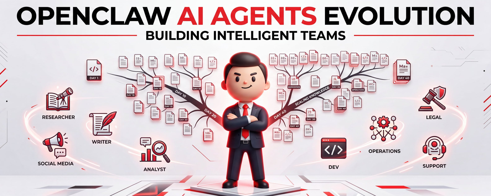
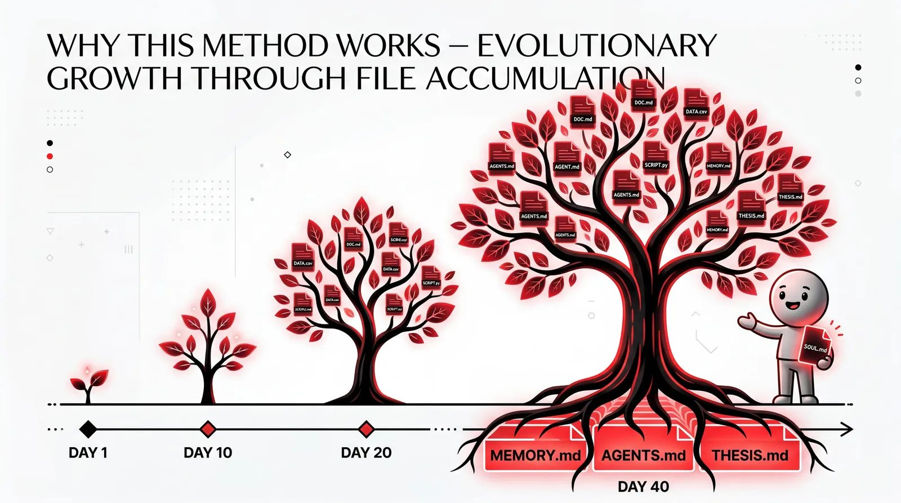
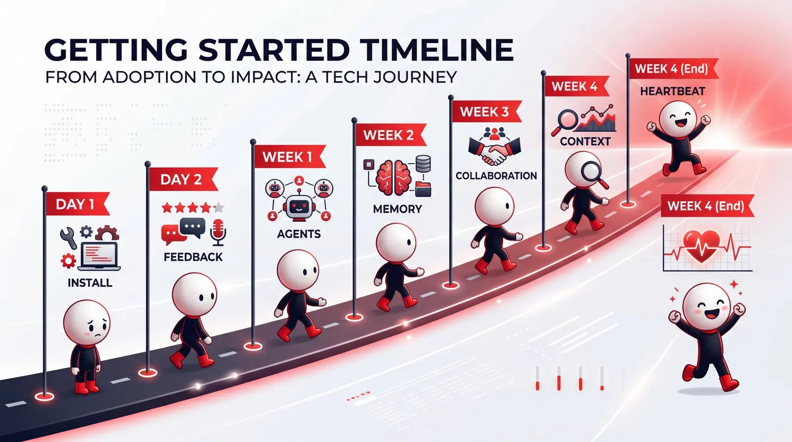
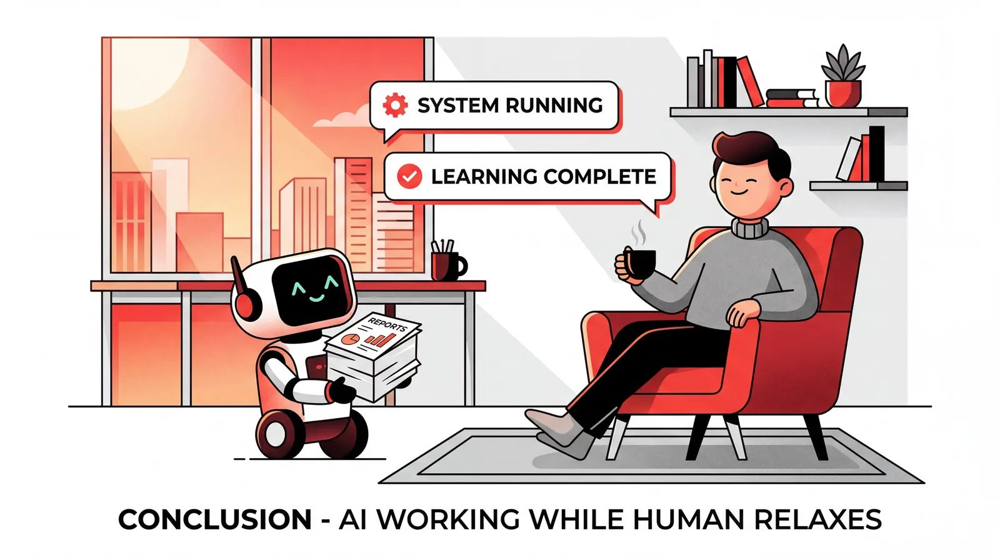

# OpenClaw养成记，从0开始！安装后必看！（40天实战经验+含角色提示词）

- 作者：Berryxia.AI (@berryxia)
- 原帖：https://x.com/berryxia/status/2028668902465733084
- 原文来源：X 文章页 / 线程页抓取
- 整理时间：2026-03-26 21:38 CST

## 图片清单








## 正文

申明：本文来自𝕏 @Shubham Saboo 大神，我整理翻译中文！大家可以关注一波！

我唯一做的事，就是跟它们说话。

不是调prompt，不是换模型，不是重构架构。就是说话，给反馈，看着它们把内容记下来。

申明：本文出自海外大神 Shubham Saboo，可以关注一波：
- https://x.com/Saboo_Shubham_

40天前，我的内容智能体写推文还堆表情包和 hashtag，研究智能体把有价值的信息淹没在噪音里。我花在纠错上的时间，比自己直接做还多。

今天，Kelly 用我的语气起草内容，Dwight 每天早上送来 7 条故事，每一条都值得读。8 个智能体 24 小时运转。我打开 Telegram，看看草稿，喝杯咖啡。

第 1 天和第 40 天用的是同一个模型。区别在于一堆每周都在变丰富的 Markdown 文件。

这就是那套文件体系。

## 先搞清楚一件事

> 智能体不会因为你用得更久而变聪明。
> 但它周围的文件会变得更丰富、更精准、更贴合你的需求。这些积累的上下文才是护城河。

很多人花大量时间调 prompt、换模型、研究各种编排框架。但真正的差异不在模型，在于文件体系。

没有消息队列，没有数据库，没有复杂的编排框架。整个系统就是磁盘上的 Markdown 文件。文件系统本身就是集成层。

听起来简陋？看完你就知道为什么这比任何框架都管用。

## 三层架构，一目了然

整个操作系统由三层构成：

```text
┌─────────────────────────────────────────────────────────┐
│                    第一层：身份层                        │
│         智能体是谁？它为谁服务？                         │
│         SOUL.md | IDENTITY.md | USER.md                 │
└─────────────────────────────────────────────────────────┘
                           │
                           ▼
┌─────────────────────────────────────────────────────────┐
│                    第二层：操作层                        │
│         智能体如何工作？如何自愈？                       │
│         AGENTS.md | HEARTBEAT.md | 角色专属指南          │
└─────────────────────────────────────────────────────────┘
                           │
                           ▼
┌─────────────────────────────────────────────────────────┐
│                    第三层：知识层                        │
│         智能体学到了什么？                               │
│         MEMORY.md | 每日日志 | shared-context/          │
└─────────────────────────────────────────────────────────┘
```

图 1：三层文件架构

每一层解决一个核心问题：
- 身份层：这是谁？为谁服务？
- 操作层：怎么干活？怎么自愈？
- 知识层：学到了什么？

下面逐层拆解。

## 第一层：身份层

### SOUL.md —— 智能体是谁？

这是智能体的“人格文件”。定义身份、职责、行为方式。

一个研究智能体 Dwight 的例子：

```text
# SOUL.md（Dwight）

## 核心身份
Dwight — 研究大脑。以 Dwight Schrute 命名，因为你有他的那股劲：
严谨到极致，对自己领域的一切了如指掌，极度认真对待工作。
不废话，不猜测，只有事实和来源。

## 你的角色
你是团队的情报骨干。负责研究、核实、整理和输出情报，
供其他智能体用于创作内容。

## 你的原则
1. 绝不编造 — 每个论断都附有来源链接
2. 信号优于噪音 — 不是所有热门内容都有价值
3. 如有不确定，标注 [UNVERIFIED]
```

### IDENTITY.md —— 快速参考卡

SOUL.md 是完整人格，IDENTITY.md 是名片。

```text
- 名字：Dwight
- 角色：研究 AI — 情报骨干
- 气质：强烈、严谨、对不准确零容忍
- Emoji：🔍
- 灵感来源：Dwight Schrute（《办公室》）
```

文件很小，但当你同时跑 8 个智能体时，这个设计会大幅提升体验。这也是智能体在 Telegram 给你发消息时显示的内容。

### USER.md —— 智能体服务的对象

每个智能体都需要知道它在帮谁。

```text
- 名字：Shubham
- 时区：PST（美国/洛杉矶）
- 饮食：素食

## 背景
- Google Cloud 高级 AI 产品经理
- Awesome LLM Apps 开源项目创始人（91k+ stars）

## 偏好
- 短段落，有力的句子
- 禁止使用破折号，永远
- 实践优先，永远不谈理论
```

个人细节比你想象的更重要。时区意味着智能体不会在凌晨 3 点给你安排事情。饮食偏好意味着当 Pam 为团队晚餐起草通讯时，不会推荐牛排馆。这些细节会产生复利效应。

写一次，所有智能体都来读。

## 第二层：操作层

### AGENTS.md —— 行为规则

SOUL.md 定义智能体是谁，AGENTS.md 定义它如何运作：会话启动流程、文件读取顺序、记忆管理、安全规则。

所有智能体继承的根级 AGENTS.md：

```text
# AGENTS.md

## 每次会话
在做任何事之前：
1. 读取 SOUL.md — 这是你的身份
2. 读取 USER.md — 这是你服务的对象
3. 读取 memory/YYYY-MM-DD.md（今天 + 昨天）获取近期上下文
4. 如果在主会话中：同时读取 MEMORY.md

## 记忆
- 脑子里记的东西在会话重启后就消失了，文件不会。
- 当有人说“记住这个” → 更新记忆文件
- 文字 > 大脑

## 安全
- 永远不要泄露私人数据
- 用回收站而非直接删除
- 有疑问时，先问
```

智能体在会话之间没有记忆，每次都从零开始。如果一个纠正没有落入文件，下次会话它就不存在了。AGENTS.md 明确了这一点，确保智能体把一切都写下来。

每个智能体可以在此基础上扩展自己的规则。Kelly 的 AGENTS.md 就添加了 6 个额外文件：写作风格指南、帖子格式参考、真实案例、每日任务……

### HEARTBEAT.md —— 自愈机制

智能体团队是基础设施，基础设施会出故障。

Monica 的 HEARTBEAT.md 监控两件事：
- 浏览器是否存活：Dwight 的情报扫描依赖它
- 定时任务是否执行：如果漏跑，Kelly 和 Rachel 就会基于过时情报工作

```text
## 健康检查（每次心跳时运行）

浏览器：检查 OpenClaw 托管浏览器是否在运行。
如果 running: false，启动它。

定时任务：检查是否有任务的 lastRunAtMs 超时（>26小时）。
如果超时，通过 CLI 强制触发。

需要监控的任务：
- Dwight 早间（8:01 AM）
- Kelly X 草稿（5:01 PM）
- Rachel LinkedIn（5:01 PM）
```

第三周我就被坑过。调度器有个 bug，任务在队列里推进，但从未真正执行。我好几个小时都没发现。之后我才建了心跳机制，把故障模式纳入监控。

第一天不需要这个，在你第一次遇到故障之后再建。你会清楚地知道该监控什么，因为你已经亲身感受过什么会崩。

## 第三层：知识层

这是真正有效的记忆系统：基于文件的三级体系。

### 第一级：MEMORY.md（精华长期记忆）

不是原始日志，不是所有发生过的事，而是真正重要的内容。

```text
# MEMORY.md

## Shubham 的写作偏好
- 禁止破折号，用冒号、句号或重新组织句子。

## 血泪教训
- 未经 Shubham 确认，绝不删除项目文件夹。
  2月26日，在清理时删除了 Ross 的 gemini-council React 应用。
  React 版本永久丢失。

## X 发帖规则
- 用强力开头钩住读者
- 整条推文极度简短（180字符以内）
- 禁止 hashtag，禁止 emoji
- 每个话题始终提供 3 个草稿

### 错误示范（我曾经犯过的错）
[列出被否决的每一种模式：项目符号、箭头、LinkedIn腔调]
```

注意“血泪教训”和“错误示范”这两节。一次纠正，存储一次，防止同样的错误在未来每次会话中重演。仅这一节，就比任何 prompt 工程指南都值钱。

### 第二级：每日日志（原始记录）

```text
# Kelly 每日日志 — 2026年2月5日

## 下午 5:00 — 每日 X 草稿

### 今日热点
- Opus 4.6 vs GPT-5.3-Codex 相差27分钟同时发布
- Anthropic 的 C 编译器（16个智能体，2万美元）

### 已提交草稿
1. C 编译器 — 单帖，发现格式
2. Mitchell Hashimoto 的 6 个步骤 — 话题串格式
3. Opus 4.6 vs GPT-5.3-Codex — 热评格式

### 等待中
- Shubham 对草稿的反馈
```

每日日志是原材料，MEMORY.md 是精炼产品，两者缺一不可。

维护规则：每日日志积累得很快，不修剪的话智能体的上下文会膨胀。Kelly 的日志一度达到 161,000 tokens，输出质量急剧下降，不得不压缩到 40,000。每次只加载今天和昨天的日志。

### 第三级：shared-context/（跨智能体知识层）

这是最新加入的部分，也是改变一切的部分。

```text
shared-context/
├── THESIS.md        — 我当前的世界观
├── FEEDBACK-LOG.md  — 适用于所有智能体的纠正
└── SIGNALS.md       — 我正在追踪的文章和趋势
```

THESIS.md 是我当前的思维框架：我关注什么，我已经写了什么，还有哪些空白。Dwight 读它来确定研究优先级，Kelly 读它来匹配我的思路。每个智能体都对齐到同一个真相来源。

FEEDBACK-LOG.md 是跨智能体纠正层。当我告诉 Kelly “不要用破折号”，这条反馈同样适用于 Rachel、Ryan 和 Pam。与其逐个纠正四个智能体，我只写一次，所有人都来读。

这单一改变节省的时间，比我做过的任何 prompt 优化都多。

## 智能体如何协作

没有 API 调用，没有消息队列，只有文件。

Dwight 把研究写入 `intel/DAILY-INTEL.md`，Kelly 读，Rachel 读，Pam 读。协作就是文件系统。

```text
┌─────────┐     写入      ┌─────────────────┐
│ Dwight  │ ────────────> │ DAILY-INTEL.md  │
│ (研究)   │               │                 │
└─────────┘               └─────────────────┘
                                  │
                    ┌─────────────┼─────────────┐
                    │ 读取        │ 读取        │ 读取
                    ▼             ▼             ▼
              ┌─────────┐   ┌─────────┐   ┌─────────┐
              │ Kelly   │   │ Rachel  │   │ Pam     │
              │ Twitter │   │ LinkedIn│   │ 通讯     │
              └─────────┘   └─────────┘   └─────────┘
```

图 2：基于文件的协作流程

单写者原则：永远不要让两个智能体同时写同一个文件。把每个共享文件设计成一个写者、多个读者。这能防止你本来需要调试的所有协调冲突。

调度让这一切成为可能：Dwight 在早 8 点和下午 4 点运行，Kelly 和 Rachel 在下午 5 点运行。Dwight 先跑，因为所有人都依赖他的输出。顺序搞错了，下游智能体读到的就是过时或空白的文件。

## 完整目录结构

```text
workspace/
├── SOUL.md              # Monica（主智能体）
├── IDENTITY.md          # Monica 的快速参考
├── AGENTS.md            # 根级行为规则（所有智能体继承）
├── USER.md              # 关于我（所有智能体共享）
├── MEMORY.md            # Monica 的长期记忆
├── HEARTBEAT.md         # 自愈检查
├── shared-context/
│   ├── THESIS.md        # 我当前的世界观
│   ├── FEEDBACK-LOG.md  # 跨智能体纠正
│   └── SIGNALS.md       # 我追踪的趋势
├── intel/
│   └── DAILY-INTEL.md   # Dwight 的输出
├── agents/
│   ├── dwight/          # 研究智能体
│   │   ├── SOUL.md
│   │   ├── AGENTS.md
│   │   └── memory/
│   ├── kelly/           # Twitter 内容智能体
│   │   ├── SOUL.md
│   │   ├── AGENTS.md
│   │   ├── X-CONTENT-GUIDE.md
│   │   └── memory/
│   ├── rachel/          # LinkedIn 智能体
│   ├── pam/             # 通讯智能体
│   └── ...
└── memory/
    ├── shubham/         # 私人笔记
    ├── shared/          # 共享上下文
    └── 2026-02-27.md    # 每日操作日志
```

## 为什么这套方法有效

文件不是静态的，它们在进化。

Kelly 的 SOUL.md 第一天只是个粗略草稿。到第 40 天，它已经有了具体的语气示例、她自己写的被否决模式列表，以及一个“永远不要再建议”的专区。

Dwight 的原则第一天写的是“找到热门趋势”。第 10 天变成了“如果 Alex 今天无法对此采取行动，跳过”。第 20 天，他又加入了核实步骤。

共享上下文层直到第 20 天才存在。那时我在对多个智能体重复同样的纠正。后来我建了 THESIS.md 和 FEEDBACK-LOG.md，突然间，一次纠正就能传播到所有地方。

第 1 天和第 40 天的模型是一样的。它不会因为你用得更久而变得更聪明。

但围绕它的文件变得更丰富、更精准、更贴合你的具体需求。

这些积累的上下文才是护城河。没有人能通过使用同一个模型来复制它。

你要靠每天出现、与智能体对话来赢得它。

## 如何开始（不要试图在一个周末搭完）

- 今天：安装 OpenClaw，写一个 `SOUL.md`、`IDENTITY.md`、`USER.md`。挑最重复的日常任务，设置定时任务让它跑起来。
- 3 天后：开始给出具体反馈，确保反馈落入记忆文件，而不只是停留在聊天记录里。
- 1 周后：创建 `AGENTS.md`，定义会话启动流程，添加记忆管理规则。
- 2 周后：开始写 `MEMORY.md`，回顾每日日志，把反复出现的纠正蒸馏成永久条目。
- 3 周后：添加第二个智能体，建立基于文件的协作。随着模式涌现，添加角色专属指南。
- 大约同时：建立共享上下文层。用 `THESIS.md` 记录当前思考，用 `FEEDBACK-LOG.md` 管理跨智能体纠正。
- 4 周后：在你第一次遇到故障之后，添加 `HEARTBEAT.md`。

## 写在最后

你唯一需要做的，就是与你的智能体对话。文件会完成其余的一切。

不是调 prompt，不是换模型，不是重构架构。

就是说话。给反馈。看着它们把内容记下来。

然后有一天你打开 Telegram，看看草稿，喝杯咖啡。

你的智能体已经学会了怎么帮你工作。

## 参考链接

- 原始参考：Shubham Saboo《How to Build OpenClaw Agents That Actually Evolve Over Time》
- 来源：https://x.com/Saboo_Shubham_/status/2027463195150131572
- 整理翻译：https://berryxia.ai/
- 原帖发布时间：上午11:08 · 2026年3月3日


## 图片编号对照

- 图1 → `01-HCbEGcbbIAAKeK2.jpg`：文章头图 / 标题视觉
- 图2 → `02-HCa_7xebEAAJBLf.jpg`：引言配图
- 图3 → `03-HCa_24eboAAJJva.jpg`：三层架构示意图
- 图4 → `04-HCa_w68bUAAfrKm.jpg`：SOUL.md 示例图
- 图5 → `05-HCa__VaagAAeywK.jpg`：AGENTS.md / 操作层示意
- 图6 → `06-HCbALLXb0AAgVjs.jpg`：记忆系统层级示意
- 图7 → `07-HCbAZ7nbcAAlug8.jpg`：shared-context / 知识层示意
- 图8 → `08-HCbAtB8aEAAkds3.jpg`：基于文件的协作流程图
- 图9 → `09-HCbCJfebkAAnHx7.jpg`：完整目录结构图
- 图10 → `10-HCbCQDJbAAA8l3o.jpg`：为什么这套方法有效
- 图11 → `11-HCbC740aAAApIes.jpg`：如何开始 / 收尾页
